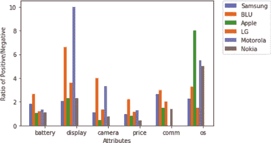

# 排版后的内容

将`series`作为一组`X`值，并递增`X`值列表，以便下一组值稍微远离上一组。你有六个属性，因此循环运行六次。

每个列表对应一个品牌，因此标签就是该品牌的标签。参见清单 3-64。

***清单 3-64.***

```python
import matplotlib.pyplot as plt
import numpy as np

X = np.arange(6)

for i in range(6):
    plt.bar(X, list_all[i], width = 0.09, label=brand_list[i])

plt.xticks(X, cols)
X = X + 0.09
plt.ylabel('Ratio of Positive/Negative')
plt.xlabel('Attributes')
plt.legend(bbox_to_anchor=(1.05, 1), loc='upper left', borderaxespad=0.)
plt.show()
```

图 3-23 展示了相同的图表。



第 3 章 在线评论中的自然语言处理

***图 3-23.***

总结来说，到目前为止，你已经深入探讨了三种情感分析方法：词典法、基于词典的规则法以及机器学习分析法。类似的技术也可用于情绪或主观性/客观性检测。你还了解了一种属性分析算法。如果你有一个经过适当训练、将不同词语标记为属性的语料库，你可以使用监督学习进行属性分析。一旦你将句子标记为极性、情绪和属性，你就可以通过按不同维度对数据进行切片和切块来获得更多洞察。

表 3-7 列出了第 3 章中使用的包。

***表 3-7.** 第 3 章中使用的包*

| **包名** | **版本** |
| --- | --- |
| `azure-cognitiveservices-nspkg` | 3.0.1 |
| `azure-cognitiveservices-search-nspkg` | 3.0.1 |
| `azure-cognitiveservices-search-websearch` | 1.0.0 |
| `azure-common` | 1.1.24 |
| `azure-nspkg` | 3.0.2 |
| `backcall` | 0.1.0 |
| `backports-abc` | 0.5 |
| `backports.shutil-get-terminal-size` | 1.0.0 |
| ( *续* ) | |
| ***表 3-7.*** ( *续* ) | |
| **包名** | **版本** |
| `beautifulsoup4` | 4.8.1 |
| `bs4` | 0.0.1 |
| `certifi` | 2019.11.28 |
| `chardet` | 3.0.4 |
| `colorama` | 0.4.3 |
| `decorator` | 4.4.1d |
| `Distance` | 0.1.3 |
| `enum34` | 1.1.6 |
| `futures` | 3.3.0 |
| `idna` | 2.8 |
| `ipykernel` | 4.10.0 |
| `ipython` | 5.8.0 |
| `ipython-genutils` | 0.2.0 |
| `isodate` | 0.6.0 |
| `jedi` | 0.13.3 |
| `jupyter-client` | 5.3.4 |
| `jupyter-core` | 4.6.1 |
| `msrest` | 0.6.10 |
| `nltk` | 3.4.3 |
| `numpy` | 1.16.6 |
| `oauthlib` | 3.1.0 |
| `pandas` | 0.24.2 |
| `parso` | 0.4.0 |
| `pathlib2` | 2.3.5 |
| `pickleshare` | 0.7.5 |
| ( *续* ) | |
| ***表 3-7.*** ( *续* ) | |
| **包名** | **版本** |
| `pip` | 19.3.1 |
| `prompt-toolkit` | 1.0.15 |
| `pybind11` | 2.4.3 |
| `pydot-ng` | 1.0.1.dev0p |
| `pygments` | 2.4.2 |
| `pyparsing` | 2.4.6 |
| `python-dateutil` | 2.8.1 |
| `pywin32` | |
| `pyzmq` | 18.1.0 |
| `requests` | 2.22.0 |
| `requests-oauthlib` | 1.3.0 |
| `scandir` | 1.10.0 |
| `setuptools` | 44.0.0.post20200106 |
| `simplegeneric` | 0.8.1 |
| `singledispatch` | 3.4.0.3 |
| `six` | 1.13.0 |
| `sklearn` | |
| `soupsieve` | 1.9.5 |
| `speechrecognition` | 3.8.1 |
| `tornado` | 5.1.1 |
| `traitlets` | 4.3.3 |
| `urllib3` | 1.25.7 |
| `wcwidth` | 0.1.8 |
| `wheel` | 0.33.6 |
| `win-unicode-console` | 0.5 |
| `wincertstore` | 0.2 |

## 第 4 章 自然语言处理在银行、金融服务和保险业中的应用

银行和金融行业做出数据驱动决策已有一个多世纪的历史。由于一个错误的决策可能给金融机构带来沉重代价，因此它们是大数据的早期采用者之一。银行、金融服务和保险业中的许多机器学习用例一直使用结构化数据，如交易历史或客户关系管理历史。然而，在过去几年中，使用文本数据来主流化承保以及风险或欺诈检测的趋势日益增长。

## 自然语言处理在欺诈中的应用

银行业（尤其是商业贷款）面临的挑战之一是了解组织的风险。当实体的交易历史不可用或不足时，金融机构可以查看公开数据（如新闻或在线博客）来了解任何提及这些实体的信息。有些公司向贷款机构提供此类数据。我们的第一个问题是找出新闻语料库中提及的实体，然后了解它们是以正面还是负面的方式被提及。


