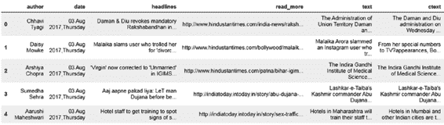
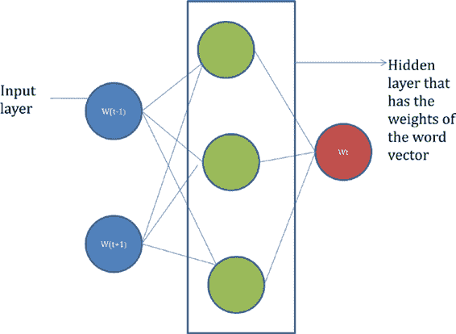
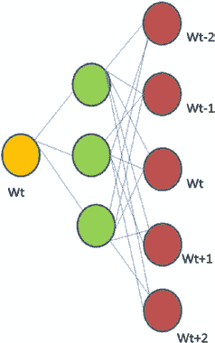
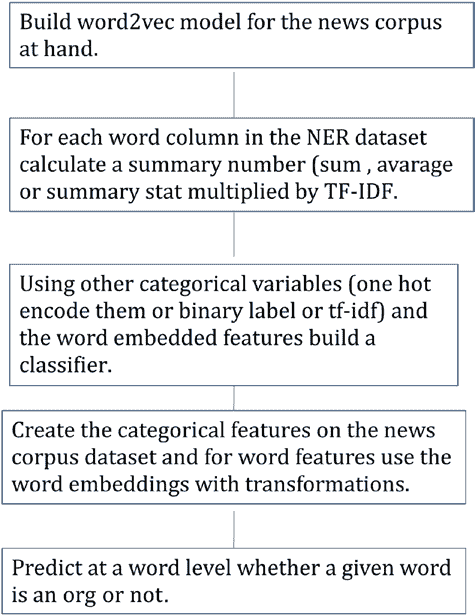
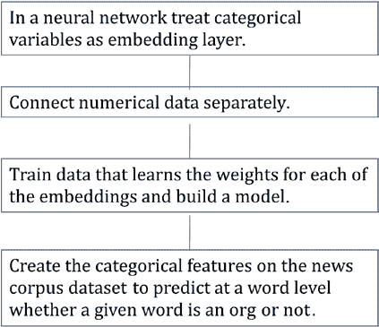
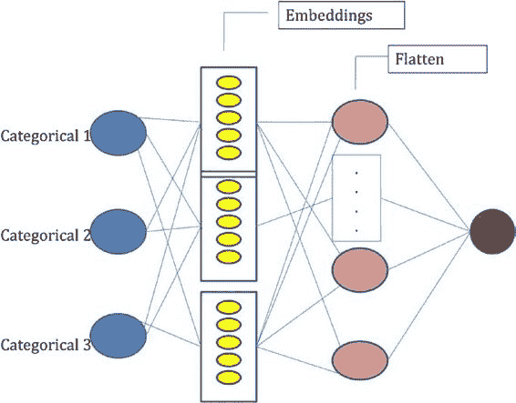
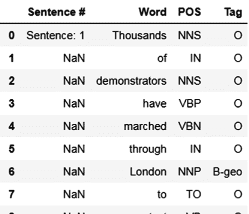
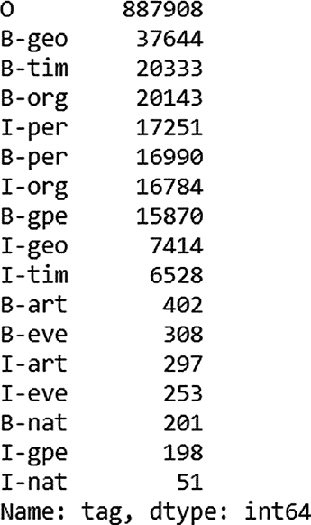

# 第 4 章 银行业、金融服务与保险业（BFSI）中的自然语言处理

在本练习中，你将使用来自 Kaggle 的数据集（[www.kaggle.com/sunnysai12345/news-summary](http://www.kaggle.com/sunnysai12345/news-summary)）。该数据集中的新闻文章是从多家报纸抓取而来，而新闻摘要则来自移动应用公司 InShorts。你的目标是识别文中提及的公司名称及其相关情感。请参见代码清单 4-1 和图 4-1。请注意，本章使用的所有软件包均列于表 4-6 中。

© Mathangi Sri 2021  
M. Sri, *基于 Python 的实用自然语言处理*, [`doi.org/10.1007/978-1-4842-6246-7_4`](https://doi.org/10.1007/978-1-4842-6246-7_4#DOI)



***代码清单 4-1.*** 导入示例数据集

```
import pandas as pd
import nltk

t1 = pd.read_csv("news_summary.csv", encoding="latin1")
t1.head()
```

***图 4-1.*** 来自 Kaggle 的示例数据集

此处重要的列包括 `headlines`（标题）、`text`（摘要）和 `ctext`（全文）。你将尝试从这三个列中提取组织名称。为此，你需要将所有列合并为一个列。请参见代码清单 4-2。

***代码清单 4-2.*** 合并列

```
t1["imp_col"] = t1["headlines"] + " " + t1["text"] + " " + t1["ctext"]
```

你需要提取给定文本中的命名实体。回顾上一章，命名实体是指文本语料中提及的任何人物、地点、组织等。在本例中，你感兴趣的是从文本语料中提取组织名称。

## 方法一：使用现有库

你可以使用现有库来提取命名实体。代码清单 4-3 展示了使用 NLTK 库提取命名实体的示例。

***代码清单 4-3.*** NLTK 库

### 命名实体识别示例

```
sent = "I work at Apple and before I used to work at Walmart"
tkn = nltk.word_tokenize(sent)
ne_tree = nltk.ne_chunk(nltk.pos_tag(tkn))
print(ne_tree)
```

```
(S
  I/PRP
  work/VBP
  at/IN
  (ORGANIZATION Apple/NNP)
  and/CC
  before/IN
  I/PRP
  used/VBD
  to/TO
  work/VB
  at/IN
  (ORGANIZATION Walmart/NNP))
```

你可以将该库应用于一个句子样本，检查其效率以及是否能捕获所有名称。返回的命名实体树由函数 `get_chunk` 解析。你需要检索所有标记为“organization”的词语。请参见代码清单 4-4 和 4-5。

***代码清单 4-4.***

```
samp_sents = t1.loc[0:10, "imp_col"]

def get_chunk(ne_tree):
    org_list = []
    for chunk in ne_tree:
        if hasattr(chunk, 'label'):
            str1 = chunk.label()
            if(str1.find("ORG") >= 0):
                str2 = ' '.join(c[0] for c in chunk)
                org_list.append(str2)
    return org_list
```

***代码清单 4-5.***

```
org_list_all = []
for i in samp_sents:
    tkn = nltk.word_tokenize(i)
    ne_tree = nltk.ne_chunk(nltk.pos_tag(tkn))
    org_list = get_chunk(ne_tree)
    org_list_all.append(org_list)

org_list_all
```

让我们检查 `org_list_all`，看看组织名称是否被捕获。代码清单 4-6 展示了一个示例。

***代码清单 4-6.***

```
[['Diu',
  'Administration of Union',
  'Daman',
  'Daman',
  'UT',
  'Diu',
  'Gujarat',
  'BJP',
  'Centre',
  'RSS',
  'RSS'],
 ['Hindi', 'Munni Badnam'],
 ['IGIMS',
  'Indira Gandhi Institute',
  'Medical Sciences',
  'IGIMS',
  'Marital',
  'Indira Gandhi Institute',
  'Medical Sciences',
  'IGIMS',
  'All India Institute',
  'Medical Sciences',
  'HT Photo']]
```

如你所见，NLTK 在从新闻语料中检索组织名称方面表现尚可。

## 方法二：提取名词短语

另一种检索组织名称的方法是从语料中提取名词短语。


组织或任何其他“命名实体”都是名词或名词短语。你会看到比上一个示例中多得多的名称，因为并非所有名词都是组织名称。你将在练习中使用一个名为 `Spacy` 的库。[`spacy.io/`](https://spacy.io/) 是一个开源的自然语言工具包。`Spacy` 可以帮助完成许多自然语言处理功能，包括词性标注和命名实体识别。你将深入探究 `Spacy` 的词性功能。词性解析是一种将句子分解为其语法成分和底层结构的技术。让我们看一个使用 `Spacy` 提取词性的小例子。你可以通过 `pip install` 来安装 `Spacy`。参见清单 4-7。

**清单 4-7.** 安装 `Spacy`

```
!pip install spacy
```

你需要 `Spacy` 的模型来执行自然语言处理任务。你可以使用清单 4-8 中的代码下载 `en_core_web_sm` 库。有关 `Spacy` 英文模型的更多详细信息，请访问 [`spacy.io/models/en`](https://spacy.io/models/en)。另请参见清单 4-9。

**清单 4-8.** 下载库

```
!python -m spacy download en_core_web_sm
```

**清单 4-9.** 导入 `Spacy`

```
import spacy

nlp = spacy.load("en_core_web_sm")
doc = nlp("This is to explain parts of speech in Spacy")
for i in doc:
    print (i,i.pos_)
```

```
This DET
is VERB
to PART
explain VERB
parts NOUN
of ADP
speech NOUN
in ADP
Spacy PROPN
```

每个单词都会被分配一个词性标签。示例词性标签及其含义列于 [`spacy.io/api/annotation`](https://spacy.io/api/annotation)。例如，`DET` 是限定词，指代 *a*、*an* 或 *the*。`ADP` 是介词性短语，可以指代 *to*、*in*、*during* 等。就当前目的而言，你对名词更感兴趣。让我们使用 `Spacy` 从示例句子中提取名词，并与之前方法 1 的结果进行比较。参见清单 4-10。

**清单 4-10.** 提取名词

```
np_all = []
for i in samp_sents:
    doc = nlp(i)
    for np in doc.noun_chunks:
        np_all.append(np)
np_all
```

```
Daman,
 Diu,
 mandatory Rakshabandhan,
 The Administration,
 Union Territory Daman,
 Diu,
 its order,
 it,
 women,
 rakhis,
 their male colleagues,
 the occasion,
```

清单 [4-10 的输出只是一个示例，你可以看到这里提取的单词比方法 1 多得多。现在，检查方法 1 是否遗漏了任何组织词汇的模式。比较方法 1 的 `org_list_all` 和 `np_all` 的输出。这可以为你提供一些关于方法 1 遗漏了哪些类型单词的线索。参见清单 4-11。

**清单 4-11.**

```
np_all_uq = set(np_all)
merged = set(merged)
np_all_uq - merged
```

```
{(DGCA,
 training,
 an alert,
 helidecks,
 The actor,
 The woman,
 Lucknow,
 Dujana,
 about a million small hotels,
 most cases,
 This extraordinary development,
 bachelors,
 the bond,
 forced labor,
 FSSAI,
```

一个观察结果是，方法 1 遗漏了像 `DGCA` 和 `FSSAI` 这样的缩写词。这些类型的缩写词可以被识别并附加到第一个输出中。在已知公司列表的情况下，你可以提取这些名称，并通过使用合适的“模糊”或“文本相似度”操作，将它们与手头的列表进行比较。

## 方法 3：训练你自己的模型

方法 1 和方法 2 基于使用预训练模型的库。另一种方法是训练你自己的模型来检测命名实体。命名实体模型背后的概念是，可以根据单词周围的单词以及单词本身来预测该单词的实体类型。我以


句子“I work at Apple and before I used to work at Walmart.”在这种情况下，数据结构类似于表 4-1 所示。

**表 4-1.** 数据结构

| **Word** | **prev_word** | **next_word** | **pos_tag** | **prev_pos_tag** | **next_pos_tag** | **Org** |
|----------|---------------|---------------|-------------|------------------|------------------|---------|
| i        | beg           | work          | prp         | beg              | prp              |         |
| work     | i             | at            | vBp         | prp              | vBp              |         |
| at       | work          | apple         | iN          | vBp              | iN               |         |
| apple    | at            | and           | NNp         | iN               | NNp              |         |
| and      | apple         | before        | CC          | NNp              | CC               |         |
| before   | and           | i             | iN          | CC               | iN               |         |
| i        | before        | used          | prp         | iN               | prp              |         |
| used     | i             | to            | vBd         | prp              | vBd              |         |
| to       | used          | work          | tO          | vBd              | tO               |         |
| work     | to            | at            | vB          | tO               | vB               |         |
| at       | work          | Walmart       | iN          | vB               | iN               |         |
| Walmart  | at            | end           | NNp         | iN               | end              |         |

最后一列`org`是手动标注的，用于指示该单词是否为组织名称。利用单词级特征，并将手动标注的数据作为期望输出，你可以自定义训练一个监督分类器。

在你的练习中，你将使用来自 Kaggle 的命名实体识别数据集。数据集的详细信息可在[www.kaggle.com/abhinavwalia95/entity-annotated-corpus](http://www.kaggle.com/abhinavwalia95/entity-annotated-corpus)找到。本质上，它是一个句子列表，被分解为单词级别，并在单词级别手动标注为组织、人物、时间、地缘政治实体等。表 4-2 展示了该数据集的一个样本。

**表 4-2.** 第 4 章 银行业、金融服务和保险（BFSI）中的自然语言处理

| **tag** | **word** | **next-word** | **next-shape** | **next-pos** | **next-next-word** | **next-next-shape** | **next-next-pos** | **next-next-lemma** | **next-lemma** | **lemma** |
|---------|----------|---------------|----------------|--------------|--------------------|---------------------|-------------------|----------------------|----------------|-----------|
| O       | thousands| of            | lo             | iN           | demonstra          | lo                  | NNS               | demonstr            | of             | thousand  |
| O       | of       | demonstra     | lo             | NNS          | ha                 | lo                  | vBp               | ha                  | demonstr       | of        |
| O       | demonstra| ha            | lo             | vBp          | marched            | lo                  | vBN               | march               | ha             | demonstr  |
| O       | ha       | marched       | lo             | vBN          | through            | lo                  | iN                | through             | march          | ha        |
| O       | marched  | through       | lo             | iN           | London             | ca                  | NN                | london              | through        | march     |
| B-geo   | through  | London        | ca             | NN           | to                 | lo                  | tO                | to                  | london         | through   |
| O       | London   | to            | lo             | tO           | protest            | lo                  | vB                | protest             | to             | london    |
| O       | to       | protest       | lo             | vB           | the                | lo                  | dt                | the                 | protest        | to        |
| O       | protest  | the           | lo             | dt           | war                | lo                  | NN                | war                 | the            | protest   |
| O       | the      | war           | lo             | NN           | in                 | lo                  | iN                | in                  | war            | the       |
| tors    | war      | in            | lo             | iN           |                    | lo                  |                   |                     | in             | war       |
| ve      | in       |               | lo             |              |                    | lo                  |                   |                     |                | in        |

并非所有列都显示，但你可以理解其概念。对于这种方法，你将使用监督分类器，因此需要处理高维的分类特征。你可以将所有单词级特征连接到一个单独的列中，并应用以一元分词（`unigram`）为参数的`tf-idf`向量化器。请注意，这些分类特征的顺序没有区别，因此你可以将特征集视为一个句子，其中序列无关紧要。

在这种建模方法中，命名实体识别器依赖于给定单词的显著性，而不会泛化单词的上下文。例如，在上述句子中，我们可以将单词“before”替换为“earlier”，而含义不会改变。见图 4-2。

“I work at Apple and **before** I used to work at Walmart”。

“I work at Apple and **earlier** I used to work at Walmart”。

**图 4-2.**

这种方法的另一个问题是数据集的稀疏性，因为词汇表中的单词可能达到数万甚至数百万。你需要一个密集向量来表示表中的单词特征。词嵌入可以帮助我们克服这些缺点，并在下一节中解释。

**词嵌入**

第 1 章中描述的词袋方法存在无法学习上下文的缺点。词嵌入是一种有助于学习上下文的技术，并将自然语言处理范式从句法方法转变为语义方法。考虑


## NLP 中的词嵌入

搜索引擎。当用户搜索，例如，家养动物时，他们期望得到关于猫、狗等的结果。请注意，这些词在词汇上并不相似，但它们绝对相关。词嵌入有助于将词语与其上下文关联起来。

## 第 4 章：NLP 在银行、金融服务和保险业中的应用

词嵌入背后的直觉是，你可以通过一个词周围的词来学习该词的上下文。例如，在图 4-3 中，所有高亮显示的词都出现在相似的学习上下文中。一个词周围的词赋予了它意义。因此，通过比较一个给定词周围的词，我们可以从大型语料库中得出该词的语义。

-   我喜欢**阅读**关于新技术的文章。
-   我喜欢**理解**新事物。
-   我喜欢**学习**科学。
-   她喜欢**学习**机器学习。

***图 4-3.** 词嵌入的例句*

大约在 2013 年，神经网络被用于学习词的嵌入。通过一种称为`word2vec`的技术，你可以将一个词表示为 N 维向量。一旦你将一个词表示为 N 维向量，你就可以计算这些维度的余弦相似度，以理解词之间的相似性。还有一些预训练的库可用于获取每个词的维度。让我们看一个来自`Spacy`的例子。参见代码清单 4-12。

***代码清单 4-12.** Spacy*

```
nlp = spacy.load("en_core_web_sm")
doc = nlp("This is to explain parts of speech in Spacy")
for i in doc:
    print(i.text, i.vector)
```

**This** `[-2.2498417 -3.3314195 -5.568074 3.67963 -4.612324 -0.48435217 0.27712554 -0.77937424 -0.8964542 -1.0418985 -0.7162781 2.076798 -3.6910486 2.2700787 -3.4369807 -1.8229328 0.1314069 0.22531027 5.15489 -0.49419683 1.0052757 -1.8017105 2.1641645 2.0517178 -2.1288662 3.7649343 -0.66652143 -2.9879086 0.05217028 4.8123035 4.051547 0.98279643 -2.6945567 -3.4998686 -1.7214956 -0.61138093 1.4845726 2.335553 -3.3347645 -0.62267256 -2.6027427 0.5974684 -4.0274143 3.0827138 -2.8701754 -2.8391452 6.236176 2.1810527 3.2634978 -3.845146 -1.7427144 1.1416728 -3.019658 -0.505347 -0.564788 0.8908412 -1.5224171 -0.8401189 -2.4254866 2.3174202 -4.468281 -2.662314 -0.29495603 3.1088934 -0.69663733 -1.3601663 3.0072615 -5.8090506 -1.2156953 -2.2680192 1.2263682 -2.620054 4.355402 1.1643956 1.2154089 1.1792964 -0.9964176 1.4115602 0.2106615 -3.0647554 -5.1766944 2.7233424 -0.36179888 -0.58938277 3.1080005 8.0415535 8.250744 -1.0494225 -2.9932828 2.1838582 3.6895149 1.9469192 -0.7207756 6.1474023 2.4041312 1.5213318]`

代码清单 4-12 中的输出是单词 *This* 的向量表示。`Spacy` 训练了一个 `word2vec` 模型，为每个词生成了 300 维的向量。词之间的相似性就是各自词向量维度之间的相似性。现在，我们以单词 *learn*、*read* 和 *understand* 为例。为了对比相似性，我们还将引入单词 *run* 的上下文向量。你将使用另一个 `Spacy` 模型 `en_core_web_md` 进行实验。首先，下载该模型，然后在脚本中使用它。参见代码清单 4-13 和 4-14。

***代码清单 4-13.** 下载 Spacy*

```
!python -m spacy download en_core_web_md
```

***代码清单 4-14.** 使用 Spacy*

```
import spacy

nlp = spacy.load("en_core_web_md")

doc1 = nlp(u'learn')
doc2 = nlp(u'read')
doc3 = nlp(u'understand')
doc4 = nlp(u'run')

for i in [doc1, doc2, doc3, doc4]:
    for j in [doc1, doc2, doc3, doc4]:
        if ((i.vector_norm > 0) & (j.vector_norm > 0)):
            print(i, j, i.has_vector, j.has_vector, i.similarity(j))
```

输出：
```
learn learn True True 1.0
learn read True True 0.47037032349231994
learn understand True True 0.7617364524642122
learn run True True 0.32249343409210124
read learn True True 0.47037032349231994
read read True True 1.0
read understand True True 0.5366261494062171
read run True True 0.2904269408366301
understand learn True True 0.7617364524642122
understand read True True 0.5366261494062171
understand understand True True 1.0
understand run True True 0.32817161669079264
run learn True True 0.32249343409210124
run read True True 0.2904269408366301
run understand True True 0.32817161669079264
run run True True 1.0
```

如你所见，*learn* 和 *understand* 之间的相似性远强于 *run* 和 *understand* 之间的相似性。

## Word2Vec

`Word2Vec` 是一种创建词嵌入的技术。在这里，你将窗口大小内的词作为“自变量”来预测目标词。对于句子“I like to read about technology”，其输入和输出数据如表 4-3 所示。

***表 4-3.***

| 输入 | 输出 |
|-------|--------|
| i | Like |
| Like | i |
| Like | to |
| to | Like |
| to | i |
| read | to |
| read | about |
| about | read |
| about | technology |
| technology | about |

训练一个浅层的单层 softmax 模型，隐藏层的权重矩阵提供了词的维度。关于如何训练 `word2vec` 的详细解释，请参见 [www.analyticsvidhya.com/blog/2017/06/word-embeddings-count-word2veec/](http://www.analyticsvidhya.com/blog/2017/06/word-embeddings-count-word2veec/)。`word2vec` 的架构如图 4-4 和图 4-5 所示。

### CBOW

在 CBOW 中，句子中的每个词都成为目标词。输入词是窗口大小内围绕它的词。下面的示例窗口大小为 2。CBOW 的架构如图 4-4 所示。



***图 4-4.***

`w(t-1)` 和 `w(t+1)` 是独热编码向量。每个向量的大小等于词汇表的大小。输出向量也是如此，其长度与词汇表相同。用绿色编码的中心层（隐藏层）包含权重矩阵。你可以对每个输入向量对应的权重矩阵进行平均或求和。

构建 `word2vec` 的另一种方法是将 CBOW 方法颠倒过来，得到跳字模型。在这里，你假设句子中的一个词应该能够预测其周围的词。表 4-4 提供了一个窗口大小为 2 的输入和输出表示示例。

***表 4-4.***

| 输入 | 输出词 _t-2 | 输出词 _t-1 | 输出词 _t+1 | 输出词 _t+2 |
|-------|-----------------|-----------------|-----------------|-----------------|
| i | like | to | | |
| like | i | to | read | |
| to | i | like | read | about |
| read | like | to | about | technology |
| about | to | read | technology | |
| technology | about | read | | |



相应的网络架构如图 4-5 所示。

***图 4-5.***

在这种情况下，隐藏层或词向量的维度是 3。因此，你输入句子中的一个词，并训练模型来预测句子周围的词。在图 4-5 中，


每个节点都是一个独热向量，当词汇量很大时，预测这个输出会非常庞大。为了解决这个问题，采用了一种称为负采样的技术。该方法不再将问题视为多类分类器，而是将输入词和上下文词作为输入，输出则是判断该词组合是否可能成立。这便将问题转化为了一个二分类器。除了可能的词组合外，还会从语料库中选取不可能的词组合，并将其标记为负样本集（共现词作为正样本集）。负样本集是从一个独立的概率分布中选取的。详细信息可参见 [`papers.nips.cc/paper/5021-distributed-representations-of-words-and-phrases-and-their-compositionality.pdf`](https://papers.nips.cc/paper/5021-distributed-representations-of-words-and-phrases-and-their-compositionality.pdf)。

你将使用新闻数据集的初始语料库 `t1`，并利用 `gensim` 库训练一个 `word2vec` 模型。在将 `gensim` 库应用于语料库之前，你需要对文档进行预处理。你需要从语料库中移除停用词，并对单词进行“词干提取”。词干提取是将单词还原为其词根形式的过程，从而可以将相似的单词归一化。你需要使用 `pip install` 安装 `gensim` 包。参见清单 4-15 和 4-16。

**清单 4-15.** 安装 `gensim`

```
!pip install gensim
```

**清单 4-16.** 使用 `gensim`

```
from gensim.parsing.porter import PorterStemmer
p = PorterStemmer()
p.stem_documents(["He was dining", "We dined yesterday"])
['he wa dine', 'we dine yesterdai']
```

在清单 4-16 的示例中，单词 *dining* 和 *dine* 被替换成了同一个单词 *dine*。这有助于将单词归一化到其词根。接下来继续你的预处理步骤。首先，使用 `pandas` 的字符串替换方法和 `stop_words` 库移除停用词。然后进行词干提取。在继续之前，你必须先使用 `pip install` 安装 `stop_words` 库。参见清单 4-17 和 4-18。

**清单 4-17.** 安装 `stop_words`

```
!pip install stop_words
```

**清单 4-18.**

```
import stop_words
eng_words = stop_words.get_stop_words('en')
for i in eng_words:
    if(len(i)>1):
        wrd_repl = r"\b" + i + r"\b"
        t1["h1_stop"] = t1["h1_stop"].str.replace(wrd_repl,"")
t1["h2_stop"] = pd.Series(p.stem_documents(t1["h1_stop"]))
```

`gensim` 中的 `Word2Vec` 接受列表的列表作为输入。你需要将标题列转换为列表的列表。最好使用 `ctext`，因为它包含庞大的词汇语料库，但这里我以标题列为例。参见清单 4-19。

**清单 4-19.**

```
sentences = list(t1["h2_stop"].str.split())
Sentences[0:10]
[['daman',
  '&',
  'diu',
  'revok',
  'mandatori',
  'rakshabandhan',
  'offic',
  'order'],
 ['malaika', 'slam', 'user', 'troll', "'divorc", 'rich', "man'"],
 ["'virgin'", 'now', 'correct', "'unmarried'", "igims'", 'form'],
 ['aaj', 'aapn', 'pakad', 'liya:', 'let', 'man', 'dujana', 'kill'],
```

现在，让我们构建 `word2vec` 的 `gensim` 模型。`size` 选项是你希望单词表示的维度数量。`min_count` 是单词应出现的最少文档数。`iter` 选项是神经网络的训练轮数。参见清单 4-20。

**清单 4-20.**

```
model = gensim.models.Word2Vec(iter=10,min_count=10,size=200)
model.build_vocab(sentences)
token_count = sum([len(sentence) for sentence in sentences])
model.train(sentences,total_examples = token_count,epochs = model.iter)
```


`model.wv.vocab`

```
{'offic': <gensim.models.keyedvectors.Vocab at 0xf745320>,
'order': <gensim.models.keyedvectors.Vocab at 0x1aab8780>,
'slam': <gensim.models.keyedvectors.Vocab at 0x1aab8e80>,
'user': <gensim.models.keyedvectors.Vocab at 0x1aab8a20>,
'now': <gensim.models.keyedvectors.Vocab at 0x1aaa80f0>,
'form': <gensim.models.keyedvectors.Vocab at 0x1aaa8320>,
'let': <gensim.models.keyedvectors.Vocab at 0x1aaa8908>,
'man': <gensim.models.keyedvectors.Vocab at 0x1325a160>,
'kill': <gensim.models.keyedvectors.Vocab at 0x15bd87f0>,
'hotel': <gensim.models.keyedvectors.Vocab at 0x5726198>,
'staff': <gensim.models.keyedvectors.Vocab at 0x5726f98>,
'get': <gensim.models.keyedvectors.Vocab at 0x13275518>,
'train': <gensim.models.keyedvectors.Vocab at 0x13275240>}
```

清单 4-20 示例中的每个单词都有一个 200 维的向量，并且分配了独立的空间来存储该单词的维度。清单 4-20 的输出显示了词汇表的一个样本。你可以快速检查模型是否在语义相似性方面表现良好。`gensim` 有一个名为 `most_similar` 的函数，它可以打印出给定单词最接近的单词。基本上，目标单词的 200 维向量会与语料库中所有其他单词进行比较，并按顺序打印出最相似的单词。参见清单 4-21。

**清单 4-21.**

```
model.most_similar('polic')
[('kill', 0.9998772144317627),
('cop', 0.9998742341995239),
('airport', 0.9998739957809448),
('arrest', 0.9998728036880493),
('new', 0.9998713731765747),
('cr', 0.9998686909675598),
('indian', 0.9998684525489807),
('govt', 0.9998669624328613),
('dai', 0.9998668432235718),
('us', 0.9998658895492554)]
```

对于词干化后的单词 `polic`，你可以看到 `cop`、`arrest` 和 `kill` 在语义上是相似的。通过使用完整的文本（而不是像你之前考虑的标题）可以进一步提高相似度。可以使用清单 4-22 中的代码检索该单词的词嵌入。

**清单 4-22.**

```
model["polic"]
array([ 0.04353377, -0.15353541, 0.01236599, 0.17542918, -0.02843889,
0.0871359 , -0.1178024 , -0.00746543, -0.03241869, 0.0475546 ,
0.04885347, -0.05488129, -0.08609696, 0.15661193, 0.1471964 ,
0.002795, 0.06438455, -0.12603344, 0.00585101, 0.10587147,
0.03390319, 0.35148793, -0.06524974, 0.07119066, 0.17404315,
0.02006942, -0.1783511 , 0.02980262, 0.26949257, -0.07674567,
```

清单 4-22 是单词 `polic` 的 200 维向量的一个样本。

## 其他 word2vec 库

另一个流行的 word2vec 库是 `fasttext`。这是由 Facebook 发布的一个库。主要区别在于，所考虑的输入向量是单词的一组 n-gram。

例如，`transform` 会被分解为 `tra`、`ran`、`ans` 等。这有助于 word2vec 模型为大多数单词提供向量表示，因为它们会被分解成 n-gram，然后重新组合其权重以给出最终输出。你将看到一个示例。

你将使用预处理后的列 `h1_stop` 的 `t1` 数据集示例。你将替换所有数字，并从该列中移除所有长度小于 3 的单词。参见清单 4-23。

**清单 4-23.**

```
t1["h1_stop"] = t1["h1_stop"].str.replace('[0-9]+','numbrepl')
t1["h1_stop"] = t1["h1_stop"].str.replace('[^a-z\s]+','')
list2=[]
for i in t1["h1_stop"]:
list1 = i.split()
str1 = ""
for j in list1:
if(len(j)>=3):
str1 = str1 + " " + j
list2.append(str1)
t1["h1_proc"] = list2
```

现在，你从 `h1_proc` 列中提取单词标记。你使用了 `word_punctuation_tokenizer` 来对单词进行分词。与 NLTK 的 `tokenize` 函数相比，标点分词器会将标点符号视为独立的标记。


Listing 4-24 至 4-26。

**Listing 4-24.**

`word_punctuation_tokenizer = nltk.WordPunctTokenizer()`

`word_tokenized_corpus = [word_punctuation_tokenizer.tokenize(sent) for sent in t1["h1_proc"]]`

**Listing 4-25.**

```python
from gensim.models.fasttext import FastText as FT_gen

model_ft = FT_gen(word_tokenized_corpus, size=100, window=5, min_count=10, sg=1, iter=100)
```

**Listing 4-26.**

```python
print(model_ft.wv['police'])
```

输出结果如下：

```
[-0.29888302 -0.57665455  0.08610394 -0.3632993  -0.11655446  0.77178127
  0.00754398  0.326833    0.6293257  -0.6018732   0.18104246  0.14998026
 -0.25582018 -0.10343572  0.26390004 -0.40456587 -0.13059254  0.7299065
  0.56476426 -0.34973195  0.2719949  -0.23201875 -0.5852624  -0.233576
  0.79868716  0.13634606  0.34833038  0.09759299  0.03199455  0.31180373
 -0.27072772 -0.18527883 -0.58960485  0.01390363  0.50662494  0.65151244
 -0.47332478  0.03739219  0.4098077   0.41875887 -0.4502848   0.41489652
  0.13763584  0.6388822  -0.7644631   0.02981189  0.7131902   0.13380833
 -0.3466939   0.5062037   0.01952425 -0.14834954 -0.29615352  0.11298565
  0.01239631  0.22170404  0.87028074  0.30836678  0.171935    0.06707167
  0.6141744   0.7583458   0.8327537  -0.9569695  -0.5542731  -1.0179517
 -0.5757873  -0.2523322  -0.64286023  0.5246012  -0.00269936 -0.11349581
 -0.34673667  0.13290115  0.3713985  -0.10439423 -0.2525865   0.1401525
 -0.39776105  0.43563667  0.50854915 -0.32810602  0.5654142  -0.60424364
  0.14617543 -0.03651292  0.01708415 -0.16520758 -0.89801085 -0.7447387
 -0.47594827  0.2536381  -0.5689429  -0.46556026  0.2765042  -0.35487294
  0.37178138 -0.12994497  0.17699395  0.79665047]
```

参数`window`表示训练时考虑的上下文窗口大小，`size`表示词向量的维度总数，`min_count`表示词语在分析中被考虑所需的最小文档数。现在，尝试获取一个不在初始词汇表中的词的向量。

以单词`administration`为例。参见 Listing 4-27。

**Listing 4-27.**

```python
print('administration' in model_ft.wv.vocab)
model_ft["administration"]
```

输出结果：

```
False
array([-0.45738608,  0.01635892,  0.4138502 , -0.39381024, -0.03351381,
        0.5652306 ,  0.15023482, -0.06436284, -0.30598623,  0.22672811,
       -0.0371761 ,  0.55359524, -0.30920455, -0.09809569,  0.3087636 ,
        0.14136946, -1.0166188 , -0.18632148,  0.54922   , -0.13646998,
       -0.26896936, -0.45346558, -0.01610097, -0.03324416, -0.5120829 ,
        0.29224998,  0.14098023, -0.29888844, -0.03517408, -0.44184253,
        0.00370641,  0.51012856, -0.6507577 , -0.5389353 ,  0.49002212,
        0.37082076, -0.45470816,  0.0273569 ,  0.15264036,  0.16321276,
       -0.15225472,  0.5453094 , -0.31627965, -0.37927952, -0.13029763,
        0.23256542,  0.6777767 , -0.09562921, -0.27754757,  0.45492762,
        0.21526024,  0.6568411 , -0.14619622,  0.9491824 ,  0.5132987 ,
        0.5608091 ,  0.3351915 , -0.19633797,  0.17734666, -1.2677175 ,
        0.70604306, -0.120744  ,  0.19599114, -0.06684009, -0.09474371,
       -0.06331848, -0.5224171 , -0.17912938, -0.9254168 , -0.44491112,
       -0.20046434,  0.39295596, -0.14251098,  0.01547457, -0.0033557 ])
```

如 Listing 4-27 所示，`administration`并不在初始词汇表中，但你仍然能够获取其向量，因为 FastText 可以在内部组合该词的三元组（trigrams）。

## 将词嵌入应用于监督学习

回到构建自定义 NER 分类器的起点，你需要一个稠密向量空间来表示表格中的单词，以便输入到算法中。在监督方法中使用词嵌入有两种方式。

### 方法 3 – 方法 1

你可以使用由 Gensim 生成的每个词的嵌入向量，并将其用于监督模型（词嵌入方法 1）。为了在你的模型中使用这个 200 维的向量，你可以将其作为 200 个特征列，或者对这个向量进行求和或聚合。


取平均值。另一种方法是将单词的 tf-idf 向量值与向量值的总和或平均值相乘。

### 方法 3 – 方法 2

由于你正在为监督学习问题（将给定单词分类为组织名称或非组织名称）生成嵌入，因此你可以更好地利用嵌入。你可以直接训练一个神经网络，并在训练过程中学习嵌入。你可以利用 `Keras` 在监督模型中作为一层来学习词嵌入（词嵌入方法 2）。`Keras` 是一个用 Python 编写的开源神经网络库（[`keras.io/`](https://keras.io/)）。图 4-6 和 4-7 解释了在监督模型中使用嵌入的两种方法。





**图 4-6.** 词嵌入方法 1

**图 4-7.** 使用词嵌入方法 2



如图 4-7 所述，对于使用方法 2 的词嵌入，为了训练一个用于命名实体识别的分类器，你需要查看一个包含词级标签的数据集。你将使用表 4-1 中的 Kaggle 数据集。训练完模型后，你将把该模型应用于你的新闻语料数据集。

`Keras` 的“嵌入层”将学习嵌入向量作为自身训练过程的一部分。与 `word2vec` 方法不同，这里没有窗口大小的概念。你首先需要标记你的分类特征，指定每个分类变量的嵌入大小，将其展平，然后连接到全连接层。网络的架构如图 4-8 所示。

**图 4-8.** 分类嵌入

这里的输入变量是一组分类变量。然后你有一个嵌入层，将分类值嵌入到 N 维空间中，接着将其展平并连接到一个全连接层，并将分类器视为经典的二元交叉熵模型。

现在你开始实现它。参见清单 4-28 和 4-29。



**清单 4-28.**

```python
import pandas as pd
from nltk.stem import WordNetLemmatizer
import numpy as np
import nltk
```

**清单 4-29.**

```python
t1 = pd.read_csv("ner.csv", encoding='latin1', error_bad_lines=False)
df_orig = pd.read_csv("ner_dataset.csv", encoding='latin1')
```

你将在此处使用 `df_orig` 数据集（之前在第 3 种方法中提到的 "https://www.kaggle.com/abhinavwalia95/entity-annotated-corpus"）。你在表 4-1 中看到的 `t1` 数据集已经包含了基于词性标注的预计算特征。然而，你不知道用于得出这些词性标注的方法。因此，你需要重新构建所有特征，以便将相同的方法应用于你的新闻语料数据集。`df_orig` 数据集包含词级标签和句子结束标记。你可以在清单 4-30 和图 4-9 中看到一个示例。

**清单 4-30.**

```python
df_orig.head(30)
```

**图 4-9.**



`Sentence #` 是句子标记，`Tag` 是人工标签。忽略 `POS` 标签，重建句子，并使用 `NLTK` 库来识别 `POS` 标签。这样做的目的是为了标准化训练数据和推理数据之间的方法。

一旦你获得句子并识别出 `POS` 标签，你就可以生成“前一个”和“后一个”特征。参见清单 4-31。

**清单 4-31.**

```python
##cleaning the columns names and filling missing values
```


```python
df_orig.columns = ["sentence_id","word","pos","tag"]
df_orig["sentence_id"] = df_orig["sentence_id"].fillna('none')
df_orig["tag"] = df_orig["tag"].fillna('none')
```

快速浏览一下标签分布情况，如代码清单 4-32 和图 4-10 所示。

***代码清单 4-32.***
```python
df_orig["tag"].value_counts()
```

***图 4-10.***

## 第 4 章 银行业、金融服务与保险业（BFSI）中的 NLP

`B` 和 `I` 分别表示起始或中间位置。你关注的是所有出现的 `org` 标签。代码清单 4-33 重构了 `df_orig` 中的句子，并获取了词级特征的词性标注。

***代码清单 4-33.***
```python
lemmatizer = WordNetLemmatizer()
list_sent = []
word_list = []
tag_list = []
for ind,row in df_orig[0:100000].iterrows():
    sid = row["sentence_id"]
    word = row["word"]
    tag = row["tag"]
    if((sid!="none") or (ind==0)):
        if(len(word_list)>0):
            list_sent.append(word_list)
        pos_tags_list = nltk.pos_tag(word_list)
        df = pd.DataFrame(pos_tags_list)
        df["id"] = sid_perm
        try:
            df["tag"] = tag_list
        except:
            print (tag_list,word_list,len(tag_list),len(word_list))
        if(sid_perm=="Sentence: 1"):
            df_all_pos = df
        else:
            df_all_pos = pd.concat([df_all_pos,df],axis=0)
        word_list = []
        tag_list = []
        word_list.append(word)
        tag_list.append(tag)
    else:
        word_list.append(word)
        tag_list.append(tag)
    if(sid!="none"):
        sid_perm = sid
df_all_pos.columns = ["word","pos_tag","sid","tag"]
```

`df_all` 是包含单词和词性标注的数据框。完成这一步后，你可以获取单词的词元、单词形状、长度等特征，这些特征不依赖于句子，仅与单词本身相关。

你还需要识别包含数字或特殊字符的单词。在替换特殊字符以进行进一步处理之前，可以将这些单词标记为单独的词类型。参见代码清单 4-34 和 4-35。

***代码清单 4-34.***
```python
df_all_pos["word1"] = df_all_pos["word"]
df_all_pos["word1"] = df_all_pos.word1.str.replace('[^a-z\s]+','')
df_all_pos["word_type"] = "normal"
df_all_pos.loc[df_all_pos.word.str.contains('[0-9]+'),"word_type"] = "number"
df_all_pos.loc[df_all_pos.word.str.contains('[^a-zA-Z\s]+'),"word_type"] = "special_chars"
df_all_pos.loc[(df_all_pos.word_type!="normal") & (df_all_pos.word1.str.len()==0),"word_type"] = "only_special"

def lemma_func(x):
    return lemmatizer.lemmatize(x)
```

***代码清单 4-35.***
```python
df_all_pos["shape"] = "mixed"
df_all_pos.loc[(df_all_pos.word.str.islower()==True),"shape"]="lower"
df_all_pos.loc[(df_all_pos.word.str.islower()==False),"shape"]="upper"
df_all_pos["lemma"] = df_all_pos["word"].apply(lemma_func)
df_all_pos["length"] = df_all_pos["word"].str.len()
```

## 第 4 章 银行业、金融服务与保险业（BFSI）中的 NLP

代码清单 4-36 中的代码获取了单词在句子中的相对位置以及句子长度。

***代码清单 4-36.***
```python
df_all_pos["ind_num"] = df_all_pos.index
df_all_pos["sent_len"]=df_all_pos.groupby(["sid"])["ind_num"].transform(max)
df_all_pos1 = df_all_pos[df_all_pos.sent_len>0]
df_all_pos1["rel_position"] = df_all_pos1["ind_num"] / df_all_pos1["sent_len"]*100
df_all_pos1["rel_position"] = df_all_pos1["rel_position"].astype('int')
```

一旦这些变量就位，你就可以使用 `pandas` 的 shift 功能来获取诸如前一个词、后一个词、前一个词的词性标注、后一个词的词性标注等特征。对于每个特征，你调用 `get_prev_next` 来获取移位后的特征。参见代码清单 4-37 和 4-38。

***代码清单 4-37.***
```python
def get_prev_next(df_all_pos,col_imp):
    prev_col = "prev_" + col_imp
    next_col = col_imp + "_next"
    prev_col1 = "prev_prev_" + col_imp
    next_col1 = col_imp + "_next_next"
    df_all_pos[prev_col] = df_all_pos[col_imp].shift(1)
    df_all_pos.loc[df_all_pos.index==0,prev_col] = "start"
```


```python
df_all_pos[next_col] = df_all_pos[col_imp].shift(-1)

df_all_pos.loc[df_all_pos.index==df_all_pos.sent_len,next_col] = "end"

df_all_pos[prev_col1] = df_all_pos[col_imp].shift(2)

df_all_pos.loc[df_all_pos.index<2,prev_col1] = "start"

df_all_pos[next_col1] = df_all_pos[col_imp].shift(-2)

df_all_pos.loc[(df_all_pos.sent_len-df_all_pos.index)<=1,next_col1] = "end"

return df_all_pos
```

