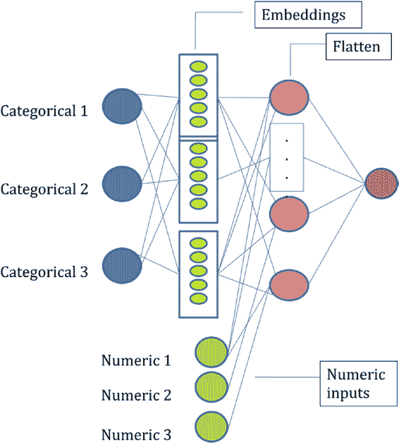

# 第 4 章 银行、金融服务和保险业中的自然语言处理

**代码清单 4-38.**

```python
df_all_pos1 = get_prev_next(df_all_pos1,"word")
df_all_pos1 = get_prev_next(df_all_pos1,"lemma")
df_all_pos1 = get_prev_next(df_all_pos1,"shape")
df_all_pos1 = get_prev_next(df_all_pos1,"pos_tag")
```

你关注的是单词是否属于组织。因此，你将除组织之外的所有标签重命名为 `no_org`。由于数据集中组织的数量非常有限（不到 3%），你将采样非组织词汇，并保留组织词汇。请参见代码清单 4-39 和 4-40。

**代码清单 4-39.**

```python
t2 = df_all_pos1[df_all_pos1.tag.isna()==False]
t2["tag1"] = "no_org"
t2.loc[t2.tag.str.contains('org',case=False),"tag1"]="org"
```

**代码清单 4-40.**

```python
t2_neg = t2.loc[t2.tag1!="org",:]
t2_neg1 = t2_neg.sample(frac=0.1)
t2_pos = t2.loc[t2.tag1=="org",:]
t3 = pd.concat([t2_neg1,t2_pos],axis=0)
t3 = t3.reset_index()
len(t2_neg),len(t2_neg1),len(t2_pos),len(t3)
# (96652, 9665, 3346, 13011)
```

代码清单 4-41 将数据拆分为训练集和测试集。

**代码清单 4-41.**

```python
tgt = t3["tag1"]
from sklearn.model_selection import StratifiedShuffleSplit
sss = StratifiedShuffleSplit(test_size=0.2,random_state=42,n_splits=1)
for train_index, test_index in sss.split(t3, tgt):
    x_train, x_test = t3[t3.index.isin(train_index)], t3[t3.index.isin(test_index)]
    y_train, y_test = t3.loc[t3.index.isin(train_index),"tag1"], t3.loc[t3.index.isin(test_index),"tag1"]
```



