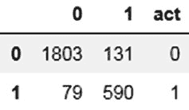
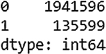
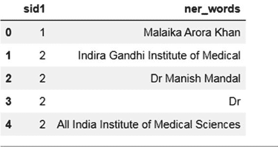
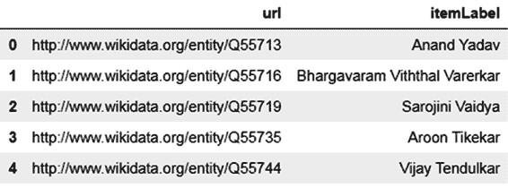
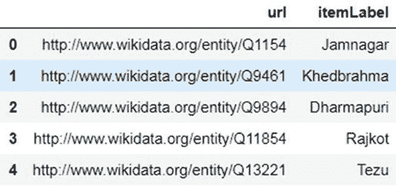
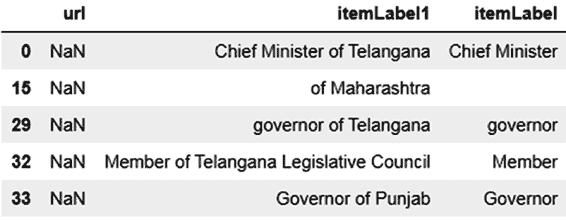
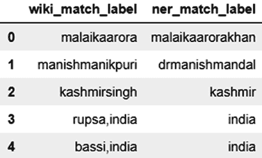
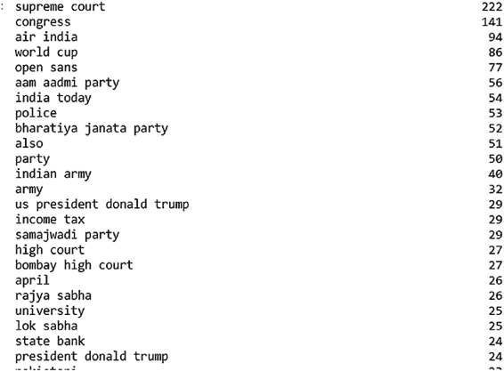
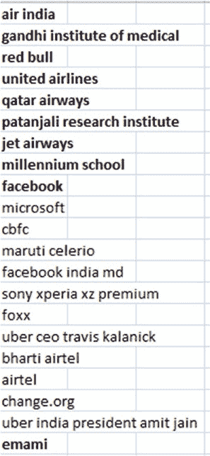
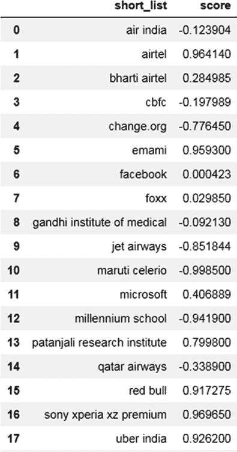

# 第 4 章 银行、金融服务和保险业中的自然语言处理

**代码清单 4-42.**

```python
num_cols = ['length','sent_len', 'rel_position']
str_cols = ['word', 'pos_tag', 'shape', 'lemma', 'word_type',
           'prev_word', 'word_next', 'prev_prev_word',
           'word_next_next', 'prev_lemma', 'lemma_next', 'prev_prev_lemma',
           'lemma_next_next', 'prev_shape', 'shape_next', 'prev_prev_shape',
           'shape_next_next', 'prev_pos_tag', 'pos_tag_next', 'prev_prev_pos_tag',
           'pos_tag_next_next','prev_word_type', 'word_type_next', 'prev_prev_word_type',
           'word_type_next_next']

x_train_num = x_train[num_cols]
x_test_num = x_test[num_cols]
```

现在，你将准备训练集和测试集，以适配上述架构。请遵循以下步骤。

1. **分词与标签编码**：嵌入层的输入是经过标签编码的分类变量（`texts_to_sequences`）。编码后，还需要将它们填充到所需的长度。由于每列只有单个词元，你将 `max_len` 保持为 1。分词方法使用训练数据集获取单词到对应索引的映射。然后将此分词对象应用于测试数据集。测试集中任何未知的文本将被忽略。

2. **连接所有分类输入列**：使用循环将编码后的列连接成一个训练矩阵和一个测试矩阵。

在开始编写代码之前，让我们快速了解一下如何安装 Keras 和 TensorFlow。


您将安装 Keras 2.2.4 版本。Keras 会自动使用 TensorFlow 作为后端。请参见清单 4-43 至 4-45。

**清单 4-43.**

```
!pip install tensorflow
!pip install keras
```

第 4 章 银行业、金融服务和保险业中的自然语言处理

**清单 4-44.**

```
from keras.preprocessing.text import Tokenizer
from keras.preprocessing.sequence import pad_sequences

tokenizer = Tokenizer()

def conv_str_cols(col_tr, col_te):
    #print(col_tr)
    tokenizer = Tokenizer()
    tokenizer.fit_on_texts(col_tr)
    col_tr1 = tokenizer.texts_to_sequences(col_tr)
    col_te1 = tokenizer.texts_to_sequences(col_te)
    col_tr2 = pad_sequences(col_tr1, maxlen=1, dtype='int32', padding='pre')
    col_te2 = pad_sequences(col_te1, maxlen=1, dtype='int32', padding='pre')
    return col_tr2, col_te2
```

**清单 4-45.**

```
for num, i in enumerate(str_cols):
    var1, var2 = conv_str_cols(x_train[i], x_test[i])
    if(num == 0):
        var_all_train = var1
        var_all_test = var2
    else:
        var_all_train = np.concatenate([var_all_train, var1], axis=1)
        var_all_test = np.concatenate([var_all_test, var2], axis=1)
var_all_train.shape, var_all_test.shape
((10408, 20), (2603, 20))
```

如清单 4-45 所示，训练和测试数据集各有 20 列，对应于这些字符串列。

- **分类变量的嵌入**：对于每个分类变量，根据 fast.ai 建议的逻辑计算其嵌入。请参阅 Medium 上的文章：[`medium.com/@satnalikamayank12/on-learning-embeddings-for-categorical-data-using-keras-165ff2773fc9`](https://medium.com/@satnalikamayank12/on-learning-embeddings-for-categorical-data-using-keras-165ff2773fc9)。

第 4 章 银行业、金融服务和保险业中的自然语言处理

您将使用 Keras 的函数式 API 来实现您的目的。使用 Keras 的函数式 API 可以更容易地连接不同的层。

`embedding_size = min(np.ceil((no_of_unique_cat)/2), 50)`

清单 4-46 执行以下操作：

1.  为每个分类变量创建嵌入并将其展平。
2.  将所有独立输入追加到一个列表（`inputs`）中。
3.  将展平的输出追加到另一个名为密集列表对象（`outputs`）的列表中。
4.  创建单独的数值输入并将其追加到密集列表对象中。
5.  将数值输入`num_inp1`连接到密集列表对象。
6.  将所有嵌入和数值输入连接到一个层。
7.  `df_list`是所有分类和数值训练输入的列表。
8.  `df_list_test`是所有分类和数值测试输入的列表。

**清单 4-46.**

```
import keras
from keras.models import Sequential
from keras.layers import Dense, Flatten, Concatenate
from keras.layers.merge import concatenate
from keras.layers import Input, Dense, Dropout, Flatten
from keras.models import Model
from keras.utils import to_categorical
from keras.optimizers import Adam, SGD
from keras.layers import Embedding
from keras.layers import Reshape
from keras.layers import add
```

第 4 章 银行业、金融服务和保险业中的自然语言处理

```
embed_size = 0
models = []
inputs = []
outputs = []
dense = []
df_list = []
df_list_test = []

for num, categoical_var in enumerate(range(var_all_train.shape[1])):
    model = Sequential()
    no_of_unique_cat = np.max(var_all_train[:, num]) + 1
    embedding_size = min(np.ceil((no_of_unique_cat)/2), 50)
    embedding_size = int(embedding_size)
    embed_size = embed_size + embedding_size
    vocab = no_of_unique_cat + 1
    A1 = Input(shape=(1,))
    A2 = Embedding(vocab, embedding_size, input_length=1)(A1)
    A3 = Flatten()(A2)
    dense.append(A3)
    inputs.append(A1)
    df_list.append(var_all_train[:, num])
    df_list_test.append(var_all_test[:, num])

num_shape = x_train_num.shape[1]
embed_size = embed_size + num_shape
num_inp = Input(shape=(num_shape,))
num_inp1 = Dense(num_shape, activation='relu')(num_inp)
dense.append(num_inp1)
inputs.append(num_inp)

st_size = int(embed_size/2)
df_list.append(x_train_num)
df_list_test.append(x_test_num)

merge_one = concatenate(dense)
```

第 4 章 银行业、金融服务和保险业中的自然语言处理

`merge_one`层现在将连接到其他密集层。现在，您将后续每个层中的节点数减少一半，并获得一个层参数列表。`layers_list`包含了`merge_one`之后的神经网络架构。函数`get_nn_mod`根据`layers_list`从`merge_one`开始布局剩余的架构。我们从清单 4-46 中初始化的`st_size1`开始。这是最终连接层大小的一半。`Model`是一个函数，它最终接收初始输入和最终输出。`model`对象现在已准备好进行编译。请参见清单 4-47 和 4-48。

**清单 4-47.**

```
####flat layers list
layers_list = []
st_size1 = st_size
while (st_size1 > 10):
    st_size1 = int(st_size1/2)
    layers_list.append(st_size1)
layers_list
[148, 74, 37, 18, 9]
```

**清单 4-48.**

```
def get_nn_mod(list_layers, input1, dp, inputs):
    layers = []
    for num, i in enumerate(list_layers):
        print(num, i)
        if(num == 0):
            input_orig = input1
        else:
            input1 = Dense(i, activation='relu')(input1)
            input1 = Dropout(dp)(input1)
    input_last = Dense(2, activation='softmax')(input1)
    model = Model(inputs=inputs, outputs=input_last)
    opt = SGD(lr=0.01, clipnorm=1.)
```

第 4 章 银行业、金融服务和保险业中的自然语言处理


## 编译模型

```python
model.compile(optimizer=opt, loss='categorical_crossentropy',
              metrics=['accuracy'])
return model
```

现在你可以构建模型并查看摘要和准确率。参见清单 4-49。

***清单 4-49.***

```python
final_model = get_nn_mod(layers_list, merge_one, 0.6, inputs)
```

```
0 148
1 74
2 37
3 18
4 9
```

现在使用清单 4-50 和 4-51 中的代码将因变量转换为分类变量。参见图 4-12。

***清单 4-50.***

```python
from keras.utils import to_categorical
from sklearn.preprocessing import LabelEncoder

le = LabelEncoder()
y_train1 = le.fit_transform(y_train)
y_test1 = le.fit_transform(y_test)
y_train2 = to_categorical(y_train1)
y_test2 = to_categorical(y_test1)
```

***清单 4-51.***

```python
pd.Series(y_train1).value_counts()
```

```
0 7731
1 2677
dtype: int64
```

```python
final_model.fit(df_list, y_train2, batch_size=10, epochs=30, verbose=2)
```



第 4 章 银行业、金融服务和保险业（BFSI）中的自然语言处理

```python
pred1 = final_model.predict(df_list_test)
pred = pred1.argmax(axis=-1)

from sklearn.metrics import accuracy_score
from sklearn.metrics import f1_score

ac1 = accuracy_score(y_test1, pred)
print(ac1, f1_score(y_test1, pred, average='macro'))
```

```
0.9193238570879754 0.896944708384236
```

```python
from sklearn.metrics import confusion_matrix

cmat = pd.DataFrame(confusion_matrix(y_test1, pred, labels=[0, 1], sample_weight=None))
cmat.columns = rows_name
cmat["act"] = rows_name
cmat
```

***图 4-12.***

## 应用模型

现在你有了一个准确率不错的模型。你可以将该模型应用于 NER 新闻数据集（清单 4-1 中提到的数据）。参见清单 4-52。

***清单 4-52.***

```python
import pandas as pd
import nltk
from nltk.stem import WordNetLemmatizer

pd.options.display.max_colwidth = 1000
```

**步骤 1：** 读取初始 NER 数据集后，你将句子分割成单词和相应的词性标签，就像你对训练集所做的那样。参见清单 4-53。

第 4 章 银行业、金融服务和保险业（BFSI）中的自然语言处理

***清单 4-53.***

```python
lemmatizer = WordNetLemmatizer()

for num, i in enumerate(t2.loc[:, "imp_col"]):
    for num1, j in enumerate(nltk.sent_tokenize(i)):
        pos_tags_list = nltk.pos_tag(nltk.word_tokenize(j))
        df = pd.DataFrame(pos_tags_list)
        df.columns = ["word", "pos_tag"]
        df["sid"] = num1
        df["sid1"] = num
        if(num == 0):
            df_all = df
        else:
            df_all = pd.concat([df_all, df], axis=0)

df_all_pos = df_all
```

**步骤 2：** 创建单词类型变量、单词的词元以及相对长度变量。参见清单 4-54 和 4-55。

***清单 4-54.***

```python
df_all_pos["word1"] = df_all_pos["word"]
df_all_pos["word1"] = df_all_pos.word1.str.replace('[^a-z\s]+', '')
df_all_pos["word_type"] = "normal"
df_all_pos.loc[df_all_pos.word.str.contains('[0-9]+'), "word_type"] = "number"
df_all_pos.loc[df_all_pos.word.str.contains('[^a-zA-Z\s]+'), "word_type"] = "special_chars"
df_all_pos.loc[(df_all_pos.word_type != "normal") & (df_all_pos.word1.str.len() == 0), "word_type"] = "only_special"
```

***清单 4-55.***

```python
df_all_pos["shape"] = "mixed"
df_all_pos.loc[((df_all_pos.word.str.islower() == True) & (df_all_pos.word_type == "normal")), "shape"] = "lower"
```

第 4 章 银行业、金融服务和保险业（BFSI）中的自然语言处理

```python
df_all_pos.loc[((df_all_pos.word.str.islower() == False) & (df_all_pos.word_type == "normal")), "shape"] = "upper"

def lemma_func(x):
    return lemmatizer.lemmatize(x)

df_all_pos["lemma"] = df_all_pos["word"].apply(lemma_func)
df_all_pos["length"] = df_all_pos["word"].str.len()
df_all_pos["ind_num"] = df_all_pos.index
df_all_pos["sent_len"] = df_all_pos.groupby(["sid", "sid1"])["ind_num"].transform(max)
df_all_pos1 = df_all_pos[df_all_pos.sent_len > 0]
df_all_pos1["rel_position"] = df_all_pos1["ind_num"] / df_all_pos1["sent_len"] * 100
df_all_pos1["rel_position"] = df_all_pos1["rel_position"].astype('int')
```

**步骤 3：** 现在获取位置变量，如前一个、后一个等。参见清单 4-56 和 4-57。

***清单 4-56.***

```python
def get_prev_next(df_all_pos, col_imp):
    prev_col = "prev_" + col_imp
    next_col = col_imp + "_next"
    prev_col1 = "prev_prev_" + col_imp
    next_col1 = col_imp + "_next_next"
    df_all_pos[prev_col] = df_all_pos[col_imp].shift(1)
    df_all_pos.loc[df_all_pos.index == 0, prev_col] = "start"
    df_all_pos[next_col] = df_all_pos[col_imp].shift(-1)
    df_all_pos.loc[df_all_pos.index == df_all_pos.sent_len, next_col] = "end"
    df_all_pos[prev_col1] = df_all_pos[col_imp].shift(2)
    df_all_pos.loc[df_all_pos.index < 2, prev_col1] = "start"
    df_all_pos[next_col1] = df_all_pos[col_imp].shift(-2)
    df_all_pos.loc[(df_all_pos.sent_len - df_all_pos.index) <= 1, next_col1] = "end"
    return df_all_pos
```

第 4 章 银行业、金融服务和保险业（BFSI）中的自然语言处理

***清单 4-57.***

```python
df_all_pos1 = get_prev_next(df_all_pos1, "word")
df_all_pos1 = get_prev_next(df_all_pos1, "lemma")
df_all_pos1 = get_prev_next(df_all_pos1, "shape")
df_all_pos1 = get_prev_next(df_all_pos1, "pos_tag")
df_all_pos1 = get_prev_next(df_all_pos1, "word_type")
```

**步骤 4：** 对字符串列和数字列进行分类。参见清单 4-58。

***清单 4-58.***

```python
num_cols = ['length', 'sent_len', 'rel_position']
str_cols = ['word', 'pos_tag', 'shape', 'lemma', 'word_type',
            'prev_word', 'word_next', 'prev_prev_word',
            'word_next_next', 'prev_lemma', 'lemma_next', 'prev_prev_lemma',
            'lemma_next_next', 'prev_shape', 'shape_next', 'prev_prev_shape',
            'shape_next_next', 'prev_pos_tag', 'pos_tag_next', 'prev_prev_pos_tag',
            'pos_tag_next_next', 'prev_word_type', 'word_type_next', 'prev_prev_word_type',
            'word_type_next_next']

x_test_num = df_all_pos1[num_cols]
x_test = df_all_pos1
```

**步骤 5：** 加载模型文件和分词文件。`x_test` 数据集经过适当修改以输入模型运行。参见清单 4-59。

***清单 4-59.***

```python
import pickle

def pick_in(obj_name):
    fl_out1 = fl_out + "/" + obj_name
    pickle_in = open(fl_out1, "rb")
    mod1 = pickle.load(pickle_in)
    return mod1

fl_out = "model_punc"
pikl_list = ["tkn_list"]

for i in pikl_list:
    globals()[i] = pick_in(i)
```

第 4 章 银行业、金融服务和保险业（BFSI）中的自然语言处理

```python
from keras.models import load_model

final_model = load_model('model_punc/model_ner.h5')
```

现在将字符串数据集转换为用于嵌入层的分词输入。接下来，将最终的字符串数组与所有数值数据连接成一个数据集。参见清单 4-60 和 4-61。

***清单 4-60.***

```python
from keras.preprocessing.text import Tokenizer
from keras.preprocessing.sequence import pad_sequences

def conv_str_cols(col_te, num):
    col_te1 = tkn_list[num].texts_to_sequences(col_te)
    col_te2 = pad_sequences(col_te1, maxlen=1, dtype='int32', padding='pre')
    return col_te2

import numpy as np

for num, i in enumerate(str_cols):
    var1 = conv_str_cols(x_test[i], num)
    if(num == 0):
        var_all_test = var1
    else:
        var_all_test = np.concatenate([var_all_test, var1], axis=1)
```

***清单 4-61.***

```python
df_list_test = []
for num, categorical_var in enumerate(range(var_all_test.shape[1])):
    df_list_test.append(var_all_test[:, num])

df_list_test.append(x_test_num)
```

**步骤 6：** 应用模型并从新闻语料库中识别预测的组织。参见清单 4-62 和图 4-13。



第 4 章 银行业、金融服务和保险业（BFSI）中的自然语言处理

***清单 4-62.***

```python
pred1 = final_model.predict(df_list_test)
pred = pred1.argmax(axis=-1)
pd.Series(pred).value_counts()
```

***图 4-13.** 被预测为“组织”和“组织”实体的单词分布*

由于你在一个有偏见的组织集上训练了模型，你确实期望数据集中存在一些误报。现在你收集已识别的组织词汇，并用一个可能非组织名称的列表进行验证。在清单 4-63 中，你将同一句子中连续的组织词汇连接起来，形成一个完整的单词。由于你的模型是在单词级别上，你正在连接以形成一个块。参见图 4-14。

***清单 4-63.***

```python
x_test["pred"] = pred
list_set_words = []
sid_prev = 0
fg = 0
sid1_list = []

for num, row in x_test[x_test.pred == 1].iterrows():
    wrd = row["word"]
    ind_num = row["ind_num"]
    sid = row["sid"]
    sid1 = row["sid1"]
    if((num == 0) or (sid_prev != sid)):
        wrd_prev = wrd
    else:
        if((ind_num - ind_num_prev) == 1):
            wrd_prev = wrd_prev + " " + wrd
            fg = 1
```



第 4 章 银行业、金融服务和保险业（BFSI）中的自然语言处理

```python
        else:
            if(fg == 1):
                list_set_words.append(wrd_prev)
                sid1_list.append(sid1_prev)
                fg = 0
            wrd_prev = wrd
    ind_num_prev = ind_num
    sid_prev = sid
    sid1_prev = sid1

df_all_ents = pd.DataFrame(sid1_list)
df_all_ents.columns = ["sid1"]
df_all_ents["ner_words"] = list_set_words
df_all_ents.head()
```

***图 4-14.***

正如预期的那样，包含所有收集到的命名实体的数据集包含了非组织词汇的命名实体。还要注意，同一个文档（`sid1`）可以有多个命名实体。然而，当你开始时，你在语料库中有 200 万个候选词，现在已减少到 13.5 万个可能的组织词汇。数据集进一步减少到 `df_all_ents` 中的 2.2 万个短语。你将其写入一个名为 `only_ner_tagged.csv` 的文件。现在你可以通过一个已知的负面语料库运行它，以消除非组织词汇。详细内容在以下步骤中说明。

第 4 章 银行业、金融服务和保险业（BFSI）中的自然语言处理

## 步骤 7：获取负面语料库

鉴于你正在处理新闻语料库，并且可能会看到组织和非组织词汇的混合，你可以使用公共数据集来移除名人、政治家或地名（如金奈、孟买等）。你可以为此使用维基数据。[维基数据 (www.wikidata.org/wiki/Wikidata:Main_Page)](http://www.wikidata.org/wiki/Wikidata:Main_Page) 是一个开源项目，以 RDF 格式存储来自维基项目的基础信息。资源描述框架是语义网的数据模型，你可以使用 SPARQL 查询存储在 RDF 中的数据。你在维基数据语料库上使用 SPARQL 来获取非组织实体列表。

因此，使用 SPARQL 从维基数据获取以下列表：

- **印度名人**：通过清单 4-64 中的查询检索印度著名人物。

***清单 4-64.***

```sparql
SELECT ?item ?itemLabel WHERE { ?item wdt:P31 wd:Q5; wdt:P27 wd:Q668;
SERVICE wikibase:label { bd:serviceParam wikibase:language "en". } }
```

- **印度地点**：世界各地的城市、邦、城镇和国家（清单 4-65）。

***清单 4-65.***

```sparql
SELECT ?city ?cityLabel ?state WHERE {
{?city (wdt:P31/(wdt:P279*)) wd:Q3957}
UNION
{?city (wdt:P31/(wdt:P279*)) wd:Q515}
UNION
{?city (wdt:P31/(wdt:P279*)) wd:Q149621}
UNION
{?city (wdt:P31/(wdt:P279*)) wd:Q13390680 }
?city wdt:P17 wd:Q668
SERVICE wikibase:label { bd:serviceParam wikibase:language "[AUTO_LANGUAGE],en". }
}
```

- 政治职位，如总理、首席部长等（清单 4-66）

第 4 章 银行业、金融服务和保险业（BFSI）中的自然语言处理

***清单 4-66.***

```sparql
SELECT ?postion ?positionLabel WHERE {
{?position (wdt:P31/(wdt:P279*)) wd:Q4164871;
wdt:P1001 ?juris.
?juris wdt:P31 wd:Q13390680.}
UNION
{
?position wdt:P31 wd:Q294414.
?position wdt:P17 wd:Q668.}
UNION
{
?position wdt:P31 wd:Q4164871.
?position wdt:P17 wd:Q668.
}
SERVICE wikibase:label { bd:serviceParam wikibase:language "[AUTO_LANGUAGE],en". }
}
```

## 步骤 8：验证 2.2 万数据集

从步骤 7 获取列表后，你现在继续验证步骤 6 中的 2.2 万数据集。你比较拥有的文件集，并使用余弦相似度消除常见词汇。详细过程在以下步骤中描述。

### 步骤 8.1：在另一个笔记本中读取你的 `only_ner_tagged.csv`

将数据处理成两个列表，一个带空格，一个不带空格。参见清单 4-67。

***清单 4-67.***

```python
import pandas as pd

t1 = pd.read_csv("only_ner_tagged.csv")
t2 = t1[t1.ner_words.str.len() >= 4]
t2["ner_words1"] = t2["ner_words"].str.lower()
t2["ner_words2"] = t2["ner_words1"].str.replace(" ", "")
ner_list_space = t2["ner_words1"].unique()
ner_list = pd.Series(ner_list_space).str.replace(" ", "")
```



第 4 章 银行业、金融服务和保险业（BFSI）中的自然语言处理

```python
len(t1), len(t2), len(ner_list_space), len(ner_list)
```

```
(22762, 21726, 12239, 12239)
```

### 步骤 8.2：读取步骤 7 生成的文件

我们还打印出维基数据的文件，以便读者了解数据情况。参见清单 4-68 至 4-71 和图 4-14 至 4-17。

***清单 4-68.***

```python
wiki_names = pd.read_csv("wikidata/persons_india.csv")
wiki_places = pd.read_csv("wikidata/city_state_country.csv")
wiki_positions = pd.read_csv("wikidata/positions_india.csv")
```

***清单 4-69.***

```python
# 来自维基数据的名人姓名
wiki_names.head()
```

***图 4-15.***

***清单 4-70.***

```python
# 印度地点和世界国家
wiki_places.head()
```




第 4 章 银行业、金融服务和保险业（BFSI）中的自然语言处理

***图 4-16.***

***清单 4-71.***

```python
# 印度公共重要职位
wiki_positions.head()
```

***图 4-17.***

### 步骤 8.3：处理列并将文件合并到单个数据框中

然后你创建带空格和不带空格的去重列表。参见清单 4-72 和 4-73。

***清单 4-72.***

```python
wiki_names.columns = ["url", "itemLabel"]
wiki_places.columns = ["url", "itemLabel"]
wiki_positions.columns = ["url", "itemLabel1"]
```

第 4 章 银行业、金融服务和保险业（BFSI）中的自然语言处理

```python
# 处理像 "of Gujarat", "of Delhi" 这样的词汇以获得更好的相似度
wiki_positions["itemLabel"] = wiki_positions["itemLabel1"].str.replace('of [a-zA-Z\s]+', '')
wiki_names = wiki_names.drop_duplicates(["itemLabel"])
wiki_places = wiki_places.drop_duplicates(["itemLabel"])
wiki_positions = wiki_positions.drop_duplicates(["itemLabel"])
wiki_all = pd.concat([wiki_names, wiki_places, wiki_positions], axis=0)
```

***清单 4-73.***

```python
wiki_all["itemLabel1"] = wiki_all["itemLabel"].str.lower()
item_list_space = pd.Series(wiki_all["itemLabel1"].unique())
wiki_all["itemLabel2"] = wiki_all["itemLabel1"].str.replace(" ", "")
item_list = pd.Series(item_list_space).str.replace(" ", "")
```

### 步骤 8.4：向量化列表

带空格的列表使用词向量化器（`ner_list`，`item_list`）进行向量化。不带空格的列表使用字符向量化器（`ner_list_space`，`item_list_space`）进行向量化。然后你将输出连接成两个单一数组：一个用于你的候选命名实体，另一个用于维基数据语料库。参见清单 4-74 和 4-75。

***清单 4-74.***

```python
from sklearn.feature_extraction.text import TfidfVectorizer

vectorizer = TfidfVectorizer(analyzer='char', ngram_range=(4, 6), min_df=0.0001)
ner_vect_char = vectorizer.fit_transform(ner_list)
wiki_vect_char = vectorizer.transform(item_list)

vectorizer1 = TfidfVectorizer(analyzer='word', ngram_range=(1, 1), min_df=0.0001)
ner_vect_word = vectorizer1.fit_transform(ner_list_space)
wiki_vect_word = vectorizer1.transform(item_list_space)
```



第 4 章 银行业、金融服务和保险业（BFSI）中的自然语言处理

***清单 4-75.***

```python
from scipy.sparse import hstack

ner_vect = hstack([ner_vect_char, ner_vect_word])
wiki_vect = hstack([wiki_vect_char, wiki_vect_word])
```

### 步骤 8.5：余弦相似度

现在计算 `ner_vect` 和 `wiki_vect` 的余弦相似度。参见清单 4-76。

***清单 4-76.***

```python
from sklearn.metrics.pairwise import cosine_similarity

sim_vec = cosine_similarity(ner_vect, wiki_vect, dense_output=False)
```

### 步骤 8.6：如果余弦相似度大于 0.6，则视为匹配

由于你有一个稀疏矩阵，你将其转换为坐标格式（coo）。Coo 格式将数据存储在三个数组中：一个用于行，一个用于列，一个用于数据。参见清单 4-77 和图 4-18。

***清单 4-77.***

```python
condition = (sim_vec >= .6)
coo = condition.tocoo()

df_matches = pd.DataFrame(columns=["wiki_match_label", "ner_match_label"])
wiki_match_label = [item_list[i] for i in coo.col]
ner_match_label = [ner_list[i] for i in coo.row]

df_matches["wiki_match_label"] = wiki_match_label
df_matches["ner_match_label"] = ner_match_label
df_matches.head()
```

***图 4-18.***



第 4 章 银行业、金融服务和保险业（BFSI）中的自然语言处理

### 步骤 8.4（续）：与原始数据集匹配

获取未匹配的实体作为你最终过滤后的组织实体。参见清单 4-78。

***清单 4-78.***

```python
t3 = pd.merge(t2, df_matches, left_on="ner_words2", right_on="ner_match_label", how="left")
len(t3[t3.ner_match_label.isna() == True])
```

你的数据集已减少一半，你可以看到列表中顶部词汇的快速分布。参见清单 4-79 和 图 4-19。

***清单 4-79.***

```python
t3.loc[t3.ner_match_label.isna() == True, "ner_words1"].value_counts()
```

***图 4-19.***

第 4 章 银行业、金融服务和保险业（BFSI）中的自然语言处理

你可以在这个列表中看到很多组织。如果应用计数 >= 10 的过滤器，则有 115 个唯一词汇。清单 4-81 是一个脚本，用于识别此处每一行中英语词汇的百分比。典型的组织名称将包含较少的英语词汇和更多的“名称”类词汇。你为此目的使用一个名为 [enchant (https://pypi.org/project/pyenchant/)](https://pypi.org/project/pyenchant/) 的库。这将进一步帮助你在下一步中进行深入研究。另请参见清单 4-81。

***清单 4-80.***

```python
shrt_words = pd.DataFrame(t3.loc[t3.ner_match_label.isna() == True, "ner_words1"].value_counts()).reset_index()
shrt_words.columns = ["words", "count"]
```

***清单 4-81.***

```python
word_checks = enchant.Dict("en_US")

def chk_eng(word):
    tot_flag = 0
    for i in word.split():
        flag = word_checks.check(i)
        if(flag == True):
            tot_flag = tot_flag + 1
    return tot_flag

shrt_words["eng_ind"] = shrt_words["words"].apply(chk_eng)
shrt_words["word_cnt"] = (shrt_words["words"].str.count(" ")) + 1
shrt_words["percent"] = shrt_words["eng_ind"] / shrt_words["word_cnt"]
shrt_words.to_clipboard()
```

### 步骤 8.5：回到起点

银行有兴趣监控在公共论坛中被提及的组织，用于信用跟踪或欺诈监控目的。现在你可以查看这 115 个词汇（计数 >= 10 的顶部词汇）或所有词汇（`t3` 数据集的值计数）或 `shrt_words`（移除完全英语词汇），并可能手动浏览列表并识别感兴趣的组织。注意：由于你处理的是所有版块的新闻文章，非常常见的是获取所有公共组织（如政党或公共组织，例如“印度陆军”）的提及。你将需要浏览列表并识别感兴趣的私人组织，或者你可以在此处对照查找列表进行匹配。



第 4 章 银行业、金融服务和保险业（BFSI）中的自然语言处理

通过手动浏览步骤 8.4 中生成的列表，我将范围缩小到 表 4-5 中列出的组织。

***表 4-5.***

## 步骤 9：识别包含候选组织的原始文章

参见清单 4-82。

***清单 4-82.***

```python
# 将 uber india president 修改为 uber india
df_all_short_list = pd.read_csv("interest_words_tag.csv", header=None)
df_all_short_list.columns = ["words_interest"]
list_short = list(df_all_short_list["words_interest"].unique())
```

第 4 章 银行业、金融服务和保险业（BFSI）中的自然语言处理

你将候选词汇与语料库中 `imp_col` 列中的词汇进行匹配，并获取匹配项。你最终从最初的 4396 个句子语料库中得到了 216 篇文章。参见清单 4-83 和 4-84。

***清单 4-83.***

```python
list_interest_all = []
for i in t2["imp_col"].str.lower():
    wrd_add = ''
    for j in list_short:
        if(i.find(j) >= 0):
            wrd_add = j
            break
    list_interest_all.append(wrd_add)
```

***清单 4-84.***

```python
t2["short_list"] = list_interest_all
t3 = t2[t2.short_list.str.len() >= 3]
len(t3)
```

## 步骤 10：获取句子的情感

为了快速说明，你将使用 Vader 情感包，但这可以使用 第 3 章 中的任何情感技术来完成。参见清单 4-85 和 4-86 以及图 4-20。

***清单 4-85.***

```python
from vaderSentiment.vaderSentiment import SentimentIntensityAnalyzer

analyser = SentimentIntensityAnalyzer()

def get_vader_score(sents):
    score = analyser.polarity_scores(sents)
    return score['compound']

t3["score"] = t3["imp_col"].apply(get_vader_score)
```



第 4 章 银行业、金融服务和保险业（BFSI）中的自然语言处理

***清单 4-86.***

```python
sent_agg = t3.groupby(['short_list'], as_index=False)['score'].mean()
sent_agg
```

***图 4-20.***

第 4 章 银行业、金融服务和保险业（BFSI）中的自然语言处理

## 自然语言处理在银行业、金融服务和保险业的其他用例

银行业、金融服务和保险业从客户那里收集大量结构化数据。对于大型银行，每个用户收集的数据可能达到数十万列。因此，即使使用自然语言处理，它也仅作为模型中的少数变量使用。自然语言处理数据的关键来源可能包括客户服务（语音和文本）、销售代表备注、客户关系经理备注、客户交易备注、调查反馈以及最近的外部数据（社交媒体和新闻语料库数据）。在保险业中，索赔备注会被处理。利用这些数据，自然语言处理被用于识别欺诈、风险、流失、营销活动定位、销售不当行为、索赔流程、投资推荐、投资组合管理等。

## 短信数据

金融机构广泛使用的另一种文本数据来源是用户短信数据。有一些个人财务管理公司挖掘用户短信数据，并获取用户需求和财务状况的状态。用户的短信数据（需经用户同意使用）提供了该用户购物和财务偏好的丰富信息。

## 银行中的自然语言生成

自动洞察生成是一个新兴领域，已被进行大量报告处理的投资公司和金融组织采用。给定一组图表，我们可以使用一些自然语言生成技术从中生成有意义的自动叙述。虚拟助手现在在金融机构中占据中心地位。利用历史客户支持数据，我们可以开发能够理解并适当回应客户的对话代理。

第 4 章 银行业、金融服务和保险业（BFSI）中的自然语言处理

表 4-6 列出了本章使用的包。

***表 4-6.** 本章使用的包*

| **包名** | **版本** |
|---|---|
| absl-py | 0.7.1 |
| astor | 0.8.0 |
| attrs | 19.1.0 |
| backcall | 0.1.0 |
| bleach | 3.1.0 |
| blis | 0.2.4 |
| boto3 | 1.9.199 |
| boto | 2.49.0 |
| botocore | 1.12.199 |
| certifi | 2019.3.9 |
| chardet | 3.0.4 |
| click | 7.1.2 |
| colorama | 0.4.1 |
| cycler | 0.10.0 |
| cymem | 2.0.2 |
| dataclasses | 0.7 |
| decorator | 4.4.0 |
| defusedxml | 0.6.0 |
| docopt | 0.6.2 |
| docutils | 0.14 |
| eli5 | 0.9.0 |
| en-core-web-md | 2.1.0 |
| en-core-web-sm | 2.1.0 |
| entrypoints | 0.3 |
| fake-useragent | 0.1.11 |
| filelock | 3.0.12 |
| fuzzywuzzy | 0.18.0 |
| gast | 0.2.2 |
| gensim | 3.6.0 |
| gensim | 3.8.0 |
| graphviz | 0.11.1 |
| grpcio | 1.21.1 |
| h5py | 2.9.0 |
| idna | 2.8 |
| imageio | 2.9.0 |
| inflect | 2.1.0 |
| ipykernel | 5.1.1 |
| ipython-genutils | 0.2.0 |
| ipython | 7.5.0 |
| jedi | 0.13.3 |
| jinja2 | 2.10.1 |
| jmespath | 0.9.4 |
| joblib | 0.13.2 |
| jsonschema | 3.0.1 |
| jupyter-client | 5.2.4 |
| jupyter-core | 4.4.0 |
| keras-applications | 1.0.8 |
| keras-preprocessing | 1.1.0 |
| keras | 2.2.4 |
| kiwisolver | 1.1.0 |
| lime | 0.2.0.1 |
| markdown | 3.1.1 |
| markupsafe | 1.1.1 |
| matplotlib | 3.1.1 |
| mistune | 0.8.4 |
| mlxtend | 0.17.0 |
| mock | 3.0.5 |
| murmurhash | 1.0.2 |
| nbconvert | 5.6.0 |
| nbformat | 4.4.0 |
| networkx | 2.4 |
| nltk | 3.4.3 |
| num2words | 0.5.10 |
| numpy | 1.16.4 |
| oauthlib | 3.1.0 |
| packaging | 20.4 |
| pandas | 0.24.2 |
| pandocfilters | 1.4.2 |
| parso | 0.4.0 |
| pickleshare | 0.7.5 |
| pillow | 6.2.0 |
| pip | 19.1.1 |
| plac | 0.9.6 |
| preshed | 2.0.1 |
| prompt-toolkit | 2.0.9 |
| protobuf | 3.8.0 |
| pybind11 | 2.4.3 |
| pydot | 1.4.1 |
| pyenchant | 3.0.1 |
| pygments | 2.4.2 |
| pyparsing | 2.4.0 |
| pyreadline | 2.1 |
| pyrsistent | 0.15.2 |
| pysocks | 1.7.0 |
| python-dateutil | 2.8.0 |
| pytrends | 1.1.3 |
| pytz | 2019.1 |
| pywavelets | 1.1.1 |
| pyyaml | 5.1.1 |
| pyzmq | 18.0.0 |
| regex | 2020.6.8 |
| requests-oauthlib | 1.2.0 |
| requests | 2.22.0 |
| s3


## 编译模型

`model.compile(optimizer='adam', loss='categorical_crossentropy', metrics=['accuracy'])`

