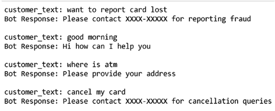
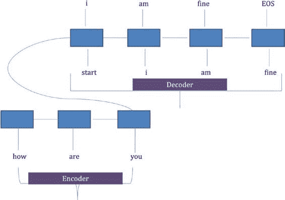

# 第 5 章 虚拟助手中的自然语言处理

`0.9985935302390999`
`0.9985935302390999`
`0.9983013632525033`

由于这是一个演示数据集，准确率相当高。现在你继续使用意图，并根据意图从机器人那里获取下一个响应。

## 5.1 意图分类与响应匹配

你使用 `fp_qns` 数据集来为正确的意图获取正确的响应。首先，当向机器人发送一个新句子时，你对其进行预处理，然后将其转换为序列并填充到 `maxlen`。接着你进行预测，并从 `fp_qns` 数据集中找出正确的响应。例如，请参见清单 5-14 和 5-15 以及图 5-14。

**清单 5-14.**

```python
def pred_new_text(txt1):
    print ("customer_text:", txt1)
    newdf = pd.DataFrame([txt1])
    newdf.columns = ["Line"]
    newdf1 = preproc(newdf)
    col_te1 = tokenizer.texts_to_sequences(newdf1["line1"])
    col_te2 = pad_sequences(col_te1, maxlen=max_len1, dtype='int32', padding='post')
    class_pred = le.inverse_transform(model.predict_classes(col_te2))[0]
    resp = fp_qns.loc[fp_qns.cat == class_pred, "sent"].values[0]
    print ("Bot Response:", resp, "\n")
    return
```

**清单 5-15.**

```python
pred_new_text("want to report card lost")
pred_new_text("good morning")
pred_new_text("where is atm")
pred_new_text("cancel my card")
```



**图 5-14.**

## 方法 2 - 生成响应方法

前一种方法具有局限性，且是为特定业务流程定制的。你需要能够对意图进行分类，然后将它们与下一个响应进行匹配。这对于前一种方法的成功至关重要。假设你拥有一个包含客户与客服人员之间大量对话语料库的案例。与其创建训练样本来映射意图再到响应，不如直接使用对话语料库来训练问答对。一种非常流行的架构称为编码器-解码器，通常用于训练对话语料库。

### 编码器-解码器架构

编码器-解码器架构的核心是 `LSTM`，它接收文本序列数据作为输入，并提供序列数据作为输出。从根本上说，你使用一组 `LSTM` 对问题的句子进行编码，并使用另一组 `LSTM` 来解码响应。该架构如图 5-15 所示。



**图 5-15.** 编码器-解码器架构

*来源：Sequence to Sequence Learning with Neural Networks, Ilya Sutskever and Oriol Vinyals and Quoc V. Le, 2014*

每个矩形框代表一个接收基于序列输入的 `LSTM` 单元。顾名思义，该架构由两个单元组成：编码器和解码器。

- **编码器**：它将问题的输入数据输入到 `LSTM` 单元，并输出一个编码器向量。编码器向量由隐藏向量和输出单元状态组成，其维度等于隐藏维度。

- **解码器**：解码器使用初始编码器状态进行初始化。解码器输入首先在开头和结尾分别附加句子起始（`Start-of-sentence`）和句子结束（`End-of-sentence`，`EOS`）标记。该架构使用一种称为“教师强制”的技术。在训练期间，解码器的实际值被输入到 `LSTM` 中，而不是上一步的输出。在推理期间，使用上一个时间步的输出从解码器获取输出。在图 5-15 的架构中，解码器输入已偏移了一位。

时间步长与解码器输出为原始输出。也就是说，在时间 `t` 的解码器输出是时间 `t-1` 的解码器输入。

### 数据集

在本练习中，你将使用名为“Let's Go 公交”的对话数据集。该数据集的详细信息可在 [`dialrc.github.io/LetsGoDataset/`](https://dialrc.github.io/LetsGoDataset/) 找到。Let's Go 项目由美国国家科学基金会资助。Let's Go 公共口语对话系统在非高峰时段为匹兹堡市民提供公交时刻表信息。该数据包含用户与语音机器人之间的多轮对话。表 5-2 给出了一个示例。

**表 5-2.** Let's Go 数据集样本

| **用户 ID** | **机器人文本** | **客户文本** |
|-------------|--------------|---------------|
| 欢迎使用卡内基梅隆大学 Let's Go 公交信息系统。如需随时获取帮助，请说“帮助”或按 0。我能为您做些什么？ | 巴特勒的佩恩时间是 | 系统。如需随时获取帮助，请说“帮助中心”从高地或按 0。我能为您做些什么？ |
| 61a 八点半 61b 不行 | 奥克兰 | 从奥克兰出发。对吗？ |
| 奥克兰 | 从奥克兰出发。对吗？ | 是的 |
| 从奥克兰出发。对吗？ | 好的。 | 第五大道的松鼠山 |
| 您想去哪里？ | 去第五大道。对吗？ | 是的 |
| 去第五大道。对吗？ | 好的 | 周日 |
| 您想什么时候出行？ | 您想什么时间出行？ | 大约十一点五分 |
| 上午 11 点出发。对吗？ | 是的 | |

请注意，由于这是从语音自动转录为文本，部分客户数据可能不连贯。你将使用这个对话语料库，并希望根据客户的问题生成下一个回复。为此，你将使用编码器-解码器架构。