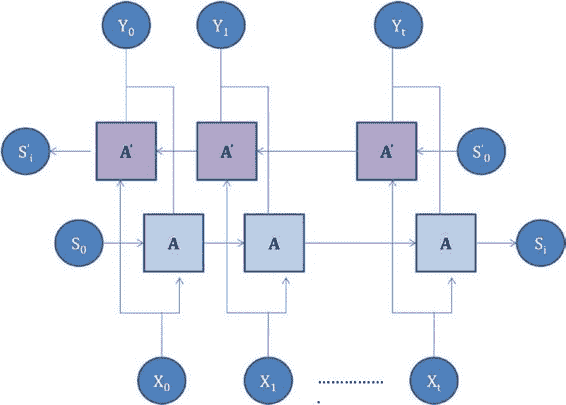

# 第 5 章 虚拟助手中的自然语言处理

清单 5-57.

```python
sent = "when is the next bus to crafton boulevard 9 00 P.M east. . 85c"
preprocces(sent)
'when is the next bus to craftonplace_nametime_name direction bus_name'
```

该句子似乎已按预期完成了预处理。现在，你可以使用训练过程中定义的 `tokenizer` 对象，将预处理后的文本转换为训练时设定的正确数字数组。你需要根据训练过程中的值来设置填充长度和 one-hot 编码的类别数量。参见清单 5-58 和 5-59。

清单 5-58.

```python
max_len1 = 28
num_encoder_tokens = 733
num_decoder_tokens = 1506
```

清单 5-59.

```python
def conv_sent(sent, shp):
    sent = preprocces(sent)
    #print (sent)
    en_col_tr = [sent.split()]
    en_tr1 = tokenizer.texts_to_sequences(en_col_tr)
    en_tr2 = pad_sequences(en_tr1, maxlen=max_len1, dtype='int32', padding='post')
    en_tr3 = to_categorical(en_tr2, num_classes=shp)
    return en_tr3
```

你可以使用测试预处理句子来检查这一点，并查看其形状是否符合预期（行数 * 序列长度 * one-hot 编码）。参见清单 5-60。

清单 5-60.

```python
sent1 = 'when is the next bus to craftonplace_nametime_name direction bus_name'
sent1_conv = conv_sent(sent1, num_encoder_tokens)
sent1_conv.shape
(1, 28, 733)
```

现在，你将模型应用于转换后的句子。如前所述，第一个单词将被初始化为起始标记，解码器的状态将被初始化为编码器的状态。由此，你得到下一个单词。然后，将下一个单词及其状态作为输入集，得到 `t+1` 时刻的单词。重复此过程，直到遇到结束标记。请记住，你是在机器人句子模板上训练的，而不是在实际句子上。因此，你得到的是模板 ID 作为输出。然后，使用清单 5-61 将模板 ID 转换为所需的单词。

清单 5-61.

```python
def rev_dict(req_word):
    str1 = ""
    for k, v in df_sents.items():
        if (df_sents[k] == [req_word]):
            str1 = k
    return str1

from keras.preprocessing.sequence import pad_sequences
from keras.utils import to_categorical
import numpy as np

def get_op(text1, shp):
    st_pos = 0
    input_seq = conv_sent(text1, shp)
    states_value = encoder_model.predict(input_seq)
    target_seq = np.zeros((1, 1, num_decoder_tokens))
    str_all = ""
    # 用起始词填充目标序列的第一个词。
    target_seq[0, 0, st_pos] = 1
    for i in range(0, 10):
        decoded_sentence = ''
        output_tokens, h, c = decoder_model.predict([target_seq] + states_value)
        sampled_token_index = np.argmax(output_tokens[0, -1, :])
        sampled_char = tokenizer1.sequences_to_texts([[sampled_token_index]])
        str1 = rev_dict(sampled_char[0])
        str_all = str_all + "\n" + str1
        if (sampled_char[0] == 'end'):
            break
        else:
            decoded_sentence += sampled_char[0]
        target_seq = np.zeros((1, 1, num_decoder_tokens))
        target_seq[0, 0, sampled_token_index] = 1.
        # 初始化状态值
        states_value = [h, c]
    return str_all
```

你可以在此处检查输出。参见清单 5-62、5-63 和 5-64。

清单 5-62.

```python
text1 = "54c"
get_op(text1, num_encoder_tokens)
'\n placename going to placename transportation center \n short_numshort_num n short_num where are you leaving from \n'
```

清单 5-63.

```python
text1 = "next bus to boulevard"
get_op(text1, shp)
'\n did i get that placename okay where would you like to leave from \n if you placename to leave from placename and bausman say yes or press short_num otherwise say no or press short_num \n'
```

清单 5-64.

```python
text1 = "Do you have bus to downtown in the morning"
get_op(text1, shp)
'\n when would you like to travel \n'
```

你似乎有了一个不错的开端。可以通过以下方法来改进回复：

1.  你需要用合适的地名替换答案，并给出更有意义的回答。
2.  你是在单个输入上训练的。但这是一个对话，因此你需要基于 `n-1` 的回复和问题来训练模型，以获取下一个回复。
3.  部分转录内容不准确。如果能剔除这些内容，并用更干净的语料库训练模型，效果会更好。
4.  你可以使用嵌入（预训练的或在模型训练期间训练的）作为 LSTM 的输入。
5.  你可以调整超参数，例如学习率或学习算法。
6.  你可以使用堆叠的 LSTM 层（第一组 LSTM 为第二组 LSTM 提供输入）。
7.  你可以使用双向 LSTM。稍后你将看到一个双向 LSTM 的示例。
8.  你可以使用像 BERT 这样的高级架构。

## 双向 LSTM

以句子“She was playing tennis.”为例。单词“playing”的上下文从“tennis”中更容易看出。为了在给定上下文中找到单词，不仅单词之前的词（过去词）很重要，单词之后的词（未来词）也同样重要。

因此，你用一个前向序列和一个后向序列来训练模型。这是来自 [`colah.github.io/posts/2015-09-NN-Types-FP/`](http://colah.github.io/posts/2015-09-NN-Types-FP/) 的架构。这两个 LSTM 的输出可以拼接或求和。参见图 5-20。



**图 5-20.** 双向 LSTM

让我们来看一个使用双向 LSTM 解决当前问题的小型实现。在这里，输出被拼接并传递给解码器。

### 编码器

双向 LSTM 有额外的前向和后向隐藏状态输出（`forward_h`、`forward_c`、`backward_h` 和 `backward_c`）。然后它们被拼接（隐藏状态拼接在一起，细胞状态拼接在一起）以得到最终的编码器状态。

### 解码器

与之前的情况一样，解码器有一个单向 LSTM。然而，其隐藏单元的数量等于编码器双向 LSTM 拼接后的隐藏单元数量。在你的例子中（清单 5-65），编码器 LSTM 各有 100 个单元，解码器有 200 个单元。

清单 5-65.

```python
from keras.layers import LSTM, Bidirectional, Input, Concatenate
from keras.models import Model
from keras.layers import Input, LSTM, Dense

n_units = 100
n_input = num_encoder_tokens
n_output = num_decoder_tokens

### 编码器
encoder_inputs = Input(shape=(None, n_input))
encoder = Bidirectional(LSTM(n_units, return_state=True))
encoder_outputs, forward_h, forward_c, backward_h, backward_c = encoder(encoder_inputs)
state_h = Concatenate()([forward_h, backward_h])
state_c = Concatenate()([forward_c, backward_c])
encoder_states = [state_h, state_c]

### 解码器
decoder_inputs = Input(shape=(None, n_output))
decoder_lstm = LSTM(n_units*2, return_sequences=True, return_state=True)
decoder_outputs, _, _ = decoder_lstm(decoder_inputs, initial_state=encoder_states)
decoder_dense = Dense(n_output, activation='softmax')
decoder_outputs = decoder_dense(decoder_outputs)

model = Model([encoder_inputs, decoder_inputs], decoder_outputs)

# 定义推理编码器
encoder_model = Model(encoder_inputs, encoder_states)
```