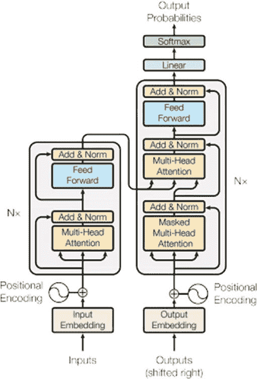
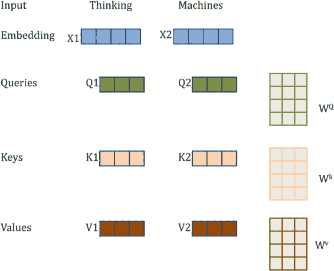
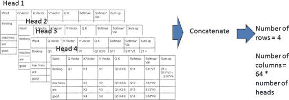

## 定义推理解码器

```python
decoder_state_input_h = Input(shape=(n_units*2,))
decoder_state_input_c = Input(shape=(n_units*2,))
decoder_states_inputs = [decoder_state_input_h, decoder_state_input_c]
decoder_outputs, state_h, state_c = decoder_lstm(decoder_inputs, initial_state=decoder_states_inputs)
decoder_states = [state_h, state_c]
decoder_outputs = decoder_dense(decoder_outputs)
decoder_model = Model([decoder_inputs] + decoder_states_inputs, [decoder_outputs] + decoder_states)
```

编码器-解码器架构是处理序列到序列问题的常见方式。

## BERT

`BERT`（来自 Transformer 的双向编码器表示）是自然语言处理领域的新范式。它被广泛应用于序列到序列建模任务以及分类器中。`BERT`是一个预训练模型，由谷歌于 2018 年发布，此后被发现在各种自然语言处理挑战中表现优异。`BERT`的商业化应用也正在加速推进。许多组织正在使用基础`BERT`模型针对特定上下文场景进行微调。

## 语言模型与微调

如同图像处理领域的 `ImageNet` 时刻，`BERT`是自然语言处理的转折点。在文本挖掘问题中，我们总是受限于训练数据集。再加上语言的复杂性——词汇具有相似含义、词汇在不同语境中的用法、同一句子中混合不同语言的词汇等。为了解决这些问题（数据稀疏性和语言复杂性），过去几年发展出了两个概念：语言模型和微调。语言模型非常有用，它们能捕捉语言的语义含义。你在上一章学习了`word2vec`，其中词汇的含义通过预训练模型来捕捉。`BERT`也是一个强大的语言模型，它能在捕捉词汇含义的同时结合其上下文。举一个熟悉的例子，`BERT`可以区分"bank"一词在"她去银行存钱"和"椰子在河岸土壤肥沃处生长良好"这两个句子中的不同含义。请注意，在`word2vec`模型中，这些含义是无法区分的。

图像分类领域采用微调方法已有一段时间。自然语言处理领域最近才开始采用微调。基本做法是：使用神经网络在包含数百万训练数据集的大样本上预训练大规模文本语料库。这个训练好的神经网络及其权重被开源发布。自然语言处理科学家现在可以将这个预训练模型用于特定上下文的下游任务，如分类、摘要等。他们可以用新数据重新训练特定上下文的模型，但使用预训练模型的相关权重进行初始化。`BERT`是一个预训练的语言模型，可用于下游自然语言处理任务的微调。让我们看一个使用`BERT`对信用卡公司数据集进行多意图分类的示例。

## BERT 概述

`BERT`架构本质上基于 `Transformer` 构建。`BERT`也是双向的，词汇会从句子中前后文的词汇中获取上下文信息。在进一步深入之前，你需要了解 `Transformer`。在句子"那只动物没有过马路，因为它害怕"中，"它"指代动物。在句子"那只动物没有过马路，因为路很窄"中，"它"指代道路。（示例来自[`ai.googleblog.com/2017/08/transformer-novel-neural-network.html`](https://ai.googleblog.com/2017/08/transformer-novel-neural-network.html)）。如你所见，周围词汇决定了词汇的含义。这就引出了注意力机制的概念，它是 `Transformer` 的核心。

### `Transformer` 架构

让我们看看 `Transformer` 的架构。这来自论文《Attention is all you need》[`arxiv.org/abs/1706.03762`](https://arxiv.org/abs/1706.03762)。图 5-21 展示了单组编码器-解码器。在论文中，作者展示了六组编码器-解码器。



`图 5-21.` `Transformer` 架构

出于 `BERT` 的目的，我将只详细讨论编码器部分，因为 `BERT` 仅使用 `Transformer` 的编码器部分。编码器部分最重要的组件是多头注意力。要理解多头注意力，你必须首先从理解自注意力开始。自注意力是一种机制，它关联句子中不同单词如何相互影响。让我们理解注意力是如何工作的。图 5-22 中的图片来自文章《Breaking BERT Down》（[`towardsdatascience.com/breaking-bert-down-430461f60efb`](https://towardsdatascience.com/breaking-bert-down-430461f60efb)）。



该文章解释了一种简单的方法来理解自注意力的内部机制。有三个重要的向量需要了解。对于每个单词，这三个向量在训练过程中计算：

1. 查询向量

2. 键向量

3. 值向量

为了计算这些向量，你需要初始化权重矩阵：`WQ`、`WK`、`WV`。这些权重矩阵的维度将是嵌入维度（假设为 512）乘以查询、键和值向量的维度（假设为 64）。在这种情况下，权重矩阵的维度为 512 * 64。见图 5-22。

`图 5-22.` 查询、键和值向量

在图 5-22 所示的情况下，对于单词“thinking”，你通过将“thinking”的嵌入与`WQ`相乘得到`Q1`。类似地，通过与`WK`、`WV`相乘得到`K1`、`V1`。对于单词“Machines”，使用“Machines”的嵌入重复相同的过程。

假设你有句子“Thinking machines are good。”乘法和进一步的计算步骤如表 5-3 所示。该插图来自 [www.analyticsvidhya.com/blog/2019/06/understanding-transformers-nlp-state-of-the-art-models/?utm_source=blog&utm_medium=demystifying-bert-groundbreaking-nlp-framework](http://www.analyticsvidhya.com/blog/2019/06/understanding-transformers-nlp-state-of-the-art-models/?utm_source=blog&utm_medium=demystifying-bert-groundbreaking-nlp-framework)。

1. 将该单词的查询向量与所有其他单词的键向量相乘。然后除以查询向量维度的平方根（8，即 64 的平方根）。

`表 5-3.` 查询和键向量的点积

| 单词 | Q 向量 | K 向量 | V 向量 | Q.K |
|------|--------|--------|--------|-----|
| thinking | `Q1` | `K1` | `V1` | `Q1`.`K1`/8 |
| Machines | | `K2` | `V2` | `Q1`.`K2`/8 |
| are | | `K3` | `V3` | `Q1`.`K3`/8 |
| Good | | `K4` | `V4` | `Q1`.`K4`/8 |

2. 对每个单词组合进行 `softmax` 计算，然后与值向量相乘。见表 5-4。

`表 5-4.` 查询和键的 Softmax 与值向量

| 单词 | Q 向量 | K 向量 | V 向量 | Q.K | Softmax | Softmax * Val |
|------|--------|--------|--------|-----|---------|---------------|
| thinking | `Q1` | `K1` | `V1` | `Q1`.`K1`/8 | `S11` | `S11`*`V1` |
| Machines | | `K2` | `V2` | `Q1`.`K2`/8 | `S12` | `S12`*`V2` |
| are | | `K3` | `V3` | `Q1`.`K3`/8 | `S13` | `S13`*`V3` |
| Good | | `K4` | `V4` | `Q1`.`K4`/8 | `S14` | `S14`*`V4` |

3. 将所有向量求和，得到一个表示给定单词的向量，放入`Z`矩阵中。对其他单词重复此过程。见表 5-5。



`表 5-5.` 向量求和