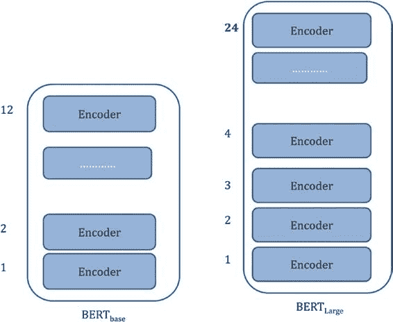
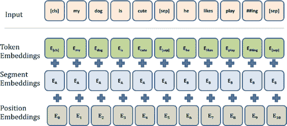

# 词

### Q 向量、K 向量、V 向量、Q·K

### Softmax、Softmax * 求和

### 值

#### 思考过程

| Q1 | K1 | V1 | Q1·K1/8 = S11 | S11*V1 |
|---|---|---|---|---|
| | K2 | V2 | Q1·K2/8 = S12 | S12*V2 |
| | K3 | V3 | Q1·K3/8 = S13 | S13*V3 |
| | K4 | V4 | Q1·K4/8 = S14 | S14*V4 |

`Z1 = S11*V1 + ... + S14*V4`

这里的 `Z1` 是一个长度为 64 的向量。同理，对于所有词，你都会得到一个长度为 64 的向量。我解释的是单头注意力的情况。在多头的场景下，你需要为每个词嵌入初始化多组 `Q`、`K`、`V` 矩阵（通过初始化多组 `W_Q`、`W_K`、`W_V`）。图 5-23 给出了一个快速示意。

***图 5-23.** 多头注意力*

你会得到多个 `Z` 输出（假设有四个注意力头），然后在每个头上得到一个 `4*64` 的矩阵。所有这些矩阵会相互拼接，行数为 4（句子和词汇表只有 4 个词），列数为 `Q`、`K`、`V` 向量的维度，即 64 乘以头的数量（本例中为 4）。这个矩阵进一步与一个权重矩阵相乘，以生成该层的输出。在本例中，Transformer 的输出维度为词数乘以 64。

BERT 架构从外部来看，可以用图 5-24 中的两种变体表示。



**第 5 章 虚拟助手中的自然语言处理**

***图 5-24.** BERT base 和 BERT large*

*来源：Illustrated BERT ([`jalammar.github.io/illustrated-bert/`](http://jalammar.github.io/illustrated-bert/))*

每个编码器都是一个 Transformer。输入的词被转换为词嵌入，并使用前面描述的注意力机制，输出 `词汇表大小 * 隐藏状态`（嵌入的数量）。然后将其传递给一个分类器。在预训练数据时，输入句子中有些词会被“掩码”，分类器通过训练来识别被掩码的词。BERT base 有 12 层（Transformer/编码器块）、12 个注意力头和 768 个隐藏单元，而 BERT large 有 24 层（Transformer/编码器块）、16 个注意力头和 1024 个隐藏单元。

## 为分类器微调 BERT

你将针对分类器用例重新训练 BERT base。为此，数据必须转换为 BERT 特定的格式。你需要基于 BERT 词汇表对词进行分词。你还需要位置标记和句子分段标记。位置标记是词的位置，分段标记表示句子的位置。这些层构成 BERT 的输入，然后在最后几层使用多分类损失函数进行微调。图 5-25 给出了一个输入示例。



**第 5 章 虚拟助手中的自然语言处理**

***图 5-25.** BERT 输入*

*来源：Analytics Vidhya ([www.analyticsvidhya.com/blog/2019/09/demystifying-bert-groundbreaking-nlp-framework/](http://www.analyticsvidhya.com/blog/2019/09/demystifying-bert-groundbreaking-nlp-framework/))*

现在，你将使用一个名为 `ktrain` 的库（参见“[ktrain: A Low-Code Library for Augmented Machine Learning](https://arxiv.org/abs/2004.10703)”，网址为 [`arxiv.org/abs/2004.10703`](https://arxiv.org/abs/2004.10703)）来为信用卡数据集问题微调你的 BERT 模型。你将在此处将信用卡数据集（数据框 `t1`）划分为训练集和测试集。你将使用 Google Colab 进行此操作。清单 5-66 安装了使用 `ktrain` 运行 BERT 所需的包。另请参见清单 5-67。

***清单 5-66.***

```
!pip install tensorflow-gpu==2.0.0
!pip install ktrain
```

***清单 5-67.***

```
tgt = t1["Final intent"]
from sklearn.model_selection import StratifiedShuffleSplit
sss = StratifiedShuffleSplit(test_size=0.1, random_state=42, n_splits=1)
for train_index, test_index in sss.split(t1, tgt):
```


```python
x_train, x_test = t1[t1.index.isin(train_index)], t1[t1.index.isin(test_index)]
y_train, y_test = t1.loc[t1.index.isin(train_index),"Final intent"], t1.loc[t1.index.isin(test_index),"Final intent"]
```

