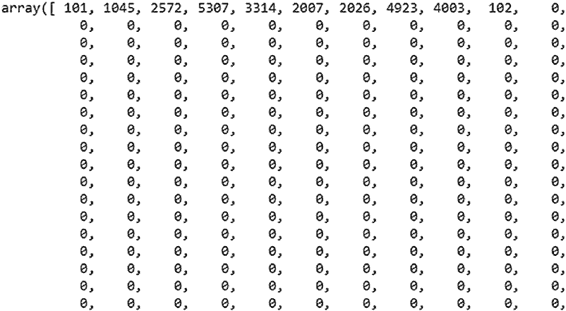
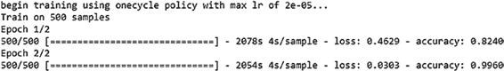

# 第 5 章 虚拟助手中的自然语言处理

清单 5-68 展示了将因变量转换为列表的代码。

**清单 5-68.**

```python
y_train1 = y_train.values.tolist()
y_test1 = y_test.values.tolist()
```

在清单 5-69 中，该数据集被转换为 BERT 专用格式。此代码参考自 [www.kaggle.com/ksaxena10/bert-sentiment-analysis](http://www.kaggle.com/ksaxena10/bert-sentiment-analysis)。

**清单 5-69.**

```python
from ktrain import text
import numpy as np

(x_train2, y_train2), (x_test2, y_test2), preproc = text.texts_from_array(
    x_train=np.array(x_train["Line"]), y_train=y_train1,
    x_test=np.array(x_test["Line"]), y_test=y_test1,
    class_names=class1,
    preprocess_mode='bert',
    ngram_range=1,
    maxlen=350)
```

数据使用 BERT 分词器进行分词，并为给定的序列长度分配数字。通过使用 `preproc = "BERT"`，我们指定了需要保持的格式。句子也被分割成片段并提供了片段 ID。参见清单 5-70 和图 5-26。

**清单 5-70.**

```python
x_train[0].shape, x_train[1].shape
((500, 350), (500, 350))
x_train[0][1]
```




