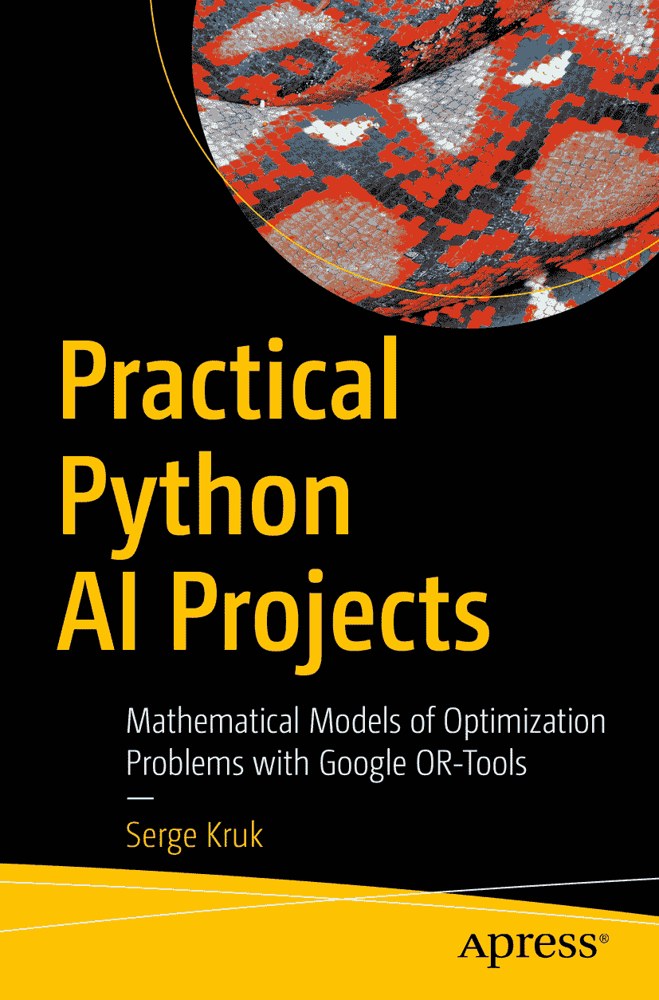

 `Serge Kruk` 著《实用 Python AI 项目：基于 `Google OR-Tools` 的优化问题数学模型》

作者在本书中引用的任何源代码或其他补充材料，读者均可通过本书在 `GitHub` 上的产品页面获取，网址为 [`www.apress.com/9781484234228`](http://www.apress.com/9781484234228)。如需更详细信息，请访问 [`www.apress.com/source-code`](http://www.apress.com/source-code)。

`ISBN 978-1-4842-3422-8`

电子版 `ISBN 978-1-4842-3423-5`

[`doi.org/10.1007/978-1-4842-3423-5`](https://doi.org/10.1007/978-1-4842-3423-5)

`美国国会图书馆控制号：2018934677`

`© Serge Kruk 2018`

本作品受 `版权` 保护。出版商保留所有权利，无论涉及材料的全部或部分，具体包括 `翻译`、`重印`、`插图复用`、`朗诵`、`广播`、`微缩胶片` 或其他任何物理形式的复制、`信息存储与检索` 的传输与 `电子改编`、`计算机软件`，或目前已知及未来开发的任何类似或不同方法的权利。

本书中可能出现 `商标名称`、`标识` 和 `图像`。我们并未在每次出现 `商标名称`、`标识` 或 `图像` 时使用 `商标符号`，而是仅以编辑方式使用这些名称、`标识` 和 `图像`，以维护 `商标所有者的权益`，且无意侵犯 `商标权`。

本出版物中使用的 `商品名称`、`商标`、`服务标志` 及类似术语，即使未明确标识，也不应被视为对其是否受 `专有权利保护` 的 `立场表达`。

尽管本书中的建议和信息在出版时被认为是 `真实准确` 的，但作者、编辑及出版商均不对可能存在的任何 `错误或疏漏` 承担 `法律责任`。出版商对本书所含内容不作任何 `明示或暗示的担保`。

采用 `无酸纸` 印刷

本书通过 `Springer Science+Business Media New York` 在 `全球图书贸易` 中发行，地址：`233 Spring Street, 6th Floor, New York, NY 10013`。电话：`1-800-SPRINGER`，传真：`(201) 348-4505`，电子邮件：`orders-ny@springer-sbm.com`，或访问 `www.springeronline.com`。

`Apress Media, LLC` 是一家 `加利福尼亚` `有限责任公司`，其 `唯一成员（所有者）` 为 `Springer Science + Business Media Finance Inc (SSBM Finance Inc)`。`SSBM Finance Inc` 是一家 `特拉华州公司`。

`献给` `Chloé` 和 `Laurent`。