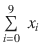
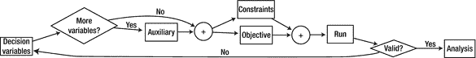

# 1. 引言


## 1.1 本书内容简介

人工智能是一个涵盖多种技术、目标和成功衡量标准的广阔领域。其中一个分支专注于为某些定义明确的问题寻找可证明的最优解。

本书旨在介绍实现优化问题数学模型的艺术与科学。

优化问题几乎可以是任何以“什么是……的最佳……”开头的问题，或者可以如此表述的问题。例如：

- 从家到公司的最佳路线是什么？
- 生产汽车以实现利润最大化的最佳方式是什么？
- 把杂货带回家的最佳方式是什么：纸袋还是塑料袋？
- 哪所学校最适合我的孩子？
- 火箭助推器中使用的最佳燃料是什么？
- 芯片上晶体管的最佳布局是什么？
- 最佳的 NBA 赛程是什么？

这些问题相当模糊，可以有多种解读方式。以第一个问题为例：“最佳”是指最快、最短、骑行最舒适、最不颠簸，还是最省油？此外，这个问题本身也不完整。我们是步行、骑行、开车还是滑雪？是独自一人，还是带着一个尖叫的幼儿？

为了帮助我们制定优化问题的解决方案，优化专家建立了一个框架，我们将问题纳入其中；这个框架被称为**模型**。模型最关键的一点是，它有一个**目标**，并且有**约束条件**。粗略地说，目标是我们想要的东西，而约束条件是我们前进道路上的障碍。如果我们能重新表述问题，清晰地识别出目标和约束条件，我们就离模型更近了一步。

让我们更详细地考虑“最佳路线”问题，但要着眼于明确目标和约束条件。我们可以将其表述为：

- 给定城市地图、我的家庭住址以及我两岁儿子的日托所地址，我骑自行车送他去日托所，最快的最佳路线是什么？

目标是在所有满足要求（即遵循街道或自行车道的路径，也称为约束条件）的解决方案中，找到一条能最小化到达时间（目标）的路径。

目标始终是我们想要最大化或最小化的量（时间、距离、金钱、表面积等），尽管你会看到一些例子中我们想要最大化某个量同时最小化另一个量；这很容易处理。有时没有目标。我们说这个问题是一个**可行性**问题（即我们正在寻找任何满足要求的解决方案）。从建模者的角度来看，差异很小。尤其是在大多数实际案例中，可行性模型通常只是第一步。在找到一个解决方案后，人们通常想要优化某些东西，于是模型会被修改以包含一个目标函数。

## 1.2 本书特点

由于本书是一本入门读物，我不期望读者已经精通建模艺术。我将从基础开始，只假设读者理解变量（包括数学意义上的和编程意义上的）、方程、不等式和函数的定义。我还假设读者了解某种编程语言，最好是 Python，尽管了解任何其他命令式语言也足以阅读书中展示的 Python 代码。

请注意，本书中的代码是一个重要组成部分。为了获得全部价值，读者必须缓慢而专注地阅读代码。本书不是一本从宏观角度描述、使用数学符号、将所有繁琐细节“留给读者作为练习”的配方书。这是经过实现、功能完善、经过测试的优化代码，读者可以使用，并且鼓励读者修改以充分理解。书中的数学内容已经像任何数学论文一样经过数学家的审阅。但代码则经过了更严格的审阅者群体——英特尔、AMD、摩托罗拉和 IBM——的检验。

本书是数十年咨询经验以及我在奥克兰大学教授入门建模课程（MOR242 运筹学模型导论）和研究生课程（APM568 工业数学建模）的成果。我从本科水平开始，在建模本身方面逐步上升到研究生水平，而没有深入探讨相关的理论。

- 每个模型都使用 Python 和 Google OR-Tools 表达，并且可以按原样执行。事实上，书中展示的代码是自动提取、执行，并将输出插入文本中，无需人工干预；甚至图表也是自动生成的（感谢 Emacs 和 org-mode）。
- 我的意图是帮助读者成为一名熟练的建模者，而不是理论家。因此，本书很少涉及与优化相关的迷人数学理论。尽管如此，这些理论仍被有效地用于创建简单而高效的模型。
- 相关网站提供了书中展示的所有代码，以及许多问题和变体的随机生成器。作者将其用作个性化作业生成器。它也可以用作自学工具：[`https://github.com/sgkruk/Apress-AI`](https://github.com/sgkruk/Apress-AI)

### 1.2.1 运行模型

详细描述安装说明存在风险，因为软件的变化频率往往高于本书的更新频率。例如，当我开始使用 Google 的 OR-Tools 时，它托管在 Google Code 仓库上；现在它在 GitHub 上。尽管如此，这里提供一些指导。本书中展示的所有代码均已通过以下环境测试：

- Python 3（当前为 3.7），尽管这些模型也适用于 Python 2
- OR-Tools 6.6

页面[`https://developers.google.com/optimization`](https://developers.google.com/optimization)提供了大多数操作系统的安装说明。最快、最无痛的方法是：

```
pip install --upgrade ortools
```

安装 OR-Tools 后，下载本书软件最简单的方法是通过克隆 GitHub 仓库：

```
git clone https://github.com/sgkruk/Apress-AI.git
```

读者将在其中找到一个`Makefile`，它几乎测试了书中详述的所有模型。读者只需执行`make`命令即可测试安装是否成功完成。

本书每一节的代码分为两部分：文本中展示的模型本身，以及一个用于演示如何使用某些数据调用模型的主驱动程序。例如，对应于集合覆盖问题的章节有一个名为`set_cover.py`的文件，其中包含模型，以及一个名为`test_set_cover.py`的文件，该文件将创建一个随机实例，在其上运行模型，并显示结果。有了这些示例，读者应该能够根据自己的需求进行修改。理解主程序位于`test_set_cover.py`中并且需要执行该文件是很重要的。


### 1.2.2 关于符号的说明

在本书中，我将描述代数模型。这些模型可以通过多种方式表示。我将使用两种方式。首先，我会用数学模式下的 T[E]X 排版，以常见的数学符号勾勒出每个模型。然后，我会用可执行的 Python 代码来表达完整、详细的模型。读者应该不难看出这两种表述形式之间的等价关系。表 1-1 展示了一些等价关系。

**表 1-1** 数学模式与 Python 模式下的表达式等价关系

| 对象 | 数学模式 | Python 模式 |
| --- | --- | --- |
| 标量变量 | X | `X` |
| 向量 | v [i] | `v[i]` |
| 矩阵 | M [ij] | `M[i][j]` |
| 不等式 | x + y ≤ 10 | `x+y <= 10` |
| 求和 |  | `sum(x[i] for i in range(10))` |
| 集合定义 | {i ² &#124; i ∈ [0, 1, . . ., 9]} | `[i**2 for i in range(10)]` |

## 1.3 初试牛刀：两栖动物共存问题

最简单的问题类似于我们在高中首次遇到的题目：令人头疼的文字应用题。它们在本质上是代数的；也就是说，它们可以使用初等线性代数的简单工具来构建模型，有时甚至可以直接求解。这里我们考虑这样一个问题，用以说明建模的方法并定义一些基本概念。

一位动物园生物学家计划将三种两栖动物（一只蟾蜍、一只蝾螈和一只蚓螈）放入一个水族箱中，它们将以三种不同的小型猎物为食：蠕虫、蟋蟀和苍蝇。每天会向水族箱中投放 1,500 条蠕虫、3,000 只蟋蟀和 5,500 只苍蝇。每种两栖动物每天会消耗一定数量的猎物。表 1-2 总结了相关数据。

**表 1-2** 每种两栖动物消耗的猎物数量

| 食物 | 蟾蜍 | 蝾螈 | 蚓螈 | 可用数量 |
| --- | --- | --- | --- | --- |
| 蠕虫 | 2 | 1 | 1 | 1500 |
| 蟋蟀 | 1 | 3 | 2 | 3000 |
| 苍蝇 | 1 | 2 | 3 | 5000 |

生物学家想知道，假设食物是唯一的限制条件，在水族箱中最多可以共存多少只两栖动物（每种最多 1,000 只）。

我们如何为这个问题建模？本书中的所有优化和可行性问题都采用三步法进行建模。随着我们遇到越来越复杂的问题，我们将对这个方法进行扩展，但这三个基本步骤始终是构建优秀模型的基石。

1.  **确定要回答的问题。** 这个问题的表述应该是一个精确的句子，涉及对一个或多个对象的计数或估值。在这个案例中，问题是每种两栖动物可以在水族箱中共存多少只？请注意，“有多少只两栖动物？”这个问法不够精确，因为我们关心的不是总数，而是每种动物的数量。提出一个精确的问题通常是最困难的部分。一旦我们有了这个精确的问题，我们就为每个要计数的对象分配一个变量。我们将使用 `x[0]`、`x[1]` 和 `x[2]`。这些变量传统上被称为**决策变量**。这个术语在我们的第一个例子中可能有些用词不当，但它反映了优化问题在物流领域的起源，在那里决策变量确实代表了建模者可以控制的数量，并映射到规划决策上。

2.  **确定所有需求并将其转化为约束条件。** 正如你将在本书中看到的，约束条件可以有多种形式。在这个简单的问题中，它们是代数的线性不等式。在将其转化为约束条件之前，最好先用精确的句子写下每个需求。对于共存问题，用文字表述的需求如下：
    *   所有两栖动物总共消耗 1,500 条蠕虫。
    *   所有两栖动物总共消耗 3,000 只蟋蟀。
    *   所有两栖动物总共消耗 5,000 只苍蝇。

    请注意，以“……的数量”开头的陈述可能不够精确。在我们的简单案例中，没有指定单位，但可能存在。例如，消耗量可能以克为单位，而可用量却以千克为单位。这种情况经常发生，也是许多模型出错的原因。然而，即使我们的陈述看似精确，仍然存在一个需要考虑的歧义。指出歧义并澄清问题陈述，是优秀建模者的主要贡献之一。在这里，我们的意思是两栖动物将*恰好*消耗所述数量的食物，还是它们将*最多*消耗所述数量的食物？⁶ 我们将假设“最多”是需求的正确形式，这既因为它更有趣，也因为在某种意义上它包含了“等于”的问题。然后，我们将基于决策变量，把这些需求转化为代数约束。让我们考虑蠕虫。蟾蜍每天吃两条。蝾螈和蚓螈各吃一条。由于我们决定用 `x[0]` 表示蟾蜍数量，`x[1]` 表示蝾螈数量，`x[2]` 表示蚓螈数量，那么消耗的蠕虫总数将受以下不等式约束：

    ```
    2*x[0] + x[1] + x[2] <= 1500
    ```

    (1.1) 如果我们决定“等于”是合适的约束，我们会将不等式替换为等式。现在考虑蟋蟀。蟾蜍每天消耗一只，而蝾螈消耗三只，蚓螈消耗两只。它们总共将消耗 `x[0] + 3*x[1] + 2*x[2]`，我们得到约束条件：

    ```
    x[0] + 3*x[1] + 2*x[2] <= 3000
    ```

    (1.2) 关于苍蝇的约束条件类似地得到：

    ```
    x[0] + 2*x[1] + 3*x[2] <= 5000
    ```

    (1.3)

3.  **确定要优化的目标。** 在优化问题中，目标是我们想要最大化（或最小化）的东西。在可行性问题中，没有目标，但实际上，大多数可行性问题都是表述不完整的优化问题。由于问题陈述是“每种两栖动物可以共存多少只？”，一种可能甚至很常见的理解是，我们想要两栖动物的最大数量。（最小数量是零，这是一个无趣的平凡解的例子。）就我们的决策变量而言，我们想要最大化总和，得到：

    ```
    max x[0] + x[1] + x[2]
    ```

    (1.4)


至此，我们有了一个模型！并非唯一的模型，而是一个模型：一个简单、清晰且精确的代数模型，它有解，并且能回答我们最初的问题。

由于我们并非对实际应用毫无兴趣的纯理论家，下一步就是求解这个模型。正如本书中我们将对每个模型所做的那样，我们需要将上述数学表达式（(1.1)-(1.4)）转换成现有求解器能够理解的形式。

多年来，优化专家们开发了许多专门的建模语言和求解器。以下是一些较为知名的列表：

*   **建模语言**
    *   AMPL ( [`www.ampl.com`](http://www.ampl.com) )
    *   GAMS ( [`www.gams.com`](http://www.gams.com) )
    *   GMPL ( [`http://en.wikibooks.org/wiki/GLPK/GMPL`](http://en.wikibooks.org/wiki/GLPK/GMPL) (MathProg))
    *   Minizinc ( [`www.minizinc.org/`](http://www.minizinc.org/) )
    *   OPL ( [`www-01.ibm.com/software/info/ilog/`](http://www-01.ibm.com/software/info/ilog/ilog/) `)`
    *   ZIMPL ( [`http://zimpl.zib.de/`](http://zimpl.zib.de/) )
*   **求解器**
    *   CBC ( [`www.coin-or.org/`](http://www.coin-or.org/) )
    *   CLP ( [`www.coin-or.org/Clp/`](http://www.coin-or.org/Clp/) `)`
    *   CPLEX ( [`www-01.ibm.com/software/info/ilog/`](http://www-01.ibm.com/software/info/ilog/) )
    *   ECLiPSe ( [`http://eclipseclp.org/`](http://eclipseclp.org/) )
    *   Gecode ( [`www.gecode.org/`](http://www.gecode.org/) )
    *   GLOP ( [`https://developers.google.com/optimization/lp/glop`](https://developers.google.com/optimization/lp/glop) )
    *   GLPK ( [`www.gnu.org/software/glpk/`](http://www.gnu.org/software/glpk/) `)`
    *   Gurobi ( [`www.gurobi.com/`](http://www.gurobi.com/) `)`
    *   SCIP ( [`http://scip.zib.de/`](http://scip.zib.de/) )

我们应该区分建模语言（具有特定词汇和语法的形式化构造）和求解器（能够读取以特定语言表达的模型并输出解的软件包），尽管在某些情况下这种区分是模糊的。

作为建模者，你需要创建一个模型（使用语言 X），然后将其输入求解器（求解器 Y）。这之所以可行，是因为求解器 Y 知道如何解析语言 X，或者存在一个从语言 X 到求解器能理解的另一种语言（比如 Z）的转换器。多年来，这引起了许多烦恼（“什么？你的意思是，我必须重写我的模型才能用你的求解器？”）。

更糟糕的是，这些语言和求解器并不等价。每种都有其优缺点和专长领域。在多年使用上述所有语言（以及更多）编写模型之后，我现在的偏好是避开专门的建模语言，转而使用通用编程语言，例如 Python，并配合一个能与多种求解器交互的库。在本书中，我将使用 Google 的运筹学工具（OR-Tools），这是一个结构非常清晰且易于使用的库。

OR-Tools 库功能全面。它提供了我所用过的最好的接口，用于访问多种线性和整数求解器（`MPSolver`）。它还有针对网络流问题的专用代码，以及一个非常高效的约束编程库。在本书中，我将只展示这个优化工具宝库中极小的一部分。

使用像 Python 这样的通用语言有很多优点，其中之一是我们既可以完成建模部分，也可以将模型集成到更大的应用程序中，比如一个网页或手机应用。我们还可以轻松地以清晰的格式呈现解。我们拥有一个完整语言的全部能力。诚然，专门的建模语言有时允许更简洁的模型表达。但根据我的经验，它们无一例外地会在某个时刻遇到瓶颈，迫使建模者编写笨拙的胶水代码来连接模型和应用程序的其他部分。此外，用 Python 编写 OR-Tools 模型可以是一种享受。整个共存模型如代码清单 1-1 所示。

```
1  from ortools.linear_solver import pywraplp
2  def solve_coexistence():
3    t = 'Amphibian coexistence'
4    s = pywraplp.Solver(t,pywraplp.Solver.GLOP_LINEAR_PROGRAMMING)
5    x = [s.NumVar(0, 1000,'x[%i]' % i) for i in range(3)]
6    pop = s.NumVar(0,3000,'pop')
7    s.Add(2*x[0] + x[1] + x[2] <= 1500)
8    s.Add(x[0] + 3*x[1] + 2*x[2] <= 3000)
9    s.Add(x[0] + 2*x[1] + 3*x[2] <= 4000)
10    s.Add(pop == x[0] + x[1] + x[2])
11    s.Maximize(pop)
12    s.Solve()
13    return pop.SolutionValue(),[e.SolutionValue() for e in x]
代码清单 1-1
两栖动物共存模型
```

让我们来解析这段代码。第 1 行加载了 OR-Tools 中线性规划子集的 Python 封装。我们编写的每个模型都将以此方式开始。第 4 行使用 Google 自己的 GLOP 命名并创建了一个线性规划求解器（此后命名为 `s`）。OR-Tools 库提供了与多种求解器的接口。切换到不同的求解器，例如 GNU 的 GLPK 或 Coin-or CLP，只需修改这一行即可。

在第 5 行，我们创建了一个包含三个决策变量的一维数组 `x`，这些变量可以取 0 到 1000 之间的值。下界是一个物理约束，因为我们不能有负数的两栖动物。上界是问题陈述的一部分，因为生物学家不会在试管中放入超过 1000 只的每种物种。可以将范围指定为 (−∞, +∞) 的任何连续子集，但根据一般经验，在变量声明时尽可能限制范围有助于求解器高效运行。调用 `NumVar` 的第三个参数用作该变量显示时的名称，例如在调试模型时。我们很少用到这个功能，因为我们更倾向于编写无错误的模型。

第 7 到 9 行的约束直接翻译自数学表达式 (1.1)-(1.3)。各项的顺序无关紧要。与某些限制性的建模语言不同，我们可以将第 7 行写成

```
1500>=x[0]+x[2]+x[1]
```

或

```
x[0]+x[1]+x[2]-1500<=0
```

或任何其他等价的代数表达式。

在第 6 行，我们声明了一个辅助变量 `pop`。尽管建模语言中没有这种区分，但这并非决策变量，而是用于建模问题的辅助工具。我们在第 10 行使用了这个辅助变量，添加了一个不会以任何方式约束模型的等式。它只是将辅助变量 `pop` 定义为我们决策变量的总和。这使我们能够轻松地表达目标函数，并可能有助于显示解。

目标函数在第 11 行，是对 (1.4) 的翻译。函数选择不出所料，要么是 `s.Maximize`，要么是 `s.Minimize`，参数是先前声明的变量的线性表达式。

我们使用了

```
s.Maximize(pop)
```

我们也可以写成

```
s.Maximize(x[0]+x[1]+x[2])
```


随后，我们在第 12 行调用求解器来执行其任务。所有计算工作都在这里完成，具体细节我不再赘述。感兴趣的读者可以搜索“单纯形法”和“内点法”来了解线性优化模型求解方法背后引人入胜的理论¹¹。理解单纯形法只需要高中代数知识，而理解内点法则需要更扎实的数学基础。

对于某些模型，求解器可能在不到一秒内完成工作；而对于另一些模型，则可能需要数小时。此外，并非所有求解器都具有相同的运行时表现。模型 A 在求解器 X 上可能比模型 B 运行得更快，而在求解器 Y 上则可能完全相反。使用 OR-Tools 库的另一个优势是，我们只需更改一行代码即可尝试其他求解器。

如果这段代码用于生产环境且问题本身不简单，我们应该检查返回值，以确保求解器找到了最优解。求解器可能因模型错误、超时、内存不足或其他原因而中止。但对于这个简单的入门示例，为了简化说明，我们将暂时忽略良好的工程实践。

我们在第 13 行返回了变量`pop`中存储的最优目标函数值，以及决策变量的最优值（并非这些变量携带的所有相关对象属性）。

在更复杂的模型中，我们可能会对决策变量进行后处理，以向调用者返回更简单、更有意义的结果。在本书第 4 章第 4.4 节解决最短路径问题时，你将看到一个很好的例子。我鼓励采用的一般方法是创建无需了解 OR-Tools 内部机制即可使用的模型。建模者负责创建模型，但一旦模型创建并验证完毕，就应将其交给最初提出问题的领域专家手中。

当勤勉的读者执行代码清单 1-2 时，将会看到类似于表 1-3 的结果。

**表 1-3** 共存问题的解

| 物种 | 数量 |
| --- | --- |
| 蟾蜍 | 100.0 |
| 蝾螈 | 300.0 |
| 蚓螈 | 1000.0 |
| 总计 | 1400.0 |

```
1  from __future__ import print_function
2  from coexistence import solve_coexistence
3  pop,x=solve_coexistence()
4  T=[['物种', '数量']]
5  for i in range(3):
6    T.append([['蟾蜍','蝾螈','蚓螈'][i], x[i]])
7  T.append(['总计', pop])
8  for e in T:
9    print (e[0],e[1])
代码清单 1-2
如何执行共存模型
```

请注意，查看表 1-3 的解可以发现，它确实满足约束条件。将该解代入(1.1)-(1.3)式，我们得到：

| 2(100.0) + 300.0 + 1000.0 = 1500 | ≤ 1500, |
| 100.0 + 3(300.0) + 2(1000.0) = 3000 | ≤ 3000, |
| 100.0 + 2(300.0) + 3(1000.0) = 3700 | < 5000. |

注意，前两个不等式是紧约束（等式成立）。在优化术语中，这样的不等式被称为紧约束或活跃约束。最后一个不等式则被称为松弛约束或非活跃约束。从某种意义上说，我们可以将其从问题中删除，而结果不会改变。（读者可以尝试此修改及其他修改。相关代码可在附加材料中找到，文件名为`coexistence.py`）。

总之，构建和运行模型的步骤如下，如图 1-1 所示：



**图 1-1** 构建和运行模型的步骤

*   精确地提出问题。
*   通过确定回答问题所需的内容来定义决策变量。
*   可能定义辅助变量，以帮助简化约束或目标函数的表述。它们也有助于分析和展示解。
*   将每个约束转化为代数等式或不等式，直接涉及决策变量，或通过辅助变量间接涉及。
*   构建目标函数，作为需要最小化或最大化的某个量。
*   使用适当的求解器运行模型。
*   以适当的方式展示解。
*   验证结果。解是否正确满足约束条件？解是否有意义且可实施？如果是，则宣布完成；如果不是，则考虑对模型进行必要的修改。

本书的其余部分将构建复杂度递增的模型，对上述要点进行说明和扩展。

**脚注**

1 我使用“优化者”一词来指代自二十世纪五十年代以来在线性规划（LP）和整数规划（IP）领域工作的数学家、理论家和实践者。还有其他领域的人士（主要是约束规划领域的研究者）也有理由声称拥有这个称号，但我的重点主要在线性规划和整数规划模型上，因此我的定义有所限定。

2 我的博士导师曾说过：“存在没有错误的数学论文。”但我们只找到了该定理的存在性证明。我不会声称代码没有错误，但我确信它比我写过的任何数学论文错误都少。

3 [`https://github.com/google/or-tools`](https://github.com/google/or-tools)

4 唯一的编辑器：[`http://emacs.org`](http://emacs.org)

5 [`http://orgmode.org/`](http://orgmode.org/)

6 这个看似微不足道的改动（从“恰好等于”变为“至多”）代表了超过 2000 年的数学求解技术发展。自古代巴比伦人以来，我们就知道如何求解“等于”形式（如今称为“高斯消元法”），并在高中教授，但直到二十世纪我们才发现如何求解“至多”形式。

7 用 Common Lisp 编写会更好。可惜的是，OR-Tools 目前还没有 Lisp 绑定。

8 [`https://developers.google.com/optimization/lp/glop`](https://developers.google.com/optimization/lp/glop)

9 [`www.gnu.org/software/glpk/`](http://www.gnu.org/software/glpk/)

10 [`https://projects.coin-or.org/Clp`](https://projects.coin-or.org/Clp)

11 例如，参见 Alexander Schrijver 所著《线性与整数规划理论》（霍博肯，新泽西州：Wiley 出版社，1998 年）。


