# 2. 线性连续模型

在优化理论诞生之初（20 世纪 50 年代），最前沿的技术是线性优化模型和单纯形法，这是当时已知唯一能合理高效求解此类模型的算法。当我开始学习这一学科时，多次听到不同来源的说法：全球超过 70%的 CPU 周期都用于运行各种单纯形法代码。这固然有些夸张，但也足以说明线性模型的强大。世界并非线性，但有时线性近似已经足够好用。

更准确地说，我在此讨论的是线性连续模型（尽管习惯上称这些模型为线性规划，隐含了连续性特征）。线性连续模型是最容易构建、也最容易求解的模型。自乔治·丹齐格发明单纯形法求解它们以来，这类模型一直是优化领域的核心工具。其特点由三个要素界定：

- 所有变量均为连续变量。
- 所有约束均为线性约束。
- 目标函数为线性函数。

具体而言，决策变量（例如 `x[0]`，…，`x[n]`）可以取整数值和小数值。当解用于衡量数量时（例如几磅面粉或几吨混凝土），这是合适的。但当解用于计数对象时（例如人数或政客数量），则不合适，除非只寻求近似解。

目标函数由常数数组 `c` 参数化（或可以如此参数化），并表示为

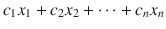

这一限制排除了包含以下形式项的目标函数：

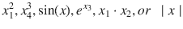

以及其他无数种形式，不过你将在后面看到如何通过模型变换来处理其中一些非线性情况。

最后，约束由矩阵 `a[ij]` 和数组 `b` 参数化，可以表示为一系列关系式，对于 `i ∈ {1, . . . , m}`：

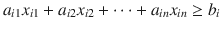，或 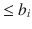，或 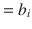

或某些等价的代数形式。

在本章中，我们考虑那些自然表述即为线性连续模型的问题。

## 2.1 混合问题

线性规划的经典范例是饮食问题，这是 20 世纪 30 年代和 40 年代（是 20 世纪，而非 21 世纪¹）最早被研究的优化问题之一。该问题可能源自一个传说：美国军方希望在满足野战士兵营养需求的同时，将食品成本降至最低。早期研究该问题的学者之一是乔治·斯蒂格勒。他使用启发式方法对线性规划的最优解进行了有根据的猜测。1947 年秋天，美国国家标准局（NBS，即现在的 NIST）数学表项目的杰克·拉德曼着手用新的单纯形法求解斯蒂格勒的模型。该线性模型由 9 个方程和 77 个未知数组成，在当时是一个巨大的问题。本书中的一些模型规模要大几个数量级，但求解时间却只是 1947 年 NBS 人员解决饮食问题所用时间的极小一部分。效率的提升部分归功于硬件，但主要归功于软件。

该问题的一个通用版本是：

- 给定一份食品清单，每种食品含有一定的营养成分，且各有成本，找出能最小化成本同时提供所有必需营养素的食品组合。

以下是该问题的一个简单版本。食品为 `F0`、`F1`、`F2`、`F3` 等（想象它们是披萨、拉面、纸杯蛋糕、薯片等；或者，如果你更注重健康，也可以是豆腐、青豆、藜麦、甜菜等）。营养素用 `N0`、`N1`、`N2`、`N3` 等表示（想象它们是卡路里、蛋白质、钙、维生素 A 等）。每种食品都有每份的成本。此外，为了避免整周只吃一种食物，我们限制每周的份数。

**表 2-1** 饮食问题的数据与求解示例

|   | N0 | N1 | N2 | N3 | 最小值 | 最大值 | 成本 | 解 |
|---|----|----|----|----|-----|-----|------|---------|
| F0 | 606 | 563 | 665 | 23 | 7 | 17 | 9.06 | 17.0 |
| F1 | 68 | 821 | 83 | 72 | 6 | 27 | 8.42 | 7.47 |
| F2 | 28 | 70 | 916 | 56 | 1 | 36 | 9.47 | 6.11 |
| F3 | 121 | 429 | 143 | 38 | 14 | 26 | 6.97 | 14.0 |
| F4 | 60 | 179 | 818 | 46 | 9 | 35 | 4.77 | 35.0 |
| 最小值 | 5764 | 28406 | 48157 | 1642 |   |   |   |   |
| 最大值 | 15446 | 76946 | 82057 | 6280 |   |   |   |   |
| 解 | 14775 | 28406 | 48157 | 3413 |   |   | 539.37 |   |

### 2.1.1 构建模型

一个解决方案除了列出每种食物的份量之外，还能是什么呢？因此，决策变量必须对应每种食物，代表其份数。我们将这些变量命名为 `f[0]`, …, `f[n]`。我们假设允许出现分数答案（即半份也是可以接受的）。

目标是**最小化成本**。每种食物都有一个成本（`c[0]`, …, `c[n]`）。这些不是变量，而是数据。因此，我们要做的是最小化所有乘积 `c[i] × f[i]` 的总和。由此得出目标函数：

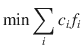

接下来处理约束条件。我们有两组约束：一组表示每种食物可接受份量的范围（假设食物 `i` 的最小值为 `l[i]`，最大值为 `u[i]`），另一组表示所需营养素的取值范围（营养素 `j` 的最小值为 `a[j]`，最大值为 `b[j]`）。较简单的约束与食物相关。由于我们的决策变量表示每种食物的份数，我们只需对每个份数进行范围限定：

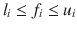

(2.1)

关于营养素的约束则稍微复杂一些。考虑营养素 `j`。饮食中会包含多少这种营养素？每种食物 `i` 可能含有一定量的该营养素，如表 2-1 所示。我们将这个量称为 `N[ji]`（对应于食物 `i` 所在行与营养素 `j` 所在列交叉处的条目）。要得到这种营养素的总量，我们需要对所有食物求和，即每种食物的份量与其营养素含量的乘积。对于每种营养素 `j`：

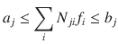

理论部分到此结束。现在我们将它转化为一个可执行的、通用性足以解决所有此类问题的模型（列表 2-1）。我们假设数据以名为 `N` 的二维数组形式给出。其结构与表 2-1 相同，但不包含最后一列和最后一行。每一行代表一种食物，但最后两行代表每种营养素的最小和最大需求量（由列表示），而最后三列则代表每种食物份量的最小值、最大值和成本。

**列表 2-1** 最低成本饮食模型（`diet problem.py`）

```python
def solve_diet(N):
  s = newSolver('Diet')
  nbF,nbN = len(N)-2, len(N[0])-3
  FMin,FMax,FCost,NMin,NMax = nbN,nbN+1,nbN+2,nbF,nbF+1
  f = [s.NumVar(N[i][FMin], N[i][FMax],'') for i in range(nbF)]
  for j in range(nbN):
    s.Add(N[NMin][j]<=s.Sum([f[i]*N[i][j] for i in range(nbF)]))
    s.Add(s.Sum([f[i]*N[i][j] for i in range(nbF)])<=N[NMax][j])
  s.Minimize(s.Sum([f[i]*N[i][FCost] for i in range(nbF)]))
  rc = s.Solve()
  return rc,ObjVal(s),SolVal(f)
```

该模型使用 `newSolver` 函数来简化代码表达³，读者可以在列表 2-2 中看到。这些以及其他简化方法都可以在 `my_or_tools.py` 中找到。

**列表 2-2** 用于创建适当求解器实例的实用函数

```python
from ortools.linear_solver import pywraplp
def newSolver(name,integer=False):
  return pywraplp.Solver(name,\
    pywraplp.Solver.CBC_MIXED_INTEGER_PROGRAMMING \
    if integer else \
    pywraplp.Solver.GLOP_LINEAR_PROGRAMMING)
```

为了便于模型表达，第 3-4 行为我们将要使用的行和列索引赋予了有意义的名称。在第 5 行，我们定义了决策变量，每种食物一个，其取值范围如公式 (2.1) 所示，即 `[l[i], u[i]]`。将范围设为 `[0, +∞)` 然后添加约束来强制边界也是正确的。求解器仍会找到相同的解，但尽可能限制决策变量的范围更简单，也是一种良好实践。在复杂模型中，这通常能显著缩短求解时间。

从第 6 行开始的两行循环根据公式 (2.1.1) 建立了每种营养素的取值范围。第 9 行及后续行创建了目标函数，求解问题，并返回三个数值：求解器的状态（应为零）、最优值以及最优解。函数 `SolVal` 和 `ObjVal`（见列表 2-3）的双重作用是简化返回给调用者的结果以及代码的可读性。

**列表 2-3** 用于从 OR-Tools 对象中提取值的实用函数

```python
def SolVal(x):
  if type(x) is not list:
    return 0 if x is None \
      else x if isinstance(x,(int,float)) \
      else x.SolutionValue() if x.Integer() is False \
      else int(x.SolutionValue())
  elif type(x) is list:
    return [SolVal(e) for e in x]
def ObjVal(x):
  return x.Objective().Value()
```

执行此模型的结果显示在表 2-1 的最后一行和最后一列。该列表示每种食物的份数，该行表示饮食中将包含的每种营养素的量。读者应该注意到，许多食物项目和营养素含量都处于其所需的最小值。这对于此类模型来说是意料之中的，因为我们试图最小化一个线性成本函数；最优解应尽可能向约束边界靠拢。

读者可以尝试使用此模型。它作为 `diet problem.py` 包含在附加材料中，同时还有一个随机饮食问题生成器，以及一个用于以类似于表 2-1 的表格格式显示解决方案的例程。

### 2.1.2 变体

该问题存在若干简单变体。

- 我们可能并非要最小化成本，而是给定一个利润需要最大化。也可能在食物或营养素中不存在最小值或最大值。
- 当额外增加诸如“如果使用了食物 2，那么饮食中必须至少包含等量的食物 3”或“营养素 3 的摄入量必须至少是营养素 4 的两倍”这类要求时，问题会变得更加复杂，也因此更有趣。让我们详细探讨其中一些情况。首先，尝试“如果使用了食物 2，那么食物 3 的份数也必须至少相等”。以下不等式可确保所需结果：`f[3] >= f[2]`。请注意，即使未使用食物 2，食物 3 仍可被包含，这并不违反要求。而如果使用了食物 2，那么食物 3 的份数将至少与之相等。显然，该要求也可以反过来表述为“食物 2 的份数不得超过食物 3”。约束条件相同。
- 对营养素的要求，例如“营养素 3 的摄入量必须至少是营养素 4 的两倍”，性质类似，但需注意，任何给定营养素的含量都分散在所有食物中。引入辅助变量来统计营养素含量可能会很有帮助，例如设 `n[j]`。然后我们为每种营养素在模型中添加一个等式：

```
n_j <= sum_i N_ij * f_i
```

请注意，这些等式并不约束问题本身；它们的引入只是为了实现该要求而提供的一种便捷手段。现在，我们可以根据新要求轻松关联营养素含量，如下所示：

```
n_3 >= 2 * n_4
```

如果我们没有定义变量 `n[i]`，则上述要求可以表述为：

```
sum_i N_i3 * f_i >= 2 * sum_i N_i4 * f_i
```

定义辅助变量 `n[j]` 似乎更清晰。此外，在最后显示每种营养素的总量可能有助于分析或呈现解决方案。
- 读者可能会想到一个类似的要求，即“如果使用了食物（营养素）3，则不得使用食物（营养素）4（反之亦然）”。这看起来像是上述情况的简单变体，但实际上绝非简单。事实上，它迫使建模者使用不同的建模技术。你将在后续章节中了解如何实现此类要求（例如，参见第 7 章第 7.2 节）。正确建模此类要求有两种有效方法：整数规划和约束规划。鼓励读者花些时间尝试对这些约束进行建模，以培养对其中难点的直觉。关键在于，这也是此类问题完全不同的原因所在：变化不仅仅是数量上的（如“与……一样多”或“是……的两倍”），还额外涉及性质上的变化：我们在“拥有某个元素”和“不拥有该元素”之间进行转换。

### 2.1.3 所考虑问题的结构

具有饮食问题结构的问题通常被称为产品组合问题。它们可以以各种方式呈现，但如果能将其纳入抽象的**表 2-2** 中，则都可以按照本节所述的方法处理。当然，某些列或行可能缺失（没有成本、没有价格、没有最大需求等）。这只会简化模型。

**表 2-2** 产品组合问题的抽象结构

|       |       | 成分 | 可用量 | 成本 |
|-------|-------|------------|----------------|------|
|       |       | `C[1]` ... `C[n]` | 最小值 | 最大值 |      |
|       | `P[1]` | 99 ... 99 | 99 | 99 | 99 |
| 产品 | ... | ... ... ... | ... | ... | ... |
|       | `P[m]` | 99 ... 99 | 99 | 99 | 99 |
| 需求 | 最小值 | 99 ... 99 | 99 | 99 | 99 |
|       | 最大值 | 99 ... 99 | 99 | 99 | 99 |
| 价格 |       | 99 ... 99 | 99 | 99 | 99 |

决策变量表示所需产品的数量，约束条件表示原材料的可用量，或加工单元的能力以及需求界限。目标通常是最大化利润、最小化成本，或者仅仅是确定生产数量。

以下是一些实例，帮助读者识别其底层结构。鼓励读者通过自行设定数字，将这些问题整理成**表 2-2** 的格式。

- 一家工厂生产多种类型的水泥。每种产品都由相同的元素组成，但数量不同，并且我们手头每种元素的供应量有限，且各有成本。每种最终产品都对应一个利润。为了最大化利润，最佳的产品组合是什么？
- 一家总部位于佛罗里达州的果汁公司为不同市场生产橙汁饮料、果汁和浓缩汁。所有产品的原材料都是橙子、糖、水以及时间，数量各不相同，有些为正，有些为负（生产橙汁饮料需要水；生产浓缩汁会产生水）。在给定可用量的情况下，公司生产多少才能最大化利润？
- 一家玩具制造商生产多种不同的玩具。每种玩具都由若干种基础材料组成，此外还需要特殊加工（组装、喷漆、包装）。加工在专用机器上进行，并且有持续时间。由于制造商的材料和机器供应有限，且机器每天只能运行一定小时数，那么可以生产多少玩具？
- 一家名为布什、罗夫公司（BR & Co.）的化肥公司有两种产品：高磷混合肥和低磷混合肥。它们是通过混合不同数量的原材料制成的。公司可以从其子公司处每天以固定的内部成本采购最多一定数量的每种原材料。该成本包括劳动力、电力、折旧、运输、贿赂等。此外，混合过程每吨产品会产生一定的成本。两种产品都以固定价格出售给批发商福克斯公司。而且，批发商已同意购买 BR & Co. 能够生产的所有产品。那么，每种肥料应该生产多少？
- 奎奎格销售半公斤袋装的咖啡，有三种混合口味：家常、特调和美食，每袋售价不同。每种混合口味由不同比例的哥伦比亚、古巴和肯尼亚咖啡豆制成。奎奎格手头有一些哥伦比亚、古巴和肯尼亚咖啡豆。为了最大化收入，每种混合口味应该装袋多少？

## 2.2 混合问题

另一类易于用线性模型描述的问题是混合问题。经典案例涉及混合所谓的原油或粗汽油，以生产具有特定辛烷值的各种精炼产品。例如，假设我们有粗汽油 `R0, R1, ... , Rn`，每种都有特定的辛烷值、最大可用桶数以及每桶成本，如表 2-3 所示。

**表 2-3** 混合问题中粗汽油示例

| 汽油 | 辛烷值 | 可用量 | 成本 |
| --- | --- | --- | --- |
| R0 | 99 | 782 | 55.34 |
| R1 | 94 | 894 | 54.12 |
| R2 | 84 | 631 | 53.68 |
| R3 | 92 | 648 | 57.03 |
| R4 | 87 | 956 | 54.81 |
| R5 | 97 | 647 | 56.25 |
| R6 | 81 | 689 | 57.55 |
| R7 | 96 | 609 | 58.21 |

我们还获得了多种精炼汽油（例如青铜级、银级和金级）的需求，每种都有各自的辛烷值。需求以最小和最大桶数以及销售价格的形式给出，如表 2-4 所示。

`表 2-4` 混合问题中精炼汽油示例

| 汽油 | 辛烷值 | 最小需求 | 最大需求 | 价格 |
| :--- | :--- | :--- | :--- | :--- |
| `F0` | 88 | 415 | 11707 | 61.97 |
| `F1` | 94 | 199 | 7761 | 62.04 |
| `F2` | 90 | 479 | 12596 | 61.99 |

我们通过混合适当的粗汽油来生产这三种产品，假设混合物的辛烷值是混合体积的线性函数。这是一个关键假设：如果将辛烷值为 80 和 90 的汽油各半混合，我们会得到辛烷值为 85 的混合物，因为
```
1/2 * 80 + 1/2 * 90 = 40 + 45 = 85
```
如果将 40% 辛烷值为 80 的汽油与 60% 辛烷值为 90 的汽油混合，我们会得到
```
40/100 * 80 + 60/100 * 90 = 32 + 54 = 86
```
这个假设是混合模型的关键。请注意，可能存在多种混合粗汽油以达到所需辛烷值的方法。我们的任务是构建一个模型，该模型能精确告诉我们如何混合粗产品以满足需求并最大化利润（理解为成品总销售价格与粗汽油总成本之间的差额）。

## 2.2.1 构建模型
要回答的问题是什么？让我们以越来越精确的方式多次提出这个问题。初步尝试是“每种精炼汽油各生产多少？”这虽然正确但不完整，因为我们需要知道每种精炼汽油的组成，即每种粗汽油在每种混合物中的用量。第二次尝试是“如何混合粗汽油以生产精炼汽油？”这是正确的问题，但尚未形成适合代数模型的形式。想象你是炼油厂的经理。一边是装满粗汽油的储罐，另一边是即将盛放精炼汽油的空罐。中间是数英里长的管道，上面有你控制的阀门。你真正想知道的是打开哪些阀门以及打开多少才能得到精确的混合物。因此，正确的问题是“每种粗汽油有多少进入每种精炼汽油？”
本节混合问题与前一节混合问题的关键区别在于：在前一节中，我们已知产品相对于原料的精确组成（例如，每种食物中每种营养素的含量）；而在此处考虑的问题中，每种产品的组成正是我们寻求的答案之一。
由于我们需要知道多少粗汽油 `i` 进入精炼汽油 `j`，我们引入一个二维决策变量，例如 `G[ij]`，其中 `i` 是粗汽油的索引，`j` 是精炼汽油的索引。例如，`G[51] = 250` 表示有 250 桶粗汽油 5 进入精炼汽油 1 的混合物中。我们在此理解单位是桶；这似乎很自然，因为价格是按桶计算的。我们可能还应该引入辅助变量来帮助建模和呈现解决方案：每种粗汽油的总量（`G` 矩阵中一行的和），例如 `R[i]`，以及每种精炼汽油的总量（`G` 矩阵中一列的和），例如 `F[j]`。因此，我们在模型中将有以下非约束性方程：
```
R_i = sum_j G_ij   ∀ i
```
(2.2) 以及
```
F_j = sum_i G_ij   ∀ j
```
(2.3)
注意，根据构造，`sum_i R_i = sum_j F_j`。也就是说，所用粗汽油的总体积等于精炼产品的总体积。我们不需要强制执行这一点，尽管我们需要它。我们可以将其视为一个“连续性”方程：它反映了精炼过程不会沿途损失产品。这种连续性的概念是一个有用的建模思路。它将在我们开发的模型中反复出现。
有了这些变量，我们现在可以轻松地对目标函数进行建模。我们的目标是最大化利润，即总销售额（给定精炼汽油 `j` 的价格 `p[j]`）与总成本（给定粗汽油 `i` 的成本 `c[i]`）之间的差额，
```
max sum_j F_j * p_j - sum_i R_i * c_i
```
约束条件有多种形式。简单的约束条件与混合问题中的类似，即每种原料的可用量限制。借助我们的辅助变量，这些约束很容易表达，并且可以包含在定义变量的范围或约束条件中
```
0 <= R_i <= u_i   ∀ i
```
关于精炼汽油需求（最小和/或最大）的约束同样简单：
```
a_j <= F_j <= b_j   ∀ i
```
注意我们的辅助变量如何帮助编写约束条件。如果只有我们的决策变量，约束条件将不得不根据列和与行和来编写。
该问题唯一的复杂之处在于辛烷值。关键在于线性假设。为了理解如何对辛烷值需求进行建模，让我们设想一个简单的情况：假设我们将 800 桶辛烷值为 98 的原油 1 与 200 桶辛烷值为 90 的原油 2 混合。最终的辛烷值是多少？由于我们总共有 1,000 桶精炼油：
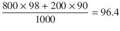
因此，一般来说，我们需要混合中每种原油的比例乘以其辛烷值。假设 `O[i]` 为原油 `i` 的辛烷值，`o[j]` 为精炼油 `j` 的辛烷值，这引出了：
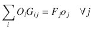
(2.4)
现在我们有了一个代数线性模型。让我们将其转换为可执行代码，如清单 2-4 所示。我们假设数据以二维数组的形式输入，与表 2-3 和 2-4 完全相同，但第一列除外，该列仅为参考而添加。
```
1  def solve_gas(C, D):
2    s = newSolver('Gas blending problem')
3    nR,nF = len(C),len(D)
4    Roc,Rmax,Rcost = 0,1,2
5    Foc,Fmin,Fmax,Fprice = 0,1,2,3
6    G = [[s.NumVar(0.0,10000,'')
7        for j in range(nF)] for i in range(nR)]
8    R = [s.NumVar(0,C[i][Rmax],'') for i in range(nR)]
9    F = [s.NumVar(D[j][Fmin],D[j][Fmax],'') for j in range(nF)]
10    for i in range(nR):
11      s.Add(R[i] == sum(G[i][j] for j in range(nF)))
12    for j in range(nF):
13      s.Add(F[j] == sum(G[i][j] for i in range(nR)))
14    for j in range(nF):
15      s.Add(F[j]*D[j][Foc] ==
16          s.Sum([G[i][j]*C[i][Roc] for i in range(nR)]))
17  Cost = s.Sum(R[i]*C[i][Rcost] for i in range(nR))
18  Price = s.Sum(F[j]*D[j][Fprice] for j in range(nF))
19  s.Maximize(Price - Cost)
20  rc = s.Solve()
21  return rc,ObjVal(s),SolVal(G)
```
`清单 2-4` Gasoline Blending Model (`gas blend.py`)
在第 3-5 行，我们声明了一些常量以访问数据的相应行和列。每个变量的范围约束不是作为约束输入的，而是作为相应变量的范围输入的。方程(2.2)-(2.3)出现在从第 10 行开始的四行中。
混合方程是在第 14 行的循环中创建的。请注意，由于目标是达到特定的辛烷值，我们可以将等式替换为不等式，表明精炼产品至少达到所需的辛烷值水平。这稍微放宽了问题，并允许在更大的空间上进行优化。例如，如果我们没有足够的低辛烷值原油汽油可用，则可能需要这样做。
目标函数（从第 17 行开始的三行）最大化精炼产品的销售价格与所用原油成本之间的差值。
使用上述数据执行此模型将生成表 2-5，其中右下角的数字是利润：即 `Price` 行之和与 `Cost` 列之和的差值。
`表 2-5` 混合问题的完整解

|   | `F0` | `F1` | `F2` | 桶数 | 成本 |
| :--- | :--- | :--- | :--- | :--- | :--- |
| `R0` | 542.5 |   | 239.5 | 782.0 | 43275.88 |
| `R1` |   | 894.0 |   | 894.0 | 48383.28 |
| `R2` | 631.0 |   |   | 631.0 | 33872.08 |
| `R3` |   | 648.0 |   | 648.0 | 36955.44 |
| `R4` | 704.41 | 251.59 |   | 956.0 | 52398.36 |
| `R5` |   | 647.0 |   | 647.0 | 36393.75 |
| `R6` | 449.5 |   | 239.5 | 689.0 | 39651.95 |
| `R7` | 50.93 | 558.07 |   | 609.0 | 35449.89 |
| 桶数 | 2378.33 | 2998.67 | 479.0 |   |   |
| 价格 | 147385.32 | 186037.28 | 29693.21 |   | 36735.18 |

## 2.2.2 变体
虽然混合问题可以以各种方式呈现，但它们都可以用上述方式处理。决策变量应该是二维的：一个维度上的总和以及另一个维度表示使用的总输入材料和产生的总输出材料。最后，除了产能和需求约束外，至少应该有一个满足线性假设的混合约束。
一个有趣的变体是，我们可能需要实现不止一个特性。例如，除了辛烷值水平，我们可能还知道每种原油中特定的硫浓度，并要求将精炼汽油的硫含量保持在某个阈值以下。在这种情况下，辛烷值方程(2.4)几乎肯定需要被一个不等式替换，以确保最低辛烷值水平，另一个类似的不等式将确保最高硫含量。假设 `S[i]` 为原油 `i` 的硫含量，`s[j]` 为精炼油 `j` 的硫含量，我们得到：

以及
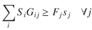
使用不等式的原因是，问题不太可能恰好具有指定的辛烷值和硫含量水平的可行解。读者可以尝试修改清单 2-4 来验证这一点。
为了帮助读者识别混合问题的底层结构，以下是一个我们很快会再次遇到的实例，它包含额外的复杂性。
一种在垃圾食品中非常流行的成分是通过精炼和混合各种油类制造的。这些油有五种口味（`O1` 到 `O5`）和“硬度”指标，如表 2-6 所示，其中成本以美元/吨计，硬度以适当单位计量。
`表 2-6` 油类混合问题数据

|   | `O1` | `O2` | `O3` | `O4` | `O5` |
| :--- | :--- | :--- | :--- | :--- | :--- |
| 成本 | 110 | 120 | 130 | 110 | 115 |
| 硬度 | 8.8 | 6.1 | 2.0 | 4.2 | 5.0 |

油 `O1` 和 `O2` 可以在生产设施 A 中精炼，该设施每月产能为 200 吨，而 `O3`、`O4` 和 `O5` 可以在生产设施 B 中精炼，该设施每月产能为 250 吨。精炼过程中没有重量损失，并且可以忽略该过程的成本。
最终产品是通过混合不同数量的五种油获得的。它有一个硬度限制。使用与表中相同的单位测量，它必须介于 3 和 6 个单位之间。假设硬度是线性混合的。也就是说，如果我们混合 10 吨 `O1` 油和 20 吨 `O2` 油，混合物的硬度评级为：
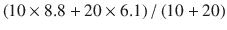
最终产品的售价为每吨 150 美元。应如何精炼和混合这些油以最大化利润？

## 2.3 项目管理
在优化领域中通常理解的项目管理，是指一组任务 `T`，每个任务具有两个属性：
- 持续时间
- `T` 的一个子集（可能为空），表示前置任务
经典的例子是房屋建造：任务包括选址、绘制图纸、获取许可、破土动工、打地基、砌墙、安装管道、贿赂检查员等。关键在于，某些任务必须在其他任务之前完成：你不能在砌好墙之前建造屋顶。主要考虑的问题是：“每个任务应该何时开始，以最小化整个项目的完成时间？”也就是说，我们何时开始每个任务，才能以最短的时间将房子完全建好？此外，如果某个任务落后于计划，会对所有后续任务产生什么影响，我们又该如何重新安排它们？
表 2-7 是此类项目的一个实例，我将用它来说明一种求解技术。
`表 2-7` 项目管理任务示例

| 任务 | 持续时间 | 前置任务 |
| :--- | :--- | :--- |
| 0 | 3 | { } |
| 1 | 6 | { 0 } |
| 2 | 3 | { } |
| 3 | 2 | { 2 } |
| 4 | 2 | { 1 2 3 } |
| 5 | 7 | { } |
| 6 | 7 | { 0 1 } |
| 7 | 5 | { 6 } |
| 8 | 2 | { 1 3 7 } |
| 9 | 7 | { 1 7 } |
| 10 | 4 | { 7 } |
| 11 | 5 | { 0 } |

## 2.3.1 构建模型
在这个实例中，我们需要决定每个任务最早何时开始，同时尊重前置关系，以最小化总完成时间。这提示我们，可以将每个任务的开始时间作为决策变量，其单位与给定的持续时间相同。假设我们有一个任务集合 `T`（对应于表 2-7 的第一列），来声明我们的决策变量为
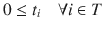
为了确保满足前置要求，假设除了持续时间 `D[i]`（对应于表 2-7 的第二列）之外，对于每个任务 `i`，我们还有前置任务的子集 `T[i] ⊂ T`（对应于表 2-7 的第三列）。那么我们需要通过以下方式对开始时间设置下界：
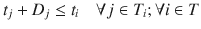
目标是最小化项目完成时间。如果所有任务都是顺序执行的，那么这个时间将是最后一个任务的开始时间加上其持续时间。但实际情况很可能并非如此；我们可能会尽可能多地并行执行任务。那么，如果我们不知道最后一个任务是什么，或者没有单一的“最后一个”任务，我们如何找到完成时间呢？
让我们引入另一个变量 `t`。我们将约束这个 `t` 大于每个任务的开始时间加上其持续时间。因此，它将大于完成时间。如果我们向约束集合中添加目标 `min t`
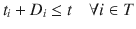
那么，在最优解下，`t` 将是完成时间，无论我们并行执行多少个任务，这个条件都将成立。
这在清单 2-5 中被转化为一个可执行的模型，其中我们假设数据以表 `D` 的形式提供给我们，其结构与表 2-7 相同：每一行都有一个任务标识符、一个持续时间以及一个可能为空的前置任务集合。
```
1  def solve_model(D):
2    s = newSolver('Project management')
3    n = len(D)
4    max = sum(D[i][1] for i in range(n))
5    t = [s.NumVar(0,max,'t[%i]' % i) for i in range(n)]
6    Total = s.NumVar(0,max,'Total')
7    for i in range(n):
8      s.Add(t[i]+D[i][1] <= Total)
9      for j in D[i][2]:
10        s.Add(t[j]+D[j][1] <= t[i])
11  s.Minimize(Total)
12  rc = s.Solve()
13  return rc, SolVal(Total),SolVal(t)
```
`清单 2-5` Project management model (`project management.py`)
第 4 行通过将所有持续时间相加，计算出一个有效的时间上界。这显然是一个高估的值，但在第 5 行声明决策变量时使用是合适的。我们在第 6 行声明了总完成时间变量，并在第 8 行将其用作所有开始时间加上持续时间的上界。最后，我们在第 10 行添加了前置约束。结果出现在表 2-8 中，并以图形方式显示在图 2-1 中。请注意，最后一个结束时间就是项目的总完成时间。
`表 2-8` 项目管理问题的一个最优解

| 任务 | 0 | 1 | 2 | 3 | 4 | 5 | 6 | 7 | 8 | 9 | 10 | 11 |
| :--- | :--- | :--- | :--- | :--- | :--- | :--- | :--- | :--- | :--- | :--- | :--- | :--- |
| 开始时间 | 0 | 3 | 0 | 3 | 9 | 0 | 9 | 16 | 26 | 21 | 24 | 23 |
| 结束时间 | 3 | 9 | 3 | 5 | 11 | 7 | 16 | 21 | 28 | 28 | 28 | 28 |

请注意，所有任务都可以在其前置任务结束后的任何时间开始。事实上，根据所使用的求解器，解可能看起来相当不同。你可以在表 2-9 中看到一个替代解的例子。这种存在多个最优解的情况，为我们这些建模者提供了改进模型的机会。在这种特定情况下，尽可能早地开始所有任务可能是有用的。这不会影响总完成时间，但可能会使项目更实用，并且在某些任务的持续时间被低估时，更不容易出现延误。
`表 2-9` 项目管理问题的另一个最优解

## 2.3.1 任务时间表示例

| 任务 | 0 | 1 | 2 | 3 | 4 | 5 | 6 | 7 | 8 | 9 | 10 | 11 |
|---|---|---|---|---|---|---|---|---|---|---|---|---|
| 开始时间 | 0 | 3 | 0 | 3 | 9 | 0 | 9 | 16 | 21 | 21 | 21 | 3 |
| 结束时间 | 3 | 9 | 3 | 5 | 11 | 7 | 16 | 21 | 23 | 28 | 25 | 8 |

最后请注意，通过观察图形表示，可以清楚地看到任务子集 0、2、1、6、7、9 是关键任务，因为如果其中任何一个任务被延迟，项目的完成时间就会被延迟。在小型项目中，这种图形表示足以识别关键任务。在大型项目中，通过编程方式识别这些任务可能更有利。你将在第 4 章的第 4.4.3 节中看到一种计算关键路径的方法，届时我将讨论最长路径。

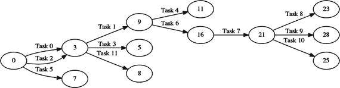
图 2-2 替代解的图形表示

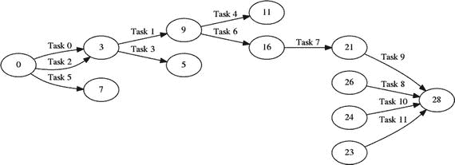
图 2-1 示例解的图形表示（节点为时间点）

### 2.3.2 变体

我在图 2-1 和图 2-2 中展示了该问题的两个可能解。出于实际原因，替代解可能更可取。我们如何确保，在所有最小化总完成时间的解中，我们选择一个尽可能早地开始所有任务的解呢？一种方法是最小化开始时间的总和。

也就是说，将目标函数替换为

```
s.Minimize(sum(t[i] for i in range(n)))
```

在这种情况下，优化者会谈论多目标。通常，这些目标可能是独立的，或者更糟，是相互矛盾的。但在我们的项目管理情境中，目标（最小化完成时间和尽可能早地开始所有任务）是一致的。请注意，模型的新最优值既无趣也无用。我们需要检查 `Total` 变量来获得完成时间。

#### 2.3.2.1 极小化极大问题

我们在项目管理中使用的技术，可以更普遍地应用于任何面临极小化极大问题（minimax problem）的场景。这类问题中，我们希望最小化一组函数中的最大值。例如，假设我们想找到满足下式的最优 `x`：

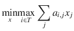

这可以通过引入一个新变量（例如 `t`）以及目标函数

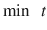

和约束条件

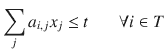

来处理。相应的极大化极小问题（maximin problem）也以类似方式处理。请注意，相关的极大化极大问题（maximax）和极小化极小问题（minimin）处理起来要困难得多。我们将在后续章节中重新讨论这些问题（参见第 7 章第 7.2.4 节）。

#### 2.3.2.2 绝对值问题

本质上相同的方法也可用于某些非线性函数，例如涉及绝对值的函数。假设我们寻求满足下式的最优 `x`：

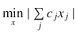

由于绝对值函数的定义为

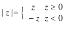

我们可以使用相同的 `min t` 目标函数，并配合约束条件

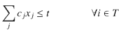

和

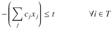

我将在第 3 章第 3.2 节中阐述该技术的一些重要应用。

## 2.4 多阶段模型

在生活中，一个阶段的决策常常会影响后续阶段的决策。在更常见的情境中也是如此。例如，考虑一个仓库：月末的库存量无疑会影响下月初的订货量。

从某种意义上说，这些多阶段模型并没有什么新内容，除了我们需要小心地建立从一个阶段到下一个阶段的连续性。

为了说明这一点，让我们重新审视混合问题。针对多个目标、价格和成本，我们将增加一个跨越数月的规划周期。这将体现各个阶段。该问题将需要你迄今为止学到的所有技巧和技术（甚至更多）。它构成了对本章内容的全面回顾。

### 2.4.1 问题实例

肥皂是通过精炼和混合各种油类制成的。这些油有各种类型（如杏油、鳄梨油、菜籽油、椰子油等），每种油都含有多种脂肪酸（如月桂酸、亚油酸、油酸等），且比例各不相同。例如，参见表 2-10。

**表 2-10** 油类 (`Oi`) 及其脂肪酸含量 (`Aj`) 示例

|   | A0 | A1 | A2 | A3 | A4 | A5 | A6 |
|---|----|----|----|----|----|----|----|
| O0 | 36 | 20 | 33 | 6  | 4  |    | 1  |
| O1 |    | 68 | 13 |    |    | 8  | 11 |
| O2 |    | 6  |    | 66 | 16 | 5  | 7  |
| O3 |    | 32 |    |    |    | 14 | 54 |
| O4 |    |    | 49 | 3  | 39 | 7  | 2  |
| O5 | 45 |    | 40 |    | 15 |    |    |
| O6 |    |    |    |    |    | 28 | 72 |
| O7 | 36 | 55 |    |    |    |    | 9  |
| O8 | 12 | 48 | 34 |    | 4  | 2  |    |

根据所生产肥皂的特性（清洁力、起泡性、对皮肤的干燥程度等），需要通过适当混合油类，使最终脂肪酸的比例落在特定范围内。例如，我们将目标肥皂的脂肪酸含量设定在表 2-11 所示的范围内。

**表 2-11** 脂肪酸含量目标

|   | A0   | A1   | A2   | A3  | A4  | A5  | A6   |
|---|------|------|------|-----|-----|-----|------|
| 最小值 | 13.3 | 23.2 | 17.8 | 3.7 | 4.6 | 8.8 | 23.6 |
| 最大值 | 14.6 | 25.7 | 19.7 | 4.1 | 5.0 | 9.7 | 26.1 |

这里还有一个与时间段相关的额外复杂因素。我们将规划一定数量的月份。每种油可以立即购买，也可以在期货市场上购买以便在未来某个月份交货。每种油在每个月的价格（美元/吨）如表 2-12 所示。

**表 2-12** 规划周期内各油类成本（美元/吨）

|   | 第 0 月 | 第 1 月 | 第 2 月 | 第 3 月 | 第 4 月 |
|---|---------|---------|---------|---------|---------|
| O0 | 118     | 128     | 182     | 182     | 192     |
| O1 | 161     | 152     | 149     | 156     | 174     |
| O2 | 129     | 191     | 118     | 198     | 147     |
| O3 | 103     | 110     | 167     | 191     | 108     |
| O4 | 102     | 133     | 179     | 119     | 140     |
| O5 | 127     | 100     | 110     | 135     | 163     |
| O6 | 171     | 166     | 191     | 159     | 164     |
| O7 | 171     | 131     | 200     | 113     | 191     |
| O8 | 147     | 123     | 135     | 156     | 116     |

可以储存最多 1,000 吨油以备后用（可以是任意油类的组合），但每月每吨的持有成本为 5 美元。最后，我们必须满足每月 5,000 吨肥皂的需求。这个需求驱动着模型。

在规划周期开始时，我们有一些库存油类，如表 2-13 所示。如何每月精炼和混合这些油类才能使成本最小化？

**表 2-13** 初始库存（吨）

| 油类 | 持有量 |
|-----|------|
| O0  | 15   |
| O1  | 52   |
| O2  | 193  |
| O3  | 152  |
| O4  | 70   |
| O5  | 141  |
| O6  | 43   |
| O7  | 25   |
| O8  | 89   |

### 2.4.2 构建模型

#### 2.4.2.1 决策变量

需要回答的问题是：“每个月应如何混合各种油类？”这意味着我们需要确定每个月有多少每种油进入最终混合物。这是一个好的开始，但显然还不够。例如，我们可以从购买的油和库存的油中进行混合。

因此，我们需要区分这两个数量。此外，我们可能决定购买并储存（因为价格即将上涨），所以我们还需要知道可以储存多少。这为每种油（`O = {0, 1, 2, … , n[o]}` 表示油类集合）和每个月（`M = {0, 1, 2, … , n[m]}` 表示月份集合）提出了至少三个决策变量：

| `x[i,j] ≥ 0 ∀i ∈ O, ∀j ∈ M` | 购买量   |
|---|---|
| `y[i,j] ≥ 0 ∀i ∈ O, ∀j ∈ M` | 混合量 |
| `z[i,j] ≥ 0 ∀i ∈ O, ∀j ∈ M` | 持有量  |

其含义是：`x[i,j]` 表示在第 `j` 月购买的油 `i` 的吨数；`y[i,j]` 表示混合到肥皂中的吨数；`z[i,j]` 表示月初持有的吨数。请注意，我们在此可以选择让变量表示期初或期末的数量。两种选择都可以接受，但必须在模型中明确选择哪一种，因为它会影响约束条件。在多周期模型中，一个典型的错误是某些约束假设变量表示期初数量，而另一些约束假设表示期末数量。模型可能可以运行，但解将毫无意义。由于我们在规划期开始时已知库存量，让变量表示期初持有量意味着我们可以轻松地用给定数据对其进行初始化。

我们可能还需要知道每月生产了多少肥皂。严格来说，这对于所阐述的问题并非必不可少，但它可能使解的呈现以及某些约束的表述变得简单得多。像往常一样，引入辅助变量有助于澄清一些表述。为了统计每月的总产量：

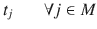

#### 2.4.2.2 约束条件

我们来处理连续性约束。我们需要为每种油和每个月（最后一个月除外）指定库存如何波动，因此：

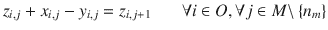

(2.5)

用文字表述，即月初持有的库存加上我们购买的库存减去我们混合的库存，构成了新的库存。

每个月对总油量都有最小和最大存储容量限制，即：

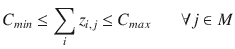

接下来是混合约束，或者更确切地说是一组约束，因为我们需要针对一定数量的脂肪酸设定目标。为了便于公式化，我们先提取总产量：

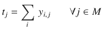

假设对于每种酸 `k ∈ A`，我们有一个目标范围 `[l[k], u[k]]`，并且每种油 `i ∈ O` 含有一定百分比 `p[i,k]` 的所需酸（表 2-10）。由于每种酸的最终产品必须落在特定范围内，我们应该有两个约束：一个针对区间的下限，另一个针对上限。即：

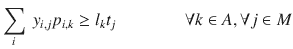

(2.6) 和

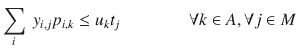

(2.7)

这些约束可以不使用产量变量 `t[j]` 来编写，但那样会更繁琐且难以阅读。

最后，我们需要满足需求。这很简单，假设每个月 `j` 的需求为 `D[j]`：

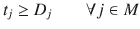

#### 2.4.2.3 目标函数

我们已知目标是 `最小化成本`，成本包括每个月变化的油品成本以及我们库存中持有的油品的固定存储成本。因此：

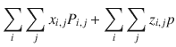

这种目标函数（固定成本加可变成本）在商业类问题中经常出现。在考虑为满足客户需求而选址设施时，你还会再次看到它。建造决策会产生固定成本，而服务不同客户则属于可变成本。

#### 2.4.2.4 可执行模型

现在，我们将此转化为可执行代码，如清单 2-6 所示。需要传入相当多的数据。假设数组 `Part` 如表 2-10 所示，`Target` 如表 2-11 所示，`Cost` 如表 2-12 所示，`Inventory` 如表 2-13 所示，此外还有三个参数：以吨为单位的 `D`（需求），以美元每吨为单位的 `SC`（存储成本），以及以吨为单位的 `SL`（库存持有量的最小值和最大值）。

从第 5 行到第 11 行，我们声明变量，但只有前三个是真正的决策变量。所有其他变量都是人为引入的，要么是为了帮助我们陈述约束条件（第 8 行和第 11 行），要么是为了帮助我们显示结果解决方案的一些细节。它们不会以任何明显的方式影响求解器的运行时间，但会让我们的工作更轻松。

在第 12 行，我们设置 `Hold` 变量，使其包含规划期开始时已知的库存量。

从第 14 行开始的大循环将设置所有约束条件，因为每个月的约束结构相同，并且我们已经将变量声明为按月索引的数组。

第 15 行设置人工变量 `Prod`，使其成为混合油的总和。这实际上不是一个约束，而是一个简化技巧。如果我们在模型中重复某些计算，就像这样：

```
sum(Blnd[i][j] for i in range(nO))
```

我们应该考虑引入一个人工变量。假设求解器性能不错，这不会增加任何成本，而且很可能有所帮助。编程（和建模）的原则之一是“不要重复自己”。

我们紧接着在第 16 行使用这个 `Prod` 变量来确保满足需求。如果需求是一个标量，我们为每个月设置相同的值，但它也可以是一个按月索引的数组。

从第 17 行开始的 `if` 代码实现了我们在方程 (2.5) 中描述的连续性要求。我们确保当月购买的量加上月初持有的量等于当月混合的量加上为下个月存储的量。条件判断是为了避免对超出规划期范围的月份设置约束。

第 20 行和第 21 行确保了我们库存中油品的上下限。

从第 22 行开始的循环首先定义了辅助变量 `Acid`，以简化接下来两行中陈述的混合约束的公式化，这两行对应于方程 (2.6) 和 (2.7)。`Acid` 按脂肪酸 `k` 的序号和所考虑的月份 `j` 进行索引，其值是对所有油品中混合量乘以该油品中酸 `k` 的百分比进行求和。这个值除以总混合量，就是必须落在所需范围内的百分比。

最后，从第 26 行开始的四行设置了人工变量，这些变量将保存每个时期的采购和持有成本，然后对它们求和以构建我们将要最小化的目标函数。

## 清单 2-6 多周期混合模型（`blend_multi.py`）

由于该模型具有一定复杂度，调用方应检查求解器的返回码。返回码必须为零，才能确保解为最优解。最常见的非零返回状态是模型不可行。这可能是由多种原因造成的，其中最可能的原因是没有任何油品组合能够达到我们所需的脂肪酸含量目标。

使用上述所有数据运行一次的结果如表 2-14 所示。该表展示了我们需要了解的所有信息。第一组数据行将发送给采购部门，指定每月每种油品的采购量。接下来的一组数据行将发送给生产部门，描述每月混合操作的具体配方。请注意，为了达到最低成本，每月使用不同的油品来生产肥皂。再下一组数据行将发送给财务部门，描述每月的库存、产品成本以及存储成本。最后，我们可以将最后一组数据行发送给质量控制部门，其中显示了混合配方实际达到的脂肪酸百分比。

该模型的主要目的是展示真实模型的复杂性，以及在模型层面管理这种复杂性的一些技巧。第二个目的是突出使用 Python 而非专用建模语言进行建模的一些优势。

## 2.4.3 变体

这样一个复杂模型存在无数种变体。

-   需求可能每月变化，如表 2-14 所示。

    表 2-14 多周期混合结果

    | 采购量 | 第 0 月 | 第 1 月 | 第 2 月 | 第 3 月 | 第 4 月 |
    | --- | --- | --- | --- | --- | --- |
    | O0 | 1935.7 | 0.0 | 0.0 | 0.0 | 0.0 |
    | O1 | 480.7 | 0.0 | 274.6 | 0.0 | 0.0 |
    | O2 | 192.4 | 0.0 | 545.9 | 0.0 | 0.0 |
    | O3 | 2835.0 | 1553.3 | 0.0 | 0.0 | 0.0 |
    | O4 | 293.7 | 0.0 | 0.0 | 136.8 | 0.0 |
    | O5 | 0.0 | 966.7 | 1611.3 | 0.0 | 0.0 |
    | O6 | 482.6 | 1011.5 | 275.1 | 1517.9 | 0.0 |
    | O7 | 0.0 | 0.0 | 0.0 | 1247.9 | 0.0 |
    | O8 | 0.0 | 1468.5 | 2293.1 | 597.4 | 0.0 |
    | 混合量 | 第 0 月 | 第 1 月 | 第 2 月 | 第 3 月 | 第 4 月 |
    | O0 | 1683.6 | 117.7 | 149.4 | 0.0 | 2034.4 |
    | O1 | 532.7 | 0.0 | 274.6 | 0.0 | 919.5 |
    | O2 | 113.3 | 272.1 | 269.3 | 276.6 | 105.6 |
    | O3 | 1551.3 | 1465.1 | 1524.0 | 0.0 | 382.6 |
    | O4 | 363.7 | 0.0 | 0.0 | 136.8 | 392.7 |
    | O5 | 141.0 | 966.7 | 1051.8 | 559.5 | 0.0 |
    | O6 | 525.6 | 684.9 | 601.7 | 1517.9 | 1165.2 |
    | O7 | 0.0 | 25.0 | 0.0 | 747.9 | 0.0 |
    | O8 | 89.0 | 1468.5 | 1129.2 | 1761.3 | 0.0 |
    | 库存量 | 第 0 月 | 第 1 月 | 第 2 月 | 第 3 月 | 第 4 月 |
    | O0 | 15.0 | 267.2 | 149.4 | 0.0 | 0.0 |
    | O1 | 52.0 | 0.0 | 0.0 | 0.0 | 0.0 |
    | O2 | 193.0 | 272.1 | 0.0 | 276.6 | 0.0 |
    | O3 | 152.0 | 1435.7 | 1524.0 | 0.0 | 0.0 |
    | O4 | 70.0 | 0.0 | 0.0 | 0.0 | 0.0 |
    | O5 | 141.0 | 0.0 | 0.0 | 559.5 | 0.0 |
    | O6 | 43.0 | 0.0 | 326.6 | 0.0 | 0.0 |
    | O7 | 25.0 | 25.0 | 0.0 | 0.0 | 500.0 |
    | O8 | 89.0 | 0.0 | 0.0 | 1163.9 | 0.0 |
    | 产量 | 5000.0 | 5000.0 | 5000.0 | 5000.0 | 5000.0 |
    | 产品成本 | $735098.96 | $616064.04 | $644688.93 | $491829.66 | $0.00 |
    | 存储成本 | $3900.00 | $10000.00 | $10000.00 | $10000.00 | $2500.00 |
    | 酸百分比 | 第 0 月 | 第 1 月 | 第 2 月 | 第 3 月 | 第 4 月 |
    | A0 | 13.6 | 13.3 | 13.3 | 14.6 | 14.6 |
    | A1 | 24.9 | 24.5 | 25.2 | 25.5 | 23.2 |
    | A2 | 17.8 | 18.5 | 17.8 | 17.8 | 19.7 |
    | A3 | 3.7 | 3.7 | 3.7 | 3.7 | 4.1 |
    | A4 | 5.0 | 5.0 | 5.0 | 5.0 | 5.0 |
    | A5 | 8.8 | 8.8 | 8.8 | 9.7 | 9.7 |
    | A6 | 26.1 | 26.1 | 26.1 | 23.6 | 23.6 |
    | 总计 | 100.0 | 100.0 | 100.0 | 100.0 | 100.0 |

-   我们可能被要求最大化利润，而不是满足某些需求。在这种情况下，我们需要知道最终产品的价格，该价格当然可能每月变化。

-   库存水平可能以每种油品为单位来表述，而不是以总量形式。

-   某些油品的脂肪酸含量可能存在不确定性。

## 2.5 模式分类

分类是目前软件最成功的应用之一，它承担了不久之前还属于人类智力特权的任务。例如，软件可以判断一封电子邮件是正常邮件还是垃圾邮件，判断活检细胞是恶性还是良性，以及判断公司是应该给你面试机会，还是让你的简历在云端巨大的比特桶里腐烂。

让我们来看一种最早用于数据二分类的有效技术。这个例子是人为构造的，因为我想通过画图来引导直觉，但我们编写的代码将适用于多种情况。

假设我们正试图根据两个指标（面积和周长）来自动将细胞分类为恶性或良性。这些特征是通过显微镜下细胞图像的自动测量获得的。该过程从收集一批此类细胞开始，由专家将其分为两组。这些组构成了我们软件的所谓训练集。在我们“训练”好软件之后，我们将向它输入专家未曾见过的新数据，它将判断该细胞属于哪一组。也就是说，它将把细胞分类为恶性或良性。这个过程是真实的，并在世界各地的实验室中使用。我在此处做的主要简化是，实际应用中使用的特征远不止两个。

让我们以图 2-3 中绘制的细胞特征为例，其中 x 轴为周长，y 轴为半径。我们可以看到，这两个类别可以用一条直线分开。我们的任务是找到那条直线。当然，存在许多有效的直线，但作为初步尝试，任何能将两类分开的直线都可以。

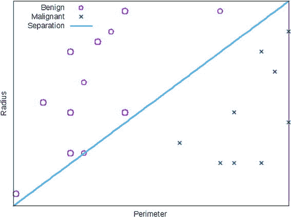

图 2-3 细胞数据与分离超平面

### 2.5.1 构建模型

从代数角度看，一条直线是形如 `a[1] x[1] + a[2] x[2] = b` 的方程，其中 `a[1]`、`a[2]`、`a[0]` 为固定系数。或者，在 `n` 维空间中，我们称之为超平面，其方程为：

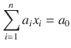

某个特定点 `x` 位于直线的某一侧意味着什么？这意味着要么 `a[1] x[1] + a[2] x[2] < a[0]`，要么 `a[1] x[1] + a[2] x[2] > a[0]`。这些严格不等式可以通过缩放来任意增大间隔。因此，我们可以将任务简化为寻找一个向量 `a`，使得对于 A 类中的每个点 `x′`，都有

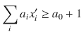

并且对于 B 类中的每个点 `x″`，都有

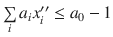

让我们为每个数据点引入一个正变量，例如，对于 A 类的每个点引入 `y[i]′`，对于 B 类的每个点引入 `y[i]″`。现在，不等式 `∑[i] a[i] x[i] ≥ a[0] + 1` 可以通过要求以下条件来强制执行：

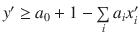

以及

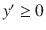

并将 `y′` 最小化为零。对于 B 类的点，代数运算是对称的。总而言之，我们得到了以下优化问题：

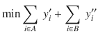

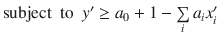,

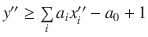,

以及

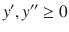

该模型的一个特点是，如果最优目标值为零，我们就得到了一个能够正确将训练集分离为恶性细胞和良性细胞的超平面。但如果该值非零，则意味着该集合无法被超平面分离，因此需要更复杂的技术。

### 2.5.2 可执行模型

让我们将其转换为清单 2-7 中所示的可执行模型。该模型接受两组具有任意数量特征的数据点，这些数据点由某位专家分类为 A 类和 B 类。在第 4 行和第 5 行定义了 A 类和 B 类相对于超平面的潜在偏差后，我们在第 6 行定义了将保存超平面的变量。请注意，我们稍后需要这个超平面来对未知点进行分类。另请注意，系数可以被限制在包含零的任何区间内。只要区间包含零，就可以简单地缩放平面的所有系数，使其代数表达式位于我们选择的任何区间内。

第 8 行和第 10 行的约束条件设置了每个点到超平面的偏移量，目标函数将尝试将其最小化为零。

```python
def solve_classification(A,B):
  n,ma,mb=len(A[0]),len(A),len(B)
  s = newSolver('Classification')
  ya = [s.NumVar(0,99,'') for _ in range(ma)]
  yb = [s.NumVar(0,99,'') for _ in range(mb)]
  a = [s.NumVar(-99,99,'') for _ in range(n+1)]
  for i in range(ma):
    s.Add(ya[i] >= a[n]+1-s.Sum(a[j]*A[i][j] for j in range(n)))
  for i in range(mb):
    s.Add(yb[i] >= s.Sum(a[j]*B[i][j] for j in range(n))-a[n]+1 )
  Agap = s.Sum(ya[i] for i in range(ma))
  Bgap = s.Sum(yb[i] for i in range(mb))
  s.Minimize(Agap+Bgap)
  rc = s.Solve()
  return rc,ObjVal(s),SolVal(a)
```

清单 2-7 分类超平面的识别 (`features.py`)

读者可能会对这个模型感到些许不适，原因至少部分如下：这是一个我们不关心最优值，只关心它是否为零的模型。决策变量（我们已经讨论过为什么这个说法如此不恰当）并没有做出任何决策。`y` 变量集合除了表示一个点违反线性不等式的程度之外，没有真正的解释意义。最后，我们提取出的解中唯一的部分——超平面——尚未被使用。它只会在稍后的另一个程序中用于将新点分类为属于 A 类或 B 类。通过这个模型，我们已经提升到了一个比以往任何时候都更高的抽象层面。

#### 2.5.2.1 变体

从这个模型出发，我们至少有三个方向可以探索。

*   第一个方向是添加约束条件以提高返回超平面的质量。例如，我们可以要求它不仅分离两个集合，而且在某种意义上，与一个集合的距离与另一个集合的距离相等。如果训练集选择得当，这将确保我们后续将错误分类最小化。这被称为最大化间隔，我们将在后面的章节中讨论这个问题。

*   第二个方向是研究当最优值不为零时该怎么办；也就是说，当两个集合无法被超平面分离时。它们可能可以被非线性曲线分离。这个问题很复杂，人们尝试过多种方法，但大多数方法都依赖于对数据的额外了解。我们不会对此进行讨论。

*   最后一个改进是考虑多类分类。我们将在后面的章节中讨论这个问题。

脚注

1 我加上这个时间精度，以防在我身体熵值最大化很久之后，这段文字仍被阅读。

2 为了鼓励读者进行实验，本书中的每个模型都可在附加材料（[`https://github.com/sgkruk/Apress-AI`](https://github.com/sgkruk/Apress-AI)）以及一个随机实例生成器中找到。

3 主要是为了使代码适合页面，同时也为了隐藏 OR-Tools 库的一些冗长之处。作者选择了有意义但相当长的函数名，在我看来这是正确的选择。