# 3. 隐式线性连续模型

本章中，我们将对某些问题进行“暴力”改造，以揭示其内在结构。重点在于那些乍看之下并非连续线性类型，但通过一些创造性的调整却能转化为该形式的问题。关键在于确保原始问题与改造后问题之间存在一一对应关系，这样我们就能从改造后问题的解中还原出原始问题的解。

以这种方式处理问题的主要原因是，连续线性求解器的速度已经变得非常快，能够处理包含数十万个变量和约束的模型。因此，如果一个问题能够以这种方式建模，那么可求解的实例规模实际上几乎没有限制。正如你稍后将看到的，更复杂的模型则并非如此。事实上，我们可以编写只有几十个变量的模型，但当前没有任何求解器能在合理时间内求解。

本章遇到的主要障碍是各种类型的非线性，但有一个有利的限制条件：所考虑的函数必须是凸函数。凸函数¹是指位于其任何有效线性近似“上方”的函数。在一维情况下，从代数角度看，如果满足以下条件，则 `f` 在点 `x0` 处是凸的：

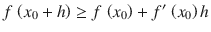

从几何角度看，它看起来像图 3-1，其中展示了 `f(x) = x²` 在 `x[0] = 4` 处的一阶近似。凸性将成为攻克非线性的特洛伊木马。

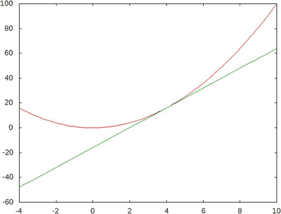

**图 3-1** 凸函数及其线性近似的典型示例

## 3.1 分段线性

这里我们考虑分段线性函数。按照传统说法，它们是分段线性的。因此，我们迄今为止使用的线性规划求解器（`GLPK`、`GLOP`、`CLP`）无法直接处理它们，但通过我们编写少量代码，就能将它们转化为所有求解器都能处理的标准形式。这也是用 Python 而非专用建模语言编写模型的一个很好的理由。

作为第一个例子，为了说明技术本身而不引入可能掩盖本质的旁支问题，让我们考虑一个分段函数，其定义如下：


(3.1)

我们可以将这个函数视为一个运输成本函数，并附加了针对重量的惩罚项；也就是说，我们运输的产品越多，每单位的成本就越高。表 3-1（以及图 3-2）展示了这个简单函数的一个实例，其中前两列界定了数量范围（`B[i]`, `B[i+1]`），第三列是单位成本 `c[i]`。

我们将通过最小化该函数并施加一个简单的数量上限来演示这种方法。

**表 3-1** 分段函数示例

| (起始值 | 结束值] | 单位成本 | (总成本 | 总成本] |
| --- | --- | --- | --- | --- |
| 0 | 148 | 24 | 0 | 3552 |
| 148 | 310 | 28 | 3552 | 8088 |
| 310 | 501 | 32 | 8088 | 14200 |
| 501 | 617 | 34 | 14200 | 18144 |
| 617 | 762 | 36 | 18144 | 23364 |
| 762 | 959 | 40 | 23364 | 31244 |

### 3.1.1 构建模型

在这个问题中，我们需要决定的仅仅是生产数量。我们可以定义一个决策变量，其取值范围从 0 到表中的最后一个数量，如下所示：

![$$ x\in \left[0,{B}_n\right] $$](A457410_1_En_3_Chapter_Equb.gif)

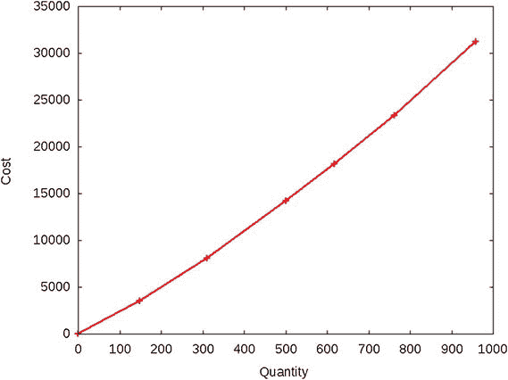

**图 3-2** 分段凸成本函数

但我们决定的这个数量会影响目标函数，因此我们需要知道最终落在哪个区间内，以及在该区间内的具体位置。这里有一个关键技巧：我们引入额外的变量，每个变量对应函数中的一个断点。假设我们有 `n` 个区间，从概念上讲，我们将这些变量视为区间边界上的权重，用于指示我们在区间中的位置。我们希望最多只有两个连续的变量非零，且它们的和为 1。这将告诉我们 `x` 的位置，从而得出目标函数值。

![$$ {\delta}_i\in \left[0,1\right]\forall i\in \left\{0,\dots, n\right\} $$](A457410_1_En_3_Chapter_Equc.gif)

例如，如果 `δ[2] = 1/4` 且 `δ[3] = 3/4`，我们就知道位于第三个区间，并且已经走过了该区间的四分之一，同时 `x = δ[2] * B[2] + δ[3] * B[3]`。

#### 3.1.1.1 约束条件

我们将强制所有 `δ` 之和为 1，并且，由于问题的凸结构，最多只有两个相邻的 `δ` 非零。这将告诉我们位于哪个区间以及区间内的具体位置。为此，我们添加约束条件：

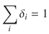

我们通过以下方式推导出决策变量的值：

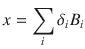

(3.2)

请注意，这个 `x` 变量及其关联的约束在优化模型中不起作用。对于求解器而言，`δ` 才是真正的决策变量，而 `x` 仅仅是向原始问题语言的转换。这是关键所在。

#### 3.1.1.2 目标函数

目标函数在每个区间内是线性的；因此我们对所有区间求和：

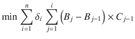

这里必须强调，这种转换技巧之所以有效，完全是因为该目标函数的结构。它是凸函数。如果它是凹函数，那么线性规划求解器就无法解决这个问题。你将在第 7 章（第 7.2 节）中看到如何使用整数规划求解器来处理这种更困难的情况。


#### 3.1.1.3 可执行模型

让我们将其转化为一个可执行模型。首先，假设目标函数由一个元组数组 `D` 描述，每个元组为 `(x, f(x))`。这使我们能够考虑任何连续的分段线性函数。假设我们还给出了待生产数量的下界 `b`。这个问题非常简单，我们已知其解，即下界 `b`。参见代码清单 3-1。但此处旨在说明使用线性求解器求解分段线性函数所采用的技术。在下一节中，我们将在一个更实际的问题上应用此技术。

```
1   def minimize_piecewise_linear_convex(Points,B):
2     s,n = newSolver(’Piecewise’),len(Points)
3     x = s.NumVar(Points[0][0],Points[n-1][0],’x’)
4     l = [s.NumVar(0.0,1,’l[%i]’ % (i,)) for i in range(n)]
5     s.Add(1 == sum(l[i] for i in range(n)))
6     s.Add(x == sum(l[i]*Points[i][0] for i in range(n)))
7     s.Add(x >= B)
8     Cost = s.Sum(l[i]*Points[i][1] for i in range(n))
9     s.Minimize(Cost)
10     s.Solve()
11     R = [l[i].SolutionValue() for i in range(n)]
12     return  R
代码清单 3-1
分段模型的最简示例 (piecewise.py)
```

第 4 行定义了我们的附加变量，每个变量对应分段函数的一个断点。我们在第 5 行强制这些变量的和为 1。第 6 行对 `x` 的定义以及第 7 行对其的简单约束，使我们能够考虑各种有趣的场景。

目标函数的处理方式与第 8 行的 `x` 类似。我们求解并将结果以表格形式返回，其中包含理解求解器输出所需的所有相关信息。

我们将使用不同的边界运行此代码，以说明生成的解的类型。首先，表 3-2 展示了一个典型运行结果，其解位于一个区间内。我们设置了一个边界 `x ≥ 250`，这恰好是得到的值。

请注意，只有两个 `δ` 非零，并且

`δ[1] × B[1] + δ[2] × B[2] = 0.37 × 148 + 0.63 × 310 = 250`，

而成本函数为

`0.37 × 3552 + 0.63 × 8088 = 6408`。

**表 3-2**  
在 `x ≥ 250` 条件下凸分段目标函数的最优解

| 区间 | 0 | 1 | 2 | 3 | 4 | 5 | 6 | 解 |
| --- | --- | --- | --- | --- | --- | --- | --- | --- |
| `δ[i]` | 0.0 | 0.3704 | 0.6296 | 0.0 | 0.0 | 0.0 | 0.0 | `∑ δ=1.0` |
| `x[i]` | 0 | 148 | 310 | 501 | 617 | 762 | 959 | `x=250.0` |
| `f(x[i])` | 0 | 3552 | 8088 | 14200 | 18144 | 23364 | 31244 | `Cost=6408` |

为了说明边界情况，我们设置一个边界 `x ≥ 310`，即一个区间的起点，并在表 3-3 中观察结果。请注意，在这种情况下，只有一个 `δ` 非零，并且其权重设置为最大值 1。

作为边界情况的最后一个示例，我们强制 `x ≥ 1`。结果如表 3-4 所示。

**表 3-4**  
在 `x ≥ 1` 条件下凸分段目标函数的最优解

| 区间 | 0 | 1 | 2 | 3 | 4 | 5 | 6 | 解 |
| --- | --- | --- | --- | --- | --- | --- | --- | --- |
| `δ[i]` | 0.9932 | 0.0068 | 0.0 | 0.0 | 0.0 | 0.0 | 0.0 | `∑ δ=1.0` |
| `x[i]` | 0 | 148 | 310 | 501 | 617 | 762 | 959 | `x=1.0` |
| `f(x[i])` | 0 | 3552 | 8088 | 14200 | 18144 | 23364 | 31244 | `Cost=24` |

**表 3-3**  
在 `x ≥ 310` 条件下凸分段目标函数的最优解

| 区间 | 0 | 1 | 2 | 3 | 4 | 5 | 6 | 解 |
| --- | --- | --- | --- | --- | --- | --- | --- | --- |
| `δ[i]` | 0.0 | 0.0 | 1.0 | 0.0 | 0.0 | 0.0 | 0.0 | `∑ δ=1.0` |
| `x[i]` | 0 | 148 | 310 | 501 | 617 | 762 | 959 | `x=310.0` |
| `f(x[i])` | 0 | 3552 | 8088 | 14200 | 18144 | 23364 | 31244 | `Cost=8088` |

### 3.1.2 变体

第一个变体是将分段方法应用于非线性优化。

#### 3.1.2.1 通过线性近似进行非线性函数最小化

由于我们可以求解具有分段线性函数的优化问题，因此可以使用这种方法，通过精度不断提高的分段线性函数来近似凸非线性函数。这里有一个例子。假设我们需要在区间 `[2, 8]` 上最小化非线性函数

`f(x) = sin(x)e^x`

我们可以轻松地将此函数分解为多个段，并在这些段上对函数值进行线性插值，如图 3-3 所示。

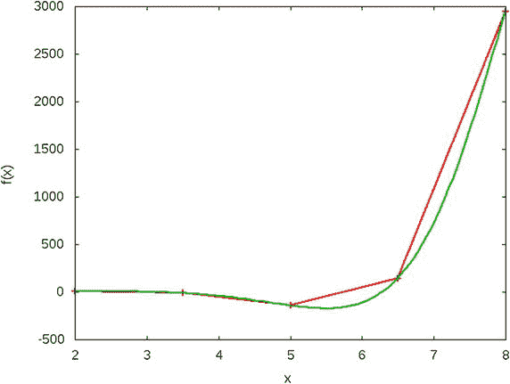

**图 3-3**  
非线性函数的分段近似

然后我们最小化这个分段线性近似。如果解足够满足我们的需求，则完成。如果不够，我们围绕解进行放大，并使用更小的段再次近似该函数。可执行代码如代码清单 3-2 所示，这是另一个使用像 Python 这样的通用编程语言明显优于专用建模语言的实例。

```
1   def minimize_non_linear(my_function,left,right,precision):
2     n = 5
3     while right-left > precision:
4       dta = (right - left)/(n-1.0)
5       points = [(left+dta*i, my_function(left+dta*i)) for i in range(n)]
6       G = minimize_piecewise_linear_convex(points,left)
7       x = sum([G[i]*points[i][0] for i in range(n)])
8       left = points[max(0,[i-1 for i in range(n) \
9                        if G[i]>0][0])][0]
10       right = points[min(n-1,[i+1 for i in range(n-1,0,-1) \
11                          if G[i]>0][0])][0]
12   return   x.SolutionValue()
代码清单 3-2
通过线性近似最小化非线性函数
```

函数 `minimize_non_linear` 接受任何 Python 函数作为参数，以及一个用于最小化的值区间和所需的精度。在第 4 行，我们计算每个子区间的长度，并在第 5 行构建给定函数的分段描述，将其作为参数传递给之前描述的求解器（代码清单 3-1）。

第 9 行和第 11 行放大到适当的子区间，该子区间成为要再次细分的新区间。当区间小于所需精度时，该过程停止。仅用十行非常简单的代码，我们就利用了线性求解器的强大功能来最小化非线性凸函数。

我们可以在表 3-5 中看到解的精度的不断提高。每组连续三行分别代表 `x` 中的断点、这些点处的函数值以及区间参数 `delta`，指示最优区间。最右侧的两列是对应的最优 `x` 和 `f(x)`。我们注意到 `x` 在最终解的下方和上方交替跳跃，如果需要一个低估或高估值，这一点可能很重要。

**表 3-5**  
非线性最小化的最优解


| 区间 | 0 | 1 | 2 | 3 | 4 | `x^∗` | `f(x^∗)` |
| --- | --- | --- | --- | --- | --- | --- | --- |
| `x[i]` | 2.0 | 3.5 | 5.0 | 6.5 | 8.0 | | |
| `f(x[i])` | 6.7 | -11.6 | -142.3 | 143.1 | 2949.2 | | |
| `δ[i]` | 0.0 | 0.0 | 1.0 | 0.0 | 0.0 | 5.0 | -142.3 |
| `x[i]` | 3.5 | 4.2 | 5.0 | 5.8 | 6.5 | | |
| `f(x[i])` | -11.6 | -62.7 | -142.3 | -159.7 | 143.1 | | |
| `δ[i]` | 0.0 | 0.0 | 0.0 | 1.0 | 0.0 | 5.8 | -159.7 |
| `x[i]` | 5.0 | 5.4 | 5.8 | 6.1 | 6.5 | | |
| `f(x[i])` | -142.3 | -170.2 | -159.7 | -72.0 | 143.1 | | |
| `δ[i]` | 0.0 | 1.0 | 0.0 | 0.0 | 0.0 | 5.4 | -170.2 |
| `x[i]` | 5.0 | 5.2 | 5.4 | 5.6 | 5.8 | | |
| `f(x[i])` | -142.3 | -159.2 | -170.2 | -171.9 | -159.7 | | |
| `δ[i]` | 0.0 | 0.0 | 0.0 | 1.0 | 0.0 | 5.6 | -171.9 |
| `x[i]` | 5.4 | 5.5 | 5.6 | 5.7 | 5.8 | | |
| `f(x[i])` | -170.2 | -172.5 | -171.9 | -167.8 | -159.7 | | |
| `δ[i]` | 0.0 | 1.0 | 0.0 | 0.0 | 0.0 | 5.5 | -172.5 |
| `x[i]` | 5.4 | 5.4 | 5.5 | 5.5 | 5.6 | | |
| `f(x[i])` | -170.2 | -171.7 | -172.5 | -172.6 | -171.9 | | |
| `δ[i]` | 0.0 | 0.0 | 0.0 | 1.0 | 0.0 | 5.5 | -172.6 |
| `x[i]` | 5.4 | 5.5 | 5.5 | 5.5 | 5.6 | | |
| `f(x[i])` | -171.7 | -172.4 | -172.6 | -172.5 | -171.9 | | |
| `δ[i]` | 0.0 | 0.0 | 1.0 | 0.0 | 0.0 | 5.5 | -172.6 |
| `x[i]` | 5.5 | 5.5 | 5.5 | 5.5 | 5.5 | | |
| `f(x[i])` | -172.4 | -172.5 | -172.6 | -172.6 | -172.5 | | |
| `δ[i]` | 0.0 | 0.0 | 1.0 | 0.0 | 0.0 | 5.5 | -172.6 |

#### 3.1.2.2 非凸分段线性函数

最棘手的情况出现在待最小化的函数是非凸函数时。例如，如果单位成本像表 3-6 和图 3-4 所示那样持续下降而非上升，那么本节介绍的方法将会失效，正如你在表 3-7 中所见。

请注意，`δ` 的总和为 1，决策变量的值也是正确的，但总成本却毫无意义。它是通过第一个和最后一个 `δ`（非连续点）的组合得到的。实际发生的情况是，求解器正在考虑 `f(0)` 和 `f(924)` 之间的直线；这条直线位于 `f(x)` 下方，因此对于 `x` 的所有中间值，它都会产生一个更低的成本值。

**表 3-7** 在 `x ≥ 250` 条件下对非凸目标函数的错误求解

| 区间 | 0 | 1 | 2 | 3 | 4 | 5 | 6 | 解 |
| --- | --- | --- | --- | --- | --- | --- | --- | --- |
| `δ[i]` | 0.7294 | 0.0 | 0.0 | 0.0 | 0.0 | 0.0 | 0.2706 | `∑ δ = 1.0` |
| `x[i]` | 0 | 194 | 376 | 524 | 678 | 820 | 924 | `x = 250.0` |
| `f(x[i])` | 0 | 3492 | 6404 | 8476 | 10478 | 12040 | 12664 | 成本 = 3426 |

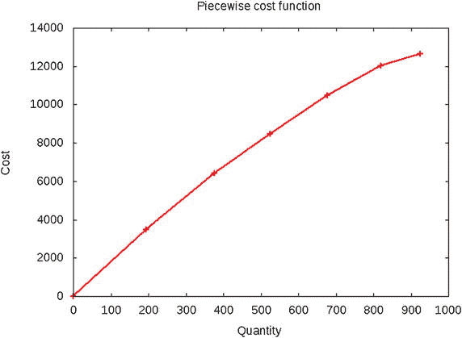

**图 3-4** 分段非凸成本函数

**表 3-6** 非凸分段函数示例

| (起始 | 结束] | 单位成本 | (总成本 | 总成本] |
| --- | --- | --- | --- | --- |
| 0 | 194 | 18 | 0 | 3492 |
| 194 | 376 | 16 | 3492 | 6404 |
| 376 | 524 | 14 | 6404 | 8476 |
| 524 | 678 | 13 | 8476 | 10478 |
| 678 | 820 | 11 | 10478 | 12040 |
| 820 | 924 | 6 | 12040 | 12664 |

正如你将在后续章节（第 7 章第 7.2 节）中看到的，情况并非无解。此处采用的方法可以加以修改，通过添加更多约束条件来使用整数求解器。

## 3.2 曲线拟合

一个非常常见的问题是从一组数据点出发，得到同一组数据的解析表示。统计学家称之为回归；应用数学家称之为参数估计；而工程师则称之为曲线拟合。我更喜欢最后一种说法。²

其最著名且最简单的示例如下：假设我们知道（或者像伽利略那样首次猜想）一个落体遵循如下形式的曲线

`f(t) = a[2] t² + a[1] t + a[0]`，

其中 `t` 代表时间，但我们不知道 `a[0]`、`a[1]` 和 `a[2]` 的适当值。我们进行了一项实验，收集了表 3-8 中的数据。

**表 3-8** 用于拟合二次函数 `f(t) = a[2] t² + a[1] t + a[0]` 的数据示例

| `t[i]` | `f[i]` |
| --- | --- |
| 0.1584 | 0.0946 |
| 0.8454 | 0.2689 |
| 2.1017 | 5.8285 |
| 3.1966 | 14.8898 |
| 4.056 | 25.6134 |
| 4.9931 | 38.3952 |
| 5.8574 | 43.5065 |
| 7.1474 | 91.3715 |
| 8.1859 | 119.075 |
| 9.0349 | 115.7737 |

由于我们需要确定函数的系数（即 `a[0]`、`a[1]`……），因此必须以某种方式最小化每条可能曲线到我们数据点的距离。统计学家喜欢使用欧几里得距离，或者等效地使用其平方：

```
min ∑_n ( f̄_i - f( t̄_i ) )²
```

这种最小二乘法源于卡尔·弗里德里希·高斯³，他开发该方法是为了预测行星运动。这种方法通常很有意义，并且通过求解一个线性方程组（即所谓的正规方程）很容易实现。

尽管最小二乘法很流行，但欧几里得距离并非唯一有效的可最小化距离。另一种方法是使用偏差的绝对值，例如：

```
min ∑_n | f̄_i - f( t̄_i ) |
```

甚至使用偏差绝对值中的最大值，例如：

```
min max_n | f̄_i - f( t̄_i ) |
```

后一种方法在涉及公差时最为合适；也就是说，当所有误差都必须保持在某个最大值以内时。我们将开发能够在运行时在后两种目标函数之间进行选择的代码。

### 3.2.1 构建模型

我们将分阶段描述这个相当复杂的模型。

#### 3.2.1.1 目标函数

让我们在一定的通用性下假设，我们需要确定变量 `t` 的一个 `k` 次多项式的系数。系数 `a[0]`、`a[1]`、……、`a[k]` 将被确定，以最小化数据点与多项式之间的偏差之和或最大偏差。

这里的第一个抽象是将所有这些偏差视为某些函数，例如 `e[0]`、`e[2]`、……、`e[n]`，我们将在后面确定它们。对于偏差之和的情况，目标函数很简单：

```
min ∑_i e_i
```

但对于第二种情况，我们需要一个能最小化最大偏差的目标函数：

```
min max_n e_i
```

后一种表达式显然不符合我们线性规划的框架；我们可以有 `min` 或 `max`，但不能同时存在，并且我们必须有一个目标函数，而不是一组目标函数。

在这种情况下使用的抽象方法是将目标函数转移到约束条件中。为了说明这一点，首先我们引入一组不等式，其中包含一个新变量，比如 `e`，代表最大偏差：

```
e_i ≤ e ∀ i ∈ [1, n]
```

其次，我们将目标函数表述为 `min e`。由于 `e` 是所有偏差的上界，并且我们将其最小化，因此我们实际上是在最小化最大偏差。请注意，在最优解处，至少有一个不等式将是紧约束，否则我们显然不是最优的，但大多数不等式很可能是松弛的，因为它们的偏差将小于最大偏差。


#### 3.2.1.2 约束条件

现在我们需要表达这些偏差。我们得到一组数据对 (`t¯[i]`, `f¯`)，表示在时间 `t¯[i]` 对假设函数 `f` 的测量值。因此，特定数据对的偏差为：

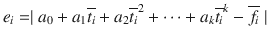

也就是说，偏差是实验值 `f¯[i]` 与理论位移 `f(t¯[i])` 之差的绝对值，其中理论位移是通过在时间 `t¯[i]` 处计算函数得到的。为什么取绝对值？因为偏差可能为正也可能为负，而我们只关心其大小。

用不等式来表达，我们打算写出形如 `|f(t¯[i]) − f¯| <= e` 的约束，但这并非线性。处理这种情况至少有兩種不同的方法。使用哪种方法取决于我们希望从模型解中提取什么信息。

1. **将不等式加倍并约束偏差。** 考虑绝对值的定义。如果 `a` 为正，则 `|a| = a`；如果为负，则 `|a| = −a`。因此，这建议将不等式 `|e[i]| <= e` 替换为两个不等式：

    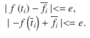

    这是一种可行的方法。

2. **将变量加倍并找出每个偏差。** 请注意，“将不等式加倍”的方法不会找出每个点的偏差。我们只是对所有偏差施加了一个界限，并最小化这个界限。如果我们想知道每个偏差的值，例如，为了最小化它们的总和，该怎么办？

找出每个偏差值的一种方法是为每个点 (`t¯[i]`, `f¯[i]`) 引入两个非负变量。我们将它们称为 `u[i]` 和 `v[i]`，并引入以下等式：

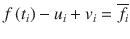

(3.3)

请注意，由于新变量是非负的，每个等式中只有一个变量会非零。该变量将等于偏差（即实验点与理论点之间的差值）。

这种“将变量加倍”的方法在某种程度上更通用。如果我们想最小化偏差的总和，我们就最小化所有 `u[i]` 和 `v[i]` 的总和。如果我们想最小化最大偏差，我们添加不等式：

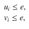

并最小化 `e`。

#### 3.2.1.3 可执行模型

让我们将其转换为清单 3-3 中所示的可执行模型。假设我们以元组数组 (`t¯[i]`, `f¯[i]`) 的形式获取数据，命名为 `D`，同时获取所需多项式的次数以及要最小化的距离指标（0 表示总和，1 表示最大值）。

```
1   def solve_model(D,deg=1,objective=0):
2     s,n = newSolver('Polynomialufitting'),len(D)
3     b = s.infinity()
4     a = [s.NumVar(-b,b,'a[%i]' % i) for i in range(1+deg)]
5     u = [s.NumVar(0,b,'u[%i]' %  i) for i in range(n)]
6     v = [s.NumVar(0,b,'v[%i]' % i) for i in range(n)]
7     e = s.NumVar(0,b,'e')
8     for i in range(n):
9       s.Add(D[i][1]==u[i]-v[i]+sum(a[j]*D[i][0]**j \
10                              for j in range(1+deg)))
11     for i in range(n):
12       s.Add(u[i]  <=  e)
13       s.Add(v[i]  <=  e)
14     if objective:
15       Cost = e
16     else:
17       Cost = sum(u[i]+v[i] for i in range(n))
18     s.Minimize(Cost)
19     rc  = s.Solve()
20     return  rc,ObjVal(s),SolVal(a)
清单 3-3
多项式曲线拟合模型 (curve fit.py)
```

第 4 行定义了实数决策变量，即多项式的系数。由于我们不容易对系数设置界限，因此我们使用无穷大。第 5 行和第 6 行定义了数据点与相应理论值之间的偏差。这用于第 8 行，对应于 (3.3)。然后我们在第 11 行通过第 7 行定义的最大误差变量来约束偏差。

最后一个要素是目标函数的选择。用户可以选择在第 15 行最小化最大偏差，或在第 17 行最小化偏差的总和。这些结果分别显示在表 3-9 的 `e[i]^(max)` 和 `e[i]^(sum)` 标题下。

**表 3-9** 曲线拟合问题的最优解

| `t[i]` | `f[i]` | `fsum` | `e[i]^(sum)` | `fmax` | `e[i]^(max)` |
| --- | --- | --- | --- | --- | --- |
| 0.1584 | 0.0946 | -0.4382 | 0.5328 | -12.4063 | 12.5008 |
| 0.8454 | 0.2689 | 0.3421 | 0.0731 | -8.3251 | 8.594 |
| 2.1017 | 5.8285 | 5.8285 | 0.0 | 2.0924 | 3.7362 |
| 3.1966 | 14.8898 | 14.8898 | 0.0 | 14.285 | 0.6047 |
| 4.056 | 25.6134 | 24.7951 | 0.8184 | 25.8879 | 0.2744 |
| 4.9931 | 38.3952 | 38.3952 | 0.0 | 40.5766 | 2.1814 |
| 5.8574 | 43.5065 | 53.5269 | 10.0204 | 56.0073 | 12.5008 |
| 7.1474 | 91.3715 | 80.7311 | 10.6403 | 82.3995 | 8.972 |
| 8.1859 | 119.075 | 106.6547 | 12.4203 | 106.5742 | 12.5008 |
| 9.0349 | 115.7737 | 130.5102 | 14.7365 | 128.2745 | 12.5008 |

数据点以及两种解（一种用于最小化最大偏差，另一种用于最小化偏差总和）都显示在图 3-5 中。

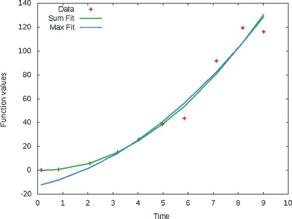

**图 3-5** 数据与拟合曲线

### 3.2.2 变体

上面的示例是实践中非常有用的技术的一个特例，即所谓的软约束处理。我们常常希望某个等式能够成立，但知道它不太可能成立。这样的例子比比皆是。这里有一个：构建一个排课系统模型来生成学校的学生课表。在智能方式中，我们收集所有学生的选课及其可用日期（我周五必须工作，所以那天不能上课。或者，我上夜班；我只需要白天的课程）。根据所有这些数据，我们希望构建对所有学生都适用的课表。

不幸的是，一个能满足所有请求的课表很可能不可行。我们最多只能期望满足尽可能多的学生请求。这些就变成了软约束，其处理技术与上述类似：我们引入新变量（如上面的 `u[i]` 和 `v[i]`）来衡量与理想状态的距离（未满足请求的学生数量），并最小化这些变量的总和。

因此，如果我们旨在满足，例如：

`a[1]x[1] + a[2]x[2] + … + a[n]x[n] = b`。

但我们知道这不太可能，所以我们将其改为：

`a[1]x[i] + a[i]x[2] + … + a[n]x[n] + u − v = b`，

其中 `u` 和 `v` 是非负的。然后我们将 `(u + v)` 添加到目标函数中（假设这是一个最小化问题）。

请注意，如果我们已经知道左侧相对于右侧总是要么过高要么过低，那么我们可能只需要 `u` 和 `v` 中的一个。只有当偏差可能出现在两个方向时，我们才需要两者，就像我们的曲线拟合示例那样。


## 3.3 模式分类再探讨

回顾第 2 章第 2.5 节的分类模型：给定两组数据点（由专家标记的良性和恶性细胞），我们得到了一个分离超平面，之后可用于模仿专家，将新数据分类到其中一组。我们最初方法的一个弱点是，不一定能根据任何定义找到“最佳”超平面。一旦得到一个超平面，我们就停止了。第一次尝试的结果如图 3-6 所示，其中一个恶性细胞恰好位于分离超平面上。它同样可能是一个良性细胞。

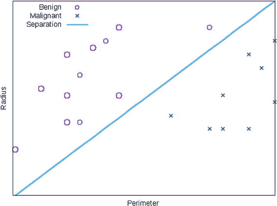

图 3-6

数据与最大化间隔的分离

因此，分类领域的人倾向于选择一个能最大程度分离两组的超平面；即，与一组和另一组距离相等的超平面。假设训练集选择得当，这可能会在后续最小化误分类。

实现这种最大分离的一种方法是最大化训练集到分离超平面的最小距离。这被称为最大化间隔，我们现在有了执行这种最大化的工具。假设我们已经运行了之前的分类模型，并且知道这两组可以通过超平面`∑ a_j x_j = a_0`分离。现在我们想要最佳的这种分离。

如何计算点`x¯`到超平面`∑ a_j x_j = a_0`的距离？通过公式

`|∑ a_j x¯_j - a_0| / √(∑ a_j²)`

由于我们打算最大化所有数据点上该值的最小值，但又不需要实际数值，因此分母无关紧要，我们不妨只考虑分子——这恰好是一个有利条件，因为我们目前还无法处理一般的非线性函数。这个分子是一个绝对值。因此，我们将使用双正变量技巧，并为每个数据点`x¯`引入一组三个约束：

```
∑ a_j x¯_j - u + l = a_0
    e <= u
    e <= l
```

其中第一个约束将迫使`u`或`l`测量距离公式中分子的值。两个不等式将变量`e`作为两者的下界。然后我们只需最大化`e`的值即可实现目标。

### 3.3.1 可执行模型

转换为可执行模型的过程如代码清单 3-4 所示。第 4 至 7 行定义了新的正变量，用于保存每个数据点到分离超平面的距离。第 8 行与之前相同，是我们正在寻找的超平面的系数。模型的其余部分与我们之前的分类模型相同，只是在第 12 行和第 17 行增加了三行代码，用于固定距离约束并建立其下界`e`。目标函数现在是迫使这个下界向上增长，从而最大化最小距离。

```
1   def solve_margins_classification(A,B):
2     n,ma,mb=len(A[0]),len(A),len(B)
3     s = newSolver('Classification')
4     ua = [s.NumVar(0,99,") for _ in range(ma)]
5     la = [s.NumVar(0,99,") for _ in range(ma)]
6     ub = [s.NumVar(0,99,") for _ in range(mb)]
7     lb = [s.NumVar(0,99,") for _ in range(mb)]
8     a = [s.NumVar(-99,99,") for _ in range(n+1)]
9     e = s.NumVar(-99,99,")
10     for i in range(ma):
11       s.Add(0 >= a[n]+1-s.Sum(a[j]*A[i][j] for j in range(n)))
12       s.Add(a[n]==s.Sum(a[j]*A[i][j]-ua[i]+la[i]for j in range(n)))
13       s.Add(e = s.Sum(a[j]*B[i][j] for j in range(n))-a[n]+1 )
17       s.Add(a[n]==s.Sum(a[j]*B[i][j]-ub[i]+lb[i]for j in range(n)))
18       s.Add(e <= ub[i])
19       s.Add(e <= lb[i])
20     s.Maximize(e)
21     rc  = s.Solve()
22     return  rc,SolVal(a)
代码清单 3-4
最大化间隔（margins.py）
```

在与第 2.5 节相同的数据集上运行的结果显示，新的、改进后的分离超平面与恶性集和良性集中最近的点等距，这是我们能期望的最佳分离。但请注意：这仅取决于训练集的质量。如果该训练集有任何偏差，分离结果也会同样有偏差。

脚注 1

所有研究数学家都认同“凸”及其反义词“凹”的标签，但美国高中的教科书作者无视数千篇论文、期刊和研究专著，坚持使用“上凹”和“下凹”。

2

“回归”一词源自弗朗西斯·高尔顿关于“向平庸回归”的原始论文，它掩盖而非突出了该技术的本质。至于“参数”，请问，什么不是参数呢？

3

卡尔·弗里德里希·高斯，《最小误差观测组合理论》（费城，宾夕法尼亚州：工业与应用数学学会，1987 年）。

