# 4. 线性网络模型

六度分隔！这个梗以及由此产生的戏剧、电影和游戏，在向公众介绍网络理论元素方面，比多年的公共教育效果更好。电影爱好者玩凯文·贝肯游戏，试图通过两位演员与凯文·贝肯共同出演的电影来建立联系。数学家们自豪地宣布他们的埃尔德什数（如果有的话），即他们与著名数学家保罗·埃尔德什合著论文的间隔距离。¹ 在本章中，网络在可视化问题方面发挥着重要作用。

网络是由节点（在我们的例子中是人）和弧（表示关系的存在）组成的对象。它是数学家数百年前发明的一种工具，用于帮助建模情境²和解决问题。我们将利用网络来构建优化模型。从某种意义上说，我们是在进行元建模。

基于网络的优化模型通常与结构描述共享一个有趣的特征：如果输入数据都是整数，那么存在一个整数最优解。此外，求解器会找到它。这是一个有用的特性，因为它允许对可数项目（人、卡车、数据包）以及可测量项目（金钱、时间、水）进行建模。

认识到整数性在建模中的重要性至关重要。让我们想象一个涉及航天飞机飞行的复杂问题。约束条件包括重量、燃料量、氧气量、在轨工作等。可能有数千甚至数十万个变量和约束。如果这样的问题问“航天飞机可以搭载多少名宇航员？”，NASA（或 SpaceX）不太可能接受“两个半宇航员”作为最优答案。

至关重要的是，我们必须摒弃一种诱人但错误的变通方法：四舍五入。四舍五入很少能解决问题。如果对分数解进行四舍五入，许多（甚至可能全部）约束条件可能会被违反。将航天飞机实例的解向上取整，重量约束可能会阻止起飞；向下取整，宇航员可能无法完成所有必需的任务。公平地说，有些问题中四舍五入是可以接受的，但这些问题要么很无聊，要么解决方案显而易见，或者两者兼而有之。

## 4.1 最大流

网络相关问题通常具有一种结构，其中解的整数性可以“免费”得到保证。我们只需认识到问题属于这一特殊类别，然后欣然接受即可。本节的目标是识别并建模具有这种特殊结构的问题。

最典型、最明显的例子是网络最大流问题，其中某种物质在具有容量的通道上从某些源点流向某些汇点，我们试图最大化流量。

流动的物质不一定是实物，如水、石油甚至电力。它可以是流经光纤电缆网络的数据包。例如，假设你正试图确定可以从服务器向观众发送多少并发视频流。这恰好符合最大流问题的背景。

为了抽象地考虑最简单的问题，我们假设一个如图 4-1 所示的网络，其中每条弧都有标注的容量，我们试图从标记为源点（`-S`）的节点向标记为汇点（`-T`）的节点发送尽可能多的流量。

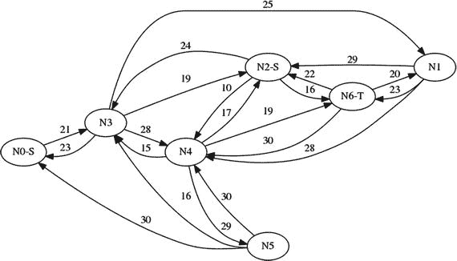
图 4-1 网络流问题实例的可视化表示

### 4.1.1 构建模型

在这个问题中，我们需要决定的是从源点向汇点输送多少流量，以及通过网络的哪些弧进行输送。

### 4.1.2 决策变量

回答这个问题最简单、最自然的方法是引入一个二维变量。第一个维度表示起始节点，第二个维度表示目标节点；变量的值将是流经这两点之间弧的物质数量，即

```
x_{i,j} ∀ i ∈ N, ∀ j ∈ N
```

例如，如果 `x[2,3] = 35`，则表示我们应该从节点 2 向节点 3 发送 35 个单位。

#### 4.1.2.1 目标函数

目标是最大化从源点流向汇点的流量。因此，无论是从源点（设为集合 `S`）流出的总和，还是进入汇点（设为集合 `T`）的总和，都可以作为目标。这给出了以下两个目标函数之一：

```
max ∑_{i∈s} ∑_{j∈N} x_{i,j}
```

或

```
max ∑_{j∈T} ∑_{i∈N} x_{i,j}
```

但是，由于我们允许多个源点，并且没有阻止一个源点向另一个源点发送流量以便进一步传输，因此我们应该小心地最大化从源点流出的“净”流量，即

```
max ∑_{i∈S} (∑_{j∈N} x_{i,j} - ∑_{j∈N} x_{j,i})
```
(4.1)

相应地，进入汇点的净流量应该是显而易见的。³

这个目标函数 (4.1) 足以得到一个可用的模型，但我们还需要考虑两个小麻烦：链式源点和循环。

第一个有问题的情形如图 4-2 所示。很明显，由于进入汇点的弧的容量是 2，因此恰好会有两个单位流量通过。但这两个单位可能全部来自源点 N1-S，也可能一个来自 N0-S，另一个来自 N1-S。

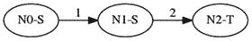
图 4-2 有问题的源点链式结构

第二个有问题的情形发生在存在涉及源点的循环时。那么，对于围绕该循环的任意流量 `f`，如果该流量不大于该循环上的容量，则存在另一个流量 `f + 1`，其目标函数值完全相同。以图 4-3 为例。一个最优解可以通过中间节点从源点向汇点发送 10 个单位，或者从源点发送最多 20 个单位，其中最多有 10 个单位从中间节点流回源点。

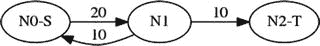
图 4-3 有问题的循环

这两个例子说明了存在多个最优解，当然，它们的最优值完全相同。对于任何应用来说，这种大量的最优流不太可能是一个特性。它很可能被视为一个麻烦，尤其是当两个不同的求解器或同一求解器的两次不同运行返回两个不同的流时！我们如何确保求解器始终返回相同的流？

我们可以决定，在所有最优流中，我们希望选择流入源点的流量尽可能小的那个。这是一个双重目标：最大化从源点流出的净流量，并最小化流入源点的流量。这种双重目标，或者更一般地说，多目标的想法，在实践中经常出现，并且通常出于与这里相同的原因：需要根据一个标准在多个最优解中确定根据次要标准最可取的那个。

由于我们需要同时最大化一个目标并最小化另一个目标，我们需要另一个技巧：取反。

```
max f(x) ⇔ min -f(x)
```

我们总是可以将最小化问题替换为最大化问题，反之亦然。现在我们可以将两个目标相加：最大化如公式 (4.1) 所示的净流量，并最小化流入量，即最大化 `-∑_{i∈S} ∑_{j∈N} x_{j,i}`。简化后，它看起来像

```
max ∑_{i∈S} (∑_{j∈N} x_{i,j} - 2^* ∑_{j∈N} x_{j,i})
```
(4.2)

在我们的链式示例中，我们将最大化 `x[0,1] + x[1,2] - 2^* x[0,1]`，即 `x[1,2] - x[0,1]`，这将强制所有流量都从 N1-S 发出。在我们的循环示例中，这将得到 `x[0,1] + x[1,2] - x[1,0]`，这保证了没有流量流回源点，并且源点发出 10 个单位。

#### 4.1.2.2 约束条件

唯一的约束类型被称为流量守恒：对于既不是源点也不是汇点的每个节点，流入的流量必须等于流出的流量，即

```
∑_{j∈N} x_{i,j} = ∑_{j∈N} x_{j,i} ∀ i ∈ N \ {S ∪ T}
```
(4.3)

由于目标函数会强制流量从源点流出，或者等价地，流入汇点，因此流量守恒将负责将物质从源点输送到汇点。

#### 4.1.2.3 可执行模型

现在，我们将其转化为一个可执行模型。为了使模型具有足够的通用性以解决所有此类问题，我们假设输入是一个名为 `C` 的二维数组，以节点为索引，包含两个节点之间弧的容量。我们还假设存在两个数组，一个用于源点 `S`，另一个用于汇点 `T`。

为了在目标函数的选择上提供一定的灵活性，并说明多个最优解的出现，我们添加了最后一个参数 `unique`。如果此参数设置为 `True`，模型将使用目标函数 (4.2) 运行，该函数将在最小化流入源点的流量的同时最大化净流量。如果设置为 `False`，则仅最大化流出源点的流量。参见列表 4-1。

```python
def solve_model(C,S,T,unique=True):
    s,n = newSolver('Maximum flow problem'),len(C)
    x=[[s.NumVar(0,C[i][j],"") for j in range(n)] for i in range(n)]
    B=sum(C[i][j] for i in range(n) for j in range(n))
    Flowout,Flowin = s.NumVar(0,B,""),s.NumVar(0,B,"")
    for i in range(n):
        if i not in S and i not in T:
            s.Add(sum(x[i][j] for j in range(n)) == \
                  sum(x[j][i] for j in range(n)))
    s.Add(Flowout == s.Sum(x[i][j] for i in S for j in range(n)))
    s.Add(Flowin == s.Sum(x[j][i] for i in S for j in range(n)))
    s.Maximize(Flowout-2*Flowin if unique else Flowout-Flowin)
    rc = s.Solve()
    return rc,SolVal(Flowout),SolVal(Flowin),SolVal(x)
```
列表 4-1 最大流模型 (`maxflow.py`)

第 3 行定义了二维变量，其中第一个索引指定起点，第二个索引指定终点。第 9 行确保我们保持流经既非源点也非汇点的节点的流量守恒。第 12 行的目标函数计算总流量，并指示我们应最大化该数量。

我们返回流出源点的总流量和流入源点的总流量。模型的输出显示在表 4-1 和表 4-2 中，其中每个表分别对应 `unique` 参数设置为 `False` 和 `True` 的情况。

**表 4-1** 最大化净流量的最优解

| 71-13 | N0-S | N1 | N2-S | N3 | N4 | N5 | N6-T |
| --- | --- | --- | --- | --- | --- | --- | --- |
| N0-S |   |   |   | 21.0 |   |   |   |
| N1 |   |   |   |   |   |   | 23.0 |
| N2-S |   |   |   | 24.0 | 10.0 |   | 16.0 |
| N3 |   | 23.0 | 13.0 |   | 9.0 |   |   |
| N4 |   |   |   |   |   |   | 19.0 |
| N5 |   |   |   |   |   |   |   |
| N6-T |   |   |   |   |   |   |   |

**表 4-2** 最大化净流量并最小化流入量的最优解

| 58-0 | N0-S | N1 | N2-S | N3 | N4 | N5 | N6-T |
| --- | --- | --- | --- | --- | --- | --- | --- |
| N0-S |   |   |   | 8.0 |   |   |   |
| N1 |   |   |   |   |   |   | 23.0 |
| N2-S |   |   |   | 24.0 | 10.0 |   | 16.0 |
| N3 |   | 23.0 |   |   | 9.0 |   |   |
| N4 |   |   |   |   |   |   | 19.0 |
| N5 |   |   |   |   |   |   |   |
| N6-T |   |   |   |   |   |   |   |

这里有一个有趣的现象：所有解都是整数，然而我们并没有施加整数约束。这是两个因素共同作用的结果。首先，问题的结构保证了如果存在最优解，那么必然存在一个整数解。⁴ 其次，所有求解器的求解技术，要么只考虑整数解（单纯形求解器），要么在返回结果之前从分数解移动到整数解（内点法求解器）。鼓励读者调整数值来验证，如果问题可行，求解器将找到一个整数解。

### 4.1.3 变体

一个有用的应用是建模分配问题。这些问题有多种形式，这里举一个例子：假设我们有特定数量的工人（可以是人、机器或台式计算机的内核）和特定数量的待完成工作（要处理的文件、要制造的零件或要执行的程序）。我们构建一个网络，其中有一个源点，通过一条容量为 1 的弧连接到每个工人。这些工人通过一条弧连接到工作节点（即汇点），但只有他们能够执行给定的工作。最大化流量将以最优方式将工人分配给工作，即完成最多的工作。我们通过查看工人和工作之间流量非零的弧来读取分配结果。参见图 4-4。

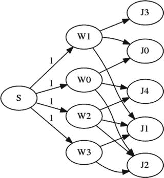
图 4-4 将工人分配给工作

## 4.2 最小成本流

还有一类问题，其解的整数性可以“免费”得到保证：即最小成本流问题（`mincost`）。

这是一个典型示例。`Solar-1138` 公司拥有一组清洁发电厂，为多个城市供电。每个发电厂都有最大容量，因此只能提供有限数量的千瓦时（`kW-h`）。每个城市都有峰值需求，并且所有城市的峰值大致在同一时间出现。因此，峰值需求的总和就是发电厂需要满足的电量。将一千瓦时从发电厂输送到城市的成本因发电厂、城市、输送基础设施以及发电厂与城市之间的距离而异。该成本是通过考虑电力生产、发电厂及电力线路的维护而确定的。

表 4-3 列出了发电厂与城市之间（在可能的情况下）的输送成本，单位为美元/千瓦时。每个发电厂的最大供应量和每个城市的峰值需求均以千瓦时为单位。

**表 4-3** 电力配送成本示例

| 从/到 | 城市 0 | 城市 1 | 城市 2 | 城市 3 | 城市 4 | 城市 5 | 城市 6 | 供应量 |
| --- | --- | --- | --- | --- | --- | --- | --- | --- |
| 电厂 0 | 23 |   | 19 | 25 | 14 |   | 22 | 551 |
| 电厂 1 | 16 |   |   | 20 | 23 | 13 | 23 | 689 |
| 电厂 2 | 22 | 18 | 11 |   | 20 | 13 | 24 | 634 |
| 需求量 | 288 | 234 | 236 | 231 | 247 | 262 | 281 |   |

需要回答的问题是：“应从每个发电厂向每个城市输送多少电力，才能在满足峰值需求的同时使成本最小化？”

### 4.2.1 构建模型

在这个问题中，我们需要决定从每个发电厂向每个客户输送的电量。一个发电厂可能不向任何城市、向部分城市或向所有城市输送电力，我们需要一种方式来指明这一点。作为视觉辅助，请考虑图 4-5 中所示的二分图⁵，其中发电厂是顶部节点，城市是底部节点，弧是电力线路，并标注了沿该特定输电线路输送电力的成本。

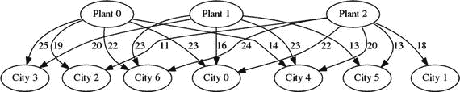
图 4-5 需要图注

#### 4.2.1.1 决策变量

有了这个图像，问题的解决方案将是，对于每个发电厂-城市对，发电厂向城市输送的电量。最简单、最自然的方法是引入一个二维变量。第一个维度表示起点（发电厂集合 `P` 中的哪个发电厂），第二个维度表示终点（城市集合 `C` 中的哪个城市），即

```
x_{i,j} ∀ i ∈ P, ∀ j ∈ C
```

例如，如果 `x[2,3] = 35`，则表示我们应该从发电厂 2 向城市 3 输送 35 千瓦时。

这些多维变量（您将会看到很多）仅仅是每个发电厂-城市组合对应一个变量的简写符号。因此，如果我们有 3 个发电厂和 4 个城市，我们实际上引入了 3 * 4 = 12 个决策变量。这在内存上有些浪费，因为并非每个发电厂和每个城市之间都存在路径，但如果这成为一个问题，您将看到如何避免这种浪费。

#### 4.2.1.2 目标

目标是**最小化配送的总成本（美元）**。为此，我们需要一个成本参数。假设 `C[i,j]` 的索引与决策变量完全一致。那么目标函数为：

```
min ∑_i ∑_j C_{i,j} x_{i,j}
```
(4.4)

#### 4.2.1.3 约束条件

约束条件分为紧密相关的两类：供应与需求。为便于引用，我们引入以下参数：`S[i]`（`i ∈ P`）和 `D[j]`（`j ∈ C`），分别表示工厂 `i` 的可能供应量和城市 `j` 的需求量。

每个工厂都有最大生产能力，我们必须遵守这一上限。因此，对于每个工厂，我们需要通过一个可用性约束来限制从该工厂配送的总量，如下所示：

```
∑_j x_{i,j} ≤ S_i ∀ i ∈ P
```

注意这里的不等式：我们并未强制配送量必须达到产能，而是要求其不超过供应能力。

城市的需求约束类似，但必须被满足。因此：

```
∑_i x_{i,j} = D_j ∀ j ∈ C
```

这里我们使用了等式约束。如果建模时错误地使用了不等式（例如 `≤`），最优解将全部为零。另一方面，如果我们使用 `≥`，由于我们是在最小化总成本，这不会改变解的结果。

#### 4.2.1.4 可执行模型

现在将其转化为一个可执行模型。为了使模型具有足够的通用性以解决所有此类问题，我们假设成本、需求和供应能力都存储在一个名为 `D` 的二维数组中，其结构如表 4-3 所示，其中成本为零表示该工厂与城市之间没有输电线路。

从比“工厂”和“城市”更通用的角度来看，我们可以将每一行视为一个生产者，每一列视为一个消费者，只是最后一行代表需求，最后一列代表供应。生产者与消费者之间交换的“产品”可以是任何东西，不仅限于可分割的数量（如千瓦时或升水），也可以是卡车、鲜花、数据包或人员。最优解中永远不会出现人员的小数部分。参见代码清单 4-2。

```python
def solve_model(D):
    s = newSolver('Mincostuflowuproblem')
    m,n = len(D)-1,len(D[0])-1
    B = sum([D[-1][j] for j in range(n)])
    G = [[s.NumVar(0,B if D[i][j] else 0,") for j in range(n)] \
        for i in range(m)]
    for i in range(m):
        s.Add(D[i][-1] >= sum(G[i][j] for j in range(n)))
    for j in range(n):
        s.Add(D[-1][j] == sum(G[i][j] for i in range(m)))
    Cost=s.Sum(G[i][j]*D[i][j] for i in range(m)for j in range(n))
    s.Minimize(Cost)
    rc  = s.Solve()
    return rc,ObjVal(s),SolVal(G)
```
代码清单 4-2
电力配送模型 (`mincost.py`)

第 6 行定义了二维变量，其中第一个索引指定生产者，第二个索引指定消费者。由于我们知道，如果某个特定的生产者-消费者对之间没有通道，则对应条目为零，因此我们利用这一点将变量的范围压缩为零。一个好的求解器会在执行任何其他工作之前利用此信息消除这些变量。

第 8 行确保我们的供应量不超过每个工厂的生产能力，而第 10 行确保满足峰值需求。第 11 行的目标函数计算总成本，并指示我们应最小化该值。

模型的输出结果如表 4-4 所示。读者可以验证，“总计”列的值小于或等于每个工厂的最大产量，而“总计”行的值恰好等于每个消费者的所需峰值需求。

**表 4-4** 电力配送问题的最优解

| 从/到 | 城市 0 | 城市 1 | 城市 2 | 城市 3 | 城市 4 | 城市 5 | 城市 6 | 总计 |
| --- | --- | --- | --- | --- | --- | --- | --- | --- |
| 工厂 0 |   |   |   |   | 247 |   | 281 | 528 |
| 工厂 1 | 288 |   |   | 231 |   | 170 |   | 689 |
| 工厂 2 |   | 234 | 236 |   |   | 92 |   | 562 |
| 总计 | 288 | 234 | 236 | 231 | 247 | 262 | 281 |   |

这里再次出现了一个有趣的现象：所有解都是整数，尽管我们并未施加任何整数性约束。

### 4.2.2 变体

最简单的变体是给弧线增加容量限制。这样我们需要确保没有流量超过容量。假设我们在矩阵 `A` 中存储了容量，那么只需添加如下形式的约束：

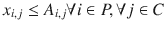

一个有趣的变体涉及分散供应源。例如，为了最小化风险，我们可能不希望来自单一供应源的需求超过某个比例。假设我们决定，任何城市的需求来自单一供应源的比例不得超过 60%，我们可以添加如下形式的约束：

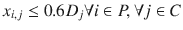

鼓励读者添加此约束，并注意最优值将不会像没有该约束时那么低。此外，解可能不再是整数。这个简单的附加约束破坏了保证整数性的性质。我们必须将决策变量声明为整数（这会增加复杂性和求解时间）以保证得到整数解。

除了物质流动问题，该问题有时也以指派问题的形式出现：给定一组具有特定技能和小时工资的工人，以及一组工作，你应将哪个工人指派给哪个工作以最小化成本？

例如，考虑一家咨询公司，有三个团队位于不同城市，以及三个客户位于不同地点。由于从团队到客户地点的差旅成本各不相同，我们希望最小化总差旅成本。在这种情况下，需求和供应都只是 1，因为我们希望每个客户地点有一个团队，并且每个团队分配一个客户。参见表 4-5。

**表 4-5** 需要标题

|   | 客户 0 | 客户 1 | 客户 2 | 供应量 |
| --- | --- | --- | --- | --- |
| 团队 0 | 25 | 30 | 20 | 1 |
| 团队 1 | 20 | 15 | 35 | 1 |
| 团队 2 | 18 | 19 | 28 | 1 |
| 需求量 | 1 | 1 | 1 |   |

## 4.3 转运问题

可建模为网络流问题的一类更通用的问题是转运问题。此类问题的特征是一组节点，每对节点之间都有运输成本；其中一部分节点是供应商，另一部分是消费者。其余节点可用于承载物料，但既不生产也不消耗，因此得名“转运”。

例如，表 4-6 给出了每对节点之间的交付成本。空白表示两个节点之间没有路径。最后一列表示节点可以生产的数量（如果有的话）；最后一行是每个节点的需求量（如果有的话）。请注意，需求总和通常应与供应总和相等，否则问题不可行。

**表 4-6** 网络上的转运配送成本示例

| 从/到 | N0 | N1 | N2 | N3 | N4 | N5 | N6 | N7 | 供应量 |
| --- | --- | --- | --- | --- | --- | --- | --- | --- | --- |
| N0 | | | | | 17 | 10 | 19 | | |
| N1 | 23 | | | 28 | | 23 | | | |
| N2 | 29 | | | | 30 | 25 | 25 | | 680 |
| N3 | | | | | 17 | 15 | 19 | 29 | |
| N4 | | 16 | | | | | | | |
| N5 | 22 | | | | 25 | | | 18 | 540 |
| N6 | 25 | 29 | 16 | | | 22 | | | |
| N7 | | | 30 | | 10 | | 27 | | |
| 需求量 | 241 | | | 164 | 239 | | 152 | 424 | |

转运问题通常如图 4-6 所示，对应于表 4-6 中的数据，其中箭头标注了物料运输成本，节点中包含正数表示供应值，负数表示需求值。

请注意，这显然是**最小成本流问题**的泛化，因为任意两个节点之间都可能存在弧，这意味着，例如，一个源节点可以接收网络中流动的任何产品，将其添加到自己的产量中，然后将结果发送到另一个节点，无论是消费者还是转运节点。

### 4.3.1 构建模型

在这个问题中，我们需要决定从每个有正供应量的节点向每个有正需求量的节点运送多少物料。对此进行建模的最简单、最自然的方法是引入一个二维变量。第一个维度表示起点，第二个维度表示终点。变量本身将包含要运输的数量。我们假设 `N` 是节点集合，得到

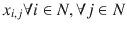

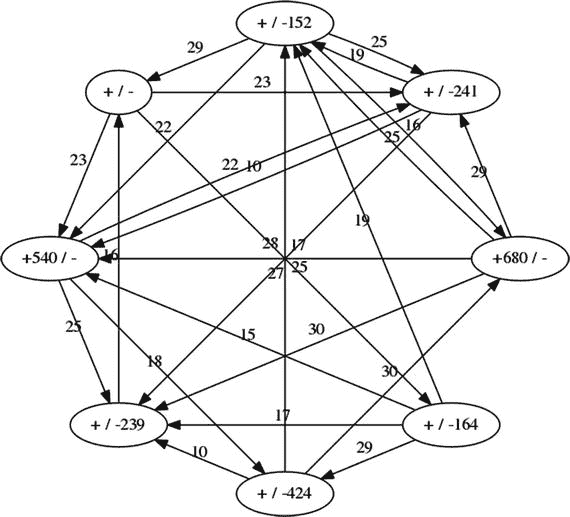

**图 4-6** 转运问题的图形化示例

例如，如果 `x[2,3] = 35`，则表示我们应该将 35 个单位从节点 2 运送到节点 3。

#### 4.3.1.1 目标函数

目标是最小化交付成本（以美元计）。为此，我们需要一个成本参数。假设 `C[i,j]` 的索引与决策变量完全相同。因此目标函数为

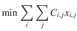

#### 4.3.1.2 约束条件

在之前的最小成本流问题中，我们有两种类型的约束：一种针对生产节点，规定流出量等于供应量；另一种针对消费节点，规定流入量等于需求量。我们可以在此处使用这些约束，此外还需要第三个针对中间节点（即没有任何需求或供应值的节点）的约束，规定流入量必须等于流出量。

虽然可以对每种类型的节点（生产者、消费者和中间节点）进行不同处理，但更简单的方法是注意到一个适当通用的约束将适用于每个节点。即，流入节点的流量（`f[in]`）减去流出节点的流量（`f[out]`）必须等于需求量（`D`）减去供应量（`S`），即

`f[in] − f[out] = D − S`。

请注意，在纯源点和汇点的情况下，该方程简化为我们在最小成本流模型中使用的约束：

- `− f[out] = −S` 源点的特殊情况
- `f[in] = D` 汇点的特殊情况

假设 `S[i]` 和 `D[i]` 分别是节点 `i` 的供应量和需求量，请记住，对于生产节点，只有供应量非零；对于消费节点，只有需求量非零；对于中间节点，两者都为零。我们得到

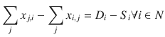

(4.5)

这个约束被称为通用的流量守恒约束。这是我们唯一需要的约束，但它必须在每个节点上都成立。

#### 4.3.1.3 可执行模型

让我们将其转换为可执行模型。为了使模型足够通用以解决所有此类问题，我们假设成本、需求和供应能力都包含在一个名为 `D` 的二维数组中，其结构如表 4-6 所示。每个条目 `{i,j}` 表示从节点 `i` 到节点 `j` 的运输成本，但最后一行表示需求，最后一列表示供应。参见代码清单 4-3。

```python
def solve_model(D):
    s = newSolver('Transshipmentuproblem')
    n = len(D[0])-1
    B = sum([D[-1][j] for j in range(n)])
    G = [[s.NumVar(0,B  if D[i][j] else  0,") \
       for j in range(n)] for i in range(n)]
    for i in range(n):
        s.Add(D[i][-1] - D[-1][i] == \
        sum(G[i][j] for j in range(n))-sum(G[j][i]for j in range(n)))
    Cost=s.Sum(G[i][j]*D[i][j] for i in range(n)for j in range(n))
    s.Minimize(Cost)
    rc = s.Solve()
    return rc,ObjVal(s),SolVal(G)
```

**代码清单 4-3** 转运配送模型 (`transship_dist.py`)

第 6 行定义了二维变量，其中第一个索引指定生产者，第二个索引指定消费者。变量的范围是从零到总需求量，或者为零，以确保我们不会使用不存在的路线。在数据 `D` 中，条目 `i,j` 处缺少成本表示 `i` 和 `j` 之间没有直接路线。

对应于 (6.5) 的通用流量守恒约束在第 7 行实现。第 10 行的目标函数计算总成本，第 11 行指示我们应该最小化该数量。

模型的输出显示在表 4-7 中。请注意，即使我们没有强制整数性，解仍然是完全整数。

读者可以验证，给定节点的“总计”列中的条目减去同一节点的“总计”行中的条目，等于该节点的供应量与需求量之差。这对于接收量超过其需求并将未使用的部分重新路由的节点尤其有趣。即使对于非常小的问题，这些也不是容易猜测的解。

**表 4-7** 转运问题的最优解

| 从/到 | N0 | N1 | N2 | N3 | N4 | N5 | N6 | N7 | 流出 |
| --- | --- | --- | --- | --- | --- | --- | --- | --- | --- |
| N0 | | | | | | | | | |
| N1 | | | | 164 | | | | | 164 |
| N2 | 125 | | | | 403 | | 152 | | 680 |
| N3 | | | | | | | | | |
| N4 | | 164 | | | | | | | 164 |
| N5 | 116 | | | | | | | 424 | 540 |
| N6 | | | | | | | | | |
| N7 | | | | | | | | | |
| 流入 | 241 | 164 | | 164 | 403 | | 152 | 424 | |

### 4.3.2 变体

- 一种可能的变体是供需不平衡的情况。可能是生产节点有最大产能，但不必完全满足；只有需求必须被满足。在这种情况下，这些节点必须单独处理，并且我们不再使用通用的流量守恒约束，而是指出流出量减去流入量必须最多等于供应量，因此

    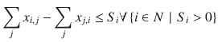

    其他部分无需更改，因为我们的目标是**最小化成本**并满足需求，因此我们会得到最优解。

- 相反的情况也有可能（尽管可能性不大），此时我们必须单独处理需求节点，并确保流入量减去流出量最多等于需求值。

- 另一个简单的变体是为弧段设置容量，限制通过它们的流量。在这种情况下，假设有一个容量矩阵 `C`，则附加约束为：

    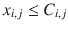

## 4.4 最短路径

现在，让我们考虑一下每当有人要求谷歌地图查找从 A 点到 B 点的路径时，谷歌所面临的问题：最短路径问题（根据距离或时间的最短路径）。读者可能会惊讶地发现，这也可以被建模为网络流问题，并且能够非常高效地求解。

以下是抽象后的情形：我们有一个二维数组，其中包含一组点之间的距离，如表 4-8 所示。这被称为距离矩阵。如果考虑的是行星尺度的问题，它可以是城市之间数千公里的距离；如果寻找考虑路径坡度的自行车道，它可以是城市街道交叉口之间以分钟为单位的时间。除了距离数组，我们还可以获得起点和终点，但如果没有提供，我们将假设数组已经排序，因此我们需要一条从第一个点到最后一个点的路径。

任务是找到一条起点和终点之间的点序列，使得数组中对应条目的总和最小。无论单位是什么，这都称为最短路径。请注意，我们不说“唯一”最短路径，因为可能存在多条总距离相同的最短路径。例如，如果我们经过序列 `0,3,2,5`，那么总距离将是 `M[0,3] + M[3,2] + M[2,5]` 的总和。

**表 4-8** 距离矩阵示例

|   | P0 | P1 | P2 | P3 | P4 | P5 | P6 | P7 | P8 | P9 | P10 | P11 | P12 |
|---|---|---|---|---|---|---|---|---|---|---|---|---|---|
| P0 |   | 46 | 17 | 24 | 51 |   |   |   |   |   |   |   |   |
| P1 | 46 |   |   |   | 31 | 33 |   | 54 |   |   |   |   |   |
| P2 |   | 38 |   |   | 34 | 31 |   |   | 51 |   |   |   |   |
| P3 | 24 |   |   |   | 33 |   |   | 17 | 49 | 31 |   |   |   |
| P4 | 51 |   |   |   |   | 4 |   |   | 18 | 39 | 60 |   |   |
| P5 | 48 |   |   |   | 4 |   | 4 | 27 |   | 35 | 57 | 51 |   |
| P6 |   |   |   | 33 | 1 |   |   |   |   |   | 59 |   |   |
| P7 |   | 54 | 26 |   | 32 | 27 | 31 |   |   | 14 | 42 | 66 |   |
| P8 |   |   | 51 | 49 | 18 | 20 | 17 | 43 |   |   | 57 | 32 |   |
| P9 |   |   |   |   | 39 | 35 |   | 14 |   |   | 28 |   |   |
| P10 |   |   |   |   | 60 |   |   |   |   |   |   | 58 | 6 |
| P11 |   |   |   |   |   |   |   |   | 32 | 61 | 58 |   | 56 |
| P12 |   |   |   |   |   |   |   |   | 59 |   |   | 56 |   |

### 4.4.1 构建模型

在这个问题中，我们需要决定从起点到终点要选择的点序列。这是给定点集（例如 `P`）的一个子集，以及遍历这些点的顺序。事实证明，最有效的方法是将点视为节点，将距离视为弧上的权重，从而构建一个图。在图上选择一条路径，就对应于原始地图上的一条路径。

乍一看，这可能不太自然。甚至可能不清楚如何构建一个决策变量来保存点的子集及其访问顺序。诀窍在于：对于图上的每条弧，我们都有一个决策变量，该变量恰好取两个值之一：如果我们不采用这条弧，则为零；如果我们采用这条弧，则为一。因此，

![$$ {x}_{i,j}\in \left[0,1\right]\forall i\in P,\forall j\in P $$](A457410_1_En_4_Chapter_Equl.gif)

以我们的示例路径 0,3,2,5 为例，决策变量 `x[0,3]`、`x[3,2]` 和 `x[2,5]` 的值为 1，而所有其他弧变量的值为 0。读者应该能看出这与其它流问题的相似之处：想象一个所有弧容量都为 1 的网络；一个整数解将是在某些相邻弧序列上的流量值为 1，而在所有其他弧上的流量值为 0。

目标函数相应地很简单。假设距离矩阵为 `D`，

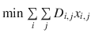，

我们如何确保选择一条从起点到终点的相邻弧序列？通过将其建模为通过图的单位流量，其中起点是值为 1 的源点，终点是值为 1 的汇点。我们只需要之前使用过的常规流量守恒约束。

可执行模型见代码清单 4-4，其中我们假设有一个距离矩阵 `D`，并带有可选的起点和终点。我们可以使用现有的流问题代码，但在此情况下，为了方便调用者，我们将编写一个专用代码来帮助调用并返回有意义的答案。毕竟，作为建模者，我们将此问题视为图上的流，但调用者考虑的是最短路径！我们不要用不自然的决策变量来给他增加负担。更不用说可能有百万个点，因此有万亿⁶个决策变量，而从调用者的角度来看，解可能只涉及这些变量中极小的一部分。

```
1   def solve_model(D,Start=None, End=None):
2     s,n = newSolver('Shortestupathuproblem'),len(D)
3     if Start is None:
4       Start,End = 0,len(D)-1
5     G = [[s.NumVar(0,1  if D[i][j] else  0,") \
6          for j in range(n)] for i in range(n)]
7     for i in range(n):
8       if i == Start:
9         s.Add(1 == sum(G[Start][j] for j in range(n)))
10         s.Add(0 == sum(G[j][Start] for j in range(n)))
11     elif i == End:
12       s.Add(1 == sum(G[j][End] for j in range(n)))
13       s.Add(0 == sum(G[End][j] for j in range(n)))
14     else:
15       s.Add(sum(G[i][j] for j in range(n)) ==
16            sum(G[j][i] for j in range(n)))
17     s.Minimize(s.Sum(G[i][j]*(0 if D[i][j] is None else D[i][j]) \
18                   for i in range(n) for j in range(n)))
19     rc  = s.Solve()
20     Path,Cost,Cumul,node=[Start],[0],[0],Start
21     while rc == 0 and node != End and len(Path)<n:
22       next = [i for i in range(n) if SolVal(G[node][i]) == 1][0]
23       Path.append(next)
24       Cost.append(D[node][next])
25       Cumul.append(Cumul[-1]+Cost[-1])
26       node = next
27     return rc,ObjVal(s),Path,Cost,Cumul
```

**代码清单 4-4** 最短路径模型 (`shortest path.py`)

在第 3 行，如果调用者没有指定起始节点和结束节点，我们将它们设置为第一个和最后一个节点。第 6 行定义了决策变量。我们对范围应用了一个小技巧：我们知道，如果距离矩阵中有一个零条目，这意味着两点之间没有路径。在这种情况下，我们给出一个`[0, 0]`的范围，这迫使该变量为零。在其他情况下，范围将是`[0, 1]`。请注意，这个范围允许分数值，但由于流问题中约束的结构，任何变量都不会出现分数值。它们都将为 0 或 1。

在第 9 行和第 12 行，我们将起始节点的供应量设置为 1，将结束节点的需求量设置为 1。在所有其他节点（第 16 行），流量守恒确保流入量等于流出量。这将产生一个由从起点到终点的连续路径组成的解。

第 18 行的目标函数与所有流问题示例具有相同的结构：成本（此处为距离）与所用弧的指示变量的乘积。

在求解问题之后，我们处理解，以向调用者返回比我们的决策变量更小且可能更有意义的内容：一个从点到点的跳跃序列，以及每次跳跃的距离。建模者的工作是隐藏解决问题所需的技巧，并向调用者提供有意义的解。与上述示例对应的解如表 4-9 所示。

**表 4-9** 最短路径问题的最优解

| 点 | 0 | 3 | 7 | 9 | 10 | 12 |

| --- | --- | --- | --- | --- | --- | --- |

| 距离 | 0 | 24 | 17 | 14 | 28 | 6 |

| 累计 | 0 | 24 | 41 | 55 | 83 | 89 |

### 4.4.2 替代算法

如果读者了解 Dijkstra 算法，他可能会疑惑为什么我们要为最短路径创建一个线性规划模型，尤其是因为 Dijkstra 算法的一个快速实现可能更快。答案是，在建模者的现实生活中，我们很少需要解决纯最短路径问题（或者实际上，纯任何问题）。在教科书之外的大多数情况下，问题的核心可能是一个最短路径，但必然会有许多额外的考虑。将这些考虑以附加约束的形式添加到基本的最短路径线性规划中通常是一件简单的事情。相比之下，尝试修改 Dijkstra 的实现（假设我们甚至能访问源代码）可能会困难得多，甚至可能根本不可能。

### 4.4.3 变体

*   可能我们想要最小化距离的乘积，而不是距离的总和。我们不能用线性求解器对变量进行乘法运算，但我们可以通过对距离取对数并最小化对数的和来稍微转换问题。

*   或者，我们可能对起点和终点之间的最长路径感兴趣。理论上，这不太可能在所有情况下都通过线性规划求解⁷，但阻碍理论的病态情况很少，并且可能不适用于当前的问题。另一种看待这个问题的方式是，存在一大类网络，在其中可以找到最长路径。

最简单的转换是将最小化改为最大化。我们可以通过取反距离矩阵来获得最大化。但这将允许重复节点；更糟糕的是，它可能导致一个无界模型（无限循环）。问题在于“流”可能无限次地绕着一个循环运行。一个部分解决方案是添加约束以确保没有超过一个单位的流进入任何节点。在最小化的情况下，这是一个冗余约束，但在最大化的情况下则不是。通过这种方式，我们消除了无限循环和重复节点。但仍然存在一个问题：子环路。我将在第 5 章的 5.4 节中解释并处理这个问题。

在无环有向图的情况下，最长路径很容易找到。你之前见过这些路径有意义的情况：在第 2 章的 2.3.1 节中，我讨论了项目管理的关键路径。这些是一系列任务，如果它们被延迟，将会延迟整个项目。请注意，这些路径很少是唯一的，因此寻找一条（或者更糟，寻找“那条”）最长路径是错误的（关于一个简单的例子，请参见任务 1 和 2 以及图`fig:process-example`）。让我们创建一个小的函数，它将从我们的项目管理模型的最优解开始，并使用我们的最短路径模型来提取关键路径。详情请参见清单 4-5。

```
1   def critical_tasks(D,t):
2     s = set([t[i]+D[i][1] \
3            for i in range(len(t))]+[t[i] for i in range(len(t))])
4     n,ix,start,end,times = len(s),0,min(s),max(s),{}
5     for e in s:
6       times[e]=ix
7       ix += 1
8     M = [[0 for _ in range(n)] for _ in range(n)]
9     for i in range(len(t)):
10       M[times[t[i]]][times[t[i]+D[i][1]]] = -D[i][1]
11     rc,v,Path,Cost,Cumul = solve_model(M,times[start],times[end])
12     T = [i for i in range(len(t)) \
13         for time in Path if times[t[i]+D[i][1]] == time]
14     return rc, T
清单 4-5
关键任务提取器
```

前几行创建了一个包含所有任务开始和结束时间的集合；一旦我们将它们重命名为`0, …, n-1`，它们将成为我们的网络节点。在第 9 行，我们通过取每个任务持续时间的相反数来创建距离矩阵。每个任务都有一个条目，从其开始时间到结束时间。

然后我们调用我们的最短路径模型，在这种情况下，它将找到从最早时间到项目完成时间的最长路径。最后，我们提取所有结束于最长路径某个节点上的任务。所有这些任务都是关键的，因为如果它们被延迟，将会延长已经是最长的路径。

在表 2-8 的示例上运行此代码，将生成表 4-10。

我们可能对从起始节点到网络中每个其他节点的最短路径树感兴趣。在这种情况下，我们可以运行最短路径模型`n - 1`次，但创建一个单独的模型更简单且有趣，特别是因为我们可以以比`n - 1`个路径列表更紧凑的形式返回解。清单 4-6 的思路是：将起始节点的供应量设为`n - 1`（第 8 行），并将每个其他节点的需求量设为 1（第 12 行）。第 5 行的决策变量，如果没有对应的弧，则其范围为空，否则范围为`[0, n]`。这与之前的最短路径代码形成对比，之前代码中范围最大为 1。我们需要这个放宽的范围，因为流量在到达给定路径上的最后一条弧（即与叶子节点相连的弧）之前，不会是单位流量。我们返回树中弧的列表及其距离，如表 4-11 所示。最好以图形方式显示，如图 4-7 所示。

**表 4-10**

项目管理示例的关键任务

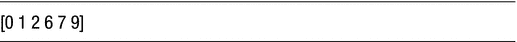

我们可能还对每对节点之间的最短路径感兴趣。同样，如果读者精通组合算法，他可能知道`Floyd-Warshall`算法，但出于创建最短路径模型的相同原因，我们可以创建一个全对最短路径模型，或者重复使用我们当前的模型来找到所有对。稍后您将看到一个更好的方法，但由于几行代码就足够了，让我们编写一个全对函数（清单 4-7）。

**表 4-11**

最短路径树问题的最优解

| From | To | Distance |

| --- | --- | --- |

| 0 | 1 | 46 |

| 0 | 2 | 17 |

| 0 | 3 | 24 |

| 0 | 4 | 51 |

| 2 | 5 | 31 |

| 2 | 8 | 51 |

| 3 | 7 | 17 |

| 5 | 6 | 4 |

| 5 | 11 | 51 |

| 7 | 9 | 14 |

| 9 | 10 | 28 |

| 10 | 12 | 6 |

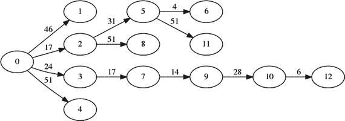

**图 4-7**

最短树解

```
1   def solve_tree_model(D,Start=None):
2     s,n = newSolver('Shortestupathsutreeuproblem'),len(D)
3     Start = 0 if Start is None else Start
4     G = [[s.NumVar(0,0 if D[i][j] is None else min(n,D[i][j]),")\
5     for j in range(n)] for i in range(n)]
6     for i in range(n):
7       if i == Start:
8         s.Add(n-1 == sum(G[Start][j] for j in range(n)))
9         s.Add(0 == sum(G[j][Start] for j in range(n)))
10       else:
11         s.Add(sum(G[j][i] for j in range(n)) - \
12              sum(G[i][j] for j in range(n))==1)
13     s.Minimize(s.Sum(G[i][j]*(0 if D[i][j] is None else D[i][j]) \
14                   for i in range(n) for j in range(n)))
15     rc  = s.Solve()
16     Tree = [[i,j, D[i][j]] for i in range(n) for j in range(n) \
16           if SolVal(G[i][j])>0]
17     return rc,ObjVal(s),Tree
清单 4-6
最短路径树模型
```

为了避免运行`n`[2]个实例，我们使用最优性原理，该原理指出，如果`P = (v[i+1], v[i+2], v[i+3], … , v[i+k])`是一条最短路径，那么`P`的每个子路径也都是最短路径。这在从第 11 行开始的循环中使用，以从给定的最短路径中提取所有中间路径。

```
1   def solve_all_pairs(D):
2     n = len(D)
3     Costs =[[None if i != j else 0 for i in range(n)]\
4       for j in range(n)]
5     Paths =[[None for i in range(n)] for j in range(n)]
6     for start in range(n):
7       for end in range(n):
8         if start != end and Costs[start][end] is None:
9           rc, Value, Path, Cost, Cumul = solve_model(D,start,end)
10           if rc==0:
11             for k in range(len(Path)-1):
12               for l in range(k+1,len(Path)):
13                 if Costs[Path[k]][Path[l]] is None:
14                   Costs[Path[k]][Path[l]] = Cumul[l]-Cumul[k]
15                   Paths[Path[k]][Path[l]] = Path[k:l+1]
16     return Paths, Costs
清单 4-7
使用我们的最短路径模型的全对最短路径函数
```

在我们的示例上运行清单 4-7 会生成距离矩阵，如表 4-12 所示。读者应该注意到，该矩阵扩展了表 4-7 的初始距离矩阵。

**表 4-12**

全对最短路径问题的最优解

|   | P0 | P1 | P2 | P3 | P4 | P5 | P6 | P7 | P8 | P9 | P10 | P11 | P12 |

| --- | --- | --- | --- | --- | --- | --- | --- | --- | --- | --- | --- | --- | --- |

| P0 |   | 46 | 17 | 24 | 51 | 48 | 52 | 41 | 68 | 55 | 83 | 99 | 89 |

| P1 | 46 |   | 63 | 70 | 31 | 33 | 37 | 54 | 49 | 68 | 90 | 81 | 96 |

| P2 | 79 | 38 |   | 68 | 34 | 31 | 35 | 58 | 51 | 66 | 88 | 82 | 94 |

| P3 | 24 | 70 | 41 |   | 33 | 37 | 41 | 17 | 49 | 31 | 59 | 81 | 65 |

| P4 | 51 | 85 | 57 | 41 |   | 4 | 8 | 31 | 18 | 39 | 60 | 50 | 66 |

| P5 | 48 | 81 | 53 | 37 | 4 |   | 4 | 27 | 22 | 35 | 57 | 51 | 63 |

| P6 | 52 | 86 | 58 | 33 | 1 | 5 |   | 32 | 19 | 40 | 59 | 51 | 65 |

# 网络流问题示例数据

## 示例数据表

| P7  | 75  | 54  | 26  | 64  | 31  | 27  | 31  |     | 49  | 14  | 42  | 66  | 48  |
|-----|-----|-----|-----|-----|-----|-----|-----|-----|-----|-----|-----|-----|-----|
| P8  | 68  | 89  | 51  | 49  | 18  | 20  | 17  | 43  |     | 55  | 57  | 32  | 63  |
| P9  | 83  | 68  | 40  | 72  | 39  | 35  | 39  | 14  | 57  |     | 28  | 80  | 34  |
| P10 | 111 | 145 | 116 | 101 | 60  | 64  | 68  | 91  | 65  | 99  |     | 58  | 6   |
| P11 | 100 | 121 | 83  | 81  | 50  | 52  | 49  | 75  | 32  | 61  | 58  |     | 56  |
| P12 | 127 | 148 | 110 | 108 | 77  | 79  | 76  | 102 | 59  | 114 | 114 | 56  |     |

## 脚注

1.  [`www.oakland.edu/enp/`](http://www.oakland.edu/enp/)
2.  这种模型的第一个实例通常归功于欧拉。
3.  请注意，在某些应用中，可能希望最大化源节点的流出量，而不考虑流入量。
4.  理论型读者可以研究“全幺模性”。
5.  二分图意味着顶部节点之间或底部节点之间永远不会有弧。您将在下一节中看到一个更一般的问题。
6.  如果读者读的是美式英语，则为十亿；如果是英式英语，则为万亿。
7.  请注意，如果我们能解决最长路径问题，我们就能解决哈密顿路径问题。另外，回想一下，线性规划可以在多项式时间内求解。因此，如果我们能通过线性规划解决最长路径问题，我们就证明了 `P = NP`。然后，我们就可以从克莱数学研究所获得一百万美元的奖金。