## 5. 经典离散模型

本章中的问题是整数规划（IP）的经典范例。更恰当的名称或许是离散线性规划，因为我们将之前的问题描述为连续线性规划，而连续的反义词是离散。可惜，传统根深蒂固，因此我们仍称其为整数规划。它们的特征在于代数上的线性约束和线性目标函数，并额外要求变量只能取整数值。

所有问题都极易陈述，尽管建模或求解并非总是如此简单。此处收录它们是为了强调两个要素：

- 首先，许多现实问题中都内嵌了一个或多个此类简单、纯粹的问题。因此，建模者若能识别这些核心结构并轻松建模，将大有裨益。
- 其次，许多问题若要高效建模，需要一些技巧。掌握这些技巧，并识别出可以应用它们的不同情境，是优秀建模者的标志。

构成整数模型的关键在于要求部分或全部变量为整数。请记住，与上一章的伪整数模型相反，问题的结构并不能保证这种整数性，建模者必须选择能够处理整数约束的求解器。

要求变量为整数有几个原因。第一个也是最明显的情况是我们在计数对象，而非测量数量（例如人、汽车或行星，而非水、二氧化碳或百分比）。第二种情况是决策变量代表对是/否问题的回答（我们应该建这座工厂吗？我们应该结婚吗？），或者更一般地，代表布尔条件（状态为真或假，满足排中律）。第三种情况更具技术性，适用于用作“指示变量”的辅助变量。即它们指示某种状态的存在或不存在（当且仅当连续变量 `x` 非零时，`y` 为 1）。当然，这些用例之间的界限是模糊的：一个真正的决策变量可以是一个指示变量，而一个辅助变量也可以用于计数人数。尽管如此，在建模时牢记这三种情况仍然是有益的。

本章的问题有多种有趣的变体。我不可能期望涵盖所有变体，但鼓励读者在阅读了一些变体后，去想象其他的变体。无论一个人在改变某些要求时多么富有创造力，这些问题大多已被广泛研究，以至于很少有变体未被触及，并且大多数变体都已找到某种用途。

## 5.1 最小集合覆盖

本章的第一个问题是整数规划中研究最深入、理解最透彻的问题之一。它有许多应用，但让我们考虑以下这个：通用引擎公司正在为其新款电动汽车系列寻找供应商。每个供应商都能生产汽车的部分零件，并且供应商之间的零件覆盖范围存在重叠。例如，海豚公司可以提供车轮轴承、电缆和低功率发光二极管，而舒克特公司可以提供电缆、电池和电池外壳。这里有数百家供应商和数千种零件。

对于通用引擎公司来说，最小化供应商数量可以节省合同成本。因此，目标是找到能够共同提供所有必需零件的最少供应商数量。集合覆盖这个名称解释了其目标：覆盖集合中的所有元素，这里指的是制造电动汽车所需的零件。用于说明模型的小例子见表 5-1。

**表 5-1** 集合覆盖示例

| 供应商 | 零件编号 | 供应商 | 零件编号 |
| --- | --- | --- | --- |
| S0 | { 3; 4; 5; 8; 24 } | S1 | { 11; 15; 21; 23 } |
| S2 | { 9; 15; 24 } | S3 | { 9; 13 } |
| S4 | { 5; 11; 12; 14; 16; 20 } | S5 | { 8; 11; 12; 15; 21 } |
| S6 | { 1; 4; 18; 20 } | S7 | { 0; 3; 6; 11; 13; 15; 21; 23 } |
| S8 | { 14; 16; 18; 19; 23 } | S9 | { 2; 7; 16; 22 } |
| S10 | { 10; 14; 21 } | S11 | { 6; 19 } |
| S12 | { 4; 10; 24 } | S13 | { 3; 4; 7; 9; 17 } |
| S14 | { 1; 3; 5; 6; 15; 18; 19; 20; 23 } |   |   |

### 5.1.1 构建模型

此模型将分阶段描述。

#### 5.1.1.1 决策变量

在这个问题中，我们需要决定哪些供应商将获得合同。这是一个是/否决策。对于每个供应商，我们需要一个变量，该变量将取两个值之一。整数规划中的经典方法是使用一个取值范围为 [0, 1] 的整数变量。由于它是整数，因此只有两个可能的值，即零和一，被称为二元变量或指示变量。

还有其他可能的方法：一种是使用取值为 `True` 和 `False` 的布尔变量，但这实际上是相同的方法，只是重命名了；另一种是使用一个动态数组变量，该数组将只包含被选中的供应商。后一种方法乍看之下可能很自然，但使用整数求解器并不容易实现。它更适合约束求解器，而本书不涉及约束求解器。

让我们假设一个供应商集合 `S`，并声明我们的第一个整数变量为

```
S_i ∈ {0, 1} ∀ i ∈ S
```

其解释是，例如，如果 `s[3]`、`s[5]` 和 `s[7]` 为 1，而所有其他变量为 0，那么通用引擎公司只向供应商 3、5 和 7 授予合同。读者可能会想到，在供应商数量远大于最终选定的供应商集合的情况下，我们是在浪费资源。我们将尝试减轻这种浪费，但从某种意义上说，这在整数规划中是不可避免的。

#### 5.1.1.2 目标函数

标准的目标是最小化供应商数量。由于每个供应商对应一个零一变量，我们需要最小化所有这些变量的总和，因此

```
min ∑_{i ∈ S} S_i
```

可能会遇到每个供应商有成本的情况。因此，我们不是简单地最小化供应商数量，而是要最小化总成本。假设供应商 `i` 的成本为 `C[i]`，我们将目标函数修改为

```
min ∑_{i ∈ S} C_i S_i
```

这个成本数组可能是所供应零件（零件越多，成本越高）以及供应商议价能力的函数。

#### 5.1.1.3 约束条件

从高层次来看，只有一个约束：通用引擎公司必须能够获得所有必需的零件。当然，某些零件可能有多个供应商，但我们绝不能出现某个零件没有供应商的情况（没有方向盘的汽车可能不太好卖）。

我们如何确保拥有所有零件？考虑一个给定的零件，比如零件 23。哪些供应商提供它？可能有四个，比如 1、7、8 和 14。

这意味着我们必须选择这些供应商中的一个来获得零件 23，或者用代数表示，即总和 `s[1] + s[7] + s[8] + s[14]` 必须至少为 1。（不等于 1，因为通常不存在没有冗余的解。）

这引出了对于所有零件集合 `P` 中的每个零件 `j` 的一个约束。我们将假设，如表 5-1 所示，供应商 `i` 提供的零件集合为 `P[i]`，从而得到

```
∑_{i: j ∈ P_i} s_i ≥ 1, j ∈ P
```

(5.1)

符号 `{i : j ∈ P[i]}` 表示仅当索引 `j` 在集合 `P[i]` 中时，我们才选择索引 `i`。我们将在可执行模型中看到这如何轻松实现。

#### 5.1.1.4 可执行模型

在代码清单 5-1 中，我们看到了完整的模型。让我们仔细审视它，重点突出与之前所有模型的两大区别：

- 求解器的实例化
- 决策变量的声明

```
1  def solve_model(D,C=None):
2    t = ’SetuCover’
3    s = pywraplp.Solver.CBC_MIXED_INTEGER_PROGRAMMING
4    s = pywraplp.Solver(t,s)
5    nbSup = len(D)
6    nbParts = max([e for d in D for e in d])+1
7    S = [s.IntVar(0,1,”) for i in range(nbSup)]
8    for j in range(nbParts):
9      s.Add(1 0]
14    Parts = [[i for i in range(nbSup) \
15      if j in D[i] and SolVal(S[i])>0] for j in range(nbParts)]
16    return rc,ObjVal(s),Suppliers,Parts
```

代码清单 5-1 集合覆盖模型（`set_cover.py`）

该函数接收一个二维数组 `D`，其中包含每个供应商提供的零件编号，与表 5-1 完全一致。代码还接受成本数组 `C`，用于处理每个供应商成本不同的情况。该参数是可选的，若缺失则表示一个纯集合覆盖问题，即我们只关心最小化所选子集的数量。

第 4 行与我们之前的所有模型不同。它选择了一个求解器，本例中为 COIN-OR 项目中的 CBC，³ 该求解器能够处理离散变量和连续变量。我们这一微小的改动，代表了求解器端数量级的变化。事实上，为了求解整数模型，大多数求解器会在内部求解大量从我们的模型衍生出的连续模型。这些算法非常引人入胜，但超出了本书的讨论范围。⁴

对于这第一个离散模型，我们使用底层的 OR-Tools 例程 `Solver` 创建求解器实例。从现在开始，我们将以如下方式使用自己的 `newSolver`：

```
s = newSolver('问题名称', True)
```

第二个参数默认为 `False`，若设为 `True` 则实例化一个整数求解器。在内部我们通常使用 CBC，但也有多种可用的整数求解器（详见第 7 章的代码清单 7-31）。

第 7 行定义了我们的二元变量（约定零表示“忽略该供应商”，一表示“选择该供应商”）。到目前为止，所有变量都是用 `NumVar` 定义的，这意味着它是一个近似实数的浮点变量。而使用 `IntVar` 则是告诉求解器该变量只能取整数值。由于我们将其范围限定为零到一，这就强制变量只能取两个值之一。所有求解器都支持任意范围。

读者可以尝试修改此模型，将 `IntVar` 改为 `NumVar`，并注意变量现在将取值为零、二分之一和一。⁵ 拥有半个供应商意味着什么？毫无意义，因此需要整数性约束。

第 9 行的循环实现了覆盖约束。它严格模仿了约束条件 (5.1)，强制每个零件的供应商总和大于等于一。请注意，我们如何轻松地基于 Python 中的条件语句提取子集。

第 11 行的成本函数要么是供应商的数量（如传统集合覆盖问题），要么是选择这些供应商的总成本（如果每个供应商的成本不同）。这就是可选成本数组 `C`（按供应商索引）的作用。

最后，在求解之后，我们构建有意义的返回值。如果调用者直接收到原始的 `S` 变量，那将非常痛苦。其中大部分可能为零。在涉及数千甚至数万个零件和供应商的实际问题中，零值并不重要。因此，我们返回一个数组，其中仅包含应签订合同的供应商，以及零件与供应商的交叉引用。这样用户就知道每个零件该找谁。

对于我们的示例，在缺少成本数组的情况下，其解如表 5-2 所示。第一行列出了所有保留的供应商，下一行则指出（在这些保留的供应商中）谁能供应每个零件。请注意，每个零件都被覆盖了。

**表 5-2** 集合覆盖问题的最优解

| 零件 | 供应商 | 零件 | 供应商 |
| --- | --- | --- | --- |
| 全部 | { 5; 7; 9; 10; 12; 13; 14 } | 零件 #0 | { 7 } |
| 零件 #1 | { 14 } | 零件 #2 | { 9 } |
| 零件 #3 | { 7; 13; 14 } | 零件 #4 | { 12; 13 } |
| 零件 #5 | { 14 } | 零件 #6 | { 7; 14 } |
| 零件 #7 | { 9; 13 } | 零件 #8 | { 5 } |
| 零件 #9 | { 13 } | 零件 #10 | { 10; 12 } |
| 零件 #11 | { 5; 7 } | 零件 #12 | { 5 } |
| 零件 #13 | { 7 } | 零件 #14 | { 10 } |
| 零件 #15 | { 5; 7; 14 } | 零件 #16 | { 9 } |
| 零件 #17 | { 13 } | 零件 #18 | { 14 } |
| 零件 #19 | { 14 } | 零件 #20 | { 14 } |
| 零件 #21 | { 5; 7; 10 } | 零件 #22 | { 9 } |
| 零件 #23 | { 7; 14 } | 零件 #24 | { 12 } |

### 5.1.2 变体

变体层出不穷，来自看似无关的领域。

- 集合覆盖问题的一个著名实例是臭名昭著的机组排班问题。假设我们是一家航空公司，希望确保在特定时间窗口内覆盖所有所谓的航段（城市对）。我们拥有机组人员从城市 A 到城市 B 的排班表，中间会在城市 C、D、……、E 经停。我们的任务是使用最少的排班表覆盖所有航段。
- 另一个极客风格的例子涉及计算机病毒检测。假设我们有一个包含数千种计算机病毒的数据库，并试图构建一个检测器。一种方法是尝试识别这些病毒中存在但非病毒代码中不存在的短字节串。我们希望最小化字符串的数量，同时识别所有病毒。然后，我们的检测器将在数据（硬盘上的所有程序）中查找这一小部分字符串。
- 在电信领域也有应用。假设我们可以在城市中的多个位置建造手机信号塔。考虑到每个塔的成本，我们希望最小化支出，同时覆盖城市中的所有建筑物和房屋。
- 我们应该在城市中何处设置消防站，以便在考虑平均响应时间的情况下，最小化消防站数量，同时覆盖整个城市？

## 5.2 集合打包

与集合覆盖问题相对应的镜像问题是集合打包。在这两种问题中，我们都有一个全集和一个子集集合，需要从中选择一些子集。在前者中，我们的目标是用最少的子集覆盖全集，可能某些元素会被覆盖多次。在后者中，目标是尽可能多地选择子集，但每个元素最多只能被选择一次。因此，某些元素可能不会被覆盖。

为了说明这个问题，我们考虑一个航空公司机组排班的应用。简化来说，假设每架飞机必须配备一名机长、一名副机长、一名领航员和一名乘务长。每个这样的组合称为一个排班表。有些机长可能只能驾驶某些类型的飞机，而不能驾驶其他类型。机长们也可能对副机长有偏好（反之亦然）。从概念上讲，我们可以将飞机/机长/副机长/领航员/乘务长的特定组合视为我们飞机和机组人员全集的一个子集。我们的目标是最大化所选子集的数量，但绝不能选择两个共享元素的子集，因为一名机长不能同时出现在两个地方。表 5-3 展示了这个问题的一个小实例。

**表 5-3** 机组排班中的集合打包示例

| 排班表编号 | 机组人员 ID | 排班表编号 | 机组人员 ID |
| --- | --- | --- | --- |
| 0 | { 3; 18; 30 } | 1 | { 4; 4; 36 } |
| 2 | { 1; 5; 9 } | 3 | { 7; 17; 30 } |
| 4 | { 10; 23; 23 } | 5 | { 8; 10; 25 } |
| 6 | { 19; 29; 36 } | 7 | { 3; 4; 17 } |
| 8 | { 19; 28; 40 } | 9 | { 11; 24; 31 } |
| 10 | { 18; 30; 33 } | 11 | { 22; 25; 26 } |
| 12 | { 13; 15; 26 } | 13 | { 21; 27; 28 } |
| 14 | { 7; 12; 33 } |   |   |

### 5.2.1 构建模型

模型将分阶段构建。

#### 5.2.1.1 决策变量

在这个问题中，我们需要做出的决策与集合覆盖问题非常相似：选择哪些排班表。同样，这是一个是/否决策，这暗示了使用指示变量。假设我们有一个机组排班表集合 `S`，将我们的指示变量声明为：

```
s_i ∈ {0,1} ∀ i ∈ S
```

#### 5.2.1.2 目标函数

最简单的目标是最大化所选排班表的数量，因此：

```
max ∑_{i∈S} S_i
```

当然，我们也可以有一个变体，为每个排班表赋予一个价值，并最大化总价值。

#### 5.2.1.3 约束条件

约束条件只有一个，即永远不能选择两个包含同一机组人员的排班表。由于我们的决策变量是 0-1 变量，我们可以简单地强制要求，对于每个机组人员，包含该机组人员的排班表变量之和最多为 1。

如果排班表 `i` 的所有机组人员都包含在 `S_i` 中，并且机组人员的全集是 `U`，我们得到：

```
∑_{i:j∈S_i} s_i ≤ 1 ∀ j ∈ u
```

#### 5.2.1.4 可执行模型

可执行模型如代码清单 5-2 所示。它与代码清单 5-1 非常相似，接收一个二维数组 `D`，其中包含机组排班表列表，与表 5-3 完全一致。该函数还将接受一个可选的成本数组 `C`，用于附加到每个排班表。

```
1  def solve_model(D,C=None):
2    s = newSolver('SetuPacking', True)
3    nbRosters,nbCrew = len(D),max([e for d in D for e in d])+1
4    S = [s.IntVar(0,1,”) for i in range(nbRosters)]
5    for j in range(nbCrew):
6      s.Add(1 >= sum(S[i] for i in range(nbRosters) if j in D[i]))
7    s.Maximize(s.Sum(S[i]*(1 if C==None else C[i]) \
8      for i in range(nbRosters)))
9    rc = s.Solve()
10    Rosters=[i for i in range(nbRosters)if S[i].SolutionValue()>0]
11    return rc,s.Objective().Value(),Rosters
```

代码清单 5-2 集合打包模型 (`set packing.py`)

对于我们的实例，在没有成本数组的情况下，一个解出现在表 5-4 中。

**表 5-4** 集合打包的最优解

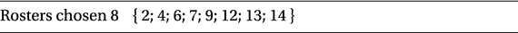

### 5.2.2 变体

几个小的变体。

- 主要的变体是为所选排班表赋予成本。然后我们最小化总成本。给出的代码已经实现了这种可能性。
- 另一种可能性是结合集合覆盖和集合打包：我们希望完全覆盖全集，并且每个元素恰好使用一次。在这种情况下，我们称之为集合划分。

## 5.3 装箱问题

尽管集合打包和当前问题（装箱问题）在形式上相似，但这两个问题的难度却截然相反。集合覆盖是容易处理的表亲，而集合打包则是久经沙场的老阿姨。为了解决它，我们需要超越显而易见的自然公式，深入挖掘一套新的工具。

抽象地说，装箱问题是将一个集合进行划分的问题，其中每个元素都有一个重量，我们的目标是使分组数量最小化，同时确保每个分组的重量不超过规定的限制。

为了说明这一点，运输公司 VQT Inc. 拥有若干辆卡车，每辆都有最大载重能力。在一个特定的早晨，他们有各种重量的包裹需要运输。`表 5-5` 描述了一个简单的实例。目标是使运送所有包裹所需的卡车数量最小化。

`表 5-5` 装箱问题示例

|   | 卡车载重限制 | 1264 |
| --- | --- | --- |
| 包裹数量 | 单位重量 |
| --- | --- |
| 0 | 8 | 258 |
| 1 | 10 | 478 |
| 2 | 8 | 399 |
| 总计 | 26 | 10036 |

请注意，仅考虑重量限制并不完全符合现实。包裹也有体积，我们很可能需要能够根据体积进行装箱。但那个问题要困难得多，我们将把它放在一边。还应该考虑距离因素，我们将在后面的章节中处理这个问题（见 5.4）。值得重复的一点是：现实生活中的优化问题很少（如果有的话）是纯粹而简单的教科书式问题。它们总是多个问题的组合。一个好的建模者能认识到这一点，并拥有建模所有问题的工具集。

### 5.3.1 构建模型

模型将分阶段描述。

### 5.3.1.1 决策变量

我们需要决定的是：“哪个包裹放入哪辆卡车？”我们知道所有包裹。尽管有许多相同的包裹实例（就我们的目的而言，即重量相同），我们可以为它们分配序号。但我们实际上并不知道卡车的数量。

这正是我们试图回答的问题之一。尽管如此，我们当然可以通过某种启发式方法给出卡车数量的上界。在最坏的情况下，我们可以肯定地说，我们最多需要每辆卡车运送一个包裹。

因此，假设有 `P` 个包裹，最多有 `T` 辆卡车。那么我们的决策变量是：

```
x_{i,j} ∈ {0,1} ∀ i ∈ P, j ∈ T
```

其中 `x[i,j] = 1` 表示包裹 `i` 放入卡车 `j`。

这是一个好的开始，但我们还需要知道我们将需要哪些卡车。因此，似乎需要另一个决策变量，即：

```
y_j ∈ {0,1} ∀ j ∈ T
```

其中 `y[j] = 1` 表示卡车 `j` 将被使用。这似乎回答了我们需要回答的所有问题。

### 5.3.1.2 约束条件

首先，我们需要在变量 `x[i,j]` 和 `y[j]` 之间建立关系，因为如果对于任意 `i`，`x[i,j]` 为 1，那么对应的 `y[j]` 必须等于 1（表示使用了卡车 `j`）。另一种理解方式是，我们不能将包裹放入未使用的卡车中。你之前已经见过这种类型的约束。回想一下第 2 章第 2.1.2 节的饮食问题，其中一条约束是：“如果使用了食物 2，那么饮食中必须至少包含等量的食物 3。”

总体思路是确保一个变量受限于另一个变量或其倍数。在这种情况下，这个技巧建议使用

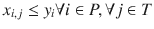

`(5.2)`

这确实满足我们的关系，尽管读者可能会觉得它相当浪费。确实，我们很快就会对这个尝试进行精简。顺便注意，我们还需要约束每辆卡车上包裹重量的总和。假设包裹 `i` 的重量为 `w[i]`，卡车 `j` 的容量为 `W[j]`，我们需要

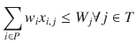

`(5.3)`

现在，当我们注意到类似约束的数量激增时，一个显而易见的问题是：“有没有办法将公式 `(5.2)` 和 `(5.3)` 结合起来？” 确实有：

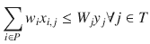

`(5.4)`

我们可以看到，公式 `(5.4)` 同时包含了 `(5.2)` 和 `(5.3)`。我们将约束数量从 `|P||T| + |T|` 减少到了 `|T|`，这是一个显著的改进。

至此，我们的模型保证了：

*   如果任何包裹被装载到某辆卡车上，则该卡车被使用。
*   每辆卡车上包裹的总重量不超过其容量。

最后，我们确保每个包裹都能被分配到某辆卡车上：

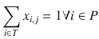

`(5.5)`

### 5.3.1.3 目标函数

最简单的目标是最小化使用的卡车数量，因此

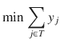

### 5.3.1.4 可执行模型

我们假设函数接收一个数组 `D`，其中包含一个包裹列表，列表中有每个包裹的重量以及每种重量的包裹数量（我们称之为重量等级），与 `表 5-5` 完全相同。它还接收 `W` 中每辆卡车的重量容量。第三个参数是可选的，将在我们解决小示例后进行解释。只需注意，其默认值为 `False`，在这种情况下，一组尚未解释的大量约束将被跳过（第 17 至 27 行）。参见清单 5-3。

```
1  def solve_model(D,W,symmetry_break=False,knapsack=True):
2    s = newSolver('BinuPacking',True)
3    nbC,nbP = len(D),sum([P[0] for P in D])
4    w = [e for sub in [[d[1]]*d[0] for d in D] for e in sub]
5    nbT,nbTmin = bound_trucks(w,W)
6    x = [[[s.IntVar(0,1,'') for _ in range(nbT)] \
7       for _ in range(d[0])] for d in D]
8    y = [s.IntVar(0,1,'') for _ in  range(nbT)]
9    for k in range(nbT):
10      sxk = sum(D[i][1]*x[i][j][k] \
11              for i in range(nbC) for j in range(D[i][0]))
12      s.Add(sxk = y[k+1])
19      for i in range(nbC):
20        for j in range(D[i][0]):
21          for k in range(nbT):
22            for jj in range(max(0,j-1),j):
23              s.Add(sum(x[i][jj][kk] \
24               for kk in range(k+1)) >= x[i][j][k])
25            for jj in range(j+1,min(j+2,D[i][0])):
26              s.Add(sum(x[i][jj][kk] \
27                for kk in range(k,nbT))>=x[i][j][k])
28    if knapsack:
29      s.Add(sum(W*y[i] for i in range(nbT)) >= sum(w))
30    s.Add(sum(y[k] for k in range(nbT)) >= nbTmin)
31    s.Minimize(sum(y[k] for k in range(nbT)))
32    rc = s.Solve()
33    P2T=[[D[i][1], [k for j in range(D[i][0]) for k in range(nbT)
34                 if SolVal(x[i][j][k])>0]] for i in range(nbC) ]
35    T2P=[[k, [(i,j,D[i][1]) \
36      for i in range(nbC) for j in range(D[i][0])\
37            if SolVal(x[i][j][k])>0]] for k in range(nbT)]
38    return rc,ObjVal(s),P2T,T2P
```

清单 5-3 装箱模型 (`bin_packing.py`)

在第 4 行，我们构建了一个重量数组，每个包裹对应一个。这同时也隐式地为每个包裹分配了一个序号。`bound_trucks` 函数（在清单 5-4 中描述）利用包裹的重量和每辆卡车的容量来快速估算卡车数量的上界。这个函数不需要非常出色，但更好的上界有助于加速求解器。

从第 7 行开始的两行定义了我们的决策变量：一个用于将包裹分配到卡车，另一个用于选择卡车。包裹变量是一个三维数组。第一个维度表示重量等级，第二个维度是该等级内的序号，第三个维度是卡车。因此，例如，如果 `x[2][3][5]` 的值为 1，则表示重量等级 2 中的第三个包裹被装载到了卡车 5 上。

第 9 行循环中的约束是公式 `(5.4)` 的转述，这是我们合并后的约束，既用于强制卡车选择变量，也用于限制卡车承载的包裹总重量，并针对三维决策变量进行了修改。

第 15 行的最终约束是公式 `(5.5)` 的转述，用于确保所有包裹都被分配到卡车。

暂时忽略从第 16 行开始并由 `symmetry_break` 参数控制的那些行。

求解后，我们得到两个数组，每个数组都提供了解决方案的不同视角。第一个数组指示每个包裹所装载的卡车。第二个数组指示每辆卡车所装载的包裹列表。我们实例的解决方案如 `表 5-6` 所示。第一个表格列出了卡车及其内容，内容由三元组（重量等级、包裹序号、重量）表示。第二个表格按与 `表 5-5` 相同的顺序列出了每个重量等级，以及该等级中每个包裹所装载的卡车。

`表 5-6` 最优包裹分配（朴素方法）

| 重量 | 卡车编号 |
| --- | --- |
| 258 | [0, 6, 2, 5, 3, 8, 7, 4] |
| 478 | [3, 5, 6, 8, 4, 5, 4, 6, 7] |
| 399 | [2, 0, 7, 8, 0, 3, 2] |

即使对于小规模实例，这段代码也可能需要数小时才能生成解决方案。装箱问题并非易事，原因之一如下：请注意，某些卡车编号被省略了。求解器似乎在我们允许的卡车中随机选择。此外，给定重量等级的包裹也随机分布在卡车之间。实际上，在不同的计算机或不同的求解器上对同一实例执行相同的模型，很可能会产生不同的答案（当然，使用相同总数的卡车）。问题在于存在许多具有完全相同值的解决方案。例如，想象一下交换两辆容量相同卡车的全部内容，或者在卡车内部或两辆卡车之间交换两个相同重量等级的包裹。这些交换显然不会对解决方案的值产生任何影响。

在经典优化术语中，这种情况是一种退化形式⁶。约束编程的研究人员则称之为对称性⁷。它几乎总是对求解器产生负面影响。运行时间难以预测，因为它依赖于求解器，但通常不会很好。还有另一个原因促使我们修改模型以避免这些相同的解决方案：我们可以为用户生成更优的解决方案。

添加约束以支持一个最优解决方案优于另一个相同解决方案（从我们的角度来看是相同的）被称为对称性破缺，这开始解释代码中保护额外约束的参数 `symmetry_break`。让我们着手处理这些约束，从最简单的开始。

假设所有卡车容量相同，我们如何确保卡车按顺序被选择且没有跳过任何一辆？一种方法是成对绑定卡车选择变量：

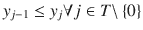

要了解其工作原理，请考虑 `y` 向量会发生什么。例如，要使 `y[5]` 为 1，必须满足 `y[4]` 为 1，并且传递性地，`y[3]`、`y[2]`、`y[1]` 和 `y[0]` 也必须为 1。另一方面，它对 `y[6]` 或更高值没有影响。在代码方面，这是在第 17 行的循环中完成的。

提到的第二种对称形式是可互换的包裹。按照我们陈述问题的方式，同一重量等级的两个包裹之间没有区别。然而，对于求解器来说，在卡车内部或两辆卡车之间交换两个包裹是另一种潜在的解决方案，而花在探索该方向上的任何时间都是浪费。

让我们考虑如何通过一个小例子来打破这种对称性，例如三个包裹和三辆卡车。思路是，由于一个重量等级的包裹是自然排序的，我们可以强制它们按顺序装载到卡车中。例如，如果第二个包裹装载到卡车一，那么第三个包裹只能装载到卡车一或更高的卡车。就决策变量而言，我们希望得到以下蕴含关系：

![$$ {\displaystyle \begin{array}{l}{x}_{0,2}=1\Rightarrow {x}_{1,2}=1\wedge {x}_{2,2}=1\\ {}{x}_{0,1}=1\Rightarrow {x}_{1,1}+{x}_{1,2}=1\wedge {x}_{2,1}+{x}_{2,2}=1\\ {}{x}_{0,0}=1\Rightarrow {x}_{1,0}+{x}_{1,1}+{x}_{1,2}=1\wedge {x}_{2,0}+{x}_{2,1}+{x}_{2,2}=1\\ {}{x}_{1,2}=1\Rightarrow {x}_{2,2}=1\kern16em \wedge {x}_{0,0}+{x}_{0,1}+{x}_{0,2}=1\\ {}{x}_{1,1}=1\Rightarrow {x}_{2,1}+{x}_{2,2}=1\kern16em \wedge {x}_{0,0}+{x}_{0,1}=1\\ {}{x}_{1,0}=1\Rightarrow {x}_{2,0}+{x}_{2,1}+{x}_{2,2}=1\kern16em \wedge {x}_{0,0}=1\\ {}{x}_{2,2}=1\Rightarrow \kern10.25em \ \ {x}_{0,0}+{x}_{0,1}+{x}_{0,2}=1\wedge {x}_{1,0}+{x}_{1,1}+{x}_{1,2}=1\\ {}{x}_{2,1}=1\Rightarrow \kern16em \ \ {x}_{0,0}+{x}_{0,1}=1\wedge {x}_{1,0}+{x}_{1,1}=1\\ {}{x}_{2,0}=1\Rightarrow \kern16em \ \ \ \ \ \ \ \ \ \ \ \kern4em {x}_{0,0}=1\wedge {x}_{1,0}=1\end{array}} $$](img/A457410_1_En_5_Chapter_Equk.gif)

稍后您将看到（第 7 章第 7.2.3 节关于具体化）实现这些蕴含关系的一般方法。现在，让我们尝试尽可能简单地实现它们。

第一个蕴含关系说：“如果包裹 0 被装载到卡车 2 上，那么包裹 1 和 2 也必须被装载到卡车 2 上。”但这是一个边界情况，因为卡车 2 是我们的最后一辆卡车。下一个蕴含关系更有趣：“如果包裹 0 被装载到卡车 1 上，那么包裹 1 和 2 必须被装载到卡车 1 或 2 上。”

总的来说，“如果一个包裹被装载到某辆卡车上，那么所有序号更大的包裹必须被装载到序号更大或相等的卡车上。”请注意，约束结构是，如果某个变量取值为 1，我们必须有一个右侧为 1 的等式成立。右侧为 1 是我们的切入点，因为我们可以将条件变量用作右侧。

注意不要过度约束模型。考虑第二个蕴含关系的一部分 `x[0,1] = 1 ⇒ x[1,1] + x[1,2] = 1` 以及以下朴素方法。如果我们使用等式，例如

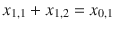

模型很可能会失败，因为如果 `x0,1` 为零（例如，如果包裹 0 被装载到卡车 0 而不是卡车 1），那么我们将阻止包裹 1 被装载到卡车 1 或 2，而这原本是可以接受的解决方案。所以正确的约束是

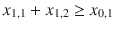

右侧为零时，约束变得无关紧要，因为左侧的所有变量都是非负的；右侧为一时，它强制将包裹正确分配到编号更高的卡车。用更抽象的术语来说，我们使用不等式是因为我们实现的是逻辑蕴含，而不是逻辑等价（是 ⇒，而不是 ⇔）。这些约束在模型 5.3 的第 27 行实现。

蕴含关系的右列可以理解为：“如果包裹 `i` 被装载到卡车 `k` 上，那么所有序号更小的包裹必须被装载到序号更小或相等的卡车上。”这些约束大多是冗余的，但在某些条件下它们可以帮助某些求解器。鼓励读者启用或禁用某些对称性破缺约束并进行实验。

所有这些额外的约束都减少了搜索空间。对于某些求解器，在某些问题上，这种方法将大幅减少执行时间。通过调用 `solve_model` 并将最后一个参数设置为 `True` 来启用这些对称性破缺约束后，同一实例的输出如 `表 5-7` 和 `表 5-8` 所示。您可以看到所有使用的卡车从零开始连续编号，并且包裹按顺序装载，这是一个更优的解决方案。通过阅读表格您看不到的是，运行时间仅占忽略对称性破缺约束时同一实例所需运行时间的极小部分。

`表 5-8` 带对称性破缺约束的最优包裹分配

| 重量 | 卡车编号 |
| --- | --- |
| 258 | `[0, 0, 0, 1, 2, 3, 4, 7]` |
| 478 | `[0, 1, 1, 2, 2, 3, 5, 5, 7]` |

| 399 | `[3, 4, 4, 6, 6, 6, 7]` |

**表 5-7** 具有对称性破缺约束的最优卡车装载量

| 卡车 8.0 (编号 重量) | 包裹 24 (9159) (编号 重量)* |
| --- | --- |
| 0 (1252) | `[(0, 0, 258), (0, 1, 258), (0, 2, 258), (1, 0, 478)]` |
| 1 (1214) | `[(0, 3, 258), (1, 1, 478), (1, 2, 478)]` |
| 2 (1214) | `[(0, 4, 258), (1, 3, 478), (1, 4, 478)]` |
| 3 (1135) | `[(0, 5, 258), (1, 5, 478), (2, 0, 399)]` |
| 4 (1056) | `[(0, 6, 258), (2, 1, 399), (2, 2, 399)]` |
| 5 (956) | `[(1, 6, 478), (1, 7, 478)]` |
| 6 (1197) | `[(2, 3, 399), (2, 4, 399), (2, 5, 399)]` |
| 7 (1135) | `[(0, 7, 258), (1, 8, 478), (2, 6, 399)]` |

我们还需要考虑一个简单的启发式方法来限定所需卡车的数量。我们首先将包裹添加到第一辆卡车，直到达到容量上限，然后继续处理下一辆。这种贪心方法永远不会是最优的，但足以获得所需卡车数量的一个合理上界。一个简单的下界可以通过将所有包裹的重量总和除以卡车容量得到。这在代码清单 5-4 中给出。存在更好的启发式方法，并且在处理大规模实例时可能是必要的。

```
1  def bound_trucks(w,W):
2    nb,tot = 1,0
3    for i in range(len(w)):
4      if tot+w[i] < W:
5       tot += w[i]
6      else:
7       tot = w[i]
8       nb = nb+1
9    return nb,ceil(sum(w)/W)
```

`代码清单 5-4` 用于限定卡车数量的简单启发式方法

### 5.3.1.5 变体

这个问题经常与其他问题结合出现。但这里列出几个较为简单的变体。

*   每辆卡车的载重容量可能不同。容量约束很容易调整，但必须注意对称性破缺约束。跳过某些卡车可能是不可避免的。因此，对称性破缺必须仅在具有相同容量的卡车子集内进行。

*   我们可能不是将固定数量的包裹装载到数量未定的卡车上，而是有固定数量的卡车和数量未定的包裹需要装载。在这种情况下，包裹除了重量之外，通常还具有价值，我们必须尝试最大化总价值。这种情况通常更容易求解。假设包裹 `i` 的价值为 `v[i]`，目标函数为

    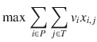

    并受约束 (5.4) 的限制。

*   有一种更简单的装箱问题版本，称为背包问题，其中包裹具有价值和重量，但只有一辆具有载重容量的卡车。这个问题非常简单，存在非常快速的算法。当然，通用的整数求解器也能毫无困难地解决它。尽管它很简单，但确实有一定价值，不是作为一个自然出现的问题，而是作为更复杂情况下的一个子问题。稍后你会看到相关示例。

*   一个密切相关的问题是资本预算问题。考虑一个多期规划期 `T` 和一组可能的项目 `P`；每个项目 `j` 在时期 `t` 需要投资 `a[tj]`，并代表价值 `c[j]`。给定时期 `t` 的有限预算 `b[t]`，哪些项目应该被指定用于投资？该模型是装箱问题的一个简化：

    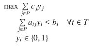

其中 `y[j]` 表示“对项目 `j` 进行（或不进行）投资”的决策。

## 5.4 TSP

我们现在来探讨经典的旅行商问题（以下简称 TSP）。这个问题对销售人员来说从未真正重要过，但在车辆路径规划、电子电路设计和作业排序等应用中却非常重要。此外，它还能让我以最小的额外复杂性，描述一种有效且可复用的建模技术：迭代添加约束。

以下是一个示例场景：在 HAL 公司，设计新电路的过程中，必须为每个基本元件供电。这些元件被放置在一个二维网格中，理论上所有元件之间都可以两两连接。为这些元件供电的最佳方式是建立一条总长度最小的路径，概念上从电源（`V[cc]`）开始，依次经过每个元件，然后返回电源（`Vee` 或地线）。⁸

因此，抽象地看，这个问题可以表述为：“给定一个图中两两之间的距离矩阵，找到一条遍历所有顶点且总距离最小的回路。”表 5-9 是我们将用来演示的示例。除了距离之外，它还包含了各点的笛卡尔坐标。我们不会在模型中使用这些坐标，但它们有助于可视化问题。表中数字的缺失表示两个节点之间没有直接路径。

**表 5-9** TSP 距离矩阵示例

| P (x y) | P0 | P1 | P2 | P3 | P4 | P5 | P6 | P7 | P8 | P9 |
| --- | --- | --- | --- | --- | --- | --- | --- | --- | --- | --- |
| P0 72 19 | | 711 | 107 | 516 | 387 | 408 | 539 | 309 | 566 | 771 |
| P1 10 37 | 539 | | 769 | 881 | 380 | 546 | 655 | 443 | 295 | 1140 |
| P2 77 31 | 122 | 752 | | 281 | 441 | 264 | 318 | 448 | 588 | 730 |
| P3 89 61 | 519 | 875 | 274 | | 435 | 334 | 93 | 776 | 949 | 302 |
| P4 51 61 | 484 | 561 | 338 | 419 | | 118 | 268 | 607 | 495 | 431 |
| P5 57 52 | 409 | 406 | 244 | 380 | 93 | | 295 | 544 | 549 | 494 |
| P6 82 69 | 479 | 735 | 334 | 101 | 345 | 247 | | 679 | 809 | 238 |
| P7 52 1 | 221 | 444 | 433 | 744 | 487 | 435 | 649 | | 325 | 840 |
| P8 21 14 | 510 | 303 | 599 | 984 | 531 | 553 | 847 | 350 | | 1001 |
| P9 88 96 | 663 | 989 | 664 | 335 | 588 | 434 | 297 | 1093 | 1012 | |

### 5.4.1 构建模型

该模型将分阶段进行描述。

### 5.4.1.1 决策变量

在这个问题中，我们需要决定的仅仅是路径，即要遵循的点序列。这与我们在最短路径问题中的决策相同；因此，假设 `P` 是点的集合，我们定义

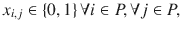

其中，值为 1 的 `x[i,j]` 表示我们需要连接点 `i` 和 `j`。注意：这个问题与最短路径问题具有相同的决策变量和底层图结构。然而，它不是一个流问题；它要复杂得多，你很快就会开始体会到这一点。

### 5.4.1.2 目标函数

目标函数与最短路径模型相同。假设距离矩阵为 `D`，我们得到

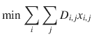

### 5.4.1.3 约束条件

在最短路径问题中，当我们进入一个中间节点时，必须确保也能离开该节点。而在此处，我们必须确保形成一条环游路径，即一条覆盖每个顶点恰好一次的单一闭合路径。因此，对于每个顶点，我们必须精确选择一条进入的弧和一条离开的弧，如下所示：

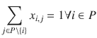

(5.6) 和

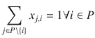

(5.7)

现在真正的难点来了：区分旅行商问题（TSP）与最短路径问题。上述两个约束条件是否足够？也许令人惊讶，答案是否定的，它们并不足够。每个顶点都位于某条环游路径上，但可能存在不止一条这样的环游路径。满足上述约束条件后，我们可能会得到一条路径 0, 1, 3, 4, 0，以及另一条环绕其余顶点的路径。这些有问题的路径被称为子环游（subtours），必须予以消除。消除的关键在于认识到：对于任意严格的节点子集，所选弧的数量必须小于节点数量。例如，为了消除子环游 0, 1, 3, 4, 0，我们可以添加以下约束：

`x[0,1] + x[1,0] + x[1,3] + x[3,1] + x[3,4] + x[4,3] + x[4,0] + x[0,4] ≤ 3`。

添加此约束后，求解器将永远不会在这四个有问题的顶点之间包含超过三条弧，从而防止它们之间形成子环游。另一种理解这类约束的方式是：它强制要求进入某个节点簇的路径必须离开该簇。难点在于存在大量可能的子环游，实际上其数量是指数级的：每个大小大于 1 的顶点子集都是一个潜在的子环游。

我们能否添加所有可能的子环游？从编程角度来看，这并不困难，但由此产生的模型会变得笨重，许多求解器的运行速度将慢得无法接受。诀窍在于迭代地改进模型，就像我们在优化非线性函数 3.1.2.1 时所做的那样。但在这里，我们将利用一次求解器运行的结果来选择要添加到下一次运行中的约束。

宏观视角：我们首先执行一个不含子环游消除约束的模型。如果求解器返回一条环游路径，则任务完成。如果它返回一组子环游，我们则为每个子环游（且仅针对它们）添加子环游消除约束。最终，所有相关的子环游都被消除，求解器返回整个图的一条环游路径。解释这种方法所花的时间，比通过编写几行代码来实现它要长得多。

### 5.4.1.4 可执行模型

让我们将其转化为可执行代码，并将其分为两部分：第一部分是一个模型，给定某个子环游集合后，它会针对该特定集合添加子环游消除约束并进行优化。参见代码清单 5-5。第二部分是一个主例程，它迭代地调用第一个模型，并在子环游出现时将其添加进去。

```
1  def solve_model_eliminate(D,Subtours=[]):
2    s,n = newSolver(’TSP’, True),len(D)
3    x = [[s.IntVar(0,0 if D[i][j] is None else 1,”) \
4         for j in range(n)] for i in range(n)]
5    for i in range(n):
6      s.Add(1 == sum(x[i][j] for j in range(n)))
7      s.Add(1 == sum(x[j][i] for j in range(n)))
8      s.Add(0 == x[i][i])
9    for sub in Subtours:
10      K = [x[sub[i]][sub[j]]+x[sub[j]][sub[i]]\
11          for i in range(len(sub)-1) for j in range(i+1,len(sub))]
12      s.Add(len(sub)-1 >= sum(K))
13    s.Minimize(s.Sum(x[i][j]*(0 if D[i][j] is None else D[i][j]) \
14                 for i in range(n) for j in range(n)))
15    rc = s.Solve()
16    tours = extract_tours(SolVal(x),n)
17    return rc,ObjVal(s),tours
```

`代码清单 5-5` 带子环游消除约束的 TSP 模型 (`tsp.py`)

第 4 行定义了决策变量，即要选取的弧的二元指示符。从第 5 行开始的循环强制执行：每个节点必须有一条进入的弧和一条离开的弧，这与公式(5.6)-(5.7)完全一致。我们还强制所有 `x[i][i]` 为零，以避免自环。对于调用者提供的每个子环游，我们在第 9 行提取相应团的所有弧，并约束它们的总和比该团中的顶点数少一。我们处理求解器返回的解，在第 16 行提取子环游并将其返回给调用者。此提取代码如代码清单 5-6 所示。

```
1  def extract_tours(R,n):
2    node,tours,allnodes = 0,[[0]],[0]+[1]*(n-1)
3    while sum(allnodes) > 0:
4      next = [i for i in range(n) if R[node][i]==1][0]
5      if next not in tours[-1]:
6        tours[-1].append(next)
7        node = next
8      else:
9        node = allnodes.index(1)
10        tours.append([node])
11      allnodes[node] = 0
12    return tours
```

`代码清单 5-6` 子环游提取

主循环很简单：我们不断迭代，直到求解器返回的环游路径数量为 1，同时注意在发现子环游时将其累积起来。参见代码清单 5-7。

```
1  def solve_model(D):
2    subtours,tours = [],[]
3    while len(tours) != 1:
4      rc,Value,tours=solve_model_eliminate(D,subtours)
5      if rc == 0:
6        subtours.extend(tours)
7    return rc,Value,tours[0]
```

`代码清单 5-7` TSP 模型主程序 (`tsp.py`)

针对我们小示例的求解结果，如表 5-10 所示（每行一次迭代），说明了被消除的子环游。括号内是最优值，即总长度。随着我们消除子环游，该值自然增加。图 5-1 以图形方式展示了该过程，其中每次迭代消除的子环游以不同的色调显示。

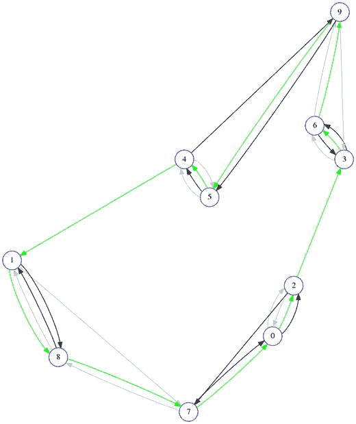

**图 5-1** TSP 示例的连续（部分）解

**表 5-10** TSP 求解器的连续迭代，显示最优值和子环游

| 迭代（值） | 环游路径 |
| --- | --- |
| 0-(2177) | [0, 2]; [1, 7, 8]; [3, 6, 9]; [4, 5] |
| 1-(2526) | [0, 2, 7]; [1, 8]; [3, 6]; [4, 9, 5] |
| 2-(2673) | [0, 2, 3, 6, 9, 5, 4, 1, 8, 7] |

从 TSP 模型中需要领悟的关键思想，并非我们可以用它来解决超大规模实例（专门的算法会做得更好得多）。⁹ 而是，即使完全指定一个正确模型所需的约束数量庞大，我们仍有可能仅包含所需约束中极小的一部分，就能将问题求解至最优。要有效做到这一点，必须对问题有深刻的理解，并具备良好的实践建模技能（当然，还需要一个好的建模语言和库，例如 Python 和 OR-Tools）。

最后，读者应注意，我们的子环游消除约束并非唯一可行的方法。消除子环游有多种方式，但没有一种像我们描述的那样易于实现。在实践中，嵌入了 TSP 子问题的问题通常还包含许多其他需求，这使得模型相对复杂。掌握一种简单而有效的处理子环游的方法，是所有建模者必备的技能。

### 5.4.2 变体

TSP 是研究最深入的组合问题之一，因此它有许多变体。

-   一个常见的简单变体是，我们需要的不是一条环游路线（闭合路径），而是一条覆盖所有顶点的简单路径。为便于参考，我们将此问题称为 TSP-P。由于我们知道如何求解环游问题，求解路径问题最简单的方法是将后者转化为前者。我们在网络中增加一个节点，称之为 `虚拟节点`。同时，我们添加从虚拟节点到网络中所有其他节点、距离为零的弧。然后，我们在这个新网络上求解 TSP。在最优解中，我们会得到一条进出虚拟节点的环游路线。删除这两条弧即可得到所需的路径。实现此变体的代码如代码清单 5-8 所示，在我们的示例上运行路径模型的结果如表 5-11 所示。

**表 5-11** TSP-P 路径模型在示例上的运行结果

| 节点 | 1 | 8 | 7 | 0 | 2 | 5 | 4 | 6 | 3 | 9 |
| --- | --- | --- | --- | --- | --- | --- | --- | --- | --- | --- |

| 距离 | 0 | 295 | 350 | 221 | 107 | 264 | 93 | 268 | 101 | 302 |
| :--- | :--- | :--- | :--- | :--- | :--- | :--- | :--- | :--- | :--- | :--- |
| 累计距离 | 0 | 295 | 645 | 866 | 973 | 1237 | 1330 | 1598 | 1699 | 2001 |

代码清单 5-8 求解 `TSP-P` 问题的代码 (`tsp.py`)

```python
def solve_model_p(D):
    n, n1 = len(D), len(D) + 1
    E = [[0 if n in (i, j) else D[i][j] \
          for j in range(n1)] for i in range(n1)]
    rc, Value, tour = solve_model(E)
    i = tour.index(n)
    path = [tour[j] for j in range(i + 1, n1)] + \
          [tour[j] for j in range(i)]
    return rc, Value, path
```

一个更复杂的变体是允许重复访问节点。为便于参考，我们将此问题称为 `TSP*`。提出此问题的理由很简单：可以想象，如果允许重复访问任何节点，我们或许能找到一条总长度更短的行走路径。这里的技巧同样是依赖我们的 `TSP` 模型，通过将 `TSP*` 转化为另一个网络上的 `TSP` 来求解。新网络拥有完全相同的节点，但节点间的距离是原始网络中节点间最短路径的距离。我们必须小心地追踪这些最短路径，以便重构 `TSP*` 的解。由于我们已经实现了全源最短路径模型（第 4 章的代码清单 4-7），这里将直接使用它。实现 `TSP*` 的代码如代码清单 5-9 所示，其在示例上的解如表 5-12 和图 5-2 所示。请注意，尽管它重复访问了一些节点，但总长度仍小于 `TSP` 的长度。

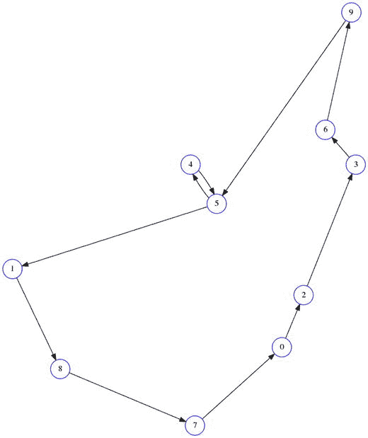

图 5-2 `TSP*` 的解

表 5-12 `TSP*` 函数在示例上的运行结果

| NB 12 | 0 | 2 | 3 | 6 | 9 | 5 | 4 | 5 | 1 | 8 | 7 | 0 |
| :--- | :--- | :--- | :--- | :--- | :--- | :--- | :--- | :--- | :--- | :--- | :--- | :--- |
| 总距离 2636 | 0 | 107 | 281 | 93 | 238 | 434 | 93 | 118 | 406 | 295 | 350 | 221 |

代码清单 5-9 求解 `TSP*` 问题的代码 (`tsp.py`)

```python
def solve_model_star(D):
    import shortest_path
    n = len(D)
    Paths, Costs = shortest_path.solve_all_pairs(D)
    rc, Value, tour = solve_model(Costs)
    Tour = []
    for i in range(len(tour)):
        Tour.extend(Paths[tour[i]][tour[(i + 1) % len(tour)]][0:-1])
    return rc, Value, Tour
```

脚注

¹ 用维格纳的话来说，这可能是数学在自然科学中具有不合理有效性的一个例子；或者更通俗地说，是因为我们主要解决那些我们知道如何解决的问题。

² 在某些情况下，使用二元选择 -1, 1 会使模型更简单。可惜的是，没有流行的整数求解器提供这个选项。

³ [`www.coin-or.org`](http://www.coin-or.org)

⁴ 感兴趣的读者可以搜索“分支定界”来开始了解相关求解技术。

⁵ 在纯集合覆盖问题中不可能出现其他分数，其原因引人入胜，鼓励读者自行研究（关键词搜索：半整数性）。

⁶ 对于理论导向的读者，这是对偶退化的一种情况。

⁷ 这种对称性源于对搜索树的可视化，并注意到存在多个具有完全相同结构和值的分支。

⁸ 从复杂度的角度来看，轨迹是否返回原点并不重要。如果需要，我们可以假设 `Vcc` 和 `Vee` 之间的距离为零。

⁹ 例如，参见 [`www.math.uwaterloo.ca/tsp/concorde.html`](http://www.math.uwaterloo.ca/tsp/concorde.html)