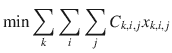
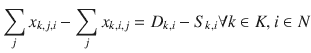
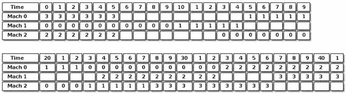

# 6. 经典混合模型

在本节中，我们将为需要混合连续变量和整数变量以及各种约束的问题建立模型。传统上，这些模型被称为混合整数规划 (MIP)。¹

我将介绍几个需要结合连续变量和离散变量的经典问题。设施选址问题所展示的原型且最简单的情况是，我们有在网络中流动的连续对象，但网络节点的存在与否取决于一个优化决策。另一个极端是，最困难的情况之一是作业车间调度问题，我们希望在满足优先约束的条件下，为不同机器上的操作序列进行排序。

这些混合模型的难度差异很大。对于前一种情况，我们能解决的问题规模几乎没有限制；然而，对于后一种类型，即使只有十几个元素的问题，在实践中也几乎是难以处理的。


## 6.1 设施选址问题

让我们重新审视在讨论流问题时首次遇到的分配问题，但这次增加了一些新的变化。回顾第 4 章第 4.2 节，当时 Solar-1138 公司需要决定由哪个电厂向哪个城市供电。现在，我们进一步假设 Solar-1138 正处于规划阶段，需要首先决定建造哪些电厂，然后再向城市供电。数据与之前类似。首先是每个候选电厂到每个城市的成本矩阵，如表 6-1 所示。

**表 6-1** 配送成本示例

| 起点/终点 | 城市 0 | 城市 1 | 城市 2 | 城市 3 | 城市 4 | 城市 5 | 城市 6 | 供应量 |
| --- | --- | --- | --- | --- | --- | --- | --- | --- |
| 电厂 0 | 20 | 23 | 23 | 24 | 28 | 25 | 13 | 544 |
| 电厂 1 | 19 | 18 | 30 | 25 | 19 | 17 | 14 | 621 |
| 电厂 2 | 29 | 13 | 19 | 17 | 22 | 15 | 11 | 635 |
| 电厂 3 | 16 | 23 | 29 | 22 | 29 | 26 | 11 | 549 |
| 电厂 4 | 23 | 20 | 10 | 27 | 23 | 19 | 20 | 534 |
| 电厂 5 | 21 | 12 | 23 | 29 | 14 | 15 | 22 | 676 |
| 电厂 6 | 13 | 18 | 22 | 13 | 11 | 25 | 23 | 616 |
| 电厂 7 | 21 | 12 | 20 | 20 | 20 | 13 | 11 | 603 |
| 电厂 8 | 24 | 24 | 29 | 17 | 18 | 16 | 20 | 634 |
| 电厂 9 | 28 | 11 | 22 | 26 | 25 | 19 | 11 | 564 |
| 需求量 | 553 | 592 | 472 | 495 | 504 | 437 | 634 |   |

此外，我们还有每个候选电厂的建造成本，如表 6-2 所示。由于建厂成本和配送成本都因电厂而异，我们面临的问题比简单的配送问题更为复杂。无论是在模型构建还是求解技术方面，它都更加复杂。现在需要回答的问题是：建造哪些电厂，以及每个电厂向每个城市输送多少电力。我将省略关于摊销的讨论，假设通过适当的计算已得出固定成本。

**表 6-2** 电厂建造成本示例

| 电厂 | 0 | 1 | 2 | 3 | 4 | 5 | 6 | 7 | 8 | 9 |
| 成本 | 5009 | 5215 | 6430 | 5998 | 4832 | 6365 | 6099 | 5499 | 5217 | 6153 |

### 6.1.1 构建模型

#### 6.1.1.1 决策变量

由于我们有两个相关但不同的决策，因此需要两组决策变量。与之前的配送模型一样，我们需要知道从电厂`i`到城市`j`的输送量，因此

```
x_{i,j} ∀ i ∈ P, ∀ j ∈ C
```

与通常的配送问题一样，例如`x[2,4] = 5`表示从电厂 2 向城市 4 输送 5 个单位。在本例中，这是一个连续变量。我们认为在网络中传输电力的分数值是合理的。对于某些应用，它可能是一个整数变量。

由于我们还需要知道电厂`i`是否会被建造，因此需要一个二元变量，

```
y_i ∈ {0,1} ∀ i ∈ P
```

其中`y[2] = 1`表示电厂 2 必须被建造。

#### 6.1.1.2 目标函数

目标函数现在包含两部分，传统上称为固定成本和可变成本。固定成本与建厂相关。可变成本是配送成本，如公式(4.4)所示，我们在此基础上加上固定成本。只有当变量`y[i]`为 1 时，电厂`i`才会被建造，假设成本存储在`c[i]`中，

```
min Σ_i Σ_j C_{i,j} x_{i,j} + Σ_i c_i y_i
```

#### 6.1.1.3 约束条件

与传统的**最小成本流问题**一样，我们必须有供应和需求约束，

```
Σ_j x_{i,j} ≤ S_i   ∀ i ∈ P
```

(6.1) 和

```
Σ_i x_{i,j} = D_j ∀ j ∈ C
```

(6.2)

现在我们需要考虑这个模型的新元素。如何将建厂相关的变量与电力配送相关的变量联系起来？我们不能从未建造的电厂配送电力，也不能建造那些不会配送任何电力的电厂。

由于目标函数是最小化，它倾向于将所有变量设为零，除非无法做到（当然，假设成本为正）。从我们在配送问题中的工作可知，`x[i,j]`变量会被正确设置。因此，我们必须确保相应的`y[i]`变量也被正确设置。

何时特定的`y[i]`应为 1，表示电厂`i`需要被建造？当最优解中对于相同的`i`和任意`j`，存在某个`x[i,j]`大于零时。这提示我们使用如下形式的约束：

```
Σ_j x_{i,j} ≤ y_i ∀ i ∈ P
```

这个约束满足了我们一半的需求：如果电厂`i`未被建造，则所有`x[i,j]`都不会大于零。然而，由于`y[i]`最多为 1，而左侧的和可能相当大，这存在不一致性。解决技巧是将`y[i]`乘以一个“足够大”的常数`M`。多大才算足够大？所有城市需求量的总和肯定可行，因为所有`x[i,j]`的总和不可能超过所有需求量。因此，假设所有需求量的总和为`M`，

```
Σ_j x_{i,j} ≤ M y_i ∀ i ∈ P
```

(6.3)

类型(6.3)的约束在优化领域被称为**大 M 约束**²，除非常数`M`足够小，否则应谨慎使用。如果常数过大，求解器（某些求解器尤甚）可能会遇到数值问题。在实践中，这意味着建模者应找到尽可能小的`M`并尝试使用。如果求解器无法处理，则需寻找其他建模技术。

读者可能会想到另一种大 M 方法：由于任何非零的`x[i,j]`都应触发相应的`y[i]`为 1，因此可以使用以下约束集：

```
x_{i,j} ≤ D y_i ∀ i ∈ P ∀ j ∈ C
```

其中`D`是某个合适的乘数。确实，这解决了我们的问题，并在增加约束数量的代价下，显著减小了乘数的大小。³

上述模型是可行的，但我们还可以通过减小`M`和消除部分约束来改进它。注意，约束(6.1)和(6.3)具有相同的结构和相同的左侧。这种情况提示我们可以将约束合并为：

```
Σ_j x_{i,j} ≤ S_i y_i ∀ i ∈ P
```

(6.4)

事实上，如果我们对`M`的大小进行更多思考，可能会得出结论：`S_i`是“最佳”的大 M 值。


#### 6.1.1.4 可执行模型

读者会认出该模型的大部分内容，因为它与清单 4-2 完全相同。我将仅强调不同之处。

求解器除了接收包含需求和供应数据的配送成本矩阵 `D` 之外，还接收一个固定建厂成本数组 `F`。

```
1  def solve_model(D,F):
2    s = newSolver('Facility_location_problem', True)
3    m,n = len(D)-1,len(D[0])-1
4    B = sum(D[-1][j]*max(D[i][j] \
5      for i in range(m)) for j in range(n))
6    x = [[s.NumVar(0,D[i][-1],") for j in range(n)] \
7       for i in range(m)]
8    y = [s.IntVar(0,1,") for i in range(m)]
9    Fcost, Dcost = s.NumVar(0,B,"),s.NumVar(0,B,")
10    for i in range(m):
11      s.Add(D[i][-1]*y[i] >= sum(x[i][j] for j in range(n)))
12    for j in range(n):
13      s.Add(D[-1][j] == sum(x[i][j] for i in range(m)))
14    s.Add(sum(y[i]*F[i] for i in range(m)) == Fcost)
15    s.Add(sum(x[i][j]*D[i][j] \
16         for i in range(m) for j in range(n)) == Dcost)
17    s.Minimize(Dcost + Fcost)
18    rc  = s.Solve()
19    return rc,ObjVal(s),SolVal(x),SolVal(y),\
20         SolVal(Fcost),SolVal(Dcost)
清单 6-1
设施选址模型 (facility_location.py)
```

第 11 行将是否建造某个工厂的决策与该工厂的运输量关联起来。注意，如果 `y[i]` 为零，表示我们不建造工厂 `i`，那么对应的 `x[i][..]` 将全部为零，因此不会有产品从该工厂流出。反之，如果 `y[i]` 为 1，那么从该工厂流出的产品将永远不会超过其供应能力 `D[i][-1]`。

第 17 行的目标函数最小化固定建厂成本与可变配送成本之和。

最后，我们返回所有运输的物料以及是否建厂的决策。此示例的解出现在表 6-3 中，该表仅显示了来自建厂决策所包含工厂的运输情况。

**表 6-3** 设施选址的最优解

|       | 城市 0 | 城市 1 | 城市 2 | 城市 3 | 城市 4 | 城市 5 | 城市 6 |
|-------|--------|--------|--------|--------|--------|--------|--------|
| 工厂 2 |        | 1.0    |        |        |        |        | 634.0  |
| 工厂 4 |        |        | 472.0  |        |        | 51.0   |        |
| 工厂 5 |        | 235.0  |        |        | 441.0  |        |        |
| 工厂 6 | 553.0  |        |        |        | 63.0   |        |        |
| 工厂 7 |        | 356.0  |        |        |        | 247.0  |        |
| 工厂 8 |        |        |        | 495.0  |        | 139.0  |        |

### 6.1.2 变体

*   主要的变体与容量有关。生产者和消费者之间的路径可能有一个最大容量，例如 `c[i,j]`。这可以通过定义具有适当定义域的变量来简单实现，即 `0 ≤ x[i,j] ≤ ci,j`，或者在可执行模型中，将第 7 行修改为：

```
x = [[s.NumVar(0,C[i][j],") for j in range(n)] for i in range(m)]
```

对于具有容量的网络，重新审视用于设置建厂决策变量的大 M 约束可能是值得的，并倾向于采用基于工厂流出流量的替代方法。

## 6.2 多商品流

之前讨论的流问题都是简单的整数问题，因为整数性是不劳而获的。无需将变量声明为整数即可获得整数最优解。但是，当同一网络承载多种商品时，情况并非如此；那么我们必须明确指定所有必须为整数的变量。

我们可以将此问题视为叠加在一个网络上的系列转运问题。一些节点是供应节点，一些是需求节点，另一些可以中转，并且需要运输的不止一种元素，因此一个作为某种元素供应节点的节点可能是另一种元素的消费节点。因此，我们将拥有多个成本、需求和供应数据表，如表 6-4 所示，这是一个小规模实例。目标与转运问题一样，是满足所有需求。

**表 6-4** 多商品流成本矩阵示例

| 商品 0 | N0  | N1  | N2  | N3  | N4  | 供应量 |
|--------|-----|-----|-----|-----|-----|--------|
| N0     |     | 20  | 23  | 23  | 24  | 532    |
| N1     | 19  |     | 18  | 30  | 25  |        |
| N2     |     |     |     | 13  | 19  |        |
| N3     | 24  | 23  |     |     | 22  | 512    |
| N4     | 23  | 10  |     |     |     |        |
| 需求量 |     | 230 | 306 |     | 508 |        |

| 商品 1 | N0  | N1  | N2  | N3  | N4  | 供应量 |
|--------|-----|-----|-----|-----|-----|--------|
| N0     |     | 23  | 29  | 14  | 15  | 533    |
| N1     | 22  |     | 13  | 11  | 25  | 609    |
| N2     | 20  | 20  |     | 13  | 11  | 634    |
| N3     |     | 18  | 20  |     | 24  |        |
| N4     |     |     | 11  | 22  |     |        |
| 需求量 |     |     |     | 354 | 1422|        |

| 商品 2 | N0  | N1  | N2  | N3  | N4  | 供应量 |
|--------|-----|-----|-----|-----|-----|--------|
| N0     |     | 30  | 17  | 19  | 30  |        |
| N1     |     |     | 21  | 19  | 27  | 564    |
| N2     |     |     |     | 29  | 27  | 588    |
| N3     |     |     | 12  |     | 27  |        |
| N4     | 27  | 15  |     | 16  |     |        |
| 需求量 | 315 |     |     | 360 | 477 |        |

### 6.2.1 构建模型

该模型将分阶段进行描述。

#### 6.2.1.1 决策变量

由于这仅仅是同一网络上的一组转运问题，因此每个问题需要一个决策变量。所以，假设有 `K` 种商品和一组 `N` 个节点，

![$$ {x}_{k,i,j}\in \left[0,1,2,\dots \right]\forall i\in N,\forall j\in N,\forall k\in K $$](A457410_1_En_6_Chapter_Eque.gif)

如果变量 `x[4,3,5]` 为 6，则表示沿弧 `(3, 5)` 发送 6 个单位的商品 4。

#### 6.2.1.2 目标函数

目标函数是转运目标函数的简单推广，



现在我们最小化在网络上运输所有商品的成本。

#### 6.2.1.3 约束条件

约束条件是广义的流量守恒，需要注意它们必须对每种商品分别成立：



(6.5)


#### 6.2.1.4 可执行模型

让我们将其转化为一个可执行模型，如代码清单 6-2 所示。该函数接受一个三维数组 `C`，表示每种商品在每条弧上的成本。它还接受 `D` 中的容量，该容量可以是一个标量（表示所有弧具有相同容量），也可以是一个二维数组（用于指定每条弧的容量）。最后，它接受参数 `Z`，用于指示：如果为 `True`，则必须将其作为整数规划求解，因为通过网络运输的元素是不可分割的；如果为 `False`，则接受分数解。设置最后一个参数的原因是，接受分数解虽然能极大加速求解过程，但仍可能产生整数解。

```
1  def solve_model(C,D=None,Z=False):
2    s = newSolver('Multi-commodityumincostuflowuproblem', Z)
3    K,n = len(C),len(C[0])-1,
4    B = [sum(C[k][-1][j] for j in range(n)) for k in range(K)]
5    x = [[[s.IntVar(0,B[k] if C[k][i][j] else 0,") \
6         if Z else s.NumVar(0,B[k] if C[k][i][j] else 0,") \
7         for j in range(n)] for i in range(n)] for k in range(K)]
8    for k in range(K):
9      for i in range(n):
10        s.Add(C[k][i][-1] - C[k][-1][i] ==
11             sum(x[k][i][j] for j in range(n)) - \
12             sum(x[k][j][i] for j in range(n)))
13    if D:
14     for i in range(n):
15       for j in range(n):
16         s.Add(sum(x[k][i][j] for k in range(K)) <= \
17              D  if type(D) in [int,float] else D[i][j])
18    Cost = s.Sum(C[k][i][j]*x[k][i][j] if C[k][i][j] else 0\
19         for i in range(n) for j in range(n) for k in range(K))
20    s.Minimize(Cost)
21    rc  = s.Solve()
22    return  rc,ObjVal(s),SolVal(x)
代码清单 6-2
多商品流模型 (multi_commodityflow.py)
```

这段代码与转运代码本质相同，只是增加了一些实用的修饰。决策变量现在有三个维度而非两个：第一个维度表示商品，后两个维度（与往常一样）表示弧。此外，如果参数 `Z` 为 `True`，则将其定义为整数变量。这样选择的原因是，对于极大量的网络（事实上是绝大多数）和多商品流问题，变量可以声明为连续变量，然而，如果所有需求、供应和容量都是整数，那么解也将是整数。面对长时间运行的建模者应尝试放宽整数约束。解很可能本身就是整数，从而节省大量 CPU 周期。解为整数的条件复杂且难以提前验证，因此出于实用目的，更简单的方法是先尝试连续求解器，如果解不实用再进行相应调整。

这个简单问题的解如表 6-5 所示。事实上，它是作为连续问题求解的。

**表 6-5** 多商品流的最优解

| 商品 0 | N0 | N1 | N2 | N3 | N4 |
| --- | --- | --- | --- | --- | --- |
| N0 |   | 226 | 306 |   |   |
| N1 |   |   |   |   |   |
| N2 |   |   |   |   |   |
| N3 |   | 4 |   |   | 508 |
| N4 |   |   |   |   |   |
| 商品 1 | N0 | N1 | N2 | N3 | N4 |
| N0 |   |   |   |   | 533 |
| N1 |   |   | 155 | 354 | 100 |
| N2 |   |   |   |   | 789 |
| N3 |   |   |   |   |   |
| N4 |   |   |   |   |   |
| 商品 2 | N0 | N1 | N2 | N3 | N4 |
| N0 |   |   |   |   |   |
| N1 |   |   |   | 360 | 204 |
| N2 |   |   |   |   | 588 |
| N3 |   |   |   |   |   |
| N4 | 315 |   |   |   |   |

### 6.2.2 变体

#### 6.2.2.1 全源最短路径（重访）

既然多商品流只是对转运问题的简单修改，为什么我还要介绍它呢？因为它们常被用于通过调整问题结构来适配多商品流模型。⁴ 这里有一个简单的例子：还记得寻找网络中所有节点对之间最短路径的问题吗？我们之前是通过求解一系列最短路径模型来完成的。现在可以通过运行单个多商品流模型来找到所有这样的路径；更好的是，它永远不需要整数约束，从而确保极短的运行时间。

其技巧是将每个节点视为某种特定商品的供应商，供应量为 `n - 1`。同时，每个节点也是其他节点提供的 `n - 1` 种商品的消费者。代码清单 6-3 实现了这种方法。该代码比这更通用一些，因为它允许我们指定一组源节点，并找出从这些节点出发到所有其他节点的路径。

在第四章 4 的全源最短路径问题上运行相同的代码，会得到相同的结果。（见表 4-11）。区别在于，流代码的速度要快得多。事实上，它通常比运行某些专用算法（如 Floyd-Warshall）快得多，后者的复杂度固定为 `n³`，而我们的流问题通常可以在与 `n` 成正比的时间内求解。

```
1  def solve_all_pairs(D,sources=None):
2    n,C = len(D),[]
3    if sources is None:
4     sources = [i for i in range(n)]
5    for node in sources:
6     C0 = [[0 if n in [i,j] else D[i][j] for j in range(n+1) ] \
7         for i in range(n+1)]
8     C0[node][-1] = n-1
9     for j in range(n):
10      if j!= node:
11        C0[-1][j] = 1
12      C.append(C0)
13    rc,Val,x = solve_model(C)
14    Paths = [[None for _ in range(n)] for _ in sources]
15    Costs = [[0 for _ in range(n)] for _ in sources]
16    if rc == 0:
17      for source in sources:
18       ix = sources.index(source)
19       for target in range(n):
20        if source != target:
21          Path,Cost,node = [target],0,target
22          while  Path[0] != source  and  len(Path)=0.1][0]
24           Path.insert(0,v)
25           Cost  +=  D[v][node]
26           node = v
27         Paths[ix][target] = Path
28         Costs[ix][target] = Cost
29    return rc, Paths, Costs
代码清单 6-3
通过多商品流求解全源最短路径
```

表 6-6 显示了运行代码并请求从节点 0 和节点 2 出发的最短路径的结果。读者应能看出，路径长度与表 4-12 中的结果完全相同。

**表 6-6** 第 4.4 节示例中从节点 0 和节点 2 出发的最短路径

| 0-目标 | 成本 | [路径] |
| --- | --- | --- |
| 1 | 46 | [0, 1] |
| 2 | 17 | [0, 2] |
| 3 | 24 | [0, 3] |
| 4 | 51 | [0, 4] |
| 5 | 48 | [0, 2, 5] |
| 6 | 52 | [0, 2, 5, 6] |
| 7 | 41 | [0, 3, 7] |
| 8 | 68 | [0, 2, 8] |
| 9 | 55 | [0, 3, 7, 9] |
| 10 | 83 | [0, 3, 7, 9, 10] |
| 11 | 99 | [0, 2, 5, 11] |
| 12 | 89 | [0, 3, 7, 9, 10, 12] |
| 2-目标 | 成本 | [路径] |
| 0 | 79 | [2, 5, 0] |
| 1 | 38 | [2, 1] |
| 3 | 68 | [2, 5, 6, 3] |
| 4 | 34 | [2, 4] |
| 5 | 31 | [2, 5] |
| 6 | 35 | [2, 5, 6] |
| 7 | 58 | [2, 5, 7] |
| 8 | 51 | [2, 8] |
| 9 | 66 | [2, 5, 9] |
| 10 | 88 | [2, 5, 10] |
| 11 | 82 | [2, 5, 11] |
| 12 | 94 | [2, 5, 10, 12] |

### 6.2.3 实例

光纤网络中有一个有趣的应用。考虑一组信号源节点、一组信号必须到达的汇节点，以及一组仅传输信号（必要时可增强信号）的中转节点。多个信号可以同时共享同一根电缆，只要它们使用不同的波长。可用波长的数量是有限的。这里我们面对的是多个叠加的转运问题。在这种情况下，目标是最大化已建立的连接数量。


## 6.3 人员配置水平

这个问题通常被优化师称为排班问题。但这其实是一个严重的误称，因为最终产生的并非排班表，而仅仅是需求水平。从业者所熟知的真正排班问题，其复杂程度要高数个数量级。因此，我们将此问题称为人员配置水平问题。

情况如下：我们有一个网格，其中一个维度按时间间隔索引。这个网格最常见的形式是按天（周一、周二）或按小时（上午 8 点、上午 9 点）划分，但也可以是任何有效的时间单位。在另一个维度上，是我们通常所说的班次，即工人工作时间的单位（周一至周五、周二至周日，或上午 8 点至下午 4 点、上午 9 点至下午 5 点）。每个时间间隔都对应着人员配置需求（例如周一需要 45 人，或中午需要 62 人）。最后，每个班次还关联着一个成本。示例见表 6-7。

**表 6-7** 人员配置需求矩阵

| | 班次 0 | 班次 1 | 班次 2 | 班次 3 | 班次 4 | 班次 5 | 班次 6 | 需求 |
| --- | --- | --- | --- | --- | --- | --- | --- | --- |
| 00 时 | 1 | | | 1 | | | | 15 |
| 02 时 | 1 | | | | | 1 | | 17 |
| 04 时 | 1 | | | | | 1 | | 16 |
| 06 时 | 1 | 1 | | | | | | 17 |
| 08 时 | | 1 | | | | | 1 | 19 |
| 10 时 | | 1 | | | | | 1 | 18 |
| 12 时 | | 1 | 1 | | | | | 11 |
| 14 时 | | | 1 | | | | | 12 |
| 16 时 | | | 1 | | | | | 15 |
| 18 时 | | | 1 | 1 | | | | 14 |
| 20 时 | | | | 1 | 1 | | | 20 |
| 22 时 | | | | 1 | 1 | | | 18 |
| 成本 | $69.37 | $67.03 | $64.55 | $72.06 | $29.24 | $21.67 | $24.52 | |

请注意，示例中包含两种类型的班次：全职（八小时）和兼职（四小时）。成本和每班次的工作时长不同，因为通常全职员工的薪酬高于兼职员工。目标是在满足需求并确保全职员工获得优先待遇的前提下，以最低总成本确定每个班次的工作人数。这种优先待遇可以有多种形式。可以是简单的“若无全职员工工作，则不安排兼职员工”，或“每个全职班次必须至少有 x 人”，或“我们有一个由 x 名全职员工组成的固定团队必须工作；其余需求由兼职员工填补”。我们将讨论这些约束条件的一些可能变体。

请注意，此问题的解决方案仅确定每个班次的人员配置水平。这并不是一个排班表。真正的排班表，即哪个工人上哪个班次，则留待另一个更复杂的模型来处理。

读者在此应注意到优化师处理复杂问题的一种常见方法：分解。表 6-7 最后一列显示的人员配置需求，很可能是由某个模型得出的。而配置水平将由我们正在创建的模型生成。最后，真正的排班表将由另一个模型生成。这种方法不太可能产生全局最优解。然而，它在所有行业中都有应用。航空业因分解问题而臭名昭著。我们之所以用这种方式处理复杂问题，有两个原因：一个好的原因和一个坏的原因。

好的原因是，通常从技术上解决整个问题并不可行。我们当然可以编写整个问题的模型，但在太阳系消亡之前，没有求解器能找到解决方案。同一原因的另一个方面是，整个问题的一部分最好建模为整数规划，而另一部分则用约束规划简单得多。目前还没有完全令人满意的方法来编写这种混合模型。⁵ 第二个原因，即坏的原因，是即使在某些更全面的方法可行的情况下，组织内部也存在巨大的惯性，阻碍其实施。⁶

### 6.3.1 构建模型

该模型将分阶段进行描述。

#### 6.3.1.1 决策变量

在此问题中，我们需要决定每个班次需要多少人工作。由于全职和兼职班次之间存在区别，区分全职员工（FTE）和兼职员工（PTE）可能是有用的。因此，假设 `N[f]` 和 `N[p]` 分别代表全职和兼职班次的集合，

```
x_i ∈ [0,1,2,…] ∀ i ∈ N_f ∪ N_p =: N
```

#### 6.3.1.2 目标函数

目标很简单，因为我们有每个班次的成本 `C[i]`，

```
min ∑_{i∈N} C_i x_i
```

#### 6.3.1.3 约束条件

让我们通过查看一个特定的时间间隔（例如 06:00，需求为 17 人）来处理人员配置需求。如果班次 0 覆盖午夜至上午 8 点，班次 1 覆盖上午 6 点至下午 2 点，那么这两个班次（且仅这两个班次）必须共同拥有至少 17 人来满足上午 6 点的需求。用代数式表示为：

```
x_0 + x_1 ≥ 17
```

现在，更一般地，考虑一个矩阵 `M[T×N]`，其中 `T` 是时间间隔的集合，其结构如表 6-7 所示（不含最后一行和最后一列）。我们需要的是，对于每个时间间隔 `t`，覆盖 `t` 的 `x[i]` 之和至少达到所需的需求 `R[t]`。用代数式表示为：

```
∑_{i∈N} M_{t,i} x_i ≥ R_t ∀ t ∈ T
```

(6.6)

这对于最简单的人员配置水平模型来说已经足够了。如果全职和兼职之间没有区别，我们就完成了。现在让我们考虑一些现实的约束条件。

1.  **最低全职员工数量**：如果我们要求每个全职班次 `i` 至少有 `Q[i]` 人工作，我们可以添加：

   ```
   x_i ≥ Q_i ∀ i ∈ N_f
   ```

   由于班次的结构（全职班次覆盖所有时间间隔），此约束也满足了“若无全职员工工作，则不安排兼职员工”的要求（当然，假设 `Q_i > 0`）。

2.  **全职员工必须工作**：一个可能更现实的要求是，给定一个由 `P` 名全职员工组成的固定团队，我们要求他们都工作。只有当人员配置需求无法满足时，才应动用兼职员工。这可以通过以下方式实现：

   ```
   ∑_{i∈N_f} x_i = P
   ```

   (6.7) 当然，除非全职员工人数低于或等于人员配置需求，否则此约束将不可行。

3.  **若无全职员工，则不安排兼职员工**：考虑一个特定的时间间隔，例如上午 10 点至中午。假设它可以由全职班次 1 和 2 以及兼职班次 6 来配置人员。我们希望确保除非 `x[1]` 或 `x[2]` 非零，否则 `x[6]` 为零。作为首次尝试，让我们试试：

   ```
   x_1 + x_2 ≥ x_6
   ```

   (6.8) 这确保了如果两个全职班次都没有全职员工，那么也不会有兼职员工。但它对问题的约束超出了必要，因为它阻止了兼职员工数量超过全职员工数量。我们需要的是用某个“足够大”的常数来缩放方程 (6.8) 的左侧。这又是优化师称之为大 M 法的一个实例。多大才算足够大？所需员工的总和肯定足够，但又不会大到引起数值问题。因此，

   ```
   ∑_{j∈T} R_j ∑_{i∈N_f} M_{t,i} x_i ≥ ∑_{i∈N_p} M_{t,i} x_i ∀ t ∈ T
   ```

   (6.9) 对于每个时间间隔，方程 (6.8) 在左侧对全职员工数量求和，并用一个大常数进行缩放。在右侧，它对兼职员工数量求和。


#### 6.3.1.4 可执行模型

该模型将接收一个时间与班次对应的 0-1 矩阵 `M`，与表 6-4 完全一致，同时还会接收一个被视为全职的班次数。如果问题中没有兼职人员，该数字将等于 `M` 的列数。最后一列表示每个时间间隔的最低需求。最后一行表示指定班次中一名工人的成本。

为了使该模型更实用，可以为其提供一个数组 `Q`，该数组以班次为索引，表示每个班次的最少人数。还可以为其提供一个标量 `P`，表示必须工作的全职人员数量。最后，还可以提供一个标志 `no_part`，如果该标志为 `True`，则表示除非有全职人员在场，否则不会有兼职人员工作。

```
1  def solve_model(M,nf,Q=None,P=None,no_part=False):
2    s = newSolver('Staffing', True)
3    nbt,n = len(M)-1,len(M[0])-1
4    B = sum(M[t][-1] for t in range(len(M)-1))
5    x = [s.IntVar(0,B,") for i in range(n)]
6    for t in range(nbt):
7      s.Add(sum([M[t][i] * x[i] for i in range(n)]) >= M[t][-1])
8    if Q:
9      for i in range(n):
10        s.Add(x[i]  >=  Q[i])
11    if P:
12      s.Add(sum(x[i] for i in range(nf)) >= P)
13    if no_part:
14      for t in range(nbt):
15        s.Add(B*sum([M[t][i] * x[i] for i in range(nf)]) \
16             >= sum([M[t][i] * x[i] for i in range(nf,n)]))
17    s.Minimize(sum(x[i]*M[-1][i] for i in range(n)))
18    rc  = s.Solve()
19    return rc, ObjVal(s), SolVal(x)
Listing 6-4
人员配置模型 (staffing.py)
```

在提取时间间隔数量、班次数量，并在第 4 行计算决策变量的一个界限后，我们将决策变量定义为一个非负整数。我们使用的界限显然是有效的，因为它是所有所需人员的总和。

我们在第 7 行实现了公式 (6.6) 的基本约束。然后，接下来的三个 `if` 语句实现了可选约束：最低全职人员数量、全职人员必须工作，以及若无全职人员则无兼职人员。

仅应用基本约束的结果如表 6-8 所示，而将 `no_part` 标志设置为 `True` 则得到表 6-9。请注意，在此示例中，工作总人数没有变化，但人员在各班次中的分布发生了变化，从而提高了总成本。

**表 6-9**  
在“无全职则无兼职”约束下的最优解

| $3225.47 | 班次 0 | 班次 1 | 班次 2 | 班次 3 | 班次 4 | 班次 5 | 班次 6 |
| --- | --- | --- | --- | --- | --- | --- | --- |
| 人数:71 | 14 | 3 | 15 | 1 | 19 | 3 | 16 |

**表 6-8**  
基本人员配置水平问题的最优解

| $3187.84 | 班次 0 | 班次 1 | 班次 2 | 班次 3 | 班次 4 | 班次 5 | 班次 6 |
| --- | --- | --- | --- | --- | --- | --- | --- |
| 人数:71 | 15 | 2 | 15 | 0 | 20 | 2 | 17 |

### 6.3.2 变体

我们已经通过实现可选参数涵盖了一些变体。还有众多其他变体，就像使用人员配置水平的公司一样多。下一步是将此模型转化为一个真正的排班模型，将具体人员分配到各个班次。我们将在后面开始解决这个问题，但鼓励读者思考实现真正排班的方法。

## 6.4 作业车间调度

一个相当难解决的问题如下：考虑在一组机器 `M` 上执行一组作业 `J`。每个作业需要在每台机器上花费一些时间来执行特定任务，并且任务必须按特定顺序执行。你可以想象一下制作木制玩具的过程。木材需要切割成型，然后打磨，再上底漆，然后上色，最后涂清漆。这些任务中的每一个都由不同的机器完成，并且需要一定的持续时间，具体取决于玩具。这里的“机器”一词含义相当广泛。它可以指在其工位上的高技能工人，也可以指机器人。其理念是相同的。此外，并非所有作业都需要所有机器。有些可能只需要一部分机器。总体目标是在每台机器上安排时间以完成所有任务，同时最小化总耗时。

我们将用于说明此模型的小例子如表 6-10 所示。

**表 6-10**  
作业车间调度示例（每个作业的任务机器及持续时间）

| 作业 | 机器-持续时间 | 机器-持续时间 | 机器-持续时间 |
| --- | --- | --- | --- |
| J0 | 1-10 | 2-10 | 0-10 |
| J1 | 1-5 | 0-8 | 2-5 |
| J2 | 2-5 | 1-9 | 0-9 |
| J3 | 0-6 | 2-9 | 1-5 |

### 6.4.1 构建模型

由于我们已知每个作业的任务顺序，因此这并非决策的一部分。我们寻求的是在给定机器上为给定作业开始特定任务的时间。因此，我们将使用一个表示开始时间的决策变量：

`x_{ik} ∈ [0, ∞) ∀ i ∈ J, ∀ k ∈ M`

我们并不假设持续时间是整数，因此决策变量是连续的。

第一类约束对开始时间设置了下界。例如，假设作业 7 必须在机器 4 上使用 3 小时，然后才能转到机器 6，那么开始时间满足 `x[74] + 3 ≤ x[76]`。一般来说，假设 `p[i]` 是作业 `i` 的机器顺序向量（0, 1, 2, …, `M − 1` 的一个排列），并带有持续时间向量 `d[i]`，我们得到：

`x_{i p_{ik}} + d_{ik} ≤ x_{i p_{ik+1}} ∀ i ∈ J, ∀ k ∈ [0, …, |M| − 2]`

这个问题的难点在于强制规定在任何给定时间，每台机器上最多只能有一个作业。机器空闲是可以接受的，尽管我们会尽量最小化空闲时间。我们如何强制实施这个约束呢？

一种方法是引入一个额外的变量，该变量将指示作业在给定机器上的相对顺序。例如，

`z_{ijk} ∈ {0, 1}, ∀ i, j ∈ J, ∀ k ∈ M`

其解释为：当且仅当作业 `i` 在机器 `k` 上先于作业 `j` 时，`z_{ijk} = 1`。请注意，由于要么作业 `i` 先于作业 `j`，要么反之，

`z_{ijk} = 1 ⇔ z_{jik} = 0`

利用这个变量，我们可以尝试强制实施这个困难的条件。再次考虑一个简单的例子。假设作业 7 需要机器 2 工作 3 小时，而作业 5 需要它工作 4 小时。那么要么 `x[72] + 3 ≤ x[52]`，表示作业 5 必须等到作业 7 在机器 2 上结束后才能开始，要么 `x[52] + 4 ≤ x[72]`，表示相反的时间条件。这是一个析取关系；我们需要满足其中一个约束。

使用变量 `z[ijk]`，可以通过考虑所有作业 `i`、`j` 和所有机器 `k` 来强制实施此条件：

```
z_{ijk} = 1 - z_{jik}
x_{i p_{ik}} + d_{ik} - M z_{ij p_{ik}} ≤ x_{j p_{ik}}
x_{j p_{jk}} + d_{jk} - M z_{ji p_{jk}} ≤ x_{i p_{jk}}
```

其中 `M` 是一个足够大的值。请注意，`z[ijk]` 或 `z[jik]` 中只有一个会为 1。因此，两个不等式中有且仅有一个具有约束力。另一个将自动满足。

剩下的就是处理目标函数。我们希望得到一个能在最短时间内完成所有作业的调度方案。我们可以为每个作业的结束时间添加一个界限，并最小化该界限。例如，

`x_{i p_{ik}} + d_{i p_{ik}} ≤ T ∀ i ∈ J, ∀ k ∈ [0, …, |M| − 1]`

目标为

`min T`

其中 `T` 将是最后一个机器上最后一个任务的完成时间。


#### 6.4.1.1 可执行模型

可执行代码见清单 6-5。该代码假设输入是一个元组列表，其格式与表 6-10 完全相同，为每个作业指明了所需机器的顺序以及每台机器上任务的持续时间。

```
1  def solve_model(D):
2    s = newSolver('JobuShopuScheduling', True)
3    nJ,nM   =   len(D),len(D[0])
4    M = sum([D[i][k][1] for i in range(nJ) for k in range(nM)])
5    x = [[s.NumVar(0,M,") for k in range(nM)] for i in range(nJ)]
6    p = [[D[i][k][0] for k in range(nM)] for i in range(nJ)]
7    d = [[D[i][k][1] for k in range(nM)] for i in range(nJ)]
8    z = [[[s.IntVar(0,1,") for k in range(nM)] \
9       for j in range(nJ)] for i in range(nJ)]
10    T = s.NumVar(0,M,")
11    for i in range(nJ):
12      for k in range(nM):
13        s.Add(x[i][p[i][k]] + d[i][k] <= T)
14        for j in range(nJ):
15          if i != j:
16           s.Add(z[i][j][k]  ==  1-z[j][i][k])
17           s.Add(x[i][p[i][k]] + d[i][k] - M*z[i][j][p[i][k]] \
18               <= x[j][p[i][k]])
19           s.Add(x[j][p[j][k]] + d[j][k] - M*z[j][i][p[j][k]] \
20              <= x[i][p[j][k]])
21      for k in range(nM-1):
22        s.Add(x[i][p[i][k]] + d[i][k] <= x[i][p[i][k+1]])
23    s.Minimize(T)
24    rc = s.Solve()
25    return rc,SolVal(T),SolVal(x)
清单 6-5
作业车间调度模型 (job shop.py)
```

在第 4 行，我们通过将所有任务（假设只有一台机器）的持续时间相加，计算出一个大于可能的最晚结束时间的值。该值将用于限制决策变量的定义域以及约束某些边界条件。第 6 行和第 7 行从输入元组中提取出机器排列向量和持续时间向量。这将使我们能够编写尽可能贴近所用抽象数学描述的代码。

第 13 行将 `T` 设置为所有任务结束时间的上限。然后我们将最小化这个 `T`，以获得最短的调度方案。第 22 行是公式 (6.4.1) 的翻译，它强制要求对于每个作业，任务必须按照输入元组规定的顺序执行。

最后，从第 15 行开始的 `if` 块是复杂析取逻辑发生的地方。它强制要求，对于每一对任务，其中一个必须严格在另一个之前执行。可以将变量数量减少一半，但一个好的求解器会在预处理阶段自动完成此操作。

我们简单示例的结果如表 6-11 和图 6-1 所示。

**表 6-11** 最优解（S 为开始时间；M 为机器；D 为持续时间）

| | (S; M; D) | (S; M; D) | (S; M; D) |
| --- | --- | --- | --- |
| 作业:0 | { 0.0; 1; 10 } | { 13.0; 2; 10 } | { 23.0; 0; 10 } |
| 作业:1 | { 10.0; 1; 5 } | { 15.0; 0; 8 } | { 23.0; 2; 5 } |
| 作业:2 | { 0.0; 2; 5 } | { 24.0; 1; 9 } | { 33.0; 0; 9 } |
| 作业:3 | { 0.0; 0; 6 } | { 28.0; 2; 9 } | { 37.0; 1; 5 } |



**图 6-1** 调度方案的图形化表示

**脚注**

1 另一个值得商榷的名称。变量是混合的，因为有些是连续的，有些是整型的。逻辑上建议将其命名为混合规划 (MP) 或混合连续整数规划 (MCIP)。

2 是的，更可悲的是缺乏想象力的命名法。

3 对于理论导向的人来说，在某些情况下，增加约束条件的数量实际上更可取，因为它能提供更紧的松弛；但这里并非这种情况。

4 例如，有许多关于使用多商品流创建时间表的研究论文。

5 这项工作正在由非常有才华的建模者零敲碎打地进行，他们愿意深入挖掘求解器的内部机制，但目前还没有通用的简便方法。五年后再来问我；OR-Tools 已经非常接近这个目标了。

6 负责问题某一方面的事务主义者会与负责另一方面的同事激烈争斗，以免他们放弃自己的一部分领地。我曾见过大量的时间和金钱在内部地盘争夺战中被浪费。

