# 7. 高级技术

在本章中，我将介绍优化专家多年来开发的一些技巧，用于调整模型并引导求解器为那些不易符合数学优化严格规则的问题提供解决方案。

其中一些技术涉及迭代求解一系列部分模型，逐步收敛到我们寻求的解。一些技术涉及创造性地使用多层决策变量，每一层都抽象出更多细节。还有一些技术涉及检查无效模型以获得改进模型的见解。总而言之，这是一袋混杂的珍宝，它们共同点不多，但目标都是解决更复杂的问题。

最后，我将介绍一系列经典优化器很少考虑、但却是约束编程核心内容的谜题。为了解决这些问题，我们构建了一个小型函数库，该库在简洁地表达这些模型方面被证明非常宝贵，我相信这证明了，只要拥有正确的工具和正确的语言，约束编程的表达能力可以移植到整数规划中。

## 7.1 下料问题

下料问题起源于造纸和纺织行业。典型的造纸厂生产非常大的产品卷（长度和宽度都很大），然后根据客户要求的宽度进行切割。我们将后者称为消费卷。例如，小报印刷机需要 17 英寸宽的纸卷，而大报印刷机则需要两倍宽度。这些消费卷在印刷后会被裁切成页面尺寸。对于造纸商来说，下料问题就是切割宽幅卷材以满足客户需求，同时最大限度地减少浪费。

表 7-1 是我们将用于说明模型的一个随机订单实例。第一列是订单中的消费卷数量，第二列是所需的宽度，该宽度已预处理为产品卷宽度的百分比。

**表 7-1** 下料问题示例

| 订单 | 卷材数量 | 宽度百分比 |
| --- | --- | --- |
| 0 | 6 | 25 |
| 1 | 12 | 21 |
| 2 | 7 | 26 |
| 3 | 3 | 23 |
| 4 | 8 | 33 |
| 5 | 2 | 15 |
| 6 | 2 | 34 |

我们希望最小化纸张浪费，这实际上意味着最小化使用的产品卷总数。但是，为了进行切割，我们需要更多信息，即给定任何产品卷，应该如何切割？假设我们有一些 21%和 36%的订单，我们是按 21%、42%、63%和 99%切割（浪费 1%），还是按 36%、72%和 93%切割（浪费 7%）？可能我们需要用第一种模式切割一半的卷材，用第二种模式切割另一半，才能满足所有需求。切割哪些模式以及每种模式切割多少卷是关键问题。参见图 7-1。

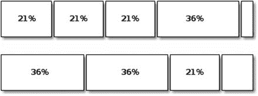

**图 7-1** 我们使用哪种模式？

### 7.1.1 构建模型

最初，这个问题是通过指定各种切割模式来解决的，有时是静态的，有时是动态的。这在很大程度上是受当时技术所限。情况已经发生了变化；处理器和求解器都大大加快了速度。此外，一个好的建模者应该首先尝试最简单的方法，并且仅当该方法失败时才使其更复杂。考虑到这一点，我们将把决定切割模式的问题留给求解器。


#### 7.1.1.1 决策变量

如果将模式决策交给求解器，问题就变成了：给定一卷原料，我们应该在哪里切割？但这属于过度指定。模式 21、42、63、99 与模式 21、57、78、99 是无法区分的。它们满足完全相同的客户需求：三个 21% 和一个 36% 的宽度。而且我们知道，存在多个无法区分的解对求解器非常不利。因此，我们应该问的是：“给定一卷原料，我们切割了多少个宽度为 `w` 的单元？”

基于此，假设我们有 `N` 个订单，最多使用 `K` 卷原料，一个合理的决策变量是

![$$ {x}_{i,j}\in \left[0,1,2,\dots \right]\forall i\in N,\forall j\in K, $$](A457410_1_En_7_Chapter_Equa.gif)

例如，`x[2,5] = 7` 表示我们切割第 5 卷原料，以满足订单 2 所指定宽度的 7 个客户单元。切割的顺序无关紧要，但我们可以在后续对解进行后处理，以生成可供使用的切割模式。

由于我们事先不知道需要多少卷原料，因此必须有一个相应的变量来指示原料的使用情况：

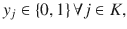

其中 `y[5] = 1` 表示使用了第 5 卷原料（在可能的 `K` 卷中）。这与我们在设施选址问题中用来决定开设哪个设施的技巧相同。

最大原料卷数 `K` 无需精确确定；此时任何上界都可以接受。

#### 7.1.1.2 目标函数

目标是最小化使用的原料卷数。我们可以最小化所有 `y[j]` 的总和，但这会留下一种可能性，即解可能显示“使用第 1 卷和第 3 卷，但不使用第 2 卷”。为了避免这种麻烦，我们使用一个小技巧，让每一卷新原料的成本都比上一卷更高：

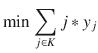

但现在，最优解的目标函数值将不再代表使用的原料卷数，因此我们引入一个辅助变量，例如 `t`，并添加：

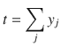

#### 7.1.1.3 约束条件

我们有两类约束。第一类是确保满足客户需求。因此，在所有使用的原料卷中，我们必须验证切割出的单元数量是否达到所需的订单数量，例如 `b[i]`：

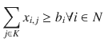

第二类约束是确保从产品卷上切割出的客户单元总宽度不超过该大卷的宽度，或者假设订单 `i` 的宽度为 `w[i]`（百分比形式）：

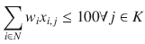

但这并不完整，因为我们需要将 `x` 和 `y` 变量关联起来。如果对应的 `y[j]` 为零，则任何 `x[i,j]` 都不应为正。我们可以引入大量约束，或者，意识到我们之前遇到过这种情况，只需修改最后一个约束为：

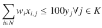

#### 7.1.1.4 可执行模型

让我们将其转化为一个可执行模型，如代码清单 7-1 所示。该模型接受一个矩阵 `D`，其格式与表 7-1 完全相同。

```
1  def solve_model(D):
2    s,n = newSolver('CuttinguStock', True), len(D)
3    k,b = bounds(D)
4    y = [s.IntVar(0,1,") for i in range(k[1])]
5    x = [[s.IntVar(0,b[i],") for j in range(k[1])] \
6       for i in range(n)]
7    w = [s.NumVar(0,100,") for j in range(k[1])]
8    nb = s.IntVar(k[0],k[1],")
9    for i in range(n):
10      s.Add(sum(x[i][j] for j in range(k[1])) >= D[i][0])
11    for j in range(k[1]):
12      s.Add(sum(D[i][1]*x[i][j] for i in range(n)) = \
16             sum(x[i][j+1] for i in range(n)))
17    Cost = s.Sum((j+1)*y[j] for j in range(k[1]))
18    s.Add(nb == s.Sum(y[j] for j in range(k[1])))
19    s.Minimize(Cost)
20    rc = s.Solve()
21    rnb = SolVal(nb)
22    return rc,rnb,rolls(rnb,SolVal(x),SolVal(w),D),SolVal(w)
代码清单 7-1
带模式搜索的原料切割模型 (cutting_stock.py)
```

在第 3 行，我们调用了一个名为 `bounds` 的例程，用于计算所需原料卷数的上下界，以及每卷原料中每种订单可容纳的单元数量上限。第 4 行使用原料卷数的上界来创建尽可能多的 `y` 变量（以及后续与每卷原料相关的约束）。第 5 行使用每种订单的单元数量上限来设定每个 `x` 变量的范围：在任意给定的原料卷上，我们可以切割零到最多可容纳的单元数量或客户所需的数量，因此使用了 `min` 表达式。

第 10 行通过将所有原料卷上某个订单的单元数量相加，确保满足每个客户的需求。我们也可以在此处使用不等式，即 `≥`。这样做的思路是，我们可能切割出比客户需求更多的单元，然后将这些单元存入库存，等待下一个订单。这有时是合理的，但通常最好将其排除在模型之外。一旦我们得到一个恰好满足客户需求的解，了解实际情况并拥有规划工具的人员就可以决定如何最佳地利用原料卷的剩余部分。无论哪种情况，这都不会改变使用的原料总卷数。

第 12 行确保从一卷原料上切割出的客户单元总宽度不超过该卷原料的 100%。而下一行并非约束，只是计算每卷原料的浪费量，以帮助返回一个有意义的解。

从第 14 行开始的循环打破了多个等价解（即原料卷的任意排列）的对称性。这些排列共有 `K!` 种，会导致大多数求解器花费过长的求解时间。通过这个约束，我们告诉求解器优先选择那些第 `j` 卷原料的切割数量多于第 `j + 1` 卷的排列。建议读者分别在有和没有这个对称性打破约束的情况下，求解一个中等规模的问题。我曾见过，没有这个约束时问题需要 48 小时才能求解，而有这个约束时只需 48 分钟。当然，对于几秒钟就能求解的问题，这个约束不会有帮助，甚至可能拖慢速度。但谁会在意一个原料切割实例是两秒还是三秒求解呢？我们更关心的是两分钟和三小时之间的差异，这正是这个约束所要解决的问题。

对于目标函数，我们可以简单地使用已用原料卷变量 `y` 的总和，并对未使用的原料卷进行预处理。但我们使用了一个小技巧，通过引入一个序数因子，使每一卷额外的原料变得更“昂贵”。这保证了，例如，如果估计原料卷数在 11 到 14 之间，而我们最终使用了 12 卷，那么它们将是前 12 卷，不会出现“空缺”。


存在其他可选的目标函数。例如，我们可以最小化总浪费量。这样做是合理的，尤其是当需求约束被表述为不等式时。此时，最小化总浪费量会消耗更多 CPU 周期，以尝试寻找能超额满足需求的更高效切割模式。如果需求宽度经常重复出现，并且可以通过库存中存放的已切割卷材来满足未来需求，这种方法尤其有效。请注意，使用此类目标函数时，运行时间会迅速增长。

最后，我们对求解结果进行整理，使其对调用者更有意义。我们不再使用决策变量 `x` 和 `y`，而是返回一个包含所有卷材的列表，其中包含每个卷材的切割模式和浪费量。

由于我们需要确定卷材数量的上下界，以及单卷上满足给定订单的最大切割次数，清单 7-2 实现了一个简单的启发式算法。下界显然是所有宽度之和除以卷材宽度（100），因为我们假设所有宽度都以百分比形式输入。上界通过首次适应启发式算法计算：我们按顺序将每个订单添加到一卷材上，直到无法再添加为止，然后开始新的一卷。这种方法并不高明，但足以达到目的。

```
1  def bounds(D):
2    n, b, T, k, TT = len(D), [], 0, [0,1], 0
3    for i in range(n):
4      q,w = D[i][0], D[i][1]
5      b.append(min(D[i][0],int(round(100/D[i][1]))))
6      if T+q*w <= 100:
7        T,TT = T+q*w,TT + q*w
8      else:
9        while q:
10          if T+w <= 100:
11            T,TT,q = T+w,TT+w, q-1
12          else:
13            k[1],T = k[1]+1,  0
14    k[0] = int(round(TT/100+0.5))
15    return k, b
清单 7-2
切割库存界限计算
```

清单 7-3 对求解结果进行了重新格式化，使其对调用者更有意义。它返回一个数组，其中包含每个已使用卷材的浪费百分比以及所使用的切割模式。当然，所指示的切割模式可以重新排列，而不会改变浪费百分比。我们这个小示例的输出结果如表 7-2 所示。

表 7-2

切割库存问题的最优解

| 卷材编号 | 浪费量 85.0 | 切割模式 |
| --- | --- | --- |
| 0 | 5.0 | { 26; 23; 23; 23 } |
| 1 | 16.0 | { 21; 21; 21; 21 } |
| 2 | 4.0 | { 25; 25; 25; 21 } |
| 3 | 4.0 | { 21; 21; 21; 33 } |
| 4 | 1.0 | { 21; 26; 26; 26 } |
| 5 | 1.0 | { 21; 26; 26; 26 } |
| 6 | 0.0 | { 25; 21; 21; 33 } |
| 7 | 0.0 | { 33; 33; 34 } |
| 8 | 45.0 | { 25; 15; 15 } |
| 9 | 1.0 | { 33; 33; 33 } |
| 10 | 8.0 | { 25; 33; 34 } |

```
1  def rolls(nb, x, w, D):
2    R,n = [],len(x)
3    for j in range(len(x[0])):
4      RR=[abs(w[j])]+[int(x[i][j])*[D[i][1]] for i in range(n) \
5                   if x[i][j]>0]
6     R.append(RR)
7    return R
清单 7-3
切割库存模型求解结果后处理
```

### 7.1.2 预分配切割模式

前面的方法是最优的，但即使加入了对称性破缺约束，其扩展性也不佳。我将在此描述一种通常非最优的方法，可用于求解规模更大的实例。

基本思路是固定切割模式，仅优化使用这些模式的卷材数量，同时满足需求。例如，假设我们已知表 7-2 最后一列的不同模式（存储在矩阵 `A` 中），以及表 7-1 中的数据（存储在数组 `D` 中）。那么我们可以定义一个决策变量 `y`，其索引对应 `A` 中的模式，表示按照该模式切割的卷材数量。用符号表示，模型如下：

![$$ {\displaystyle \begin{array}{l}\min \kern0.125em \sum \limits_j\ {y}_j\\ {}\kern1.25em \ \ {A}_{j,i}{y}_j\ge {D}_i\forall i\\ {}\kern1.25em \ \ {y}_j\in \left[0,1,2,\dots \right]\end{array}} $$](A457410_1_En_7_Chapter_Equh.gif)

这看起来很简单，直到我们仔细考虑模式的数量。如果我们事先不知道使用哪些模式，那么简单的做法似乎是列出所有模式。有多少种模式呢？即使对于小规模示例，这个数字也是天文数字。

因此，这里有一个绝妙的想法：从一组特定的模式开始，进行优化。然后，以某种尚未确定的方式，寻找一些“更好”的模式加入其中。在优化领域，这种方法通常被称为列生成¹。重复优化过程，直到我们无法再找到“更好”的模式，或者时间耗尽，或者对求解结果感到满意为止。清单 7-4 实现了这种高层方法。

```
1  def solve_large_model(D):
2    n,iter = len(D),0
3    A = get_initial_patterns(D)
4    while iter = b[i]))
22    rc = s.Solve()
23    y = [int(ceil(e.SolutionValue())) for e in y]
24    return rc, y, [0 if integer else u[i].DualValue() \
25               for i in range(m)]
清单 7-4
使用给定模式的切割库存模型 (cutting stock.py)
```

在第 4 行，我们循环进行一定次数的优化。这是一个简单的终止条件，我们可以根据所求解问题的规模以及愿意等待的时间来调整。存在更好的终止条件，例如循环直到获得真正的最优解，但这会让我们深入优化理论²。

主问题本质上就是上面描述的问题：给定一组允许的模式，尽最大努力最小化卷材数量。这里有两个微妙之处。第一，我们将优化问题作为线性规划而非整数规划来求解，尽管我们真正想要的是整数解（即卷材数量）。这样做是为了提高速度。最后，我们只需将卷材数量向上取整，因为显然如果 4.6 卷就能满足需求，那么 5 卷也一定能满足需求。

第二个微妙之处涉及寻找更好模式所需的信息。考虑一个约束条件的虚构示例，其形式如第 21 行所示：假设对于产品卷材 5，我们需要 28 个消费卷材来满足需求。考虑到我们已有的模式，模式 1 包含该卷材 3 次，模式 3 包含 5 次，模式 10 包含 1 次（并且没有其他模式包含卷材 5）。因此约束条件为：

`3y[1] + 5y[3] + 1y[10] ≥ 28`，

其中 `y` 是解。如果将 28 精确改变 1 个单位，同时保持其他所有条件不变，会产生什么影响？这将使最优解发生微小变化，即卷材 5 的边际价值。从概念上讲，我们可以对每个卷材都这样做，从而得到每个卷材的边际价值。根据设计，所有求解器都已经计算出了这些边际价值；它们是求解技术的副产品。因此，我们只需在第 25 行通过调用 `DualValue` 来获取它们。


最后，我们重新格式化求解结果，使其对调用方有意义。我们返回一个数组，其中包含每个使用的卷材、该卷材产生的废料以及所使用的切割模式。

主模型用于寻找新模式以进行优化的模型（清单 7-5）利用主模型求解提供的每个卷材的边际价值，并最大化该价值乘以该卷材在模式中出现次数的总和，同时确保模式在第 7 行不超过大卷的总宽度。这是一个背包问题，求解速度非常快。

```
1  def get_new_pattern(l,w):
2    s = newSolver('Cuttingustockuslave', True)
3    n = len(l)
4    a = [s.IntVar(0,100,") for i in range(n)]
5    Cost = sum(l[i]*a[i] for i in range(n))
6    s.Maximize(Cost)
7    s.Add(sum(w[i]*a[i] for i in range(n)) <= 100)
8    rc = s.Solve()
9    return SolVal(a), ObjVal(s)
```
*清单 7-5 切割库存模型（获取新模式）*

我们还有两个要素未描述：初始模式，以及将求解结果重新格式化使其有意义。从清单 7-6 可知，初始模式必须能够保证得到一个可行解，即满足所有需求的解。我们在这方面可以非常有创意，也可以不。考虑到模型已经比较复杂，我们选择后者。我们的初始模式每个模式只包含一个卷材，这显然可行但效率低下。

```
1  def get_initial_patterns(D):
2    n = len(D)
3    return [[0 if j != i else 1 for j in range(n)]\
4          for i in range(n)]

6  def rolls_patterns(C, y, D):
7    R,m,n = [],len(C),len(y)
8    for j in range(n):
9      for _ in range(y[j]):
10        RR=[]
11        for i in range(m):
12          if C[i][j]>0:
13            RR.extend([D[i][1]]*int(C[i][j]))
14      w=sum(RR)
15      R.append([100-w,RR])
16    return R
```
*清单 7-6 切割库存模型（获取新模式）*

采用这种列生成方法求解我们的小示例，结果如表 7-3 所示。请注意，它可能会使用更多卷材，但实际上每个卷材的切割效率非常高。它只是过度满足了需求，考虑到我们进行了向上取整，这并不意外。

*表 7-3 使用列生成法求解切割库存问题的可能次优解*

| 卷材 | 废料 1 | 模式 |
| --- | --- | --- |
| 0 | 0 | { 33; 33; 34 } |
| 1 | 0 | { 25; 21; 21; 33 } |
| 2 | 0 | { 25; 21; 21; 33 } |
| 3 | 0 | { 25; 21; 21; 33 } |
| 4 | 0 | { 25; 21; 21; 33 } |
| 5 | 0 | { 25; 21; 21; 33 } |
| 6 | 0 | { 26; 26; 33; 15 } |
| 7 | 0 | { 26; 26; 33; 15 } |
| 8 | 0 | { 25; 26; 26; 23 } |
| 9 | 0 | { 25; 26; 26; 23 } |
| 10 | 1 | { 21; 21; 23; 34 } |

## 7.2 非凸技巧

在讨论分段目标函数时（第 3 章第 3.1 节），我指出如果函数不是凸函数，那么所建议的方法将不起作用。这种情况通过一个模拟规模经济的成本函数来说明；即，随着单位数量的增加，单价会下降。例如，参见表 7-4。

*表 7-4 非凸分段函数示例*

| (起始 | 结束] | 单位成本 | (总成本 | 总成本] |
| --- | --- | --- | --- | --- |
| 0 | 194 | 18 | 0 | 3492 |
| 194 | 376 | 16 | 3492 | 6404 |
| 376 | 524 | 14 | 6404 | 8476 |
| 524 | 678 | 13 | 8476 | 10478 |
| 678 | 820 | 11 | 10478 | 12040 |
| 820 | 924 | 6 | 12040 | 12664 |

如果我们尝试用我们的模态方法做一些简单的事情，比如在 `x ≥ 250` 的约束下最小化这个函数，我们会得到表 7-5，这显然没有解决我们的问题，因为

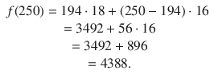

当然，如果我们尝试最大化，它就会起作用。简单的情况是最小化凸函数和最大化凹函数。³ 我将在这里讨论困难的情况。

回顾一下，该方法是为函数的每个断点引入决策变量 `λ[i]`，以指示最优解位于哪个分段以及在该分段上的具体位置（通过凸组合 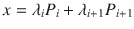）。然后模型变为：

![$$ {\displaystyle \begin{array}{l}\min \sum \limits_{i=1}^n{\lambda}_i\sum \limits_{j=1}^i\left({B}_j-{B}_{j-1}\right)\times {C}_{j-1}\\ {}\sum \limits_i{\lambda}_i=1\\ {}\kern1.25em x=\sum \limits_i{\lambda}_i{B}_i\\ {}\kern1em {\lambda}_i\in \left[0,1\right]\end{array}} $$](A457410_1_En_7_Chapter_Equj.gif)

以及其他约束条件。

*表 7-5 在 `x ≥ 250` 条件下非凸分段目标函数的错误解*

| 区间 | 0 | 1 | 2 | 3 | 4 | 5 | 6 | 解 |
| --- | --- | --- | --- | --- | --- | --- | --- | --- |
| `δ[i]` | 0.7294 | 0.0 | 0.0 | 0.0 | 0.0 | 0.0 | 0.2706 | 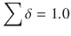 |
| `x[i]` | 0 | 194 | 376 | 524 | 678 | 820 | 924 | x=250.0 |
| `f(x[i])` | 0 | 3492 | 6404 | 8476 | 10478 | 12040 | 12664 | 成本=3426 |

这个模型的问题在于，即使在最优解处 `λ[i]` 的和为 1，我们却有两个不相邻的 `λ[i]` 非零。我们必须有两个相邻的 `λ[i]` 非零，才能确定要考虑函数的哪个分段。我们通过引入另一组二元变量（例如 `δ[i] ∈ {0, 1}`）来实现这个条件，这些变量的和为 1，并添加以下条件：


看看当其中一个 `δ[i]` 为 1 时会发生什么？上述不等式中有恰好两个（彼此相邻）的右侧为 1。因此，恰好有两个相邻的 `λ[i]` 被允许非零。

这种方法（两层二元变量）适用于所有整数求解器，但“最多两个相邻变量非零”的情况在实践中非常常见，以至于一些求解器有专门的代码来处理它。这些变量被称为 SOS2（第二类特殊有序集）。⁴ 这引出了一个问题：是否存在第一类？确实存在：“恰好一个变量非零”。但让我们考虑一些有用的推广，其特殊情况为 SOS1 和 SOS2。


### 7.2.1 从 n 个变量中选取 k 个非零变量

考虑这样一种情况：我们有一组 n 个变量 `x[i] ∈ [0, u[i]]`，并且我们希望恰好允许其中 k 个为非零。例如，如果你正在考虑投资各种项目，并建立一个模型来选择最佳的项目，比如选择其中的 k 个。（如果 k = 1，我们就得到了所谓的 SOS1 情况。）我们引入 n 个二元变量 `λ[i]`，并添加约束条件：

```
x[i] ≤ u[i] * λ[i] ∀ i,
```

(7.1)

```
∑ λ[i] = k
```

(7.2)

如果我们希望“至多” k 个，则将等式 (7.2) 中的等号替换为 `≤`；如果希望“至少” k 个，则替换为 `≥`。由于这在建模中经常出现，让我们创建一个通用函数，以便在任何给定模型中使用。参见代码清单 7-7。

```
1  def k_out_of_n(solver, k, x, rel='=='):
2    n = len(x)
3    binary = sum(x[i].Lb() == 0 for i in range(n)) == n and \
4           sum(x[i].Ub() == 1 for i in range(n)) == n
5    if binary:
6      l = x
7    else:
8      l = [solver.IntVar(0, 1, "") for i in range(n)]
9      for i in range(n):
10       if x[i].Ub() > 0:
11         solver.Add(x[i] == x[i].Lb() * l[i])
12       else:
13         solver.Add(x[i] == x[i].Ub() * l[i])
14    S = sum(l[i] for i in range(n))
15    if rel == '==' or rel == '=':
16      solver.Add(S == k)
17    elif rel == '>=':
18      solver.Add(S >= k)
19    else:
20      solver.Add(S <= k)
21    return l
代码清单 7-7
如何从 n 个变量中选取 k 个（my_or_tools.py）
```

我们精心设计了代码清单 7-7 以处理多种情况。首先，我们需要识别出二元变量，因为它们不需要额外的变量层。我们在第 4 行通过检查所有下界是否为零且所有上界是否为一来检测二元情况。任何一个不满足这些条件的变量都会将 `binary` 设置为 `False`。

在二元情况下，我们简单地将参数 x 重命名为 l；在其他情况下，我们创建二元变量数组 l，然后在第 11 行设置公式 (7.1) 的强制边界（如果 `x ∈ [0, u]`），并在第 13 行进行相应设置（如果 `x ∈ [l, 0]`）。

最后，我们根据调用者希望选择“恰好”、“至多”或“至少” k 个变量，在 l 上设置三种关系之一。请注意，关系 `>=` 意味着“允许至少 k 个变量为非零”。这并不意味着恰好有 k 个变量为非零。⁵

读者可能还记得，在第一章（第 2.1 节）讨论变体时，我们留下了一个未满足的需求，形式为“如果使用了食物 3，那么就不能使用食物 4（反之亦然）”。这种互斥关系现在可以轻松处理。回顾代码清单 2-1，我们的食物选择使用了决策变量 f。然后我们可以在模型中添加一行代码：

```
k_out_of_n(s, 1, [f[3], f[4]])
```

其中食物 3 和食物 4 被插入到一个数组中，传递给新创建的函数。

### 7.2.2 从 n 个变量中选取 k 个相邻的非零变量

如果我们想推广用于非凸目标函数的非零相邻约束，将需要多层二元变量。让我们通过考虑一组变量 `x[i] ∈ [0, u[i]]` 来说明这一点，我们希望其中三个相邻的变量为非零。我们引入二元变量 `λ[i]`、`δ[i]` 和 `γ[i]`，满足以下条件：

| `x[0] ≤ λ[0] * u[0]` | `λ[0] ≤ δ[0]` | `δ[0] ≤ γ[0]` |
| `x[1] ≤ λ[1] * u[1]` | `λ[1] ≤ δ[0] + δ[1]` | `δ[1] ≤ γ[0] + γ[1]` |
| `x[2] ≤ λ[2] * u[2]` | `λ[2] ≤ δ[1] + δ[2]` | `δ[2] ≤ γ[1] + γ[2]` |
| `x[3] ≤ λ[3] * u[3]` | `λ[3] ≤ δ[2] + δ[3]` | `δ[3] ≤ γ[2] + γ[3]` |
| … |  |  |
| `x[n-1] ≤ λ[n-1] * u[n-1]` | `λ[n-1] ≤ δ[n-2] + δ[n-1]` | `δ[n-1] ≤ γ[n-2]` |
| `x[n] ≤ λ[n] * u[n]` | `λ[n] ≤ δ[n-1]` |  |
| `∑ λ[i] = 3` | `∑ δ[i] = 2` | `∑ γ[i] = 1` |

要理解这组约束的工作原理，请从 γ 反向读到 λ。只有一个 `γ[i]` 是非零的。这允许两个相邻的 `δ[i]` 为非零，进而允许三个相邻的 `λ[i]` 为非零。这些最后的二元变量随后对应于将被允许为非零的三个相邻的 `x[i]`。代码清单 7-8 实现了一个漂亮的递归结构。我们允许调用者有一定的灵活性，可以接受选择的变量数为零或全部；虽然这通常没有意义，但可能有助于构建一个包含所有边界情况的循环。

```
1  def sosn(solver, k, x, rel='<='):
2    def sosnrecur(solver, k, l):
3      n = len(l)
4      d = [solver.IntVar(0, 1, "") for _ in range(n-1)]
5      for i in range(n):
6        solver.Add(l[i] <= sum(d[j] \
7          for j in range(max(0, i-1), min(n-2, i+1))))
8      solver.Add(k == sum(d[i] for i in range(n-1)))
9      return d if k <= 1 else [d, sosnrecur(solver, k-1, d)]
10    n = len(x)
11    if 0 < k < n:
12     l = k_out_of_n(solver, k, x, rel)
13     return l if k <= 1 else [l, sosnrecur(solver, k-1, l)]
代码清单 7-8
如何从 n 个变量中选取 k 个相邻的非零变量
```

第一层约束与其他层不同，因为变量可能是连续的。这通过在第 12 行调用函数来处理，该函数创建一层二元变量，为每个连续变量设置边界，并返回二元数组。然后，在第 13 行递归调用私有函数 `sosnrecur`，实现后续各层，每层比前一层少一个变量。所有内部层都返回给调用者。表 7-6 展示了一个非常简单的测试结果，该测试从随机创建的数组中选取非相邻和相邻的整数，以最大化它们的和。

**表 7-6** 选取 k 个变量和 k 个相邻变量的最大和


| 最大和 | 6 | 10 | 13 | 12 | 13 | 9 | 13 | 10 | 5 |
| 1/9 |   |   | x |   |   |   |   |   |   |
| 相邻 1/9 |   |   |   |   |   |   | x |   |   |
| 2/9 |   |   |   |   | x |   | x |   |   |
| 相邻 2/9 |   |   | x | x |   |   |   |   |   |
| 3/9 |   |   | x |   | x |   | x |   |   |
| 相邻 3/9 |   |   | x | x | x |   |   |   |   |
| 4/9 |   |   | x | x | x |   | x |   |   |
| 相邻 4/9 |   | x | x | x | x |   |   |   |   |
| 5/9 |   |   | x | x | x |   | x | x |   |
| 相邻 5/9 |   |   | x | x | x | x | x |   |   |
| 6/9 |   | x | x | x | x |   | x | x |   |
| 相邻 6/9 |   |   | x | x | x | x | x | x |   |
| 7/9 |   | x | x | x | x | x | x | x |   |
| 相邻 7/9 |   | x | x | x | x | x | x | x |   |
| 8/9 | x | x | x | x | x | x | x | x |   |
| 相邻 8/9 | x | x | x | x | x | x | x | x |   |
| 9/9 | x | x | x | x | x | x | x | x | x |
| 相邻 9/9 | x | x | x | x | x | x | x | x | x |

现在让我们回到非凸目标函数，看看如何轻松解决我们的问题。在相同的示例（表 7-4）上执行代码清单 7-9，将得到如表 7-7 所示的正确解。请注意，`δ_i = 1`，仅允许 `λ[1]` 和 `λ[2]` 非零。因此，我们现在位于分段函数的正确区间，即点 1 和点 2 之间，并且可以正确确定解 `x` 和最优值 `f(x)`。

**表 7-7** 在 `x ≥ 250` 条件下非凸分段目标函数的正确解

| 0 | 1 | 2 | 3 | 4 | 5 | 6 | 解 |
| --- | --- | --- | --- | --- | --- | --- | --- |
| 0.0 | 0.6923 | 0.3077 | 0.0 | 0.0 | 0.0 | 0.0 | `∑ λ = 1.0` |
| 0 | 194 | 376 | 524 | 678 | 820 | 924 | `x = 250.0` |
| 0 | 1 | 0 | 0 | 0 | 0 |   | `∑ δ = 1` |
| 0 | 3492 | 6404 | 8476 | 10478 | 12040 | 12664 | `f(x) = 4388.00` |

```
1  def minimize_piecewise_linear(Points,B,convex=True):
2     s,n = newSolver('Piecewise', True),len(Points)
3     x = s.NumVar(Points[0][0],Points[n-1][0],'x')
4     l = [s.NumVar(0,1,'l[%i]' % (i,)) for i in range(n)]
5     s.Add(1 == sum(l[i] for i in range(n)))
6     d = sosn(s, 2, l)
7     s.Add(x == sum(l[i]*Points[i][0] for i in range(n)))
8     s.Add(x >= B)
9     Cost = s.Sum(l[i]*Points[i][1] for i in range(n))
10     s.Minimize(Cost)
11     rc  = s.Solve()
12     return  rc,SolVal(l),SolVal(d[1])
```

**代码清单 7-9** 非凸函数的分段模型 (`piecewise_ncvx.py`)

### 7.2.3 从 n 个约束中选取 k 个

一个相关的技巧是选择一定数量的约束使其满足（并允许其他约束被违反）。让我们考虑单个约束的情况，例如

`∑ᵢ aᵢ xᵢ ≤ b` (7.3)

其中 `x` 是决策变量。我们可能希望：如果约束被满足，则触发一个指示变量；或者如果指示变量被触发，则强制该约束成立：

`δ = 1 ⇒ ∑ᵢ aᵢ xᵢ ≤ b` (7.4)

或

`∑ᵢ aᵢ xᵢ ≤ b ⇒ δ = 1` (7.5)

这种将二元变量与约束状态关联起来的技术称为约束具体化。

首先考虑较简单的方程 (7.4)。我们需要边界

`u_b := maxₓ ∑ᵢ aᵢ xᵢ - b`
`l_b := minₓ ∑ᵢ aᵢ xᵢ - b`

这些边界不必精确计算，尽管你会看到这很容易做到。任何有效的边界都可以使用，但通常需要注意的是，为了避免数值困难，不应引入“过大”的数字。有了这些参数，我们可以添加约束：

`∑ aᵢ xᵢ ≤ b + u_b (1 - δ)`

如果 `δ = 0`，则该约束在 `x` 的定义域内是无效的。另一方面，如果 `δ = 1`，则该约束必须成立。

另一个方向，即方程 (7.5)，既没有那么有用，也没有那么简单，但它是将逻辑表达式转化为代数表达式的一个有趣练习。

首先，让我们表述 (7.5) 的逆否命题，即

`δ = 0 ⇒ ∑ᵢ aᵢ xᵢ ≰ b` 或
`δ = 0 ⇒ ∑ᵢ aᵢ xᵢ > b`

当 `a`、`b` 和 `x` 都是整数变量时，`∑ᵢ aᵢ xᵢ > b` 的含义是明确的。它意味着 `∑ᵢ aᵢ xᵢ ≥ b + 1`。主要困难出现在 `x` 是连续变量时。此时我们需要确定 `>` 的含义，这将取决于我们正在建模的问题。

我们需要规定，不等式被违反某个 `ε` 就足够了。如果 `x` 表示以米为单位的可见光波长，那么 `ε` 的值可能在 `10⁻⁹` 量级。如果 `x` 表示美国政府在其军事上的支出，那么 `10⁵` 可能就足够了。无论如何，我们现在要实现的是

`δ = 0 ⇒ ∑ᵢ aᵢ xᵢ ≥ b + ε` (7.6)

一旦建模者规定了 `ε`，我们就添加

`∑ aᵢ xᵢ ≥ b + l_b δ + ε (1 - δ)` (7.7)

如果 `δ = 0`，则简化为 (7.6)。如果 `δ = 1`，则下界生效，该约束变为无效。“小于”的情况类似处理，或者更简单，将所有项乘以 `-1` 并使用上述方法。“等于”的情况通过将其转化为两个不等式来处理。

有了这些方程，我们现在可以通过为每个约束创建一个指示变量 `δ[i]`，并在 `δ` 上使用我们之前定义的 `k_out_of_n` 函数，从 `n` 个约束中选取 `k` 个。首先，由于我们需要边界，并且可以轻松设置一个线性规划来找到它们，让我们这样做。代码清单 7-10 将根据给定的 `a`、`x` 和 `b`，找到 `∑ aᵢ xᵢ - b` 的最紧上界和下界。


```python
1  from ortools.linear_solver import pywraplp
2  def bounds_on_box(a,x,b):
3    Bounds,n = [None,None],len(a)
4    s = pywraplp.Solver('Box',pywraplp.Solver. GLOP_LINEAR_PROGRAMMING)
5    xx = [s.NumVar(x[i].Lb(), x[i].Ub(),") for i in range(n)]
6    S = s.Sum([-b]+[a[i]*xx[i] for i in range(n)])
7    s.Maximize(S)
8    rc  = s.Solve()
9    Bounds[1] = None if rc != 0 else ObjVal(s)
10    s.Minimize(S)
11    s.Solve()
12    Bounds[0] = None if rc != 0 else ObjVal(s)
13    return Bounds
代码清单 7-10
如何计算盒式约束下线性约束的边界
```

读者可能会疑惑，为什么在第 5 行，我们创建了传入参数 `x` 的副本，而不是直接使用该参数本身。原因是 `x` 与调用者的求解器对象相关联，而函数 `bounds_on_box` 正在创建一个新的求解器实例。更糟糕的是，`bounds_on_box` 可能会被多次调用，且每次都使用同一个 `x`，而每个求解器都可能试图将 `x` 绑定到不同的值。如果我们直接使用传入的值，很快就会导致调用者的模型不一致，更糟的是，可能会在没有任何问题根源提示的情况下产生无意义的结果。因此，需要使用不同的变量。

在完成了这个计算线性函数边界的迂回步骤之后，我们现在可以着手实现一个函数，该函数将一个约束具体化为一个 0-1 变量 `δ`，并在 `δ` 被设置时强制执行该约束。该函数在代码清单 7-11 中实现。

函数 `reify_force` 接受定义仿射函数 `∑ a_j x_j - b` 所需的参数 `a`、`x` 和 `b`（注意符号）。它还接受三个可选参数。首先，如果调用者对指示器数组有其他用途，可以创建并传入该数组。如果没有，则在第 5 行创建。无论哪种情况，该数组都会被返回。其次，关系类型可以是 `≤`、`≥` 或 `=` 中的任意一种。最后，如果调用者拥有该线性函数的边界，可以将其传入。这样可以避免调用我们的 `bounds_on_box` 函数。例如，当决策变量不受盒式约束限制时，就需要这样做。

```
1  def reify_force(s,a,x,b,delta=None,rel=' a*x =','==']:
11      s.Add(sum(a[i]*x[i] for i in range(n))>=b+bnds[0]*(1-delta))
12    return delta
代码清单 7-11
如何具体化一个约束并强制执行它
```

如果用户没有提供边界，我们使用 `bounds_on_box` 函数来找到严格的下界和上界（假设 `x` 的定义域是严格的）。读者不必担心可能会实例化大量求解器。每个实例都非常小，运行速度极快。

最后，我们添加经过适当修改的约束，要么是实现等式 (7.7) 的“小于等于”关系，要么是相应的“大于等于”约束。参见代码清单 7-12。如果调用者需要等式约束，我们会同时添加两个约束，因为

`∑_j a_j x_j ≤ b ∧ ∑_j a_j x_j ≥ b ⇒ ∑_j a_j x_j = b`

```
1  def reify_raise(s,a,x,b,delta=None,rel=' delta == 1
3    n = len(a)
4    if delta is None:
5      delta = s.IntVar(0,1,")
6    if bnds is None:
7      bnds = bounds_on_box(a,x,b)
8    if rel == '= b+bnds[0]*delta+eps*(1-delta))
11    if rel == '>=':
12      s.Add(sum(a[i]*x[i] for i in range(n)) \
13           = b+bnds[0]*gm[0]+eps*(1-gm[0]))
18      s.Add(sum(a[i]*x[i] for i in range(n)) \
19           <= b+bnds[1]*gm[1]-eps*(1-gm[1]))
20      s.Add(gm[0] + gm[1] - 1 == delta)
21    return delta
代码清单 7-12
如何具体化一个约束并在其满足时触发指示器
```

函数 `reify_raise` 与 `reify_force` 共享大部分结构，包括一组必需参数和可选参数。第一个区别是，如上所述，在连续变量的情况下，调用者必须提供违反约束的含义，即 `eps`。默认值为 1，这在离散变量的情况下完美适用。

另一个区别是，我们不能在所有情况下都依赖参数 `delta`。在关系为 `≤` 或 `≥` 的情况下可以，但在等式的情况下不行。问题在于等式失败有两种方式：左侧可能大于或小于右侧。这就是为什么我们引入另外两个二元变量 `gm[0]`（实际上是 `γ[0]`）和 `gm[1]`（实际上是 `γ[1]`）来反映每种违反情况：

`∑_j a_j x_j > b + ε ⇒ γ_0 = 1,`
`∑_j a_j x_j < b - ε ⇒ γ_1 = 1`

然后，使用 `γ` 数组通过一个小技巧来设置 `δ`。由于 `γ` 不能同时为零，它们的和为 1 或 2，这正好对应 `δ` 需要为 0 或 1 的情况，因此 `γ_0 + γ_1 - 1 = δ`。

作为最后的润色，我们创建了 `reify` 函数，该函数实现了之前由 `force` 和 `raise` 分别实现的“当且仅当”条件。参见代码清单 7-13。

```
1  def reify(s,a,x,b,d=None,rel=' a*x <= b
3    return reify_raise(s,a,x,b,reify_force(s,a,x,b,d,rel,bs),rel, bs,eps)
代码清单 7-13
一个当且仅当约束满足时设置的指示器变量
```


### 7.2.4 极大极大与极小极小

为了了解这一技巧的应用，回顾一下，在第 2.3.2.1 节中，我们遗留了如何对极大极大问题进行建模的问题，

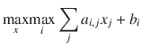

该问题受某些约束条件限制，或者等价地，如何处理同样棘手的极小极小问题。其技巧是首先将每个仿射函数转化为如下形式的约束：

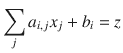

然后，我们将每个等式转化为一对不等式，对这些不等式进行具体化，并应用析取技巧来强制执行其中一个。最后，我们将目标函数设置为 `max z`。（我确实提到过处理起来有些困难，但利用我们在本节中开发的例程，只需在清单 7-14 中编写几行代码即可。作为示例，我们将求解以下问题：

![$$ \underset{x\in \left[2,5\right]}{\max}\max \left\{2x-3,-2x+12\right\}, $$](A457410_1_En_7_Chapter_Equs.gif)

该问题在图形上由图 7-2 表示，其中显示了两个函数，最大值用较粗的线条表示。请注意，这显然是一个非凸目标函数。还要注意，人们可以用不同的方法求解这样一个简单的问题，但效率并不会高多少。例如，可以计算多面体所有顶点上的函数值。但要做到这一点，需要先找到这些顶点。而要找到这些顶点，要么需要求解指数数量的线性规划问题，要么需要求解指数数量的线性方程组。在最坏情况下，我们的方法在理论上可能需要同样多的工作量，但在实践中，它从未如此。⁷

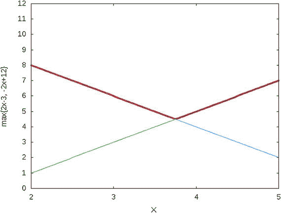

图 7-2

在定义域 `[2, 5]` 上的 `max{2x − 3, −2x + 12}`

```
1  def maximax(s,a,x,b):
2    n = len(a)
3    d = [bounds_on_box(a[i],x,b[i]) for i in range(n)]
4    zbound = [min(d[i][0] for i in range(n)), max(d[i][1] \
5           for i in range(n))]
6    z = s.NumVar(zbound[0],zbound[1],")
7    delta = [reify(s,a[i]+[-1],x+[z],b[i],None,'==') \
8           for i in range(n)]
9    k_out_of_n(s,1,delta)
10    s.Maximize(z)
11    return z,delta
清单 7-14
如何求解极大极大问题 (my or tools.py)
```

函数 `maximax` 接收求解器 `s`（用于添加极大极大约束），以及矩阵 `a` 和数组 `x`、`b`，它们表示 `n` 个仿射函数 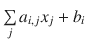，其中 ![$$ i\in \left[0,n-1\right] $$](A457410_1_En_7_Chapter_IEq45.gif)。我们创建额外的变量 `z`，它将作为要最大化的目标函数。为了给 `z` 设置有意义的边界，我们使用 `bounds_on_box` 来查找 `x` 定义域上所有仿射函数的最小值和最大值。我们使用这些值中的最小值和最大值作为 `z` 的边界。

然后，将每个仿射函数设置为等于 `z`，并在相应的 `delta[i]` 上进行具体化，使得 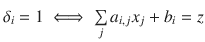。最后，我们强制 `delta[i]` 中恰好有一个为 1，或者等价地，强制其中一个仿射函数约束被激活。我们设置目标函数，并返回目标函数和指示器数组。这将为调用者提供最优解时的所有必要信息。

我们这个小例子的解显然是 `x = 2`，目标值为 `−2x + 12 = 8`。实际上，运行清单 7-14 会返回 `8.0` 和 `[0, 1]`，这告诉我们第二个仿射函数是被激活的那个。


## 7.3 员工排班

员工排班并非单一问题，而是一系列问题的统称，每个问题都有其独特的需求和特性。我将讨论其中一个有趣的变体：为课程安排授课教师。这个问题的主要特点，也是其趣味所在，在于如何处理教师的偏好。

基本情况如下：课程章节在一周内已被分配了上课时间。例如，`MOR142` 课程价值三个学分；第 1 节在周一、周三和周五的 9:00 至 10:00 上课，而第 2 节在周二和周四的 9:00 至 10:30 上课。每个章节都需要一名教师。针对不同课程，有数十个这样的章节，每个都有指定的时间和学分，都需要安排教师。

另一方面，我们有一组教师，其中一些是全职教师，他们将教授固定数量的学分；另一些是兼职教师，最多可以教授一定数量的学分。此外，没有哪位教师能成功克隆自己，以便同时教授两个时间冲突的平行章节。这些都是硬性约束。

此外，每位教师都表达了对某些课程（课程偏好）以及某些日期或时间（我们称之为偏好集）的偏好（或厌恶）。例如，我们可以有一个“周一、周三、周五开设的章节”集合，以及另一个“晚上上课的章节”集合。教师可以对每个集合给出加权的赞成（或反对）意见。

如果这些就是所有必需的约束，那么模型就只是一个指派问题。但实际的排班从来不会像指派那么简单。因此，让我们考虑一个额外的约束。

有趣的地方来了：每位教师还间接表达了对章节对的偏好（或厌恶）。例如，可能存在一个抽象的对，比如“一个在周一晚上上课的章节和另一个在周二早上上课的章节”，或者“一个章节上课后，紧接着在一小时内上另一节课”。不难想象，为什么教师可能希望避免（或更喜欢）连续上课。

为了说明，我们假设一个实例，其中所有这些偏好和偏好对都已处理完毕，并以最简单的形式呈现在表 7-8、表 7-9 和表 7-11 中。可能需要大量的预处理工作来提取数据并将其格式化为这些表格，但这目前不是我们关注的重点。

在表 7-8 中，第一列是表示章节的序号，第二列表示课程。在我们的示例中，前两行可能对应`MOR142`的前两个章节。第三列表示上课时间（时间 12 可能代表周一、周三和周五的 9:00）。

**表 7-8** 开设章节列表

| 序号 | 课程编号 | 上课时间 |
| --- | --- | --- |
| 0 | 0 | 12 |
| 1 | 0 | 19 |
| 2 | 1 | 11 |
| 3 | 1 | 12 |
| 4 | 2 | 11 |
| 5 | 3 | 16 |
| 6 | 3 | 2 |
| 7 | 3 | 7 |
| 8 | 4 | 17 |
| 9 | 5 | 1 |
| 10 | 5 | 20 |
| 11 | 5 | 20 |
| 12 | 6 | 13 |
| 13 | 6 | 4 |
| 14 | 6 | 1 |

在表 7-9 中，第一列是教师的序号，接着是工作量范围。第三列是教师对表 7-8 顺序中各课程的偏好（正整数）或厌恶（负整数）。第四列包含对应于表 7-10 顺序中章节所属集合的偏好。最后一列是对表 7-11 中成对偏好的偏好值。

**表 7-9** 每位教师的偏好列表

| 序号 | 工作量 | 课程权重 | 集合权重 | 成对权重 |
| --- | --- | --- | --- | --- |
| 0 | { 2; 3 } | { 0; 2; 0; 0; 0; 0; -4 } | { 0; 0; 7; -5; -6; 0 } | { 0; 0 } |
| 1 | { 2; 2 } | { 0; 3; 2; 0; 0; 10; 0 } | { 0; 0; 0; 8; 4; 9 } | { 0; 8 } |
| 2 | { 1; 3 } | { 2; -2; 2; 0; 8; -2; 2 } | { 0; 0; 0; 0; 0; 9 } | { 0; 0 } |
| 3 | { 1; 2 } | { 3; 0; 0; 0; 9; -2; -4 } | { 0; 7; 9; 0; 0; 0 } | { 0; 0 } |
| 4 | { 2; 2 } | { 0; -10; 1; 0; 0; 0; -6 } | { 0; -1; 3; 10; -6; 0 } | { 0; -7 } |

表 7-10 列出了每个偏好集对应的章节。

**表 7-10** 偏好集列表

| 序号 | 章节 |
| --- | --- |
| 0 | { 0; 7; 8; 9; 11; 14 } |
| 1 | { 0; 1; 2; 7; 9; 11; 12 } |
| 2 | { 0; 2; 5; 6; 10; 11 } |
| 3 | { 1; 3; 6; 8; 13; 14 } |
| 4 | { 1; 4; 5; 7; 10 } |
| 5 | { 0; 2; 5; 7; 8; 11; 12 } |

最后，表 7-11 列出了每个偏好对对应的章节。

**表 7-11** 偏好对列表

| 序号 | 章节对 |
| --- | --- |
| 0 | { (3 7); (9 12); (10 14) } |
| 1 | { (10 11); (11 13); (11 14) } |

### 7.3.1 构建模型

我们将分阶段描述该模型。

#### 7.3.1.1 决策变量

在这个问题中，我们需要决定的是将哪位教师分配到哪个章节。因此，到目前为止很明显，决策变量可以是二元的，以教师集合 `I` 和章节集合 `S` 为索引，如下所示：

```
x_{i,j} ∈ {0,1} ∀ i ∈ I; ∀ j ∈ S,
```

其中 `x[13,61] = 1` 表示编号为 13 的教师被分配到编号为 61 的章节。

我们可能需要大量的辅助变量来构建一个可读的模型。让我们从约束条件开始，并在需要时引入辅助变量。

#### 7.3.1.2 约束条件

每个章节最多需要分配一名教师：

```
∑_i x_{i,j} ≤ 1 ∀ j ∈ S
```

每位教师必须被分配一定范围内的课程数量，例如 `[L[i], U[i]]`：

```
L_i ≤ ∑_i x_{i,j} ≤ U_i ∀ j ∈ I
```

接下来是“无克隆”约束，即每位教师在每个上课时间最多只能忙于一个章节。假设上课时间集合为 `T`，则：

```
∑_{j: T_j = t} x_{i,j} ≤ 1 ∀ j ∈ T,
```

其中 `T[j]` 是章节 `j` 的上课时间。


#### 7.3.1.3 目标函数

目标函数需要最大化所有讲师的偏好权重。我们将目标函数拆分为三项，分别对应讲师 `i` 在课程 `c` 上的权重（`wc[i,c]`）、在偏好集合 `s` 上的权重（`ws[i,s]`）以及在偏好对 `p` 上的权重（`wp[i,p]`）。

对于课程而言，这很简单。假设教学班集合 `S` 被划分为多个子集 `S[c]`，每个子集对应课程编号 `c` 的教学班，那么课程偏好权重的贡献为：

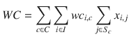

(7.8)

集合偏好权重的贡献也相当直接。我们需要对所有偏好集合和所有讲师求和，即讲师对某个集合赋予的权重，乘以该集合中所有教学班的成员指示变量与这些教学班分配给该讲师的指示变量的乘积之和：

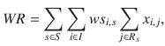

其中 `R[s]` 是表 7-10 的最后一列。

现在来看更有趣的权重——偏好对上的权重。我们来看一个具体例子。假设偏好对编号 4 表示连续上课，并且它包含教学班 2 和 5 这一对。此外，讲师 13 对此类连续上课的偏好对赋予了 -15 的权重。那么，如果我们把教学班 2 和 5 分配给讲师 13，就需要在目标函数值中加上 -15。因此，我们需要一个指示变量来表示“教学班 2 和 5 被分配给讲师 13”。我们将这个指示变量称为 `z[13,4]`。根据我们的模型，我们知道 `x[13,2]` 和 `x[13,5]` 的值将为 1。我们如何设置 `z[13,4]`，使其仅在两者都为 1 时才为 1？通过以下方式：

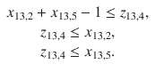

第一个不等式在 `x` 两者都为 1 时，将 `z` 提升为 1。后两个不等式在任一 `x` 为 0 时，将 `z` 降低为 0。

现在，在一般情况下，假设偏好对集合 `P[p]` 如表 7-11 的最后一列所示，我们得到：

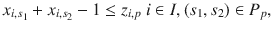

(7.10)

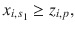

(7.11)

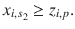

(7.12)

另一种方法是利用我们之前在非凸技巧（第 7.2 节）中开发的内容，使用 `reify` 高级约束来实现：

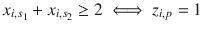

现在，我们可以对所有偏好对和所有讲师求和，即权重与指示变量的乘积：

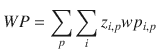

(7.13)

现在，我们得到了完整的目标函数：

`max WC + WS + WP`。

#### 7.3.1.4 可执行模型

让我们将其转化为一个可执行模型。参见清单 7-15。

```
1  def solve_model(S,I,R,P):
2    s = newSolver('StaffuScheduling',True)
3    nbS,nbI,nbSets,nbPairs = len(S),len(I),len(R),len(P)
4    nbC,nbT = S[-1][1]+1,1+max(e[2] for e in  S)
5    x=[[s.IntVar(0,1,") for _ in range(nbS)] for _ in range(nbI)]
6    z=[[[s.IntVar(0,1,") for _ in range(len(P[p][1]))] \
7         for p in range(nbPairs)] for _ in range(nbI)]
8    for j in range(nbS):
9      k_out_of_n(s,1,[x[i][j] for i in range(nbI)],'= I[i][1][0])
12      s.Add(sum(x[i][j] for j in range(nbS)) =')
26    WP = sum(z[i][p][k]*I[i][4][p] for i in range(nbI) \
27            for p in range(nbPairs) for k in range(len(P[p][1])) \
28            if I[i][4][p] !=  0)
29    s.Maximize(WC+WR+WP)
30    rc,xs = s.Solve(),ss_ret(x,z,nbI,nbSets,nbS,nbPairs,I,S,R,P)
31    return  rc,SolVal(x),xs,ObjVal(s)
清单 7-15
人员排班模型 (staff_scheduling.py)
```

函数 `solve_model` 接收以下参数：`S` 为表 7-8 形式的教学班数据；`I` 为表 7-9 形式的讲师数据；`R` 为表 7-10 形式的偏好集合数据；`P` 为表 7-11 形式的偏好对数据。

第 5 行的决策变量 `x` 被声明为一个二维数组，索引为教学班和讲师编号。在下一行，辅助变量 `z` 的索引为讲师编号、偏好对编号以及偏好对内教学班对的序号，如果我们将其中一对分配给该讲师，则该变量为 1。

第 8 行的循环确保每个教学班最多分配给一位讲师。这里我们假设待授课的教学班数量多于可授课的讲师数量。第 13 行关于上课时间集合的子循环确保没有讲师被要求在同一时间出现在两个地点。

第 10 行的循环是一个可用性约束；它确保每位讲师授课的课程数量与其应授课数量一致。

至此，我们已经拥有了计算目标函数中两项所需的所有信息：第 17 行的加权课程偏好和第 19 行的加权集合偏好。这些分别对应公式 (7.8) 和 (7.9)。

为了在第 28 行实现公式 (7.13)，我们需要遍历所有讲师、所有偏好对集合以及所有偏好对（第 20 行的三重循环），并对分配给某位讲师的教学班对进行具体化。我们仅在讲师对此类偏好对使用了非零权重时才执行此操作。如果对目标函数的净效果为零，则没有必要添加如此复杂的约束。

```
1  def ss_ret(x,z,nbI,nbSets,nbS,nbPairs,I,S,R,P):
2     xs=[]
3     for i in range(nbI):
4       xs.append([i,[[j,(I[i][2][S[j][1]],\
5         sum(I[i][3][r] for r in range(nbSets) if j in R[r][1]),
6         sum(SolVal(z[i][p][k])*I[i][4][p]/2
7             for p in range(nbPairs) for k in range(len(P[p][1]))
8               if j in P[p][1][k]))] for j in range(nbS) \
9               if SolVal(x[i][j])>0]])
10     return xs
清单 7-16
人员排班有意义的解
```

最后，在求解之后，我们对解进行整理，以向调用者返回一个有意义的答案，该答案由清单 7-16 构建：一个按讲师索引的列表，包含其所有分配的教学班，并附有用于验证的三个权重（如表 7-12 所示），这些权重参与了本次分配。偏好对的权重被平分给触发该权重参与最优值的两个教学班。这对于用户揭开优化模型性能的面纱来说是有用的信息。⁹

**表 7-12**

人员排班的最优解

| 讲师 | 教学班：(WC WR WP) |   |   |
| --- | --- | --- | --- |
| 0 | 2 : ( 2 7 0) | 5 : ( 0 1 0) | 10 : ( 0 1 0) |
| 1 | 11 : (10 9 4) | 14 : ( 0 8 4) |   |
| 2 | 7 : ( 0 9 0) | 8 : ( 8 9 0) | 12 : ( 2 9 0) |
| 3 | 0 : ( 3 16 0) | 1 : ( 3 7 0) |   |
| 4 | 6 : ( 0 13 0) | 13 : (-6 10 0) |   |


### 7.3.2 变体

在不修改上述模型整体结构的情况下，可以进行多种变体和添加额外的约束。

-   在一个典型的系里，并非所有教师都有资格教授所有课程。可以为每个“教师-课程”对附加一个“合格”布尔值，以防止某些分配。通过将该课程所有相应决策变量设为零，可以简单地实现这一点。
-   系里可能有一项政策，强制要求一部分教师（例如，终身教授）每学期教授一门低年级课程，无论他们的个人偏好如何。这可以通过`k-out-of-n`类型的约束来实现。
-   对于某些有大量分部的课程，系里可能希望至少有一位终身教授教授一个分部，而所有其他分部可以由兼职教师授课。同样，这也是一个`k-out-of-n`类型的约束，只是需要设置合适的集合。

## 7.4 体育赛程安排

所谓体育赛程安排，我指的是为某个联赛构建比赛日程表。¹⁰ 如果你不关心观赏性体育，也请继续读下去，因为这个问题很有趣，也非常困难，并且会引导我们进入一个迷人而复杂的领域——松弛收紧，这可以应用于其他复杂问题。

以下是我们试图解决的通用问题：联赛有若干个分区，每个分区有一定数量的球队。联赛规定了在整个赛季中，每支球队必须与同分区以及不同分区的每支其他球队交锋的次数，以及每支球队每周最多可以进行的比赛场次。

一个简单的实例如表 7-13 所示。“Intra”参数是每支球队与同分区每支其他球队交锋的次数。“Inter”参数是与不同分区每支球队交锋的次数。“G/W”是每支球队每周的比赛场次，“Weeks”是赛季的周数。

**表 7-13 体育赛程安排数据示例**

| (Intra Inter G/W Weeks) | { 2; 1; 1; 19 } |
| :--- | :--- |
| 分区 0 球队 | { 0; 1; 2; 3; 4; 5; 6 } |
| 分区 1 球队 | { 7; 8; 9; 10; 11; 12; 13 } |

### 7.4.1 构建模型

我们将分阶段描述这个模型。

#### 7.4.1.1 决策变量

这个模型的最终结果是什么？是一种日历，一种能够显示例如在第 5 周，球队 1 和 3、球队 2 和 7 等相互对阵的东西（并且，这是针对赛季的每一周）。我们如何编码这些信息？一种可能性是使用一个三维二进制变量`x[i,j,w]`，其中`i`和`j`是球队索引（`i < j`），`w`是周索引。其解释是，例如，如果`x[2,5,13]`为 1，则表示球队 2 和 5 在第 13 周相遇。

读者是否觉得这效率极低？确实如此！

它的可取之处在于，某些约束将变得非常简单易表达。如果这个模型可行，我们就完成了。如果不行，我们可以再尝试其他方法。让我们沿着这个思路继续探索。

#### 7.4.1.2 约束

第一个约束是，每个分区的球队（例如`T[d]`）之间有一定数量（例如`n[A]`）的分区内比赛，即：

```
∑_w x[i,j,w] = n_A ∀ i ∈ T_d; ∀ j ∈ T_d; i < j; ∀ d ∈ D
```

跨分区约束类似。对于比赛场次数`n[R]`：

```
∑_w x[i,j,w] = n_R ∀ i ∈ T_d; ∀ j ∈ T_e; ∀ d ∈ D; ∀ e ∈ D; d < e
```

球队每周的比赛场次实际上是一个上限。想象一个简单的边界情况：一个分区有三支球队，每周一场比赛。其中一支球队不可能参赛。因此，我们需要一个不等式。对于比赛场次数`n[G]`：

```
∑_{i<j} x[i,j,w] + ∑_{j<i} x[j,i,w] ≤ n_G ∀ i ∈ T; ∀ w ∈ W
```

注意这两个求和。由于我们固定了球队`i`，我们必须同时考虑与索引更大和更小的球队的比赛。

#### 7.4.1.3 目标函数

这个问题非常复杂，以至于仅仅找到可行解都很困难。此外，可能的目标函数很可能因联赛而异。为了说明起见，我们假设希望尽可能将分区内比赛推向赛程的末尾。越晚越好。

考虑同一分区的两支球队`i`和`j`。如果他们在第`w`周相遇，那么变量`x[i,j,w]`将为 1。我们如何根据“晚度”为其赋予权重？我们可以乘以`w`。这引出了以下目标函数：

```
∑_{w∈W} ∑_{d∈D} ∑_{i∈T_d} ∑_{j∈T_d | i<j} w * x[i,j,w]
```

不幸的是，这个目标函数有时表现相当糟糕。就我们的目的而言，所有将分区内比赛安排在赛季末的解都是好的。没有理由偏爱最后一周胜过倒数第二周。因此，让我们做一些计算，算出分区内比赛所需的周数。对于`n[A]`场比赛、一个分区有`|T[d]|`支球队以及每周最多`n[G]`场比赛，我们得到需要`n[w]`周：

```
n_w = (|T_d| * n_A) / n_G
```

因此，如果我们将分区内比赛分配在最后`n[w]`周，并赋值为 1，否则为 0，我们就得到了目标函数：

```
∑_{w=|W|-n_w}^{|W|} ∑_{d∈D} ∑_{i∈T_d} ∑_{j∈T_d | i<j} x[i,j,w]
```

这个目标函数通常表现要好得多。¹¹ 请注意，这种所需周数的计算并不总是正确的；它可能会有一周的偏差，但足以满足我们的目的。


#### 7.4.1.4 可执行模型

让我们将其转化为一个可执行模型。该模型将接收一个分区列表，每个分区包含该分区的球队。如果所有分区拥有相同数量的球队，问题会更简单，但实际情况并非如此。

该模型还接受一个参数列表：同分区比赛场次数 `nbIntra`；跨分区比赛场次数 `nbInter`；每支球队每周的比赛场次数 `nbPerWeek`（注意，这必须是最大值，而非严格约束）；以及赛季的总周数 `nbWeeks`。参见代码清单 7-17。

```
1  def solve_model(Teams,params):
2    (nbIntra,nbInter,nbPerWeek,nbWeeks) = params
3    nbTeams = sum([1 for sub in Teams for e in sub])
4    nbDiv,Cal = len(Teams),[]
5    s = newSolver('Sportsuschedule', True)
6    x = [[[s.IntVar(0,1,") if i0] for w in range(nbWeeks)]
33    return rc,ObjVal(s),Cal
代码清单 7-17
体育赛事时间表模型 (sports timetabling.py)
```

第 7 行声明了我们的决策变量。注意，这是一个列表的列表的列表。第一个维度比球队数量少一，因为我们只考虑 `i < j` 的 `i` 对 `j` 的比赛。第二个维度是球队数量，但请注意，一半的条目（对角线以下）永远不会被使用，因此我们将其设置为 `None`。最后一个维度是周数。

第 9 行开始一个循环，用于设置同分区比赛的数量。我们遍历每个分区，然后遍历分区内每对 `(i, j)` 球队，并遵守 `i < j` 条件，仅使用上三角部分。

类似地，从第 14 行开始的循环中，我们遍历每个分区，然后遍历每个序号更大的分区，接着遍历每对球队，每支球队分别来自这两个分区。

最后，在求解之后，我们对解进行整理，向调用者返回有意义的结果：一个按周序号索引的比赛列表。对于我们的一个小规模实例，结果如表 7-14 所示。

**表 7-14** 体育赛事时间表的最优解

| 周次 | 比赛对阵 |   |   |   |   |   |   |
| --- | --- | --- | --- | --- | --- | --- | --- |
| 0 | 0 vs 12 | 1 vs 11 | 2 vs 7 | 3 vs 13 | 4 vs 9 | 5 vs 8 | 6 vs 10 |
| 1 | 0 vs 9 | 1 vs 10 | 2 vs 13 | 3 vs 11 | 4 vs 8 | 5 vs 12 | 6 vs 7 |
| 2 | 0 vs 11 | 1 vs 12 | 2 vs 8 | 3 vs 7 | 4 vs 13 | 5 vs 10 | 6 vs 9 |
| 3 | 0 vs 13 | 1 vs 7 | 2 vs 10 | 3 vs 9 | 4 vs 12 | 5 vs 11 | 6 vs 8 |
| 4 | 0 vs 8 | 1 vs 13 | 2 vs 9 | 3 vs 12 | 4 vs 10 | 5 vs 7 | 6 vs 11 |
| 5 | 0 vs 2 | 1 vs 4 | 3 vs 5 | 6 vs 13 | 7 vs 12 | 8 vs 10 | 9 vs 11 |
| 6 | 0 vs 3 | 1 vs 4 | 2 vs 6 | 5 vs 9 | 7 vs 13 | 8 vs 11 | 10 vs 12 |
| 7 | 0 vs 4 | 1 vs 8 | 2 vs 3 | 5 vs 6 | 7 vs 13 | 9 vs 10 | 11 vs 12 |
| 8 | 0 vs 1 | 2 vs 12 | 3 vs 6 | 4 vs 5 | 7 vs 8 | 9 vs 11 | 10 vs 13 |
| 9 | 0 vs 5 | 1 vs 6 | 2 vs 4 | 3 vs 10 | 7 vs 11 | 8 vs 12 | 9 vs 13 |
| 10 | 0 vs 6 | 1 vs 3 | 2 vs 5 | 4 vs 11 | 7 vs 10 | 8 vs 13 | 9 vs 12 |
| 11 | 0 vs 1 | 2 vs 6 | 3 vs 4 | 5 vs 13 | 7 vs 11 | 8 vs 12 | 9 vs 10 |
| 12 | 0 vs 2 | 1 vs 5 | 3 vs 8 | 4 vs 6 | 7 vs 9 | 10 vs 11 | 12 vs 13 |
| 13 | 0 vs 6 | 1 vs 9 | 2 vs 3 | 4 vs 5 | 7 vs 12 | 8 vs 11 | 10 vs 13 |
| 14 | 0 vs 5 | 1 vs 6 | 2 vs 11 | 3 vs 4 | 7 vs 10 | 8 vs 13 | 9 vs 12 |
| 15 | 0 vs 4 | 1 vs 3 | 2 vs 5 | 6 vs 12 | 7 vs 9 | 8 vs 10 | 11 vs 13 |
| 16 | 0 vs 7 | 1 vs 2 | 3 vs 5 | 4 vs 6 | 8 vs 9 | 10 vs 11 | 12 vs 13 |
| 17 | 0 vs 3 | 1 vs 2 | 4 vs 7 | 5 vs 6 | 8 vs 9 | 10 vs 12 | 11 vs 13 |
| 18 | 0 vs 10 | 1 vs 5 | 2 vs 4 | 3 vs 6 | 7 vs 8 | 9 vs 13 | 11 vs 12 |

这种方法适用于小规模实例，但扩展性不佳，读者可以尝试更大的实例来验证这一点。（尝试一个职业联赛规模的问题，然后准备好等待一段时间才能得到解。）问题源于模型可行解空间与整数规划求解器用于寻找最优解的技术之间的相互作用。求解器通常通过固定模型中的部分变量，然后让其他变量取分数解来求解：如此迭代多次。对于我们的模型，这种松弛相当弱。我不会深入探讨原因，但一旦你意识到求解器求解速度很慢，你就会看到如何解决这个问题。关键洞察在于，我们可以轻松地添加更多约束。

这里有一个例子。想象一个每周只有一场比赛的实例，并考虑三支球队，比如 `i`、`j` 和 `k`。如果在执行过程中的某个时刻允许决策变量取分数值，那么对于给定的周 `w`，最优解可能满足以下条件：

```
x_{i,j,w} = 1/2   x_{i,k,w} = 1/2   x_{j,k,w} = 1/2
```

请注意，这个解是允许的，因为它满足“每支球队每周一场比赛”的约束，因为

`x[i,j,w] + x[i,k,w] = 1`，

`x[i,j,w] + x[j,k,w] = 1`，

`x[i,k,w] + x[j,k,w] = 1`

但我们知道这不是一个有效的解，因为这三个变量的总和不能超过一。如果 `i` 和 `j` 对阵，那么 `k` 就不能与它们中的任何一个对阵；对于 `(i, k)` 和 `(j, k)` 这对组合也是如此。因此，已知每周只有一场比赛，我们可以为每周 `w` 的每三支球队 `i`、`j`、`k` 添加一个约束：

```
x_{i,j,w} + x_{i,k,w} + x_{j,k,w} <= 1
```

请注意，如果变量是整数，这个约束是冗余的。但它仍然是一个有效的约束，并且对于求解器内部处理的分数值很有用。我们还可以考虑四支甚至五支球队的元组，以及每周两场或三场比赛的情况。参见表 7-15，其中给出了少量球队和每周比赛场次下的界限。请注意，其中许多界限不会被分数解违反，因此对我们的目的来说不太有用。

**表 7-15** 决策变量小元组之和的界限

| 球队数量 | 每周比赛场次 | 总和上限 |
| --- | --- | --- |
| 3 | 1 | 1 |
|   | 2 | 3 |
| 4 | 1 | 2 |
|   | 2 | 4 |
|   | 3 | 6 |
| 5 | 1 | 2 |
|   | 2 | 5 |
|   | 3 | 7 |
|   | 4 | 9 |

这些额外约束的数量增长很快。因此，这种方法会向模型添加大量约束。如果这导致求解器速度慢到无法接受，另一种方法是我们在求解 TSP 时使用的方法：只添加我们需要的约束。我们将通过求解松弛问题、寻找违反界限的元组并添加它们来实现这一点。这就是代码清单 7-18 的目的。它展示了如何轻松地向使用 OR-Tools 编写的模型添加松弛收紧约束。


```python
1  def  solve_model_big(Teams,params):
2    (nbIntra,nbInter,nbPerWeek,nbWeeks) = params
3    nbTeams = sum([1 for sub in Teams for e in sub])
4    nbDiv,cuts  =  len(Teams),[]
5    for iter in range(2):
6      s = newSolver('Sportsuschedule', False)
7      x = [[[s.NumVar(0,1,") if ib:
22              cuts.append([[i,j,k],[w,b]])
23              for l in range(k+1,nbTeams):
24                b = bounds.get((4,nbPerWeek),1000)
25                if sum([SolVal(x[p[0]][p[1]][w]) \
26                      for p in pairs([i,j,k,l],[])])>b:
27                 cuts.append([[i,j,k,l],[w,b]])
28                for m  in range(l+1, nbTeams):
29                  b = bounds.get((5,nbPerWeek),1000)
30                  if sum([SolVal(x[p[0]][p[1]][w]) \
31                        for p in pairs([i,j,k,l,m],[])])>b:
32                   cuts.append([[i,j,k,l,m],[w,b]])
33       else:
34       break
35    s = newSolver('Sportsuschedule', True)
36    x = [[[s.IntVar(0,1,") if i0] for w in range(nbWeeks)]
46    return rc,ObjVal(s),Cal
代码清单 7-18
带额外割的体育赛程编排
```

代码从第 5 行的循环开始，该循环将运行特定次数，用分数解求解模型。第 11 行本质上是代码清单 7-17（包含额外割）的所有约束，封装在一个过程中，因为我们需要多次使用它：在循环内使用分数变量，最后在循环后使用整数变量。每次求解后，我们考虑队伍元组，检查其决策变量之和是否超过预设界限，如果超过，则将其序号、所在周次及界限添加到割列表中。

最后，我们在第 35 行创建一个整数求解器实例，添加之前找到的所有割，并进行实际求解。添加割的例程如代码清单 7-19 所示。

```python
1  for t,w in cuts:
2    s.Add(s.Sum(x[p[0]][p[1]][w[0]] for p in pairs(t,[])) <= w[1])
代码清单 7-19
割添加例程
```

其中，`pairs`函数从有序元组`t`生成所有有序对。接下来，参见代码清单 7-20。

```python
1  def pairs(tuple, accum=[]):
2    if len(tuple)==0:
3      return accum
4    else:
5      accum.extend((tuple[0],e) for e in tuple[1:])
6      return  pairs(tuple[1:],accum)
代码清单 7-20
有序对生成
```

需要强调的是，与 TSP 问题中必须添加子回路消除约束才能保证模型有效性不同，我们这里添加的约束并非必需；它们只是用来引导求解器朝正确方向加速求解过程。因此，对于某些求解器，这些约束会带来巨大帮助；对于其他求解器则可能毫无用处，甚至可能拖慢整个求解过程。如果不深入了解特定求解器的内部机制，几乎无法预测其对运行时间的影响。¹²关键在于，一旦建模者掌握了这种松弛收紧技术，就可以轻松地将其应用于某个表现顽固的模型-求解器组合。

### 7.4.2 变体

该模型有多种变体。有些影响目标函数（或等价地作为软约束处理）；有些是硬约束；有些则两者皆可。

*   可能存在一个（周次，队伍，队伍）对列表，目标是在指定周次安排指定比赛。
*   我们可能被要求遵循特定模式，例如“同区-同区-跨区”，而不是将同区比赛推迟到后期。
*   我们可能被要求分散（或集中）安排队伍之间的多场比赛。
*   我们可能被要求在特定日期进行赛程安排，而不是按周次。
*   我们可以引入主客场概念，并规定主场比赛场次固定。
*   还可能存在需要遵循的主客场模式。这甚至可能需要结合队伍所在城市，考虑“合理”的旅行安排。（我这里描述的是在已经困难的赛程编排问题上叠加多个 TSP 层！不适合胆小者）。

## 7.5 谜题

约束编程领域有着悠久的解谜传统，这主要是因为解谜既有趣又有教育意义。使用整数规划解谜的尝试并不常见，但同样可以既有趣又有教育意义，尽管有时难度更大。我们不应被困难吓倒。解谜中使用的技巧以及建模时所需的脑力体操，日后都可以应用于“真正”的问题。


### 7.5.1 伪国际象棋问题

作为热身，我们考虑一个指定大小为 `n` 的方形棋盘，希望在上面放置尽可能多的车，使得没有车能攻击到其他车。

要回答的问题是“将车放在哪里才能避免攻击？”。因此，答案必须是一组被车占据的位置。由于棋盘是方形的，决策变量的一个明显表述是二维二进制变量数组。因此

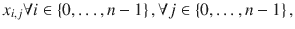

其中，如果 `x[2,5]` 为 1，则表示位置 `(2, 5)` 上有一个车。

目标函数很简单：因为我们想放置尽可能多的车，所以我们对决策变量求和：

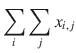

那么，防止一个车攻击另一个车的约束条件是什么呢？车可以攻击同一列或同一行上的任何棋子。因此，我们需要每列和每行最多有一个车。这是一个我们很熟悉的约束：即“n 选 1”约束，通过以下方式实现：

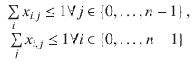

我们拥有了所有需要的要素。让我们将其转化为可执行代码。核心工作应由我们的 `k_out_of_n` 例程完成，并辅以几个实用函数：一个用于提取指定行的所有变量，另一个用于提取指定列的所有变量。这些实用函数见代码清单 7-21。

```
1  def get_row(x,i):
2     return [x[i][j] for j in range(len(x[0]))]
3  def  get_column(x,i):
4     return [x[j][i] for j in range(len(x[0]))]
代码清单 7-21
列和行提取实用函数 (puzzle.py)
```

主模型为每个棋盘位置创建一个变量，然后强制每行和每列最多有一个变量为非零值。目标函数对所有变量求和，代码返回一个由空白和 `R` 组成的二维表格，用于指示在最优解下车的位置。

```
1  def solve_maxrook(n):
2    s = newSolver('Maxrook',True)
3    x = [[s.IntVar(0,1,") for _ in range(n)] for _ in range(n)]
4    for i in range(n):
5      k_out_of_n(s,1,get_row(x,i),'<=')
6      k_out_of_n(s,1,get_column(x,i),'<=')
7    Count = s.Sum(x[i][j] for i in range(n) for j in range(n))
8    s.Maximize(Count)
9    rc = s.Solve()
10    y = [[['u','R'][int(SolVal(x[i][j]))]\
11        for j in range(n)] for i in range(n)]
12    return rc,y
代码清单 7-22
Maxrook 模型 (puzzle.py)
```

在大小为 8 的棋盘上运行代码清单 7-22 可以得到表 7-16 所示的解。它同样可以轻松求解大小为 128 的棋盘。

**表 7-16** Maxrook 谜题的一个最优解

|   | 1 | 2 | 3 | 4 | 5 | 6 | 7 | 8 |
|---|---|---|---|---|---|---|---|---|
| 1 |   | R |   |   |   |   |   |   |
| 2 |   |   |   |   |   | R |   |   |
| 3 |   |   |   |   |   |   |   | R |
| 4 |   |   |   |   |   |   | R |   |
| 5 |   |   |   |   | R |   |   |   |
| 6 |   |   | R |   |   |   |   |   |
| 7 |   |   |   | R |   |   |   |   |
| 8 | R |   |   |   |   |   |   |   |

现在让我们考虑一个稍微困难的问题，即著名的 N 皇后问题。这是同样的问题，但要求放置的是皇后而不是车。皇后除了在行和列上攻击外，还在对角线上攻击。我们只需要一种命名对角线的约定和一个提取它们的函数。为了增加趣味性，让我们将 `maxrook` 泛化为 `maxpiece`，使其能够接受要放置的棋子类型。见代码清单 7-23。

```
1  def get_se(x,i,j,n):
2    return [x[i+k % n][j+k % n] for k in range(n-i-j)]
3  def get_ne(x,i,j,n):
4    return [x[i-k % n][j+k % n] for k in range(i+1-j)]
代码清单 7-23
对角线提取辅助函数 (puzzle.py)
```

我们将对角线命名为 SE（东南到西北方向）或 NE（东北到西南方向）。用于提取相应变量的两个实用函数 `get_se` 和 `get_ne` 如代码清单 7-23 所示。

主模型如代码清单 7-24 所示。我们可以为大小为参数 `n` 的棋盘调用此模型。棋子可以是皇后、车和象，通过第二个参数 `Q`、`R` 或 `B` 指定。皇后和象的一个解如表 7-18 所示。我们还在表 7-17 中展示了各种实例大小的运行时间，这些时间已归一化，使得 `n = 2` 的时间为 1。这些值仅供参考，因为它们依赖于求解器。尽管如此，它们表明所提出的模型不会遭受纯组合求解器可能遇到的指数爆炸问题。

**表 7-18** N 皇后和最大象谜题的一个最优解

|   | 1 | 2 | 3 | 4 | 5 | 6 | 7 | 8 |   | 1 | 2 | 3 | 4 | 5 | 6 | 7 | 8 |
|---|---|---|---|---|---|---|---|---|---|---|---|---|---|---|---|---|---|
| 1 |   |   |   | Q |   |   |   |   | 1 |   |   | B | B |   |   | B |   |
| 2 |   |   |   |   |   |   |   | Q | 2 | B |   |   |   |   |   |   |   |
| 3 | Q |   |   |   |   |   |   |   | 3 |   |   |   |   |   |   |   | B |
| 4 |   |   |   |   | Q |   |   |   | 4 |   |   |   |   |   |   |   | B |
| 5 |   |   |   |   |   |   | Q |   | 5 | B |   |   |   |   |   |   |   |
| 6 |   | Q |   |   |   |   |   |   | 6 | B |   |   |   |   |   |   |   |
| 7 |   |   |   |   |   | Q |   |   | 7 |   |   |   |   |   |   |   | B |
| 8 |   |   | Q |   |   |   |   |   | 8 | B | B |   |   | B | B |   | B |

**表 7-17** 随棋盘大小增加的计算时间

| 8   | 1   |
|-----|-----|
| 16  | 3   |
| 32  | 9   |
| 64  | 43  |
| 128 | 169 |
| 256 | 870 |
| 512 | 6318|

```
1  def solve_maxpiece(n,p):
2    s = newSolver('Maxpiece',True)
3    x = [[s.IntVar(0,1,") for _ in range(n)] for _ in range(n)]
4    for i in range(n):
5      if p in ['R' ,'Q']:
6        k_out_of_n(s,1,get_row(x,i),'<=')
7        k_out_of_n(s,1,get_column(x,i),'<=')
8      if p in ['B', 'Q']:
9        for j in range(n):
10          if i in [0,n-1] or j in [0,n-1]:
11           k_out_of_n(s,1,get_ne(x,i,j,n),'<=')
12           k_out_of_n(s,1,get_se(x,i,j,n),'<=')
13    Count = s.Sum(x[i][j] for i in range(n) for j in range(n))
14    s.Maximize(Count)
15    rc  = s.Solve()
16    y=[[['u',p]\
17       [int(SolVal(x[i][j]))] for j in range(n)] for i in range(n)]
18    return rc,y
代码清单 7-24
Maxpiece 通用模型 (puzzle.py)
```

请注意，对于任何棋子都存在一个明显的泛化，因为棋盘上的每个被占据位置都描述了一组位置，因此变量及其总和必须为 1。

查看示例解，会出现两个明显的问题：我们能得到所有解吗？我们能得到“有趣”的解吗？我们暂时搁置第一个问题，考虑第二个问题。什么才算是有趣的解？也许是一个表现出某种对称性的解。我们可以尝试最小化棋子之间的距离之和，或最大距离，看看会发生什么。欢迎读者实现这些修改。现在，我们告别伪国际象棋问题。


### 7.5.2 数独

数独谜题如下：给定一个 9x9 的网格，部分格子已填入 1 到 9 的数字，需要填充剩余格子，使得：

-   每一行都包含 1 到 9 的所有数字。
-   每一列都包含 1 到 9 的所有数字。
-   每一个 3x3 的不重叠子网格都包含 1 到 9 的所有数字。

我们可以通过指定每个网格位置上的数字来表示一个解。因此，一个简单的决策变量是：

![$$ {x}_{i,j}\in \left\{1,\dots, 9\right\}\forall i\in \left[1,2,3\right]\forall j\in \left[1,2,3\right] $$](A457410_1_En_7_Chapter_Equal.gif)

约束条件很有趣。每个约束的形式都是“给定一组九个位置，必须出现 1 到 9 的所有数字”。在约束编程中，这个需求由一个单一的函数调用处理，通常命名为 `all_different`。我们将为数独创建一个简化的等价约束，并在下一个谜题中对其进行改进。

对于我们的每个变量 `x[i,j]`，我们将创建一个长度为 9 的二进制变量数组 `v[k]^(ij)`。每个变量都是值 `k` 的指示变量。因此我们添加约束：

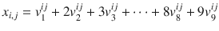

(7.14)

然后，对于每个需要互不相同的变量集合 `S`，我们将确保相应指示变量之和为 1。

这是一个可行性问题，因此不需要目标函数。让我们创建一个可执行的模型。我们利用之前定义的 `get_row` 和 `get_column`，并添加一个 `get_subgrid`。参见代码清单 7-25。

```
1  def get_subgrid(x,i,j):
2    return [x[k][l] for k in range(i*3,i*3+3)\
3                 for l in range(j*3,j*3+3)]
4  def all_diff(s,x):
5    for k in range(1,len(x[0])):
6      s.Add(sum([e[k] for e in x]) <= 1)
代码清单 7-25
数独的一些辅助函数 (puzzle.py)
```

代码清单 7-26 中实现的模型接受一个网格数据，其中包含数字或 `None`（表示需要填充）。大部分工作是在第 3 行到第 14 行的循环中创建一组清晰的决策变量：一个三维数组，前两个维度由网格位置索引。第三维的索引 0 是我们的实际决策变量，保存网格将持有的值（无论是数据给定的还是求解过程得到的）；索引 1 到 9 的每个位置保存相应的指示变量。在创建变量时，我们在第 9 行添加了方程 (7.14) 的值约束。

变量声明之后，我们对每一行、每一列和每一个子网格调用 `all_diff` 函数。对于 1 到 9 范围内的每个值，这个函数是一个简单的 `k_out_of_n` 约束。

```
1  def solve_sudoku(G):
2    s,n,x  =  newSolver('Sudoku',True),len(G),[]
3    for i in range(n):
4      row=[]
5      for j in range(n):
6        if G[i][j] == None:
7         v=[s.IntVar(1,n+1,")]+[s.IntVar(0,1,")\
8                            for _ in range(n)]
9         s.Add(v[0] == sum(k*v[k] for k in range(1,n+1)))
10        else:
11         v=[G[i][j]]+[0 if k!=G[i][j] else 1\
12                   for k in range(1,n+1)]
13        row.append(v)
14      x.append(row)
15    for i in range(n):
16      all_diff(s,get_row(x,i))
17      all_diff(s,get_column(x,i))
18    for i in range(3):
19      for j in range(3):
20        all_diff(s,get_subgrid(x,i,j))
21    rc  = s.Solve()
22    return rc,[[SolVal(x[i][j][0]) for j in range(n)]\
23             for i in range(n)]
代码清单 7-26
数独模型 (puzzle.py)
```

最后，我们返回网格值，而不是那 800 多个指示变量。例如，参见表 7-19。数据以粗体显示。¹⁴

**表 7-19** 一个数独谜题的解

| 1 | 2 | 5 | 8 | 3 | 7 | 6 | 9 | 4 |
| 4 | 7 | 6 | 2 | 1 | 9 | 8 | 3 | 5 |
| 9 | 3 | 8 | 4 | 6 | 5 | 7 | 2 | 1 |
| 8 | 6 | 3 | 7 | 4 | 1 | 9 | 5 | 2 |
| 2 | 5 | 1 | 6 | 9 | 3 | 4 | 7 | 8 |
| 7 | 4 | 9 | 5 | 8 | 2 | 1 | 6 | 3 |
| 5 | 8 | 4 | 9 | 2 | 6 | 3 | 1 | 7 |
| 6 | 1 | 2 | 3 | 7 | 4 | 5 | 8 | 9 |
| 3 | 9 | 7 | 1 | 5 | 8 | 2 | 4 | 6 |

### 7.5.3 寄出更多钱！

这是一个在约束编程社区中著名的密码算术谜题：将字母 `S`、`E`、`N`、`D`、`M`、`O`、`R`、`Y` 分别替换为 0 到 9 中不同的数字，使得以下加法成立：

```
SEND  +  MORE  =  MONEY
```

这个谜题有两个高级约束。第一个是算术约束：我们需要等式成立。我们可以通过将每个整数分解为其位值来实现这一点。`SEND` 是一个四位数（假设是十进制），因此它实际上是：

```
S*1000 + E*100 + N*10 + D*1
```

`MORE` 和 `MONEY` 也以相同方式处理。然后我们约束等式成立。

第二个约束是所有字母必须分配不同的数字。这是另一个我们可以有效利用 `all_different` 约束的情况，因此让我们概括一下我们在伪国际象棋模型中所做的，以便我们可以在任何模型中调用 `all_different`。我们的技巧依赖于每个变量都有一个关联的指示变量数组，每个潜在整数值对应一个。因此，除了我们之前定义的、将稍作概括的约束之外，我们还需要一个用于变量创建的例程。这就是代码清单 7-27 中 `newIntVar` 的意图。

```
1  def newIntVar(s, lb, ub):
2    l=ub-lb+1
3    x=[s.IntVar(lb, ub, ")]+[s.IntVar(0,1,") for _ in range(l)]
4    s.Add(1 == sum( x[k] for k in range(1,l+1)))
5    s.Add(x[0] == sum((lb+k-1)*x[k] for k in range(1,l+1)))
6    return x
7  def all_different(s,x):
8    lb=min(int(e[0].Lb()) for e in x)
9    ub=max(int(e[0].Ub()) for e in x)
10    for v in range(lb,ub+1):
11      all = []
12      for e in x:
13        if e[0].Lb() <= v <= e[0].Ub():
14          all.append(e[1 + v - int(e[0].Lb())])
15      s.Add(sum(all)  <=  1)
16  def neq(s,x,value):
17    s.Add(x[1+value-int(x[0].Lb())] == 0)
代码清单 7-27
通用的全不同结构与约束 (puzzle.py)
```

我们注意到，虽然没有明确说明，但对 `S` 和 `M` 有一个额外的假设：如果数字确实是四位数和五位数，它们不能取值为 0。因此我们应该约束它们非零。并非巧合的是，我们为 `all_different` 实现选择的数据结构允许我们像在代码清单 7-27 的函数 `neq` 中看到的那样，轻松地创建一个不等约束。

有了这个，我们现在可以解决这个谜题了。实现如代码清单 7-28 所示。其解如表 7-20 所示。

```
1  def solve_smm():
2    s = newSolver('Sendumoreumoney',True)
3    ALL = [S,E,N,D,M,O,R,Y] = [newIntVar(s,0,9) for k in range(8)]
4    s.Add( 1000*S[0]+100*E[0]+10*N[0]+D[0]
5         + 1000*M[0]+100*O[0]+10*R[0]+E[0]
6         == 10000*M[0]+1000*O[0]+100*N[0]+10*E[0]+Y[0])
7    all_different(s,ALL)
8    neq(s,S,0)
9    neq(s,M,0)
10    rc = s.Solve()
11    return rc,SolVal([a[0] for a in ALL])
代码清单 7-28
寄出更多钱 (puzzle.py)
```

读者可以验证等式成立（9567 + 1085 = 10652）。

**表 7-20** 寄出更多钱谜题的解

| S | E | N | D | M | O | R | Y |
| 9 | 5 | 6 | 7 | 1 | 0 | 8 | 2 |


### 7.5.4 淑女与老虎

雷蒙德·斯穆里安在《淑女还是老虎》¹⁵一书中提出了许多逻辑谜题。其中一章的高潮部分如下：

一名囚犯面对九扇门，他必须打开其中一扇。其中一扇门后有一位淑女；其余门后，如果有东西的话，则是老虎。可以假设囚犯更愿意打开淑女所在的门，其次是空房间，最差的是老虎的巢穴。这之所以成为一个逻辑谜题，是因为每扇门上都贴着一个逻辑陈述（因此它可以是真或假）。有老虎的房间里的陈述是假的。淑女房间里的陈述是真的。

-   门 1：淑女在奇数编号的房间。
-   门 2：这个房间是空的。
-   门 3：要么标志 5 是对的，要么标志 7 是错的。
-   门 4：标志 1 是错的。
-   门 5：要么标志 2 是对的，要么标志 4 是对的。
-   门 6：标志 3 是错的。
-   门 7：淑女不在房间 1。
-   门 8：这个房间里有老虎，并且房间 9 是空的。
-   门 9：这个房间里有老虎，并且标志 6 是错的。

淑女在哪里？

要知道淑女在哪里，我们可能需要知道老虎在哪里。因此，给定一个房间集合 `R = {1, … , 9}` 和一个野兽集合 `B = {1, 2, 3}`（例如，1 代表空，2 代表淑女，3 代表老虎），一个合理的决策变量是

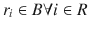

这样，淑女在房间 5 将由 `r[5] = 2` 表示，老虎在房间 4 将由 `r[4] = 3` 表示。如果我们使用 `newIntVar` 函数声明变量，那么关于淑女在奇数编号房间的陈述就很容易处理。相关的指示变量数组是完美的工具。为了便于说明，我们假设对于每个 `r[i]` 变量，我们都有一个针对 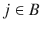 的指示变量数组 `r[i,j]`。

现在来看逻辑部分。我们得到了一些可以为真或假的陈述，它们的真值会影响约束条件。如果我们为每个陈述引入一个二元变量，那么我们可以使用我们的具体化逻辑将该变量与每个约束关联起来。因此，我们引入

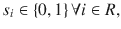

这样 `s[2] = 1` 将意味着门 2 上的陈述为真。

可执行模型如代码清单 7-29 所示。我们将一次分解一个约束。

```
1  def solve_lady_or_tiger():
2    s = newSolver('Ladyuorutiger', True)
3    Rooms = range(1,10)
4    R = [None]+[newIntVar(s,0,2) for _ in Rooms]
5    S = [None]+[s.IntVar(0,1,") for _ in Rooms]
6    i_empty,i_lady,i_tiger = 1,2,3
7    k_out_of_n(s,1,[R[i][i_lady] for i in Rooms])
8    for i in Rooms:
9      reify_force(s,[1],[R[i][i_tiger]],0,S[i],'=')
11    v=[1]*5
12    reify(s,v,[R[i][i_lady] for i in range(1,10,2)],1,S[1],'>=')
13    reify(s,[1],[R[2][i_empty]],1,S[2],'>=')
14    reify(s,[1,-1],[S[5],S[7]],0,S[3],'>=')
15    reify(s,[1],[S[1]],0,S[4],'=')
17    reify(s,[1],[S[3]],0,S[6],'=')
20    reify(s,[1,-1],[R[9][i_tiger],S[6]],1,S[9],'>=')
21    rc  = s.Solve()
22    return rc,[SolVal(S[i]) for i in Rooms],\
23      [SolVal(R[i]) for i in Rooms]
代码清单 7-29
淑女或老虎模型 (puzzle.py)
```

在第 3 行，我们定义了标识每扇门的整数范围。由于问题中房间编号从 1 开始，我们将遵循这一点，而不是像通常那样从 0 开始重新编号。为了从 1 开始索引，我们在接下来的两行中创建决策变量数组，其中第一个元素包含 `None`。然后，在第 6 行，我们定义了一些常量来访问每个房间的指示变量。

在第 7 行，我们确保恰好有一位淑女。

所有其他约束都涉及陈述变量 `S` 与逻辑陈述之间的关系，因此我们的 `reify` 函数将非常有用。第一个约束是，如果一个房间里有老虎，那么它的陈述是假的。陈述“如果房间 i 里有老虎，那么陈述 i 是假的。”对我们来说是错误的方向。我们可以编写一个新函数，但更简单的方法是使用逆否命题并表述为“如果陈述 i 为真，那么门 i 后面没有老虎。”这是一个布尔值为真强制执行约束的实例，第 9 行实现了这一点。

下一个约束是“有淑女的房间门上的陈述为真。”这对我们来说是正确方向：一个满足的约束会引发一个布尔值，如第 10 行所实现。

“淑女在奇数编号的房间。”很简单。我们需要对奇数门上的 `i_lady` 指示变量求和，并且当且仅当陈述 1 为真时，将它们设置为大于等于 1。奇数房间的索引通过 `range(1,10,2)` 获得，不等式

```
R[1][i_lady]+R[3][i_lady]+R[5][i_lady]+R[7][i_lady]+R[9][i_lady]  >=  1
```

在第 12 行被具体化为 `S[1]`。

“这个房间是空的。”是对以下内容的一个简单具体化，关联到第 13 行的 `S[2]`：

```
R[2][i_empty]  >=  1
```

读者可能会想为什么不用等式而用不等式。原因是我们知道，在编写了约束 `reify` 之后，等式更复杂，会引入更多的辅助约束和/或变量。如果我们确定（就像这里一样）不等式就足够了，那么最好使用不等式。

“要么标志 5 是对的，要么标志 7 是错的。”是二元变量的析取，其中一个小难点是第二个变量被取反了。如果我们知道如何对布尔值取反并实现析取，那么将其转换为代数陈述就是机械性的。我们经常看到析取。像 `x[1] ∨ … x[n]` 这样的东西被实现为 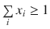。`x[i]` 的取反通过将 `x[i]` 替换为 `1 − x[i]` 来处理。因此，在我们的例子中，我们需要

```
S[5] + (1-S[7]) >= 1
```

简化为

```
S[5] - S[7] >= 0
```

在第 14 行具体化为 `S[3]`。

“标志 1 是错的。”是 `S[1]==0` 在第 15 行具体化为 `S[4]`。“标志 3 是错的。”在第 17 行以相同方式处理。

“要么标志 2 是对的，要么标志 4 是对的。”是一个简单的析取，因此通常的加法转换适用，并在第 16 行具体化为 `S[5]`。

“淑女不在房间 1。”需要将约束

```
R[1][i_lady]  <=  0
```

具体化为 `S[7]`，如第 18 行所示。

“这个房间里有老虎，并且房间 9 是空的。”很有趣。子陈述是

```
R[8][i_tiger]  >=  1
```

和

```
R[9][i_empty]  >=  1
```

合取通过将右侧和左侧相加来处理，以创建

```
R[8][i_tiger]  +  R[9][i_empty]  >=  2
```

在第 19 行具体化为 `S[8]`。

最后，“这个房间里有老虎，并且标志 6 是错的。”包含

```
R[9][i_tiger]  >=  1
```

和

```
S[6] <= 0
```

我们将后者转换为

```
- S[6] >= 0
```

然后将两者相加形成合取，在第 20 行具体化为 `S[9]`。

至此，我们完成了，可以找到一个解，例如表 7-21 中的第一个解。但是否还有其他解？如果有，如何找到它们？在这种情况下，¹⁶ 很简单，因为我们唯一真正的目标是找到淑女。我们的第一个解中淑女在房间 1，因此我们可以简单地添加一个约束，阻止淑女在房间 1，例如

```
s.Add(R[1][i_lady]  ==  0)
```

如果存在另一个解，我们会得到它；否则求解器会指示问题不可行。如果需要，我们可以继续这样做，直到穷尽所有解。表 7-21 中的第二个解就是这样一个额外的解。（有趣的是，如果我们添加一个约束“房间 8 不是空的”，那么这个第二个解就是唯一解。）

**表 7-21** 淑女或老虎谜题的两个解


| 1 | 女士在奇数编号的房间。 | T | 女士 | T |   |
| 2 | 这个房间是空的。 | T |   | F | 老虎 |
| 3 | 要么 5 号牌子正确，要么 7 号牌子错误。 | T |   | F |   |
| 4 | 1 号牌子是错误的。 | F |   | F |   |
| 5 | 要么 2 号牌子正确，要么 4 号牌子正确。 | T |   | F |   |
| 6 | 3 号牌子是错误的。 | F |   | T |   |
| 7 | 女士不在 1 号房间。 | F |   | T | 女士 |
| 8 | 这个房间里有老虎，并且 9 号房间是空的。 | F |   | F | 老虎 |
| 9 | 这个房间里有老虎，并且 6 号牌子是错误的。 | F |   | F | 老虎 |

## 7.6 OR-Tools MPSolver Python 快速参考

这绝非完整参考，但足以涵盖本书中描述的所有模型。同时，还介绍了用于简化模型编写的包装函数。

要使用 LP 和 IP 求解器，模型必须以清单 7-30 中的代码开头。

```python
from linear_solver import pywraplp
```

通过清单 7-31 中的代码创建求解器实例。

```python
s = pywraplp.Solver(NAME,pywraplp.Solver.TYPE)
```

其中 `s` 是返回的求解器，`NAME` 是任意字符串，`TYPE` 是以下之一：

| `GLOP_LINEAR_PROGRAMMING` | LP |
| `CLP_LINEAR_PROGRAMMING` | LP |
| `GLPK_LINEAR_PROGRAMMING` | LP |
| `SULUM_LINEAR_PROGRAMMING` | LP |
| `GUROBI_LINEAR_PROGRAMMING` | LP |
| `CPLEX_LINEAR_PROGRAMMING` | LP |
| `SCIP_MIXED_INTEGER_PROGRAMMING` | MIP |
| `GLPK_MIXED_INTEGER_PROGRAMMING` | MIP |
| `CBC_MIXED_INTEGER_PROGRAMMING` | MIP |
| `SULUM_MIXED_INTEGER_PROGRAMMING` | MIP |
| `GUROBI_MIXED_INTEGER_PROGRAMMING` | MIP |
| `CPLEX_MIXED_INTEGER_PROGRAMMING` | MIP |
| `BOP_INTEGER_PROGRAMMING` | IP (二进制) |

本书中的所有模型对 LP 问题使用 `GLOP`，对所有 MIP 问题使用 `CBC`。清单 7-32 展示了当前包装器的设置方式。

```python
s = newSolver(NAME,[False|True])
```

注意，`False` 是默认值，返回 LP 求解器实例（`GLOP`），而 `True` 返回 MIP 求解器（`CBC`）。

通过清单 7-33 中的代码（针对连续变量）或清单 7-34 中的代码（针对整数变量）向求解器实例添加决策变量，其中 `VAR` 是返回的变量对象，`NAME` 是任意字符串。名称在求解器实例内必须唯一。如果给定空字符串，系统会自动在内部生成唯一的名称，这是一个非常有用的特性，尤其适用于在求解器实例内重复使用的例程。范围由 `LOW`（任意数字或 `-solver.infinity()`）和 `HIGH`（任意大于 `LOW` 的数字或 `solver.infinity()`）描述。一个良好的经验法则是尽可能限制范围。

```python
var = s.NumVar(LOW,HIGH,NAME)
```

```python
VAR = s.IntVar(LOW,HIGH,NAME)
```

创建决策变量数组的最简单方法如清单 7-35 所示。

```python
x = [s.NumVar(LOW,HIGH,") for _ in range(N)]
```

注意，`N` 是数组中所需的元素数量。数组当然是从零开始索引的。对于高维数组也是如此。例如，一个 `M` 行 `N` 列的矩阵通过清单 7-36 中的代码创建。

```python
m =[[s.NumVar(LOW,HIGH,") for _ in range(N)] for _ in range(M)]
```

变量声明之后，接下来是约束条件。最简单的约束声明如清单 7-37 所示。

```python
s.Add(REL)
```

注意，`REL` 是（几乎）任何使用决策变量、数字、算术运算符 `+`、`-`、`*`、`/` 以及相等和不等关系符的线性代数关系。例如，参见清单 7-38。

```python
s.Add(2 * x[12] + 30 * x[13] =  x[100])
```

切勿使用严格不等式。对于连续变量，它们没有意义；对于整数变量，可以通过加 1 轻松改为非严格不等式。同时请记住，我们绝不能使用决策变量的乘积。


一个有用的辅助函数是`sum`，其调用方式如清单 7-39 所示。

```
s.Sum(LIST)
Listing 7-39
Sum Operator in OR-Tools
```

其中`LIST`是任意决策变量列表（或元组）。该函数的用法示例如清单 7-40 所示。

```
s.Add(s.Sum(x)  <=  100)
Add(s.Sum(m[i][j] for i in range(M) for j in range(N))<= 100)
Listing 7-40
Examples of Sum in OR-Tools
```

除了约束条件外，模型通常还包含目标函数，其形式如清单 7-41 所示。

```
s.Maximize(EXPR)
s.Minimize(EXPR)
Listing 7-41
Objective Function Declarations in OR-Tools
```

其中`EXPR`是决策变量中的任意线性代数表达式。

在已创建的模型上调用求解器的方法，请参见清单 7-42。

```
rc = s.Solve()
Listing 7-42
Solver Invocation in OR-Tools
```

其中`rc`是返回值，如果一切顺利，其值为零。返回值可以是以下之一：

```
OPTIMAL
FEASIBLE
INFEASIBLE
UNBOUNDED
ABNORMAL
NOT_SOLVED
```

因此，严格来说，应该将返回值与这些定义的常量进行比较，但谷歌的程序员遵循了数十年的传统：当一切顺利时返回零。¹⁷

求解后，通过清单 7-43 中的代码访问最优值和最优解。

```
value = s.Objective().Value()
varval = var.SolutionValue()
Listing 7-43
Optimal Value and Optimal Solution
```

它们被封装在清单 7-44 所示的辅助函数中。

```
value = ObjVal(s)
xval = SolVal(x)
Listing 7-44
Wrapper Functions for Optimal Value and Solutions
```

返回的变量`xval`将与参数`x`具有相同的维度。

此外，包装库还提供了以下更高级别的约束，如清单 7-45 所示。

```
l = k_out_of_n(s,k,x,rel='==')
l = sosn(solver,k,x,rel='<=')
delta = reify_force(s,a,x,b,delta=None,rel='<=',bnds=None)
delta = reify_raise(s,a,x,b,delta=None,rel='<=',bnds=None,eps=1)
delta = reify(s,a,x,b,d=None,rel='<=',bnds=None,eps=1)
Listing 7-45
High-Level Constraints
```

其中：

*   `k_out_of_n`：向求解器`s`添加必要的约束，使得列表`x`中恰好、至少或至多（取决于`rel`）有`k`（正整数）个变量允许非零。它返回一个与`x`长度相同的二元变量数组`l`。
*   `sosn`：向求解器`s`添加必要的约束，使得列表`x`中恰好、至少或至多（取决于`rel`）有`k`个相邻变量允许非零。它返回一个与`x`长度相同的二元变量数组`l`。
*   `reify_force`：向求解器`s`添加必要的约束，使得当`d`（一个二元整数变量）为 1 时，关系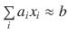被强制成立（关系由`rel`决定）。此变量`d`无需在调用`reify_force`之前声明。无论该变量是在内部创建还是外部传入，它都会被返回。
*   `reify_raise`：实现与`force`相反的蕴含关系。
*   `reify`：同时调用`force`和`raise`来实现“当且仅当”条件。

它还提供了以下辅助函数。

接下来是清单 7-46。

```
bounds_on_box(a,x,b)
Listing 7-46
Bounds Extraction
```

其中`bounds_on_box`在变量`x`的定义域上，找出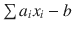的最小值和最大值。

最后一个约束是`all_different`，如清单 7-47 所示。

```
all_different(s,x)
Listing 7-47
All_different Predicate
```

其中`s`是求解器，`x`是整数类型决策变量的集合。所有变量都应具有下界和上界。该约束将强制确保任意两个决策变量的值都不相同。

脚注 1

列生成这一表述，在优化者（一如既往地字面化思维）看来，源于将约束集视为一个矩阵。

2

感兴趣的读者应查阅“reduced cost”和“column generation of the cutting stock”以深入了解这些问题。

3

从事工程或应用数学的优化者传统上最小化凸函数。有一个完整的研究领域，恰当地称为凸分析，专门研究此类问题的理论。相比之下，商业领域的优化者通常最大化凹函数。理论是相同的，但一切都颠倒了。也许我们应该称一组人为优化者，另一组为悲观者？

4

这是优化者令人遗憾的缺乏想象力的命名传统的又一个例子。也许这可以解释这一点。我的博士导师半开玩笑地说：“如果你希望你的算法以你的名字命名，就不要给它们起有趣的名字。”言下之意是，如果一个人把他的算法命名为 Alg-1 和 Alg-2 或类似平淡无奇的名字，同事们将别无选择，只能称它们为 Smith-star 或 Jones-revised。唉，这种对身后名的希望被 SOS2 和其他同类杂种的使用所否定。

5

尽管可以对这类约束进行建模，但对于连续变量来说，这通常意义不大。

6

源自 res（属格 rei），拉丁语中意为“对象”。这种异常有创意的命名法并非归功于优化者，而是归功于在相关（有人会说是对抗性的）约束编程领域工作的计算机科学家。

7

感兴趣的读者需要研究整数规划的分支定界技术。

8

运筹学数学，本书主题的总称。

9

在不可避免的与员工讨论中，当员工强烈抱怨他们的偏好没有得到满足时，这一点是无价的。在用户接受解决方案之前，建模者的工作尚未完成。

10

如果你是美国人，想想 NBA；如果是加拿大人，想想 NHL；如果是澳大利亚人，想想 ARL；如果你是前三个国家的殖民者，想想 EPL。

11

对于理论导向的人来说，原始-对偶间隙更小；最优性检测更容易。

12

实际上，即使有深入的内部知识，也可能几乎无法判断。尝试这种方法看看它是否有效，比阅读当前整数求解器的内部结构要容易几个数量级。这些求解器用 C 或更糟的 C++编写，具有层层叠叠的复杂割生成例程，它们之间存在微妙的相互作用，更不用说多年开发和调试积累的垃圾代码了。

13

车攻击同一列或同一行上的任何棋子，无论距离多远。

14

我已经在超过 20,000 个谜题上运行过这段代码。在大多数情况下，模型在零点几秒内运行完毕；偶尔会需要几秒钟。

15

Raymond M. Smullyan，《老虎与美女，及其他逻辑谜题》（纽约州米尼奥拉：多佛出版社，2009 年）。

16

一般来说，对于整数规划，找到所有解非常困难，但对于许多实际案例来说是可能的。

17


我相信这一传统始于丹尼斯·里奇和 Unix，它们作为简化良药，对抗 Multics 令人头疼的复杂性。


