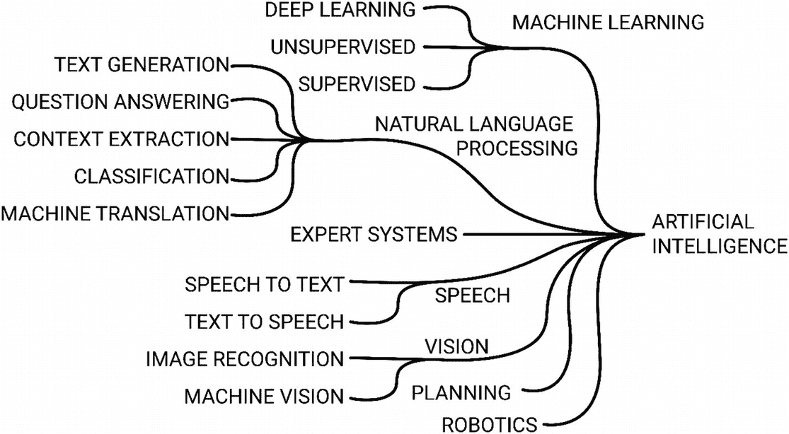
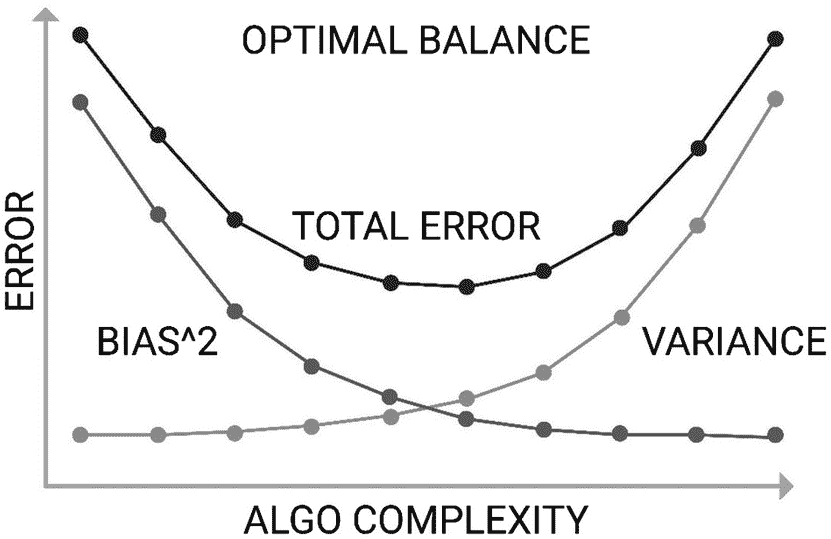
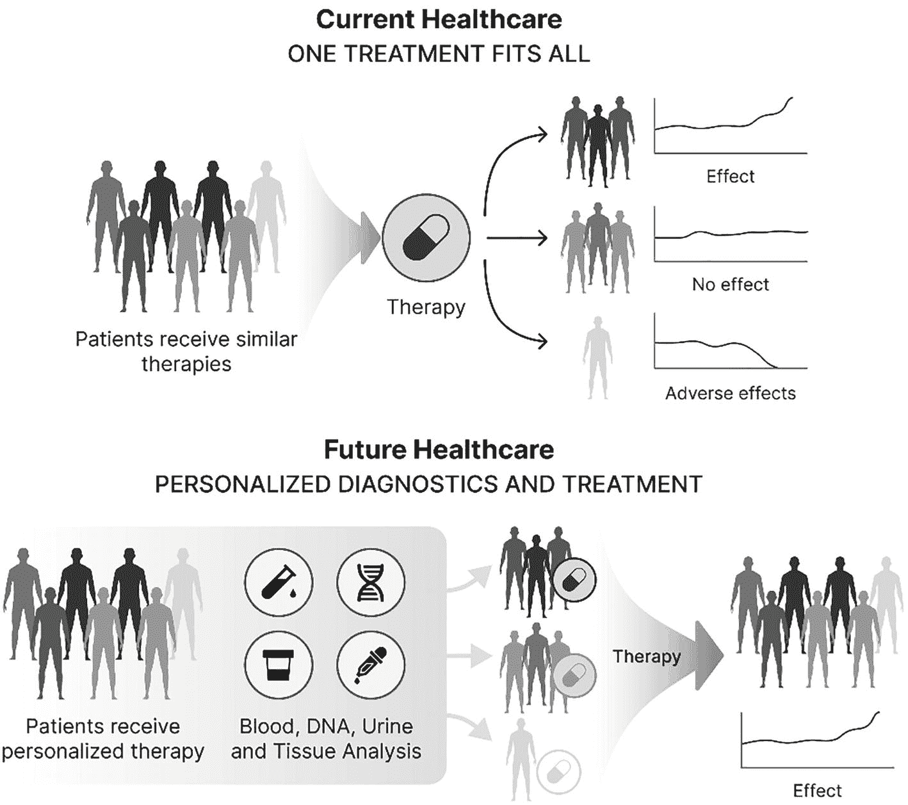

# 4. 精准健康中的人工智能与机器学习

人工智能指非人类主体展现出的任何认知能力。其五大基本要素为：学习、推理、问题解决、感知和语言理解。在执行学习、视觉和逻辑推理等任务时，人工智能已超越人类能力。^(⁴⁸) 机器学习是人工智能的一个子集，通过训练计算机模型随时间推移从自身行为和环境中学习以进行改进。算法会适应新数据和发现的呈现，并通过机器学习在无需显式编程的情况下，迭代式地提升任务表现。机器学习是一种能够在最少人工干预下自主适应的人工智能。

深度学习是机器学习的一个子集，它利用人工神经网络模拟人脑的学习过程。之所以称为`深度学习`，是因为在学习数据时，深度学习函数中会添加额外的层级。函数中的这些层级被称为`神经元`。当深度学习模型学习时，它只是通过优化函数来修改权重（即神经元）。`图 4-1` 展示了人工智能的组件分析。

一个树状图对人工智能的组件进行了分类。它从右到左分支为机器学习、自然语言处理、专家系统、语音、视觉、规划和机器人技术。进一步地，它又细分为深度学习、无监督学习和监督学习、文本生成、问答、上下文提取、分类、机器翻译、语音转文本和文本转语音。

`图 4-1` 人工智能的组件

自然语言处理（NLP）是系统分析、理解和生成人类语言（包括语音和文本）的能力。自然语言理解之所以困难，是因为人类语言天生具有歧义性——语言、发音、表达和感知皆是如此。为了分析和理解自然语言，句子的语法结构和词语的含义会被分解成片段，以便在上下文中进行研究和理解。NLP 将人工智能与计算语言学和计算机科学相结合。

整合机器学习、深度学习等人工智能方法以及自然语言处理等技术，以应对数据可扩展性和高维度的挑战，并将其转化为可操作的洞见，正成为精准医学的基础。智能手机和可穿戴设备等基于传感器的技术的普及，开启了一个健康人工智能的新时代，能够根据生命体征、环境和行为做出实时决策。然而，人工智能的益处仍需应对尚存的技术、法律和伦理挑战，以确保利益相关者能够实现精准健康生态系统。

科学中的假设生成方法，最好被视为一种从数据模式中识别和推断意义的补充手段，而不仅仅是简单延续以往的做法。越来越多的人工智能方法允许直接从数据中学习这些模式或趋势，而非由研究人员基于先验知识预先指定。

## 人工智能的三种类型

任何人工智能应用都归属于三种智能类型之一，分类依据是其复制人类特征的能力、实现该目标的技术、应用场景以及心智理论。

### 弱人工智能

迄今为止，人类成功实现的唯一人工智能是弱人工智能（ANI），也称为弱人工智能或狭义人工智能。狭义人工智能擅长执行单一任务。例如语音识别、垃圾邮件过滤器、自动驾驶汽车、电影推荐以及支持面部识别的软件。使用狭义人工智能算法可以在几秒钟内处理大量数据，且不会累积疲劳。

狭义人工智能有两种类型：反应型和有限记忆型。反应型人工智能没有存储能力，模拟人脑无需先前经验即可对刺激做出反应的能力。相比之下，大多数人工智能解决方案使用有限记忆型人工智能，它具有数据存储和学习能力，使机器能够利用初步数据为未来的决策提供信息。例如，深度学习会根据先前存储的数据来定制未来的经验。

### 通用人工智能

通用人工智能（AGI）或强人工智能，是指一种具有通用智能的类人主体，能够学习并运用其知识和经验来解决问题。这种形式的人工智能以与人类行为无法区分的方式行动、思考和理解。强人工智能围绕心智理论人工智能框架展开，该框架详细阐述了辨别其他智能实体的需求、情感、信念和思维过程的能力。心智理论人工智能并非关于复制或模拟；相反，它是关于教会机器真正理解人类。目前尚无显著的强人工智能实例。

### 超级人工智能

超级人工智能（ASI）目前是一个理论概念，它超越了模仿人类智能和行为。它指的是主体能够自我意识，并超越人类能力和智能的极限。这是否不可避免，通常是一个伦理和道德问题，而非技术问题。

## 机器学习简介

机器学习体现了数据挖掘的原理，但也能推断相关性并从中学习，以应用于新的算法。

无论人工智能的类型如何，其目标都是模仿人类通过经验学习的能力，并在无需或仅需极少外部帮助的情况下完成指定任务。机器学习任务可以是`监督式`的（基于示例输入开发模型）、`非监督式`的（模型从输入中自行确定结构），以及`半监督式`的（前两者的结合）。

### 机器学习框架

无论采用何种方法，一旦问题被界定，典型的人工智能或机器学习工作流程通常包含以下步骤：

-   `数据准备`：涉及数据探索、分析、洞察与清洗
-   `训练`：选择学习方法，应用这些方法创建模型，并尝试优化所创建的模型
-   `测试`：对方法和结果进行客观评估
-   `传播`：向利益相关者报告评估结果，并确保可解释性
-   `部署`：发布训练好的机器学习模型，并监控其持续使用情况与准确性

训练阶段涉及通过调整改变算法行为的关键参数（即调参）来最大化算法性能。参数是模型使用的变量，模型可以从数据集中估算其值。参数的数量和类型是任何算法的关键方面。虽然数据越多越好，但如果数据质量低劣，最终也毫无用处——此外，训练模型所需的时间和资源会随着参数维度的增加而增加。如果使用少量参数进行训练，模型可能会遗漏微妙的趋势和模式；而大量数据则可能导致算法难以识别有价值的模式。

测试阶段随后通过参数的性能来评估调参效果，以确保模型具有泛化能力，这是所有算法的目标。从数学角度理解，这可以看作是试图在训练数据和测试数据上最小化成本函数，从而使模型能够自信地执行，并部署到现实世界中。

`表 4-1` 列出了一些学习方法与算法的示例。

`表 4-1` 学习方法与算法示例

| 监督学习 | 无监督学习 | 自然语言处理 |
| --- | --- | --- |
| • `支持向量机` • `朴素贝叶斯` • `高斯贝叶斯` • `K-近邻算法` • `逻辑回归` | • `Apriori` 算法 • `FP-growth`（频繁模式增长） • `隐马尔可夫模型` • `主成分分析` • `奇异值分解` • `K-means` • `神经网络` • `深度学习` | • `C4.5` • `K-means` • `支持向量机` • `Apriori` • `EM`（期望最大化） • `PageRank` • `AdaBoost` • `kNN` • `朴素贝叶斯` • `分类与回归树` |

高泛化能力会导致过拟合或欠拟合。如果模型在训练数据集上的表现优于在未见过的测试集上的表现，那么该模型很可能过拟合了。交叉验证是一种用于衡量过拟合程度的技术。此外，使用更多数据进行训练可能有助于算法更好地推断假设。

欠拟合很容易检测，因为其性能会很差。偏差衡量的是模型因从错误数据中学习而产生的误差。偏差衡量的是这些模型的预测值与实际正确值或真实信号之间的总体偏离程度。增加模型复杂度以确定微妙的信号可以减少偏差，但会引入方差，方差决定了模型预测值围绕某个数据点的变异性。确保模型的泛化能力是在偏差和方差之间进行权衡（`图 4-2`）。在任何可能的情况下，保持简单比过度设计、构建复杂且昂贵的、难以解释和传播的机器学习模型要好。

误差与算法复杂度的关系图。代表方差和虚线的偏差相互呈反比关系。方差呈上升趋势，而偏差呈下降趋势。

`图 4-2` 寻找最优算法平衡点

### 软件与工具包

借助易于实现的库和框架，利用机器学习的力量比以往任何时候都更加容易。在成熟的医疗保健提供商、初创公司、企业和学术界的推动下，医疗保健提供者正逐步采用复杂的工具包，以利用患者产生的大量实时数据流。开源工具包通过为常见算法提供现成可用的代码来支持机器学习。大多数工具包都适用于 Python，这是开发机器学习算法最受欢迎的编程语言。

`Scikit-learn` 是一个 Python 模块，包含基于 `SciPy` 构建的图像处理和机器学习技术，并支持聚类、分类和回归等算法，例如朴素贝叶斯、决策树、随机森林、k-means 和支持向量机。`NLTK`，即自然语言工具包，是用于自然语言处理的库集合。`NLTK` 为专家系统提供了基础，例如分词、词干提取、词性标注、句法解析和分类。`Genism` 是一个用于处理非结构化文本的库，`Scrapy` 提供开源数据挖掘功能，而 `TensorFlow` 是一个由 Alphabet 支持的热门开源数据计算库，针对深度学习进行了优化。它支持多层神经网络和快速训练。`Keras` 和 `PyTorch` 是用于使用 `TensorFlow` 构建深度学习算法的库。

`WEKA` 是一个用 Java 编写的软件套件，支持通过图形用户界面或直接访问进行交互，类似于 `sci-kit-learn`，它提供算法、可视化工具，并支持一系列机器学习和数据挖掘任务。

## 可解释人工智能

欧盟的《通用数据保护条例》、美国的《健康保险流通与责任法案》以及澳大利亚的《隐私法》等举措，已将关于医疗保健领域可解释人工智能的讨论推向了主流。尽管人工智能系统已被证明在各种任务中优于人类，但缺乏可解释性仍不断引发批评。可解释性涉及理解特定人工智能驱动的决策是如何做出的。人工智能算法是复杂的数学模型，对于这些模型而言，复杂优化过程的可解释性变得不容小觑。提高人工智能的信任度和透明度不仅有益于最终用户，也有助于支持不断发展的系统的整体准确性和泛化能力。

## 人工智能辅助精准健康在实践中的应用

人工智能驱动的精准医疗技术有望全面提高护理质量和结果。随着健康研究和实验中产生大量多样化的数据，区分精准医学和公共卫生将变得越来越具有挑战性。虽然我们可能还需要数年时间才能实现精准医疗的全部潜力，但早期的努力正在应对重大挑战，并展示了人工智能技术和计算能力进步在各个主题中可以发挥的关键作用。

### 临床决策支持

临床决策支持工具已应用多年。然而，其中许多工具仍是相对独立的解决方案，未能充分整合到医疗服务提供者所使用的临床护理点设备中。由人工智能主导的临床决策支持系统，能够基于生物医学影像数据预测特定医疗结果的发生概率或特定疾病的风险，从而改善对特定医疗状况的诊断、治疗和预后。大量研究表明，人工智能及其他分析工具能够准确预测肾脏疾病、识别乳腺癌，并预测白血病的缓解率。^(⁴⁹) 人工智能系统已超越现有最先进的方法，并获得了美国食品药品监督管理局（`FDA`）对多种临床诊断应用的批准，尤其是基于影像的诊断。^(⁵⁰) 用于训练的大型数据集的可用性（例如大量带注释的医学影像集合或大型功能基因组学数据集），以及人工智能算法和用于训练这些算法的 GPU 系统的进步，共同推动了这一生产力激增。

凭借正确的数据、整合方法和团队，机器学习有潜力提升临床决策支持工具的实用性，并帮助医疗服务提供者提供最优的护理。开发算法面临的最大挑战是获取训练模型所需的大量数据，这些模型用于建议后续治疗步骤、标记潜在风险，并提高服务效率和能力。

### 行为改变干预与生活方式医学

数字疗法是指针对患者的、基于证据的治疗性干预措施，用于预防、管理或治疗某种医疗状况或疾病。数字疗法通常被视为移动应用程序，但越来越多的产品可在多个平台上使用。^(⁵¹) 数字疗法与更通用的健康和健身应用程序的区别在于其临床分类、明确的目标受众、经过验证的研究成果以及实际影响。面向患者的数字健康应用程序通过更有效地传递健康信息、更好地监测健康指标以及鼓励改变生活方式行为，为改变个人承担自身健康责任的方式提供了机会。多项系统综述表明，基于应用程序的干预措施可以改善饮食、增加身体活动并减少久坐行为。^(⁵²) 然而，仍需进行对照试验来确认多组分干预措施是否比单一应用程序更有效。

鉴于大多数疾病风险源于可改变的风险因素，通过数字疗法提供的精准行为改变和生活方式干预措施，在促进公共卫生预防工作方面具有巨大潜力，能够成功且高效地提升人群健康水平、控制医疗成本并消除健康不平等。对大多数人而言，改善健康的关键并非基于对你的基因组测序、分析你的微生物组或监控你的智能手机所得出的似是而非的结论而制定的饮食或锻炼计划。相反，关键在于弄清楚如何在采纳和维持积极的健康行为时保持动力。

以治疗性干预、行为改变指导、生物医学数据反馈和传感器为形式的精准行为改变和生活方式干预，使得健康管理能够真正以患者为中心、聚焦解决方案且精准无误。重要的是，精准行为改变干预措施已被证明是有效的。^(⁵³,) ^(⁵⁴) 大量研究表明，精准健康平台能够吸引不同文化背景的人群参与，提供与面对面护理等效的护理服务，并改善生活质量和促进体重减轻。^(⁵⁵)

行为改变平台可以随时支持人们在现实世界和虚拟世界中学习和养成健康习惯，利用传统的平台内体验以及沉浸式虚拟和增强现实体验来强化学习并维持行为改变。^(⁵⁶) 平台会以量身定制的方式持续引导人们过上健康的生活，从而最大限度地提高实现健康目标或达到目标测量值的可能性。目前，大多数精准健康行为改变干预措施依赖于人工主导的低技术个性化方法，并且仅依赖数据规则；大多数平台仍未充分考虑人们的行为与社会及环境背景之间的相互作用。随着行为改变干预措施的改进，它们将越来越多地超越仅根据当前行为和人口统计数据进行个性化的范畴，并实时考虑个体的基因图谱、社会及环境背景。

对肥胖疗法的反应存在高度个体差异，这证明了为个体患者选择最合适的治疗策略是合理的。一个精准的肥胖解决方案将结合基因检测、环境相互作用、表观遗传学、代谢组学、微生物组、药物基因组学、营养遗传学、营养基因组学和深度数字表型分析，并辅以全面的行为改变干预措施，以支持依从性、健康优化和远程监测。

根据我个人的经验，采纳行为改变干预措施的最大阻力来自于决策路径中的利益相关者，他们对激励人们参与并维持干预措施持批评态度。许多医疗保健提供者曾尝试过针对吸烟、减肥和身体活动的激励计划，但往往以失败告终。传统的医疗保健系统对此持怀疑态度，并且不知道如何改变健康行为。然而，数字参与与健康促进活动的参与是不同的。通过了解人们的基本测量数据（如年龄、性别和种族）来以数字方式吸引他们相对简单。通过对大型数据集进行机器学习，我们可以理解那些表现出相似深度数字表型的人的行为和模式，从而最大限度地提高即使是最缺乏动力的人群的参与度和长期依从性。

### 新疗法、疾病定义与干预切入点

庞大的科学与患者数据网络将使研究人员能够发现新知识和重要的疾病洞见，例如有望具有更高成功概率的新型药物靶点。这些生物标志物有助于将患者划分为可能从治疗中获益的亚组，并支持设计更优的临床试验，招募合适的患者参与其中，从而开发出适用于现实世界的疗法。大规模的组学数据和基因组生物标志物有潜力揭示分子谱与其他临床变量之间的新型关联，这些关联原本无法通过其他方式识别，进而可能在临床试验中发现新的临床相关亚型。`图 4-3` 展示了如何利用精准健康来开发更好的疗法。

一幅示意图分别在上方和下方区分了当前的医疗保健和未来的医疗保健。当前的医疗保健依赖于类似的疗法，导致无效或不良反应。另一方面，未来的医疗保健描述了个性化的诊断和治疗，从而带来更好的结果。

`图 4-3` 精准治疗为所有患者提供有效的治疗方案

随着数据揭示出前所未有的信号，新的疾病定义正在被制定。例如，行为改变干预已被证明有助于减肥、改善血糖控制，并逆转诸如 `2 型糖尿病` 和 `糖尿病前期` 等心脏代谢疾病。^(⁵⁷) 因此，在大数据的支持下，许多国家已将 `2 型糖尿病` 的定义从一种慢性、进行性疾病转变为一种患者可以逆转的疾病。

类似地，研究人员可以利用机器学习算法预测潜在的未来事件，例如抑郁行为和自杀风险。范德比尔特大学医学中心的研究人员利用仅 5000 名患者的入院数据、人口统计数据及诊断史训练了一个模型，该模型能够准确预测个体在未来七天内是否有生命危险，准确率达 84%；并且能够准确预测个体在未来两年内是否有自杀企图，准确率达 80%。一旦检测到风险，患者可被升级至紧急护理，并获得强化行为与心理健康支持。

### 数字孪生

`数字孪生`实例及其聚合体能够通过确保目标人群在相应的数字孪生表征中得到充分体现，从而支持新假设的提出与检验、计算机模拟实验与比较，以及从单一个人的小数据到单个或多个群体的大数据中发现新知识。^(⁵⁸) 例如，个性化心脏模型被用于辅助新生儿严重心脏缺陷的临床治疗。在医生的监督下，可以利用数字孪生进行多次虚拟手术，以确定最佳方案。

数字孪生的特性，如`数字线程`追踪与跟踪，能够实现高度个性化的治疗路径、更好的结果以及更具可解释性的人工智能。与人工智能和数据分析面临的挑战类似，数字孪生也受到数据可用性与质量、数据集成与互操作性、数据共享、知识产权顾虑、跨平台与系统的数据隐私与安全、人工智能偏见、可解释性及可重复性等因素的影响。

通过确保目标人群在其各自的数字孪生及数字孪生聚合体中得到公平代表，可以实现智能数字孪生中的人工智能可重复性与偏见减少。

### 健康促进聊天机器人

研究表明，人工智能聊天机器人在全球范围内展现出显著的可用性、可行性和可接受性。^(⁵⁹) 凭借近乎 100%的正常运行时间，聊天机器人非常适合促进和维持健康行为，无论是戒烟、改善营养还是药物依从性。健康促进聊天机器人通过提供具有更高互动性和可持续性的个性化按需支持，克服了数字远程医疗的局限性，例如不可持续性、低依从性和缺乏灵活性。

健康促进聊天机器人从包括用户在内的多种来源收集数据，利用机器学习和自然语言处理技术进行分析，并向用户提供数据输出，例如信息、行为改变支持指引，或升级至更密集的支持。在节省时间方面，健康促进聊天机器人已展现出巨大潜力。例如，患者可以通过即时通讯聊天传达症状，无需预约或前往医疗机构即可获得实时咨询。

### 语音识别

人类语音是一种丰富的媒介，是主要的沟通来源。智能手机或智能音箱等联网设备上的虚拟/语音助手如今已成为主流，并推动了语音控制搜索的广泛应用。这也有充分的理由——说话是最自然、最节能的互动方式之一。作为动物，我们通过调节语音的语调或音高来分享关于情绪、恐惧、感受和兴奋的见解。疾病会影响心脏、肺、大脑、肌肉或声带等器官，从而改变一个人的声音。

`语音识别`算法处理来自人类语音的原始声波，以识别语音的基本要素；语速、音高、音色和音量等声音生物标志物；以及更复杂的语音特征，如口语、单词和句子。迄今为止，语音识别的主要应用是语音命令和虚拟助手系统。

尽管`语音识别`算法尚未广泛应用于临床诊断，但在检测通常难以用传统临床工具诊断的神经系统疾病方面，它们已显示出巨大潜力。由于语音数据能够揭示个人信息，例如身份、人口统计特征、种族，甚至在声音生物标志物的情况下还能揭示健康状况，因此语音数据被视为敏感信息。

# 语音与健康

`语音识别`已成功用于检测对语音有明显影响的疾病，如慢性咽炎，以及对语音影响不那么明显的疾病，如阿尔茨海默病、帕金森病、重度抑郁症、创伤后应激障碍和冠状动脉疾病。这些临床应用采用了相同的通用`语音识别`策略。不过，最终分类步骤所针对的结果是一种疾病表型，通常与语音特征（语调、语速、音高等）相关，而非语言内容。为了安全地使用语音监测健康相关结果，必须根据金标准对声音生物标志物进行验证。

在大规模使用语音技术或声音生物标志物时，考虑语言和口音也至关重要。否则，它们可能会对来自特定地区、具有不同背景或带有各种口音的人群产生系统性偏见，并加剧现有的数字和社会经济鸿沟。为了减少对代表性不足人群的偏见，语音技术或声音生物标志物必须依赖于在多样化数据集上训练的算法。研究人员还必须提高处理和理解自然语言的能力，以及语音助手回答的相关性和准确性。`图 4-4` 给出了声音生物标志物如何在健康领域应用的示例。

`图 4-4` 声音生物标志物在健康领域应用概览

从音频到视频，这个领域正在发展。将图像添加到语音数据中可以更好地描述患者、情绪和其他健康特征。使用面部识别和智能手机摄像头等新技术，结合声音生物标志物，使得远程健康监测更加精确和可靠。随着`5G`网络及未来更新的引入，以及配备语音助手的智能手机和家用设备数量的增加，大规模语音样本的收集和处理将变得更加容易。

俗话说，一图胜千言；而一视频胜千图。

## 总结

从对健康数据的客观和全面分析，到识别新的长期模式和风险因素以辅助诊断，`机器学习`作为`人工智能`的一个分支，为增强医学和医疗保健提供了无数机会。此外，在商业化健康系统中使用`人工智能`，为以患者为中心的个性化医疗和健康治疗提供了解决方案。然而，`机器学习`在数字健康领域的应用主要局限于狭窄的领域。但是，传感器和`物联网`的最新进展意味着我们现在可以比以往任何时候都更多地收集用户更广泛的身体和情绪状态数据。

正如本章所讨论的，在期望`人工智能`在核心医疗服务中得到更广泛采用之前，还有许多挑战需要克服，包括显著提高可解释性和透明度。尽管如此，持续的`人工智能`在数字健康领域的研究将有助于推动数字健康和`人工智能`的整体发展，为现代社会带来巨大价值。

[^1]: 1
[^2]: 2
[^3]: 3
[^4]: 4
[^5]: 5
[^6]: 6
[^7]: 7
[^8]: 8
[^9]: 9
[^10]: 10
[^11]: 11
[^12]: 12