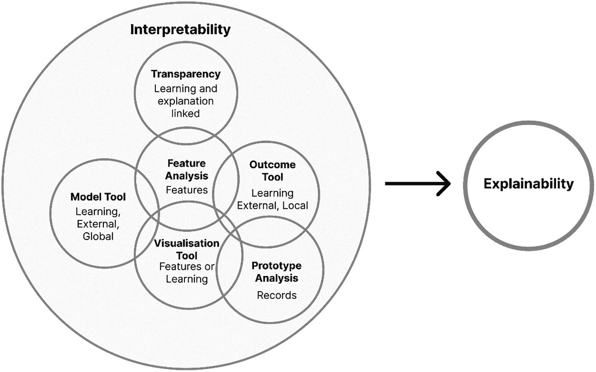
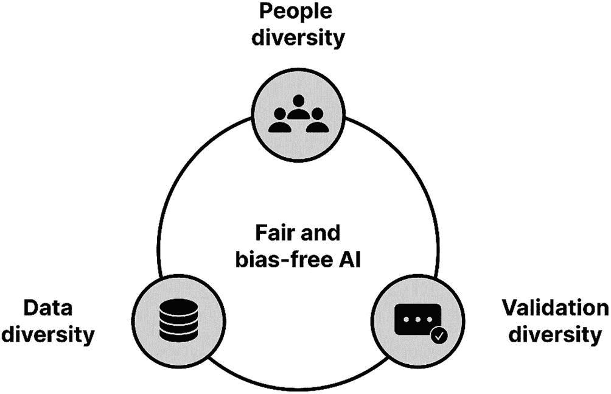
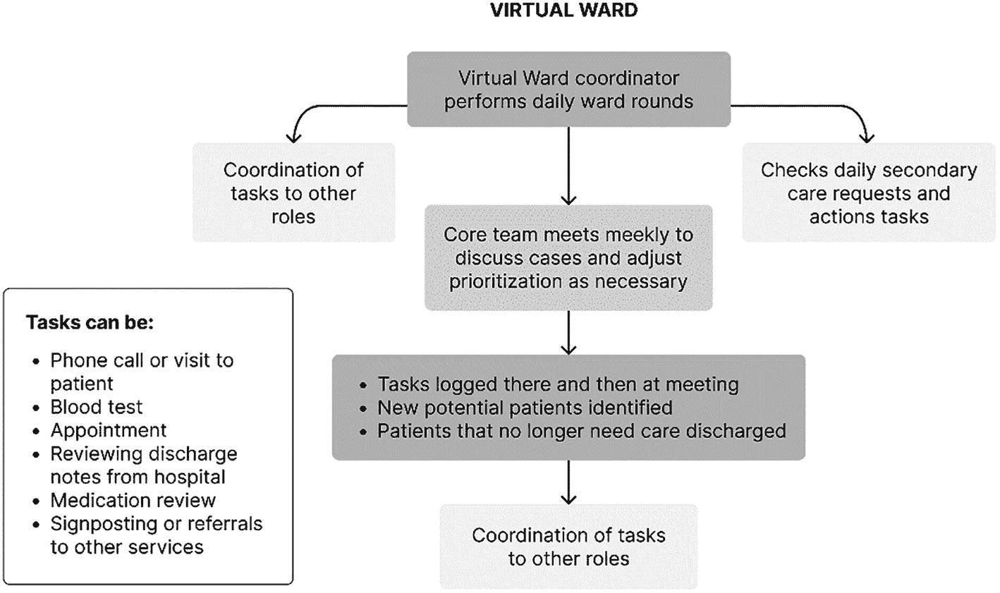

# 5. 精准健康的风险与伦理挑战

精准健康的目标需要广泛收集患者的遗传特征、生活方式和环境因素数据。虽然患者和专业人士期待精准健康带来的显著益处，并对其持积极态度，但他们也感知到下一代测序技术、信息技术和人工智能融合所带来的风险。许多与 `AI` 相关的风险具有哲学、道德和伦理层面的影响。

临床、技术和学术界尚未解决传统医疗技术带来的风险。因此，`AI` 驱动的精准健康系统的兴起为这些挑战带来了新的、不同的维度。幸运的是，一些实践和主题正在涌现，可以帮助我们驾驭由自主和智能系统揭示的复杂道德世界。

## 负责任开发与伦理 `AI` 原则

首先，人类只有以负责任的方式开发和部署系统，才能实现面向全人口的 `AI` 驱动精准健康。随着 `AI` 风险持续增长，发布伦理原则以指导 `AI` 开发与使用的公共及私营组织数量也在增加。许多人认为这是最高效的主动风险缓解策略，但一个关键问题依然存在：究竟以谁的伦理准则为准。

建立伦理原则有助于组织在提升福祉和公共利益的同时，保护个人权利与自由。伦理学家可以将这些原则转化为组织可遵循的规范与实践，进而实现有效治理。`AI` 伦理的许多指导原则源自生物医学伦理，包括可靠性与安全性、包容性、无偏见性以及隐私保护。核心 `AI` 伦理原则可分为两类。

- `认知原则`构成了研究 `AI` 伦理性的先决条件，代表了使组织能够判断 `AI` 系统是否符合伦理规范的知识条件。这些原则包括可解释性、可靠性、稳健性和安全性。
- `通用 AI 伦理原则`则代表了在多种文化和地域应用中有效的行为准则，指明了 `AI` 解决方案在特定使用场景中面临道德决策或困境时应如何表现。这些原则包括问责制、数据隐私、合法性、安全性、仁慈性、公平性和人类自主性。

## 认知原则

认识论与伦理学都关注评估。伦理学评估行为，而认识论评估信念与认知行为。认知原则代表了使利益相关者能够判断 `AI` 系统是否符合伦理原则的知识条件。

### 可解释性

当人类能够理解 `AI` 模型预测和决策背后的推理过程时，该 `AI` 模型即被视为可解释的。许多传统 `AI` 模型，如线性回归和决策树，易于理解。换言之，`AI` 模型的可解释性越强，人们就越容易理解并信任其计算输出。机器学习模型的可解释性指的是其将原因与结果准确关联的能力。模型的可解释性通常受其复杂度影响。例如，包含五个特征的线性回归比包含一百个特征的线性回归可解释性要强得多。

创建可解释模型的标准方法通常不如黑盒模型表现优异，这导致了模型准确性与可解释性之间的权衡。神经网络便是一种无法解释的算法示例，其输出无法解释反向传播算法计算出的值。在构建 `AI` 系统时缺乏认知，或允许无法解释的黑盒存在，将导致问题频发。例如，若发现某个智能体做出错误预测，要合理解释其隐藏且几乎无法发现的单一行为几乎是不可能的。

相比之下，可解释性则关乎 `AI` 模型内部所用参数能否证明结果的合理性。

`图 5-1 可解释性与可说明性之间的关系`

可解释、可说明的 `AI` 通过为临床医生和患者提供共享决策所需的信息，促进了以患者为中心的护理。关于不同行动方案潜在益处与风险的有意义对话，可以借助数据得到支持，并确保患者获得最适合其情况、价值观和优先事项的治疗。有人可能会认为，黑盒 `AI` 与以患者为中心的医学原则背道而驰。如果临床医生无法完全理解导致决策的特征和计算过程，他们就无法解释特定结果或建议是如何得出的。

### 可靠性与安全性

精准健康系统必须可靠、准确且安全地运行。美国 `FDA` 和英国 `MHRA` 等机构通过要求供应商证明其具备这些特性，来促进安全性和有效性。在应用于精准健康技术时，确保输出在技术上的可靠性（即 `AI` 系统已从先前见过的数据中学习到相关性）以及临床上的可靠性至关重要。

伦理学家还必须在患者赋权与各种风险之间取得平衡，这些风险包括：对家庭检测的监管不一致、临床监督护理的重要性、假阳性和假阴性结果、错误报告的数据以及意外后果。`AI` 系统是对现有护理的增强而非替代，有时可能需要人工干预。

设想一个 `AI` 系统被训练用于将肥胖患者分为心脏病发作的高风险和低风险两类。如果系统从用于训练模型的数据中理解到，南亚患者死于心脏病的可能性较低，那么它可能会推荐将南亚患者归为低风险。无论这种数据相关性多么准确，该结论都是一种临床研究与之矛盾的误读。实际上，南亚裔会增加患心脏和循环系统疾病、2 型糖尿病以及多种合并症的风险。[^60]

自我改进的 `AI` 在确保可靠性和安全性方面提出了另一项挑战。当前的法规假设产品应以一致、不变的形式进行临床测试、生产、营销和使用。这对于持续学习的 `AI` 来说颇具挑战性，因为后者会因对当前可用数据的解读和分析而不断变化。由于持续学习 `AI` 的动态特性，将需要新的方法来确保此类系统的安全性和可靠性。持续学习的 `AI` 需要这样的法规：确保持续学习系统对自身所做的表面上的改进，不会反而向模型中引入可能导致伤害的错误。同时，法规不能要求对模型进行近乎持续的重新验证。

正如以白人为中心的医学教科书被用于提供几代人的医疗教育所证明的那样，大多数基因检测的证据基础是有限的，需要更多来自不同人群的数据。[^61] 多样性和文化差异在利益相关者如何解读精准健康的安全性方面起着关键作用。在来自代表性不足社区的数据以具有代表性的规模被收集之前，每个人都应对此提出质疑。临床检测只有在能为患者和医疗专业人员提供可用于临床决策的可靠、可操作信息时才有用，这类似于行为改变干预措施只有在能促使人们采纳并维持生活方式行为时才有益。

在人群层面，由于生物标志物验证不足以及临床效用证据不充分，对多组学、临床、环境和生活方式数据的解读变得更加复杂。个性化精准健康解决方案背后缺乏科学证据，这对安全性构成了挑战。例如，在基因组检测上花钱只有在有益的情况下才有帮助。然而，我们必须预料到一些新的检测将无法达到预期。同样，个体风险若并非针对患者量身计算，而是使用在非代表性人群上验证过的既定风险预测模型，则与精准健康的目标背道而驰。然而，我们必须注意，支持新型个体化治疗的有效性和耐受性需要时间。

尽管尽了最大努力，但由于各种错误，`AI` 系统无法提供完美的准确性。自然，不完美的数据集可能会记录错误或噪声，而随机错误很可能是假阳性和假阴性预测。

## 通用伦理 `AI` 原则

通用伦理 `AI` 原则代表了在跨文化和跨地域中基本一致且有效的原则。

### 偏见、包容性与公平性

医疗保健中使用的任何工具，无论是否精准，都应公平公正地对待每个人。`AI` 技术应促进繁荣、维护团结并避免不公。然而，在实践中，`AI` 模型并非天生客观。`AI` 模型会学习影响人类决策的偏见。[^62]

偏见指的是模型可能以歧视性或排他性方式运行的风险，并且偏见可以通过多种方式引入系统。机器偏见可能由多种原因造成，包括开发者在用于训练模型的数据中存在的歧视。数据偏见指的是与预期结果的偏差。人类偏见指的是人类表现出的偏见。如果没有意识和控制，`AI` 系统可能会放大数据集中现有的偏见和不公。例如，研究发现，医生可能会在病历的客观描述中传递偏见。[^63]

临床医生可以使用像一对引号这样看似无害的东西来传达偏见。[^64] 当医生描述患者的症状或健康问题时，一组研究人员发现，黑人患者，尤其是他们的记录中引用的频率高于其他患者。研究人员发现了可能表示不尊重的引号模式，用于向未来的临床读者传达讽刺或挖苦。研究人员强调的短语包括口语化的语言或用黑人/族裔俚语表达的陈述。

最终，`AI` 系统反映了数据、系统开发者以及实施和解读系统的临床医生中固有的偏见。图 5-2 详细说明了公平且无偏见 `AI` 系统的三个方面。

`图 5-2 公平且无偏见的 AI`

精准健康的成功结果在很大程度上依赖于能够代表目标患者人群的高质量、高保真数据的可用性。代表性差的数据集会引入偏见，导致代价高昂的误诊或过度诊断情况。直到最近，研究人员才发现，`AI` 驱动的皮肤癌检测应用在识别白人患者方面的表现优于识别其他族裔患者。我们必须做得更好，以确保精准健康获取和结果的公平与平等。

具有代表性的数据仍然可能包含偏见，因为它们反映了我们社会中的差异和不容忍，包括在医疗保健服务获取方面的种族、地理或社会经济差异。例如，依赖通过面向用户的应用程序和可穿戴设备收集的数据，可能会偏向于那些更有能力获取昂贵设备的社会经济优势人群。同样，基因检测对许多消费者来说仍然过于昂贵，因此使用此类基因数据集的 `AI` 系统可能更偏向于经济上更有优势的消费者。

医疗保健提供者可能会不公平地实施旨在预测健康结果并决定谁应接受护理以降低成本的精准健康技术。确保精准健康技术由多元化人员开发、多方利益相关者参与以及审慎的专业判断，将减轻以患者为中心的护理和治疗中的不平等。多样性提供了思维、伦理和心态的广度，并促进了包容性、公平性和代表性。

### 透明度与问责制

人工智能和技术已经影响着人们的日常生活。随着技术变得日益复杂和精密，精准健康系统的决策将对患者的健康与生活方式产生重大影响。因此，与精准健康系统打交道的个人必须理解这些系统是如何做出决策的。然而，透明度不仅仅在于解释系统的结果，它还包括以下方面：

- 教导临床医生和患者如何使用结果
- 理解系统的局限性
- 尽量减少不必要的压力和依赖

随着精准健康系统被嵌入疾病预测、诊断以及治疗方案选择中，问责与责任的主题需要得到关注。临床医生必须理解精准健康系统所提建议背后的临床依据。正如上文所强调的，系统输出的结果可能在技术上是相关的，但未必对特定个体具有临床相关性，因此临床医生必须运用其专业判断力。透明度与问责制是可靠性、公平性和安全性的基石。

精准健康系统的开发者必须对系统的运作方式承担相应的责任，而在临床实践中部署这些系统的医疗机构，在将其整合到临床实践时也应审慎考虑。

### 合法性

现有的立法和指南已经将精准医疗的许多相关风险降至最低。然而，这是一个不断演变的主题。如果精准医疗的益处得以实现，公正的伦理原则将要求所有人都能普遍获得精准医疗服务。患者教育的改进必须显著增强患者自主决策的潜力。无论如何，临床医生必须采用最高水平的数据安全和通信指南，以避免检测结果造成伤害。此外，医疗机构应进一步审视精准医疗的成本效益，以防止投资不当。

人工智能系统的责任归属是合法性领域的一个新问题。大多数责任框架将责任归于造成伤害的最终用户临床医生、医疗机构或其他人类。然而，对于人工智能而言，错误可能在没有任何人为输入的情况下发生。因此，临床责任框架需要进行相应调整。虽然医疗机构有责任使用经过监管和验证的技术，但存在缺陷的责任政策最终将阻碍患者从精准健康中获益。最后，过失责任将由造成损害或缺陷的个人、群体或实体承担，或者由那些本可预见产品会以患者使用的方式被使用的人承担。由于人工智能系统开发涉及多方（如数据提供者、开发者以及人工智能系统本身），责任归属需要明确，这使得在出现问题时确定责任变得更加困难。

### 数据隐私与安全

根据专业人士和患者的看法，健康数据的收集存在较高的滥用风险。[^65] 由人工智能驱动的精准健康系统应当是安全可靠的，并尊重隐私。数据隐私和共享是精准医疗模式中的关键主题。然而，只需看看 Opus、Telus 和 Babylon 等全球性机构被黑客攻击的事件，就能明白隐私无法得到保证。历史上最大规模的黑客攻击发生在 2022 年，当时澳大利亚通信巨头 Optus 在一次并不复杂的攻击中沦陷，导致三分之一的澳大利亚人面临身份盗窃和欺诈的风险。数小时内，部分数据样本就在暗网上被公开。[^66]

尽管数据保密性通过技术进步得以实现，但人们仍然怀疑那些被委托保密的人能否保证数据安全。无论系统多么智能，黑客只会越来越聪明。

人们参与研究以及提供基因信息、生活方式、环境或医疗数据的意愿也各不相同。这种意愿还受到对数据安全担忧的显著影响。研究表明，人们非常愿意捐赠数据并参与真实世界和数字试验，但对专业人士的信任、成本、检测结果的咨询以及隐私问题依然存在。主要的担忧不仅仅是黑客；患者和专业人士同样担心基因数据可能落入保险公司和雇主手中，从而导致基因歧视。为了实现精准医疗，基因信息必须整合到电子健康记录中，这使得数据更具价值，也更容易受到网络犯罪攻击。

因此，数据科学家必须高度重视数据安全。许多人建议，研究人员应将基因、环境或生活方式数据的收集和关联限制在必要信息范围内。然而，监管机构只有通过制定健康保护措施，才能消除利益相关者的担忧。基因信息提供者应能访问数据，并确保基因歧视像性别、残疾和种族歧视一样被定为非法。对破坏系统的人施加与其行为或罪行相称的惩罚至关重要。

数据共享对于推进研究、开发新的检测方法和疗法是必要的。然而，尽管其重要性不言而喻，仍有许多障碍有待克服。例如，多少数据才算过多？以医疗保健中的宗教和灵性为例，很少有人关注宗教和灵性的独特背景及其在精准医疗中的适用性。患者的信仰已被视为提供更有效、更具针对性治疗的相关临床实践考量因素，尤其是在心理健康、临终关怀和器官捐赠方面。考虑宗教信仰和实践很可能会带来更有效的治疗。

数据共享对个人和群体的隐私及保密性具有重要影响。例如，在遗传性癌症的背景下，临床医生是否有责任警告可能患上特定遗传病的家庭成员？由于基因信息对家庭而非个人具有保密性，临床医生可以将遗传易感性的信息分享给所有有风险的家庭成员。当前的法律法规需要给出明确的答案，而仲裁员对于临床医生在透明度方面的责任得出了不一致的结论。

### 人类能动性

精准医疗中产生的独特伦理问题，源于临床全基因组测序所生成的巨量数据、生活方式与行为数据，以及当前在数据解读和疾病关联方面存在的广泛不确定性。对临床医生而言，最具伦理挑战性的问题之一便是复杂的知情同意流程。

`知情同意`是一种自主的、通常为书面形式的授权，患者借此允许医生实施医疗行为。它是保障患者自主权最关键的措施之一。`知情同意`的基础是：患者获得关于医疗程序性质与风险的全面且可理解的信息，且其接受该程序的自愿决定未受干扰。目前，对于是否应将披露使用了不透明的临床 `AI` 算法作为`知情同意`的一项要求，尚无伦理共识。未能披露使用了难以理解的 `AI` 系统，可能会损害患者的自主权，破坏医患关系，威胁患者的信任，并违反临床建议。

假设患者事后发现，临床医生的建议源自一个不透明（即非透明）的 `AI` 系统。在这种情况下，这不仅可能导致患者质疑该建议，还可能引发其要求合理解释的正当请求——而在不透明系统的情况下，临床医生将无法提供这种解释。因此，不透明的医疗 `AI` 会阻碍准确信息的提供，可能危及`知情同意`。因此，需要制定适当的伦理和可解释性标准，以保护`知情同意`维护自主权的功能。

当我们采用 `AI` 技术并接受其决策时，我们正逐渐将部分决策权让渡给非人类系统。这凸显了在人类自身自主权与委托给人工代理的自主权之间需要达成的平衡，从而在 `AI` 领域确认了独立性原则。

### 行善原则

`行善原则`鼓励创造有益于人类的 `AI`，或为 humanitarian benefit（“行善”）而创造的 `AI`。同时，`非恶意原则`指的是 `AI` 的负面后果和风险（“不作恶”）。`行善原则`至关重要，因为它确保了 `AI` 技术的宗旨是促进福祉、维护尊严并保护地球。

总体而言，`AI` 伦理主要关注`非恶意原则`；必须避免负面后果，例如错误分类。`行善原则`可以通过评估对参与者潜在伤害的概率和严重程度、风险评估，以及针对个人、参与者所代表的群体和社会的潜在利益所采取的缓解策略来理解。

### 重塑护理与患者-临床医生关系

精准健康正在改变护理的提供方式，随之改变的还有患者与临床医生的关系。基因组学研究以及利用大数据（无论是电子病历还是大规模健康追踪）的方法，正随着个性化医疗日益全面的愿景得以实现，将临床体验从预防到诊断再到治疗进行重新定位。

精准健康并非将人简单地划分为患病或健康，而是用个体的多层次特征描述取代了疾病的分类法。

以传统护理中等待的患者为例：当一项筛查检测出现异常结果，但又不确定该个体是否以及何时会发展成该疾病时。一旦确诊，患者便进入治疗阶段；而在精准健康模式下，个体在整个过程中都会受到密切监测并得到持续护理。健康数据将能够量化特定疾病的风险因素，实现护理的个性化定制，并确定病情恶化、发病率和死亡率的风险。护理的范围超越了生物标志物和人们生物学上的差异，涵盖了人们如何以及在哪里度过时间，以及做出促进健康决策时所面临的障碍。

医院护理正在走出病房。虚拟病房为患者在自己家中提供全方位护理，以减少住院需求。对于患有复杂健康状况的人来说，虚拟社区有助于更好地进行自我护理、增强自我意识，并建立在家处理常规病情恶化的信心。对于护理有住院风险的复杂患者的医生来说，虚拟病房通过每日监测患者以确定需要采取行动的地方，提供了“额外支持”和实际帮助，通常为临床团队节省了宝贵的时间和重复劳动。

核心虚拟病房模仿了典型的医院设置。它包括一名病房协调员、一名医生、一名社区护士（DN）、一名社区护理长、一名执业护士（PN）和一名执业管理员。当地社区支持工作者（CSW）和倡导工作者也被邀请参加。根据当地的健康需求，治疗师、社区老年病专家或其他医疗专业人员可能成为宝贵的团队成员。了解更多关于`Gro Health`的信息，这是一个多平台系统，是虚拟病房有效实施的杰出范例。图 5-3 展示了一个虚拟病房的示例。

`图 5-3 虚拟病房`

鉴于医疗专业人员短缺，从业者不太可能因 `AI` 而感到权威和自主权受到威胁。矛盾的是，概率性诊断所固有的不确定性负担，增加了人们对所谓精准诊断的期望，即通过使患者能够就未来治疗做出更明智的决定来增强其能力。根据社会经济地位、文化、年龄和心理倾向的不同，患者在管理这种紧张关系的能力上可能存在差异。随着患者-临床医生关系的发展，研究人员必须调查精准健康和生活质量的影响。

### 健康不平等

虽然精准健康旨在改善患者和人群健康层面的结果，但我们必须确保科技进步不会加剧健康不平等。少数族裔群体在全球范围内经常在医疗保健中面临歧视，并接受低质量的医疗服务。对少数族裔群体的外展工作——尤其是在研究领域——也以长期的剥削、虐待和边缘化历史为特征。

[^60]: 此处原文脚注标记为 `^(⁶⁰)`，已按规则转换为标准格式 `[^60]`。
[^61]: 此处原文脚注标记为 `^(⁶¹)`，已按规则转换为标准格式 `[^61]`。
[^62]: 此处原文脚注标记为 `^(⁶²)`，已按规则转换为标准格式 `[^62]`。
[^63]: 此处原文脚注标记为 `^(⁶³)`，已按规则转换为标准格式 `[^63]`。
[^64]: 此处原文脚注标记为 `^(⁶⁴)`，已按规则转换为标准格式 `[^64]`。
[^65]: 此处原文脚注标记为 `^(⁶⁵)`，已按规则转换为标准格式 `[^65]`。
[^66]: 此处原文脚注标记为 `^(⁶⁶)`，已按规则转换为标准格式 `[^66]`。

## 导致健康不平等的因素包括成本、可及性和代表性不足。成本是一个限制性因素，使得技术只为有能力负担的人所用。许多支付方可能不会报销某些新服务，从而将护理服务限制在有能力负担的人群中。未能解决数据提供和基因数据库中的系统性偏见只会加剧差距。

## 神学
无论是试管婴儿、基因工程还是基因治疗，基因探索都引发了宗教和精神群体的道德问题。在未来几年内，人脑将与计算机连接，纳米技术将被植入人体组织，3D 器官将被打印并移植，人们将选择最优胚胎以最大程度地降低其后代患上严重或危及生命疾病的可能性。精准健康带来的神学和哲学挑战，对于制定严谨的临床实践和相关法律至关重要。

## 职业准备
人工智能驱动的精准健康技术的进步引发了人们对于这些系统最终是否会取代医生的担忧。这种情况极有可能是没有根据的。大多数（即便不是全部）国家都面临着严重的临床医生短缺问题，预计在未来十年内这一情况还会加剧。例如，一份提交给美国医学院协会的报告预测，在其模拟的每一种情景下，到 2030 年都将出现医生短缺。人工智能赋能的精准健康工具非但不会对临床医生构成威胁，反而是提高护理效率、缓解因未来训练有素且经验丰富的临床医生短缺而产生的一些担忧的关键。此外，通过数字化转型和实施支持来增强临床医生的能力，将进一步推动人工智能技术的应用。
精准健康系统改善护理的前景，可能并非来自取代临床医生，而是来自自动化重复性任务，从而解放临床医生的时间，让他们能够专注于患者护理和治疗过程中的高价值活动。在这方面，设计得当的系统将侧重于增强训练有素的临床医生的技能和经验，并与临床诊疗过程的自然工作流程保持一致。

# 总结
随着精准健康得以实现，数字设备、数据和人工智能在我们的日常生活中扮演着越来越重要的角色，最重要的问题将变成：精准健康是否以及在何种条件下能够改善患者的生活质量。
生活质量的好坏由患者自己评判，可能因过度遵从和持续参与自身健康相关的行为方面而感到良好，或主观上感觉更差。