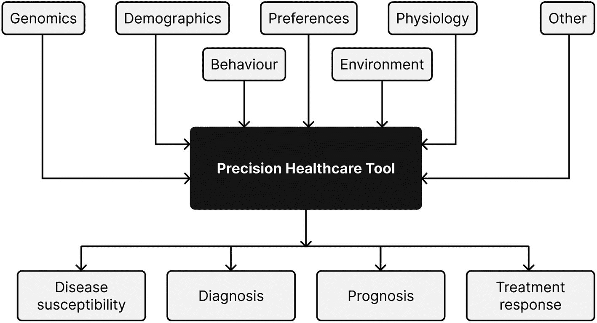

# 6. 精准医疗保健的未来

数字健康技术和人工智能已经在创造智能化的流程和工作流，使医疗保健服务更便宜、更有效、更个性化、更公平。然而，精准健康的目标远不止于此，它旨在通过更深入地理解人类状况和体验，来改善患者管理和诊断。大部分重点都放在了基于对疾病病理学更深入的理解来开发更好的药物这一潜力上。如今，数据和技术既容易获得又价格低廉，诊断和支持方面的改进使得更好的患者管理成为可能。数据的数量和复杂性反映了患者的基因、环境和生活方式。

大数据和人工智能技术为识别新的病症和预后指标、提供精准的行为改变支持、康复治疗，或识别出对特定治疗反应更佳的患者提供了巨大潜力。但这并非没有挑战。

我们对患者的了解越详细，对信息管理、问责制和透明度的要求就越高。当我们对如何提供个性化护理有了更深刻的认识时，我们该如何利用这些知识来降低未来疾病的发生率，并减轻随之而来的技术、临床和伦理问题？精准医学是否应该优先考虑预防而非治疗（而这正是当前医学的主要关注点）？如果某种疾病尚无治疗方法或治愈手段，你是否想知道自己存在患病风险？在处理那些预测未来未知规模和重要性的可能性技术时，有许多问题需要考虑。本章将探讨追求精准健康过程中的重要主题，并提出潜在的影响和后果。

## 从出生到死亡的精准护理

低成本的基因检测提供了人类基因图谱，临床医生可以利用它来了解个体的健康状况和疾病易感性。靶向下一代测序技术能够快速识别常见和罕见的基因变异。检测导致药物疗效或不良反应的变异，对于实施个体化药物治疗和提供支持至关重要。生活方式支持将不再作为一种干预措施来提供，而是从出生起就通过数字疗法与处方药理学干预措施一同提供，未来纳米技术还将为这些干预措施提供支持，以提供治疗、支持和补充身体所需。在自动化技术的支持下，临床医生将实时分析健康状况和疾病风险。随着每个人都能更多地获取关于自身的更丰富、实时、精细的数据，他们将更了解自己，并且如果这些信息被公开，他们也将更了解社区中的其他人。可以预见的是，基于人群层面的基因、生活方式和行为数据，人工智能不仅可能预测疾病和健康不佳，还可能近似地预测出确切的死亡时间。图 6-1 展示了精准医疗保健工具的输入和输出。

一个框图展示了精准医疗保健工具，它是一个中心模块，周围环绕着输入和输出。输入包括基因组学、人口统计学、偏好、生理学、行为、环境等。输出包括疾病易感性、诊断、预后和治疗反应。

图 6-1 精准医疗保健工具：输入与输出

### 纳米技术

一纳米是十亿分之一米（`0.000000001 m`），相当于三到五个原子的宽度。目前纳米机器人的直径大约在`0.1–10 微米`之间，因此它们尚未完全达到纳米尺度。然而，纳米机器人可以被用于，例如，精确地对癌细胞进行化疗。纳米机器人递送将减少化疗对健康细胞的负面影响，并改善患者的健康和福祉。

### DNA 操作与基因治疗

基因治疗，即通过操作 DNA 来治疗疾病，是精准健康领域发展最快的领域之一，全球有超过 2000 种疗法正在开发中。人们希望通过精确改变人类基因组，研究人员能够找到治疗传染性和非传染性疾病的方法。然而，人们仍然担心，那些缺乏制造和提供基因治疗基础设施的较贫穷国家，在默认情况下将无法获得此类治疗。

### 智能传感器

可穿戴传感器根据监测对象的不同，可分为生理传感器、生化传感器和复合传感器。可穿戴生化传感器已经可用于追踪唾、泪液和汗液等易获取生物体液中的目标分析物。然而，传感器正变得越来越小，甚至越来越智能。智能药丸就是这样一个例子——一种装有传感器的小型可摄入药丸，在药物依从性以及探索胃肠道等原本无法进入的环境方面发挥作用。目前身体的许多区域是无法进入的。智能药丸能够实现无干扰监测，并提供大量数据，这将极大地促进对精准健康的理解和精准健康服务的提供。

### 生物打印

`生物打印`将彻底改变我们所知的医学。这不仅是因为将新器官和活性材料及时输送到需要的地方至关重要，还因为我们需要更多的器官。此外，受捐者的免疫系统可能会排斥捐赠的器官，导致移植器官衰竭。

`3D`打印技术已被用于定制膝关节植入物等身体部件。`3D`打印通过读取数字蓝图，并使用打印丝和紫外线逐层叠加来创建三维物体。虽然完整器官尚未被成功培育，但`生物打印`技术已能制造出芯片上的微型器官，即模仿其成熟器官功能和结构的小型组织细胞样本。这些实验室培育的微型器官使制药公司能够在人体组织版本上测试药物，评估其有效性或毒性，从而取代不可靠且存在伦理问题的动物模型。

`生物打印`的器官进一步推动了精准医疗的发展，因为它们由个体自身的组织制成，确保了为每个身体量身定制。这种定制化最大程度地降低了宿主身体排斥器官的可能性，意味着器官能存活更久，且无需治疗因排斥反应等并发症。无论是 6 个月大的婴儿还是 60 岁的老人，`生物打印`都将能够替换功能失调的生物结构。围绕`生物打印`的伦理问题包括平等获得治疗的机会、临床安全性并发症以及对人体的增强。

## 脑机接口

随着年龄增长，健康的老年人可能在沟通、集中注意力、记忆、说话、行走或保持平衡方面出现困难。^(⁶⁹) 老年患者也可能出现这些症状，并可能导致无法与家人交流、爬楼梯、记住新信息或安全驾驶。例如，大多数老年人需要使用辅助技术来更好地完成日常生活活动，例如放大显示屏或使用扶手上下楼。更复杂的是，衰老过程对每个人的影响并不相同。

许多患有认知或身体障碍的患者现在正在接受脑机接口技术的治疗。作为一种有前景且不断发展的辅助和改善沟通/控制的技术，脑机接口在中风、脑瘫和肌萎缩侧索硬化症（ALS）导致的运动瘫痪（截瘫和四肢瘫痪）患者中越来越受欢迎。

这项技术有望通过显著提高患者的自主性和活动能力，从而极大地改善他们的生活质量。可以将脑机接口（`BCI`）用作辅助、适应和康复技术，以监测大脑活动，并将揭示老年人意图的特定信号转化为指令。`BCI`系统可以在许多方面帮助老年人，例如训练他们的运动/认知能力以预防衰老影响、控制家用电器、在日常活动中与他人交流，以及控制外骨骼以增强身体关节的力量。

脑机技术在医学、娱乐、教育和心理学等多个领域具有临床和非临床应用，以解决许多健康问题，例如老年人的认知缺陷、处理速度减慢、记忆力受损和运动能力下降，这些问题会影响老年人的生活质量，并对心理健康产生不利影响。

## 智能栖息地

近年来，由于物联网（`IoT`）及其核心和配套技术，世界各地的城市以及城市化程度较低的地区和乡村，已开始在许多方面变得“智能”。`物联网`由传感器和其他组件构成，它将我们由原子构成的世界版本（即我们人类、我们的身体系统/健康、以及我们的设备、车辆、道路、建筑、植物、动物等）与由比特构成的数字镜像版本连接起来。这种连接使城市和地区（无论是城市还是乡村）能够基于传感器持续监测和捕获的人口及环境变化，近乎实时地实现自我感知和敏捷响应，其方式类似于生物体内部生物系统的运作和对外部环境的反应。由各种`物联网`传感器收集的大数据也可用于以合理的精度预测近期未来，从而能够更好地规划应对/缓解措施。

嵌入物理环境的传感器在环境智能环境中持续收集数据，可以监测健康状况的变化，并提供居家健康干预措施。通过实时获取这些信息，城市服务可以迅速响应紧急健康需求，并做出决策以避免不健康的情况。根据所使用的设备，传感器可以收集更多信息。许多设备都配有摄像头和麦克风，可提供指示用户状态和环境的密集数据源。设备上其他应用程序的使用情况，包括电话通话和短信，也可以被捕获。

智能家居为健康监测和干预提供了巨大益处；然而，它们仍然面临网络攻击的风险。这种新型犯罪可能获取居民生活模式的详细信息，危及居民安全。即使没有恶意意图，也可能出现其他形式的安全风险。例如，不遵循规定软件标准的健康监测设备，可能会因未在需要时提供关键信息而危及生命。

我们的目标是，在智能栖息地中并借助它们，过上更健康、更幸福的生活。然而，新冠疫情表明，当局可以利用数据和数字技术来强制执行可能违背伦理共识或广泛认同的规则和制度。例如，在阿联酋的新冠封锁期间，人们只有在能够出示疫苗接种证明的情况下才被允许进入公共场所。^(⁷⁰)The request was rejected because it was considered high risk

精准健康的未来取决于整合我们面前丰富的技术，以及在临床实践中运用这些技术的知识和技能。随着混合护理变得越来越普遍，不失去人性化关怀的要求也随之提高。合作性的学术研究、临床证据和政策制定必须共同塑造精准医疗保健领域，以确保人类的最大利益得到保护。虽然未来的可能性仅受限于可用的技术、设备和数据，但合乎道德地实施精准医疗保健需要仔细关注验证、数据解释以及数据隐私和安全的保护。

脚注 1   2   3   4   5   6   7   8   9