# 1.数学基础

深度学习是机器学习的一个分支，它使用许多层层堆叠的人工神经元来识别输入数据中的复杂特征，并解决复杂的现实世界问题。它可以用于监督和非监督的机器学习任务。深度学习目前用于计算机视觉、视频分析、模式识别、异常检测、文本处理、情感分析和推荐系统等领域。此外，它还广泛用于机器人、自动驾驶汽车机制以及一般的人工智能系统。

数学是任何机器学习算法的核心。牢牢掌握数学的核心概念有助于人们为特定的机器学习问题选择正确的算法，同时牢记最终目标。此外，它使人们能够更好地调整机器学习/深度学习模型，并理解算法没有按预期执行的可能原因。作为机器学习的一个分支，深度学习需要与其他机器学习任务一样多的数学专业知识。数学作为一门学科是广阔的，但机器学习或深度学习的专业人士和/或爱好者应该知道一些特定的主题，以便从机器学习、深度学习和人工智能的这个奇妙领域中提取最多的东西。图 [1-1](#Fig1) 展示了数学的不同分支以及它们在机器学习和深度学习领域的重要性。我们将在本章的以下每个分支中讨论相关概念:

图 1-1

Importance of mathematics topics for machine learning and data science

*   线性代数
*   概率与统计
*   结石
*   机器学习算法的优化和制定

Note

已经熟悉这些主题的读者可以选择跳过这一章或者浏览一下内容。

## 线性代数

线性代数是数学的一个分支，研究向量及其从一个向量空间到另一个向量空间的变换。由于在机器学习和深度学习中，我们处理多维数据及其操作，所以线性代数在几乎每个机器学习和深度学习算法中都起着至关重要的作用。图 [1-2](#Fig2) 所示为三维向量空间，其中 v 1 ，v 2 ，v 3 为向量，P 为三维向量空间内的二维平面。

图 1-2

Three-dimensional vector space with vectors and a vector plane

### 矢量

一组连续或离散的数字称为向量，由向量组成的空间称为向量空间。向量空间维度可以是有限的，也可以是无限的，但大多数机器学习或数据科学问题处理的是固定长度的向量；例如，在 x 和 y 方向分别具有速度 Vx 和 Vy 的平面中运动的汽车的速度(见图 [1-3](#Fig3) )。

图 1-3

Car moving in the x-y vector plane with velocity components Vx and Vy

在机器学习中，我们处理的是多维数据，所以向量变得非常关键。假设我们试图根据房屋面积、卧室数量、浴室数量和当地人口密度来预测一个地区的房价。所有这些特征形成了房价预测问题的输入特征向量。

### 数量

一维向量是一个标量。高中学过，标量是只有大小没有方向的量。这是因为，由于它只有一个可以移动的方向，所以它的方向并不重要，我们只关心它的大小。

例如:孩子的身高，水果的重量等。

### [数]矩阵

矩阵是按行和列排列的二维数字数组。矩阵的大小由其行长和列长决定。如果一个矩阵 A 有 m 行 n 列，可以表示为一个具有元素的矩形对象(见图 [1-4a](#Fig4) )，可以记为。

图 1-4a

Structure of a matrix

属于同一向量空间的几个向量构成一个矩阵。

例如，灰度图像以矩阵形式存储。图像的大小决定了图像矩阵的大小，每个矩阵单元包含一个从 0 到 255 的值，代表像素强度。图 [1-4b](#Fig5) 所示为灰度图像及其矩阵表示。

图 1-4b

Structure of a matrix

### 张量

张量是一个多维数组。事实上，向量和矩阵可以被视为一维和二维张量。在深度学习中，张量大多用于存储和处理数据。例如，RGB 图像存储在三维张量中，其中一个维度为横轴，另一个维度为纵轴，第三维度对应三个颜色通道，即红色、绿色和蓝色。另一个例子是在卷积神经网络中通过小批量输入图像时使用的四维张量。沿着第一个维度，我们有批中的图像编号，沿着第二个维度，我们有颜色通道，第三和第四个维度对应于水平和垂直方向上的像素位置。

### 矩阵运算和操作

大多数深度学习计算活动都是通过基本的矩阵运算完成的，如乘法、加法、减法、转置等。因此，回顾一下基本的矩阵运算是有意义的。

m 行 n 列的矩阵可以被认为是包含并排堆叠的 m 维 n 个列向量的矩阵。我们把矩阵表示为

#### 两个矩阵的加法

两个矩阵 A 和 B 的相加意味着它们的逐元素相加。我们只能添加两个矩阵，前提是它们的维数匹配。如果 C 是矩阵 A 和 B 的和，那么

例子:![$$ A = \left[\begin{array}{cc}\hfill 1\hfill & \hfill 2\hfill \\ {}\hfill 3\hfill & \hfill 4\hfill \end{array}\right]B = \left[\begin{array}{cc}\hfill 5\hfill & \hfill 6\hfill \\ {}\hfill 7\hfill & \hfill 8\hfill \end{array}\right] $$](A448418_1_En_1_Chapter_IEq3.gif)然后![$$ A + B = \left[\begin{array}{cc}\hfill 1+5\hfill & \hfill 2+6\hfill \\ {}\hfill 3+7\hfill & \hfill 4+8\hfill \end{array}\right] = \left[\begin{array}{cc}\hfill 6\hfill & \hfill 8\hfill \\ {}\hfill 10\hfill & \hfill 12\hfill \end{array}\right] $$](A448418_1_En_1_Chapter_IEq4.gif)

#### 两个矩阵相减

两个矩阵 A 和 B 的相减意味着它们的逐元素相减。我们只能减去两个维数匹配的矩阵。

IfC 是代表的矩阵，那么

例子:![$$ A = \left[\begin{array}{cc}\hfill 1\hfill & \hfill 2\hfill \\ {}\hfill 3\hfill & \hfill 4\hfill \end{array}\right]B = \left[\begin{array}{cc}\hfill 5\hfill & \hfill 6\hfill \\ {}\hfill 7\hfill & \hfill 8\hfill \end{array}\right] $$](A448418_1_En_1_Chapter_IEq6.gif)然后![$$ A - B = \left[\begin{array}{cc}\hfill 1-5\hfill & \hfill 2-6\hfill \\ {}\hfill 3-7\hfill & \hfill 4-8\hfill \end{array}\right] = \left[\begin{array}{cc}\hfill -4\hfill & \hfill -4\hfill \\ {}\hfill -4\hfill & \hfill -4\hfill \end{array}\right] $$](A448418_1_En_1_Chapter_IEq7.gif)

#### 两个矩阵的乘积

对于两个可相乘的矩阵和，n 应该等于 p。得到的矩阵是。C 的元素可以表示为

例如，两个矩阵的矩阵乘法可以这样计算:

![$$ A = \left[\begin{array}{cc}\hfill 1\hfill & \hfill 2\hfill \\ {}\hfill 3\hfill & \hfill 4\hfill \end{array}\right]B=\left[\begin{array}{cc}\hfill 5\hfill & \hfill 6\hfill \\ {}\hfill 7\hfill & \hfill 8\hfill \end{array}\right] $$](A448418_1_En_1_Chapter_Equg.gif)

![$$ {c}_{11} = \left[1\kern0.75em 2\right]\left[\begin{array}{c}\hfill 5\hfill \\ {}\hfill 7\hfill \end{array}\right]=\kern0.5em 1\times 5 + 2\times 7 = 19\kern0.75em {c}_{12} = \left[1\kern0.75em 2\right]\left[\begin{array}{c}\hfill 6\hfill \\ {}\hfill 8\hfill \end{array}\right]=\kern0.5em 1\times 6 + 2\times 8 = 22 $$](A448418_1_En_1_Chapter_Equh.gif)

![$$ {c}_{21} = \left[3\kern1em 4\right]\left[\begin{array}{c}\hfill 5\hfill \\ {}\hfill 7\hfill \end{array}\right]=\kern0.5em 3\times 5 + 4\times 7 = 43\kern1em {c}_{22} = \left[3\kern0.75em 4\right]\left[\begin{array}{c}\hfill 6\hfill \\ {}\hfill 8\hfill \end{array}\right]=\kern0.5em 3\times 6 + 4\times 8 = 50 $$](A448418_1_En_1_Chapter_Equi.gif)

![$$ C = \left[\begin{array}{cc}\hfill {c}_{11}\hfill & \hfill {c}_{12}\hfill \\ {}\hfill {c}_{21}\hfill & \hfill {c}_{22}\hfill \end{array}\right] = \left[\begin{array}{cc}\hfill 19\hfill & \hfill 22\hfill \\ {}\hfill 43\hfill & \hfill 50\hfill \end{array}\right] $$](A448418_1_En_1_Chapter_Equj.gif)

#### 矩阵的转置

矩阵的转置一般用表示，通过将列向量转置为行向量来获得。

T3

T5T7】

示例:![$$ \mathrm{Example}:\;A=\left[\begin{array}{cc}\hfill 1\hfill & \hfill 2\hfill \\ {}\hfill 3\hfill & \hfill 4\hfill \end{array}\right]\kern0.24em \mathrm{then}\;{A}^T=\left[\begin{array}{cc}\hfill 1\hfill & \hfill 3\hfill \\ {}\hfill 2\hfill & \hfill 4\hfill \end{array}\right] $$](A448418_1_En_1_Chapter_IEq14.gif)

两个矩阵 A 和 B 的乘积的转置是矩阵 A 和 B 的逆序转置的乘积；即

例如，如果我们取两个矩阵![$$ A = \left[\begin{array}{cc}\hfill 19\hfill & \hfill 22\hfill \\ {}\hfill 43\hfill & \hfill 50\hfill \end{array}\right] $$](A448418_1_En_1_Chapter_IEq16.gif)和![$$ B=\left[\begin{array}{cc}\hfill 5\hfill & \hfill 6\hfill \\ {}\hfill 7\hfill & \hfill 8\hfill \end{array}\right] $$](A448418_1_En_1_Chapter_IEq17.gif)，那么

![$$ (AB)=\left[\begin{array}{cc}\hfill 19\hfill & \hfill 22\hfill \\ {}\hfill 43\hfill & \hfill 50\hfill \end{array}\right]\left[\begin{array}{cc}\hfill 5\hfill & \hfill 6\hfill \\ {}\hfill 7\hfill & \hfill 8\hfill \end{array}\right]=\left[\begin{array}{cc}\hfill 95\hfill & \hfill 132\hfill \\ {}\hfill 301\hfill & \hfill 400\hfill \end{array}\right] $$](A448418_1_En_1_Chapter_IEq18.gif)因此![$$ {(AB)}^T = \left[\begin{array}{cc}\hfill 95\hfill & \hfill 301\hfill \\ {}\hfill 132\hfill & \hfill 400\hfill \end{array}\right] $$](A448418_1_En_1_Chapter_IEq19.gif)

现在，![$$ {A}^T = \left[\begin{array}{cc}\hfill 19\hfill & \hfill 43\hfill \\ {}\hfill 22\hfill & \hfill 50\hfill \end{array}\right] $$](A448418_1_En_1_Chapter_IEq20.gif)![$$ {B}^T = \left[\begin{array}{cc}\hfill 5\hfill & \hfill 7\hfill \\ {}\hfill 6\hfill & \hfill 8\hfill \end{array}\right] $$](A448418_1_En_1_Chapter_IEq21.gif)

![$$ {B}^T{A}^T = \left[\begin{array}{cc}\hfill 5\hfill & \hfill 7\hfill \\ {}\hfill 6\hfill & \hfill 8\hfill \end{array}\right]\left[\begin{array}{cc}\hfill 19\hfill & \hfill 43\hfill \\ {}\hfill 22\hfill & \hfill 50\hfill \end{array}\right] = \left[\begin{array}{cc}\hfill 95\hfill & \hfill 301\hfill \\ {}\hfill 132\hfill & \hfill 400\hfill \end{array}\right] $$](A448418_1_En_1_Chapter_Equm.gif)

因此，等式成立。

#### 两个向量的点积

任何维数为 n 的向量都可以表示为一个矩阵。让我们表示两个 n 维向量和。

![$$ {v}_1=\kern0.5em \left[\begin{array}{c}\hfill {v}_{11}\hfill \\ {}\hfill {v}_{12}\hfill \\ {}\hfill .\hfill \\ {}\hfill .\hfill \\ {}\hfill .\hfill \\ {}\hfill {v}_{1n}\hfill \end{array}\right]{v}_2=\kern0.5em \left[\begin{array}{c}\hfill {v}_{21}\hfill \\ {}\hfill {v}_{22}\hfill \\ {}\hfill .\hfill \\ {}\hfill .\hfill \\ {}\hfill .\hfill \\ {}\hfill {v}_{2n}\hfill \end{array}\right] $$](A448418_1_En_1_Chapter_Equn.gif)

两个向量的点积是相应分量(即沿同一维度的分量)的乘积之和，可以表示为

![$$ {v}_1 = \left[\begin{array}{c}\hfill 1\hfill \\ {}\hfill 2\hfill \\ {}\hfill 3\hfill \end{array}\right]{v}_2 = \left[\begin{array}{c}\hfill 3\hfill \\ {}\hfill 5\hfill \\ {}\hfill -1\hfill \end{array}\right]{v}_1.{v}_2=\kern0.5em {v_1}^T{v}_2=1\times 3+2\times 5-3\times 1=10 $$](A448418_1_En_1_Chapter_Equ1.gif)

(例如:)

#### 矩阵对向量的作用

当一个矩阵乘以一个向量时，结果是另一个向量。假设乘以矢量。结果会产生一个矢量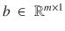

![$$ A=\left[\begin{array}{c}\hfill {c}_1^{(1)}{c}_1^{(2)}\dots .\ {c}_1^{(n)}\hfill \\ {}\hfill {c}_2^{(1)}{c}_2^{(2)}\dots .\ {c}_2^{(n)}\hfill \\ {}\hfill .\hfill \\ {}\hfill .\hfill \\ {}\hfill .\hfill \\ {}\hfill {c}_m^{(1)}{c}_m^{(2)}\dots .\ {c}_m^{(n)}\hfill \end{array}\right]x=\kern0.5em \left[\begin{array}{c}\hfill {x}_1\hfill \\ {}\hfill {x}_2\hfill \\ {}\hfill .\hfill \\ {}\hfill .\hfill \\ {}\hfill .\hfill \\ {}\hfill {x}_n\hfill \end{array}\right] $$](A448418_1_En_1_Chapter_Equp.gif)

a 由 n 个列向量组成。

T2

T4![$$ b = Ax = \kern0.5em \left[{c}^{(1)}{c}^{(2)}{c}^{(3)} \dots .\ {c}^{(n)}\right]\left[\begin{array}{c}\hfill {x}_1\hfill \\ {}\hfill {x}_2\hfill \\ {}\hfill .\hfill \\ {}\hfill .\hfill \\ {}\hfill .\hfill \\ {}\hfill {x}_n\hfill \end{array}\right] = {x}_1{c}^{(1)} + {x}_2{c}^{(2)} + \dots .. + {x}_n{c}^{(n)} $$](A448418_1_En_1_Chapter_Equr.gif)T6】

正如我们所看到的，乘积只不过是矩阵 A 的列向量的线性组合，向量 x 的分量是线性系数。

通过乘法形成的新向量 b 具有与 A 的列向量相同的维数，并且停留在相同的列空间中。这是如此美丽的事实；无论我们如何组合列向量，我们永远不能离开列向量所跨越的空间。

现在，让我们来看一个例子。

![$$ A = \left[\begin{array}{ccc}\hfill 1\hfill & \hfill 2\hfill & \hfill 3\hfill \\ {}\hfill 4\hfill & \hfill 5\hfill & \hfill 6\hfill \end{array}\right]\kern1.25em x = \left[\begin{array}{c}\hfill 2\hfill \\ {}\hfill 2\hfill \\ {}\hfill 3\hfill \end{array}\right]\kern2.5em b= Ax=2\left[\begin{array}{c}\hfill 1\hfill \\ {}\hfill 4\hfill \end{array}\right]+2\left[\begin{array}{c}\hfill 2\hfill \\ {}\hfill 5\hfill \end{array}\right]+3\left[\begin{array}{c}\hfill 3\hfill \\ {}\hfill 6\hfill \end{array}\right] = \left[\begin{array}{c}\hfill 15\hfill \\ {}\hfill 36\hfill \end{array}\right] $$](A448418_1_En_1_Chapter_Equs.gif)T2】

正如我们所见，A 和的列向量

### 向量的线性无关性

如果一个向量可以表示为其他向量的线性组合，则称该向量线性依赖于其他向量。

如果，那么 v 1 ，v 2 和 v 3 不是线性独立的，因为它们中的至少一个可以表示为其他向量的和。一般来说，一组 n 个向量被称为线性无关，当且仅当暗示每个。

如果而不是所有的，那么向量不是线性独立的。

给定一组向量，下面的方法可以用来检查它们是否线性无关。

 = 0 可以写成

![$$ \left[{v}_1{v}_2\ ....\ {v}_n\right]\left[\begin{array}{c}\hfill {a}_1\hfill \\ {}\hfill {a}_2\hfill \\ {}\hfill .\hfill \\ {}\hfill .\hfill \\ {}\hfill {a}_n\hfill \end{array}\right]\kern1.25em = 0\ where\kern0.5em {v}_i\ \in\ {\mathrm{\mathbb{R}}}^{m\times 1}\ \forall i\ \in \left\{1,2,.\ .\ .,n\right\}, \kern0.5em \left[\begin{array}{c}\hfill {a}_1\hfill \\ {}\hfill {a}_2\hfill \\ {}\hfill .\hfill \\ {}\hfill .\hfill \\ {}\hfill {a}_n\hfill \end{array}\right]\ \in\ {\mathrm{\mathbb{R}}}^{n\times 1} $$](A448418_1_En_1_Chapter_Equt.gif)

求解一个 1 一个 2 ....anT，如果我们得到的唯一解是零向量，那么向量集合 v 1 ，v 2 ，…。v n 据说是线性无关的。

如果一组 n 个向量是线性无关的，那么这些向量跨越整个 n 维空间。换句话说，通过取 n 个向量的线性组合，可以产生 n 维空间中所有可能的向量。如果 n 个向量不是线性独立的，那么它们只跨越 n 维空间中的一个子空间。

为了说明这个事实，让我们以三维空间中的向量为例，如图 [1-5](#Fig6) 所示。

如果我们有一个向量![$$ {v}_1 = {\left[1\ 2\ 3\right]}^T $$](A448418_1_En_1_Chapter_IEq39.gif)，我们可以在三维空间中只跨越一个维度，因为可以用这个向量形成的所有向量将具有与 v 1 相同的方向，其大小由定标器乘法器确定。换句话说，每个向量都是 a  1  v 1 的形式。

现在，让我们取另一个向量![$$ {v}_2 = {\left[\ 5\ 9\ 7\ \right]}^T $$](A448418_1_En_1_Chapter_IEq40.gif)，它的方向和 v 1 的方向不一样。所以，两个向量 span 的跨度(v 1 ，v 2 )无非是 v 1 和 v 2 的线性组合。有了这两个向量，我们可以形成位于这两个向量平面内的任何形式的向量。基本上，我们会在三维空间内跨越一个二维子空间。下图对此进行了说明。

图 1-5

A two-dimensional subspace spanned by v 1 and v 2 in a three-dimensional vector space

让我们添加另一个向量![$$ {v}_3 = {\left[\ 4\ 8\ 1\right]}^T $$](A448418_1_En_1_Chapter_IEq42.gif)到我们的向量集中。现在，如果我们考虑跨度(v 1 ，v  2， v 3 )，就可以在三维平面上形成任意矢量。你取任意一个三维向量，它可以表示为前面三个向量的线性组合。

这三个矢量构成了三维空间的基础。任何三个线性独立的向量将形成三维空间的基础。这同样可以推广到任何 n 维空间。

如果我们取一个向量 v 3 ，它是 v 1 和 v 2 的线性组合，那么它不可能跨越整个三维空间。我们将被限制在由 v 1 和 v 2 构成的二维子空间中。

### 矩阵的秩

线性代数中最重要的概念之一是矩阵的秩。矩阵的秩是线性独立的列向量或行向量的数目。对于一个矩阵，独立列向量的数量总是等于独立行向量的数量。

示例-考虑矩阵![$$ A = \left[\begin{array}{ccc}\hfill 1\hfill & \hfill 3\hfill & \hfill 4\hfill \\ {}\hfill 2\hfill & \hfill 5\hfill & \hfill 7\hfill \\ {}\hfill 3\hfill & \hfill 7\hfill & \hfill 10\hfill \end{array}\right] $$](A448418_1_En_1_Chapter_IEq43.gif)

列向量![$$ \left[\begin{array}{c}\hfill 1\hfill \\ {}\hfill 2\hfill \\ {}\hfill 3\hfill \end{array}\right] $$](A448418_1_En_1_Chapter_IEq44.gif)和![$$ \left[\begin{array}{c}\hfill 3\hfill \\ {}\hfill 5\hfill \\ {}\hfill 7\hfill \end{array}\right] $$](A448418_1_En_1_Chapter_IEq45.gif)线性无关。然而，![$$ \left[\begin{array}{c}\hfill 4\hfill \\ {}\hfill 7\hfill \\ {}\hfill 10\hfill \end{array}\right] $$](A448418_1_En_1_Chapter_IEq46.gif)不是线性独立的，因为它是另外两个列向量的线性组合；即![$$ \left[\begin{array}{c}\hfill 4\hfill \\ {}\hfill 7\hfill \\ {}\hfill 10\hfill \end{array}\right] = \left[\begin{array}{c}\hfill 1\hfill \\ {}\hfill 2\hfill \\ {}\hfill 3\hfill \end{array}\right]+\left[\begin{array}{c}\hfill 3\hfill \\ {}\hfill 5\hfill \\ {}\hfill 7\hfill \end{array}\right] $$](A448418_1_En_1_Chapter_IEq47.gif)。因此，矩阵的秩是 2，因为它有两个线性独立的列向量。

由于矩阵的秩是 22，矩阵的列向量只能跨越三个三维向量空间内的两个二维子空间。二维子空间就是取![$$ \left[\begin{array}{c}\hfill 1\hfill \\ {}\hfill 2\hfill \\ {}\hfill 3\hfill \end{array}\right] $$](A448418_1_En_1_Chapter_IEq48.gif)和![$$ \left[\begin{array}{c}\hfill 3\hfill \\ {}\hfill 5\hfill \\ {}\hfill 7\hfill \end{array}\right] $$](A448418_1_En_1_Chapter_IEq49.gif)的线性组合可以形成的子空间。

一些重要注意事项:

*   如果 A 的秩为 n，则称方阵是满秩的。秩为 n 的方阵意味着所有 n 个列向量甚至 n 个行向量都是线性独立的，因此可以通过对矩阵 A 的 n 个列向量进行线性组合来跨越整个 n 维空间
*   如果一个方阵不是满秩的，那么它就是奇异矩阵；即，它的所有列向量或行向量不是线性独立的。奇异矩阵有一个未定义的逆矩阵和零行列式。

### 单位矩阵或算子

如果任何向量或矩阵乘以 I 后保持不变，则称矩阵为单位矩阵或算子。一个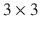单位矩阵由

![$$ I = \left[\begin{array}{ccc}\hfill 1\hfill & \hfill 0\hfill & \hfill 0\hfill \\ {}\hfill 0\hfill & \hfill 1\hfill & \hfill 0\hfill \\ {}\hfill 0\hfill & \hfill 0\hfill & \hfill 1\hfill \end{array}\right]\kern0.5em \in\ {\mathrm{\mathbb{R}}}^{3\times 3} $$](A448418_1_En_1_Chapter_Equu.gif)

给出

比方说我们取矢量![$$ v = {\left[2\ 3\ 4\right]}^T $$](A448418_1_En_1_Chapter_IEq54.gif)

![$$ Iv = \left[\begin{array}{ccc}\hfill 1\hfill & \hfill 0\hfill & \hfill 0\hfill \\ {}\hfill 0\hfill & \hfill 1\hfill & \hfill 0\hfill \\ {}\hfill 0\hfill & \hfill 0\hfill & \hfill 1\hfill \end{array}\right]\left[\begin{array}{c}\hfill 2\hfill \\ {}\hfill 3\hfill \\ {}\hfill 4\hfill \end{array}\right]=\kern0.5em \left[\begin{array}{c}\hfill 2\hfill \\ {}\hfill 3\hfill \\ {}\hfill 4\hfill \end{array}\right] $$](A448418_1_En_1_Chapter_Equv.gif)

类似地，假设我们有一个矩阵![$$ A = \left[\begin{array}{ccc}\hfill 1\hfill & \hfill 2\hfill & \hfill 3\hfill \\ {}\hfill 4\hfill & \hfill 5\hfill & \hfill 6\hfill \\ {}\hfill 7\hfill & \hfill 8\hfill & \hfill 9\hfill \end{array}\right] $$](A448418_1_En_1_Chapter_IEq55.gif)

矩阵 AI 和 IA 都等于矩阵 a。因此，当矩阵之一是单位矩阵时，矩阵乘法是可交换的。

### 矩阵的行列式

方阵 A 的行列式是一个数，用 det(A)表示。它可以有几种解释。对于矩阵，行列式表示由矩阵的 n 个 nrow 向量包围的维体积。对于非零的行列式，a 的所有列向量或行向量应该是线性无关的。如果 n 个 nrow 向量或 column 向量不是线性独立的，那么它们不会跨越整个 n n 维空间，而是跨越维数小于 n 的子空间，因此 nn 维体积为零。对于一个矩阵，行列式表示为

![$$ A = \left[\begin{array}{cc}\hfill {a}_{11}\hfill & \hfill {a}_{12}\hfill \\ {}\hfill {a}_{21}\hfill & \hfill {a}_{22}\hfill \end{array}\right]\ \in\ {\mathrm{\mathbb{R}}}^{2\times 2} $$](A448418_1_En_1_Chapter_Equw.gif)

同样，对于一个矩阵来说，矩阵的行列式由

![$$ B = \left[\begin{array}{ccc}\hfill {a}_{11}\hfill & \hfill {a}_{12}\hfill & \hfill {a}_{13}\hfill \\ {}\hfill {a}_{21}\hfill & \hfill {a}_{22}\hfill & \hfill {a}_{23}\hfill \\ {}\hfill {a}_{31}\hfill & \hfill {a}_{32}\hfill & \hfill {a}_{33}\hfill \end{array}\right]\ \in\ {\mathrm{\mathbb{R}}}^{3\times 3} $$](A448418_1_En_1_Chapter_Equy.gif)

![$$ \det \left(\left[\begin{array}{cc}\hfill {a}_{22}\hfill & \hfill {a}_{23}\hfill \\ {}\hfill {a}_{32}\hfill & \hfill {a}_{33}\hfill \end{array}\right]\right) = \left|\begin{array}{cc}\hfill {a}_{22}\hfill & \hfill {a}_{23}\hfill \\ {}\hfill {a}_{32}\hfill & \hfill {a}_{33}\hfill \end{array}\right| $$](A448418_1_En_1_Chapter_Equ2.gif)

(其中)

行列式计算的方法可以推广到矩阵。把 B 看成一个 n 维矩阵，它的行列式可以表示为

![$$ det(B) = \left[\begin{array}{ccc}\hfill {a}_{11} \times \hfill & \hfill \hfill & \hfill \hfill \\ {}\hfill \hfill & \hfill {a}_{22}\hfill & \hfill {a}_{23}\hfill \\ {}\hfill \hfill & \hfill {a}_{32}\hfill & \hfill {a}_{33}\hfill \end{array}\right]-\left[\begin{array}{ccc}\hfill \hfill & \hfill {a}_{12\kern0.5em \times}\hfill & \hfill \hfill \\ {}\hfill {a}_{21}\hfill & \hfill \hfill & \hfill {a}_{23}\hfill \\ {}\hfill {a}_{31}\hfill & \hfill \hfill & \hfill {a}_{33}\hfill \end{array}\right] + \left[\begin{array}{ccc}\hfill \hfill & \hfill \hfill & \hfill {a}_{13\kern0.5em \times \kern0.75em }\hfill \\ {}\hfill {a}_{21}\hfill & \hfill {a}_{22}\hfill & \hfill \hfill \\ {}\hfill {a}_{31}\hfill & \hfill {a}_{32}\hfill & \hfill \hfill \end{array}\right] $$](A448418_1_En_1_Chapter_Equaa.gif)

例如，矩阵![$$ A = \left[\begin{array}{ccc}\hfill 6\hfill & \hfill 1\hfill & \hfill 1\hfill \\ {}\hfill 4\hfill & \hfill -2\hfill & \hfill 5\hfill \\ {}\hfill 2\hfill & \hfill 8\hfill & \hfill 7\hfill \end{array}\right] $$](A448418_1_En_1_Chapter_IEq61.gif)的行列式可以计算如下:

![$$ \begin{array}{l} det(A)=\left[\begin{array}{ccc}\hfill 6 \times \hfill & \hfill \hfill & \hfill \hfill \\ {}\hfill \hfill & \hfill -2\hfill & \hfill 5\hfill \\ {}\hfill \hfill & \hfill 8\hfill & \hfill 7\hfill \end{array}\right]-\left[\begin{array}{ccc}\hfill \hfill & \hfill 1 \times \hfill & \hfill \hfill \\ {}\hfill 4\hfill & \hfill \hfill & \hfill 5\hfill \\ {}\hfill 2\hfill & \hfill \hfill & \hfill 7\hfill \end{array}\right] + \left[\begin{array}{ccc}\hfill \hfill & \hfill \hfill & \hfill 1 \times \hfill \\ {}\hfill 4\hfill & \hfill -2\hfill & \hfill \hfill \\ {}\hfill 2\hfill & \hfill 8\hfill & \hfill \hfill \end{array}\right]\\ {}\kern5.5em =6\times \left|\begin{array}{cc}\hfill -2\hfill & \hfill 5\hfill \\ {}\hfill 8\hfill & \hfill 7\hfill \end{array}\right|-1\times \left|\begin{array}{cc}\hfill 4\hfill & \hfill 5\hfill \\ {}\hfill 2\hfill & \hfill 7\hfill \end{array}\right| + 1\times \left|\begin{array}{cc}\hfill 4\hfill & \hfill -2\hfill \\ {}\hfill 2\hfill & \hfill \kern0.75em 8\hfill \end{array}\right|=6\left(-14-40\right)-1\left(28-10\right)+1\left(32+4\right)\\ {}\kern3.25em =6\times \left(-54\right)-1(18)+36 = -306\end{array} $$](A448418_1_En_1_Chapter_Equab.gif)

#### 行列式的解释

如前所述，矩阵行列式的绝对值决定了作为边的行向量所包围的体积。

对于矩阵，表示以两行向量为边的平行四边形的面积。

对于矩阵![$$ A=\left[\begin{array}{cc}\hfill a\hfill & \hfill b\hfill \\ {}\hfill c\hfill & \hfill d\hfill \end{array}\right] $$](A448418_1_En_1_Chapter_IEq63.gif)，det(A)等于以矢量![$$ u = {\left[a\ b\right]}^T $$](A448418_1_En_1_Chapter_IEq64.gif)和![$$ v = {\left[\ c\ d\right]}^T $$](A448418_1_En_1_Chapter_IEq65.gif)为边的平行四边形的面积。

平行四边形的面积= |u||v| sin θ其中θθ是 u 和 v 之间的角度(见图 [1-6](#Fig7) )。【T2

图 1-6

Parallelogram formed by two vectors

同样，对于一个矩阵，行列式是以三行向量为边的平行六面体的体积。

### 矩阵的逆

方阵的逆矩阵由表示，当乘以 A.

时产生单位矩阵

并非所有方阵对 A 都有逆，计算 A 的逆的公式如下:

如果方阵是奇异的——也就是说，如果 A 没有 n 个独立的列或行向量——那么 A 的逆就不存在。这是因为对于奇异矩阵而言，逆矩阵变得不确定。【T2![$$ A = \left[\begin{array}{ccc}\hfill a\hfill & \hfill b\hfill & \hfill c\hfill \\ {}\hfill d\hfill & \hfill e\hfill & \hfill f\hfill \\ {}\hfill g\hfill & \hfill h\hfill & \hfill i\hfill \end{array}\right] $$](A448418_1_En_1_Chapter_Equaf.gif)

设 A 的元素由 a ij 表示，其中 I 表示元素的行号，j 表示元素的列号。

然后，的余因子，其中 d ij 是从 a 中删除第 I 行和第 j 列形成的矩阵的行列式

元素的余因子。

类似地，元素的余因子。

一旦余因子矩阵形成，余因子矩阵的转置将给出伴随矩阵(A)。伴随(A)除以 det(A)得到。

例如，![$$ A = \left[\begin{array}{cc}\hfill 4\hfill & \hfill 3\hfill \\ {}\hfill 3\hfill & \hfill 2\hfill \end{array}\right] $$](A448418_1_En_1_Chapter_IEq76.gif)的逆矩阵可以计算如下:

![$$ A = \left[\begin{array}{cc}\hfill 1(2)\hfill & \hfill -1(3)\hfill \\ {}\hfill -1(3)\hfill & \hfill 1(4)\hfill \end{array}\right]=\left[\begin{array}{cc}\hfill 2\hfill & \hfill -3\hfill \\ {}\hfill -3\hfill & \hfill 4\hfill \end{array}\right] $$](A448418_1_En_1_Chapter_IEq77.gif)的余因子矩阵

因此，![$$ {A}^{-1} = \frac{{\left( cofactor\ matrix\ of\ A\right)}^T}{ \det (A)}=\kern0.5em \frac{{\left[\begin{array}{cc}\hfill 2\hfill & \hfill -3\hfill \\ {}\hfill -3\hfill & \hfill 4\hfill \end{array}\right]}^T}{-1} = \left[\begin{array}{cc}\hfill -2\hfill & \hfill 3\hfill \\ {}\hfill 3\hfill & \hfill -4\hfill \end{array}\right] $$](A448418_1_En_1_Chapter_IEq79.gif)。

矩阵求逆的几个规则:

*   ，其中是单位矩阵

### 向量的范数

向量的范数是其大小的度量。这样的规范有好几种。最熟悉的是欧几里德范数，定义如下。也被称为 l 2 范数。

对于一个向量l2范数如下:

同样，l 1 范数是矢量分量的绝对值之和。【T2

一般来说，当 1 < p < ∞:

时，向量的 l p 范数可以定义如下

当则范数称为上确界范数，定义如下:

在图 [1-7](#Fig8) 中，绘制了 l 1 ，l 2 和上确界范数的单位范数曲线。

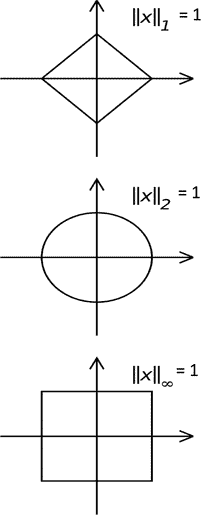

图 1-7

Unit l 1,l 2 and Supremum norms of vectors 

一般来说，对于机器学习，我们出于多种目的使用 l 2 和 l 1 规范。例如，我们在线性回归中使用的最小二乘成本函数是误差向量的 l 2 范数；即实际目标值向量和预测目标值向量之间的差。类似地，我们经常不得不对我们的模型使用正则化，结果是模型不能很好地适应训练数据，并且不能推广到新的数据。为了实现正则化，我们通常添加模型的参数向量的 l 2 范数或 l 1 范数的平方，作为模型的成本函数中的惩罚。当参数向量的 l 2 范数用于正则化时，通常称为脊正则化，而当使用 l 1 范数时，称为 Lasso 正则化。

### 矩阵的伪逆

如果我们有一个问题，其中提供了和，并且要求我们求解，如果 A 不是奇异的并且它的逆存在，我们可以求解 x 为。

然而，如果——也就是说，如果 A 是一个矩形矩阵，而——那么不存在，因此我们不能用前面的方法求解 x。在这种情况下，我们可以得到一个最优解，如。矩阵被称为伪逆，因为它作为逆来提供最优解。这种伪逆将出现在最小二乘技术中，例如线性回归。

### 特定向量方向的单位向量

特定向量方向的单位向量是向量除以其大小或范数。对于一个欧几里得空间，也叫 l 2 空间，矢量![$$ x = {\left[3\ 4\right]}^T $$](A448418_1_En_1_Chapter_IEq94.gif)方向的单位矢量是

![$$ \frac{x}{x_2} = \frac{x}{{\left({x}^Tx\right)}^{1/2}}=\kern0.75em \frac{{\left[3\ 4\right]}^T}{5} = {\left[0.6\ 0.8\right]}^T $$](A448418_1_En_1_Chapter_Equam.gif)T5】

### 一个矢量在另一个矢量方向上的投影

向量 v 1 在 v 2 方向的投影是 v 1 与 v 2 方向的单位向量的点积。

，其中‖v 12 是 v 1 在 v 2 上的投影，u 2 是 v 2 方向的单位矢量。

由于根据单位矢量的定义，投影也可以表示为

 = 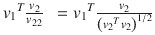

比如向量[1 1] T 在向量[3 4] T 方向的投影就是[1 1] T 与单位向量[3 4] T 方向的点积；即之前计算的[0.6±0.8]T。

所需投影= ![$$ {\left[1\ 1\right]}^T\left[\begin{array}{c}\hfill 0.6\hfill \\ {}\hfill 0.8\hfill \end{array}\right]=1\times 0.6+1\times 0.8=1.4 $$](A448418_1_En_1_Chapter_IEq99.gif)。

图 1-8

The length of the projection of the vector v 1 onto v 2

在图 [1-8](#Fig9) 中，线段 OA 的长度给出了矢量 v 1 在 v 2 上的投影长度。

### 特征向量

这里我们来了解线性代数中最重要的概念之一——特征向量和特征值。特征值和特征向量出现在机器学习的几个领域。例如，主成分分析中的主成分是协方差矩阵的特征向量，而特征值是沿着主成分的协方差。类似地，在 Google 的页面排名算法中，页面排名分数的向量只不过是对应于特征值 1 的页面转移概率矩阵的特征向量。

矩阵作为算子作用于向量。矩阵对向量的操作是根据矩阵维数将向量转换成另一个向量，该向量的维数可能与原始向量的维数相同，也可能不同。

当矩阵作用于向量时，我们再次得到向量。通常，新向量的大小和方向与原始向量不同。如果在这种情况下，新生成的向量与原始向量方向相同或正好相反，那么在这种方向上的任何向量都称为本征向量。向量被拉伸的幅度称为特征值(见图 [1-9](#Fig10) )。

其中 A 是通过乘法对向量 v 进行运算的矩阵算子，向量 v 也是本征向量，λ是本征值。

图 1-10

The famous Mona Lisa image has a transformation applied to the vector space of pixel location.

图 1-9

Eigen vector unaffected by the matrix transformation A

从图 [1-10](#Fig11) 可以看出，当对图像空间进行变换时，向量所代表的水平轴上的像素改变了方向，而水平方向上的像素向量没有改变方向。因此，沿水平轴的像素向量是应用于蒙娜丽莎图像的矩阵变换的特征向量。

#### 矩阵的特征方程

矩阵特征方程的根给出了矩阵的特征值。对于 n 阶方阵，将有对应于 n 个特征向量的 n 个特征值

对于对应于λ特征值的特征向量，我们有

现在，作为特征向量的 v 是非零的，因此必须是奇异的，前面的才成立。

因为是奇异的，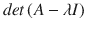 = 0，这是矩阵 a 的特征方程。特征方程的根给出了特征值。将本征值代入方程，然后求解 v，得到与本征值对应的本征向量。

例如矩阵

![$$ A = \left[\begin{array}{cc}\hfill 0\hfill & \hfill 1\hfill \\ {}\hfill -2\hfill & \hfill -3\hfill \end{array}\right] $$](A448418_1_En_1_Chapter_Equaq.gif)

的特征值和特征向量

可以如下图所示进行计算。

矩阵 A 的特征方程是。

两个特征值是和。

设的特征值对应的特征向量为![$$ u = {\left[a\ b\right]}^T $$](A448418_1_En_1_Chapter_IEq113.gif)。【T2![$$ \left[\begin{array}{cc}\hfill 0\hfill & \hfill 1\hfill \\ {}\hfill -2\hfill & \hfill -3\hfill \end{array}\right]\left[\begin{array}{c}\hfill a\hfill \\ {}\hfill b\hfill \end{array}\right] = -2\left[\begin{array}{c}\hfill a\hfill \\ {}\hfill b\hfill \end{array}\right] $$](A448418_1_En_1_Chapter_Equas.gif)

这给了我们以下两个等式:

两个方程是相同的；即。

设和，其中 k 1 为常数。

所以特征值-2 对应的特征向量是![$$ u = {k}_1\left[\begin{array}{c}\hfill 1\hfill \\ {}\hfill - 2\hfill \end{array}\right] $$](A448418_1_En_1_Chapter_IEq117.gif)。

用同样的过程，对应于特征值的特征向量 v 就是![$$ v = {k}_2\left[\begin{array}{c}\hfill 1\hfill \\ {}\hfill - 1\hfill \end{array}\right] $$](A448418_1_En_1_Chapter_IEq119.gif)。

需要注意的一点是，本征向量和本征值总是与在向量空间上工作的特定算子(在前面的例子中，矩阵 A 是算子)相关。特征值和特征向量不特定于任何向量空间。

函数可以被视为向量。假设我们有一个函数。

x 的无限值中的每一个都是一个维度，在这些值上计算的 f(x)的值是沿着该维度的向量分量。所以我们会得到一个无限的向量空间。

现在，让我们看看微分算子。

T2】

这里，是算符，e ax 是关于算符的本征函数，而 a 是相应的本征值。

如前所述，本征向量和本征值的应用在几乎任何领域都是深远的，对于机器学习也是如此。为了了解特征向量是如何影响现代应用程序的，我们将在一个简单的环境中查看 Google 页面排序算法。

让我们看看一个简单网站的页面排序算法，这个网站有三个页面——A、B 和 C——如图 [1-11](#Fig12) 所示。

图 1-11

Transition probability diagram for three pages A, B, and C

在 web 设置中，如果原始页面有到下一个页面的链接，用户可以从一个页面跳到另一个页面。此外，一个页面可以自我引用，并有一个链接到自己。因此，如果用户因为页面 A 引用页面 B 而从页面 A 转到页面 B，则事件可以用 B/A 来表示。P(B/A)可以通过从页面 A 访问页面 B 的总次数除以访问页面 A 的总次数来计算。可以类似地计算所有页面组合的转移概率。因为概率是通过归一化计数来计算的，所以页面的个体概率将承载页面重要性的本质。

在稳定状态下，每一页的概率将变成常数。我们需要根据转移概率计算每页的稳态概率。

对于任何页面在稳定状态下保持不变的概率，出去的概率质量应该等于进来的概率质量，并且它们中的每一个——当与留在页面中的概率质量相加时——应该等于该页面的概率。在这种情况下，如果我们考虑 A 页周围的平衡方程，离开 A 的概率质量是，而进入 A 的概率质量是。概率质量 P(A/A)P(A)保持在 A 本身。因此，在平衡状态下，来自外界的概率质量——即——和留在 A 处的概率质量——即 P(A/A)P(A)——之和应该等于 P(A)，如下所示:

【1】

类似地，如果我们考虑页 B 和 C 周围的均衡，以下成立:

(2)

(3)

现在是线性代数部分。我们可以把这三个方程排列成一个矩阵作用于一个向量，如下:

![$$ \left[\begin{array}{ccc}\hfill P\left(A/A\right)\hfill & \hfill P\left(A/B\right)\hfill & \hfill P\left(A/C\right)\hfill \\ {}\hfill P\left(B/A\right)\hfill & \hfill P\left(B/B\right)\hfill & \hfill P\left(B/C\right)\hfill \\ {}\hfill P\left(C/A\right)\hfill & \hfill P\left(C/B\right)\hfill & \hfill P\left(C/C\right)\hfill \end{array}\right]\left[\begin{array}{c}\hfill P(A)\hfill \\ {}\hfill P(B)\hfill \\ {}\hfill P(C)\hfill \end{array}\right] = \left[\begin{array}{c}\hfill P(A)\hfill \\ {}\hfill P(B)\hfill \\ {}\hfill P(C)\hfill \end{array}\right] $$](A448418_1_En_1_Chapter_Equaw.gif)

转移概率矩阵作用于页面概率向量，以再次产生页面概率向量。正如我们所看到的，页面概率向量只不过是页面转移概率矩阵的一个本征向量，并且其对应的本征值是 1。

因此，计算对应于特征值 1 的特征向量将会给我们页面概率向量，该向量反过来可以用于对页面进行排序。一些知名搜索引擎的页面排序算法也是基于同样的原理。当然，搜索引擎的实际算法对这个天真的模型做了一些修改，但是基本概念是相同的。概率向量可以通过幂迭代等方法来确定，这将在下一节中讨论。

#### 计算特征向量的幂迭代法

幂迭代法是一种迭代技术，用于计算与最大幅度特征值对应的矩阵的特征向量。

设然后设 n 个特征值按数量级为 > λ n 对应的特征向量为 > v n 。

幂迭代从随机向量 v 开始，其在对应于最大特征值的特征向量的方向上应该具有一些分量；即 v 1 。

任意迭代中的近似特征向量由

给出

经过足够次数的迭代后，收敛到 v 1 。在每次迭代中，我们将矩阵 A 乘以上一步得到的向量。如果我们在迭代法中去掉向量的归一化将其转换为单位向量，我们就有了。

让初始向量 v 表示为本征向量的组合:

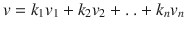其中为常数。【T2

现在，当 k 足够大时，即()，从

开始，除第一项之外的所有项都将消失

因此，，它给我们最大幅度的特征值对应的特征向量。收敛速度取决于第二大特征值与最大特征值相比的大小。如果第二大特征值在量值上接近最大特征值，则该方法收敛缓慢。

Note

在这一章中，我已经谈到了线性代数的基础，以便不熟悉这一学科的读者有一个起点。然而，我建议读者在业余时间更详细地学习线性代数。著名教授 Gilbert Strang 的书《线性代数及其应用》是一个很好的开始。

## 结石

最简单的形式，微积分是数学的一个分支，处理函数的微分和积分。出于几个原因，很好地理解微积分对机器学习很重要:

*   不同的机器学习模型被表示为几个变量的函数。
*   为了构建机器学习模型，我们通常基于数据和模型参数来计算模型的成本函数，并且通过优化成本函数，我们导出最好地解释给定数据的模型参数。

### 区别

一个函数的微分通常意味着一个函数所代表的量相对于该函数所依赖的另一个量的变化率。

让我们假设一个粒子在一维平面上运动——即直线——并且它在任何特定时间的距离由函数定义

质点在任一特定时间的速度，将由函数对时间 t 的导数给出。

函数的导数定义为，通常根据方便的情况用以下公式表示:

或者

当我们处理一个依赖于多个变量的函数时，函数对保持其他变量不变的每个变量的导数称为偏导数，偏导数的向量称为函数的梯度。

假设房子的价格 z 取决于两个变量:房子的平方英尺面积 x 和卧室数量 y。

z 相对于 x 的偏导数用

表示

同样，z 关于 y 的偏导数是

请记住，在偏导数中，除了导数涉及的变量外，其他变量都保持不变。

### 函数的梯度

对于一个有两个变量的函数，偏导数的向量![$$ {\left[\begin{array}{cc}\hfill \frac{\partial z}{\partial x}\hfill & \hfill \frac{\partial z}{\partial y}\hfill \end{array}\right]}^T $$](A448418_1_En_1_Chapter_IEq137.gif)称为函数的梯度，用表示。这同样可以推广到具有 n 个变量的函数。一个多元函数 f(x 1 ，x 2 ，..，x n 也可以表示为 f(x)，其中![$$ x={\left[{x}_1,{x}_2\dots .{x}_n\right]}^T\in {\mathrm{\mathbb{R}}}^{n\times 1} $$](A448418_1_En_1_Chapter_IEq139.gif)。多元函数 f(x)相对于 x 的梯度向量可以表示为![$$ \nabla f={\left[\frac{\partial f}{\partial {x}_1}\ \frac{\partial f}{\partial {x}_2}\dots \dots \frac{\partial f}{\partial {x}_n}\right]}^T $$](A448418_1_En_1_Chapter_IEq140.gif)。

比如一个三变量的函数的梯度由

![$$ \nabla f={\left[1\ 2y\ 3{z}^2\right]}^T $$](A448418_1_En_1_Chapter_Equbf.gif)

给出

当我们试图最大化或最小化关于模型参数的成本函数时，梯度和偏导数在机器学习算法中是重要的，因为在最大值和最小值处，函数的梯度向量为零。在函数的最大值和最小值处，函数的梯度向量应该为零向量。

### 连续偏导数

我们可以得到一个函数对多个变量的连续偏导数。例如，对于一个函数

这是 z 首先对 x，然后对 y 的偏导数。

同样，

如果二阶导数是连续的，那么偏导数的顺序与

无关

### 函数的 Hessian 矩阵

多元函数的 Hessian 是二阶偏导数的矩阵。对于函数 f(x，y，z)，海森定义如下:

![$$ Hf = \left[\begin{array}{ccc}\hfill \frac{\delta^2f}{\delta {x}^2}\hfill & \hfill \frac{\delta^2f}{\delta x\delta y}\hfill & \hfill \frac{\delta^2f}{\delta x\delta z}\hfill \\ {}\hfill \frac{\delta^2f}{\delta y\delta x}\hfill & \hfill \frac{\delta^2f}{\delta {y}^2}\hfill & \hfill \frac{\delta^2f}{\delta y\delta z}\hfill \\ {}\hfill \frac{\delta^2f}{\delta z\delta x}\hfill & \hfill \frac{\delta^2f}{\delta z\delta y}\hfill & \hfill \frac{\delta^2f}{\delta {z}^2}\hfill \end{array}\right] $$](A448418_1_En_1_Chapter_Equbj.gif)

Hessian 在我们在机器学习领域经常遇到的优化问题中非常有用。例如，在最小化成本函数以得到一组模型参数的过程中，Hessian 被用于获得下一组参数值的更好的估计，特别是如果成本函数本质上是非线性的。非线性优化技术，如牛顿法、Broyden-Fletcher-gold farb-Shanno(BFGS)及其变体，使用 Hessian 来最小化成本函数。

### 函数的最大值和最小值

评估函数的最大值和最小值在机器学习中有巨大的应用。在监督和非监督学习中，建立机器学习模型依赖于最小化成本函数或最大化似然函数、熵等。

#### 一元函数的最大值和最小值规则

*   f(x)对 tox 的导数在最大值和最小值处为零。
*   f(x)的二阶导数，无非是用表示的一阶导数的导数，需要在一阶导数为零的点上考察。如果二阶导数小于零，那么它是一个最大值点，而如果它大于零，它是一个最小值点。如果二阶导数也是零，那么这个点就叫做拐点。

就拿一个很简单的函数来说，。如果我们对函数 w . r . t xan 求导，并将其设为零，我们得到，这就给出了。还有，二阶导数。因此，对于 x 的所有值，包括，二阶导数大于零，因此是函数 f(x)的最小值点。

让我们对做同样的练习。

给了我们。二阶导数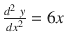，如果我们在求它，我们得到 0。所以，既不是函数 g(x)的极小点，也不是最大点。二阶导数为零的点称为拐点。在拐点处，曲率的符号发生变化。

一元函数的导数为零或多元函数的梯度向量为零的点称为驻点。它们可能是也可能不是最大值点或最小值点。

图 1-12

Different types of stationary points—maxima, minima, point of inflection

图 [1-12](#Fig13) 所示为不同种类的驻点；即最大值、最小值和拐点。

多元函数的最大值和最小值有点复杂。让我们从一个例子开始，然后我们将定义规则。我们看一个有两个变量的多元函数:

为了确定驻点，梯度向量需要为零。

![$$ {\left[\begin{array}{cc}\hfill \frac{\partial f}{\partial x}\hfill & \hfill \frac{\partial f}{\partial y}\hfill \end{array}\right]}^T = \left[\begin{array}{c}\hfill 0\hfill \\ {}\hfill 0\hfill \end{array}\right] $$](A448418_1_En_1_Chapter_Equbl.gif)T2】

将和设置为零，我们得到:

我们还需要计算黑森:

对于连续二阶导数的函数，。

假设在处梯度为零:

*   如果那么就是鞍点。
*   如果那么是极值点；即存在最大值或最小值。
    1.  如果，那么 f(x，y)在具有最大值。
    2.  如果和，那么 f(x，y)在处最小。
*   如果那么需要更先进的方法来正确地分类静止点。

对于具有 n 个变量的函数，以下是检查函数的最大值、最小值和鞍点的准则:

*   计算梯度，并将其设置为零向量，这将给出驻点列表。
*   对于一个驻点，如果函数在 x 0 处的海森矩阵既有正负特征值，那么 x 0 就是一个鞍点。如果 Hessian 矩阵的特征值都是正的，则平稳点是局部最小值，如果特征值都是负的，则平稳点是局部最大值。

### 局部最小值和全局最小值

函数可以有多个梯度为零的极小值，每个极小值称为局部极小点。函数具有最小值的局部极小值称为全局极小值。这同样适用于 maxima。函数的最大值和最小值是通过最优化方法得到的。由于封闭形式的解决方案并不总是可用的或者在计算上是难以处理的，所以最小值和最大值通常是通过迭代方法得到的，例如梯度下降、梯度上升等等。在推导最小值和最大值的迭代方式中，优化方法可能陷入局部最小值或最大值，而不能达到全局最小值或最大值。在迭代方法中，该算法利用函数在某一点的梯度来达到更优的点。当以这种方式遍历一系列点时，一旦遇到具有零梯度的点，算法就停止假设达到了期望的最小值或最大值。当函数存在全局最小值或最大值时，这种方法很有效。此外，优化也可能陷入鞍点。在所有这些情况下，我们都会有一个次优的模型。

图 1-13

Local and global minima/maxima

图 [1-13](#Fig14) 显示了函数的全局和局部最小值以及全局和局部最大值。

### 半正定和正定

方阵是正半定的，如果对于任何非零向量表达式矩阵 A 是正定的，如果表达式。半正定矩阵的所有特征值应该是非负的，而正定矩阵的特征值应该是正的。例如，如果我们将 A 视为单位矩阵，即![$$ \left[\begin{array}{cc}\hfill 1\hfill & \hfill 0\hfill \\ {}\hfill 0\hfill & \hfill 1\hfill \end{array}\right] $$](A448418_1_En_1_Chapter_IEq177.gif)，那么它就是正定的，因为它的两个特征值，即 1，1 都是正的。还有，如果我们计算 x  T  Ax，其中![$$ x = {\left[{x}_1\ {x}_2\right]}^T $$](A448418_1_En_1_Chapter_IEq178.gif)得到，对于非零向量 x 总是大于零，这就证实了 A 是正定矩阵。

### 凸集

一个点的集合称为凸的，如果给定任何两点 x 和 y 属于该集合，则连接从 x 到 y 的直线的所有点也属于该集合。在图 [1-14](#Fig15) 中，说明了一个凸集和一个非凸集。

图 1-14

Convex and non-convex set

### 凸函数

定义在凸集 D 上的函数 f(x ),其中和 D 是定义域，如果连接函数中任意两点的直线位于该函数的图形之上，则称该函数是凸的。数学上，这可以表示为:

![$$ f\left(tx + \left(1\ \hbox{--}\ t\right)y\right)\ \le\ tf(x) + \left(1 - t\right)f(y)\kern0.75em \forall\ x,y\kern0.5em \in\ D,\ \forall\ t\ \in\ \left[0,1\right] $$](A448418_1_En_1_Chapter_Equbr.gif)

对于两次连续可微的凸函数，在函数的定义域 D 中每一点上取值的函数的 Hessian 矩阵应该是半正定的；即对于任意矢量、

、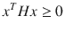、

凸函数的全局极小值是局部极小值。请记住，可以有一个以上的全局最小值，但在凸函数的每个全局最小值处，函数值是相同的。

在图 [1-15](#Fig16) 中，说明了凸函数 f(x)。正如我们所看到的，f(x)显然服从前面所述的凸函数的性质。

图 1-15

Convex function illustration

### 非凸函数

一个非凸函数可以有很多局部极小值，这些极小值并不都是全局极小值。

在我们试图通过最小化成本函数来学习模型参数的任何机器学习模型构建过程中，我们更喜欢成本函数是凸的，因为通过适当的优化技术，我们肯定会达到全局最小值。对于非凸成本函数，优化技术很有可能会停留在局部最小值或鞍点，因此它可能不会达到其全局最小值。

### 多元凸函数和非凸函数示例

由于我们将在深度学习中处理高维函数，因此查看具有两个变量的凸函数和非凸函数是有意义的。

是在处有最小值的凸函数，f(x，y)在处的最小值为。该功能绘制在图 [1-16](#Fig17) 中以供参考。

图 1-16

Plot of the convex function 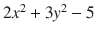

现在，让我们考虑函数。

前面是一个非凸函数，验证这一点最简单的方法就是看函数的海森矩阵:

![$$ \mathrm{Hessian}\kern0.5em H = \left[\begin{array}{cc}\hfill -\frac{1}{x^2}\hfill & \hfill 0\hfill \\ {}\hfill 0\hfill & \hfill \frac{1}{y^2}\hfill \end{array}\right] $$](A448418_1_En_1_Chapter_Equbt.gif)

黑森的特征值是和。对于实 x 总是负的。因此，Hessian 不是正半定的，使得函数非凸。

图 1-17

Plot of the Non-Convex function log(x/y)

我们可以在图 [1-17](#Fig18) 中看到，函数 log(x/y)的曲线看起来是非凸的。

通过最小二乘法的线性回归或通过对数损失成本函数(二元交叉熵)的逻辑回归都是凸优化问题，因此通过优化学习的模型参数是全局最小解。同样，在 SVM，我们优化的成本函数是凸的。

每当任何模型中包含隐藏层或潜在因素时，成本函数在本质上往往是非凸的。具有隐藏层的神经网络给出非凸的成本或误差表面，而不管我们是在解决回归还是分类问题。

类似地，在 K-均值聚类中，聚类的引入使得成本函数优化非凸成本函数。对于非凸成本函数，需要采用智能方法，以便在不可能达到全局最小值的情况下，我们可以达到一些足够好的局部最小值。

在处理非凸问题时，参数初始化变得非常重要。初始化参数越接近全局最小值或一些可接受的局部最小值越好。对于 k 均值，确保解不是次优的一种方法是用不同的随机初始化的模型参数运行 k 均值算法几次；即群集质心。然后，我们可以选择最大程度减少组内方差总和的一个。对于神经网络，需要使用涉及动量参数的高级梯度下降方法来摆脱局部最小值并向前移动。我们将在本书后面更详细地讨论基于梯度的神经网络优化方法。

### 泰勒级数

通过考虑函数及其导数在特定点的值，任何函数都可以表示为无穷和。函数的这种展开称为泰勒级数展开。一元函数围绕点 x 的泰勒级数展开可以表示为:

其中 f n (x)是函数 f(x)的 n 阶导数，n！表示数字 n 的阶乘。h 项与 x 项的维数相同，h 和 x 都是标量。

*   如果 f(x)是一个常数函数，那么所有的导数都是零并且和 f(x)是相同的。
*   如果函数在 x 的邻域内是线性的，那么对于任何位于线性区域内的点(，
*   如果函数在 x 的邻域内是二次的，那么对于位于二次区域内的任意点，。
*   泰勒级数展开在迭代方法中变得非常重要，例如优化的梯度下降法和牛顿法，以及积分和微分的数值方法。

围绕点的多元函数的泰勒级数展开可以表示为

高阶项

其中是梯度向量，而是函数 f(x)的 Hessian 矩阵。

通常，出于实际目的，我们不会在机器学习应用中超出二阶泰勒级数展开，因为在数值方法中它们很难计算。即使对于二阶展开计算，Hessian 也是成本密集型的，因此一些二阶优化方法依赖于从梯度计算近似 Hessian，而不是直接评估它们。请注意，三阶导数对象将是一个三维张量。

## 可能性

在我们继续讨论概率之前，知道什么是随机实验和样本空间是很重要的。

在许多类型的工作中，无论是在研究实验室还是其他地方，在几乎相同的条件下重复实验是一种标准做法。例如，医学研究人员可能对即将上市的药物的效果感兴趣，或者农学家可能希望研究化学肥料对特定作物产量的影响。获得这些兴趣信息的唯一方法是进行实验。有时，我们可能不需要进行实验，因为实验是由自然进行的，我们只需要收集数据。

每个实验都会产生一个结果。假设实验的结果不能绝对肯定地预测。然而，在我们进行实验之前，假设我们知道所有可能的结果。如果这样的实验可以在几乎相同的条件下重复进行，那么这个实验就叫做随机实验，所有可能结果的集合就叫做样本空间。

请注意，样本空间只是我们感兴趣的一组结果。掷骰子可以有几种结果。一个是处理骰子落地面的一组结果。另一组可能的结果是骰子落地的速度。如果我们只对骰子落地的面感兴趣，那么我们的样本空间就是；即骰子的面号。

让我们继续投掷骰子的实验，并记下结果落在哪个面上。假设我们进行了 n 次实验，第一面出现了 m 次。然后，从实验中，我们可以说骰子面为 1 的事件的概率等于骰子面为 1 的实验次数除以进行的实验总数；即，其中 x 表示骰子正面的数字。

假设我们被告知骰子是公平的。这个数字变成 1 的概率是多少？

好吧，假设骰子是公平的，我们没有其他信息，我们大多数人会相信骰子是近似对称的，如果我们掷骰子 600 次，就会产生 100 个数字为 1 的面。这将给出概率为。

现在，假设我们在最近的掷骰子过程中已经收集了大约 1000 个数据点。下面是统计数据:

在这种情况下，您会得出骰子面为 1 的概率为。骰子要么不对称，要么有偏差。

### 并集、交集和条件概率

P(A U B) =事件 A 或事件 B 或两者的概率

 =事件 A 和事件 B 的概率

 =事件 A 发生的概率，假设 B 已经发生。

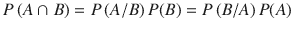

从现在开始，我们将把交点 B 的符号省略为，并且为了便于表示，将把它表示为 AB。

图 1-18

Venn diagram of two events A and B showing the union and intersection of the two events

当我们看如图 [1-18](#Fig19) 所示的两个事件 A 和 B 的文氏图时，前面所有的证明都变得容易了。

假设一个实验出现了 n 次，其中 A 出现了 n 次 1 ，B 出现了 n 次 2 ，A 和 B 一起出现了 m 次。

让我们用文氏图来表示。

P(A U B)可以用三个不相关事件的概率之和来表示:(A–B)，(B–A)和 AB。

T2】

P(A/B)是给定 B 已经发生的概率。鉴于 B 已经以 n 种 2 方式发生，事件 A 被限制为可以以 m 种不同方式发生的事件 AB。所以，给定 B 的概率可以表示为:

现在，可以写成 = 。

于是，。

类似地，如果我们考虑 P(B/A)，那么关系也成立。

### 事件交集的概率链规则

刚刚针对两个事件讨论的交集的乘积法则可以扩展到 n 个事件。

如果 A 1 ，A 2 ，A 3 ，....A n 是 n 个事件的集合，那么这些事件的联合概率可以表示为:

### 互斥事件

两个事件 A 和 B 如果不同时发生，就说它们是互斥的。换句话说，A 和 B 互斥，如果。对于互斥事件，。

一般来说，n 个互斥事件并集的概率可以写成它们的概率之和:

### 事件的独立性

如果两个事件 A 和 B 相交的概率等于它们各自概率的乘积，则称它们是独立的；即

这是可能的，因为给定 B 的条件概率与 A 的概率相同；即

这意味着 A 在所有事件的集合中发生的可能性与它在 b 的域中发生的可能性一样大。

同样，为了让事件 A 和 B 独立。

当两个事件相互独立时，任何一个事件都不会受到另一个事件已经发生的影响。

### 事件的条件独立性

给定第三个事件 C 两个事件 A 和 B 条件独立如果给定 C A 和 B 共现的概率可以写成:

由因式分解性质，。

通过结合前面的等式，我们也看到了。

请注意，事件 A 和 B 的条件独立性并不保证 A 和 B 也是独立的。事件的条件独立性在机器学习领域有很多应用，通过条件独立性假设将似然函数分解成更简单的形式。此外，一类称为贝叶斯网络的网络模型使用条件独立性作为简化网络的几个因素之一。

### 贝叶斯规则

现在我们对初等概率有了基本的了解，让我们来讨论一个非常重要的定理，叫做贝叶斯法则。我们用两个事件 A 和 B 来说明这个定理，但是它可以推广到任何数量的事件。

我们从概率的乘积法则中取。(1)

同理，。(2)

结合(1)和(2)，我们得到

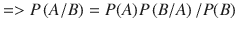

前面推导出的规则被称为贝叶斯规则，它将在机器学习的许多领域中派上用场，例如从可能性计算后验分布、使用马尔可夫链模型、最大化后验算法等等。

### 概率质量函数

随机变量的概率质量函数(pmf)是一个函数，它给出了随机变量可以取的每个离散值的概率。概率之和必须等于 1。

例如，在一次掷骰子中，让骰子正面的数字是随机变量 x。

那么，pmf 可以定义如下:

### 概率密度函数

概率密度函数(pdf)给出了连续随机变量在其定义域中每个值的概率密度。因为它是一个连续变量，概率密度函数在其定义域上的积分必须等于 1。

设 X 是一个定义域为 d 的随机变量，P(x)表示它是一个概率密度函数，所以

例如，连续随机变量的概率密度函数可以取 0-11 的值，由![$$ (x) = 2x\kern0.5em x\ \in\ \left[0,1\right] $$](A448418_1_En_1_Chapter_IEq220.gif)给出。让我们验证它是否是一个概率密度函数。

为了使 P(x)成为概率密度函数，应该是 1。

![$$ {\displaystyle {\int}_{x=0}^1P(x)dx = }\ {\displaystyle {\int}_{x=0}^12xdx\kern0.5em ={\left[{x}^2\right]}_0^1=1} $$](A448418_1_En_1_Chapter_IEq222.gif)。因此，P(x)是一个概率密度函数。

需要注意的一点是，积分计算的是曲线下的面积，由于 P(x)是概率密度函数(pdf)，所以概率曲线的曲线下面积应该等于 1。

### 随机变量的期望

随机变量的期望就是随机变量的均值。假设随机变量 X 取 n 个离散值，x 1 ，x 2 ，.....x n ，概率 p 1 ，p 2 ，… p n 。换句话说，X 是 pmf 为的离散随机变量。然后，随机变量 X 的期望值由

![$$ E\left[X\right] = {x}_1{p}_1 + {x}_2{p}_2 + \dots + {x}_n{p}_n\kern0.5em = {\displaystyle \sum_{i=1}^n}{x}_i{p}_i $$](A448418_1_En_1_Chapter_Equco.gif)

给出

如果 X 是一个概率密度函数为 P(x)的连续随机变量，X 的期望由

![$$ E\left[X\right]={\displaystyle {\int}_DxP(x)\;dx} $$](A448418_1_En_1_Chapter_Equcp.gif)

给出

其中 D 是 P(x)的定义域。

### 随机变量的方差

随机变量的方差衡量随机变量的可变性。它是随机变量与其均值(或期望值)的方差的均值(期望值)。

设 X 是一个均值为![$$ \mu = E\left[X\right] $$](A448418_1_En_1_Chapter_IEq224.gif)的随机变量

![$$ Var\left[X\right] = E\left[{\left(X-\mu \right)}^2\right] $$](A448418_1_En_1_Chapter_IEq225.gif)其中![$$ \mu = E\left[X\right] $$](A448418_1_En_1_Chapter_IEq226.gif)

如果 X 是取 n 个离散值的离散随机变量，pmf 由给定，那么 X 的方差可以表示为

![$$ Var\left[X\right] = E\left[{\left(X-\mu \right)}^2\right] $$](A448418_1_En_1_Chapter_Equcq.gif)

如果 X 是具有概率密度函数 P(x)的连续随机变量，那么 Var[X]可以表示为

![$$ Var\left[X\right] = {\displaystyle \underset{D}{\int }}{\left(x - \mu \right)}^2\ P(x)dx $$](A448418_1_En_1_Chapter_Equcs.gif)

其中 D 是 P(x)的定义域。

### 偏斜度和峰度

偏度和峰度是随机变量的高阶矩统计量。偏斜度衡量概率分布的对称性，而峰度衡量概率分布的尾部是否重。偏斜度是三阶矩，表示为

![$$ Skew(X) = \kern0.75em \frac{E\Big[\left(X\ \hbox{--}\ \mu \Big){}^3\right]}{{\left(Var\left[X\right]\right)}^{3/2}} $$](A448418_1_En_1_Chapter_Equct.gif)

图 1-21

Probability distribution with negative skewness

图 1-20

Probability distribution with positive skewness

图 1-19

Symmetric probability distribution

一个完全对称的概率分布，偏度为 0，如图 [1-19](#Fig20) 。偏度的正值表示大部分数据向左，如图 [1-20](#Fig21) 所示，而偏度的负值表示大部分数据向右，如图 [1-21](#Fig22) 所示。

峰度是一个四阶统计量，对于均值为μ的随机变量 X，可以表示为

![$$ Kurt(X) = E\left[{\left[X\ \hbox{--}\ \mu \right]}^4\right]/{\left(Var\left[X\right]\right)}^2 $$](A448418_1_En_1_Chapter_Equcu.gif)

图 1-23

Student’s T distribution with Kurtosis = 

图 1-22

Standard normal distribution with Kurtosis = 3

峰度越高，概率分布的尾部越重，如图 [1-23](#Fig24) 所示。正态分布的峰度(见图 [1-22](#Fig23) )为 3。然而，为了根据正态分布来测量其他分布的峰度，通常是指过度峰度，即实际峰度减去正态分布的峰度，即 3。

### 协方差

两个随机变量 X 和 Y 之间的协方差是它们联合可变性的度量。如果 X 的较高值对应于 Y 的较高值，X 的较低值对应于 Y 的较低值，则协方差为正。另一方面，如果 X 的较高值对应于 Y 的较低值，X 的较低值对应于 Y 的较高值，则协方差为负。

X 和 Y 的协方差公式如下:

![$$ cov\left(X,Y\right)=E\left[X-{u}_x\right]\left[Y-{u}_y\right] $$](A448418_1_En_1_Chapter_IEq229.gif)其中![$$ {u}_x = E\left[X\right],\ {u}_y = E\left[Y\right] $$](A448418_1_En_1_Chapter_IEq230.gif)

关于前述公式的简化，另一种方案如下:

![$$ cov\left(X,Y\right)=E\left[XY\right] - {u}_x{u}_y $$](A448418_1_En_1_Chapter_Equcv.gif)

如果两个变量是独立的，它们的协方差是零，因为![$$ E\left[XY\right]=E\left[X\right]E\left[Y\right] = {u}_x{u}_y $$](A448418_1_En_1_Chapter_IEq231.gif)

### 相关系数

协方差通常不提供关于两个变量之间关联程度的太多信息，因为这两个变量可能在非常不同的尺度上。获得两个变量的相关系数之间的线性相关性的度量，这是协方差的归一化版本，会有用得多。

两个变量 X 安迪之间的相关系数表示为

其中σ x 和σ y 分别为 X 和 Y 的标准差。ρ的值介于和之间。

图 1-24

Plot of variables with correlation coeffecients of +1 and -1

图 [1-24](#Fig25) 显示了两个变量 X 和 y 之间的正相关和负相关。

### 一些常见的概率分布

在本节中，我们将介绍一些常用于机器学习和深度学习领域的常见概率分布。

#### 均匀分布

均匀分布的概率密度函数是常数。对于取值在 a 和之间的连续随机变量，概率密度函数表示为

![$$ P\left(X = x\right)=f(x)=\kern0.5em \left\{\begin{array}{c}\hfill 1/\left(b\ \hbox{--}\ a\right)\kern1.5em for\kern0.5em x\ \in\ \left[a,b\right]\hfill \\ {}\hfill \kern1.75em 0\kern0.75em elsewhere\kern5.5em \hfill \end{array}\right. $$](A448418_1_En_1_Chapter_Equcx.gif)

图 1-25

Uniform probability distribution

图 [1-25](#Fig26) 所示为均匀分布的概率密度曲线。这里概述了均匀分布的不同统计:

![$$ E\left[X\right]\kern2.75em = \frac{\left(b + a\right)}{2} $$](A448418_1_En_1_Chapter_Equcy.gif)

![$$ Median\left[X\right]\kern1.5em = \frac{\left(b + a\right)}{2} $$](A448418_1_En_1_Chapter_Equcz.gif)

![$$ Mode\left[X\right]\kern2em = All\ points\ in\ the\ in terval\ a\ to\ b $$](A448418_1_En_1_Chapter_Equda.gif)

![$$ Var\left[X\right]\kern2.25em = {\left(b\ \hbox{--}\ a\right)}^2/12 $$](A448418_1_En_1_Chapter_Equdb.gif)

![$$ Skew\left[X\right]\kern2em = 0 $$](A448418_1_En_1_Chapter_Equdc.gif)

![$$ Excessive\ Kurt\left[X\right] = -6/5 $$](A448418_1_En_1_Chapter_Equdd.gif)

请注意，超额峰度是实际峰度减去 3，3 是正态分布的实际峰度。因此，过度峰度是相对于正态分布的相对峰度。

#### 正态分布

这可能是现实世界中概率分布最重要的场景。在正态分布中，最大概率密度位于分布的均值，密度对称地以指数形式下降到距均值距离的平方。正态分布的概率密度函数可以表示为

其中μ为均值，σ 2 为随机变量 x 的方差，图 [1-26](#Fig27) 所示为一元正态分布的概率密度函数。

图 1-26

Normal probability distribution

如图 [1-26](#Fig27) 所示，正态分布中 68.2%的数据落在平均值的一个标准差(+1/-1σ)内，大约 95.4%的数据预计落在平均值的+2/-2σ内。正态分布的重要统计数据如下:

![$$ E\left[X\right]\kern2.75em =\kern0.5em \mu $$](A448418_1_En_1_Chapter_Equdf.gif)

![$$ Median\left[X\right]\kern1.5em =\kern0.5em \upmu $$](A448418_1_En_1_Chapter_Equdg.gif)

![$$ Mode\left[X\right]\kern2em =\kern0.5em \upmu $$](A448418_1_En_1_Chapter_Equdh.gif)

![$$ Var\left[X\right]\kern2.75em =\kern0.5em {\sigma}^2 $$](A448418_1_En_1_Chapter_Equdi.gif)

偏斜[X] = 0

![$$ Excess\ Kurt\left[X\right] = 0 $$](A448418_1_En_1_Chapter_Equdj.gif)

任何正态分布都可以通过以下变换转换成标准正态分布:

标准正态随机变量 z 的均值和标准差分别为 0 和 1。标准正态分布在统计推断测试中被大量使用。类似地，在线性回归中，误差被假定为正态分布。

#### 多元正态分布

多元正态分布，或由向量表示的 n 个变量的高斯分布，是由平均向量和协方差矩阵参数化的相关变量的联合概率分布。

多元正态分布的概率密度函数(pdf)如下:

其中![$$ x={\left[{x}_1{x}_2\dots {x}_n\right]}^T $$](A448418_1_En_1_Chapter_IEq238.gif)

图 1-27

Multivariate normal distribution in two variables

图 [1-27](#Fig28) 所示为多元正态分布的概率密度函数。多元正态分布或高斯分布在机器学习中有多种应用。例如，对于具有相关性的多元输入数据，通常假设输入要素遵循多元正态分布，并且基于概率密度函数，具有低概率密度的点被标记为异常。此外，多元正态分布广泛用于混合高斯模型中，其中具有多个特征的数据点被假设属于具有不同概率的多个多元正态分布。混合高斯分布被应用于多个领域，如聚类、异常检测、隐马尔可夫模型等。

#### 二项分布

两个结果互斥且穷尽(两个结果的概率之和为 1)的实验称为伯努利试验。

伯努利轨迹遵循伯努利分布。假设在伯努利轨迹中，有两种结果，成功和失败。如果成功的概率是 p，那么由于这两个事件耗尽了样本空间，失败的概率是 1–p。让表示成功。因此，成功或失败的概率可以表示为:

的前述表达式表示伯努利分布的概率质量函数。概率质量函数的期望和方差如下:

![$$ E\left[X\right] = \kern0.5em p $$](A448418_1_En_1_Chapter_Equdo.gif)

![$$ Var\left[X\right] = p\left(1 - p\right) $$](A448418_1_En_1_Chapter_Equdp.gif)

伯努利分布可以扩展到互斥和穷举的多类事件。任何两类分类问题都可以建模为伯努利轨迹。例如，逻辑回归似然函数基于每个训练数据点的伯努利分布，概率 p 由 sigmoid 函数给出。

#### 二项分布

在一系列伯努利试验中，我们通常感兴趣的是成功和失败总数的概率，而不是它们发生的实际顺序。如果在 n 个连续伯努利试验的序列中，x 表示成功的次数，那么 n 个伯努利试验中 x 个成功的概率可以由表示为

的概率质量函数来表示

其中 p 是成功的概率。

分布的期望和方差如下:

![$$ E\left[X\right]\kern0.75em = np $$](A448418_1_En_1_Chapter_Equdr.gif)

![$$ Var\left[X\right] = np\left(1 - p\right) $$](A448418_1_En_1_Chapter_Equds.gif)

图 1-28

Probability Mass function of a Binomial Distribution with n=4 and p = 0.3

图 [1-28](#Fig29) 所示为具有和的二项分布的概率质量函数。

#### 泊松分布

每当关注某个数量的比率时，例如 1000 个产品批次中的缺陷数量、放射性物质在之前的四个小时内发射的α粒子数量等，泊松分布通常是表示这种现象的最佳方式。泊松分布的概率质量函数如下:

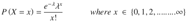

![$$ E\left[X\right]\kern0.75em = \lambda $$](A448418_1_En_1_Chapter_Equdu.gif)

![$$ Var\left[X\right] = \lambda $$](A448418_1_En_1_Chapter_Equdv.gif)

图 1-29

Probability mass function of a Poisson distribution with mean = 15

图 [1-29](#Fig30) 所示为具有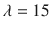均值的泊松分布的概率质量函数。

### 似然函数

可能性是在给定生成基础数据的参数的情况下观察到的数据的概率。假设我们观察 n 个观察值 x 1 ，x 2 ，.....x n 并且假设观察值是独立的，并且均值和方差同正态分布σ 2 。

这种情况下的似然函数如下:

由于观察值是独立的，我们可以如下分解可能性:

中的每一个，因此可能性可以进一步展开为:

### 最大似然估计

最大似然估计(MLE)是一种估计分布或模型参数的技术。这是通过导出最大化似然函数的参数来实现的，即，在给定模型参数的情况下，最大化观察到数据的概率。让我们通过一个例子来理解最大似然估计。

假设亚当投掷硬币 10 次，观察到 7 个头和 33 条尾巴。此外，假设投掷是独立的和相同的。给定硬币正面概率的最大似然估计是多少？

每一次抛硬币都是伯努利试验，正面的概率是，比如说，p，这是一个我们想要估计的未知参数。同样，让掷硬币产生正面的事件用 11 表示，反面用 0 表示。

似然函数可以表示如下:

为了澄清，让我们看看可能性 L 是如何变成 p7(1–p)3的。

对于每个人头，来自伯努利分布的概率是。类似地，对于每条尾巴，概率是。因为我们有 77 个头和 33 条尾巴，我们得到可能性 L(p)是 p7(1–p)3。

为了最大化似然 L，我们需要取 L 对 p 的导数，并将其设为 0。

现在，我们可以不用最大化似然性 L(p ),而是最大化似然性的对数，即 logL(p)。由于对数是单调递增的函数，使 L(p)最大化的参数值也会使 logL(p)最大化。在数学上，对可能性的对数求导比对原始可能性的乘积形式求导更方便。

T2】

对两边求导并设为零如下:

有兴趣的读者可以在计算二阶导数；你肯定会得到一个负值，确认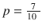确实是最大值点。

你们中的一些人可能已经想到了,甚至没有经过最大似然，仅仅是根据概率的基本定义。正如您稍后将看到的，通过这种简单的方法，在机器学习和深度学习世界中估计了许多复杂的模型参数。

让我们看看另一个在优化时可能会派上用场的小技巧。计算函数 f(x)的最大值与计算函数的最小值是一样的。f(x)的最大值和的最小值将出现在相同的 x 值处。类似地，f(x)的最大值和 1/f(x)的最小值将出现在相同的 x 值处。

通常在机器学习和深度学习应用中，我们使用高级优化包，这些包只知道最小化成本函数，以便计算模型参数。在这种情况下，我们通过改变符号或取函数的倒数，方便地将最大化问题转化为最小化问题，无论哪个更有意义。例如，在前面的问题中，我们可以取对数似然函数的负值，即 LogL(p)，并将其最小化；我们会得到同样的概率估计值 0.7。

### 假设检验和 p 值

通常，我们需要根据从人群中收集的样本进行一些假设检验。我们从一个零假设开始，根据所做的统计测试，接受或拒绝零假设。

在开始假设检验之前，我们先来考虑统计学中的一个核心基本面，也就是中心极限定理。

设 x 1 ，x 2 ，x 3 ，。…..，x n 是来自具有均值μ和有限方差σ 2 的总体的样本的 n 个独立同分布观测值。

用表示的样本均值服从正态分布，均值为μ，方差为；即，

其中

这就是所谓的中心极限定理。随着样本量 n 的增加，的方差减小，并趋向于零，如

图 [1-30](#Fig31) 说明了总体分布和从总体中抽取的固定大小 n 的样本的平均值分布。

图 1-30

Distribution for population and distribution for sample mean

请注意，无论总体变量是否正态分布，样本均值都遵循正态分布。现在，让我们考虑一个简单的假设检验问题。

已知 10 岁的男孩平均体重为 85 磅，标准差为 11.6。一个县的男孩被检查是否肥胖。为了验证这一点，从该县随机抽取了 25 名男孩，收集他们的平均体重。平均体重为 89.16 磅。

我们将不得不形成一个无效假设，如果反对无效假设的证据足够有力，我们将通过测试拒绝它。

让我们考虑零假设:H 0 。县城的孩子并不肥胖；也就是说，他们来自同一个群体，其平均值为。

在零假设 0 下，样本均值如下:

观察到的样本均值越接近总体均值，零假设越有可能成立。另一方面，观察到的样本均值离总体均值越远，反对零假设的证据就越强。

标准正态变量 ) =  = 

对于每个假设检验，我们确定一个 p 值。这种假设检验的 p 值是观察到的样本均值与被观察值相差较远的概率；即。所以，p 值越小，反对零假设的证据就越强。

当 p 值小于指定的阈值百分比α(称为类型 1 错误)时，零假设被拒绝。

请注意，样本均值与总体的偏差可能纯粹是随机的结果，因为样本均值具有有限的方差σ2/n。α为我们提供了一个阈值，超过该阈值，即使零假设为真，我们也应该拒绝零假设。我们可能错了，巨大的偏差可能只是因为随机性。但是发生这种情况的概率非常小，特别是当我们有一个大样本的时候，因为样本的平均标准差会显著降低。当我们拒绝零假设时，即使零假设是真的，我们犯了第一类错误，因此α给出了第一类错误的概率。

本次测试的 p 值为

人们应该选择的 I 型误差α取决于人们对进行测试的具体领域的了解。一般来说，是一个足够好的类型 1 错误设置。由于计算出的 p 值小于测试中规定的 I 型误差，我们不能接受零假设。我们说这个测试有统计学意义。p 值如图 [1-31](#Fig32) 所示。

图 1-31

Z test showing p value

深色区域对应 p 值；即。对应于 z 值，假设零假设为真，超过该值我们可能会犯类型 1 错误。超过的区域，即，代表第一类错误概率。因为 p 值小于测试的类型 1 错误概率，所以不能将零假设视为真。像这样的 Z 测试之后通常是另一个好的实践——置信区间测试。

此外，前面的测试，通常被称为 Z 测试。并不总是可能的，除非我们有提供给我们的人口方差。对于某些问题，我们可能没有总体方差。在这种情况下，Student-T 检验更方便，因为它使用样本方差而不是总体方差。

鼓励读者探索更多关于这些统计测试的内容。

## 机器学习算法和优化技术的公式化

建模的目的是在给定数据的情况下，通过使用不同的优化技术来最小化模型参数的成本函数。有人可能会问，如果我们将成本函数的导数或梯度设置为零，我们会有模型参数吗？这并不总是可能的，因为并非所有的解都有封闭形式的解，或者封闭形式的解在计算上可能是昂贵的或难以处理的。此外，当数据量很大时，采用封闭形式的解决方案会有内存限制。因此，迭代方法通常用于复杂的优化问题。

机器学习可以大致分为两种类型:

*   监督机器学习
*   无监督机器学习

### 监督学习

在监督学习中，每个训练数据点都与几个输入特征相关联，通常是一个输入特征向量及其对应的标注。用几个参数构建模型，这些参数试图在给定输入特征向量的情况下预测输出标签。通过优化基于预测误差的某种形式的成本函数来导出模型参数；即训练数据点的实际标签和预测标签之间的差异。或者，最大化训练数据的可能性也将为我们提供模型参数。

#### 线性回归作为一种监督学习方法

我们可能有一个以房屋价格作为目标变量或输出标签的数据集，而房屋面积、卧室数量、浴室数量等特征是其输入特征向量。我们可以定义一个函数，根据输入的特征向量来预测房子的价格。

设输入特征向量用 x’表示，预测值为 y p 。假设房价的实际值(即输出标注)由 y 表示。我们可以定义一个模型，其中输出标注表示为输入要素向量的函数，如下式所示。该模型由我们希望通过训练过程学习的几个常数来参数化。【T2

其中ϵ是预测和中的随机变量。

因此，给定输入(的住房价格是输入向量 x’加上偏差项 b 和随机分量ϵ的线性组合，其遵循均值为 0 且有限方差为σ 2 的正态分布。

由于ϵ是一个随机的组成部分，它是无法预测的，我们能预测的最好的是给定一个特征值的平均房价，即

预测值![$$ {y}_p/{x}^{\prime }=E\left[y/{x}^{\prime}\right] = {\theta^{\prime}}^T{x}^{\prime } + b $$](A448418_1_En_1_Chapter_IEq272.gif)

这里，θ’是线性组合器，b 是偏差或截距。θ′和 b 都是我们希望学习的模型参数。我们可以表示，其中偏差已经被添加到对应于常数特征 1 的模型参数中。这个小技巧使表示更简单。

假设我们有 m 个样本(x (1) ，y (1) )，(x (2) ，y (2) ....(x (m) ，y (m) )。我们可以计算一个成本函数，该函数取住房价格的预测值和实际值之差的平方和，并试图将其最小化，以便导出模型参数。

成本函数可以定义为

我们可以最小化关于θ的成本函数来确定模型参数。这是一个线性回归问题，其中输出标签或目标是连续的。回归属于学习的监督类。图 [1-32](#Fig33) 说明了房价与卧室数量的关系。

图 1-32

Regression fit to the Housing Prices versus Number of Bedrooms data. The red points denote the data points, and the blue line indicates the fitted regression line.

设输入向量为![$$ x\hbox{'} = {\left[{x}_1\ {x}_2\ {x}_3\right]}^T $$](A448418_1_En_1_Chapter_IEq274.gif)，其中

设输入特征向量对应的参数向量为![$$ \theta \hbox{'} = {\left[{\theta}_1\ {\theta}_{2\ }{\theta}_3\right]}^T $$](A448418_1_En_1_Chapter_IEq275.gif)，其中

在考虑了偏差项之后，输入特征向量变成![$$ x = {\left[{x}_0\ {x}_{1\ }{x}_2\ {x}_3\right]}^T $$](A448418_1_En_1_Chapter_IEq276.gif)，其中

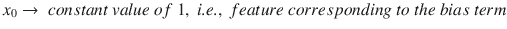

还有![$$ \theta = \left[{\theta}_{0\ }{\theta}_{1\ }{\theta}_{2\ }{\theta}_3\right] $$](A448418_1_En_1_Chapter_IEq277.gif)，其中

现在，我们对如何构建回归问题及其相关成本函数有了一些了解，让我们简化问题并继续推导模型参数。

模型参数

所有样本的输入向量可以组合成矩阵 X，相应的目标输出可以表示为向量 y。

![$$ X = \left[\begin{array}{c}\hfill \begin{array}{cc}\hfill {x}_0^{(1)}\hfill & \hfill {x}_1^{(1)}\ {x}_2^{(1)}{x}_3^{(1)}\hfill \end{array}\hfill \\ {}\hfill \begin{array}{cc}\hfill {x}_0^{(2)}\hfill & \hfill {x}_1^{(2)}\ {x}_2^{(2)}{x}_3^{(2)}\hfill \end{array}\hfill \\ {}\hfill \begin{array}{cc}\hfill {x}_0^{(3)}\hfill & \hfill {x}_1^{(3)}\ {x}_2^{(3)}{x}_3^{(3)}\hfill \end{array}\hfill \\ {}\hfill .\hfill \\ {}\hfill .\hfill \\ {}\hfill \begin{array}{cc}\hfill {x}_0^{(m)}\hfill & \hfill {x}_1^{(m)}\ {x}_2^{(m)}{x}_3^{(m)}\hfill \end{array}\hfill \end{array}\right]Y = \left[\begin{array}{c}\hfill {y}^{(1)}\hfill \\ {}\hfill {y}^{(2)}\hfill \\ {}\hfill {y}^{(3)}\hfill \\ {}\hfill .\hfill \\ {}\hfill .\hfill \\ {}\hfill {y}^{(m)}\hfill \end{array}\right] $$](A448418_1_En_1_Chapter_Equew.gif)

如果我们把预测的向量表示为 Yp，那么。因此，预测向量 e 中的误差可以表示为:

因此，C(θ)可以表示为误差向量 e 的 l 2 范数的平方，即

既然我们已经有了矩阵形式的简化成本函数，应用不同的优化技术将会很容易。这些技术适用于大多数成本函数，无论是凸成本函数还是非凸成本函数。对于非凸的，还有一些额外的东西需要考虑，我们会在考虑神经网络的时候详细讨论。

我们可以通过计算梯度并将其设置为零向量来直接导出模型参数。你可以应用我们之前学过的规则来检查是否满足最小值的条件。

成本函数相对于参数向量θ的梯度如下所示:

设置，我们得到。

如果仔细观察这个解，可以观察到 X 的伪逆(即)出现在线性回归问题的解中。这是因为线性回归参数向量可以被视为方程的解，其中 X 是具有的矩形矩阵

前面的表达式是模型参数的闭合解。用这个导出的为新的数据点 x new ，我们可以预测房价为。

对于大型数据集来说,( X T X)的逆的计算是成本和存储器密集型的。还有，当矩阵 X T X 是奇异的并且因此它的逆没有被定义的情况。因此，我们需要寻找替代方法来达到最小值点。

建立线性回归模型后，需要验证的一件事是训练数据点的残差分布。误差应该近似正态分布，平均值为 0，方差有限。绘制误差分布的实际分位数值与误差分布的理论分位数值的 QQ 图可用于检查残差的高斯性假设是否得到满足。

#### 通过向量空间方法的线性回归

图 1-33

Linear regression as a vector space problem

线性回归问题是确定参数向量θ，使得 Xθ尽可能接近输出向量 Y。是数据矩阵，可以认为是 n 列向量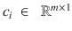一个接一个的堆叠，如下图:

![$$ X = \left[{c}_{1\ }{c}_2 \dots ..\ {c}_n\right] $$](A448418_1_En_1_Chapter_Equfa.gif)

列空间的维数是 m，而列向量的数目是 n。因此，列向量最多可以跨越 m 维向量空间内的 n 维子空间。子空间如图 [1-33](#Fig34) 所示。虽然它看起来像一个二维表面，但我们需要将其想象为一个 n 维空间。X 列与参数的线性组合给出了预测向量，如下所示:

Xθ = 

因为 Xθ只不过是 X 的列向量的线性组合，所以 Xθ与列向量所跨越的子空间位于相同的子空间中。

现在，实际的目标值向量 Y 位于 X 的列向量所跨越的子空间之外，因此，无论我们将 X 与什么θ组合，Xθ都不会等于 Y 方向或在 Y 方向上对齐。将会有一个由给出的非零误差向量

现在我们知道我们有一个误差，我们需要研究如何降低误差的 l 2 范数。为了使误差向量的 l 2 范数最小，它应该垂直于预测向量 Xθ。因为垂直于 Xθ，所以它应该垂直于那个子空间中的所有向量。

所以，X 的所有列向量与误差向量的点积应该为零，这给了我们以下:

![$$ {c_1}^T\left[Y-X\theta \right]=0,\ {c_2}^T\left[Y-X\theta \right]=0,\dots ..{c_n}^T\left[Y-X\theta \right]=0 $$](A448418_1_En_1_Chapter_Equfb.gif)

这可以按如下矩阵形式重新排列:

![$$ {\left[{c}_{1\ }{c}_2 \dots ..\ {c}_n\right]}^T\left[Y-X\theta \right]=0 $$](A448418_1_En_1_Chapter_Equfc.gif)

![$$ = > {X}^T\left[Y-X\theta \right]=0= > \hat{\theta}\kern0.5em = {\left({X}^TX\right)}^{-1}{X}^T\ Y $$](A448418_1_En_1_Chapter_Equfd.gif)

此外，请注意，只有当 Xθ是 Y 在 x 的列向量所跨越的子空间中的投影时，误差向量才会垂直于预测向量。此说明的唯一目的是强调向量空间在解决机器学习问题中的重要性。

#### 分类

类似地，我们可以考虑分类问题，其中我们预测与输入特征向量相关联的类别标签，而不是预测连续变量的值。例如，我们可以根据客户最近的付款历史和交易细节以及他的人口统计和就业信息来预测客户是否可能违约。在这样的问题中，我们将具有刚才提到的特征的数据作为输入，并且将指示客户是否已经默认的目标作为分类标签。基于这些标记数据，我们可以构建一个分类器，该分类器可以预测表明客户是否会违约的类别标签，或者我们可以提供客户违约的概率分数。在这个场景中，问题是一个包含两个类的二元分类问题——默认类和非默认类。当构建这样的分类器时，最小二乘法可能不会给出好的成本函数，因为我们试图猜测标签，而不是预测连续变量。用于分类问题的流行成本函数通常是基于最大似然的对数损失成本函数和基于熵的成本函数，例如基尼熵和香农熵。

具有线性决策边界的分类器称为线性分类器。决策边界是分隔不同类别的超平面或曲面。在线性决策边界的情况下，分离平面是超平面。

图 1-35

Classification by a non-linear decision boundary

图 1-34

Classification by a linear decision boundary

图 [1-34](#Fig35) 和 [1-35](#Fig36) 分别示出了两类分离的线性和非线性决策边界。

我想简单地讨论一下最流行和最简单的分类器之一，逻辑回归，以便弄清楚在分类问题的情况下，对数损失成本函数是如何通过最大似然法进入画面的。

假设(x (i) ，y (i) )为标注后的数据点，其中为输入向量，包含常量特征值 1 作为分量，y (i) 确定类别。当数据点对应于已经拖欠贷款的客户时，y (i) 的值被设置为 1，如果客户没有拖欠，则设置为 0。输入向量 x (i) 可以按照其分量表示如下:

![$$ {x}^{(i)}=\left[1\begin{array}{cc}\hfill {x}_0^{(1)}\hfill & \hfill {x}_1^{(1)}\ {x}_2^{(1)}{x}_3^{(1)}\hfill \end{array}\right] $$](A448418_1_En_1_Chapter_Equfe.gif)

一般来说，逻辑回归是一种线性分类器，使用挤压函数将线性得分转换为概率。设![$$ \theta = \left[{\theta}_0\ {\theta}_1\ {\theta}_2 \dots {\theta}_n\right] $$](A448418_1_En_1_Chapter_IEq297.gif)为模型参数，每个代表相对于输入向量 x 的第 j 个特征 x j 的模型参数分量

θ 0 项是偏置项。在线性回归中，偏差就是输出 y 轴上的截距。我们很快就会看到这个偏差项对逻辑回归(和其他线性分类器)意味着什么。

点积θ T x 决定了给定的数据点可能是正类还是负类。对于手头的问题，正类是客户拖欠还款的事件，负类是客户没有违约的事件。给定输入和模型，客户违约的概率由以下公式给出:

现在，让我们看看θ T x 的不同值的概率值:

*   θ T x = 0 那么正类的概率是 1/2。
*   当θ T x > 0 时，正类的概率大于 1/2 且小于 1。
*   当θ T x < 0 时，正类的概率小于 1/2 且大于 0。
*   当θ T xis 足够大且为正数，即时，概率。
*   当θ T xis 足够大且为负，即时，概率。

这个概率公式的好处是它将值保持在 0 和 1 之间，这对于线性回归是不可能的。此外，它给出了连续的概率，而不是实际的类。因此，根据手头的问题，可以定义截止概率阈值来确定类别。

这种概率模型函数称为逻辑函数或 sigmoid 函数。它具有平滑、连续的梯度，这使得模型训练在数学上很方便。

如果我们仔细观察，就会发现每个训练样本的客户类 y 都遵循伯努利分布，这是我们前面讨论过的。对于每个数据点，类)。基于伯努利分布的概率质量函数，我们可以说如下:

其中

现在，我们如何定义成本函数？给定模型参数，我们计算数据的似然性，然后确定使计算的似然性最大化的模型参数。我们用 L 来定义似然，可以表示为

其中 D (i) 代表第 I 个训练样本(x (i) ，y (i) )。

假设训练样本是独立的，给定模型，L 可以分解为:

我们可以取两边的对数，把概率的乘积转换成概率对数的和。此外，优化保持不变，因为 L 和 logL 的最大值点是相同的，因为 log 是单调递增的函数。

取两边的日志，我们得到如下:

现在，。

我们不关心数据点的概率-即 P(x(I)/θ)-并假设训练中的所有数据点对于给定的模型都是同样可能的。所以，，其中 k 是常数。

取两边的日志，我们得到如下:

对所有数据点求和，我们得到如下:

我们需要最大化 logL 来获得模型参数θ。最大化 logL 等同于最小化，因此我们可以将作为逻辑回归的成本函数，并将其最小化。此外，我们可以去掉 logk 和，因为它是一个常数，无论我们是否有 logk 和，最小值处的模型参数都是相同的。如果我们把代价函数表示为 C(θ)，可以表示为这里看到的:

其中

C(θ)是θ中的凸函数，鼓励读者用之前在“微积分”一节中学到的规则来验证它。C(θ)可以通过常见的优化技术最小化。

#### 超平面和线性分类器

线性分类器以这样或那样的方式与超平面相关，因此查看这种关系是有意义的。在某种程度上，学习线性分类器就是学习区分正类和负类的超平面。

n 维向量空间中的超平面是将 n 维向量空间分成两个区域的维度()的平面。一个区域由位于超平面上方的向量组成，另一个区域由位于超平面下方的向量组成。对于二维向量空间，直线充当超平面。同样，对于三维向量空间，二维平面充当超平面。

超平面由两个主要参数定义:它离原点的垂直距离由偏置项 b '表示，超平面的方向由垂直于超平面表面的单位向量 w 确定，如图 [1-36](#Fig37) 所示。

对于位于超平面上的向量，向量在 w 方向上的投影应该等于超平面到原点的距离，即。因此，位于超平面上的任何一点都必须满足。类似地，位于超平面上方的点必须满足，位于超平面下方的点必须满足。

图 1-36

Hyperplanes separating the two classes

在线性分类器中，我们学习对超平面建模，或者学习模型参数 w 和 b。向量 w 通常对准正类。感知器和线性 SVM 是线性分类器。当然，SVM 和感知器学习超平面的方式是完全不同的，因此它们会得出不同的超平面，即使是对于相同的训练数据。

即使我们看逻辑回归，我们看到它是基于一个线性决策边界。线性决策边界只不过是一个超平面，并且位于该超平面上的点(即)被分配给任一类 0.5 的概率。同样，逻辑回归学习决策边界的方式与 SVM 和感知器模型完全不同。

### 无监督学习

无监督的机器学习算法旨在发现数据集中的模式或内部结构，这些数据集中包含没有标签或目标的输入数据点。k-均值聚类、高斯混合等都是无监督学习的方法。甚至像主成分分析(PCA)、奇异值分解(SVD)、自编码器等数据简化技术都是无监督的学习方法。

### 机器学习的优化技术

#### 梯度下降

梯度下降及其几种变体可能是机器学习和深度学习中使用最广泛的优化技术。这是一种迭代方法，从随机模型参数开始，使用成本函数相对于模型参数的梯度来确定模型参数的更新方向。

假设我们有一个成本函数 C(θ)，其中θ代表模型参数。我们知道，成本函数相对于θ的梯度给出了 C(θ)在线性意义上的最大增加方向，在θ值处，梯度被评估。因此，为了在线性意义上获得 C(θ)的最大下降方向，应该使用梯度的负值。

模型参数θ在迭代时的更新规则由

给出

其中η代表学习率，和θ (t) 分别代表迭代和 t 时的参数向量。

一旦通过该迭代过程达到最小值，成本函数在最小值处的梯度从技术上讲将为零，因此不会进一步更新θ。然而，由于舍入误差和计算机的其他限制，收敛到真正的最小值可能是不可实现的。因此，当我们相信我们已经达到最小值(或者至少足够接近最小值)时，我们必须想出一些其他的逻辑来停止迭代过程，以停止模型训练的迭代过程。通常使用的方法之一是检查梯度向量的大小，如果它小于某个预定义的微小量，比如ε，就停止迭代过程。另一种简单的方法是在固定的迭代次数(如 1000 次)后停止参数更新的迭代过程。

学习率在梯度下降算法收敛到极小点的过程中起着非常重要的作用。如果学习率很大，收敛可能会更快，但可能会导致在最小值点附近的剧烈振荡。小的学习率可能需要更长的时间来达到最小值，但是收敛通常是无振荡的。

要了解梯度下降法的工作原理，让我们采用一个只有一个参数和一个成本函数的模型，并了解该方法的工作原理。

图 1-37

Gradient descent intuition with simple cost function in one variable.

从图 [1-37](#Fig38) 中我们可以看到，在点θ 1 处的梯度(在这种情况下只是导数)是正的，因此如果我们沿着梯度方向移动，成本函数将会增加。相反，在θ 1 处，如果我们沿着梯度的负值移动，成本会降低。还是那句话，我们取梯度为负的点θ 2 。如果我们在这里采用梯度方向来更新θ，成本函数将会增加。取梯度的负方向将确保我们向最小值移动。一旦我们在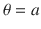达到最小值，梯度为 0，因此不会进一步更新θ。

#### 多元成本函数的梯度下降

现在，我们通过查看基于一个参数的成本函数对梯度下降有了一些直觉，让我们来看看成本函数基于多个参数时的梯度下降。

让我们来看一个多元函数的泰勒级数展开。多个变量可以用向量θ来表示。让我们考虑一个成本函数 C(θ)，其中。

如前所述，围绕一点θ的泰勒级数展开可以用矩阵符号表示，如下所示:

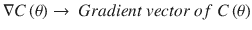

假设在梯度下降的迭代 t 处，模型参数是θ，我们希望通过更新δθ将θ更新为，使得小于 C(θ)。

如果我们假设函数在θ的邻域内是线性的，那么从泰勒级数展开我们得到如下:

我们想这样选择δθ，使得小于 C(θ)。

对于所有大小相同的∏θ，最大化点积的方向应该与的方向相同。但是那会给我们最大可能的。因此，为了得到点积的最小值，δθ的方向应该与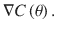的方向完全相反，换句话说，δθ应该与梯度向量 :

的负值成比例

=> ，其中η是学习率

=> 

=> 

这就是著名的梯度下降方程。为了形象化梯度下降如何进行到最小值，我们需要对等高线图和等高线有一些基本的了解。

#### 等高线图和等高线

让我们考虑一个函数 C(θ)，其中。等高线是θ的向量空间中连接具有相同函数值 C(θ)的点的线/曲线。对于 C(θ)的每个唯一值，我们将有单独的等高线。

让我们为函数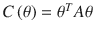绘制等高线，其中![$$ \theta = {\left[{\theta}_1{\theta}_2\right]}^T\in {\mathrm{\mathbb{R}}}^{2\times 1} $$](A448418_1_En_1_Chapter_IEq338.gif)和

![$$ A = \left[\begin{array}{cc}\hfill 7\hfill & \hfill 2\hfill \\ {}\hfill 2\hfill & \hfill 5\hfill \end{array}\right] $$](A448418_1_En_1_Chapter_Equfw.gif)

扩展 C(θ)的表达式我们得到

成本函数的等高线图如图 [1-38](#Fig39) 所示。

图 1-38

Contour plots

每个椭圆都是特定于函数 C(θ 1 ，θ 2 )的固定值的轮廓线。如果，其中 a 是常数，那么方程

代表椭圆。

对于常数 a 的不同值，我们得到不同的椭圆，如图 [1-38](#Fig39) 所示。特定等高线上的所有点具有相同的函数值。

现在我们知道了什么是等高线图，让我们看看成本函数 C(θ)的等高线图中的梯度下降级数，其中。梯度下降步骤如图 [1-39](#Fig40) 所示。

图 1-39

Gradient descent for a two-variable cost function

让我们取对应于成本 C 1 的最大椭圆，并假设我们当前的θ在 C 1 中的点θ (1) 。

假设 C(θ)与θ成线性关系，成本函数 C(θ)的变化如下所示:

ΔC（θ） = 

如果我们取同一条等高线上彼此非常接近的两点之间的成本的微小变化，那么，因为同一条等高线上的所有点都具有相同的固定值。此外，应该注意，当我们在同一轮廓线上取两个彼此非常接近的点时，δθ表示由轮廓线的切向箭头表示的轮廓线的切线。请不要将此δθ混淆为梯度下降中参数的δθ更新。

，基本上是指坡度垂直于等高线 C 1 中的点θ (1) 处的切线。梯度将指向外，而负梯度指向内，如垂直于切线的箭头所示。基于学习速率，它将到达由 C 2 表示的不同轮廓线中的点θ (2) ，其成本函数值将小于 C 1 的成本函数值。再次，梯度将在θ (2) 处被评估，并且相同的过程将被重复几次迭代，直到它到达最小值点，在该点处，梯度将在技术上下降到 0，在此之后，将不再有对θ的更新。

#### 最陡下降

最速下降是梯度下降的一种形式，其中学习率不是常数，而是在每次迭代时计算，以确保通过梯度下降的参数更新使成本函数相对于学习率最小。换句话说，最陡下降中每次迭代的学习速率被优化，以确保梯度方向上的运动被最大程度地利用。

让我们以通常的成本函数 C(θ)为例，看看连续的迭代 t 和。与梯度下降一样，我们的参数更新规则如下:

因此，迭代时的成本函数可以表示为

为了最小化关于学习率的迭代的成本函数，参见以下:

![$$ = > \nabla C\left({\theta}^{\left(t+1\right)}\right)\frac{\partial \left[C\Big({\theta}^{(t)}\ \hbox{--}\ \eta \nabla C\left({\theta}^{(t)}\right)\right]}{\partial \eta }=0 $$](A448418_1_En_1_Chapter_Equgb.gif)

因此，对于最陡下降，在和 t 的梯度的点积是 0，这意味着每次迭代的梯度向量应该垂直于其前一次迭代的梯度向量。

#### 随机梯度下降

最速下降和梯度下降都是全批次模型；即，基于整个训练数据集计算梯度。因此，如果数据集很大，梯度计算会变得很昂贵，内存需求也会增加。此外，如果数据集具有巨大的冗余，那么计算整个数据集的梯度是没有用的，因为类似的梯度可以通过使用小得多的批次(称为迷你批次)来计算。克服上述问题的最流行的方法是使用一种称为随机梯度下降的优化技术。

随机梯度下降是一种基于梯度下降方法最小化成本函数的技术，其中每一步的梯度不是基于整个数据集，而是基于单个数据点。

设 C(θ)为基于 m 个训练样本的代价函数。每一步的梯度下降不是基于 C(θ)，而是基于 C (i) (θ)，这是基于第 I 个训练样本的代价函数。因此，如果我们必须在每一次迭代中绘制相对于总成本函数的梯度向量，等高线将不会垂直于切线，因为它们基于 C (i) (θ)的梯度，而不是基于总 C(θ)。

成本函数 C (i) (θ)用于每次迭代的梯度计算，并且在每次迭代中通过标准梯度下降来更新模型参数向量θ，直到我们遍历了整个训练数据集。我们可以在整个数据集上执行几次这样的遍历，直到获得合理的收敛。

因为每次迭代的梯度不是基于整个训练数据集，而是基于单个训练样本，所以它们通常非常嘈杂，并且可能快速改变方向。这可能导致成本函数的最小值附近的振荡，因此在收敛到最小值时学习速率应该更小，使得对参数向量的更新尽可能小。梯度计算起来更便宜也更快，所以梯度下降趋向于收敛得更快。

在随机梯度下降中重要的一点是训练样本应该尽可能随机。这将确保在几个训练样本期间的随机梯度下降提供与实际梯度下降产生的模型参数相似的模型参数更新，因为随机样本更有可能代表整个训练数据集。如果随机梯度下降每次迭代中的样本有偏差，则它们不代表实际数据集，因此模型参数的更新可能会导致随机梯度下降需要很长时间才能收敛。

图 1-41

Stochastic gradient descent parameter update

图 1-40

Fluctuation in the total cost function value over iterations in stochastic gradient descent

如图 [1-41](#Fig42) 所示，随机梯度下降的每一步的梯度都不垂直于等高线处的切线。但是，如果我们绘制了它们，它们将垂直于单个训练样本的等高线的切线。此外，由于波动的梯度，迭代的相关成本降低是有噪声的。

当我们使用单个训练数据点时，梯度计算变得非常便宜。此外，收敛速度相当快，但它也有自己的缺点，如下所示:

*   因为每次迭代的估计梯度不是基于总成本函数，而是基于与单个数据点相关的成本函数，所以梯度噪声很大。这导致在最小值处的收敛问题，并可能导致振荡。
*   学习率的调整变得很重要，因为高学习率可能导致在收敛到最小值时的振荡。这是因为梯度噪声很大，因此如果收敛处的梯度估计不接近零，高学习率将使更新远远超过最小值点，并且该过程可以在最小值的任一侧重复。
*   由于梯度是有噪声的，每次迭代后的模型参数值也非常有噪声，因此需要将试探法添加到随机梯度下降中，以确定采用哪个模型参数值。这也带来了另一个问题:什么时候停止训练。

全批次模型和随机梯度下降之间的折衷是小批次方法，其中梯度既不基于全训练数据集也不基于单个数据点。相反，它使用少量训练数据点来计算成本函数。大多数深度学习算法使用随机梯度下降的小批量方法。梯度的噪音更小，同时也不会导致很多内存限制，因为小批量大小适中。

我们将在第 [2](2.html) 章更详细地讨论小批量。

#### 牛顿方法

在我们开始用牛顿法优化成本函数的最小值之前，让我们看看梯度下降技术的局限性。

梯度下降法依赖于连续迭代之间的成本函数的线性；即，由于从 t 到的成本函数 C(θ)的路径是线性的或者可以由直线连接，所以可以通过遵循梯度从时间 t 的参数值达到迭代的参数值。这是一个非常简化的假设，如果成本函数是高度非线性的或具有曲率，则不会产生梯度下降的良好方向。为了更好地理解这一点，让我们看看三种不同情况下的单变量成本函数图。

#### 线性曲线

图 1-42

Linear cost function

#### 负曲率

图 1-43

Cost function with negative curvature at point P

#### 正曲率

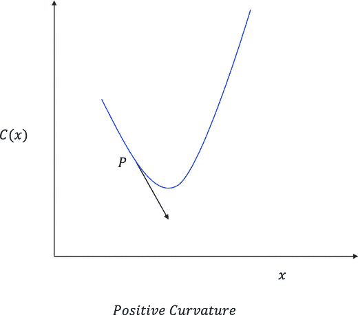

图 1-44

Cost function with positive curvature at point P

对于线性成本函数，如图 [1-42](#Fig43) 所示，梯度的负值会给我们达到最小值的最佳方向，因为函数是线性的，没有任何曲率。对于负曲率成本函数和正曲率成本函数，分别如图 [1-43](#Fig44) 和 [1-44](#Fig45) 所示，导数不会给我们一个好的最小值方向，因此为了处理曲率，我们需要 Hessian 和导数。正如我们所看到的，黑森数只不过是二阶导数的矩阵。它们包含关于曲率的信息，因此与简单的梯度下降相比，将为参数更新提供更好的方向。

梯度下降法是用于优化的一阶近似方法，而牛顿法是用于优化的二阶方法，因为它们使用 Hessian 连同梯度来处理成本函数中的曲率。

就拿我们通常的代价函数 C(θ)来说吧，这里是一个 n 维的模型参数向量。我们可以通过它的二阶泰勒级数展开来逼近θ邻域内的代价函数 C(θ)，如下图:

T3】

是梯度，H(θ)是成本函数 C(θ)的 Hessian。

现在，如果θ是迭代 t 时模型参数向量的值，并且(是迭代时模型参数的值，那么

哪里。

对取梯度，我们有

设置渐变为 0 我们得到

所以，牛顿法的参数更新如下:

我们没有牛顿方法的学习率，但是我们可以选择使用学习率，就像梯度下降一样。因为非线性成本函数的方向用牛顿方法更好，所以与梯度下降相比，收敛到最小值的迭代将更少。需要注意的一点是，如果我们试图优化的成本函数是二次成本函数，如线性回归中的成本函数，那么牛顿法在技术上可以一步收敛到最小值。

然而，计算 Hessian 矩阵及其逆矩阵有时计算量很大或很难处理，尤其是当输入要素的数量很大时。此外，有时可能会有 Hessian 甚至没有正确定义的功能。因此，对于大型机器学习和深度学习应用程序，梯度下降(尤其是随机梯度下降)技术与小批量一起使用，因为它们的计算强度相对较低，并且在数据量较大时可以很好地扩展。

### 约束优化问题

在约束优化问题中，除了我们需要优化的成本函数，我们还需要遵守一组约束。约束可能是等式或不等式。

每当我们想最小化一个受等式约束的函数时，我们就使用拉格朗日公式。假设我们必须根据最小化 f(θ)，其中。对于这样一个约束优化问题，我们需要最小化一个函数。取 L 相对于组合向量θ，λ的梯度(称为拉格朗日量),并将其设置为 0，将得到所需的θ，该θ使 f(θ)最小并符合约束条件。λ称为拉格朗日乘数。当有几个约束时，我们需要添加所有这样的约束，对每个约束使用单独的拉格朗日乘数。假设我们想使 f(θ)在 m 约束下最小化拉格朗日量可以表示如下:

其中![$$ \lambda ={\left[{\lambda}_1{\lambda}_2\kern1.25em ..\ {\lambda}_m\right]}^T $$](A448418_1_En_1_Chapter_IEq362.gif)

为了最小化函数，L(θ，λ)相对于θ和λ向量的梯度应该为零向量；即

前面的方法不能直接用于带有不等式的约束。在这种情况下，可以使用一种更通用的方法，称为 Karush Kahn Tucker 方法。

设 C(θ)是我们希望最小化的成本函数，其中。同样，对θ有 k 个约束，使得

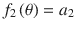

…

…

这变成了一个约束优化问题，因为θ应该遵守一些约束。每个不等式都可以转化为标准形式，其中某个函数小于或小于等于零。例如:

让每个这样的约束严格小于，或者小于等于零，用 g i (θ)来表示。还有，假设有一些严格的等式方程 e j (θ)。这种最小化问题通过拉格朗日公式的 Karush Kuhn Tucker 版本来解决。

不是最小化 C(θ)，我们需要最小化一个代价函数 L(θ，α，β)如下:

缩放器和被称为拉格朗日乘数，它们中的 k 个对应于 k 个约束。因此，我们将约束最小化问题转化为无约束最小化问题。

为了解决这个问题，卡鲁什·库恩·塔克条件应该在最小值点满足如下:

*   The gradient of L(θ, α, β)with respect to θ should be the zero vector; i.e.,

    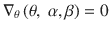

    

*   The gradient of the L(θ, α, β) with respect to β, which is the Lagrange multiplier vector corresponding to the equality conditions, should be zero:

    

    

*   The inequality conditions should become equality conditions at the minima point. Also, the inequality Lagrange multipliers should be non-negative:

    

求解前述条件将为约束优化问题提供最小值。

## 机器学习中的几个重要课题

在这一部分，我们将讨论几个与机器学习非常相关的重要话题。他们的底层数学非常丰富。

### 降维方法

主成分分析和奇异值分解是机器学习领域中最常用的降维技术。在这里，我们将在一定程度上讨论这些技术。请注意，这些数据简化技术是基于线性相关性的，并不捕捉非线性相关性，如共偏度、共峰度等。在本书的后半部分，我们将讨论一些基于人工神经网络的降维技术，比如自编码器。

#### 主成分分析

主成分分析是一种降维技术，理论上应该在“线性代数”一节中讨论。然而，为了使它的数学更容易掌握，我有意把它留到约束优化问题之后。我们来看看图 [1-45](#Fig46) 中的二维数据图。正如我们所见，数据的最大方差既不是沿着 x 方向，也不是沿着 y 方向，而是在两者之间的某个方向。因此，如果我们将数据投射到方差最大的方向，它将覆盖数据中的大部分可变性。此外，方差的其余部分可以作为噪声忽略。

图 1-45

Correlated 2-D data. a 1 and a 2 are the directions along which the data is uncorrelated and are the principal components .

沿 x 方向和 y 方向的数据高度相关(见图 [1-45](#Fig46) )。协方差矩阵将提供关于数据的所需信息，以减少冗余。我们可以不看 x 和 y 方向，而是看 a 1 方向，它具有最大的方差。

现在，让我们进行一些数学计算，假设我们没有图，只有 m 个样本的数据。

我们想在 n 维平面中按照方差递减的顺序找出独立的方向。我说的独立方向是指这些方向之间的协方差应该是 0。设 a 1 为数据方差最大的单位向量。我们首先减去数据向量的平均值，使数据以原点为中心。设μ为数据向量 x 的均值向量；即![$$ E\left[x\right] = \mu . $$](A448418_1_En_1_Chapter_IEq367.gif)

向量在 1 方向上的一个分量是在 1 方向上的投影；设用 z1:

var(z1)= var[]= a1Tcov(x)a1表示，其中 var 表示方差，cov(x)表示协方差矩阵。

对于给定的数据点，方差是一个 1 的函数。因此，我们必须最大化相对于 a 1 的方差，因为 a 1 是一个单位向量:

因此，我们可以把要最大化的函数表示为

，其中λ为拉格朗日乘数。

对于最大值，设置 L 相对于 a 1 的梯度为 0，我们得到

我们可以看到一些我们之前学过的东西。a 1 向量无非是协方差矩阵的一个本征向量，λ是对应的本征值。

现在，把这个代入沿 a 1 的方差表达式，我们得到

由于沿 a 1 的方差的表达式是特征值本身，对应于最高特征值的特征向量给我们第一主分量，或数据中方差最大的方向。

现在，让我们得到第二个主成分，或者方差最大的方向就在 1 之后。

设第二主分量的方向由单位向量 a 2 给出。因为我们在寻找正交分量，所以 a 2 的方向应该垂直于 a 1 。

数据沿 a 2 的投影可以用变量 z 2 = 来表示

因此，数据沿 a 2 的方差为 Var(z2)= Var[]= a2Tcov(x)a2。

我们必须在约束条件下最大化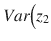，因为 2 是一个单位向量

a2T2】Ta1= 0 既然 a 2 应该与 a 1 正交。

我们需要最大化下面的函数 L(a 2 ，α，β)关于参数 a 2 ，α，β:

通过对 a 2 取一个梯度，并将其设置为零向量，我们得到

通过取梯度与向量 a 1 的点积，我们得到

a1Tcov(x)a2是一个标量，可以写成2Tcov(x)a1。

论简化，a2T2】Tcov(x)a1=。还有，项 2αa1T9】Ta2等于 0，剩下。由于，β必须等于 0。

将表达式中的替换为，我们得到:

因此，第二主成分也是协方差矩阵的本征向量，并且本征值α必须是紧随λ之后的第二大本征值。这样，我们将从协方差矩阵获得 n 个本征向量，并且沿着这些本征值方向(或主成分)中的每一个的数据的方差将由本征值表示。需要注意的一点是，协方差矩阵总是对称的，因此本征向量总是彼此正交，因此给出独立的方向。

协方差矩阵总是半正定的。

这是真的，因为协方差矩阵的特征值代表方差，方差不能为负。如果 cov(x)是正定的，即，那么协方差矩阵的所有特征值都是正的。

图 1-46

Principal component analysis centers the data and then projects the data into axes along which variance is maximum. The data along z 2 can be ignored if the variance along it is negligible.

图 [1-46](#Fig47) 说明了数据的主成分分析转换。正如我们所看到的，主成分分析使数据居中，并消除了 PCS 转换变量之间的任何相关性。

##### 主成分分析在数据简化中什么时候有用？

当输入的不同维度之间存在高相关性时，将只有几个独立的方向，沿着这些方向，数据的方差将是高的，而沿着其他方向，方差将是不显著的。使用 PCA，可以保留方差高的几个方向上的数据成分，并对总体方差做出显著贡献，而忽略其余数据。

##### 如何知道所选主成分保留了多少方差？

如果 z 向量表示输入向量 x 的变换分量，则 cov(z)将是对角矩阵，包含 cov(x)矩阵的特征值作为其对角元素。

![$$ cov(z) = \left[\begin{array}{ccc}\hfill {\lambda}_1\hfill & \hfill \cdots \hfill & \hfill 0\hfill \\ {}\hfill \vdots \hfill & \hfill {\lambda}_{2\kern0.5em }\hfill & \hfill \vdots \hfill \\ {}\hfill 0\hfill & \hfill \cdots\ \hfill & \hfill {\lambda}_n\hfill \end{array}\right] $$](A448418_1_En_1_Chapter_Equhh.gif)T2】

同样，让我们假设特征值像一样排序

假设我们选择只保留前 k 个主成分；捕获的数据中方差的比例如下:

#### 奇异值分解

奇异值分解是一种降维技术，它将矩阵分解为三个矩阵的乘积，如所示，其中

并且由矩阵 AA T 的所有特征向量组成

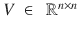并且由矩阵 A 的所有特征向量组成 T A

并且由 A  T  A 和 AA T 的特征向量的 k 个平方根组成，其中 k 是矩阵 A 的秩

U 的列向量都彼此正交，因此形成正交基。同样，V 的列向量也形成正交基:

![$$ U=\left[{u}_1{u}_2\kern0.5em \dots \kern0.5em {u}_m\right] $$](A448418_1_En_1_Chapter_Equhj.gif)

其中是 U.

![$$ V=\left[{v}_1{v}_2\kern0.5em \dots \kern0.5em {v}_m\right] $$](A448418_1_En_1_Chapter_Equhk.gif)

的列向量

其中为

![$$ S = \left[\begin{array}{ccc}\hfill {\sigma}_1\hfill & \hfill \cdots \hfill & \hfill 0\hfill \\ {}\hfill \vdots \kern1.5em \hfill & \hfill {\sigma}_2\hfill & \hfill \vdots \hfill \\ {}\hfill 0\hfill & \hfill \cdots\ \hfill & \hfill 0\hfill \end{array}\right] $$](A448418_1_En_1_Chapter_Equhl.gif)

的列向量

根据 A 的等级，会有σ 1 ，σ 2 … …σ k 矩阵 A 的秩 k 对应的对角元:

也称为奇异值，是 A  T  A 和 AA T 的特征值的平方根，因此它们是数据中方差的度量。每个都是一个秩 1 矩阵。我们只能保留奇异值显著的秩 1 矩阵，并解释数据中相当大比例的方差。

如果只取对应于最大幅度的前 p 个奇异值的前 p 个秩一矩阵，则数据中保留的方差由下式给出:

可以使用奇异值分解来压缩图像。类似地，在协同过滤中使用奇异值分解来将用户评级矩阵分解成包含用户向量和项目向量的两个矩阵。矩阵的奇异值分解由 USV T 给出。用户评级矩阵 R 可以分解如下:

其中 U’是用户向量矩阵并且等于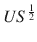，V’是项目向量矩阵，其中。

### 正规化

建立机器学习模型的过程包括导出符合训练数据的参数。如果模型是简单的，那么该模型对数据的变化缺乏敏感性，并且遭受高偏差。但是，如果模型过于复杂，它会尝试为尽可能多的变化建模，并在此过程中为训练数据中的随机噪声建模。这消除了简单模型产生的偏差，但引入了高方差；即，模型对输入中非常小的变化敏感。模型的高方差不是一件好事，尤其是当数据中的噪声相当大时。在这种情况下，追求在训练数据上表现太好的模型在测试数据集上表现很差，因为模型失去了用新数据很好地概括的能力。模型遭受高方差的问题被称为过拟合。

图 1-47

Illustration of models with high variance and high bias

如图 [1-47](#Fig48) 所示，我们有三个模型符合数据。平行于水平线的一条曲线遭受高偏差，而弯曲的一条曲线遭受高方差。与水平线成 45 度角的直线既没有高方差也没有高偏差。

具有高方差的模型在训练数据上表现良好，但在测试数据集上表现不佳，即使数据集的性质没有太大变化。用蓝色表示的模型可能不完全符合训练，但它在测试数据上表现得更好，因为该模型不会受到高方差的影响。关键是要有一个不会遭受高偏差的模型，同时也不会复杂到可以模拟随机噪声。

具有高方差的模型通常具有大幅度的模型参数，因为模型对数据中微小变化的敏感性很高。为了克服由高模型方差导致的过拟合问题，广泛使用一种称为正则化的流行技术。

为了客观地看待问题，让我们来看看我们之前看到的线性回归成本函数:

如前所述，具有高方差的模型具有大幅度的模型参数。我们可以在成本函数 C(θ)中加入一个额外的分量，在模型参数向量的幅度很高的情况下，该分量对总成本函数不利。

因此，我们可以有一个新的成本函数，其中‖θ‖  2  2 是模型参数向量的 l 2 范数的平方。最优化问题变成了

将梯度与θ相对应，并将其设置为 0，得到

现在，我们可以看到，由于成本函数中的‖θ‖ 2 2 项，模型参数的幅度不能太大，因为它会对整体成本函数不利。λ决定正则项的权重。较高的λ值会导致较小的‖θ22值，从而使模型更简单，更容易出现高偏差或欠拟合。一般来说，更小的λ值对降低模型复杂性和模型方差大有帮助。λ通常使用交叉验证进行优化。

当 l 2 范数的平方作为正则化项时，该优化方法称为 l 2 正则化。有时，模型参数向量的 l 1 范数被用作正则化项，并且优化方法被称为 l 1 正则化。l 2 应用于回归问题的正则化称为岭回归，而 l 1 应用于此类回归问题的正则化称为 lasso 回归。

对于 l 1 正则化，前面的回归问题就变成了

岭回归在数学上更方便，因为它有封闭形式的解，而套索回归没有封闭形式的解。然而，与岭回归相比，lasso 回归对异常值更稳健。套索问题给出了稀疏解，因此适用于要素选择，尤其是当输入要素之间存在中度到高度相关性时。

### 视为约束优化问题的正则化

除了添加罚项，我们还可以添加一个约束，使模型参数向量的大小小于或等于某个常数值。于是我们可以有一个优化问题如下:

使得

其中 b 是常数。

我们可以通过创建一个新的拉格朗日公式，将这个约束极小化问题转化为无约束极小化问题，如下所示:

为了根据卡鲁什库恩塔克条件最小化拉格朗日成本函数，以下是重要的:

*   The gradient of Lwith respect to θ;i.e., should be the zero vector, which on simplification gives

    

    (1)
*   同样在最优点 = 0 和如果我们考虑正则化，即，那么 (2)

从(1)可以看出，得到的θ是λ的函数。应调整λ，以满足(2)中的约束条件。

从(1)得到的解与我们从 l 2 正则化得到的相同。在机器学习应用中，拉格朗日乘数通常通过超参数调整或交叉验证来优化，因为我们不知道 b 的最佳值是多少。当我们取较小的λ值时，b 的值增加，θ的范数也增加，而较大的λ值提供较小的 b，因此θ的范数也较小。

回到正则化，代价函数中惩罚模型复杂性的任何分量提供正则化。在基于树的模型中，随着叶节点数量的增加，树的复杂性也在增加。我们可以在成本函数中添加一个基于树中叶子节点数量的项，它将提供正则化。对于树的深度可以做类似的事情。

甚至提前停止模型训练过程也提供了正则化。例如，在梯度下降法中，我们运行的迭代次数越多，模型就变得越复杂，因为每次迭代梯度下降都试图进一步降低成本函数值。我们可以根据一些标准提前停止模型学习过程，例如迭代过程中测试数据集的成本函数值的增加。每当在训练的迭代过程中训练成本函数值降低而测试成本函数值增加时，这可能是过度拟合开始的指示，因此停止迭代学习是有意义的。

每当训练数据少于模型必须学习的参数数量时，就很有可能过度拟合，因为模型将学习小数据集的太多规则，并且可能无法很好地推广到看不见的数据。如果数据集与参数的数量相比是足够的，那么学习到的规则超过了群体数据的很大比例，因此模型过度拟合的机会降低了。

## 摘要

在这一章中，我们已经触及了继续进行机器学习和深度学习概念所需的所有数学概念。读者仍然被建议在他或她的空闲时间浏览与这些主题相关的合适的教科书以获得更清晰的理解。然而，这一章是一个很好的起点。在下一章，我们将从人工神经网络和张量流的基础知识开始。