# 4.使用循环神经网络的自然语言处理

在现代信息和分析时代，自然语言处理(NLP)是最重要的技术之一。从人工智能的角度来看，理解语言中的复杂结构并从中获得洞察力和行动是至关重要的。在几个领域中，自然语言处理的重要性是至关重要的，并且日益增长，因为以语言形式的数字信息无处不在。自然语言处理的应用包括语言翻译、情感分析、网络搜索应用、客户服务自动化、文本分类、从文本中检测主题、语言建模等等。传统的自然语言处理方法依赖于单词模型包、单词模型的向量空间以及现成的编码知识库和本体。自然语言处理的一个关键领域是语言的句法和语义分析。句法分析是指单词在句子中是如何分组和连接的。句法分析的主要任务是标注词性，检测句法类别(如动词、名词、名词短语等。)，并通过构造语法树来组装句子。语义分析指的是复杂的任务，例如查找同义词、执行单词-动词歧义消除等等。

## 向量空间模型(VSM)

在 NLP 信息检索系统中，文档通常被简单地表示为它所包含的字数的向量。为了检索与特定文档相似的文档，计算该文档与其他文档之间的角度余弦或点积。两个向量之间角度的余弦给出了基于它们向量组成之间的相似性的相似性度量。为了说明这个事实，让我们看两个向量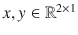，如下所示:

![ $$ {\displaystyle \begin{array}{l}x={\left[\ 2\kern0.5em 3\right]}^T\\ {}y={\left[\ 4\kern0.5em 6\right]}^T\end{array}} $$ ](A448418_1_En_4_Chapter_Equa.gif)

虽然向量 x 和 y 是不同的，但是它们的余弦相似度是最大可能值 1。这是因为这两种载体的成分组成是相同的。两个向量的第一分量与第二分量的比率是，因此在内容构成方面它们被视为是相似的。因此，具有高余弦相似性的文档通常被认为本质上是相似的。

假设我们有两个句子:

![$$ Doc1=\left[ The\kern0.5em dog\kern0.5em chased\kern0.5em the\kern0.5em cat\right] $$](A448418_1_En_4_Chapter_Equb.gif)

![ $$ Doc2=\left[\ The\ cat\ was chased down\ by\ the\ dog\right] $$ ](A448418_1_En_4_Chapter_Equc.gif)

两个句子中不同单词的数量将是这个问题的向量空间维度。不同的单词是 The、dog、chasing、The、cat、down、by 和 was，因此我们可以将每个文档表示为一个单词计数的八维向量。


![ $$ Doc1=\left[\kern1em 1\kern2.75em 1\kern3em 1\kern3em 1\kern2.25em 1\kern2.5em 0\kern2.75em 0\kern2.75em 0\right]\in {\mathrm{\mathbb{R}}}^{8\times 1} $$ ](A448418_1_En_4_Chapter_Eque.gif)

![ $$ Doc2=\left[\kern1em 1\kern3em 1\kern2.75em 1\kern3em 1\kern2.25em 1\kern2.5em 1\kern2.75em 1\kern3em 1\right]\in {\mathrm{\mathbb{R}}}^{8\times 1} $$ ](A448418_1_En_4_Chapter_Equf.gif)

如果我们用 v <sub>1</sub> 表示 Doc1，用 v <sub>2</sub> 表示 Doc2，那么余弦相似度可以表示为


其中||v <sub>1</sub> ||是向量 v <sub>1</sub> 的大小或 l <sup>2</sup> 范数。

如前所述，余弦相似性基于每个向量的分量组成给出了相似性的度量。如果文档向量的分量在某种程度上比例相似，余弦距离将会很高。它没有考虑矢量的大小。

在某些情况下，当文档的长度变化很大时，采用文档向量之间的点积，而不是余弦相似度。这是在与文档内容一起比较文档大小时完成的。例如，我们可以有一条 tweet，其中单词 global 和 economics 的字数可能分别为 1 和 2，而报纸文章对于相同的单词的字数可能分别为 50 和 100。假设两个文档中的其他单词数量不多，则推文和报纸文章之间的余弦相似度将接近 1。由于推文的大小明显较小，全球和经济的字数比例为 1:2，与报纸文章中这些词的比例 1:2 相比并不真正。因此，为几个应用程序的这些文档分配如此高的相似性度量实际上没有意义。在这种情况下，采用点积而不是余弦相似性作为相似性度量是有帮助的，因为它通过两个文档的单词向量的幅度来放大余弦相似性。对于可比较的余弦相似性，具有较高幅度的文档将具有较高的点积相似性，因为它们具有足够的文本来证明它们的单词组成。小文本的单词组合可能只是偶然的，而不是其预期表示的真实表示。对于大多数文档长度相当的应用程序来说，余弦相似性是一个足够公平的度量。


图 4-1。

Cosine similarity between two word vectors

图 [4-1](#Fig1) 图示了两个向量 v <sub>1</sub> 和 v <sub>2</sub> ，余弦相似度为它们之间夹角θ的余弦。

有时，使用余弦相似性的距离对应物是有意义的。余弦距离被定义为需要计算距离的原始向量方向上的单位向量之间的欧几里德距离的平方。对于两个向量 v <sub>1</sub> 和 v <sub>2</sub> 成θ角，余弦距离由给出

这可以通过取单位向量和之间的欧几里德距离的平方很容易地推导出来，如下所示:


现在，u <sub>1</sub> 和 u <sub>2</sub> 是单位向量，它们的大小||u <sub>1</sub> ||和||u <sub>2</sub> ||分别都等于 1，因此


通常，当使用文档术语频率向量时，不获取原始术语/单词计数，而是通过单词在语料库中的使用频率来归一化。例如,“the”这个词在任何语料库中都是一个频繁出现的词，它在两个文档中的出现频率很高。的这种高计数可能会增加余弦相似性，而我们知道该术语在任何语料库中都是频繁出现的词，对文档相似性的贡献应该很小。文档术语向量中的这种词的计数受到一个称为逆文档频率的因子的惩罚。

对于在文档 d 中出现 N 次并且在语料库中 M 个文档中的 N 个文档中出现的术语词 t，在应用逆文档频率之后的归一化计数是


正如我们所见，随着 N 相对于 M 的增加，分量逐渐减小，直到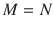的分量为零。因此，如果一个单词在语料库中非常流行，那么它不会对单个文档术语向量有太大贡献。在文档中具有高频率但在语料库中不太频繁的单词将对文档术语向量贡献更多。这种规范化方案通常被称为，它是术语频率逆文档频率的缩写形式。一般来说，出于实用目的，将作为分母，以避免零导致对数函数未定义。因此，逆文档频率可以重新表述为

归一化方案甚至应用于频率 n 项，使其成为非线性的。一种流行的这种归一化方案是 BM25，其中对于小的 n 值，文档频率贡献是线性的，然后随着 n 的增加，该贡献饱和。术语频率在 BM25 中被归一化如下:


其中 k 是为不同的 k 值提供不同形状的参数，并且需要基于语料库来优化 k。


图 4-2。

Normalized term frequency versus term frequency for different methods

在图 [4-2](#Fig2) 中，不同规格化方案的规格化词频与词频相对应。平方根变换使相关性呈亚线性，而的 BM25 图非常激进，曲线在超过 5 的项频率时饱和。如前所述，k 可以通过交叉验证或其他基于问题需求的方法进行优化。

## 单词的向量表示

正如文档被表示为不同单词计数的向量一样，语料库中的单词也可以被表示为向量，其组成部分是该单词在每个文档中的计数。

将单词表示为向量的其他方式是，如果单词出现在文档中，则将特定于文档的组件设置为 1，如果单词不在文档中，则将组件设置为 0。

![ $$ {\displaystyle \begin{array}{l}{\kern5.25em }^{\hbox{'}} Th{e}^{\prime}\kern1em do{g}^{\prime}\kern1em chase{d}^{\prime}\kern0.75em th{e}^{\prime}\kern0.75em ca{t}^{\prime}\kern1em do w{n}^{\prime}\kern0.5em b{y}^{\prime \hbox{'}}{was}^{\hbox{'}}\\ {} Doc1=\left[\kern1em 1\kern2.75em 1\kern3em 1\kern3em 1\kern2.25em 1\kern2.5em 0\kern2.75em 0\kern2.75em 0\right]\kern1.25em \in {\mathrm{\mathbb{R}}}^{8\times 1}\\ {} Doc2=\left[\kern1em 1\kern3em 1\kern2.75em 1\kern3em 1\kern2.25em 1\kern2.5em 1\kern2.75em 1\kern3em 1\right]\kern1em \in {\mathrm{\mathbb{R}}}^{8\times 1}\end{array}} $$ ](A448418_1_En_4_Chapter_Equm.gif)T2】

再次使用相同的例子，单词 the 可以在两个文档的语料库中表示为二维向量[1 1] <sup>T</sup> 。在一个巨大的文档语料库中，单词向量的维数也会很大。像文档相似性一样，单词相似性可以通过余弦相似性或点积来计算。

另一种在语料库中表示单词的方法是一次性编码。在这种情况下，每个单词的维度将是语料库中唯一单词的数量。每个单词将对应于一个索引，该索引将被设置为 1，而所有其他剩余的条目将被设置为 0。所以，每一个都非常稀少。对于不同的索引，即使是相似的单词也会有设置为 1 的条目，因此任何类型的相似性度量都不起作用。

为了更好地表示单词向量，以便可以更有意义地捕捉单词的相似性，同时也为了减少单词向量的维数，引入了 Word2Vec。

## Word2Vec

Word2Vec 是一种将单词表示为向量的智能方式，它通过将单词与其邻域中的单词进行训练来实现。当考虑单词的 Word2Vec 表示时，上下文与给定单词相似的单词将产生高余弦相似度或点积。

通常，语料库中的单词相对于其邻域中的单词被训练，以导出 Word2Vec 表示的集合。提取 Word2Vec 表示的两种最流行的方法是 CBOW(连续单词包)方法和 Skip-Gram 方法。CBOW 背后的核心思想如图 [4-3](#Fig3) 所示。

### 连续单词包(CBOW)

CBOW 方法试图从特定窗口长度内相邻单词的上下文中预测中心单词。让我们看看下面的句子，并考虑一个五个窗口作为一个邻域。

T1

在第一种情况下，我们将试图预测这个词是从它的邻居那只猫身上蹦出来的。在第二个例子中，当我们将窗口滑动一个位置时，我们将尝试从相邻的单词 cat jumped the fence 中预测单词 over。这一过程将对整个语料库重复进行。


图 4-3。

Continuous Bag of Words model for word embeddings

如图 [4-3](#Fig3) 所示，连续词袋模型(CBOW)以上下文词为输入，以中心词为输出进行训练。输入层中的单词被表示为独热编码矢量，其中特定单词的分量被设置为 1，所有其他分量被设置为 0。语料库中唯一单词的数量 V 决定了这些独一无二的编码向量的维度，因此也决定了。每个独热编码向量 x <sup>(t)</sup> 乘以输入嵌入矩阵以提取特定于该单词的单词嵌入向量。u <sup>(k)</sup> 中的索引 k 表示 u <sup>(k)</sup> 是为词汇表中的第 k 个单词嵌入的单词。隐藏层向量 h 是窗口中所有上下文单词的输入嵌入向量的平均值，因此具有与单词嵌入向量相同的维数。

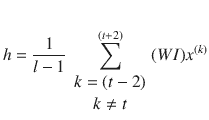

其中 l 是窗口的长度尺寸。

为了清楚起见，假设我们有一个六个单词的词汇表——即——单词是猫、老鼠、追逐、花园、the 和 was。

让它们的独热编码按顺序占据索引，这样它们可以表示如下:

![ $$ {x}_{cat}=\left[\begin{array}{c}1\\ {}0\\ {}0\\ {}0\\ {}0\\ {}0\end{array}\right]\kern2em {x}_{rat}=\left[\begin{array}{c}0\\ {}1\\ {}0\\ {}0\\ {}0\\ {}0\end{array}\right]{x}_{chased}=\left[\begin{array}{c}0\\ {}0\\ {}1\\ {}0\\ {}0\\ {}0\end{array}\right]{x}_{garden}=\left[\begin{array}{c}0\\ {}0\\ {}0\\ {}1\\ {}0\\ {}0\end{array}\right]{x}_{the}=\left[\begin{array}{c}0\\ {}0\\ {}0\\ {}0\\ {}1\\ {}0\end{array}\right]{x}_{was}=\left[\begin{array}{c}0\\ {}0\\ {}0\\ {}0\\ {}0\\ {}1\end{array}\right] $$ ](A448418_1_En_4_Chapter_Equp.gif)

让输入嵌入表示如下:

![ $$ {\displaystyle \begin{array}{l}\kern2.75em cat\kern1em rat\kern1em chased\kern0.5em garden\kern0.5em the\kern2em was\\ {} WI=\left[\begin{array}{cccccc}0.5& 0.3& 0.1& \kern1.5em 0.01& \kern0.5em 0.2& 0.2\\ {}0.7& 0.2& 0.1& \kern1.5em 0.02& \kern0.5em 0.3& 0.3\\ {}0.9& 0.7& 0.3& \kern1.5em 0.4& \kern0.5em 0.4& 0.33\\ {}0.8& 0.6& 0.3& \kern1.5em 0.53& \kern0.5em 0.91& 0.4\\ {}0.6& 0.5& 0.2& \kern1.5em 0.76& \kern0.5em 0.6& 0.5\end{array}\right]\end{array}} $$ ](A448418_1_En_4_Chapter_Equq.gif)

一旦我们将单词嵌入矩阵乘以单词的独热编码向量，我们就得到该单词的单词嵌入向量。因此，通过将 cat 的独热向量(即，x <sub>cat</sub> )乘以输入嵌入矩阵 WI，将得到对应于 cat 的 WI 矩阵的第一列，如下所示:

![ $$ {\displaystyle \begin{array}{l}\kern27.25em \left[ WI\right]\left[{x}_{cat}\right]\\ {}=\left[\begin{array}{cccccc}0.5& 0.3& 0.1& 0.01& 0.2& 0.2\\ {}0.7& 0.2& 0.1& 0.02& 0.3& 0.3\\ {}0.9& 0.7& 0.3& 0.4& 0.4& 0.33\\ {}0.8& 0.6& 0.3& 0.53& 0.91& 0.4\\ {}0.6& 0.5& 0.2& 0.76& 0.6& 0.5\end{array}\right]\left[\begin{array}{c}1\\ {}0\\ {}0\\ {}0\\ {}0\\ {}0\end{array}\right]=\left[\begin{array}{c}0.5\\ {}0.7\\ {}0.9\\ {}0.8\\ {}0.6\end{array}\right]\end{array}} $$ ](A448418_1_En_4_Chapter_Equr.gif)

![ $$ \left[\begin{array}{c}0.5\\ {}0.7\\ {}0.9\\ {}0.8\\ {}0.6\end{array}\right] $$ ](A448418_1_En_4_Chapter_IEq17.gif)是单词 cat 的单词嵌入向量。

类似地，提取输入单词的所有单词嵌入向量，并且它们的平均值是隐藏层的输出。

隐藏层 h 的输出应该表示目标单词的嵌入。

词汇表中的所有单词在输出嵌入矩阵中都有另一组单词嵌入。让 WO 中的单词嵌入由表示，其中索引 j 表示按照在独热编码方案和输入嵌入矩阵中维护的顺序，词汇表中的第 j 个单词。【T2![ $$ WO=\left[\begin{array}{c}{v^{(1)}}^T\to \\ {}{v^{(2)}}^T\to \\ {}.\\ {}{v^{(j)}}^T\to \\ {}.\\ {}{v^{(V)}}^T\to \end{array}\right] $$ ](A448418_1_En_4_Chapter_Equs.gif)

通过将矩阵 WO 乘以 h 来计算每个 v <sup>( j)</sup> 的隐藏层嵌入 h 的点积。如我们所知，点积将给出每个输出单词嵌入和隐藏层计算嵌入 h 的相似性度量。通过 SoftMax 将点积标准化为概率，并且基于目标单词 w <sup>(t)</sup> ，计算分类交叉熵损失并通过梯度下降进行反向传播，以更新输入和输出嵌入矩阵的矩阵权重。

对 SoftMax 层的输入可以表示如下:

![ $$ \left[ WO\right]\left[h\right]=\left[\begin{array}{c}{v^{(1)}}^T\to \\ {}{v^{(2)}}^T\to \\ {}.\\ {}{v^{(j)}}^T\to \\ {}.\\ {}{v^{(V)}}^T\to \end{array}\right]\left[h\right]=\left[{v^{(1)}}^Th\kern0.75em {v^{(2)}}^Th\dots .\kern1em {v^{(j)}}^Th\kern2.25em {v^{(V)}}^Th\right] $$ ](A448418_1_En_4_Chapter_Equt.gif)

给定上下文单词，词汇表 w <sup>(j)</sup> 的第 j 个单词的 SoftMax 输出概率由下面给出:


如果实际输出由独热码编码向量![ $$ y={\left[{y}_1{y}_2\kern0.5em \dots {y}_j\kern0.5em \dots {y}_n\right]}^T\in {\mathrm{\mathbb{R}}}^{V\times 1} $$ ](A448418_1_En_4_Chapter_IEq21.gif)表示，其中 y <sub>j</sub> 中只有一个为 1(即，那么目标单词及其上下文单词的特定组合的损失函数可以由下面给出:


不同的 p <sup>(j)</sup> s 取决于输入和输出嵌入矩阵的分量，这些分量是成本函数 c 的参数。成本函数可以通过反向传播梯度下降技术相对于这些嵌入参数最小化。

为了更直观，假设我们的目标变量是`cat`。如果隐藏层向量 h 给出了与`cat`的外部矩阵字嵌入向量的最大点积，而与其他外部字嵌入的点积较低，则嵌入向量或多或少是正确的，并且非常小的误差或对数损失将被反向传播以校正嵌入矩阵。然而，假设 h 与`cat`的点积较小，而其他外部嵌入向量的点积较大；SoftMax 的损失将非常高，因此更多的误差/对数损失将被反向传播以减少误差。

### TensorFlow 中连续词袋的实现

连续单词包 TensorFlow 的实现已经在本节中进行了说明。距离任一侧两个以内的相邻单词被用来预测中间的单词。输出层是整个词汇表的一个大的软 Max。单词嵌入向量被选择为大小为 128。清单 [4-1a](#Par44) 中概述了详细的实现。另见图 [4-4](#Fig4) 。


图 4-4。

TSNE plot for the word-embeddings vectors learned from CBOW

```py
import numpy as np
import tensorflow as tf
from sklearn.manifold import TSNE
import matplotlib.pyplot as plt
%matplotlib inline

def one_hot(ind,vocab_size):
    rec = np.zeros(vocab_size)
    rec[ind] = 1
    return rec

def create_training_data(corpus_raw,WINDOW_SIZE = 2):
    words_list = []

    for sent in corpus_raw.split('.'):
        for w in sent.split():
            if w != '.':
                words_list.append(w.split('.')[0])   # Remove if delimiter is tied to the end of a word

    words_list = set(words_list)                     # Remove the duplicates for each word

    word2ind = {}                                    # Define the dictionary for converting a word to index
    ind2word = {}                                    # Define dictionary for retrieving a word from its index

    vocab_size = len(words_list)                    # Count of unique words in the vocabulary

    for i,w in enumerate(words_list):               # Build the dictionaries
        word2ind[w] = i
        ind2word[i] = w

    print word2ind
    sentences_list = corpus_raw.split('.')
    sentences = []

    for sent in sentences_list:
        sent_array = sent.split()
        sent_array = [s.split('.')[0] for s in sent_array]
        sentences.append(sent_array)               # finally sentences would hold arrays of word array for sentences

    data_recs = []                                            # Holder for the input output record

    for sent in sentences:
        for ind,w in enumerate(sent):
            rec = []
            for nb_w in sent[max(ind - WINDOW_SIZE, 0) : min(ind + WINDOW_SIZE, len(sent)) + 1] :
                if nb_w != w:
                    rec.append(nb_w)
                data_recs.append([rec,w])

    x_train,y_train = [],[]

    for rec in data_recs:
        input_ = np.zeros(vocab_size)
        for i in xrange(WINDOW_SIZE-1):
            input_ += one_hot(word2ind[ rec[0][i] ], vocab_size)
        input_ = input_/len(rec[0])
        x_train.append(input_)
        y_train.append(one_hot(word2ind[ rec[1] ], vocab_size))

    return x_train,y_train,word2ind,ind2word,vocab_size

corpus_raw = "Deep Learning has evolved from Artificial Neural Networks, which has been there since the 1940s. Neural Networks are interconnected networks of processing units called artificial neurons that loosely mimic axons in a biological brain. In a biological neuron, the dendrites receive input signals from various neighboring neurons, typically greater than 1000\. These modified signals are then passed on to the cell body or soma of the neuron, where these signals are summed together and then passed on to the axon of the neuron. If the received input signal is more than a specified threshold, the axon will release a signal which again will pass on to neighboring dendrites of other neurons. Figure 2-1 depicts the structure of a biological neuron for reference. The artificial neuron units are inspired by the biological neurons with some modifications as per convenience. Much like the dendrites, the input connections to the neuron carry the attenuated or amplified input signals from other neighboring neurons. The signals are passed on to the neuron, where the input signals are summed up and then a decision is taken what to output based on the total input received. For instance, for a binary threshold neuron an output value of 1 is provided when the total input exceeds a pre-defined threshold; otherwise, the output stays at 0\. Several other types of neurons are used in artificial neural networks, and their implementation only differs with respect to the activation function on the total input to produce the neuron output. In Figure 2-2 the different biological equivalents are tagged in the artificial neuron for easy analogy and interpretation."

corpus_raw = (corpus_raw).lower()
x_train,y_train,word2ind,ind2word,vocab_size= create_training_data(corpus_raw,2)

import tensorflow as tf
emb_dims = 128
learning_rate = 0.001

#---------------------------------------------
# Placeholders for Input output
#----------------------------------------------
x = tf.placeholder(tf.float32,[None,vocab_size])
y = tf.placeholder(tf.float32,[None,vocab_size])
#---------------------------------------------
# Define the Embedding matrix weights and a bias
#----------------------------------------------
W = tf.Variable(tf.random_normal([vocab_size,emb_dims],mean=0.0,stddev=0.02,dtype=tf.float32))
b = tf.Variable(tf.random_normal([emb_dims],mean=0.0,stddev=0.02,dtype=tf.float32))
W_outer = tf.Variable(tf.random_normal([emb_dims,vocab_size],mean=0.0,stddev=0.02,dtype=tf.float32))
b_outer = tf.Variable(tf.random_normal([vocab_size],mean=0.0,stddev=0.02,dtype=tf.float32))

hidden = tf.add(tf.matmul(x,W),b)
logits = tf.add(tf.matmul(hidden,W_outer),b_outer)
cost = tf.reduce_mean(tf.nn.softmax_cross_entropy_with_logits(logits=logits, labels=y))
optimizer = tf.train.AdamOptimizer(learning_rate=learning_rate).minimize(cost)

epochs,batch_size = 100,10
batch = len(x_train)//batch_size

# train for n_iter iterations
with tf.Session() as sess:
    sess.run(tf.global_variables_initializer())
    print 'was here'
    for epoch in xrange(epochs):
        batch_index = 0
        for batch_num in xrange(batch):
            x_batch = x_train[batch_index: batch_index +batch_size]
            y_batch = y_train[batch_index: batch_index +batch_size]
            sess.run(optimizer,feed_dict={x: x_batch,y: y_batch})
            print('epoch:',epoch,'loss :', sess.run(cost,feed_dict={x: x_batch,y: y_batch}))
    W_embed_trained = sess.run(W)

W_embedded = TSNE(n_components=2).fit_transform(W_embed_trained)
plt.figure(figsize=(10,10))
for i in xrange(len(W_embedded)):
    plt.text(W_embedded[i,0],W_embedded[i,1],ind2word[i])

plt.xlim(-150,150)
plt.ylim(-150,150)

--output--
('epoch:', 99, 'loss :', 1.0895648e-05)

Listing 4-1a.Continuous Bag of Words Implementation in TensorFlow

```

学习到的单词嵌入通过 TSNE 情节被投射到一个 2D 平面。TSNE 图给出了一个给定单词的邻域的粗略概念。我们可以看到学习到的单词嵌入向量是合理的。例如，单词 deep 和 learning 彼此非常接近。同样，生物和参照这两个词也很接近。

### 单词嵌入的跳格模型

跳过 gram 模型的工作方式正好相反。在 Skip-gram 模型中，上下文单词是基于当前单词来预测的，而不是像在连续单词包中那样试图从上下文单词中预测当前单词。通常，给定一个当前单词，在每个窗口中取其邻域中的上下文单词。对于给定的五个单词的窗口，将有四个上下文单词需要基于当前单词来预测。图 [4-5](#Fig5) 显示了 Skip-gram 模型的高级设计。很像连续的单词包，在 Skip-gram 模型中，需要学习两组单词嵌入:一组用于输入单词，一组用于输出上下文单词。跳格模型可以被看作是一个反向的连续单词袋模型。


图 4-5。

Skip-gram model for word embeddings

在 CBOW 模型中，模型的输入是当前单词的独热编码向量，其中 V 是语料库的词汇大小。然而，与 CBOW 不同，这里输入的是当前单词，而不是上下文单词。假定 x <sup>(t)</sup> 表示词汇表中的第 k 个单词，当输入 x <sup>(t)</sup> 乘以输入单词嵌入矩阵 WI 时，产生单词嵌入向量。如前所述，n 代表单词嵌入的维度。隐层输出 h 无非是 u <sup>(k)</sup> 。

正如在 CBOW 中一样，通过计算[WO][h]用外部嵌入矩阵的每个字向量 v<sup>[j]</sup>计算隐藏层输出 h 的点积。然而，基于我们将要预测的上下文单词的数量，有多个 SoftMax 层，而不是一个 SoftMax 输出层。例如，在图 [4-5](#Fig5) 中，有四个 SoftMax 输出层对应于四个上下文单词。每个 SoftMax 层的输入都是[WO][h]中相同的点积集，表示输入单词与词汇表中每个单词的相似程度。

![ $$ \left[ WO\right]\left[h\right]=\kern0.5em \left[{v^{(1)}}^Th\kern0.75em {v^{(2)}}^Th\dots .\kern1em {v^{(j)}}^Th\kern2.25em {v^{(V)}}^Th\right] $$ ](A448418_1_En_4_Chapter_Equw.gif)

类似地，所有 SoftMax 层将接收对应于所有词汇单词的相同概率集，其中给定当前单词的第 j 个单词 w <sup>(j)</sup> 或中心单词 w <sup>(k)</sup> 的概率由以下给出:


如果有四个目标单词，并且它们的独热编码向量由表示，则单词组合的总损失函数 C 将是所有四个 SoftMax 损失的总和，如这里所表示的:


使用反向传播的梯度下降可用于最小化成本函数并导出输入和输出嵌入矩阵的分量。

以下是 Skip-gram 和 CBOW 模型的一些显著特征:

*   对于跳格模型，窗口大小通常不是固定的。给定最大窗口大小，随机选择每个当前单词的窗口大小，使得较小的窗口比较大的窗口被更频繁地选择。使用 Skip-gram，可以从有限数量的文本中生成大量的训练样本，并且不常用的单词和短语也可以得到很好的表示。
*   CBOW 的训练速度比 Skip-gram 快得多，对常用词的准确率也略高。
*   Both Skip-gram and CBOW look at local windows for word co-occurrences and then try to predict either the context words from the center word (as with Skip-gram) or the center word from the context words (as with CBOW). So, basically, if we observe in Skip-gram that locally within each window the probability of the co-occurrence of the context word w <sub>c</sub> and the current word w <sub>t</sub> , given by P(w <sub>c</sub> /w <sub>t</sub> ), is assumed to be proportional to the exponential of the dot product of their word-embedding vectors. For example:

    

    where u and v are the input and output word-embedding vectors for the current and context words respectively. Since the co-occurrence is measured locally, these models miss utilizing the global co-occurrence statistics for word pairs within certain window lengths. Next, we are going to explore a basic method to look at the global co-occurrence statistics over a corpus and then use SVD (singular value decomposition) to generate word vectors.

### TensorFlow 中的跳格实现

在这一节中，我们将用 TensorFlow 实现来说明学习单词向量嵌入的 Skip-gram 模型。该模型在一个小数据集上进行训练，以便于表示。然而，该模型可用于根据需要训练大型语料库。如跳格图部分所示，该模型被训练为分类网络。然而，我们更感兴趣的是单词嵌入矩阵，而不是单词的实际分类。单词嵌入的大小被选择为 128。清单 [4-1b](#Par57) 给出了详细的代码。一旦单词嵌入向量被学习，它们通过 TSNE 被投影到二维表面上用于视觉解释。


图 4-6。

TSNE plot of word-embeddings vectors learned from Skip-gram model

```py
import numpy as np
import tensorflow as tf
from sklearn.manifold import TSNE
import matplotlib.pyplot as plt
%matplotlib inline

#------------------------------------------------------------
# Function to one-hot encode the words
#------------------------------------------------------------
def one_hot(ind,vocab_size):
    rec = np.zeros(vocab_size)
    rec[ind] = 1
    return rec

#----------------------------------------------------------------------
# Function to create the training data from the corpus
#----------------------------------------------------------------------
def create_training_data(corpus_raw,WINDOW_SIZE = 2):
    words_list = []

    for sent in corpus_raw.split('.'):
        for w in sent.split():
            if w != '.':
                words_list.append(w.split('.')[0])   # Remove if delimiter is tied to the end of a word

    words_list = set(words_list)                     # Remove the duplicates for each word

    word2ind = {}                                    # Define the dictionary for converting a word to index
    ind2word = {}                                    # Define dictionary for retrieving a word from its index

    vocab_size = len(words_list)                      # Count of unique words in the vocabulary

    for i,w in enumerate(words_list):                 # Build the dictionaries
        word2ind[w] = i
        ind2word[i] = w

    print word2ind
    sentences_list = corpus_raw.split('.')
    sentences = []

    for sent in sentences_list:
        sent_array = sent.split()
        sent_array = [s.split('.')[0] for s in sent_array]
        sentences.append(sent_array)               # finally sentences would hold arrays of word array for sentences

    data_recs = []                                 # Holder for the input output record

    for sent in sentences:
        for ind,w in enumerate(sent):
            for nb_w in sent[max(ind - WINDOW_SIZE, 0) : min(ind + WINDOW_SIZE, len(sent)) + 1] :
                if nb_w != w:
                    data_recs.append([w,nb_w])

    x_train,y_train = [],[]

    for rec in data_recs:
        x_train.append(one_hot(word2ind[ rec[0] ], vocab_size))
        y_train.append(one_hot(word2ind[ rec[1] ], vocab_size))

    return x_train,y_train,word2ind,ind2word,vocab_size

corpus_raw = "Deep Learning has evolved from Artificial Neural Networks which has been there since the 1940s. Neural Networks are interconnected networks of processing units called artificial neurons, that loosely mimics axons in a biological brain. In a biological neuron, the Dendrites receive input signals from various neighboring neurons, typically greater than 1000\. These modified signals are then passed on to the cell body or soma of the neuron where these signals are summed together and then passed on to the Axon of the neuron. If the received input signal is more than a specified threshold, the axon will release a signal which again will pass on to neighboring dendrites of other neurons. Figure 2-1 depicts the structure of a biological neuron for reference.The artificial neuron units are inspired from the biological neurons with some modifications as per convenience. Much like the dendrites the input connections to the neuron carry the attenuated or amplified input signals from other neighboring neurons. The signals are passed onto the neuron where the input signals are summed up and then a decision is taken what to output based on the total input received. For instance, for a binary threshold neuron output value of 1 is provided when the total input exceeds a pre-defined threshold, otherwise the output stays at 0\. Several other types of neurons are used in artificial neural network and their implementation only differs with respect to the activation function on the total input to produce the neuron output. In Figure 2-2 the different biological equivalents are tagged in the artificial neuron for easy analogy and interpretation."

corpus_raw = (corpus_raw).lower()
x_train,y_train,word2ind,ind2word,vocab_size= create_training_data(corpus_raw,2)

#----------------------------------------------------------------------------
# Define TensorFlow ops and variable and invoke training
#----------------------------------------------------------------------------
emb_dims = 128
learning_rate = 0.001
#---------------------------------------------
# Placeholders for Input output
#----------------------------------------------
x = tf.placeholder(tf.float32,[None,vocab_size])
y = tf.placeholder(tf.float32,[None,vocab_size])
#---------------------------------------------
# Define the embedding matrix weights and a bias
#----------------------------------------------
W = tf.Variable(tf.random_normal([vocab_size,emb_dims],mean=0.0,stddev=0.02,dtype=tf.float32))
b = tf.Variable(tf.random_normal([emb_dims],mean=0.0,stddev=0.02,dtype=tf.float32))
W_outer = tf.Variable(tf.random_normal([emb_dims,vocab_size],mean=0.0,stddev=0.02,dtype=tf.float32))
b_outer = tf.Variable(tf.random_normal([vocab_size],mean=0.0,stddev=0.02,dtype=tf.float32))

hidden = tf.add(tf.matmul(x,W),b)
logits = tf.add(tf.matmul(hidden,W_outer),b_outer)
cost = tf.reduce_mean(tf.nn.softmax_cross_entropy_with_logits(logits=logits, labels=y))
optimizer = tf.train.AdamOptimizer(learning_rate=learning_rate).minimize(cost)

epochs,batch_size = 100,10
batch = len(x_train)//batch_size

# train for n_iter iterations
with tf.Session() as sess:
    sess.run(tf.global_variables_initializer())
    print 'was here'
    for epoch in xrange(epochs):
        batch_index = 0
        for batch_num in xrange(batch):
            x_batch = x_train[batch_index: batch_index +batch_size]
            y_batch = y_train[batch_index: batch_index +batch_size]
            sess.run(optimizer,feed_dict={x: x_batch,y: y_batch})
            print('epoch:',epoch,'loss :', sess.run(cost,feed_dict={x: x_batch,y: y_batch}))
    W_embed_trained = sess.run(W)
W_embedded = TSNE(n_components=2).fit_transform(W_embed_trained)
plt.figure(figsize=(10,10))
for i in xrange(len(W_embedded)):
    plt.text(W_embedded[i,0],W_embedded[i,1],ind2word[i])

plt.xlim(-150,150)
plt.ylim(-150,150)

--output--

('epoch:', 99, 'loss :', 1.022735)

Listing 4-1b.Skip-gram Implementation in TensorFlow

```

很像来自连续词袋方法的词嵌入向量，从 Skip-gram 方法学习的嵌入向量是合理的。例如，单词 deep 和 learning 在 Skip-grams 中也非常接近，正如我们从图 [4-6](#Fig6) 中看到的。此外，我们还看到了其他有趣的模式，例如单词“衰减”与单词“信号”非常接近。

### 基于全局共现统计的词向量

可以使用全局共现方法来导出有意义的单词向量，在全局共现方法中，收集整个语料库的每个窗口中的单词共现的全局计数。首先，我们将查看一种方法，该方法通过对全局共现矩阵进行 SVD(奇异值分解)来进行矩阵分解，以导出单词的有意义的低维表示。稍后，我们将研究单词向量表示的 GloVe 技术，该技术结合了最佳的全局共现统计以及 CBOW 和/或 Skip-gram 的预测方法来表示单词向量。

让我们考虑一个文集:


我们首先在一个窗口内收集每个单词组合的全局共现计数。在处理前面的语料时，我们会得到一个共现矩阵。此外，我们通过假设无论何时两个词 w <sub>1</sub> 和 w <sub>2</sub> 一起出现都会对两个概率 P(w <sub>1</sub> /w <sub>2</sub> 和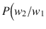)有所贡献来使共生矩阵对称，因此我们增加计数桶 c(w <sub> 1 </sub> /w <sub>2</sub> 和 c(w <sub> 2 </sub> /w <sub>1</sub> 的计数术语 c(w <sub> 1 </sub> /w <sub>2</sub> )表示单词 w <sub>1</sub> 和 w <sub>2</sub> 的共现，其中 w <sub>2</sub> 作为上下文，w <sub>1</sub> 作为单词。对于单词-出现对，角色可以颠倒，以便可以将上下文视为单词，而将单词视为上下文。正是因为这个原因，每当我们遇到一个共现的词对(w <sub>1</sub> ，w <sub>2</sub> )，计数桶 c(w <sub> 1 </sub> /w <sub>2</sub> )和 c(w <sub> 2 </sub> /w <sub>1</sub> )都会递增。

说到递增计数，我们不需要总是为两个单词的共现而递增 1。如果我们查看用于填充共现矩阵的 K 窗口，我们可以定义差分加权方案来为离上下文距离较小的共现单词提供更大的权重，并且随着距离的增加而惩罚它们。一种这样的加权方案是将同现计数器增加，其中 k 是单词和上下文之间的偏移。当单词和上下文彼此相邻时，则偏移量为 1，并且同现计数器可以增加 1，而当偏移量对于 K 个窗口最大时，计数器增量在处最小。

在生成单词向量嵌入的 SVD 方法中，假设单词 w <sub>i</sub> 和上下文 w <sub>j</sub> 之间的全局同现计数 c(w <sub>i</sub> /w <sub>j</sub> 可以表示为单词 w <sub>i</sub> 和上下文 w <sub>j</sub> 的单词向量嵌入的点积。通常，考虑两组单词嵌入，一组用于单词，另一组用于上下文。如果和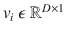分别表示语料库中第 I 个单词 w <sub>i</sub> 的单词向量和上下文向量，那么同现次数可以表示为:


让我们看一个三个单词的语料库，用单词和上下文向量的点积来表示共现矩阵。进一步，设单词为，其对应的单词向量和上下文向量分别为和。

正如我们所看到的，共生矩阵是两个矩阵的乘积，这两个矩阵分别是单词和上下文的单词向量嵌入矩阵。单词向量嵌入矩阵和上下文单词嵌入矩阵，其中 D 是单词和上下文嵌入向量的维度。

既然我们知道单词共现矩阵是单词向量嵌入矩阵和上下文嵌入矩阵的乘积，我们可以通过任何适用的矩阵分解技术来分解共现矩阵。奇异值分解(SVD)是一种被广泛采用的方法，因为它有效，即使矩阵不是正方形或对称的。

从 SVD 中我们知道，任何矩形矩阵 X 都可以分解成三个矩阵 U、σ和 V，使得

X = [U][S][V <sup>T</sup> ]

通常选择矩阵 U 作为单词向量嵌入矩阵 W，而选择σV<sup>T</sup>作为上下文向量嵌入矩阵 C，但是没有这样的限制，并且可以选择在给定语料库上工作良好的矩阵。人们可以很好地选择 W 作为 uσ<sup>1/2</sup>和 C 作为σ<sup>1/2</sup>V<sup>T</sup>。一般来说，基于有效奇异值的数据中选择较少的维度以减少 U、σ和 v 的大小，如果，则。然而，对于截断的 SVD，我们只取数据具有最大可变性的几个重要方向，而忽略其余的无关紧要的和/或噪声。如果我们选择 D 维，新的词向量嵌入矩阵，其中 D 是每个词向量嵌入的维数。

共现矩阵通常通过遍历整个语料库一次在更一般化的设置中获得。然而，由于语料库可能随着时间的推移获得新的文档或内容，这些新的文档或内容可以被递增地处理。下图 [4-7](#Fig7) 展示了单词向量或单词嵌入的三步推导过程。

*   In the first step, singular value decomposition (SVD) is performed on the co-occurrence matrix  to produce , which contains the left singular vectors, , which contains the singular values, and , which contains the right singular vectors.

    ![ $$ {\left[X\right]}_{m\times n}={\left[U\right]}_{m\times m}{\left[\varSigma \right]}_{m\times n}{\left[{V}^T\right]}_{n\times n} $$ ](A448418_1_En_4_Chapter_Equad.gif)

    Generally, for word-to-word co-occurrence matrices, the dimensions m and n should be equal. However, sometimes instead of expressing words by words, words are expressed by contexts, and hence for generalization we have taken separate m and n.
*   In the second step, the co-occurrence matrix is approximated by taking only k significant singular values from Σ that explain the maximum variance in data and by also choosing the corresponding k left singular and right singular vectors in U and V.If we start with ![ $$ U=\left[{u}_1{u}_{2\kern1.75em }{u}_3\dots {u}_m\right],\kern0.5em \varSigma =\left[\begin{array}{ccc}{\sigma}_1& \cdots & 0\\ {}\vdots & \ddots & \vdots \\ {}0& \cdots & {\sigma}_m\end{array}\right],\kern0.5em {V}^T=\left[\begin{array}{c}\begin{array}{c}{v_1}^T\to \\ {}{v_2}^T\to \\ {}..\end{array}\\ {}{v_n}^T\to \end{array}\right] $$ ](A448418_1_En_4_Chapter_IEq46.gif) after truncation, we would have

    ![ $$ {U}^{\hbox{'}}=\left[{u}_1{u}_{2\kern1.75em }{u}_3\dots {u}_k\right],\kern0.5em {\varSigma}^{\prime }=\left[\begin{array}{ccc}{\sigma}_1& \cdots & 0\\ {}\vdots & \ddots & \vdots \\ {}0& \cdots & {\sigma}_k\end{array}\right],\kern1em V{\hbox{'}}^T=\left[\begin{array}{c}\begin{array}{c}{v_1}^T\to \\ {}{v_2}^T\to \\ {}..\end{array}\\ {}{v_k}^T\to \end{array}\right] $$ ](A448418_1_En_4_Chapter_Equae.gif)

*   在第三步中，σ′和 v′<sup>T</sup>被丢弃，并且矩阵被带到单词嵌入向量矩阵。单词向量具有对应于所选的 k 个奇异值的 k 个密集维数。因此，从稀疏的共现矩阵中，我们得到了词向量嵌入的密集表示。将有 m 个单词嵌入对应于处理过的语料库的每个单词。


图 4-7。

Extraction of word embeddings through SVD of word co-occurrence matrix

清单 [4-1c](#Par78) 中提到的是通过 SVD 分解不同单词的共现矩阵，从给定语料库构建单词向量的逻辑。伴随列表的是图 [4-8](#Fig8) 中派生的词向量嵌入的图。

```py
import numpy as np

corpus = ['I like Machine Learning.','I like  TensorFlow.','I prefer Python.']

corpus_words_unique = set()

corpus_processed_docs = []
for doc in corpus:
    corpus_words_ = []
    corpus_words = doc.split()
    print corpus_words
    for x in corpus_words:
        if len(x.split('.')) == 2:
            corpus_words_ += [x.split('.')[0]] + ['.']
        else:
            corpus_words_ += x.split('.')
    corpus_processed_docs.append(corpus_words_)
    corpus_words_unique.update(corpus_words_)

corpus_words_unique = np.array(list(corpus_words_unique))

co_occurence_matrix = np.zeros((len(corpus_words_unique),len(corpus_words_unique)))
for corpus_words_ in corpus_processed_docs:
    for i in xrange(1,len(corpus_words_)) :

        index_1 = np.argwhere(corpus_words_unique == corpus_words_[i])
        index_2 = np.argwhere(corpus_words_unique == corpus_words_[i-1])

        co_occurence_matrix[index_1,index_2] += 1
        co_occurence_matrix[index_2,index_1] += 1

U,S,V = np.linalg.svd(co_occurence_matrix,full_matrices=False)
print 'co_occurence_matrix follows:'
print  co_occurence_matrix
import matplotlib.pyplot as plt
for i in xrange(len(corpus_words_unique)):
    plt.text(U[i,0],U[i,1],corpus_words_unique[i])
plt.xlim((-0.75,0.75))
plt.ylim((-0.75,0.75))
plt.show()

Listing 4-1c.

```

-输出-

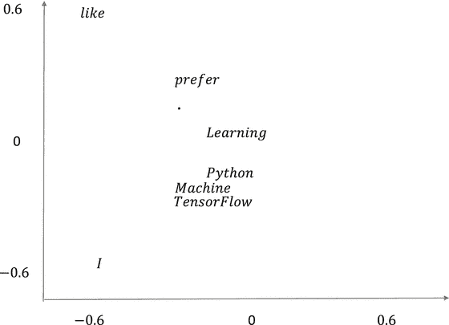

图 4-8。

Word-embeddings plot

```py
co_occurence_matrix

follows

:

[[ 0\.  2\.  0\.  0\.  1\.  0\.  0\.  1.]

[ 2\.  0\.  1\.  0\.  0\.  0\.  0\.  0.]

[ 0\.  1\.  0\.  0\.  0\.  1\.  0\.  0.]

[ 0\.  0\.  0\.  0\.  0\.  1\.  1\.  1.]

[ 1\.  0\.  0\.  0\.  0\.  0\.  1\.  0.]

[ 0\.  0\.  1\.  1\.  0\.  0\.  0\.  0.]

[ 0\.  0\.  0\.  1\.  1\.  0\.  0\.  0.]

[ 1\.  0\.  0\.  1\.  0\.  0\.  0\.  0.]]

Word-Embeddings Plot

```

我们可以在图 [4-8](#Fig8) 中的单词向量图中看到一个清晰的模式，即使是在这个小语料库中。以下是一些调查结果:

*   常见的我、喜欢之类的词，离别人很远。
*   机器、学习、Python 和 Tensorflow 与不同的学习领域相关联，彼此紧密地聚集在一起。

接下来，我们转向全局向量，通常称为 GloVe，用于生成词向量嵌入。

### 手套

GloVe 是来自斯坦福大学的一个预先训练好的、随时可用的单词嵌入向量库。手套的训练方法明显不同于 CBOW 和 Skip-gram。GloVe 不是基于单词的局部运行窗口进行预测，而是使用来自语料库的全局单词到单词共现统计来训练模型并导出 GloVe 向量。手套代表全局向量。在 [`https://nlp.stanford.edu/projects/glove/`](https://nlp.stanford.edu/projects/glove/) 有预先训练好的手套字嵌入。Jeffrey Pennington、Richard Socher 和 Christopher D. Manning 是手套向量的发明者，他们在题为“手套:单词表示的全局向量”的论文中记录了手套向量。论文可以位于 [`https://nlp.stanford.edu/pubs/glove.pdf`](https://nlp.stanford.edu/pubs/glove.pdf) 。

像 SVD 方法一样，GloVe 查看全局共现统计，但是单词和上下文向量相对于共现计数的关系略有不同。如果有两个单词 w <sub>i</sub> 和 w <sub>j</sub> 和一个上下文单词 w <sub>k</sub> ，那么概率 P(w <sub>k</sub> /w <sub>i</sub> )和 P(w <sub>k</sub> /w <sub>j</sub> )的比值提供了比概率本身更多的信息。

让我们考虑两个词，和，以及几个上下文词，。个体共现概率可能较低；然而，如果我们取同现概率的比率，例如


，前面的比率将远大于 1，表明植物更可能与花园而不是市场相关联。

同样，我们来考虑，看看下面的共现概率的比值:


在这种情况下，比率将会非常小，这意味着单词 shop 更可能与单词 market 而不是 garden 相关联。

因此，我们可以看到，共现概率的比率提供了更多的词之间的区分。因为我们正在尝试学习单词向量，这种区分应该通过单词向量的差异来编码，因为在线性向量空间中，这是表示向量之间区分的最佳方式。类似地，表示线性向量空间中向量之间的相似性的最方便的方式是考虑它们的点积，因此同现概率将由单词和上下文向量之间的点积的某个函数来很好地表示。考虑所有这些有助于我们在高层次上推导出手套向量推导的逻辑。

如果 u <sub>i</sub> ，u <sub>j</sub> 是单词 w <sub>i</sub> 和 w <sub>j</sub> 的单词向量嵌入，并且 v <sub>k</sub> 是单词 w <sub>k</sub> 的上下文向量，则两个共现概率的比率可以表示为单词向量(即，和上下文向量 v <sub>k</sub> 的差的某个函数。逻辑函数应该在单词向量和上下文向量的差的点积上工作，主要是因为它在被函数操纵之前保留了向量之间的线性结构。如果我们没有取点积，函数可能会以某种方式作用于向量，破坏线性结构。基于前面的解释，两个同现概率的比值可以表示为:


(4.1.1)

其中 f 是一个给定的函数，我们试图找出它。

此外，如所讨论的，共现概率 P(w <sub>k</sub> /w <sub>i</sub> )应该通过线性向量空间中向量之间的某种形式的相似性来编码，并且这样做的最佳操作是通过单词向量 w <sub>i</sub> 和上下文向量 w <sub>k</sub> 之间的点积的某个函数 g 来表示共现概率，如下所示:


(4.1.2)

结合(4.1.1)和(4.1.2)，我们有


(4.1.3)

现在的任务是确定有意义的函数 f 和 g，使前面的方程有意义。如果我们选择 f 和 g 作为指数函数，它使得概率的比率能够编码字向量的差，同时保持同现概率依赖于点积。向量的点积和差保持了向量在线性空间中的相似性和区分性的概念。如果函数 f 和 g 是某种核函数，那么相似性和不相似性的度量就不会被限制在线性向量空间中，并且会使得词向量的可解释性非常困难。

用(4.1.3)中的指数函数替换 f 和 g，得到

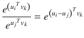

，得到


(4.1.4)

对抽象代数中的群论有所了解的感兴趣的读者可以看出，选择函数是为了定义群(和()之间的群同态

单词 w <sub>i</sub> 与上下文单词 w <sub>k</sub> 的共现概率可以表示如下:

T5】T6(4 . 1 . 5)其中 c(w <sub>i</sub> ，w <sub>k</sub> 表示单词 w <sub>i</sub> 与上下文单词 w <sub>k</sub> 的共现次数，c(w <sub>i</sub> 表示该单词的总出现次数任何单词的总计数可以通过将它与语料库中所有其他单词的共现计数相加来计算，如下所示:


结合(4.1.4)和(4.1.5)，我们得到


log c(w <sub>i</sub> )可以表示为对于字 w <sub>i</sub> 的一个偏差 b <sub>i</sub> ，对于字 w <sub>k</sub> 也引入了一个额外的偏差使方程对称。所以，最终的关系可以表示为


正如我们有两组词向量嵌入一样，类似地，我们看到两组偏差——一组针对由给出的上下文词，另一组针对由 b <sub>i</sub> 给出的词，其中 I 表示语料库的第 I 个词。

最终目标是最小化所有单词-上下文对的实际 log c(w <sub>i</sub> ，w <sub>k</sub> )和预测的之间的误差成本函数的平方和，如下:


u 和 V 是单词向量嵌入和上下文向量嵌入的参数集。类似地，和 B 是对应于单词和上下文的偏差的参数。相对于中的这些参数，成本函数必须最小化。

这种最小二乘法方案的一个问题是，它在成本函数中对所有共现进行同等加权。这阻止了模型获得好的结果，因为罕见的同现携带非常少的信息。处理这个问题的方法之一是给具有较高计数的同现分配更多的权重。可以修改成本函数，以使每个同现对具有一个权重分量，该权重分量是同现计数的函数。修改后的代价函数可以表示为:


其中 h 是新引入的函数。

函数 h(x)(见图 [4-9](#Fig9) )可以选择如下:


人们可以用不同的α值进行实验，α作为模型的超参数。


图 4-9。

Weightage function for the co-occurrence counts

### 用词向量进行词类比

单词向量嵌入的好处在于它能够使类比线性化。我们使用清单 [4-2a](#Par107) 、清单 [4-2b](#Par108) 和清单 [4-3c](#Par109) 中的预训练手套向量来看一些类比。

```py
import numpy as np
import scipy
from sklearn.manifold import TSNE
import matplotlib.pyplot as plt
%matplotlib inline
########################
# Loading glove vector
########################
EMBEDDING_FILE = '∼/Downloads/glove.6B.300d.txt'

print('Indexing word vectors')
embeddings_index = {}
f = open(EMBEDDING_FILE)
count = 0
for line in f:
    if count == 0:
        count = 1
        continue
    values = line.split()
    word = values[0]
    coefs = np.asarray(values[1:], dtype='float32')
    embeddings_index[word] = coefs
f.close()

print('Found %d word vectors of glove.' % len(embeddings_index))

-- output --

Indexing word vectors
Found 399999 word vectors of glove.

Listing 4-2a.

```

```py
king_wordvec = embeddings_index['king']
queen_wordvec = embeddings_index['queen']
man_wordvec   = embeddings_index['man']
woman_wordvec   = embeddings_index['woman']

pseudo_king = queen_wordvec -  woman_wordvec + man_wordvec
cosine_simi = np.dot(pseudo_king/np.linalg.norm(pseudo_king),king_wordvec/np.linalg.norm(king_wordvec))
print 'Cosine Similarity',cosine_simi
--output --
Cosine Similarity 0.663537

Listing 4-2b.

```


图 4-10。

2D TSNE vector plot for pre-trained GloVe vectors

```py
tsne = TSNE(n_components=2)
words_array = []
word_list = ['king','queen','man','woman']
for w in word_list:
    words_array.append(embeddings_index[w])
index1 = embeddings_index.keys()[0:100]
for i in xrange(100):
    words_array.append(embeddings_index[index1[i]])
words_array = np.array(words_array)
words_tsne = tsne.fit_transform(words_array)

ax = plt.subplot(111)
for i in xrange(4):
    plt.text(words_tsne[i, 0], words_tsne[i, 1],word_list[i])
    plt.xlim((-50,20))
    plt.ylim((0,50))

--output--

Listing 4-2c.

```

在列表 [4-2a](#Par107) 中，维度 300 的预训练手套向量被加载并存储在字典中。我们通过手套向量来寻找国王、王后、男人和女人的相似之处。以单词 vector 为皇后、男人和女人，创建单词 vector pseudo_king 如下:


这个想法是看前面创建的向量是否多少代表了国王的概念。字向量 pseudo_king 和 king 之间的角度的余弦很高，大约为 0.67，这表明非常好地代表了 king 的概念。

接下来，在清单 [4-2c](#Par109) 中，我们试图表示一个类比，为此，通过 TSNE，我们在二维空间中表示维度 300 的手套向量。结果绘制在图 [4-10](#Fig10) 中。我们可以看到，表示国王和王后的词向量彼此靠近并聚集在一起，表示男人和女人的词向量也彼此靠近。此外，我们看到国王和男人之间的矢量差以及女王和女人之间的矢量差几乎是平行排列的，并且长度相当。

在我们继续讨论循环神经网络之前，我想提到的一件事是，在自然语言处理的背景下，单词嵌入对于循环神经网络的重要性。循环神经网络不理解文本，因此文本中的每个单词都需要某种形式的数字表示。单词嵌入向量是一个很好的选择，因为单词可以由单词嵌入向量的组件给出的多个概念来表示。循环神经网络可以双向工作，要么提供单词嵌入向量作为输入，要么让网络自己学习这些嵌入向量。在后一种情况下，单词嵌入向量将更倾向于通过循环神经网络来解决最终问题。然而，有时循环神经网络可能有许多其他参数要学习，或者网络可能只有很少的数据来训练。在这种情况下，必须学习单词嵌入向量作为参数可能会导致过拟合或次优结果。在这种情况下，使用预先训练的单词向量嵌入可能是更明智的选择。

## 循环神经网络导论

循环神经网络(RNNs)被设计成利用序列信息并从中学习。RNN 架构应该为序列中的每个元素执行相同的任务，因此在其命名中称为递归。由于任何语言中单词的顺序依赖性，rnn 在自然语言处理的任务中具有很大的用途。例如，在预测句子中的下一个单词的任务中，出现在它之前的单词的优先顺序是至关重要的。通常，在序列的任何时间步，rnn 基于其迄今为止的计算来计算一些内存；即先前记忆和当前输入。计算出的内存用于预测当前时间步长，并作为输入传递给下一步。图 [4-11](#Fig11) 显示了循环神经网络的基本架构原理。


图 4-11。

Folded and unfolded structure of an RNN

在图 [4-11](#Fig11) 中，RNN 架构被及时展开以描绘完整的序列。如果我们希望处理七个单词的句子序列，那么展开的 RNN 体系结构将代表七层前馈神经网络，唯一的区别是每层的权重是公共共享的权重。这显著减少了在循环神经网络中要学习的参数数量。

只是为了让我们熟悉所使用的符号，x <sub>t</sub> ，h <sub>t</sub> 和 o <sub>t</sub> 分别表示在时间步长 t 的输入、计算的内存或隐藏状态以及输出。W <sub>hh</sub> 表示从时间 t 的内存状态 h <sub>t</sub> 到时间的内存状态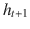的权重矩阵。W <sub>xh</sub> 表示从输入 x <sub>t</sub> 到隐藏状态 h <sub>t</sub> 的权重矩阵，而 W <sub>ho</sub> 表示从存储状态 h <sub>t</sub> 到 o <sub>t</sub> 的权重矩阵。当输入以独热编码形式呈现时，权重矩阵 W <sub>xh</sub> 充当某种单词向量嵌入矩阵。或者，在独热编码输入的情况下，可以选择具有可学习的独立嵌入矩阵，使得当独热编码输入向量通过嵌入层时，其期望的嵌入向量作为输出呈现。

现在，让我们深入了解每个组件的细节:

*   输入 x <sub>t</sub> 是表示步骤 t 的输入单词的向量。例如，它可以是对于词汇表中的相应单词索引，分量被设置为 1 的独热编码向量。它也可以是来自诸如 GloVe 的一些预先训练的知识库的单词向量嵌入。一般来说，我们假设。同样，如果我们希望预测 V 类，那么输出
*   存储器或隐藏状态向量 h <sub>t</sub> 可以根据用户的选择具有任何长度。如果选择的状态数是 n，那么和权重矩阵
*   将输入连接到存储状态的权重矩阵和将存储状态连接到输出的权重矩阵
*   The memory h <sub>t</sub> at step t is computed as follows: , where f is a chosen non-linear activation function.The dimension of  is n; i.e.,  The function f works element-wise on  to produce h <sub>t</sub> , and hence  and h <sub> t </sub> have the same dimension.If ![ $$ {W}_{hh}{h}_{t-1}+\kern0.5em {W}_{xh}\ {x}_t=\left[\begin{array}{c}{s}_{1t}\\ {}{s}_{2t}\\ {}.\\ {}.\\ {}{s}_{nt}\end{array}\right] $$ ](A448418_1_En_4_Chapter_IEq76.gif), then the following holds true for h <sub>t</sub> :

    ![ $$ {h}_t=\left[\begin{array}{c}f\left({s}_{1t}\right)\\ {}f\left({s}_{2t}\right)\\ {}.\\ {}.\\ {}f\left({s}_{nt}\right)\end{array}\right] $$ ](A448418_1_En_4_Chapter_Equaq.gif)

*   The connections from the memory states to the output are just like the connections from a fully connected layer to the output layer. When a multi-class classification problem is involved, such as predicting the next word, then the output layer would be a huge SoftMax of the number of words in the vocabulary. In such cases the predicted output vector  can be expressed as SoftMax(W <sub> ho </sub> h <sub>t</sub> ). Just to keep the notations simple, the biases have not been mentioned. In every unit, we can add bias to the input before it is acted upon by the different functions. So, o <sub> t </sub> can be represented as

    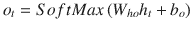

    where  is the bias vector for the output units.Similarly, bias can be introduced in the memory units, and hence h <sub> t </sub> can be expressed as

    

    where is the bias vector at the memory units.
*   For a classification problem predicting the next word for a text sequence of T time steps, the output at each time step is a big SoftMax of V classes, where V is the size of the vocabulary. So, the corresponding loss at each time step is the negative log loss over all the vocabulary size V. The loss at each time step can be expressed as follows:

    

*   To get the overall loss over all the time steps T, all such C <sub>t</sub> needs to be summed up or averaged out. Generally, the average of all C <sub>t</sub> is more convenient for stochastic gradient descent so as to get a fair comparison when the sequence length varies. The overall cost function for all the time steps T can thus be represented by the following:

    

### 语言建模

在语言建模中，通过事件交集的乘积规则来计算单词序列的概率。单词序列的概率 w<sub>1</sub>w<sub>2</sub>w<sub>3</sub>…..长度为 n 的 w <sub>n</sub> 给出如下:


在传统方法中，时间步长 k 处的单词的概率通常不以在此之前的长度为的整个序列为条件，而是以 t 之前的小窗口 L 为条件。因此，概率通常近似如下:


这种基于 L 个最近状态来调节状态的方法被称为链式规则概率的马尔可夫假设。虽然这是一个近似值，但对于传统的语言模型来说，这是一个必要的近似值，因为由于内存限制，单词不能以大的单词序列为条件。

语言模型通常用于与自然语言处理相关的各种任务，例如通过预测接下来的单词来完成句子、机器翻译、语音识别等。在机器翻译中，另一种语言的单词可能被翻译成英语，但可能在语法上不正确。例如，印地语中的一个句子已经被机器翻译成英语句子“美丽无比是天空”。如果一个人计算机器翻译序列的概率()，它将比排列的对应序列的概率小得多，(P(“天空非常美丽”)。通过语言建模，可以对文本序列的概率进行这种比较。

### 通过 RNN 和传统方法预测句子中的下一个单词

如前所述，在传统的语言模型中，下一个单词出现的概率通常取决于特定数量的先前单词的窗口。为了估计概率，通常计算不同的 n-grams 计数。根据双字组和三字组计数，条件概率可以计算如下:


以类似的方式，我们可以通过对更大的 n 元语法进行计数来对更长的单词序列的单词概率进行调节。一般来说，当在更高的 n 元语法上找不到匹配时，比如说四元语法，然后尝试更低的 n 元语法，比如三元语法。这种方法被称为后退，与固定的 n 元语法方法相比，它提供了一些性能增益。

由于单词预测仅取决于基于所选窗口大小的前几个单词，所以这种通过 n-gram 计数计算概率的传统方法不如那些在下一个单词预测中考虑整个单词序列的模型那样好。

在 RNNs 中，每一步的输出都以所有之前的单词为条件，因此 RNNs 在语言模型任务中比 n-gram 模型做得更好。为了理解这一点，让我们在考虑一个序列(x <sub>1</sub> x <sub>2</sub> x <sub>3</sub> )时，来看看生成式循环神经网络的工作原理..长度为 n 的 x <sub>n</sub> 。

RNN 递归地将其隐藏状态 h <sub>t</sub> 更新为。隐藏状态具有为字序列累积的信息，并且当序列 x <sub>t</sub> 中的新字到达时，更新的序列信息通过递归更新被编码在 h <sub>t</sub> 中。

现在，如果我们必须根据到目前为止看到的单词序列来预测下一个单词，即，我们需要查看的条件概率分布是


，其中 o <sub>i</sub> 代表词汇表中的任何广义单词。

对于神经网络来说，这种概率分布由基于目前所见的序列计算出的隐藏状态 h <sub>t</sub> 控制，即 x<sub>1</sub>x<sub>2</sub>x<sub>3</sub>…..x <sub>t</sub> 和模型参数 V，其将隐藏状态转换成对应于词汇表中每个单词的概率。

所以，


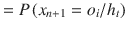或

对应于词汇表上所有索引 I 的的概率向量由 Softmax( 给出。

### 穿越时间的反向传播(BPTT)

循环神经网络的反向传播与前馈神经网络的反向传播相同，唯一的区别是梯度是关于每一步对数损失的梯度之和。

首先，RNN 在时间上展开，然后向前执行一步以获得内部激活和输出的最终预测。基于预测输出和实际输出标签，计算每个时间步长的损耗和相应的误差。每个时间步长的误差被反向传播以更新权重。因此，任何权重更新都与所有 T 时间步长的误差梯度贡献的总和成比例。

让我们看一个长度为 T 的序列，以及通过 BPTT 更新的权重。我们取记忆状态数为 n(即)，选择输入向量长度为 D(即)。在每个序列步骤 t，我们通过 SoftMax 函数从 V 个单词的词汇表中预测下一个单词。

长度为 T 的序列的总成本函数被给定为


让我们计算成本函数相对于将隐藏存储器状态连接到输出状态层的权重的梯度，即，属于矩阵 W <sub>ho</sub> 的权重。权重 w <sub>ij</sub> 表示将隐藏状态 I 连接到输出单元 j 的权重

成本函数 C <sub>t</sub> 相对于 w <sub>ij</sub> 的梯度可以通过偏导数的链式法则分解为成本函数相对于第 j 个单元的输出(即)的偏导数、第 j 个单元的输出相对于第 j 个单元的净输入 s <sub> t </sub> <sup>(j)</sup> (即)的偏导数的乘积， 以及最后第 j 个单元的净输入相对于从第 I 个存储单元到第 j 个隐藏层的相关权重的偏导数(即)。


(4 . 2 . 1)


(4 . 2 . 2)

考虑词汇 V 上的 SoftMax 和 t 时刻的实际输出为![ $$ {y}_t={\left[{y}_t^{(1)}{y}_t^{(2)}..{y}_t^{(V)}\right]}^T\in {\mathrm{\mathbb{R}}}^{V\times 1}, $$ ](A448418_1_En_4_Chapter_IEq96.gif)


(4 . 2 . 3)


(4 . 2 . 4)

将(4.2.2)、(4.2.3)和(4.2.4)中各个梯度的表达式代入(4.2.1)，我们得到


(4.2.5)

为了得到总成本函数 C 相对于 w <sub>ij</sub> 的梯度的表达式，需要对每个序列步骤的梯度求和。因此，梯度的表达式如下:


(4.2.6)

因此，我们可以看到，确定从存储状态到输出层的连接的权重与对前馈神经网络的完全连接层进行的操作非常相似，唯一的区别是将每个连续步骤的效果相加，以获得最终梯度。

现在，让我们看看成本函数相对于将一个步骤中的存储器状态连接到下一个步骤中的存储器状态的权重的梯度——即矩阵 W <sub>hh</sub> 的权重。我们取广义权重，其中 k 和 I 是连续存储单元中存储单元的索引。

由于记忆单元连接的循环性，这将会变得更加复杂。为了理解这一事实，让我们看看在步骤 t 由 I 索引的存储单元的输出—即 h<sub>t</sub>T2】(I):


(4 . 2 . 7)

现在，让我们看看在步骤 t 的成本函数相对于权重 u <sub>ki</sub> :


的梯度(4.2.8)

我们只对将 h <sub>t</sub> <sup>(i)</sup> 表示为 u <sub>ki</sub> 的函数感兴趣，因此我们将(4.2.7)重新排列如下:


(4.2.9)其中


我们已经将 h <sub>t</sub> <sup>(i)</sup> 重新安排为包含所需权重 u <sub>ki</sub> 的函数，并保留，因为它可以通过递归表示为

每个时间步长 t 的这种递归性质将持续到第一步，因此需要考虑从到的所有相关梯度的总和效应。如果 h <sub> t </sub> <sup>(i)</sup> 相对于权重 u <sub>ki</sub> 的梯度遵循递归，并且如果我们对 h <sub> t </sub> <sup>(i)</sup> 进行如(4.2.9)中所表达的关于 u <sub>ki</sub> 的导数，那么下面将成立:


(4.2.10)

请注意表达式的横杠。表示 h <sub> t </sub> <sup>(i)</sup> 相对于 u <sub>ki</sub> 的局部梯度，保持不变。

用(4.2.8)代替(4.2.9)我们得到

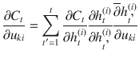

(4.2.11)

等式(4.2.11)给出了时间 t 时成本函数梯度的一般等式。因此，为了得到总梯度，我们需要在每个时间步对成本梯度求和。因此，总梯度可以用


(4.2.12)来表示

表达式遵循乘积递归，因此可以表述为


(4.2.13)

结合(4.2.12)和(4.2.13)，我们得到


(4.2.14)

针对矩阵 W <sub>xh</sub> 的权重的成本函数 C 的梯度的计算可以以类似于针对对应于存储器状态的权重的方式来计算。

### RNN 的消失和爆炸梯度问题

循环神经网络(RNNs)的目的是学习长依存关系，以便捕获相距遥远的单词之间的相互关系。例如，一个句子试图表达的实际意思可能被彼此不太接近的词很好地捕捉到。循环神经网络应该能够学习这些依赖性。然而，rnn 有一个固有的问题:它们不能捕捉单词之间的长距离依赖。这是因为在长序列的情况下，梯度很有可能很快变为零或者变为零。当梯度很快下降到零时，该模型不能学习时间上相距很远的事件之间的关联或相关性。成本函数的梯度相对于隐藏记忆层的权重的公式将帮助我们理解为什么会发生这种消失梯度问题。

用于广义权重的成本函数 C <sub>t</sub> 在步骤 t 的梯度由


给出，其中符号符合它们在“通过时间的反向传播(BPTT)”部分中提到的原始解释。

相加形成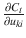的分量称为其时间分量。这些组件中的每一个测量步骤 t’处的权重 u <sub>ki</sub> 如何影响步骤 t 处的损失。组件将步骤 t 处的误差反向传播回步骤 t’。

还有，


结合前面两个方程，我们得到


让我们将在时间步长 g 时存储器单元 I 处的净输入设为 z <sub>g</sub> <sup>(i)</sup> 。所以，如果我们把记忆单元的激活看作是 sigmoid，那么


其中σ是 sigmoid 函数。

现在，


其中σ′(z<sub>g</sub><sup>(I)</sup>)表示σ(z <sub>g</sub> <sup>(i)</sup> )相对于 z<sub>g</sub><sup>【I】</sup>的梯度。

如果我们有一个长序列，即和，那么下面的量就会有很多 sigmoid 函数的导数，如下所示:

![ $$ \frac{\partial {h}_t^{(i)}}{\partial {h}_{\mathrm{k}}^{(i)}}=\prod \limits_{g=\mathrm{k}+1}^T\frac{\partial {h}_g^{(i)}}{\partial {h}_{g-1}^{(i)}}=\frac{\partial {h}_{\mathrm{k}+1}^{(i)}}{\partial {h}_{\mathrm{k}}^{(i)}}\frac{\partial {h}_{\mathrm{k}+2}^{(i)}}{\partial {h}_{\mathrm{k}+1}^{(i)}}\dots \frac{\partial {h}_t^{(i)}}{\partial {h}_{\left(t-1\right)}^{(i)}}={\sigma}^{\hbox{'}}\left({z}_{\mathrm{k}+1}^{(i)}\right){u}_{ii}{\sigma}^{\hbox{'}}\left({z}_{\mathrm{k}+2}^{(i)}\right){u}_{ii}..{\sigma}^{\hbox{'}}\left({z}_t^{(i)}\right){u}_{ii} $$ ](img/A448418_1_En_4_Chapter_Equbi.gif)

结合乘积符号形式的梯度表达式，这个重要的方程可以改写如下:


Sigmoid 函数仅在很小的值范围内具有良好的梯度，并且很快饱和。此外，sigmoid 激活函数的梯度小于 1。因此，当来自在的长距离步骤的误差传递到在的步骤时，将存在误差必须经过的 sigmoid 激活函数梯度，并且小于 1 的梯度的乘法效应可以使梯度分量以指数速度消失。如所讨论的，将步骤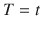的误差反向传播回步骤，从而学习步骤和的单词之间的长距离相关性。然而，由于消失梯度问题，可能接收不到足够的梯度，并且可能接近零，因此不可能学习句子中长距离单词之间的相关性或依赖性。

rnn 也可能遭受爆炸梯度。我们在的表达式中看到，权重 u <sub>ii</sub> 被重复乘以倍。如果，并且为了简单起见，我们假设，那么在从序列步骤 T 到序列步骤的 50 步反向传播之后，梯度将放大大约 2 <sup>50</sup> 倍，并且因此将驱动模型训练进入不稳定状态。

### RNNs 中消失梯度和爆炸梯度问题的解决方法

深度学习社区采用了几种方法来解决消失梯度问题。在这一节中，我们将讨论这些方法，然后继续讨论 RNN 的一种变体，称为长短期记忆(LSTM)循环神经网络。LSTMs 对于消失和爆炸梯度更加鲁棒。

#### 渐变剪辑

分解渐变可以通过一种叫做渐变裁剪的简单技术来解决。如果梯度向量的幅度超过指定的阈值，则梯度向量的幅度被设置为阈值，同时保持梯度向量的方向不变。因此，当在时间 t 对神经网络进行反向传播时，如果成本函数 C 相对于权重向量 w 的梯度超过阈值 k，则用于反向传播的梯度 g 被更新如下:

*   第一步:更新
*   步骤 2:如果则更新

#### 存储器到存储器权重连接矩阵和 ReLU 单元的智能初始化

代替随机初始化权重矩阵 W <sub>hh</sub> 中的权重，将其初始化为单位矩阵有助于防止消失梯度问题。消失梯度问题的主要原因之一是隐藏单元 I 在时间 t 相对于隐藏单元 I 在时间 t '的梯度，其中由


给出

在 sigmoid 激活函数的情况下，每个项可以展开如下:


其中σ(.)表示 sigmoid 函数，z <sub>g</sub> <sup>(t)</sup> 表示在步骤 t 对隐藏单元 I 的净输入。参数 u <sub>ii</sub> 是将任何序列步骤的第 I 个隐藏存储器状态连接到序列步骤 t 的第 I 个隐藏单元存储器的权重

序列步长 t’和 t 之间的距离越大，误差在从 t 到 t’的过程中经历的 sigmoid 导数就越多。因为 sigmoid 激活函数导数总是小于 1 并且很快饱和，所以在长相关性的情况下梯度变为零的机会很高。

然而，如果我们选择 ReLU 单位，那么 sigmoid 梯度将被 ReLU 梯度代替，ReLU 梯度对于正净输入具有恒定值 1。这将减少消失梯度问题，因为当梯度为 1 时，梯度将无衰减地流动。此外，当权重矩阵被选择为单位时，则权重关系 u <sub>ii</sub> 将为 1，因此无论序列步长 t 和序列步长 t’之间的距离如何，量都将为 1。这意味着从时间 t 的隐藏存储器状态 h<sub>t</sub>T5(I)传播到任何先前时间步 t’的隐藏存储器状态 h<sub>t’</sub><sup>(I)</sup>的误差将是恒定的，与从步 t 到 t’的距离无关。这将使 RNN 能够学习句子中长距离单词之间的相关相关性或依赖性。

### 长短期记忆(LSTM)

长短期记忆循环神经网络，俗称 LSTMs，是 RNNs 的特殊版本，可以学习句子中单词之间的远距离依赖关系。如前所述，基本的 rnn 无法学习远距离单词之间的这种相关性。长短期记忆(LSTM)循环神经网络的结构与传统的循环神经网络有很大的不同。图 [4-12](#Fig12) 所示为 LSTM 的高级表示。


图 4-12。

LSTM architecture

LSTM 的基本构建模块及其功能如下:

*   The new element in LSTMs is the introduction of the cell state C <sub>t</sub> , which is regulated by three gates. The gates are composed of sigmoid functions so that they output values between 0 and 1.At sequence step t the input x <sub>t</sub> and the previous step’s hidden states  decide what information to forget from cell state  through the forget-gate layer. The forget gate looks at x <sub> t </sub> and  and assigns a number between 0 and 1 for each element in the cell state vector . An output of 0 means totally forget the state while an output of 1 means keep the state completely. The forget gate output is computed as follows:

    

*   Next, the input gate decides which cell units should be updated with new information. For this, like the forget-gate output, a value between 0 to 1 is computed for each cell state component through the following logic:

    

    Then, a candidate set of new values is created for the cell state using x <sub>t</sub> and as input. The candidate cell state  is computed as follows:

    

    The new cell state C <sub>t</sub> is updated as follows:

    

*   The next job is to determine which cell states to output since the cell state contains a lot of information. For this, x <sub>t</sub> and are passed through an output gate, which outputs a value between 0 to 1 for each component in the cell state vector C <sub>t</sub> . The output of this gate is computed as follows:

    

    The updated hidden state h <sub>t</sub> is computed from the cell state C <sub>t</sub> by passing each of its elements through a tanh function and then doing an element-wise product with the output gate values:

    

请注意，前面等式中的符号*表示逐元素乘法。这样做是为了，基于门输出，我们可以给它所操作的向量的每个元素分配权重。此外，请注意，无论获得什么样的门输出值，它们都会按原样相乘。门输出不会转换为离散值 0 和 1。介于 0 和 1 之间的连续值为反向传播提供了平滑的梯度。

遗忘门在 LSTM 中起着至关重要的作用，当遗忘门单元输出零时，循环梯度变为零，相应的旧单元状态单元被丢弃。通过这种方式，LSTM 会丢弃它认为在未来不会有用的信息。此外，当遗忘门单元输出 1 时，误差无衰减地流过单元单元，并且该模型可以学习时间上相距较远的单词之间的长距离相关性。我们将在下一节对此进行更多的讨论。

LSTM 的另一个重要特征是引入了输出门。输出门单元确保不是单元状态 C <sub>t</sub> 单元具有的所有信息都暴露给网络的其余部分，因此只有相关的信息以 h <sub>t</sub> 的形式显示。这确保了网络的其余部分不会受到不必要数据的影响，而处于小区状态的数据仍然被抑制在小区状态中，以帮助推动未来的决策。

### 减少爆炸梯度和消失梯度问题的 LSTM

LSTMs 不会受到消失梯度或爆炸梯度问题的困扰。其主要原因是引入了遗忘门 f <sub>t</sub> 以及当前单元状态通过以下等式依赖于它的方式:


这个等式可以在具有通用索引 I 的单元状态单元级别上分解如下:


这里需要注意的是，C <sub>t</sub> <sup>(i)</sup> 线性依赖于，因此激活函数是梯度为 1 的恒等函数。

当很大时，循环神经网络反向传播中可能导致梯度消失或爆炸的臭名昭著的分量是分量。该组件将序列步骤 t 处的误差反向传播到序列步骤 k，以便该模型学习长距离依赖性或相关性。正如我们在消失和爆炸渐变部分看到的，的表达式由下面给出:


当梯度和/或权重小于 1 时，将出现消失梯度条件，因为它们中的的乘积将迫使总乘积接近零。由于 sigmoid 梯度和 tanh 梯度大部分时间小于 1，并且在它们具有接近零的梯度时饱和得很快，所以消失梯度的问题会更加严重。类似地，当第 I 个隐藏单元与第 I 个隐藏单元之间的权重连接 u <sub>ii</sub> 大于 1 时，会发生爆炸梯度，因为它们中的的乘积会使项呈指数增大。

在 LSTM 与相对应的是分量，也可以用产品格式表示如下:


(4.3.1)

对单元状态更新方程两边取偏导数，得到重要表达式


(4.3.2)

结合(1)和(2)，得到


(4.3.3)

等式(4.3.3)表明，如果遗忘门值保持在 1 附近，LSTM 将不会遭受消失梯度或爆炸梯度问题。

### 基于循环神经网络的张量流 MNIST 数字识别

我们看到了一个 RNN 的实现，它通过 LSTM 对 MNIST 数据集中的影像进行分类。MNIST 数据集的图像在维度上是。每个图像将被视为具有 28 个序列步骤，并且每个序列步骤将由图像中的一行组成。在每个序列步骤之后不会有输出，而是在每个图像的 28 个步骤结束时只有一个输出。输出是对应于从 0 到 9 的十个数字的十个类别之一。因此，输出层将是十个类的 SoftMax。最终序列步骤 h <sub>28</sub> 的隐藏单元状态将通过权重被馈送到输出层。因此，只有最后的序列步骤会对成本函数有贡献；没有与中间序列步骤相关联的成本函数。如果你还记得的话，反向传播是关于每个单独的序列步骤 t 中的成本函数 C <sub>t</sub> 的，当在每个序列步骤中涉及到输出时，最后关于每个成本函数的梯度被加在一起。这里，其他一切保持不变，并且反向传播将仅相对于序列步骤 28，C <sub>28</sub> 处的成本来完成。同样，如前所述，图像的每一行将在序列步长 t 形成数据，因此将是输入向量 x <sub>t</sub> 。最后，我们将在小批量中处理图像，因此对于批量中的每个图像，将遵循类似的处理过程，从而最小化批量的平均成本。还有一点需要注意，张量流要求小批量输入张量中的每一步都有单独的张量。为便于理解，图 [4-13](#Fig13) 中描述了输入张量结构。


图 4-13。

Input tensor shape for RNN LSTM network in Tensorflow

现在我们对问题和方法有了一些了解，我们将继续在 TensorFlow 中实现。清单 [4-3](#Par209) 展示了训练模型并在测试数据集上验证模型的详细代码。

```py
#Import the Required Libraries
import tensorflow as tf
from tensorflow.contrib import rnn
import numpy as np

# Import MINST data
from tensorflow.examples.tutorials.mnist import input_data
mnist = input_data.read_data_sets("MNIST_data/", one_hot=True)

# Batch Learning Parameters
learning_rate = 0.001
training_iters = 100000
batch_size = 128
display_step = 50
num_train = mnist.train.num_examples
num_batches = (num_train//batch_size) + 1
epochs = 2

# RNN LSTM Network Parameters
n_input = 28 # MNIST data input (img shape: 28*28)
n_steps = 28 # timesteps
n_hidden = 128 # hidden layer num of features
n_classes = 10 # MNIST total classes (0-9 digits)

# Define th forward pass for the RNN

def RNN(x, weights, biases):

    # Unstack to get a list of n_stepstensors of shape (batch_size, n_input) as illustrated in Figure 4-12
    x = tf.unstack(x, n_steps, 1)

    # Define a lstm cell
    lstm_cell = rnn.BasicLSTMCell(n_hidden, forget_bias=1.0)

    # Get lstm cell output
    outputs, states = rnn.static_rnn(lstm_cell, x, dtype=tf.float32)

    # Linear activation, using rnn inner loop last output
    return tf.matmul(outputs[-1], weights['out']) + biases['out']

# tf Graph input
x = tf.placeholder("float", [None, n_steps, n_input])
y = tf.placeholder("float", [None, n_classes])

# Define weights
weights = {
    'out': tf.Variable(tf.random_normal([n_hidden, n_classes]))
}
biases = {
    'out': tf.Variable(tf.random_normal([n_classes]))
}

pred = RNN(x, weights, biases)

# Define loss and optimizer
cost = tf.reduce_mean(tf.nn.softmax_cross_entropy_with_logits(logits=pred, labels=y))
optimizer = tf.train.AdamOptimizer(learning_rate=learning_rate).minimize(cost)

# Evaluate model
correct_pred = tf.equal(tf.argmax(pred,1), tf.argmax(y,1))
accuracy = tf.reduce_mean(tf.cast(correct_pred, tf.float32))

# Initializing the variables
init = tf.global_variables_initializer()

with tf.Session() as sess:
    sess.run(init)
    i = 0

    while i < epochs:
        for step in xrange(num_batches):
            batch_x, batch_y = mnist.train.next_batch(batch_size)
            batch_x = batch_x.reshape((batch_size, n_steps, n_input))
        # Run optimization op (backprop)
            sess.run(optimizer, feed_dict={x: batch_x, y: batch_y})
            if (step + 1) % display_step == 0:
                # Calculate batch accuracy
                acc = sess.run(accuracy, feed_dict={x: batch_x, y: batch_y})
                # Calculate batch loss
                loss = sess.run(cost, feed_dict={x: batch_x, y: batch_y})
                print "Epoch: " + str(i+1) + ",step:"+ str(step+1) +", Minibatch Loss= " + \
                      "{:.6f}".format(loss) + ", Training Accuracy= " + \
                      "{:.5f}".format(acc)
        i += 1
    print "Optimization Finished!"

    # Calculate accuracy
    test_len = 500
    test_data = mnist.test.images[:test_len].reshape((-1, n_steps, n_input))
    test_label = mnist.test.labels[:test_len]
    print "Testing Accuracy:", \
        sess.run(accuracy, feed_dict={x: test_data, y: test_label})

xx---output--xx

Extracting MNIST_data/train-images-idx3-ubyte.gz
Extracting MNIST_data/train-labels-idx1-ubyte.gz
Extracting MNIST_data/t10k-images-idx3-ubyte.gz
Extracting MNIST_data/t10k-labels-idx1-ubyte.gz
Epoch: 1,step:50, Minibatch Loss= 0.822081, Training Accuracy= 0.69531
Epoch: 1,step:100, Minibatch Loss= 0.760435, Training Accuracy= 0.75781
Epoch: 1,step:150, Minibatch Loss= 0.322639, Training Accuracy= 0.89844
Epoch: 1,step:200, Minibatch Loss= 0.408063, Training Accuracy= 0.85156
Epoch: 1,step:250, Minibatch Loss= 0.212591, Training Accuracy= 0.93750
Epoch: 1,step:300, Minibatch Loss= 0.158679, Training Accuracy= 0.94531
Epoch: 1,step:350, Minibatch Loss= 0.205918, Training Accuracy= 0.92969
Epoch: 1,step:400, Minibatch Loss= 0.131134, Training Accuracy= 0.95312
Epoch: 2,step:50, Minibatch Loss= 0.161183, Training Accuracy= 0.94531
Epoch: 2,step:100, Minibatch Loss= 0.237268, Training Accuracy= 0.91406
Epoch: 2,step:150, Minibatch Loss= 0.130443, Training Accuracy= 0.94531
Epoch: 2,step:200, Minibatch Loss= 0.133215, Training Accuracy= 0.93750
Epoch: 2,step:250, Minibatch Loss= 0.179435, Training Accuracy= 0.95312
Epoch: 2,step:300, Minibatch Loss= 0.108101, Training Accuracy= 0.97656
Epoch: 2,step:350, Minibatch Loss= 0.099574, Training Accuracy= 0.97656
Epoch: 2,step:400, Minibatch Loss= 0.074769, Training Accuracy= 0.98438
Optimization Finished!
Testing Accuracy: 0.954102

Listing 4-3.TensorFlow Implementation of Recurrent Neural Network using LSTM for Classification

```

正如我们从清单 [4-3](#Par209) 输出中看到的，仅通过运行 2 个时期，就在测试数据集上实现了 95%的准确率。

#### 基于循环神经网络的 TensorFlow 下一词预测和句子完成

我们用《爱丽丝梦游仙境》中的一小段训练一个模型，用 LSTM 预测给定词汇中的下一个单词。对于这个问题，三个单词的序列作为输入，下一个单词作为输出。此外，选择了两层 LSTM 模型而不是一层。输入和输出的集合是从语料库中随机选择的，并作为大小为 1 的小批量进行馈送。我们看到该模型取得了良好的准确性，能够很好地学习文章。后来，一旦训练好模型，我们输入一个三个单词的句子，让模型预测接下来的 28 个单词。每次它预测到一个新单词，就会把它附加到更新的句子中。为了预测下一个单词，来自更新句子的前三个单词被作为输入。清单 [4-4](#Par212) 中概述了该问题的详细实现。

```py
# load the required libraries
import numpy as np
import tensorflow as tf
from tensorflow.contrib import rnn
import random
import collections
import time

# Parameters
learning_rate = 0.001
training_iters = 50000
display_step = 500
n_input = 3

# number of units in RNN cell
n_hidden = 512

# Function to read and process the input file
def read_data(fname):
    with open(fname) as f:
        data = f.readlines()
    data = [x.strip() for x in data]
    data = [data[i].lower().split() for i in range(len(data))]
    data = np.array(data)
    data = np.reshape(data, [-1, ])
    return data

# Function to build dictionary and reverse dictionary of words.
def build_dataset(train_data):
    count = collections.Counter(train_data).most_common()
    dictionary = dict()
    for word, _ in count:
        dictionary[word] = len(dictionary)
    reverse_dictionary = dict(zip(dictionary.values(), dictionary.keys()))
    return dictionary, reverse_dictionary

# Function to one-hot the input vectors
def input_one_hot(num):
    x = np.zeros(vocab_size)
    x[num] = 1
    return x.tolist()

# Read the input file and build the required dictionaries
train_file = 'alice in wonderland.txt'
train_data = read_data(train_file)
dictionary, reverse_dictionary = build_dataset(train_data)
vocab_size = len(dictionary)

# Place holder for Mini-batch input output
x = tf.placeholder("float", [None, n_input, vocab_size])
y = tf.placeholder("float", [None, vocab_size])

# RNN output node weights and biases
weights = {
    'out': tf.Variable(tf.random_normal([n_hidden, vocab_size]))
}
biases = {
    'out': tf.Variable(tf.random_normal([vocab_size]))
}

# Forward pass for the recurrent neural network
def RNN(x, weights, biases):

    x = tf.unstack(x, n_input, 1)

    # 2 layered LSTM Definition
    rnn_cell = rnn.MultiRNNCell([rnn.BasicLSTMCell(n_hidden),rnn.BasicLSTMCell(n_hidden)])

    # generate prediction
    outputs, states = rnn.static_rnn(rnn_cell, x, dtype=tf.float32)

    # there are n_input outputs but
    # we only want the last output
    return tf.matmul(outputs[-1], weights['out']) + biases['out']

pred = RNN(x, weights, biases)

# Loss and optimizer
cost = tf.reduce_mean(tf.nn.softmax_cross_entropy_with_logits(logits=pred, labels=y))
optimizer = tf.train.RMSPropOptimizer(learning_rate=learning_rate).minimize(cost)

# Model evaluation
correct_pred = tf.equal(tf.argmax(pred,1), tf.argmax(y,1))
accuracy = tf.reduce_mean(tf.cast(correct_pred, tf.float32))

# Initializing the variables
init = tf.global_variables_initializer()

# Launch the graph
with tf.Session() as session:
    session.run(init)
    step = 0
    offset = random.randint(0,n_input+1)
    end_offset = n_input + 1
    acc_total = 0
    loss_total = 0

    while step < training_iters:
        if offset > (len(train_data)-end_offset):
            offset = random.randint(0, n_input+1)

        symbols_in_keys = [ input_one_hot(dictionary[ str(train_data[i])]) for i in range(offset, offset+n_input) ]
        symbols_in_keys = np.reshape(np.array(symbols_in_keys), [-1, n_input,vocab_size])
        symbols_out_onehot = np.zeros([vocab_size], dtype=float)
        symbols_out_onehot[dictionary[str(train_data[offset+n_input])]] = 1.0
        symbols_out_onehot = np.reshape(symbols_out_onehot,[1,-1])

        _, acc, loss, onehot_pred = session.run([optimizer, accuracy, cost, pred], \
                                                feed_dict={x: symbols_in_keys, y: symbols_out_onehot})
        loss_total += loss
        acc_total += acc

        if (step+1) % display_step == 0:
            print("Iter= " + str(step+1) + ", Average Loss= " + \
                  "{:.6f}".format(loss_total/display_step) + ", Average Accuracy= " + \
                  "{:.2f}%".format(100*acc_total/display_step))
            acc_total = 0
            loss_total = 0
            symbols_in = [train_data[i] for i in range(offset, offset + n_input)]
            symbols_out = train_data[offset + n_input]
            symbols_out_pred = reverse_dictionary[int(tf.argmax(onehot_pred, 1).eval())]
            print("%s - Actual word:[%s] vs Predicted word:[%s]" % (symbols_in,symbols_out,symbols_out_pred))
        step += 1
        offset += (n_input+1)
    print("TrainingCompleted!")
# Feed a 3-word sentence and let the model predict the next 28 words
    sentence = 'i only wish'
    words = sentence.split(' ')
    try:
        symbols_in_keys = [ input_one_hot(dictionary[ str(train_data[i])]) for i in range(offset, offset+n_input) ]
        for i in range(28):
            keys = np.reshape(np.array(symbols_in_keys), [-1, n_input,vocab_size])
            onehot_pred = session.run(pred, feed_dict={x: keys})
            onehot_pred_index = int(tf.argmax(onehot_pred, 1).eval())
            sentence = "%s %s" % (sentence,reverse_dictionary[onehot_pred_index])
            symbols_in_keys = symbols_in_keys[1:]
            symbols_in_keys.append(input_one_hot(onehot_pred_index))
        print "Complete sentence follows!'
        print(sentence)
    except:
        print("Error while processing the sentence to be completed")

---output --

Iter= 30500, Average Loss= 0.073997, Average Accuracy= 99.40%
['only', 'you', 'can'] - Actual word:[find] vs Predicted word:[find]
Iter= 31000, Average Loss= 0.004558, Average Accuracy= 99.80%
['very', 'hopeful', 'tone'] - Actual word:[though] vs Predicted word:[though]
Iter= 31500, Average Loss= 0.083401, Average Accuracy= 99.20%
['tut', ',', 'tut'] - Actual word:[,] vs Predicted word:[,]
Iter= 32000, Average Loss= 0.116754, Average Accuracy= 99.00%
['when', 'they', 'met'] - Actual word:[in] vs Predicted word:[in]
Iter= 32500, Average Loss= 0.060253, Average Accuracy= 99.20%
['it', 'in', 'a'] - Actual word:[bit] vs Predicted word:[bit]
Iter= 33000, Average Loss= 0.081280, Average Accuracy= 99.00%
['perhaps', 'it', 'was'] - Actual word:[only] vs Predicted word:[only]
Iter= 33500, Average Loss= 0.043646, Average Accuracy= 99.40%
['you', 'forget', 'to'] - Actual word:[talk] vs Predicted word:[talk]
Iter= 34000, Average Loss= 0.088316, Average Accuracy= 98.80%
[',', 'and', 'they'] - Actual word:[walked] vs Predicted word:[walked]
Iter= 34500, Average Loss= 0.154543, Average Accuracy= 97.60%
['a', 'little', 'startled'] - Actual word:[when] vs Predicted word:[when]
Iter= 35000, Average Loss= 0.105387, Average Accuracy= 98.40%
['you', 'again', ','] - Actual word:[you] vs Predicted word:[you]
Iter= 35500, Average Loss= 0.038441, Average Accuracy= 99.40%
['so', 'stingy', 'about'] - Actual word:[it] vs Predicted word:[it]
Iter= 36000, Average Loss= 0.108765, Average Accuracy= 99.00%
['like', 'to', 'be'] - Actual word:[rude] vs Predicted word:[rude]
Iter= 36500, Average Loss= 0.114396, Average Accuracy= 98.00%
['make', 'children', 'sweet-tempered'] - Actual word:[.] vs Predicted word:[.]
Iter= 37000, Average Loss= 0.062745, Average Accuracy= 98.00%
['chin', 'upon', "alice's"] - Actual word:[shoulder] vs Predicted word:[shoulder]
Iter= 37500, Average Loss= 0.050380, Average Accuracy= 99.20%
['sour', '\xe2\x80\x94', 'and'] - Actual word:[camomile] vs Predicted word:[camomile]
Iter= 38000, Average Loss= 0.137896, Average Accuracy= 99.00%
['very', 'ugly', ';'] - Actual word:[and] vs Predicted word:[and]
Iter= 38500, Average Loss= 0.101443, Average Accuracy= 98.20%
["'", 'she', 'went'] - Actual word:[on] vs Predicted word:[on]
Iter= 39000, Average Loss= 0.064076, Average Accuracy= 99.20%
['closer', 'to', "alice's"] - Actual word:[side] vs Predicted word:[side]
Iter= 39500, Average Loss= 0.032137, Average Accuracy= 99.60%
['in', 'my', 'kitchen'] - Actual word:[at] vs Predicted word:[at]
Iter= 40000, Average Loss= 0.110244, Average Accuracy= 98.60%
[',', 'tut', ','] - Actual word:[child] vs Predicted word:[child]
Iter= 40500, Average Loss= 0.088653, Average Accuracy= 98.60%
["i'm", 'a', 'duchess'] - Actual word:[,] vs Predicted word:[,]
Iter= 41000, Average Loss= 0.122520, Average Accuracy= 98.20%
["'", "'", 'perhaps'] - Actual word:[it] vs Predicted word:[it]
Iter= 41500, Average Loss= 0.011063, Average Accuracy= 99.60%
['it', 'was', 'only'] - Actual word:[the] vs Predicted word:[the]
Iter= 42000, Average Loss= 0.057289, Average Accuracy= 99.40%
['you', 'forget', 'to'] - Actual word:[talk] vs Predicted word:[talk]
Iter= 42500, Average Loss= 0.089094, Average Accuracy= 98.60%
['and', 'they', 'walked'] - Actual word:[off] vs Predicted word:[off]
Iter= 43000, Average Loss= 0.023430, Average Accuracy= 99.20%
['heard', 'her', 'voice'] - Actual word:[close] vs Predicted word:[close]
Iter= 43500, Average Loss= 0.022014, Average Accuracy= 99.60%
['i', 'am', 'to'] - Actual word:[see] vs Predicted word:[see]
Iter= 44000, Average Loss= 0.000067, Average Accuracy= 100.00%
["wouldn't", 'be', 'so'] - Actual word:[stingy] vs Predicted word:[stingy]
Iter= 44500, Average Loss= 0.131948, Average Accuracy= 98.60%
['did', 'not', 'like'] - Actual word:[to] vs Predicted word:[to]
Iter= 45000, Average Loss= 0.074768, Average Accuracy= 99.00%
['that', 'makes', 'them'] - Actual word:[bitter] vs Predicted word:[bitter]
Iter= 45500, Average Loss= 0.001024, Average Accuracy= 100.00%
[',', 'because', 'she'] - Actual word:[was] vs Predicted word:[was]
Iter= 46000, Average Loss= 0.085342, Average Accuracy= 98.40%
['new', 'kind', 'of'] - Actual word:[rule] vs Predicted word:[rule]
Iter= 46500, Average Loss= 0.105341, Average Accuracy= 98.40%
['alice', 'did', 'not'] - Actual word:[much] vs Predicted word:[much]
Iter= 47000, Average Loss= 0.081714, Average Accuracy= 98.40%
['soup', 'does', 'very'] - Actual word:[well] vs Predicted word:[well]
Iter= 47500, Average Loss= 0.076034, Average Accuracy= 98.40%
['.', "'", "everything's"] - Actual word:[got] vs Predicted word:[got]
Iter= 48000, Average Loss= 0.099089, Average Accuracy= 98.20%
[',', "'", 'she'] - Actual word:[said] vs Predicted word:[said]
Iter= 48500, Average Loss= 0.082119, Average Accuracy= 98.60%
['.', "'", "'"] - Actual word:[perhaps] vs Predicted word:[perhaps]
Iter= 49000, Average Loss= 0.055227, Average Accuracy= 98.80%
[',', 'and', 'thought'] - Actual word:[to] vs Predicted word:[to]
Iter= 49500, Average Loss= 0.068357, Average Accuracy= 98.60%
['dear', ',', 'and'] - Actual word:[that] vs Predicted word:[that]
Iter= 50000, Average Loss= 0.043755, Average Accuracy= 99.40%
['affectionately', 'into', "alice's"] - Actual word:[,] vs Predicted word:[,]

Training Completed!

"Complete sentence follows!'
i only wish off together . alice was very glad to find her in such a pleasant temper, and thought to herself that perhaps it was only the pepper that

Listing 4-4.Next-Word Prediction and Sentence Completion in TensorFlow Using Recurrent Neural Networks

```

我们可以从清单 [4-4](#Par212) 的输出中看到，该模型能够很好地预测实际的单词。在完成句子的任务中，虽然前两个预测开始时不太好，但对于其余的 28 个字符来说，它做得非常好。生成的句子语法和标点符号异常丰富。可以通过增加序列长度以及在序列中的每个单词后引入预测来提高模型的准确性。此外，训练语料库很小。如果在更大的数据语料库上训练该模型，单词预测和句子完成质量将进一步提高。清单 [4-5](#Par214) 显示了用于训练模型的《爱丽丝梦游仙境》中的段落。

```py
' You can't think how glad I am to see you again, you dear old thing ! ' said the Duchess, as she tucked her arm affectionately into Alice's, and they walked off together . Alice was very glad to find her in such a pleasant temper, and thought to herself that perhaps it was only the pepper that had made her so savage when they met in the kitchen . ' When I'm a Duchess, ' she said to herself, ( not in a very hopeful tone though ), ' I won't have any pepper in my kitchen at all . Soup does very well without — Maybe it's always pepper that makes people hot-tempered, ' she went on, very much pleased at having found out a new kind of rule, ' and vinegar that makes them sour — and camomile that makes them bitter — and — and barley-sugar and such things that make children sweet-tempered . I only wish people knew that : then they wouldn't be so stingy about it, you know — 'She had quite forgotten the Duchess by this time, and was a little startled when she heard her voice close to her ear . ' You're thinking about something, my dear, and that makes you forget to talk . I can't tell you just now what the moral of that is, but I shall remember it in a bit . ' ' Perhaps it hasn't one, ' Alice ventured to remark . ' Tut, tut, child ! ' said the Duchess . ' Everything's got a moral, if only you can find it . ' And she squeezed herself up closer to Alice's side as she spoke . Alice did not much like keeping so close to her : first, because the Duchess was very ugly ; and secondly, because she was exactly the right height to rest her chin upon Alice's shoulder, and it was an uncomfortably sharp chin . However, she did not like to be rude, so she bore it as well as she could .

Listing 4-5.

```

### 门控循环单元(GRU)

很像 LSTM，盖茨的循环单元，俗称 GRU，有控制内部信息流的门控单元。然而，不像 LSTM，他们没有单独的记忆细胞。在任何时间步长 t 的隐藏存储器状态 h <sub>t</sub> 是先前隐藏存储器状态和候选新隐藏状态之间的线性插值。GRU 的建筑示意图如图 [4-14](#Fig14) 所示。


图 4-14。

GRU architecture

以下是 GRU 工作原理的高级细节:

*   Based on the hidden memory state and current input x <sub>t</sub> , the reset gate r <sub> t </sub> and the update gate z <sub>t</sub> are computed as follows:

    

    

    The reset gate determines how important  is in determining the candidate new hidden state. The update gate determines how much the new candidate state should influence the new hidden state.
*   The candidate new hidden state is computed as follows:

    

    (4.4.1)
*   Based on the candidate state and the previous hidden state, the new hidden memory state is updated as follows:

    

    (4.4.2)

GRU 中强调的关键点是门控功能的作用，如下所述:

*   当来自 r <sub>t</sub> 的复位门输出单元接近零时，在候选新隐藏状态的计算中，这些单元的先前隐藏状态被忽略，如(4.4.1)中的等式所示。这允许模型丢弃在将来没有用的信息。
*   When the update gate output units from z <sub>t</sub> are close to zero, then the previous step states for those units are copied over to the current step. As we have seen before, the notorious component in recurrent neural network backpropagation that may lead to vanishing or exploding gradients is the component , which backpropagates the error at sequence step t to sequence step k so that the model learns long-distance dependencies or correlations. The expression for , as we saw in the vanishing and exploding gradients section, is given by

    

    When  is large, a vanishing-gradient condition will arise when the gradients of the activations in the hidden state units and/or the weights are less than 1 since the product of  in them would force the overall product to near zero. Sigmoid and tanh gradients are often less than 1 and saturate fast where they have near-zero gradients, thus making the problem of vanishing gradient more severe. Similarly, exploding gradients can happen when the weight connection u <sub> ii </sub> between the ith hidden to the ithhidden unit is greater than 1 since the product of  in them would make the term  exponentially large for large values of Now, coming back to the GRU , when the update-gate output units in z <sub> t </sub> are close to 0, then from the equation (4.4.2),

    

    (4.4.3) where K is the set of all hidden units for which 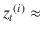 0.On taking the partial derivative of h <sub> t </sub> <sup>(i)</sup> with respect to in (4.4.3) we get the following:

    

    This will ensure that the notorious term  is also close to 1 since it can be expressed as

    

    

    This allows the hidden states to be copied over many sequence steps without alteration, and hence the chances of a vanishing gradient diminish and the model is able to learn temporally long-distance association or correlation between words.

### 双向 RNN

在标准的循环神经网络中，我们将过去的序列状态考虑在内进行预测。例如，为了预测序列中的下一个单词，我们考虑出现在它之前的单词。然而，对于自然语言处理中的某些任务，例如词性，标记关于给定单词的过去单词和未来单词在确定给定单词的词性标记中是至关重要的。此外，对于词性标注应用程序，整个句子都可以进行标注，因此，对于每个给定的单词(除了句子开头和结尾的单词)，其过去和未来的单词都可以使用。

双向 RNN 是一种特殊类型的 RNN，它利用过去和未来的状态来预测当前状态下的输出标签。双向 RNN 组合了两个 rnn，一个从左到右向前运行，另一个从右到左向后运行。双向 RNN 的高层架构如图 [4-15](#Fig15) 所示。


图 4-15。

Bidirectional RNN architectural diagram

对于双向 RNN，任何序列步长 t 都有两个隐藏存储器状态。对应于正向信息流的隐藏存储器状态，如在标准 RNN 中，可以表示为，对应于反向信息流的隐藏存储器状态可以表示为。在任何序列步骤 t 的输出取决于存储器状态和。以下是双向 RNN 的控制方程。


![ $$ {y}_t=g\left(U\left[\overrightarrow{h_t};\overleftarrow{h_t}\right]+c\right) $$ ](A448418_1_En_4_Chapter_Equcd.gif)

表达式![ $$ \left[\overrightarrow{h_t};\overleftarrow{h_t}\right] $$ ](A448418_1_En_4_Chapter_IEq171.gif)表示 t 时刻的组合内存状态向量，可以通过串联两个向量和的元素得到。

和分别是正向传递和反向传递的隐藏状态连接权重。类似地，和是向前和向后传递的隐藏状态权重的输入。分别由和给出前向和后向传递的隐藏存储器状态激活时的偏置。U 项表示从组合隐藏状态到输出状态的权重矩阵，而 c 表示输出端的偏差。

函数 f 通常是在隐藏存储器状态下选择的非线性激活函数。为 f 选择的激活函数通常是 sigmoid 和 tanh。然而，ReLU 激活现在也在使用，因为它们减少了渐变消失和爆炸的问题。函数 g 将取决于手头的分类问题。在多个类的情况下，将使用 SoftMax，而对于两类问题，可以使用 sigmoid 或两类 SoftMax。

## 摘要

在这一章之后，读者将会对循环神经网络及其变体的工作原理有更深刻的理解。此外，读者应该能够相对容易地使用张量流实现 RNN 网络。RNNs 的消失梯度和爆炸梯度问题在有效训练它们方面提出了一个关键的挑战，因此已经发展了许多功能强大的 RNNs 版本来解决这个问题。LSTM，作为一个强大的 RNN 建筑，被广泛应用于社区，几乎取代了基本的 RNN。希望读者了解这些先进技术的用途和优势，如 LSTM、GRU 等，以便根据问题相应地实施。预训练的 Word2Vec 和 GloVe 单词向量嵌入被几个 RNN、LSTM 和其他网络使用，使得在每个序列步骤的模型的输入单词可以由其预训练的 Word2Vec 或 GloVe 向量来表示，而不是在循环神经网络本身内学习这些单词向量嵌入。

在下一章中，我们将讨论受限玻尔兹曼机器(RBM)，这是一种基于能量的神经网络，以及各种自编码器，作为无监督深度学习的一部分。此外，我们将讨论深度信念网络，它可以通过堆叠几个受限制的波尔兹曼机器并以贪婪的方式训练这样的网络来形成，并通过 RBM 进行协同过滤。期待你参与下一章。