# 5.使用受限玻尔兹曼机器和自动编码器的无监督学习

无监督学习是机器学习的一个分支，它试图在未标记的数据中找到隐藏的结构，并从中获得洞察力。聚类、数据降维技术、降噪、分段、异常检测、欺诈检测和其他丰富的方法依赖于非监督学习来推动分析。今天，我们周围有这么多数据，不可能为监督学习标记所有数据。这使得无监督学习变得更加重要。受限玻尔兹曼机器和自动编码器是基于人工神经网络的无监督方法。它们在数据压缩和降维、数据降噪、异常检测、生成建模、协同过滤和深度神经网络初始化等方面具有广泛的用途。我们将详细讨论这些主题，然后触及几个无监督的图像预处理技术，即 PCA(主成分分析)白化和 ZCA (Mahalanobis)白化。此外，由于受限制的玻尔兹曼机器在训练中使用抽样技术，为了读者的利益，我简要地提到了贝叶斯推理和马尔可夫链蒙特卡罗抽样。

## 玻尔兹曼分布

受限玻尔兹曼机是基于经典物理学玻尔兹曼分布定律的能量模型，其中任何系统的粒子状态都由它们的广义坐标和速度来表示。这些广义坐标和速度构成了粒子的相空间，粒子可以以特定的能量和概率位于相空间的任意位置。让我们考虑一个包含 N 个气体分子的经典系统，让任意粒子的广义位置和速度分别用和表示。粒子在相空间中的位置可以用(r，v)来表示。粒子可能取的每一个这样的(r，v)值叫做粒子的构型。此外，所有的 N 个粒子都是相同的，因为它们同样可能占据任何状态。给定这样一个处于热力学温度 T 的系统，任何这样的配置的概率如下:


E(r，v)是处于构型(r，v)的任何粒子的能量，K 是玻尔兹曼常数。因此，我们看到，相空间中任何构型的概率，与能量除以玻尔兹曼常数和热力学温度的乘积的负值的指数成正比。为了将关系转换成等式，概率需要通过所有可能配置的概率的总和来归一化。如果粒子有 M 种可能的相空间组态，那么任何广义组态(r，v)的概率可以表示为


其中 Z 是由


给出的配分函数

r 和 v 可以分别有几个值。然而，M 表示 r 和 v 的所有可能的唯一组合，这些组合在前面的等式中已经由(r，v) <sub>i</sub> 表示。如果 r 可以取 n 个不同的坐标值，而 v 可以取 m 个不同的速度值，那么可能配置的总数。在这种情况下，配分函数也可以表示为:


这里要注意的是，当相关能量低时，任何构型的概率都较高。对于气体分子来说，这也很直观，因为高能态总是与不稳定平衡相联系，因此不太可能长时间保持高能构型。高能组态中的粒子总是在追求占据更稳定的低能态。

如果我们考虑两个组态和，并且如果这两个态的气体分子数分别为 N <sub>1</sub> 和 N <sub>2</sub> ，那么这两个态的概率比就是这两个态的能量差的函数:


我们现在将稍微偏离主题，简要讨论贝叶斯推理和马尔可夫链蒙特卡罗(MCMC)方法，因为受限玻尔兹曼机器通过 MCMC 技术使用采样，尤其是吉布斯采样，并且这些方面的一些知识将有助于帮助读者理解受限玻尔兹曼机器的工作原理。

## 贝叶斯推理:可能性、先验和后验概率分布

正如在第 [1](1.html) 章中所讨论的，每当我们得到数据时，我们就通过定义一个基于模型参数的数据的似然函数来建立一个模型，然后尝试最大化该似然函数。似然性无非是给定模型参数后所看到或观察到的数据的概率:

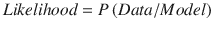

为了得到由其参数定义的模型，我们最大化所见数据的可能性:

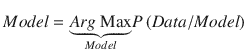

由于我们只是试图根据观察到的数据拟合一个模型，如果我们追求简单的可能性最大化，就很有可能过度拟合而不能推广到新数据。

如果数据量很大，所看到的数据可能很好地代表了总体，因此最大化可能性可能就足够了。另一方面，如果看到的数据很小，它很可能不能很好地代表总体，因此基于可能性的模型不能很好地推广到新数据。在这种情况下，对模型有一定的先验信念并通过先验信念来约束可能性会导致更好的结果。假设先验信念的形式是我们以概率分布的形式知道模型参数的不确定性；即 P(模型)是已知的。在这种情况下，我们可以通过先验信息更新我们的可能性，以获得给定数据的模型分布。根据贝叶斯条件概率定理，


p(模型/数据)被称为后验分布，通常信息更丰富，因为它结合了一个人关于数据或模型的先验知识。由于数据的这种概率是独立于模型的，因此后验与似然和先验的乘积成正比:


可以通过最大化后验概率分布而不是似然性来建立模型。这种获得模型的方法被称为最大化后验概率，或 MAP。似然性和 MAP 都是模型的点估计，因此不能覆盖整个不确定性空间。采用最大化后验概率的模型意味着采用该模型的概率分布的模式。由最大似然函数给出的点估计不对应于任何模式，因为似然函数不是概率分布函数。如果概率分布是多模态的，这些点估计的表现会更差。

更好的方法是在整个不确定性空间内取模型的平均值；即取基于后验分布的模型的均值，如下:

![ $$ Model=E\left[ Model/ Data\right]=\underset{Model}{\int } Model\ P\left( Model/ Data\right)d(Model) $$ ](A448418_1_En_5_Chapter_Equj.gif)

为了激发似然性和后验概率的概念，以及它们如何被用来导出模型参数，让我们再次回到硬币问题。

假设我们掷硬币六次，其中正面出现五次。如果要估计人头的概率，估计值会是多少？

这里，我们的模型是估计投掷硬币时正面θ的概率。每次投掷硬币都可以被视为一次独立的伯努利试验，正面的概率为θ。给定模型，数据的可能性由


给出，其中表示正面(H)或反面(T)的事件。

由于硬币的投掷是独立的，可能性可以分解如下:


(5.1.1)

每次掷骰子遵循伯努利分布，因此正面的概率为θ，反面的概率为，通常其概率质量函数由


(5.1.2)给出，其中表示正面，表示反面。

由于组合(1)和(2)有 5 个头和 1 个尾，所以作为θ的函数的似然 L 可以表示如下:


(5.1.3)

最大似然法将最小化 L(θ)的视为模型参数。于是，


如果我们对(5.1.3)中计算的似然性求导并将其设置为零，我们将得到θ:


的似然估计

一般来说，如果有人问我们对θ的估计，而我们没有做类似的最大似然估计，我们会立刻根据我们在高中学到的概率的基本定义回答概率为;即


在某种程度上，我们的大脑在思考可能性，并依赖迄今为止看到的数据。

现在，让我们假设我们没有看到数据，有人要求我们确定正面的概率；什么是合理的估计？

这取决于我们对硬币的任何先验信念，即概率会不同。如果我们假设一个公平的硬币，这通常是最明显的假设，因为我们没有关于硬币的信息，将是一个很好的估计。然而，当我们假设而不是对θ进行先验点估计时，最好在θ上有一个概率分布，最大概率在。先验概率分布是模型参数θ的分布。

在这种情况下，带有参数的贝塔分布将是一个很好的先验分布，因为它在具有最大概率，并且在它周围是对称的。【T2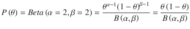

对于α和β的固定值，B(α，β)是常数，并且是该概率分布的归一化或配分函数。可以计算如下:


即使不记得公式，只要对积分，取其倒数作为归一化常数，就可以知道，因为概率分布的积分应该是 1。

T2

(5 . 1 . 4)

如果我们结合似然和先验，我们得到后验概率分布如下:


由于我们忽略了数据的概率，所以出现了正比例符号。其实我们也可以把 6 拿出来，把后验表示成:


现在，既然θ是一个概率。在 0 到 1 的范围内对进行积分并取倒数，将得到后验概率的归一化因子，结果为 252。于是，后验可以表述为:


(5.1.5)

现在我们有了后验概率，有两种方法可以估计θ。我们可以最大化后验，得到θ的 MAP 估计如下:


我们看到,的 MAP 估计比的似然估计更保守，因为它考虑了先验，而不是盲目相信数据。

现在，让我们来看看第二种方法，即纯贝叶斯方法，并取后验分布的平均值来平均θ:

![ $$ {\displaystyle \begin{array}{l}E\left[\theta /D\right]=\underset{\theta =0}{\overset{1}{\int }}\theta P\left(\theta /D\right) d\theta \\ {}\kern4.75em =\underset{\theta =0}{\overset{1}{\int }}\frac{\theta^7{\left(1-\theta \right)}^2}{252} d\theta\ \\ {}\kern4.75em =0.7\end{array}} $$ ](A448418_1_En_5_Chapter_Equu.gif)

的所有不确定性


图 5-1c。

Posterior probability distribution


图 5-1b。

Prior probability distribution


图 5-1a。

Likelihood function plot

在图 [5-1a](#Fig1) 到图 [5-1c](#Fig3) 中绘制的是硬币问题的似然函数以及先验和后验概率分布。需要注意的一点是，似然函数不是概率密度函数或概率质量函数，而先验和后验是概率质量或密度函数。

对于复杂的分布，后验概率分布可能非常复杂，有几个参数，不太可能代表已知的概率分布形式，如正态分布、伽玛分布等。因此，为了计算后验概率的平均值，在模型的整个不确定性空间上计算积分似乎是不可能的。

在这种情况下，可以使用马尔可夫链蒙特卡罗抽样方法对模型参数进行抽样，然后它们的平均值就是后验分布平均值的合理估计。如果我们采样 n 组模型参数 M <sub>i</sub> 那么

![ $$ E\left[ Model/ Data\right]\approx \sum \limits_{i=1}^n{M}_i $$ ](A448418_1_En_5_Chapter_Equv.gif)

通常，取分布的平均值，因为它使所有 c 的平方误差最小。

![ $$ c=E\left[y\right] $$ ](A448418_1_En_5_Chapter_IEq22.gif)时![ $$ E\left[{\left(y-c\right)}^2\ \right] $$ ](A448418_1_En_5_Chapter_IEq21.gif)最小化。假设我们试图用单个代表来表示分布的概率，以使概率分布的平方误差最小化，则平均值是最佳候选值。

然而，如果分布是偏斜的和/或数据中有更多潜在异常值形式的噪声，则可以取分布的中值。这个估计的中值可以基于从后验样本中抽取的样本。

## 抽样的马尔可夫链蒙特卡罗方法

马尔可夫链蒙特卡罗方法(MCMC)是从复杂的后验概率分布或通常从多变量数据的任何概率分布中进行采样的一些最流行的技术。在我们讨论 MCMC 之前，让我们先讨论一下蒙特卡罗抽样方法。蒙特卡罗采样方法试图根据采样点计算曲线下的面积。

例如，超越数 Pi(π)的面积可以通过对半径为 1 的正方形内的点进行采样并记下该正方形内直径为 2 的圆的四分之一内的采样点数来计算。如图 [5-2](#Fig4) 所示，圆周率的面积计算如下:


图 5-2。

Area of Pi

在清单 [5-1](#Par45) 中，举例说明了计算圆周率值的蒙特卡罗方法。正如我们所看到的，这个值接近圆周率的值。可以通过采样更多的点来提高精度。

```py
import numpy as np
number_sample = 100000
inner_area,outer_area = 0,0
for i in range(number_sample):
    x = np.random.uniform(0,1)
    y = np.random.uniform(0,1)
    if (x**2 + y**2) < 1 :
        inner_area += 1
    outer_area += 1

print("The computed value of Pi:",4*(inner_area/float(outer_area)))

--Output--
('The computed value of Pi:', 3.142)

Listing 5-1.
Computation of Pi

Through Monte Carlo Sampling

```

如果维度空间很大，简单的蒙特卡罗方法是非常低效的，因为维度越大，相关性的影响就越显著。马尔可夫链蒙特卡罗方法在这种情况下是有效的，因为它们从高概率区域比从低概率区域花费更多的时间来收集样本。正常的蒙特卡罗方法均匀地探索概率空间，因此花费与探索高概率区域一样多的时间来探索低概率区域。正如我们所知，当通过采样计算函数的期望值时，低概率区域的贡献是微不足道的，因此当算法在这样的区域中花费大量时间时，它会导致明显更长的处理时间。马尔可夫链蒙特卡罗方法背后的主要启发是不一致地探索概率空间，而是更集中于高概率区域。在高维空间中，由于相关性，大部分空间是稀疏的，仅在特定区域发现高密度。因此，我们的想法是花更多的时间从高概率区域收集更多的样本，尽可能少花时间探索低概率区域。

马尔可夫链可以被认为是一个随机/随机过程，用来生成一个随时间演变的随机样本序列。随机变量的下一个值仅由变量的前一个值决定。马尔可夫链，一旦进入高概率区，就试图尽可能多地收集高概率密度的点。它通过根据当前样本值生成下一个样本来实现这一点，从而以高概率选择靠近当前样本的点，以低概率选择远离当前样本的点。这确保了马尔可夫链从当前高概率区域收集尽可能多的点。然而，偶尔需要从当前样本进行长距离跳跃，以探索远离马尔可夫链工作的当前区域的其他潜在高概率区域。

马尔可夫链的概念可以用气体分子在一个封闭容器中的稳态运动来说明。容器的几个部分具有比其他区域更高密度的气体分子，并且由于气体分子处于稳定状态，即使可能有气体分子从一个位置移动到另一个位置，每个状态的概率(由气体分子的位置决定)也将保持恒定。


图 5-3。

Movement of gases in an enclosed container at steady state with only three states: A, B, and C

为了简单起见，让我们假设气体分子只有三种状态(在这种情况下是气体分子的位置)，如图 [5-3](#Fig5) 所示。让我们用 A、B 和 C 来表示这些状态，用 P <sub>A</sub> ，P <sub>B</sub> ，P <sub>C</sub> 来表示它们相应的概率。

由于气体分子处于稳态，如果有气体分子跃迁到其他状态，需要保持平衡以保持概率分布不变。要考虑的最简单的假设是，从状态 A 到状态 B 的概率质量应该从 B 回到 A；即成对的，状态处于平衡状态。

假设 P(B/A)决定了从 A 到 B 的转移概率。因此，从 A 到 B 的概率质量由


(5.2.1)给出

同样，从 B 到 A 的概率质量由


(5.2.2)给出

所以，从(5.2.1)和(5.2.2)的稳态中，我们有


(5.2.3)来维持概率分布的平稳性。这叫做详细平衡条件，是一个概率分布平稳性的充分但非必要条件。气体分子可以以更复杂的方式处于平衡，但是由于当可能的状态空间是无限的时，这种形式的细节平衡在数学上是方便的，所以这种方法已经被广泛用于马尔可夫链蒙特卡罗方法中，以基于当前点对下一个点进行采样，并且具有高的接受概率。简而言之，马尔可夫链的运动预计会像稳态下的气体分子一样，在高概率区域比在低概率区域花费更多的时间，从而保持详细的平衡条件不变。

下面列出了马尔可夫链的良好实现需要满足的一些其他条件:

*   不可约性——马尔可夫链的一个理想性质是，我们可以从一个状态进入任何其他状态。这一点很重要，因为在马尔可夫链中，虽然我们希望以高概率继续探索给定状态的邻近状态，但有时我们可能不得不跳转并探索某个远邻域，同时预期新区域可能是另一个高概率区域。
*   非周期性——马尔可夫链不应该太频繁地重复，否则就不可能遍历整个空间。想象一个有 20 个状态的空间。如果在探索了五个状态之后，该链重复，则不可能遍历所有 20 个状态，从而导致次优采样。

### 大都会算法

Metropolis 算法是一种马尔可夫链蒙特卡罗方法，它使用当前接受的状态来确定下一个状态。时间处的样本有条件地依赖于时间 t 处的样本。时间处的建议状态来自正态分布，其平均值等于具有指定方差的时间 t 处的当前样本。一旦抽取，检查在时间和时间 t 的样本之间的概率比。如果大于或等于 1，则选择概率为 1 的样本；如果小于 1，则随机选择样本。接下来提到的是详细的实现步骤。

*   从任意一个随机采样点 X <sup>(1)</sup> 开始。
*   选择条件依赖于 X <sup>(1)</sup> 的下一个点 X <sup>(2)</sup> 。可以从一个均值为 X <sup>(1)</sup> 和一些有限方差的正态分布中选择 X <sup>(2)</sup> ，假设 S <sup>(2)</sup> 。因此，良好采样的一个关键决定因素是非常明智地选择方差 S <sup>2</sup> 。方差不应该太大，因为在这种情况下，下一个样本 X <sup>(2)</sup> 停留在当前样本 X <sup>(1)</sup> 附近的机会较小，在这种情况下，高概率区域可能不会被探索太多，因为下一个样本在大多数时间被选择为远离当前样本。同时，方差不应该太小。在这种情况下，下一个样本将几乎总是停留在当前点附近，因此探索远离当前区域的不同高概率区域的概率将降低。
*   一旦 X <sup>(2)</sup> 已经从前面的步骤中生成，则使用一些特殊的试探法来确定是否接受它。
    *   如果比率则接受 X <sup>(2)</sup> 并将其作为有效样本点。接受的样本成为生成下一个样本的 X <sup>(1)</sup> 。
    *   如果比率大于从 0 和 1 之间的均匀分布中随机产生的数字，则比率被接受；即 U [0，1]。

如我们所见，如果我们转向高概率样本，那么我们接受新样本，如果我们转向低概率样本，我们有时接受有时拒绝新样本。如果比率 P(X<sup>(2)</sup>/P(X<sup>(1)</sup>)很小，则拒绝的概率增加。比方说 P(X <sup>(2)</sup> )/P(X <sup>(1)</sup> )的比值= 0.1。当我们从一个均匀分布中产生一个介于 0 和 1 之间的随机数 r <sub>u</sub> 时，那么的概率是 0.9，这又意味着新样本被拒绝的概率是 0.9。一般情况下，


其中 r 是新样本和旧样本的概率之比。

让我们试着凭直觉理解为什么这种试探法适用于马尔可夫链蒙特卡罗方法。根据明细余额，


我们假设转移概率服从正态分布。我们不检查我们采用的转移概率框架是否足以以我们希望坚持的详细平衡的形式保持概率分布的平稳性。让我们考虑保持分布平稳的两个状态 X <sub>1</sub> 和 X <sub>2</sub> 之间的理想转移概率由 P(X <sub>1</sub> /X <sub>2</sub> )和 P(X <sub>2</sub> /X <sub>1</sub> )给出。因此，根据明细平衡，必须满足以下条件:


然而，发现这样一个理想的转移概率函数，通过强加一个详细的平衡条件来确保平稳性是困难的。我们从合适的转移概率函数开始，假设为 T(x/y)，其中 y 表示当前状态，X 表示基于 y 采样的下一个状态。对于两个状态 X <sub>1</sub> 和 X <sub>2</sub> ，假设的转移概率因此由从状态 X <sub>2</sub> 到 X <sub>1</sub> 的移动的 T(X <sub>1</sub> /X <sub>2</sub> 和 T(X<sub>2</sub>给出由于假设的转移概率不同于通过详细平衡保持平稳性所需的理想转移概率，我们有机会根据下一步行动的好坏接受或拒绝样本。为了掩盖这个机会，考虑状态转移的接受概率，使得对于从 X <sub>1</sub> 到 X<sub>2</sub>2

T25】T26】的状态转移，其中 A(X <sub>2</sub> /X <sub>1</sub> 是从 X <sub>1</sub> 到 X <sub>2</sub> 的移动的接受概率。

根据明细余额，


将理想转移概率替换为假设转移概率和接受概率的乘积，我们得到


重新排列这个，我们得到的接受概率比是


满足这一点的一个简单建议由 Metropolis 算法给出为

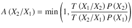

在 Metropolis 算法中，假设的转移概率一般假设为对称的正态分布，因此 T(X<sub>1</sub>/X<sub>2</sub>)= T(X<sub>2</sub>/X<sub>1</sub>)。这简化了从 X <sub>1</sub> 到 X <sub>2</sub> 移动为


的接受概率

如果接受概率为 1，那么我们接受概率为 1 的移动，而如果接受概率小于 1，比如说 r，那么我们接受概率为 r 的新样本，拒绝概率为的样本。以概率拒绝样本是通过将比率与从 0 和 1 之间的均匀分布中随机生成的样本 r <sub>u</sub> 进行比较，并在的情况下拒绝样本来实现的。这是因为对于均匀分布概率，这确保了保持期望的拒绝概率。

在清单 [5-2](#Par74) 中，我们展示了通过 Metropolis 算法从二元高斯分布中进行抽样。


图 5-4。

Plot of sampled points from multi-variate Gaussian distribution using Metropolis algorithm

```py
import numpy as np
import matplotlib.pyplot as plt
#Now let’s generate this with one of the Markov Chain Monte Carlo methods called Metropolis Hastings algorithm
# Our assumed transition probabilities would follow normal distribution X2 ∼ N(X1,Covariance= [[0.2 , 0],[0,0.2]])

import time
start_time = time.time()
# Set up constants and initial variable conditions
num_samples=100000
prob_density = 0
## Plan is to sample from a Bivariate Gaussian Distribution with mean (0,0) and covariance of
## 0.7 between the two variables
mean = np.array([0,0])
cov = np.array([[1,0.7],[0.7,1]])
cov1 = np.matrix(cov)
mean1 = np.matrix(mean)
x_list,y_list = [],[]
accepted_samples_count = 0
## Normalizer of the Probability distibution
## This is not actually required since we are taking ratio of probabilities for inference
normalizer = np.sqrt( ((2*np.pi)**2)*np.linalg.det(cov))
## Start wtih initial Point (0,0)
x_initial, y_initial = 0,0
x1,y1 = x_initial, y_initial

for i in xrange(num_samples):
    ## Set up the Conditional Probability distribution, taking the existing point
    ## as the mean and a small variance = 0.2 so that points near the existing point

    ## have a high chance of getting sampled.
    mean_trans = np.array([x1,y1])
    cov_trans = np.array([[0.2,0],[0,0.2]])
    x2,y2 = np.random.multivariate_normal(mean_trans,cov_trans).T
    X = np.array([x2,y2])
    X2 = np.matrix(X)
    X1 = np.matrix(mean_trans)
    ## Compute the probability density of the existing point and the new sampled
    ## point
    mahalnobis_dist2 = (X2 - mean1)*np.linalg.inv(cov)*(X2 - mean1).T
    prob_density2 = (1/float(normalizer))*np.exp(-0.5*mahalnobis_dist2)
    mahalnobis_dist1 = (X1 - mean1)*np.linalg.inv(cov)*(X1 - mean1).T
    prob_density1 = (1/float(normalizer))*np.exp(-0.5*mahalnobis_dist1)
    ## This is the heart of the algorithm. Comparing the ratio of probability density of the new
    ## point and the existing point(acceptance_ratio) and selecting the new point if it is to have more probability
    ## density. If it has less probability it is randomly selected with the probability of getting
    ## selected being proportional to the ratio of the acceptance ratio
    acceptance_ratio = prob_density2[0,0] / float(prob_density1[0,0])

    if (acceptance_ratio >= 1) | ((acceptance_ratio < 1) and (acceptance_ratio >= np.random.uniform(0,1)) ):
        x_list.append(x2)
        y_list.append(y2)
        x1 = x2
        y1 = y2
        accepted_samples_count += 1

end_time = time.time()

print ('Time taken to sample ' + str(accepted_samples_count) + ' points ==> ' + str(end_time - start_time) + ' seconds' )
print 'Acceptance ratio ===> ' , accepted_samples_count/float(100000)
## Time to display the samples generated
plt.xlabel('X')
plt.ylabel('Y')
plt.scatter(x_list,y_list,color='black')
print "Mean of the Sampled Points"
print np.mean(x_list),np.mean(y_list)
print "Covariance matrix of the Sampled Points"
print np.cov(x_list,y_list)

-Output-

Time taken to sample 71538 points ==> 30.3350000381 seconds
Acceptance ratio ===>  0.71538
Mean of the Sampled Points
-0.0090486292629 -0.008610932357
Covariance matrix of the Sampled Points
[[ 0.96043199  0.66961286]
 [ 0.66961286  0.94298698]]

Listing 5-2.Bivariate Gaussian Distribution Through Metropolis Algorithm

```

我们从输出中看到，采样点的均值和协方差非常接近于我们从中采样的二元高斯分布的均值和协方差。此外，图 [5-4](#Fig6) 中的散点图非常类似于二元高斯分布。

现在我们知道了从概率分布中采样的马尔可夫链蒙特卡罗方法，我们将在检查受限玻尔兹曼机器时了解另一种称为吉布斯采样的 MCMC 方法。

## 受限玻尔兹曼机器

受限玻尔兹曼机器(RBM)属于利用概率分布的玻尔兹曼方程的无监督类机器学习算法。图 [5-5](#Fig7) 所示为双层受限玻尔兹曼机架构，有一个隐藏层和一个可见层。所有隐藏层和可见层的单元之间都有权重连接。但是，不存在隐藏到隐藏或可见到可见的单元连接。“受限”一词在 RBM 指的是对网络的这种限制。给定可见单元集，RBM 的隐藏单元有条件地相互独立。类似地，给定隐藏单元集，RBM 的可见单元有条件地相互独立。受限玻尔兹曼机器通常被用作深层网络的构建模块，而不是作为一个单独的网络本身。在概率图形模型方面，受限玻尔兹曼机器可以定义为包含一个可见层和一个单一隐藏层的无向概率图形模型。与 PCA 非常相似，RBMs 可以被认为是一种将一个维度(由可见层 v 给出)的数据表示到不同维度(由隐藏层 h 给出)的方法。当隐藏层的大小小于可见层的大小时，RBM 对数据进行降维。RBM 通常基于二进制数据进行训练。


图 5-5。

Restricted Boltzmann machine visible and hidden layers architecture

让 RBM 的可见单元用向量![ $$ v={\left[{v}_1{v}_2\dots {v}_m\right]}^T\in {\mathrm{\mathbb{R}}}^{m\times 1} $$ ](A448418_1_En_5_Chapter_IEq36.gif)表示，隐藏单元用![ $$ h={\left[{h}_1{h}_2\dots {h}_n\right]}^T\in {\mathrm{\mathbb{R}}}^{n\times 1} $$ ](A448418_1_En_5_Chapter_IEq37.gif)表示。同样，让连接第 I 个可见单元和第 j 个隐藏单元的权重用来表示。设包含权重 w <sub>ij</sub> 的矩阵用表示。

具有隐藏状态 h 和可见状态 v 的联合概率分布的能量由


(5.3.1)给出，其中 E(v，h)是联合配置(v，h)的能量，Z 是归一化因子，通常称为配分函数。这个概率基于玻尔兹曼分布，并假设玻尔兹曼常数和热温度为 1。


(5.3.2)

联合构型(v，h)的能量 E(v，h)由


(5 . 3 . 3)


(5 . 3 . 4)给出

向量![ $$ b\in {\left[{b}_1{b}_2\kern0.75em ..{b}_m\right]}^T\in {\mathrm{\mathbb{R}}}^{m\times 1} $$ ](A448418_1_En_5_Chapter_IEq40.gif)和![ $$ c\in {\left[{c}_1{c}_2\kern0.75em ..{c}_n\right]}^T\in {\mathrm{\mathbb{R}}}^{n\times 1} $$ ](A448418_1_En_5_Chapter_IEq41.gif)分别是可见单元和隐藏单元的偏差，我们将在后面看到。

在任何图形概率模型中，其思想是计算各种事件集合的联合概率分布。结合(5.3.1)和(5.3.3)，我们得到

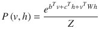

(5.3.5)

配分函数 Z 很难计算，这使得 P(v，h)的计算很难计算。对于一小组事件，可以计算配分函数。如果在 v 和 h 中有许多变量，可能的联合事件的数目将会非常大；考虑所有这些组合变得很困难。

然而，条件概率分布 P(h/v)很容易计算和采样。下面的推论将证明这一点:

![ $$ {\displaystyle \begin{array}{l}P\left(h/v\right)=\frac{P\left(v,h\right)}{P(v)}\\ {}\kern3.5em =\frac{P\left(v,h\right)}{\sum_hP\left(v,h\right)}\\ {}\kern3.5em =\frac{\frac{e^{b^Tv+{c}^Th+{v}^T Wh}}{Z}}{\sum_h\frac{e^{b^Tv+{c}^Th+{v}^T Wh}}{Z}}\\ {}\kern3.5em =\frac{e^{b^Tv+{c}^Th+{v}^T Wh}}{\sum_h{e}^{b^Tv+{c}^Th+{v}^T Wh}}\\ {}\kern3.5em =\frac{e^{b^Tv}{e}^{c^Th}{e}^{v^T Wh}}{e^{b^Tv}{\sum}_h{e}^{c^Th}{e}^{v^T Wh}}\\ {}\kern3.5em =\frac{e^{c^Th}{e}^{v^T Wh}}{\sum_h{e}^{c^Th}{e}^{v^T Wh}}\end{array}} $$ ](img/A448418_1_En_5_Chapter_Equag.gif)

我们可以根据所涉及的不同向量的分量展开分子和分母，如下:

![ $$ {\displaystyle \begin{array}{l}{e}^{c^Th}{e}^{v^T Wh}={e}^{c^Th+{v}^T Wh}\\ {}\kern3.5em ={e}^{\sum \limits_{j=1}^n\left({c}_j{h}_j+{v}^TW\left[:,j\right]{h}_j\right)}\end{array}} $$ ](A448418_1_En_5_Chapter_Equah.gif)

由于和的指数等于指数的乘积，前面的等式可以写成乘积形式如下:

![ $$ {e}^{c^Th}{e}^{v^T Wh}=\prod \limits_{j=1}^n{e}^{c_j{h}_j+{v}^TW\left[:,j\right]{h}_j} $$ ](A448418_1_En_5_Chapter_Equ14.gif)

(5.3.6)

现在，让我们看看分母，它看起来类似于分子，只是具有所有可能的隐藏状态 h 的总和。使用(5.3.6)中的表达式，分母可以表示为

![ $$ \sum \limits_h{e}^{c^Th}{e}^{v^T Wh}=\kern0.5em \sum \limits_h\prod \limits_{j=1}^n{e}^{c_j{h}_j+{v}^TW\left[:,j\right]{h}_j} $$ ](A448418_1_En_5_Chapter_Equ15.gif)

(5.3.7)

矢量和是指其分量的所有组合的和。每个隐藏单元 h <sub>i</sub> 可以有二进制状态 0 或 1，因此有。因此,( 5.3.7)中对向量 h 的求和可以展开成对应于其每个分量的多个求和:

![ $$ {\displaystyle \begin{array}{l}\sum \limits_h{e}^{c^Th}{e}^{v^T Wh}=\sum \limits_{h_1=0}^1\sum \limits_{h_2=0}^1..\sum \limits_{h_n=0}^1\prod \limits_{j=1}^n{e}^{c_j{h}_j+{v}^TW\left[:,j\right]{h}_j}\\ {}\kern4.5em =\sum \limits_{h_1=0}^1\sum \limits_{h_2=0}^1..\sum \limits_{h_n=0}^1\left({e}^{c_1{h}_1+{v}^TW\left[:,1\right]{h}_1}\right)\left({e}^{c_2{h}_2+{v}^TW\left[:,2\right]{h}_2}\right)\dots \left({e}^{c_n{h}_n+{v}^TW\left[:,n\right]{h}_n}\right)\end{array}} $$ ](A448418_1_En_5_Chapter_Equ16.gif)

(5.3.8)

现在，让我们来看一个非常简单的操作，涉及两个离散变量 a 和 b 的乘积和求和:


所以，我们看到，当我们取独立指数的变量元素时，变量乘积的和可以表示为变量和的乘积。类似于这个例子，h(即 h <sub>i</sub> )的元素一般独立地包含在乘积![ $$ \left({e}^{c_1{h}_1+{v}^TW\left[:,1\right]{h}_1}\right)\left({e}^{c_2{h}_2+{v}^TW\left[:,2\right]{h}_2}\right)\dots \left({e}^{c_n{h}_n+{v}^TW\left[:,n\right]{h}_n}\right) $$ ](A448418_1_En_5_Chapter_IEq44.gif)中，因此(5.3.8)中的表达式可以简化为:

![ $$ \sum \limits_h{e}^{c^Th}{e}^{v^T Wh}=\sum \limits_{h_1=0}^1\left({e}^{c_1{h}_1+{v}^TW\left[:,1\right]{h}_1}\right)\sum \limits_{h_1=0}^1\left({e}^{c_2{h}_2+{v}^TW\left[:,2\right]{h}_2}\right)..\sum \limits_{h_n=0}^1\left({e}^{c_n{h}_n+{v}^TW\left[:,n\right]{h}_n}\right) $$ ](A448418_1_En_5_Chapter_Equaj.gif)

![ $$ \sum \limits_h{e}^{c^Th}{e}^{v^T Wh}=\prod \limits_{j=1}^n\sum \limits_{h_j=0}^1\left({e}^{c_j{h}_j+{v}^TW\left[:,j\right]{h}_j}\right) $$ ](A448418_1_En_5_Chapter_Equ17.gif)

(5.3.9)

将(5.3.6)和(5.3.9)中分子和分母的表达式组合起来，我们得到

![ $$ P\left(h/v\right)=\frac{\prod_{j=1}^n{e}^{c_j{h}_j+{v}^TW\left[:,j\right]{h}_j}}{\prod_{j=1}^n{\sum}_{h_j=0}^1{e}^{c_j{h}_j+{v}^TW\left[:,j\right]{h}_j}} $$ ](A448418_1_En_5_Chapter_Equak.gif)

简化这两边 h 的分量，我们得到

![ $$ P\left({h}_1{h}_2..{h}_n/v\right)=\prod \limits_{j=1}^n\left(\frac{e^{c_j{h}_j+{v}^TW\left[:,j\right]{h}_j}}{\sum_{h_j=0}^1{e}^{c_j{h}_j+{v}^TW\left[:,j\right]{h}_j}}\right) $$ ](A448418_1_En_5_Chapter_Equal.gif)

![ $$ =\left(\frac{e^{c_1{h}_1+{v}^TW\left[:,1\right]{h}_1}}{\sum_{h_1=0}^1{e}^{c_1{h}_1+{v}^TW\left[:,1\right]{h}_1}}\right)\left(\frac{e^{c_2{h}_2+{v}^TW\left[:,1\right]{h}_2}}{\sum_{h_2=0}^1{e}^{c_2{h}_2+{v}^TW\left[:,2\right]{h}_2}}\right)\left(\frac{e^{c_n{h}_n+{v}^TW\left[:,n\right]{h}_n}}{\sum_{h_n=0}^1{e}^{c_n{h}_n+{v}^TW\left[:,n\right]{h}_{1n}}}\right) $$ ](A448418_1_En_5_Chapter_Equ18.gif)

(5.3.10)

以 v 为条件的 h 的元素的联合概率分布已经被分解成以 v 为条件的彼此独立的表达式的乘积。这导致这样的事实:给定 v，h 的分量(即，)是彼此有条件独立的。这给出了我们


(5 . 3 . 11)

![ $$ P\left({h}_j/v\right)=\frac{e^{c_j{h}_j+{v}^TW\left[:,j\right]{h}_j}}{\sum_{h_j=0}^1{e}^{c_j{h}_j+{v}^TW\left[:,j\right]{h}_j}} $$ ](A448418_1_En_5_Chapter_Equ20.gif)

(5 . 3 . 12)

替换(5.3.12)中的和，我们得到

![ $$ P\left({h}_j=1/v\right)=\frac{e^{c_j+{v}^TW\left[:,j\right]}}{1+{e}^{c_j+{v}^TW\left[:,j\right]}} $$ ](A448418_1_En_5_Chapter_Equ21.gif)

(5 . 3 . 13)

![ $$ P\left({h}_j=0/v\right)=\frac{1}{1+{e}^{c_j+{v}^TW\left[:,j\right]}} $$ ](A448418_1_En_5_Chapter_Equ22.gif)

(5 . 3 . 14)

(5.3.13)和(5.3.14)的表达式说明了隐藏单元是独立的 sigmoid 单元:

![ $$ P\left({h}_j=1/v\right)=\sigma \left({c}_j+{v}^TW\left[:,j\right]\right) $$ ](A448418_1_En_5_Chapter_Equ23.gif)

(5.3.15)

展开 v 和 W 的分量[:，j]，我们可以将(5.3.15)改写为


(5.3.16)其中σ(。)表示 sigmoid 函数，使得


以类似的方式进行，可以证明


，这意味着给定可见状态，隐藏单元有条件地彼此独立。由于 RBM 是一个对称的无向网络，像可见单元一样，给定隐藏状态的可见单元的概率可以类似地表示为


(5.3.17)

从(5.3.16)和(5.3.17)我们可以清楚地看到，可见单元和隐藏单元实际上是二元 sigmoid 单元，向量 b 和 c 分别在可见单元和隐藏单元提供偏差。隐藏和可见单元的这种对称和独立的条件依赖在训练模型时可能是有用的。

### 训练受限玻尔兹曼机器

我们需要训练玻尔兹曼机器，以便导出模型参数 b、c、W，其中 b 和 c 分别是可见和隐藏单元处的偏置向量，W 是可见和隐藏层之间的权重连接矩阵。为了便于引用，模型参数可以统称为

![ $$ \theta =\left[b;c;W\right] $$ ](A448418_1_En_5_Chapter_Equao.gif)

可以通过最大化输入数据点相对于模型参数的对数似然函数来训练模型。输入只是对应于每个数据点的可见单元的数据。似然函数由


给出

由于输入的数据点是独立给定的模型，


(5.3.18)

取两边的对数得到(5.3.18)中函数的对数似然表达式，我们有


(5.3.19)

将(5.3.19)中的概率按其联合概率形式展开，我们得到

![ $$ {\displaystyle \begin{array}{l}C=\sum \limits_{t=1}^m\log P\left({v}^{(t)}/\theta \right)\\ {}\kern1.5em =\sum \limits_{t=1}^m\log \sum \limits_hP\left({v}^{(t)},h/\theta \right)\\ {}\kern1.5em =\sum \limits_{t=1}^m\log \sum \limits_h\frac{e^{-E\left({v}^{(t)},h\right)}}{Z}\\ {}\kern1.5em =\sum \limits_{t=1}^m\log \frac{\sum_h{e}^{-E\left({v}^{(t)},h\right)}}{Z}\\ {}\kern1.5em =\sum \limits_{t=1}^m\log \sum \limits_h{e}^{-E\left({v}^{(t)},h\right)}-\sum \limits_{t=1}^m\log Z\\ {}\kern1.5em =\sum \limits_{t=1}^m\log \sum \limits_h{e}^{-E\left({v}^{(t)},h\right)}-m\log Z\end{array}} $$ ](img/A448418_1_En_5_Chapter_Equ28.gif)

(5.3.20)

与(5.3.20)中的第一项不同，配分函数 Z 不受可见层输入 v <sup>(t)</sup> 的约束。z 是 v 和 h 的所有可能组合的能量的负指数之和，因此可以表示为


用(5.3.20)中的这个表达式替换 Z，我们得到


(5.3.21)

现在，让我们取成本函数相对于组合参数θ的梯度。我们可以认为 C 由两部分组成，和，其中


取相对于θ的梯度，我们得到


(5.3.22)

现在我们把简化为分子和分母都除以 Z:


(5 . 3 . 23)。使用(5.3.23)中概率的这些表达式，我们得到

![ $$ {\displaystyle \begin{array}{l}{\nabla}_{\theta}\left({\rho}^{+}\right)=\sum \limits_{t=1}^m\frac{\sum_hP\left({v}^{(t)},h/\theta \right){\nabla}_{\theta}\left(-E\left({v}^{(t)},h\right)\right)}{P\left({v}^{(t)}/\theta \right)}\\ {}\kern5.5em =\sum \limits_{t=1}^m\sum \limits_h\frac{P\left({v}^{(t)},h/\theta \right)}{P\left({v}^{(t)}/\theta \right)}{\nabla}_{\theta}\left(-E\left({v}^{(t)},h\right)\right)\\ {}\kern5.5em =\sum \limits_{t=1}^m\sum \limits_hP\left(h/{v}^{(t)},\theta \right){\nabla}_{\theta}\left(-E\left({v}^{(t)},h\right)\right)\ \end{array}} $$ ](img/A448418_1_En_5_Chapter_Equ32.gif)

(5.3.24)

如果愿意，可以从概率符号中删除θ，例如 P(v <sup>(t)</sup> 、h/θ)、P(v <sup>(t)</sup> 、h/θ)等等，以便于符号化，但是最好保留它们，因为它使得推导更加完整，这允许整个训练过程的更好的可解释性。

让我们看看函数的期望，它以一种更有意义的形式给出了(5.3.24)式中的表达式，这种形式对于训练是理想的。f(x)的期望，给定 x，遵循概率质量函数 P(x) nd 由

![ $$ E\left[f(x)\right]=\sum \limits_xP(x)f(x) $$ ](A448418_1_En_5_Chapter_Equat.gif)

给出

如果![ $$ x={\left[{x}_1{x}_2..{x}_n\right]}^T\in {\mathrm{\mathbb{R}}}^{n\times 1} $$ ](A448418_1_En_5_Chapter_IEq55.gif)是多变量的，那么前面的表达式成立，并且

![ $$ E\left[f(x)\right]=\sum \limits_xP(x)f(x)=\sum \limits_{x_1}\sum \limits_{x_2}..\sum \limits_{x_n}P\left({x}_1,{x}_2,..,{x}_n\right)f\left({x}_1,{x}_2,..,{x}_n\right) $$ ](A448418_1_En_5_Chapter_Equau.gif)

类似地，如果 f(x)是函数的向量，例如![ $$ f(x)={\left[{f}_1(x)\kern0.5em {f}_2(x)\right]}^T $$ ](A448418_1_En_5_Chapter_IEq56.gif)，可以使用与期望相同的表达式。在这里，人们会得到一个期望向量，如下:

![ $$ E\left[f(x)\right]=\sum \limits_xP(x)f(x)=\left[\begin{array}{c}\sum \limits_{x_1}\sum \limits_{x_2}..\sum \limits_{x_n}P\left({x}_1,{x}_2,..,{x}_n\right){f}_1\left({x}_1,{x}_2,..,{x}_n\right)\\ {}\sum \limits_{x_1}\sum \limits_{x_2}..\sum \limits_{x_n}P\left({x}_1,{x}_2,..,{x}_n\right){f}_2\left({x}_1,{x}_2,..,{x}_n\right)\end{array}\right] $$ ](A448418_1_En_5_Chapter_Equ33.gif)

(5.3.25)

为了在期望符号中明确提及概率分布，可以将变量 x 遵循概率分布 P(x)的函数的期望或函数的向量的期望重写如下:

![ $$ {E}_{P(x)}\left[f(x)\right]=\sum \limits_xP(x)f(x) $$ ](A448418_1_En_5_Chapter_Equav.gif)

由于我们正在处理梯度，梯度是不同偏导数的向量，并且对于给定的θ和 v 值，每个偏导数都是 h 的函数，因此(5.3.24)中的表达式可以表示为关于概率分布 P(h/v <sup>(t) 【T2，θ】)的梯度期望值为</sup>

![ $$ {\nabla}_{\theta}\left({\rho}^{+}\right)=\sum \limits_{t=1}^m{E}_{P\left(h/{v}^{(t)},\theta \right)}\left[{\nabla}_{\theta}\left(-E\left({v}^{(t)},h\right)\right)\right] $$ ](A448418_1_En_5_Chapter_Equ34.gif)

(5.3.26)

注意期望![ $$ {E}_{P\left(h/{v}^{(t)},\theta \right)}\left[{\nabla}_{\theta}\left(-E\left({v}^{(t)},h\right)\right)\right] $$ ](A448418_1_En_5_Chapter_IEq58.gif)是一个期望向量，如(5.3.25)中所示。

现在，让我们得到相对于θ :

![ $$ {\displaystyle \begin{array}{l}{\nabla}_{\theta}\left({\rho}^{-}\right)=m\frac{\sum_v{\sum}_h{e}^{-E\left(v,h\right)}{\nabla}_{\theta}\left(-E\left(v,h\right)\right)}{\sum_v{\sum}_h{e}^{-E\left(v,h\right)}}\\ {}\kern5.5em =m\frac{\sum_v{\sum}_h{e}^{-E\left(v,h\right)}{\nabla}_{\theta}\left(-E\left(v,h\right)\right)}{Z}\\ {}\kern5.5em =m\sum \limits_v\sum \limits_h\frac{e^{-E\left(v,h\right)}}{Z}{\nabla}_{\theta}\left(-E\left(v,h\right)\right)\\ {}\kern5.5em =m\sum \limits_v\sum \limits_hP\left(v,h/\theta \right){\nabla}_{\theta}\left(-E\left(v,h\right)\right)\\ {}\kern5.5em =m{E}_{P\left(h,v/\theta \right)}\left[{\nabla}_{\theta}\left(-E\left(v,h\right)\right)\right]\end{array}} $$ ](A448418_1_En_5_Chapter_Equ35.gif)

(5.3.27)的梯度

(5.3.27)中的期望在 h 和 v 的联合分布上，而(5.3.26)中的期望在给定一个已知 v 的 h 上。结合(5.3.26)和(5.3.27)，我们得到

![ $$ {\nabla}_{\theta }(C)=\sum \limits_{t=1}^m{E}_{P\left(h/{v}^{(t)},\theta \right)}\left[{\nabla}_{\theta}\left(-E\left({v}^{(t)},h\right)\right)\right]-m{E}_{P\left(h,v/\theta \right)}\left[{\nabla}_{\theta}\left(-E\left(v,h\right)\right)\right] $$ ](A448418_1_En_5_Chapter_Equ36.gif)

(5.3.28)

如果我们观察(5.3.28)式中所有参数的梯度，它有两项。第一项取决于看到的数据 v <sup>(t)</sup> ，而第二项取决于来自模型的样本。第一项增加了给定观察数据的可能性，而第二项减少了来自模型的数据点的可能性。

现在，让我们对θ中每个参数集的梯度做一些简化；即 b、c、w .


(5 . 3 . 29)


(5 . 3 . 30)


(5 . 3 . 31)

使用(5.3.28)至(5.3.31)，每个参数集的梯度表达式由

![ $$ {\nabla}_b(C)=\sum \limits_{t=1}^m{E}_{P\left(h/{v}^{(t)},\theta \right)}\left[{v}^{(t)}\right]-m{E}_{P\left(h,v/\theta \right)}\left[v\right] $$ ](A448418_1_En_5_Chapter_Equ40.gif)

(5.3.32)给出

由于第一项的概率分布是以 v <sup>(t)</sup> 为条件的，v <sup>(t)</sup> 相对于 P(h/v <sup>(t)</sup> ，θ)的期望值就是 v <sup>(t)</sup> 。

![ $$ {\nabla}_b(C)=\sum \limits_{t=1}^m{v}^{(t)}-m{E}_{P\left(h,v/\theta \right)}\left[v\right] $$ ](A448418_1_En_5_Chapter_Equ41.gif)

(5 . 3 . 33)

![ $$ {\nabla}_c(C)=\sum \limits_{t=1}^m{E}_{P\left(h/{v}^{(t)},\theta \right)}\left[h\right]-m{E}_{P\left(h,v/\theta \right)}\left[h\right] $$ ](A448418_1_En_5_Chapter_Equ42.gif)

(5 . 3 . 34)

由于给定 v <sup>(t)</sup> 时 h(即 h <sub>j</sub> )的每个单位都是独立的，因此可以容易地计算出 h 在概率分布 P(h/v <sup>(t)</sup> ，θ)上的期望值。他们中的每一个都是具有两种可能结果的 sigmoid 单元，他们的期望只是 sigmoid 单元的输出；即

![ $$ {E}_{P\left(h/{v}^{(t)},\theta \right)}\left[h\right]={\hat{h}}^{(t)}=\sigma \left(c+{W}^T{v}^{(t)}\right) $$ ](A448418_1_En_5_Chapter_Equaw.gif)

如果我们用ĥ代替期望，那么(5.3.34)中的表达式可以写成

![ $$ {\nabla}_c(C)=\sum \limits_{t=1}^m{\widehat{h}}^{(t)}-m{E}_{P\left(h,v/\theta \right)}\left[h\right] $$ ](A448418_1_En_5_Chapter_Equ43.gif)

(5.3.35)

同样，

![$$ \begin{array}{l}{\nabla}_W\;(C)={\displaystyle \sum_{t=1}^m{E}_{P\left(h/{v}^{(t)},\;\theta \right)}}\left[{v}^{(t)}{h}^T\right]-m{E}_{P\left(h,\;v/q\right)}\left[h\right]\\ {}\kern1.92em ={\displaystyle \sum_{t=1}^m{v}^{(t)}{\widehat{h}}^{(t)T}}-m{E}_{P\left(h,\;v/\theta \right)}\left[h\right]\end{array} $$](A448418_1_En_5_Chapter_Equ44.gif)

(5.3.36)

因此，(5.3.33)、(5.3.35)和(5.3.36)中的表达式代表关于三个参数集的梯度。为便于参考:

![ $$ \left\{\begin{array}{l}{\nabla}_b(C)=\sum \limits_{t=1}^m{v}^{(t)}-m{E}_{P\left(h,v/\theta \right)}\left[v\right]\\ {}{\nabla}_c(C)=\sum \limits_{t=1}^m{\widehat{h}}^{(t)}-m{E}_{P\left(h,v/\theta \right)}\left[h\right]\\ {}{\nabla}_W(C)=\sum \limits_{t=1}^m{v}^{(t)}{\widehat{h}}^{(t)^T}-m{E}_{P\left(h,v/\theta \right)}\left[h\right]\end{array}\right. $$ ](A448418_1_En_5_Chapter_Equ45.gif)

(5.3.37)

基于这些梯度，可以调用梯度下降技术来迭代地获得最大化似然函数的参数值。然而，在梯度下降的每次迭代中，计算关于联合概率分布 P(h，v/θ)的期望值有点复杂。联合分布很难计算，因为在 h 和 v 是中等至大维度向量的情况下，它们的组合数量似乎很大。马尔可夫链蒙特卡罗抽样(MCMC)技术，尤其是吉布斯抽样，可用于从联合分布中抽样，并计算(5.3.37)中不同参数集的期望值。然而，MCMC 技术需要很长时间才能收敛到平稳分布，之后它们提供了良好的样本。因此，在梯度下降的每次迭代中调用 MCMC 采样将使学习非常缓慢和不切实际。

### 吉布斯采样

吉布斯抽样是一种马尔可夫链蒙特卡罗方法，可用于从多变量概率分布中对观测值进行抽样。假设我们想从一个多元联合概率分布 P(x)中取样，其中![ $$ x={\left[{x}_1{x}_2..{x}_n\right]}^T $$ ](A448418_1_En_5_Chapter_IEq60.gif)。

吉布斯采样根据其他变量的所有当前值生成变量 x <sub>i</sub> 的下一个值。设抽取的第 t 个样本用![ $$ {x}^{(t)}={\left[{x_1}^{(t)}{x_2}^{(t)}..{x_n}^{(t)}\right]}^T $$ ](A448418_1_En_5_Chapter_IEq61.gif)表示。要生成接下来看到的样本，请遵循以下逻辑:

*   Draw the variable  by sampling it from a probability distribution conditioned on the rest of the variables. In other words, draw  from

    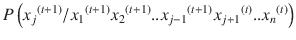

    So basically, for sampling x <sub>j</sub> conditioned on the rest of the variables, for the  variables before x <sub> j </sub> their values for the  instance are considered since they have already been sampled, while for the rest of the variables their values at instance t are considered since they are yet to be sampled. This step is repeated for all the variables.If each x <sub> j </sub> is discrete and can take, let’s say, two values 0 and 1, then we need to compute the probability p <sub>1</sub> = 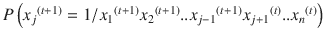. We can then draw a sample u from a uniform probability distribution between 0 and 1 (i.e., U[0, 1]), and if  set , else set . This kind of random heuristics ensure that the higher the probability p <sub>1</sub>is, the greater the chances are of  getting selected as 1\. However, it still leaves room for 0 getting selected with very low probability, even if p <sub>1</sub> is relatively large, thus ensuring that the Markov Chain doesn’t get stuck in a local region and can explore other potential high-density regions as well. There are the same kind of heuristics that we saw for the Metropolis algorithm as well.
*   如果希望从联合概率分布 P(x)中生成 m 个样本，则前面的步骤必须重复 m 次。

基于联合概率分布的每个变量的条件分布将在采样可以进行之前确定。如果一个人正在研究贝叶斯网络或受限玻尔兹曼机器，变量中存在某些约束，这些约束有助于以有效的方式确定这些条件分布。

例如，如果需要从具有均值[0 0]和协方差矩阵![ $$ \left[\begin{array}{cc}1& \rho \\ {}\rho & 1\end{array}\right] $$ ](A448418_1_En_5_Chapter_IEq72.gif)的二元正态分布进行吉布斯采样，那么条件概率分布可以计算如下:


如果将边际分布 P(x <sub>1</sub> )和 P(x <sub>2</sub> )导出为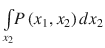和，则


### 块状吉布斯采样

吉布斯抽样有几种变体。块状吉布斯采样就是其中之一。在块吉布斯采样中，一个以上的变量被组合在一起，然后在其余变量的条件下对该组变量一起进行采样，这与单独对单个变量进行采样相反。例如，在受限玻尔兹曼机器中，隐藏的单元状态变量![ $$ h={\left[{h}_1\ {h}_2..{h}_n\right]}^T\in {\mathrm{\mathbb{R}}}^{n\times 1} $$ ](A448418_1_En_5_Chapter_IEq75.gif)可以在可见单元状态![ $$ v={\left[{v}_1\ {v}_2..{v}_m\right]}^T\in {\mathrm{\mathbb{R}}}^{m\times 1} $$ ](A448418_1_En_5_Chapter_IEq76.gif)的条件下一起采样，反之亦然。因此，对于从 P(v，h)上的联合概率分布采样，通过块吉布斯采样，可以通过条件分布 P(h/v)采样给定可见单元状态的所有隐藏状态，并且通过条件分布 P(v/h)采样给定隐藏单元状态的所有可见单元状态。吉布斯采样的迭代的样本可以生成为


因此，是迭代时的组合样本。

如果一定要计算一个函数 f(h，v)的期望，可以计算如下:

![ $$ E\left[f\left(h,v\right)\right]\approx \frac{1}{M}\sum \limits_{t=1}^Mf\left({h}^{(t)},{v}^{(t)}\right) $$ ](A448418_1_En_5_Chapter_Eqube.gif)

其中 M 表示由联合概率分布 P(v，h)生成的样本数。

### 老化周期和 Gibbs 采样中的样本生成

为了考虑样本尽可能独立地用于期望计算或者基于联合概率分布，通常以 k 个样本的间隔拾取样本。k 的值越大，在产生的样本中消除自相关就越好。此外，在吉布斯采样开始时生成的样本被忽略。这些被忽略的样本据说是在老化期间产生的。

预烧期使用马尔可夫链来稳定到一个平衡分布，然后我们才能开始从中抽取样本。这是必需的，因为我们从任意样本生成马尔可夫链，该样本可能是相对于实际分布的低概率区域，因此我们可以丢弃那些不需要的样本。低概率样本对实际预期没有太大贡献，因此样本中有大量的低概率样本会模糊预期。一旦马尔可夫链运行了足够长的时间，它将会停留在某个高概率区域，此时我们可以开始收集样本。

### 在受限玻尔兹曼机中使用吉布斯采样

块吉布斯采样可用于计算关于联合概率分布 P(v，h/θ)的期望值，如(5.3.37)中的等式所述，用于计算关于模型参数 b、c 和 w 的梯度。以下是(5.3.37)中的等式，以方便参考:

![ $$ \left\{\begin{array}{c}{\nabla}_b(C)=\sum \limits_{t=1}^m{v}^{(t)}-m{E}_{P\left(h,v/\theta \right)}\left[v\right]\\ {}{\nabla}_c(C)=\sum \limits_{t=1}^m\hat{h}-m{E}_{P\left(h,v/\theta \right)}\left[h\right]\\ {}\kern1.25em {\nabla}_W(C)=\sum \limits_{t=1}^m{v}^{(t)}{\hat{h}}^T-m{E}_{P\left(h,v/\theta \right)}\left[v{h}^T\right]\end{array}\right. $$ ](A448418_1_En_5_Chapter_Equbf.gif)

期望 E <sub>P(h，v/θ)</sub>【v】，E <sub>P(h，v/θ)</sub>【h】，E <sub>P(h，v/θ)</sub>【VH<sup>T</sup>都需要从联合概率分布 P(v，h/θ)中抽样。通过块吉布斯采样，样本(v，h)可以基于它们的条件概率被绘制如下，其中 t 表示吉布斯采样的迭代次数:


让采样更容易的是，隐藏单元的 h <sub>j</sub> s 在给定可见单元状态的情况下是独立的，反之亦然:


这允许在给定可见单元状态的值的情况下，单独的隐藏单元 h <sub>j</sub> s 被独立地并行采样。参数θ已从前面的符号中删除，因为当我们执行吉布斯采样时，θ对于梯度下降的步长将保持不变。

现在，每个隐藏单元输出状态 h <sub>j</sub> 可以是 0 或 1，其呈现状态 1 的概率由(5.3.16)给出为


该概率可以基于当前值和模型参数来计算。将计算的概率与从均匀分布 U[0，1]生成的随机样本 U 进行比较。如果，则采样，否则。以这种方式采样的所有这种 h<sub>j</sub><sup>形成组合的隐藏单元状态向量。</sup>

类似地，给定隐藏单元状态，可见单元是独立的:


给定，可以对每个可见单元进行独立采样，以与隐藏单元相同的方式获得组合 v <sup>(t+1)</sup> 。在迭代中生成的所需样本由给出。

所有的期望 E <sub>P(h，v/θ)</sub>【v】，E <sub>P(h，v/θ)</sub>【h】，E <sub>P(h，v/θ)</sub>【VH<sup>T</sup>都可以通过取 Gibbs 抽样产生的样本的平均值来计算。通过 Gibbs 采样，如果我们在考虑老化周期和自相关之后取 N 个样本，如前所述，所需的期望值可以计算如下:

![ $$ {E}_{P\left(h,v/\theta \right)}\left[v\right]\approx \frac{1}{N}\sum \limits_{i=1}^N{v}^{(i)} $$ ](A448418_1_En_5_Chapter_Equbl.gif)

![ $$ {E}_{P\left(h,v/\theta \right)}\left[h\right]\approx \frac{1}{N}\sum \limits_{i=1}^N{h}^{(i)} $$ ](A448418_1_En_5_Chapter_Equbm.gif)

![ $$ {E}_{P\left(h,v/\theta \right)}\left[v{h}^T\right]\approx \frac{1}{N}\sum \limits_{i=1}^N{v}^{(i)}{h^{(i)}}^T $$ ](A448418_1_En_5_Chapter_Equbn.gif)

然而，对联合分布进行吉布斯采样以在梯度下降的每次迭代中生成 N 个样本成为一项繁琐的任务，并且通常是不切实际的。还有一种接近这些期望的方法，叫做对比差异，我们将在下一节讨论。

### 对比分歧

在梯度下降的每一步对联合概率分布 P(h，v/θ)执行吉布斯采样变得具有挑战性，因为诸如吉布斯采样的马尔可夫链蒙特卡罗方法需要很长时间来收敛，这是产生无偏样本所需要的。这些从联合概率分布中抽取的无偏样本用于计算期望项 E <sub>P(h，v/θ)</sub>【v】，E <sub>P(h，v/θ)</sub>【h】和 E <sub>P(h，v/θ)</sub>【VH<sup>T</sup>，它们只不过是(5.3.28)中推导出的梯度组合表达式中的项![ $$ {E}_{P\left(h,v/\theta \right)}\left[{\nabla}_{\theta}\left(-E\left(v,h\right)\right)\right] $$ ](A448418_1_En_5_Chapter_IEq90.gif)的组成部分。

![ $$ {\nabla}_{\theta }(C)=\sum \limits_{t=1}^m{E}_{P\left(h/{v}^{(t)},\theta \right)}\left[{\nabla}_{\theta}\left(-E\left({v}^{(t)},h\right)\right)\right]-m{E}_{P\left(h,v/\theta \right)}\left[{\nabla}_{\theta}\left(-E\left(v,h\right)\right)\right] $$ ](A448418_1_En_5_Chapter_Equbo.gif)

前面等式中的第二项可以重写为 m 个数据点的求和，因此得到

![ $$ {\nabla}_{\theta }(C)=\sum \limits_{t=1}^m{E}_{P\left(h/{v}^{(t)},\theta \right)}\left[{\nabla}_{\theta}\left(-E\left({v}^{(t)},h\right)\right)\right]-\sum \limits_{t=1}^m{E}_{P\left(h,v/\theta \right)}\left[{\nabla}_{\theta}\left(-E\left(v,h\right)\right)\right] $$ ](A448418_1_En_5_Chapter_Equbp.gif)

对比散度通过对候选样本进行点估计来逼近总体期望![ $$ {E}_{P\left(h,v/\theta \right)}\left[{\nabla}_{\theta}\left(-E\left(v,h\right)\right)\right] $$ ](A448418_1_En_5_Chapter_IEq91.gif)，该候选样本通过仅执行几次迭代的吉布斯采样来获得。【T2![ $$ {E}_{P\left(h,v/\theta \right)}\left[{\nabla}_{\theta}\left(-E\left(v,h\right)\right)\right]\kern0.5em \approx {\nabla}_{\theta}\left(-E\left(\overline{v},\overline{h}\right)\right) $$ ](A448418_1_En_5_Chapter_Equbq.gif)

对每个数据点 v<sup>【t】</sup>进行这种近似，因此整体梯度的表达式可以改写如下:

![ $$ {\nabla}_{\theta }(C)\approx \sum \limits_{t=1}^m{E}_{P\left(h/{v}^{(t)},\theta \right)}\left[{\nabla}_{\theta}\left(-E\left({v}^{(t)},h\right)\right)\right]-\sum \limits_{t=1}^m\left[{\nabla}_{\theta}\left(-E\left({\overline{v}}^{(t)},{\overline{h}}^{(t)}\right)\right)\right] $$ ](A448418_1_En_5_Chapter_Equbr.gif)

下图 [5-6](#Fig8) 说明了如何对每个输入数据点 v <sup>(t)</sup> 进行吉布斯采样，以通过点估计获得联合概率分布的期望近似值。吉布斯采样从 v <sup>(t)</sup> 开始，基于条件概率分布 P(h/v <sup>(t)</sup> ，获得新的隐藏状态 h’。如前所述，每个隐藏单元 h <sub>j</sub> 可以被独立采样，然后被组合以形成隐藏状态向量 h’。然后基于条件概率分布 P(v/h’)对 v’进行采样。该迭代过程通常运行几次迭代，最终采样的 v 和 h 作为候选样本。


图 5-6。

Gibbs sampling for two iterations to get one sample for Contrastive Divergence

对比散度方法使得梯度下降更快，因为梯度下降的每个步骤中的吉布斯采样被限制为仅几次迭代，通常每个数据点一次或两次。

### 张量流中的受限玻尔兹曼实现

在这一节中，我们将通过使用 MNIST 数据集实现受限玻尔兹曼机器。在这里，我们试图通过定义一个受限的玻尔兹曼机器网络来模拟 MNIST 图像的结构，该网络由作为可见单元的图像像素和 500 个隐藏层组成，以便破译每个图像的内部结构。由于 MNIST 图像是一维的，当作为一个矢量展平时，我们有 784 个可见单元。我们试图通过训练玻尔兹曼机器来捕捉隐藏的结构。当给定输入图像的可视表示对所述隐藏状态进行采样时，表示相同数字的图像应该具有相似的隐藏状态，如果不是相同的话。当可视单元被采样时，给定它们的隐藏结构，当以图像形式构造时，可视单元值应该对应于图像的标签。详细代码如清单 [5-3a](#Par158) 所示。


图 5-8。

Simulated images given the hidden states


图 5-7。

Actual test images

```py
##Import the Required libraries
import numpy as np
import pandas as pd
import tensorflow as tf
import matplotlib.pyplot as plt
%matplotlib inline

## Read the MNIST files
from tensorflow.examples.tutorials.mnist import input_data
mnist = input_data.read_data_sets("MNIST_data", one_hot=True)

## Set up the parameters for training

n_visible      = 784
n_hidden    = 500
display_step = 1
num_epochs = 200
batch_size = 256
lr         = tf.constant(0.001, tf.float32)

## Define the tensorflow variables for weights and biases as well as placeholder for input
x  = tf.placeholder(tf.float32, [None, n_visible], name="x")
W  = tf.Variable(tf.random_normal([n_visible, n_hidden], 0.01), name="W")
b_h = tf.Variable(tf.zeros([1, n_hidden],  tf.float32, name="b_h"))
b_v = tf.Variable(tf.zeros([1, n_visible],  tf.float32, name="b_v"))

## Converts the probability into discrete binary states; i.e., 0 and 1
def sample(probs):
    return tf.floor(probs + tf.random_uniform(tf.shape(probs), 0, 1))

## Gibbs sampling step
def gibbs_step(x_k):
        h_k = sample(tf.sigmoid(tf.matmul(x_k, W) + b_h))
        x_k = sample(tf.sigmoid(tf.matmul(h_k, tf.transpose(W)) + b_v))
        return x_k
## Run multiple Gibbs sampling steps starting from an initial point
def gibbs_sample(k,x_k):
    for i in range(k):
        x_out = gibbs_step(x_k)
# Returns the Gibbs sample after k iterations
    return x_out

# Constrastive Divergence algorithm
# 1\. Through Gibbs sampling locate a new visible state x_sample based on the current visible state x
# 2\. Based on the new x sample a new h as h_sample
x_s = gibbs_sample(2,x)
h_s = sample(tf.sigmoid(tf.matmul(x_s, W) + b_h))

# Sample hidden states based given visible states
h = sample(tf.sigmoid(tf.matmul(x, W) + bh))
# Sample visible states based given hidden states
x_ = sample(tf.sigmoid(tf.matmul(h, tf.transpose(W)) + b_v))

# The weight updated based on gradient descent
size_batch = tf.cast(tf.shape(x)[0], tf.float32)
W_add  = tf.multiply(lr/size_batch, tf.subtract(tf.matmul(tf.transpose(x), h), tf.matmul(tf.transpose(x_s), h_s)))
bv_add = tf.multiply(lr/size_batch, tf.reduce_sum(tf.subtract(x, x_s), 0, True))
bh_add = tf.multiply(lr/size_batch, tf.reduce_sum(tf.subtract(h, h_s), 0, True))
updt = [W.assign_add(W_add), b_v.assign_add(bv_add), b_h.assign_add(bh_add)]

# TensorFlow graph execution

with tf.Session() as sess:
    # Initialize the variables of the Model
    init = tf.global_variables_initializer()
    sess.run(init)

    total_batch = int(mnist.train.num_examples/batch_size)
    # Start the training
    for epoch in range(num_epochs):
        # Loop over all batches
        for i in range(total_batch):
            batch_xs, batch_ys = mnist.train.next_batch(batch_size)
            # Run the weight update
            batch_xs = (batch_xs > 0)*1
            _ = sess.run([updt], feed_dict={x:batch_xs})
        # Display the running step
        if epoch % display_step == 0:
            print("Epoch:", '%04d' % (epoch+1))

    print("RBM training Completed !")

    ## Generate hidden structure for 1st 20 images in test MNIST

    out = sess.run(h,feed_dict={x:(mnist.test.images[:20]> 0)*1})
    label = mnist.test.labels[:20]

    ## Take the hidden representation of any of the test images; i.e., the 3rd record
    ## The output level of the 3rd record should match the image generated
    plt.figure(1)
    for k in range(20):
        plt.subplot(4, 5, k+1)
        image = (mnist.test.images[k]> 0)*1
        image = np.reshape(image,(28,28))
        plt.imshow(image,cmap='gray')

    plt.figure(2)

    for k in range(20):
        plt.subplot(4, 5, k+1)
        image = sess.run(x_,feed_dict={h:np.reshape(out[k],(-1,n_hidden))})
        image = np.reshape(image,(28,28))
        plt.imshow(image,cmap='gray')
        print(np.argmax(label[k]))

    sess.close()

--Output --

Listing 5-3a.Restricted Boltzmann Machine Implementation with MNIST Dataset

```

我们可以从图 [5-7](#Fig9) 和图 [5-8](#Fig10) 中看到，RBM 模型在模拟输入图像时表现出色，给出了它们的隐藏表示。因此，受限玻尔兹曼机器也可以用作生成模型。

### 使用受限玻尔兹曼机器的协同过滤

受限玻尔兹曼机器可以用于在进行推荐时进行协同过滤。协同过滤是通过分析许多用户对项目的偏好来预测用户对项目的偏好的方法。给定一组项目和用户以及用户为各种项目提供的评级，协作过滤最常用的方法是矩阵分解方法，它为项目以及用户确定一组向量。然后，由用户分配给项目的评级可以被计算为用户向量 u <sup>(j)</sup> 与项目向量 v <sup>(k)</sup> 的点积。因此，评级可以表示为


，其中 j 和 k 分别表示第 j 个用户和第 k 个项目。一旦学习了每个项目和每个用户的向量，就可以通过相同的方法找出用户对他们尚未评级的产品的预期评级。矩阵分解可以被认为是将一个大的评分矩阵分解成用户向量和项目向量。


图 5-9。

Schematic diagram of a matrix factorization method for collaborative filtering

图 [5-9](#Fig11) 所示为将用户物品评分矩阵分解为用户向量和物品向量两个矩阵的矩阵分解方法示意图。用户向量和评分向量的维数必须相等，它们的点积才能为真，这就给出了用户可能给某个特定项目分配的评分的估计值。有几种矩阵分解方法，如奇异值分解(SVD)，非负矩阵分解，交替最小二乘法，等等。根据用途，任何合适的方法都可以用于矩阵分解。一般来说，SVD 需要填充矩阵中缺失的评级(其中用户没有对项目进行评级)，这可能是一项困难的任务，因此，诸如交替最小二乘法之类的方法(其仅采用所提供的评级而不采用缺失值)对于协同过滤来说工作得很好。

现在，我们将研究一种不同的使用受限玻尔兹曼机器的协同过滤方法。受限玻尔兹曼机器被协作过滤网飞挑战赛的获胜团队使用，因此让我们将这些项目视为此次讨论的电影。这个 RBM 网络的可视单元将对应于电影分级，并且不是二进制的，每个电影将是五向 SoftMax 单元，以考虑从 1 到 5 的五个可能的分级。隐藏单元的数量可以任意选择；我们在这里选了 d。对于不同的电影会有几个缺失值，因为所有的用户不会对所有的电影进行评级。处理它们的方法是仅基于用户已经评级的电影为每个用户训练单独的 RBM。从电影到隐藏单元的权重将由所有用户共享。例如，假设用户 A 和用户 B 评价同一部电影；他们将使用相同的权重来连接电影单元和隐藏单元。所以，所有的 RBM 都有相同的隐藏单元，当然，它们对隐藏单元的激活可能是非常不同的。


图 5-11。

Restricted Boltzmann view for User B


图 5-10。

Restricted Boltzmann view for User A

从图 [5-10](#Fig12) 和图 [5-11](#Fig13) 中我们可以看出，用户 A 和用户 B 的受限玻尔兹曼视图是不同的，因为他们对电影的选择不同。然而，对于他们都评价的电影，权重连接是相同的。这种架构——每个用户的 RBM 被单独训练，而 RBM 共享相同电影的权重——有助于克服缺失评级的问题，同时允许电影的通用权重与所有用户的隐藏层连接。从每部电影到隐藏单元，反之亦然，实际上有五个连接，每一个连接对应一部电影的一个可能的分级。然而，为了保持表示简单，图中只显示了一个组合连接。可以使用对比散度通过梯度下降分别训练每个模型，并且可以在不同的 RBM 上平均模型权重，使得所有的 RBM 共享相同的权重。

从 5.3.17，我们对于二进制可见单位有如下:


现在可见单元具有 K 个可能的评级，可见单元是 K 维向量，其中只有一个索引对应于设置为 1 的实际评级，其余的都设置为零。因此，超过 K 个可能评级的评级概率的新表达式将由 SoftMax 函数给出。此外，请注意，在这种情况下，m 是用户观看的电影数量，对于不同的用户，不同的 RBM 会有所不同。常数 n 表示每个 RBM 的隐藏层中隐藏单元的数量。


(5.4.1)其中 w <sub>ij</sub> <sup>(k)</sup> 是连接可见单元 I 的第 k 个等级指数和第 j 个隐藏单元的权重，b <sub>i</sub> <sup>(k)</sup> 表示可见单元 I 的第 k 个等级的偏差。

一个联合构形的能量 E(v，h)由


(5.4.2)给出

所以，


(5.4.3)

给定输入 v 的隐藏单元的概率是


(5.4.4)

现在，一个显而易见的问题是:我们如何预测用户没有看过的电影的评级？事实证明，这方面的计算并不复杂，可以用线性时间来计算。做出该决定的最具信息性的方式是调节用户的概率，假设对电影 q 的评级 r 是以用户已经提供的电影评级为条件的。假设用户已经提供的电影评分用 V 表示，那么我们需要计算概率 P(v <sub>q</sub> <sup>(k)</sup> /V)如下:


(5.4.5)

因为 P(V)对于所有电影分级 k 是固定的，所以从(5.4.5)我们有


(5.4.6)

这是一种三向能量配置，可以通过在(5.4.2)中添加 v <sub>q</sub> <sup>(k)</sup> 的贡献来轻松计算，如下所示:


(5.4.7)

将代入(5.4.7)中，可以发现的值与


成正比

对于等级 K 的所有 K 值，需要计算前面的量,然后归一化以形成概率。然后，可以取概率最大的 k 值，或者从导出的概率中计算 k 的期望值，如下所示:


与基于最大概率的评级硬分配相比，得出评级的期望方法提供了更好的预测。

此外，利用评级矩阵 V 来导出用户对特定未评级电影 q 的评级 k 的概率的一种简单方法是，在给定可见评级输入 V 的情况下，首先对隐藏状态 h 进行采样；即绘制。隐藏单元是所有电影共有的，因此携带了所有电影的模式信息。从采样的隐藏单元中，我们尝试采样 v<sub>q</sub><sup>【k】</sup>的值；即绘制。这种背靠背采样，首先从开始，然后从开始，相当于采样。我希望这有助于提供一个更容易的解释。

### 深度信念网络

深度信念网络基于受限玻尔兹曼机器，但与 RBN 不同，DBN 有多个隐藏层。通过保持先前层中的所有权重不变来训练每个隐藏层 K 中的权重。层中隐藏单元的活动作为第 k 层的输入。在训练期间的任何特定时间，两层都参与学习它们之间的重量联系。学习算法与受限玻尔兹曼机器的算法相同。图 [5-12](#Fig14) 所示为深度信念网络的高层示意图。


图 5-12。

Deep belief network using RBMs

像 RBM 一样，在 DBN，每一层都可以通过使用对比散度的梯度下降来训练。DBN 学习算法用于学习用于监督学习的深度网络的初始权重，以便网络从一组良好的初始权重开始。一旦深度信念网络的预训练完成，我们就可以基于手头的监督问题向 DBN 添加输出层。假设我们想要训练一个模型来对 MNIST 数据集执行分类。在这种情况下，我们将不得不追加一个十级 SoftMax 层。然后，我们可以通过误差反向传播对模型进行微调。由于该模型已经具有来自无监督 DBN 学习的初始权重集，当调用反向传播时，该模型将有更快收敛的好机会。

每当我们在网络中有 sigmoid 单元时，如果网络权重没有正确初始化，就很有可能出现消失梯度问题。这是因为 sigmoid 单元的输出在小范围内是线性的，之后输出饱和，导致接近零的梯度。由于反向传播本质上是导数的链式法则，因此根据反向传播顺序，成本函数相对于任何权重的梯度将具有来自其之前层的 s 形梯度。因此，如果 sigmoid 层中的少数梯度在饱和区域中操作并产生接近于零的梯度，则后面的层，即成本函数相对于权重的梯度，将接近于零，并且学习很可能会停止。当权重未正确初始化时，网络 sigmoid 单元很有可能会进入不饱和区域，并导致 sigmoid 单元中的梯度接近零。然而，当通过 DBN 学习初始化网络权重时，sigmoid 单元在饱和区操作的机会较少。这是因为网络在预训练时已经学习了一些关于数据的知识，并且 sigmoid 单元在饱和区域中操作的机会较小。对于 ReLU 激活函数，不存在激活单元饱和的这种问题，因为对于大于零的输入值，它们具有 1 的恒定梯度。

我们现在来看看 DBN 预训练权重的实现，然后通过将输出层附加到 RBM 的隐藏层来训练分类网络。在清单 [5-3a](#Par158) 中，我们实现了 RBM，其中我们学习了可见到隐藏连接的权重，假设所有的单元都是 sigmoid。对于该 RBM，我们将堆叠 MNIST 数据集的十个类的输出层，并使用从可见到隐藏单元学习的权重作为分类网络的初始权重来训练分类模型。当然，我们会有一组新的权重，对应于隐藏层到输出层的连接。具体实现见清单 [5-3b](#Par180) 。

```py
##Import the Required libraries
import numpy as np
import pandas as pd
import tensorflow as tf
import matplotlib.pyplot as plt
%matplotlib inline

## Read the MNIST files
from tensorflow.examples.tutorials.mnist import input_data
mnist = input_data.read_data_sets("MNIST_data", one_hot=True)

## Set up the parameters for training

n_visible      = 784
n_hidden    = 500
display_step = 1
num_epochs = 200
batch_size = 256
lr         = tf.constant(0.001, tf.float32)
learning_rate_train = tf.constant(0.01, tf.float32)
n_classes = 10
training_iters = 200
## Define the tensorflow variables for weights and biases as well as placeholder for input
x  = tf.placeholder(tf.float32, [None, n_visible], name="x")
y  = tf.placeholder(tf.float32, [None,10], name="y")

W  = tf.Variable(tf.random_normal([n_visible, n_hidden], 0.01), name="W")
b_h = tf.Variable(tf.zeros([1, n_hidden],  tf.float32, name="b_h"))
b_v = tf.Variable(tf.zeros([1, n_visible],  tf.float32, name="b_v"))
W_f = tf.Variable(tf.random_normal([n_hidden,n_classes], 0.01), name="W_f")
b_f = tf.Variable(tf.zeros([1, n_classes],  tf.float32, name="b_f"))
## Converts the probability into discrete binary states i.e. 0 and 1
def sample(probs):
    return tf.floor(probs + tf.random_uniform(tf.shape(probs), 0, 1))

## Gibbs sampling step
def gibbs_step(x_k):
        h_k = sample(tf.sigmoid(tf.matmul(x_k, W) + b_h))
        x_k = sample(tf.sigmoid(tf.matmul(h_k, tf.transpose(W)) + b_v))
        return x_k
## Run multiple Gibbs Sampling steps starting from an initial point
def gibbs_sample(k,x_k):
    for i in range(k):
        x_out = gibbs_step(x_k)
# Returns the gibbs sample after k iterations
    return x_out

# Constrastive Divergence algorithm
# 1\. Through Gibbs sampling locate a new visible state x_sample based on the current visible state x
# 2\. Based on the new x sample a new h as h_sample
x_s = gibbs_sample(2,x)
h_s = sample(tf.sigmoid(tf.matmul(x_s, W) + b_h))

# Sample hidden states based given visible states
h = sample(tf.sigmoid(tf.matmul(x, W) + b_h))
# Sample visible states based given hidden states
x_ = sample(tf.sigmoid(tf.matmul(h, tf.transpose(W)) + b_v))

# The weight updated based on gradient descent
size_batch = tf.cast(tf.shape(x)[0], tf.float32)
W_add  = tf.multiply(lr/size_batch, tf.subtract(tf.matmul(tf.transpose(x), h), tf.matmul(tf.transpose(x_s), h_s)))
bv_add = tf.multiply(lr/size_batch, tf.reduce_sum(tf.subtract(x, x_s), 0, True))
bh_add = tf.multiply(lr/size_batch, tf.reduce_sum(tf.subtract(h, h_s), 0, True))
updt = [W.assign_add(W_add), b_v.assign_add(bv_add), b_h.assign_add(bh_add)]
###############################################################
## Ops for the Classification Network
###############################################################
h_out = tf.sigmoid(tf.matmul(x, W) + b_h)
logits = tf.matmul(h_out,W_f) + b_f
prob = tf.nn.softmax(logits)
cost = tf.reduce_mean(tf.nn.softmax_cross_entropy_with_logits(logits=logits, labels=y))
optimizer = tf.train.AdamOptimizer(learning_rate=learning_rate_train).minimize(cost)
correct_pred = tf.equal(tf.argmax(logits,1), tf.argmax(y, 1))
accuracy = tf.reduce_mean(tf.cast(correct_pred, tf.float32))

## Ops for the hidden unit activation

# TensorFlow graph execution

with tf.Session() as sess:
    # Initialize the variables of the Model
    init = tf.global_variables_initializer()
    sess.run(init)

    total_batch = int(mnist.train.num_examples/batch_size)
    # Start the training
    for epoch in range(num_epochs):
        # Loop over all batches
        for i in range(total_batch):
            batch_xs, batch_ys = mnist.train.next_batch(batch_size)
            # Run the weight update
            batch_xs = (batch_xs > 0)*1
            _ = sess.run([updt], feed_dict={x:batch_xs})

        # Display the running step
        if epoch % display_step == 0:
            print("Epoch:", '%04d' % (epoch+1))

    print("RBM training Completed !")

    out = sess.run(h,feed_dict={x:(mnist.test.images[:20]> 0)*1})
    label = mnist.test.labels[:20]

    plt.figure(1)
    for k in range(20):
        plt.subplot(4, 5, k+1)
        image = (mnist.test.images[k]> 0)*1
        image = np.reshape(image,(28,28))
        plt.imshow(image,cmap='gray')

    plt.figure(2)

    for k in range(20):
        plt.subplot(4, 5, k+1)
        image = sess.run(x_,feed_dict={h:np.reshape(out[k],(-1,n_hidden))})
        image = np.reshape(image,(28,28))
        plt.imshow(image,cmap='gray')
        print(np.argmax(label[k]))
    ####################################################
    ### Invoke the Classification Network training now
   ####################################################
    for i in xrange(training_iters):
        batch_x, batch_y = mnist.train.next_batch(batch_size)
        # Run optimization op (backprop)
        sess.run(optimizer, feed_dict={x: batch_x, y: batch_y})
        if i % 10 == 0:
            # Calculate batch loss and accuracy
            loss, acc = sess.run([cost, accuracy], feed_dict={x: batch_x,
                                                              y: batch_y})
            print "Iter " + str(i) + ", Minibatch Loss= " + \
                  "{:.6f}".format(loss) + ", Training Accuracy= " + \
                  "{:.5f}".format(acc)

    print "Optimization Finished!"

    # Calculate accuracy for 256 mnist test images
    print "Testing Accuracy:", \
        sess.run(accuracy, feed_dict={x: mnist.test.images[:256],
                                      y: mnist.test.labels[:256]})

    sess.close()

--output--

Iter 0, Minibatch Loss= 11.230852, Training Accuracy= 0.06641
Iter 10, Minibatch Loss= 2.809783, Training Accuracy= 0.60938
Iter 20, Minibatch Loss= 1.450730, Training Accuracy= 0.75000
Iter 30, Minibatch Loss= 0.798674, Training Accuracy= 0.83594
Iter 40, Minibatch Loss= 0.755065, Training Accuracy= 0.87891
Iter 50, Minibatch Loss= 0.946870, Training Accuracy= 0.82812
Iter 60, Minibatch Loss= 0.768834, Training Accuracy= 0.89062
Iter 70, Minibatch Loss= 0.445099, Training Accuracy= 0.92188
Iter 80, Minibatch Loss= 0.390940, Training Accuracy= 0.89062
Iter 90, Minibatch Loss= 0.630558, Training Accuracy= 0.90234
Iter 100, Minibatch Loss= 0.633123, Training Accuracy= 0.89844
Iter 110, Minibatch Loss= 0.449092, Training Accuracy= 0.92969
Iter 120, Minibatch Loss= 0.383161, Training Accuracy= 0.91016
Iter 130, Minibatch Loss= 0.362906, Training Accuracy= 0.91406
Iter 140, Minibatch Loss= 0.372900, Training Accuracy= 0.92969
Iter 150, Minibatch Loss= 0.324498, Training Accuracy= 0.91797
Iter 160, Minibatch Loss= 0.349533, Training Accuracy= 0.93750
Iter 170, Minibatch Loss= 0.398226, Training Accuracy= 0.90625
Iter 180, Minibatch Loss= 0.323373, Training Accuracy= 0.93750
Iter 190, Minibatch Loss= 0.555020, Training Accuracy= 0.91797
Optimization Finished!
Testing Accuracy: 0.945312

Listing 5-3b.Basic Implementation of DBN

```

正如我们从前面的输出中看到的，使用来自 RBM 的预训练权重作为分类网络的初始权重，我们可以在 MNIST 测试数据集上运行 200 个批次，获得大约 95%的良好准确性。鉴于网络没有任何卷积层，这一点令人印象深刻。

## 自动编码器

自动编码器是无监督的人工神经网络，用于生成输入数据的有意义的内部表示。自动编码器网络通常由三层组成——输入层、隐藏层和输出层。输入层和隐藏层的组合充当编码器，而隐藏层和输出层的组合充当解码器。编码器尝试在隐藏层将输入表示为有意义的表示，而解码器在输出层将输入重构回其原始维度。通常，作为训练过程的一部分，重构输入和原始输入之间的一些成本函数被最小化。


图 5-13。

Architecture of a basic auto-encoder

图 [5-13](#Fig15) 表示一个基本的自动编码器，带有一个隐藏层和输入输出层。输入![ $$ x={\left[{x}_1{x}_2\ {x}_3..{x}_6\right]}^T\in {\mathrm{\mathbb{R}}}^{6\times 1} $$ ](A448418_1_En_5_Chapter_IEq105.gif)而隐藏层![ $$ h={\left[{h}_1{h}_2\ {h}_3{h}_4\right]}^T\in {\mathrm{\mathbb{R}}}^{4\times 1} $$ ](A448418_1_En_5_Chapter_IEq106.gif)。输出 y 被选择为等于 x，使得重构的输入之间的误差可以被最小化，从而在隐藏层中获得输入的有意义的表示。出于通用性的目的，让我们取

![ $$ x={\left[{x}_1{x}_2\ {x}_3..{x}_n\right]}^T\in {\mathrm{\mathbb{R}}}^{n\times 1} $$ ](A448418_1_En_5_Chapter_Equbx.gif)

![ $$ h={\left[{h}_1{h}_2\ {h}_3..{h}_d\right]}^T\in {\mathrm{\mathbb{R}}}^{d\times 1} $$ ](A448418_1_En_5_Chapter_Equby.gif)

![ $$ y=x={\left[{y}_1{y}_2\ {y}_3..{y}_n\right]}^T\in {\mathrm{\mathbb{R}}}^{n\times 1} $$ ](A448418_1_En_5_Chapter_Equbz.gif)

假设从 x 到 h 的权重由权重矩阵表示，隐藏单元的偏差由![ $$ b={\left[{b}_1{b}_2\ {b}_3..{h}_d\right]}^T\in {\mathrm{\mathbb{R}}}^{d\times 1} $$ ](A448418_1_En_5_Chapter_IEq109.gif)表示。

类似地，假设从 h 到 y 的权重由权重矩阵表示，输出单元的偏差由![ $$ {b}^{\prime }={\left[\ {b}_1{b}_2\ {b}_3..{b}_n\right]}^T\in {\mathrm{\mathbb{R}}}^{n\times 1} $$ ](A448418_1_En_5_Chapter_IEq111.gif)表示。

隐藏单元的输出可以表示为

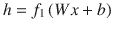

，其中 f <sub>1</sub> 是隐藏层的逐元素激活函数。根据其用途，激活函数可以是线性的、ReLU 的、sigmoid 的等等。

同样，输出层的输出可以表示为


如果输入特征具有连续的性质，可以最小化基于最小平方的成本函数如下，以基于训练数据导出模型权重和偏差:


其中是重构的输出向量和原始输入向量之间的欧几里德或 l <sup>2</sup> 范数距离，m 是模型被训练的数据点的数量。

如果我们用向量![ $$ \theta =\left[W;b;{W}^{\prime };{b}^{\prime}\right] $$ ](A448418_1_En_5_Chapter_IEq113.gif)表示模型的所有参数，那么成本函数 C 可以相对于模型θ的所有参数最小化，以导出模型


基于梯度下降的模型学习规则为


，其中ϵ为学习速率，t 代表迭代次数，为代价函数在处相对于θ的梯度。

现在，让我们考虑如下几种情况:

*   当隐藏层的维度小于输入层的维度时，即，其中 d 是隐藏层，n 是输入层的维度，则自动编码器作为数据压缩网络工作，将数据从高维空间投影到由隐藏层给出的低维空间。这是一种有损数据压缩技术。它还可以用于降低输入信号中的噪声。
*   当和所有的激活函数都是线性的，那么网络学习进行线性 PCA(主成分分析)。
*   当和激活函数是线性的时，网络可以学习一个身份函数，这可能没有任何用处。然而，如果成本函数被正则化以产生稀疏隐藏表示，则网络仍然可以学习数据的有趣表示。
*   输入数据的复杂非线性表示可以通过在网络中有更多的隐藏层和使激活函数非线性来学习。这种模型的示意图如图 [5-14](#Fig16) 所示。当采用多个隐藏层时，必须采用非线性激活函数来学习数据的非线性表示，因为几层线性激活等效于单个线性激活层。

### 用于监督学习的通过自动编码器的特征学习


图 5-14。

Auto-encoder with multiple hidden layers

当我们处理多个隐藏层时，如图 [5-14](#Fig16) 所示，并且在神经单元中具有非线性激活函数，那么隐藏层学习输入数据的变量之间的非线性关系。如果我们正在处理两个类别的分类相关问题，其中输入数据由表示，我们可以通过如图 [5-14](#Fig16) 所示训练自动编码器，然后使用第二个隐藏层向量的输出，来学习有趣的非线性特征。h <sup>(2)</sup> 给出的这种新的非线性特征表示可以作为分类模型的输入，如图 [5-15](#Fig17) 所示。当我们感兴趣的输出的隐藏层的维数小于输入的维数时，它相当于非线性版本的主成分分析，其中我们只是消耗重要的非线性特征，而将其余的作为噪声丢弃。


图 5-15。

Classifier with features learned from auto-encoder

如图 [5-16](#Fig18) 所示，通过组合两个网络，整个网络可以组合成一个单一网络，用于测试时的类别预测。从自动编码器中，只需要考虑产生输出 h <sup>(2)</sup> 的直到第二隐藏层的网络部分，然后它需要与分类网络结合，如图 [5-15](#Fig17) 所示。


图 5-16。

Combined classification network for prediction of classes

人们可能会问一个显而易见的问题:为什么线性 PCA 不能满足自动编码器在这个例子中执行的任务？线性 PCA 或主成分分析仅负责捕捉输入变量之间的线性关系，并试图将输入变量分解成彼此不线性依赖的成分。这些成分称为主成分，与原始输入变量不同，它们彼此不相关。然而，输入变量并不总是以导致线性相关的线性方式相关。输入变量可能以复杂得多的非线性方式相关，并且数据中的这种非线性结构只能通过自动编码器中的非线性隐藏单元来捕获。

### 库尔贝克-莱布勒散度

KL 散度测量两个随机伯努利变量之间的差异或散度。如果两个随机伯努利变量 X 和 Y 分别有ρ <sub>1</sub> 和ρ <sub>2</sub> 的均值，那么变量 X 和 Y 之间的 KL 散度由


给出

从前面的表达式我们可以看出时 KL 散度为 0；即当两种分布相同时。当时，KL 散度随着均值的不同而单调增加。如果ρ <sub>1</sub> 选择为 0.2，那么 KL 散度与ρ <sub>2</sub> 的关系曲线如图 [5-17](#Fig19) 所示。


图 5-17。

KL divergence plot for mean 

如我们所见，KL 散度在处最小，在两侧单调增加。在下一节中，我们将使用 KL 散度在稀疏自动编码器的隐藏层中引入稀疏性。

#### 稀疏自动编码器

正如我们前面所讨论的，自动编码器的目的是学习输入数据的有趣的隐藏结构，或者更具体地说，是学习输入中不同变量之间的有趣关系。导出这些隐藏结构的最常见方式是使隐藏层的维度小于输入数据的维度，从而自动编码器被迫学习输入数据的压缩表示。这个压缩的表示被强制重建原始数据，因此压缩的表示应该具有足够的信息来足够好地捕捉输入。只有当数据中存在输入变量之间的相关性和其他非线性关联形式的冗余时，这种压缩表示才能够有效地捕获输入数据。如果输入要素相对独立，那么这种压缩将无法很好地表示原始数据。因此，为了让自动编码器给出输入数据的有趣的低维表示，数据中应该有足够的结构，其形式为输入变量之间的相关性和其他非线性关联。

我们之前提到的一件事是，当隐藏层单元的数量大于输入的维数时，在将对应于额外隐藏层的权重设置为零之后，自动编码器很可能会学习恒等式变换。事实上，当输入层和隐藏层的数量相同时，连接输入层和隐藏层的权重矩阵的最优解就是单位矩阵。然而，即使当隐藏单元的数量大于输入的维数时，只要提供一些约束，自动编码器仍然可以学习数据中有趣的结构。一个这样的约束是将隐藏层输出限制为稀疏的，使得隐藏层单元中的那些激活平均接近于零。我们可以通过在基于 KL 散度的成本函数中添加正则化项来实现这种稀疏性。这里，ρ <sub>1</sub> 将非常接近于零，并且隐藏单元中所有训练样本的平均激活将充当该隐藏单元的ρ <sub>2</sub> 。通常，ρ <sub>1</sub> 被选择为非常小，大约为 0.04，因此如果每个隐藏单元中的平均激活不接近 0.04，那么代价函数将被扣分。

设为输入的隐藏层 sigmoid 激活，其中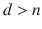。此外，将输入连接到隐藏层的权重由给出，将隐藏层连接到输出层的权重由给出。如果隐藏层和输出层的偏置向量分别由 b 和 b’给出，则以下关系成立:


其中 h <sup>(k)</sup> 和是隐藏层输出向量和第 k 个输入训练数据点的重构输入向量。相对于模型参数(即 W，W′，b，b′)要最小化的成本函数由


给出，其中是所有训练样本上隐藏层的第 j 个单元中的平均激活，可以表示如下。同样，h <sub> j </sub> <sup>(k)</sup> 表示第 k 个训练样本在单元 j 处的隐藏层激活。


通常，ρ被选择为 0.04 至 0.05，使得模型学习产生非常接近 0.04 的平均隐藏层单元激活，并且在该过程中，模型学习隐藏层中输入数据的稀疏表示。

稀疏自动编码器在计算机视觉中用于学习低级特征，这些特征表示自然图像中不同位置和方向的不同种类的边缘。隐藏层输出给出了这些低级特征中的每一个的权重，这些权重可以被组合以重建图像。如果图像被处理为 100 维输入，并且如果有 200 个隐藏单元，那么将输入连接到隐藏单元的权重-即，W 或隐藏单元到输出重建层 W '-将包括 200 个大小为 100 的图像()。可以显示这些图像来查看它们所代表的特征的性质。稀疏编码在辅以 PCA 白化时效果很好，我们将在本章稍后简要讨论。

### TensorFlow 中稀疏自动编码器的实现

在这一节中，我们将实现一个稀疏自动编码器，它的隐藏单元比输入维数多。该实现的数据集是 MNIST 数据集。稀疏性已经通过 KL 散度被引入到实现的网络中。此外，编码器和解码器的权重用于 L2 正则化，以确保在追求稀疏性时，这些权重不会以不期望的方式调整自己。如前所述，自动编码器和解码器权重表示过度表示的基础，并且这些基础中的每一个都试图学习图像的一些低级特征表示。编码器和解码器被认为是相同的。组成低级特征图像的这些权重已经被显示以突出它们所代表的内容。清单 [5-4](#Par209) 中概述了详细的实现。


图 5-19。

Display of a few encoder/decoder weights as images


图 5-18。

Display of the original image followed by the reconstructed image

```py
## Import the required libraries and data

import tensorflow as tf
import numpy as np
import matplotlib.pyplot as plt
%matplotlib inline
import time
# Import MNIST data
from tensorflow.examples.tutorials.mnist import input_data
mnist = input_data.read_data_sets("MNIST_data", one_hot=True)

# Parameters for training the Network
learning_rate = 0.001
training_epochs = 200
batch_size = 1000
display_step = 1
examples_to_show = 10

# Network Parameters
# Hidden units are more than the input dimensionality since the intention
# is to learn sparse representation of hidden units
n_hidden_1 = 32*32
n_input = 784 # MNIST data input (img shape: 28*28)

X = tf.placeholder("float", [None, n_input])

weights = {
    'encoder_h1': tf.Variable(tf.random_normal([n_input, n_hidden_1])),
}
biases = {
    'encoder_b1': tf.Variable(tf.random_normal([n_hidden_1])),
    'decoder_b1': tf.Variable(tf.random_normal([n_input])),
}

# Building the encoder
def encoder(x):
    # Encoder Hidden layer with sigmoid activation #1
    layer_1 = tf.nn.sigmoid(tf.add(tf.matmul(x, weights['encoder_h1']),
                                   biases['encoder_b1']))

    return layer_1

# Building the decoder
def decoder(x):
    layer_1 = tf.nn.sigmoid(tf.add(tf.matmul(x, tf.transpose(weights['decoder_h1'])),
                                   biases['decoder_b1']))
    return layer_1

## Define the log-based function to be used in computing the KL Divergence

def log_func(x1, x2):
    return tf.multiply(x1, tf.log(tf.div(x1,x2)))

def KL_Div(rho, rho_hat):
    inv_rho = tf.subtract(tf.constant(1.), rho)
    inv_rhohat = tf.subtract(tf.constant(1.), rho_hat)
    log_rho = logfunc(rho,rho_hat) + log_func(inv_rho, inv_rhohat)
    return log_rho

# Model definition
encoder_op = encoder(X)
decoder_op = decoder(encoder_op)
rho_hat = tf.reduce_mean(encoder_op,1)
# Reconstructed output
y_pred = decoder_op
# Targets in the input data.
y_true = X

# Define the TensorFlow Ops for loss and optimizer, minimize the combined error
# Squared Reconstruction error
cost_m = tf.reduce_mean(tf.pow(y_true - y_pred, 2))
# KL Divergence Regularization to introduce sparsity
cost_sparse = 0.001*tf.reduce_sum(KL_Div(0.2,rho_hat))
# L2 Regularization of weights to keep the network stable
cost_reg = 0.0001* (tf.nn.l2_loss(weights['decoder_h1']) + tf.nn.l2_loss(weights['encoder_h1']))
# Add up the costs
cost = tf.add(cost_reg,tf.add(cost_m,cost_sparse))

optimizer = tf.train.RMSPropOptimizer(learning_rate).minimize(cost)

# Initializing the variables
init = tf.global_variables_initializer()

# Launch the Session graph
start_time = time.time()
with tf.Session() as sess:
    sess.run(init)
    total_batch = int(mnist.train.num_examples/batch_size)

    for epoch in range(training_epochs):
        for i in range(total_batch):
            batch_xs, batch_ys = mnist.train.next_batch(batch_size)
            _, c = sess.run([optimizer, cost], feed_dict={X: batch_xs})
        if epoch % display_step == 0:
            print("Epoch:", '%04d' % (epoch+1),
                  "cost=", "{:.9f}".format(c))

    print("Optimization Finished!")

    # Applying encode and decode over test set
    encode_decode = sess.run(
        y_pred, feed_dict={X: mnist.test.images[:10]})
    # Compare original images with their reconstructions
    f, a = plt.subplots(2, 10, figsize=(10, 2))
    for i in range(10):
        a[0][i].imshow(np.reshape(mnist.test.images[i], (28, 28)))
        a[1][i].imshow(np.reshape(encode_decode[i], (28, 28)))
    # Store the Decoder and Encoder Weights
    dec = sess.run(weights['decoder_h1'])
    enc = sess.run(weights['encoder_h1'])
end_time = time.time()
print('elapsed time:',end_time - start_time)

-- Output --

Listing 5-4.

```

图 [5-18](#Fig20) 显示了稀疏编码器对图像的重建，而图 [5-19](#Fig21) 显示了图像形式的解码器权重。隐藏单元层对应的权重是图 [5-19](#Fig21) 中显示的图像。这给了你一些稀疏编码器正在学习的特性的概念。重建的最终图像是这些图像的线性组合，隐藏层激活充当线性权重。本质上，这些图像中的每一个都在检测手写数字的手写笔画形式的低级特征。就线性代数而言，这些图像形成了表示重建图像的基础。

### 去噪自动编码器

去噪自动编码器像标准自动编码器一样工作，在隐藏层中进行非线性激活，唯一的区别是，代替原始输入 x 的是 x 的噪声版本，比如说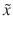，被馈送到网络。在计算重建误差时，将输出层的重建图像与实际输入 x 进行比较。其思想是，从噪声数据中学习到的隐藏结构足够丰富，可以重构原始数据。因此，这种形式的自动编码器可以用于减少数据中的噪声，因为它从隐藏层学习数据的鲁棒表示。例如，如果图像由于某种失真而变得模糊，那么可以使用去噪自动编码器来消除模糊。通过引入随机噪声添加单元，可以将自动编码器转换成去噪自动编码器。

对于图像，去噪自动编码器可以将隐藏层作为卷积层，而不是标准的神经单元。这确保了在定义自动编码器网络时不会危及图像的拓扑结构。

### TensorFlow 中去噪自动编码器的实现

在这一节中，我们将通过一个去噪自动编码器的实现来学习从输入图像中去除噪声。输入图像中引入了两种噪声，即高斯噪声和椒盐噪声，所实现的去噪自动编码器可以有效地去除这两种噪声。详细实现如清单 [5-5](#Par214) 所示。


图 5-21。

Reconstructed Images (without Gaussian Noise) generated by the Denoising Auto Encoder


图 5-20。

Images with Gaussian noise

```py
# Import the required library
import tensorflow.contrib.layers as lays
import numpy as np
from skimage import transform
import tensorflow as tf
from tensorflow.examples.tutorials.mnist import input_data
import matplotlib.pyplot as plt

#  Define the Network with Encoder and Decoder
def autoencoder(inputs):
    # encoder
net = lays.conv2d(inputs, 32, [5, 5], stride=2, padding='SAME')
    net = lays.conv2d(net, 16, [5, 5], stride=2, padding='SAME')
    net = lays.conv2d(net, 8, [5, 5], stride=4, padding='SAME')
    # decoder

    net = lays.conv2d_transpose(net, 16, [5, 5], stride=4, padding='SAME')
    net = lays.conv2d_transpose(net, 32, [5, 5], stride=2, padding='SAME')
    net = lays.conv2d_transpose(net, 1, [5, 5], stride=2, padding='SAME', activation_fn=tf.nn.tanh)
    return net

def resize_batch(imgs):
# Function to resize the image to 32x32 so that the dimensionality can be reduced in
# multiples of 2
    imgs = imgs.reshape((-1, 28, 28, 1))
    resized_imgs = np.zeros((imgs.shape[0], 32, 32, 1))
    for i in range(imgs.shape[0]):
        resized_imgs[i, ..., 0] = transform.resize(imgs[i, ..., 0], (32, 32))
    return resized_imgs

## Function to introduce Gaussian Noise
def noisy(image):
    row,col= image.shape
    mean = 0
    var = 0.1
    sigma = var**0.5
    gauss = np.random.normal(mean,sigma,(row,col))
    gauss = gauss.reshape(row,col)
    noisy = image + gauss
    return noisy

 ## Function to define Salt and Pepper Noise
def s_p(image):
    row,col = image.shape
    s_vs_p = 0.5
    amount = 0.05
    out = np.copy(image)
# Salt mode
    num_salt = np.ceil(amount * image.size * s_vs_p)
    coords = [np.random.randint(0, i - 1, int(num_salt)) for i in image.shape]
    out[coords] = 1

      # Pepper mode
    num_pepper = np.ceil(amount* image.size * (1\. - s_vs_p))
    coords = [np.random.randint(0, i - 1, int(num_pepper)) for i in image.shape]
    out[coords] = 0
    return out
# Defining the ops

# input to which the reconstucted signal is compared to
a_e_inputs = tf.placeholder(tf.float32, (None, 32, 32, 1))
# input to the network (MNIST images)
a_e_inputs_noise = tf.placeholder(tf.float32, (None, 32, 32, 1))
a_e_outputs = autoencoder(a_e_inputs_noise)  # create the Auto-encoder network

# calculate the loss and optimize the network
loss = tf.reduce_mean(tf.square(a_e_outputs - a_e_inputs))  # claculate the mean square error loss
train_op = tf.train.AdamOptimizer(learning_rate=0.001).minimize(loss)

# initialize the network
init = tf.global_variables_initializer()

# Invoking the TensorFlow Graph for Gaussian Noise reduction auto-encoder training and validation

batch_size = 1000  # Number of samples in each batch
epoch_num = 10     # Number of epochs to train the network
lr = 0.001        # Learning rate

# read MNIST dataset
mnist = input_data.read_data_sets("MNIST_data", one_hot=True)

# calculate the number of batches per epoch
batch_per_ep = mnist.train.num_examples // batch_size

with tf.Session() as sess:
    sess.run(init)
    for epoch in range(epoch_num):
        for batch_num in range(batch_per_ep):
            batch_img, batch_label = mnist.train.next_batch(batch_size)  # read a batch
            batch_img = batch_img.reshape((-1, 28, 28, 1))               # reshape each sample to an (28, 28) image
            batch_img = resize_batch(batch_img)                          # reshape the images to (32, 32)
## Introduce noise in the input images
            image_arr = []
            for i in xrange(len(batch_img)):
                img = batch_img[i,:,:,0]
                img = noisy(img)
                image_arr.append(img)
            image_arr = np.array(image_arr)
            image_arr = image_arr.reshape(-1,32,32,1)
            _, c = sess.run([train_op, loss], feed_dict={a_e_inputs_noise:image_arr,a_e_inputs: batch_img})
            print('Epoch: {} - cost= {:.5f}'.format((ep + 1), c))

    # test the trained network
    batch_img, batch_label = mnist.test.next_batch(50)
    batch_img = resize_batch(batch_img)
    image_arr = []

    for i in xrange(50):
        img = batch_img[i,:,:,0]
        img = noisy(img)
        image_arr.append(img)
    image_arr = np.array(image_arr)
    image_arr = image_arr.reshape(-1,32,32,1)

    reconst_img = sess.run([ae_outputs], feed_dict={ae_inputs_noise: image_arr})[0]

    # plot the reconstructed images and the corresponding Noisy images
    plt.figure(1)
    plt.title('Input Noisy Images')
    for i in range(50):
        plt.subplot(5, 10, i+1)
        plt.imshow(image_arr[i, ..., 0], cmap='gray')

    plt.figure(2)
 plt.title('Re-constructed Images')
    for i in range(50):
        plt.subplot(5, 10, i+1)
        plt.imshow(reconst_img[i, ..., 0], cmap='gray')
    plt.show()

--Output--

Listing 5-5.Denoising Auto-Encoder Using Convolution and Deconvolution Layers

```

从图 [5-20](#Fig22) 和图 [5-21](#Fig23) 可以看出，高斯噪声已经被去噪自动编码器去除。


图 5-23。

Reconstructed images without the salt and pepper noise generated by the denoising auto-encoder


图 5-22。

Salt and pepper noisy images

```py
# Invoking the TensorFlow Graph for Salt and Pepper Noise reduction auto-encoder training and validation

batch_size = 1000  # Number of samples in each batch
epoch_num = 10     # Number of epochs to train the network
lr = 0.001        # Learning rate

# read MNIST dataset
mnist = input_data.read_data_sets("MNIST_data", one_hot=True)

# calculate the number of batches per epoch
batch_per_ep = mnist.train.num_examples // batch_size

with tf.Session() as sess:
    sess.run(init)
    for epoch in range(epoch_num):
        for batch_num in range(batch_per_ep):
            batch_img, batch_label = mnist.train.next_batch(batch_size)  # read a batch
            batch_img = batch_img.reshape((-1, 28, 28, 1))               # reshape each sample to an (28, 28) image
            batch_img = resize_batch(batch_img)                          # reshape the images to (32, 32)
## Introduce noise in the input images
            image_arr = []
            for i in xrange(len(batch_img)):
                img = batch_img[i,:,:,0]
                img = noisy(img)
                image_arr.append(img)
            image_arr = np.array(image_arr)
            image_arr = image_arr.reshape(-1,32,32,1)
            _, c = sess.run([train_op, loss], feed_dict={a_e_inputs_noise:image_arr,a_e_inputs: batch_img})
            print('Epoch: {} - cost= {:.5f}'.format((ep + 1), c))

    # test the trained network
    batch_img, batch_label = mnist.test.next_batch(50)
    batch_img = resize_batch(batch_img)
    image_arr = []

    for i in xrange(50):
        img = batch_img[i,:,:,0]
        img = noisy(img)
        image_arr.append(img)
    image_arr = np.array(image_arr)
    image_arr = image_arr.reshape(-1,32,32,1)

    reconst_img = sess.run([ae_outputs], feed_dict={ae_inputs_noise: image_arr})[0]

    # plot the reconstructed images and the corresponding Noisy images
    plt.figure(1)
    plt.title('Input Noisy Images')
    for i in range(50):
        plt.subplot(5, 10, i+1)
        plt.imshow(image_arr[i, ..., 0], cmap='gray')

    plt.figure(2)
 plt.title('Re-constructed Images')
    for i in range(50):
        plt.subplot(5, 10, i+1)
        plt.imshow(reconst_img[i, ..., 0], cmap='gray')
    plt.show()

--Output--

```

从图 [5-22](#Fig24) 和图 [5-23](#Fig25) 可以明显看出，去噪自动编码器在去除椒盐噪声方面做得很好。请注意，自动编码器是单独训练的，一次用于处理高斯噪声，一次用于处理椒盐噪声。

## PCA 和 ZCA 美白

通常，图像包含其亮度在图像的任何邻域中高度相关的像素，因此这种相关性对于学习算法来说是高度冗余的。这些相邻像素之间相关性形式的依赖性通常对任何算法都没什么用。因此，消除这种双向相关性是有意义的，这样算法就更加强调高阶相关性。类似地，在图像是自然图像的情况下，图像的平均强度可能对学习算法没有任何用处。因此，去除图像的平均强度是有意义的。请注意，我们不是减去平均每个像素的位置，而是每个图像的像素强度的平均值。这种均值归一化不同于我们在机器学习中使用的其他均值归一化，在机器学习中，我们减去通过训练集计算的每个特征的均值。回到美白的概念，美白的优势有两方面:

*   移除数据中要素之间的相关性
*   使沿每个特征方向的方差相等

PCA 和 ZCA 白化是通常用于在通过人工神经网络处理图像之前预处理图像的两种技术。这些技术几乎一样，有细微的区别。首先说明 PCA 增白所涉及的步骤，然后是 ZCA。

*   Remove the mean pixel intensity from each image separately. So, if a 2D image is converted into a vector, one can subtract the mean of the elements in the image vector from itself. If each image is represented by the vector , where i represents the ith image in the training set, then the mean normalized image for x <sup>(i)</sup> is given by

    

*   Once we have the mean normalized images we can compute the covariance matrix as follows:

    

*   Next, we need to decompose the covariance matrix through singular value decomposition (SVD) as follows:

    

    In general, SVD decomposes as , but since C is a symmetric matrix,  in this case. U gives the Eigen vectors of the covariance matrix. The Eigen vectors are aligned in a column-wise fashion in U. The variances of the data along the direction of the Eigen vectors are given by the Eigen values housed along the diagonals of D, while the rest of the entries in D are zero since D is the covariance matrix for the uncorrelated directions given by the Eigen vectors.
*   In PCA whitening , we project the data along the Eigen vectors, or one may say principal components, and then divide the projection value in each direction by the square root of the Eigen value—i.e., the standard deviation along that direction on which the data is projected. So, the PCA whitening transformation is as follows:

    

    Once this transformation is applied to the data, the transformed data has zero correlation and unit variance along the newly transformed components. The transformed data for original mean-corrected image x <sup>(i)</sup> is

    

PCA 白化的问题是，尽管它去相关数据并使新的特征方差一致，但是特征不再在原始空间中，而是在变换的旋转空间中。这使得诸如图像之类的对象的结构在它们的空间方位方面丢失了大量信息，因为在变换的特征空间中，每个特征都是所有特征的线性组合。对于利用图像空间结构的算法，如卷积神经网络，这不是一件好事。因此，我们需要某种方法来白化数据，使得数据是去相关的，并且沿着其特征具有单位方差，但是特征仍然在原始特征空间中，而不在某个变换的旋转特征空间中。提供所有这些相关特性的变换称为 ZCA 变换。数学上，任何正交矩阵 R(其列向量彼此正交)乘以 PCA 白化变换 T 都会产生另一个白化变换。如果选择了，


的变换称为 ZCA 变换。ZCA 变换的优点是图像数据仍然驻留在相同的像素特征空间中，因此，与 PCA 白化不同，原始像素不会因为新特征的创建而变得模糊。同时，数据被白化，即去相关，并且每个特征的单位方差被白化。单位方差和解相关特征可以帮助若干机器学习或深度学习算法实现更快的收敛。同时，由于特征仍然在原始空间中，它们保持它们的拓扑或空间方向，并且诸如利用图像的空间结构的卷积神经网络的算法可以利用该信息。


图 5-25。

ZCA whitening illustration


图 5-24。

PCA whitening illustration

PCA 增白和 ZCA 增白的主要区别如图 [5-24](#Fig26) 和图 [5-25](#Fig27) 所示。如我们所见，在两种情况下，2D 相关数据都被转换成不相关的新数据。然而，有一个主要的区别。而在 PCA 白化中，基于 p <sub>1</sub> 和 p <sub>2</sub> 给出的主成分，新轴已经从原始轴改变，轴保持与 ZCA 白化的原始轴相同。p <sub>1</sub> 和 p <sub>2</sub> 是数据的协方差矩阵的特征向量。此外，我们看到标记 AB 的方向在 PCA 白化的新轴上发生了变化，而在 ZCA 白化中保持不变。在这两种情况下，想法都是去除输入变量之间不太有用的双向协方差，以便模型可以专注于学习高阶相关性。

## 摘要

在这一章中，我们讨论了深度学习中最流行的无监督技术，即受限玻尔兹曼机器和自动编码器。此外，我们还讨论了使用这些方法的不同应用以及与这些算法相关的训练过程。最后，我们以 PCA 和 ZCA 白化技术结束，这是在几种有监督的深度学习方法中使用的相关预处理技术。到本章结束时，我们已经触及了深度学习的所有核心方法。鉴于到目前为止接触到的方法和数学，深度学习中的其他即兴方法可以很容易理解和实现。

在下一章也是最后一章，我们将讨论最近流行的几种即兴深度学习网络，如生成对抗网络、R-CNN 等，并触及轻松将 TensorFlow 应用程序投入生产的各个方面。