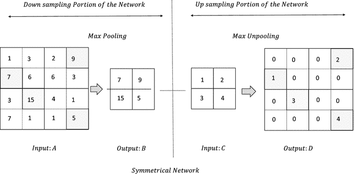
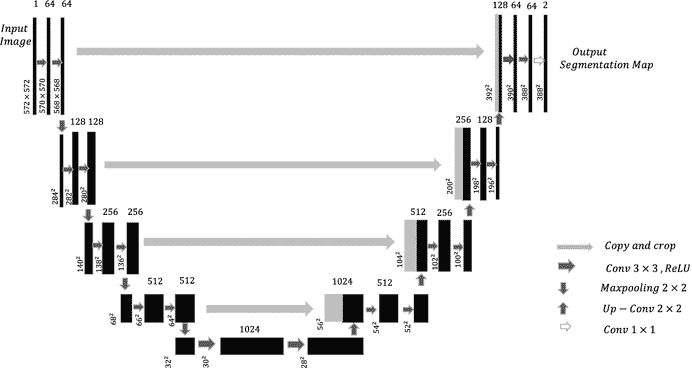

# 六、高级神经网络

在这一章中，我们将看看最近正在使用的深度学习中的一些高级概念和模型。图像分割和对象定位和检测是最近获得很多重视的一些关键领域。图像分割在通过处理医学图像来检测疾病和异常中起着至关重要的作用。同时，在诸如航空、制造和其他领域的工业中，检测诸如机器中的裂纹或其他不想要的状况的异常同样至关重要。类似地，夜空的图像可以被分割，以探测到以前未知的星系、恒星和行星。目标检测和定位在需要持续自动监控活动的地方具有深远的用途，例如在购物中心、本地商店、工厂等等。此外，它还可用于计算感兴趣区域内的物体和人员数量，并估计各种密度，例如各种信号下的交通状况。

我们将通过一些传统的图像分割方法来开始这一章，这样我们就可以理解神经网络与它们的传统对应物有什么不同。然后，我们将研究对象检测和定位技术，随后是生成对抗网络，该网络最近因其作为生成模型来创建合成数据的用途和潜力而受到广泛欢迎。这种合成数据可用于训练和推断，以防没有太多数据可用或数据获取昂贵。或者，创成式模型可用于从一个领域到另一个领域的风格转换。最后，我们以一些指南结束，说明如何使用 TensorFlow 的服务功能在生产中轻松实施 TensorFlow 模型。

## 图象分割法

图像分割是一项计算机视觉任务，涉及将图像分割成相关的片段，例如同一片段中具有一些共同属性的像素。属性可以因域和任务而异，主要属性是像素强度、纹理和颜色。在本节中，我们将介绍一些基本的分割技术，如基于像素强度直方图的阈值方法、分水岭阈值技术等，以便在开始基于深度学习的图像分割方法之前，获得一些关于图像分割的见解。

### 基于像素亮度直方图的二值阈值法

通常在一幅图像中只有两个重要的感兴趣区域——物体和背景。在这种情况下，像素强度的直方图将表示双峰的概率分布；即在两个像素的强度值附近具有高密度。通过选择阈值像素并将低于阈值的所有像素强度设置为 255，将高于阈值的所有像素强度设置为 00，将很容易分割对象和背景。这项活动将确保我们有一个由白色和黑色代表的背景和一个对象，不一定是这个顺序。如果图像被表示为 I(x，y)并且基于像素强度的直方图选择阈值 t，则新的分割图像 I’(x，y)可以被表示为


当双峰直方图没有被其间的零密度区域明显分开时，选择阈值 t 的好策略是取双峰区域达到峰值的像素强度的平均值。如果那些峰值强度由 p <sub>1</sub> 和 p <sub>2</sub> 表示，那么阈值 t 可以被选择为


或者，可以使用直方图密度最小的 p <sub>1</sub> 和 p <sub>2</sub> 之间的像素强度作为阈值像素强度。如果直方图密度函数由 H(p)表示，其中表示像素强度，则

![ $$ t=\underset{p\in \left[{p}_{1,}{p}_2\right]}{\underbrace{Arg\ \mathit{\operatorname{Min}}}}H(p) $$ ](A448418_1_En_6_Chapter_Equc.gif)

基于像素强度的直方图，这种二进制阈值的思想可以扩展到多阈值。

### 大津法

Otsu 的方法通过最大化图像不同部分之间的方差来确定阈值。如果通过 Otsu 方法使用二进制阈值，以下是要遵循的步骤:

*   Compute the probability of each pixel intensity in the image. Given that N pixel intensities are possible, the normalized histogram would give us the probability distribution of the image.

    

*   If the image has two segments C <sub>1</sub> and C <sub>2</sub> based on the threshold t, then the set of pixels {0, 2 …. t} belong to C <sub>1</sub> while the set of pixels  belong to C <sub>2</sub>. The variance between the two segments is determined by the sum of the square deviation of the mean of the clusters with respect to the global mean. The square deviations are weighted by the probability of each cluster.

    

    where u <sub>1</sub>, u <sub>2</sub> are the means of cluster 1 and cluster 2 while u is the overall global mean.

    

    The probability of each of the segments is the number of pixels in the image belonging to that class. The probability of segment C <sub>1</sub> is proportional to the number of pixels that have intensities less than or equal to the threshold intensity t, while that of segment C <sub>2</sub> is proportional to the number of pixels with intensities greater than threshold t. Hence,

    

*   If we observe the expressions for u <sub>1</sub>,u <sub>2</sub>, P(C <sub>1</sub>), and P(C <sub>2</sub>), each of them is a function of the threshold t while the overall mean u is constant given an image. Hence, the between-segment variance var(C <sub>1,</sub> C <sub>2</sub>) is a function of the threshold pixel intensity t. The threshold that maximizes the variance would provide us with the optimal threshold to use for segmentation using Otsu’s method:

    

    Instead of computing a derivative and then setting it to zero to obtain , one can evaluate the var(C <sub>1,</sub> C <sub>2</sub>) at all values of  and then choose the  at which the var(C <sub>1,</sub> C <sub>2</sub>) is maximum.

Otsu 的方法也可以扩展到多个分段，其中需要确定对应于图像的 k 个分段的阈值，而不是一个阈值。

清单 [6-1](#Par16) 中说明了刚刚说明的两种方法的逻辑，即基于像素强度直方图的二进制阈值以及 Otsu 方法，以供参考。为了便于解释，没有使用图像处理包来实现这些算法，而是使用了核心逻辑。此外，需要注意的一点是，这些分割过程通常适用于灰度图像，或者在每个颜色通道执行分割的情况下。


图 6-2。

Otsu’s method of thresholding


图 6-1。

Binary thresholding method based on histogram of pixel intensities

```py
## Binary thresholding Method Based on Histogram of Pixel Intensities
import cv2
import matplotlib.pyplot as plt
#%matplotlib inline
import numpy as np
img = cv2.imread("coins.jpg")
gray = cv2.cvtColor(img,cv2.COLOR_BGR2GRAY)
plt.imshow(gray,cmap='gray')
row,col = np.shape(gray)
gray_flat = np.reshape(gray,(row*col,1))[:,0]
ax = plt.subplot(222)
ax.hist(gray_flat,color='gray')
gray_const = []
## 150 pixel intensity seems a good threshold to choose since the density is minimum
##  round 150
for i in xrange(len(gray_flat)):
    if gray_flat[i] < 150 :
        gray_const.append(255)
    else:
        gray_const.append(0)
gray_const = np.reshape(np.array(gray_const),(row,col))
bx = plt.subplot(333)
bx.imshow(gray_const,cmap='gray')

## Otsu's thresholding Method

img = cv2.imread("otsu.jpg")
gray = cv2.cvtColor(img,cv2.COLOR_BGR2GRAY)
plt.imshow(gray,cmap='gray')
row,col = np.shape(gray)
hist_dist = 256*[0]
## Compute the frequency count of each of the pixels in the image
for i in xrange(row):
    for j in xrange(col):
        hist_dist[gray[i,j]] += 1
# Normalize the frequencies to produce probabilities

hist_dist = [c/float(row*col) for c in hist_dist]
plt.plot(hist_dist)
## Compute the between segment variance
def var_c1_c2_func(hist_dist,t):
    u1,u2,p1,p2,u = 0,0,0,0,0
    for i in xrange(t+1):
        u1 += hist_dist[i]*i
        p1 += hist_dist[i]
    for i in xrange(t+1,256):
        u2 += hist_dist[i]*i
        p2 += hist_dist[i]
    for i in xrange(256):
        u += hist_dist[i]*i
    var_c1_c2 = p1*(u1 - u)**2 + p2*(u2 - u)**2
    return var_c1_c2
## Iteratively run through all the pixel intensities from 0 to 255 and choose the one that
## maximizes the variance

variance_list = []
for i in xrange(256):
    var_c1_c2 = var_c1_c2_func(hist_dist,i)
    variance_list.append(var_c1_c2)
## Fetch the threshold that maximizes the variance
t_hat = np.argmax(variance_list)

## Compute the segmented image based on the threshold t_hat
gray_recons = np.zeros((row,col))
for i in xrange(row):
    for j in xrange(col):
        if gray[i,j] <= t_hat :
            gray_recons[i,j] = 255
        else:
            gray_recons[i,j] = 0
plt.imshow(gray_recons,cmap='gray')

--output --

Listing 6-1.Python Implementation of Binary Thresholding Method Based on Histogram of Pixel Intensities and Otsu’s Method

```

在图 [6-1](#Fig1) 中，硬币的原始灰度图像已经根据像素强度直方图进行了二值化处理，以将物体(即硬币)从背景中分离出来。基于像素强度的直方图，选择像素强度 150 作为阈值像素强度。低于 150 的像素亮度被设置为 255 来表示物体，而高于 150 的像素亮度被设置为 00 来表示背景。

图 [6-2](#Fig2) 说明了 Otsu 对图像进行阈值处理的方法，以产生由黑色和白色确定的两个部分。黑色代表背景，而白色代表房子。图像的最佳阈值是像素强度 143。

### 图像分割的分水岭算法

分水岭算法旨在分割在像素强度的局部最小值周围拓扑放置的局部区域。如果灰度图像像素强度值被认为是其水平和垂直坐标的函数，则该算法试图找到称为吸引盆地或集水盆地的局部最小值周围的区域。一旦识别出这些盆地，算法就试图通过沿着高峰或山脊构建分隔带或分水岭来将它们分开。为了更好地理解这个方法，让我们用一个简单的例子来展示这个算法，如图 [6-3](#Fig3) 所示。


图 6-3。

Watershed algorithm illustration

如果我们开始在集水池中注水，其最小值为 B，水将继续填充到水位 1，此时额外的一滴水有可能溢出到 a 处的集水池。为了防止水溢出，需要在 E 处建造一个大坝或分水岭。一旦我们在 E 处建造了一个分水岭， 我们可以继续在集水池 B 中注水，直到水位 2，在这一点上，额外的一滴水有可能溢出到集水池 C。为了防止水溢出到 C，需要在 d 处建造一个分水岭。使用这一逻辑，我们可以继续建造分水岭来分隔这些集水池。 这是分水岭算法背后的主要思想。这里，该函数是单变量的，而在灰度图像的情况下，表示像素强度的函数将是两个变量的函数:垂直坐标和水平坐标。

当目标之间存在重叠时，分水岭算法在检测目标时特别有用。阈值技术不能确定明显的对象边界。我们将在清单 [6-2](#Par22) 中通过对包含重叠硬币的图像应用分水岭技术来说明这一点。


图 6-4。

Illustration of Watershed algorithm for image segmentation)

```py
import numpy as np
import cv2
import matplotlib.pyplot as plt
from scipy import ndimage
from skimage.feature import peak_local_max
from skimage.morphology import watershed

## Load the coins image
im = cv2.imread("coins.jpg")
## Convert the image to grayscale
imgray = cv2.cvtColor(im,cv2.COLOR_BGR2GRAY)
plt.imshow(imgray,cmap='gray')
# Threshold the image to convert it to Binary image based on Otsu's method
thresh = cv2.threshold(imgray, 0, 255,
     cv2.THRESH_BINARY | cv2.THRESH_OTSU)[1]
## Detect the contours and display them
im2, contours, hierarchy = cv2.findContours(thresh,cv2.RETR_TREE,cv2.CHAIN_APPROX_SIMPLE)
y = cv2.drawContours(imgray, contours, -1, (0,255,0), 3)
## If we see the contour plots in the display of "y"
## we see that the coins have a common contour and hence it is not possible to separate them
plt.imshow(y,cmap='gray')
## Hence we will proceed with the Watershed algorithm so that each of the coins form its own
## cluster and thus it’s possible to have separate contours for each coin.
## Relabel the thresholded image to be consisting of only 0 and 1
## as the input image to distance_transform_edt should be in this format.
thresh[thresh == 255] = 5
thresh[thresh == 0] = 1
thresh[thresh == 5] = 0
## The distance_transform_edt and the peak_local_max functions help building the markers by detecting
## points near the center points of the coins. One can skip these steps and create a marker
## manually by setting one pixel within each coin with a random number representing its cluster
D = ndimage.distance_transform_edt(thresh)
localMax = peak_local_max(D, indices=False, min_distance=10,
     labels=thresh)
markers = ndimage.label(localMax, structure=np.ones((3, 3)))[0]
# Provide the EDT distance matrix and the markers to the watershed algorithm to detect the cluster’s
# labels for each pixel. For each coin, the pixels corresponding to it will be filled with the cluster number
labels = watershed(-D, markers, mask=thresh)

print("[INFO] {} unique segments found".format(len(np.unique(labels)) - 1))
# Create the contours for each label(each coin) and append to the plot
for k in np.unique(labels):
    if k != 0 :
        labels_new = labels.copy()
        labels_new[labels == k] = 255
        labels_new[labels != k] = 0
        labels_new = np.array(labels_new,dtype='uint8')
        im2, contours, hierarchy = cv2.findContours(labels_new,cv2.RETR_TREE,cv2.CHAIN_APPROX_SIMPLE)
        z = cv2.drawContours(imgray,contours, -1, (0,255,0), 3)
        plt.imshow(z,cmap='gray')

--output --

Listing 6-2.Image Segmentation Using Watershed Algorithm

```

从图 [6-4](#Fig4) 中我们可以看到，应用分水岭算法后，重叠硬币的边界是清晰的，而其他阈值方法无法为每枚硬币提供清晰的边界。

### 基于 K-均值聚类的图像分割

著名的 K-means 算法可以用来分割图像，尤其是医学图像。K 项是算法的一个参数，它决定了要形成的不同簇的数量。该算法通过形成聚类来工作，并且每个这样的聚类由基于特定输入特征的聚类质心来表示。对于通过 K-均值的图像分割，通常分割基于输入特征，例如像素强度及其三个空间维度；即水平和垂直坐标以及颜色通道。所以，输入的特征向量可以表示为，其中

![ $$ u={\left[I\left(x,y,z\right),x,y,z\right]}^T $$ ](A448418_1_En_6_Chapter_Equi.gif)

类似地，可以忽略空间坐标，并且将沿着三个颜色通道的像素强度作为输入特征向量；即

![ $$ u={\left[{I}_R\left(x,y\right),{I}_G\left(x,y\right),{I}_B\left(x,y\right)\right]}^T $$ ](A448418_1_En_6_Chapter_Equj.gif)

其中 I <sub>R</sub> (x，y)，I <sub>G</sub> (x，y)，I <sub>B</sub> (x，y)分别表示在空间坐标(x，y)处沿着红色、绿色和蓝色通道的像素强度。

该算法使用距离度量，如 L <sup>2</sup> 或 L <sup>1</sup> 范数，如下所示:


以下是 K-means 算法的工作细节

*   步骤 1–从 K 个随机选择的群集质心 C <sub>1</sub> ，C <sub>2</sub> 开始。C <sub>k</sub> 对应的 K 个簇 S <sub>1</sub> ，S <sub>2</sub> …S <sub>k</sub> 。
*   Step 2 – Compute the distance of each pixel feature vector u <sup>(i)</sup> from the cluster centroids and tag it to the cluster S <sub>j</sub> if the pixel has a minimum distance from its cluster centroid C <sub>j</sub> :

    

    This process needs to be repeated for all the pixel-feature vectors so that in one iteration of K-means all the pixels are tagged to one of the K clusters.
*   Step 3 – Once the new centroids clusters have been assigned for all the pixels, the centroids are recomputed by taking the mean of the pixel-feature vectors in each cluster:

    

*   Repeat Step 2 and Step 3 for several iterations until the centroids no longer change. Through this iterative process, we are reducing the sum of the intra-cluster distances, as represented here:

    

清单 [6-3](#Par34) 显示了 K-means 算法的一个简单实现，将三个颜色通道中的像素强度作为特征。用实现图像分割。输出以灰度显示，因此可能不会显示分割的实际质量。然而，如果清单 [6-3](#Par34) 中产生的相同分割图像以彩色格式显示，它将揭示分割的更精细细节。还有一点需要补充:最小化的成本或损失函数(即，类内距离的总和)是非凸函数，因此可能会遇到局部极小问题。可以用聚类质心的不同初始值多次触发分割，然后选择最小化成本函数最多或产生合理分割的那个。


图 6-5。

Illustration of segmentation through the K-means algorithm

```py
import cv2
import numpy as np
import matplotlib.pyplot as plt
#np.random.seed(0)
img = cv2.imread("kmeans.jpg")
imgray_ori = cv2.cvtColor(img,cv2.COLOR_BGR2GRAY)
plt.imshow(imgray_ori,cmap='gray')
## Save the dimensions of the image
row,col,depth = img.shape
## Collapse the row and column axis for faster matrix operation.
img_new = np.zeros(shape=(row*col,3))
glob_ind = 0
for i in xrange(row):
    for j in xrange(col):
        u = np.array([img[i,j,0],img[i,j,1],img[i,j,2]])
        img_new[glob_ind,:] = u
        glob_ind += 1
# Set the number of clusters
K = 5
# Run the K-means for
num_iter = 20
for g in xrange(num_iter):
# Define cluster for storing the cluster number and out_dist to store the distances from centroid
    clusters = np.zeros((row*col,1))
    out_dist = np.zeros((row*col,K))
    centroids = np.random.randint(0,255,size=(K,3))
    for k in xrange(K):
        diff = img_new - centroids[k,:]
        diff_dist = np.linalg.norm(diff,axis=1)
        out_dist[:,k] = diff_dist
# Assign the cluster with minimum distance to a pixel location
    clusters = np.argmin(out_dist,axis=1)
# Recompute the clusters
    for k1 in np.unique(clusters):
        centroids[k1,:] = np.sum(img_new[clusters == k1,:],axis=0)/np.sum([clusters == k1])
# Reshape the cluster labels in two-dimensional image form
clusters = np.reshape(clusters,(row,col))
out_image = np.zeros(img.shape)
#Form the 3D image with the labels replaced by their correponding centroid pixel intensities
for i in xrange(row):
    for j in xrange(col):
        out_image[i,j,0] = centroids[clusters[i,j],0]
        out_image[i,j,1] = centroids[clusters[i,j],1]
        out_image[i,j,2] = centroids[clusters[i,j],2]

out_image = np.array(out_image,dtype="uint8")
# Display the output image after converting into grayscale
# Readers advised to display the image as it is for better clarity
imgray = cv2.cvtColor(out_image,cv2.COLOR_BGR2GRAY)
plt.imshow(imgray,cmap='gray')

---Output ---

Listing 6-3.Image Segmentation Using K-means

```

我们可以从图 [6-5](#Fig5) 中看到，K-means 聚类在分割 K = 3 的图像方面做得很好。

### 语义分割

近年来，通过卷积神经网络的图像分割获得了很大的普及。当通过神经网络分割图像时，显著不同的事情之一是将每个像素分配给一个对象类的注释过程，以便这样的分割网络的训练是完全监督的。虽然注释图像的过程是一件昂贵的事情，但它通过有一个比较的基础事实简化了问题。基本事实将是图像的形式，其中像素保持特定对象的代表颜色。例如，如果我们正在处理一个猫和狗的图像，并且这些图像可以有一个背景，那么图像的每个像素可以属于三个类别之一——猫、狗和背景。此外，每一类对象通常由代表性颜色表示，使得地面实况可以显示为分割的图像。让我们通过一些卷积神经网络，可以执行语义分割。

### 滑动窗口方法

可以通过使用滑动窗口从原始图像中提取图像碎片，然后将这些碎片馈送到分类卷积神经网络，以预测每个图像碎片的中心像素的类别。用这种滑动窗口方法训练这种卷积神经网络在训练和测试时都将是计算密集型的，因为每个图像至少需要 N 个小块被馈送到分类 CNN，其中 N 表示图像中的像素数。


图 6-6。

Sliding-window semantic segmentation

图 [6-6](#Fig6) 所示的是一个滑动窗口语义分割网络，用于分割猫、狗和背景的图像。它从原始图像中裁剪出小块，并通过分类 CNN 对小块中的中心像素进行分类。诸如 AlexNet、VGG19、Inception V3 等预训练网络可以用作分类 CNN，输出层被替换为仅具有三个与狗、猫和背景的标签相关的 3 类。然后，可以通过反向传播对 CNN 进行微调，将图像块作为输入，将输入图像块的中心像素的类别标签作为输出。从图像卷积的角度来看，这种网络是非常低效的，因为彼此相邻的图像补片将具有显著的重叠，并且每次独立地重新处理它们会导致不必要的计算开销。为了克服上述网络的缺点，可以使用全卷积网络，这是我们下一个讨论的主题。

### 全卷积网络(FCN)

全卷积网络由一系列卷积层组成，没有任何全连接层。选择卷积，使得输入图像在空间维度没有任何变化的情况下被传输；即图像的高度和宽度保持不变。与滑动窗口方法不同，完全卷积网络一次预测所有像素类别，而不是对图像中的各个块独立评估像素类别。该网络的输出层由 C 个特征图组成，其中 C 是每个像素可以被分类到的类别数，包括背景。如果原始图像的高度和宽度分别为 h 和 w，那么输出由 C 个特征图组成。此外，对于地面实况，应该有对应于 C 个类别的 C 个分割图像。在任何空间坐标(，每个特征图包含与该特征图所关联的类别相关的像素的分数。针对每个空间像素位置()的特征地图上的这些分数形成了不同类别上的 SoftMax。


图 6-7。

Fully convolutional network architecture

图 [6-7](#Fig7) 包含全卷积网络的架构设计。对应于三个类别，输出特征地图以及地面真实特征地图的数量将是三个。如果第 k 个类在空间坐标(I，j)处的输入净激活或得分由 s<sub>k</sub>T4【I，j】表示，则第 k 个类在空间坐标(I，j)处的像素的概率由 SoftMax 概率给出，如下所示:


此外，如果第 k 类的空间坐标(I，j)处的地面真实标签由 y <sub>k</sub> (i，j)给出，则空间位置(I，j)处的像素的交叉熵损失可以由


表示

如果输入网络的图像的高度和宽度分别为 M 和 N，那么图像的总损失为


图像可以作为小批量馈送到网络，因此每个图像的平均损失可以作为在通过梯度下降的小批量学习的每个时期中要优化的损失或成本函数。

空间位置(I，j)处的像素的输出类别可以通过取概率 P <sub> k </sub> (i，j)最大的类别 k 来确定；即


需要对图像的所有空间位置的像素执行相同的活动，以获得最终的分割图像。

在图 [6-8](#Fig8) 中，说明了用于分割猫、狗和背景图像的网络的输出特征图。正如我们所看到的，对于三个类别中的每一个，都有一个单独的特征图。特征图的空间维度与输入图像的空间维度相同。所有三个类别的净输入激活、相关概率和相应的地面标记都显示在空间坐标(I，j)处。


图 6-8。

Output feature maps corresponding to each of the three classes for dog, cat, and background

该网络中的所有卷积保持输入图像的空间维度。因此，对于高分辨率图像，网络将是计算密集型的，特别是如果每个卷积中的特征图或通道的数量很高。为了解决这个问题，更广泛地使用完全卷积神经网络的不同变体，其在网络的前半部分对图像进行下采样，然后在网络的后半部分对图像进行上采样。这个全卷积网络的修改版本将是我们下一个讨论的话题。

### 具有下采样和上采样的全卷积网络

与先前网络中在所有卷积层中保留图像的空间维度不同，这种全卷积网络的变体使用卷积的组合，其中图像在网络的前半部分被下采样，然后在最终层被上采样，以恢复原始图像的空间维度。通常，这种网络由通过步进卷积和/或池操作的几层下采样和几层上采样组成。到目前为止，通过卷积运算，我们要么对图像进行下采样，要么保持输出图像的空间维度与输入图像的空间维度相同。在这个网络中，我们需要对图像，或者更确切地说是特征图进行上采样。图 [6-9](#Fig9) 展示了这种网络的高级架构设计。


图 6-9。

Fully convolutional network with downsampling and upsampling

通常用于对图像或特征图进行上采样的技术如下所述。

#### 取消排队

取消池化可以被视为池化的反向操作。在最大池或平均池中，我们通过基于池内核的大小取像素值的最大值或平均值来减少图像的空间维度。因此，如果我们有一个用于池化的内核，图像的空间维度在每个空间维度上减少了。在 unpooling 中，我们一般通过在一个邻域内重复一个像素值来增加图像的空间维度，如图 [6-10](#Fig10) (A)所示。


图 6-10。

Unpooling operation

类似地，可以选择仅填充邻域中的一个像素，并将其余像素设置为零，如图 [6-10](#Fig10) (B)所示。

#### 最大取消轮询

许多完全卷积层是对称的，因为网络前半部分的池化操作将在网络后半部分有相应的取消池化操作，以恢复图像大小。每当执行汇集时，由于一个代表性元素对相邻像素的结果进行汇总，关于输入图像的微小空间信息会丢失。例如，当我们通过一个内核进行最大池化时，每个邻域的最大像素值被传递到输出来表示邻域。根据输出，不可能推断出最大像素值的位置。因此，在这个过程中，我们丢失了关于输入的空间信息。在语义分割中，我们希望将每个像素分类为尽可能接近其真实标签。但是，由于 max pooling，许多关于图像边缘和其他细节的信息都丢失了。当我们尝试通过取消池化来重建图像时，我们可以恢复一点丢失的空间信息的一种方法是将输入像素的值放置在与最大池化输出获得其输入的位置相对应的输出位置。为了更好地形象化，让我们看看图 [6-11](#Fig11) 中的插图。



图 6-11。

Max unpooling illustration for a symmetric fully connected segmentation network

正如我们从图 [6-11](#Fig11) 中所看到的，当取消池化时，只有输出映射 D 中与输入 A 中最大元素的位置相对应的位置被填充了值。这种取消轮询的方法通常称为最大取消轮询。

#### 转置卷积

通过取消轮询或最大取消轮询完成的上采样是固定的变换。这些变换不涉及网络在训练网络时需要学习的任何参数。进行上采样的一种可学的方法是通过转置卷积来执行上采样，这很像我们所知道的卷积运算。由于转置卷积涉及网络将学习的参数，网络将学习以这样一种方式进行上采样，即训练网络的总成本函数减少。现在，让我们进入转置卷积如何工作的细节。


图 6-12。

Strided convolution operation for downsampling an image

在步长卷积中，对于步长为 2 的每个空间维度，输出维度几乎是输入维度的一半。图 [6-12](#Fig12) 说明了将维度为的 2D 输入与步长为 2 且补零为 1 的内核进行卷积的操作。我们在输入上滑动内核，在内核所在的每个位置，内核的点积通过内核与输入重叠的部分来计算。

在转置卷积中，我们使用相同的逻辑，但不是下采样，而是大于 1 的步长提供上采样。因此，如果我们使用步幅 2，那么输入大小在每个空间维度上都加倍。图 [6-13a](#Fig13) 、 [6-13b](#Fig14) 和 [6-13c](#Fig15) 示出了通过滤波器或内核大小对维度的输入进行转置卷积以产生输出的操作。与卷积中滤波器和输入部分之间的点积不同，在转置卷积中，在特定位置，滤波器值由放置滤波器的输入值加权，加权后的滤波器值填充到输出中的相应位置。沿着相同空间维度的连续输入值的输出被放置在由转置卷积的步幅确定的间隙处。对所有输入值执行相同的操作。最后，将对应于每个输入值的输出相加以产生最终输出，如图 [6-13c](#Fig15) 所示。


图 6-13c。

Transpose convolution for upsampling


图 6-13b。

Transpose convolution for upsampling


图 6-13a。

Transpose convolution for upsampling

在 TensorFlow 中，函数`tf.nm.conv2d_transpose`可用于通过转置卷积进行上采样。

### 掌中宽带

U-Net 卷积神经网络是近来用于图像分割，尤其是医学图像分割的最有效的架构之一。这种 U-Net 架构赢得了 2015 年 ISBI 手机追踪挑战赛。网络拓扑从输入层到输出层遵循 U 形模式，因此被称为 U-Net。 [Olaf Ronneberger](https://arxiv.org/find/cs/1/au:+Ronneberger_O/0/1/0/all/0/1) 、 [Philipp Fischer](https://arxiv.org/find/cs/1/au:+Fischer_P/0/1/0/all/0/1) 和 [Thomas Brox](https://arxiv.org/find/cs/1/au:+Brox_T/0/1/0/all/0/1) 提出了这种用于分割的卷积神经网络，该模型的细节在白皮书“U-Net:用于生物医学图像分割的卷积网络”中进行了说明论文可以位于 [`https://arxiv.org/abs/1505.04597`](https://arxiv.org/abs/1505.04597) 。

在网络的第一部分，图像通过卷积和最大池操作的组合进行下采样。卷积与逐像素的 ReLU 激活相关联。每个卷积操作都使用滤波器大小，并且没有零填充，这导致输出特征图的每个空间维度减少了两个像素。在网络的第二部分中，向下采样的图像被向上采样直到最终层，其中输出特征图对应于被分割的对象的特定类别。正如我们前面看到的，每幅图像的成本函数将是整个图像上分类总和的像素分类交叉熵或对数损失。需要注意的一点是，U-Net 中输出要素地图的空间维度小于输入要素地图的空间维度。例如，具有空间维度的输入图像产生空间维度的输出特征图。人们可能会问，对于训练的损失计算，如何进行像素到像素类的比较。想法很简单——将分割的输出特征图与从输入图像中心提取的面片大小为的地面真实分割图像进行比较。中心思想是，如果一个人有更高分辨率的图像，比如说，他可以从它那里随机创建许多空间维度的图像用于训练目的。此外，通过提取中心小块并用相应的类别标记每个像素，从这些子图像中创建地面真实图像。这有助于用大量数据训练网络，即使周围没有很多图像用于训练。图 [6-14](#Fig16) 所示为一个 U-Net 的架构图。



图 6-14。

U-Net architecture diagram

我们可以从架构图中看到，在网络的第一部分中，图像经历卷积和最大汇集，以减少空间维度，同时增加通道深度；即增加特征地图的数量。每两个连续的卷积及其相关的 ReLU 激活之后是一个最大池化操作，该操作将图像大小减少。每一次最大池化操作都将网络向下带到下一组卷积，并在网络的第一部分形成 U 形。类似地，上采样层在每个维度上将空间维度增加 2，因此将图像大小增加 4 倍。此外，在第二部分中，它为网络提供了 U 型结构。每次上采样后，图像都要经过两次卷积及其相关的 ReLU 激活。

就最大汇集和上采样操作而言，U-Net 是一个非常对称的网络。然而，对于相应的最大汇集和上采样对，最大汇集之前的图像大小与上采样之后的图像大小不同，这与其他完全卷积层不同。如前所述，当进行最大池操作时，由于输出中的代表性像素对应于图像的局部邻域，因此会丢失大量空间信息。当图像被上采样回其原始尺寸时，恢复这种丢失的空间信息变得困难，因此新图像缺少边缘周围的大量信息以及图像的其他更精细的方面。这导致次优分割。如果上采样后的图像与其对应的最大汇集操作之前的图像具有相同的空间维度，则可以在最大汇集之前将随机数量的特征地图附加到上采样后的输出特征地图，以帮助网络恢复一点丢失的空间信息。由于在 U-Net 的情况下，这些要素地图的尺寸不匹配，U-Net 在最大汇集之前裁剪要素地图，使其与来自上采样的输出要素地图具有相同的空间尺寸，并连接它们。这可以更好地分割图像，因为它有助于恢复在 max pooling 期间丢失的一些空间信息。还有一点需要注意的是，上采样可以通过我们目前所了解的任何一种方法来完成，比如去卷积、最大去卷积和转置卷积，后者也称为去卷积。

U-Net 细分的几个重大胜利如下:

*   大量的训练数据可以仅用几个带注释的或手工标记的分割图像来生成。
*   即使存在需要分离的同类接触物体，U-Net 也能很好地分割。正如我们前面看到的传统图像处理方法，分离同一类的触摸对象是很困难的，分水岭算法等方法需要大量的对象标记输入，才能实现合理的分割。U-Net 通过为接触段边界周围的像素的错误分类引入高权重，在同一类的接触段之间进行良好的分离。

### 基于全连接神经网络的TensorFlow语义分割

在本节中，我们将介绍 TensorFlow 实现的工作细节，该实现基于名为 Carvana 的 Kaggle 竞赛，用于从背景中分割汽车图像。输入图像以及它们的基本事实分割可用于训练目的。我们在 80%的训练数据上训练模型，并在剩余的 20%的数据上验证模型的性能。为了训练，我们在网络的前半部分使用具有类似 U-Net 结构的全连接卷积网络，随后通过转置卷积进行上采样。这种网络与 U 型网络的几个不同之处在于，在使用填充进行卷积时，空间维度保持不变。另一个不同之处是，该模型不使用跳过连接来连接从下采样流到上采样流的特征地图。清单 [6-4](#Par66) 中提供了详细的实现。


图 6-15a。

Segmentation results on the validation dataset with model trained on –size images

```py
## Load the required packages
import tensorflow as tf
from sklearn.model_selection import train_test_split
import matplotlib.pyplot as plt
%matplotlib inline
import os
from subprocess import check_output
import numpy as np
from keras.preprocessing.image import array_to_img, img_to_array, load_img, ImageDataGenerator
from scipy.misc import imresize

# Define downsampling - 2 (Conv+ReLU) and 1 Maxpooling
# Maxpooling can be set to False when needed

x = tf.placeholder(tf.float32,[None,128,128,3])
y = tf.placeholder(tf.float32,[None,128,128,1])

def down_sample(x,w1,b1,w2,b2,pool=True):
    x = tf.nn.conv2d(x,w1,strides=[1,1,1,1],padding='SAME')
    x = tf.nn.bias_add(x,b1)
    x = tf.nn.relu(x)
    x = tf.nn.conv2d(x,w2,strides=[1,1,1,1],padding='SAME')
    x = tf.nn.bias_add(x,b2)
    x = tf.nn.relu(x)
    if pool:
        y = tf.nn.max_pool(x,ksize=[1,2,2,1],strides=[1,2,2,1],padding='SAME')
        return y,x
    else:
        return x

# Define upsampling
def up_sample(x,w,b):
    output_shape  = x.get_shape().as_list()
    output_shape[0] = 32
    output_shape[1] *= 2
    output_shape[2] *= 2
    output_shape[1] = np.int(output_shape[1])
    output_shape[2] = np.int(output_shape[2])
    output_shape[3] = w.get_shape().as_list()[2]
    conv_tf = tf.nn.conv2d_transpose(value=x,filter=w,output_shape=output_shape,strides=[1,2,2,1],padding="SAME")
    conv_tf = tf.nn.bias_add(conv_tf,b)
    return tf.nn.relu(conv_tf)

## Define weights

weights = {
    'w11': tf.Variable(tf.random_normal([3,3,3,64],mean=0.0,stddev=0.02)),
    'w12': tf.Variable(tf.random_normal([3,3,64,64],mean=0.0,stddev=0.02)),
    'w21': tf.Variable(tf.random_normal([3,3,64,128],mean=0.0,stddev=0.02)),
    'w22': tf.Variable(tf.random_normal([3,3,128,128],mean=0.0,stddev=0.02)),
    'w31': tf.Variable(tf.random_normal([3,3,128,256],mean=0.0,stddev=0.02)),
    'w32': tf.Variable(tf.random_normal([3,3,256,256],mean=0.0,stddev=0.02)),
    'w41': tf.Variable(tf.random_normal([3,3,256,512],mean=0.0,stddev=0.02)),
    'w42': tf.Variable(tf.random_normal([3,3,512,512],mean=0.0,stddev=0.02)),
    'w51': tf.Variable(tf.random_normal([3,3,512,1024],mean=0.0,stddev=0.02)),
    'w52': tf.Variable(tf.random_normal([3,3,1024,1024],mean=0.0,stddev=0.02)),
    'wu1': tf.Variable(tf.random_normal([3,3,1024,1024],mean=0.0,stddev=0.02)),
    'wu2': tf.Variable(tf.random_normal([3,3,512,1024],mean=0.0,stddev=0.02)),
    'wu3': tf.Variable(tf.random_normal([3,3,256,512],mean=0.0,stddev=0.02)),
    'wu4': tf.Variable(tf.random_normal([3,3,128,256],mean=0.0,stddev=0.02)),
    'wf': tf.Variable(tf.random_normal([1,1,128,1],mean=0.0,stddev=0.02))
}

biases = {
    'b11': tf.Variable(tf.random_normal([64],mean=0.0,stddev=0.02)),
    'b12': tf.Variable(tf.random_normal([64],mean=0.0,stddev=0.02)),
    'b21': tf.Variable(tf.random_normal([128],mean=0.0,stddev=0.02)),
    'b22': tf.Variable(tf.random_normal([128],mean=0.0,stddev=0.02)),
    'b31': tf.Variable(tf.random_normal([256],mean=0.0,stddev=0.02)),
    'b32': tf.Variable(tf.random_normal([256],mean=0.0,stddev=0.02)),
    'b41': tf.Variable(tf.random_normal([512],mean=0.0,stddev=0.02)),
    'b42': tf.Variable(tf.random_normal([512],mean=0.0,stddev=0.02)),
    'b51': tf.Variable(tf.random_normal([1024],mean=0.0,stddev=0.02)),
    'b52': tf.Variable(tf.random_normal([1024],mean=0.0,stddev=0.02)),
    'bu1': tf.Variable(tf.random_normal([1024],mean=0.0,stddev=0.02)),
    'bu2': tf.Variable(tf.random_normal([512],mean=0.0,stddev=0.02)),
    'bu3': tf.Variable(tf.random_normal([256],mean=0.0,stddev=0.02)),
    'bu4': tf.Variable(tf.random_normal([128],mean=0.0,stddev=0.02)),
    'bf': tf.Variable(tf.random_normal([1],mean=0.0,stddev=0.02))
}

## Create the final model

def unet_basic(x,weights,biases,dropout=1):

    ## Convolutional 1
    out1,res1 = down_sample(x,weights['w11'],biases['b11'],weights['w12'],biases['b12'],pool=True)
    out1,res1 = down_sample(out1,weights['w21'],biases['b21'],weights['w22'],biases['b22'],pool=True)
    out1,res1 = down_sample(out1,weights['w31'],biases['b31'],weights['w32'],biases['b32'],pool=True)
    out1,res1 = down_sample(out1,weights['w41'],biases['b41'],weights['w42'],biases['b42'],pool=True)
    out1      = down_sample(out1,weights['w51'],biases['b51'],weights['w52'],biases['b52'],pool=False)
    up1       = up_sample(out1,weights['wu1'],biases['bu1'])
    up1       = up_sample(up1,weights['wu2'],biases['bu2'])
    up1       = up_sample(up1,weights['wu3'],biases['bu3'])
    up1       = up_sample(up1,weights['wu4'],biases['bu4'])
    out       = tf.nn.conv2d(up1,weights['wf'],strides=[1,1,1,1],padding='SAME')
    out       = tf.nn.bias_add(out,biases['bf'])
    return out

## Create generators for pre-processing the images and making a batch available at runtime
## instead of loading all the images and labels in memory
# set the necessary directories
data_dir = "/home/santanu/Downloads/Carvana/train/"  # Contains the input training data
mask_dir = "/home/santanu/Downloads/Carvana/train_masks/" # Contains the grouth truth labels
all_images = os.listdir(data_dir)
# pick which images we will use for testing and which for validation
train_images, validation_images = train_test_split(all_images, train_size=0.8, test_size=0.2)
# utility function to convert grayscale images to rgb
def grey2rgb(img):
    new_img = []
    for i in range(img.shape[0]):
        for j in range(img.shape[1]):
            new_img.append(list(img[i][j])*3)
    new_img = np.array(new_img).reshape(img.shape[0], img.shape[1], 3)
    return new_img

# generator that we will use to read the data from the directory
def data_gen_small(data_dir, mask_dir, images, batch_size, dims):
        """
        data_dir: where the actual images are kept
        mask_dir: where the actual masks are kept
        images: the filenames of the images we want to generate batches from
        batch_size: self explanatory
        dims: the dimensions in which we want to rescale our images
        """
        while True:
            ix = np.random.choice(np.arange(len(images)), batch_size)
            imgs = []
            labels = []
            for i in ix:
                # images
                original_img = load_img(data_dir + images[i])
                resized_img = imresize(original_img, dims+[3])
                array_img = img_to_array(resized_img)/255
                imgs.append(array_img)

                # masks
                original_mask = load_img(mask_dir + images[i].split(".")[0] + '_mask.gif')
                resized_mask = imresize(original_mask, dims+[3])
                array_mask = img_to_array(resized_mask)/255
                labels.append(array_mask[:, :, 0])
            imgs = np.array(imgs)
            labels = np.array(labels)
            yield imgs, labels.reshape(-1, dims[0], dims[1], 1)

train_gen = data_gen_small(data_dir, mask_dir, train_images,32, [128, 128])
validation_gen = data_gen_small(data_dir, mask_dir, validation_images,32, [128, 128])

display_step=10
learning_rate=0.0001

keep_prob = tf.placeholder(tf.float32)
logits = unet_basic(x,weights,biases)
flat_logits = tf.reshape(tensor=logits, shape=(-1, 1))
flat_labels = tf.reshape(tensor=y,shape=(-1, 1))
cross_entropies = tf.nn.sigmoid_cross_entropy_with_logits(logits=flat_logits,
                                                          labels=flat_labels)
cost = tf.reduce_mean(cross_entropies)
optimizer = tf.train.AdamOptimizer(learning_rate=learning_rate).minimize(cost)

# Evaluate model

## initializing all variables

init = tf.global_variables_initializer()

## Launch the execution Graph

with tf.Session() as sess:
    sess.run(init)
    for batch in xrange(500):
        batch_x,batch_y= next(train_gen)
        sess.run(optimizer, feed_dict={x:batch_x,y:batch_y})
        loss = sess.run([cost],feed_dict={x:batch_x,y:batch_y})
        ## Validation loss and store the result for display at the end
        val_x,val_y = next(validation_gen)
        loss_val = sess.run([cost],feed_dict={x:val_x,y:val_y})
        out_x = sess.run(logits,feed_dict={x:val_x})
        print('batch:',batch,'train loss:',loss,'validation loss:',loss_val)

## To judge the segmentation quality of the Model we plot the segmentation for couple of the validation images.
## These validation images were evaluated in the last batch of training. Bear in mind that the model hasn’t been
## trained on these validation images.

img = (out_x[1] > 0.5)*1.0
plt.imshow(grey2rgb(img),alpha=0.5)
plt.imshow(val_x[1])
plt.imshow(grey2rgb(val_y[1]), alpha=0.5)

img = (out_x[2] > 0.5)*1.0
plt.imshow(grey2rgb(img),alpha=0.5)
plt.imshow(val_x[2])
plt.imshow(grey2rgb(val_y[2]), alpha=0.5)

-output-

''batch:', 400, 'train loss:', [0.044453222], 'validation loss:', [0.058442257])
('batch:', 401, 'train loss:', [0.049510699], 'validation loss:', [0.055530164])
('batch:', 402, 'train loss:', [0.048047166], 'validation loss:', [0.055518236])
('batch:', 403, 'train loss:', [0.049462996], 'validation loss:', [0.049190756])
('batch:', 404, 'train loss:', [0.047011156], 'validation loss:', [0.051120583])
('batch:', 405, 'train loss:', [0.046235155], 'validation loss:', [0.052921098])
('batch:', 406, 'train loss:', [0.051339123], 'validation loss:', [0.054767497])
('batch:', 407, 'train loss:', [0.050004266], 'validation loss:', [0.052718181])
('batch:', 408, 'train loss:', [0.048425209], 'validation loss:', [0.054115709])
('batch:', 409, 'train loss:', [0.05234601],  'validation loss:', [0.053246532])
('batch:', 410, 'train loss:', [0.054224499], 'validation loss:', [0.05121265])
('batch:', 411, 'train loss:', [0.050268434], 'validation loss:', [0.056970511])
('batch:', 412, 'train loss:', [0.046658799], 'validation loss:', [0.058863375])
('batch:', 413, 'train loss:', [0.048009872], 'validation loss:', [0.049314644])
('batch:', 414, 'train loss:', [0.053399611], 'validation loss:', [0.050949663])
('batch:', 415, 'train loss:', [0.047932044], 'validation loss:', [0.049477436])
('batch:', 416, 'train loss:', [0.054921247], 'validation loss:', [0.059221379])
('batch:', 417, 'train loss:', [0.053222295], 'validation loss:', [0.061699588])
('batch:', 418, 'train loss:', [0.047465689], 'validation loss:', [0.051628478])
('batch:', 419, 'train loss:', [0.055220582], 'validation loss:', [0.056656662])
('batch:', 420, 'train loss:', [0.052862987], 'validation loss:', [0.048487194])
('batch:', 421, 'train loss:', [0.052869596], 'validation loss:', [0.049040388])
('batch:', 422, 'train loss:', [0.050372943], 'validation loss:', [0.052676879])
('batch:', 423, 'train loss:', [0.048104074], 'validation loss:', [0.05687784])
('batch:', 424, 'train loss:', [0.050506901], 'validation loss:', [0.055646997])
('batch:', 425, 'train loss:', [0.042940177], 'validation loss:', [0.047789834])
('batch:', 426, 'train loss:', [0.04780338],  'validation loss:', [0.05711592])
('batch:', 427, 'train loss:', [0.051617432], 'validation loss:', [0.051806655])
('batch:', 428, 'train loss:', [0.047577277], 'validation loss:', [0.052631289])
('batch:', 429, 'train loss:', [0.048690431], 'validation loss:', [0.044696849])
('batch:', 430, 'train loss:', [0.046005826], 'validation loss:', [0.050702494])
('batch:', 431, 'train loss:', [0.05022176],  'validation loss:', [0.053923506])
('batch:', 432, 'train loss:', [0.041961089], 'validation loss:', [0.047880188])
('batch:', 433, 'train loss:', [0.05004932],  'validation loss:', [0.057072558])
('batch:', 434, 'train loss:', [0.04603707],  'validation loss:', [0.049482994])
('batch:', 435, 'train loss:', [0.047554974], 'validation loss:', [0.050586618])
('batch:', 436, 'train loss:', [0.046048313], 'validation loss:', [0.047748547])
('batch:', 437, 'train loss:', [0.047006462], 'validation loss:', [0.059268739])
('batch:', 438, 'train loss:', [0.045432612], 'validation loss:', [0.051733252])
('batch:', 439, 'train loss:', [0.048241541], 'validation loss:', [0.04774794])
('batch:', 440, 'train loss:', [0.046124499], 'validation loss:', [0.048809234])
('batch:', 441, 'train loss:', [0.049743906], 'validation loss:', [0.051254783])
('batch:', 442, 'train loss:', [0.047674596], 'validation loss:', [0.048125759])
('batch:', 443, 'train loss:', [0.048984651], 'validation loss:', [0.04512443])
('batch:', 444, 'train loss:', [0.045365792], 'validation loss:', [0.042732101])
('batch:', 445, 'train loss:', [0.046680171], 'validation loss:', [0.050935686])
('batch:', 446, 'train loss:', [0.04224021],  'validation loss:', [0.052455597])
('batch:', 447, 'train loss:', [0.045161027], 'validation loss:', [0.045499101])
('batch:', 448, 'train loss:', [0.042469904], 'validation loss:', [0.050128322])
('batch:', 449, 'train loss:', [0.047899902], 'validation loss:', [0.050441738])
('batch:', 450, 'train loss:', [0.043648213], 'validation loss:', [0.048811793])
('batch:', 451, 'train loss:', [0.042413067], 'validation loss:', [0.051744446])
('batch:', 452, 'train loss:', [0.047555752], 'validation loss:', [0.04977461])
('batch:', 453, 'train loss:', [0.045962822], 'validation loss:', [0.047307629])
('batch:', 454, 'train loss:', [0.050115541], 'validation loss:', [0.050558448])
('batch:', 455, 'train loss:', [0.045722887], 'validation loss:', [0.049715079])
('batch:', 456, 'train loss:', [0.042583987], 'validation loss:', [0.048713747])
('batch:', 457, 'train loss:', [0.040946022], 'validation loss:', [0.045165032])
('batch:', 458, 'train loss:', [0.045971408], 'validation loss:', [0.046652604])
('batch:', 459, 'train loss:', [0.045015588], 'validation loss:', [0.055410333])
('batch:', 460, 'train loss:', [0.045542594], 'validation loss:', [0.047741935])
('batch:', 461, 'train loss:', [0.04639449],  'validation loss:', [0.046171311])
('batch:', 462, 'train loss:', [0.047501944], 'validation loss:', [0.046123035])
('batch:', 463, 'train loss:', [0.043643478], 'validation loss:', [0.050230302])
('batch:', 464, 'train loss:', [0.040434662], 'validation loss:', [0.046641909])
('batch:', 465, 'train loss:', [0.046465941], 'validation loss:', [0.054901786])
('batch:', 466, 'train loss:', [0.049838047], 'validation loss:', [0.048461676])
('batch:', 467, 'train loss:', [0.043582849], 'validation loss:', [0.052996978])
('batch:', 468, 'train loss:', [0.050299261], 'validation loss:', [0.048585847])
('batch:', 469, 'train loss:', [0.046049926], 'validation loss:', [0.047540378])
('batch:', 470, 'train loss:', [0.042139661], 'validation loss:', [0.047782935])
('batch:', 471, 'train loss:', [0.046433724], 'validation loss:', [0.049313426])
('batch:', 472, 'train loss:', [0.047063917], 'validation loss:', [0.045388222])
('batch:', 473, 'train loss:', [0.045556825], 'validation loss:', [0.044953942])
('batch:', 474, 'train loss:', [0.046181824], 'validation loss:', [0.045763671])
('batch:', 475, 'train loss:', [0.047123503], 'validation loss:', [0.047637179])
('batch:', 476, 'train loss:', [0.046167117], 'validation loss:', [0.051462833])
('batch:', 477, 'train loss:', [0.043556783], 'validation loss:', [0.044357236])
('batch:', 478, 'train loss:', [0.04773742],  'validation loss:', [0.046332739])
('batch:', 479, 'train loss:', [0.04820114],  'validation loss:', [0.045707334])
('batch:', 480, 'train loss:', [0.048089884], 'validation loss:', [0.052449297])
('batch:', 481, 'train loss:', [0.041174423], 'validation loss:', [0.050378591])
('batch:', 482, 'train loss:', [0.049479648], 'validation loss:', [0.047861829])
('batch:', 483, 'train loss:', [0.041197944], 'validation loss:', [0.051383432])
('batch:', 484, 'train loss:', [0.051363751], 'validation loss:', [0.050520841])
('batch:', 485, 'train loss:', [0.047751397], 'validation loss:', [0.046632469])
('batch:', 486, 'train loss:', [0.049832929], 'validation loss:', [0.048640732])
('batch:', 487, 'train loss:', [0.049518026], 'validation loss:', [0.048658002])
('batch:', 488, 'train loss:', [0.051349726], 'validation loss:', [0.051405452])
('batch:', 489, 'train loss:', [0.041912809], 'validation loss:', [0.046458714])
('batch:', 490, 'train loss:', [0.047130216], 'validation loss:', [0.052001398])
('batch:', 491, 'train loss:', [0.041481428], 'validation loss:', [0.046243563])
('batch:', 492, 'train loss:', [0.042776003], 'validation loss:', [0.042228915])
('batch:', 493, 'train loss:', [0.043606419], 'validation loss:', [0.048132997])
('batch:', 494, 'train loss:', [0.047129884], 'validation loss:', [0.046108384])
('batch:', 495, 'train loss:', [0.043634158], 'validation loss:', [0.046292961])
('batch:', 496, 'train loss:', [0.04454672],  'validation loss:', [0.044108659])
('batch:', 497, 'train loss:', [0.048068151], 'validation loss:', [0.044547819])
('batch:', 498, 'train loss:', [0.044967934], 'validation loss:', [0.047069982])
('batch:', 499, 'train loss:', [0.041554678], 'validation loss:', [0.051807735])

Listing 6-4.Semantic Segmentation in TensorFlow with Fully Connected Neural Network

```

平均训练损失和验证损失几乎相同，这表明该模型没有过拟合，并且泛化能力很好。从图 [6-15a](#Fig17) 中我们可以看到，基于提供的基本事实，分割结果看起来令人信服。用于该网络的图像的空间维度为。在将输入图像的空间维度增加到时，精确度和分割显著增加。由于这是一个完全卷积的网络，没有完全连接的层，因此处理新的图像大小只需要对网络进行很少的更改。图 [6-15b](#Fig18) 显示了几个验证数据集图像的分割输出，以说明更大的图像尺寸在大多数情况下对图像分割问题是有益的，因为它有助于捕捉更多的上下文。


图 6-15b。

Segmentation results from the validation dataset with model trained on –size images

## 图像分类和定位网络

所有的分类模型都预测图像中物体的类别，但并不真正告诉我们物体的位置。边界框可以用来表示图像中对象的位置。如果图像用边界框标注，并且关于它们的信息可通过输出类获得，则可以训练模型来预测这些边界框以及对象的类。这些边界框可以由四个数字表示，两个数字对应于边界框最左边上部的空间坐标，另外两个数字表示边界框的高度和宽度。然后，这四个数字可以通过回归预测。可以使用一个卷积神经网络进行分类，使用另一个卷积神经网络通过回归来预测这些包围盒属性。然而，通常使用相同的卷积神经网络来预测对象的类别以及预测包围盒的位置。直到最后完全连接的密集层的 CNN 将是相同的，但是在输出中，随着对象的不同类，将有四个额外的单元对应于边界框属性。这种预测图像中对象周围边界框的技术称为定位。图 [6-16](#Fig19) 所示为关于狗和猫的图像的图像分类和定位网络。这种类型的神经网络中的先验假设是图像中只有一个类对象。


图 6-16。

Classification and localization network

该网络的成本函数是不同对象类别的分类损失/成本和与边界框属性预测相关的回归成本的组合。由于优化成本是一个多任务目标函数，因此需要确定每个任务的权重。这一点很重要，因为与这些任务相关的不同成本(比如用于分类的分类交叉熵和用于回归的 RMSE)将具有不同的规模，因此，如果这些成本没有正确加权以形成总成本，可能会导致优化失控。成本需要标准化到一个共同的尺度，然后根据任务的复杂性分配权重。设处理 n 个类的卷积神经网络的参数和由这四个数确定的一个包围盒用θ表示。让输出类由向量![ $$ y={\left[{y}_1{y}_2..{y}_n\right]}^T\in {\left\{0,1\right\}}^{n\times 1} $$ ](A448418_1_En_6_Chapter_IEq36.gif)表示，因为每个。同样，让边界框编号由向量![ $$ s={\left[{s}_1\ {s}_2{s}_3\ {s}_4\right]}^T $$ ](A448418_1_En_6_Chapter_IEq38.gif)表示，其中 s <sub>1</sub> 和 s <sub>2</sub> 表示最左上像素的边界框坐标，而 s <sub>3</sub> 和 s <sub>4</sub> 表示边界框的高度和宽度。如果类别的预测概率由![ $$ p={\left[{p}_1{p}_2..{p}_n\right]}^T $$ ](A448418_1_En_6_Chapter_IEq39.gif)表示，而预测边界框属性由![ $$ t={\left[{t}_1{t}_2{t}_3{t}_4\right]}^T $$ ](A448418_1_En_6_Chapter_IEq40.gif)表示，则与图像相关的损失或成本函数可以表示为


上述表达式中的第一项表示 n 个类上 SoftMax 的分类交叉熵，而第二项是与预测边界框属性相关联的回归成本。参数α和β是网络的超参数，应该微调以获得合理的结果。对于超过 m 个数据点的小批量，成本函数可以表示如下:

![ $$ C\left(\theta \right)=\frac{1}{m}\left[-\alpha \sum \limits_{i=1}^m\sum \limits_{j=1}^n{\mathrm{y}}_j^{(i)}\mathit{\log}{\mathrm{p}}_j^{(i)}+\beta \sum \limits_{i=1}^m\sum \limits_{j=1}^4{\left({\mathrm{s}}_j^{(i)}-{\mathrm{t}}_j^{(i)}\right)}^2\right] $$ ](A448418_1_En_6_Chapter_Equu.gif)

其中 I 上的后缀代表不同的图像。前面的成本函数可以通过梯度下降来最小化。顺便说一下，当比较具有不同(α，β)超参数值的该网络的不同版本的性能时，不应将与这些网络相关联的成本作为选择最佳网络的标准。相反，对于分类任务，应该使用一些其他度量，例如精度、召回率、F1 分数、曲线下面积等，而对于定位任务，应该使用诸如预测和实际边界框的重叠面积等度量。

## 目标检测

一幅图像通常不包含一个对象，而是包含几个感兴趣的对象。有许多应用受益于能够检测图像中的多个对象。例如，对象检测可用于统计商店几个区域的人数，以进行人群分析。此外，通过粗略估计通过信号灯的车辆数量，可以立即检测到信号灯上的交通负荷。利用物体检测的另一个领域是工厂的自动监控，以检测事件并在出现安全违规的情况下发出警报。可以在工厂中危险的关键区域捕获连续图像，并且可以基于在图像中检测到的多个对象从这些图像中捕获关键事件。例如，如果工人正在操作要求他戴上安全手套、护目镜和头盔的机器，则可以基于是否在图像中检测到所提到的物体来捕获安全违规。

检测图像中的多个目标是计算机视觉中的一个经典问题。首先，我们不能使用分类和定位网络或它的任何变体，因为图像中可以有不同数量的对象。为了激励我们解决物体检测的问题，让我们从一个非常简单的方法开始。我们可以通过强力滑动窗口技术从现有图像中随机获取图像碎片，然后将其馈送到预先训练的对象分类和定位网络。图 [6-17](#Fig20) 所示为一种滑动窗口方法，用于检测图像中的多个对象。


图 6-17。

Sliding-window technique to object detection

尽管这种方法可行，但是它在计算上非常昂贵，或者说在计算上难以处理，因为在没有好的区域提议的情况下，人们将不得不在不同的位置和尺度上尝试数千个图像补片。当前先进的对象检测方法提出了几个可以定位对象的区域，然后将这些图像建议区域馈送到分类和定位网络。一种这样的物体探测技术叫做 R-CNN，我们将在下面讨论。

### 流程图

在 R-CNN 中，R 代表地区提案。区域建议通常是通过一种叫做选择性搜索的算法得到的。对图像的选择性搜索通常提供大约 2000 个感兴趣的区域提议。选择性搜索通常利用传统的图像处理技术来定位图像中的斑点区域，作为可能包含对象的预期区域。以下是广义选择性搜索的处理步骤:

*   在图像中生成许多区域，每个区域只能属于一个类。
*   通过贪婪的方法递归地将较小的区域组合成较大的区域。在每一步，合并的两个区域应该是最相似的。这个过程需要重复，直到只剩下一个区域。这一过程产生了连续更大区域的层次结构，并允许算法为对象检测提出各种可能的区域。这些生成的区域被用作候选区域提议。

然后，这 2000 个感兴趣的区域被馈送到分类和定位网络，以预测对象的类别以及相关联的边界框。分类网络是一个卷积神经网络，后面跟着一个用于最终分类的支持向量机。图 [6-18](#Fig21) 所示为 R-CNN 的高级架构。


图 6-18。

R-CNN network

以下是与训练 R-CNN 相关的高级步骤:

*   取一个预先训练好的 ImageNet CNN 比如 AlexNet，重新训练最后一个完全连接的层，带有需要检测的对象，以及背景。
*   获取每个图像的所有区域提议(根据选择性搜索，每个图像 2000 个)，扭曲它们或调整它们的大小以匹配 CNN 输入大小，通过 CNN 处理它们，然后将特征保存在磁盘上以供进一步处理。通常，池化图层输出地图作为要素保存到磁盘。
*   训练 SVM 根据 CNN 的特征对物体或背景进行分类。对于每一类物体，都应该有一个 SVM 学会区分特定的物体和背景。
*   最后，进行包围盒回归来校正区域提议。

尽管 R-CNN 在目标检测方面做得很好，但它也有一些缺点:

*   R-CNN 的一个问题是大量的提议，这使得网络非常慢，因为这 2000 个提议中的每一个都有通过卷积神经网络的独立流。此外，区域建议是固定的；美国有线电视新闻网没有学习他们。
*   预测的定位和边界框来自单独的模型，因此在模型训练期间，我们不会基于训练数据学习任何特定于对象定位的东西。
*   对于分类任务，卷积神经网络生成的特征用于微调支持向量机，导致更高的处理成本。

### 越来越快的 R-CNN

快速 R-CNN 克服了 R-CNN 的一些计算挑战，它为整个图像提供了一个公共卷积路径，直到达到一定数量的层，在这一点上，区域建议被投影到输出特征图，并提取相关区域，以通过完全连接的层进行进一步处理，然后进行最终分类。通过卷积从输出特征图中提取相关区域建议，并且对于完全连接的层，将它们的大小调整为固定大小是通过被称为 ROI 合并的合并操作来完成的。图 [6-19](#Fig22) 所示为快速 R-CNN 的架构图。


图 6-19。

Fast R-CNN schematic diagram

快速 R-CNN 节省了与 R-CNN 中的多次卷积运算(每次选择性搜索每幅图像 2000 次)相关的大量成本。然而，区域提议仍然依赖于外部区域提议算法，例如选择性搜索。由于这种对外部区域提议算法的依赖，快速 R-CNN 受到这些区域提议的计算的瓶颈。网络必须等待这些外部建议被提出，然后才能向前推进。更快的 R-CNN 消除了这些瓶颈问题，其中区域提议是在网络本身内完成的，而不是依赖于外部算法。快速 R-CNN 的架构图几乎与快速 R-CNN 的架构图相似，但增加了一个新的内容——区域提议网络，它消除了对外部区域提议方案(如选择性搜索)的依赖。

## 生成对抗网络

生成对抗网络(GANs)是近年来深度学习领域最大的进步之一。Ian Goodfellow 和他的同事在 2014 年在 NIPS 的一篇题为“生成性对抗网络”的论文中首次介绍了这个网络。论文可以位于 [`https://arxiv.org/abs/1406.2661`](https://arxiv.org/abs/1406.2661) 。从那以后，在生成对抗网络中有了很多的兴趣和发展。事实上，最杰出的深度学习专家之一 Yann LeCun 认为，生成对抗网络的引入是近年来深度学习领域最重要的突破。gan 用作生成模型，用于生成合成数据，如由给定分布生成的数据。GAN 在几个领域中具有用途和潜力，例如图像生成、图像修补、抽象推理、语义分割、视频生成、从一个领域到另一个领域的风格转换以及文本到图像生成应用等。

生成对抗网络是基于博弈论中两个主体的零和博弈。一个生成式对抗网络有两个神经网络，生成器(G)和鉴别器(D)，它们相互竞争。生成器(G)试图欺骗鉴别器(D ),使得鉴别器不能区分来自分布的真实数据和由生成器(G)生成的虚假数据。类似地，鉴别器(D)学习区分真实数据和生成器(G)生成的虚假数据。经过一段时间后，鉴别器和生成器在相互竞争的同时改进了各自的任务。这个博弈论问题的最优解由纳什均衡给出，其中生成器学习产生具有与原始数据分布相同的分布的虚假数据，同时鉴别器输出真实和虚假数据点的概率。

现在，最明显的问题是假数据是如何构建的。通过从先验分布 P <sub>z</sub> 中采样噪声 z，通过生成神经网络模型(G)构建伪数据。如果实际数据 x 遵循分布 P <sub>x</sub> 并且由发生器产生的假数据 G(z)遵循分布 P <sub>g</sub> ，那么在平衡 P <sub>x</sub> (x)应该等于 P<sub>G</sub>(G(z))；即


因为在平衡状态下，假数据的分布几乎与真实数据的分布相同，所以生成器将学习对难以与真实数据区分的假数据进行采样。此外，在平衡时，鉴别器 D 应该输出作为两个类别的概率——真实数据和虚假数据。在我们研究生成性敌对网络的数学之前，有必要了解一下零和游戏、纳什均衡和极大极小公式。

图 [6-20](#Fig23) 所示为一个生成式对抗网络，其中有两个神经网络，生成器(G)和鉴别器(D)，它们相互竞争。


图 6-20。

Basic illustration of adversarial network

### 马希民和极大极小问题

在参与者之间的游戏中，每个人都试图最大化他们的收益，增加他们获胜的机会。考虑一个由 N 个竞争对手参与的博弈，候选人 I 的马希民策略是在其他 N–1 个参与者都参与的情况下使他或她的收益最大化的策略。对应于马希民策略的候选人 I 的收益是候选人 I 在不知道其他人的行动的情况下肯定会得到的最大值。于是，马希民策略 s <sub>i</sub> <sup>*</sup> 和马希民值 L <sub>i</sub> <sup>*</sup> 可以表示为


解读候选人 I 的马希民策略的一个简单方法是认为我已经知道了他的对手的行动，他们会试图在他的每一次行动中最小化他的最大收益。因此，在这种假设下，将下一步棋，这一步棋将是他每一步棋中所有最小值中的最大值。

用这种范式来解释极大极小策略比用更专业的术语来解释更容易。在极小极大策略中，候选人 I 会假设其他用-i 表示的候选人会在他们的每一步中都允许最小。在这种情况下，对 I 来说，选择一个能提供他所有最小收益中最大值的策略是合乎逻辑的，而其他候选人在他们的每个策略中都为 I 设定了这个最大值。在极大极小策略下，候选人 I 的收益由


给出

请注意，当所有玩家都采取行动时，最终的收益或损失可能与马希民或极大极小值不同。

让我们用一个直观的例子来解释一个马希民问题，在这个例子中，两个代理人 A 和 B 相互竞争，以最大化他们在游戏中的利润。还有，我们假设 A 可以出三招，L <sub>1</sub> ，L <sub>2</sub> ，L <sub>3</sub> ，而 B 可以出两招，M <sub>1</sub> 和 M <sub>2</sub> 。这方面的收益表如图 [6-21](#Fig24) 所示。在每个单元格中，第一个条目对应于 A 的收益，而第二个条目表示 B 的收益。


图 6-21。

Maximin and minimax illustration between two players

我们先假设 A 和 B 都在玩马希民策略；也就是说，他们应该采取行动使他们的收益最大化，同时预期对方会尽可能地使他们的收益最小化。

A 的马希民策略是选择移动 L <sub>1</sub> ，在这种情况下，A 得到的最小值是 44。如果他选择 L <sub>2</sub> ，A 可能会以–20 结束，而如果他选择 L <sub>3</sub> ，他可能会以–201 结束。因此，A 的马希民值是每行中所有可能最小值中的最大值；即 4，对应于策略 L <sub>1</sub> 。

B 的马希民策略将是选择 M <sub>1</sub> ，因为沿着 M<sub>1</sub>B 将得到的最小值是 0.5。如果 B 选择了 M <sub>2</sub> ，那么 B 就冒着以–41 结束的风险。因此，B 的最大最小值是所有可能最小值中的最大值；即 0.5，对应 M <sub>1</sub> 。

现在，假设 A 和 B 都采用他们的极大极小策略，即(L <sub>1</sub> ，M <sub>1</sub> ，在这种情况下，A 的收益是 6，B 的收益是 2。所以，我们看到一旦玩家采用他们的马希民策略，马希民值和实际收益值是不同的。

现在，让我们看看两个玩家都想玩极小极大策略的情况。在极小极大策略中，人们选择一种策略来达到最大值，即对手每一步棋中所有可能最大值的最小值。

我们来看看 A 的 minimax 值和策略。如果 B 选择 M <sub>1</sub> ，A 最多能得到 10，而如果 B 选择 M <sub>2</sub> ，A 最多能得到 88。显然，B 会允许 A 在 B 的每一步棋中只取可能的最大值中的最小值，因此，考虑到 B 的心态，A 可以期望的最大最小值是 8，对应于他的棋步 L <sub>2</sub> 。

类似地，B 的最大最小值将是 A 的每一步中 B 的所有可能最大值中的最小值；即最小值为 2 和 8。因此，B 的最大最小值是 2。

需要注意的一点是，极大极小值总是大于而不是等于候选人的马希民值，这仅仅是因为马希民和极大极小值是如何定义的。

### 零和游戏

在博弈论中，零和游戏是一种情况的数学表述，其中每个参与者的收益或损失都被其他参与者的损失或收益相等地抵消。因此，作为一个系统，参与者群体的净收益或净损失为零。考虑两个玩家 A 和 B 之间的零和博弈。零和博弈可以用一个叫做收益矩阵的结构来表示，如图 [6-22](#Fig25) 所示。


图 6-22。

Payoff matrix for a two-player zero-sum game

图 [6-22](#Fig25) 是两个玩家的收益矩阵图，矩阵中的每个单元格代表玩家 A 的游戏对于 A 和 B 的每种移动组合的收益。因为这是一个零和游戏，所以没有明确提到 B 的收益；这只是参与人 A 收益的负值，假设 A 参与了一个马希民博弈。它会选择每一行中最小值的最大值，因此会选择策略 L <sub>3</sub> ，其对应的最大值为{-2，-10，6 }；即 6 个。6 的收益对应于 b 的移动 M <sub>2</sub> 。类似地，如果 A 采取了极大极小策略，A 将被迫获得与每列收益的最大值相等的收益；即 B 的每一步棋。在这种情况下，A 的收益应该是{8，6，10}的最小值，即 6，对应于 L <sub>3</sub> 的极大极小策略。同样，这个收益 6 对应于 b 的移动 M <sub>2</sub> ，所以，我们可以看到在零和博弈的情况下，参与者的马希民收益等于最小最大收益。

现在，我们来看看参与人 B 的马希民收益，B 的马希民收益是每次行动中 B 的最小值的最大值；即 = 的最大值，对应移动 M <sub>2</sub> 。同样，这个值对应于 A 的移动 L <sub>3</sub> 。类似地，B 的最小最大收益是 A 的每个移动中 B 可以具有的最大值的最小值；即。同样，对于 B，最小值最大值与马希民值相同，并且 B 的对应移动是 M <sub>2</sub> 。这个场景中 A 的对应移动也是 L <sub>3</sub> 。

因此，零和游戏的经验如下:

*   不管 A 和 B 是采用马希民策略还是极大极小策略，他们都将分别以 L <sub>3</sub> 和 M <sub>2</sub> 结束，对应于 A 的收益为 6，B 的收益为-6。此外，玩家的极大极小值和马希民值与他们采用极大极小策略时得到的实际收益值一致。
*   前面的观点引出了一个重要的事实:在零和游戏中，如果两个玩家都采用纯极大极小策略或马希民策略，那么一个玩家的极大极小策略将会产生两个玩家的实际策略。因此，两个行动都可以通过考虑 A 或 b 的行动来确定。如果我们考虑 A 的极大极小策略，那么两个玩家的行动都包含在其中。如果 A 的收益效用是 U(S <sub>1</sub> ，S <sub>2</sub> ，那么 A 和 B 的移动——即 S <sub>1</sub> 和 S<sub>2</sub>——可以通过单独应用 A 或 B 的最小最大策略来找出。

### 极大极小点和鞍点

对于涉及两个参与人 A 和 B 的零和极大极小问题，参与人 A 的收益 U(x，y)可以表示为


其中 x 表示 A 的移动，而 y 表示 b 的移动。

还有，对应于的 x，y 的值分别是 A 和 B 的均衡策略；也就是说，如果他们继续相信极小极大或马希民策略，他们不会改变行动。对于一个零和的两人游戏，极大极小或马希民会产生相同的结果，因此，如果玩家采用极大极小或马希民策略，这个均衡成立。此外，由于极大极小值等于马希民值，极大极小值或马希民的定义顺序并不重要。我们也可以让 A 和 B 分别选择各自的最佳策略，我们会看到，在零和博弈中，其中一种策略组合会重叠。这个重叠条件对于 A 和 B 都是最佳策略，并且与它们的极大极小策略相同。这也是博弈的纳什均衡。

到目前为止，我们使用收益矩阵将策略保持离散，以便于解释，但是它们可以是连续的值。至于 GAN，策略是生成器和鉴别器神经网络的连续参数值，因此在我们深入 GAN 效用函数的细节之前，了解 A 的收益效用函数 f(x，y)是有意义的，它是 x 和 y 中两个连续变量的函数。此外，让 x 是 A 的移动，y 是 b 的移动。我们需要找到平衡点，它也是任一参与者的收益效用函数的最小值或马希民。对应于 A 的极大极小值的收益将提供 A 和 b 的策略。因为对于零和二人游戏，极大极小值和马希民是相同的，极大极小值的顺序并不重要；即


对于一个连续函数，只有当前一个函数的解是一个鞍点时，这才是可能的。鞍点是相对于每个变量的梯度为零的点；然而，它不是局部最小值或最大值。相反，它在输入向量的某些方向上趋于局部最小值，而在输入向量的其他方向上趋于局部最大值。所以，我们可以用多元微积分来寻找鞍点。不失一般性地，对于具有的多变量函数 f(x ),我们可以通过以下测试来确定鞍点:

*   计算 f(x)相对于向量 x 的梯度，即，并设置为零。
*   评估函数的 Hessian ，即梯度向量为零的每个点处的二阶导数矩阵。如果 Hessian 矩阵在评估点既有正特征值又有负特征值，则该点是鞍点。

回到双变量收益效用函数，对于 A 让我们定义如下来举例说明:


因此，B 的效用函数将自动为

我们现在研究如果两个参与者都采取零和极大极小或马希民策略，效用函数是否提供了一个均衡。这个博弈会有一个均衡，如果函数 f(x，y)有一个鞍点，超过这个均衡，参与者就不能提高他们的收益，因为他们的策略是最优的。均衡条件就是博弈的纳什均衡。

将 f(x，y)的梯度设置为零，我们得到

![ $$ \nabla f\left(x,y\right)=\left[\begin{array}{c}\frac{\partial f}{\partial x}\\ {}\frac{\partial f}{\partial y}\end{array}\right]=\left[\begin{array}{c}2x\\ {}-2y\end{array}\right]=0\kern0.5em =>\left(x,y\right)=\left(0,0\right) $$ ](A448418_1_En_6_Chapter_Equac.gif)

函数的黑森由

![ $$ {\nabla}^2\ f\left(x,y\right)=\left[\begin{array}{cc}\frac{\partial^2f}{\partial {x}^2}& \frac{\partial^2f}{\partial x\partial y}\\ {}\frac{\partial^2f}{\partial y\partial x}& \frac{\partial^2f}{\partial {y}^2}\end{array}\right]=\left[\begin{array}{cc}2& 0\\ {}0& -2\end{array}\right] $$ ](A448418_1_En_6_Chapter_Equad.gif)

给出

对于包括在内的任意(x，y)值，函数的 Hessian 为![ $$ \left[\begin{array}{cc}2& 0\\ {}0& -2\end{array}\right] $$ ](A448418_1_En_6_Chapter_IEq53.gif)。由于 Hessian 既有正特征值也有负特征值，即 2 和-2，因此点是鞍点。A 的均衡策略应该是设定，而 y 的均衡策略应该是在零和极小极大或马希民博弈中设定。

### GAN 成本函数和训练

在生成敌对网络中，生成者和鉴别者网络都试图通过在零和游戏中玩极大极小策略来胜过对方。这种情况下的移动是网络选择的参数值。为了便于标注，首先让我们用模型标注本身来表示模型参数；即 G 用于发生器，D 用于鉴别器。现在，让我们框出每个网络的收益函数的效用。鉴别器将试图正确地对假的或合成产生的样本和真实数据样本进行分类。换句话说，它会试图最大化效用函数

![ $$ U\left(D,G\right)={\mathrm{E}}_{x\sim {P}_x(x)}\left[\log D(x)\right]+{E}_{z\sim {P}_z(z)}\Big[\log \left(1-D\left(G(z)\right)\right] $$ ](A448418_1_En_6_Chapter_Equaf.gif)

其中 x 表示从概率分布 P <sub>x</sub> (x)中提取的真实数据样本，z 是从先前噪声分布 P <sub>z</sub> (z)中提取的噪声。此外，鉴别器试图为真实数据样本 x 输出 1，并为基于噪声样本 z 的生成器创建的假数据或合成数据输出 0。因此，鉴别器会采用一种策略，使 D(x)尽可能接近 1，这将使 logD(x)接近 0 值。D(x)越小于 1，logD(x)的值就越小，因此鉴别器的效用值就越小。类似地，鉴别者希望通过将其概率设置为接近零来捕捉假的或合成的数据；即，将 D(G(z))设置为尽可能接近零，以将其识别为伪图像。当 D(G(z))接近零时，表达式![ $$ \left[\log \left(1-D\left(G(z)\right)\right)\right] $$ ](A448418_1_En_6_Chapter_IEq58.gif)趋于零。随着 D(G(z))的值偏离零，鉴别器的收益变小，因为变小。鉴别者希望在 x 和 z 的整个分布上进行，因此在它的收益函数中有期望或均值项。当然，生成器 G 对 D 的收益函数有发言权，以 G(z)的形式表示，即第二项，因此它也会尝试采取一个行动来最小化 D 的收益。D 的收益越多，G 的情况就越糟。因此，我们可以认为 G 与 D 具有相同的效用函数，只是其中有一个负号，这使得这成为一个零和游戏，其中 G 的收益由

![ $$ V\left(D,G\right)=-{\mathrm{E}}_{x\sim {P}_x(x)}\left[\log D(x)\right]-{E}_{z\sim {P}_z(z)}\left[\log \left(1-D\left(G(z)\right)\right)\right] $$ ](A448418_1_En_6_Chapter_Equag.gif)

给出

生成器 G 将尝试选择其参数，使得 V(D，G)最大化；即，它产生虚假的数据样本 G(z ),使得鉴别器被愚弄而用 0 标签对它们进行分类。换句话说，它希望鉴别器认为 G(z)是真实数据，并给它们分配高概率。远离 0 的 D(G(z))的高值将使成为具有高量值的负值，并且当乘以表达式开始处的负号时，它将产生高值![ $$ -{E}_{z\sim {P}_z(z)}\left[\log \left(1-D\left(G(z)\right)\right)\right] $$ ](A448418_1_En_6_Chapter_IEq61.gif)，从而增加生成器的收益。不幸的是，发生器无法影响涉及实际数据的 V(D，G)中的第一项，因为它不涉及 G 中的参数。

生成器 G 和鉴别器 D 模型通过让它们玩具有极大极小策略的零和游戏来训练。鉴别者会试图最大化它的收益 U(D，G ),并试图达到它的最小值。

![ $$ {u}^{\ast }=\underset{D}{\underbrace{\mathit{\min}}}\underset{G}{\underbrace{\mathit{\max}}}{\mathrm{E}}_{x\sim {P}_x(x)}\left[\log D(x)\right]+{E}_{z\sim {P}_z(z)}\left[\log \left(1-D\left(G(z)\right)\right)\right] $$ ](A448418_1_En_6_Chapter_Equah.gif)T2】

类似地，发电机 G 希望通过选择一个策略来最大化其收益 V(D，G)。

![ $$ {v}^{\ast }=\underset{D}{\underbrace{\mathit{\min}}}\underset{G}{\underbrace{\mathit{\max}}}-{\mathrm{E}}_{x\sim {P}_x(x)}\left[\log D(x)\right]-{E}_{z\sim {P}_z(z)}\left[\log \left(1-D\left(G(z)\right)\right)\right] $$ ](A448418_1_En_6_Chapter_Equai.gif)T2】

既然第一项是不受 G 控制的东西，那么

![ $$ {v}^{\ast }=\underset{D}{\underbrace{\mathit{\min}}}\underset{G}{\underbrace{\mathit{\max}}}-{E}_{z\sim {P}_z(z)}\left[\log \left(1-D\left(G(z)\right)\right)\right] $$ ](A448418_1_En_6_Chapter_Equaj.gif)

正如我们所见，在两个参与者的零和游戏中，不需要考虑单独的极大极小策略，因为两者都可以通过考虑其中一个参与者的支付效用函数的极大极小策略来导出。考虑到鉴别者的极大极小公式，我们得到鉴别者在均衡(或纳什均衡)时的收益为

![ $$ {u}^{\ast }=\underset{\begin{array}{l}\kern1em G\\ {}\underset{D}{\underbrace{\mathit{\max}}}\end{array}}{\underbrace{\mathit{\min}}}{\mathrm{E}}_{x\sim {P}_x(x)}\left[\log D(x)\right]+{E}_{z\sim {P}_z(z)}\left[\log \left(1-D\left(G(z)\right)\right)\right] $$ ](A448418_1_En_6_Chapter_Equak.gif)

u*处的和的值将是两个网络的优化参数，超过这些参数，它们不能提高它们的分数。另外给出了 D 的效用函数![ $$ {\mathrm{E}}_{x\sim {P}_x(x)}\left[\log D(x)\right]+{E}_{z\sim {P}_z(z)}\left[\log \left(1-D\left(G(z)\right)\right)\right] $$ ](A448418_1_En_6_Chapter_IEq65.gif)的鞍点。

前面的公式可以通过将优化分解成两部分来简化；即，在每次移动中，让 D 最大化其关于其参数的收益效用函数，让 G 最小化 D 关于其参数的收益效用函数。

![ $$ \underset{D}{\underbrace{\mathit{\max}}}{\mathrm{E}}_{x\sim {P}_x(x)}\left[\log D(x)\right]+{E}_{z\sim {P}_z(z)}\left[\log \left(1-D\left(G(z)\right)\right)\right] $$ ](A448418_1_En_6_Chapter_Equal.gif)

![ $$ \underset{G}{\underbrace{\mathit{\min}}}{E}_{z\sim {P}_z(z)}\left[\log \left(1-D\left(G(z)\right)\right)\right] $$ ](A448418_1_En_6_Chapter_Equam.gif)

双方都认为对方的行动是固定的，同时优化自己的成本函数。这种优化的迭代方法只不过是计算鞍点的梯度下降技术。由于机器学习包大多编码为最小化而不是最大化，所以鉴别器的目标可以乘以-1，然后 D 可以将其最小化而不是最大化。

接下来介绍的是基于前面的试探法通常用于训练 GAN 的小批量方法:

*   对于 N 个时期:
*   对于 k 步:
    *   从噪声分布中抽取 m 个样本{ 
    *   从数据分布中抽取 m 个样本{ 
    *   Update the discriminator D parameters by using stochastic gradient descent. If the parameters of the discriminator D are represented by θ <sub>D</sub> , then update θ <sub>D</sub> as

        ![ $$ {\theta}_D\to {\theta}_D-{\nabla}_{\theta_D}\left[-\frac{1}{m}\sum \limits_{i=1}^m\left(\log D\left({x}^{(i)}\right)\right)+\log \left(1-D\left(G\left({z}^{(i)}\right)\right)\right)\right] $$ ](A448418_1_En_6_Chapter_Equan.gif)

*   end

    ![ $$ {\theta}_G\to {\theta}_G-{\nabla}_{\theta_G}\left[\frac{1}{m}\sum \limits_{i=1}^m\log \left(1-D\left(G\left({z}^{(i)}\right)\right)\right)\right] $$ ](A448418_1_En_6_Chapter_Equao.gif)

    *   从噪声分布中抽取 m 个样本{ 
    *   通过随机梯度下降更新生成器 G。如果发电机 G 的参数用θ <sub>G</sub> 表示，则更新θ <sub>G</sub> 为
*   目标

### 发生器的消失渐变

通常，在训练的初始阶段，生成器生成的样本与原始数据非常不同，因此鉴别器可以很容易地将它们标记为假的。这导致 D(G(z))的值接近于零，因此梯度![ $$ {\nabla}_{\theta_G}\left[\frac{1}{m}\sum \limits_{i=1}^m\log \left(1-D\left(G\left({z}^{(i)}\right)\right)\right)\right] $$ ](A448418_1_En_6_Chapter_IEq72.gif)饱和，导致 G 的网络参数的梯度消失问题。为了克服这个问题，不是最小化![ $$ {E}_{z\sim {P}_z(z)}\Big[\log \left(1-D\left(G(z)\right)\Big)\right] $$ ](A448418_1_En_6_Chapter_IEq73.gif)，而是将函数![ $$ {E}_{z\sim {P}_z(z)}\left[\log G(z)\right] $$ ](A448418_1_En_6_Chapter_IEq74.gif)最大化，或者遵循梯度下降，将![ $$ {E}_{z\sim {P}_z(z)}\left[-\log G(z)\right] $$ ](A448418_1_En_6_Chapter_IEq75.gif)最小化。这种改变使得训练方法不再是纯粹的极小极大游戏，而是一种合理的近似，有助于克服训练早期阶段的饱和。

### GAN 网络的TensorFlow实现

在本节中，图示了在 MNIST 图像上训练的 GAN 网络，其中生成器试图创建像 MNIST 那样的假合成图像，而鉴别器试图将这些合成图像标记为假，同时仍然能够将真实数据区分为真实的。一旦训练完成，我们对一些合成图像进行采样，看看它们是否看起来像真的。生成器是一个简单的前馈神经网络，具有三个隐藏层，后面是输出层，输出层由与 MNIST 图像中的 784 个像素相对应的 784 个单元组成。输出单元的激活被认为是 tanh 而不是 sigmoid，因为与 sigmoid 单元相比，tanh 激活单元较少遭受消失梯度问题。双曲正切激活函数输出在和 1 之间的值，因此真实 MNIST 图像被归一化为具有在和 11 之间的值，使得合成图像和真实 MNIST 图像在相同的范围内操作。鉴别器网络也是具有 sigmoid 输出单元的三隐层前馈神经网络，以在真实 MNIST 图像和由发生器产生的合成图像之间执行二元分类。发生器的输入是一个 100 维的输入，从在每个维度的和 1 之间运行的均匀噪声分布中采样。详细实现如清单 [6-5](#Par148) 所示。


图 6-23。

Digits synthetically generated by the GAN network

```py
import tensorflow as tf
from tensorflow.examples.tutorials.mnist import input_data
import numpy as np
import matplotlib.pyplot as plt
%matplotlib inline

## The dimension of the Prior Noise Signal is taken to be 100
## The generator would have 150 and 300 hidden units successively before 784 outputs corresponding
## to 28x28 image size

h1_dim = 150
h2_dim = 300
dim = 100
batch_size = 256

#------------------------------------------------------------------------------------
# Define the generator - take noise and convert them to images
#------------------------------------------------------------------------------------
def generator_(z_noise):
    w1 = tf.Variable(tf.truncated_normal([dim,h1_dim], stddev=0.1), name="w1_g", dtype=tf.float32)
    b1 = tf.Variable(tf.zeros([h1_dim]), name="b1_g", dtype=tf.float32)
    h1 = tf.nn.relu(tf.matmul(z_noise, w1) + b1)
    w2 = tf.Variable(tf.truncated_normal([h1_dim,h2_dim], stddev=0.1), name="w2_g", dtype=tf.float32)
    b2 = tf.Variable(tf.zeros([h2_dim]), name="b2_g", dtype=tf.float32)
    h2 = tf.nn.relu(tf.matmul(h1, w2) + b2)
    w3 = tf.Variable(tf.truncated_normal([h2_dim,28*28],stddev=0.1), name="w3_g", dtype=tf.float32)
    b3 = tf.Variable(tf.zeros([28*28]), name="b3_g", dtype=tf.float32)
    h3 = tf.matmul(h2, w3) + b3
    out_gen = tf.nn.tanh(h3)
    weights_g = [w1, b1, w2, b2, w3, b3]
    return out_gen,weights_g

#-------------------------------------------------------------------------------------------
# Define the Discriminator - take both real images and synthetic fake images
# from Generator and classify the real and fake images properly
#-------------------------------------------------------------------------------------------
def discriminator_(x,out_gen,keep_prob):
    x_all = tf.concat([x,out_gen], 0)
    w1 = tf.Variable(tf.truncated_normal([28*28, h2_dim], stddev=0.1), name="w1_d", dtype=tf.float32)
    b1 = tf.Variable(tf.zeros([h2_dim]), name="b1_d", dtype=tf.float32)
    h1 = tf.nn.dropout(tf.nn.relu(tf.matmul(x_all, w1) + b1), keep_prob)
    w2 = tf.Variable(tf.truncated_normal([h2_dim, h1_dim], stddev=0.1), name="w2_d", dtype=tf.float32)
    b2 = tf.Variable(tf.zeros([h1_dim]), name="b2_d", dtype=tf.float32)
    h2 = tf.nn.dropout(tf.nn.relu(tf.matmul(h1,w2) + b2), keep_prob)
    w3 = tf.Variable(tf.truncated_normal([h1_dim, 1], stddev=0.1), name="w3_d", dtype=tf.float32)
    b3 = tf.Variable(tf.zeros([1]), name="d_b3", dtype=tf.float32)
    h3 = tf.matmul(h2, w3) + b3
    y_data = tf.nn.sigmoid(tf.slice(h3, [0, 0], [batch_size, -1], name=None))
    y_fake = tf.nn.sigmoid(tf.slice(h3, [batch_size, 0], [-1, -1], name=None))
    weights_d = [w1, b1, w2, b2, w3, b3]
    return y_data,y_fake,weights_d

#----------------------------------------------------------------------------
# Read the MNIST datadet
#----------------------------------------------------------------------------
mnist = input_data.read_data_sets('MNIST_data', one_hot=True)
#----------------------------------------------------------------------------
# Define the different Tensorflow ops and variables, cost function, and Optimizer
#----------------------------------------------------------------------------
# Placeholders
x = tf.placeholder(tf.float32, [batch_size, 28*28], name="x_data")
z_noise = tf.placeholder(tf.float32, [batch_size,dim], name="z_prior")
#Dropout probability
keep_prob = tf.placeholder(tf.float32, name="keep_prob")
# generate the output ops for generator and also define the weights.
out_gen,weights_g = generator_(z_noise)
# Define the ops and weights for Discriminator
y_data, y_fake,weights_d = discriminator_(x,out_gen,keep_prob)
# Cost function for Discriminator and Generator
discr_loss = - (tf.log(y_data) + tf.log(1 - y_fake))
gen_loss = - tf.log(y_fake)
optimizer = tf.train.AdamOptimizer(0.0001)
d_trainer = optimizer.minimize(discr_loss,var_list=weights_d)
g_trainer = optimizer.minimize(gen_loss,var_list=weights_g)
init = tf.global_variables_initializer()
saver = tf.train.Saver()

#------------------------------------------------------------------------
# Invoke the TensorFlow graph and begin the training
#--------------------------------------------------------------------------

sess = tf.Session()
sess.run(init)
z_sample = np.random.uniform(-1, 1, size=(batch_size,dim)).astype(np.float32)

for i in range(60000):
    batch_x, _ = mnist.train.next_batch(batch_size)
    x_value = 2*batch_x.astype(np.float32) - 1
    z_value = np.random.uniform(-1, 1, size=(batch_size,dim)).astype(np.float32)
    sess.run(d_trainer,feed_dict={x:x_value, z_noise:z_value,keep_prob:0.7})
    sess.run(g_trainer,feed_dict={x:x_value, z_noise:z_value,keep_prob:0.7})
    [c1,c2] = sess.run([discr_loss,gen_loss],feed_dict={x:x_value, z_noise:z_value,keep_prob:0.7})
    print ('iter:',i,'cost of discriminator',c1, 'cost of generator',c2)
#------------------------------------------------------------------------------
# Generate a batch of synthetic fake images
#-------------------------------------------------------------------------------
out_val_img = sess.run(out_gen,feed_dict={z_noise:z_sample})
saver.save(sess, " newgan1",global_step=i)
#-----------------------------------------------------------------------------
# Plot the synthetic images generated
#-----------------------------------------------------------------------------
imgs = 0.5*(out_val_img + 1)
for k in range(36):
    plt.subplot(6,6,k+1)
    image = np.reshape(imgs[k],(28,28))
    plt.imshow(image,cmap='gray')

-- output --

Listing 6-5.Implementation of a Generative Adversarial Network

```

从图 [6-23](#Fig26) 中我们可以看到，GAN 发生器能够产生类似于 MNIST 数据集数字的图像。GAN 模型在大小为 256 的 60000 个小批量上进行训练，以获得这种质量的结果。我想强调的一点是，与其他神经网络相比，GANs 相对难以训练。因此，需要进行大量的实验和定制，以达到预期的效果。

## TensorFlow模型在生产中的部署

要将训练好的 TensorFlow 模型导出到生产中，可以利用 TensorFlow Serving 的功能。它旨在简化机器学习模型在生产中的部署。TensorFlow Serving，顾名思义，托管生产中的模型，并为应用程序提供对它的本地访问。以下步骤可用作将TensorFlow模型加载到生产中的指南:

*   需要通过在活动会话下激活TensorFlow图来训练TensorFlow模型。
*   一旦模型训练完毕，TensorFlow 的`SavedModelBuilder`模块就可以用来导出模型了。这个`SavedModelBuilder`将模型的副本保存在一个安全的位置，以便在需要的时候可以轻松地加载它。调用`SavedModelBuilder`模块时，需要指定导出路径。如果导出路径不存在，TensorFlow 的`SavedModelBuilder`将创建所需的目录。型号的版本号也可以通过`FLAGS.model_version.`指定
*   TensorFlow 元图定义和其他变量可以通过使用`SavedModelBuilder.add_meta_graph_and_variable()`方法与导出的模型绑定。该方法中的选项`signature_def_map`充当不同用户提供的签名的映射。通过签名，可以指定将输入数据发送到模型进行预测以及从模型接收预测或输出所需的输入和输出张量。例如，可以为模型构建分类签名和预测签名，并将它们与 signature_def_map 联系起来。图像上的多类分类模型的分类签名可以被定义为将图像张量作为输入，并产生概率作为输出。类似地，预测签名可以被定义为将图像张量作为输入，并输出原始类别分数。示例代码由位于 [`https://github.com/tensorflow/serving/blob/master/tensorflow_serving/example/mnist_saved_model.py`](https://github.com/tensorflow/serving/blob/master/tensorflow_serving/example/mnist_saved_model.py) 的 TensorFlow 提供，可作为导出 TensorFlow 模型时的简单参考。
*   模型一旦导出，就可以使用标准 TensorFlow 模型服务器加载，或者可以选择使用本地编译的模型服务器。更详细的细节可以在 TensorFlow 网站提供的链接中找到: [`https://www.tensorflow.org/serving/serving_basic`](https://www.tensorflow.org/serving/serving_basic) 。

清单 [6-6a](#Par156) 展示了一个基本实现，它保存一个 TensorFlow 模型，然后在测试时重用它进行预测。它与 TensorFlow 模型在生产中的部署方式有很多共同点。

```py
import tensorflow as tf
from tensorflow.examples.tutorials.mnist import input_data

batch_size,learning_rate = 256,0.001
epochs = 10
total_iter = 1000

x = tf.placeholder(tf.float32,[None,784],name='x')
y = tf.placeholder(tf.float32,[None,10],name='y')

W = tf.Variable(tf.random_normal([784,10],mean=0,stddev=0.02),name='W')
b = tf.Variable(tf.random_normal([10],mean=0,stddev=0.02),name='b')
logits = tf.add(tf.matmul(x,W),b,name='logits')
pred = tf.nn.softmax(logits,name='pred')
correct_prediction = tf.equal(tf.argmax(y,1), tf.argmax(pred,1),name='correct_prediction')
accuracy = tf.reduce_mean(tf.cast(correct_prediction, tf.float32),name='accuracy')

mnist = input_data.read_data_sets('MNIST_data', one_hot=True)
batches = (mnist.train.num_examples//batch_size)
saver = tf.train.Saver()

cost = tf.reduce_mean(tf.nn.sigmoid_cross_entropy_with_logits(logits=logits,labels=y))
optimizer_ = tf.train.AdamOptimizer(learning_rate).minimize(cost)
init = tf.global_variables_initializer()
with tf.Session() as sess:
    sess.run(init)
    for step in range(total_iter): 

        batch_x,batch_y = mnist.train.next_batch(batch_size)
        sess.run(optimizer_,feed_dict={x:batch_x,y:batch_y})
        c = sess.run(cost,feed_dict={x:batch_x,y:batch_y})
        print ('Loss in iteration ' + str(step) + '= ' + str(c))
        if step % 100 == 0 :
            saver.save(sess,'/home/santanu/model_basic',global_step=step)
    saver.save(sess,'/home/santanu/model_basic',global_step=step)
    val_x,val_y = mnist.test.next_batch(batch_size)
    print('Accuracy:',sess.run(accuracy,feed_dict={x:val_x,y:val_y}))

--output --

Loss in iteration 991= 0.0870551
Loss in iteration 992= 0.0821354
Loss in iteration 993= 0.0925385
Loss in iteration 994= 0.0902953
Loss in iteration 995= 0.0883076
Loss in iteration 996= 0.0936614
Loss in iteration 997= 0.077705
Loss in iteration 998= 0.0851475
Loss in iteration 999= 0.0802716
('Accuracy:', 0.91796875)

Listing 6-6a.Illustration of How to Save a Model in TensorFlow

```

前面代码中重要的一点是创建了一个`saver = tf.train.Save()`类的实例。在 TensorFlow 会话中对实例化的`saver`对象调用`save`方法会保存整个会话元图以及指定位置的变量值。这一点很重要，因为 TensorFlow 变量仅在 TensorFlow 会话中有效，因此此方法可用于检索稍后在会话中创建的模型，以用于预测、模型微调等目的。

模型以指定的名称保存在给定位置；即`model_basic`，它有如下三个组成部分:

*   型号 _ 基本-9999.meta
*   型号 _ 基本-9999 .索引
*   型号 _ 基本-9999 .数据-00000/00001

组件 9999 是附加的步骤号，因为我们添加了`global_step`选项，它将步骤号附加到保存的模型文件中。这有助于版本化，因为我们可能对不同步骤中模型的多个副本感兴趣。然而，TensorFlow 只维护四个最新版本。

`model_basic-9999.meta`文件将包含保存的会话图，而`model_basic-9999.data-00000-of-00001`和`model_basic-9999.index`文件构成了包含不同变量的所有值的检查点文件。此外，还会有一个公共检查点文件，其中包含关于所有可用检查点文件的信息。

现在，让我们看看如何恢复保存的模型。我们可以通过手动定义所有变量和 ops 来创建网络，就像原始网络一样。然而，那些定义已经存在于`model_basic-9999.meta`文件中，因此可以通过使用清单 [6-6b](#Par166) 中所示的`import_meta_graph`方法导入到当前会话中。一旦加载了元图，需要加载的只是不同参数的值。这是通过`saver`实例上的`restore`方法完成的。完成后，不同的变量可以通过它们的名字直接引用。例如，`pred`和`accuracy`张量被它们的名字直接引用，并进一步用于新数据的预测。类似地，占位符也需要通过它们的名称来恢复，以便将数据提供给需要它的不同操作。

清单 [6-6b](#Par166) 展示了恢复 TensorFlow 模型并使用它对保存的训练模型进行预测和准确性检查的代码实现。

```py
batch_size = 256
with tf.Session() as sess:
    init = tf.global_variables_initializer()
    sess.run(init)
    new_saver = tf.train.import_meta_graph('/home/santanu/model_basic-999.meta')
    new_saver.restore(sess,tf.train.latest_checkpoint('./'))
    graph = tf.get_default_graph()
    pred = graph.get_tensor_by_name("pred:0")
    accuracy = graph.get_tensor_by_name("accuracy:0")
    x = graph.get_tensor_by_name("x:0")
    y = graph.get_tensor_by_name("y:0")
    val_x,val_y = mnist.test.next_batch(batch_size)
    pred_out = sess.run(pred,feed_dict={x:val_x})
    accuracy_out = sess.run(accuracy,feed_dict={x:val_x,y:val_y})
    print 'Accuracy on Test dataset:',accuracy_out

--output--
Accuracy on Test dataset: 0.871094

Listing 6-6b.Illustration of Restoring a Saved Model in TensorFlow 

```

## 摘要

至此，我们结束了这一章和这本书。尽管本章中阐述的概念和模型更加先进，但是它们使用了在前面章节中学习到的技术。读完这一章后，人们应该对实现书中讨论的各种模型充满信心，并尝试在这个不断发展的深度学习社区中实现其他不同的模型和技术。学习和提出该领域新创新的最佳方式之一是密切关注其他深度学习专家及其工作。还有谁比杰弗里·辛顿、扬·勒村、约舒阿·本吉奥和伊恩·古德菲勒等人更值得关注呢？此外，我觉得一个人应该更接近深度学习的数学和科学，而不是仅仅把它作为一个黑盒子来从中获得适当的好处。我的笔记到此结束。谢谢你。