# 4. 自然语言处理

在信息分析和现代时代，自然语言处理 (NLP) 是最重要的技术之一。从人工智能的角度来看，理解语言中的复杂结构并从中得出见解和行动至关重要。在多个领域，自然语言处理的重要性至关重要且不断增长，因为以语言形式存在的数字信息无处不在。自然语言处理的应用包括语言翻译、情感分析、网络搜索应用、客户服务自动化、文本分类、从文本中检测主题、语言建模等。传统的自然语言处理方法依赖于词袋模型、词向量空间模型以及现成的编码知识库和本体。自然语言处理的关键领域之一是语言的句法和语义分析。句法分析指的是单词如何在句子中分组和连接。句法分析的主要任务是对词性进行标记、检测句法类别（如动词、名词、名词短语等），并通过构建句法树来组装句子。语义分析指的是复杂的任务，如寻找同义词、执行词-动词歧义消除等。作为本章的一部分，我们将首先简要介绍传统的自然语言处理技术，然后转向涉及循环神经网络、注意力和转换器的基于深度学习的方法。

## 向量空间模型 (VSM)

在自然语言处理的信息检索系统中，一个文档通常被表示为包含的单词计数的向量。为了检索与特定文档相似的文档，计算文档与语料库中其他文档之间的角度余弦或点积。两个向量之间角度的余弦给出了基于它们向量组成的相似度度量。为了说明这一点，让我们看看这里所示的两个向量 *x*，*y* ∈ R^(2 × 1)：

![$$ {\displaystyle \begin{array}{l}x=\kern0.5em {\left[2\space 3\right]}^T\\ {}y=\kern0.5em {\left[4\space 6\right]}^T\end{array}} $$](img/448418_2_En_4_Chapter/448418_2_En_4_Chapter_TeX_Equa.png)

虽然向量 *x* 和 *y* 不同，但它们的余弦相似度是最大的，即 1。这是因为这两个向量在它们的组成部分上是相同的。两个向量的第一个分量与第二个分量的比率是 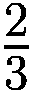，因此从内容组成上看，它们被视为相似。因此，具有高余弦相似度的文档通常被认为是本质相似的。

假设我们有两个句子：

![Doc1=\left[ The\; dog\; chased\kern0.17em the\; cat\right] ](img/448418_2_En_4_Chapter/448418_2_En_4_Chapter_TeX_Equb.png)

![Doc2=\left[\kern0.5em The\kern0.5em cat\kern0.5em was\kern0.17em chased\kern0.17em down\kern0.5em by\kern0.5em the\kern0.5em dog\right] ](img/448418_2_En_4_Chapter/448418_2_En_4_Chapter_TeX_Equc.png)

这两个句子中不同单词的数量将是此问题的向量空间维度。不同的单词有 *The*，*dog*，*chased*，*the*，*cat*，*down*，*by* 和 *was*，因此我们可以将每个文档表示为一个包含单词计数的八维向量。

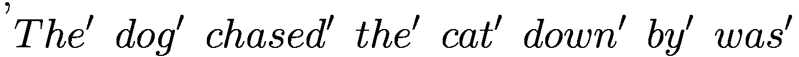

![Doc1=\left[1\ 1\ 1\ 1\ 1\ 0\ 0\ 0\right] ](img/448418_2_En_4_Chapter/448418_2_En_4_Chapter_TeX_Eque.png)

![Doc2=\left[1\ 1\ 1\ 1\ 1\ 1\ 1\ 1\right] ](img/448418_2_En_4_Chapter/448418_2_En_4_Chapter_TeX_Equf.png)

如果我们用 *v*[1] 表示 *Doc*1，用 *v*[2] 表示 *Doc*2，那么余弦相似度可以表示如下：

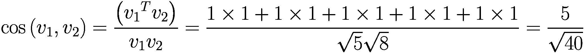

其中，||*v*[1]|| 是向量 *v*[1] 的模或 *l*² 范数。

如前所述，余弦相似度基于每个向量的分量组成来衡量相似度。如果文档向量的分量在某种程度上比例相似，余弦距离会较高。它不考虑向量的模。

在某些情况下，当文档长度高度不同时，取文档向量之间的点积而不是余弦相似度。这是在比较文档内容的同时，也对比文档的大小时进行的。例如，我们可以有一个包含单词 *global* 和 *economics* 的推文，其中这两个单词的词频分别为 1 和 2，而一篇报纸文章中相同的单词的词频可能分别为 50 和 100。假设两个文档中的其他单词的词频都不重要，推文和报纸文章之间的余弦相似度将接近 1。由于推文的大小显著较小，*global* 和 *economics* 的词频比例 1:2 并不真正等同于报纸文章中这些单词的 1:2 比例。因此，对于许多应用来说，将如此高的相似度赋予这些文档并没有太多意义。在这种情况下，将点积作为相似度度量而不是余弦相似度是有帮助的，因为它通过两个文档的词向量的大小来放大余弦相似度。对于可比的余弦相似度，具有更高大小的文档会有更高的点积相似度，因为它们有足够的文本来证明它们的词组成。小文本的词组成可能只是偶然，并不真正代表其意图的表达。

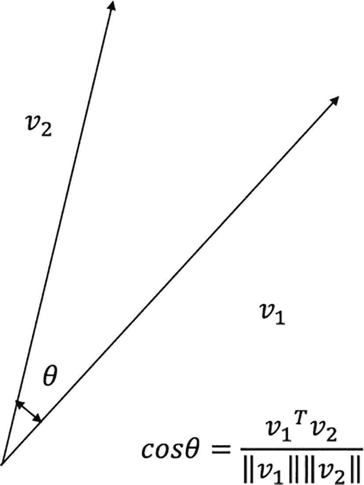

acute angle theta 的表示。v1 和 v2 代表角度的两边。图像还显示了 cos theta 公式。

图 4-1

两个词向量之间的余弦相似度

图 4-1 展示了两个向量 *v*[1] 和 *v*[2]，它们之间的余弦相似度是它们之间角度 *θ* 的余弦值。

有时，使用余弦相似度的距离对应物是有意义的。余弦距离定义为需要计算距离的原向量的单位向量之间的欧几里得距离的平方。对于两个向量 *v*[1] 和 *v*[2]，它们之间的角度为 *θ*，余弦距离由 2(1 - cos *θ*) 给出。

这可以通过取单位向量 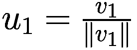 和 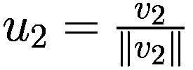 之间的欧几里得距离的平方来轻松推导，如图所示：

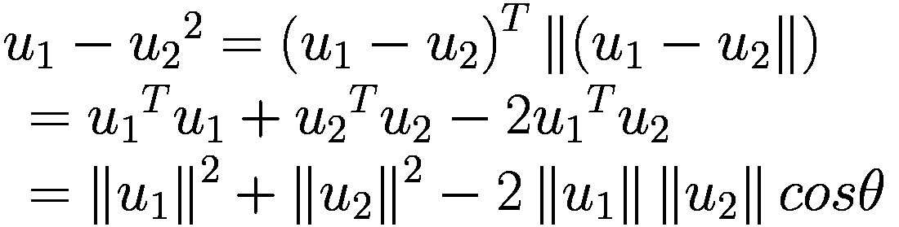

现在，由于*u*[1]和*u*[2]是单位向量，它们的模||*u*[1]||和||*u*[2]||分别都等于 1，因此

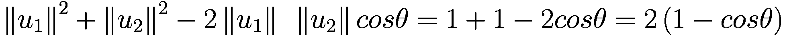

通常情况下，在处理文档词频向量时，不会直接使用原始的词/词数，而是通过单词在语料库中的使用频率进行归一化。例如，单词“the”在任何语料库中都是高频出现的，因此它在两份文档中的计数可能很高。这种对“the”的高频计数可能会增加余弦相似度，而我们知道这个单词在任何语料库中都是高频出现的，应该对文档相似性贡献很小。在文档词频向量中，这类单词的计数会通过一个称为“逆文档频率”的因子进行惩罚。

对于一个在文档*d*中出现了*n*次的术语词*t*，在语料库中的*M*个文档中出现在*N*个文档中，应用逆文档频率后的归一化计数如下：

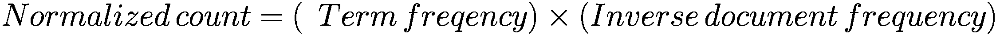

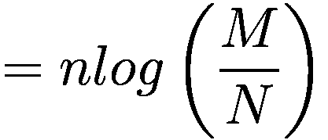

如我们所见，随着*N*相对于*M*的增加，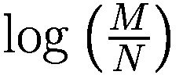这一部分会逐渐减小，直到*M*等于*N*时为零。因此，如果一个单词在语料库中非常流行，那么它对单个文档词频向量就不会有太大的贡献。一个在文档中频率高但在整个语料库中频率较低的单词会对文档词频向量有更大的贡献。这种归一化方案通常被称为*tf*−*idf*，它是词频逆文档频率的简写形式。通常，为了实际应用，将(*N* + 1)作为分母以避免使*对数*函数未定义的零值。因此，逆文档频率可以重新表述为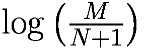

归一化方案甚至应用于词语频率 *n*，使其非线性。一种流行的归一化方案是 BM25，其中对于小的 *n* 值，文档频率的贡献是线性的，然后随着 *n* 的增加，贡献趋于饱和。在 BM25 中，词语频率的归一化如下：

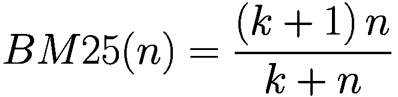

其中 *k* 是一个参数，它为不同的 *k* 值提供不同的形状，并且需要根据语料库来优化 *k*。

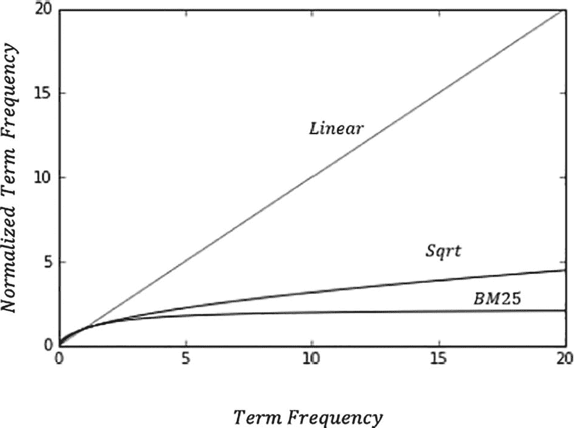

词语频率与归一化词语频率之间的关系在图中表示。图显示了一个对角线绘制的线性图。

图 4-2

不同方法的归一化词语频率与词语频率对比

在图 4-2 中，不同归一化方案的归一化词语频率与词语频率进行了对比。平方根变换使得依赖关系变为次线性，而 *k* = 1.2 的 BM25 图非常激进，曲线在词语频率超过 5 后趋于饱和。如前所述，*k* 可以通过交叉验证或其他基于问题需求的方法进行优化。

## 单词的向量表示

正如文档可以用不同单词计数的向量来表示一样，语料库中的一个单词也可以表示为一个向量，其分量是每个文档中的单词计数。

将单词表示为向量的其他方法是将特定于文档集的分量设置为 1，如果单词存在于文档中，或者设置为 0，如果单词不存在于文档中。

![$$ {\displaystyle \begin{array}{l}\space \space {}^{\hbox{'}} Th{e}^{\prime}\; do{g}^{\prime}\; chase{d}^{\prime}\; th{e}^{\prime}\; ca{t}^{\prime}\; do w{n}^{\prime}\;b{y}^{\prime}\; wa{s}^{\prime}\\ {} Doc11=\space \left[1\kern0.5em 1\kern0.5em 1\kern0.5em 1\kern0.5em 1\kern0.5em 0\kern0.5em 0\kern0.5em 0\right]\in {{\mathbb{R}}}^{8\times 1}\\ {} Doc12=\space \left[1\kern0.5em 1\kern0.5em 1\kern0.5em 1\kern0.5em 1\kern0.5em 1\kern0.5em 1\kern0.5em 1\right]\in {{\mathbb{R}}}^{8\times 1}\end{array}} $$](img/448418_2_En_4_Chapter/448418_2_En_4_Chapter_TeX_Equm.png)

重复使用相同的例子，单词 *The* 可以在两个文档的语料库中表示为二维向量 [1 1] ^(*T*)。在一个巨大的文档语料库中，单词向量的维度也会很大。像文档相似度一样，单词相似度可以通过余弦相似度或点积来计算。

在语料库中表示单词的另一种方式是对它们进行 one-hot 编码。在这种情况下，每个单词的维度将是语料库中唯一单词的数量。每个单词将对应一个索引，该索引将被设置为 1，用于该单词，而所有其他剩余条目将被设置为 0。因此，每个向量都会非常稀疏。即使相似的单词也会在不同的索引上设置条目为 1，因此任何类型的相似度度量都不会起作用。

为了更好地表示词向量，以便更有意义地捕捉词的相似性，并降低词向量的维度，引入了 Word2Vec。

## Word2Vec

Word2Vec 是一种通过将单词与其邻近单词作为上下文进行训练，将单词表示为向量的智能方法。与给定单词在上下文中相似的单词，当考虑它们的 Word2Vec 表示时，会产生高余弦相似度或点积。

通常，语料库中的单词会根据其邻近的单词进行训练，以推导出 Word2Vec 表示的集合。提取 Word2Vec 表示的最流行的方法是 CBOW（连续词袋）方法和 Skip-gram 方法。CBOW 的核心思想在图 4-3 中表达。

### 连续词袋（CBOW）

CBOW 方法试图从特定窗口长度的邻近单词的上下文中预测中心词。让我们看看以下句子，并考虑一个窗口长度为 5 的邻域。

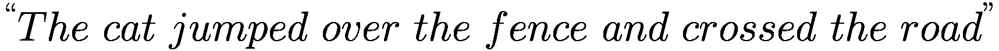

在第一种情况下，我们将尝试从其邻域 ***The cat over the*** 中预测单词 ***jumped***。在第二种情况下，当我们滑动窗口一个位置时，我们将尝试从邻近单词 ***cat jumped the fence*** 中预测单词 ***over***。这个过程将在整个语料库中重复进行。

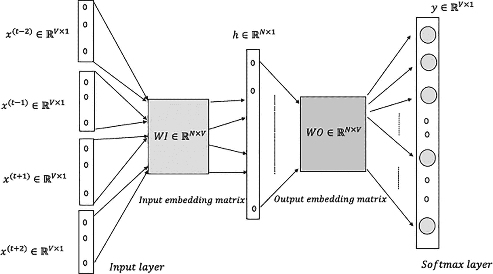

连续词袋模型（CBOW）的示意图。输入层和 softmax 层分别位于输入和输出嵌入矩阵的两侧。

图 4-3

词嵌入的连续词袋模型

如图 4-3 所示，连续词袋模型（CBOW）是在上下文单词作为输入和中心词作为输出的情况下进行训练的。输入层的单词表示为独热编码向量，其中特定单词的分量设置为 1，所有其他分量设置为 0。语料库中独特的单词数量 *V* 决定了这些独热编码向量的维度，因此 *x*^((*t*)) ∈ *R*^(*V* × 1)。每个独热编码向量 *x*^((*t*)) 都与输入嵌入矩阵 *WI* ∈ *R*^(*N* × *V*) 相乘，以提取特定于该单词的词嵌入向量 *u*^((*k*)) ∈ *R*^(*N* × 1)。*u*^((*k*)) 中的索引 *k* 表示 *u*^((*k*)) 是词汇表中第 *k* 个单词的嵌入词。隐藏层向量 *h* 是窗口中所有上下文单词的输入嵌入向量的平均值，因此 *h* ∈ *R*^(*N* × 1) 与词嵌入向量具有相同的维度。

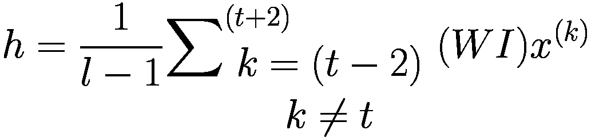

其中 *l* 是窗口大小的长度。

为了清晰起见，让我们假设我们有一个包含六个单词的词汇表——即 *V* = 6——单词包括 *cat*，*rat*，*chased*，*garden*，*the* 和 *was*。

让它们的独热编码按照顺序占据索引，以便它们可以表示如下：

![x_cat=[1 0 0 0 0 0] x_rat=[0 1 0 0 0 0] x_chased=[0 0 1 0 0 0] x_garden=[0 0 0 1 0 0] x_the=[0 0 0 0 1 0] x_was=[0 0 0 0 0 1]](img/448418_2_En_4_Chapter/448418_2_En_4_Chapter_TeX_Equp.png)

让输入嵌入表示为如下，其中每个单词的嵌入向量维度为 5：

![cat rat chased garden the was WI=[0.5 0.3 0.1 0.01 0.2 0.2

一旦我们将单词嵌入矩阵乘以单词的一个-hot 编码向量，我们就可以得到该单词的单词嵌入向量。因此，通过将 *cat* 的一个-hot 向量（即 *x*[*cat*]）乘以输入嵌入矩阵 *WI*，我们就可以得到 *WI* 矩阵的第一列，该列对应于猫，如下所示：

![\[WI\]\[{x}_{cat}\]=\[begin{array}{cccccc}0.5& 0.3& 0.1& 0.01& 0.2& 0.2\\ {}0.7& 0.2& 0.1& 0.02& 0.3& 0.3\\ {}0.9& 0.7& 0.3& 0.4& 0.4& 0.33\\ {}0.8& 0.6& 0.3& 0.53& 0.91& 0.4\\ {}0.6& 0.5& 0.2& 0.76& 0.6& 0.5\end{array}\]\[begin{array}{c}1\\ {}0\\ {}0\\ {}0\\ {}0\\ {}0\end{array}\]=\[begin{array}{c}0.5\\ {}0.7\\ {}0.9\\ {}0.8\\ {}0.6\end{array}\]](img/448418_2_En_4_Chapter/448418_2_En_4_Chapter_TeX_Equr.png)

![\[begin{array}{c}0.5\\ {}0.7\\ {}0.9\\ {}0.8\\ {}0.6\end{array}\]](img/448418_2_En_4_Chapter/448418_2_En_4_Chapter_TeX_IEq6.png) 是单词 *cat* 的单词嵌入向量。

同样，提取所有输入单词的单词嵌入向量，它们的平均值是隐藏层的输出。

隐藏层 *h* 的输出应该表示目标单词的嵌入。

词汇表中的所有单词在输出嵌入矩阵 *WO* ∈ *R*^(*V* × *N*) 中都有一组单词嵌入。*WO* 中的单词嵌入可以用 *v*^((*j*)) ∈ *R*^(*N* × 1) 表示，其中索引 *j* 表示词汇表中按顺序维护的 *jth* 个单词，无论是在 one-hot 编码方案还是在输入嵌入矩阵中。

![\[WO=\left[\begin{array}{c}{v}^{(1)T}\to \\ {}{v}^{(2)T}\to \\ {.\\ {}{v}^{(j)T}\to \\ {.\\ {}{v}^{(V)T}\to \end{array}\right]} \]](img/448418_2_En_4_Chapter/448418_2_En_4_Chapter_TeX_Equs.png)

隐藏层嵌入 *h* 与每个 *v*^((*j*)) 的点积是通过将矩阵 *WO* 乘以 *h* 来计算的。众所周知，点积将为每个输出单词嵌入 *v*^((*j*)) ∀ *j* ∈ {1, 2, …., *N*} 和隐藏层计算的嵌入 *h* 提供相似度度量。点积通过 SoftMax 归一化为概率，并且基于目标单词 *w*^((*t*))，计算并反向传播分类交叉熵损失，以更新输入和输出嵌入矩阵的权重。

SoftMax 层的输入可以表示如下：

![\[WO\]\[h\]=\[begin{array}{c}{v}^{(1)T}\to \\ {}{v}^{(2)T}\to \\ {.\\ {}{v}^{(j)T}\to \\ {.\\ {}{v}^{(V)T}\to \end{array}\right]\[h\]=\[begin{array}{c}{v}^{(1)T}h\;{v}^{(2)T}h\dots .\kern1em {v}^{(j)T}h\;{v}^{(V)T}h\right]}](img/448418_2_En_4_Chapter/448418_2_En_4_Chapter_TeX_Equt.png)

在给定上下文单词的情况下，词汇 *w*^((*j*)) 的 *jth* 单词的 SoftMax 输出概率如下所示：

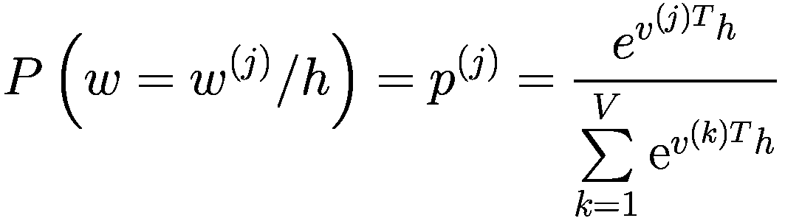

如果实际输出由一个 one-hot 编码的向量 *y* = [ *y*[1]*y*[2]… *y*[*j*]… *y*[*v*]]^(*T*) ∈ *R*^(*V* × 1) 表示，其中只有一个 *y*[*j*] 是 1（即 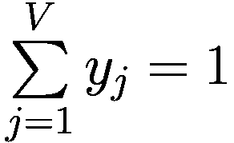 ），那么特定目标单词及其上下文的损失函数可以表示如下：

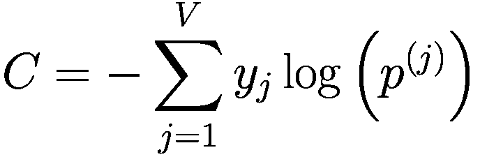

不同的 *p*^((*j*)) 值取决于输入和输出嵌入，这些是成本函数 *C* 的参数。可以通过反向传播梯度下降技术来最小化这些嵌入参数。

为了使这更直观，让我们假设我们的目标变量是`cat`。如果隐藏层向量 *h* 与`cat`的外部矩阵单词嵌入向量的点积最大，而与其他外部单词嵌入向量的点积较低，那么嵌入向量大致正确，并且很少的错误或对数损失会反向传播以纠正嵌入矩阵。然而，假设 *h* 与`cat`的点积较小，而与其他外部嵌入向量的点积较大；SoftMax 的损失将显著增加，因此将反向传播更多的错误/对数损失以减少错误。

### TensorFlow 中的连续词袋实现

本节已展示了连续词袋的 TensorFlow 实现。使用距离两侧各两个单词的邻近单词来预测中间单词。输出层是对整个词汇表的大 SoftMax。单词嵌入向量的大小被选为 128。详细的实现概述在列表 4-1a 中。另请参阅图 4-4。

```py
import tensorflow as tf
print(tf.__version__)
import numpy as np
from tensorflow.keras import Model, layers
import time
from sklearn.manifold import TSNE
import matplotlib.pyplot as plt
%matplotlib inline
emb_dims = 128
#-------------------------------------------------
# to one hot the words
#------------------------------------------------
def one_hot(ind,vocab_size):
rec = np.zeros(vocab_size)
rec[ind] = 1
return rec
#----------------------------------------------------
# Create training data
#----------------------------------------------------
def create_training_data(corpus_raw,WINDOW_SIZE = 2):
words_list = []
for sent in corpus_raw.split('.'):
for w in sent.split():
if w != '.':
words_list.append(w.split('.')[0])   # Remove if delimiter is tied to the end of a word
words_list = set(words_list)    # Remove the duplicates for each word
word2ind = {}    # Define the dictionary for converting a word to index
ind2word = {}    # Define dictionary for retrieving a word from its index
vocab_size = len(words_list)   # Count of unique words in the vocabulary
for i,w in enumerate(words_list):   # Build the dictionaries
word2ind[w] = i
ind2word[i] = w
#print(word2ind)
sentences_list = corpus_raw.split('.')
sentences = []
for sent in sentences_list:
sent_array = sent.split()
sent_array = [s.split('.')[0] for s in sent_array]
sentences.append(sent_array)    # finally sentences would hold arrays of word array for sentences
data_recs = []   # Holder for the input output record
for sent in sentences:
for ind,w in enumerate(sent):
rec = []
for nb_w in sent[max(ind - WINDOW_SIZE, 0) : min(ind + WINDOW_SIZE, len(sent)) + 1] :
if nb_w != w:
rec.append(nb_w)
data_recs.append([rec,w])
x_train,y_train = [],[]
for rec in data_recs:
input_ = np.zeros(vocab_size)
for i in range(len(rec[0])):
input_ += one_hot(word2ind[ rec[0][i] ], vocab_size)
input_ = input_/len(rec[0])
x_train.append(input_)
y_train.append(one_hot(word2ind[ rec[1] ], vocab_size))
return x_train,y_train,word2ind,ind2word,vocab_size
class CBOW(Model):
def __init__(self,vocab_size,embedding_size):
super(CBOW,self).__init__()
self.vocab_size = vocab_size
self.embedding_size = embedding_size
self.embedding_layer = layers.Dense(self.embedding_size) # input is vocab_size: vocab_size x embedding_size
self.output_layer = layers.Dense(self.vocab_size) # embedding_size x vocab size
def call(self,x):
x = self.embedding_layer(x)
x = self.output_layer(x)
return x
def shuffle_train(X_train,y_train):
num_recs_train = X_train.shape[0]
indices = np.arange(num_recs_train)
np.random.shuffle(indices)
return X_train[indices],y_train[indices]
def train_embeddings(training_corpus,epochs=100,lr=0.01,batch_size=32,embedding_size=32):
training_corpus = (training_corpus).lower()
#----------------------------------------------------------------------
# Invoke the training data generation the corpus data
#----------------------------------------------------------------------
X_train,y_train,word2ind,ind2word,vocab_size= create_training_data(training_corpus,2)
print(f"Vocab size: {vocab_size}")
X_train = np.array(X_train)
y_train = np.array(y_train)
model = CBOW(vocab_size=vocab_size,embedding_size=embedding_size)
model_graph = tf.function(model)
loss_fn = tf.keras.losses.CategoricalCrossentropy(from_logits=True,reduction=tf.keras.losses.Reduction.SUM)
optimizer = tf.keras.optimizers.Adam(lr)
num_train_recs = X_train.shape[0]
num_batches = num_train_recs // batch_size
loss_trace , accuracy_trace = [],[]
start_time = time.time()
for i in range(epochs):
loss = 0
X_train, y_train = shuffle_train(X_train,y_train)
for j in range(num_batches):
X_train_batch = tf.constant(X_train[j * batch_size:(j + 1) * batch_size], dtype=tf.float32)
y_train_batch = tf.constant(y_train[j * batch_size:(j + 1) * batch_size])
with tf.GradientTape() as tape:
y_pred_batch = model_graph(X_train_batch,training=True)
loss_ = loss_fn(y_train_batch, y_pred_batch)
# compute gradient
gradients = tape.gradient(loss_, model.trainable_variables)
# update the parameters
optimizer.apply_gradients(zip(gradients, model.trainable_variables))
loss += loss_.numpy()
loss /= num_train_recs
loss_trace.append(loss)
if i % 5 == 0:
print(f"Epoch {i} : loss: {np.round(loss, 4)}  \n")
embeddings =  model_graph.embedding_layer.get_weights()[0]
print(f"Emeddings shape : {embeddings.shape} ")
return embeddings,ind2word
Listing 4-1a
Continuous Bag of Words Implementation in TensorFlow
```

training_corpus = “深度学习从 20 世纪 40 年代以来的人工神经网络演变而来。神经网络是由称为人工神经元的处理单元组成的互联网络，这些人工神经元松散地模仿生物大脑中的轴突。在生物神经元中，树突从各种相邻神经元接收输入信号，通常大于 1000。这些修改后的信号随后传递到神经元的细胞体或胞体，在这些地方，这些信号被相加，然后传递到神经元的轴突。如果接收到的输入信号超过指定的阈值，轴突将释放一个信号，该信号再次传递到其他神经元的相邻树突。图 2-1 展示了生物神经元的结构，供参考。人工神经元单元是从生物神经元中受到启发，并根据便利性进行了一些修改。与树突类似，连接到神经元的输入连接携带来自其他相邻神经元的衰减或放大输入信号。信号传递到神经元，在那里输入信号被相加，然后根据接收到的总输入决定输出什么。例如，对于二元阈值神经元，当总输入超过预定义的阈值时，输出值为 1；否则，输出保持在 0。在人工神经网络中使用了多种其他类型的神经元，它们的实现仅与产生神经元输出的激活函数有关。在图 2-2 中，人工神经元中的不同生物等效物被标记出来，以便于类比和解释。”

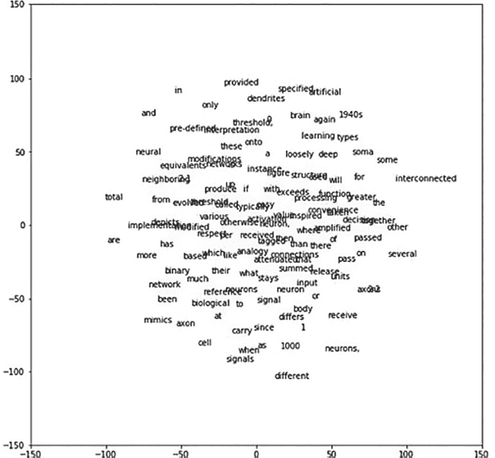

T N S E 图形显示各种单词的图表。描述各种功能的单词存在于图表中。

图 4-4

从 CBOW 学习到的词嵌入向量的 TSNE 图

```py
embeddings,ind2word =  train_embeddings(training_corpus)
W_embedded = TSNE(n_components=2).fit_transform(embeddings)
plt.figure(figsize=(9,9))
for i in range(len(W_embedded)):
plt.text(W_embedded[i,0],W_embedded[i,1],ind2word[i])
plt.xlim(-9,9)
plt.ylim(-9,9)
print("TSNE plot of the CBOW based Word Vector Embeddings")
--output—
2.9.1
Vocab size: 128
Epoch 95 : loss: 0.0105
```

通过 TSNE 图将学习到的单词嵌入投影到二维平面上。TSNE 图给出了给定单词邻域的大致概念。我们可以看到，学习到的单词嵌入向量是合理的。例如，单词*deep*和*learning*彼此非常接近。同样，单词*biological*和*reference*也彼此非常接近。

### 词嵌入的 Skip-Gram 模型

Skip-gram 模型的工作方式相反。不是像在连续词袋模型中那样试图根据上下文词预测当前词，在 Skip-gram 模型中，上下文词是基于当前词进行预测的。一般来说，给定一个当前词，上下文词是在每个窗口中其邻域内的词。对于一个包含五个词的给定窗口，需要根据当前词预测四个上下文词。图 4-5 展示了 Skip-gram 模型的高级设计。与连续词袋模型类似，在 Skip-gram 模型中，需要学习两套词嵌入：一套用于输入词，另一套用于输出上下文词。Skip-gram 模型可以看作是一个反向的连续词袋模型。

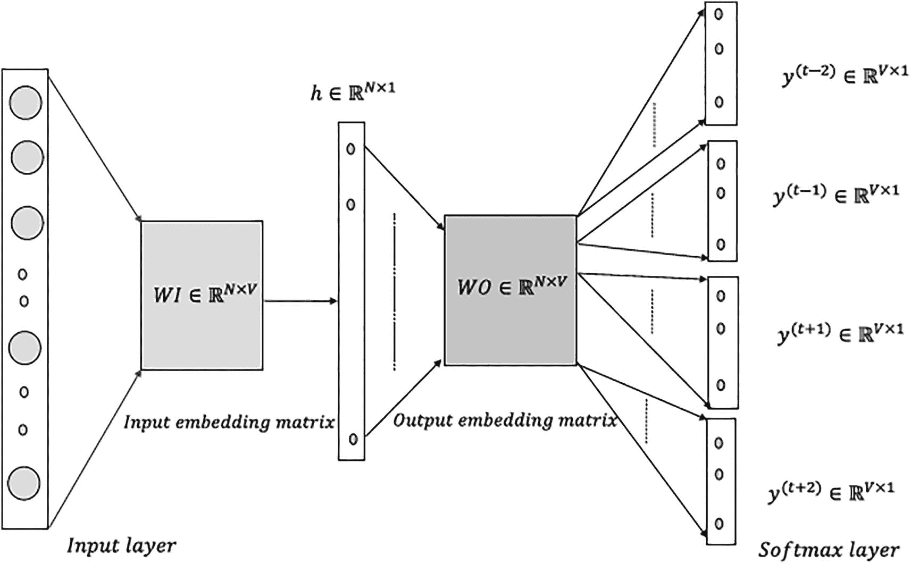

Skip-gram 模型示意图。流程图的四个主要步骤是输入层、输入嵌入矩阵、输出嵌入矩阵和 Softmax 层。

图 4-5

词嵌入的 Skip-gram 模型

在 CBOW 模型中，模型的输入是当前词的一个 one-hot 编码向量*x*^((*t*))∈ℝ^(*V* × 1)，其中*V*是语料库词汇的大小。然而，与 CBOW 不同，这里的输入是当前词而不是上下文词。当*x*^((*t*))乘以输入词嵌入矩阵*WI*时，会产生词嵌入向量*u*^((*k*))∈ℝ^(*N* × 1)，其中*x*^((*t*))代表词汇列表中的*k*th 个词。*N*，如前所述，代表词嵌入的维度。隐藏层输出*h*仅仅是*u*^((*k*)).

隐藏层输出*h*与外层嵌入矩阵*WO*∈R^(*V* × *N*)中每个词向量*v*^((*j*))的点积是通过计算[*WO*][*h*]来计算的，就像在 CBOW 中一样。然而，与一个 SoftMax 输出层不同，根据我们将要预测的上下文词的数量，存在多个 SoftMax 层。例如，在图 4-5 中，有四个 SoftMax 输出层，对应于四个上下文词。每个 SoftMax 层的输入是[*WO*][*h*]中的相同点积集合，表示输入词与词汇表中每个词的相似程度。

![$$ \left[ WO\right]\left[h\right]=\left[{v}^{(1)^T}h\kern1em {v}^{(2)^T}h\dots {v}^{(j)^T}h..{v}^{(V)^T}h\right] $$](img/448418_2_En_4_Chapter/448418_2_En_4_Chapter_TeX_Equw.png)

同样，所有 SoftMax 层都会接收到对应于所有词汇词的相同概率集合。给定当前词或中心词*w*^((*k*))，第*j*个词*w*^((*j*))的概率由以下给出：

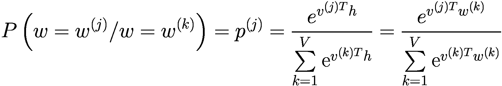

如果有四个目标词，并且它们的独热编码向量分别表示为 *y*^((*t* − 2)), *y*^((*t* − 1)), *y*^((*t* + 1)), *y*^((*t* + 2)) ∈ *R*^(*V* × 1)，那么词组合的总损失函数 *C* 将是所有四个 SoftMax 损失的总和，如下所示：

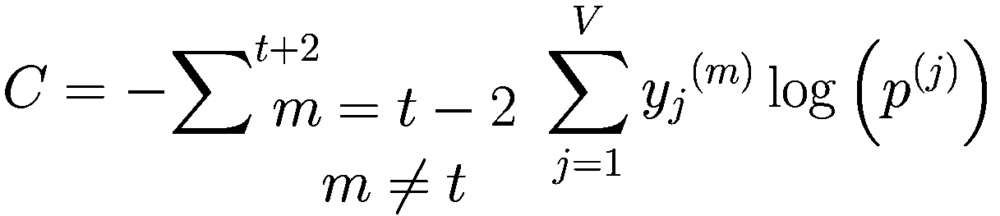

使用反向传播的梯度下降可以用来最小化成本函数并推导输入和输出嵌入矩阵的成分。

关于 Skip-gram 和 CBOW 模型的几个显著特点：

+   对于 Skip-gram 模型，窗口大小通常不是固定的。给定一个最大窗口大小，每个当前词的窗口大小是随机选择的，使得较小的窗口比较大的窗口更频繁地被选择。使用 Skip-gram，可以从有限量的文本中生成大量的训练样本，并且不常见词和短语也得到了很好的表示。

+   CBOW 的训练速度比 Skip-gram 快得多，并且对于常见词的准确性略高。

+   Skip-gram 和 CBOW 都会查看局部窗口中的词共现情况，然后尝试预测中心词的上下文词（如 Skip-gram 所做的那样）或从上下文词预测中心词（如 CBOW 所做的那样）。因此，基本上，在 Skip-gram 中，我们观察到在每个窗口的局部范围内，上下文词 *w*[*c*] 和当前词 *w*[*t*] 的共现概率 *P*(*w*[*c*]/*w*[*t*]) 被假定为与它们词嵌入向量的点积的指数成正比。例如，

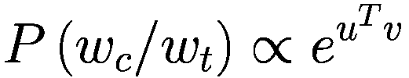

+   其中 *u* 和 *v* 分别是当前词和上下文词的输入和输出词嵌入向量。由于共现是在局部测量的，因此这些模型未能利用一定窗口长度内词对的全球共现统计信息。接下来，我们将探讨一种基本方法来查看语料库中的全局共现统计信息，然后使用奇异值分解（SVD）生成词向量。

### TensorFlow 中的 Skip-Gram 实现

在本节中，我们将使用 TensorFlow 实现来展示学习词向量嵌入的 Skip-gram 模型。该模型在一个小型数据集上训练，以便于表示。然而，该模型可以用于训练所需的大型语料库。如图 2-2 所示，该模型被训练为一个分类网络。然而，我们更感兴趣的是词嵌入矩阵，而不是单词的实际分类。词嵌入的大小被选为 128。详细的代码在列表 4-1b 中表示。一旦学习到词嵌入向量，它们将通过 TSNE 投影到二维表面上，以便于视觉解释。

```py
import numpy as np
import tensorflow as tf
from sklearn.manifold import TSNE
import matplotlib.pyplot as plt
%matplotlib inline
from sklearn.manifold import TSNE
import matplotlib.pyplot as plt
%matplotlib inline
#------------------------------------------------------------
# Function to one hot encode the words
#------------------------------------------------------------
def one_hot(ind,vocab_size):
rec = np.zeros(vocab_size)
rec[ind] = 1
return rec
#-----------------------------------------------------
# Function to create the training data from the corpus
#-----------------------------------------------------
def create_training_data(corpus_raw,WINDOW_SIZE = 2):
words_list = []
for sent in corpus_raw.split('.'):
for w in sent.split():
if w != '.':
words_list.append(w.split('.')[0])   # Remove if delimiter is tied to the end of a word
words_list = set(words_list)   # Remove the duplicates for each word
word2ind = {}       # Define the dictionary for converting a word to index
ind2word = {}       # Define dictionary for retrieving a word from its index
vocab_size = len(words_list)    # Count of unique words in the vocabulary
for i,w in enumerate(words_list):  # Build the dictionaries
word2ind[w] = i
ind2word[i] = w
sentences_list = corpus_raw.split('.')
sentences = []
for sent in sentences_list:
sent_array = sent.split()
sent_array = [s.split('.')[0] for s in sent_array]
sentences.append(sent_array)    # finally sentences would hold arrays of word array for sentences
data_recs = []     # Holder for the input output record
for sent in sentences:
for ind,w in enumerate(sent):
for nb_w in sent[max(ind - WINDOW_SIZE, 0) : min(ind + WINDOW_SIZE, len(sent)) + 1] :
if nb_w != w:
data_recs.append([w,nb_w])
x_train,y_train = [],[]
#print(data_recs)
for rec in data_recs:
x_train.append(one_hot(word2ind[ rec[0] ], vocab_size))
y_train.append(one_hot(word2ind[ rec[1] ], vocab_size))
return x_train,y_train,word2ind,ind2word,vocab_size
class SkipGram(Model):
def __init__(self,vocab_size,embedding_size):
super(SkipGram,self).__init__()
self.vocab_size = vocab_size
self.embedding_size = embedding_size
self.embedding_layer = layers.Dense(self.embedding_size) # input is vocab_size: vocab_size x embedding_size
self.output_layer = layers.Dense(self.vocab_size) # embedding_size x vocab size
def call(self,x):
x = self.embedding_layer(x)
x = self.output_layer(x)
return x
def shuffle_train(X_train,y_train):
num_recs_train = X_train.shape[0]
indices = np.arange(num_recs_train)
np.random.shuffle(indices)
return X_train[indices],y_train[indices]
def train_embeddings(training_corpus,epochs=100,lr=0.01,batch_size=32,embedding_size=32):
training_corpus = (training_corpus).lower()
#----------------------------------------------------------------------
# Invoke the training data generation the corpus data
#----------------------------------------------------------------------
X_train,y_train,word2ind,ind2word,vocab_size= create_training_data(training_corpus,2)
print(f"Vocab size: {vocab_size}")
X_train = np.array(X_train)
y_train = np.array(y_train)
model = SkipGram(vocab_size=vocab_size,embedding_size=embedding_size)
model_graph = tf.function(model)
loss_fn = tf.keras.losses.CategoricalCrossentropy(from_logits=True,reduction=tf.keras.losses.Reduction.SUM)
#loss_fn = tf.nn.sampled_softmax_loss(num_sampled=4,
#        num_classes=vocab_size,
#        num_true=1)
optimizer = tf.keras.optimizers.Adam(lr)
num_train_recs = X_train.shape[0]
num_batches = num_train_recs // batch_size
loss_trace , accuracy_trace = [],[]
start_time = time.time()
for i in range(epochs):
loss = 0
X_train, y_train = shuffle_train(X_train,y_train)
for j in range(num_batches):
X_train_batch = tf.constant(X_train[j * batch_size:(j + 1) * batch_size], dtype=tf.float32)
y_train_batch = tf.constant(y_train[j * batch_size:(j + 1) * batch_size])
with tf.GradientTape() as tape:
y_pred_batch = model_graph(X_train_batch,training=True)
loss_ = loss_fn(y_train_batch, y_pred_batch)
# compute gradient
gradients = tape.gradient(loss_, model.trainable_variables)
# update the parameters
optimizer.apply_gradients(zip(gradients, model.trainable_variables))
loss += loss_.numpy()
loss /= num_train_recs
loss_trace.append(loss)
if i % 5 == 0:
print(f"Epoch {i} : loss: {np.round(loss, 4)}  \n")
embeddings =  model_graph.embedding_layer.get_weights()[0]
print(f"Emeddings shape : {embeddings.shape} ")
return embeddings, ind2word
Listing 4-1b
Skip-Gram Implementation in TensorFlow
```

training_corpus = "深度学习从 20 世纪 40 年代以来的人工神经网络演变而来。神经网络是由称为人工神经元的处理单元组成的互联网络，它们松散地模仿生物大脑中的轴突。在生物神经元中，树突从各种相邻神经元接收输入信号，通常大于 1000。然后，这些修改后的信号被传递到神经元的细胞体或 soma，在这些信号被汇总后，再传递到神经元的轴突。如果接收到的输入信号超过指定的阈值，轴突将释放一个信号，该信号再次传递到其他神经元的相邻树突。图 2-1 展示了生物神经元的结构，供参考。人工神经元单元是从生物神经元中受到启发，并根据方便性进行了一些修改。与树突类似，连接到神经元的输入连接携带来自其他相邻神经元的衰减或放大输入信号。信号被传递到神经元，在那里输入信号被汇总，然后根据接收到的总输入决定输出什么。例如，对于二进制阈值神经元，当总输入超过预定义的阈值时，输出值为 1，否则输出保持为 0。人工神经网络中使用了多种其他类型的神经元，它们的实现仅与产生神经元输出的激活函数有关。在图 2-2 中，不同的生物等效体被标记在人工神经元上，以便于类比和解释。"

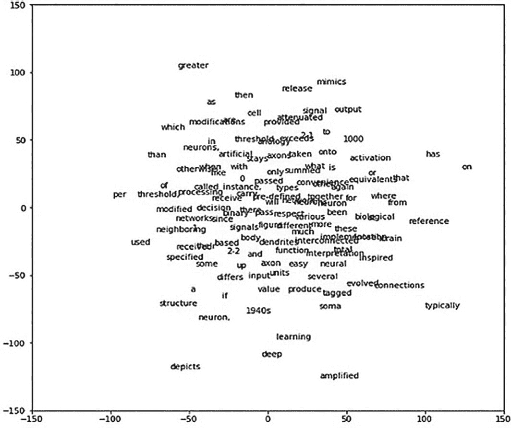

T S N E 图的图表。图表显示了包括神经元、深度、简化、收益等许多单词。

图 4-6

从 Skip-gram 模型学习到的词嵌入向量的 TSNE 图

```py
embeddings, ind2word = train_embeddings(training_corpus)
W_embedded = TSNE(n_components=2).fit_transform(embeddings)
plt.figure(figsize=(10,10))
for i in range(len(W_embedded)):
plt.text(W_embedded[i,0],W_embedded[i,1],ind2word[i])
plt.xlim(-14,14)
plt.ylim(-14,14)
print("TSNE plot of the SkipGram based Word Vector Embeddings")
--output--
Epoch 95 : loss: 2.3412
```

与连续词袋模型中的词嵌入向量类似，从 Skip-gram 方法中学习到的嵌入向量也是合理的。例如，在 Skip-grams 中，单词*deep*和*learning*彼此之间也非常接近，如图 4-6 所示。此外，我们还看到了其他有趣的模式，例如单词*attenuated*与单词*signal*非常接近。

### 基于全局共现统计的词向量

全局共现方法，其中收集了整个语料库中每个窗口内单词共现的全局计数，可以用来推导出有意义的词向量。最初，我们将研究一种通过 SVD（奇异值分解）对全局共现矩阵进行矩阵分解的方法，以推导出单词的有意义低维表示。稍后，我们将探讨用于词向量表示的 GloVe 技术，该技术结合了全局共现统计和 CBOW 以及/或 Skip-gram 的预测方法的最佳之处。

让我们考虑一个语料库：


我们首先收集窗口大小为 1 的每个单词组合的全局共现计数。在处理前面的语料库时，我们将得到一个共现矩阵。同时，我们通过假设每当两个单词*w*[1]和*w*[2]同时出现时，它们将同时贡献概率*P*(*w*[1]/*w*[2])和*P*(*w*[2]/*w*[1])，因此我们将计数桶*c*(*w*[1]/*w*[2])和*c*(*w*[2]/*w*[1])的计数增加 1。术语*c*(*w*[1]/*w*[2])表示单词*w*[1]和*w*[2]的共现，其中*w*[2]作为上下文，*w*[1]作为单词。对于单词出现对，角色可以互换，以便将上下文视为单词，将单词视为上下文。正是出于这个精确的原因，每当遇到共现的单词对(*w*[1], *w*[2])时，计数桶*c*(*w*[1]/*w*[2])和*c*(*w*[2]/*w*[1])都会增加。

在增量计数方面，我们并不总是需要为两个词的共现增加 1。如果我们正在查看一个用于填充共现矩阵的*K*窗口，我们可以定义一个差分加权方案，为距离上下文较近的共现词提供更多权重，并随着距离的增加对其进行惩罚。这样一个加权方案可能是通过增加共现计数器来实现的 ，其中*k*是单词和上下文之间的偏移量。当单词和上下文相邻时，偏移量为 1，共现计数器可以增加 1，而当偏移量在*K*窗口中达到最大时，计数器的增量最小为 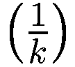。

在生成词向量嵌入的 SVD 方法中，假设单词*w*[i]和上下文*w*[j]之间的全局共现计数*c*(w*[i]/w*[j])可以表示为单词*w*[i]和上下文*w*[j]的词向量嵌入的点积。通常，考虑两组词嵌入，一组用于单词，另一组用于上下文。如果*u*[i]∈R^(D×1)和*v*[i]∈R^(D×1)分别表示语料库中第*i*个单词*w*[i]的词向量和上下文向量，那么共现计数可以表示如下：

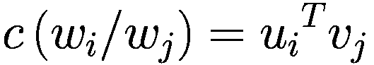

让我们来看一个包含三个单词的语料库，并用单词和上下文向量的点积来表示共现矩阵*X*∈R^(3×3)。进一步，让单词为*w*[i]，∀i={1, 2, 3}，它们对应的词向量和上下文向量分别为*u*[i]，∀i={1, 2, 3}和*v*[i]，∀i={1, 2, 3}，分别。

如我们所见，共现矩阵实际上是两个矩阵的乘积，这两个矩阵分别是单词和上下文的词向量嵌入矩阵。词向量嵌入矩阵*W*∈R^(3×D)和上下文词嵌入矩阵*C*∈R^(D×3)，其中 D 是词和上下文嵌入向量的维度。

既然我们知道词共现矩阵是词向量嵌入矩阵和上下文嵌入矩阵的乘积，我们可以通过任何适用的矩阵分解技术来分解共现矩阵。奇异值分解（SVD）是一个广泛采用的方法，因为它即使矩阵不是方形或对称的也能工作。

正如我们从奇异值分解（SVD）所知，任何矩形矩阵*X*都可以分解为三个矩阵*U*、*Σ*和*V*，使得

![X = [U][Σ][V^T]](img/448418_2_En_4_Chapter/448418_2_En_4_Chapter_TeX_Equac.png)

矩阵 *U* 通常被选作词向量嵌入矩阵 *W*，而 *ΣV*^(*T*) 被选作上下文向量嵌入矩阵 *C*，但没有任何这样的限制，可以选择在给定语料库上表现良好的任何一种。人们完全可以选择 W 为 *UΣ*^(1/2) 和 C 为 *Σ*^(1/2)*V*^(*T*)。通常，基于显著奇异值的数据维度较少，以减少 *U*、*Σ* 和 *V* 的大小。如果 *X* ∈ *R*^(*m* × *n*)，那么 *U* ∈ *R*^(*m* × *m*)。然而，在截断 SVD 中，我们只取数据最大可变性方向上的几个显著方向，忽略其余的作为不显著或噪声。如果我们选择 *D* 维度，新的词向量嵌入矩阵 *U* ^′ ∈ *R*^(*m* × *D*)，其中 *D* 是每个词向量嵌入的维度。

共现矩阵 *X* ∈ *R*^(*m* × *n*) 通常通过一次遍历整个语料库在更广义的设置中获得。然而，由于语料库可能会随着时间的推移获得新的文档或内容，这些新的文档或内容可以增量处理。图 4-7 通过三个步骤说明了词向量或词嵌入的推导过程。

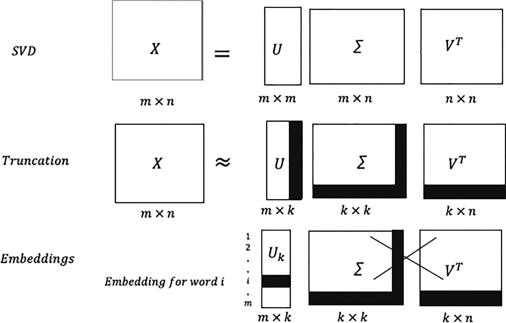

单词嵌入提取示意图。该图展示了奇异值分解（SVD）、截断和嵌入。

图 4-7

通过词共现矩阵的奇异值分解提取词嵌入

+   在第一步中，对共现矩阵 *X* ∈ *R*^(*m* × *n*) 进行奇异值分解（SVD），以产生 *U* ∈ *R*^(*m* × *m*)，其中包含左奇异向量；Σ ∈ *R*^(*m* × *n*)，其中包含奇异值；以及 *V* ∈ *R*^(*n* × *n*)，其中包含右奇异向量。

![$$ {\left[X\right]}_{m\times n}={\left[U\right]}_{m\times m}{\left[\varSigma \right]}_{m\times n}{\left[{V}^T\right]}_{n\times n} $$](img/448418_2_En_4_Chapter/448418_2_En_4_Chapter_TeX_Equad.png)

+   如果我们从以下矩阵开始！[$$ U=\left[{u}_1{u}_{2\space}\kern0.5em {u}_3\dots {u}_m\right],\space \varSigma =\left[\begin{array}{ccc}{\sigma}_1&amp; \cdots &amp; 0\\ {}\vdots &amp; \ddots &amp; \vdots \\ {}0&amp; \cdots &amp; {\sigma}_m\end{array}\right],\space {V}^T=\left[\begin{array}{c}\begin{array}{c}{v_1}^T\to \\ {}{v_2}^T\to \\ {}..\end{array}\\ {}{v_n}^T\to \end{array}\right] $$](img/448418_2_En_4_Chapter/448418_2_En_4_Chapter_TeX_IEq10.png)

+   截断后，我们将有以下内容：

+   通常，对于词到词的共现矩阵，维度 *m* 和 *n* 应该相等。然而，有时不是用词本身表达词，而是用上下文表达词，因此为了泛化，我们采取了单独的 *m* 和 *n*。

+   在第二步中，通过只从 *Σ* 中取 *k* 个解释数据最大可变性的显著奇异值，并通过选择 *U* 和 *V* 中的相应 *k* 个左奇异向量和右奇异向量来近似共现矩阵。

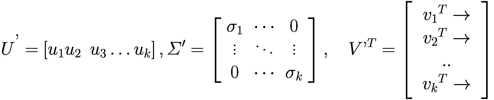

+   在第三步中，丢弃*Σ*′和*V*′^(*T*)，并将矩阵*U* ^′ ∈ *R*^(*m* × 1)取到词向量矩阵。词向量有*k*个密集维度，对应于选择的*k*个奇异值。因此，从稀疏的共现矩阵中，我们得到了词向量嵌入的密集表示。会有*m*个词向量对应于处理过的语料库中的每个单词。

在列表 4-1c 中提到的是通过 SVD 分解不同单词的共现矩阵来从给定语料库构建词向量的逻辑。列表旁边是图 4-8 中推导出的词向量嵌入的图形。

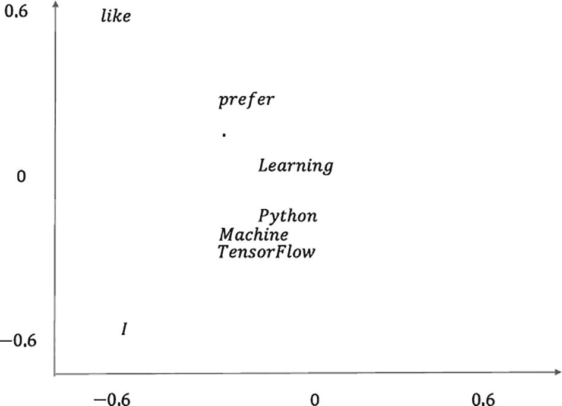

词嵌入图的图形。图中的单词有，喜欢，学习，Python，机器和流。

图 4-8

词向量嵌入图

```py
import numpy as np
import matplotlib.pyplot as plt
corpus = ['I like Machine Learning.','I like TensorFlow.','I prefer Python.']
corpus_words_unique = set()
corpus_processed_docs = []
# Process the documents in the corpus to create the Co-occrence count
for doc in corpus:
corpus_words_ = []
corpus_words = doc.split()
print(corpus_words)
for x in corpus_words:
if len(x.split('.')) == 2:
corpus_words_ += [x.split('.')[0]] + ['.']
else:
corpus_words_ += x.split('.')
corpus_processed_docs.append(corpus_words_)
corpus_words_unique.update(corpus_words_)
corpus_words_unique = np.array(list(corpus_words_unique))
co_occurence_matrix = np.zeros((len(corpus_words_unique),len(corpus_words_unique)))
for corpus_words_ in corpus_processed_docs:
for i in range(1,len(corpus_words_)) :
index_1 = np.argwhere(corpus_words_unique == corpus_words_[i])
index_2 = np.argwhere(corpus_words_unique == corpus_words_[i-1])
co_occurence_matrix[index_1,index_2] += 1
co_occurence_matrix[index_2,index_1] += 1
U,S,V = np.linalg.svd(co_occurence_matrix,full_matrices=False)
print(f'co_occurence_matrix follows:')
print(co_occurence_matrix)
for i in range(len(corpus_words_unique)):
plt.text(U[i,0],U[i,1],corpus_words_unique[i])
plt.xlim((-0.75,0.75))
plt.ylim((-0.75,0.75))
plt.show()
--output--
co_occurence_matrix follows:
[[ 0\.  2\.  0\.  0\.  1\.  0\.  0\.  1.]
[ 2\.  0\.  1\.  0\.  0\.  0\.  0\.  0.]
[ 0\.  1\.  0\.  0\.  0\.  1\.  0\.  0.]
[ 0\.  0\.  0\.  0\.  0\.  1\.  1\.  1.]
[ 1\.  0\.  0\.  0\.  0\.  0\.  1\.  0.]
[ 0\.  0\.  1\.  1\.  0\.  0\.  0\.  0.]
[ 0\.  0\.  0\.  1\.  1\.  0\.  0\.  0.]
[ 1\.  0\.  0\.  1\.  0\.  0\.  0\.  0.]]
Word-Embeddings Plot
Listing 4-1c.
```

即使在这个小语料库中，我们也可以在图 4-8 中看到词向量嵌入的清晰模式。以下是一些发现：

+   常见单词如*I*和*like*与其他单词相距甚远。

+   *机器*，*学习*，*Python*和*TensorFlow*，与不同的学习领域相关联，彼此紧密聚集。

接下来，我们将转向全局向量，通常称为 GloVe，用于生成词向量嵌入。

### GloVe

GloVe 是斯坦福大学提供的预训练、现成的词向量嵌入库。GloVe 的训练方法与 CBOW 和 Skip-gram 的方法显著不同。GloVe 不是基于单词的局部运行窗口进行预测，而是使用语料库中的全局词到词共现统计来训练模型并推导出 GloVe 向量。GloVe 代表*全局向量*。预训练的 GloVe 词向量可在[`https://nlp.stanford.edu/projects/glove/`](https://nlp.stanford.edu/projects/glove/)找到。GloVe 向量的发明者是 Jeffrey Pennington，Richard Socher 和 Christopher D. Manning，他们在论文“GloVe: Global Vectors for Word Representation”中记录了 GloVe 向量。该论文可在[`https://nlp.stanford.edu/pubs/glove.pdf`](https://nlp.stanford.edu/pubs/glove.pdf)找到。

与 SVD 方法类似，GloVe 考虑全局共现统计，但单词和上下文向量与共现计数的关系略有不同。如果有两个单词*w*[*i*]和*w*[*j*]以及一个上下文单词*w*[*k*]，那么概率比*P*(*w*[*k*]/*w*[*i*])和*P*(*w*[*k*]/*w*[*j*])提供了比概率本身更多的信息。

让我们考虑两个单词，*w*[*i*] = "*garden*"和*w*[*j*] = "*market*"，以及一些上下文单词，*w*[*k*] ∈ {"*plants*","*shops*"}. 单个共现概率可能很低；然而，如果我们取共现概率的比例，例如，

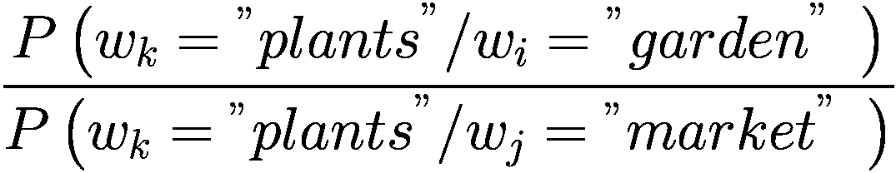

前面的比例将会远大于一，这表明*plants*与*garden*相比，更有可能与*market*相关联。

同样地，让我们考虑*w*[*k*] = "*shops*"，并查看以下共现概率的比例：

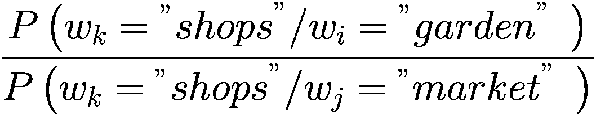

在这种情况下，这个比例将会非常小，这意味着单词*shop*与单词*market*相比，更有可能与单词*garden*相关联。

因此，我们可以看到，共现概率的比例在单词之间提供了更多的区分度。由于我们试图学习单词向量，这种区分度应该通过单词向量的差异来编码，正如在线性向量空间中，这是表示向量之间区分度的最佳方式。同样，在线性向量空间中表示向量之间相似性的最方便方式是考虑它们的点积，因此共现概率可以通过单词和上下文向量之间点积的某个函数很好地表示。考虑到所有这些因素，有助于推导出 GloVe 向量导出的逻辑。

如果*u*[*i*],*u*[*j*]是单词*w*[*i*]和*w*[*j*]的词向量嵌入，而*v*[*k*]是单词*w*[*k*]的上下文向量，那么两个共现概率的比率可以表示为词向量差异（即(*u*[*i*] − *u*[*j*]）和上下文向量*v*[*k*]的某个函数。一个逻辑函数应该作用于词向量差异和上下文向量之间的点积，主要是因为它在函数操作之前保持了向量之间的线性结构。如果我们没有取点积，函数可能会以破坏线性结构的方式作用于向量。基于前面的解释，两个共现概率的比率可以表示如下：

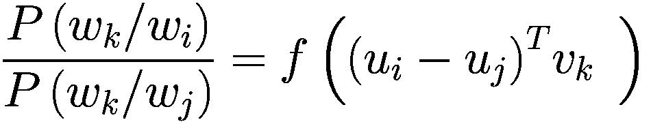

(4.1.1)

在上述表达式中，*f*是我们试图找到的给定函数。

此外，正如所讨论的，共现概率*P*(*w*[*k*]/*w*[*i*])应该通过线性向量空间中向量的某种形式相似性来编码，而完成这一任务的最佳操作是将共现概率表示为词向量*w*[*i*]和上下文向量*w*[*k*]之间点积的某个函数*g*，如下所示：

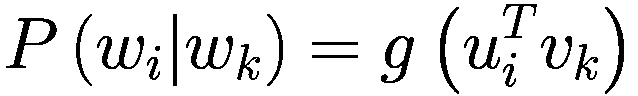

(4.1.2)

结合(4.1.1)和(4.1.2)，我们得到以下结果：

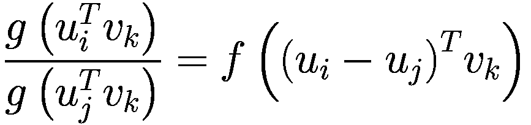

(4.1.3)

现在的任务是确定有意义的函数*f*和*g*，使得前面的方程有意义。如果我们选择*f*和*g*为指数函数，它可以使概率的比值编码词向量之间的差异，同时保持共现概率依赖于点积。向量的点积和差异保持了向量在线性空间中的相似性和区分性。如果*f*和*g*是某种核函数，那么相似性和差异的度量就不会局限于线性向量空间，这将使得词向量的可解释性变得非常困难。

将(4.1.3)中的*f*和*g*替换为指数函数，我们得到以下结果：

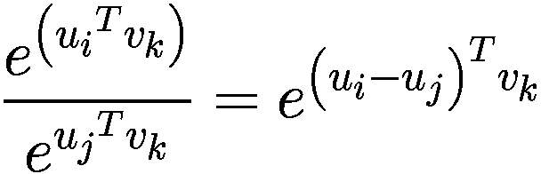

这给我们以下结果：

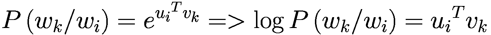

(4.1.4)

对抽象代数中的群论有一定了解的读者可以注意到，函数 *f* (*x*) = *e* ^(*x*) 被选择来定义群 (*R*, +) 和 (*R* > 0, ×) 之间的群同态。

单词 *w*[*i*] 和上下文单词 *w*[*k*] 的共现概率可以表示如下：

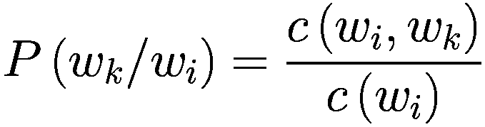

(4.1.5)

其中 *c*(*w*[*i*], *w*[*k*]) 表示单词 *w*[*i*] 与上下文单词 *w*[*k*] 的共现计数，而 *c*(*w*[*i*]) 表示单词 *w*[*i*] 的总出现次数。任何单词的总计数可以通过将其与其他所有单词在语料库中的共现计数相加来计算，如下所示：

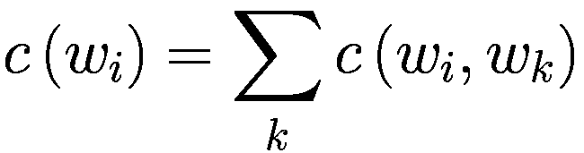

结合 (4.1.4) 和 (4.1.5)，我们得到以下结果：

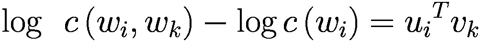

对数 *c*(*w*[*i*]) 可以表示为单词 *w*[*i*] 的偏置 *b*[*i*]，并且还引入了一个额外的偏置 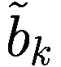 用于单词 *w*[*k*]，以使方程对称。因此，最终的关联关系可以表示如下：

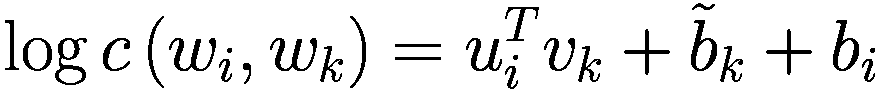

正如我们有两个单词向量嵌入集一样，我们也可以看到两组偏置——一组是由 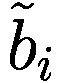 给出的上下文单词的偏置，另一组是由 *b*[*i*] 给出的单词的偏置，其中 *i* 表示语料库中的第 *i* 个单词。

最终目标是使实际 *log c*(*w*[*i*], *w*[*k*]) 和预测的 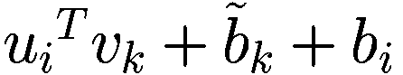 对于所有单词-上下文对之间的平方误差成本函数的总和最小化，如下所示：

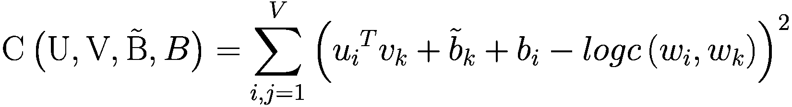

*U* 和 *V* 是词向量嵌入和上下文向量嵌入的参数集。同样，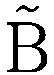 和 *B* 是对应于单词和上下文的偏差参数。成本函数 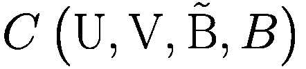 必须相对于这些参数在 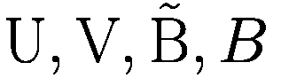 中最小化。

这种最小二乘法方案的一个问题是它在成本函数中对所有共现情况给予相同的权重。这阻止了模型取得好结果，因为罕见的共现携带的信息非常少。处理这个问题的方法之一是为计数较高的共现分配更多的权重。成本函数可以修改为对每个共现对有一个权重组件，该组件是共现计数的函数。修改后的成本函数可以表示如下：

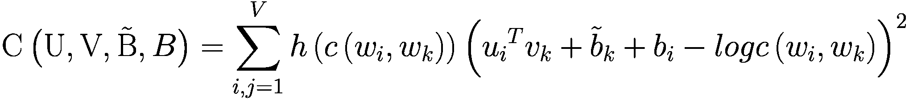

其中 *h* 是新引入的函数。

函数 *h*(*x*)（见图 4-9）可以选择如下：


可以尝试不同的 *α* 值，它作为模型的超参数。


图形显示 x 轴上的 x 最大值和 y 轴上的 x 的 g 值。图的中心点通过一条直线连接到 x 轴。

图 4-9

共现计数的权重函数

### 基于词向量的词类比

词向量嵌入的优点在于其线性化类比的能力。我们查看一些使用预训练的 GloVe 向量在列表 4-2a，4-2b 和 4-2c 中的类比。


二维向量图。图中有两个箭头，一个从男人指向国王，另一个从女人指向王后。

图 4-10

预训练 GloVe 向量的 2D TSNE 向量图

```py
tsne = TSNE(n_components=2)
words_array = []
word_list = ['king','queen','man','woman']
for w in word_list:
words_array.append(embeddings_index[w])
index1 = list(embeddings_index.keys())[0:100]
for i in range(100):
words_array.append(embeddings_index[index1[i]])
words_array = np.array(words_array)
words_tsne = tsne.fit_transform(words_array)
ax = plt.subplot(111)
for i in range(4):
plt.text(words_tsne[i, 0], words_tsne[i, 1],word_list[i])
plt.xlim((50,125))
plt.ylim((0,80))
plt.show()
--output--
Listing 4-2c.
```

```py
# queen - woman +man ~ king
king_wordvec = embeddings_index['king']
queen_wordvec = embeddings_index['queen']
man_wordvec = embeddings_index['man']
woman_wordvec = embeddings_index['woman']
pseudo_king = queen_wordvec - woman_wordvec + man_wordvec
cosine_simi = np.dot(pseudo_king/np.linalg.norm(pseudo_king),king_wordvec/np.linalg.norm(king_wordvec))
print(f"Cosine Similarity: {cosine_simi}")
--output --
Cosine Similarity 0.663537
Listing 4-2b.
```

```py
import numpy as np
import scipy
from sklearn.manifold import TSNE
import matplotlib.pyplot as plt
%matplotlib inline
########################
# Loading glove vector
########################
EMBEDDING_FILE = '/media/santanu/9eb9b6dc-b380-486e-b4fd-c424a325b976/glove.6B.300d.txt'
print('Indexing word vectors')
embeddings_index = {}
f = open(EMBEDDING_FILE)
count = 0
for line in f:
if count == 0:
count = 1
continue
values = line.split()
word = values[0]
coefs = np.asarray(values[1:], dtype='float32')
embeddings_index[word] = coefs
f.close()
print('Found %d word vectors of glove.' % len(embeddings_index))
Listing 4-2a.
```

嵌入文件 glove.6B.300d.txt 可在 [`https://nlp.stanford.edu/projects/glove/`](https://nlp.stanford.edu/projects/glove/) 获取。

在列表 4-2a 中，加载并存储了 300 维度的预训练 GloVe 向量到字典中。我们围绕单词*king*、*queen*、*man*和*woman*的 GloVe 向量进行操作，以寻找类比。通过取单词*queen*、*man*和*woman*的词向量，创建了一个名为*pseudo_king*的词向量，如下所示：


这个想法是看看先前创建的向量是否在一定程度上代表了*king*的概念。词向量*pseudo_king*和*king*之间的角度余弦值在约 0.67 时较高，这表明(*queen* − *woman* + *man*)很好地代表了*king*的概念。

接下来，在列表 4-2c 中，我们尝试表示一个类比，为此，通过 TSNE，我们将 300 维度的 GloVe 向量表示在二维空间中。结果已在图 4-10 中绘制。我们可以看到，*king*和*queen*的词向量彼此靠近并聚集在一起，*man*和*woman*的词向量也聚集在一起。此外，我们还看到，*king*和*man*之间的向量差异以及*queen*和*woman*之间的向量差异几乎平行对齐且长度相当。

在我们继续讨论循环神经网络之前，我想提到的是，在自然语言处理背景下，词嵌入对于循环神经网络的重要性。循环神经网络并不理解文本，因此文本中的每个单词都需要某种形式的数字表示。词嵌入向量是一个很好的选择，因为单词可以通过词嵌入向量的组成部分表示多个概念。循环神经网络可以双向工作，要么提供词嵌入向量作为输入，要么让网络自己学习这些嵌入向量。在后一种情况下，词嵌入向量会更倾向于通过循环神经网络解决的最终问题。然而，有时循环神经网络可能有很多其他参数需要学习，或者网络可能只有很少的数据用于训练。在这种情况下，必须学习词嵌入向量作为参数可能会导致过拟合或次优结果。在这种情况下，使用预训练的词向量嵌入可能是一个更明智的选择。

## 循环神经网络简介

循环神经网络 (RNNs) 是为了利用和从序列信息中学习而设计的。RNN 架构应该对序列的每个元素执行相同的任务，因此其命名中的“循环”一词。由于任何语言中单词的序列依赖性，RNNs 在自然语言处理任务中非常有用。例如，在预测句子中下一个单词的任务中，它之前的序列单词至关重要。通常，在任何序列的时间步中，RNNs 根据其迄今为止的计算计算一些记忆，即先前的记忆和当前输入。这个计算出的记忆用于当前时间步的预测，并将其作为输入传递到下一步。循环神经网络的基本架构原理如图 4-11 所示。


该图展示了 RNN 结构如何按顺序展开以揭示三个步骤。

图 4-11

RNN 的折叠和展开结构

在图 4-11 中，RNN 架构在时间上展开以描绘完整的序列。如果我们希望处理七个单词的句子序列，那么展开的 RNN 架构将代表一个七层前馈神经网络，唯一的区别是每一层的权重是共享的。这显著减少了循环神经网络中需要学习的参数数量。

为了让我们熟悉所使用的符号，*x*[*t*]，*h*[*t*]，和 *o*[*t*] 分别代表在时间步 *t* 时的输入、计算出的记忆或隐藏状态和输出。*W*[*hh*] 代表从时间 *t* 的记忆状态 *h*[*t*] 到时间 (*t* + 1) 的记忆状态 *h*[*t* + 1] 的权重矩阵。*W*[*xh*] 代表从输入 *x*[*t*] 到隐藏状态 *h*[*t*] 的权重矩阵，而 *W*[*ho*] 代表从记忆状态 *h*[*t*] 到 *o*[*t*] 的权重矩阵。当输入以 one-hot 编码形式呈现时，权重矩阵 *W*[*xh*] 起着某种词向量嵌入矩阵的作用。或者，在 one-hot 编码输入的情况下，可以选择有一个可学习的独立的嵌入矩阵，这样当 one-hot 编码的输入向量通过嵌入层时，其期望的嵌入向量作为输出呈现。

现在，让我们详细探讨每个组件：

+   *h*[*t*] = *f* (*W*[*hh*]*h*[*t* − 1] + *W*[*xh*] *x*[*t*])，其中 *f* 是选定的非线性激活函数。

+   (*W*[*hh*]*h*[*t* − 1] + *W*[*xh*] *x*[*t*]) 的维度是 *n*，即 (*W*[*hh*]*h*[*t* − 1] + *W*[*xh*] *x*[*t*]) ∈ ℝ^(*n* × 1)。

+   函数 *f* 对 (*W*[*hh*]*h*[*t* − 1] + *W*[*xh*] *x*[*t*]) 进行逐元素操作以产生 *h*[*t*]，因此 (*W*[*hh*]*h*[*t* − 1] + *W*[*xh*] *x*[*t*]) 和 *h*[*t*] 具有相同的维度。

+   如果 ![$$ {W}_{hh}{h}_{t-1}+{W}_{xh}\kern0.5em {x}_t=\left[\begin{array}{c}{s}_{1t}\\ {}{s}_{2t}\\ {}.\\ {}.\\ {}{s}_{nt}\end{array}\right] $$](img/448418_2_En_4_Chapter/448418_2_En_4_Chapter_TeX_IEq17.png)，那么对于 *h*[*t*] 以下成立：

+   输入 *x*[*t*] 是表示步骤 *t* 的输入单词的向量。例如，它可以是设置词汇表中相应单词索引为 1 的一个-hot 编码向量。它也可以是从某些预训练库（如 GloVe）中的单词向量嵌入。一般来说，我们假设 *x*[*t*] ∈ R^(*D* × 1)。此外，如果我们想要预测 *V* 个类别，那么输出 *y*[*t*] ∈ R^(*V* × 1)。

+   记忆或隐藏状态向量 *h*[*t*] 可以根据用户的喜好具有任何长度。如果选择的州数是 *n*，那么 *h*[*t*] ∈ R^(*n* × 1) 并且权重矩阵 *W*[*hh*] ∈ R^(*n* × *n*)。

+   连接输入到记忆状态的权重矩阵 *W*[*xh*] ∈ R^(*n* × *D*)，以及连接记忆状态到输出的权重矩阵 *W*[*ho*] ∈ R^(*n* × *V*)。

+   在步骤 *t* 的记忆 *h*[*t*] 的计算如下：

![$$ {h}_t=\left[\begin{array}{c}f\left({s}_{1t}\right)\\ {}f\left({s}_{2t}\right)\\ {}.\\ {}.\\ {}f\left({s}_{nt}\right)\end{array}\right] $$](img/448418_2_En_4_Chapter/448418_2_En_4_Chapter_TeX_Equaq.png)

+   从记忆状态到输出的连接就像从全连接层到输出层的连接一样。当涉及到多类分类问题，例如预测下一个单词时，输出层将是一个包含词汇表中单词数量的巨大 SoftMax。在这种情况下，预测的输出向量 *o*[*t*] ∈ R^(*V* × 1) 可以表示为 *SoftMax*(*W*[*ho*]*h*[*t*])。为了保持符号简单，没有提及偏差。在每个单元中，我们可以在它被不同函数作用之前向输入添加偏差。因此，*o*[*t*] 可以表示如下：


+   同样，可以在记忆单元中引入偏差，因此 *h*[*t*] 可以表示如下：

+   其中 *b*[*o*] ∈ R^(*n* × 1) 是输出单元的偏差向量。


+   对于预测文本序列 *T* 个时间步长的下一个单词的分类问题，每个时间步的输出是 *V* 个类别的 SoftMax，其中 *V* 是词汇表的大小。因此，每个时间步对应的损失是所有词汇表大小 *V* 的负对数损失。每个时间步的损失可以表示如下：

+   其中 *b*[*h*] ∈ R^(*n* × 1) 是记忆单元的偏差向量。


+   为了得到所有时间步 *T* 的总体损失，需要将所有这样的 *C*[*t*] 相加或平均。通常，所有 *C*[*t*] 的平均值对于随机梯度下降来说更方便，以便在序列长度变化时进行公平的比较。因此，所有时间步 *T* 的总体成本函数可以表示如下：


### 语言模型

在语言模型中，通过事件的交集乘积规则计算单词序列的概率。长度为 *n* 的单词序列 *w*[1]*w*[2]*w*[3] …… *w*[*n*] 的概率如下给出：


在传统方法中，时间步 *k* 的单词概率通常不是基于之前的整个长度为 (*k* - 1) 的序列，而是基于 *t* 之前的较小窗口 *L*。因此，概率通常被近似如下：


这种基于 *L* 个最近状态的条件状态的方法被称为链式规则概率的马尔可夫假设。尽管它是一种近似，但对于传统的语言模型来说，由于内存限制，无法对大量单词序列进行条件化，因此这是一个必要的近似。

语言模型通常用于与自然语言处理相关的各种任务，例如通过预测下一个单词进行句子补全、机器翻译、语音识别等。在机器翻译中，另一种语言的单词可能被翻译成英语，但可能不符合语法。例如，一句印地语句子被机器翻译成英语句子 *beautiful very is the sky*。如果计算机器翻译序列的概率（P("*beautiful* *very is the sky*")），它将远低于排列后的对应概率（P("*The sky is very beautiful*")）。通过语言模型，可以执行此类文本序列概率的比较。

### 通过 RNN 与传统方法预测句子中的下一个单词

在传统的语言模型中，下一个词出现的概率通常是在前面指定数量的词语窗口上条件化的，如前所述。为了估计概率，通常计算不同的 *n*-gram 计数。从二元组和三元组计数中，可以计算条件概率如下：


以类似的方式，我们可以通过保持较大 *n*-gram 的计数来对较长的词语序列进行条件化。通常，如果在较高的 *n*-gram（例如四元组）上没有找到匹配项，则尝试较低 *n*-gram（例如三元组）。这种方法称为回退，并且相对于固定 *n*-gram 方法提供了一些性能提升。

由于基于选择的窗口大小，词预测仅依赖于少数前面的词语，因此通过 *n*-gram 计数计算概率的传统方法并不像那些考虑整个词语序列进行下一个词预测的模型那样有效。

在 RNN 中，每个步骤的输出都依赖于所有前面的词语，因此 RNN 在语言模型任务上比 *n*-gram 模型做得更好。为了理解这一点，让我们在考虑长度为 *n* 的序列 (*x*[1]*x*[2]*x*[3] ….. *x*[*n*]) 的生成循环神经网络的工作原理时进行分析。

RNN 通过递归地更新其隐藏状态 *h*[*t*] 作为 *h*[*t*] = *f* (*h*[*t* − 1], *x*[*t*])。隐藏状态 *h*[*t* − 1] 包含了序列中词语 (*x*[1]*x*[2]…*x*[*t* − 1]) 的累积信息，当序列中的新词 *x*[*t*] 到达时，通过递归更新将 (*x*[1]*x*[2]*x*[3]…*x*[*t*]) 的更新序列信息编码在 *h*[*t*] 中。

现在，如果我们必须根据迄今为止看到的词序列来预测下一个词，即 (*x*[1]*x*[2]*x*[3]…*x*[*t*]) ，则需要查看以下条件概率分布：


其中 *o*[*i*] 代表词汇表中的任何广义词。

对于神经网络来说，这个概率分布是由基于迄今为止看到的序列 *x*[1]*x*[2]*x*[3] ….. *x*[*t*] 计算的隐藏状态 *h*[*t*] 以及模型参数 *V* 来控制的，该参数将隐藏状态转换为对应于词汇表中每个词的概率。

因此，


=*P*(*x*[*n* + 1] = *o*[*i*]/*h*[*t*]) 或 *P*(*x*[*n* + 1] = *o*[*i*]/*x*[*t*]; *h*[*t* − 1])

对应于词汇表中所有索引 *i* 的 *P*(*x*[*n* + 1] = *o*[*i*]/*h*[*t*]) 的概率向量由 *Softmax*(*W*[*ho*]*h*[*t*]) 给出。

### 时间反向传播（BPTT）

反向传播对于循环神经网络与对于前馈神经网络相同，唯一的区别是梯度是每个步骤对对数损失的梯度的总和。

首先，将 RNN 在时间上展开，然后执行前向步骤以获取内部激活和输出最终预测。基于预测输出和实际输出标签，计算每个时间步的损失和相应的误差。每个时间步的误差反向传播以更新权重。因此，任何权重更新都与所有 *T* 个时间步的误差梯度贡献的总和成正比。

让我们考虑一个长度为 *T* 的序列以及通过 BPTT 的权重更新。我们将记忆状态的数量设为 *n*（即 *h*[*t*] ∈ *R*^(*n* × 1)），并将输入向量长度设为 *D*（即 *x*[*t*] ∈ *R*^(*D* × 1)）。在序列的每个步骤 *t*，我们通过 SoftMax 函数从包含 *V* 个单词的词汇表中预测下一个单词。

长度为 *T* 的序列的总成本函数如下所示：


让我们计算连接隐藏记忆状态到输出状态层的权重（即属于矩阵 *W*[*ho*] 的权重）的成本函数的梯度。权重 *w*[*ij*] 表示连接隐藏状态 *i* 到输出单元 *j* 的权重。

成本函数 *C*[*t*] 关于 *w*[*ij*] 的梯度可以通过偏导数的链式法则分解为成本函数关于 *jth* 单元输出的偏导数（即 ），*jth* 单元输出关于第 *j* 单元的净输入 *s*[*t*]^((*j*)) 的偏导数（即 ），以及最后是第 *j* 单元的净输入关于从第 *i* 个记忆单元到第 *j* 个隐藏层的相关权重（即 ）的偏导数。


(4.2.1)


(4.2.2)

考虑词汇 *V* 上的 SoftMax 和时间 *t* 的实际输出为 ![$$ {y}_t={\left[{y}_t^{(1)}{y}_t^{(2)}\dots {y}_t^{(V)}\right]}^T $$](img/448418_2_En_4_Chapter/448418_2_En_4_Chapter_TeX_IEq21.png)，


(4.2.3)


(4.2.4)

将 (4.2.2)、(4.2.3) 和 (4.2.4) 中的单个梯度表达式代入 (4.2.1)，我们得到以下结果：


(4.2.5)

要得到总成本函数 *C* 关于 *w*[*ij*] 的梯度表达式，需要将每个序列步骤的梯度相加。因此，梯度表达式  如下：


(4.2.6)

因此，我们可以看到，确定从记忆状态到输出层的连接权重与全连接前馈神经网络的完全连接层相同，唯一的区别在于每个序列步骤的效果被累加以得到最终的梯度。

现在，让我们看看关于连接一个步骤中的记忆状态到下一个步骤中的记忆状态的权重（即矩阵 *W*[*hh*] 的权重）的成本函数的梯度。我们取广义权重 *u*[*ki*] ∈ *W*[*hh*]，其中 *k* 和 *i* 是连续记忆单元中记忆单元的索引。

由于记忆单元连接的循环性质，这会变得稍微复杂一些。为了理解这一点，让我们看看在步骤 *t* 时由 *i* 索引的记忆单元的输出——即 *h*[*t*]^((*i*))：


(4.2.7)

现在，让我们看看在步骤 *t* 时，关于权重 *u*[*ki*] 的成本函数的梯度：


(4.2.8)

我们只对将 *h*[*t*]^((*i*)) 表示为 *u*[*ki*] 的函数感兴趣，因此我们将 (4.2.7) 重新排列如下：


(4.2.9)

其中


我们已经将 *h*[*t*]^((*i*)) 重新排列为一个包含所需权重 *u*[*ki*] 的函数，并保留了 ，因为它可以通过递归表示为 

每个时间步长 *t* 的这种递归性质将一直持续到第一步，因此需要考虑从 *t* = *t* 到 *t* = 1 的所有相关梯度的求和效应。如果 *h*[*t*]^((*i*)) 关于权重 *u*[*ki*] 的梯度遵循递归，并且如果我们对 *h*[*t*]^((*i*))（如 4.2.9 所示）关于 *u*[*ki*] 求导，那么以下将成立：


(4.2.10)

请注意表达式  上的横线。它表示 *h*[*t*]^((*i*)) 关于 *u*[*ki*] 的局部梯度，保持  不变。

将 (4.2.9) 替换为 (4.2.8)，我们得到以下结果：


(4.2.11)

方程 (4.2.11) 给出了时间 *t* 时成本函数梯度的泛化方程。因此，为了得到总梯度，我们需要将每个时间步的成本梯度相加。因此，总梯度可以表示如下：


(4.2.12)

表达式  遵循乘积递归，因此可以表示如下：


(4.2.13)

结合 (4.2.12) 和 (4.2.13)，我们得到以下结果：


(4.2.14)

对于矩阵 *W*[*xh*] 权重的成本函数 *C* 的梯度计算方法与对应记忆状态的权重类似。

### RNN 中的消失和爆炸梯度问题

循环神经网络 (RNN) 的目的是学习长依赖关系，以便捕捉相隔较远的单词之间的关系。例如，一个句子试图传达的实际意义可能很好地由不邻近的单词捕捉到。循环神经网络应该能够学习这些依赖关系。然而，RNN 存在一个固有的问题：它们无法捕捉单词之间的长距离依赖关系。这是因为长序列实例中的梯度有很大可能性要么迅速降到零，要么迅速升到无穷大。当梯度迅速降到零时，模型无法学习时间上相隔较远的事件之间的关联或相关性。针对与隐藏记忆层权重相关的成本函数梯度的方程将帮助我们理解为什么这个消失梯度问题可能发生。

在步骤 *t* 时，对于广义权重 *u*[*ki*] ∈ *W*[*hh*]，成本函数 *C*[*t*] 的梯度如下所示：


其中符号的含义与“时间反向传播（BPTT）”部分中提到的原始解释一致。

形成公式  的各个部分称为其时间分量。这些分量中的每一个都衡量了权重 *u*[*ki*] 在步骤 *t*′ 对步骤 *t* 的损失的影响。分量  将步骤 *t* 的误差反向传播到步骤 *t*′。

此外，


结合前两个方程，我们得到以下方程：


让我们将时间步 *g* 的记忆单元 *i* 的净输入视为 *z*[*g*]^((*i*)*)。因此，如果我们假设记忆单元的激活函数是 sigmoid 函数，那么


其中 *σ* 是 sigmoid 函数。

现在，


其中 *σ*′ (*z*[*g*]^((*i*))) 表示 *σ*(*z*[*g*]^((*i*))) 关于 *z*[*g*]^((*i*)*) 的梯度。

如果我们有一个长序列，即 *t* = *t* 和 *t*^' = k，那么这个量将会有许多 sigmoid 函数的导数，如下所示：

![$$ \frac{\partial {h}_t^{(i)}}{\partial {h}_{\textrm{k}}^{(i)}}=\prod \limits_{g=\textrm{k}+1}^T\frac{\partial {h}_g^{(i)}}{\partial {h}_{g-1}^{(i)}}=\frac{\partial {h}_{\textrm{k}+1}^{(i)}}{\partial {h}_{\textrm{k}}^{(i)}}\frac{\partial {h}_{\textrm{k}+2}^{(i)}}{\partial {h}_{\textrm{k}+1}^{(i)}}\dots \frac{\partial {h}_t^{(i)}}{\partial {h}_{\left(t-1\right)}^{(i)}}={\sigma}^{\prime}\space \left({z}_{\textrm{k}+1}^{(i)}\right){u}_{ii}{\sigma}^{\prime}\left({z}_{\textrm{k}+2}^{(i)}\right){u}_{ii}..{\sigma}^{\prime}\left({z}_t^{(i)}\right){u}_{ii} $$](img/448418_2_En_4_Chapter_TeX_Equbi.png)

将乘积表示法中的梯度表达式结合起来，这个重要的方程可以重写如下：


Sigmoid 函数只在很小的值范围内有良好的梯度，并且很快就会饱和。此外，sigmoid 激活函数的梯度小于 1。因此，当来自*t* = *T*的远距离步骤的错误传递到*t* = 1 的步骤时，会有(*T* − 1)个 sigmoid 激活函数的梯度错误必须通过，(*T* − 1)个小于 1 的值的梯度乘积效应可能会使梯度分量指数级快速消失。正如讨论的那样，将*t* = *t*的步骤的错误反向传播到*t* = 1 的步骤，以便学习步骤*t* = 1 和*t* = *T*之间的词语的长期相关性。然而，由于梯度消失问题，可能不会接收到足够的梯度，并且可能接近于零，因此将无法学习句子中长距离词语之间的相关性或依赖关系。

RNNs 也可能遭受梯度爆炸的问题。我们在表达式中看到权重*u*[*ii*]被反复乘了(*T* − 1)次。如果*u*[*ii*] > 1，为了简化，我们假设*u*[*ii*] = 2，那么在从序列步骤 T 到序列步骤(*T* − 50)的 50 步反向传播之后，梯度会放大大约 2⁵⁰倍，从而将模型训练驱入不稳定性。

### RNNs 中梯度消失和梯度爆炸问题的解决方案

深度学习社区采用了多种方法来对抗梯度消失问题。在本节中，我们将在讨论这些方法之后，转向 RNN 的一个变体，称为长短期记忆（LSTM）循环神经网络。LSTMs 在处理梯度消失和梯度爆炸方面更加稳健。

#### 梯度裁剪

可以通过一种称为梯度裁剪的简单技术来解决梯度爆炸问题。如果梯度向量的幅度超过指定的阈值，则将梯度向量的幅度设置为阈值，同时保持梯度向量的方向不变。因此，在时间 *t* 对神经网络进行反向传播时，如果成本函数 *C* 对权重向量 *w* 的梯度超过阈值 *k*，则用于反向传播的梯度 *g* 更新如下：

+   ***步骤 1:*** 更新 *g* ← ∇*C*(*w* = *w*^((*t*)))

+   ***步骤 2:*** 如果 *g* > *k*，则更新 

#### 智能初始化记忆到记忆权重连接矩阵和 ReLU 单元

在权重矩阵 *W*[*hh*] 中，不是随机初始化权重，而是将其初始化为单位矩阵，这有助于防止梯度消失问题。梯度消失问题的一个主要原因是时间 *t* 的隐藏单元 *i* 对时间 *t* ' 的隐藏单元 *i* 的梯度，其中 *t*^' < < *t*，如下所示：


在 Sigmoid 激活函数的情况下，每个项  可以展开如下：


其中 *σ*(.) 表示 Sigmoid 函数，*z*[*g*]^((*t*)) 表示在步骤 *t* 时隐藏单元 *i* 的净输入。参数 *u*[*ii*] 是连接任何序列步骤 *t* − 1 的 *ith* 隐藏记忆状态和序列步骤 *t* 的 *ith* 隐藏单元记忆的权重。

序列步骤 *t*' 和 *t* 之间的距离越大，错误在从 *t* 到 *t* ' 的传递过程中经历的 Sigmoid 导数就越多。由于 Sigmoid 激活函数的导数始终小于 1 并且迅速饱和，因此在长依赖情况下梯度变为零的可能性很高。

然而，如果我们选择 ReLU 单元，那么 sigmoid 梯度将被 ReLU 梯度所取代，ReLU 梯度对于正净输入具有恒定的值为 1。这将减少梯度消失问题，因为当梯度为 1 时，梯度会无衰减地流动。此外，当选择权重矩阵为恒等矩阵时，权重连接 *u*[*ii*] 将为 1，因此量  将为 1，无论序列步骤 *t* 和序列步骤 *t* ' 之间的距离如何。这意味着从时间 *t* 的隐藏记忆状态 *h*[*t*]^((*i*)) 到任何先前时间步 *t* ' 的隐藏记忆状态 *h*[*t* ']^((*i*)) 传播的错误将不受从步骤 *t* 到 *t* ' 的距离影响而保持恒定。这将使 RNN 能够学习句子中长距离单词之间的相关或依赖关系。

### 长短期记忆 (LSTM)

长短期记忆循环神经网络，通常称为 LSTM，是 RNN 的特殊版本，可以学习句子中单词之间的远程依赖关系。基本 RNN 无法学习如前所述的远程单词之间的这种相关性。长短期记忆 (LSTM) 循环神经网络的结构与传统 RNN 的结构有很大不同。图 4-12 展示了 LSTM 的高级表示。


LSTM 架构的表示。在图像中，有两个矩形框中有三个交叉标记、sigma 符号和 tan h。

图 4-12

LSTM 架构

LSTM 的基本构建块及其功能如下：

+   在序列步骤 *t*，输入 *x*[*t*] 和前一步的隐藏状态 *h*[*t* − 1] 决定了通过遗忘门层从细胞状态 *C*[*t* − 1] 中忘记哪些信息。遗忘门查看 *x*[*t*] 和 *h*[*t* − 1]，并为细胞状态向量 *C*[*t* − 1] 中的每个元素分配一个介于 0 和 1 之间的数字。输出为 0 表示完全忘记状态，而输出为 1 表示完全保留状态。遗忘门输出按以下方式计算：

+   LSTM 中的新元素是细胞状态 *C*[*t*] 的引入，它由三个门进行调节。这些门由 sigmoid 函数组成，因此它们输出介于 0 和 1 之间的值。


+   接下来，输入门决定哪些细胞单元应该用新信息更新。为此，就像遗忘门输出一样，通过以下逻辑为每个细胞状态组件计算一个介于 0 和 1 之间的值：


+   然后，使用 *x*[*t*] 和 *h*[*t* − 1] 作为输入，为细胞状态创建一组新的候选值。候选细胞状态  的计算如下：


+   新的细胞状态 *C*[*t*] 的更新如下：


+   下一个任务是确定要输出哪些细胞状态，因为细胞状态包含大量信息。为此，将 *x*[*t*] 和 *h*[*t* − 1] 通过一个输出门传递，该门为细胞状态向量 *C*[*t*] 中的每个分量输出一个介于 0 和 1 之间的值。此门的输出计算如下：


+   通过将细胞状态 *C*[*t*] 的每个元素通过一个 *tanh* 函数传递，然后与输出门值进行逐元素乘积，计算更新的隐藏状态 *h*[*t*]：


请注意，前述方程中的符号 * 表示逐元素乘法。这样做是为了根据门输出，我们可以为操作向量中的每个元素分配权重。此外，请注意，无论获得什么门输出值，它们都按原样相乘。门输出不是转换为 0 和 1 的离散值。通过 sigmoid 函数提供的 0 到 1 之间的连续值，为反向传播提供平滑的梯度。

忘记门在 LSTM 中起着至关重要的作用；当忘记门单元输出为零时，则循环梯度变为零，相应的旧细胞状态单元被丢弃。这样，LSTM 丢弃了它认为在将来不会有用的信息。此外，当忘记门单元输出 1 时，错误无衰减地流经细胞单元，模型可以学习时间上相距较远的词之间的长距离相关性。我们将在下一节中进一步讨论这一点。

LSTM 的另一个重要特性是引入了输出门。输出门单元确保细胞状态 *C*[*t*] 单元所拥有的所有信息不会暴露给网络的其他部分，因此只有以 *h*[*t*] 的形式揭示相关信息。这确保了网络的其他部分不会受到不必要数据的影响，而该数据在细胞状态中仍然被保留在细胞状态中，以帮助驱动未来的决策。

### LSTM 在减少梯度爆炸和消失问题中的应用

LSTM 不会受到梯度消失或梯度爆炸问题的影响很大。主要原因是在以下方程中引入了遗忘门*f*[*t*]以及当前细胞状态依赖于它的方式：


这个方程可以在具有一般索引*i*的细胞状态单元级别上分解如下：


这里需要注意的是，*C*[*t*]^((*i*))与*C*[*t* − 1]^((*i*))是线性相关的，因此激活函数是恒等函数，梯度为 1。

在循环神经网络反向传播中，可能导致梯度消失或梯度爆炸的著名组件是当(*t* − *k*)较大时的组件。这个组件将序列步骤*t*的错误反向传播到序列步骤*k*，从而使模型学习长距离依赖或相关性。的表达式，正如我们在梯度消失和梯度爆炸部分所看到的，如下所示：


当梯度或权重小于 1 时，会出现梯度消失的条件，因为它们中的(*t* − *k*)的乘积会迫使整体乘积接近零。由于 sigmoid 梯度和 tanh 梯度大多数时间都小于 1，并且它们在接近零的梯度处快速饱和，因此这个问题在 sigmoid 梯度和 tanh 梯度中会更加严重。同样，当第*i*个隐藏层到第*i*个隐藏层单元之间的权重连接*u*[*ii*]大于 1 时，也会发生梯度爆炸，因为它们中的(*t* − *k*)的乘积会使(*u*[*ii*])^(*t* − *k*)的项呈指数级增大。

LSTM 中的等价部分是，它也可以以下面的乘积格式表示：


(4.3.1)

在对细胞状态更新方程的两侧进行偏导数运算 ，可以得到以下重要表达式：


(4.3.2)

结合 (1) 和 (2)，可以得到以下结果：


(4.3.3)

方程 (4.3.3) 表明，如果遗忘门值接近 1，LSTM 不会受到梯度消失或爆炸问题的影响。

### 在 TensorFlow 中使用循环神经网络进行 MNIST 数字识别

我们看到了在 MNIST 数据集中通过 LSTM 对图像进行分类的 RNN 的实现。MNIST 数据集的图像尺寸为 28×28。每个图像会被视为有 28 个序列步骤，每个序列步骤由图像中的一行组成。在每个序列步骤后不会有输出，而是在每个图像的 28 个步骤结束时只有一个输出。输出是 0 到 9 这十个数字对应的十个类别之一。因此，输出层将是一个包含十个类别的 SoftMax。最终序列步骤的隐藏细胞状态 *h*[28] 将通过权重输入到输出层。因此，只有最终的序列步骤会对成本函数做出贡献；中间序列步骤不会有与成本函数相关的成本。如果你记得，当每个序列步骤都有输出时，反向传播是针对每个序列步骤的成本函数 *C*[*t*] 进行的，并且最终将所有这些成本函数的梯度相加。这里，其他一切都保持不变，反向传播将仅针对序列步骤 28 的成本 *C*[28] 进行。此外，如前所述，图像的每一行将形成序列步骤 *t* 的数据，因此将是输入向量 *x*[*t*]。最后，我们将以小批量处理图像，因此对于批量中的每个图像，将遵循类似的处理过程，最小化批量的平均成本。还有一个重要的事情需要注意，TensorFlow 要求在迷你批量输入张量中为每个步骤有单独的张量。为了便于理解，输入张量结构已在图 4-13 中表示。


输入张量形状的示意图。图像 1 行 1，图像 2 行 2，以及图像 2 行 28 是图像中三行的标签。

图 4-13

TensorFlow 中 RNN LSTM 网络的输入张量形状

既然我们对问题和方法有了清晰的认识，我们将在 TensorFlow 中进行实现。训练模型并在测试数据集上验证的详细代码在列表 4-3 中展示。

```py
##################################
#Import the Required Libraries
##################################
import tensorflow as tf
import numpy as np
from tensorflow.keras import Model, layers
def read_infile():
(train_X, train_Y), (test_X, test_Y) = tf.keras.datasets.mnist.load_data()
train_X,test_X = np.expand_dims(train_X, -1), np.expand_dims(test_X,-1)
#print(train_X.shape,test_X.shape)
return train_X, train_Y,test_X, test_Y
def normalize(train_X):
return train_X/255.0
class RNN_network(Model):
def __init__(self,hidden_dim,num_classes):
super(RNN_network,self).__init__()
self.hidden_dim = hidden_dim
self.num_classes = num_classes
self.lstm = layers.LSTM(hidden_dim, return_sequences=False, return_state=False)
self.out = layers.Dense(num_classes)
def call(self,x):
x = self.lstm(x)
x = self.out(x)
return x
def train(epochs=10,lr=0.01,hidden_dim=64,batch_size=32,n_steps=28,n_inputs=28):
X_train, y_train, X_test, y_test = read_infile()
X_train, X_test = normalize(X_train), normalize(X_test)
num_train_recs, num_test_recs = X_train.shape[0], X_test.shape[0]
model = RNN_network(hidden_dim=hidden_dim,num_classes=10)
#model_graph = tf.function(model)
loss_fn = tf.keras.losses.SparseCategoricalCrossentropy(from_logits=True,reduction=tf.keras.losses.Reduction.SUM)
optimizer = tf.keras.optimizers.Adam(lr)
num_train_recs,num_test_recs = X_train.shape[0], X_test.shape[0]
num_batches = num_train_recs // batch_size
num_batches_test = num_test_recs //batch_size
order_ = np.arange(num_train_recs)
loss_trace,accuracy_trace = [], []
start_time = time.time()
for i in range(epochs):
loss, accuracy = 0,0
np.random.shuffle(order_)
X_train,y_train = X_train[order_], y_train[order_]
for j in range(num_batches):
X_train_batch = tf.constant(X_train[j*batch_size:(j+1)*batch_size].reshape((batch_size, n_steps, n_inputs)),dtype=tf.float32)
y_train_batch = tf.constant(y_train[j*batch_size:(j+1)*batch_size])
#print(X_train_batch, y_train_batch)
with tf.GradientTape() as tape:
y_pred_batch = model(X_train_batch)
loss_ = loss_fn(y_train_batch,y_pred_batch)
# compute gradient
gradients = tape.gradient(loss_, model.trainable_variables)
# update the parameters
optimizer.apply_gradients(zip(gradients, model.trainable_variables))
accuracy += np.sum(y_train_batch.numpy() == np.argmax(y_pred_batch.numpy(),axis=1))
loss += loss_.numpy()
loss /= num_train_recs
accuracy /= num_train_recs
loss_trace.append(loss)
accuracy_trace.append(accuracy)
print(f"Epoch {i+1} : loss: {np.round(loss,4)} ,accuracy:{np.round(accuracy,4)}\n")
test_accuracy = 0
for j in range(num_batches_test):
X_test_batch = tf.constant(X_test[j*batch_size:(j+1)*batch_size].reshape((batch_size, n_steps, n_inputs)),dtype=tf.float32)
y_test_batch = tf.constant(y_test[j*batch_size:(j+1)*batch_size])
y_pred_batch = model(X_test_batch)
test_accuracy += np.sum(y_test_batch.numpy() == np.argmax(y_pred_batch.numpy(),axis=1))
print(f"Test accuracy : {test_accuracy/num_test_recs}")
train()
---output--
Epoch 1 : loss: 0.2713 ,accuracy:0.9144
Epoch 2 : loss: 0.1151 ,accuracy:0.9658
Epoch 3 : loss: 0.0947 ,accuracy:0.9716
Epoch 4 : loss: 0.0866 ,accuracy:0.9745
Epoch 5 : loss: 0.0875 ,accuracy:0.9739
Epoch 6 : loss: 0.092 ,accuracy:0.9728
Epoch 7 : loss: 0.0936 ,accuracy:0.9722
Epoch 8 : loss: 0.0899 ,accuracy:0.973
Epoch 9 : loss: 0.083 ,accuracy:0.9751
Epoch 10 : loss: 0.0813 ,accuracy:0.9759
Test accuracy : 0.9672
Listing 4-3
TensorFlow Implementation of Recurrent Neural Network Using LSTM for Classification
```

从列表 4-3 的输出中我们可以看到，仅运行两个 epoch，在测试数据集上就达到了 95%的准确率。

#### 使用循环神经网络在 TensorFlow 中进行下一个单词预测和句子补全

我们使用 LSTM 在《爱丽丝梦游仙境》的一小段中训练模型，以预测给定词汇表中的下一个单词。我们将三个单词序列作为输入，并将后续单词作为此问题的输出。此外，我们选择了一个双层 LSTM 模型而不是单层。输入和输出集从语料库中随机选择，并以大小为 1 的迷你批次形式提供。我们看到模型达到了良好的精度，并且能够很好地学习段落。后来，一旦模型训练完成，我们输入一个三词句子，让模型预测接下来的 28 个单词。每次它预测一个新单词时，它都会将其附加到更新的句子中。对于预测下一个单词，我们以更新句子中的前三个单词作为输入。问题的详细实现已在列表 4-4 中概述。

```py
import numpy as np
import tensorflow as tf
import random
import collections
import time
def read_data(fname):
with open(fname) as f:
data = f.readlines()
data = [x.strip() for x in data]
data = [data[i].lower().split() for i in range(len(data))]
data = np.array(data)
data = np.reshape(data, [-1, ])
return data
train_file = '/home/santanu/Downloads/alice_in_wonderland.txt'
train_data = read_data(train_file)
print(train_data)
def build_dataset(train_data):
#print(train_data)
count = collections.Counter(train_data).most_common()
dictionary = dict()
for word, _ in count:
dictionary[word] = len(dictionary)
reverse_dictionary = dict(zip(dictionary.values(), dictionary.keys()))
return dictionary, reverse_dictionary
def input_one_hot(num,vocab_size):
x = np.zeros(vocab_size)
x[num] = 1
return x.tolist()
class RNN_network(Model):
def __init__(self,hidden_dim,num_classes):
super(RNN_network,self).__init__()
self.hidden_dim = hidden_dim
self.num_classes = num_classes
self.lstm = layers.LSTM(hidden_dim, return_sequences=False, return_state=False)
self.out = layers.Dense(num_classes)
def call(self,x):
x = self.lstm(x)
x = self.out(x)
return x
def train(n_input=3,n_hidden=512,lr=0.001,training_iters = 50000,display_step = 500):
dictionary, reverse_dictionary = build_dataset(train_data)
vocab_size = len(dictionary)
model = RNN_network(hidden_dim=n_hidden,num_classes=vocab_size)
print(model)
# Launch the graph
step = 0
offset = random.randint(0,n_input+1)
end_offset = n_input + 1
acc_total = 0
loss_total = 0
loss_fn = tf.keras.losses.CategoricalCrossentropy(from_logits=True,reduction=tf.keras.losses.Reduction.SUM)
optimizer = tf.keras.optimizers.Adam(lr)
while step  (len(train_data)-end_offset):
offset = random.randint(0, n_input+1)
symbols_in_keys = [ input_one_hot(dictionary[ str(train_data[i])],vocab_size=vocab_size) for i in range(offset, offset+n_input) ]
symbols_in_keys = tf.constant(np.reshape(np.array(symbols_in_keys), [-1, n_input,vocab_size]))
symbols_out_onehot = np.zeros([vocab_size], dtype=float)
symbols_out_onehot[dictionary[str(train_data[offset+n_input])]] = 1.0
symbols_out_onehot = tf.constant(np.reshape(symbols_out_onehot,[1,-1]))
with tf.GradientTape() as tape:
onehot_pred = model(symbols_in_keys)
loss_ = loss_fn(symbols_out_onehot,onehot_pred)
# compute gradient
gradients = tape.gradient(loss_, model.trainable_variables)
# update the parameters
optimizer.apply_gradients(zip(gradients, model.trainable_variables))
acc_total += np.sum(np.argmax(symbols_out_onehot.numpy(),axis=1) == np.argmax(onehot_pred.numpy(),axis=1))
loss_total += loss_.numpy()
if step % display_step == 0:
print("Iter= " + str(step) + ", Average Loss= " + \
"{:.6f}".format(loss_total/display_step) + ", Average Accuracy= " + \
"{:.2f}%".format(100*acc_total/display_step))
acc_total = 0
loss_total = 0
symbols_in = [train_data[i] for i in range(offset, offset + n_input)]
symbols_out = train_data[offset + n_input]
symbols_out_pred = reverse_dictionary[int(tf.argmax(onehot_pred, 1))]
print("%s - Actual word:[%s] vs Predicted word:[%s]" % (symbols_in,symbols_out,symbols_out_pred))
step += 1
offset += (n_input+1)
sentence = 'i only wish'
words = sentence.split(' ')
try:
symbols_in_keys = [ input_one_hot(dictionary[ str(train_data[i])]) for i in range(offset, offset+n_input) ]
for i in range(28):
keys = np.reshape(np.array(symbols_in_keys), [-1, n_input,vocab_size])
onehot_pred = model(keys)
onehot_pred_index = int(tf.argmax(onehot_pred, 1))
sentence = "%s %s" % (sentence,reverse_dictionary[onehot_pred_index])
symbols_in_keys = symbols_in_keys[1:]
symbols_in_keys.append(input_one_hot(onehot_pred_index))
print(sentence)
except:
print("Word not in dictionary")
print("Optimization Finished!")
train()
---output --
Iter= 30500, Average Loss= 0.073997, Average Accuracy= 99.40%
['only', 'you', 'can'] - Actual word:[find] vs Predicted word:[find]
Iter= 31000, Average Loss= 0.004558, Average Accuracy= 99.80%
['very', 'hopeful', 'tone'] - Actual word:[though] vs Predicted word:[though]
Iter= 31500, Average Loss= 0.083401, Average Accuracy= 99.20%
['tut', ',', 'tut'] - Actual word:[,] vs Predicted word:[,]
Iter= 32000, Average Loss= 0.116754, Average Accuracy= 99.00%
['when', 'they', 'met'] - Actual word:[in] vs Predicted word:[in]
Iter= 32500, Average Loss= 0.060253, Average Accuracy= 99.20%
['it', 'in', 'a'] - Actual word:[bit] vs Predicted word:[bit]
Iter= 33000, Average Loss= 0.081280, Average Accuracy= 99.00%
['perhaps', 'it', 'was'] - Actual word:[only] vs Predicted word:[only]
Iter= 33500, Average Loss= 0.043646, Average Accuracy= 99.40%
['you', 'forget', 'to'] - Actual word:[talk] vs Predicted word:[talk]
Iter= 34000, Average Loss= 0.088316, Average Accuracy= 98.80%
[',', 'and', 'they'] - Actual word:[walked] vs Predicted word:[walked]
Iter= 34500, Average Loss= 0.154543, Average Accuracy= 97.60%
['a', 'little', 'startled'] - Actual word:[when] vs Predicted word:[when]
Iter= 35000, Average Loss= 0.105387, Average Accuracy= 98.40%
['you', 'again', ','] - Actual word:[you] vs Predicted word:[you]
Iter= 35500, Average Loss= 0.038441, Average Accuracy= 99.40%
['so', 'stingy', 'about'] - Actual word:[it] vs Predicted word:[it]
Iter= 36000, Average Loss= 0.108765, Average Accuracy= 99.00%
['like', 'to', 'be'] - Actual word:[rude] vs Predicted word:[rude]
Iter= 36500, Average Loss= 0.114396, Average Accuracy= 98.00%
['make', 'children', 'sweet-tempered'] - Actual word:[.] vs Predicted word:[.]
Iter= 37000, Average Loss= 0.062745, Average Accuracy= 98.00%
['chin', 'upon', "alice's"] - Actual word:[shoulder] vs Predicted word:[shoulder]
Iter= 37500, Average Loss= 0.050380, Average Accuracy= 99.20%
['sour', '\xe2\x80\x94', 'and'] - Actual word:[camomile] vs Predicted word:[camomile]
Iter= 38000, Average Loss= 0.137896, Average Accuracy= 99.00%
['very', 'ugly', ';'] - Actual word:[and] vs Predicted word:[and]
Iter= 38500, Average Loss= 0.101443, Average Accuracy= 98.20%
["'", 'she', 'went'] - Actual word:[on] vs Predicted word:[on]
Iter= 39000, Average Loss= 0.064076, Average Accuracy= 99.20%
['closer', 'to', "alice's"] - Actual word:[side] vs Predicted word:[side]
Iter= 39500, Average Loss= 0.032137, Average Accuracy= 99.60%
['in', 'my', 'kitchen'] - Actual word:[at] vs Predicted word:[at]
Iter= 40000, Average Loss= 0.110244, Average Accuracy= 98.60%
[',', 'tut', ','] - Actual word:[child] vs Predicted word:[child]
Iter= 40500, Average Loss= 0.088653, Average Accuracy= 98.60%
["i'm", 'a', 'duchess'] - Actual word:[,] vs Predicted word:[,]
Iter= 41000, Average Loss= 0.122520, Average Accuracy= 98.20%
["'", "'", 'perhaps'] - Actual word:[it] vs Predicted word:[it]
Iter= 41500, Average Loss= 0.011063, Average Accuracy= 99.60%
['it', 'was', 'only'] - Actual word:[the] vs Predicted word:[the]
Iter= 42000, Average Loss= 0.057289, Average Accuracy= 99.40%
['you', 'forget', 'to'] - Actual word:[talk] vs Predicted word:[talk]
Iter= 42500, Average Loss= 0.089094, Average Accuracy= 98.60%
['and', 'they', 'walked'] - Actual word:[off] vs Predicted word:[off]
Iter= 43000, Average Loss= 0.023430, Average Accuracy= 99.20%
['heard', 'her', 'voice'] - Actual word:[close] vs Predicted word:[close]
Iter= 43500, Average Loss= 0.022014, Average Accuracy= 99.60%
['i', 'am', 'to'] - Actual word:[see] vs Predicted word:[see]
Iter= 44000, Average Loss= 0.000067, Average Accuracy= 100.00%
["wouldn't", 'be', 'so'] - Actual word:[stingy] vs Predicted word:[stingy]
Iter= 44500, Average Loss= 0.131948, Average Accuracy= 98.60%
['did', 'not', 'like'] - Actual word:[to] vs Predicted word:[to]
Iter= 45000, Average Loss= 0.074768, Average Accuracy= 99.00%
['that', 'makes', 'them'] - Actual word:[bitter] vs Predicted word:[bitter]
Iter= 45500, Average Loss= 0.001024, Average Accuracy= 100.00%
[',', 'because', 'she'] - Actual word:[was] vs Predicted word:[was]
Iter= 46000, Average Loss= 0.085342, Average Accuracy= 98.40%
['new', 'kind', 'of'] - Actual word:[rule] vs Predicted word:[rule]
Iter= 46500, Average Loss= 0.105341, Average Accuracy= 98.40%
['alice', 'did', 'not'] - Actual word:[much] vs Predicted word:[much]
Iter= 47000, Average Loss= 0.081714, Average Accuracy= 98.40%
['soup', 'does', 'very'] - Actual word:[well] vs Predicted word:[well]
Iter= 47500, Average Loss= 0.076034, Average Accuracy= 98.40%
['.', "'", "everything's"] - Actual word:[got] vs Predicted word:[got]
Iter= 48000, Average Loss= 0.099089, Average Accuracy= 98.20%
[',', "'", 'she'] - Actual word:[said] vs Predicted word:[said]
Iter= 48500, Average Loss= 0.082119, Average Accuracy= 98.60%
['.', "'", "'"] - Actual word:[perhaps] vs Predicted word:[perhaps]
Iter= 49000, Average Loss= 0.055227, Average Accuracy= 98.80%
[',', 'and', 'thought'] - Actual word:[to] vs Predicted word:[to]
Iter= 49500, Average Loss= 0.068357, Average Accuracy= 98.60%
['dear', ',', 'and'] - Actual word:[that] vs Predicted word:[that]
Iter= 50000, Average Loss= 0.043755, Average Accuracy= 99.40%
['affectionately', 'into', "alice's"] - Actual word:[,] vs Predicted word:[,]
Training Completed!
i only wish off together . alice was very glad to find her in such a pleasant temper, and thought to herself that perhaps it was only the pepper that
Listing 4-4
Next-Word Prediction and Sentence Completion in TensorFlow Using Recurrent Neural Networks
```

从列表 4-4 的输出中我们可以看到，模型在训练过程中能够很好地预测实际单词。在句子补全任务中，尽管前两个预测没有很好地开始，但在接下来的 28 个字符中它做得非常出色。生成的句子在语法和标点符号方面非常丰富。通过增加序列长度并在序列中的每个单词之后引入预测，可以提高模型精度。此外，训练语料库很小。如果模型在更大的数据语料库上训练，单词预测和句子补全质量将进一步提高。列表 4-5 展示了用于训练模型的《爱丽丝梦游仙境》中的段落。

```py
' You can't think how glad I am to see you again, you dear old thing ! ' said the Duchess, as she tucked her arm affectionately into Alice's, and they walked off together . Alice was very glad to find her in such a pleasant temper, and thought to herself that perhaps it was only the pepper that had made her so savage when they met in the kitchen . ' When I'm a Duchess, ' she said to herself, ( not in a very hopeful tone though ), ' I won't have any pepper in my kitchen at all . Soup does very well without — Maybe it's always pepper that makes people hot-tempered, ' she went on, very much pleased at having found out a new kind of rule, ' and vinegar that makes them sour — and camomile that makes them bitter — and — and barley-sugar and such things that make children sweet-tempered . I only wish people knew that : then they wouldn't be so stingy about it, you know — 'She had quite forgotten the Duchess by this time, and was a little startled when she heard her voice close to her ear . ' You're thinking about something, my dear, and that makes you forget to talk . I can't tell you just now what the moral of that is, but I shall remember it in a bit . ' ' Perhaps it hasn't one, ' Alice ventured to remark . ' Tut, tut, child ! ' said the Duchess . ' Everything's got a moral, if only you can find it . ' And she squeezed herself up closer to Alice's side as she spoke . Alice did not much like keeping so close to her : first, because the Duchess was very ugly ; and secondly, because she was exactly the right height to rest her chin upon Alice's shoulder, and it was an uncomfortably sharp chin . However, she did not like to be rude, so she bore it as well as she could .
Listing 4-5.
```

### 门控循环单元（GRU）

与 LSTM 类似，门控循环单元，通常称为 GRU，具有控制信息流动的门控单元。然而，与 LSTM 不同，它们没有单独的记忆单元。任何时间步 t 的隐藏记忆状态*h*[*t*]是先前隐藏记忆状态*h*[*t* − 1]和候选新隐藏状态之间的线性插值。GRU 的架构图在图 4-14 中展示。


G R U 的架构。它内部有 5 个节点。线用 h、x、r 和 Z 的不同下标值表示。

图 4-14

GRU 架构

以下是如何 GRU 工作的详细高级细节：

+   基于隐藏记忆状态 *h*[*t* − 1] 和当前输入 *x*[*t*]，重置门 *r*[*t*] 和更新门 *z*[*t*] 的计算如下：


+   候选新隐藏状态 的计算如下：

+   重置门决定了在确定候选新隐藏状态时，*h*[*t* − 1] 的重要性。更新门决定了新候选状态应该对新的隐藏状态产生多大的影响。


(4.4.1)

+   基于候选状态和前一个隐藏状态，新的隐藏记忆状态更新如下：


(4.4.2)

在 GRU 中需要强调的关键点是门控函数的作用，如以下所述：

+   当重置门输出单元 *r*[*t*] 接近零时，这些单元的前一个隐藏状态在计算候选新隐藏状态时被忽略，正如(4.4.1)中的方程所示。这允许模型丢弃未来可能无用的信息。

+   当更新门输出单元 *z*[*t*] 接近零时，则将这些单元的前一步状态复制到当前步骤。正如我们之前所看到的，循环神经网络反向传播中可能导致梯度消失或爆炸的著名组件是 ，它将序列步骤 *t* 的错误反向传播到序列步骤 *k*，从而使模型学习到长距离依赖或相关性。 的表达式，正如我们在消失和爆炸梯度部分所看到的，如下所示：


+   现在，回到 GRU，当更新门输出单元 *z*[*t*] 接近 0 时，根据方程(4.4.2)，

+   当 (*t* − *k*) 很大时，由于隐藏状态激活的梯度或权重小于 1，因此梯度消失条件会出现，因为它们中的 (*t* − *k*) 的乘积会迫使整体乘积接近零。Sigmoid 和 tanh 梯度通常小于 1，并且当它们有接近零的梯度时迅速饱和，这使得梯度消失问题更加严重。同样，当权重连接 *u*[*ii*] 之间的 *ith* 隐藏单元到 *ith* 隐藏单元大于 1 时，也会发生梯度爆炸，因为它们中的 (*t* − *k*) 的乘积会使 (*u*[*ii*])^(*t* − *k*) 对于大的 (*t* − *k*) 值呈指数级增大。


(4.4.3)

其中 *K* 是所有满足 *z*[*t*]^((*i*)) ≈ 0 的隐藏单元的集合。

在对 (4.4.3) 中的 *h*[*t*]^((*i*)) 对 *h*[*t* − 1]^((*i*)) 求偏导时，我们得到以下结果：


这将确保臭名昭著的项  也接近 1，因为它可以表示如下：


这使得隐藏状态可以在多个序列步骤中复制而不改变，因此消失梯度的可能性减少，模型能够学习到词语之间的时间长距离关联或相关性。

### 双向 RNN

在标准的循环神经网络中，我们做出考虑过去序列状态的预测。例如，在预测序列中的下一个单词时，我们会考虑它之前出现的单词。然而，对于自然语言处理中的某些任务，如词性标注，相对于给定的单词，对过去和未来的单词进行标注对于确定给定单词的词性标签至关重要。此外，对于词性标注应用，整个句子都可用于标注，因此对于每个给定的单词——除了句子的开始和结束处的单词——其过去和未来的单词都存在，以便利用。

双向 RNN 是一种特殊的 RNN，它利用过去和未来的状态来预测当前状态下的输出标签。双向 RNN 结合了两个 RNN，其中一个从左到右向前运行，另一个从右到左向后运行。双向 RNN 的高级架构图如图 4-15 所示。


该图像展示了双向 RNN 架构。节点由各种 x 和 y 下标值表示。

图 4-15

双向 RNN 架构图

对于双向 RNN，任何序列步骤 *t* 都有两个隐藏记忆状态。对应于信息正向流动的隐藏记忆状态，如标准 RNN，可以表示为 ，而对应于信息反向流动的可以表示为 。任何序列步骤 *t* 的输出都依赖于记忆状态  和 。以下为双向 RNN 的控制方程。


表达式  代表时间 *t* 时的组合记忆状态向量。它可以通过连接两个向量  和  的元素来获得。

 和  分别是正向传递和反向传递的隐藏状态连接权重。同样， 和  分别是正向和反向传递的隐藏状态权重输入。正向和反向传递的隐藏记忆状态激活偏差分别由  和  给出。术语 *U* 表示从组合隐藏状态到输出状态的权重矩阵，而 *c* 表示输出偏差。

函数 *f* 通常是在隐藏记忆状态中选择的非线性激活函数。为 *f* 选择的激活函数通常是 sigmoid 和 tanh。然而，现在也正在使用 ReLU 激活函数，因为它们可以减少梯度消失和爆炸问题。函数 *g* 将取决于手头的分类问题。在多类情况下，将使用 SoftMax，而对于双类问题，可以使用 sigmoid 或双类 SoftMax。

#### 神经机器翻译

在本节中，我们将致力于构建一个将源语言翻译成目标语言的神经机器翻译模型。我们将使用序列到序列架构，其中 LSTM 作为神经机器翻译模型的编码器和解码器。与基于规则的机器翻译模型不同，神经机器翻译模型可以端到端地进行训练。

### 使用 Seq2Seq 架构的神经机器翻译模型架构

图 4-16 展示了神经机器翻译模型的高级架构。

编码器是一个 LSTM，它按顺序处理源语言单词，并在句子或段落的末尾得出最终的隐藏状态  和最终的细胞状态  向量编码。这些最终的隐藏和细胞状态向量预计将捕捉整个源语言序列的总结。

在下一步中，解码器将隐藏状态  和细胞状态  的编码作为上下文。这是通过将解码器的初始隐藏状态  和细胞状态  设置为编码器的最终隐藏状态和细胞状态来实现的。

解码器的初始输入是序列的开始标记 <START>。因此，使用编码器上下文和序列开始标记作为输入，解码器 LSTM 预测其第一个词。预测的词被发送到下一步作为预测第二个词的输入，这个过程一直持续到预测出序列结束标记词。

在训练过程中，我们有解码器的目标语言的实际输入，因此我们使用这些输入而不是早期阶段的预测词进行训练。通过在目标语言词汇表的所有词上应用 SoftMax 层，预测每个实例的目标语言标签。


图中显示了四个块，表示在编码器中是一个美好的日子，并由解码器进行解码。

图 4-16

Seq2Seq 神经机器翻译模型

请在 *清单* *4-6* 中查找 Seq2Seq 模型的实现。

```py
import  tensorflow as tf
print(tf.__version__)
from tensorflow.keras.layers import Input, LSTM, Dense, Embedding
from tensorflow.keras import Model
from tensorflow.keras.models import load_model
import numpy as np
import codecs
import pandas as pd
import pickle
from elapsedtimer import ElapsedTimer
from  pathlib import Path
import os
# Machine Translation Model - English to French
class MachineTranslation:
def __init__(self,
path,
epochs=20,
batch_size=32,
latent_dim=128,
num_samples=40000,
outdir=None,
verbose=True,
mode='train',
embedding_dim=128):
self.path = path
self.epochs = epochs
self.batch_size = batch_size
self.latent_dim = latent_dim
self.embedding_dim = embedding_dim
self.num_samples = num_samples
self.outdir = outdir
if self.outdir is not None:
if not Path(self.outdir).exists():
os.makedirs(Path(self.outdir))
self.verbose = verbose
self.mode = mode
def read_input(self, path, num_samples=10e13):
input_texts = []
target_texts = []
input_words = set()
target_words = set()
with codecs.open(path, 'r', encoding='utf-8') as f:
lines = f.read().split('\n')
for line in lines[: min(num_samples, len(lines) - 1)]:
input_text, target_text = line.split('\t')  # \t as the start of sequence
target_text = '\t ' + target_text + ' \n'  # \n as the end  of sequence
input_texts.append(input_text)
target_texts.append(target_text)
for word in input_text.split(" "):
if word not in input_words:
input_words.add(word)
for word in target_text.split(" "):
if word not in target_words:
target_words.add(word)
return input_texts, target_texts, input_words, target_words
def generate_vocab(self, path, num_samples, verbose=True):
input_texts, target_texts, input_words, target_words = self.read_input(path, num_samples)
input_words = sorted(list(input_words))
target_words = sorted(list(target_words))
self.num_encoder_words = len(input_words)
self.num_decoder_words = len(target_words)
self.max_encoder_seq_length = max([len(txt.split(" ")) for txt in input_texts])
self.max_decoder_seq_length = max([len(txt.split(" ")) for txt in target_texts])
if verbose == True:
print('Number of samples:', len(input_texts))
print('Number of unique input tokens:', self.num_encoder_words)
print('Number of unique output tokens:', self.num_decoder_words)
print('Max sequence length for inputs:', self.max_encoder_seq_length)
print('Max sequence length for outputs:', self.max_decoder_seq_length)
self.input_word_index = dict(
[(word, i) for i, word in enumerate(input_words)])
self.target_word_index = dict(
[(word, i) for i, word in enumerate(target_words)])
self.reverse_input_word_dict = dict(
(i, word) for word, i in self.input_word_index.items())
self.reverse_target_word_dict = dict(
(i, word) for word, i in self.target_word_index.items())
def process_input(self, input_texts, target_texts=None, verbose=True):
encoder_input_data = np.zeros(
(len(input_texts), self.max_encoder_seq_length),
dtype='float32')
decoder_input_data = np.zeros(
(len(input_texts), self.max_decoder_seq_length),
dtype='float32')
decoder_target_data = np.zeros(
(len(input_texts), self.max_decoder_seq_length, 1),
dtype='float32')
if self.mode == 'train':
for i, (input_text, target_text) in enumerate(zip(input_texts, target_texts)):
for t, word in enumerate(input_text.split(" ")):
try:
encoder_input_data[i, t] = self.input_word_index[word]
except:
encoder_input_data[i, t] = self.num_encoder_words
for t, word in enumerate(target_text.split(" ")):
# decoder_target_data is ahead of decoder_input_data by one timestep
try:
decoder_input_data[i, t] = self.target_word_index[word]
except:
decoder_input_data[i, t] = self.num_decoder_words
if t > 0:
# decoder_target_data will be ahead by one timestep
# and will not include the start character.
try:
decoder_target_data[i, t - 1] = self.target_word_index[word]
except:
decoder_target_data[i, t - 1] = self.num_decoder_words
print(self.num_encoder_words)
print(self.num_decoder_words)
print(self.embedding_dim)
self.english_emb = np.zeros((self.num_encoder_words + 1, self.embedding_dim))
self.french_emb = np.zeros((self.num_decoder_words + 1, self.embedding_dim))
return encoder_input_data, decoder_input_data, decoder_target_data, np.array(input_texts), np.array(
target_texts)
else:
for i, input_text in enumerate(input_texts):
for t, word in enumerate(input_text.split(" ")):
try:
encoder_input_data[i, t] = self.input_word_index[word]
except:
encoder_input_data[i, t] = self.num_encoder_words
return encoder_input_data, None, None, np.array(input_texts), None
def train_test_split(self, num_recs, train_frac=0.8):
rec_indices = np.arange(num_recs)
np.random.shuffle(rec_indices)
train_count = int(num_recs * 0.8)
train_indices = rec_indices[:train_count]
test_indices = rec_indices[train_count:]
return train_indices, test_indices
def model(self):
# Encoder Model
encoder_inp = Input(shape=(None,), name='encoder_inp')
encoder_inp1 = Embedding(self.num_encoder_words + 1, self.embedding_dim, weights=[self.english_emb])(
encoder_inp)
encoder = LSTM(self.latent_dim, return_state=True, name='encoder')
encoder_out, state_h, state_c = encoder(encoder_inp1)
encoder_states = [state_h, state_c]
# Decoder Model
decoder_inp = Input(shape=(None,), name='decoder_inp')
decoder_inp1 = Embedding(self.num_decoder_words + 1, self.embedding_dim, weights=[self.french_emb])(decoder_inp)
decoder_lstm = LSTM(self.latent_dim, return_sequences=True, return_state=True, name='decoder_lstm')
decoder_out, _, _ = decoder_lstm(decoder_inp1, initial_state=encoder_states)
decoder_dense = Dense(self.num_decoder_words, activation='softmax', name='decoder_dense')
decoder_out = decoder_dense(decoder_out)
print(np.shape(decoder_out))
# Combined Encoder Decoder Model
model = Model([encoder_inp, decoder_inp], decoder_out)
# Encoder Model
encoder_model = Model(encoder_inp, encoder_states)
# Decoder Model
decoder_inp_h = Input(shape=(self.latent_dim,))
decoder_inp_c = Input(shape=(self.latent_dim,))
decoder_inp_state = [decoder_inp_h, decoder_inp_c]
decoder_out, decoder_out_h, decoder_out_c = decoder_lstm(decoder_inp1, initial_state=decoder_inp_state)
decoder_out = decoder_dense(decoder_out)
decoder_out_state = [decoder_out_h, decoder_out_c]
decoder_model = Model(inputs=[decoder_inp] + decoder_inp_state, outputs=[decoder_out] + decoder_out_state)
return model, encoder_model, decoder_model
def decode_sequence(self, input_seq, encoder_model, decoder_model):
# Encode the input as state vectors.
states_value = encoder_model.predict(input_seq)
# Generate empty target sequence of length 1.
target_seq = np.zeros((1, 1))
# Populate the first character of target sequence with the start character.
target_seq[0, 0] = self.target_word_index['\t']
# Sampling loop for a batch of sequences
stop_condition = False
decoded_sentence = ''
while not stop_condition:
output_word, h, c = decoder_model.predict(
[target_seq] + states_value)
# Sample a token
sampled_word_index = np.argmax(output_word[0, -1, :])
try:
sampled_char = self.reverse_target_word_dict[|sampled_word_index]
except:
sampled_char = ''
decoded_sentence = decoded_sentence + ' ' + sampled_char
# Exit condition: either hit max length
# or find stop character.
if (sampled_char == '\n' or
len(decoded_sentence) > self.max_decoder_seq_length):
stop_condition = True
# Update the target sequence (of length 1).
target_seq = np.zeros((1, 1))
target_seq[0, 0] = sampled_word_index
# Update states
states_value = [h, c]
return decoded_sentence
# Run training
def train(self, encoder_input_data, decoder_input_data, decoder_target_data):
print("Training...")
print(np.shape(encoder_input_data))
print(np.shape(decoder_input_data))
print(np.shape(decoder_target_data))
model, encoder_model, decoder_model = self.model()
model.compile(optimizer='rmsprop', loss='sparse_categorical_crossentropy')
model.fit([encoder_input_data, decoder_input_data], decoder_target_data,
batch_size=self.batch_size,
epochs=self.epochs,
validation_split=0.2)
# Save model
model.save(self.outdir + 'eng_2_french_dumm.h5')
return model, encoder_model, decoder_model
def inference(self, model, data, encoder_model, decoder_model, in_text):
in_list, out_list = [], []
for seq_index in range(data.shape[0]):
input_seq = data[seq_index: seq_index + 1]
decoded_sentence = self.decode_sequence(input_seq, encoder_model, decoder_model)
print('-')
print('Input sentence:', in_text[seq_index])
print('Decoded sentence:', decoded_sentence)
in_list.append(in_text[seq_index])
out_list.append(decoded_sentence)
return in_list, out_list
def save_models(self, outdir):
self.model.save(outdir + 'enc_dec_model.h5')
self.encoder_model.save(outdir + 'enc_model.h5')
self.decoder_model.save(outdir + 'dec_model.h5')
variables_store = {'num_encoder_words': self.num_encoder_words,
'num_decoder_words': self.num_decoder_words,
'max_encoder_seq_length': self.max_encoder_seq_length,
'max_decoder_seq_length': self.max_decoder_seq_length,
'input_word_index': self.input_word_index,
'target_word_index': self.target_word_index,
'reverse_input_word_dict': self.reverse_input_word_dict,
'reverse_target_word_dict': self.reverse_target_word_dict
}
with open(outdir + 'variable_store.pkl', 'wb') as f:
pickle.dump(variables_store, f)
f.close()
def load_models(self, outdir):
self.model = load_model(outdir + 'enc_dec_model.h5')
self.encoder_model = load_model(outdir + 'enc_model.h5')
self.decoder_model = load_model(outdir + 'dec_model.h5')
with open(outdir + 'variable_store.pkl', 'rb') as f:
variables_store = pickle.load(f)
f.close()
self.num_encoder_words = variables_store['num_encoder_words']
self.num_decoder_words = variables_store['num_decoder_words']
self.max_encoder_seq_length = variables_store['max_encoder_seq_length']
self.max_decoder_seq_length = variables_store['max_decoder_seq_length']
self.input_word_index = variables_store['input_word_index']
self.target_word_index = variables_store['target_word_index']
self.reverse_input_word_dict = variables_store['reverse_input_word_dict']
self.reverse_target_word_dict = variables_store['reverse_target_word_dict']
def main(self):
if self.mode == 'train':
self.generate_vocab(self.path, self.num_samples, self.verbose)  # Generate the vocabulary
input_texts, target_texts, _, _ = self.read_input(self.path, self.num_samples)
encoder_input_data, decoder_input_data, decoder_target_data, input_texts, target_texts = \
self.process_input(input_texts, target_texts, True)
num_recs = encoder_input_data.shape[0]
train_indices, test_indices = self.train_test_split(num_recs, 0.8)
encoder_input_train_X, encoder_input_test_X = encoder_input_data[train_indices,], encoder_input_data[
test_indices,]
decoder_input_train_X, decoder_input_test_X = decoder_input_data[train_indices,], decoder_input_data[
test_indices,]
decoder_target_train_y, decoder_target_test_y = decoder_target_data[train_indices,], decoder_target_data[
test_indices,]
input_text_train, input_text_test = input_texts[train_indices], input_texts[test_indices]
self.model, self.encoder_model, self.decoder_model = self.train(encoder_input_train_X, decoder_input_train_X,
decoder_target_train_y)
in_list, out_list = self.inference(self.model, encoder_input_test_X, self.encoder_model, self.decoder_model, input_text_test)
out_df = pd.DataFrame()
out_df['English text'] = in_list
out_df['French text'] = out_list
out_df.to_csv(self.outdir + 'hold_out_results_val.csv', index=False)
self.save_models(self.outdir)
else:
self.load_models(self.outdir)
input_texts, _, _, _ = self.read_input(self.path, self.num_samples)
encoder_input_data, _, _, input_texts, _ = \
self.process_input(input_texts, '', True)
in_list, out_list = self.inference(self.model, encoder_input_test_X, self.encoder_model,
self.decoder_model, input_text_test)
out_df = pd.DataFrame()
out_df['English text'] = in_list
out_df['French text'] = out_list
out_df.to_csv(self.outdir + 'results_test.csv', index=False)
translator = MachineTranslation(path='/home/santanu/ML_DS_Catalog-/Machine Translation/fra-eng/fra.txt', outdir=’/home/santanu/machine_translation/output’,epochs=10)
translator.main()
---output--
2.9.1
Number of samples: 40000
Number of unique input tokens: 8658
Number of unique output tokens: 16297
Max sequence length for inputs: 7
Max sequence length for outputs: 16
-
Input sentence: It's really bright.
Decoded sentence:  C'est vraiment bon.
Listing 4-6
Neural Machine Translation Using Seq2Seq Model
```

### Seq2Seq 模型在机器翻译中的局限性

Seq2Seq 模型在机器翻译中的一个局限性源于整个源语言序列被编码到编码器 LSTM 的最终隐藏状态  和最终细胞状态  中。虽然这对于长度为 15 到 20 的短输入序列来说效果很好，但隐藏状态和细胞状态的维度可能不足以存储较长序列的整个上下文。一般来说，由于训练过程中的梯度消失问题，随着序列变长，源语言序列中较早出现的词汇的上下文可能不会被编码器很好地捕捉。

这就是注意力机制发挥作用的地方，为解码器提供来自源序列处理的额外上下文。在注意力机制中，对应于每个时间步的中间隐藏状态不会被丢弃，而是用作预测每个时间步的目标词的上下文。注意力通过建立直接连接来确定哪些源语言词汇与目标词相关，从而避免了从源到目标上下文的丢失。我们将在下一节讨论注意力及其各种形式。

## 注意力

尽管 LSTM 和 GRU 等循环神经网络在建模语言模型和语言翻译等序列数据时一直是默认选择，但它们确实存在一些局限性。以下是一些局限性的概述：

+   由于循环神经网络单元处理固有的顺序性，它们无法利用任何形式的并行性。因此，使用循环神经网络单元处理非常长的序列可能会变得非常慢。在并行处理时代，这成为一个主要问题。

+   在机器翻译等应用中，循环神经网络无法提供源词和短语与目标词和短语之间的自然对齐机制。在这种情况下，整个源序列上下文被用于解码目标序列。这在一定程度上限制了整个源序列可能难以编码在编码器的固定大小隐藏状态中。

上述两个问题都通过注意力机制得到解决，它提供了一种捕捉同一序列（例如，下一词预测）或不同序列（例如，机器翻译）内序列元素之间全局依赖关系的方法。因此，注意力提供了一种捕捉序列元素之间依赖关系的机制，而不考虑它们的距离。

注意力主要有两种形式——**自注意力**和**交叉注意力**。

在句子中单词序列的上下文中，自注意力会根据它们的相似性从句子中的其他单词中收集每个单词的上下文。通常，这些相似性是通过单词与句子中其他单词的点积来捕捉的。

交叉注意力试图捕捉两个不同序列元素之间的相似性。在机器翻译中的 Seq2Seq 模型上下文中，注意力可以通过关注当前目标语言词嵌入（通常通过自注意力总结了所有之前的单词信息）来获取源语言词嵌入的相关上下文，以预测下一个单词。

现在我们已经通过引用单词序列直观地定义了注意力，让我们尝试为注意力添加一些数学结构。

注意力有三个关键组件——键（**K**）、值（**V**）和查询（**Q**）。注意力可以定义为从键、值和查询元组到输出的映射，该输出是值的加权和。

## 缩放点积注意力

缩放点积注意力的映射可以写成以下形式：


在这里 *Q* 代表查询的向量嵌入，因此 *Q* 是一个矩阵。同样，*K* 代表键的向量嵌入，而 *V* 代表值的向量。键嵌入和查询嵌入的维度 *k* 必须相同，以便缩放点积注意力能够工作。


注意力机制被展示出来。在缩放点积注意力中，使用线性方程来描述查询、键和值。

图 4-17

注意力机制的示意图

非常常见的缩放点积注意力机制在图 4-17 中展示。

在注意力之前，键 (*K*)、查询 (*Q*) 和值 (*V*) 通常通过投影矩阵 *W*[*K*]、*W*[*Q*] 和 *W*[*V*] 通过线性层进行条件化。它们经过条件化后的表示可以表示如下：


再次，回到将英语句子**“It’s a beautiful day”**翻译成法语句子**“C’est une belle journee,”**的机器翻译例子，查询是法语句子中的每个单词，而键是英语句子**“It’s a beautiful day.”**中的每个单词。

通过交叉注意力机制，我们想看看我们如何将查询序列词表示为键序列词表示的加权平均值。对于机器翻译等 NLP 应用，键序列词表示也充当值表示。我们称这些表示嵌入为“表示嵌入”。

 捕获了每个查询序列词与键序列词的相似度。因此，如果查询词的数量是 *m*，键词的数量是 *n*，则相似度矩阵  的维度是 *m* × *n*。

因此，相似度矩阵的每一行可以被视为每个查询词在键序列词上的相似度概率分布。

如果我们回到英语到法语翻译的例子，这个相似度矩阵 *S* 的第一行会给出查询词“C’est”与每个英语单词**“It’s a beautiful day”**的相似度概率分布，如下所示。


相似度矩阵 *S* 与键的值表示 *V*[*k*] 的乘积将每个查询词表示为键词的值表示或嵌入的线性组合。因此，注意力的输出 *O* 可以表示如下：


输出的第一行对应于**“C_est”**，可以表示如下：


## 多头注意力

与仅使用单一注意力相比，这通常会受到限制，多头注意力执行多个并行注意力，每个注意力使用不同的投影矩阵。如果有 r 个并行注意力，每个注意力都有投影权重 ，，和 ，那么注意力头 *i* 的表示可以表示如下：


每个头的输出表示被连接在一起，然后通过一个最终的线性层 *W*[*O*] 投影，以给出其最终维度 *O*。


我们通过将每个注意力头的输出维度减少一个因子*r*，从多头注意力中得到所需的输出维度。因此，如果我们希望最终维度为*l*，我们就会选择使得。这确保了输出拼接后的查询词的维度总和为*l*。多头注意力通常有助于在多个不同的子空间中表示单词，从而促进更丰富的表示。

## 变换器

在本节中，我们将讨论首次在论文“Attention Is All You Need”中提出的变换器（[`https://arxiv.org/abs/1706.03762?context=cs`](https://arxiv.org/abs/1706.03762%253Fcontext%253Dcs)）。从论文标题中很明显，变换器基于我们在早期章节中详细讨论过的注意力机制。大多数深度学习中的序列问题都使用编码器-解码器架构，变换器也不例外。如果我们以神经语言翻译问题 Seq2Seq 架构为例，输入序列的单词*x* = (*x*[1], *x*[2], …. *x*[*m*])使用 LSTM 等 RNN 架构编码为潜在表示序列*z* = (*z*[1], *z*[2], …. *z*[*m*])。使用*z*作为上下文，解码器 RNN 以自回归的方式输出目标序列(*y*[1], *y*[2], …. *y*[*n*])。因此，对于预测单词*y*[*k*]，解码器使用输入上下文*z*以及来自第一个(k-1)预测单词*y*[1], *y*[2]…, *y*[*k* − 1]的上下文。变换器遵循类似的原则，但不是使用 RNN 来捕获序列上下文，而是通过注意力来捕获上下文。

变换器架构如图 4-18 所示。


变换器架构图绘制者。图中提到了编码器的两个单元（带有输入）和解码器的输出单元。

图 4-18

变换器架构图

从图 4-18 中我们可以看出，变换器主要由编码器和解码器模块组成，以下我们将对此进行讨论：

### 编码器

编码器有 N 个相同的单元，每个单元都有一个多层自注意力子层和一个前馈 MLP 子层。每个子层都应用了类似于 ResNet 的残差连接，随后进行层归一化。自注意力层的键、值和查询是相同的，其想法是将输入序列中每个单词的嵌入表示为其他单词嵌入的加权组合，其中权重通过自注意力确定。

N 个编码器单元的输入可以是预训练词嵌入，或者通过可学习的嵌入层加上位置编码得到的嵌入。通过循环神经网络和卷积，我们编码序列的某种形式的顺序。由于注意力无法编码相同的内容，变压器使用位置编码来提供序列中单词的相对或绝对位置的概念。我们将在后续章节中进一步讨论位置编码。

### 解码器

解码器具有与编码器相同的相同单元数量。解码器中的每个单元都有三个子层——掩码自注意力单元、交叉注意力单元和前馈 MLP 单元。

对于输出序列中位置 *t* 的给定单词，掩码自注意力试图在训练期间从位置 *t* 之前的所有单词中捕获上下文。掩码版本的注意力防止方案从位置 *t* 之后的单词中获取信息。交叉注意力有助于在每个给定的输出位置 *t* 提取相关的输入序列上下文，以预测输出序列的 *t* + 1 单词。对于交叉注意力，查询由自注意力中的目标序列单词嵌入组成，而键和值是编码器中的输入序列单词嵌入。每个子层都有一个残差连接，随后是类似于编码器的层归一化。

N 个解码器的第一个输入是输出序列的预训练词嵌入，或者通过可学习的嵌入层后的位置编码得到的嵌入。

N 个编码器单元的嵌入相互交叉关注对应的解码器单元。

### 位置编码

如前所述，位置编码的功能是提供序列中单词的相对或绝对位置的概念，因为我们没有循环神经网络或卷积在基于注意力的机制中的优势。

在“Attention Is All You Need”中描述的变压器所使用的位置编码采用了以下函数进行编码。


在前面的方程中，*p* 代表序列中单词的位置，而 *i* 表示维度。因此，每个维度的位置编码都表示为一个正弦波。

### 最终输出

最终的线性层和 SoftMax 层接收解码器最后阶段的输出，并根据 *t* - 1 输出序列单词嵌入以及输入序列单词嵌入预测位置 t 处给定目标单词的概率。

现在我们已经了解了 transformer 架构的所有相关概念，让我们来看看每个功能的 TensorFlow 代码。

我们从列表 4-7.1 中的定位编码开始。如前所述，定位编码函数应该能够根据序列中元素的位置和表示的特定维度来输出定位编码。在定位编码方案中，偶数维度遵循正弦曲线，而奇数维度遵循余弦曲线。

```py
def get_angles(pos, i, dim):
angle_rates = 1 / np.power(10000, (2 * (i//2)) / np.float32(dim))
return pos * angle_rates
def positional_encoding(position, dim):
angle_rads = get_angles(np.arange(position)[:, np.newaxis],
np.arange(dim)[np.newaxis, :],
dim)
# apply sin to even indices in the array; 2i
angle_rads[:, 0::2] = np.sin(angle_rads[:, 0::2])
# apply cos to odd indices in the array; 2i+1
angle_rads[:, 1::2] = np.cos(angle_rads[:, 1::2])
pos_encoding = angle_rads[np.newaxis, ...]
return tf.cast(pos_encoding, dtype=tf.float32)
# Sample Forward pass
n, d = 2048, 512
pos_encoding = positional_encoding(n, d)
print(f"Shape of the positional encodings : {np.shape(pos_encoding)}")
n, d = 2048, 512
pos_encoding = positional_encoding(n, d)
print(f"Shape of the positional encodings : {np.shape(pos_encoding)}")
--output—
Shape of the positional encodings (1\. 2048, 512)
Listing 4-7.1
Positional Encoding
```

在处理 transformer 中的编码器和解码器时，我们假设一个固定的序列长度。因此，我们必须执行掩码以屏蔽超出序列长度的条目。这确保模型不会将填充视为输入。同样，对于解码器，屏蔽掉时间戳(*t* + 1)及以后的目标词也很重要，这样当前时间步的预测(*t*)就不会受到其后出现的单词的影响。

填充特定掩码和前瞻掩码的逻辑在列表 4-7.2 中概述。

```py
def create_padding_mask(seq):
seq = tf.cast(tf.math.equal(seq, 0), tf.float32)
# add extra dimensions to add the padding
# to the attention logits.
return seq[:, tf.newaxis, tf.newaxis, :]  # (batch_size, 1, 1, seq_len)
def create_look_ahead_mask(size):
mask = 1 - tf.linalg.band_part(tf.ones((size, size)), -1, 0)
return mask  # (seq_len, seq_len)
# Sample forward pass
x = tf.constant([[1, 2, 0, 0, 1], [1, 6, 7, 0, 0], [0, 1, 1, 4, 5]])
print(f"Padding mask: {create_padding_mask(x)}")
print(create_look_ahead_mask(3))
--output--
# Padding Mask
tf.Tensor(
[[[[0\. 0\. 1\. 1\. 0.]]]
[[[0\. 0\. 0\. 1\. 1.]]]
# Mask to prevent look ahead
[[[1\. 0\. 0\. 0\. 0.]]]], shape=(3, 1, 1, 5), dtype=float32)
tf.Tensor(
[[0\. 1\. 1.]
[0\. 0\. 1.]
[0\. 0\. 0.]], shape=(3, 3), dtype=float32)
Listing 4-7.2
Masking Routines for Handling Padding and to Remove Visibility of Future Words in Target
```

接下来，我们实现类似于“Attention Is All You Need”论文中展示的缩放点积方案。同样的实现已在列表 4-7.3 中实现。除了与注意力相关的查询、键和值输入之外，我们还接受另一个输入掩码。掩码有助于避免在序列中关注不需要的标记/单词。

```py
def attention_scaled_dot(Q, K, V, mask):
qk = tf.matmul(Q, K, transpose_b=True)
_dim_ = tf.cast(tf.shape(K)[-1], tf.float32)
scaled_qk = qk /tf.math.sqrt(_dim_)
if mask is not None:
scaled_qk += (mask * -1e9)
attention_wts = tf.nn.softmax(scaled_qk, axis=-1)
out = tf.matmul(attention_wts, V)
return out, attention_wts
Listing 4-7.3
Scaled Dot Product for Attention
```

多头注意力将输入维度分割成由 num_heads 定义的多个头。它以“dim”和“num_heads”给出的嵌入维度作为输入。多头注意力的详细列表在列表 4-7.4 中展示。

```py
class multi_head_attention(Layer):
def __init__(self,*, dim, num_heads):
super(multi_head_attention, self).__init__()
self.num_heads = num_heads
self.dim = dim
assert self.dim % self.num_heads == 0
self.head_dim = self.dim // self.num_heads
self.Wq = layers.Dense(self.dim)
self.Wk = layers.Dense(self.dim)
self.Wv = layers.Dense(self.dim)
self.dense = layers.Dense(self.dim)
def split_heads(self, x, batch_size):
"""Split the last dimension into (num_heads, depth).
Transpose the result such that the shape is (batch_size, num_heads, seq_len, depth)
"""
x = tf.reshape(x, (batch_size, -1, self.num_heads, self.head_dim))
return tf.transpose(x, perm=[0, 2, 1, 3])
def call(self, V, K, Q, mask):
batch_size = tf.shape(Q)[0]
Q = self.Wq(Q)  # (batch_size, seq_len, dim)
K = self.Wk(K)  # (batch_size, seq_len, dim)
V = self.Wv(V)  # (batch_size, seq_len, dim)
Q = self.split_heads(Q, batch_size)  # (batch_size, num_heads, seq_len_q, head_dim)
K = self.split_heads(K, batch_size)  # (batch_size, num_heads, seq_len_k, head_dim)
V = self.split_heads(V, batch_size)  # (batch_size, num_heads, seq_len_v, head_dim)
scaled_attention, attention_weights = attention_scaled_dot(
Q, K, V, mask)
scaled_attention = tf.transpose(scaled_attention, perm=[0, 2, 1, 3])  # (batch_size, seq_len_q, num_heads, head_dim
concat_attention = tf.reshape(scaled_attention, (batch_size, -1,
self.dim))# (batch_size, seq_len_q, dim)
output = self.dense(concat_attention)  # (batch_size, seq_len_q, dim)
return output, attention_weights
# Sample forward pass
mha_layer = multi_head_attention(dim=512, num_heads=8)
x = tf.random.uniform((1, 30, 512))  # (batch_size, sequence_len,dim)
out, attn = mha_layer(V=x, K=x, Q=x, mask=None)
print(out.shape, attn.shape)
--output—
(TensorShape([1, 30, 512]), TensorShape([1, 8, 30, 30]))
Listing 4-7.4
Multihead Attention
```

编码器和解码器的前馈点积 MLP 可以定义为列表 4-7.5。

```py
def pointwise_mlp(dim, hidden_dim,activation='relu'):
return tf.keras.Sequential([
layers.Dense(hidden_dim, activation=activation),  # (batch_size, seq_len, hidden)
layers.Dense(dim)  # (batch_size, seq_len, dim)
])
Listing 4-7.5
Pointwise Feed-Forward Network
```

接下来，我们实现编码器层，如列表 4-7.6 所示。如前所述，编码器层由两个主要块组成——自注意力点和点积前馈网络。一般来说，编码器层的堆叠形成了 transformer 编码器。

```py
class encoder_layer(Layer):
def __init__(self,*, dim, num_heads, hidden_dim, dropout=0.1):
super(encoder_layer, self).__init__()
self.mha = multi_head_attention(dim=dim, num_heads=num_heads)
self.mlp = pointwise_mlp(dim,hidden_dim=hidden_dim)
self.layernorm_1 = layers.LayerNormalization(epsilon=1e-6)
self.layernorm_2 = layers.LayerNormalization(epsilon=1e-6)
self.dropout_1 = layers.Dropout(dropout)
self.dropout_2 = layers.Dropout(dropout)
def call(self, x, training, mask):
# Self Attention
attn_output, _ = self.mha(x, x, x, mask)  # (batch_size, input_seq_len, dim)
attn_output = self.dropout_1(attn_output, training=training)
out_1 = self.layernorm_1(x + attn_output)  # (batch_size, input_seq_len, dim)
mlp_output = self.mlp(out_1)  # (batch_size, input_seq_len, dim)
mlp_output = self.dropout_2(mlp_output, training=training)
out_2 = self.layernorm_2(out_1 + mlp_output)  # (batch_size, input_seq_len, dim)
return out_2
# Sample Forward pass
enc_layer = encoder_layer(dim=512, num_heads=8, hidden_dim=2048)
out_e = enc_layer(tf.random.uniform((32, 30, 512)), False, None)
print(f"Encoder Shape:{out_e.shape}")  # (batch_size, input_seq_len, dim)
--output—
Encoder Shape:(32, 30, 512)
Listing 4-7.6
The Encoder Layer Illustration
```

解码器层虽然与编码器层非常相似，但有一个额外的块，用于跨注意力以从编码器输入中提取信息。解码器层的详细实现如下（见列表 4-7.7）。

```py
class decoder_layer(Layer):
def __init__(self,*, dim, num_heads, hidden_dim, dropout=0.1):
super(decoder_layer, self).__init__()
self.mha_1 = multi_head_attention(dim=dim, num_heads=num_heads) # For self attention
self.mha_2 = multi_head_attention(dim=dim, num_heads=num_heads) # For Cross attention
self.mlp = pointwise_mlp(dim,hidden_dim=hidden_dim)
self.layernorm_1 = layers.LayerNormalization(epsilon=1e-6)
self.layernorm_2 = layers.LayerNormalization(epsilon=1e-6)
self.layernorm_3 = layers.LayerNormalization(epsilon=1e-6)
self.dropout_1 = layers.Dropout(dropout)
self.dropout_2 = layers.Dropout(dropout)
self.dropout_3 = layers.Dropout(dropout)
def call(self, x, encoder_out, training, look_ahead_mask, padding_mask):
# Self attention
attn_1, attn_wts_block_1 = self.mha_1(x, x, x, mask=look_ahead_mask)  # (batch_size, target_seq_len, dim)
attn_1 = self.dropout_1(attn_1, training=training)
out_1 = self.layernorm_1(attn_1 + x)
# Cross attention
attn_2, attn_wts_block_2 = self.mha_2(encoder_out,encoder_out,out_1, mask=padding_mask)  # (batch_size, target_seq_len, dim)
attn_2 = self.dropout_2(attn_2, training=training)
out_2 = self.layernorm_2(attn_2 + out_1)  # (batch_size, target_seq_len, dim)
# Feed forward MLP
mlp_output = self.mlp(out_2)  # (batch_size, target_seq_len, dim)
mlp_output = self.dropout_3(mlp_output, training=training)
out_3 = self.layernorm_3(mlp_output + out_2)  # (batch_size, target_seq_len, dim)
return out_3, attn_wts_block_1, attn_wts_block_2
# Sample forward run
dec_layer = decoder_layer(dim=512, num_heads=8, hidden_dim=2048)
out_d, _, _ = dec_layer(tf.random.uniform((32, 30, 512)), out_e, False, None, None)
print("Decoder output shape",out_d.shape)  # (batch_size, target_seq_len, dim)
--ouptut—
Decoder output shape (32, 30, 512)
Listing 4-7.7
The Decoder Layer Illustration
```

下一个定义的编码器块（见下文）在列表 4-7.8 中，实际上只是一系列编码器的堆叠。

```py
class encoder(Layer):
def __init__(self,*, num_layers,dim, num_heads, hidden_dim, input_vocab_size, dropout=0.1,max_tokens=2048):
super(encoder, self).__init__()
self.dim = dim
self.num_layers = num_layers
self.max_tokens = max_tokens
self.num_heads = num_heads
self.hidden_dim = hidden_dim
self.embedding = layers.Embedding(input_vocab_size, dim)
self.pos_encoding = positional_encoding(self.max_tokens, self.dim)
self.encoder_layers = [
encoder_layer(dim=self.dim, num_heads=self.num_heads, hidden_dim=hidden_dim,dropout=dropout)
for _ in range(self.num_layers)]
self.dropout = layers.Dropout(dropout)
def call(self, x, training, mask):
input_seq_len = tf.shape(x)[1]
x = self.embedding(x)  # (batch_size, input_seq_len, dim)
x *= tf.math.sqrt(tf.cast(self.dim, tf.float32))
x += self.pos_encoding[:, :input_seq_len, :]
x = self.dropout(x, training=training)
for i in range(self.num_layers):
x = self.encoder_layersi
return x  # (batch_size, input_seq_len, dim)
# Sample forward run
enc = encoder(num_layers=6, dim=512, num_heads=8, hidden_dim=2048,
input_vocab_size=1000)
X = tf.random.uniform((32, 30), dtype=tf.int64, minval=0, maxval=200)
encoder_out = enc(X, training=False, mask=None)
print(f"Encoder output shape: {encoder_out.shape}")  # (batch_size, input_seq_len, dim)
--output –
Encoder output shape: (32, 30, 512)
Listing 4-7.8
Encoder as a Stack of Encoder Layers
```

与下一个编码器块类似，我们在列表 4-7.9（见下文）中展示了解码器块。同样，解码器块实际上只是一系列解码器的堆叠。

```py
class decoder(Layer):
def __init__(self,*, num_layers, dim, num_heads, hidden_dim, target_vocab_size, dropout=0.1,max_tokens=2048):
super(decoder, self).__init__()
self.dim = dim
self.num_layers = num_layers
self.max_tokens = max_tokens
self.num_layers = num_layers
self.embedding = layers.Embedding(target_vocab_size, self.dim)
self.pos_encoding = positional_encoding(self.max_tokens, self.dim)
self.decoder_layers = [
decoder_layer(dim=dim, num_heads=num_heads, hidden_dim=hidden_dim,dropout=dropout)
for _ in range(num_layers)]
self.dropout = layers.Dropout(dropout)
def call(self, x, encoder_out, training, look_ahead_mask, padding_mask):
output_seq_len = tf.shape(x)[1]
attention_wts_dict = {}
x = self.embedding(x)  # (batch_size, target_seq_len, dim)
x *= tf.math.sqrt(tf.cast(self.dim, tf.float32))
x += self.pos_encoding[:, :output_seq_len, :]
x = self.dropout(x, training=training)
for i in range(self.num_layers):
x, block_1, block_2 = self.decoder_layersi
attention_wts_dict[f'decoder_layer{i}_block1'] = block_1
attention_wts_dict[f'decoder_layer{i}_block2'] = block_2
# x.shape == (batch_size, target_seq_len, dim)
return x, attention_wts_dict
# Sample Forward pass
dec = decoder(num_layers=6, dim=512, num_heads=8, hidden_dim=2048,
target_vocab_size=1200)
X_target = tf.random.uniform((32, 45), dtype=tf.int64, minval=0, maxval=200)
out_decoder, attn_wts_dict = dec(X_target, encoder_out=encoder_out,
training=False, look_ahead_mask=None,
padding_mask=None)
print(f"Decoder output shape: {out_decoder.shape}")
print(f"Cross Attention shape :{attn_wts_dict['decoder_layer0_block2'].shape}")
--output –
Decoder output shape: (32, 45, 512)
Cross Attention shape :(32, 8, 45, 30)
Listing 4-7.9
Decoder as a Stack of Decoder Layers
```

最后，我们将实现的定位编码、编码器、解码器和掩码例程组合起来形成 transformer 架构。详见列表 4-7.10 中的详细实现。

```py
from tensorflow.keras import Model
class transformer(Model):
def __init__(self,*, num_layers, dim, num_heads, hidden_dim, input_vocab_size,
target_vocab_size, dropout=0.1,max_tokens_input=20,max_tokens_output=20):
super(transformer,self).__init__()
self.encoder = encoder(num_layers=num_layers, dim=dim,
num_heads=num_heads, hidden_dim=hidden_dim,
input_vocab_size=input_vocab_size, dropout=dropout,max_tokens=max_tokens_input)
self.decoder = decoder(num_layers=num_layers, dim=dim,
num_heads=num_heads, hidden_dim=hidden_dim,
target_vocab_size=target_vocab_size, dropout=dropout,max_tokens=max_tokens_output)
self.final_layer = layers.Dense(target_vocab_size)
def call(self, inputs, training):
input_, target_ = inputs
padding_mask, look_ahead_mask = self.create_masks(input_,target_)
encoder_output = self.encoder(input_, training, padding_mask)  # (batch_size, inp_seq_len, dim)
decoder_output, attn_wts_dict = self.decoder(
target, encoder_output, training, look_ahead_mask, padding_mask)
final_output = self.final_layer(decoder_output)  # (batch_size, target_seq_len, target_vocab_size)
return final_output, attn_wts_dict
def create_masks(self, input_, target_):
padding_mask = create_padding_mask(input_)
look_ahead_mask = create_look_ahead_mask(tf.shape(target_)[1])
decoder_target_padding_mask = create_padding_mask(target_)
look_ahead_mask = tf.maximum(decoder_target_padding_mask, look_ahead_mask)
return padding_mask, look_ahead_mask
# Sample Forward pass
model = transformer(
num_layers=3, dim=512, num_heads=8, hidden_dim=2048,
input_vocab_size=1000, target_vocab_size=1200,max_tokens_input=30,max_tokens_output=45)
input = tf.random.uniform((32, 30), dtype=tf.int64, minval=0, maxval=200)
target = tf.random.uniform((32, 45), dtype=tf.int64, minval=0, maxval=200)
model_output, _ = model([input,target], training=False)
print(f"Transformer Output :{model_output.shape}")# (batch_size, target_seq_len, target_vocab_size)
print(model.summary())
--output--
Transformer Output :(32, 45, 1200)
Model: "transformer_16"
_________________________________________________________________
Layer (type)                Output Shape              Param #
=================================================================
encoder_20 (encoder)        multiple                  9969152
decoder_19 (decoder)        multiple                  13226496
dense_1256 (Dense)          multiple                  615600
=================================================================
Total params: 23,811,248
Trainable params: 23,811,248
Non-trainable params: 0
_________________________________________________________________
Listing 4-7.10
Putting It All Together to Create Transformer
```

希望代码实现变换器的主要组件有助于读者更好地理解与之相关的各种实现细节。建议读者进一步将变换器解决方案应用于不同的领域问题，以获得深入的理解。一般来说，预训练的变换器架构在多个深度学习框架和产品中都可以轻松获得。

## 摘要

在本章之后，读者应能对循环神经网络及其变体的工作原理有深刻的理解。此外，读者应能够相对容易地使用 TensorFlow 实现 RNN 网络。循环神经网络中的梯度消失和梯度爆炸问题在有效训练它们时构成了一个关键挑战，因此已经发展出许多强大的 RNN 版本来处理这个问题。LSTM 作为一种强大的 RNN 架构，在社区中得到了广泛应用，几乎取代了基本的 RNN。读者应了解这些高级技术（如 LSTM、GRU 等）的用途和优势，以便根据问题相应地实现它们。多个 RNN、LSTM 和其他网络使用预训练的 Word2Vec 和 GloVe 词向量嵌入，以便在每个序列步骤中，模型输入的单词可以由其预训练的 Word2Vec 或 GloVe 向量来表示，而不是在循环神经网络内部学习这些词向量嵌入。

在下一章中，我们将探讨受限玻尔兹曼机（RBMs），这是一种基于能量的神经网络，以及作为无监督深度学习一部分的各种自编码器。此外，我们还将讨论深度信念网络，这些网络可以通过堆叠多个受限玻尔兹曼机并以贪婪的方式进行训练来形成，以及通过 RBMs 进行的协同过滤。我期待着您在下一章的参与。
