# 5. 使用受限玻尔兹曼机和自编码器的无监督学习

无监督学习是机器学习的一个分支，它试图从未标记的数据中找到隐藏的结构，并从中得出见解。聚类、数据降维技术、噪声减少、分割、异常检测、欺诈检测和其他丰富的方法都依赖于无监督学习来驱动分析。如今，随着我们周围数据的激增，为监督学习标记所有数据是不可能的。这使得无监督学习变得更加关键。受限玻尔兹曼机和自编码器是基于人工神经网络的非监督方法。它们在数据压缩、降维、数据噪声减少、异常检测、生成建模、协同过滤以及深度神经网络初始化等方面有广泛的应用。我们将详细探讨这些主题，然后简要介绍两种无监督图像预处理技术，即主成分分析（PCA）白化和 ZCA 白化。此外，由于受限玻尔兹曼机在训练过程中使用采样技术，为了读者的方便，我简要介绍了贝叶斯推理和马尔可夫链蒙特卡洛采样。

## 玻尔兹曼分布

受限玻尔兹曼机是基于经典物理学的玻尔兹曼分布定律的能量模型，其中任何系统的粒子状态由它们的广义坐标和速度表示。这些广义坐标和速度构成了粒子的相空间，粒子可以在相空间中的任何位置以特定的能量和概率存在。让我们考虑一个具有 *N* 个气体分子粒子的经典系统，任何粒子的广义位置和速度分别用 *r* ∈ *R*^(3 × 1) 和 *v* ∈ *R*^(3 × 1) 表示。粒子在相空间中的位置可以用 (*r*, *v*) 表示。粒子可以采取的每一个可能的 (*r*, *v*) 值都称为粒子的 *配置*。进一步，所有 *N* 个粒子在意义上是相同的，即它们以相同的可能性采取任何状态。给定这样的系统在热力学温度 *T* 下，任何这样的配置的概率如下：

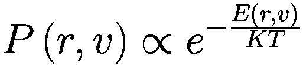

*E*(*r*, *v*) 是任何粒子在配置 (*r*, *v*) 中的能量，*K* 是玻尔兹曼常数。因此，我们看到任何配置在相空间中的概率与玻尔兹曼常数和热力学温度的乘积除以能量的指数成正比。为了将这种关系转换为等式，需要通过所有可能配置的概率之和来归一化概率。如果粒子有 *M* 个可能的相空间配置，那么任何广义配置 (*r*, *v*) 的概率可以表示如下：

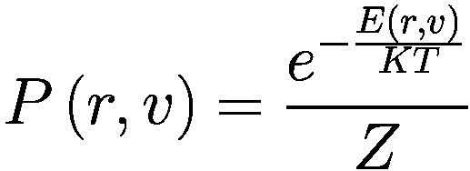

其中 *Z* 是由以下给出的配分函数：

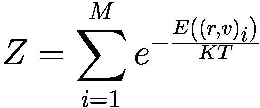

*r* 和 *v* 可能分别有几个值。然而，*M* 表示 *r* 和 *v* 可能的独特组合总数。在先前的方程中，我们通常将 *r* 和 *v* 的第 *i* 个独特组合表示为 (*r*, *v*)[*i*]。如果 *r* 可以取 *n* 个不同的坐标值，而 *v* 可以取 *m* 个不同的速度值，那么可能的总配置数 *M* = *n* × *m*。在这种情况下，配分函数也可以表示如下：

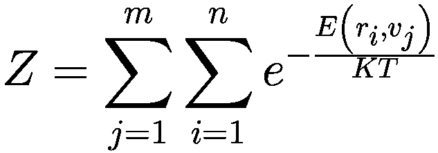

这里需要注意的是，当与其相关的能量较低时，任何配置的概率都较高。对于气体分子来说，这也是直观的，因为高能量状态总是与不稳定平衡相关联，因此不太可能长时间保持高能量配置。处于高能量配置的粒子将始终追求占据更稳定的低能量状态。

如果我们考虑两种配置 *s*[1] = (*r*[1], *v*[1]) 和 *s*[2] = (*r*[2], *v*[2])，并且如果这两种状态中的气体分子数分别为 *N*[1] 和 *N*[2]，那么这两种状态的概率比是两个状态之间能量差的函数：

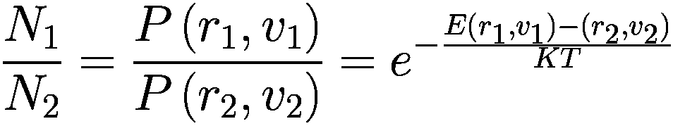

我们现在稍微偏离一下主题，简要地讨论一下贝叶斯推理和马尔可夫链蒙特卡洛（MCMC）方法，因为受限玻尔兹曼机通过 MCMC 技术进行采样，特别是吉布斯采样，对这些方法的一些了解将大大有助于读者理解受限玻尔兹曼机的工作原理。

## 贝叶斯推理：似然、先验和后验概率分布

如第[1](http://dx.doi.org/10.1007/978-1-4842-3096-1_1)章所述，每当获得数据时，我们通过在模型参数条件下定义一个似然函数来构建模型，然后尝试最大化这个似然函数。似然函数不过是给定模型参数的观测或观察数据的概率：

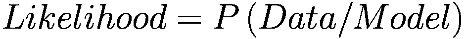

为了得到由其参数定义的模型，我们最大化观测数据的似然：

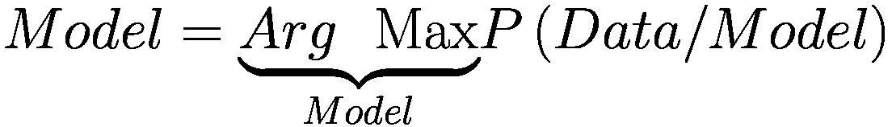

由于我们只是在尝试根据观察到的数据来拟合一个模型，如果我们仅仅追求简单的似然最大化，那么高概率会出现过拟合，并且无法推广到新的数据。

如果数据量很大，观测数据很可能很好地代表总体，因此最大化似然可能就足够了。另一方面，如果观测数据量小，它很可能不能很好地代表总体，因此基于似然的模型可能无法很好地推广到新数据。在这种情况下，对模型有一定的先验信念，并通过该先验信念约束似然，将导致更好的结果。假设我们的先验信念是以模型参数的概率分布的形式存在的，即*P*(*模型*)是已知的。在这种情况下，我们可以通过先验信息更新我们的似然，以获得给定数据的模型分布。根据贝叶斯条件概率定理，

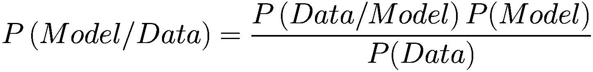

*P*(*模型/数据*)被称为*后验分布*，它通常更具有信息量，因为它结合了关于数据或模型的前置知识。由于这个数据概率与模型无关，后验概率直接与似然和先验的乘积成正比，如下所示：

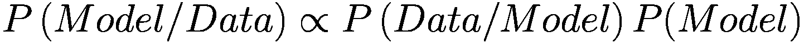

可以通过最大化后验概率分布来构建模型，而不是似然。这种方法被称为最大化后验，或 MAP。似然和 MAP 都是模型的点估计，因此不涵盖整个不确定性空间。取最大化后验的模型意味着取模型概率分布的众数。由最大似然函数给出的点估计不对应于任何众数，因为似然不是一个概率分布函数。如果概率分布是多模态的，这些点估计将表现得更加糟糕。

一个更好的方法是取整个不确定性空间上模型的平均值，即基于后验分布取模型的均值，如下所示：

![Model = E[Model/ Data] = ∫ Model P(Model/ Data)d(Model)](img/448418_2_En_5_Chapter/448418_2_En_5_Chapter_TeX_Equj.png)

为了激发似然和后验的概念以及它们如何用于推导模型参数，让我们再次回到硬币问题。

假设我们抛掷硬币六次，其中出现正面五次。如果需要估计正面的概率，估计值会是什么？

在这里，对我们来说的模型是估计抛掷硬币时出现正面的概率 *θ*。每次抛掷硬币都可以被视为一个独立的伯努利试验，其出现正面的概率为 *θ*。给定模型的数据似然由以下给出：

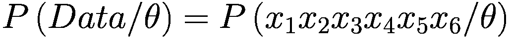

其中 *x*[*i*] ∀ *i* ∈ {1, 2, 3, 4, 5, 6} 表示出现正面 (*H*) 或反面 (*T*) 的事件。

由于硬币的抛掷是独立的，似然可以分解如下：

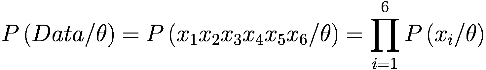

(5.1.1)

每次掷骰子遵循伯努利分布；因此正面的概率是 *θ*，反面的概率是 (1 - *θ*)，并且一般其概率质量函数如下所示：

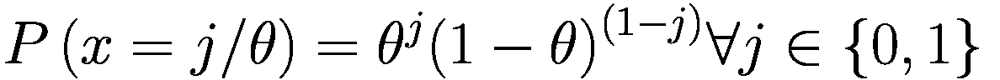

(5.1.2)

其中 *j* = 1 表示正面，*j* = 0 表示反面。

由于有五个正面和一个反面，结合(1)和(2)，似然 *L* 作为 *θ* 的函数可以表示如下：

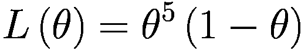

(5.1.3)

最大似然方法将使 *L*(*θ*) 最小的  视为模型参数。因此，

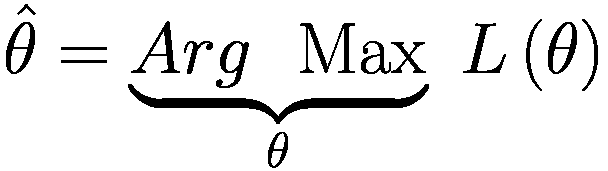

如果我们对 (5.1.3) 中计算出的似然函数求导并令其等于零，我们将得到 *θ* 的似然估计：

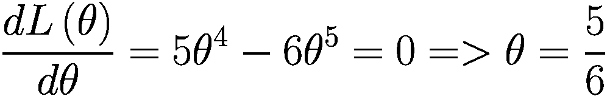

通常，如果有人问我们 *θ* 的估计值，而我们没有进行类似的似然最大化，我们就会立即根据我们在高中学习的概率的基本定义回答概率为 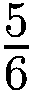，即，

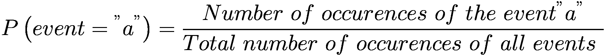

在某种程度上，我们的头脑在思考似然并依赖于迄今为止看到的数据。

*现在，假设我们没有看到数据，有人让我们确定正面的概率；一个合理的估计会是什么？*

嗯，这取决于我们可能对硬币的任何先验信念。如果我们假设一枚公平的硬币，这在一般情况下是最明显的假设，因为我们对硬币没有任何信息，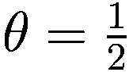 将是一个很好的估计。然而，当我们假设而不是对 *θ* 的先验进行点估计时，最好有一个概率分布，其概率最大值在 。先验概率分布是模型参数 *θ* 的分布。

在这种情况下，参数为 *α* = 2, *β* = 2 的 Beta 分布将是一个很好的先验分布，因为它在  处达到最大概率，并且围绕它是对称的。

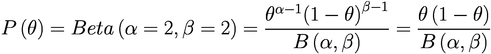

对于固定的 *α* 和 *β* 值，*B*(*α*, *β*) 是常数，并且是此概率分布的正则化或配分函数。它可以如下计算：

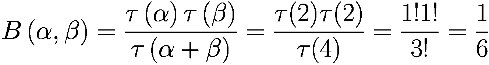

即使一个人不记得公式，也可以通过只对θ(1−θ)进行积分并取其倒数作为归一化常数来找到它，因为概率分布的积分应该是 1。

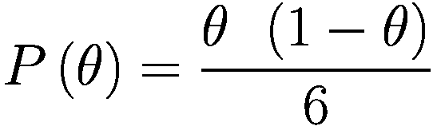

(5.1.4)

如果我们将似然和先验结合起来，我们得到如下后验概率分布：

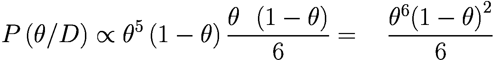

比例符号出现是因为我们忽略了数据的概率。实际上，我们也可以将 6 提出来，并将后验表示如下：

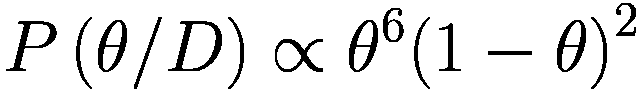

现在，由于θ是一个概率，0≤θ≤1。在 0 到 1 的范围内对θ⁶(1−θ)² 进行积分并取其倒数将给出后验的归一化因子，结果为 252。因此，后验可以表示如下：

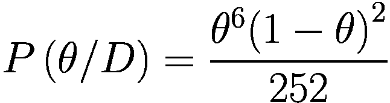

(5.1.5)

现在我们有了后验，有两种方法可以估计θ。我们可以最大化后验，得到θ的 MAP 估计如下：

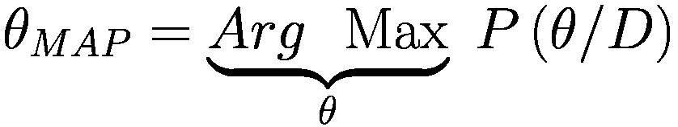

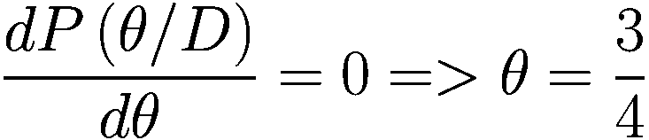

我们看到，由于它考虑了先验并不仅仅相信数据，所以 MAP 估计的 3/4 比似然估计的 5/6 更保守。

现在，让我们来看第二种方法，即纯贝叶斯方法，并取后验分布的均值来对所有关于θ的不确定性进行平均：

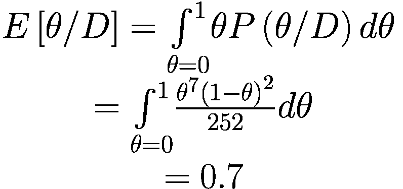

在图 5-1a 至图 5-1c 中绘制了似然函数以及硬币问题的先验和后验概率分布。需要注意的是，似然函数不是概率密度函数或概率质量函数，而先验和后验是概率质量或密度函数。

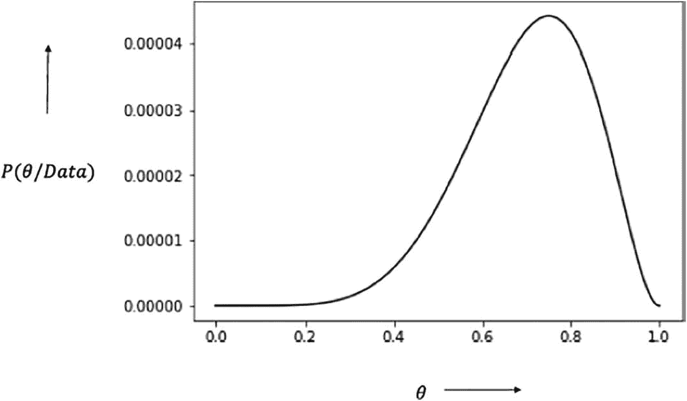

后验概率分布图在 x 轴上有 theta 的值，在 y 轴上有概率数据。它在 theta 值为 0.6 和 0.8 之间有一个峰值。

图 5-1c

后验概率分布

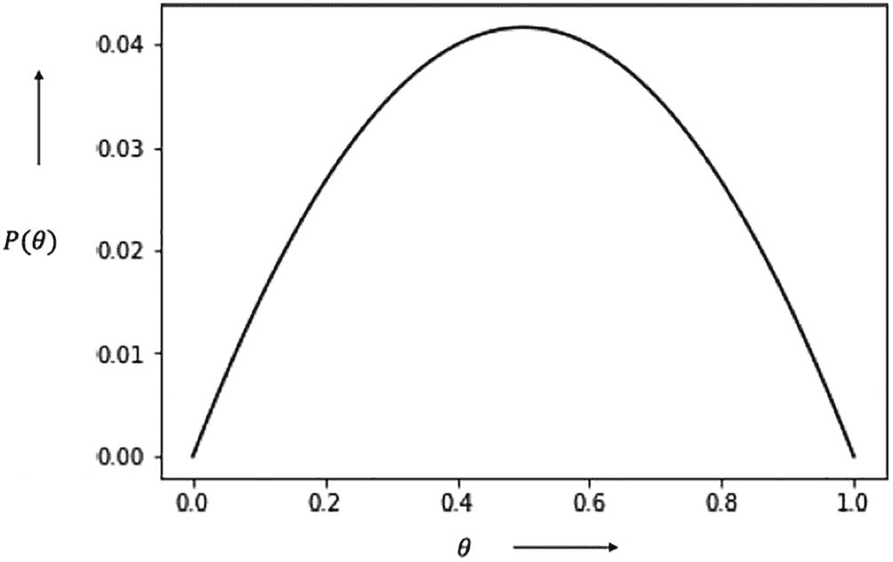

概率分布的线形图在 x 轴上有 theta 的值，在 y 轴上有概率。它垂直形成抛物线形状。

图 5-1b

先验概率分布

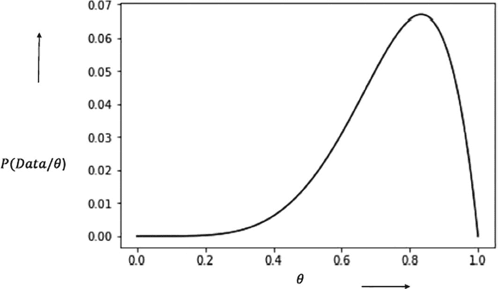

线形图用于绘制似然函数。它在 theta 约为 0.8 时达到峰值。

图 5-1a

似然函数图

对于复杂的分布，后验概率分布可能非常复杂，具有多个参数，并且不太可能代表已知的概率分布形式，如正态分布、伽马分布等。因此，计算整个模型不确定性空间上的积分以计算后验均值的任务可能看似不可能。

在此类情况下，可以使用马尔可夫链蒙特卡洛采样方法来采样模型参数，然后它们的均值是对后验分布均值的公平估计。如果我们采样*n*组模型参数*M*[*i*]，那么

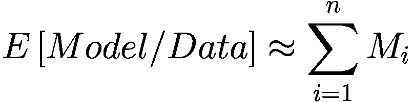

通常，取分布的均值，因为它最小化了平方误差。

基本上，期望

*E*[(*y* − *c*)²]在*c* = *E*[*y*]时最小化。鉴于我们试图通过一个代表值来表示分布的概率，使得概率分布上的平方误差最小化，均值是最好的候选者。

然而，如果分布是偏斜的，或者数据中存在更多噪声，如潜在的异常值，则可以取分布的中位数。这个估计的中位数可以基于从后验中抽取的样本。

## 马尔可夫链蒙特卡洛采样方法

马尔可夫链蒙特卡洛方法，或 MCMC，是用于从复杂的后验概率分布或一般地从任何概率分布中采样多变量数据的一些最流行技术。在我们深入探讨 MCMC 之前，让我们先谈谈一般的蒙特卡洛采样方法。蒙特卡洛采样方法试图根据采样点来计算曲线下的面积。

例如，可以通过在半径为 1 的正方形内采样点并记录下直径为 2 的圆的四分之一内的采样点数来计算超越数 *π*（π）的面积。如图 5-2 所示，*π* 的面积可以按以下方式计算：

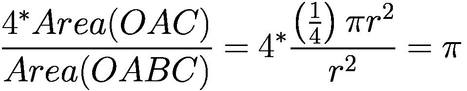

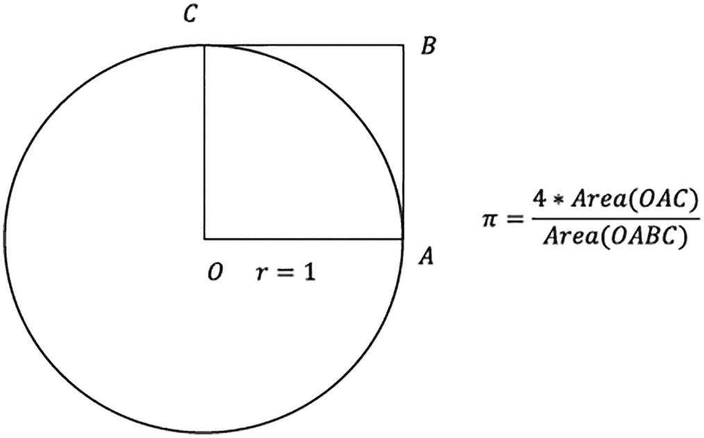

一个半径等于 1 的圆的示意图。一个边长等于半径的方形 OABC。旁边有一个 π 的公式，读作：OAC 面积是 OABC 面积的 4 倍。

图 5-2

π面积

在列表 5-1 中，展示了计算 *π* 值的蒙特卡洛方法。正如我们所见，计算出的值几乎等于 *π* 的值。通过增加采样点数可以提高精度。

```py
import numpy as np
number_sample = 100000
inner_area,outer_area = 0,0
for i in range(number_sample):
x = np.random.uniform(0,1)
y = np.random.uniform(0,1)
if (x**2 + y**2) < 1 :
inner_area += 1
outer_area += 1
print("The computed value of Pi:",4*(inner_area/float(outer_area)))
--Output--
('The computed value of Pi:', 3.142)
Listing 5-1
Computation of Pi Through Monte Carlo Sampling
```

当维度空间很大时，简单的蒙特卡洛方法效率非常低，因为维度越大，相关性的影响越明显。马尔可夫链蒙特卡洛方法在这种情况下效率很高，因为它们在收集高概率区域的样本上花费的时间比在低概率区域上多。普通的蒙特卡洛方法在概率空间中均匀探索，因此花费与探索高概率区域一样多的时间在探索低概率区域。众所周知，在通过采样计算函数期望值时，低概率区域的贡献是微不足道的，因此当算法在这样一个区域花费大量时间时，会导致显著更高的处理时间。马尔可夫链蒙特卡洛方法背后的主要启发式方法是探索概率空间不是均匀的，而是更多地关注高概率区域。在多维空间中，由于相关性，大部分空间是稀疏的，高密度只出现在特定的区域。因此，想法是花更多时间并从那些高概率区域收集更多样本，尽可能少地探索低概率区域。

马尔可夫链可以被视为一个随机/随机过程，用于生成随时间演化的随机样本序列。随机变量的下一个值仅由变量的先前值决定。一旦马尔可夫链进入高概率区域，它就会尝试收集尽可能多的具有高概率密度的点。它是通过根据当前样本值生成下一个样本来做到这一点的，这样就可以以高概率选择靠近当前样本的点，以低概率选择远离的点。这确保了马尔可夫链尽可能多地从当前高概率区域收集点。然而，偶尔需要从当前样本进行长距离跳跃，以探索远离当前区域的其他潜在高概率区域。

马尔可夫链的概念可以用封闭容器在稳态下气体分子的运动来阐述。容器的一些部分比其他区域有更高的气体分子密度，由于气体分子处于稳态，每个状态的概率（由气体分子的位置决定）将保持不变，即使可能有气体分子从一个位置移动到另一个位置。

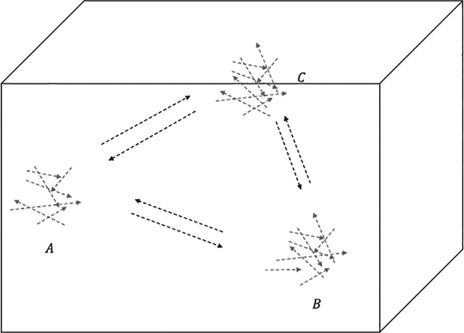

一个立方体盒子内气体运动的示意图。三个状态被标记为 a、b 和 c。

图 5-3

仅具有三种状态（A、B 和 C）的封闭容器中气体的稳态运动

为了简化起见，让我们假设气体分子（在这种情况下）只有三种状态（位置），如图 5-3 所示。让我们用 *A*、*B* 和 *C* 来表示这些状态，并用 *P*[*A*]、*P*[*B*] 和 *P*[*C*] 来表示它们相应的概率。

由于气体分子处于稳态，如果有气体分子过渡到其他状态，为了保持概率分布的稳定性，需要维持平衡。最简单的假设是，从状态 *A* 到状态 *B* 的概率质量应该从 *B* 回到 *A*；即，成对的状态处于平衡状态。

假设 *P*(*B*/*A*) 决定了从 *A* 到 *B* 的转移概率。因此，从 *A* 到 *B* 的概率质量由以下给出：

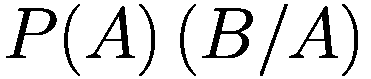

(5.2.1)

同样，从 *B* 到 *A* 的概率质量由以下给出：

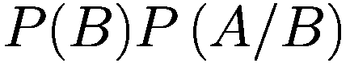

(5.2.2)

因此，从 (5.2.1) 和 (5.2.2) 的稳态中，我们有以下结果：

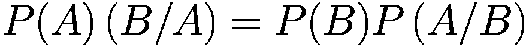

(5.2.3)

为了保持概率分布的平稳性。这被称为*详细平衡条件*，它是概率分布平稳的充分但不必要条件。气体分子可以通过更复杂的方式达到平衡，但由于当可能的状态空间是无限大时，这种形式的详细平衡在数学上很方便，因此这种方法在马尔可夫链蒙特卡洛方法中被广泛用于根据当前点采样下一个点。简而言之，马尔可夫链的运动预期将像在稳态下气体分子那样，在高概率区域花费的时间比在低概率区域多，从而保持详细的平衡条件。

列出以下是一些需要满足的、对于良好实现马尔可夫链的几个其他条件：

+   **不可约性**：马尔可夫链的一个理想特性是我们可以从一个状态转移到任何其他状态。这很重要，因为在马尔可夫链中，尽管我们希望以高概率探索给定状态的邻近状态，但在某些时候我们可能需要跳跃并探索一些远邻区域，期望新的区域可能是另一个高概率区域。

+   **非周期性**：马尔可夫链不应该重复得太频繁，否则将无法遍历整个空间。想象一个有 20 个状态的空间。如果在探索了五个状态之后链重复，那么将无法遍历所有 20 个状态，从而导致采样次优。

### 梅特罗波利斯算法

梅特罗波利斯算法是一种马尔可夫链蒙特卡洛方法，它使用当前接受的状态来确定下一个状态。在时间 (*t* + 1) 的样本有条件地依赖于时间 *t* 的样本。在时间 (*t* + 1) 提出的状态是从一个均值为当前时间 *t* 的样本且具有指定方差的正态分布中抽取的。一旦抽取，就检查时间 (*t* + 1) 和时间 *t* 的样本之间的概率比。如果 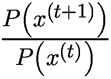 大于或等于 1，则选择样本 *x*^((*t* + 1)) 的概率为 1；如果它小于 1，则随机选择样本。

下文将介绍详细的实现步骤。

+   从任何随机样本点 *X*^((1)) 开始。

+   选择下一个点 *X*^((2))，它有条件地依赖于 *X*^((1))。你可以从均值为 *X*^((1)) 且具有某些有限方差（例如 *S*²）的正态分布中选择 *X*^((2))。因此，

*X*^((2))~*正态分布* (*X*^((1)), *S*²)。良好采样的一个关键决定因素是明智地选择方差 *S*²。方差不应该太大，因为在这种情况下，下一个样本 *X*^((2)) 有更少的可能性保持在当前样本 *X*^((1)) 附近，在这种情况下，由于大多数情况下下一个样本选择远离当前样本，因此可能不会充分探索高概率区域。同时，方差也不应该太小。在这种情况下，下一个样本几乎总是保持在当前点附近，因此探索远离当前区域的不同高概率区域的可能性会降低。

+   在确定是否接受从先前步骤生成的 *X*^((2)) 时，会使用一些特殊的启发式方法。

    +   如果 *P*(*X*^((2)))/*P*(*X*^((1))) ≥ 1，则接受 *X*^((2)) 并将其保留为有效样本点。被接受的样本成为生成下一个样本的 *X*^((1))。

    +   如果 *P*(*X*^((2)))/*P*(*X*^((1))) < 1，则当 *X*^((2)) 大于从 0 到 1 的均匀分布中随机生成的数字时，接受 *X*^((2))，即 *U* [0, 1]。

如我们所见，如果我们移动到一个更高概率的样本，那么我们接受新的样本，如果我们移动到一个更低概率的样本，我们有时接受有时拒绝新的样本。如果 *P*(*X*^((2)))|*P*(*X*^((1))) 的比率很小，拒绝的概率会增加。比如说，*P*(*X*^((2)))|*P*(*X*^((1))) 的比率是 0.1。当我们从均匀分布中生成一个介于 0 和 1 之间的随机数 *r*[*u*] 时，*r*[*u*] > 0.1 的概率是 0.9，这反过来又意味着新样本被拒绝的概率是 0.9。一般来说，

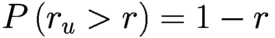

其中 *r* 是新样本和旧样本概率的比率。

让我们尝试直观地理解为什么这样的启发式方法适用于马尔可夫链蒙特卡洛方法。根据详细平衡原理，

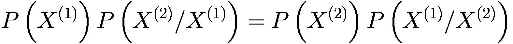

我们方便地假设转换概率遵循正态分布，而没有验证这些转换概率是否遵循我们希望从中采样的概率分布的平稳性的详细平衡条件。让我们考虑，为了保持分布的平稳性，两个状态 *X*[1] 和 *X*[2] 之间的理想转换概率由 *P*(*X*[1]|*X*[2]) 和 *P*(*X*[2]|*X*[1]) 给出。因此，根据详细平衡原理，以下条件必须得到满足：

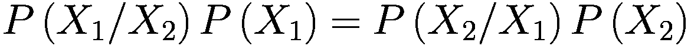

然而，发现这样一个理想的转移概率函数，通过施加详细平衡条件来确保平稳性是困难的。我们从一个合适的转移概率函数开始；比如说 *T*(*x*/y)，其中 *y* 表示当前状态，*x* 表示基于 *y* 样本的下个状态。对于两个状态 *X*[1] 和 *X*[2]，假设的转移概率由 *T*(*X*[1]/*X*[2]) 给出，表示从状态 *X*[2] 转移到 *X*[1]，以及由 *T*(*X*[2]/*X*[1]) 给出，表示从状态 *X*[1] 转移到 *X*[2]。由于假设的转移概率与维持平稳性所需的理想转移概率不同，我们有机会根据下一步的好坏来接受或拒绝样本。为了掩盖这种机会，考虑一个状态转移的接受概率，使得从 *X*[1] 到 *X*[2] 的状态转移

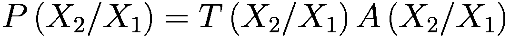

其中 *A*(*X*[2]/*X*[1]) 是从 *X*[1] 到 *X*[2] 的转移的接受概率。

根据详细平衡原理，


将理想转移概率替换为假设转移概率和接受概率的乘积，我们得到以下结果：

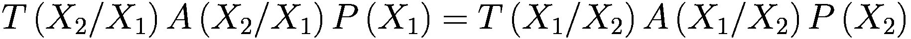

重新排列这个，我们得到接受概率比如下：

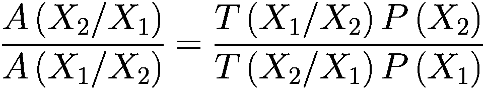

满足这一条件的一个简单建议由 Metropolis 算法给出如下：

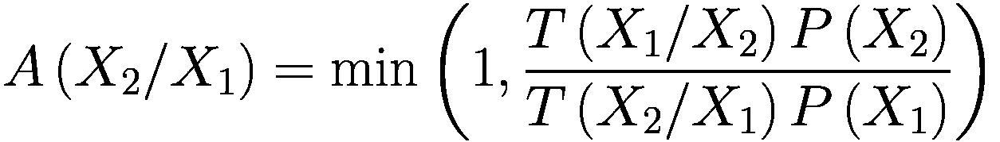

在 Metropolis 算法中，假设的转移概率通常假设为对称的正态分布，因此 *T*(*X*[1]/*X*[2]) = *T*(*X*[2]/*X*[1])。这简化了从 *X*[1] 到 *X*[2] 的转移的接受概率如下：

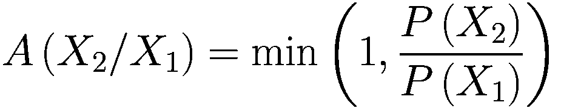

如果接受概率是 1，那么我们以概率 1 接受移动，而如果接受概率小于 1，比如说 *r*，那么我们以概率 *r* 接受新的样本，以概率 (1 − *r*) 拒绝样本。这种以概率 (1 − *r*) 拒绝样本的方法是通过将比率与从 0 到 1 的均匀分布中随机生成的样本 *r*[*u*] 进行比较来实现的，在 *r*[*u*] > *r* 的情况下拒绝样本。这是因为对于均匀分布，概率 *P*(*r*[*u*] > *r*) = 1 − *r*，这确保了所需的拒绝概率得到维持。

在列表 5-2 中，我们通过 Metropolis 算法展示了从二元高斯分布中进行采样的过程。

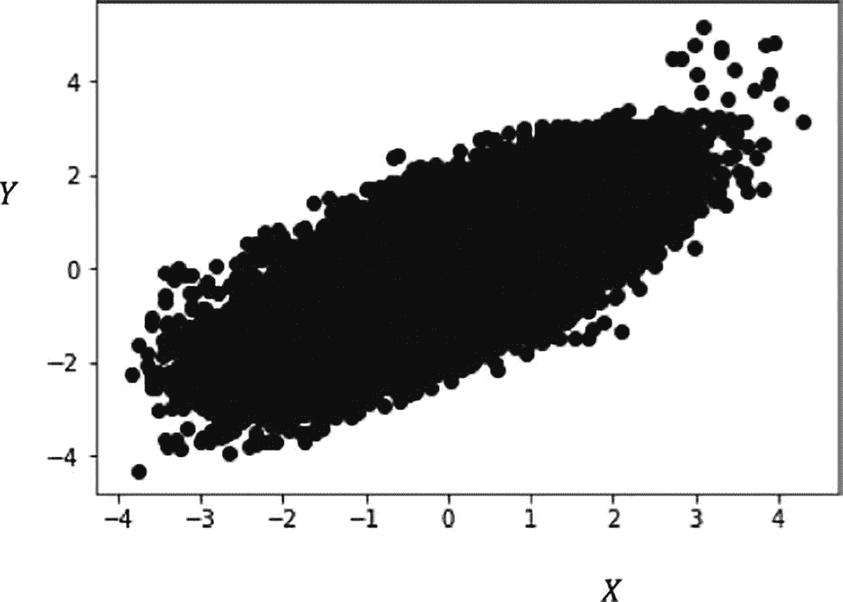

在 x-y 平面上展示高斯分布的插图，范围从负 4 到正 4。它有一个在特定区域的点群。

图 5-4

使用 Metropolis 算法从多元高斯分布中采样的点集图

```py
import numpy as np
import matplotlib.pyplot as plt
%matplotlib inline
import time
start_time = time.time()
"""
Generate samples from Bivariate Guassian Distribution with mean (0,0) and covariance of 0.7 using
Markov Chain Monte Carlo(MCMC) method called Metropolis Hastings algorithm.
We will use a Indepdendent Gaussian transition probability distribution with covariaace 0.2
So the next point X_next is going to be sampled from a Gaussian Distribution with current point X_curr as the mean
and the Transition Covariance of 0.2
X_next ~ N(X_curr,covariance=[[0.2 , 0],[0,0.2]])
"""
def metropolis_hastings(target_dist,cov_trans,num_samples=100000):
_mean_,_cov_ = target_dist[0],target_dist[1]
x_list,y_list = [],[]
accepted_samples_count = 0
# Start with Initial Point (0,0)
x_init, y_init = 0,0
x_curr,y_curr = x_init, y_init
for i in range(num_samples):
# Set up the Transition(Conditional) Probability distribution taking the current point
# as the mean and a small variance (we pass it through cov_trans) so that points near
# the existing point have a high chance of getting sampled.
mean_trans = np.array([x_curr,y_curr])
# Sample next point using the Transition Probability distribution
x_next, y_next = np.random.multivariate_normal(mean_trans,cov_trans).T
X_next = np.array([x_next,y_next])
X_next = np.matrix(X_next)
X_curr = np.matrix(mean_trans)
# Compute the probability density of the existing point and the newly sampled
# point. We can ignore the normalizer as it would cancel
# out when we take density ratio of next and curr point
mahalnobis_dist_next = (X_next - _mean_)*np.linalg.inv(_cov_)*(X_next - _mean_).T
prob_density_next = np.exp(-0.5*mahalnobis_dist_next)
mahalnobis_dist_curr = (X_curr - _mean_)*np.linalg.inv(_cov_)*(X_curr - _mean_).T
prob_density_curr = np.exp(-0.5*mahalnobis_dist_curr)
# This is the heart of the algorithm.  Compute the acceptance ratio(r) as the
# Probability density of the new point to existing point. Select the new point
# 1\. acceptance ratio(r) >= 1
# 2\. If acceptance ratio(r) = 1) | ((acceptance_ratio = np.random.uniform(0,1)) ) :
x_list.append(x_next)
y_list.append(y_next)
x_curr = x_next
y_curr = y_next
accepted_samples_count += 1
end_time = time.time()
print(f"Time taken to sample {accepted_samples_count} points :  {str(end_time - start_time)} seconds")
print(f"Acceptance ratio : {accepted_samples_count/float(num_samples)}")
print(f"Mean of the Sampled Points: ({np.mean(x_list)} ,{np.mean(y_list)})")
print(f"Covariance matrix of the Sampled Points\n")
print(np.cov(x_list,y_list))
plt.xlabel('X')
plt.ylabel('Y')
plt.title(f"Scatter plot for the Sampled Points")
plt.scatter(x_list,y_list,color='black')
# Let's trigger some MCMC
num_samples=100000
_cov_ = np.array([[1,0.7],[0.7,1]])
_mean_ = np.matrix(np.array([0,0]))
metropolis_hastings(target_dist=(_mean_,_cov_),cov_trans=np.array([[1,0.2],[0.2,1]]))
-Output-
Time taken to sample 71538 points ==> 30.3350000381 seconds
Acceptance ratio ===>  0.71538
Mean of the Sampled Points
-0.0090486292629 -0.008610932357
Covariance matrix of the Sampled Points
[[ 0.96043199  0.66961286]
[ 0.66961286  0.94298698]]
Listing 5-2
Bivariate Gaussian Distribution Through Metropolis Algorithm
```

从输出结果中我们可以看到，样本点的均值和协方差与我们所采样的二元高斯分布的均值和协方差非常接近。此外，图 5-4 中的散点图也与二元高斯分布非常相似。

既然我们已经了解了从概率分布中进行采样的马尔可夫链蒙特卡洛方法，我们将通过研究受限玻尔兹曼机来学习另一种称为吉布斯抽样的 MCMC 方法。

## 受限玻尔兹曼机

受限玻尔兹曼机（RBMs）属于利用概率分布的玻尔兹曼方程的无监督机器学习算法类别。图 5-5 展示了具有一个隐藏层和一个可见层的两层受限玻尔兹曼机架构。所有隐藏层和可见层的单元之间存在权重连接。然而，没有隐藏层到隐藏层或可见层到可见层的单元连接。RBM 中的“受限”一词指的是这种对网络的约束。给定可见单元集合，RBM 的隐藏单元彼此之间条件独立。同样，给定隐藏单元集合，RBM 的可见单元彼此之间条件独立。受限玻尔兹曼机通常用作深度网络的构建块，而不是作为一个独立的网络本身。在概率图形模型方面，受限玻尔兹曼机可以定义为包含一个可见层和一个单独隐藏层的无向概率图形模型。与 PCA 类似，RBMs 可以被视为将数据在由可见层 *v* 给定的一个空间中表示为另一个空间（由隐藏或潜在层 *h* 给定）的方法。当隐藏层的大小小于可见层的大小时，RBMs 执行数据的降维。RBMs 通常在二进制数据上训练。

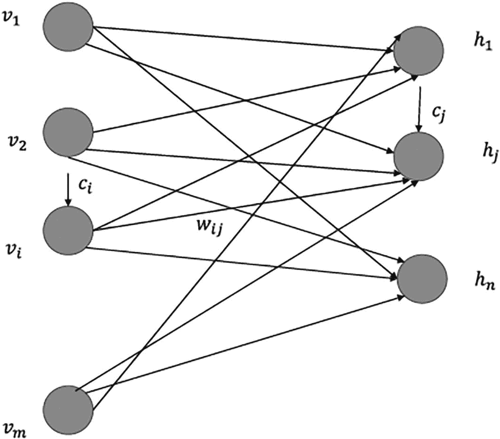

一个图表示了左侧 4 个节点和右侧 3 个节点之间的互连。左侧的节点标记为 V 1, V 2, V i, 和 V m。右侧的节点标记为 h 1, h j, 和 h n.

图 5-5

受限玻尔兹曼机可见层和隐藏层架构

让 RBM 的可见单元由向量 *v* = [*v*[1] *v*[2]…*v*[*m*]]^(*T*) ∈ *R*^(*m* × 1) 表示，隐藏单元由 *h* = [*h*[1] *h*[2]…*h*[*n*]]^(*T*) ∈ *ℝ*^(*n* × 1) 表示。此外，让连接第 *i* 个可见单元和第 *j* 个隐藏单元的权重表示为 *w*[*ij*]，∀ *i* ∈ {1, 2, ..*m*}，∀ *j* ∈ {1, 2, ..*n*}。我们可以将包含权重 *w*[*ij*] 的矩阵表示为 *W* ∈ *R*^(*m* × *n*).

具有隐藏状态 *h* 和可见状态 *v* 的联合概率分布的能量由以下公式给出：

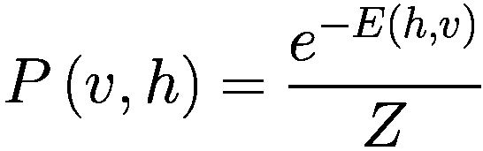

(5.3.1)

其中 *E*(*v*, *h*) 是联合配置 (*v*, *h*) 的能量，*Z* 是归一化因子，通常称为配分函数。这个概率基于玻尔兹曼分布，并假设玻尔兹曼常数和热温度为 1。


(5.3.2)

联合配置 (*v*, *h*) 的能量 *E*(*v*, *h*) 由以下给出：

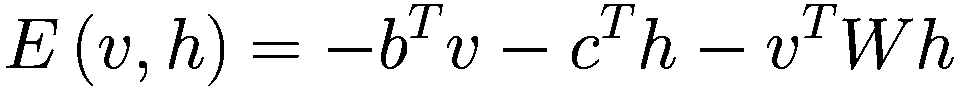

(5.3.3)


(5.3.4)

向量 *b* = [*b*[1] *b*[2]…*b*[*m*]]^(*T*) ∈ *R*^(*m* × 1) 和 *c* = [*c*[1] *c*[2]… *c*[*n*]]^(*T*) ∈ *R*^(*n* × 1) 分别是可见单元和隐藏单元的偏置，正如我们稍后将会看到的。

在任何图形概率模型中，思想是计算各种事件集合的联合概率分布。结合 (5.3.1) 和 (5.3.3)，我们得到以下：


(5.3.5)

配分函数 *Z* 难以计算，这使得 *P*(*v*, *h*) 的计算变得困难。对于事件的小集合，可以计算配分函数。如果 *v* 和 *h* 中有许多变量，可能的联合事件数量将非常大，考虑到所有这些组合都变得难以计算。

然而，条件概率分布 *P*(*h*/*v*）易于计算和采样。以下推导将证明这一点：


我们可以将分子和分母按涉及的不同向量的分量展开，如下所示：


由于和的指数等于指数的乘积，前面的方程可以写成如下乘积形式：


(5.3.6)

现在，让我们看看分母，它与分子看起来相似，只是对所有的可能隐藏状态 *h* 进行了求和。使用 (5.3.6) 中的  的表达式，分母可以表示如下：

![$$ \sum \limits_h{e}^{c^Th}{e}^{v^T Wh}=\space \sum \limits_h\prod \limits_{j=1}^n{e}^{c_j{h}_j+{v}^TW\left[:,j\right]{h}_j} $$](img/448418_2_En_5_Chapter/448418_2_En_5_Chapter_TeX_Equ15.png)

(5.3.7)

向量的求和意味着对其所有分量组合的求和。每个隐藏单元 *h*[*i*] 可以有一个二进制状态 0 或 1，因此 *h*[*j*] ∈ {0, 1} ∀ *j* ∈ (1, 2, 3, ..*n*}。所以，在 (5.3.7) 中对向量 *h* 的求和可以展开成对应于其每个分量的多个求和：

![$$ {\displaystyle \begin{array}{c}\sum \limits_h{e}^{c^Th}{e}^{v^T Wh}=\sum \limits_{h_1=0}¹\sum \limits_{h_2=0}¹..\sum \limits_{h_n=0}¹\prod \limits_{j=1}^n{e}^{c_j{h}_j+{v}^TW\left[:,j\right]{h}_j}\\ {}=\sum \limits_{h_1=0}¹\sum \limits_{h_2=0}¹..\sum \limits_{h_n=0}¹\left({e}^{c_1{h}_1+{v}^TW\left[:,1\right]{h}_1}\right)\left({e}^{c_2{h}_2+{v}^TW\left[:,2\right]{h}_2}\right)\dots \left({e}^{c_n{h}_n+{v}^TW\left[:,n\right]{h}_n}\right)\end{array}} $$](img/448418_2_En_5_Chapter/448418_2_En_5_Chapter_TeX_Equ16.png)

(5.3.8)

现在，让我们看看涉及两个离散变量 *a* 和 *b* 的一个非常简单的乘积和求和操作：


因此，我们看到当我们取具有独立索引的变量的元素时，变量的乘积之和可以表示为变量之和的乘积。类似于这个例子，*h* 的元素（即 *h*[*i*]）通常独立地参与以下乘积 ![$$ \left({e}^{c_1{h}_1+{v}^TW\left[:,1\right]{h}_1}\right)\left({e}^{c_2{h}_2+{v}^TW\left[:,2\right]{h}_2}\right)\dots \left({e}^{c_n{h}_n+{v}^TW\left[:,n\right]{h}_n}\right) $$](img/448418_2_En_5_Chapter/448418_2_En_5_Chapter_TeX_IEq10.png)，因此 (5.3.8) 中的表达式可以简化如下：

![$$ \sum \limits_h{e}^{c^Th}{e}^{v^T Wh}=\sum \limits_{h_1=0}¹\left({e}^{c_1{h}_1+{v}^TW\left[:,1\right]{h}_1}\right)\sum \limits_{h_1=0}¹\left({e}^{c_2{h}_2+{v}^TW\left[:,2\right]{h}_2}\right)..\sum \limits_{h_n=0}¹\left({e}^{c_n{h}_n+{v}^TW\left[:,n\right]{h}_n}\right) $$](img/448418_2_En_5_Chapter/448418_2_En_5_Chapter_TeX_Equaj.png)


(5.3.9)

将(5.3.6)和(5.3.9)的分子和分母的表达式结合起来，我们得到以下结果：


在*h*的分量上简化这个表达式，我们得到以下结果：


(5.3.10)

在给定*v*的条件下，*h*的元素的条件联合概率分布分解为相互独立的表达式的乘积。这导致*h*的分量（即*h*[*i*] ∀ *i* ∈ {1, 2, …*n*}）在给定*v*的条件下相互独立。这给我们以下结果：


(5.3.11)


(5.3.12)

将(5.3.12)中的*h*[*j*] = 1 和*h*[*j*] = 0 替换，我们得到以下结果：


(5.3.13)


(5.3.14)

(5.3.13)和(5.3.14)的表达式说明了隐藏单元*h*[*i*] ∀ *i* ∈ {1, 2, …*n*}是独立的 sigmoid 单元：


(5.3.15)

展开向量*v*和*W*[:, *j*]的分量，我们可以将(5.3.15)重新写为以下形式：


(5.3.16)

其中*σ*(.)代表 sigmoid 函数，使得


以类似的方式继续进行，可以证明


这意味着隐藏单元在给定可见状态的情况下相互独立。由于 RBM 是一个对称的无向网络，就像可见单元一样，给定隐藏状态时可见单元的概率可以类似地表示如下：


(5.3.17)

从(5.3.16)和(5.3.17)中，我们可以清楚地看到，可见单元和隐藏单元实际上是具有向量*b*和*c*提供偏置的二进制 sigmoid 单元。隐藏单元和可见单元这种对称且独立的条件依赖性在训练模型时可能很有用。

### 训练受限玻尔兹曼机

我们需要训练玻尔兹曼机以推导出模型参数*b*、*c*、*W*，其中*b*和*c*分别是可见单元和隐藏单元的偏置向量，而*W*是可见层和隐藏层之间的权重连接矩阵。为了便于参考，可以将模型参数统称为以下内容：

![$$ \theta =\left[b;c;W\right] $$](img/448418_2_En_5_Chapter/448418_2_En_5_Chapter_TeX_Equao.png)

该模型可以通过最大化输入数据点的对数似然函数相对于模型参数来训练。输入仅仅是每个数据点对应于可见单元的数据。似然函数由以下给出：


假设给定模型，数据点是独立的，


(5.3.18)

对等式(5.3.18)的两边取对数，得到函数的对数似然表达式，如下所示：


(5.3.19)

通过其联合概率形式展开 (5.3.19) 中的概率，我们得到以下结果：

![$$ {\displaystyle \begin{array}{c}C=\sum \limits_{t=1}^m logP\left({v}^{(t)}/\theta \right)\\ {}\space =\sum \limits_{t=1}^m\mathit{\log}\sum \limits_hP\left({v}^{(t)},h/\theta \right)\\ {}\space \space =\sum \limits_{t=1}^m\mathit{\log}\sum \limits_h\frac{e^{-E\left({v}^{(t)},h\right)}}{Z}\\ {}\space \space =\sum \limits_{t=1}^m\mathit{\log}\frac{\sum \limits_h{e}^{-E\left({v}^{(t)},h\right)}}{Z}\\ {}\space \space =\sum \limits_{t=1}^m\mathit{\log}\sum \limits_h{e}^{-E\left({v}^{(t)},h\right)}-\sum \limits_{t=1}^m logZ\\ {}\space \space =\sum \limits_{t=1}^m\mathit{\log}\sum \limits_h{e}^{-E\left({v}^{(t)},h\right)}- mlogZ\end{array}} $$](img/448418_2_En_5_Chapter_TeX_Equ28.png)

(5.3.20)

分子函数 *Z* 不受可见层输入 *v*^((*t*)) 的约束，与 (5.3.20) 中的第一项不同。*Z* 是所有可能的 *v* 和 *h* 组合的能量负指数之和，因此可以表示如下：


将 *Z* 用这个表达式替换 (5.3.20)，我们得到以下结果：


(5.3.21)

现在，让我们对成本函数关于组合参数 *θ* 求梯度。我们可以将 *C* 视为包含两个部分，*ρ*^+ 和 *ρ*^−，如下所示：


对 *ρ*^+ 关于 *θ* 求梯度，我们得到以下结果：


(5.3.22)

现在，让我们通过将分子和分母都除以 *Z* 来简化 ：


(5.3.23)

 和 。使用这些表达式来处理 (5.3.23) 中的概率，我们得到以下结果：


(5.3.24)

可以从概率符号中移除 *θ*，例如 *P*(*v*^((*t*)), *h*/*θ*), *P*(*v*^((*t*)), *h*/*θ*), 等等，如果愿意的话，为了简化符号，但最好保留它们，因为这样可以使推导更加完整，从而更好地解释整个训练过程。

让我们看看函数的期望，它以更具有意义的形式给出了 (5.3.24) 中的表达式，这对于训练目的来说是非常理想的。给定 *x* 的 *f* (*x*) 的期望遵循概率质量函数 *P*(*x*)，并由以下给出：


如果 *x* = [*x*[1] *x*[2]… *x*[*n*]]^(*T*) ∈ *R*^(*n* × 1) 是多元的，那么前面的表达式是正确的，并且


同样，如果 *f* (*x*) 是一个函数向量，使得 *f* (*x*) =  *f*[1 *f*2]^(*T*)，可以使用与期望相同的表达式。在这里，会得到一个期望向量，如下所示：

![E[f(x)]=∑_xP(x)f(x)=[∑_x_1∑_x_2...∑_x_nP(x_1,x_2,...,x_n)f_1(x_1,x_2,...,x_n)∑_x_1∑_x_2...∑_x_nP(x_1,x_2,...,x_n)f_2(x_1,x_2,...,x_n)]](img/448418_2_En_5_Chapter/448418_2_En_5_Chapter_TeX_Equ33.png)

(5.3.25)

为了在期望符号中明确提及概率分布，可以将变量*x*遵循概率分布*P*(x)的函数的期望或函数向量期望重写如下：

![E_P(x)[f(x)]=∑_xP(x)f(x)](img/448418_2_En_5_Chapter/448418_2_En_5_Chapter_TeX_Equav.png)

由于我们处理的是梯度，它是不同偏导数的向量，并且每个偏导数都是*h*的函数，给定*θ*和*v*的值，因此(5.3.24)中的方程可以用关于概率分布*P*(h/v^(t),θ)的梯度期望∇*θ*), *h*))来表示，如下所示：

![∇_θ(ρ^+)=∑_t=1^mE_P(h/v^(t),θ)[∇_θ(-E(v^(t),h))]](img/448418_2_En_5_Chapter/448418_2_En_5_Chapter_TeX_Equ34.png)

(5.3.26)

注意，期望![E_P(h/v^(t),θ)[∇_θ(-E(v^(t),h))]](img/448418_2_En_5_Chapter/448418_2_En_5_Chapter_TeX_IEq14.png)是一个期望向量，如(5.3.25)所示。

现在，让我们求关于*θ*的梯度)])(img/448418_2_En_5_Chapter/448418_2_En_5_Chapter_TeX_IEq15.png)：


(5.3.27)

(5.3.27)中的期望是在*h*和*v*的联合分布上，而(5.3.26)中的期望是在给定已观察*v*的*h*上。结合(5.3.26)和(5.3.27)，我们得到以下结果：

![$$ {\nabla}_{\theta }(C)=\sum \limits_{t=1}^m{E}_{P\left(h/{v}^{(t)},\theta \right)}\left[{\nabla}_{\theta}\left(-E\left({v}^{(t)},h\right)\right)\right]-{mE}_{P\left(h,v/\theta \right)}\left[{\nabla}_{\theta}\left(-E\left(v,h\right)\right)\right] $$](img/448418_2_En_5_Chapter/448418_2_En_5_Chapter_TeX_Equ36.png)

(5.3.28)

如果我们观察 (5.3.28) 中的所有参数的梯度，它有两个项。第一项依赖于观察到的数据 *v*^((*t*))，而第二项依赖于模型中的样本。第一项增加了给定观察数据的似然性，而第二项减少了模型数据点的似然性。

现在，让我们对 *θ* 中每个参数集的梯度进行一些简化，即，*b*、*c* 和 *W*。


(5.3.29)


(5.3.30)


(5.3.31)

使用 (5.3.28) 到 (5.3.31)，关于每个参数集的梯度表达式如下所示：

![$$ {\nabla}_b(C)=\sum \limits_{t=1}^m{E}_{P\left(h/{v}^{(t)},\theta \right)}\left[{v}^{(t)}\right]-{mE}_{P\left(h,v/\theta \right)}\left[v\right] $$](img/448418_2_En_5_Chapter/448418_2_En_5_Chapter_TeX_Equ40.png)

(5.3.32)

由于第一项的概率分布是条件于 v^((*t*)) 的，因此 v^((*t*)) 关于 *P*(*h*/*v*^((*t*)), *θ*) 的期望是 v^((*t*)).

![$$ {\nabla}_b(C)=\sum \limits_{t=1}^m{v}^{(t)}-{mE}_{P\left(h,v/\theta \right)}\left[v\right] $$](img/448418_2_En_5_Chapter/448418_2_En_5_Chapter_TeX_Equ41.png)

(5.3.33)

![$$ {\nabla}_c(C)=\sum \limits_{t=1}^m{E}_{P\left(h/{v}^{(t)},\theta \right)}\left[h\right]-{mE}_{P\left(h,v/\theta \right)}\left[h\right] $$](img/448418_2_En_5_Chapter/448418_2_En_5_Chapter_TeX_Equ42.png)

(5.3.34)

在概率分布 *P*(*h*/*v*^((*t*)), *θ*) 上对 *h* 的期望可以很容易地计算，因为给定 *v*^((*t*)) 的每个 *h* 的单元（即 *h*[*j*]）都是独立的。每个单元都是一个具有两种可能结果的 Sigmoid 单元，它们的期望仅仅是 Sigmoid 单元的输出，即，

![$$ {E}_{P\left(h/{v}^{(t)},\theta \right)}\left[h\right]={\hat{h}}^{(t)}=\sigma \left(c+{W}^T{v}^{(t)}\right) $$](img/448418_2_En_5_Chapter/448418_2_En_5_Chapter_TeX_Equaw.png)

如果我们将期望替换为 *ĥ*，那么 (5.3.34) 中的表达式可以写成以下形式：

![$$ {\nabla}_c(C)=\sum \limits_{t=1}^m{\hat{h}}^{(t)}-{mE}_{P\left(h,v/\theta \right)}\left[h\right] $$](img/448418_2_En_5_Chapter/448418_2_En_5_Chapter_TeX_Equ43.png)

(5.3.35)

同样，

![$$ {\displaystyle \begin{array}{l}{\nabla}_W\kern0.5em (C)=\sum \limits_{t=1}^m{E}_{P\left(h/{v}^{(t)},\kern0.5em \theta \right)}\left[{v}^{(t)}{h}^T\right]-{mE}_{P\left(h,\kern0.5em v/q\right)}\left[h\right]\\ {}\operatorname{}=\sum \limits_{t=1}^m{v}^{(t)}{\hat{h}}^{(t)T}-{mE}_{P\left(h,\kern0.5em v/\theta \right)}\left[h\right]\end{array}} $$](img/448418_2_En_5_Chapter/448418_2_En_5_Chapter_TeX_Equ44.png)

(5.3.36)

因此，(5.3.33)、(5.3.35) 和 (5.3.36) 中的表达式代表了关于三个参数集的梯度。为了便于参考，

![$$ \left\{\begin{array}{l}{\nabla}_b(C)=\sum \limits_{t=1}^m{v}^{(t)}-{mE}_{P\left(h,v/\theta \right)}\left[v\right]\\ {}{\nabla}_c(C)=\sum \limits_{t=1}^m{\hat{h}}^{(t)}-{mE}_{P\left(h,v/\theta \right)}\left[h\right]\\ {}{\nabla}_W(C)=\sum \limits_{t=1}^m{v}^{(t)}{\hat{h}}^{(t)^T}-{mE}_{P\left(h,v/\theta \right)}\left[h\right]\end{array}\right. $$](img/448418_2_En_5_Chapter/448418_2_En_5_Chapter_TeX_Equ45.png)

(5.3.37)

基于这些梯度，可以调用梯度下降技术来迭代地获取最大化似然函数的参数值。然而，在梯度下降的每次迭代中计算关于联合概率分布 *P*(*h*, *v*/*θ*) 的期望值涉及一些复杂性。由于在 *h* 和 *v* 是中等到高维向量的情况下，它们似乎有大量的组合，联合分布难以计算。马尔可夫链蒙特卡洛采样（MCMC）技术，特别是吉布斯采样，可以用来从联合分布中采样并计算不同参数集的期望值（5.3.37）。然而，MCMC 技术需要很长时间才能收敛到平稳分布，之后它们提供良好的样本。因此，在梯度下降的每次迭代中都调用 MCMC 采样会使学习变得非常缓慢且不切实际。

### 吉布斯采样

吉布斯采样是一种马尔可夫链蒙特卡洛方法，可用于从多元概率分布中采样观测值。假设我们想从一个多元联合概率分布 *P*(*x*) 中采样，其中 *x* = [*x*[1]*x*[2]. . *x*[*n*]]^(*T*).

吉布斯采样生成变量 *x*[*i*] 的下一个值，该值基于其他所有变量的当前值。让第 *t* 个抽取的样本表示为 *x*^((*t*)) = [*x*[1]^((*t*))*x*[2]^((*t*)). . *x*[*n*]^((*t*))]^(*T*). 要生成下一个 (*t* + 1) 个样本，遵循以下逻辑：

+   通过从基于其他变量的概率分布中采样来抽取变量 *x*[*j*]^((*t* + 1))。换句话说，从


所以基本上，对于在其余变量条件下采样 *x*[*j*]，对于 *x*[*j*] 之前的 *j* − 1 个变量，它们的 (*t* + 1) 实例的值被考虑，因为它们已经被采样，而对于其余的变量，它们的 *t* 实例的值被考虑，因为它们尚未被采样。这一步骤对所有变量都要重复进行。

如果每个 *x*[*j*] 是离散的，并且可以取，比如说，两个值 0 和 1，那么我们需要计算概率 *p*[1] = *P*(*x*[*j*]^((*t* + 1)) = 1/*x*[1]^((*t* + 1))*x*[2]^((*t* + 1)). . *x*[*j* − 1]^((*t* + 1))*x*[*j* + 1]^((*t*)). . *x*[*n*]^((*t*))). 然后，我们可以从 0 到 1 的均匀概率分布中抽取一个样本 *u*（即 *U*[0, 1]），如果 *p*[1] ≥ *u*，则将 *x*[*j*]^((*t* + 1)) = 1 设置，否则将 *x*[*j*]^((*t* + 1)) = 0\. 这种随机启发式方法确保了概率 *p*[1] 越高，*x*[*j*]^((*t* + 1)) 被选为 1 的可能性就越大。然而，它仍然留有 0 被以非常低的概率选中的空间，即使 *p*[1] 相对较大，从而确保马尔可夫链不会陷入局部区域，还可以探索其他潜在的高密度区域。这与我们在梅特罗波利斯算法中看到的类似启发式方法相同。

+   如果一个人希望从联合概率分布 *P*(*x*) 中生成 *m* 个样本，那么前面的步骤需要重复 *m* 次。

在采样之前，需要确定每个变量基于联合概率分布的条件分布。如果一个人在处理贝叶斯网络或受限玻尔兹曼机，变量之间有一些约束，有助于以有效的方式确定这些条件分布。

例如，如果一个人需要从一个均值为 [0 0] 和协方差矩阵  的双变量正态分布中进行吉布斯采样，那么条件概率分布可以按以下方式计算：


如果导出边缘分布 *P*(*x*[1]) 和 *P*(*x*[2]) 为  和 ，那么


![x1/x2~Normal(ρx2,1-p²)] (img/448418_2_En_5_Chapter/448418_2_En_5_Chapter_TeX_Equbb.png)

### 块状吉布斯采样

吉布斯采样有几种变体。块状吉布斯采样是其中之一。在块状吉布斯采样中，多个变量被分组在一起，然后基于其他变量的条件，对变量组进行采样，而不是分别对单个变量进行采样。例如，在受限玻尔兹曼机中，隐藏单元状态变量 *h* = [*h*[1] *h*[2]… *h*[*n*]]^(*T*) 可以在可见单元状态 =[*v*[1] *v*[2]…*v*[*m*]]^(*T*) 的条件下一起采样，反之亦然。因此，为了从联合概率分布 *P*(*v*, *h*) 中采样，通过块状吉布斯采样，可以在条件分布 *P*(*h*/*v*) 的给定下采样所有隐藏状态，并通过条件分布 *P*(*v*/*h*) 采样所有可见单元状态。吉布斯采样的 (*t* + 1) 迭代中的样本可以生成如下：

![h^(t+1)~P(h|v^(t))] (img/448418_2_En_5_Chapter/448418_2_En_5_Chapter_TeX_Equbc.png)

![v^(t+1)~P(v|h^(t+1))] (img/448418_2_En_5_Chapter/448418_2_En_5_Chapter_TeX_Equbd.png)

因此，(*v*^((*t* + 1)), *h*^((*t* + 1))) 是迭代 (*t* + 1) 的组合样本。

基于上述采样方法收集的样本，函数 *f* (*h*, *v*) 的期望可以计算如下：

![E[f(h,v)]≈1/M∑t=1Mf(h^(t),v^(t))] (img/448418_2_En_5_Chapter/448418_2_En_5_Chapter_TeX_Eqube.png)

其中 *M* 表示从联合概率分布 *P*(*v*, *h*) 生成的样本数量。

### 吉布斯采样中的预烧期和生成样本

为了在期望计算中将样本尽可能视为独立，通常以 *k* 个样本的间隔选取样本。*k* 的值越大，越有利于消除生成样本之间的自相关性。此外，吉布斯采样开始时生成的样本被忽略。这些被忽略的样本被称为在预烧期生成的。

烧录期使用马尔可夫链在我们可以从中抽取样本之前达到平衡分布。这是必需的，因为我们从可能相对于实际分布处于低概率区域的任意样本生成马尔可夫链，因此我们可以丢弃这些不需要的样本。低概率样本对实际期望的贡献不大，因此在样本中有大量这些样本会模糊期望。一旦马尔可夫链运行足够长，它将频繁地从高概率区域抽取样本，此时我们可以开始收集样本。

### 在受限玻尔兹曼机中使用 Gibbs 采样

如方程（5.3.37）中所述，可以使用块 Gibbs 采样来计算相对于联合概率分布 *P*(*v*, *h*/*θ*) 的期望，用于计算相对于模型参数 *b*，*c* 和 *W* 的梯度。以下是方程（5.3.37）的方程，便于参考：

![ {∇}_b(C) = ∑(t=1)^m v^(t) - mE_P(h,v/θ)[v] ; {∇}_c(C) = ∑(t=1)^m ^h - mE_P(h,v/θ)[h] ; {∇}_W(C) = ∑(t=1)^m v^(t) ^h^T - mE_P(h,v/θ)[vh^T] ]](img/448418_2_En_5_Chapter/448418_2_En_5_Chapter_TeX_Equbf.png)

期望 *E*[*P*(*h*,*v*/*θ*)][*v*]，*E*[*P*(*h*,*v*/*θ*)][*h*]，以及 *E*[*P*(*h*,*v*/*θ*)][*vh*^(*T*)]，所有这些都需要从联合概率分布 *P*(*v*, *h*/*θ*) 中进行采样。通过块 Gibbs 采样，可以根据它们的条件概率抽取 (*v*, *h*) 样本，其中 *t* 表示 Gibbs 采样的迭代次数：


使得采样更加容易的是，隐藏单元在给定可见单元状态的情况下是独立的，反之亦然：


这允许在给定可见单元状态的情况下，每个单独的隐藏单元 *h*[*j*] 可以独立于其他单元并行采样。参数 *θ* 已从前面的符号中移除，因为在执行 Gibbs 采样时，*θ* 将在梯度下降的步骤中保持不变。

现在，每个隐藏单元输出状态 *h*[*j*] 可以是 0 或 1，其假设状态 1 的概率由方程（5.3.16）给出如下：


这个概率可以根据当前值 *v* = *v*^((*t*)) 和模型参数 *c*, *W* ∈ *θ* 来计算。计算出的概率 *P*(*h*[*j*] = 1/*v*^((*t*))) 与从均匀分布 *U*[0, 1] 生成的随机样本 *u* 进行比较。如果 *P*(*h*[*j*] = 1/*v*^((*t*))) > *u*，则采样 *h*[*j*] = 1，否则 *h*[*j*] = 0。以这种方式采样的每个隐藏单元 *h*[*j*] 形成了组合隐藏单元状态向量 *h*^((*t* + 1))。

同样，在给定隐藏单元状态的情况下，可见单元是独立的：


在给定 *h*^((*t* + 1)) 的情况下，每个可见单元可以独立采样以获得与隐藏单元相同的组合 *v*^((*t* + 1))。因此，在 (*t* + 1) 迭代中生成的所需样本由 (*v*^((*t* + 1)), *h*^((*t* + 1))) 给出。

所有期望值 *E*[*P*(*h*,*v*/*θ*)][*v*], *E*[*P*(*h*,*v*/*θ*)][*h*], 和 *E*[*P*(*h*,*v*/*θ*)][*vh*^(*T*)] 可以通过取通过吉布斯采样生成的样本的平均值来计算。通过吉布斯采样，如果我们考虑了前面讨论的烧录期和自相关，并在之后取 *N* 个样本，所需的期望值可以按以下方式计算：


然而，为了生成 *N* 个样本，在梯度下降的每次迭代中对联合分布进行吉布斯采样变得是一项繁琐的任务，并且通常不切实际。有一种近似这些期望值的方法，称为**对比散度**，我们将在下一节中讨论。

### **对比散度**

在梯度下降的每一步对联合概率分布 *P*(*h*, *v*| *θ*) 进行吉布斯抽样变得具有挑战性，因为像吉布斯抽样这样的马尔可夫链蒙特卡洛方法需要很长时间才能收敛，而这正是产生无偏样本所必需的。这些从联合概率分布中抽取的无偏样本用于计算期望项 *E*[*P*(*h*,*v*/*θ*)][*v*]，*E*[*P*(*h*,*v*/*θ*)][*h*]，和 *E*[*P*(*h*,*v*/*θ*)][*vh*^(*T*)]，这些实际上就是梯度综合表达式中 *E*[*P*(*h*, *v*/*θ*)]∇[*θ*)] 的组成部分，如(5.3.28)中推导出的。

![$$ {\nabla}_{\theta }(C)=\sum \limits_{t=1}^m{E}_{P\left(h/{v}^{(t)},\theta \right)}\left[{\nabla}_{\theta}\left(-E\left({v}^{(t)},h\right)\right)\right]-{mE}_{P\left(h,v/\theta \right)}\left[{\nabla}_{\theta}\left(-E\left(v,h\right)\right)\right] $$](img/448418_2_En_5_Chapter/448418_2_En_5_Chapter_TeX_Equbo.png)

前一方程中的第二项可以重写为对 *m* 个数据点的求和，因此

![$$ {\nabla}_{\theta }(C)=\sum \limits_{t=1}^m{E}_{P\left(h/{v}^{(t)},\theta \right)}\left[{\nabla}_{\theta}\left(-E\left({v}^{(t)},h\right)\right)\right]-\sum \limits_{t=1}^m{E}_{P\left(h,v/\theta \right)}\left[{\nabla}_{\theta}\left(-E\left(v,h\right)\right)\right] $$](img/448418_2_En_5_Chapter/448418_2_En_5_Chapter_TeX_Equbp.png)

对比散度通过在通过仅进行几次迭代进行吉布斯抽样的候选样本  上进行点估计来近似整体期望 *E*[*P*(*h*, *v*/*θ*)]∇[*θ*)]。

![$$ {E}_{P\left(h,v/\theta \right)}\left[{\nabla}_{\theta}\left(-E\left(v,h\right)\right)\right]\space \approx {\nabla}_{\theta}\left(-E\left(\overline{v},\overline{h}\right)\right) $$](img/448418_2_En_5_Chapter/448418_2_En_5_Chapter_TeX_Equbq.png)

这种近似对每个数据点 *v*^((*t*)) 都进行，因此整体梯度的表达式可以重写如下：

![$$ {\nabla}_{\theta }(C)\approx \sum \limits_{t=1}^m{E}_{P\left(h/{v}^{(t)},\theta \right)}\left[{\nabla}_{\theta}\left(-E\left({v}^{(t)},h\right)\right)\right]-\sum \limits_{t=1}^m\left[{\nabla}_{\theta}\left(-E\left({\overline{v}}^{(t)},{\overline{h}}^{(t)}\right)\right)\right] $$](img/448418_2_En_5_Chapter/448418_2_En_5_Chapter_TeX_Equbr.png)

图 5-6 展示了如何对每个输入数据点 *v*^((*t*)) 进行吉布斯抽样，通过点估计来获得联合概率分布的期望近似。吉布斯抽样从 *v*^((*t*)) 开始，并根据条件概率分布 *P*(*h*/*v*^((*t*))) 获得新的隐藏状态 *h*'。如前所述，每个隐藏单元 *h*[*j*] 可以独立采样并组合形成隐藏状态向量 *h* '。然后根据条件概率分布 *P*(*v*/*h*') 采样 *v*'。这个迭代过程通常运行几个迭代，最后采样的 *v* 和 *h* 被作为候选样本 。


一个插图表示 4 个箭头的方向。起始箭头具有 p 开括号，h over v，闭括号，并结束于 p 开括号，v over h，闭括号。

图 5-6

对比散度进行两次迭代以获得一个样本

对比散度方法使得梯度下降更快，因为在梯度下降的每一步中，吉布斯抽样的迭代次数被限制在只有几个，通常是每个数据点一个或两个。

### TensorFlow 中的受限玻尔兹曼机实现

在本节中，我们将通过使用 MNIST 数据集来实现受限玻尔兹曼机。在这里，我们试图通过定义一个由图像像素作为可见单元和 500 个隐藏层组成的受限玻尔兹曼机网络来模拟 MNIST 图像的结构，以便解码每个图像的内部结构。由于 MNIST 图像的维度是 28×28，当将其展平为向量时，我们有 784 个可见单元。我们试图通过训练玻尔兹曼机来正确地捕捉隐藏结构。表示相同数字的图像应该具有相似的隐藏状态，如果不是完全相同，那么在给定输入图像的可见表示时，这些隐藏状态被采样。当采样可见单元时，给定它们的隐藏结构，以图像形式结构化的可见单元值应该对应于图像的标签。详细的代码在列表 5-3a 中展示。


一个插图表示 20 个盒子排列成 4 行 5 列。每个盒子包含一个从 0 到 9 的单个数字。

图 5-8

根据隐藏状态生成的模拟图像


一个插图表示 20 个盒子排列成 4 行 5 列。每个盒子包含一个单独的数字。

图 5-7

实际测试图像

```py
##Import the Required libraries
import numpy as np
import pandas as pd
import tensorflow as tf
from tensorflow.keras import layers,Model
print(f"Tensorflow version: {tf.__version__}")
import matplotlib.pyplot as plt
%matplotlib inline
"""
Restricted Boltzmann machines Class
"""
class rbm:
def __init__(self,n_visible,n_hidden,lr=0.01,num_epochs=100,batch_size=256,weight_init='normal',k_steps=2):
self.n_visible = n_visible
self.n_hidden = n_hidden
self.lr = lr
self.num_epochs = num_epochs
self.batch_size = batch_size
self.weight_init = weight_init
self.k = k_steps
def model(self):
if self.weight_init == 'glorot':
self.W = tf.Variable(
tf.random.normal([self.n_visible, self.n_hidden], mean=0.0, stddev=0.1, dtype=tf.float32) * tf.cast(tf.sqrt(
2 / (self.n_hidden + self.n_visible)), tf.float32),
tf.float32, name="weights")
elif self.weight_init == 'normal':
self.W = tf.Variable(
tf.random.normal([self.n_visible, self.n_hidden], mean=0.0, stddev=0.1,  dtype=tf.float32),
tf.float32, name="weights")
self.b_v = tf.Variable(tf.random.uniform([1, self.n_visible], 0, 0.1,  dtype=tf.float32), tf.float32, name=”visible_biases”)
self.b_h = tf.Variable(tf.random.uniform([1, self.n_hidden], 0, 0.1, dtype=tf.float32), tf.float32, name=”hidden_biases”)
self.model_params = {'weights': self.W, 'visible_biases': self.b_v,
'hidden_biases': self.b_h}
# Converts the probability into discrete binary states i.e. 0 and 1
@staticmethod
def sample(probs):
return tf.floor(probs + tf.random.uniform(tf.shape(probs), 0, 1))
# Sample hidden activations from  visible inputs
def visible_to_hidden(self,x):
h = self.sample(tf.sigmoid(tf.matmul(x, self.W) + self.b_h))
return h
# Sample visible activations from hidden inputs
def hidden_to_visible(self,h):
x = self.sample(tf.sigmoid(tf.matmul(h, tf.transpose(self.W)) + self.b_v))
return x
# Gibbs sampling step to sample hidden state given visible and then visible given hidden.
def gibbs_step(self,x):
h = self.visible_to_hidden(x)
x = self.hidden_to_visible(h)
return x
# Multiple Gibbs sampling steps to extract a constrastive visible sample starting from
# a given visible sample
def gibbs_sample(self,x,k):
for i in range(k):
x = self.gibbs_step(x)
# Returns the gibbs sample after k iterations
return x
# Ensure the data is converted to binary form
def data_load(self):
(train_X, train_Y), (test_X, test_Y) = tf.keras.datasets.mnist.load_data()
train_X, test_X , = train_X.reshape(-1,28*28), test_X.reshape(-1,28*28)
train_X, test_X = train_X/255.0, test_X/255.0
train_X[train_X = 0.5], test_X[test_X >= 0.5] = 1.0, 1.0
return np.float32(train_X), train_Y, np.float32(test_X), test_Y
# Train step to update model weights for a batch
def train_step(self,x,k):
# Constrastive Sample
x_s = self.gibbs_sample(x,k)
h_s = self.sample(self.visible_to_hidden(x_s))
h = self.sample(self.visible_to_hidden(x))
# Update weights
batch_size = tf.cast(tf.shape(x)[0], tf.float32)
W_add  = tf.multiply(self.lr/batch_size, tf.subtract(tf.matmul(tf.transpose(x), h), tf.matmul(tf.transpose(x_s), h_s)))
bv_add = tf.multiply(self.lr/batch_size, tf.reduce_sum(tf.subtract(x, x_s), 0, True))
bh_add = tf.multiply(self.lr/batch_size, tf.reduce_sum(tf.subtract(h, h_s), 0, True))
self.W.assign_add(W_add)
self.b_h.assign_add(bh_add)
self.b_v.assign_add(bv_add)
def validation(self,x,y):
x_reconst = self.gibbs_step(tf.constant(x))
x_reconst = x_reconst.numpy()
plt.figure(1)
for k in range(20):
plt.subplot(4, 5, k+1)
image = x[k,:].reshape(28,28)
image = np.reshape(image,(28,28))
plt.imshow(image,cmap='gray')
plt.figure(2)
for k in range(20):
plt.subplot(4, 5, k+1)
image = x_reconst[k,:].reshape(28,28)
plt.imshow(image,cmap='gray')
def train_model(self):
# Initialize the Model parameters
self.model()
train_X, train_Y, test_X, test_Y = self.data_load()
num_train_recs = train_X.shape[0]
batches = num_train_recs//self.batch_size
order = np.arange(num_train_recs)
for i in range(self.num_epochs):
np.random.shuffle(order)
train_X, train_Y = train_X[order], train_Y[order]
for batch in range(batches):
batch_xs = train_X[batch*self.batch_size:(batch+1)*self.batch_size]
#print(batch_xs.shape)
batch_xs = tf.constant(batch_xs)
self.train_step(batch_xs,self.k)
if i % 5 == 0 :
print(f"Completed Epoch {i}")
self.model_params = {'weights': self.W, 'visible_biases': self.b_v,
'hidden_biases': self.b_h}
print("RBM training Completed !")
self.validation(x=test_X[:20,:], y=test_Y[:20])
rbm = rbm(n_visible=28*28,num_epochs=100,n_hidden=500)
rbm.train_model()
--output --
Listing 5-3a
Restricted Boltzmann Machine Implementation with MNIST Dataset
```

从图 5-7 和图 5-8 可以看出，RBM 模型在给定其隐藏表示的情况下很好地模拟了输入图像。因此，受限玻尔兹曼机可以用作生成模型。

### 使用受限玻尔兹曼机进行协同过滤

受限玻尔兹曼机可用于协同过滤中的推荐。协同过滤是通过分析许多用户对物品的偏好来预测用户对物品偏好的方法。给定一组物品和用户以及用户对各种物品提供的评分，协同过滤最常见的方法是矩阵分解方法，该方法确定物品和用户的一组向量。然后，用户对物品分配的评分可以计算为用户向量 *u*^((*j*)) 与物品向量 *v*^((*k*)) 的点积。因此，评分可以表示如下：


其中 *j* 和 *k* 分别代表第 *j* 个用户和第 *k* 个物品。一旦学习到每个物品和每个用户的向量，就可以通过相同的方法找到用户对尚未评分的产品可能分配的预期评分。可以将矩阵分解视为将评分的大矩阵分解为用户和物品向量。


一组标记为评分矩阵、用户向量矩阵和物品向量矩阵的 3 个块。用户用 u 表示，物品用 v 表示。

图 5-9

协同过滤的矩阵分解方法示意图

在图 5-9 中展示了将用户物品评分矩阵分解为两个矩阵的矩阵分解方法，这两个矩阵分别由用户向量和物品向量组成。用户和评分向量的维度必须相等，以便它们的点积成立，这给出了用户可能分配给特定物品的评分估计。存在多种矩阵分解方法，例如奇异值分解（SVD）、非负矩阵分解、交替最小二乘法等。根据用途，可以使用任何合适的方法进行矩阵分解。通常，SVD 需要在矩阵中填充缺失的评分（用户未对物品进行评分的地方），这可能是一项艰巨的任务，因此如交替最小二乘法等仅取提供的评分而不取缺失值的方法对协同过滤非常有效。

现在，我们将探讨一种不同的协同过滤方法，该方法使用受限玻尔兹曼机。受限玻尔兹曼机在 Netflix 协同过滤挑战赛中获胜的团队中使用过，因此让我们在这个讨论中将项目视为电影。这个 RBM 网络的可视单元将对应于电影评分，而不是二进制，每部电影将是一个五向 SoftMax 单元，以考虑从 1 到 5 的五种可能的评分。隐藏单元的数量可以选择任意值；我们在这里选择了*d*。对于不同的电影会有几个缺失值，因为并非所有用户都会对每部电影进行评分。处理这些缺失值的方法是为每个用户基于其已评分的电影训练一个单独的 RBM。从电影到隐藏单元的权重将由所有用户共享。例如，假设*用户 A*和*用户 B*对同一部电影进行评分；他们会使用连接电影单元到隐藏单元的相同权重。因此，所有 RBM 都将具有相同的隐藏单元，当然它们对隐藏单元的激活可能非常不同。


用户受限玻尔兹曼视图的示意图。它有 3 个连接到 3 个电影评分（M 2、M 4 和 M 6）的隐藏二进制特征。

图 5-11

用户 B 的受限玻尔兹曼机视图


一个示意图表示 3 个节点连接到 3 个矩形块。节点被标记为隐藏二进制特征，而矩形框代表电影评分。

图 5-10

用户 A 的受限玻尔兹曼机视图

如我们从图 5-10 和图 5-11 中可以看到，用户 A 和用户 B 的受限玻尔兹曼视图不同，因为它们在已评分的电影选择上有所不同。然而，对于他们共同评分的电影，权重连接是相同的。这种架构——每个用户的 RBM 分别训练，同时 RBM 共享相同电影的权重——有助于克服缺失评分的问题，同时允许所有用户对电影到隐藏层连接的通用权重。从每个电影到隐藏单元以及相反方向，实际上有五个连接，每个电影的可能评分都有一个。然而，为了保持表示简单，图中只显示了一个组合连接。每个模型都可以通过对比散度使用梯度下降分别进行训练，并且可以将不同 RBM 的模型权重平均，以便所有 RBM 共享相同的权重。

从 5.3.17，对于二进制可视单元，我们有以下公式：


现在，可见单元有 *K* 个可能的评分，可见单元是 *K* 维向量，只有一个索引对应实际的评分设置为 1，其余都设置为 0。因此，在 *K* 个可能的评分上的评分概率的新表达式将由 SoftMax 函数给出。同时，请注意，在这种情况下，*m* 是用户观看的电影数量，对于不同用户的 RBM 会不同。常数 *n* 表示每个 RBM 隐藏层中的隐藏单元数量。


(5.4.1)

其中 *w*[*ij*]^((*k*)) 是连接可见单元 *i* 的第 *k* 个评分索引到第 *j* 个隐藏单元的权重，而 *b*[*i*]^((*k*)) 表示可见单元 *i* 的第 *k* 个评分处的偏置。

联合配置 *E*(*v*, *h*) 的能量由以下公式给出：


(5.4.2)

因此，


(5.4.3)

给定输入 *v* 的隐藏单元的概率如下：


(5.4.4)

现在，一个明显的问题：我们如何预测用户对一部未看过的电影的评分？实际上，这个计算并不复杂，可以在线性时间内完成。我们需要计算用户对未知电影 *q* 的评分 *r* 的概率，前提是用户对已看电影的评分。设用户已经提供的电影评分为 *V*。因此，我们需要计算概率 *P*(*v*[*q*]^((*k*))/*V*）如下：


(5.4.5)

由于 *P*(*V*) 对于所有电影评分 *k* 都是固定的，从 (5.4.5) 我们可以得到以下结论：


(5.4.6)

这是一个三向能量配置，可以通过简单地将 (5.4.2) 中的 *v*[*q*]^((*k*)) 的贡献相加来轻松计算，如下所示：


( 5.4.7)

将 (5.4.7) 中的 *v*[*q*]^((*k*)) = 1 代入，可以找到 *E*(*v*[*q*]^((*k*)) = 1, *V*, *h*) 的值，该值与以下内容成比例：


对于所有评分 *k* 的 *K* 值，需要计算前述量 *E*(*v*[*q*]^((*k*)) = 1, *V*, *h*) 并将其归一化以形成概率。然后可以选择概率最大的 *k* 值，或者从导出的概率中计算 *k* 的期望值，如下所示：


通过期望值方法导出的评分比基于最大概率的硬分配评分给出更好的预测。

此外，通过首先根据可见评分输入 *V* 样本隐藏状态 *h*，可以简单地推导出用户对特定未评分电影 *q* 的评分 *k* 的概率；即，从 *P*(*h*/*V*) 中抽取 *h*。隐藏单元对所有电影都是共同的，因此携带有关所有电影模式的信息。从样本的隐藏单元中，我们尝试抽取 *v*[*q*]^((*k*)) 的值；即，从 *P*(*v*[*q*]^((*k*))/*h*) 中抽取 *v*[*q*]^((*k*))。这种连续采样，首先从 *V* → *h*，然后从 *h* → *v*[*q*]^((*k*))，相当于从 *P*(*v*[*q*]^((*k*))/*V*) 中抽取 *v*[*q*]^((*k*))。希望这有助于提供更简单的解释。

### 深度信念网络 (DBNs)

深度信念网络基于受限玻尔兹曼机，但与 RBN 不同，DBN 有多个隐藏层。每个隐藏层 *K* 中的权重通过保持先前 (*K* - 1) 层的所有权重不变来训练。(*K* - 1) 层中隐藏单元的活动被用作 *Kth* 层的输入。在训练的任何时刻，两个层都参与学习它们之间的权重连接。学习算法与受限玻尔兹曼机相同。图 5-12 展示了深度信念网络的高级示意图。


块图表示 2 个块。上面的块有两个标有 h 2 和 h1 的矩形框，通过一个标记为 w 2 的双头箭头连接。下面的块有两个标有 h 1 和 v 的框，通过一个标记为 w 1 的双头箭头连接。

图 5-12

使用 RBM 的深度信念网络

与 RBM 类似，在 DBN 中，每一层都可以通过对比散度使用梯度下降进行训练。DBN 学习算法用于学习用于监督学习的深度网络的初始权重，以便网络有一个良好的初始权重集来开始。一旦深度信念网络的预训练完成，我们就可以根据手头的监督问题向 DBN 添加一个输出层。假设我们想要训练一个模型在 MNIST 数据集上进行分类。在这种情况下，我们不得不附加一个十类的 SoftMax 层。然后我们可以通过使用反向传播来微调模型。由于模型已经从无监督的 DBN 学习中获得了初始权重集，因此在调用反向传播时，模型有很好的机会更快地收敛。

每当我们网络中有 sigmoid 单元时，如果网络权重没有正确初始化，那么出现梯度消失问题的可能性很高。这是因为 sigmoid 单元的输出在很小的范围内是线性的，之后输出饱和，导致接近零的梯度。由于反向传播本质上是一阶导数的链式法则，关于任何权重的成本函数的梯度都会从前面的层获得 sigmoid 梯度。因此，如果 sigmoid 层中的一些梯度在饱和区域操作并产生接近零的梯度，那么关于权重的成本函数的梯度（即后层的梯度）将接近零，学习停止的可能性很高。当权重没有正确初始化时，网络 sigmoid 单元进入非饱和区域的概率很高，这会导致 sigmoid 单元中出现接近零的梯度。然而，当网络权重通过 DBN 学习初始化时，sigmoid 单元在饱和区域操作的几率较小。这是因为网络在预训练期间已经对数据有所了解，sigmoid 单元在饱和区域操作的几率较小。对于 ReLU 激活函数，不存在激活单元饱和的问题，因为当输入值大于零时，它们具有恒定的梯度 1。

现在我们来看一下使用 RBM 的隐藏层输出层附加到 DBN 隐藏层后的权重预训练，以及随后通过附加输出层到 RBM 隐藏层来训练分类网络。在列表 5-3a 中，我们实现了 RBM，其中我们学习了可见到隐藏连接的权重，假设所有单元都是 sigmoid。对于这个 RBM，我们将堆叠 MNIST 数据集的十个类别的输出层，并使用从可见到隐藏单元学习到的权重作为分类网络的初始权重来训练分类模型。当然，我们将有一组新的权重，对应于隐藏层到输出层的连接。请参见列表 5-3b 中的详细实现。

```py
#Import the Required libraries
import numpy as np
import pandas as pd
import tensorflow as tf
from tensorflow.keras import layers,Model
print(f"Tensorflow version: {tf.__version__}")
import matplotlib.pyplot as plt
%matplotlib inline
"""
A MNIST classifier pretrained as a Deep Belief Network using RBM.
"""
class rbm_pretrained_classifier:
def __init__(self,n_visible,n_hidden,lr=0.01,n_out=10,num_epochs=100,batch_size=256,weight_init='normal',k_steps=2):
self.n_visible = n_visible
self.n_hidden = n_hidden
self.n_out = n_out
self.lr = lr
self.num_epochs = num_epochs
self.batch_size = batch_size
self.weight_init = weight_init
self.k = k_steps
def model(self):
if self.weight_init == 'glorot':
self.W = tf.Variable(
tf.random.normal([self.n_visible, self.n_hidden], mean=0.0, stddev=0.1, dtype=tf.float32) * tf.cast(tf.sqrt(
2 / (self.n_hidden + self.n_visible)), tf.float32),
tf.float32, name="weights")
self.Wf = tf.Variable(
tf.random.normal([self.n_hidden,self.n_out], mean=0.0, stddev=0.1, dtype=tf.float32) * tf.cast(tf.sqrt(
2 / (self.n_hidden + self.n_out)), tf.float32),
tf.float32, name="weights_final")
elif self.weight_init == 'normal':
self.W = tf.Variable(
tf.random.normal([self.n_visible, self.n_hidden], mean=0.0, stddev=0.1, dtype=tf.float32),
tf.float32, name="weights")
self.Wf = tf.Variable(
tf.random.normal([self.n_hidden, self.n_out], mean=0.0, stddev=0.1, dtype=tf.float32),
tf.float32, name="weights_final")
self.b_v = tf.Variable(tf.random.uniform([1, self.n_visible], 0, 0.1, dtype=tf.float32), tf.float32, name=”visible_biases”)
self.b_h = tf.Variable(tf.random.uniform([1, self.n_hidden], 0, 0.1, dtype=tf.float32), tf.float32, name=”hidden_biases”)
self.b_f = tf.Variable(tf.random.uniform([1, self.n_out], 0, 0.1, dtype=tf.float32), tf.float32, name=”final_biases”)
self.model_params = {'weights': self.W, 'visible_biases': self.b_v,
'hidden_biases': self.b_h, 'weights_final':self.Wf, 'final_biases':self.b_f}
# Converts the probability into discrete binary states i.e. 0 and 1
@staticmethod
def sample(probs):
return tf.floor(probs + tf.random.uniform(tf.shape(probs), 0, 1))
def visible_to_hidden(self,x):
h = self.sample(tf.sigmoid(tf.matmul(x, self.W) + self.b_h))
return h
def hidden_to_visible(self,h):
x = self.sample(tf.sigmoid(tf.matmul(h, tf.transpose(self.W)) + self.b_v))
return x
# Gibbs sampling step
def gibbs_step(self,x):
h = self.visible_to_hidden(x)
x = self.hidden_to_visible(h)
return x
# Run multiple gives Sampling step starting from an initital point
def gibbs_sample(self,x,k):
for i in range(k):
x = self.gibbs_step(x)
# Returns the gibbs sample after k iterations
return x
def data_load(self):
(train_X, train_Y), (test_X, test_Y) = tf.keras.datasets.mnist.load_data()
train_X, test_X , = train_X.reshape(-1,28*28), test_X.reshape(-1,28*28)
train_X, test_X = train_X/255.0, test_X/255.0
train_X[train_X = 0.5], test_X[test_X >= 0.5] = 1.0, 1.0
return np.float32(train_X), train_Y, np.float32(test_X), test_Y
def train_rbm_step(self,x,k):
# Constrastive Sample
x_s = self.gibbs_sample(x,k)
h_s = self.sample(self.visible_to_hidden(x_s))
h = self.sample(self.visible_to_hidden(x))
# Update weights
batch_size = tf.cast(tf.shape(x)[0], tf.float32)
W_add  = tf.multiply(self.lr/batch_size, tf.subtract(tf.matmul(tf.transpose(x), h), tf.matmul(tf.transpose(x_s), h_s)))
bv_add = tf.multiply(self.lr/batch_size, tf.reduce_sum(tf.subtract(x, x_s), 0, True))
bh_add = tf.multiply(self.lr/batch_size, tf.reduce_sum(tf.subtract(h, h_s), 0, True))
self.W.assign_add(W_add)
self.b_h.assign_add(bh_add)
self.b_v.assign_add(bv_add)
@tf.function
def train_classifier_step(self,x):
_h_ = tf.sigmoid(tf.matmul(x, self.W) + self.b_h)
_out_ = tf.matmul(_h_, self.Wf) + self.b_f
return _out_
def rbm_validation(self,x,y):
x_reconst = self.gibbs_step(tf.constant(x))
x_reconst = x_reconst.numpy()
plt.figure(1)
for k in range(20):
plt.subplot(4, 5, k+1)
image = x[k,:].reshape(28,28)
image = np.reshape(image,(28,28))
plt.imshow(image,cmap='gray')
plt.figure(2)
for k in range(20):
plt.subplot(4, 5, k+1)
image = x_reconst[k,:].reshape(28,28)
plt.imshow(image,cmap='gray')
def classifier_test_accuracy(self,test_X,test_Y):
test_accuracy = 0
num_test_batches = test_X.shape[0]//self.batch_size
for batch in range(num_test_batches):
X_batch = test_X[batch*self.batch_size:(batch+1)*self.batch_size]
y_batch = test_Y[batch*self.batch_size:(batch+1)*self.batch_size]
X_batch, y_batch = tf.constant(X_batch), tf.constant(y_batch)
y_pred_batch = self.train_classifier_step(X_batch)
test_accuracy += np.sum(y_batch.numpy() == np.argmax(y_pred_batch.numpy(),axis=1))
print(f"Test Classification Accuracy: {test_accuracy/float(test_X.shape[0])}")
def train_model(self):
# Initialize the Model parameters
self.model()
train_X, train_Y, test_X, test_Y = self.data_load()
batches = int(train_X.shape[0]/self.batch_size)
num_train_recs = train_X.shape[0]
order = np.arange(num_train_recs)
for i in range(self.num_epochs):
np.random.shuffle(order)
train_X, train_Y = train_X[order], train_Y[order]
for batch in range(batches):
X_batch = train_X[batch*self.batch_size:(batch+1)*self.batch_size]
#print(batch_xs.shape)
X_batch = tf.constant(X_batch)
self.train_rbm_step(X_batch,self.k)
if i % 5 == 0 :
print(f"Completed Epoch {i}")
self.model_params = {'weights': self.W, 'visible_biases': self.b_v, ‘hidden_biases’: self.b_h}
print("RBM Pre-training Completed !")
self.rbm_validation(x=test_X[:20,:], y=test_Y[:20])
print(f"Classification training starts")
loss_fn = tf.keras.losses.SparseCategoricalCrossentropy(from_logits=True,reduction=tf.keras.losses.Reduction.SUM)
optimizer = tf.keras.optimizers.Adam(self.lr)
for i in range(self.num_epochs):
np.random.shuffle(order)
train_X, train_Y = train_X[order], train_Y[order]
loss_epoch = 0
accuracy = 0
for batch in range(batches):
X_batch = train_X[batch*self.batch_size:(batch+1)*self.batch_size]
y_batch = train_Y[batch*self.batch_size:(batch+1)*self.batch_size]
X_batch, y_batch = tf.constant(X_batch), tf.constant(y_batch)
with tf.GradientTape() as tape:
y_pred_batch = self.train_classifier_step(X_batch)
loss_ = loss_fn(y_batch,y_pred_batch)
gradients = tape.gradient(loss_,(self.W,self.b_h,self.Wf,self.b_f))
optimizer.apply_gradients(zip(gradients,(self.W,self.b_h,self.Wf,self.b_f)))
loss_epoch += loss_.numpy()
accuracy += np.sum(y_batch.numpy() == np.argmax(y_pred_batch.numpy(),axis=1))
if i % 5 == 0:
print(f"Epoch {i}, Training loss: {loss_epoch/float(train_X.shape[0])}, Training Accuracy: {accuracy/float(train_X.shape[0])}")
self.model_params = {'weights': self.W, 'visible_biases': self.b_v,
'hidden_biases': self.b_h, 'weights_final':self.Wf, 'final_biases':self.b_f}
self.classifier_test_accuracy(test_X,test_Y)
rbm_pretrained_classifier = rbm_pretrained_classifier(n_visible=28*28,num_epochs=6,n_hidden=500)
rbm_pretrained_classifier.train_model()
--Output--
RBM Pre-training Completed !
Classification training starts
Epoch 0, Training loss: 0.26531310059229535, Training Accuracy: 0.91905
Epoch 5, Training loss: 0.00810452818373839, Training Accuracy: 0.9969833333333333
Test Classification Accuracy: 0.9781
Listing 5-3b
Basic Implementation of DBN
```

如前所述的输出所示，使用 RBM 预训练的权重作为分类网络的初始权重，我们只需运行几个 epoch，就能在 MNIST 测试数据集上获得大约 95%的良好准确率。考虑到网络没有卷积层，这是令人印象深刻的。

## 自动编码器

自动编码器是无监督的人工神经网络，用于生成输入数据的具有意义的内部表示。自动编码器网络通常由三层组成——输入层、隐藏层和输出层。输入层和隐藏层的组合充当编码器，而隐藏层和输出层的组合充当解码器。编码器试图在隐藏层中表示输入的有意义表示，而解码器将输入重新构建回原始维度，在输出层。通常，在训练过程中，将重建输入和原始输入之间的某些成本函数最小化。


节点图表示了基本自动编码器的架构。左侧有 6 个节点，标记为 x 1 到 x 6，通过中间的 4 个节点（标记为 h 1 到 h 4）连接到右侧的 6 个节点，标记为 y 1 到 y 6。

图 5-13

基本自动编码器的架构

图 5-13 表示了一个具有一个隐藏层以及输入和输出层的简单自动编码器。输入 *x* = [*x*[1] *x*[2]…*x*[6]]^(*T*) ∈ *R*^(6 × 1)，而隐藏层 *h* = [*h*[1] *h*[2] . . *h*[4]]^(*T*) ∈ *R*^(4 × 1)。输出 *y* 被选择为等于 *x*，以便最小化重建输入  之间的误差，从而在隐藏层中获得输入的有意义表示。为了通用性，让我们考虑以下情况：

![x={\left[{x}_1\ {x}_2\dots {x}_n\right]}^T\in {R}^{n\times 1}](img/448418_2_En_5_Chapter/448418_2_En_5_Chapter_TeX_Equbx.png)

![h={\left[{h}_1\ {h}_2\dots {h}_d\right]}^T\in {R}^{d\times 1}](img/448418_2_En_5_Chapter/448418_2_En_5_Chapter_TeX_Equby.png)

![y=x={\left[{y}_1\ {y}_2\dots {y}_6\right]}^T\in {R}^{n\times 1}](img/448418_2_En_5_Chapter/448418_2_En_5_Chapter_TeX_Equbz.png)

将*x*到*h*的权重表示为权重矩阵*W* ∈ *R*^(*d* × *n*)，并将隐藏单元的偏差表示为*b* = [*b*[1] *b*[2]…*b*[*d*]]^(*T*) ∈ *R*^(*d* × 1)。

同样地，将*h*到*y*的权重表示为权重矩阵*W*′ ∈ *R*^(*n* × *d*)，并将输出单元的偏差表示为*b*′ = [*b*[1] *b*[2]…*b*[*n*]]^(*T*) ∈ *R*^(*n* × 1)。

隐藏单元的输出可以表示如下：


其中 *f*[1] 是隐藏层的逐元素激活函数。激活函数可以是线性的、ReLU、sigmoid 等，具体取决于其用途。

同样地，输出层的输出可以表示如下：


如果输入特征是连续的，可以通过以下基于最小二乘的成本函数来最小化，从而根据训练数据推导模型权重和偏差：


其中  是重构输出向量与原始输入向量之间的欧几里得或 *l*² 范数距离，m 是模型训练的数据点数量。

如果我们将模型的全部参数表示为向量，*θ* = [*W*; *b*; *W* ^′; *b*^′]，那么成本函数 *C* 可以通过最小化模型的所有参数 *θ* 来推导模型


模型的学习规则如下，根据梯度下降法：


其中 *η* 是学习率，*t* 表示迭代次数，∇[*θ*]*C*(*θ*^((*t*))) 是成本函数关于 *θ* 在 *θ* = *θ*^((*t*))) 处的梯度。

现在，让我们考虑以下几种情况：

+   当隐藏层的维度小于输入层的维度时，即 (*d* < *n*)，其中 *d* 是隐藏层，*n* 是输入层的维度，那么自动编码器作为一个数据压缩网络，将数据从高维空间投影到由隐藏层给出的低维空间。这是一种有损数据压缩技术。它也可以用于输入信号的噪声减少。

+   当 (*d* < *n*) 并且所有激活函数都是线性的，那么网络学习进行线性 PCA（主成分分析）。

+   当 (*d* ≥ *n*) 并且激活函数是线性的，那么网络可能学习到一个恒等函数，这可能没有任何用处。然而，如果成本函数被正则化以产生稀疏的隐藏表示，那么网络仍然可能学习到有趣的数据表示。

+   通过在网络中增加隐藏层并使激活函数非线性，可以学习输入数据的复杂非线性表示。这种模型的示意图如图 5-14 所示。当采用多个隐藏层时，必须使用非线性激活函数来学习数据的非线性表示，因为几层线性激活相当于一个单一的线性激活层。

### 通过自动编码器进行监督学习的特征学习

当我们处理多个隐藏层，如图 5-14 所示，并且在神经网络单元中有一个非线性激活函数时，隐藏层就会学习输入数据变量之间的非线性关系。如果我们正在处理一个涉及两类输入数据 *x* ∈ R^(6 × 1) 的分类相关问题，我们可以通过如图 5-14 所示的训练自动编码器来学习有趣的非线性特征，然后使用第二个隐藏层向量 *h*^((2)) ∈ R^(3 × 1) 的输出。由 *h*^((2)) 给出的这种新的非线性特征表示可以用作分类模型的输入，如图 5-15 所示。当我们感兴趣的隐藏层的维度小于输入维度时，它等同于主成分分析的非线性版本，其中我们只是消耗重要的非线性特征，并将其余的作为噪声丢弃。


一个节点图表示左侧的 3 个节点，分别命名为 h_1、2 和 3，它们连接到右侧的一个小节点。图末端的箭头表示 p 的函数，y 等于 1/x。

图 5-15

从自动编码器学习特征的特征分类器


一个节点图表示自动编码器的架构。它有 23 个独立的节点，通过箭头相互连接。它分为多个层。

图 5-14

具有多个隐藏层的自动编码器

当我们处理多个隐藏层时

在测试时间，可以将整体网络组合成一个用于类别预测的单个网络，如图 5-16 所示。从自动编码器中，只需要考虑产生输出 *h*^((2)) 的网络直到第二个隐藏层部分，然后需要将其与如图 5-15 所示的分类网络结合。


一个节点图表示用于预测类别的分类网络。它有 14 个独立的节点，通过箭头进一步相互连接。它分为四层。

图 5-16

用于类别预测的联合分类网络

一个人可能会问一个明显的问题：为什么线性 PCA 不足以完成这个例子中自动编码器所执行的任务？线性 PCA 或主成分分析只关注捕捉输入变量之间的线性关系，并试图将输入变量分解为彼此不线性相关的组件。这些组件被称为 *主成分*，并且它们彼此之间不相关，与原始输入变量不同。然而，输入变量并不总是以线性方式相关，从而导致线性相关性。输入变量可能以更复杂、非线性的方式相关，而这种非线性结构只能通过自动编码器中的非线性隐藏单元来捕捉。

### Kullback-Leibler (KL) 散度

KL 散度衡量两个随机变量之间的差异或发散程度。如果两个随机变量 *X*[1] 和 *X*[2] 的分布分别为 *P*(*X*[1] = *x*) 和 *Q*(*X*[2] = *x*)，那么 *Q* 相对于 *P* 的 KL 散度由以下公式给出：


如果 *P* 和 *Q* 是定义在域 *χ* 上的离散概率分布，我们可以将 KL 散度表示为以下求和形式：


如果 *P* 和 *Q* 是连续概率分布，我们可以将 KL 散度写成以下积分形式：


现在我们来看一下 KL 散度的性质：

+   当 *P* 和 *Q* 的分布相同，即 *P*(*x*) = *Q*(*x*)；∀ *x* ∈ *χ*，则 KL 散度为零：

    

+   在一个给定点 *x*，如果 *P*(*x*)远大于 *Q*(*x*)，那么它会增加 KL 散度。这是因为在这种情况下，对数比率  将会很大，并且由密度 *P*(*x*) 的大值加权。因此，从某种意义上说，KL 散度给出了两个概率分布在一个共同域上的差异。

+   在给定点 *x*，如果 *Q*(*x*) 远远大于 *P*(*x*)，那么它对 KL 散度的影响不会很大，因为在这种情况下，相对较小的 *P*(*x*) 会降低高负对数比  的影响。

+   KL 散度不是对称的，因为对于两个不同的分布，

    

因此 *KL*(*P*‖*Q*) ≠ *KL*(*Q*‖*P*). KL 散度的非对称性质阻止它成为一个距离度量。

对于具有均值 *ρ*[1] 和 *ρ*[2] 的伯努利随机变量 *X* 和 *Y*，变量 *X* 和 *Y* 之间的 KL 散度由以下公式给出：


从前面的表达式中，我们可以看到当

*ρ*[1] = *ρ*[2]; 即，当两个分布相同。当 *ρ*[1] ≠ *ρ*[2] 时，KL 散度随着均值差异的单调递增。如果选择 *ρ*[1] 为 0.2，那么 KL 散度与 *ρ*[2] 的关系图如图 5-17 所示。*ρ*[1] = *ρ*[2]


KL 散度与 rho 下标 2 的线图代表一个呈上升趋势的曲线。

图 5-17

均值 *ρ*[1] = 0.2 的 KL 散度图

如我们所见，KL 散度在 *ρ*[2] = *ρ*[1] = 0.2 处达到最小值，并在 *ρ*[2] = 0.2 的两侧单调递增。在下一节中，我们将使用 KL 散度来介绍稀疏自动编码器中隐藏层的稀疏性。

#### 稀疏自动编码器

自动编码器的目的是，正如我们之前讨论的，学习输入数据的有趣隐藏结构，或者更具体地说，学习输入中不同变量之间的有趣关系。最常见的方法是通过使隐藏层维度小于输入数据维度，从而迫使自动编码器学习输入数据的压缩表示。这种压缩表示被迫重建原始数据，因此压缩表示应该包含足够的信息来充分捕捉输入。这种压缩表示只有在数据中存在冗余，例如输入变量之间的相关性和其他非线性关联时，才能有效地捕捉输入数据。如果输入特征相对独立，那么这种压缩就无法很好地表示原始数据。因此，为了使自动编码器给出输入数据的有趣低维表示，数据中应该包含足够的结构，这种结构以输入变量之间的相关性和其他非线性关联的形式存在。

我们之前提到的一点是，当隐藏层单元的数量大于输入的维度时，自动编码器在将对应额外隐藏层的权重设置为零后，有很大可能性会学习到恒等变换。事实上，当输入层和隐藏层的数量相同时，连接输入到隐藏层的权重矩阵的最优解是单位矩阵。然而，即使隐藏单元的数量大于输入的维度，只要满足某些约束条件，自动编码器仍然可以在数据中学习到有趣的结构。其中一个约束是限制隐藏层输出为稀疏，这样隐藏层单元的平均激活值就接近于零。我们可以通过在成本函数中添加基于 KL 散度的正则化项来实现这种稀疏性。在这里，ρ[1]将非常接近于零，所有训练样本中隐藏单元的平均激活值将作为该隐藏单元的ρ[2]。通常，ρ[1]被选得非常小，大约为 0.04，因此如果每个隐藏单元的平均激活值不接近 0.04，则成本函数将受到惩罚。

设 *h* ∈ R^(d × 1) 为输入 *x* ∈ R^(n × 1) 的隐藏层 sigmoid 激活，其中 *d* > *n*。进一步，设连接输入到隐藏层的权重为 *W* ∈ R^(d × n)，连接隐藏层到输出层的权重为 *W*′ ∈ R^(n × d)。如果隐藏层和输出层的偏置向量分别为 *b* 和 *b*′，则以下关系成立：


其中 *h*^((*k*)) 和  分别是第 *k* 个输入训练数据点的隐藏层输出向量和重建输入向量。相对于模型参数（即 *W*，*W* ′，*b*，*b*′）的最小化损失函数如下：


其中  是所有训练样本中隐藏层第 *j* 个单元的平均激活，可以表示如下。此外，*h*[*j*]^((*k*)) 表示第 *k* 个训练样本在第 *j* 个单元的隐藏层激活。


通常，*ρ* 被选为 0.04 到 0.05，这样模型就能学会产生非常接近 0.04 的平均隐藏层单元激活，在这个过程中，模型学会了在隐藏层中对输入数据进行稀疏表示。

稀疏自编码器在计算机视觉中非常有用，可以学习低级特征，这些特征表示自然图像中不同位置和方向的边缘类型。隐藏层输出给出了这些低级特征中每个特征的权重，这些权重可以组合起来重建图像。如果将 10×10 的图像处理为 100 维的输入，并且有 200 个隐藏单元，那么连接输入到隐藏单元的权重——即 *W* 或隐藏单元到输出重建层 *W* '——将包含 200 个大小为 100（10×10）的图像。这些图像可以显示出来，以查看它们所代表的特征的性质。稀疏编码在结合 PCA 白化时效果很好，我们将在本章稍后简要讨论。

### TensorFlow 中的稀疏自编码器实现

在本节中，我们将实现一个具有比输入维度更多隐藏单元的稀疏自动编码器。本实现的数据库是 MNIST 数据集。通过 KL 散度在实现的网络中引入了稀疏性。此外，编码器和解码器的权重被用于 L2 正则化，以确保在追求稀疏性的过程中，这些权重不会以不期望的方式调整自己。自动编码器和解码器的权重代表过度表示的基，每个基都试图学习图像的一些低级特征表示，如前所述。编码器和解码器被视为相同。这些构成低级特征图像的权重已被展示出来，以突出它们所代表的内容。详细的实现已在列表 5-4 中概述。


一幅插图表示 100 个盒子，排列成 10 行 10 列。每个盒子包含一个一位数。字体为模糊格式。

图 5-19

以图像形式展示几个编码器/解码器权重


单位数字的 10 个盒子集位于顶部，底部以模糊字体书写相同的数字

图 5-18

展示原始图像后跟重建图像

```py
import tensorflow as tf
import numpy as np
import matplotlib.pyplot as plt
%matplotlib inline
import time
from tensorflow.keras import layers, Model
class encoder(Model):
def __init__(self,n_hidden):
super(encoder,self).__init__()
self.fc1 = layers.Dense(n_hidden,activation='sigmoid')
def call(self,x):
out = self.fc1(x)
return out
class decoder(Model):
def __init__(self,n_input):
super(decoder,self).__init__()
self.fc1 = layers.Dense(n_input,activation='sigmoid')
def call(self,x):
out = self.fc1(x)
return out
class encoder_decoder(Model):
def __init__(self,encoder,decoder):
super(encoder_decoder,self).__init__()
self.encoder = encoder
self.decoder = decoder
def call(self,x):
h = self.encoder(x)
# The average activation rho(bernoulli probability) should be constrained to be small
# and similar to a target rho using KL divergence.
rho = tf.reduce_mean(h,0)
out = self.decoder(x)
return h, out, rho
def logfunc(x, x2):
return tf.multiply( x, tf.math.log(tf.math.divide(x,x2)))
# KL divergence loss to make the per latent dimension Bernoulli activation probability rho small and
# similar to a target rho rho_hat induce sparsity
def KL_Div(rho, rho_hat):
invrho = tf.subtract(tf.constant(1.), rho)
invrhohat = tf.subtract(tf.constant(1.), rho_hat)
logrho = logfunc(rho,rho_hat) + logfunc(invrho, invrhohat)
return logrho
def data_load():
(train_X, train_Y), (test_X, test_Y) = tf.keras.datasets.mnist.load_data()
train_X, test_X , = train_X.reshape(-1,28*28), test_X.reshape(-1,28*28)
train_X, test_X = train_X/255.0, test_X/255.0
return np.float32(train_X), train_Y, np.float32(test_X), test_Y
def train(n_hidden,n_input,rho,lr,num_epochs,batch_size):
enc = encoder(n_hidden=n_hidden)
dec = decoder(n_input=n_input)
model = encoder_decoder(encoder=enc, decoder=dec)
model_graph = tf.function(model)
train_X,train_Y, test_X, test_Y = data_load()
num_train_recs = train_X.shape[0]
order = np.arange(num_train_recs)
num_batches = num_train_recs//batch_size
optimizer = tf.keras.optimizers.Adam(lr)
for i in range(num_epochs):
epoch_loss = 0
np.random.shuffle(order)
train_X = train_X[order]
for batch in range(num_batches):
X_batch = train_X[batch*batch_size:(batch+1)*batch_size]
X_batch = tf.constant(X_batch)
bsize = X_batch.shape[0]
with tf.GradientTape() as tape:
_, X_pred_batch, rho_hat = model_graph(X_batch)
reconst_loss = tf.reduce_mean(tf.pow(X_batch - X_pred_batch, 2))
sparsity_loss =  0.01*tf.reduce_sum(KL_Div(rho,rho_hat))
l2_reg_loss = 0.0001*tf.nn.l2_loss(model_graph.encoder.fc1.variables[0])
#print(reconst_loss,sparsity_loss)
loss = reconst_loss + sparsity_loss + l2_reg_loss
gradients = tape.gradient(loss, model.trainable_variables)
optimizer.apply_gradients(zip(gradients, model.trainable_variables))
epoch_loss += loss.numpy()*bsize
if i % 5 == 0:
print(f"Training Loss at epoch {i}: {epoch_loss/num_train_recs}")
# Check the quality of the 1st 10 test image reconstruction
_,X_pred_test,_ = model_graph(tf.constant(test_X[:10,:]))
f, a = plt.subplots(2, 10, figsize=(10, 2))
for i in range(10):
a[0][i].imshow(np.reshape(test_X[i,:], (28, 28)),cmap='gray')
a[1][i].imshow(np.reshape(X_pred_test[i], (28, 28)),cmap='gray')
return model, model_graph
model, model_graph = train(n_hidden=1024,n_input=28*28,rho=0.2,lr=0.01,num_epochs=100,batch_size=256)
-- Output --
Listing 5-4.
Sparse Autoencoder implementation using Tensorflow
```

图 5-18 显示了稀疏编码器对图像的重建，而图 5-19 显示了以图像形式展示的解码器权重。对应于隐藏单元层的权重是图 5-19 中显示的图像。这让你对稀疏编码器正在学习的特征类型有所了解。重建的最终图像是这些图像的线性组合，隐藏层激活作为线性权重。本质上，每个这些图像都在检测手写数字的低级特征，以手写笔触的形式。从线性代数的角度来看，这些图像构成了表示重建图像的基。

### 去噪自动编码器

去噪自动编码器的工作方式类似于标准自动编码器，隐藏层使用非线性激活，唯一的区别是，不是使用原始输入 *x*，而是使用 *x* 的噪声版本，例如 ，将其输入到网络中。输出层的重建图像与实际输入 *x* 进行比较，以计算重建误差。其想法是，从噪声数据中学习到的隐藏结构足够丰富，可以重建原始数据。因此，这种形式的自动编码器可以用于减少数据中的噪声，因为它从隐藏层学习到数据的一个鲁棒表示。例如，如果一个图像被某种扭曲模糊了，那么可以使用去噪自动编码器来去除模糊。只需引入一个随机噪声添加单元，就可以将自动编码器转换为去噪自动编码器。

对于图像，去噪自动编码器可以使用卷积层作为隐藏层，而不是标准神经网络单元。这确保了在定义自动编码器网络时，图像的拓扑结构不会被破坏。

### TensorFlow 中的去噪自动编码器实现

在本节中，我们将通过实现一个去噪自动编码器，该编码器学习从输入图像中去除噪声。已经将两种噪声引入到输入图像中——即高斯噪声和盐和胡椒噪声——并且实现的去噪自动编码器可以有效地去除这两种噪声。详细的实现如图 5-5 所示。


一个插图展示了 50 个盒子排列成 5 行和 10 列。每个盒子包含一个一位数。

图 5-21

由去噪自动编码器生成的重建图像（无高斯噪声）


一个插图展示了 50 个盒子排列成 5 行和 10 列。每个盒子包含一个一位数。图像中存在噪声。

图 5-20

带有高斯噪声的图像

```py
# Import the required library
from tensorflow.keras import layers, Model
from skimage import transform
import numpy as np
import matplotlib.pyplot as plt
class encoder(Model):
def __init__(self):
super(encoder,self).__init__()
self.conv1 = layers.Conv2D(filters=32,kernel_size=5,strides=(2,2),padding='SAME')
self.batchnorm1 = layers.BatchNormalization()
self.act1 = layers.LeakyReLU()
self.conv2 = layers.Conv2D(filters=16,kernel_size=5,strides=(2,2),padding='SAME')
self.batchnorm2 = layers.BatchNormalization()
self.act2 = layers.LeakyReLU()
self.conv3 = layers.Conv2D(filters=8,kernel_size=5,strides=(4,4),padding='SAME')
self.batchnorm3 = layers.BatchNormalization()
self.act3 = layers.LeakyReLU()
def call(self,x):
x = self.conv1(x)
x = self.batchnorm1(x)
x = self.act1(x)
x = self.conv2(x)
x = self.batchnorm2(x)
x = self.act2(x)
x = self.conv3(x)
x = self.batchnorm3(x)
x = self.act3(x)
return x
class decoder(Model):
def __init__(self):
super(decoder,self).__init__()
self.conv1 = layers.Conv2DTranspose(filters=16,kernel_size=5,strides=(4,4),padding='SAME')
self.batchnorm1 = layers.BatchNormalization()
self.act1 = layers.LeakyReLU()
self.conv2 = layers.Conv2DTranspose(filters=32,kernel_size=5,strides=(2,2),padding='SAME')
self.batchnorm2 = layers.BatchNormalization()
self.act2 = layers.LeakyReLU()
self.conv3 = layers.Conv2DTranspose(filters=1,kernel_size=5,strides=(2,2),padding='SAME')
def call(self,x):
x = self.conv1(x)
x = self.batchnorm1(x)
x = self.act1(x)
x = self.conv2(x)
x = self.batchnorm2(x)
x = self.act2(x)
x = self.conv3(x)
return x
class encoder_decoder(Model):
def __init__(self,encoder,decoder):
super(encoder_decoder,self).__init__()
self.encoder = encoder
self.decoder = decoder
def call(self,x):
x = self.encoder(x)
x = self.decoder(x)
return x
def data_load():
(train_X, train_Y), (test_X, test_Y) = tf.keras.datasets.mnist.load_data()
train_X, test_X , = train_X.reshape(-1,28*28), test_X.reshape(-1,28*28)
train_X, test_X = train_X/255.0, test_X/255.0
return np.float32(train_X), train_Y, np.float32(test_X), test_Y
def resize_batch(imgs):
# Resize to 32 for convenience
imgs = imgs.reshape((-1, 28, 28, 1))
resized_imgs = np.zeros((imgs.shape[0], 32, 32, 1))
for i in range(imgs.shape[0]):
resized_imgs[i, ..., 0] = transform.resize(imgs[i, ..., 0], (32, 32))
return np.float32(resized_imgs)
# Introduce Gaussian Noise
def gaussian_noise(image):
row,col= image.shape
mean,var = 0, 0.1
sigma = var**0.5
gauss = np.random.normal(mean,sigma,(row,col))
gauss = gauss.reshape(row,col)
noisy_image = image + gauss
return np.float32(noisy_image)
def create_noisy_batch(image_arr,noise_profile='gaussian'):
image_arr_out = []
for i in range(image_arr.shape[0]):
img = image_arr[i,:,:,0]
if noise_profile == 'gaussian':
img = gaussian_noise(img)
else:
img = salt_pepper_noise(img)
image_arr_out.append(img)
image_arr_out = np.array(image_arr_out)
image_arr_out = image_arr_out.reshape(-1,32,32,1)
return image_arr_out
# Introduce Salt and Pepper Noise
def salt_pepper_noise(image):
row,col = image.shape
s_vs_p = 0.5
amount = 0.05
out = np.copy(image)
# Salt mode
num_salt = np.ceil(amount * image.size * s_vs_p)
coords = [np.random.randint(0, i - 1, int(num_salt)) for i in image.shape]
out[coords] = 1
# Pepper mode
num_pepper = np.ceil(amount* image.size * (1\. - s_vs_p))
coords = [np.random.randint(0, i - 1, int(num_pepper)) for i in image.shape]
out[coords] = 0
return out
def train(lr,num_epochs=100,batch_size=256,noise_profile='gaussian'):
enc = encoder()
dec = decoder()
model = encoder_decoder(encoder=enc, decoder=dec)
model_graph = tf.function(model)
train_X,train_Y, test_X, test_Y = data_load()
num_train_recs = train_X.shape[0]
order = np.arange(num_train_recs)
num_batches = num_train_recs//batch_size
optimizer = tf.keras.optimizers.Adam(lr)
loss_fn = tf.keras.losses.MeanSquaredError(reduction=tf.keras.losses.Reduction.SUM)
for i in range(num_epochs):
epoch_loss = 0
np.random.shuffle(order)
train_X = train_X[order]
for batch in range(num_batches):
X_batch = train_X[batch*batch_size:(batch+1)*batch_size]
#X_batch = X_batch.resize(-1,28,28,1)
X_batch = resize_batch(X_batch) # Output as its the clean image
X_batch_noisy = create_noisy_batch(X_batch,noise_profile=noise_profile) # Noisy input image
X_batch_noisy , X_batch = tf.constant(X_batch_noisy), tf.constant(X_batch)
with tf.GradientTape() as tape:
X_pred_batch = model_graph(X_batch_noisy)
loss = loss_fn(X_batch,X_pred_batch)
gradients = tape.gradient(loss, model.trainable_variables)
optimizer.apply_gradients(zip(gradients, model.trainable_variables))
epoch_loss += loss.numpy()
if i % 5 == 0:
print(f"Training Loss at epoch {i}: {epoch_loss/num_train_recs}")
# Check the quality of the 1st 50 test image reconstruction
X_batch = test_X[:50,:]
X_batch_resize = resize_batch(X_batch)
X_batch_resize_noisy = create_noisy_batch(X_batch_resize,noise_profile=noise_profile)
X_pred_test = model_graph(tf.constant(X_batch_resize_noisy))
# plot the reconstructed images and their ground truths (inputs)
plt.figure(1)
plt.title('Reconstructed Images')
for i in range(50):
plt.subplot(5, 10, i+1)
plt.imshow(X_pred_test[i, ..., 0], cmap='gray')
plt.figure(2)
plt.title('Input Images with Gaussian Noise')
for i in range(50):
plt.subplot(5, 10, i+1)
plt.imshow(X_batch_resize_noisy[i, ..., 0], cmap='gray')
plt.show()
return model, model_graph
model, model_graph = train(lr=0.01,num_epochs=20,batch_size=256,noise_profile='gaussian')
--Output--
Listing 5-5
Denoising Autoencoder Using Convolution and Deconvolution Layers
```

从图 5-20 和图 5-21 可以看出，高斯噪声已被去噪自动编码器移除。


一个插图展示了 50 个盒子排列成 5 行和 10 列。每个盒子包含一个一位数。

图 5-23

由去噪自动编码器生成的无盐和胡椒噪声的重建图像


一个插图展示了 50 个盒子排列成 5 行和 10 列。每个盒子包含一个一位数。

图 5-22

盐和胡椒噪声图像

```py
model, model_graph = train(lr=0.01,num_epochs=20,batch_size=256,noise_profile='salt_and_pepper')
--Output--
```

从图 5-22 和图 5-23 可以明显看出，去噪自编码器在去除盐和胡椒噪声方面做得很好。请注意，自编码器是分别训练的，一次用于处理高斯噪声，一次用于处理盐和胡椒噪声。

#### 变分自编码器

变分自编码器是一种特殊的自编码器形式，可以用作生成模型，并基于变分推断。通常，在自编码器中，编码器从可观察的 *x* 到潜在变量 *z* 有一个固定的映射，而在变分自编码器中，编码器将可观察的 *x* 映射到一个概率分布 *P*(*z*| *x*)。为了理解变分自编码器，让我们花些时间来了解变分推断。

### 变分推断

要理解变分推断，我们假设一个生成过程，其中潜在变量 *z* 通过某种概率分布 *p*(*x*| *z*) 生成可观察的 *x*。我们希望通过观察 *x* 来了解潜在变量 *z*。换句话说，我们对后验分布 *p*(*z*| *x*) 感兴趣。

后验 *p*(*z*| *x*) 可以通过以下贝叶斯规则表示：


证据 *p*(*x*) 可以表示如下：


当 *z* 非常高维时，计算这个积分往往是不切实际的，这使得计算 *p*(*x*) 也变得不切实际。

解决问题的另一种方法是通过马尔可夫链蒙特卡洛方法（如 Metropolis-Hastings 算法或 Gibbs 抽样）计算积分。在这种情况下，积分计算将具有低偏差但高方差。

解决问题的另一种方法是求助于变分推断，其中我们试图通过另一个分布 *q**θ* 来近似后验 *p*(*z*| *x*)，通过最小化 *q**θ* 和 *p*(*z*| *x*) 之间的 KL (Kullback-Leibler) 散度。记住，我们在这章的早期已经学习过，KL (Kullback-Leibler) 散度捕捉了两个概率分布之间的差异或距离。变分推断的前提在图 5-24 中体现（见下文）。


一张图展示了两个标记为潜在变量和观察的圆圈，通过生成过程、后验和后验近似连接。底部文字说明为，通过后验或其近似使用变分推断从观察中理解潜在变量。

图 5-24

变分推断设置

近似后验分布 *q**θ* 和真实后验分布之间的 KL 散度如下所示：


我们希望最小化与参数集 *θ* 相关的 KL 散度。在我们着手最小化之前，让我们尝试简化 KL 散度表达式，以便于后续使用。


log*p*(*x*) 不依赖于潜在变量 *z*，因此是一个常数。这使得 KL 散度表达式如下：


如果我们重新排列项，


由于 log*p*(*x*) 与 *z* 无关且为常数，因此我们最初设定的 *KL*(*q* ∣ |*p*) 的最小化将简化为以下内容的最大化：


此外，由于 KL 散度总是大于零，


因为上述条件成立， 被称为证据对数 *p*(*x*) 的下界。这个证据的下界也简称为 ELBO。最小化 KL 散度等价于最大化 ELBO 目标。

因此，在变分推理中，我们可以最大化  或者更确切地说，最小化成本 ，目的是学习编码器 *q**θ*. 我们可以将要最小化的 ELBO 成本表示为 *L*，因此


### 从 ELBO 得到的变分自动编码器目标

在变分自动编码器中，后验近似 *q**θ* 可以建模为一个编码器，它以 *x* 作为输入并输出关于潜在空间 *z* 的条件分布 *q**θ*. 我们希望有一个 *z* 的潜在空间，我们可以从中通过生成过程 *p*(*x*| *z*) 样本 *x*. 因此，我们希望将 *z* 的潜在空间约束到一个我们可以从中采样的已知分布。在潜在空间 *z* 上的独立高斯分布将是一个很好的选择。因此，我们可以将 *z* ∈ *R*^(*d*) 约束为一个具有零均值和单位方差的高斯先验。


回到生成过程，我们可以通过解码器块定义 *p**ϕ*，该块可以接受从高斯先验 *P*(*z*) 中采样的 *z*，并输出分布 *p**ϕ*. 给定一个观察值 *x*，如果 *z* 确实是从 *q**θ* 中采样的，那么 x 应该在 *p**ϕ* 下具有很高的概率。

对 *z* 属于具有零均值单位方差独立高斯先验的约束也强制后验近似分布 *q**θ* 以 *z* 的形式输出，仿佛它已经被从先验 *p*(*z*) 中采样。我们刚才描述的变分自动编码器设置如图 5-25 所示。


一个说明包括两个标记为编码器和解码器映射的矩形。它们之间的空间被标记为潜在空间。

图 5-25

变分自动编码器结构图

现在，让我们看看我们是否可以重新排列 ELBO 成本，以赋予变分自动编码器我们之前在本节中讨论的期望能力：

+   *z*~*q**θ* 应该看起来像是来自先验分布 *p*(*z*) 的样本，这样我们就可以使用解码器 *p**ϕ* 作为将 *z* 映射到 *x* 的生成过程。

+   如果 *z* 是从 *q**θ* 中采样的，那么 *p**ϕ* 应该是非常可能的。

我们之前看到的 ELBO 成本，我们希望最小化，可以简化如下：


第一个项  实际上就是 *q**θ* 与先验 *p*(*z*) 之间的 KL 散度。因此，为了最小化 ELBO 成本，我们应该最小化 ，这将基本上使分布 *q**θ* 偏向于先验 *p*(*z*)。

第二项损失  的最小化意味着，给定一个从近似后验 *q**θ* 中采样的潜在变量 *z*，以 *x* 作为输入，相同的（潜在变量 *z*）在 *p**ϕ* 下应该具有很高的概率。分布 *p**ϕ* 由均值预测  和常数协方差矩阵 *σ*²*I* 表示。因此， 可以表示为从 *x* 到  的重建损失 。

因此，整体证据下界（ELBO）成本可以重新表示如下：


通常，我们使用标量 *λ* 来权衡 ELBO 中的两个损失，因此我们可以将整体 ELBO 成本表示如下：


如果我们将 *M* 个训练数据点相加，计算所有 *M* 个数据点的损失，我们可以将损失表示如下：


通过最小化 *L* 来确定编码器参数 *θ* 和解码器参数 *ϕ* 的最优估计。


### 变分自编码器的实现细节

重建损失通常取为原始输入 *x* 和重建输入  差异的 L2 或 L1 范数，因此，在广义形式下，我们可以将重建损失表示如下：


其中，p=1 表示 L1 范数重建损失，而 *p* = 2 表示 L2 范数重建损失。

由于在变分推理中我们希望使用解码器来诱导生成过程，先验*p*(*z*)方便地选择为零均值和单位标准差的正态分布。此外，*z*的*d*个分量∈*R*^(*d*)方便地选择为相互独立。

编码器学习从观测*x*到条件分布*q**θ*的映射。由于采样的*z*~*q**θ*应该看起来像是来自先验分布*p*(*z*)，因此方便地假设*q**θ*也是高斯分布，其中*z*的维度彼此独立。因此，对于给定的可观测*x*和从*q**θ*采样的对应潜在变量向量*z*，以下将成立，其中*z* = [*z*^((0))*z*^((1))...*z*^((*d* − 1))]^(*T*):


由于我们对*z*做了独立的高斯分布假设，编码器将为*z*的每个维度输出一个均值*u*^((*j*))和方差*σ*^((*j*)2)。我们应该能够从*N*(*u*^((*j*)), *σ*^((*j*)2))中采样每个*z*^((*j*))，以得到可以输入到解码器的*z*。然而，仅基于*N*(*u*^((*j*)), *σ*^((*j*)2))对*z*^((*j*))进行的基本随机采样是不够的，因为我们需要在反向传播过程中确保梯度可以通过预测的*u*^((*j*))和*σ*^((*j*)2)。我们使用的技巧是采样一个值*ϵ*~*N*(0, 1)，并将*z*^((*j*))的实现如下：


这被称为重新参数化技巧，是一种巧妙的方法来确保梯度仍然可以通过预测的*u*^((*j*))和*σ*^((*j*)2)。

现在我们已经很好地理解了变分自动编码器的工作原理以及它们是如何基于变分推理的，我们将在下一节中讨论其实现。

### 变分自动编码器的实现

在本节中，我们使用 MNIST 数据实现了变分自动编码器。变分自动编码器的一个关键方面是预测的后验分布*q**θ*以及我们在将其通过解码器*p**ϕ*传递之前如何从它中采样*z*以获得我们表示为的 x 的重建版本。另一个方面是我们最小化的后验分布*q**θ*和先验*p*(*z*)之间的 KL 散度损失，以确保从*q**θ*采样的*z*可以使其看起来像来自先验*p*(*z*)。这允许我们从*p*(*z*)中采样*z*并通过解码器*p**ϕ*构建逼真的输出图像。

我们必须推导出 KL 散度  的形式，因为它考虑了损失目标。由于我们假设每个潜在维度*z*^((*j*））都是均值为零、方差为 1 的高斯分布，我们可以利用两个单变量分布的 KL 散度公式。两个单变量正态分布之间的 KL 散度由以下公式给出：


由于我们想要从一个已知的分布中进行采样，我们方便地采用以下方法：

*p*(*z*^((*j*))) = *N*(0, 1)

取  和 *p*(*z*^((*j*))) = *N*(0, 1) ，我们得到以下：


这个 KL 散度的表达式将用于每个潜在维度*z*^((*j*)）的变分自动编码器训练的损失目标中。

变分自动编码器实现的详细实现概述在列表 5-6 中。


一个插图展示了 50 个盒子，它们被排列成 5 行和 10 列。每个盒子包含一个一位数。图像略有模糊。

图 5-28

通过变分自动编码器的解码器生成的图像，其噪声*z*是从先验*p*(*z*)采样的作为输入


一个示意图表示 50 个盒子排列成 5 行 10 列。每个盒子包含一个单独的数字。图像略有模糊。

图 5-27

变分自动编码器重建的图像


一个示意图表示 50 个盒子排列成 5 行 10 列。每个盒子包含一个单独的数字。

图 5-26

供给变分自动编码器的原始图像

```py
import tensorflow as tf
import tensorflow.keras import layers, Model
import pandas a pd
# Variational AutoEncoder(VAE) Encoder
class encoder(Model):
def __init__(self,n_hidden):
super(encoder,self).__init__()
self.n_hidden = n_hidden
self.conv1 = layers.Conv2D(filters=64,kernel_size=4,strides=(2,2),padding='SAME')
self.batchnorm1 = layers.BatchNormalization()
self.act1 = layers.LeakyReLU(0.3)
self.conv2 = layers.Conv2D(filters=64,kernel_size=4,strides=(2,2),padding='SAME')
self.batchnorm2 = layers.BatchNormalization()
self.act2 = layers.LeakyReLU(0.3)
self.conv3 = layers.Conv2D(filters=64,kernel_size=4,strides=(2,2),padding='SAME')
self.batchnorm3 = layers.BatchNormalization()
self.act3 = layers.LeakyReLU(0.3)
self.flatten = layers.Flatten()
self.mean_layer = layers.Dense(n_hidden)
self.log_var_layer  = layers.Dense(n_hidden)
def call(self,x):
x = self.conv1(x)
x = self.batchnorm1(x)
x = self.act1(x)
x = self.conv2(x)
x = self.batchnorm2(x)
x = self.act2(x)
x = self.conv3(x)
x = self.batchnorm3(x)
x = self.act3(x)
x = self.flatten(x)
mean = self.mean_layer(x)
log_var = self.log_var_layer(x)
epsilon = tf.random.normal(tf.stack([tf.shape(x)[0],self.n_hidden]))
z  = mean + tf.multiply(epsilon,tf.exp(0.5*log_var))
return z, mean, log_var
# Variational AutoEncoder(VAE) Decoder
class decoder(Model):
def __init__(self):
super(decoder,self).__init__(0.3)
self.fc1 = layers.Dense(32)
self.act1 = layers.LeakyReLU(0.3)
self.fc2 = layers.Dense(64)
self.act2 = layers.LeakyReLU()
self.conv1 = layers.Conv2DTranspose(filters=64,kernel_size=4,strides=(2,2),padding='SAME',activation='relu')
self.conv2 = layers.Conv2DTranspose(filters=64,kernel_size=4,strides=(1,1),padding='SAME',activation='relu')
self.conv3 = layers.Conv2DTranspose(filters=64,kernel_size=4,strides=(1,1),padding='SAME', activation='relu')
self.flatten = layers.Flatten()
self.fc3 = layers.Dense(32*32,activation='sigmoid')
def call(self,x):
x = self.fc1(x)
x = self.act1(x)
x = self.fc2(x)
x = self.act2(x)
x = tf.reshape(x,[-1,8,8,1])
x = self.conv1(x)
x = self.conv2(x)
x = self.conv3(x)
x = self.flatten(x)
x = self.fc3(x)
x = tf.reshape(x,[-1,32,32,1])
return x
# VAE model class
class encoder_decoder(Model):
def __init__(self,encoder,decoder):
super(encoder_decoder,self).__init__()
self.encoder = encoder
self.decoder = decoder
def call(self,x):
z, mean, log_var = self.encoder(x)
x = self.decoder(z)
return x, mean, log_var
# KL divergence loss
def KL_Div(mean,log_var):
latent_loss = - 0.5 * tf.reduce_mean(log_var - tf.square(mean) - tf.exp(log_var) + 1)
return latent_loss
def data_load():
(train_X, train_Y), (test_X, test_Y) = tf.keras.datasets.mnist.load_data()
train_X, test_X , = train_X.reshape(-1,28*28), test_X.reshape(-1,28*28)
train_X, test_X = train_X/255.0, test_X/255.0
return np.float32(train_X), train_Y, np.float32(test_X), test_Y
def resize_batch(imgs):
imgs = imgs.reshape((-1, 28, 28, 1))
resized_imgs = np.zeros((imgs.shape[0], 32, 32, 1))
for i in range(imgs.shape[0]):
resized_imgs[i,..., 0] = transform.resize(imgs[i, ..., 0], (32, 32))
return resized_imgs
# Train routine for the VAE
def train(n_hidden,lr,num_epochs=100,batch_size=128):
enc = encoder(n_hidden)
dec = decoder()
model = encoder_decoder(encoder=enc, decoder=dec)
model_graph = tf.function(model)
train_X,train_Y, test_X, test_Y = data_load()
num_train_recs = train_X.shape[0]
order = np.arange(num_train_recs)
num_batches = num_train_recs//batch_size
optimizer = tf.keras.optimizers.Adam(lr)
loss_fn = tf.keras.losses.MeanSquaredError(reduction=tf.keras.losses.Reduction.NONE)
for i in range(num_epochs):
epoch_loss = 0
np.random.shuffle(order)
train_X = train_X[order]
for batch in range(num_batches):
X_batch = train_X[batch*batch_size:(batch+1)*batch_size]
X_batch = resize_batch(X_batch)
bsize = X_batch.shape[0]
with tf.GradientTape() as tape:
X_pred_batch, mean, log_sigma = model_graph(X_batch)
X_batch = tf.constant(X_batch)
loss_reconst = tf.reduce_mean(tf.reduce_sum(loss_fn(X_batch,X_pred_batch),(1,2)))
loss_KL = KL_Div(mean,log_sigma)
loss = loss_reconst + loss_KL
gradients = tape.gradient(loss, model.trainable_variables)
optimizer.apply_gradients(zip(gradients, model.trainable_variables))
epoch_loss += loss.numpy()
if i % 5 == 0:
print(f"Training Loss at epoch {i}: {epoch_loss/num_train_recs}")
# Check the quality of the 1st 50 test image reconstruction
X_batch = test_X[:50,:]
X_batch_resize = resize_batch(X_batch)
X_pred_test,_,_ = model_graph(tf.constant(X_batch_resize))
# plot the reconstructed images and their ground truths (inputs)
plt.figure(1)
plt.title('Reconstructed Images')
for i in range(50):
plt.subplot(5, 10, i+1)
plt.imshow(X_pred_test[i, ..., 0], cmap='gray')
plt.figure(2)
plt.title('Grounf Truth Images')
for i in range(50):
plt.subplot(5, 10, i+1)
plt.imshow(X_batch_resize[i, ..., 0], cmap='gray')
noise_z = tf.constant(np.random.normal(size=[50,n_hidden]))
out_img = model.decoder(noise_z)
plt.figure(3)
plt.title('Input Images')
for i in range(50):
plt.subplot(5, 10, i+1)
plt.imshow(out_img[i, ..., 0], cmap='gray')
plt.show()
return model, model_graph
model, model_graph = train(n_hidden=8,lr=0.001,num_epochs=10,batch_size=256)
--output--
Training Loss at epoch 0: 0.17983988234202067
Training Loss at epoch 5: 0.06145528294245402
Listing 5-6
Variational Autoencoder Implementation
```

我们可以从图 5-26 和 5-27 中看到，变分自动编码器在重建输入图像方面做得很好。

此外，我们可以从图 5-28 中看到，变分自动编码器的解码器已经学会了充当生成模型，并且能够通过接收从先验分布*p*(*z*)中采样的噪声输入*z*来构建真实的 MNIST 图像。

## PCA 和 ZCA 白化

通常，图像包含像素，其强度在任何图像邻域中高度相关，因此这种相关性对于学习算法来说高度冗余。这种形式为邻近像素之间的相关性依赖通常对任何算法都几乎没有用处。因此，有道理去除这种双向相关性，以便算法更多地关注高阶相关性。同样，图像的平均强度在图像是自然图像的情况下可能对学习算法没有任何用处。因此，有道理去除图像的平均强度。请注意，我们不是从每个像素位置减去均值，而是从每个图像的像素强度均值中减去。这种类型的均值归一化与我们在机器学习中进行的其他均值归一化不同，我们在机器学习中从训练集计算每个特征的均值并从中减去。回到白化的概念，白化的优势有两方面：

+   移除数据中特征之间的相关性。

+   使每个特征方向上的方差相等。

PCA 和 ZCA 白化是两种通常用于在图像通过人工神经网络处理之前进行图像预处理的技巧。这些技术几乎相同，但存在细微的差别。首先说明 PCA 白化的步骤，然后是 ZCA。

+   从每个图像中分别去除均值像素强度。因此，如果将 2D 图像转换为向量，则可以从图像向量中减去元素的平均值。如果每个图像由向量*x*^((*i*)) ∈ ℝ^(*nX*1)表示，其中*i*代表训练集中的第*i*个图像，那么*x*^((*i*))的均值归一化图像如下：


+   一旦我们得到了均值归一化的图像，我们可以按照以下方式计算协方差矩阵：


+   接下来，我们需要通过奇异值分解（SVD）分解协方差矩阵，如下所示：


+   通常，SVD 分解为 *C* = *UDV*^(*T*)，但由于 *C* 是对称矩阵，在这种情况下 *U* = *V*。*U* 给出协方差矩阵的特征向量。特征向量在 *U* 中按列向排列。数据沿特征向量方向的变化量由 *D* 对角线上的特征值给出，而 *D* 中的其余项为零，因为 *D* 是由特征向量给出的无相关方向上的协方差矩阵。

+   在 PCA 白化中，我们沿着特征向量或主成分投影数据，或者说，可以这样说，然后在每个方向上将投影值除以特征值的平方根——即数据投影在该方向上的标准差。因此，PCA 白化变换如下：


+   一旦将这种变换应用于数据，变换后的数据在新变换的组件上具有零相关性和单位方差。原始均值校正图像 *x*^((*i*)) 的变换数据如下：


PCA 白化的问题在于，尽管它去除了数据的相关性并使新特征的方差变为 1，但特征不再位于原始空间，而是在一个变换后的旋转空间中。这使得图像等对象在空间方向上的结构丢失了大量信息，因为在变换后的特征空间中，每个特征都是所有特征的线性组合。对于利用图像空间结构的算法，如卷积神经网络，这并不是一个好现象。因此，我们需要一种方法来白化数据，使得数据在特征方向上 decorrelated 且方差为 1，但特征仍然位于原始特征空间，而不是某个变换后的旋转特征空间。提供所有这些相关属性的变换称为 ZCA 变换。从数学上讲，任何正交矩阵 *R*（其列向量彼此正交）乘以 PCA 白化变换 *T* 会产生另一个白化变换。如果选择，*R* = *U*，那么变换


被称为 ZCA 变换。ZCA 变换的优点是图像数据仍然位于像素的相同特征空间中，因此，与 PCA 白化不同，原始像素不会被新特征的产生所掩盖。同时，数据被白化——即去相关——并且每个特征都具有单位方差。单位方差和去相关的特征可能有助于几个机器学习或深度学习算法实现更快的收敛。同时，由于特征仍然在原始空间中，它们保留了它们的拓扑或空间方向，卷积神经网络等利用图像空间结构的算法可以利用这些信息。


一组 2 个图形表示，左边表示 x1 x2 平面中的椭圆结构，右边在 P1 P2 平面中通过原点绘制一个圆。中间的箭头表示 ZCA 白化。

图 5-29

PCA 白化说明


一组 2 个图形表示，左边表示 x1 x2 平面中的椭圆结构，右边在 P1 P2 平面中通过原点绘制一个圆。中间的箭头表示 PCA 白化。

图 5-30

ZCA 白化说明

PCA 白化和 ZCA 白化之间的关键区别如图 5-29 和图 5-30 所示。正如我们所见，在这两种情况下，二维相关数据被转换成不相关的新数据。然而，有一个主要区别。在 PCA 白化中，新轴是基于由*p*[1]和*p*[2]给出的主成分从原始轴改变的，而 ZCA 白化中轴保持与原始轴相同。*p*[1]和*p*[2]是数据协方差矩阵的特征向量。我们还看到，在 PCA 白化中，标记*AB*在新轴上的方向发生了变化，而在 ZCA 白化中保持不变。在这两种情况下，目的是消除输入变量之间不太有用的双向协方差，以便模型可以专注于学习更高阶的相关性。

## 摘要

在本章中，我们介绍了深度学习中应用最广泛的非监督技术，即受限玻尔兹曼机和自编码器。我们还讨论了使用这些方法的不同应用以及与每个算法相关的训练过程。最后，我们以 PCA 和 ZCA 白化技术结束，这些是用于多个监督深度学习方法的相关预处理技术。到本章结束时，我们已经触及了深度学习的所有核心方法。鉴于已经涉及的方法和数学，深度学习中的其他改进方法可以轻松理解和实现。

在下一章中，我们将讨论一些近年来受到广泛关注的改进型深度学习网络，例如生成对抗网络、R-CNN 等等，并简要介绍如何轻松地将 TensorFlow 应用程序投入生产。
