# 6. 高级神经网络

在本章中，我们将探讨深度学习中的一些高级概念和模型。图像分割、目标定位和检测是最近获得大量重视的关键领域之一。图像分割在通过处理医学图像检测疾病和异常方面发挥着至关重要的作用。同时，在航空、制造和其他领域检测机械中的裂纹或其他不希望出现的条件也同样至关重要。另一方面，夜空图像的分割可以用来检测以前未知的星系、恒星和行星。目标检测和定位在需要持续自动监控活动的场所具有深远的应用，例如购物中心、当地商店、工业工厂等。此外，它还可以用于计算感兴趣区域内的物体和人数，并估计各种密度，如各种信号处的交通状况。我们将通过介绍几种传统的图像分割方法来开始本章，以便我们能够欣赏神经网络与传统方法的不同之处。然后，我们将探讨目标检测和定位技术，接着是生成对抗网络，由于其在生成合成数据作为生成模型的使用和潜力，最近获得了大量关注。这种合成数据可用于训练和推理，在数据不足或获取数据成本高昂的情况下。或者，生成模型可以用于从一个领域到另一个领域的风格迁移。

在本章的后半部分，我们将向读者介绍几何深度学习领域——一个新兴的研究领域，旨在将深度学习在欧几里得域数据结构（如图像、音频和文本）上的成功故事（如 CNN）复制到非欧几里得域的图和流形领域。在这种情况下，我们讨论了在图上进行的卷积操作以及目前正在使用的常见图卷积模型架构。此外，我们还密切探讨了使用传统方法（如谱嵌入）以及深度学习方法（如 Node2Vec）来表征图和流形的方法。

除了图像分割和生成对抗网络之外，本章我们还将探讨几何深度学习和图神经网络。

## 图像分割

图像分割是计算机视觉任务，它将图像分割成相关的段，例如同一段内的像素共享一些共同属性，如像素强度、纹理和颜色。这些属性可能因领域和任务而异。在本节中，我们将介绍一些基本的分割技术，例如基于像素强度直方图的阈值化方法和水系阈值化技术，以便在开始基于深度学习的图像分割方法之前，对图像分割有所了解。

### 基于像素强度直方图的二值阈值化方法

通常情况下，图像中只有两个重要的感兴趣区域——物体和背景。在这种情况下，像素强度的直方图将代表一个双峰概率分布，即围绕两个像素强度值的高密度。通过选择一个阈值强度，将所有低于阈值的像素强度设置为 255，而高于阈值的像素强度设置为 0，就可以很容易地分割出物体和背景。这样的阈值化方案将给我们一个背景和一个物体。如果图像表示为 *I*(*x*, *y*)，并且阈值 *t* 是基于像素强度直方图选择的，那么新的分割图像 *I*^′(*x*, *y*) 可以表示如下：

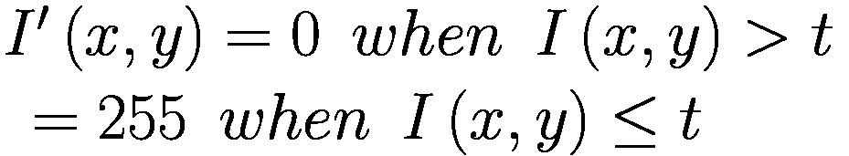

当双峰直方图没有被零密度区域明显分开时，选择阈值 *t* 的一个良好策略是取双峰区域峰值处的像素强度平均值。如果这些峰值强度分别表示为 *p*[1] 和 *p*[2]，那么阈值 *t* 可以选择如下：

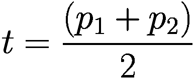

或者，可以使用在 *p*[1] 和 *p*[2] 之间的像素强度，其中直方图密度最小，作为阈值化像素强度。如果直方图密度函数表示为 *H*(*p*)，其中 *p* ∈ {0, 1, 2, ..., 255} 表示像素强度，那么

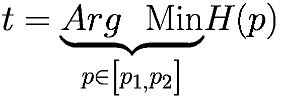

这种二值阈值化的想法可以扩展到基于像素强度直方图的多个阈值化。

### 大津法

大津法用于图像分割，通过最大化图像不同段之间的方差来确定阈值。如果使用大津法进行二值阈值化，以下是需要遵循的步骤：

+   计算图像中每个像素强度的概率。考虑到有 *N* 个可能的像素强度，归一化直方图将给出图像的概率分布。

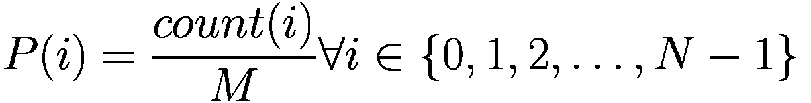

+   如果图像基于阈值 *t* 有两个段 *C*[1] 和 *C*[2]，那么像素集合 {0, 2 …. *t*} 属于 *C*[1]，而像素集合 {*t* + 1, *t* + 2…..*L* − 1} 属于 *C*[2]。两个段之间的方差由集群相对于全局均值的平均平方偏差之和确定。平方偏差由每个集群的概率加权。

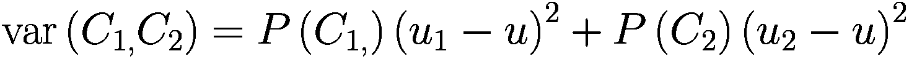

其中 *u*[1]，*u*[2] 是第 1 个和第 2 个聚类的均值，而 *u* 是整体的全局均值。

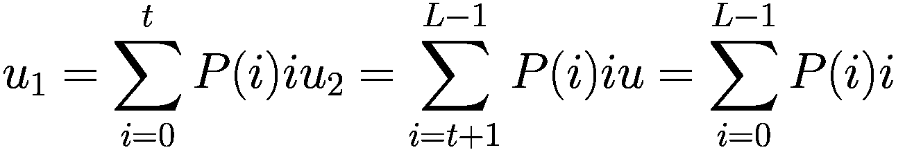

每个段落的概率是该图像中属于该类的像素数量。段 *C*[1] 的概率与小于或等于阈值强度 *t* 的像素数量成正比，而段 *C*[2] 的概率与大于阈值 *t* 的像素数量成正比。因此，

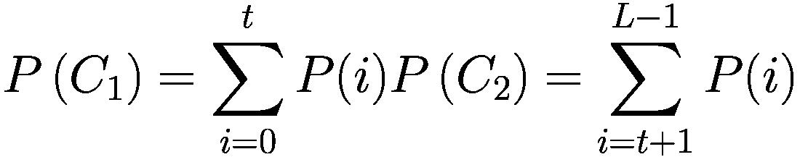

+   如果我们观察 *u*[1]，*u*[2]，*P*(*C*[1]) 和 *P*(*C*[2]) 的表达式，它们每一个都是阈值 *t* 的函数，而整体均值 *u* 在给定图像的情况下是恒定的。因此，段间方差 *var*(*C*[1,]*C*[2]) 是阈值像素强度 *t* 的函数。最大化方差的阈值 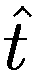 将为我们提供使用 Otsu 方法进行分割的最佳阈值：

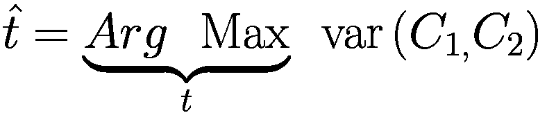

代替计算导数并将其设为零以获得 ，可以在所有 *t* = {0, 1, 2, …, *L* − 1} 的值上评估 *var*(*C*[1,]*C*[2])，然后选择使 *var*(*C*[1,]*C*[2]) 最大的 。

Otsu 的方法也可以扩展到多个段，其中对于图像，需要确定 (*k* - 1) 个阈值，而不是一个阈值，以对应于 *k* 个段。

刚才所展示的两种方法的逻辑——即基于像素强度直方图的二值化方法和 Otsu 的方法——已在列表 6-1 中展示，以供参考。为了便于理解，这里使用了核心逻辑而不是使用图像处理包来实现这些算法。另外，需要注意的是，这些分割过程通常适用于灰度图像或如果对每个颜色通道进行分割。

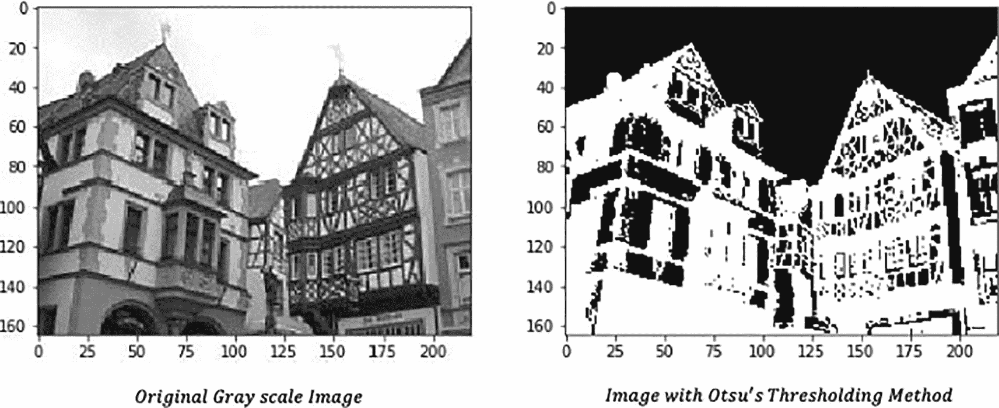

两张房屋的图像，第一张是原始灰度图像，第二张是将 Otsu 的二值化方法应用于第一张图像的结果。

图 6-2

Otsu 的二值化方法

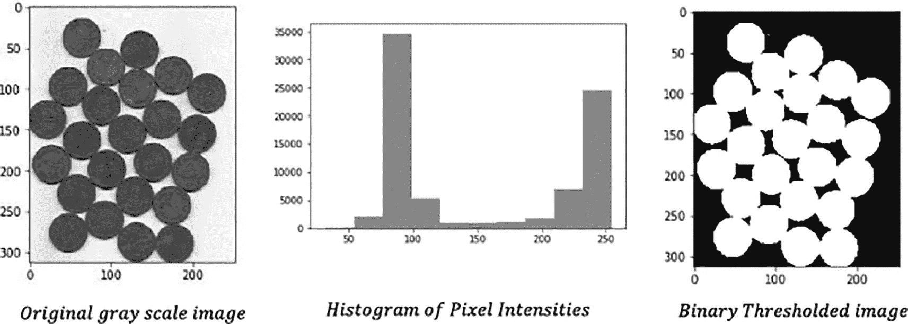

三张图像在矩形框中。第一张是硬币的灰度图像，第二张是直方图，第三张是将二值化方法应用于第一张图像的结果。

图 6-1

基于像素强度直方图的二值化方法

```py
"""
Binary thresholding Method
From the histogram plotted below it's evident that the distribution is bimodal with the
lowest probability around  at around pixel value of 150\. Hence 150 would be a good threshold
for binary segmentation
"""
import cv2
import matplotlib.pyplot as plt
%matplotlib inline
import numpy as np
img = cv2.imread("/home/santanu/Downloads/coins.jpg")
gray = cv2.cvtColor(img,cv2.COLOR_BGR2GRAY)
plt.figure(1)
plt.imshow(gray,cmap='gray')
row,col = np.shape(gray)
gray_flat = np.reshape(gray,(row*col,1))[:,0]
plt.figure(2)
plt.hist(list(gray_flat))
gray_const = []
for i in range(len(gray_flat)):
if gray_flat[i] < 150 :
gray_const.append(255)
else:
gray_const.append(0)
gray_const = np.reshape(np.array(gray_const),(row,col))
plt.figure(3)
plt.imshow(gray_const,cmap='gray')
"""
Otsu's thresholding Method  - Determines the threshold by maximizing the interclass variance
"""
img = cv2.imread("/home/santanu/Downloads/otsu.jpg")
gray = cv2.cvtColor(img,cv2.COLOR_BGR2GRAY)
plt.figure(1)
plt.imshow(gray,cmap='gray')
row,col = np.shape(gray)
hist_dist = 256*[0]
# Compute the frequency count of each of the pixel in the image
for i in range(row):
for j in range(col):
hist_dist[gray[i,j]] += 1
# Normalize the frequencies to produce probabilities
hist_dist = [c/float(row*col) for c in hist_dist]
# Compute the between segment variance
def var_c1_c2_func(hist_dist,t):
u1,u2,p1,p2,u = 0,0,0,0,0
for i in range(t+1):
u1 += hist_dist[i]*i
p1 += hist_dist[i]
for i in range(t+1,256):
u2 += hist_dist[i]*i
p2 += hist_dist[i]
for i in range(256):
u += hist_dist[i]*i
var_c1_c2 = p1*(u1 - u)**2 + p2*(u2 - u)**2
return var_c1_c2
# Iteratively run through all the pixel intensities from 0 to 255 and chose the one that
# maximizes the variance
variance_list = []
for i in range(256):
var_c1_c2 = var_c1_c2_func(hist_dist,i)
variance_list.append(var_c1_c2)
## Fetch the threshold that maximizes the variance
t_hat = np.argmax(variance_list)
## Compute the segmented image based on the threshold t_hat
gray_recons = np.zeros((row,col))
for i in range(row):
for j in range(col):
if gray[i,j] <= t_hat :
gray_recons[i,j] = 255
else:
gray_recons[i,j] = 0
plt.figure(2)
plt.imshow(gray_recons,cmap='gray')
--output --
Listing 6-1
Python Implementation of Binary Thresholding Method Based on Histogram of Pixel Intensities and Otsu’s Method
```

在图 6-1 中，基于像素强度直方图的二值化已应用于硬币的原始灰度图像，以将对象（即硬币）从背景中分离出来。基于像素强度直方图，选择了像素强度 150 作为阈值。像素强度低于 150 的被设置为 255 以表示对象，而像素强度高于 150 的被设置为 0 以表示背景。

图 6-2 展示了 Otsu 的图像二值化方法，该方法根据黑白颜色产生两个段。黑色代表背景，而白色代表房屋。图像的最佳阈值是像素强度 143。

### 图像分割的水平集算法

水平集算法旨在分割像素强度局部最小值周围的拓扑区域。如果将灰度图像的像素强度值视为其水平和垂直坐标的函数，那么该算法试图找到局部最小值周围的区域，称为吸引盆地或集水盆地。一旦这些盆地被识别出来，算法就会尝试通过在高峰或脊上构建分隔或流域来将它们分开。为了更好地理解该方法，让我们通过图 6-3 所示的简单示意图来查看此算法。

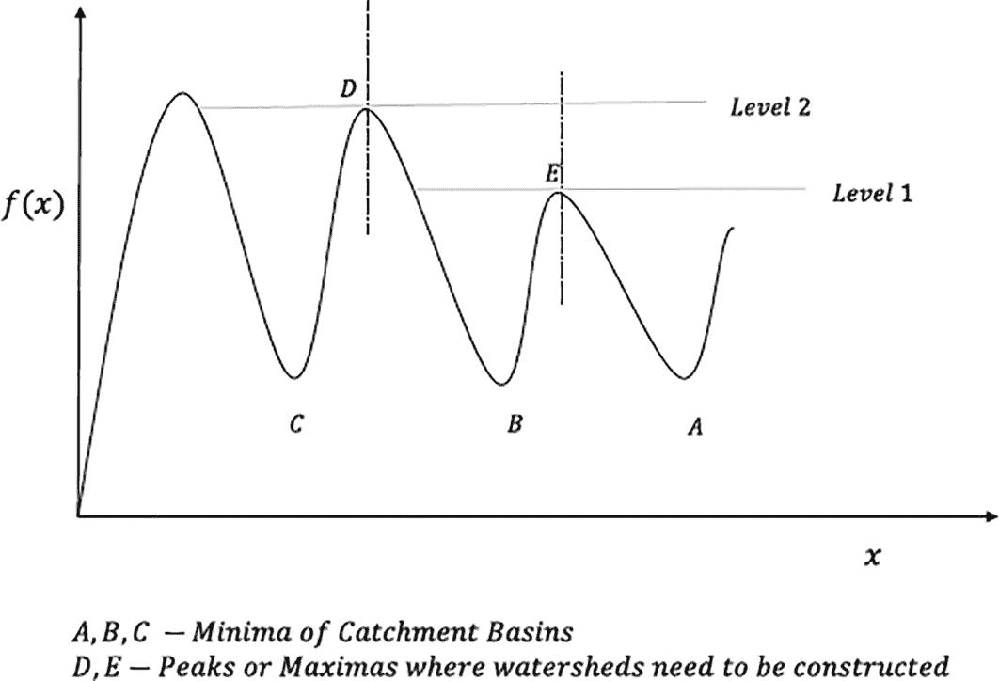

在 f x 与 x 平面上绘制的函数图。峰值 d 和 e 被标记为 2 级和 1 级。凹槽被命名为 a、b 和 c。

图 6-3

水平集算法示意图

如果我们从集水盆的最小值开始注水，水会一直填充到 1 级，此时一滴额外的水有可能溢出到集水盆*A*。为了防止水溢出，需要在*A*处建造一个坝或分水岭。一旦我们在*A*处建造了分水岭，我们就可以继续在集水盆*B*中注水，直到 2 级，此时一滴额外的水有可能溢出到集水盆*C*。为了防止水溢出到*C*，需要在*C*处建造一个分水岭。使用这种逻辑，我们可以继续建造分水岭来分隔这样的集水盆。这是分水岭算法背后的基本思想。在这里，函数是一元的，而在灰度图像的情况下，表示像素强度的函数将是两个变量的函数：垂直和水平坐标。

分水岭算法在检测物体之间存在重叠时特别有用。阈值技术无法确定不同的物体边界。我们将通过在包含重叠硬币的图像上应用分水岭技术来展示这一点，如列表 6-2 所示。

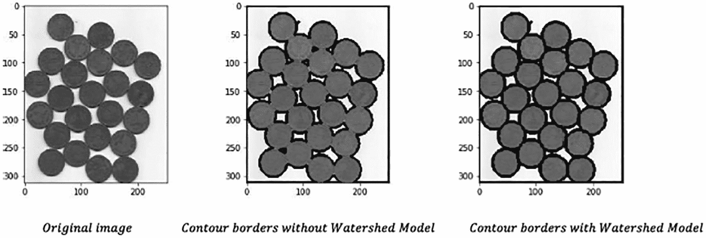

三幅图像，第一幅是硬币的原始图像。第二幅和第三幅分别是应用了轮廓边界而没有使用分水岭建模和使用了分水岭模型后的轮廓边界的结果。

图 6-4

图像分割的分水岭算法示意图

```py
import numpy as np
import cv2
import matplotlib.pyplot as plt
from scipy import ndimage
from skimage.feature import peak_local_max
from skimage.segmentation import watershed
# Load the coins image
img = cv2.imread("/home/santanu/Downloads/coins.jpg")
# Convert the image to gray scale
imgray = cv2.cvtColor(img,cv2.COLOR_BGR2GRAY)
plt.figure(1)
plt.imshow(imgray,cmap='gray')
# Threshold the image to convert it to Binary image based on Otsu's method
thresh = cv2.threshold(imgray, 0, 255,
cv2.THRESH_BINARY | cv2.THRESH_OTSU)[1]
"""
Detect the contours and display them.
As we can see in the 2nd image below that the contours are not prominent at the regions of
overlap with normal thresholding method. However with Wateshed algorithm the
the same is possible because of its ability to better separate regions of overlap by
building watersheds at the boundaries of different basins of pixel intensity minima
"""
contours, hierarchy = cv2.findContours(thresh,cv2.RETR_TREE,cv2.CHAIN_APPROX_SIMPLE)
y = cv2.drawContours(imgray, contours, -1, (0,255,0), 3)
plt.figure(2)
plt.imshow(y,cmap='gray')
"""
Hence we will proceed with the Watershed algorithm so that each of the coin form its own
cluster and hence its possible to have separate contours for each coin.
Relabel the thresholded image to be consisting of only 0 and 1
as the input image to distance_transform_edt should be in this format.
"""
thresh[thresh == 255] = 5
thresh[thresh == 0] = 1
thresh[thresh == 5] = 0
"""
The distance_transform_edt and the peak_local_max functions helps building the markers by detecting
points near the centre points of the coins. One can skip these steps and create a marker
manually by setting one pixel within each coin with a random number represneting its cluster
"""
D = ndimage.distance_transform_edt(thresh)
localMax = peak_local_max(D, indices=False, min_distance=10,
labels=thresh)
markers = ndimage.label(localMax, structure=np.ones((3, 3)))[0]
"""
Provide the EDT distance matrix and the markers to the watershed algorithm to detect the clusters
labels for each pixel. For each coin, the pixels corresponding to it will be filled with the cluster number
"""
labels = watershed(-D, markers, mask=thresh)
print("[INFO] {} unique segments found".format(len(np.unique(labels)) - 1))
# Create the contours for each label(each coin and append to the plot)
for k in np.unique(labels):
if k != 0 :
labels_new = labels.copy()
labels_new[labels == k] = 255
labels_new[labels != k] = 0
labels_new = np.array(labels_new,dtype='uint8')
contours, hierarchy = cv2.findContours(labels_new,cv2.RETR_TREE,cv2.CHAIN_APPROX_SIMPLE)
z = cv2.drawContours(imgray,contours, -1, (0,255,0), 3)
plt.figure(3)
plt.imshow(z,cmap='gray')
--output --
Listing 6-2
Image Segmentation Using Watershed Algorithm
```

如图 6-4 所示，应用分水岭算法后，重叠硬币的边界是清晰的，而其他阈值方法无法为每个硬币提供清晰的边界。

### 使用 K-means 聚类进行图像分割

著名的*K*均值算法也可以用于图像分割，特别是医学图像分割。*K*是算法的一个参数，它决定了要形成的不同簇的数量。该算法通过形成簇来工作，每个这样的簇都基于特定的输入特征表示为其簇中心。通过*K*均值进行的图像分割通常基于输入特征，如像素强度及其三个空间维度，即水平坐标和垂直坐标以及颜色通道。因此，输入特征向量*u*∈ℝ^(4×1)可以表示如下：

![$$ u={\left[I\left(x,y,z\right),x,y,z\right]}^T $$](img/448418_2_En_6_Chapter/448418_2_En_6_Chapter_TeX_Equi.png)

同样，可以忽略空间坐标，将三个颜色通道上的像素强度作为输入特征向量，即，

![$$ u={\left[{I}_R\left(x,y\right),{I}_G\left(x,y\right),{I}_B\left(x,y\right)\right]}^T $$](img/448418_2_En_6_Chapter/448418_2_En_6_Chapter_TeX_Equj.png)

其中 *I**R*, *I**G*, 和 *I**B* 分别表示在空间坐标 (*x*, *y*) 处红色、绿色和蓝色通道上的像素强度。

算法使用距离度量，例如 *L*² 或 *L*¹ 范数，如下所示：

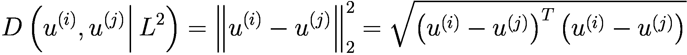

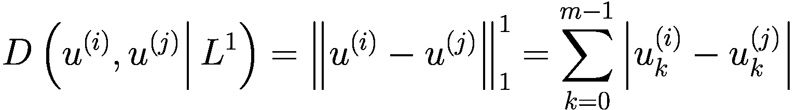

在前面的方程中，*m* 表示用于聚类的特征数量。

以下是 *K*-均值算法的工作细节：

+   *步骤 1:* 从随机选择的 *K* 个聚类中心 *C*[1], *C*[2] … *C*[*k*] 开始，这些中心对应于 *K* 个聚类 *S*[1], *S*[2] … *S*[*k*]。

+   *步骤 2:* 计算每个像素特征向量 *u*^((*i*)) 与聚类中心之间的距离，并将其标记为与像素最近的聚类中心 *C*[*j*] 对应的聚类 *S*[*j*]：

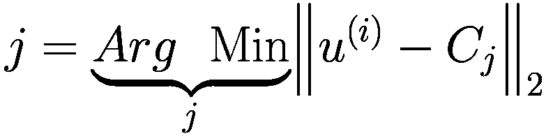

+   此过程需要对所有像素特征向量重复进行，以便在 *K* 均值的一次迭代中，所有像素都被标记为 *K* 个聚类中的一个。

+   *步骤 3:* 一旦为所有像素分配了新的中心聚类，就通过取每个聚类中像素特征向量的平均值来重新计算中心：

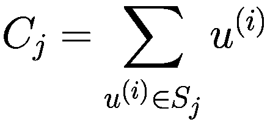

+   重复 *步骤 2* 和 *步骤 3* 多次迭代，直到中心不再变化。通过这个迭代过程，我们正在减少表示如下：

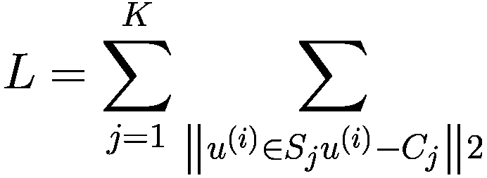

列表 6-3 展示了 *K*-均值算法的简单实现，使用三个颜色通道的像素强度作为特征。图像分割使用 *K* = 3 实现。输出以灰度显示，因此可能无法揭示分割的实际质量。然而，如果以颜色格式显示与列表 6-3 中生成的相同分割图像，它将揭示分割的更细微细节。还有一点要补充：最小化的成本或损失函数——即簇内距离之和——是一个非凸函数，因此可能存在局部最小值问题。可以通过为簇中心点设置不同的初始值多次触发分割，然后选择最小化成本函数最多或产生合理分割的那个。

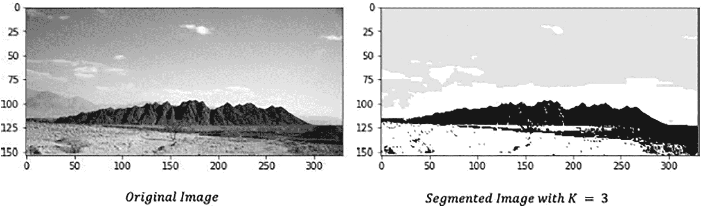

两张照片，原始的是风景照。第二张是使用 K-means 方法进行分割的插图。

图 6-5

K-means 算法分割的插图

```py
import cv2
import numpy as np
import matplotlib.pyplot as plt
np.random.seed(0)
"""
K means that one has used in Machine learning
clustering also provides good segmentation as we see below
"""
img = cv2.imread("/home/santanu/Downloads/kmeans1.jfif")
imgray_ori = cv2.cvtColor(img,cv2.COLOR_BGR2GRAY)
plt.figure(1)
plt.imshow(imgray_ori,cmap='gray')
# Save the dimensions of the image
row,col,depth = img.shape
# Collapse the row and column axis for faster matrix operation.
img_new = np.zeros(shape=(row*col,3))
glob_ind = 0
for i in range(row):
for j in range(col):
u = np.array([img[i,j,0],img[i,j,1],img[i,j,2]])
img_new[glob_ind,:] = u
glob_ind += 1
"""
Set the number of clusters
One can experiment with different values of K and select
the one that provides good clustering. Having said that Image processing
especially image enhancement and segmentation to some extent is subjective.
"""
K = 5
num_iter = 20
"""
K means suffers from local minima solution and hence
its better to trigger K-means several times with different random seed value
"""
for g in range(num_iter):
# Define cluster for storing the cluster number and out_dist to store the distances from centroid
clusters = np.zeros((row*col,1))
out_dist = np.zeros((row*col,K))
centroids = np.random.randint(0,255,size=(K,3))
for k in range(K):
diff = img_new - centroids[k,:]
diff_dist = np.linalg.norm(diff,axis=1)
out_dist[:,k] = diff_dist
# Assign the cluster with minimum distance to a pixel location
clusters = np.argmin(out_dist,axis=1)
# Recompute the clusters
for k1 in np.unique(clusters):
centroids[k1,:] = np.sum(img_new[clusters == k1,:],axis=0)/np.sum([clusters == k1])
# Reshape the cluster labels in two dimensional image form
clusters = np.reshape(clusters,(row,col))
out_image = np.zeros(img.shape)
#Form the 3-D image with the labels replaced by their correponding centroid pixel intensity
for i in range(row):
for j in range(col):
out_image[i,j,0] = centroids[clusters[i,j],0]
out_image[i,j,1] = centroids[clusters[i,j],1]
out_image[i,j,2] = centroids[clusters[i,j],2]
out_image = np.array(out_image,dtype="uint8")
# Display the output image after converting into gray scale
# Readers adviced to display the image as it is for better clarity
imgray = cv2.cvtColor(out_image,cv2.COLOR_BGR2GRAY)
plt.figure(2)
plt.imshow(imgray,cmap='gray')
---output ---
Listing 6-3
Image Segmentation Using K means
```

从图 6-5 可以看出，对于 *K* = 3，K-means 聚类在分割图像方面做得很好。

### 语义分割

近年来，通过卷积神经网络进行图像分割已经获得了很大的流行。通过神经网络分割图像时显著不同的一点是分配每个像素到对象类别的注释过程，这样此类分割网络的训练就完全是监督的。尽管注释图像的过程是一笔昂贵的开销，但它通过提供一个用于比较的基真值来简化了问题。基真值将是一个包含代表特定对象颜色的像素的图像。例如，如果我们正在处理一组“猫和狗”图像，这些图像可能有背景，那么图像中的每个像素可以属于三个类别之一——猫、狗和背景。此外，每个对象类别通常由一个代表颜色表示，以便基真值可以显示为分割图像。让我们看看一些可以进行语义分割的卷积神经网络。

### 滑动窗口方法

可以通过使用滑动窗口从原始图像中提取图像块，然后将这些块输入到分类卷积神经网络中，以预测每个图像块的中央像素所属的类别。使用这种滑动窗口方法训练卷积神经网络在训练和测试时都将非常计算密集，因为每个图像至少需要输入 *N* 个图像块，其中 *N* 表示图像中的像素数。

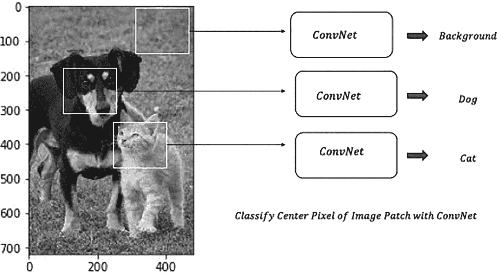

一张狗和猫的照片。所有元素，包括背景、狗和猫，都使用滑动窗口方法进行分类并用箭头指示。

图 6-6

滑动窗口语义分割

图 6-6 展示了一个用于分割猫、狗和背景图像的滑动窗口语义分割网络。它从原始图像中裁剪出块，并通过分类 CNN 对块中的中心像素进行分类。可以使用预训练的网络，如 AlexNet、VGG19、Inception V3 等，作为分类 CNN，并将输出层替换为只有三个类别的标签，分别对应狗、猫和背景。然后可以通过反向传播对 CNN 进行微调，以图像块作为输入，以输入图像块的中心像素类别标签作为输出。从图像卷积的角度来看，这种网络非常低效，因为相邻的图像块将有很大的重叠，每次独立重新处理它们会导致不必要的计算开销。为了克服上述网络的缺点，可以使用完全卷积网络，这是我们接下来要讨论的主题。

### 完全卷积网络（FCN）

完全卷积网络（FCN）由一系列卷积层组成，没有全连接层。卷积的选择使得输入图像在空间维度上没有变化，即图像的高度和宽度保持不变。与滑动窗口方法不同，完全卷积网络一次预测所有像素类别。该网络的输出层由 *C* 个特征图组成，其中 *C* 是每个像素可以分类到的类别数，包括背景。如果原始图像的高度和宽度分别为 *h* 和 *w*，则输出由 *C* 个 *h* × *w* 特征图组成。此外，对于真实情况，应有 *C* 个与 *C* 个类别对应的分割图像。在任何空间坐标 (*h*[1], *w*[1]) 上，每个特征图都包含与该特征图相关联的像素类别的得分。对于每个空间像素位置 (*h*[1], *w*[1]) 的特征图得分形成一个针对不同类别的 SoftMax。

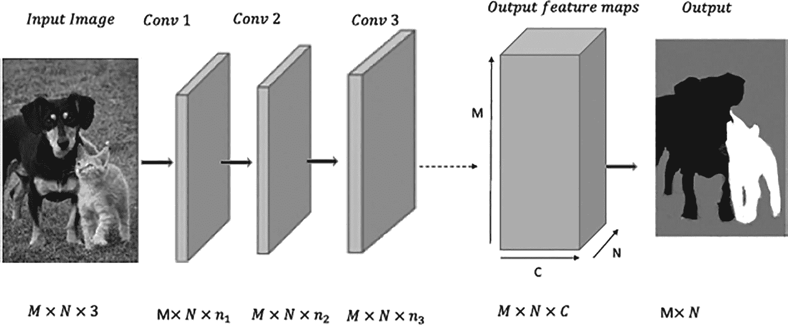

一张猫和狗的照片在完全卷积网络架构中经过多层处理以实现最终输出。

图 6-7

全卷积网络架构

图 6-7 包含了一个全卷积网络的架构设计。输出特征图的数量以及地面真实特征图的数量将是 3，对应于三个类别。如果第 *k* 类在空间坐标 (*i*, *j*) 处的输入网络激活或分数表示为 *s*[*k*]^((*i*,*j*))，那么该像素在空间坐标 (*i*, *j*) 处的第 *k* 类的概率由 SoftMax 概率给出，如下所示：

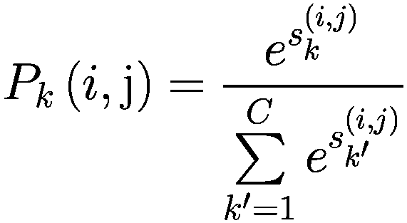

此外，如果第 *k* 类在空间坐标 (*i*, *j*) 处的地面真实标签由 *y**k* 给出，那么该像素在空间位置 (*i*, *j*) 处的交叉熵损失可以表示如下：

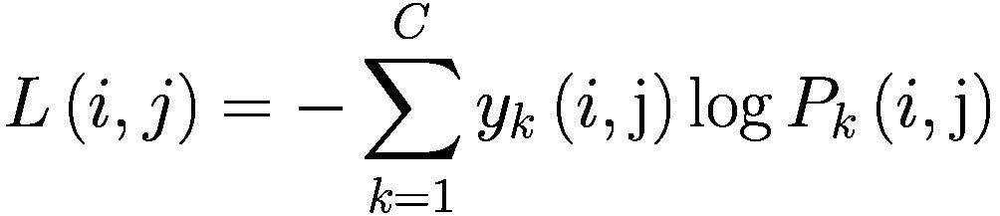

如果输入到网络中的图像的高度和宽度分别为 *M* 和 *N*，那么一张图像的总损失 *L* 如下所示：

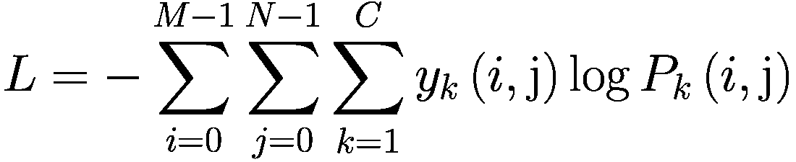

图像可以被作为小批量输入到网络中，因此可以将每张图像的平均损失作为每个小批量学习周期的优化损失或成本函数。

空间位置 (*i*, *j*) 处像素的输出类别 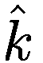 可以通过取概率 *P**k* 最大的类别 *k* 来确定，即，

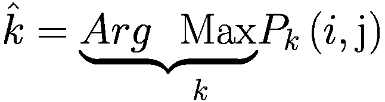

需要对图像的所有空间位置的像素执行相同的操作，以获得最终的分割图像。

在图 6-8 中，展示了用于分割猫、狗和背景图像的网络输出特征图。如图所示，对于这三个类别或类别中的每一个，都有一个单独的特征图。特征图的空间维度与输入图像相同。对于所有三个类别，在空间坐标 (*i*, *j*) 处显示了网络输入激活、相关概率和相应的地面标签。

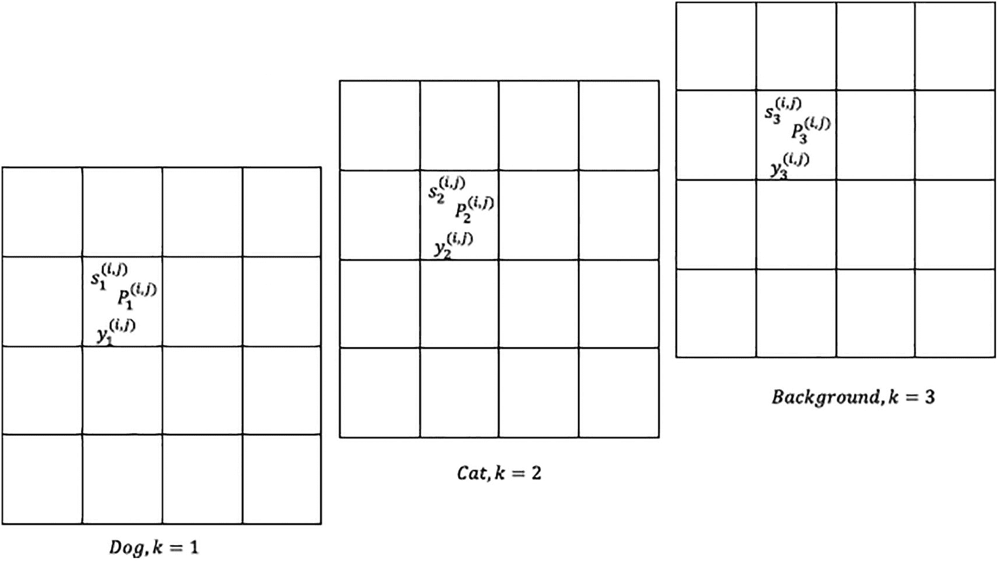

对于狗、猫和背景，分别有三种 4 x 4 的网格模式，其中 k 分别等于 1、2 和 3。

图 6-8

对应于狗、猫和背景的每个类别的输出特征图

网络中的所有卷积层都保留了输入图像的初始空间维度。因此，对于高分辨率图像，网络将非常计算密集，特别是如果每个卷积中的特征图或通道数很高。为了解决这个问题，更广泛使用的一种全卷积神经网络变体是在网络的第一个半部分下采样图像，然后在网络的第二半部分上采样图像。这种全卷积网络的修改版本将成为我们接下来讨论的主题。

### 带有下采样和上采样的全卷积网络

与之前网络中在所有卷积层中保留图像的空间维度不同，这种全卷积网络的变体使用了一种组合卷积，其中图像在网络的第一个半部分下采样，然后在最终层上采样以恢复原始图像的空间维度。通常，这样的网络由几层通过步长卷积和/或池化操作的下采样层和几层上采样层组成。图 6-9 展示了这样一个网络的高级架构设计。

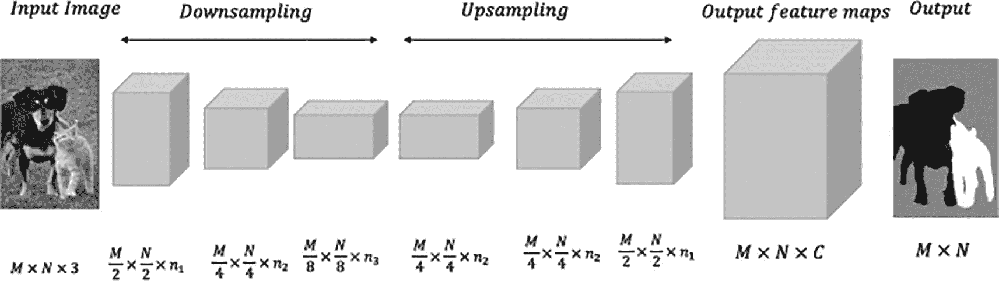

一张照片在完全卷积网络中通过多个层的处理，称为下采样和上采样，以实现最终的输出。

图 6-9

带有下采样和上采样的全卷积网络

常用于上采样图像或特征图的技巧将在下文中讨论。

#### 反池化

反池化可以被视为池化的逆操作。在最大池化或平均池化中，我们通过基于池化核的大小取像素值的最大值或平均值来减少图像的空间维度。因此，如果我们有一个 2 x 2 的池化核，图像的空间维度在每个空间维度上都会减少 。在反池化中，我们通常通过在一个邻域中重复像素值来增加图像的空间维度，如图 6-10（A）所示。

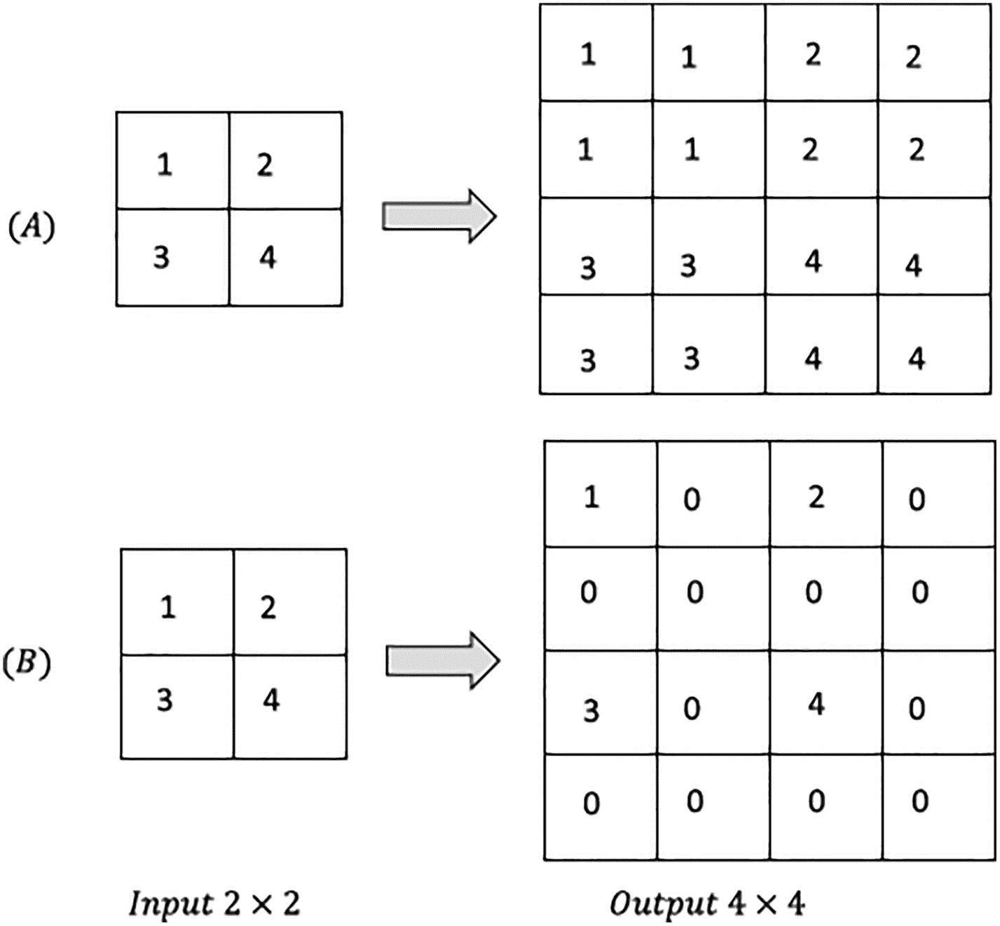

两个 2 x 2 的网格模式作为输入被处理，形成两个 4 x 4 的网格模式作为输出，用于反池化操作。

图 6-10

反池化操作

同样，可以选择在邻域中填充一个像素，其余设置为 0，如图 6-10（B）所示。

#### 最大反池化

许多全卷积层是对称的，因为网络前半部分的一个池化操作将在网络后半部分有一个相应的反池化操作来恢复图像大小。每当执行池化时，由于相邻像素结果的汇总由一个代表性元素表示，因此会丢失输入图像的微小空间信息。例如，当我们使用 2 x 2 核进行最大池化时，每个邻域的最大像素值被传递到输出以表示 2 x 2 邻域。从输出中，无法推断出最大像素值的位置。因此，在这个过程中，我们丢失了输入的空间信息。在语义分割中，我们希望将每个像素分类得尽可能接近其真实标签。然而，由于最大池化，图像的边缘和其他更精细的细节信息丢失了很多。当我们试图通过反池化重建图像时，我们可以恢复一些丢失的空间信息的一种方法是将输入像素的值放置在对应于最大池化输出输入来源的输出位置。为了更好地可视化，让我们看一下图 6-11 中的说明。

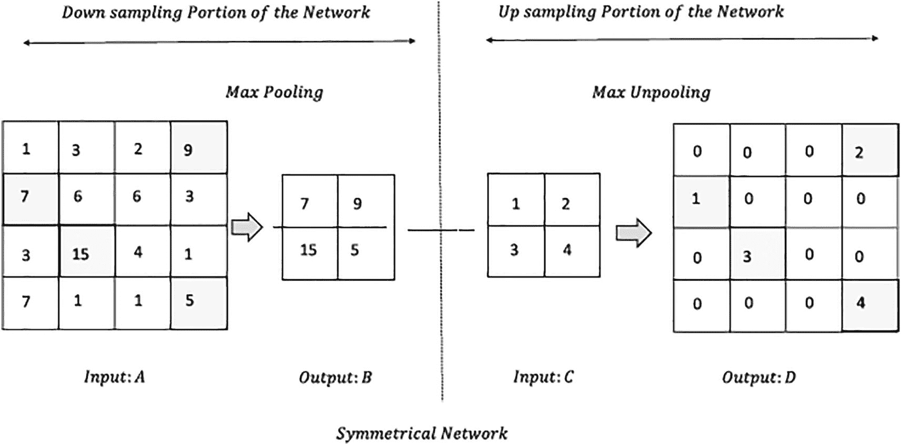

使用一个 4 x 4 的矩阵来形成一个 2 x 2 的矩阵进行最大池化，并使用一个 2 x 2 的矩阵来形成一个 4 x 4 的矩阵进行最大反池化，以说明一个对称网络。

图 6-11

对称全连接分割网络的最大反池化说明

如我们从图 6-11 中可以看到，在反池化时，只有输出图*D*中对应于输入 A 相对于最大池化中最大元素位置的地点被填充了值。这种反池化方法通常被称为*最大反池化*。

#### 转置卷积

通过反池化或最大反池化进行的上采样是固定变换。这些变换在训练网络时不需要网络学习任何参数。一种可学习的上采样方法是执行转置卷积，这与我们所知的卷积操作非常相似。由于转置卷积涉及网络将学习的参数，网络将学会以减少网络训练的整体成本函数的方式进行上采样。现在，让我们深入了解转置卷积的工作原理。

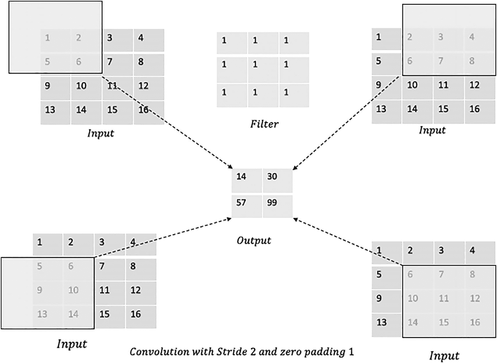

四个 4 x 4 矩阵的输入，所有箭头都指向中心 2 x 2 矩阵的输出。一个滤波器被定义为 3 x 3 的矩阵。

图 6-12

用于下采样图像的步长卷积操作

在步长卷积中，对于步长为 2 的每个空间维度，输出维度几乎是输入维度的一半。图 6-12 说明了使用步长为 2 和 1 个 0 填充的 4 x 4 核对 5 x 5 维度的 2D 输入进行卷积的操作。我们将核在输入上滑动，并在核位于每个位置时，计算核与核重叠的输入部分的点积。

在转置卷积中，我们使用相同的逻辑，但与下采样不同，大于 1 的步长提供了上采样。因此，如果我们使用步长为 2，则每个空间维度的输入大小都会加倍。图 6-13a、6-13b 和 6-13c 说明了使用 3 x 3 核对 2 x 2 维度的输入进行转置卷积的操作，以产生 4 x 4 的输出。与卷积中滤波器与输入部分的点积不同，在转置卷积中，在特定位置，滤波器的值由滤波器放置处的输入值加权，加权后的滤波器值填充在输出中的相应位置。沿着相同空间维度的连续输入值的输出放置在由转置卷积的步长确定的间隔中。对所有输入值执行相同的操作。最后，将对应于每个输入值的输出相加以产生最终的输出，如图 6-13c 所示。

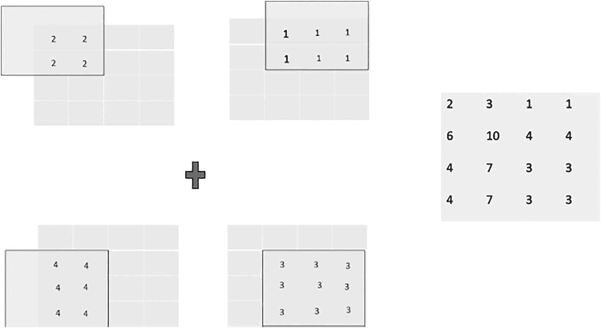

通过将一个 2 x 2 矩阵、一个 2 x 3 矩阵、一个 3 x 2 矩阵和一个 3 x 3 矩阵相加，形成一个 4 x 4 矩阵。

图 6-13c

上采样的转置卷积

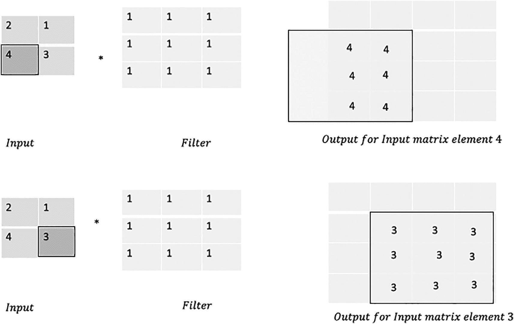

两个过程被描绘为一个 2 x 2 的输入矩阵与一个 3 x 3 的滤波矩阵操作，分别给出输入矩阵元素 4 和 3 的输出。

图 6-13b

上采样的转置卷积

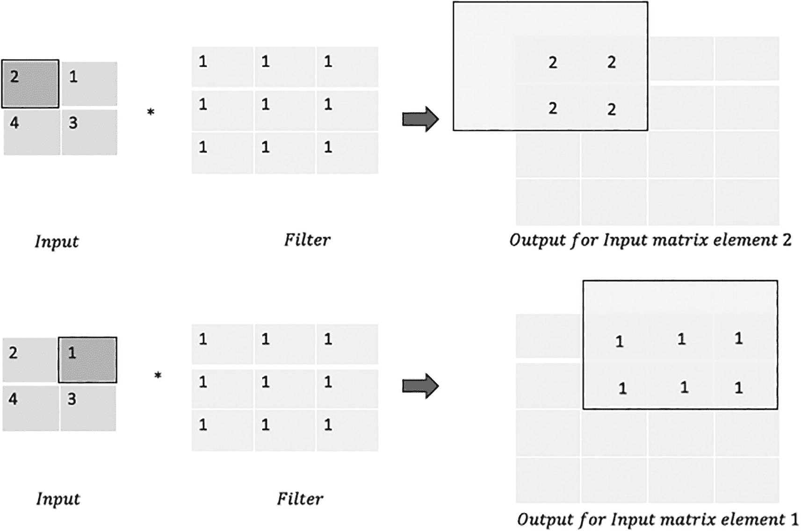

两个过程使用一个 2 x 2 的输入矩阵与一个 3 x 3 的滤波矩阵操作，分别给出输入矩阵元素 2 和 1 的输出。

图 6-13a

上采样的转置卷积

在 TensorFlow 中，函数`tf.nn.conv2d_transpose`可以用于通过转置卷积进行上采样。

### U-Net

U-Net 卷积神经网络是近年来在图像分割，尤其是医学图像分割中最有效的架构之一。这个 U-Net 架构在 2015 年 ISBI 的细胞追踪挑战赛中获胜。网络拓扑从输入层到输出层遵循 U 形模式，因此得名 U-Net。[Olaf Ronneberger](https://arxiv.org/find/cs/1/au:%252BRonneberger_O/0/1/0/all/0/1)，[Philipp Fischer](https://arxiv.org/find/cs/1/au:%252BFischer_P/0/1/0/all/0/1)，和[Thomas Brox](https://arxiv.org/find/cs/1/au:%252BBrox_T/0/1/0/all/0/1)提出了这个用于分割的卷积神经网络，模型细节在白皮书“U-Net：用于生物医学图像分割的卷积网络”中进行了说明。该论文可以在[`https://arxiv.org/abs/1505.04597`](https://arxiv.org/abs/1505.04597)找到。

在网络的第一部分，图像通过卷积和最大池化操作的组合进行下采样。卷积与像素级的 ReLU 激活相关联。每个卷积操作都使用 3×3 大小的滤波器，且没有零填充，这导致输出特征图在每个空间维度上减少两个像素。在网络的第二部分，下采样后的图像被上采样到最终层，其中输出特征图对应于正在分割的对象的特定类别。每张图像的成本函数将是像素级的分类交叉熵或对数损失，如我们之前所见，在整个图像上求和。需要注意的是，U-Net 中的输出特征图的空间维度比输入特征图少。例如，一个具有 572×572 空间维度的输入图像会产生 388×388 空间维度的输出特征图。有人可能会问，在训练过程中，如何进行像素到像素的类别比较以计算损失。想法很简单——分割后的输出特征图与从输入图像中心提取的 388×388 大小的真实分割图像进行比较。核心思想是，如果有一张更高分辨率的图像，比如 1024×1024，可以从它中随机创建许多 572×572 空间维度的图像用于训练。此外，从这些 572×572 的子图像中提取中心 388×388 的区域并给每个像素贴上相应的类别标签，从而创建真实图像。这有助于即使训练数据量不多，也能用大量数据训练网络。图 6-14 展示了 U-Net 的架构图。

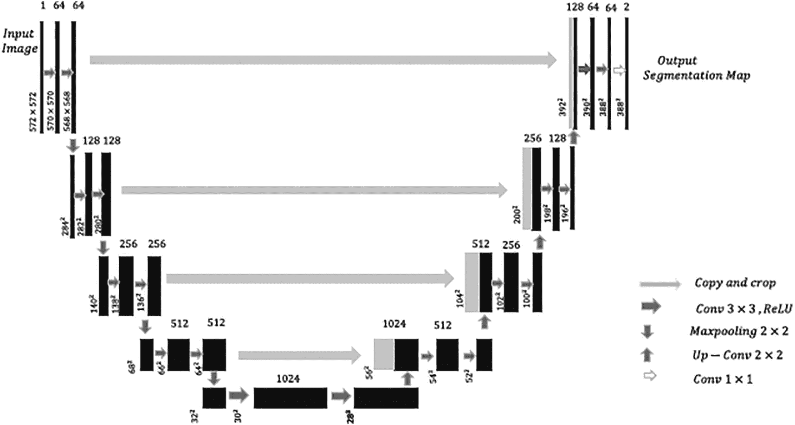

U-Net 架构图的插图包括一个输入图像和一个输出分割图，使用五种不同类型的箭头表示。

图 6-14

U-Net 架构图

从架构图中我们可以看到，在网络的第一部分，图像经过卷积和最大池化以减少空间维度，同时增加通道深度，即增加特征图的数量。每两个连续的卷积及其相关的 ReLU 激活之后，都会跟随着一个最大池化操作，这会将图像尺寸减少到原来的 1/4。每次最大池化操作都会使网络降低到下一组卷积，并有助于网络第一部分的 U 形结构。同样，上采样层在每个维度上增加 2 的空间维度，因此图像尺寸增加四倍。此外，它还为网络的第二部分提供了 U 结构。每次上采样之后，图像都会经过两个卷积及其相关的 ReLU 激活。

在最大池化和上采样操作方面，U-Net 是一个非常对称的网络。然而，对于一对相应的最大池化和上采样，最大池化之前的图像尺寸与上采样之后的图像尺寸并不相同，这与其他全卷积层不同。正如之前讨论的，当执行最大池化操作时，由于输出中的代表像素对应于图像的局部邻域，因此会丢失大量的空间信息。当图像被上采样回其原始尺寸时，很难恢复这些丢失的空间信息，因此新的图像在边缘和其他更精细的图像方面也缺少很多信息。这导致分割效果不佳。如果上采样后的图像与对应最大池化操作之前的图像具有相同的空间维度，那么可以在上采样后的输出特征图之前附加一定数量的随机特征图，以帮助网络恢复一些丢失的空间信息。由于在 U-Net 的情况下，这些特征图维度不匹配，因此 U-Net 在上采样之前裁剪特征图，使其具有与上采样输出特征图相同的空间维度，并将它们连接起来。这有助于改善图像的分割效果，因为它有助于恢复在最大池化过程中丢失的一些空间信息。需要注意的是，上采样可以通过我们迄今为止查看的任何方法来完成，例如反池化、最大反池化和转置卷积，这同样也被称为反卷积。

U-Net 分割的大多数成功案例如下：

+   只需使用少量标注或手工分割的图像，就可以生成大量的训练数据。

+   即使需要分离的接触物体属于同一类别，U-Net 也能进行良好的分割。正如我们之前在传统图像处理方法中看到的，分离属于同一类别的接触物体是困难的，例如像流域算法这样的方法需要大量的物体标记输入来得到合理的分割。U-Net 通过为接触段边缘周围的像素错误分类引入高权重，从而在相同类别的接触段之间进行良好的分离。

### 使用全连接神经网络的 TensorFlow 语义分割

在本节中，我们将详细介绍基于 Kaggle 竞赛“Carvana”的 TensorFlow 实现的工作细节，该竞赛用于从背景中分割汽车图像。输入图像及其真实分割结果可用于训练目的。我们在 80%的训练数据上训练模型，并在剩余的 20%数据上验证模型的性能。对于训练，我们使用一个具有 U-Net 结构的前半部分的全连接卷积网络，随后通过转置卷积进行上采样。与 U-Net 不同的地方有两点：一是通过使用填充为*SAME*来保持空间维度不变，在执行卷积时；二是这个模型不使用跳过连接来连接下采样流和上采样流中的特征图。详细的实现细节在列表 6-4 中提供。

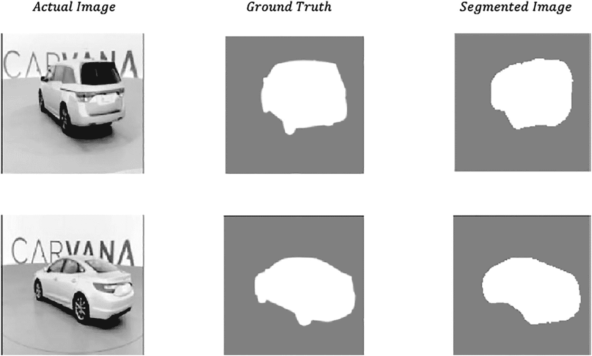

两辆不同汽车的两组图像：实际图像、真实图像和分割图像。

图 6-15a

在 128 × 128 尺寸图像上训练的模型在验证数据集上的分割结果

```py
# Load the different packages
import tensorflow as tf
print(f"Tensorflow version: {tf.__version__}")
from sklearn.model_selection import train_test_split
import matplotlib.pyplot as plt
%matplotlib inline
import os
from subprocess import check_output
import numpy as np
from tensorflow.keras.utils import img_to_array, array_to_img, load_img
from  skimage.transform import resize
from tensorflow.keras import layers, Model
from pathlib import Path
import imageio
class segmentation_model(Model):
"""
Segmentation Model consisting of downsampling in the 1st half using
convolution followed by upsampling in the 2nd half using Traspose Convolution
"""
def __init__(self):
super(segmentation_model,self).__init__()
self.conv11, self.conv12, self.pool1  = self.conv_block(filters=64,kernel_size=3,strides=1,
padding='SAME',activation='relu',
pool_size=2,pool_stride=2)
self.conv21, self.conv22, self.pool2  = self.conv_block(filters=128,kernel_size=3,strides=1,
padding='SAME',activation='relu',
pool_size=2,pool_stride=2)
self.conv31, self.conv32, self.pool3  = self.conv_block(filters=256,kernel_size=3,strides=1,
padding='SAME',activation='relu',
pool_size=2,pool_stride=2)
self.conv41, self.conv42, self.pool4  = self.conv_block(filters=512,kernel_size=3,strides=1,
padding='SAME',activation='relu',
pool_size=2,pool_stride=2)
self.conv51, self.conv52              = self.conv_block(filters=1024,kernel_size=3,strides=1,
padding='SAME',activation='relu',
pool_size=2,pool_stride=2,pool=False)
self.deconv1 = self.deconv_block(filters=1024,kernel_size=3,strides=2,padding='SAME',activation='relu')
self.deconv2 = self.deconv_block(filters=512,kernel_size=3,strides=2,padding='SAME',activation='relu')
self.deconv3 = self.deconv_block(filters=256,kernel_size=3,strides=2,padding='SAME',activation='relu')
self.deconv4 = self.deconv_block(filters=128,kernel_size=3,strides=2,padding='SAME',activation='relu')
self.convf = layers.Conv2D(filters=1,kernel_size=1,strides=1,padding='SAME')
def conv_block(self,filters,kernel_size,strides,padding,activation,pool_size,pool_stride,pool=True):
conv11 = layers.Conv2D(filters=filters,kernel_size=kernel_size,strides=(strides,strides),padding=padding,activation=activation)
conv12 = layers.Conv2D(filters=filters,kernel_size=kernel_size,strides=(strides,strides),padding=padding,activation=activation)
if pool:
pool1  = layers.MaxPool2D(pool_size=(pool_size,pool_size),strides=(pool_stride,pool_stride))
return conv11, conv12, pool1
return conv11, conv12
def deconv_block(self,filters,kernel_size,strides,padding,activation):
deconv1 = layers.Conv2DTranspose(filters=filters,kernel_size=kernel_size,strides=(strides,strides),padding=padding,activation=activation)
return deconv1
def call(self,x):
x = self.conv11(x)
x = self.conv12(x)
x = self.pool1(x)
#
x = self.conv21(x)
x = self.conv22(x)
x = self.pool2(x)
#
x = self.conv31(x)
x = self.conv32(x)
x = self.pool3(x)
#
x = self.conv41(x)
x = self.conv42(x)
x = self.pool4(x)
#
x = self.conv51(x)
x = self.conv52(x)
#
x = self.deconv1(x)
x = self.deconv2(x)
x = self.deconv3(x)
x = self.deconv4(x)
x = self.convf(x)
return x
def grey2rgb(img):
"""
utility function to convert greyscale images to rgb
"""
new_img = []
for i in range(img.shape[0]):
for j in range(img.shape[1]):
new_img.append(list(img[i][j])*3)
new_img = np.array(new_img).reshape(img.shape[0], img.shape[1], 3)
return new_img
def data_gen_small(data_dir, mask_dir, images, batch_size, dims):
"""
Generator that we will use to read the data from the directory
"""
while True:
ix = np.random.choice(np.arange(len(images)), batch_size)
imgs = []
labels = []
for i in ix:
# images
img_path = f"{Path(data_dir)}/{images[i]}"
original_img = imageio.imread(img_path)
resized_img = resize(original_img, dims)
array_img = img_to_array(resized_img)
imgs.append(array_img)
# masks
prefix = images[i].split(".")[0]
mask_path = f"{Path(mask_dir)}/{prefix}_mask.gif"
original_mask = imageio.imread(mask_path)
resized_mask = resize(original_mask, dims)
array_mask = img_to_array(resized_mask)
labels.append(array_mask[:, :, 0])
imgs = np.array(imgs)
labels = np.array(labels)
yield imgs, labels.reshape(-1, dims[0], dims[1],1)
def train(data_dir,mask_dir,batch_size=4,train_val_split=[0.8,0.2],
img_height=128,img_width=128,lr=0.01,num_batches=500):
model = segmentation_model()
model_graph = tf.function(model)
# Get the path to all images for dynamic fetch in each batch generation
all_images = os.listdir(data_dir)
# Train val split
train_images, validation_images = train_test_split(all_images, train_size=train_val_split[0],
test_size=train_val_split[1])
# Create train and val generator
train_gen = data_gen_small(data_dir, mask_dir, train_images,batch_size=batch_size,
dims=(img_height,img_width))
validation_gen = data_gen_small(data_dir, mask_dir, validation_images,batch_size=batch_size,
dims=(img_height,img_width))
# Setting up the optimizer
optimizer = tf.keras.optimizers.Adam(lr)
# setting up the Binary Cross entropy loss for the two segmentation class
loss_fn = tf.keras.losses.BinaryCrossentropy(from_logits=True)
for batch in range(num_batches):
X_batch,y_batch = next(train_gen)
X_batch, y_batch =  tf.constant(X_batch), tf.constant(y_batch)
with tf.GradientTape() as tape:
y_pred_batch = model_graph(X_batch)
loss_ = loss_fn(y_batch,y_pred_batch)
# Compute gradient
gradients = tape.gradient(loss_, model.trainable_variables)
# Update the parameters
optimizer.apply_gradients(zip(gradients, model.trainable_variables))
X_val,y_val = next(validation_gen)
X_val,y_val = tf.constant(X_val), tf.constant(y_val)
y_val_pred = model_graph(X_val,training=False)
loss_val = loss_fn(y_val,y_val_pred)
print(f"Batch : {batch} , train loss:{loss_.numpy()/batch_size}, val loss: {loss_val/batch_size}")
return model, model_graph, X_val,y_val, y_val_pred
height,width=128,128
data_dir = "/media/santanu/9eb9b6dc-b380-486e-b4fd-c424a325b976/Kaggle Competitions/Carvana/train/"
mask_dir = "/media/santanu/9eb9b6dc-b380-486e-b4fd-c424a325b976/Kaggle Competitions/Carvana/train_masks/"
model, model_graph, X_val,y_val, y_val_pred = train(data_dir,mask_dir,batch_size=4,train_val_split=[0.8,0.2],img_height=height,img_width=width,
lr=0.0002,num_batches=500)
--output--
('batch:', 494, 'train loss:', 0.047129884, 'val loss:', 0.046108384)
('batch:', 495, 'train loss:', 0.043634158, 'val loss:', 0.046292961)
('batch:', 496, 'train loss:', 0.04454672,  'val loss:', 0.044108659)
('batch:', 497, 'train loss:', 0.048068151, 'val loss:', 0.044547819)
('batch:', 498, 'train loss:', 0.044967934, 'val loss:', 0.047069982)
('batch:', 499, 'train loss:', 0.041554678, 'val loss:', 0.051807735)
Listing 6-4
Semantic Segmentation in TensorFlow with Fully Connected Neural Network
```

平均训练损失和验证损失几乎相同，这表明模型没有过拟合并且泛化良好。如图 6-15a 所示，基于提供的真实分割结果，分割结果看起来令人信服。该网络使用的图像空间维度是 128 × 128。当将输入图像的空间维度增加到 512 × 512 时，准确性和分割效果显著提高。由于这是一个没有全连接层的全卷积网络，因此处理新图像尺寸所需的网络变化非常少。一些验证数据集图像的分割输出在图 6-15b 中展示，以说明更大的图像尺寸通常对图像分割问题有益，因为它有助于捕捉更多上下文。

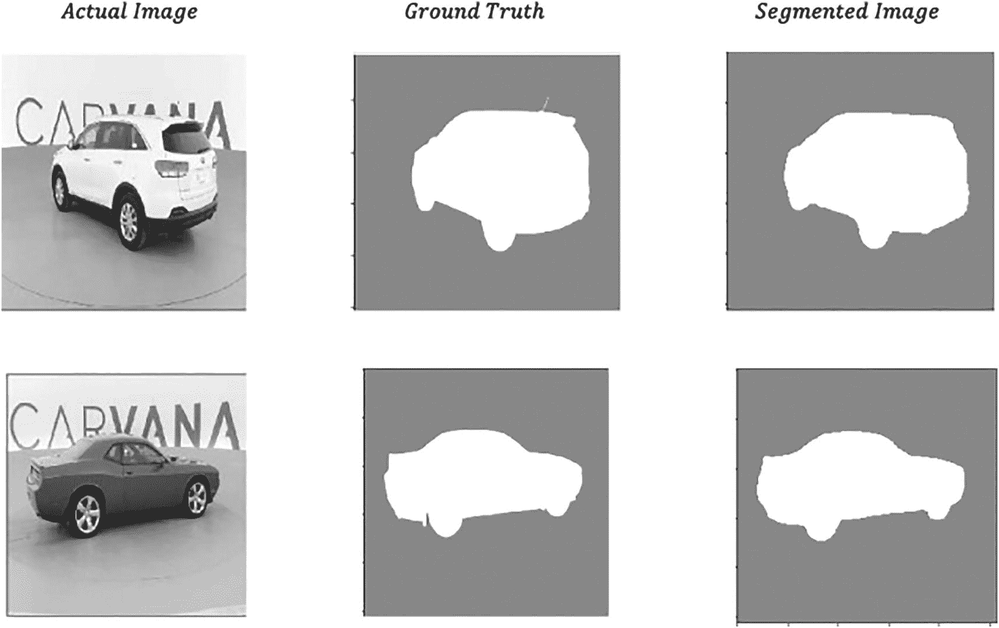

两辆不同汽车的两组图像：实际图像、真实图像和分割图像。

图 6-15b

在 512 × 512 尺寸图像上训练的模型在验证数据集上的分割结果

## 图像分类和定位网络

图像分类模型可以预测图像中物体的类别，但并没有真正告诉我们物体的位置。可以使用边界框来表示图像中物体的位置。如果图像被标注了边界框，并且输出类别也有相同的信息，我们可以训练模型来预测这些边界框以及类别对象。这些边界框可以用四个数字来表示，其中两个对应于边界框最左上角的空间坐标，另外两个表示边界框的高度和宽度。可以使用卷积神经网络进行分类，另一个用于通过回归预测这些边界框属性。然而，通常使用同一个卷积神经网络，但有两个不同的预测头——一个用于对象的类别，另一个用于边界框位置属性。这种在图像中预测物体周围边界框的技术被称为*定位*。图 6-16 展示了与狗和猫图像相关的图像分类和定位网络。这类神经网络的一个*先验*假设是图像中只有一个类别对象。

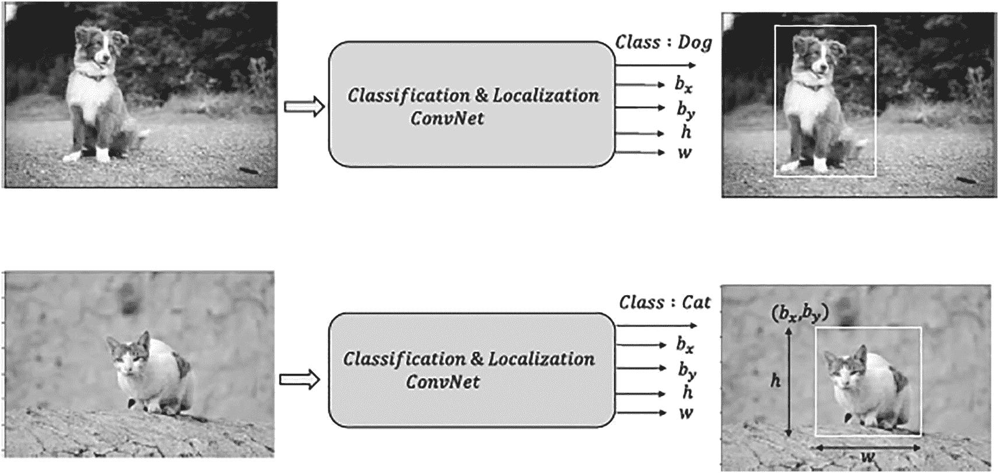

使用两张狗的照片和两张猫的照片分别来展示 ConvNet 的分类和定位。

图 6-16

分类和定位网络

该网络的损失函数将是一个组合，包括对不同对象类别的分类成本以及与预测边界框属性相关的回归成本。由于要优化的成本是一个多任务目标函数，需要确定分配给每个任务多少权重。这很重要，因为这些任务的不同成本——比如说分类的交叉熵和回归的均方根误差——会有不同的尺度，如果成本没有适当地加权形成总成本，就可能导致优化偏离方向。这些成本需要归一化到共同尺度，然后根据任务的复杂度分配权重。设处理*n*个类别和一个由四个数字确定的边界框的卷积神经网络的参数为*θ*。设输出类别由向量*y* = [*y*[1]*y*[2]... *y*[n*]]^(*T*) ∈ {0, 1}^(*n* × 1)表示，其中每个*y*[j] ∈ {0, 1}。此外，设边界框数字由向量*s* = [*s*[1] *s*[2]*s*[3] *s*[4]]^(*T*)表示，其中*s*[1]和*s*[2]表示左上角像素的边界框坐标，而*s*[3]和*s*[4]表示边界框的高度和宽度。如果类别的预测概率由*p* = [*p*[1]*p*[2]... *p*[n*]]^(*T*)表示，而预测的边界框属性由*t* = [*t*[1]*t*[2]*t*[3]*t*[4]]^(*T*)表示，那么与图像相关的损失或成本函数可以表示如下：

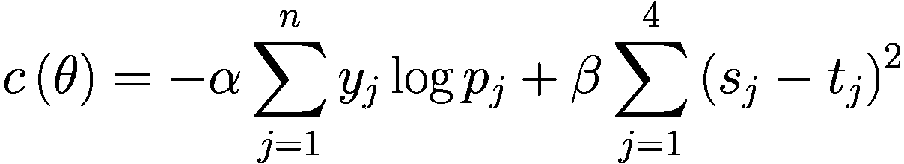

前述表达式中第一项表示*n*个类别的 SoftMax 的交叉熵，而第二项是与预测边界框属性相关的回归成本。参数*α*和*β*是网络的超参数，应该进行微调以获得合理的结果。对于*m*个数据点的迷你批次，成本函数可以表示如下：

![C(θ)=1/m-α∑_{i=1}^m∑_{j=1}^n{y}^{(i)}_jlog{p}^{(i)}_j+β∑_{i=1}^m∑_{j=1}⁴{(s}^{(i)}_j-{t}^{(i)}_j)}²其中，*i* 的后缀代表不同的图像。前面的代价函数可以通过梯度下降来最小化。顺便说一下，当比较不同版本的这个网络以及不同超参数值 (*α*, *β*) 的性能时，不应将这些网络相关的代价作为选择最佳网络的准则。相反，应该使用一些其他指标，如精确度、召回率、F1 分数、曲线下面积等，用于分类任务，以及如预测框和真实框的重叠面积等指标，用于定位任务。## 目标检测通常情况下，图像中不包含一个对象，而是包含多个感兴趣的对象。有很多应用可以从在图像中检测多个对象中受益。例如，目标检测可以用来统计商店几个区域的人数，以进行人群分析。此外，可以通过对通过信号灯的车辆数量进行粗略估计来检测信号灯上的交通负荷。目标检测正在被利用的另一个领域是在工业设施的自动化监督中检测事件并在发生安全违规时生成警报。可以在工厂的关键危险区域捕获连续图像，并根据图像中检测到的多个对象从这些图像中捕获关键事件。例如，如果一个工人在需要他佩戴安全手套、眼镜和头盔的机器上工作，可以通过检测图像中是否检测到这些提到的对象来捕获安全违规。在图像中检测多个目标的问题是计算机视觉中的一个经典问题。首先，我们不能使用前一小节中描述的分类和定位网络，因为图像中可能包含不同数量的对象。为了激发我们解决目标检测问题的兴趣，让我们从一个非常简单的方法开始。我们可以通过暴力滑动窗口技术从现有图像中随机取图像块，然后将它们输入到预训练的目标分类和定位网络中。图 6-17 展示了在图像中检测多个目标的滑动窗口方法。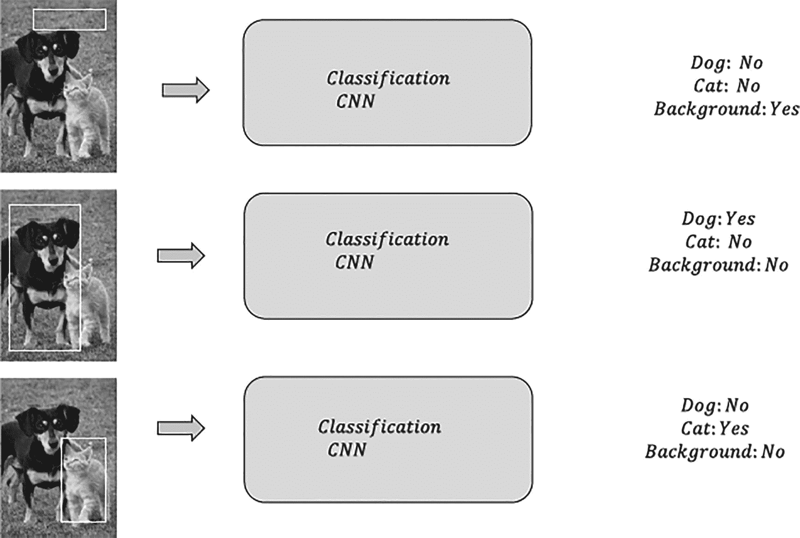

三张狗和猫在一起的图片分别用箭头标出，用于分类 C N N，对狗、猫和背景的选项给出是或否的结果。

图 6-17

滑动窗口技术在目标检测中的应用

尽管这种方法可以工作，但它计算成本非常高，或者更确切地说，在缺乏良好的区域建议的情况下，它将是计算上不可行的，因为人们将不得不尝试成千上万的不同位置和尺度的图像块。当前在目标检测中的高级方法提出几个可能包含对象的位置区域，然后将这些图像-建议区域输入到分类和定位网络。其中一种目标检测技术称为 R-CNN，我们将在下面讨论。

### R-CNN

在 R-CNN 中，*R*代表*区域*建议。区域建议通常通过一种称为*选择性搜索*的算法推导出来。对图像进行选择性搜索通常提供大约 2000 个感兴趣的区域建议。选择性搜索通常利用传统的图像处理技术来定位图像中的 blobby 区域，作为可能包含对象的潜在区域。以下是对选择性搜索的广泛处理步骤：

+   在图像内生成许多区域，每个区域只能属于一个类别。

+   通过贪婪方法递归地将较小的区域组合成较大的区域。在每一步中，合并的两个区域应最为相似。这个过程需要重复进行，直到只剩下一个区域。这个过程产生了一系列逐渐增大的区域层次，使得算法能够提出多种可能的对象检测区域。这些生成的区域被用作候选区域建议。

然后，这 2000 个感兴趣的区域被输入到分类和定位网络中，以预测对象的类别及其相关的边界框。分类网络是一个卷积神经网络，后面跟着一个支持向量机进行最终分类。图 6-18 展示了 R-CNN 的高级架构。

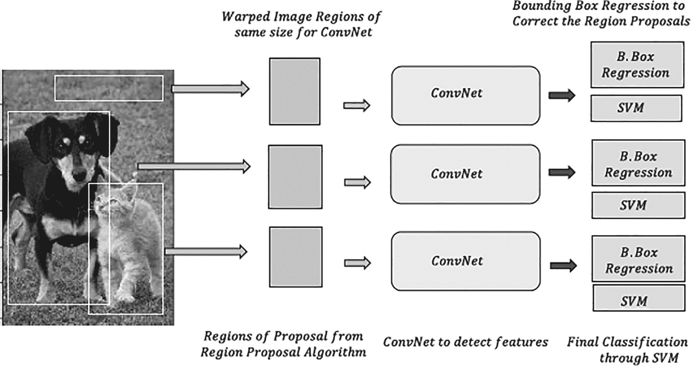

四个步骤：输入图像为狗和猫一起，为 ConvNet 和边界框回归进行变形的图像区域，以纠正区域建议。

图 6-18

R-CNN 网络

以下是与训练 R-CNN 相关的高级步骤：

+   使用预训练的 ImageNet CNN，例如 AlexNet，并用需要检测的对象以及背景重新训练最后一层全连接层。

+   获取每张图像的所有区域建议（根据选择性搜索，每张图像为 2000 个），将它们变形或调整大小以匹配 CNN 输入大小，通过 CNN 进行处理，然后将特征保存到磁盘以供进一步处理。通常，池化层输出图被保存为特征到磁盘。

+   使用 CNN 的特征来训练 SVM 以分类对象或背景。对于每个对象类别，应该有一个 SVM 学习区分特定对象和背景。

+   最后，进行边界框回归以纠正区域建议。

虽然 R-CNN 在目标检测方面做得很好，但以下是一些它的缺点：

+   R-CNN 的一个问题是提出了大量的候选框，这使得网络非常慢，因为每个这 2000 个候选框都会通过卷积神经网络独立地流动。此外，区域候选框在某种意义上是固定的，因为它们是由区域候选框算法提出的；R-CNN 并没有学习这些候选框。

+   预测的定位和边界框来自不同的模型，因此在进行模型训练时，我们并没有基于训练数据学习任何特定于对象定位的内容。

+   对于分类任务，卷积神经网络生成的特征用于微调 SVM，导致处理成本更高。

### Fast and Faster R-CNN

Fast R-CNN 通过为整个图像提供共同的卷积路径（直到一定数量的层），克服了 R-CNN 的一些计算挑战，在这个点上，区域候选框被投影到输出特征图，并且相关区域被提取出来，通过全连接层进行进一步处理，然后进行最终的分类。从卷积输出的特征图中提取相关区域候选框并将它们调整到全连接层固定大小的工作是通过称为 ROI 池化的池化操作完成的。图 6-19 展示了 Fast R-CNN 的架构图。

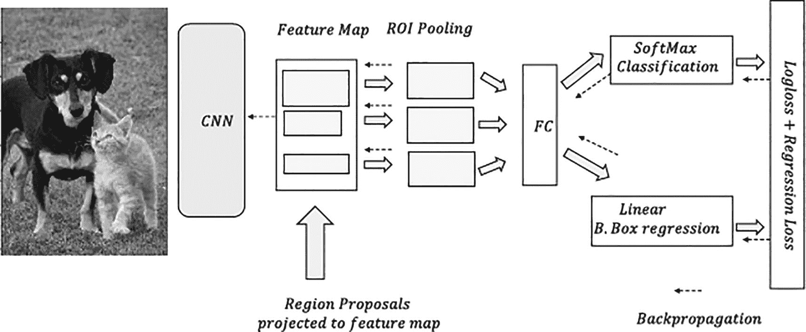

四个步骤：输入图像为狗和猫一起，CNN 块，特征图，ROI 池化，FC，分类和回归，以及 logloss +回归损失。

图 6-19

Fast R-CNN 示意图

Fast R-CNN 节省了 R-CNN 中与多次卷积操作相关的许多成本（每张图像 2000 次选择性搜索），然而，区域候选框仍然依赖于外部区域候选框算法，如选择性搜索。由于这种对外部区域候选框算法的依赖，Fast R-CNN 在区域候选框的计算上受到瓶颈。网络必须等待这些外部候选框被提出后才能继续前进。这些瓶颈问题通过 faster R-CNN 得到解决，其中区域候选框是在网络内部完成的，而不是依赖于外部算法。faster R-CNN 的架构图几乎与 Fast R-CNN 相同，但增加了一个新的部分——区域候选框网络，消除了对外部区域候选框方案（如选择性搜索）的依赖。

## 生成对抗网络

生成对抗网络，或称为 GAN，是近年来深度学习中的一个显著进步。伊恩·古德费洛和同事们于 2014 年在一篇名为“生成对抗网络”的 NIPS 论文中首次介绍了这个网络。该论文可在[`https://arxiv.org/abs/1406.2661`](https://arxiv.org/abs/1406.2661)找到。从那时起，人们对生成对抗网络产生了很大兴趣，并进行了大量研究。实际上，Yann LeCun，这位最杰出的深度学习专家之一，认为生成对抗网络的引入是近年来深度学习中最重大的突破。GAN 被用作生成模型，用于生成类似给定分布产生的合成数据。GAN 在多个领域有用途和潜力，如图像生成、图像修复、抽象推理、语义分割、视频生成、从一个领域到另一个领域的内容迁移，以及文本到图像生成应用等。

生成对抗网络基于博弈论中的双代理零和博弈。生成对抗网络有两个神经网络，生成器 (*G*) 和判别器 (*D*)，相互竞争。生成器 (*G*) 尝试欺骗判别器 (*D*)，使得判别器无法区分来自分布的真实数据和生成器 (*G*) 生成的假数据。同样，判别器 (*D*) 学习区分生成器 (*G*) 生成的真实数据和假数据。在一定时期内，判别器和生成器在相互竞争的同时各自提高自己的任务。这个博弈论问题的最优解由纳什均衡给出，其中生成器学习生成假数据，使其看起来像来自原始数据分布，同时判别器对真实和假数据点输出 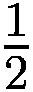 的概率。

现在，最明显的问题是如何构建假数据。假数据是通过从先验分布 *P*[*z*] 中采样噪声 *z* 来通过生成神经网络模型 (*G*) 构建的。如果实际数据 *x* 遵循分布 *P*[*x*]，而生成器生成的假数据 *G*(*z*) 遵循分布 *P*[*g*]，那么在平衡状态下 *P**x* 应该等于 *P**g*)；即，

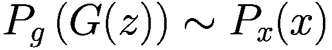

由于在均衡状态下，伪造数据的分布几乎与真实数据分布相同，生成器将学会采样伪造数据，这些数据难以与真实数据区分。此外，在均衡状态下，判别器 *D* 应该输出  作为两个类别——真实数据和伪造数据的概率。在我们通过生成对抗网络的数学之前，了解零和博弈、纳什均衡和最小最大公式是很有价值的。

在图 6-20 中展示的是一个生成对抗网络，其中包含两个神经网络，生成器 (*G*) 和判别器 (*D*)，它们相互竞争。

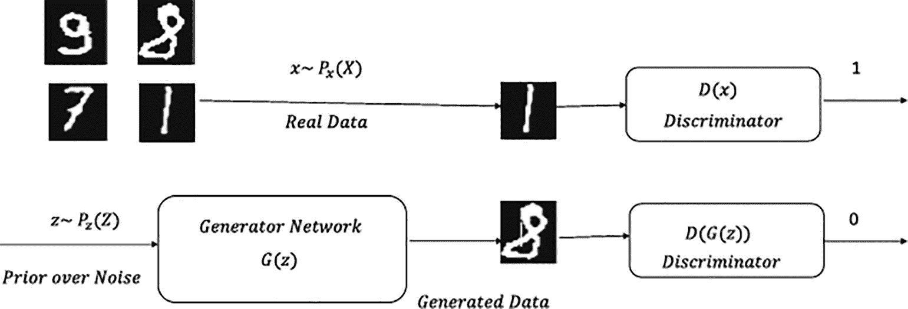

生成对抗网络的说明包括一组四个不同的数字，真实数据，两个不同函数的判别器部分，生成器网络和生成数据部分。

图 6-20

对抗网络的简单说明

### 最大最小和最小最大问题

在游戏中，每个参与者都会试图最大化他们的收益并提高他们获胜的机会。考虑一个由 *N* 个竞争者进行的游戏，候选者 *i* 的最大最小策略是在其他 *N-1* 个参与者试图击败候选者 *i* 的情况下，最大化他的收益。与最大最小策略相对应的候选者 *i* 的收益是候选者 *i* 在不知道其他人的移动的情况下肯定能得到的最大值。因此，最大最小策略 *s*[*i*]^* 和最大最小值 *L*[*i*]^* 可以表示如下：

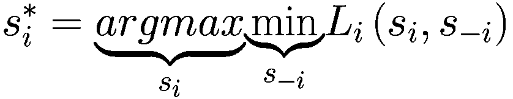

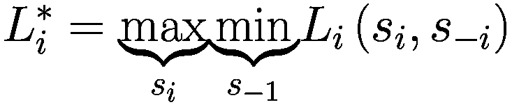

解释候选者 *i* 的最大最小策略的一个简单方法就是考虑 *i* 已经了解了他对手的移动，并且他们会尝试最小化他在每个移动中可能获得的最大收益。因此，在这个假设下，*i* 将会进行一个移动，这个移动将是他在每个移动中所有最小值中的最大值。

在这个范式下解释最小最大策略比用更技术性的术语解释要容易。在最小最大策略中，候选者 *i* 会假设由 -*i* 表示的其他候选者会允许他们在每个移动中达到最小值。在这种情况下，*i* 选择一个移动，这个移动能为他提供所有其他候选者在每个移动中为 *i* 设定的最小收益中的最大值是合理的。在最小最大策略下，候选者 *i* 的收益如下：

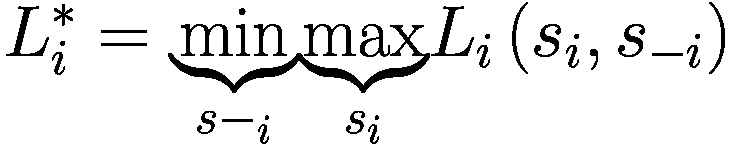

请注意，当所有玩家都采取行动后，最终的收益或损失可能与最小-最大或最大-最小值不同。

让我们尝试用一个直观的例子来激发最小-最大问题，其中两个代理 *A* 和 *B* 正在相互竞争以最大化他们在游戏中的利润。同时，我们假设 *A* 可以进行三个动作，*L*[1]、*L*[2] 和 *L*[3]，而 *B* 可以进行两个动作，*M*[1] 和 *M*[2]。这个收益表如图 6-21 所示。在每个单元格中，第一个条目对应于 *A* 的收益，而第二个条目表示 *B* 的收益。

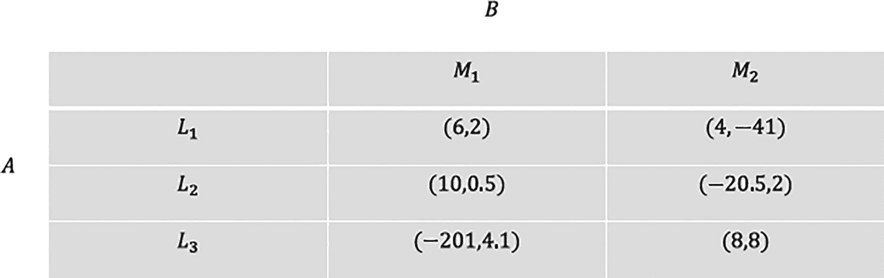

一个表格有 3 列和 4 行。对于 *M*[1] 和 *M*[2]，分别有 L 1、L 2 和 L 3 的值。

图 6-21

两位玩家之间的最小-最大和最大-最小说明

让我们先假设 *A* 和 *B* 都在玩最小-最大策略；也就是说，他们应该采取行动以最大化他们的收益，同时预期对方会尽可能最小化他们的收益。

*A* 的最小-最大策略将是选择行动 *L*[1]，在这种情况下，*A* 能得到的最低值是 4。如果他选择 *L*[2]，*A* 风险结束时的收益可能是 –20，而如果他选择 *L*[3]，他可能得到的更糟，达到 –201。因此，*A* 的最小-最大值是每一行中所有可能的最小值中的最大值，即 4，对应策略 *L*[1]。

*B* 的最小-最大策略将是选择 *M*[1]，因为在 *M*[1] 上 *B* 能得到的最低值是 0.5。如果 *B* 选择 *M*[2]，那么 *B* 风险结束时的收益可能是 –41。因此，*B* 的最小-最大值是所有可能的最小值中的最大值，即 0.5，对应 *M*[1]。

现在，假设 *A* 和 *B* 都在玩最小-最大策略，即 (*L*[1], *M*[1])，在这种情况下，*A* 的收益是 6，而 *B* 的收益是 2。因此，我们看到，一旦玩家采取最大-最小策略，最大-最小值与实际收益值是不同的。

现在，让我们看看两位玩家都希望采取最小-最大策略的情况。在最小-最大策略中，玩家选择一个策略，以到达一个最大值，这个最大值是对手每一次行动中所有可能的最大值中的最小值。

让我们来看看 *A* 的最小-最大值和策略。如果 *B* 选择 *M*[1]，*A* 能得到的最大值是 10，而如果 *B* 选择 *M*[2]，*A* 能得到的最大值是 88。显然，*B* 会允许 *A* 在 *B* 的每一次行动中只取可能的最大值中的最小值，因此，从 *B* 的思维模式来看，*A* 可以预期的最小-最大值是 8，对应他的行动 *L*[2]。

同样，*B* 的最小-最大值将是 *B* 在 *A* 的每一次行动中可能得到的最大值中的最小值，即 2 和 8 的最小值。因此，*B* 的最小-最大值是 2。

有一个需要注意的事情是，最小最大化值总是大于或等于候选值的最小最大化值，这仅仅是因为最大最小化和最小最大化是如何定义的。

### 零和博弈

在博弈论中，零和博弈是一种数学模型，描述了一种情况，其中每个参与者的收益或损失都由其他参与者的损失或收益同等抵消。因此，作为一个系统，参与者群体的净收益或损失为零。考虑两个玩家 *A* 和 *B* 之间的零和博弈。零和博弈可以通过称为收益矩阵的结构来表示，如图 6-22 所示。

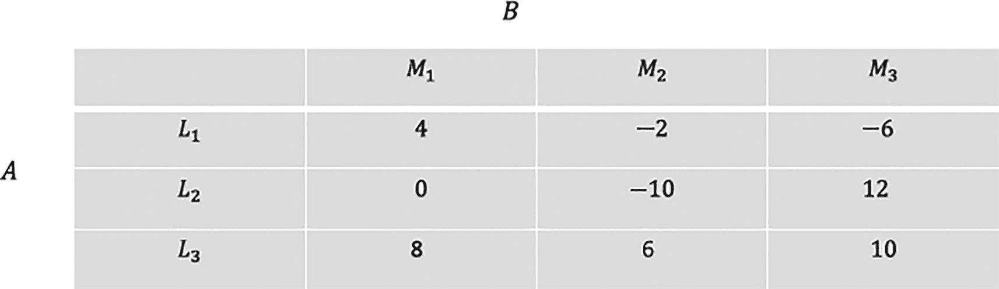

一个表格有 4 列和 4 行。L 1, L 2, 和 L 3 的值分别对应于 M 1, M 2, 和 M 3。

图 6-22

双人零和博弈的收益矩阵

图 6-22 是两个玩家收益矩阵的示意图，其中矩阵中的每个单元格代表玩家 *A* 在 *A* 和 *B* 的每一步组合中的游戏收益。由于这是一个零和博弈，*B* 的收益并未明确提及；它只是玩家 *A* 收益的负值。假设 *A* 玩一个最大最小化游戏。它将选择每行的最小值中的最大值，因此会选择策略 *L*[3]，其相应的收益为 {-6,-10,6} 的最大值，即 6。6 的收益对应于 *B* 的移动 *M*[2]。同样，如果 *A* 玩最小最大化策略，*A* 将被迫获得每个列的收益最大值中的最小值，即对于 *B* 的每一步。在这种情况下，*A* 的收益将是 {8,6,10} 的最小值，即 6，对应于最小最大化策略 *L*[3]。再次，这个收益 6 对应于 *B* 的移动 *M*[2]。因此，我们可以看到在零和博弈的情况下，参与者的最大最小化收益等于最小最大化收益。

现在，让我们看看玩家 *B* 的最大最小化收益。*B* 的最大最小化收益是 *B* 在每一步中的最小值的最大值，即 (−8, −6, −12) 的最大值 = −6，这对应于移动 *M*[2]。此外，这个值对应于 *A* 的移动 *L*[3]。同样，*B* 的最小最大化收益是 *B* 在 *A* 的每一步中可能拥有的最大值的最小值，即 (6, 10, −6) = 6。再次，对于 *B*，最小最大化值与最大最小化值相同，对应的移动为 *M*[2]。在这种情况下，*A* 的对应移动也是 *L*[3]。

因此，从零和博弈中可以得到的经验教训如下：

+   无论 *A* 和 *B* 是否玩最大最小化策略或最小最大化策略，他们最终都会选择 *L*[3] 和 *M*[2] 的移动，分别对应于 *A* 的收益为 6 和 *B* 的收益为 -6。此外，玩家的最小最大化和最大最小化值与玩家在采用最小最大化策略时所获得的实际收益值相一致。

+   前面的观点导致一个重要的事实：在零和游戏中，一方的最小-最大策略将产生如果双方都采用纯最小-最大或最大-最小策略时的实际策略。因此，可以通过考虑 *A* 或 *B* 的移动来确定这两个移动。如果我们考虑 *A* 的最小-最大策略，那么两个玩家的移动都包含在其中。如果 *A* 的收益效用为 *U*(*S*[1], *S*[2])，那么 *A* 和 *B* 的移动——即 *S*[1] 和 *S*[2]，分别——可以通过应用 *A* 或 *B* 的最小-最大策略来找到。

### 最小-最大值和鞍点

对于涉及两个玩家 *A* 和 *B* 的零和最小-最大问题，玩家 *A* 的收益 *U*(*x*, *y*) 可以表示如下：

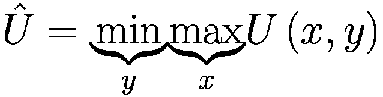

其中 *x* 表示 *A* 的移动，而 *y* 表示 *B* 的移动。

此外，对应于 *Û* 的 *x* 和 *y* 的值分别是 *A* 和 *B* 的均衡策略，即，如果他们继续相信最小-最大或最大-最小策略，他们不会改变他们的移动。对于一个零和双玩家游戏，最小-最大或最大-最小会产生相同的结果，因此，如果玩家使用最小-最大或最大-最小策略进行游戏，这种均衡是成立的。此外，由于最小-最大值等于最大-最小值，定义最小-最大或最大-最小值的顺序并不重要。我们完全可以让 *A* 和 *B* 独立选择针对对方每个策略的最佳策略，我们将看到在零和游戏中，策略的组合中会有重叠。这种重叠条件是 *A* 和 *B* 的最佳策略，并且与他们的最小-最大策略相同。这也是游戏的纳什均衡。

到目前为止，我们为了便于使用收益矩阵进行解释而将策略保持为离散值。但它们可以是连续值。至于 GAN，策略是生成器和判别器神经网络连续参数值，因此，在我们深入研究 GAN 效用函数的细节之前，查看 *A* 的收益效用函数 *f*(*x*, *y*) 是有意义的，这是一个在 *x* 和 *y* 中的两个连续变量的函数。进一步，让 *x* 表示 *A* 的移动，而 *y* 表示 *B* 的移动。我们需要找到均衡点，这也是任何一方的收益效用函数的最小-最大或最大-最小。对应于 *A* 的最小-最大值的收益将提供 *A* 和 *B* 的策略。由于对于零和双玩家游戏，最小-最大和最大-最小是相同的，因此最小-最大值的顺序并不重要，即，

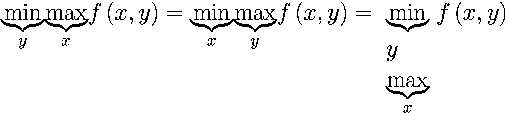

对于一个连续函数，只有在先前的函数解是鞍点时才可能。鞍点是一个梯度相对于每个变量都为零的点；然而，它既不是局部最小值也不是局部最大值。相反，它在输入向量的某些方向上趋向于局部最小值，而在其他方向上相对于输入向量的其他方向是局部最大值。实际上，对于两人零和游戏的效用均衡鞍点，相对于一个参与者的移动将是局部最小值，而相对于另一个参与者的移动将是局部最大值。因此，可以使用多元微积分中寻找鞍点的方法。对于具有 *x* ∈ *R*^(*n* × 1) 的多元函数 *f*(*x*)，在不失一般性的情况下，我们可以通过以下测试确定鞍点：

+   计算 *f*(*x*) 关于向量 *x* 的梯度，即 ∇[*x*] *f*(*x*)，并将其设为零。

+   评估函数的 Hessian 矩阵 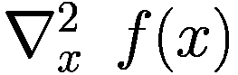，即梯度向量 ∇[*x*] *f*(*x*) 为零的每个点的二阶导数矩阵。如果 Hessian 矩阵在评估点既有正特征值也有负特征值，则该点是鞍点。

回到二元效用函数 *f*(*x*, *y*)，对于 *A*，让我们如下定义它以说明一个例子：

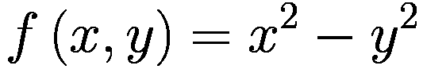

因此，对于 *B* 的效用函数将自动为 -*x*² + *y*²。

现在我们研究效用函数是否在两个玩家都采取零和最小-最大或最大-最小策略时提供均衡。游戏将会有一个均衡点，在此点之后，由于策略是最佳的，玩家将无法通过策略来提高他们的收益。均衡条件是游戏的纳什均衡，并且是函数 *f*(*x*, *y*) 的鞍点。

将 *f*(*x*, *y*) 的梯度设为零，我们得到以下结果：

![梯度 ∇f(x,y) = [∂f/∂x, ∂f/∂y] = [2x, -2y] = 0 => (x,y) = (0,0)](img/448418_2_En_6_Chapter/448418_2_En_6_Chapter_TeX_Equac.png)

函数的 Hessian 矩阵如下所示：

![$$ {\nabla}²\kern0.5em f\left(x,y\right)=\left[\begin{array}{cc}\frac{\partial²f}{\partial {x}²}& \frac{\partial²f}{\partial x\partial y}\\ {}\frac{\partial²f}{\partial y\partial x}& \frac{\partial²f}{\partial {y}²}\end{array}\right]=\left[\begin{array}{cc}2& 0\\ {}0& -2\end{array}\right] $$](img/448418_2_En_6_Chapter/448418_2_En_6_Chapter_TeX_Equad.png)

函数的 Hessian 矩阵对于任何(*x*, *y*)的值都是![$$ \left[\begin{array}{cc}2& 0\\ {}0& -2\end{array}\right] $$](img/448418_2_En_6_Chapter/448418_2_En_6_Chapter_TeX_IEq10.png)，包括(*x*, *y*) = (0, 0)。由于 Hessian 矩阵既有正的也有负的特征值，即 2 和-2，因此点(*x*, *y*) = (0, 0)是一个鞍点。对于*A*在均衡状态下的策略应该是设置*x* = 0，而*y*的策略则是在零和博弈中的最小-最大或最大-最小游戏中设置*y* = 0。

### GAN 代价函数和训练

在生成对抗网络中，生成器和判别器网络都通过在零和博弈中采取最小-最大策略来相互超越。在这种情况下，动作是网络选择的参数值。为了方便表示，让我们用模型本身的符号来表示模型参数，即用*G*表示生成器，用*D*表示判别器。现在，让我们为每个网络的收益函数的效用进行框架设计。判别器会尝试正确地分类伪造或合成的样本以及真实数据样本。换句话说，它会尝试最大化效用函数：

![$$ U\left(D,G\right)={\textrm{E}}_{x\sim {P}_x(x)}\left[\log D(x)\right]+{E}_{z\sim {P}_z(z)}\Big[\log \left(1-D\left(G(z)\right)\right] $$](img/448418_2_En_6_Chapter/448418_2_En_6_Chapter_TeX_Equae.png)

其中 *x* 表示从概率分布 *P**x* 中抽取的真实数据样本，而 *z* 是从先验噪声分布 *P**z* 中抽取的噪声。此外，判别器试图为真实数据样本 *x* 输出 1，为基于噪声样本 *z* 生成的生成器创建的假或合成数据输出 0。因此，判别器希望采取一种策略，使 *D*(*x*) 尽可能接近 1，这将使 *logD*(*x*) 接近 0 值。*D*(*x*) 越小于 1，*logD*(*x*) 的值就越小，因此判别器的效用值就越小。同样，判别器希望通过将概率设置得尽可能接近零来捕捉假或合成数据；即，将 *D*(*G*(*z*)) 设置得尽可能接近零，以将其识别为假图像。当 *D*(*G*(*z*)) 接近零时，表达式 [log(1 − *D*(*G*(*z*)))] 趋于零。随着 *D*(*G*(*z*)) 从零发散，判别器的收益会减小，因为 log(1 − *D*(*G*(*z*))) 会减小。判别器希望在整个 *x* 和 *z* 的分布上这样做，因此其收益函数中的期望或均值项。当然，生成器 *G* 通过 *G*(*z*) 的形式对 *D* 的收益函数有发言权——即，第二项——因此它也会尝试采取一种策略，以最小化 *D* 的收益。*D* 的收益越大，对 *G* 来说情况就越糟糕。因此，我们可以认为 *G* 与 *D* 具有相同的效用函数，只是其中带有负号，这使得这是一个零和游戏，其中 *G* 的收益由以下公式给出：

![$$ V\left(D,G\right)=-{\textrm{E}}_{x\sim {P}_x(x)}\left[\log D(x)\right]-{E}_{z\sim {P}_z(z)}\left[\log \left(1-D\left(G(z)\right)\right)\right] $$](img/448418_2_En_6_Chapter/448418_2_En_6_Chapter_TeX_Equaf.png)

生成器 *G* 会尝试选择其参数，使得 *V*(*D*, *G*) 最大化；即，它产生假数据样本 *G*(*z*)，使得判别器被欺骗性地将其分类为 0 标签。换句话说，它希望判别器认为 *G*(*z*) 是真实数据，并赋予它们高概率。*D*(*G*(*z*)) 远离 0 的高值会使 log(1 − *D*(*G*(*z*))) 变成一个具有高绝对值的负值，当乘以表达式开头的负号时，会产生一个高值 ![$$ -{E}_{z\sim {P}_z(z)}\left[\log \left(1-D\left(G(z)\right)\right)\right] $$](img/448418_2_En_6_Chapter/448418_2_En_6_Chapter_TeX_IEq11.png)，从而增加生成器的收益。不幸的是，生成器无法影响 *V*(*D*, *G*) 中涉及真实数据的第一个项，因为它不涉及 *G* 中的参数。

生成器 *G* 和判别器 *D* 模型通过让它们以最小-最大策略进行零和游戏来训练。判别器会尝试最大化其收益 *U*(*D*, *G*) 并试图达到其最小-最大值。

![$$ {u}^{\ast }=\underset{D}{\underbrace{\min}}\underset{G}{\underbrace{\max}}{\textrm{E}}_{x\sim {P}_x(x)}\left[\log D(x)\right]+{E}_{z\sim {P}_z(z)}\left[\log \left(1-D\left(G(z)\right)\right)\right] $$](img/448418_2_En_6_Chapter/448418_2_En_6_Chapter_TeX_Equag.png)

同样，生成器 *G* 希望通过选择策略来最大化其收益 *V*(*D*, *G*)。

![$$ {v}^{\ast }=\underset{D}{\underbrace{\mathit{\min}}}\underset{G}{\underbrace{\max}}\space -{\textrm{E}}_{x\sim {P}_x(x)}\left[\log D(x)\right]-{E}_{z\sim {P}_z(z)}\left[\log \left(1-D\left(G(z)\right)\right)\right] $$](img/448418_2_En_6_Chapter/448418_2_En_6_Chapter_TeX_Equah.png)

由于第一项是 *G* 无法控制以最大化的东西，

![$$ {v}^{\ast }=\underset{D}{\underbrace{\mathit{\min}}}\underset{G}{\underbrace{\mathit{\max}}}-{E}_{z\sim {P}_z(z)}\left[\log \left(1-D\left(G(z)\right)\right)\right] $$](img/448418_2_En_6_Chapter/448418_2_En_6_Chapter_TeX_Equai.png)

正如我们所见，在两位玩家的零和游戏中，不需要考虑单独的最小-最大策略，因为两者都可以通过考虑其中一位玩家收益效用函数的最小-最大策略来推导出来。考虑判别器的最小-最大公式，我们得到判别器在均衡（或纳什均衡）时的收益如下：

![$$ {u}^{\ast }=\underset{\begin{array}{l}G\\ {}\underset{D}{\underbrace{\max}}\end{array}}{\underbrace{\mathit{\min}}}{\textrm{E}}_{x\sim {P}_x(x)}\left[\log D(x)\right]+{E}_{z\sim {P}_z(z)}\left[\log \left(1-D\left(G(z)\right)\right)\right] $$](img/448418_2_En_6_Chapter/448418_2_En_6_Chapter_TeX_Equaj.png)

在 *u** 处的 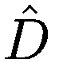 和  的值将是两个网络优化的参数，超过这些参数它们无法提高其分数。同时 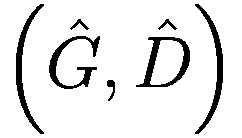 给出了 *D* 的效用函数 ![$$ {\textrm{E}}_{x\sim {P}_x(x)}\left[\log D(x)\right]+{E}_{z\sim {P}_z(z)}\left[\log \left(1-D\left(G(z)\right)\right)\right] $$](img/448418_2_En_6_Chapter/448418_2_En_6_Chapter_TeX_IEq15.png) 的鞍点。

前面的公式可以通过将优化分解为两部分来简化，即让 *D* 在其参数上最大化其收益效用函数，并让 *G* 在每一步中让其参数最小化 *D* 的收益效用函数。

![∀D{max}_{E_{x~P_x(x)}}[log D(x)] + E_{z~P_z(z)}[log(1-D(G(z)))]](img/448418_2_En_6_Chapter/448418_2_En_6_Chapter_TeX_Equak.png)

![∀G{min}_{E_{z~P_z(z)}}[log(1-D(G(z)))]](img/448418_2_En_6_Chapter/448418_2_En_6_Chapter_TeX_Equal.png)

每个都会在优化自己的成本函数时将对方的移动视为固定。这种优化迭代方式不过是计算鞍点的梯度下降技术。由于机器学习包大多是为了最小化而不是最大化而编写的，因此判别器的目标可以乘以-1，然后*D*可以最小化它而不是最大化它。

下面是通常用于基于先前启发式训练 GAN 的迷你批处理方法：

+   对于*N*次迭代：

    +   对于*k*[*D*]步：

        +   从噪声分布*z*~*P**z*中抽取*m*个样本*z¹, z², .. z^((*m*))}：

        +   从数据分布*x*~*P**x*中抽取*m*个样本*x¹, x², .. x^((*m*))}：

        +   使用随机梯度下降更新判别器*D*的参数。如果判别器*D*的参数用*θ*[*D*]表示，则更新*θ*[*D*]如下：

![θ_D→θ_D−∇_θ_D[−1/m∑_i=1^m(log D(x^(i))) + log(1-D(G(z^(i))))]](img/448418_2_En_6_Chapter/448418_2_En_6_Chapter_TeX_Equam.png)

+   end

    +   对于*k*[*G*]步：

        +   从噪声分布中抽取*m*个样本*z¹, z², .. z^((*m*))}：

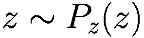

+   使用随机梯度下降更新生成器 G。如果生成器 G 的参数用*θ*[*G*]表示，则更新*θ*[*G*]如下：

![θ_G→θ_G−∇_θ_G[1/m∑_i=1^m(log(1-D(G(z^(i))))]]](img/448418_2_En_6_Chapter/448418_2_En_6_Chapter_TeX_Equao.png)

+   end

+   end

上面的整个伪代码构成了 GAN 训练的一个 epoch。

### 生成器的梯度消失

通常，在训练的初期部分，生成器产生的样本与原始数据非常不同，因此判别器可以轻易地将它们标记为伪造。这导致 D(G(z))的值接近于零，因此梯度![∇_θ_G[1/m∑_i=1^mlog(1-D(G(z^((i)))))]](img/448418_2_En_6_Chapter/448418_2_En_6_Chapter_TeX_IEq16.png)饱和，导致 G 网络的参数梯度消失问题。为了克服这个问题，而不是最小化![E_z~P_z(z)[log(1-D(G(z)))]](img/448418_2_En_6_Chapter/448418_2_En_6_Chapter_TeX_IEq17.png)，函数![E_z~P_z(z)[log G(z)]](img/448418_2_En_6_Chapter/448418_2_En_6_Chapter_TeX_IEq18.png)被最大化，或者，为了遵循梯度下降，![E_z~P_z(z)[-log G(z)]](img/448418_2_En_6_Chapter/448418_2_En_6_Chapter_TeX_IEq19.png)被最小化。这种改变使得训练方法不再是纯粹的极大极小博弈，而似乎是一种合理的近似，有助于克服训练早期阶段的饱和问题。

### 从 F-散度角度学习 GAN

生成对抗网络（GAN）生成器 G(z)的目标是学习产生样本 G(z)，使其看起来像是来自我们想要学习的目标分布 P(x)。因此，一旦 GAN 被训练到最优，以下应该成立：

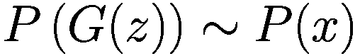

判别器 D 试图将来自目标分布 P(x)的样本分类为真实样本，将生成器 G 生成的样本分类为伪造图像。因此，判别器试图最小化与将目标分布样本分类为属于类别 1 和生成器 G 样本分类为属于类别 0 相关的二元交叉熵损失（见下文）。

![U(G,D)=-E_x~P(x)[log D(x)]-E_z~P(z)[log(1-D(G(z)))]](img/448418_2_En_6_Chapter/448418_2_En_6_Chapter_TeX_Equaq.png)

由于我们处理的是判别器的生成器图像损失，我们可以将 P(z)的期望改为生成器样本分布 P(G(z))的期望，如下所示：

![U(G,D)=-E_x~P(x)[log D(x)]-E_G(z)~P(G(z))[log(1-D(G(z)))]](img/448418_2_En_6_Chapter/448418_2_En_6_Chapter_TeX_Equar.png)

判别器 *D* 尝试最小化上述效用 *U*(*G*, *D*)，而生成器则尝试最大化相同的效用。由于效用的零和性质，最优生成器 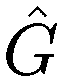 和判别器  可以通过以下优化找到：

![$$ \underset{D}{\min}\underset{G}{\max }-{E}_{x\sim P(x)}\left[\log D(x)\right]-{E}_{G(z)\sim P\left(G\Big(z\right)\Big)}\left[\log \left(1-D\left(G(z)\right)\right)\right] $$](img/448418_2_En_6_Chapter/448418_2_En_6_Chapter_TeX_Equas.png)

我们通过如 KL 散度等 f-散度方法来测量两个概率分布之间的距离，这些方法我们在第五章节中已经研究过。

回想一下，分布 *Q*(*x*) 和分布 *P*(*x*) 之间的 KL 散度由以下给出：

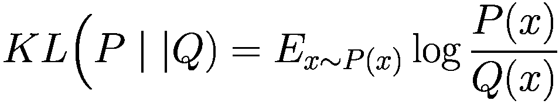

如您所知，KL 散度不是对称的，即 *KL*(*P* || *Q*) ≠ *KL*(*Q* || *P*).

然而，可以使用 KL 散度定义一个称为 **Jensen-Shannon 散度 (JSD**) 的对称散度度量，如下所示：

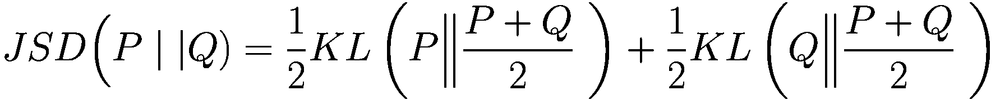

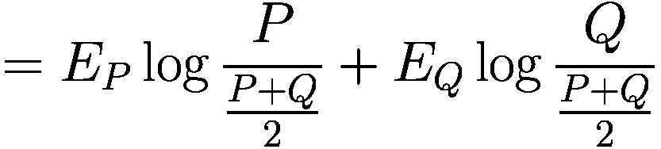

回到 GAN 效用 *U*(*G*, *D*) 的优化问题，我们有以下内容：

![$$ \underset{D}{\min}\underset{G}{\max }U\left(G,D\right)=\underset{D}{\min}\underset{G}{\max }-{E}_{x\sim P(x)}\left[\log D(x)\right]-{E}_{G(z)\sim P\left(G\Big(z\right)\Big)}\left[\log \left(1-D\left(G(z)\right)\right)\right] $$](img/448418_2_En_6_Chapter/448418_2_En_6_Chapter_TeX_Equaw.png)

如果我们将生成器样本 *G*(*z*) 表示为 *x*，并将生成器样本的概率分布表示为 *G*[*g*]，那么 *P*(*G*(*z*))~*G**g*。同样，让我们将目标分布 *P*(*x*) 表示为 *P**data*。将这些替换到效用 *U*(*G*, *D*) 中，我们得到以下内容：

![$$ U\left(G,D\right)=-{E}_{x\sim {P}_{data}(x)}\left[\log D(x)\right]-{E}_{x\sim {G}_g(x)}\left[\log \left(1-D(x)\right)\right] $$](img/448418_2_En_6_Chapter/448418_2_En_6_Chapter_TeX_Equax.png)

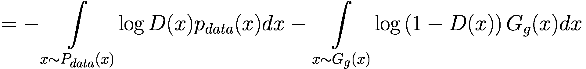

保持生成器固定，上述积分将相对于判别器 *D* 最小化，当最优判别器如下所示时：

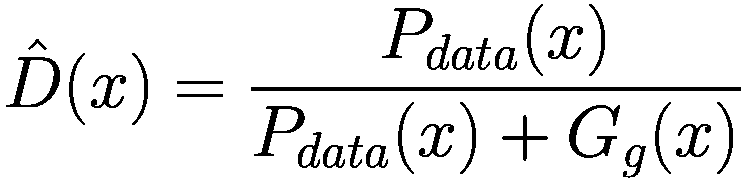

将最优判别器  代入效用函数 U(G,D)，我们得到以下结果：

![U(G,^D)=-E_x~P_data(x)[log(P_data(x)/(P_data(x)+G_g(x)))]-E_x~G_g(x)[log(1-(P_data(x)/(P_data(x)+G_g(x))))]](img/448418_2_En_6_Chapter/448418_2_En_6_Chapter_TeX_Equba.png)

![=-E_x~P_data(x)[log(P_data(x)/(P_data(x)+G_g(x)))]-E_x~G_g(x)[log(G_g(x)/(P_data(x)+G_g(x)))]](img/448418_2_En_6_Chapter/448418_2_En_6_Chapter_TeX_Equbb.png)

![=log4-E_x~P_data(x)[log(P_data(x)/(P_data(x)+G_g(x))/2)]-E_x~G_g(x)[log(G_g(x)/(P_data(x)+G_g(x))/2)]](img/448418_2_En_6_Chapter/448418_2_En_6_Chapter_TeX_Equbc.png)

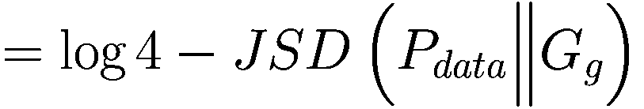

因此，在最优判别器的条件下，生成器最大化效用 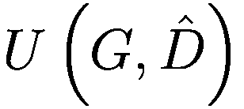 的结果实际上是目标数据分布 *P*[*data*] 和生成器样本分布 *G*[*g*] 的 Jenson-Shannon 散度 *JSD*(*P*[*data*]‖*G*[*g*]) 的负值。因此，最优生成器通过最小化 Jenson-Shannon 散度 *JSD*(*P*[*data*]‖*G*[*g*]) 来学习生成样本，使其看起来像是从目标数据分布 *P*[*data*] 中生成的。[.]

### TensorFlow 实现的 GAN 网络实现

在本节中，展示了在 MNIST 图像上训练的 GAN 网络，其中生成器试图创建类似于 MNIST 的假合成图像，而判别器则试图将这些合成图像标记为假，同时仍然能够区分真实数据为真实。一旦训练完成，我们采样一些合成图像，看看它们是否看起来像真实的。生成器是一个简单的具有三个隐藏层和输出层的正向神经网络，输出层由 784 个单元组成，对应于 MNIST 图像中的 784 个像素。输出单元的激活被取为 *tanh* 而不是 *sigmoid*，因为与 sigmoid 单元相比，*tanh* 激活单元较少受到梯度消失问题的影响。*tanh* 激活函数输出介于-1 和 1 之间的值，因此真实的 MNIST 图像被归一化到-1 和 1 之间，以便合成图像和真实的 MNIST 图像在相同的范围内操作。判别器网络也是一个具有三个隐藏层和 sigmoid 输出单元的三层正向神经网络，用于在真实 MNIST 图像和生成器产生的合成图像之间进行二元分类。生成器的输入是从-1 和 1 之间均匀噪声分布中采样的 100 维输入。详细的实现示例如下所示 6-5。

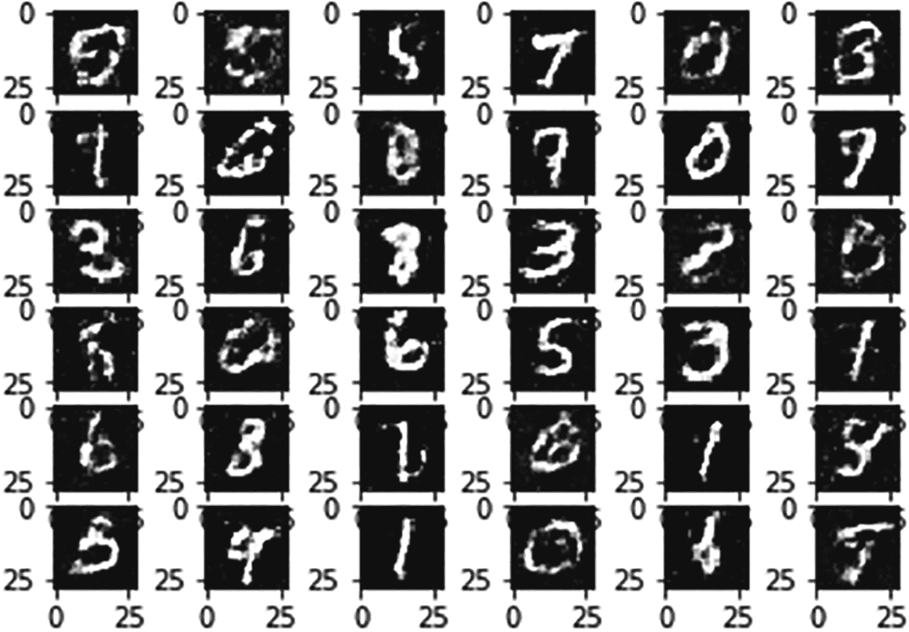

一个 6 x 6 的网格块模式由不同的数字组成。

图 6-23

GAN 网络合成的数字

```py
import tensorflow as tf
from tensorflow.keras import layers, Model, initializers,activations
## The dimension of the Prior Noise Signal is 100
## The generator would have 150 and 300 hidden units successively before 784 outputs corresponding
## to 28x28 image size
h1_dim = 150
h2_dim = 300
dim = 100
batch_size = 256
class generator(Model):
"""
Generator class of GAN
"""
def __init__(self,hidden_units=[500,500]):
super(generator,self).__init__()
self.fc1 = layers.Dense(hidden_units[0],activation='relu',kernel_initializer=initializers.TruncatedNormal(mean=0.0, stddev=0.1))
self.fc2 = layers.Dense(hidden_units[1],activation='relu',kernel_initializer=initializers.TruncatedNormal(mean=0.0, stddev=0.1))
self.fc3 = layers.Dense(28*28,activation=activations.tanh,kernel_initializer=initializers.TruncatedNormal(mean=0.0, stddev=0.1))
def call(self,x):
x = self.fc1(x)
x = self.fc2(x)
x = self.fc3(x)
return x
class discriminator(Model):
"""
Discriminator Class of the GAN
"""
def __init__(self,hidden_units=[500,500],dropout_rate=0.3):
super(discriminator,self).__init__()
self.fc1 = layers.Dense(hidden_units[0],activation='relu',kernel_initializer=initializers.TruncatedNormal(mean=0.0, stddev=0.1))
self.drop1 = layers.Dropout(rate=dropout_rate)
self.fc2 = layers.Dense(hidden_units[1],activation='relu',kernel_initializer=initializers.TruncatedNormal(mean=0.0, stddev=0.1))
self.drop2 = layers.Dropout(rate=dropout_rate)
self.fc3 = layers.Dense(1,kernel_initializer=initializers.TruncatedNormal(mean=0.0, stddev=0.1))
def call(self,x):
x = self.fc1(x)
x = self.drop1(x)
x = self.fc2(x)
x = self.drop2(x)
x = self.fc3(x)
return x
class GAN(Model):
"""
Generator and Discriminator Flow for the fake images
"""
def __init__(self,G,D):
super(GAN,self).__init__()
self.G = G
self.D = D
def call(self,z):
z = self.G(z)
z = self.D(z)
return z
def data_load():
"""
Loading the training MNIST images and normalizing them within the range -1 to 1
"""
(train_X, train_Y), (test_X, test_Y) = tf.keras.datasets.mnist.load_data()
train_X, test_X , = train_X.reshape(-1,28*28), test_X.reshape(-1,28*28)
train_X, test_X = train_X/255.0, test_X/255.0
train_X, test_X = 2*train_X - 1, 2*test_X - 1
return np.float32(train_X), train_Y, np.float32(test_X), test_Y
def train(lr=0.0001,batch_size=256,hidden_units=[150,130],dim=100,dropout_rate=0.3,num_epochs=300):
# Build the GAN model
G_ = generator(hidden_units=hidden_units)
D_ = discriminator(hidden_units=hidden_units[::-1],dropout_rate=dropout_rate)
model = GAN(G_,D_)
G_graph, D_graph, model_graph = tf.function(G_), tf.function(D_), tf.function(model)
# Setup the optimizer
optimizer = tf.keras.optimizers.Adam(lr)
# Load the daat
train_X, train_Y, test_X, test_Y = data_load()
num_train = train_X.shape[0]
order = np.arange(num_train)
num_batches = num_train//batch_size
# Set up the discriminator loss
loss_fn = tf.keras.losses.BinaryCrossentropy(from_logits=True,reduction=tf.keras.losses.Reduction.NONE)
# Invoke the training
for epoch in range(num_epochs):
np.random.shuffle(order)
train_X, train_Y = train_X[order], train_Y[order]
for i in range(num_batches):
x_ = train_X[batch_size*i:(i+1)*batch_size]
z_ = np.random.uniform(-1, 1, size=(x_.shape[0],dim)).astype(np.float32)
y_label_real_dis = np.array([1\. for i in range(x_.shape[0])]).reshape(-1,1)
y_label_fake_dis = np.array([0\. for i in range(x_.shape[0])]).reshape(-1,1)
y_label_gen = np.array([1\. for i in range(x_.shape[0])]).reshape(-1,1)
x_,z_, y_label_real_dis, y_label_fake_dis,y_label_gen = tf.constant(x_),
tf.constant(z_), tf.constant(y_label_real_dis) ,
tf.constant(y_label_fake_dis), tf.constant(y_label_gen)
with tf.GradientTape(persistent=True) as tape:
y_pred_fake = model_graph(z_,training=True)
y_pred_real = D_graph(x_,training=True)
loss_discrimator = 0.5*tf.reduce_mean(loss_fn(y_label_fake_dis,y_pred_fake)
+  loss_fn(y_label_real_dis,y_pred_real))
loss_generator = tf.reduce_mean(loss_fn(y_label_gen,y_pred_fake))
# Compute gradient
grad_d = tape.gradient(loss_discrimator, D_.trainable_variables)
grad_g = tape.gradient(loss_generator, G_.trainable_variables)
# update the parameters
optimizer.apply_gradients(zip(grad_d, D_.trainable_variables))
optimizer.apply_gradients(zip(grad_g, G_.trainable_variables))
del tape
if (i % 200) == 0:
print (f"Epoch: {epoch} Iteration : {i}, Discrinator loss: {loss_discrimator.numpy()}, Generator loss: {loss_generator.numpy()}")
# Generator some images
z_ = tf.constant(np.random.uniform(-1, 1, size=(batch_size,dim)).astype(np.float32))
imgs = 0.5*(G_graph(z_,training=False) + 1).numpy()
print(imgs.shape)
for k in range(36):
plt.subplot(6,6,k+1)
image = np.reshape(imgs[k],(28,28))
plt.imshow(image,cmap='gray')
return G_, D_, model, G_graph, D_graph, model_graph, imgs
G_, D_, model, G_graph, D_graph, model_graph,imgs_val   = train()
-- output --
Listing 6-5
Implementation of a Generative Adversarial Network
```

从图 6-23 中，我们可以看到 GAN 生成器能够生成与 MNIST 数据集数字相似的图像。该 GAN 模型在 60000 个大小为 256 的迷你批次上进行了训练，以实现这种质量的结果。我想强调的是，与其它神经网络相比，GAN 的训练相对困难。因此，为了达到预期的结果，需要进行大量的实验和定制。

#### GAN 与变分自编码器的相似性

请注意，生成对抗网络（GAN）与我们在第五章中学习到的变分自编码器有很多相似之处。在 GAN 中，生成器 *G*(.)作为一个生成模型，将来自先验分布 *P*(*z*)的 *z* 样本映射到来自已知分布 *P*(*x*)的实际图像 *x*。同样，在变分自编码器中，解码器 *p**ϕ*学习将来自先验分布 *P*(*z*)的样本 *z* 投影到图像 *x*。变分自编码器和 GAN 在计算机视觉领域作为生成模型都非常受欢迎。

#### CycleGAN

在本节中，我们将讨论一个非常流行的生成对抗网络技术，称为 CycleGAN。Cycle consistency 生成对抗网络简称为 CycleGAN，主要用于将图像从一个域翻译到另一个域。CycleGAN 的特别之处在于它学习将图像从一个域映射到另一个域，而无需在两个域之间的配对图像上进行任何训练。鉴于图像标注是一项耗时的工作，CycleGAN 不需要配对图像的特性是一种强大的功能。

为了激励 CycleGAN 的工作机制，让我们考虑通过生成器 *G*[*XY*] 将图像从域 *X* 映射到域 *Y*，使得生成的图像在域 *Y* 中看起来非常逼真。如果我们考虑域 *X* 中图像 *x* 的概率分布为 *P**X*，而域 *Y* 中图像 *y* 的概率分布为 *P**Y*，那么翻译图像 *G**XY* 应该在 *P**Y* 下具有很高的概率。再次通过使用判别器 *D*[*Y*] 进行对抗训练来学习生成器 *G*[*XY*]。判别器 *D*[*Y*] 被训练来将域 *Y* 中的图像分类为真实图像，而由 *G*[*XY*] 生成的图像则被分类为假图像。另一方面，生成器 *G*[*XY*] 学习将图像 *x* ∈ *X* 翻译到域 *Y*，使得翻译图像 *G**XY* 被判别器 *D*[*Y*] 分类为真实图像。

因此，在其最小形式中，从 *X* 到 *Y* 的域翻译的训练目标可以用 GAN 目标表示如下：

![$$ {T}_{XY}=-{E}_{y\sim {P}_Y(y)}\log \left[{D}_Y(y)\right]-{E}_{x\sim {P}_x(X)}\log \left[1-{D}_Y\left({G}_{XY}(x)\right)\right] $$](img/448418_2_En_6_Chapter/448418_2_En_6_Chapter_TeX_Eqube.png)

仅使用翻译损失 *T*[*XY*] 学习翻译 *G*[*XY*] : *X* → *Y* 并不能保证来自域 X 和 Y 的单个图像 *x* 和 *y* 之间有任何有意义的配对。这是因为可以有无限多个翻译 *G*[*XY*]，它们诱导出类似于 *G*[*XY*] 的分布。为了向欠约束的翻译目标 *T*[*XY*] 添加更多结构，CycleGAN 通过另一个生成器 *G*[*YX*] 引入了循环一致性损失，该生成器将图像从域 *Y* 翻译到域 *X*，使得以下条件成立：

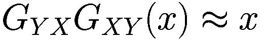

循环一致性损失确保通过 *G*[*XY*] 从域 *X* 到 *Y* 的翻译应保留足够多的结构，以便可以从翻译图像中重建原始图像，就像在自编码器中一样。从域 *X* 到域 *Y* 再返回到域 *X* 的循环一致性重建损失可以表示如下：

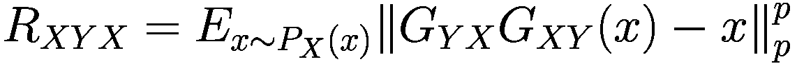

通常，p 被选为 1 以用于 L1 范数重建损失，或选为 2 以用于 L2 范数重建损失。

因此，与循环一致地从 *X* 到 *Y* 转换图像相关的目标 *L*[*XY*] 可以表示如下：

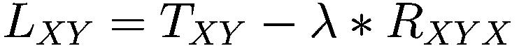

![ $ =-{E}_{y\sim {P}_Y(y)}\log \left[{D}_Y(y)\right]-{E}_{x\sim {P}_x(X)}\log \left[1-{D}_Y\left({G}_{XY}(x)\right)\right]-\lambda \ast {E}_{x\sim {P}_X(x)}{\left\Vert {G}_{YX}{G}_{XY}(x)-x\right\Vert}_p^p $](img/448418_2_En_6_Chapter/448418_2_En_6_Chapter_TeX_Equbi.png)

参数 *λ* 控制对抗损失对循环一致性损失的重要性，并且是模型的超参数。

我们训练 CycleGAN 学习从 *X* 到 *Y* 以及从 *Y* 到 *X* 的映射。如果我们把域 *X* 侧的判别器看作 *D*[*X*]，那么将图像从 *Y* 转换到 *X* 的相关损失可以表示如下：

![ $ {T}_{YX=}-{E}_{x\sim {P}_X(x)}\log \left[{D}_X(x)\right]-{E}_{y\sim {P}_Y(y)}\log \left[1-{D}_X\left({G}_{YX}(y)\right)\right] $](img/448418_2_En_6_Chapter/448418_2_En_6_Chapter_TeX_Equbj.png)

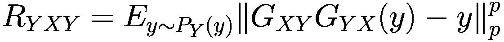

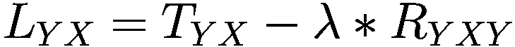

![ $ =-{E}_{x\sim {P}_X(x)}\log \left[{D}_X(x)\right]-{E}_{y\sim {P}_Y(y)}\log \left[1-{D}_X\left({G}_{YX}(y)\right)\right]-\lambda \ast {E}_{y\sim {P}_Y(y)}{\left\Vert {G}_{XY}{G}_{YX}(y)-y\right\Vert}_p^p $](img/448418_2_En_6_Chapter/448418_2_En_6_Chapter_TeX_Equbm.png)

因此，CycleGAN 的联合目标如下：

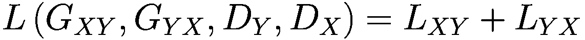

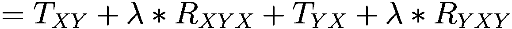

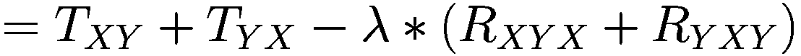

通过最大化生成器 $G_{XY}$ 和 $G_{YX}$ 相对于生成器 $G_{XY}$ 和 $G_{YX}$ 的整体损失 $L$(*G*[*XY*], *G*[*YX*], *D*[*Y*], *D*[*X*])，并最小化相对于判别器 $D_{XY}$ 和 $D_{YX}$ 的相同损失，可以找到最优的生成器。

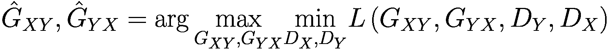

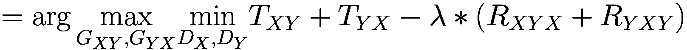

为了将生成器关于循环一致性重建损失的极小化转换为极大化，我们方便地选择了损失目标中重建损失的负值。

CycleGAN 的架构在图 6-24 中展示。建议读者仔细阅读，以更好地理解我们刚刚讨论的 CycleGAN 的底层理论。

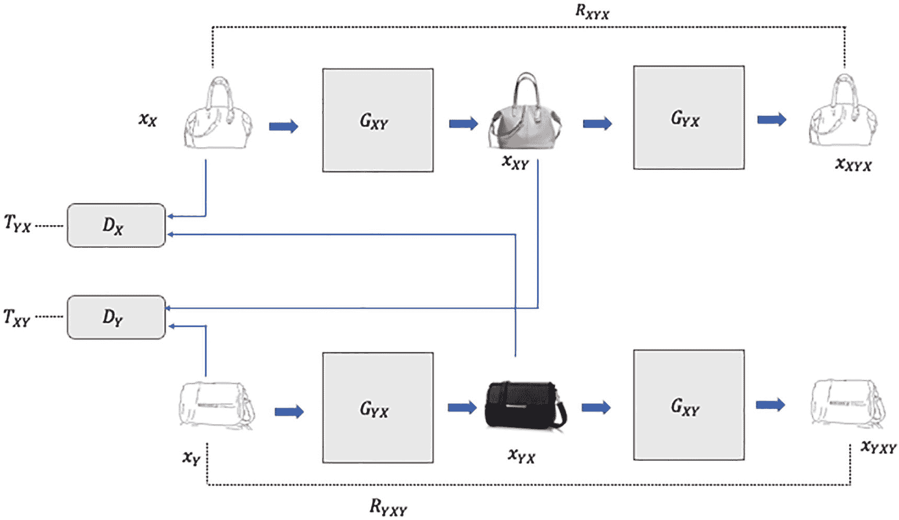

CycleGAN 的架构网络图包含 D_x 和 D_y 子脚本的六个步骤。每个过程中都可见三个手袋图像。

图 6-24

CycleGAN 的架构图

### TensorFlow 中的 CycleGAN 实现

在本节中，我们将使用 TensorFlow 实现 CycleGAN，以从草图轮廓生成手袋图像，同时明确地将草图与手袋配对。在实现过程中，我们将把草图归为域 A，手袋归为域 B。

作为实现的一部分，我们将训练两个结构相同的生成器——一个将域 A 中的草图映射到域 B 中的手袋，另一个将域 B 中的手袋映射到域 A 中的草图。每个域中的生成器应该以这种方式将图像映射到另一个域，使得生成的图像在另一个域中看起来逼真。我们还将有两个域的判别器。每个域中的判别器将学会区分该域中的真实图像和伪造图像。这将迫使生成器通过对抗性训练学习生成更好的伪造图像。

该实现的数据集可以在以下链接找到：[`http://efrosgans.eecs.berkeley.edu/pix2pix/datasets/edges2handbags.tar.gz`](http://efrosgans.eecs.berkeley.edu/pix2pix/datasets/edges2handbags.tar.gz).

列表 6-6 中展示了详细的实现。

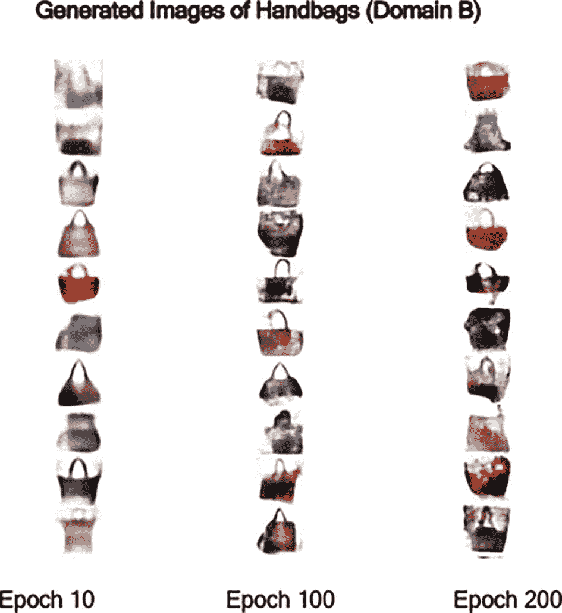

在第 10 个、100 个和 200 个时代，训练好的 CycleGAN 在三个列中产生了几个手袋图像。

图 6-25b

在不同时代由训练好的 CycleGAN 生成的手袋图像

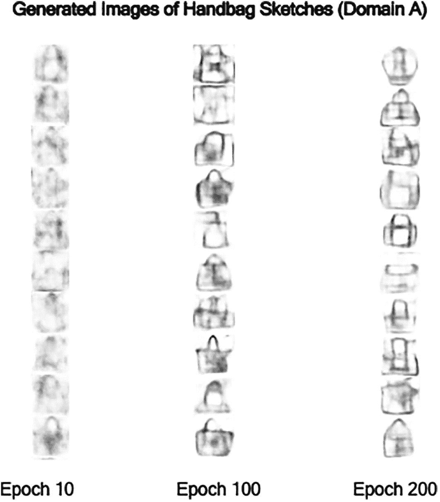

在第 10 个、100 个和 200 个时代，由训练好的 cycleGAN 生成的三个列中的多个不清楚的手袋草图。

图 6-25a

由训练好的 CycleGAN 在不同时代生成的手袋草图

```py
from __future__ import print_function, division
# import scipy
import tensorflow as tf
from tensorflow.keras import layers, Model
import datetime
import matplotlib.pyplot as plt
# import sys
# from data_loader import DataLoader
import numpy as np
import os
import time
import glob
import copy
from imageio import imread, imsave
from skimage.transform import resize
#  Load images for creating Training batches
def load_train_data(image_path, dim=64, is_testing=False):
img_A = imread(image_path[0])
img_B = imread(image_path[1])
# Resize
img_A = resize(img_A, [dim, dim])
img_B = resize(img_B, [dim, dim])
if not is_testing:
if np.random.random() >= 0.5:
img_A = np.fliplr(img_A)
img_B = np.fliplr(img_B)
# Normalize the images pixels to range from -1 to 1
img_A = img_A / 2 - 1
img_B = img_B / 2 - 1
img_AB = np.concatenate((img_A, img_B), axis=2)
return img_AB
def merge(images, size):
h, w = images.shape[1], images.shape[2]
img = np.zeros((h * size[0], w * size[1], 3))
for idx, image in enumerate(images):
i = idx % size[1]
j = idx // size[1]
img[j * h:j * h + h, i * w:i * w + w, :] = image
return img
# Routines to save images while training
def image_save(images, size, path):
return imsave(path, merge(images, size))
def save_images(images, size, image_path):
return image_save(inverse_transform(images), size, image_path)
def inverse_transform(images):
return (images + 1) * 127.5
# Imagepool to store intermediate generated images
class ImagePool(object):
def __init__(self, maxsize=50):
self.maxsize = maxsize
self.num_img = 0
self.images = []
def __call__(self, image):
if self.maxsize  0.5:
idx = int(np.random.rand() * self.maxsize)
tmp1 = copy.copy(self.images[idx])[0]
self.images[idx][0] = image[0]
idx = int(np.random.rand() * self.maxsize)
tmp2 = copy.copy(self.images[idx])[1]
self.images[idx][1] = image[1]
return [tmp1, tmp2]
else:
return image
class customConv2D(layers.Layer):
"""
Custom Convolution layer consisting of convolution, batch normalization and relu/leakyrelu activation
"""
def __init__(self, filters, kernel_size=4, strides=2, padding='SAME', norm=True, alpha=0.2, activation='lrelu'):
super(customConv2D, self).__init__()
self.norm = norm
self.conv1 = layers.Conv2D(filters=filters, kernel_size=kernel_size, strides=(strides, strides),
padding=padding)
if self.norm:
self.bnorm = layers.BatchNormalization()
if activation == 'lrelu':
self.activation = layers.LeakyReLU(alpha=alpha)
elif activation == 'relu':
self.activation = layers.ReLU()
def call(self, x):
x = self.conv1(x)
if self.norm:
x = self.bnorm(x)
x = self.activation(x)
return x
class customDeConv2D(layers.Layer):
"""
Custom Transpose Convolution(upsampling) layer
"""
def __init__(self, filters, kernel_size=4, strides=2, padding='SAME', dropout_rate=0):
super(customDeConv2D, self).__init__()
self.dropout_rate = dropout_rate
self.deconv1 = layers.Conv2DTranspose(filters=filters, kernel_size=kernel_size, strides=(strides, strides),
padding=padding)
if self.dropout_rate > 0:
self.drop = layers.Dropout(rate=dropout_rate)
self.bnorm = layers.BatchNormalization()
self.activation = layers.ReLU()
def call(self, x):
x = self.deconv1(x)
if self.dropout_rate > 0:
x = self.drop(x)
x = self.bnorm(x)
x = self.activation(x)
return x
class generator(Model):
"""
Generator class that can be used for both Domain
"""
def __init__(self, gf, channels=3):
super(generator, self).__init__()
self.down1 = customConv2D(filters=gf, strides=2, norm=False)
self.down2 = customConv2D(filters=gf * 2, strides=2)
self.down3 = customConv2D(filters=gf * 4, strides=2)
self.down4 = customConv2D(filters=gf * 8, strides=2)
self.down5 = customConv2D(filters=100, strides=1, padding='VALID')
self.up1 = customDeConv2D(filters=gf * 8, strides=1, padding='VALID')
self.up2 = customDeConv2D(filters=gf * 4, strides=2)
self.up3 = customDeConv2D(filters=gf * 2, strides=2)
self.up4 = customDeConv2D(filters=gf, strides=2)
self.convf = layers.Conv2DTranspose(filters=channels, kernel_size=4, strides=(2, 2), padding='SAME',
activation=tf.nn.tanh)
def call(self, x):
x = self.down1(x)
x = self.down2(x)
x = self.down3(x)
x = self.down4(x)
x = self.down5(x)
x = self.up1(x)
x = self.up2(x)
x = self.up3(x)
x = self.up4(x)
x = self.convf(x)
return x
class discriminator(Model):
"""
Discriminator Class that can be used for both Domains
"""
def __init__(self, df):
super(discriminator, self).__init__()
self.down1 = customConv2D(filters=df, strides=2, norm=False)
self.down2 = customConv2D(filters=df * 2, strides=2)
self.down3 = customConv2D(filters=df * 4, strides=2)
self.down4 = customConv2D(filters=df * 8, strides=2)
self.down5 = layers.Conv2D(filters=1, kernel_size=4, strides=1, padding='VALID')
def call(self, x):
x = self.down1(x)
x = self.down2(x)
x = self.down3(x)
x = self.down4(x)
x = self.down5(x)
return x
class GAN_X2Y(Model):
"""
GAN class for taking an image from one domain to other and evaluating the image
under the other domain discriminator
"""
def __init__(self, G_XY, D_Y):
super(GAN_X2Y, self).__init__()
self.G_XY = G_XY
self.D_Y = D_Y
def call(self, x):
fake_x = self.G_XY(x)
x = self.D_Y(x)
return fake_x,x
def process_data(data_dir,skip_preprocess=False):
"""
Split the images into domain A and domain B images
Each image contain both Domain A and Domain B images together
This routines splits it up
:param data_dir: Input images dir
:return:
"""
assert Path(data_dir).exists()
domain_A_dir = f'{Path(data_dir)}/trainA'
domain_B_dir = f'{Path(data_dir)}/trainB'
if skip_preprocess:
return domain_A_dir, domain_B_dir
os.makedirs(domain_A_dir,exist_ok=True)
os.makedirs(domain_B_dir,exist_ok=True)
files = os.listdir(Path(data_dir))
print(f'Images to process: {len(files)}')
i = 0
for fl in files:
i += 1
try:
img = imread(f"{Path(data_dir)}/{str(fl)}")
#print(img.shape)
w, h, d = img.shape
img_A = img[:w, :int(h / 2), :d]
img_B = img[:w, int(h / 2):h, :d]
imsave(f"{data_dir}/trainA/{fl}_A.jpg", img_A)
imsave(f"{data_dir}/trainB/{fl}_B.jpg", img_B)
if (i % 10000) == 0 & (i >= 10000):
print(f"processed {i+1} images")
except:
print(f"Skip processing image {Path(data_dir)}/{str(fl)}")
return domain_A_dir, domain_B_dir
def train(data_dir,sample_dir,num_epochs=5,lr=0.0002,beta1=0.5,beta2=0.99,train_size=10000,batch_size=64,epoch_intermediate=10,dim=64,sample_freq=10,_lambda_=0.5,skip_preprocess=False):
# Process input data and split to domain A, domain B data
domain_A_dir, domain_B_dir = process_data(data_dir=data_dir,skip_preprocess=skip_preprocess)
# Build the models
G_AB, G_BA = generator(gf=64), generator(gf=64)
D_A, D_B = discriminator(df=64), discriminator(df=64)
GAN_AB = GAN_X2Y(G_XY=G_AB,D_Y=D_B)
GAN_BA = GAN_X2Y(G_XY=G_BA,D_Y=D_A)
G_AB_g, G_BA_g, D_A_g, D_B_g, GAN_AB_g,  GAN_BA_g =  tf.function(G_AB), tf.function(G_BA), \
tf.function(D_A), tf.function(D_B), tf.function(GAN_AB),  tf.function(GAN_BA)
# Setup the imagepool
pool = ImagePool()
# Set up the Binary Cross Entropy loss to be used for the Discriminators
loss_fn = tf.keras.losses.BinaryCrossentropy(from_logits=True,reduction=tf.keras.losses.Reduction.NONE)
# Start the training
for epoch in range(num_epochs):
data_A = os.listdir(domain_A_dir)
data_B = os.listdir(domain_B_dir)
data_A = [f"{domain_A_dir}/{str(x)}" for x in data_A]
data_B = [f"{domain_B_dir}/{str(x)}" for x in data_B]
np.random.shuffle(data_A)
np.random.shuffle(data_B)
if not train_size:
train_size = min(len(data_A), len(data_B))
num_batches = min(len(data_A), len(data_B),train_size)
# Setup lr based on the schedule
lr_curr =  lr if epoch < epoch_intermediate else lr* (num_epochs - epoch) / (num_epochs - epoch_intermediate)
# Set the optimizer based on updated learning rate for each epoch
optimizer = tf.keras.optimizers.Adam(lr_curr,beta_1=beta1,beta_2=beta2)
for i in range(num_batches):
batch_files = list(zip(data_A[i*batch_size:(i + 1)* batch_size],
data_B[i*batch_size:(i + 1)* batch_size]))
batch_images = [load_train_data(batch_file, dim) for batch_file in batch_files]
batch_images = np.array(batch_images).astype(np.float32)
image_real_A = tf.constant(batch_images[:,:,:,:3])
image_real_B = tf.constant(batch_images[:,:,:,3:6])
with tf.GradientTape(persistent=True) as tape:
fake_AB, logit_fake_AB = GAN_AB_g(image_real_A)
fake_BA, logit_fake_BA = GAN_BA_g(image_real_B)
#
A_reconst = G_BA_g(fake_AB)
B_reconst = G_AB_g(fake_BA)
#
logit_real_D_B = D_B_g(image_real_B)
logit_real_D_A = D_A_g(image_real_A)
#
D_B_loss_fake = tf.reduce_mean(loss_fn(logit_fake_AB,tf.zeros_like(logit_fake_AB)))
D_B_loss_real = tf.reduce_mean(loss_fn(logit_real_D_B,tf.ones_like(logit_real_D_B)))
D_B_loss   = 0.5*(D_B_loss_fake + D_B_loss_real)
D_A_loss_fake   = tf.reduce_mean(loss_fn(logit_fake_BA,tf.zeros_like(logit_fake_BA)))
D_A_loss_real   = tf.reduce_mean(loss_fn(logit_real_D_A,tf.ones_like(logit_real_D_A)))
D_A_loss   = 0.5*(D_A_loss_fake + D_A_loss_real)
loss_discriminator = D_B_loss + D_A_loss
loss_G_ABA = _lambda_*tf.reduce_mean(tf.abs(A_reconst - image_real_A))
loss_G_A_DB  = tf.reduce_mean(loss_fn(logit_fake_AB,tf.ones_like(logit_fake_AB)))
loss_G_AB     =  loss_G_ABA + loss_G_A_DB
loss_G_BAB = _lambda_*tf.reduce_mean(tf.abs(B_reconst - image_real_B))
loss_G_B_DA  = tf.reduce_mean(loss_fn(logit_fake_BA,tf.ones_like(logit_fake_BA)))
loss_G_BA     =  loss_G_BAB + loss_G_B_DA
loss_generator = loss_G_AB + loss_G_BA
# Compute gradient
grad_D_A = tape.gradient(D_A_loss, D_A.trainable_variables)
grad_D_B = tape.gradient(D_B_loss, D_B.trainable_variables)
grad_G_AB = tape.gradient(loss_G_AB,G_AB.trainable_variables)
grad_G_BA = tape.gradient(loss_G_BA,G_BA.trainable_variables)
# update the parameters
optimizer.apply_gradients(zip(grad_D_A, D_A.trainable_variables))
optimizer.apply_gradients(zip(grad_D_B, D_B.trainable_variables))
optimizer.apply_gradients(zip(grad_G_AB, G_AB.trainable_variables))
optimizer.apply_gradients(zip(grad_G_BA, G_BA.trainable_variables))
del tape
print(f"Epoch, iter {epoch,i}:  D_B_loss:{D_B_loss_fake,D_B_loss_real},D_A_loss:{D_A_loss_fake,D_A_loss_real},loss_G_AB:{loss_G_ABA,loss_G_A_DB},loss_G_BA:{loss_G_BA,loss_G_B_DA}")
if sample_freq % 200 == 0:
sample_model(sample_dir,epoch, i)
return G_AB, G_BA, D_A, D_B, GAN_AB,  GAN_BA
def sample_model(sample_dir,data_dir,epoch, batch_num,batch_size=64,dim=64):
assert sample_dir != None
if not Path(sample_dir).exists():
os.makedirs(f"{Path(sample_dir)}")
data_A = os.listdir(data_dir + 'trainA/')
data_B = os.listdir(data_dir + 'trainB/')
data_A = [f"{Path(data_dir)}/trainA/{str(file_name)}" for file_name in data_A ]
data_B = [f"{Path(data_dir)}/trainB/{str(file_name)}" for file_name in data_B ]
np.random.shuffle(data_A)
np.random.shuffle(data_B)
batch_files = list(zip(data_A[:batch_size], data_B[:batch_size]))
sample_images = [load_train_data(batch_file, is_testing=True,dim=dim) for batch_file in batch_files]
sample_images = np.array(sample_images).astype(np.float32)
image_real_A = tf.constant(sample_images[:,:,:,:3])
image_real_B = tf.constant(sample_images[:,:,:,3:6])
fake_AB, logit_fake_AB = GAN_AB_g(image_real_A,training=False)
fake_BA, logit_fake_BA = GAN_BA_g(image_real_B,training=False)
save_images(fake_AB, [batch_size, 1],
'./{}/A_{:02d}_{:04d}.jpg'.format(sample_dir, epoch, batch_num))
save_images(fake_BA, [self.batch_size, 1],
'./{}/B_{:02d}_{:04d}.jpg'.format(sample_dir, epoch, batch_num))
--output—
Listing 6-6
Implementation of a CycleGAN
```

从图 6-25a 和 6-25b 中我们可以看出，训练好的 CycleGAN 在将每个域中的图像转换为另一个域中的高质量逼真图像方面做得非常出色。

## 几何深度学习和图神经网络

深度学习在具有固有欧几里得性质的数据结构上取得了非常大的成功。例如，RGB 图像可以被视为二维欧几里得网格上的 3D 信号。同样，音频可以被视为一维欧几里得时间轴上的信号。几何深度学习，更具体地说，图神经网络是一个新兴领域，它试图将深度学习推广到非欧几里得域，如图和流形。社交网络、3D 建模和分子建模等领域将从几何深度学习的进步中受益匪浅，因为它们都处理图数据结构。

深度学习的一个成功故事是卷积神经网络（CNN）及其在欧几里得域（如图像）上的信号下的卷积算子。这种架构能够有效地使用具有可学习权重的局部滤波器，并在所有输入位置应用它们，因为欧几里得网格中邻域的确定性。

对于定义在图和流形上的函数来说，情况并不那么明显，因为域可能非常不规则，而且没有一致和有序的邻域感。几何深度学习的领域试图将欧几里得域中卷积等操作的成功应用到非欧几里得域，如图和流形。

我们从几何深度学习这一节开始，探讨非欧几里得域（如图和流形）的一些基本概念，以及用于描述它们的传统方法，如 MDS、LLE、自动编码器、谱嵌入和 Node2Vec。之后，我们转向图卷积网络领域，以及它是如何从图谱理论中演变而来的。我们讨论的图卷积方法包括谱 CNN、基于 K-局部滤波器的 CNN、ChebNet、GCN、GraphSage 和图注意力网络。谱 CNN、基于 K-局部滤波器的 CNN、ChebNet 和 GCN 的卷积方法在图谱理论上的依赖程度不同，因此我们在处理这些模型公式时详细探讨了图谱理论。另一方面，我们在讨论 GraphSage 和图注意力网络时，非常生动地描述了图谱方法的一些不足。

### 流形

流形可以被定义为局部类似于欧几里得空间的拓扑空间。例如，在地球的球面建模中，我们取表面为局部欧几里得空间。

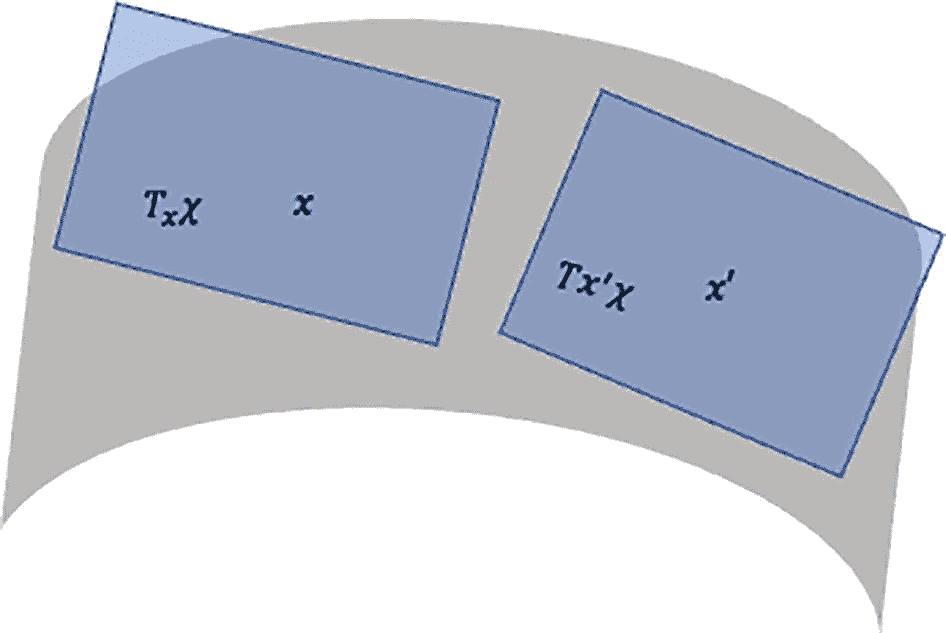

无向图和有向图的示意图。五个标记为 0、1、2、3、4 的点通过线段相互连接，在第二幅图中，相同的五个点通过箭头相互连接。

图 6-26

流形上的切平面

图 6-26（见上文）展示了流形的一个示意图。我们可以从图中看出，流形的切空间 *T*[*x*]*χ* 和 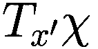 具有欧几里得性质。因此，内积的概念以及随之而来的距离在每个切空间上都被定义。

#### 图

图是最通用的数据结构形式。一个图 *G* 由顶点集（也称为节点）*V* 和顶点之间的边集 *E* 表示。因此，我们通常将图表示为 *G* = (*V*, *E*)。图 6-27 中展示了两个各有五个顶点的图。允许连接两个顶点的线条称为边。

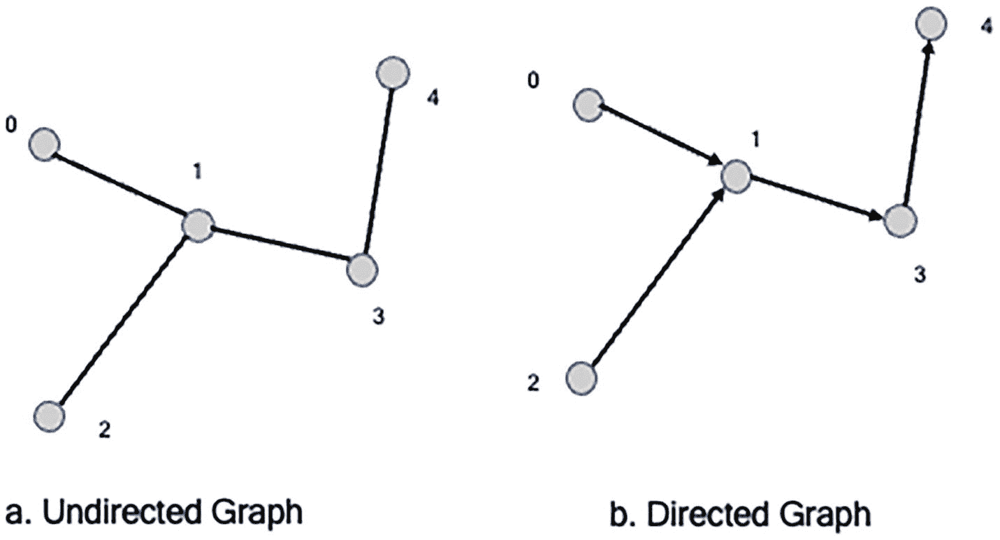

无向图和有向图的两个示例。五个标记为 0、1、2、3、4 的点通过线段相互连接，在第二幅图中，相同的五个点通过箭头相互连接。

图 6-27

有向和无向图

图 6-27a 被称为无向图，因为边没有方向，而图 6-27b 是有向图，因为边有方向。例如，顶点 3 和 2 之间的边在有向图中是从 3 到 2。如果在有向图中我们将顶点视为地点，将边视为道路，我们可以认为有一条道路从地点 3 到 2；然而，从 2 到 3 没有道路。

我们现在将讨论与图相关的一些相关概念。

#### 邻接矩阵

顶点之间的连通性用图的一个称为**邻接矩阵**的方阵来表示。对于五个顶点的图，邻接矩阵将是一个 5×5 的矩阵。如果行索引代表边的“起点”顶点，而列索引代表边的“终点”顶点，那么对于具有“起点”顶点 *i* 和“终点”顶点 *j* 的边，邻接矩阵中的条目 *e*[*ij*] 被设置为 1。图 6-27 中有向图的邻接矩阵如下：

|   | 顶点 0 | 顶点 1 | 顶点 2 | 顶点 3 | 顶点 4 |
| --- | --- | --- | --- | --- | --- |
| **顶点 0** | 0 | 1 | 0 | 0 | 0 |
| **顶点 1** | 0 | 0 | 0 | 1 | 0 |
| **顶点 2** | 0 | 1 | 0 | 0 | 0 |
| **顶点 3** | 0 | 0 | 0 | 0 | 1 |
| **顶点 4** | 0 | 0 | 0 | 0 | 0 |

我们可能已经意识到，有向图不一定是对称的。对于无向图，如果顶点 *i* 和 *j* 之间存在边，那么我们同时将 *e*[*ij*] 和 *e*[*ji*] 标记为 1。因此，无向图总是对称的。无向图的邻接矩阵表示如下：

|   | 顶点 0 | 顶点 1 | 顶点 2 | 顶点 3 | 顶点 4 |
| --- | --- | --- | --- | --- | --- |
| **顶点 0** | 0 | 1 | 0 | 0 | 0 |
| **顶点 1** | 1 | 0 | 1 | 1 | 0 |
| **顶点 2** | 0 | 1 | 0 | 0 | 0 |
| **顶点 3** | 0 | 1 | 0 | 0 | 1 |
| **顶点 4** | 0 | 0 | 0 | 1 | 0 |

##### 图的连通性

如果我们可以从任意顶点 *i* 到任意其他顶点 *j* 直接或通过其他顶点进行访问，则称图是**连通的**。如果我们考虑图 6-27a 中的无向图，它是连通的，因为我们可以从任意顶点到达其他顶点。然而，6-27b 中的有向图显然不是连通的。例如，在这个有向图中，顶点 4 和顶点 0 之间没有路径。

##### 顶点度数

顶点 *i* 的**入度**是指有多少条边以顶点 *i* 作为“目标顶点”。同样，顶点 *i* 的**出度**是指有多少条边以顶点 *i* 作为“源顶点”。对于一个无向图，一个节点的入度总是等于其出度，因此对于一个无向图，我们通常只需用“度”来指代入度和出度。对于一个有 *n* 个顶点的无向图，度矩阵将是一个对角矩阵 *D*[*n*×]，包含每个顶点的度数。

#### 图的拉普拉斯矩阵

对于一个有 *n* 个顶点 *v*[0], *v*[1], …. *v*[*n* − 1] 的无向图 *G* = (*V*, *E*)，拉普拉斯矩阵 *L*[*n* × *n*] 的每个元素可以定义为以下：

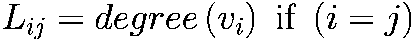

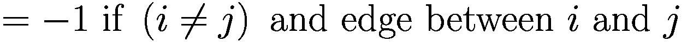

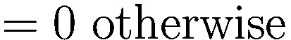

在矩阵表示法中，拉普拉斯矩阵 *L*[*n* × *n*] 可以用邻接矩阵 *A*[*n* × *n*] 和度矩阵 *D*[*n* × *n*] 表达如下：

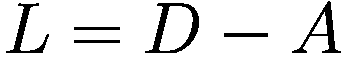

##### 拉普拉斯矩阵的函数

如果我们考虑图中的顶点具有特征 *x* = [*x*[0], *x*[1], …. . *x*[*n* − 1]]^(*T*)，那么拉普拉斯矩阵 *L* 可以被视为一个可以作用于特征的算子。为了理解拉普拉斯算子代表什么，让我们将图的拉普拉斯算子应用于特征 *x*：

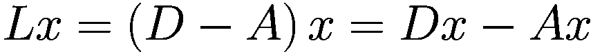

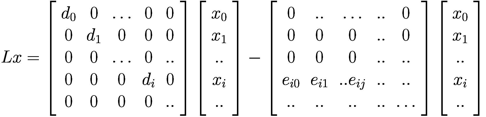

让我们看看在维度为 *n* 的 *Lx* 向量中，第 *i* 项会是什么。从 *Dx*，我们会得到 *d*[*i*]*x*[*i*]，而从 *Ax*，我们会得到 *e*[*i*0]*x*[0] + *e*[*i*1]*x*[1] + … *e*[*i* * (*n* - 1)]*x*[n* - 1]。因此，组合项如下：

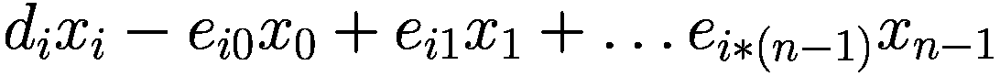

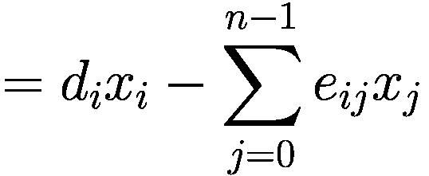

如果我们只考虑与顶点 *i* 共享边的顶点 *j*，那么 *i* 将只有 *d*[*i*] 个与 *i* 共享边的邻居。我们用 *N*(*i*) 表示 *i* 的直接邻居集。考虑到以上因素，上述表达式可以简化如下：

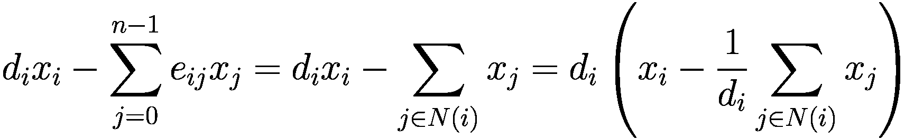

前一个表达式中的项 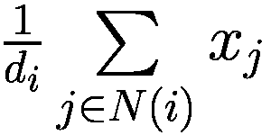 可以被视为顶点 *i* 附近的局部特征平均值，因此 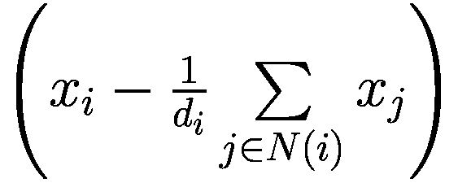 可以被视为顶点 *i* 的特征与其局部平均（其直接邻居的平均特征）之间差异的度量。

现在我们来探究图拉普拉斯算子是否与欧几里得域中的拉普拉斯算子有相似之处。

欧几里得域中的拉普拉斯算子如下所示：

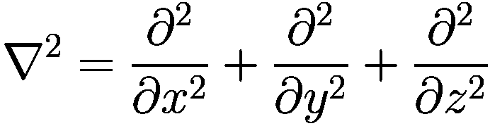

对于一维函数 *f*(*x*)，拉普拉斯算子 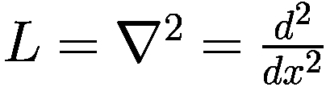 作用于该函数给出以下结果：

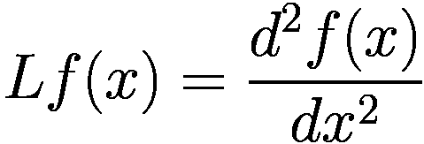

前述二阶导数的有限近似可以表示如下：

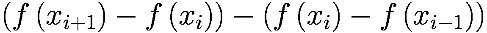

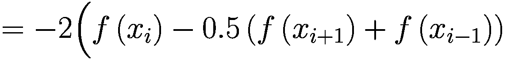

从前面的表达式中可以看出，欧几里得域中的拉普拉斯算子也给出了一个度量，即函数值相对于其邻居平均值的差异程度。

##### 拉普拉斯矩阵的不同版本

我们一直在使用的拉普拉斯矩阵被称为未归一化拉普拉斯矩阵，表示为 *L* = *D* − *A*。

如果我们使用度矩阵 *D* 对 (*D* − *A*) 进行对称归一化，那么我们得到以下归一化拉普拉斯矩阵：

**归一化拉普拉斯矩阵** 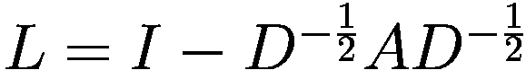

标准化拉普拉斯矩阵中的边缘权重可以表示为 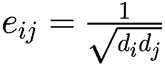。

如果我们将度矩阵的逆作为归一化器应用于 (*D* − *A*)，那么我们得到通常称为随机游走拉普拉斯矩阵的内容，如下所示：

**随机游走拉普拉斯矩阵** *L* = *I* − *D*^(−1)*A*

请注意，随机游走拉普拉斯矩阵不会是对称的。

#### 几何学习中的不同问题表述

图和流形上的几何学习处理两类问题：

+   描述非欧几里得数据的结构。

+   在非欧几里得域上分析和处理函数与信号。

以下是一些目前用于描述非欧几里得数据的传统方法。

+   MDS：多维尺度

+   自动编码器

+   LLE

+   谱聚类

我们将简要介绍每种方法，以便过渡到几何深度学习。

#### 多维尺度

MDS 试图从一个给定数据点的相似度矩阵中构建数据点的欧几里得潜在空间。因此，给定 *n* 个数据点的相似度矩阵 *D*[*n* × *n*]，其中数据点 *i* 和 *j* 的相似度为

表示为 *d*[*ij*]，MDS 试图找到潜在表示 *z*[0]，*z*[1]，…，*z*[*n* − 1]，使得每个数据点对都满足以下条件：

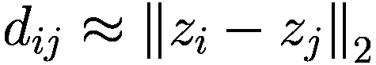

注意，如果初始的不相似性是欧几里得距离，则 MDS 等价于主成分分析。然而，在更一般的意义上，MDS 用于将点从非欧几里得空间投影到欧几里得空间，使用非欧几里得成对距离。

#### 自动编码器

自动编码器使用其编码器将点投影到低维潜在空间。我们在第五章中广泛探讨了自动编码器。给定一个具有编码器 *E*[*θ*] 和解码器 *D*[*ϕ*] 的自动编码器，它通过最小化重建损失和某种形式的正则化损失 *R* 来学习，如下所示：

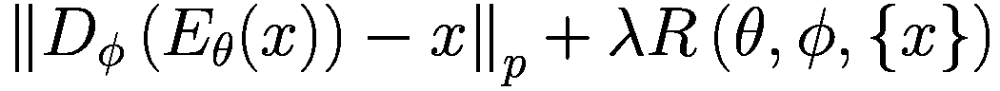

编码器的输出 *z* = *F*(*x*) 属于我们感兴趣的低维空间。正则化器根据自动编码器的性质而变化。

例如，对于变分自动编码器，我们希望解码器表现得像一个生成模型，我们希望正则化器最小化生成的潜在样本 *z* = *E**θ* 和高斯先验 *P*(*z*) 之间的 KL 散度，我们希望使用解码器从中采样。

对于去噪自动编码器，我们通过具有过度表示的潜在空间并通过对潜在表示激活施加低概率伯努利分布来诱导稀疏性来学习稀疏编码的潜在空间。

#### 局部线性嵌入

局部线性嵌入（LLE）试图通过保留点之间的局部邻域距离来找到数据的低维投影。这个计算距离的局部邻域可以被视为流形上的切空间，它们本身表现为欧几里得空间。

算法上，LLE 试图通过以下步骤找到低维投影：

1.  给定 *N* 个数据点，找到每个数据点的 k 个最近邻，使得给定的数据点 *x*[*i*] ∈ *R*^(*D*) 可以表示为 k 个最近邻的线性组合，如下所示：

    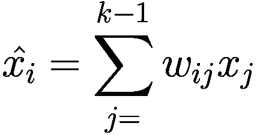

权重 *w*[*ij*] 的矩阵 *W* 通过优化以下目标函数来学习：


每个数据点对应的权重遵循以下约束条件：

+   *w*[*ij*] = 0 如果 *x*[*j*] 不在 *x*[*i*] 的 K 个最近邻内。

+   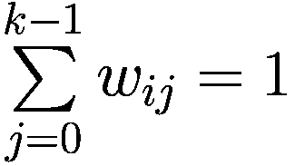

对于每个数据点，学习到的权重 *w*[*ij*] 对数据点及其邻居的旋转和缩放是不变的，这从前面的优化目标 *L*(*W*) 中可以明显看出。权重和为 1 的约束使得权重对数据点的平移是不变的。想象一下，数据点 *x*[*i*] 及其 k 个最近邻被平移了 ∆*x*。我们可以看到，学习到的权重仍然对以下情况是不变的：

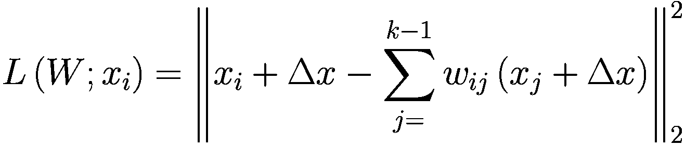

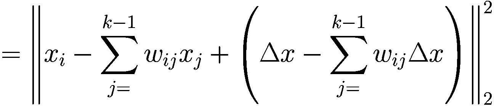

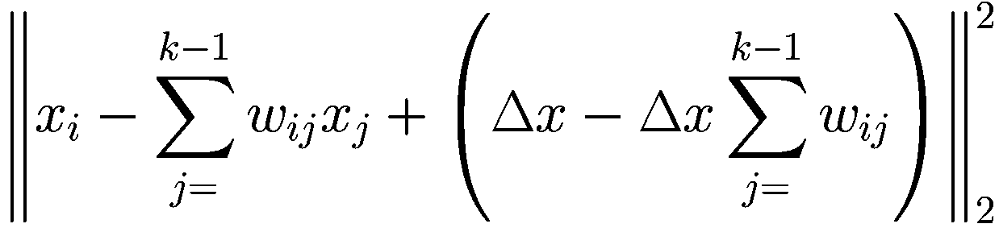

如果 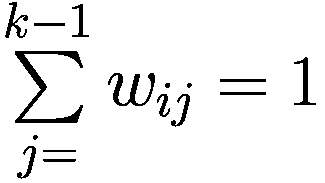，那么 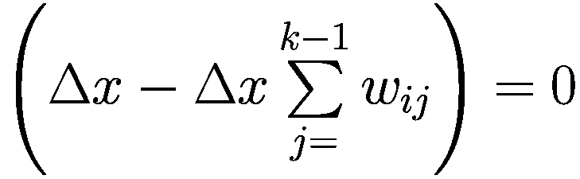，因此上述表达式简化为平移前的相同目标，即 *i*。*e*，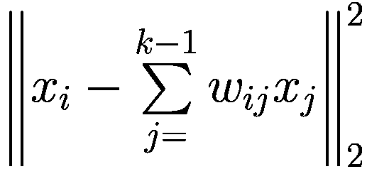。

1.  如果数据是位于平滑的低 *d* ≪ *D* 维流形中的高 *D* 维原始空间，那么将存在一个关于旋转、缩放和平移的线性映射，该映射将每个邻居的高 *D* 维输入映射到低 *d* 维流形的全局坐标。由于每个数据点 *x*[*i*] 的 k 个最近邻权重 *w*[*ik*] 对旋转、缩放和平移是不变的，因此我们可以用相同的一组权重表示新低 *d* 维流形中的每个数据点。因此，如果我们把每个原始数据点 *x*[*i*] ∈ *R*^(*D*) 映射到它们的低 *d* 维表示 *y*[*i*] ∈ *R*^(*d*)，那么以下应该成立：

    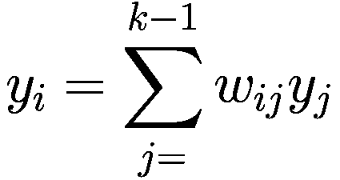

此外，对于所有以矩阵 *Y* ∈ *R*^(*d* × *N*) 表示的数据点，可以通过最小化以下目标函数获得低维表示 *y*[*i*]：

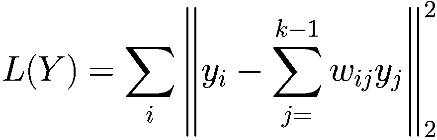

在约束低维表示具有零均值（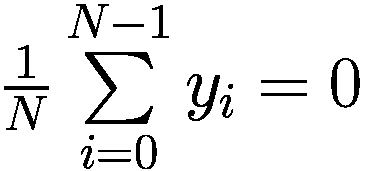）和单位协方差（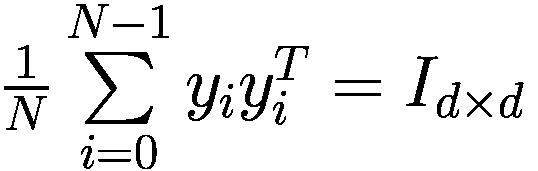）下最小化先前的目标 *L*(*Y*)，导致 *Y* 的解是稀疏对称矩阵 (*I* − *W*)^(*T*)(*I* − *W*) 的最低 (*d* + 1) 个特征值对应的特征向量。与零特征值对应的所有一的特征向量 [1, 1, ..]^(*T*) 可以忽略，其余的特征 *d* 个向量可以被视为 *Y* 的嵌入表示。

#### **谱嵌入**

**谱嵌入**是一种基于谱图理论的嵌入生成方法。以下是与谱嵌入创建相关的步骤。

1.  如果给定的输入是高维流形中的数据点，并且没有图邻接，我们需要首先根据数据点的局部亲和度创建一个邻接矩阵。类似于每个数据点 *x*[*i*] 的 LLE，我们可以选择其 k 个最近邻作为其邻居，它们共享边。另一种常见的方法是选择与数据点在指定 *ϵ* 欧几里得距离内的数据点作为其邻居。

    邻接矩阵中的边权重 *w*[*ij*] 通常在数据点 *i* 和 *j* 之间存在边时设置为 1；否则权重设置为 0。有时，人们更倾向于使用以下高斯边权重方案：

    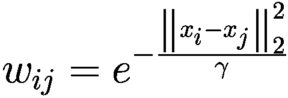

1.  一旦创建了包含数据点作为图顶点的图邻接矩阵 *A*，我们就可以按照以下方式创建拉普拉斯矩阵：

    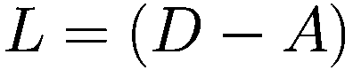

拉普拉斯矩阵是一个对称正定矩阵，因此它具有以下所示的谱分解形式：

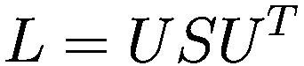

*U* 包含拉普拉斯矩阵的特征向量，而 *S* 是一个包含相应特征值的对角矩阵。如果图包含 *n* 个顶点，那么

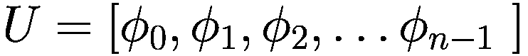

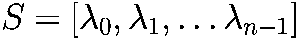

这里特征值是递增的，第一个特征值 *λ*[0] = 0。因此，我们有以下：

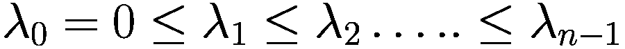

对应于特征值 *λ*[0] = 0 的特征向量 *ϕ*[0] 是所有元素都为 1 的向量，即 [1, 1, ..1]^(*T*). 所有 1s 特征向量对应于特征值 0 的这一事实可以通过观察以下方程中的 i-th 个条目来轻易证明。

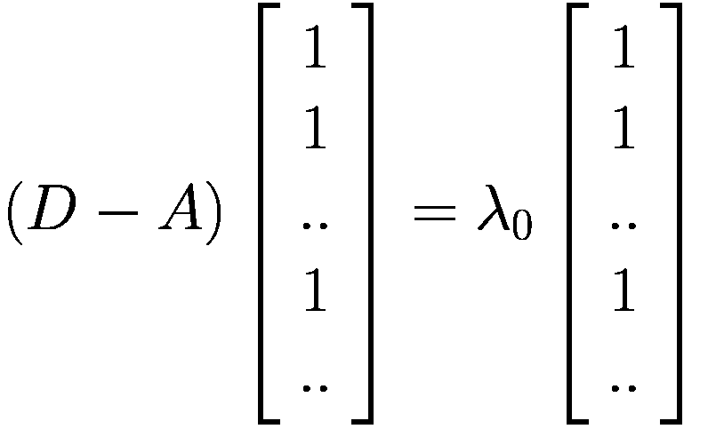

在前一个方程的左侧，对于 i-th 个条目对应于 i-th 个顶点：

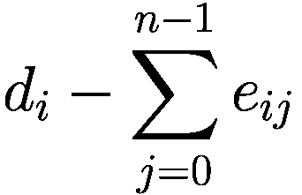

上述表达式为零，因为 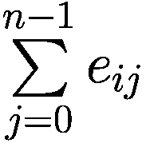 实际上就是顶点 i 的度。因此，右侧的 i-th 个条目，即 *λ*[*o*]，应该等于零。

拉普拉斯算子的特征向量在图域中充当傅里叶基函数，而特征值充当傅里叶频率。通过将其与欧几里得拉普拉斯算子 ∇² 或其一维等价形式 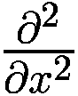 对应的特征函数和特征值集合进行比较，就可以很容易地将拉普拉斯算子的特征向量视为图的傅里叶基函数。如果我们取复指数函数 *e*^(*iwx*)，我们就有以下结果：

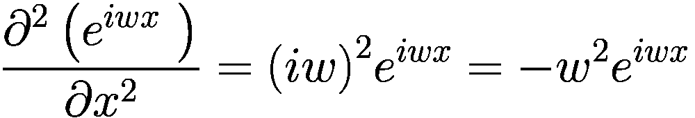

前面的方程证明了复指数是欧几里得域中拉普拉斯算子的特征函数。由于这些复指数（正弦和余弦的和）构成了欧几里得域中的傅里叶基，因此图拉普拉斯算子的特征向量可以被视为图域中的傅里叶基。同样，图拉普拉斯的对应特征值可以被视为傅里叶频率的平方，因为欧几里得拉普拉斯算子的特征值与频率的平方成正比。

1.  按照递增顺序排列的特征向量被视为谱嵌入。通常，对于一个 d 维嵌入空间，选择前 (*d* + 1) 个特征向量作为嵌入。由于所有 1s 特征向量对应于 *λ*[*o*] = 0 并不提供对顶点的任何判别能力，因此它被舍弃。

    如果图有两个连通分量，那么特征值 *λ*[1] 将为零。推广上述事实，如果图有 *k* 个连通分量，那么前 *k* 个特征值 *λ*[*o*]，*λ*[1]，…，*λ*[*k* − 1] 都将等于零。因此，特征值的幅度给出了图连通性的一个概念。相应的特征向量可以用作嵌入特征，因为形成强连通社区的顶点在其特征向量嵌入空间中会有相似的价值。例如，如果我们有一个图中两个强连通社区，其中社区内边在社区间边中占主导地位，那么第二个特征值将接近零，第二个特征向量值可以通过 K 均值或应用一些方便的阈值轻松分为两个簇。同样，如果图中有三个强社区，我们可以引入第三个特征向量作为额外的嵌入维度，并使用 k 均值将图聚类为三个社区，使用 [*ϕ*[1] *ϕ*[2]] ∈ R(*n* × 2) 作为嵌入。

现在我们已经了解了用于表征非欧几里得数据的传统方法，让我们现在看看 Node2Vec——一种最近出现的几何深度学习方法，用于创建节点（顶点）嵌入。

#### Node2Vec

Node2vec 是一个表示学习框架，它利用图中的实体及其关系来学习图顶点（节点）的低维表示。学习目标基于有偏随机游走来根据网络邻域的各种定义确定节点邻居。

在 Node2Vec 中，给定一个图 *G* = (*V*, *E*)，我们试图学习一个函数 *f*，该函数将节点映射到如图所示的低维 d 维嵌入空间：

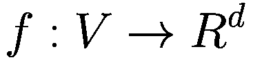

学习此类节点特征表示的主要目标之一是使用它们进行下游预测任务。

让我们更仔细地看看 Node2Vec 的学习目标。对于每个源节点 *u* ∈ *V*，我们应该能够使用其特征表示 *f*(*u*) 以高概率预测其采样邻域 *N**S*。因此，所有节点的学习目标如下：

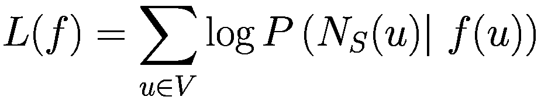

为了使学习过程可行，Node2Vec 做了两个关键假设：

+   条件独立性：我们假设观察邻域节点的似然性在给定源节点的特征表示的情况下独立于其他邻域节点。因此，我们可以有以下因式分解：

    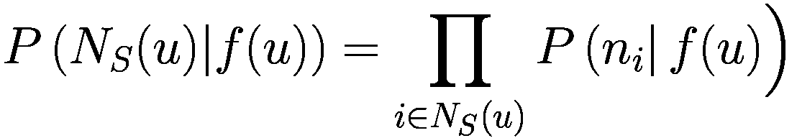

+   特征空间对称性：源节点及其邻居对特征空间有对称影响。因此，我们可以通过节点表示点积的 SoftMax 来定义所有源邻居节点对的似然。

    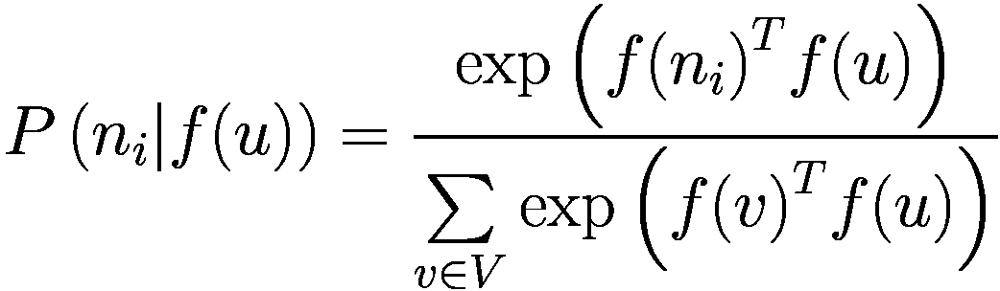

应用前面的假设，Node2Vec 的学习目标 *L*(*f*) 可以简化如下：

![L(f)=sum_uinV[-logZ_u+sum_iinN_S(u)f(n_i)^Tf(u)]](img/448418_2_En_6_Chapter/448418_2_En_6_Chapter_TeX_Equdb.png)

对于每个节点 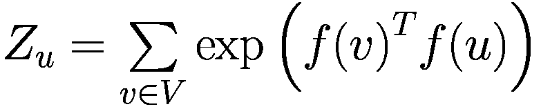，其分母函数对于大型图来说难以计算，因此我们通常用负采样来近似它。

通过最大化目标 *L*(*f*) 可以学习到期望的函数 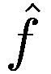：

![hat{f}=argmax_fsum_uinV[-logZ_u+sum_iinN_S(u)f(n_i)^Tf(u)]](img/448418_2_En_6_Chapter/448418_2_En_6_Chapter_TeX_Equdc.png)

对于每个节点 *u*，我们在 Node2vec 中如何采样邻居 *N**S* 至关重要，因为它决定了将要学习的节点嵌入的性质。通常，我们试图在这些嵌入中学习的相似性的重要概念是 **结构相似性** 和 **同质性**。

在结构相似性假设下，如果两个节点在网络中具有相似的结构角色，它们的嵌入应该彼此相似。或者，在同质性假设下，两个高度相互连接且属于相似社区或聚类的节点应该具有相似的嵌入表示。大多数情况下，为了在下游任务中表现良好，嵌入中应该同时捕捉到结构相似性和同质性的概念。

**广度优先采样**，其中邻居 *N**S* 被限制为 *u* 的直接邻居，将允许很好地学习结构相似性，但将无法捕捉到同质性。另一方面，**深度优先采样**将找到多个跳数之外的强相互连接的邻居，在这个过程中，将能够很好地学习同质性，但将无法捕捉到结构相似性。Node2Vec 允许通过定义两个参数 *p* 和 *q* 来捕获结构相似性和同质性的两个方面，这两个参数控制随机游走中广度优先采样和深度优先采样的程度。

在 Node2Vec 中，以每个节点 *u* ∈ *V* 作为起始节点，我们进行几个指定长度 *l* 的随机游走（例如 *r*）。因此，在这种设置下的随机游走总数为 |*V*| × *r*。每个随机游走可以看作是长度为 *l* 的节点 id 句子。现在为了更好地理解从给定节点 *u* 开始如何创建这些随机游走句子，让我们参考图 6-28。

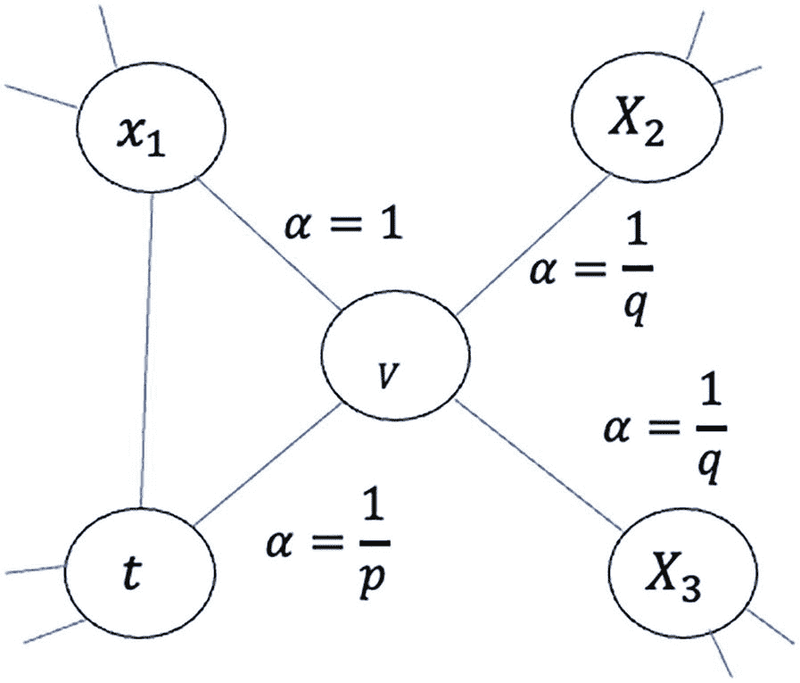

一个网络有五个圆圈，中间的一个标记为 V。其他四个是 X 1、X 2、X 3 和 t。

图 6-28

使用参数 p 和 q 的二阶随机游走

让我们假设在游走过程中，我们已经从节点 *t* 到达节点 *v*。因此，节点 *v* 是游走中最近采样的节点，而节点 *t* 是在 *v* 之前采样的节点。现在，游走需要根据某些转移概率决定新的节点 *x*。选择下一个节点 *x* 的未归一化转移概率 *π*[*vx*] 基于以下二阶随机游走：

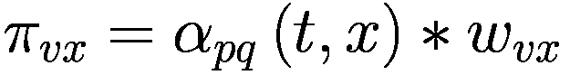

在上述方程中，*w*[*vx*] 表示节点 *v* 和 *x* 之间的边权重。对于一个无权图，*w*[*vx*] = 1，如果 *v* 和 *x* 之间存在边；否则 *w*[*vx*] = 0。

因子 *α**pq* 依赖于参数 *p* 和 *q* 以及先验节点 *t*，因此该方案是一个二阶随机游走。以下为 *α**pq* 方案：

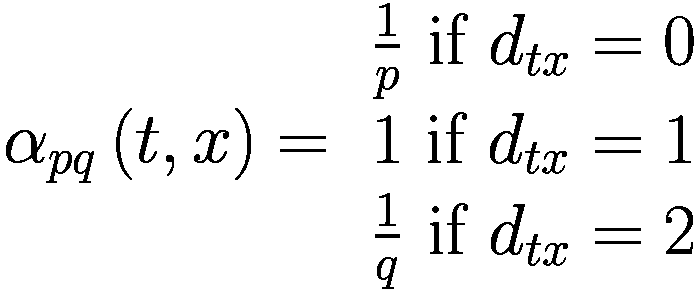

在先前的方案中，*d*[*tx*] 表示 *t* 和 *x* 之间的最短路径距离。

在图 6-28 中，节点 *x*[1] 与节点 *t* 有方向连接，因此距离 *d*[*tx*] = 1。因此，*α**pq* = 1。

交替地，节点 *x*[2] 和 *x*[3] 与节点 *t* 的距离为 2。

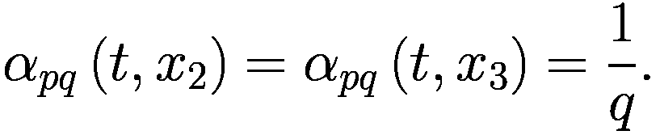

最后，我们来看 *d*[*tx*] = 0，这本质上指的是游走返回到先前采样的节点 *t*。在这种情况下 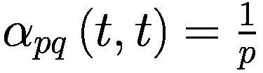。因此，较低的 *p* 值将鼓励游走停留在相同的邻域内，从而鼓励广度优先采样。同样，较低的 *q* 值将鼓励随机游走捕获长距离邻居，从而有利于深度优先采样。我们可以根据我们正在解决的问题调整因子 *p* 和 *q*。

一旦随机游走被一般化采样，我们就考虑上下文或窗口大小 *k* 来定义每个采样节点 *u* 的邻域 *N**S*。为了理解这一点，让我们从一个以节点 *u* 为起点的长度为 6 的随机游走开始，如下所示：

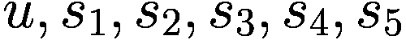

从前面的随机游走中，我们可以使用一个大小为 *k* = 3 的上下文窗口为不同的节点创建以下邻域：

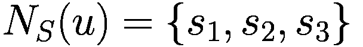

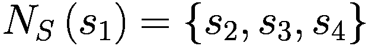

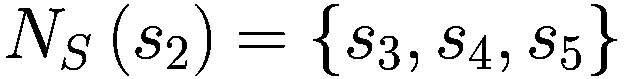

将前面的观察结果推广，对于每个长度为 *l* 的随机游走字符串的上下文大小 *k*，我们使用随机游走的 *l* 个样本创建 *k* * (*l* - *k*) 个训练样本。因此，Node2Vec 方法是样本高效的。

#### Node2Vec 在 TensorFlow 中的实现

在本节中，我们将实现 Node2Vec 算法以创建节点嵌入。在本练习中，我们将使用 Cora 数据集，其中节点代表属于七个类别的不同出版物——“规则学习”、“强化学习”、“基于案例”、“概率方法”、“遗传算法”、“理论”和“神经网络”。

出版物中的引用创建了 Cora 数据集图的边。属于同一类别的出版物预计将在它们之间有多个边。使用 Node2Vec，我们期望具有类别的学习嵌入彼此相似。我们还期望跨类别的学习嵌入彼此不同。

我们将使用 StellarGraph 图神经网络功能，因为它与 TensorFlow 无缝协作。我们将处理的图将是 StellarGraph 图对象，因此让我们看看我们如何在以下内容中创建一个 StellarGraph：

```py
# Please install Stellargraph
from stellargraph import IndexedArray
import pandas as pd
nodes = IndexedArray(np.array([[1,2],[2,1], [5,4],[4,5]]),index=['a','b','c','d'])
edges = pd.DataFrame({"source":["a","b","c","d","a"],"target":["b","c","d","a","c"]})
GS_example = StellarGraph(nodes,edges)
print("Graph info", GS_example.info())
print(f"Graph directed:{GS_example.is_directed()}")
print(f"Nodes :{GS_example.nodes()}")
print(f"Node features :{GS_example.node_features()}")
--output—
Graph info StellarGraph: Undirected multigraph
Nodes: 4, Edges: 5
Node types:
default: [4]
Features: int64 vector, length 2
Edge types: default-default->default
Edge types:
default-default->default: [5]
Weights: all 1 (default)
Features: none
Graph directed:False
Nodes :Index(['a', 'b', 'c', 'd'], dtype='object')
Node features :[[1 2]
[2 1]
[5 4]
[4 5]]
Listing 6-7
Creating a StellarGraph-Specific Graph
```

从列表 6-7 中我们可以看到，我们可以通过输入索引数组形式的 **nodes** 和数据帧形式的 **edges** 来创建一个 StellarGraph 对象。节点的索引数组由节点特征组成，并按节点 ID 进行索引。另一方面，边可以以包含“from”和“to”节点 ID 的“source”和“target”列的数据帧形式输入。可以使用 **nodes()** 和 **node features()** 方法来获取与图节点对应的节点 ID 和节点特征。

StellarGraph 将围绕常见数据集提供方法，以便我们可以直接将它们加载到 StellarGraph 对象中，正如我们将在以下实现中看到的那样。

现在我们已经对 StellarGraph 图的工作原理有了些了解，接下来让我们使用 Node2Vec 实现 Cora 数据集中节点的嵌入生成。详细的实现过程如图 6-8 所示。

![f[n]*g[n]](img/448418_2_En_6_Chapter/448418_2_En_6_Chapter_TeX_Equdk.png)

T S N E 节点嵌入的散点图，使用不同颜色表示。

图 6-29

Node2Vec 嵌入在二维平面上的 t-SNE 图

```py
import matplotlib.pyplot as plt
from sklearn.manifold import TSNE
import io, os, sys, types
import networkx as nx
import numpy as np
import pandas as pd
from tensorflow import keras
import json
import re
from collections import Counter
from IPython.display import Image, HTML, display
import stellargraph as sg
from IPython.display import display, HTML
from stellargraph import StellarGraph
from stellargraph.data import BiasedRandomWalk
from stellargraph.data import UnsupervisedSampler
from stellargraph.mapper import Node2VecLinkGenerator, Node2VecNodeGenerator
from stellargraph.layer import Node2Vec, link_classification
import time
from sklearn.metrics.pairwise import cosine_similarity
%matplotlib inline
import warnings
warnings.filterwarnings('ignore')
# Load the Cora dataset along with the node labels
def load_cora_dataset():
dataset = sg.datasets.Cora()
display(HTML(dataset.description))
GS, node_subjects = dataset.load(largest_connected_component_only=True)
# GS contains the Stellar Graph
# node_subjects contains the node_features indexed by the node ids
return GS, node_subjects
# Define a Baised Random Walker Object
def random_walker(graph_s,num_walks_per_node,walk_length,p=0.5,q=2.0):
walker = BiasedRandomWalk(
graph_s,
n=num_walks_per_node,
length=walk_length,
p=p,  # defines probability, 1/p, of returning to source node
q=q,  # defines probability, 1/q, for moving to a node away from the source node
)
return walker
# Create sampler for training
def create_unsupervised_sampler(graph_s,walker):
nodes=list(graph_s.nodes())
unsupervised_sampler = UnsupervisedSampler(graph_s, nodes=nodes, walker=walker)
return unsupervised_sampler
# Training Routine
def train(batch_size=50,epochs=2,num_walks_per_node=100,walk_length=5, \
p=0.5,q=2.0,emb_dim=128,lr=1e-3):
GS, node_subjects = load_cora_dataset()
# Create a random walker sampler
walker = random_walker(graph_s=GS,num_walks_per_node=num_walks_per_node, \
walk_length=walk_length,p=p,q=q)
unsupervised_sampler = create_unsupervised_sampler(graph_s=GS,walker=walker)
# Create a batch generator
generator = Node2VecLinkGenerator(GS, batch_size)
# Define the Node2Vec model
node2vec = Node2Vec(emb_dim, generator=generator)
x_inp, x_out = node2vec.in_out_tensors()
# link_classification is the output layer that maximizes the dot product of the similar nodes
prediction = link_classification(
output_dim=1, output_act="sigmoid", edge_embedding_method="dot"
)(x_out)
model = keras.Model(inputs=x_inp, outputs=prediction)
# Compile Model
model.compile(
optimizer=keras.optimizers.Adam(learning_rate=lr),
loss=keras.losses.binary_crossentropy,
metrics=[keras.metrics.binary_accuracy],
)
# Train the model
history = model.fit(
generator.flow(unsupervised_sampler),
epochs=epochs,
verbose=1,
use_multiprocessing=False,
workers=4,
shuffle=True,
)
# Predict the embedding
x_inp_src = x_inp[0]
x_out_src = x_out[0]
embedding_model = keras.Model(inputs=x_inp_src, outputs=x_out_src)
node_gen = Node2VecNodeGenerator(GS, batch_size).flow(node_subjects.index)
node_embeddings = embedding_model.predict(node_gen, workers=4, verbose=1)
print(f"Shape of the node Embeddings : {node_embeddings.shape}")
print('Length of embedded vectors:',len(node_embeddings[0]))
print('Total embedded vectors:', len(node_embeddings))
plot_embeddings(node_embeddings,node_subjects)
def plot_embeddings(node_embeddings,node_subjects,n_components=2):
transform = TSNE
trans = transform(n_components=2)
node_embeddings_2d = trans.fit_transform(node_embeddings)
# draw the embedding points, coloring them by the target label (paper subject)
alpha = 0.7
label_map = {l: i for i, l in enumerate(np.unique(node_subjects))}
node_colours = [label_map[target] for target in node_subjects]
plt.figure(figsize=(7, 7))
plt.axes().set(aspect="equal")
plt.scatter(
node_embeddings_2d[:, 0],
node_embeddings_2d[:, 1],
c=node_colours,
cmap="jet",
alpha=alpha,
)
plt.title("{} visualization of node embeddings".format(transform.__name__))
plt.show()
train()
--output--
link_classification: using 'dot' method to combine node embeddings into edge embeddings
Epoch 1/2
39760/39760 [==============================] - 140s 4ms/step - loss: 0.3017 - binary_accuracy: 0.8497
Epoch 2/2
39760/39760 [==============================] - 136s 3ms/step - loss: 0.1092 - binary_accuracy: 0.9643
50/50 [==============================] - 0s 3ms/step
Shape of the node Embeddings : (2485, 128)
Length of embedded vectors: 128
Total embedded vectors: 2485
Listing 6-8
Node2Vec on the Cora Dataset
```

Node2Vec 生成的嵌入通过 t-SNE 投影到二维平面上（见 图 6-29）。图中七种不同的颜色对应于出版物所属的七个不同领域。我们可以看到，属于同一领域的出版物嵌入彼此靠近，而不同领域的嵌入则很好地分离，重叠非常小。

#### 图卷积网络

现在，我们将探讨图卷积网络。由于图神经网络在图谱理论中有着深厚的根基，我们将从图卷积中的频谱滤波器开始，逐步过渡到我们今天使用的 GCN。在这个过程中，我们将讨论频谱 CNN、K-局部滤波器及其变体 ChevNet，以及一些导致更简单公式的缺点，例如 GCN。最后，我们将讨论一些其他非常流行的图卷积方法——GraphSage 和图注意力网络。

#### 图卷积中的频谱滤波器

在空间或时间（欧几里得）域中，离散信号 *f*[n] 与滤波器 *g*[n] 的卷积可以有两种方式：

1.  卷积输出 *y*[n] = *f*n*g*[n] 可以通过在域上滑动翻转的滤波器并计算每个 *n* 值与 *f*[n] 的点积，完全在空间/时间域内计算。这种方法实际上按以下方式计算卷积的输出：

    ![y[n]=∑_{m=-∞}^{m=∞}f[m]g[n-m]](img/448418_2_En_6_Chapter/448418_2_En_6_Chapter_TeX_Equdk.png)

1.  我们可以对信号和滤波器应用傅里叶变换 *F*，以获得它们的频率域对应物 ![$$ \overset{\sim }{f}\left[k\right] $$](img/448418_2_En_6_Chapter/448418_2_En_6_Chapter_TeX_IEq41.png) 和 ![$$ \overset{\sim }{g}\left[k\right] $$](img/448418_2_En_6_Chapter/448418_2_En_6_Chapter_TeX_IEq42.png)，其中 ![$$ F\left[f\left[n\right]\right]=\overset{\sim }{f}\left[k\right] $$](img/448418_2_En_6_Chapter/448418_2_En_6_Chapter_TeX_IEq43.png)。

    然后，我们可以将频率域信号 ![$$ \overset{\sim }{f}\left[k\right] $$](img/448418_2_En_6_Chapter/448418_2_En_6_Chapter_TeX_IEq44.png) 和 ![$$ \overset{\sim }{g}\left[k\right] $$](img/448418_2_En_6_Chapter/448418_2_En_6_Chapter_TeX_IEq45.png) 相乘，以获得卷积输出频率域响应，如下所示：

    ![$$ \overset{\sim }{y}\left[k\right]=\overset{\sim }{f}\left[k\right]\overset{\sim }{g}\left[k\right] $$](img/448418_2_En_6_Chapter/448418_2_En_6_Chapter_TeX_Equdl.png)

最后，我们对 ![$$ \overset{\sim }{y}\left[k\right] $$](img/448418_2_En_6_Chapter/448418_2_En_6_Chapter_TeX_IEq46.png) 应用逆傅里叶变换 *F*^(−1)，以获得空间/时间域中卷积的输出，如下所示：

![$$ y\left[n\right]={F}^{-1}\left[\overset{\sim }{y}\left[k\right]\right] $$](img/448418_2_En_6_Chapter/448418_2_En_6_Chapter_TeX_Equdm.png)

在图中，空间性的概念并没有像欧几里得域那样定义得很好，在欧几里得域中，我们默认空间性是因为欧几里得域呈现了良好的、一致的邻域。可以说，节点之间的跳转距离赋予了图一些空间性或局部性的本质；然而，它并不一致，也没有全局结构，这使得空间卷积可以明显地从中受益。

我们之前（在谱嵌入部分）看到，图拉普拉斯算子 *L* = *D* − *A* 为傅里叶变换基提供了一个强大的基础，形式为图拉普拉斯算子的特征向量 *ϕ*[0], *ϕ*[1], …. *ϕ*[|*V*| − 1]。对应于特征向量的特征值 *λ*[*o*], *λ*[1], . . *λ*[|*V*| − 1] 在图域中充当傅里叶频率。这与欧几里得域类似，其中拉普拉斯算子 ∇² 的特征函数是复指数傅里叶基函数 *e*^(*jwx*)。因此，我们可以利用图傅里叶变换将图信号转换为频域。让我们记下对称归一化拉普拉斯算子的谱分解公式，以便我们可以与用于谱卷积网络的图傅里叶变换联系起来。

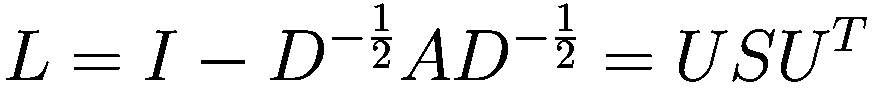

![$$ U=\left[{\phi}_o,{\phi}_1,\dots ..{\phi}_{\left|V\right|-1}\ \right] $$](img/448418_2_En_6_Chapter/448418_2_En_6_Chapter_TeX_Equdo.png)

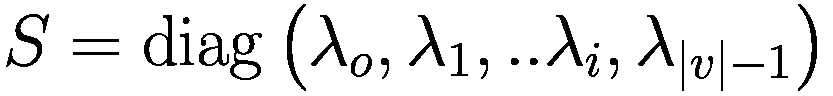

由于对称归一化，矩阵 *U* 是酉矩阵，因此 *UU*^(*T*) = *I*。

我们可以通过将函数 *f* 投影到不同的图傅里叶基 *U* = [*ϕ*[*o*], *ϕ*[1], …. . *ϕ*[|*V*| − 1] 上，在图节点上对函数 *f* 执行图傅里叶变换。因此，函数 *f* 的图傅里叶变换可以表示如下：

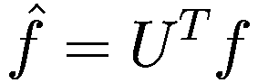

或者，通过应用逆傅里叶变换 (*U*^(*T*))^(−1)[.]，可以将频域中的信号转换到图空间域。由于 *U* 是一个幺正算子，逆傅里叶变换算子 (*U*^(*T*))^(−1) 等于 *U*。

在以下内容（参见图 6-30）中，展示了函数 *f* 在图 *G* = (*V*, *E*) 上与滤波器 *g* 进行谱卷积的机制。

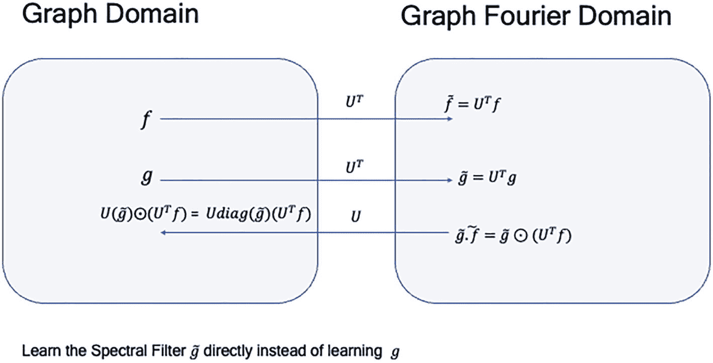

图域和图傅里叶域由三个不同的函数组成，并通过箭头连接以学习谱滤波器 g。

图 6-30

图谱卷积示意图

如图中所示，信号 *f* 与 *g* 的卷积输出可以表示如下：

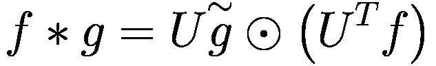

对于谱卷积神经网络，我们感兴趣的并不是学习滤波器 *g*，而是其谱等价物 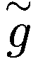，因此我们在前面的卷积表达式中保留了它。此外，为了数学上的方便，我们可以将前面的表达式中使用的哈达玛积替换为矩阵乘法。这需要将向量 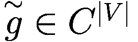 替换为对角矩阵 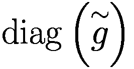。因此，经过所需的更改后，卷积可以表示如下：

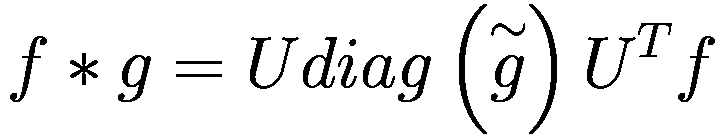

我们使用 *θ* 对对角矩阵  进行参数化，并将其表示为 *g**θ*，其中 *S* 代表特征值。特征值充当图傅里叶频率，由于谱滤波器将包含对应于图频率的系数，我们可以将 *g**θ* 表示如下：

![$$ {g}_{\theta }(S)=\left[\begin{array}{cccc}\overset{\sim }{g}\left({\lambda}_o\right)&amp; \dots &amp; ..&amp; 0\\ {}.&amp; \overset{\sim }{g}\left({\lambda}_1\right)&amp; .&amp; .\\ {}.&amp; .&amp; ..&amp; .\\ {}0&amp; .&amp; .&amp; \tilde{g}_{\left|V\right|-1}\left({\lambda}_{\left|V\right|-1}\right)\end{array}\right] $$](img/448418_2_En_6_Chapter/448418_2_En_6_Chapter_TeX_Equdt.png)

谱卷积的表达式可以写为如下：

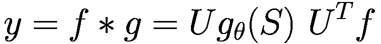

所有基于频谱滤波器的图卷积网络都遵循相同的卷积定义，它们仅在 *g**θ* 的选择上有所不同。

#### 频谱 CNN

频谱 CNN 保持滤波器无约束，并为模型学习提供 ∣*V*∣ 个自由参数。

![g_θ(S)=\left[\begin{array}{cccc}\theta_o& \dots & ..& 0\\ {}& \theta_1& .& .\\ {}& .& ..& .\\ {}0& .& .& \theta_{|V|-1}\end{array}\right]](img/448418_2_En_6_Chapter/448418_2_En_6_Chapter_TeX_Equdv.png)

该公式的几个主要问题如下：

+   在频域中定义的滤波器不具有空间局部化特性。

+   此外，对于一个有 ∣*V*∣ 个节点的图，频谱滤波器 *g**θ* 中的参数数量也是 ∣*V*∣。对于大型图，这可能导致高计算复杂度。

+   此外，对于大型图，上述卷积操作非常昂贵，因为与特征向量矩阵的乘法是 *O*(|*V*|²)。而且，对大型图进行特征向量分解可能一开始就不可行。

+   频谱卷积高度依赖于假设在训练和预测之间图不会发生变化。如果图发生变化，傅里叶基会变化，并且使用旧傅里叶基学习到的滤波器权重将不再有效。因此，频谱方法适用于训练和预测之间图保持固定的归纳设置。

#### K-局部化频谱滤波器

我们不是试图将滤波器 *g**θ* 的所有系数作为自由参数来学习，而是可以将 *g**θ* 定义为 *S* 的一个多项式，阶数最高为 *K*，并且只有 *K* + 1 个自由参数。这样的滤波器可以定义为以下形式：

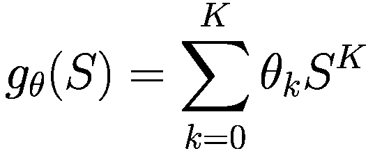

使用此频谱滤波器对函数 *f* 进行卷积的输出可以写成以下形式：

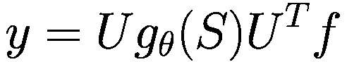

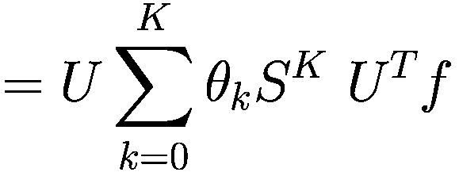

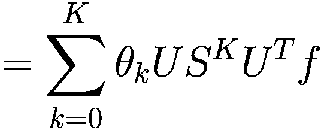

现在由于 *USU*^(*T*) 是拉普拉斯算子 *L* 的谱分解，因此 *L*^(*k*) = *US*^(*K*)*U*^(*T*)。这允许我们将卷积的输出写成以下形式：

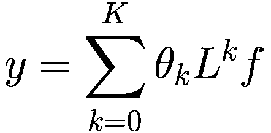

上述表达式允许我们将函数 *f* 上的卷积算子用拉普拉斯算子的多项式来表示，即 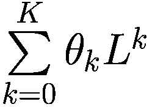。

拉普拉斯算子阶数为 *K* 的多项式只能从 *K* 跳跃邻域中提取信息，因此它充当一个 K-局部化滤波器。

尽管涉及特征值矩阵中的多项式的 K-局部化滤波表示 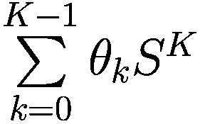 提供了定位和自由参数的减少，但它仍然很昂贵，因为它涉及到特征向量矩阵的乘法，其复杂度为 *O*(|*V*|²)。同样，涉及拉普拉斯矩阵中的多项式的卷积 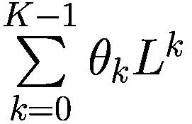 对于大型图来说也不会便宜，因为它涉及到计算拉普拉斯矩阵的幂。

#### ChebNet

在前面章节中刚刚讨论的 K-局部化光谱滤波器的稍不同版本 (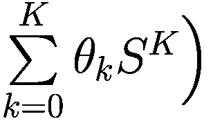 在 ChebNet 论文中由 Hammond 等人提出。他们使用切比雪夫多项式 *T**k* 到 *K* 阶的近似截断展开 *g**θ*，如下所示：

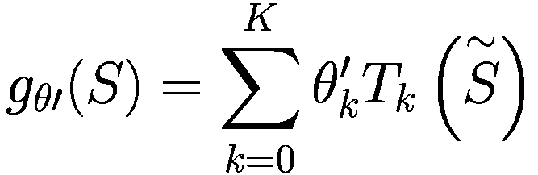

在前面的表达式 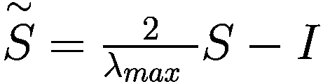 中，*λ*[*max*] 表示拉普拉斯算子 *L* 的最大特征值。切比雪夫多项式遵循以下递归关系：*T**k* = 2*xT**k* − 1 − *T**k* − 2，其中 *T*0 = 1 和 *T*1 = *x*。

基于切比雪夫滤波器且具有函数 *f* 的卷积的输出 *y* 可以用修改后的拉普拉斯算子 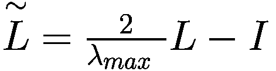 表示如下：

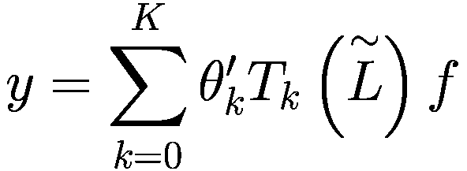

前面卷积的输出是拉普拉斯算子的 K 阶多项式 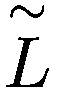 的函数，因此 ChebNet 滤波器充当 K-局部化滤波器。在 *K*-局部化滤波器中，每个节点最多可以从其 *K* 跳邻居处获取信息。因此，基于 ChebNet 的卷积的复杂度与边的数量呈线性关系。此外，我们不需要对拉普拉斯矩阵进行特征分解。

#### 图卷积网络 (GCN)

GCN 使用 ChebNet 滤波器，但将切比雪夫多项式的阶数限制为 1。因此，基于 GCN 的滤波器在函数 *f* 上的卷积输出 *y* 如下：

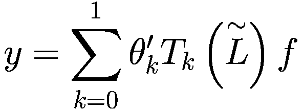

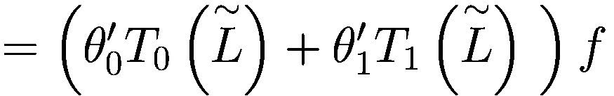

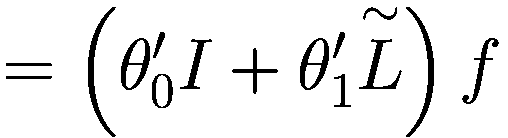

将  代入前面的方程中，

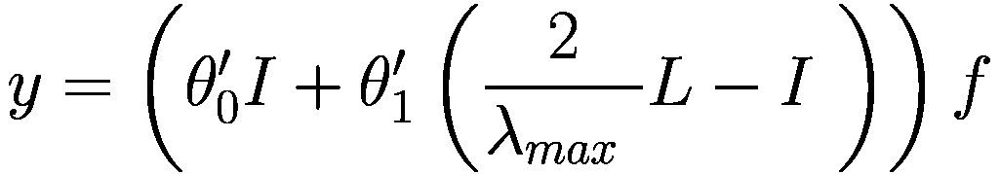

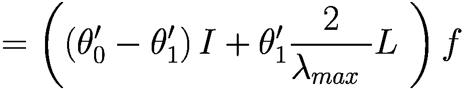

GCN 通过假设 *λ*[*max*] = 2 来简化前面的表达式，因为作者期望神经网络参数将适应这种变化。因此，我们有以下：

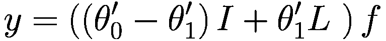

将归一化拉普拉斯表达式 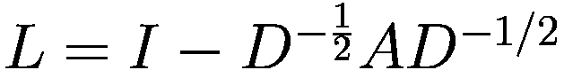 代入前面的方程中，我们得到以下：

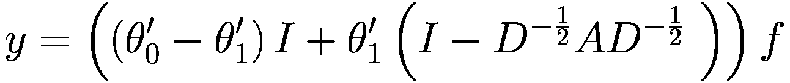

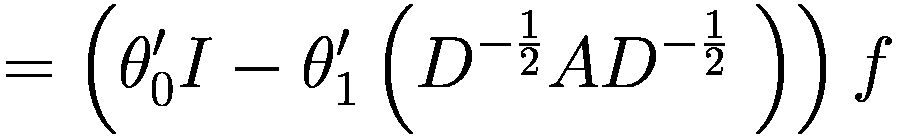

为了进一步减少参数，GCN 将 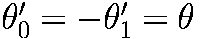 设置。这简化了卷积输出的以下形式：

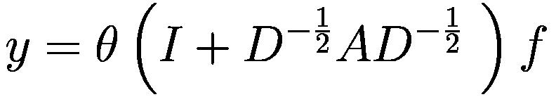

因此，每个 GCN 滤波器只有一个可学习的参数。GCN 滤波操作在 L 上是线性的，并且它只从每个节点的第一个跳邻居收集信息。为了学习包含多个跳信息的信息丰富的表示，GCN 可以有多层。与 ChebNet 相比，GCN 的优势在于它没有对 k-局部化进行显式参数化，因此不太可能过拟合。对于固定的计算预算，由于与其他网络相比其滤波器相对简单，GCN 可以有更深的层。

### 使用 GCN 实现图分类

在本节中，我们使用 GCN 进行图分类。这些图来自包含 188 个图的 MUTAG 数据集。每个图代表一个硝基芳香族化合物，其中节点代表原子。原子的输入特征是“原子类型”，它是一个长度为 7 的单热编码向量。每个图可以属于两个类别之一。目标是预测每个化学化合物在*沙门氏菌鼠伤寒亚种*上的致突变性，作为一个二元分类问题。

就模型而言，我们使用 StellarGraph **GCNSupervisedGraphClassification**模块，该模块可以接受指定数量和尺寸的 GCN 层，随后对图的节点进行平均池化。接着是两个密集层，最后是最终的二元分类预测层。我们在所有隐藏层中使用 ReLU 激活函数。模型架构概述在图 6-31 中。

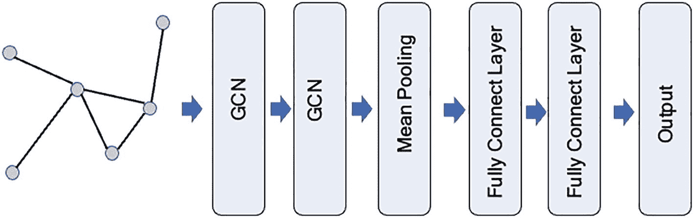

一个六节点网络分为六个步骤：G C N，G C N，平均池化，全连接层，全连接层，输出。

图 6-31

GCN 架构用于图分类

使用 GCN 实现图分类的代码实现详细说明在列表 6-9 中。

```py
import matplotlib.pyplot as plt
from sklearn.manifold import TSNE
import io, os, sys, types
import pandas as pd
import numpy as np
from stellargraph.mapper import PaddedGraphGenerator
from stellargraph.layer import GCNSupervisedGraphClassification
from stellargraph import StellarGraph
from stellargraph.layer import DeepGraphCNN
from stellargraph import datasets
from sklearn.model_selection import train_test_split
from IPython.display import display, HTML
from tensorflow.keras import Model
from tensorflow.keras.optimizers import Adam
from tensorflow.keras.layers import Dense, Conv1D, MaxPool1D, Dropout, Flatten
from tensorflow.keras.losses import binary_crossentropy
from tensorflow.keras.callbacks import EarlyStopping
import tensorflow as tf
import matplotlib.pyplot as plt
#Import the data
def load_data(verbose=True):
dataset = datasets.MUTAG()
display(HTML(dataset.description))
graphs, graph_labels = dataset.load()
print(f"Number of graphs: :{len(graphs)}")
print(f"The class distribution of the graphs:\n {graph_labels.value_counts().to_frame()}\n")
if verbose:
print(f"Graph 0 info",graphs[0].info())
print("Graph 0 node features",graphs[0].node_features())
return graphs, graph_labels
def GCN_model(generator,lr=0.005):
gc_model = GCNSupervisedGraphClassification(
layer_sizes=[64, 64],
activations=["relu", "relu"],
generator=generator,
dropout=0.5,
)
x_inp, x_out = gc_model.in_out_tensors()
predictions = Dense(units=32, activation="relu")(x_out)
predictions = Dense(units=16, activation="relu")(predictions)
predictions = Dense(units=1, activation="sigmoid")(predictions)
# Let's create the Keras model and prepare it for training
model = Model(inputs=x_inp, outputs=predictions)
model.compile(optimizer=Adam(lr), loss=binary_crossentropy, metrics=["acc"])
return model
def train(epochs=10,lr=0.005,batch_size=8):
# Load the graphs
graphs, graph_labels = load_data(verbose=False)
# Convert the graph labels to 0 and 1 instead of -1 and 1
graph_labels = pd.get_dummies(graph_labels, drop_first=True)
# Create train val split
num_graphs = len(graphs)
train_indices, val_indices = train_test_split(np.arange(num_graphs), test_size=.2, random_state=42)
# Create the data generator for keras training using Stellar's PaddPaddedGraphGenerator
generator = PaddedGraphGenerator(graphs=graphs)
# Train Generator from the PaddedGraphGenerator Object
train_gen = generator.flow(
train_indices, targets=graph_labels.iloc[train_indices].values, batch_size=batch_size
)
# Test Generator from the PaddedGraphGenerator Object
val_gen = generator.flow(
val_indices, targets=graph_labels.iloc[val_indices].values, batch_size=batch_size
)
# Early Stopping hook
earlystopping = EarlyStopping(
monitor="val_loss", min_delta=0, patience=25, restore_best_weights=True
)
# Define the Model
model = GCN_model(generator,lr=lr)
history = model.fit(
train_gen, epochs=epochs, validation_data=val_gen, verbose=0, callbacks=[earlystopping])
# Check validation metrics at the end of training
val_metrics = model.evaluate(test_gen, verbose=2)
val_accuracy = val_metrics[model.metrics_names.index("acc")]
print(f"Training Completed, validation accuracy {val_accuracy}")
return model
model = train()
--output—
Number of graphs: :188
The class distribution of the graphs:
label
1     125
-1     63
2/2 - 0s - loss: 0.5645 - acc: 0.7297 - 28ms/epoch - 14ms/step
Training Completed, validation accuracy 0.7297297120094299
Listing 6-9
Graph Classification Using GCN
```

该模型在用 GCN 对图进行分类时达到了合理的准确率 72.9%。需要注意的是，只有 188 个图用于训练和验证，因此一个训练验证分割可能无法衡量模型的鲁棒性。建议读者对数据集进行 k 折交叉验证，并检查模型的鲁棒性。

#### GraphSage

GraphSage 是一种在图上进行归纳表示学习的方法。大多数图表示方法都集中在为固定图生成嵌入。然而，许多实际应用需要为未见过的新的节点以及完全新的子图生成嵌入，而无需重新训练模型。在这种情况下，归纳表示学习非常有用，其中在某个节点上学习到的模型可以推广到完全未见的节点。GraphSage 与其他嵌入方法的不同之处在于以下方面：

1.  与为每个节点训练不同的嵌入向量不同，GraphSage 训练一组聚合函数，这些函数学习在节点的局部邻域中聚合特征表示。

1.  对于每个跳数，都有一个单独的聚合函数。

由于 GraphSage 学习聚合函数，新节点的特征表示可以通过使用学习到的聚合函数来计算。

在因子分解方法或 Node2Vec 等直接为每个节点学习嵌入的方法中，嵌入最终具有归纳性质。

GraphSage 不仅可以训练在无监督设置中生成嵌入，还可以在监督下学习不同的任务。因此，从 GraphSage 层生成的嵌入被用作网络特定任务头的特征。

以下概述了 GraphSage 在预测图 *G* = (*V*, *E*) 时如何使用聚合函数生成嵌入。我们假设有 *K* 个 GraphSage 层，对应于 *K* 个聚合函数和 *K* 个权重矩阵 *W*^(*k*)。我们每个层使用的激活函数表示为 *σ*(.), 我们用 *x*[*v*] 表示节点 *v* 的特征。

1.  初始化 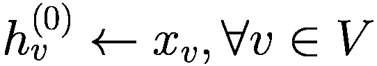

1.  for *k* = 1\. . *K* do

1.  for *v* ∈ *V* do

1.  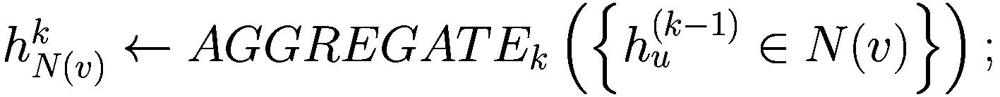

1.  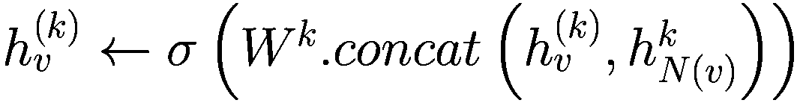

1.  end

1.  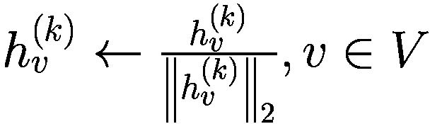

1.  end

1.  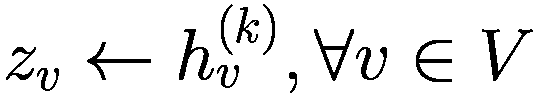

在前面的算法中，正如我们在每次迭代或搜索深度中所看到的，我们从局部邻居对每个节点进行信息聚合，随着迭代的进行，每个节点从图的不同深度获取越来越多的信息。GraphSage 中通常使用的聚合函数是平均聚合函数和 LSTM 聚合函数。在 GraphSage 的每次迭代或每一层中，每个节点 *v* 的邻居 *N*(*v*) 的大小被合理地选择，以保持计算可追踪。

在监督设置中，GraphSage 根据任务目标学习权重 *W*^(*k*)。在无监督设置中，GraphSage 被训练产生邻近节点的相似嵌入和高度不同节点的不同嵌入。

因此，对于节点 *u*，可以最小化的损失如下：

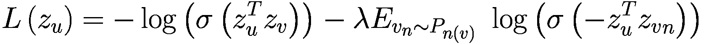

在前面的表达式中，*v* 是在数据生成中的随机游走中与 *u* 共现的任何节点，因此模型将强制其表示相似。损失的第二部分是为了通过负采样增加节点 *v* 与其他与节点 *v* 不相似的节点之间的差异。

#### 使用 GraphSage 实现节点分类

在本节中，我们使用 GraphSage 在 Cora 数据集上实现节点分类。Cora 数据集图中的节点是出版物，而边是彼此工作的引用。出版物的节点特征是基于出版物中的 1433 个关键词的词袋表示。如果关键词在出版物中多次出现，则标记为 1。这些出版物中的每一个都属于我们想要预测的七个主题类别。以下是对详细实现的说明（参见代码清单 6-10）。我们使用 StellarGraph Node2Vec 层定义了两层 GraphSage，然后使用 tf.keras 构建了端到端模型。

在模型训练后，我们绘制了最终 GraphSage 层输出的嵌入，看看它们是否根据出版物的主题类型进行聚类。

```py
import networkx as nx
import pandas as pd
import os
import stellargraph as sg
from stellargraph.mapper import GraphSAGENodeGenerator
from stellargraph.layer import GraphSAGE
from tensorflow.keras import layers, optimizers, losses, metrics, Model
from sklearn import preprocessing, feature_extraction, model_selection
from stellargraph import datasets
from IPython.display import display, HTML
import matplotlib.pyplot as plt
%matplotlib inline
from collections import Counter
from sklearn.decomposition import PCA
from sklearn.manifold import TSNE
import pandas as pd
import numpy as np
def load_cora_dataset():
dataset = sg.datasets.Cora()
display(HTML(dataset.description))
GS, node_subjects = dataset.load(largest_connected_component_only=True)
# GS contains the Stellar Graph
# node_subjects contains the node_features indexed by the node ids
print(f"The set of classes for nodes:{set(node_subjects)}\n")
return GS, node_subjects
def train(batch_size = 32,num_samples = [10, 5],lr=0.005,epochs=20,dropout=0.5):
# Load Cora Datasets
GS, node_subjects = load_cora_dataset()
# Node features dimension to be used for training
print(f"Training node input features: {GS.node_features().shape}\n")
train_subjects, val_subjects = model_selection.train_test_split(
node_subjects, train_size=0.1, test_size=None, stratify=node_subjects
)
print(f"Class representation in training data: {dict(Counter(node_subjects))}\n")
# Create one hot encoding for node classes
label_encoder = preprocessing.LabelBinarizer()
train_y = label_encoder.fit_transform(train_subjects)
val_y = label_encoder.transform(val_subjects)
# Define GraphSAGENodeGenerator object for tf.keras training
generator = GraphSAGENodeGenerator(GS, batch_size, num_samples)
# Create train and val generator using GraphSAGENodeGenerator object
train_gen = generator.flow(train_subjects.index, train_y, shuffle=True)
# Create train and val generator using GraphSAGENodeGenerator object
val_gen = test_gen = generator.flow(val_subjects.index, val_y)
# Define two layer GraphSage Model with 32 units in each layer
GS_model = GraphSAGE(
layer_sizes=[32, 32], generator=generator, bias=True, dropout=0.5,
)
x_inp, x_out = GS_model.in_out_tensors()
prediction = layers.Dense(units=train_y.shape[1], activation="softmax")(x_out)
# The keras model has the GraphSage layers from Stellar followed by the Dense prediction layer of tf.keras.layers
model = Model(inputs=x_inp, outputs=prediction)
print(f"Model Summary...\n")
print(model.summary())
# Compile the Model
model.compile(
optimizer=optimizers.Adam(lr=lr),
loss=losses.categorical_crossentropy,
metrics=["acc"],
)
# Train the model
history = model.fit(
train_gen, epochs=epochs, validation_data=test_gen, verbose=2, shuffle=False
)
# Plot the training loss/metric profile
sg.utils.plot_history(history)
val_metrics = model.evaluate(val_gen)
print("Val Metrics:\n")
for name, val in zip(model.metrics_names, val_metrics):
print("\t{}: {:0.4f}".format(name, val))
# Create embeddings as the output of the Final Graph Sage layer
# and see if the embeddings of nodes in similar classes are same
all_nodes = node_subjects.index
all_gen = generator.flow(all_nodes)
emb_model = Model(inputs=x_inp, outputs=x_out)
emb = emb_model.predict(all_gen)
print(f"Embeddings shape: {emb.shape}\n")
plot_embeddings(node_embeddings=emb,node_subjects=node_subjects)
return model
def plot_embeddings(node_embeddings,node_subjects,n_components=2):
transform = TSNE
trans = transform(n_components=2)
node_embeddings_2d = trans.fit_transform(node_embeddings)
# draw the embedding points, coloring them by the target label (paper subject)
alpha = 0.7
label_map = {l: i for i, l in enumerate(np.unique(node_subjects))}
node_colours = [label_map[target] for target in node_subjects]
plt.figure(figsize=(7, 7))
plt.axes().set(aspect="equal")
plt.scatter(
node_embeddings_2d[:, 0],
node_embeddings_2d[:, 1],
c=node_colours,
cmap="jet",
alpha=alpha,
)
plt.title("{} visualization of node embeddings".format(transform.__name__))
plt.show()
model = train()
--output—
Epoch 19/20
8/8 - 1s - loss: 0.2059 - acc: 0.9919 - val_loss: 0.6328 - val_acc: 0.8216 - 1s/epoch - 133ms/step
Epoch 20/20
8/8 - 1s - loss: 0.1877 - acc: 0.9960 - val_loss: 0.6290 - val_acc: 0.8221 - 959ms/epoch - 120ms/step
70/70 [==============================] - 1s 14ms/step - loss: 0.6402 - acc: 0.8185
Val Metrics:
loss: 0.6402
acc: 0.8185
78/78 [==============================] - 1s 16ms/step
Embeddings shape: (2485, 32)
Model accuracy on the validation dataset is around ~82% which is reasonable.
Listing 6-10
Node Classification Using GraphSage
```

此外，最终 GraphSage 层输出的节点嵌入根据出版物的主题形成了非常明显的聚类（参见图 6-32）。

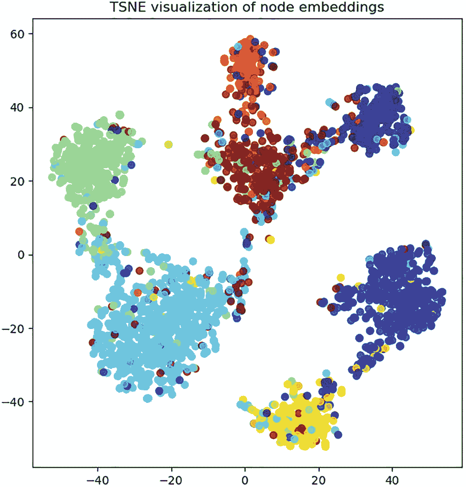

T S N E 可视化中节点嵌入的散点图，不同颜色代表不同的类别。

图 6-32

基于 GraphSage 的监督任务嵌入

#### 图注意力网络

在我们迄今为止研究的所有 Graph Conv 方法中，除了 GraphSage 之外，学习的滤波器依赖于拉普拉斯特征函数，而这些函数又依赖于图结构。因此，在特定图上训练的模型不会在具有不同结构的新的图上工作。另一方面，非谱方法通过在空间上接近的邻居组上操作，直接在图上应用卷积。将卷积直接应用于图的一个挑战是找到适用于所有不同大小邻域的算子，并保持卷积的权重共享属性。

注意力机制真正地革新了自然语言处理领域，并已成为机器翻译、文本摘要等基于序列任务的行业标准。注意力的优势在于它提供了两个实体之间的直接相关性。同时，它可以高度并行化以实现更快的处理。在 GPU 时代，LSTM 等序列模型在这方面效率低下，因为它们不能并行化。这是在并行性盛行的 GPU 时代的一个大缺点。

通常，有两种类型的注意力——自注意力和交叉注意力。自注意力通常用于关注同一序列的部分以进行表示学习。在交叉注意力中，一个序列的部分关注另一个序列中的单词或其他实体。

图注意力网络计划的一部分是通过使用自注意力机制关注每个节点的邻居来学习每个节点的隐藏表示。同样，这也是通过我们接下来要讨论的图注意力层来实现的。

我们将图注意力层的输入视为节点特征表示 *h* = [*h*[0], *h*[1], …*h*[|*V*| − 1]]，其中 *h*[i] ∈ *R*^(*F*)，∣*V*∣ 表示图 *G* = (*V*, *E*) 中的节点数。该层预期产生一组新的节点特征 ![$$ {h}^{\prime }=\left[h{'}_0,{h}_1^{\prime },..{h}_{\left|V\right|-1}^{\prime}\right],{h}_i^{\prime}\in {R}^{F^{\prime }} $$](img/448418_2_En_6_Chapter/448418_2_En_6_Chapter_TeX_IEq66.png) 作为其输出。

为了能够在给定层中将特征维度从 *F* 转换为 *F*’，我们定义一组权重 *W* ∈ *R*^(*F* ′ × *F*)，该权重应用于每个节点。然后我们执行自注意力，其中注意力机制 *a* 计算节点 *i* 和 *j* 之间的注意力系数如下：


通常情况下，我们可以让每个节点关注其他所有节点，而不考虑图中节点之间的关系。然而，在给定节点 *i* 的图注意力层中，我们只计算所有节点 *j* ∈ *N*(*i*) 的注意力权重，其中 *N*(*i*) 是通过某种方案选择的节点 *i* 的邻居。通常，*N*(*i*) 主要被选为 *i* 的单跳邻居以及 *i* 本身。为了在期望的意义上线性组合节点 *j* ∈ *N*(*i*) 的节点嵌入，我们计算概率归一化的注意力权重 *α*[*ij*] 如下：

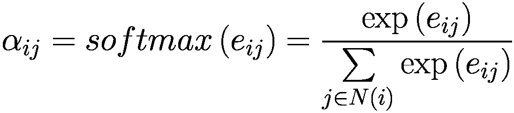

使用归一化权重 *α*[*ij*]，节点 *i* 的输出表示可以计算如下：

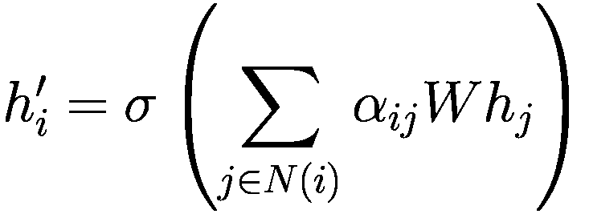

前一个表达式中的 *σ* 是一个合适的非线性激活函数。

让我们重新审视一下给出了初始注意力系数 *e*[*ij*] 的注意力函数 *a*：

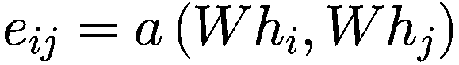

由于 *e*[*ij*] 是一个标量，因此注意力函数可以是形式为 *a* : *F*^′ × *F*¹ → *R* 的任何函数：

我们可以定义的最简单的注意力函数 *a* 是点积，因此我们可以使用以下方法：

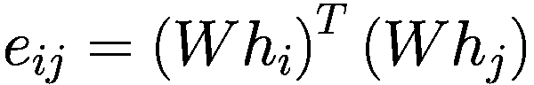

我们可以看到点积作为注意力函数不占用任何额外的参数，这些参数是我们必须学习的。如果我们想给注意力函数赋予一些表达能力，我们可以定义一个参数化的注意力函数。这样一个参数化的注意力函数可以是学习参数向量 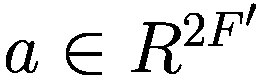与特征表示 *Wh*[*i*] 和 *Wh*[*j*] 的拼接版本之间的点积。此外，还可以对点积的输出应用非线性函数。图注意力网络的作者选择了 LeakyReLU（alpha=0.2）作为非线性函数。在这种情况下，注意力函数 *a* 可以写成以下形式：

*a*(*Wh*[*i*],*Wh*[*j*]| *a*) = LeakyRELU[*a*^(*T*)(*Wh*[*i*] ∣ |*Wh*[*j*])]

图注意力网络公式的优势有以下几点：

1.  如前所述，早期的注意力机制可以高度并行化，因此 GAT 在计算上效率很高。

1.  没有必要对拉普拉斯算子进行昂贵的特征值分解。

1.  GAT 允许对同一邻域中的节点隐式地分配不同的重要性。GCN 并不如此。此外，学习到的注意力权重可能有助于可解释性。

## 摘要

由此，我们结束了这一章和整本书的结尾。本章中阐述的概念和模型，尽管更为高级，但使用了前面章节中学到的技术。阅读完本章后，读者应该对在书中讨论的各种模型进行实施感到自信，并尝试在这个不断发展的深度学习社区中实施其他不同的模型和技术。在这个领域学习和提出新创新的最佳方式之一是密切关注其他深度学习专家及其工作。而像 Geoffrey Hinton、[Yann LeCun](https://www.google.co.in/search%253Fsafe%253Dactive%2526q%253DYann%252Blecun%2526spell%253D1%2526sa%253DX%2526ved%253D0ahUKEwi4_pSwyJDWAhWBAJoKHXknBnMQvwUIJCgA)、Yoshua Bengio 和 Ian Goodfellow 等人的工作值得追随。此外，我认为一个人应该更接近深度学习的数学和科学，而不仅仅是将其作为一个黑盒来从中获得适当的收益。带着这些，我结束了我的笔记。谢谢。
