# 1. 人工智能与 AI 生态系统简介

在我们所处的第四次工业革命时代，AI 与物联网、基因工程等一起，是创新的核心焦点。但它也伴随着大量的炒作，尤其是在就业岗位流失和创造方面，因为全球许多企业和组织正在数字时代超高速地转变其运营模式。大部分新增就业岗位都围绕着蓬勃发展的数据科学家职业，这一角色大约从 2012 年才开始成为主流。但该角色本身及其所需的技能范围，在这段相对较短的时间内，并未总是随着公司关键资产（人员、流程和工具）不断增长的需求而演变。特别是，大量资金和时间被浪费在规划不善的数据科学项目上，这些项目除了开发出一个 `R` 或 `Python` 脚本外，一无所获，这些脚本通常编码高度复杂，但组织中很少有人了解。实际上，虽然这些解决方案可能很稳健，并且与一组数据科学家相关，但它们在一个拥有众多不同人员、流程和工具相互交互并争夺内部预算的大型组织/企业级结构中，并不“适用”。

本章通过我们认为与当今成功交付 AI 项目最相关的主题视角，介绍了我们对当前能力与需求不匹配的看法。

本章的目标，是从一个快速的、走马观花式的历史回顾开始，在相当高的层面上定义关键的 AI 概念，并向读者介绍 AI 当前和新兴的趋势，包括其中的炒作和陷阱。最终，本章将引出许多企业和组织如何在当今的工作场所中难以将机器学习和深度学习投入运营这一话题。本章讨论的主题将在后续章节中进行更详细的阐述。

在本章中，我们将首先浅尝辄止，然后再进入后续章节更深入的动手实践和应用。目的是为读者提供本章中的工具，以便继续前进，围绕 AI 生态系统、AI 的主要应用、数据摄取和数据管道、以及基于神经网络的机器学习和深度学习提供简洁的背景和定义，最后以 AI 的生产化部署作为收尾。

## AI 生态系统

我们的第一部分为当今的 AI 设定了背景——首先审视炒作周期，然后回顾 AI 如何演变到这一阶段。我们还介绍了一些定义、作为可扩展 AI 使能者的云计算、“全栈”AI 的生态系统，并讨论了日益增长的伦理问题。

### 炒作周期

尽管围绕 AI 存在大量炒作，但人们普遍认为它现在正在兑现其潜力。对企业和组织的好处是实实在在的，这些好处因新冠数字化而加速，并因疫情期间聊天机器人支持的激增、深度学习支持的医疗诊断、用于社交距离措施的计算机视觉使用，以及重新开放经济影响的机器学习建模而得到证实。

在工作场所，虽然 AI 作为一种服务正在成熟，但其应用在很大程度上只涉及少数 IT 专家。AI 的民主化是 2022 年的一个重点，正在从专家/小众知识转向在更广泛的关键利益相关者（所有员工、客户和业务合作伙伴）生态系统中获得认同。AI 的工业化也是当今的一个主要趋势，雇主们推动更“智能”地实施 AI 项目；在设计思维阶段就关注 AI 的可重用性、可扩展性和安全性，而不是事后才考虑。

我们开始这第一部分，先看看人工智能是如何演变和成熟到当前这种现状的，这种现状最好地概括为从“独立 AI”扩展到“企业级 AI”的需求。

### 历史背景

根据视角的不同，人工智能的根源可追溯至 20 世纪 50 年代的计算机时代，或古代哲学中的“自动机”。

现代人工智能可能起源于古典哲学中，将人类思维视为机械过程的论述。因此，在开始之前，有必要先了解一些当今人工智能的背景信息。^(⁸) 表 1-1 概述了人工智能的演变历程。

**表 1-1** 人工智能的演变

| 日期 | 事件 |
| --- | --- |
| **公元前 5 世纪** | 机械机器人的最早记录：中国道家哲学家老子记载了一个真人大小、人形的机械自动机 |
| **约公元前 428–347 年** | 希腊科学家创造了“自动机”——特别是阿尔库塔斯创造了一只机械鸟 |
| **9 世纪** | 首个有记载的可编程复杂机械装置 |
| **1833 年** | 查尔斯·巴贝奇构思了分析机——一种可编程的计算装置 |
| **1872 年** | 塞缪尔·巴特勒的小说《埃瑞璜》包含了机器拥有人类智能的概念 |
| **20 世纪上半叶** | 科幻作品中对人工智能的认知（《绿野仙踪》中的铁皮人，《大都会》中的机器人玛丽亚） |
| **1950 年** | 艾伦·图灵发表《计算机器与智能》，提出“机器能思考吗？”——或“机器能成功模仿思考吗？” |
| **1956 年** | 麻省理工学院认知科学家马文·明斯基创造了“人工智能”一词 |
| **1974–1993 年** | 漫长的人工智能“寒冬”——缺乏切实的商业成功以及神经网络性能不佳，导致政府资金减少 |
| **1997 年** | IBM 的深蓝在国际象棋中击败加里·卡斯帕罗夫 |
| **2011 年** | IBM 沃森赢得智力竞赛节目《危险边缘！》 |
| **2012 年** | ImageNet 竞赛——AlexNet 深度神经网络大幅降低了视觉物体识别的错误率 |

### 人工智能——一些定义

无论我们将哲学上的自动机还是思考机器视为真正的“人工智能”，这仍有待商榷。但我们可以利用后见之明，借助特定的术语来理解和阐述人工智能。

| 术语 | 描述 | 示例 |
| --- | --- | --- |
| **简单机器** | 做功（将能量从一个物体传递到另一个物体）的装置 | 轮子、杠杆、滑轮、斜面、楔子和螺丝 |
| **复杂机器** | 简单机器的组合 | 独轮车、自行车、机械机器人（老子、机械鸟） |
| **可编程机器** | 接收输入、存储和操作数据，并以有用格式提供输出的装置 | 穿孔卡片、编码音乐卷轴 |
| **计算机器** | 用于自动执行基本算术运算的机械装置 | 算盘、计算尺、差分机、计算器 |
| **数字机器** | 生成和处理二进制数据的系统 | 计算机 |

从时间线来看，图 1-1 展示了这一演变过程。

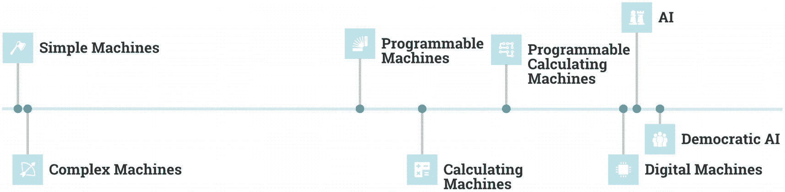

一张时间线图，从简单机器、复杂机器、可编程机器、计算机器、可编程计算机器、数字机器、人工智能，再到民主化人工智能。

**图 1-1** 人工智能演变时间线

### 当今的人工智能

虽然“什么是人工智能”这个问题可能不那么明确（我们将在下一节讨论），但如果没有数字机器或计算机，我们肯定无法谈论人工智能。而且，我们很快就会看到，正是云计算及其带来的高性能计算的发展，最终促成了人工智能或民主化人工智能的实现。

当我们审视当今人工智能的机制，特别是其应用案例时，机器学习和深度学习是真正人工智能的基础技术，而不是那些部分基于无知、部分基于科幻的关于“机器崛起”的错误观念。在职场中，人工智能代表的是增强智能，没有人真正希望看到通用人工智能的出现，就像（希望）没有人想要第三次世界大战一样。

### 机器学习

如图 1-2 所示，机器学习可以被视为人工智能的一个子集，它赋予计算机无需显式编程即可学习的能力。在操作上，机器学习很像人类从经验中学习的方式：例如，如果我们触摸到热的东西被烫伤，这种负面经历就会存储在记忆中，我们很快学会不再去碰它。

我们向计算机输入代表过去经验的数据，然后利用不同的统计方法，从数据中“学习”，并将这些知识应用于未来的事件——这就是我们的模型“预测”。

### 深度学习

深度学习通常被认为是机器学习的一个子集，其显著特点是使用深度神经网络层来解决预测问题。

由于依赖大数据和建模，所有人工智能、机器学习和深度学习都是数据科学的核心技术。数据科学结合了建模、统计学、编程以及一些领域专业知识，从数据中提取洞察和价值。

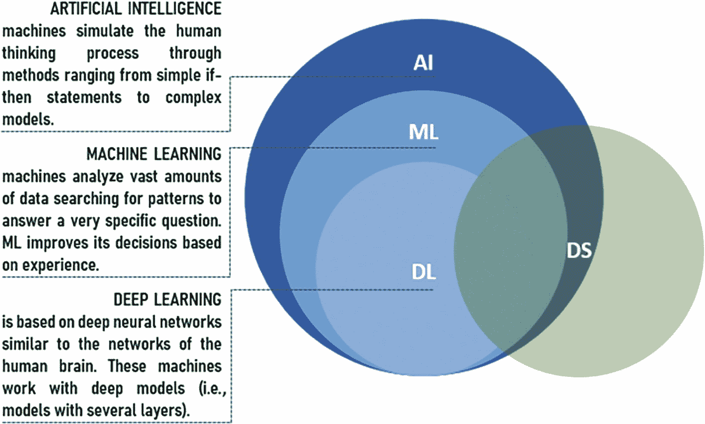

一张图解释了人工智能的子集是机器学习，而深度学习属于机器学习和人工智能，被认为是人工智能的子集，并且是数据科学的核心技术。

**图 1-2** 深度学习作为人工智能的子集（来源：Abris AI in Banking ^(⁹)）

### 什么是人工智能

本书所关注的人工智能，常常与科幻作品中的那种混淆。我们如何区分两者？

**狭义人工智能**是当前企业和组织中使用的 AI 形式，即机器被设计用于执行单一任务。机器会变得非常擅长执行该特定任务（例如谷歌翻译），但一旦机器训练完成，它无法泛化到未见过的领域。

**通用人工智能**是一种能够完成任何人类智力任务的人工智能形式，具有潜在的“有意识”决策能力。尽管它可能构成生存威胁，但由于硬件扩展、能源消耗以及灾难性记忆丧失（这也影响着当今一些先进的深度学习算法）等挑战，它目前仍然只是一个愿景。

**超级人工智能**是最接近科幻电影中使用的那种人工智能形式。理论上，超级人工智能的能力超越人类。

### 云计算

因此，我们至少目前关注的是狭义人工智能，而如果按照埃隆·马斯克的说法，等到通用人工智能或超级人工智能出现时，我们都应该希望自己已经不在了。

如上所述，实现这种人工智能的推动力是云，而成功的狭义人工智能实施需要一个端到端的云基础设施。无论怎样强调云计算在 2022 年对任何企业的基础性要求都不为过。其增长呈爆炸性，2020 年云支出增长了 33%，这得益于支持远程工作和学习、电子商务、内容流媒体、在线游戏和协作的强劲需求。

`存储`和`计算能力`是用于处理人工智能核心大数据的主要云组件。虽然企业级机器学习项目可以在两者上以较低的开销运行，但深度学习项目则不能。`Amazon Web Services`、`Azure`和`Google Cloud Platform`是主要的（“三大”）云服务提供商，此外还有`IBM Cloud`和`Heroku`。^(¹⁰) 我们将在本书中涵盖所有这些平台的实践示例。所有云服务提供商都提供一系列人工智能服务和工具，极大地简化了构建应用程序的过程。

虽然云是人工智能的关键推动者，但云计算只有在公司的数据战略以丰富、海量的数据源和/或训练数据为基础时，才能真正为企业级或生产级人工智能发挥作用。

### 云服务提供商——它们提供什么？

每个云服务提供商都有相对于其他提供商的明显差异化优势。`AWS`覆盖范围最广，而`Azure`与基于 Windows 的系统自然衔接良好。`Google Cloud Platform`通常对应用程序构建有更好的支持，如图 1-3 所示。

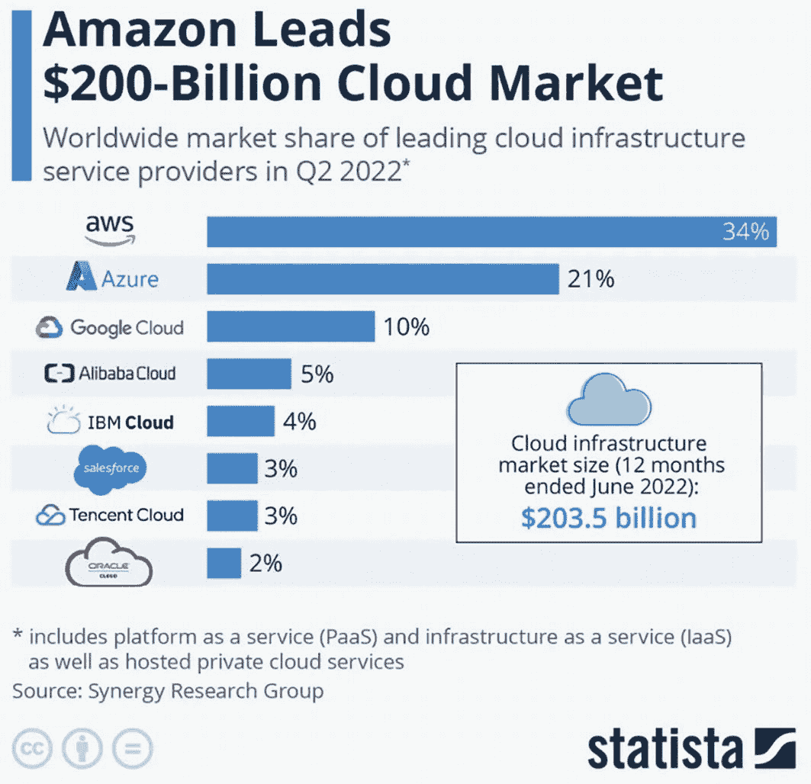

一张截图描述了亚马逊在 2000 亿美元云市场中的领先地位。截至 2022 年 6 月的 12 个月内，云基础设施市场规模为 2035 亿美元。

图 1-3

领先的云平台 2022 年第二季度（来源：Statista）

图 1-4 总结了每个主要云平台的一些额外独特卖点。

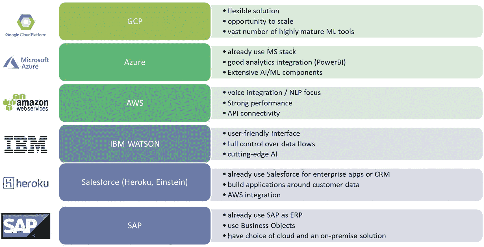

一张截图描述了 Google Cloud Platform、Azure、Amazon Web Service、IBM WATSON、Salesforce of Heroku、Einstein 和 SAP 的独特卖点。

图 1-4

云服务提供商的独特卖点

### 更广泛的人工智能生态系统

尽管三大云服务提供商占据主导地位，但一些公司开始迁移，或受咨询公司/系统集成商影响，远离大型科技公司的“锁定”，转向多供应商、利基人工智能解决方案的平台。这些开源、更便宜的平台实施速度也可能更快，与敏捷交付模式（更多内容见第 2 章）结合更紧密，并且在某种程度上不受遗留系统、规模或企业社会责任的束缚。

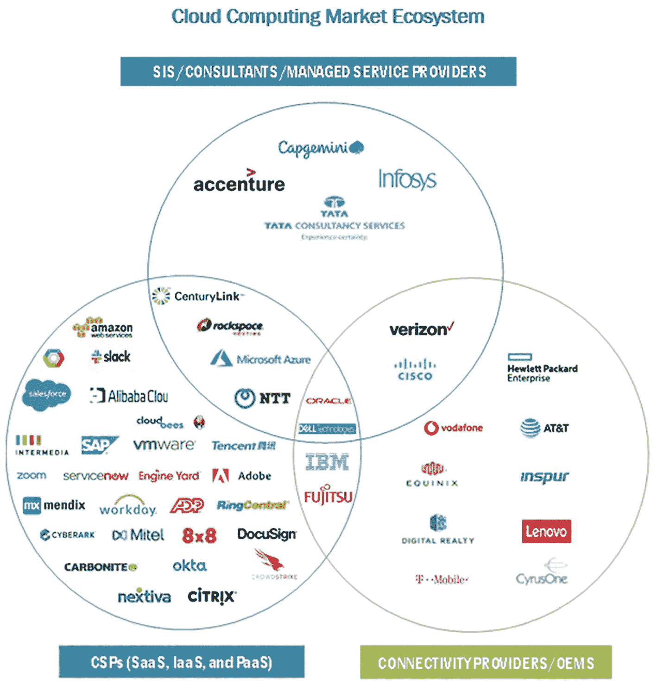

一张图表描述了云计算市场生态系统。它包括系统集成商、咨询公司和托管服务提供商，提供 SaaS、IaaS 和 PaaS 的云服务提供商，以及连接提供商和原始设备制造商。

图 1-5

支持更广泛的人工智能生态系统——云服务提供商、系统集成商和原始设备制造商

### 全栈人工智能

当然，这不仅仅是关于云。虽然云提供了平台，但还有大量专有和开源工具用于实现人工智能，从数据工程工具（如`Apache Kafka`或`AWS Kinesis`）到 NoSQL 数据库（如`mongoDB`和`AWS DynamoDB`），再到后端编程语言（如`Python`和`Scala`^(¹¹)），以及模型引擎（如`Apache Spark`）和前端商业智能层/仪表板（如`Dash`、`PowerBI`和`Google Data Studio`）。

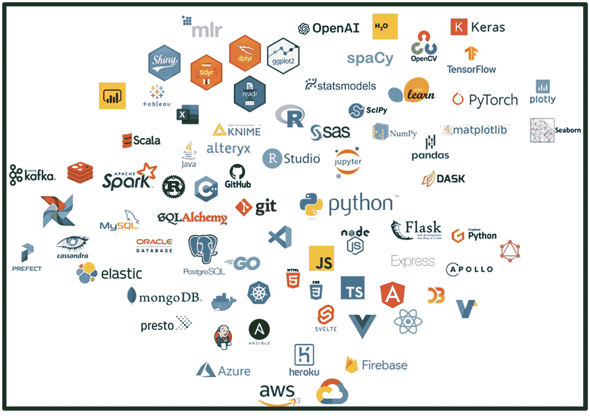

一张截图解释了全栈人工智能。

图 1-6

全栈人工智能

我们将在本书的实践示例中使用上述许多工具。

### 人工智能伦理与风险：问题与担忧

本章第一部分的最后一点，应该留给如今许多大型组织中迅速增长的担忧——即合乎伦理地使用数据和人工智能来驱动商业价值。

当今的许多问题源于商业人工智能开发早期过度炒作的那些年，当时为了从结果中产生投资回报率，数据偏差、模型风险、“黑箱”可审计性，甚至用户同意等问题在很大程度上被忽视了。

在媒体曝光了一些引人注目的案例之后，存在一种负面看法，即人工智能模型固有的偏差加上对自动化的过度依赖，可能会歧视穷人或为其设置贫困陷阱。实际上，主要有以下两种算法“网络”：

**信用报告算法**——这些算法影响对汽车、住房和就业等私人商品和服务的获取。令人担忧的是潜在的伦理违规行为，例如苹果卡事件，高盛（作为该卡运营商）因使用据称歧视女性的 AI 算法（给予男性更高的信用额度）而受到监管机构调查^(¹²)。

**政府/公共部门机构**——在这里，AI 算法影响对医疗保健、失业和儿童抚养服务等公共福利的获取。美国最近的另一个案例是，联合健康集团因创建一种算法，偏向白人患者而非病情更重的黑人患者，而受到监管机构调查。

### 人工智能生态系统：动手实践

人工智能伦理与治理结束了我们本介绍性章节的第一部分，但为了掌握人工智能项目的一些成果，值得看看更广泛人工智能生态系统中的一个重要工具。

使用 PowerBI 创建新冠疫情仪表板

所有优秀的人工智能解决方案都需要一个可视化/商业智能层，以确保解决方案通过一个引人注目的仪表板或仪表板界面交付。用于此目的的工具很多，包括`AWS QuickSight`、`Google Data Studio`、`Cognos`、`Tableau`和`Looker`^(¹³)。这里我们来看看`Microsoft PowerBI`——目前领先的商业智能工具之一。

1.  接受 cookies，注册并从以下链接下载`PowerBI`：

    `https://powerbi.microsoft.com`

2.  谷歌搜索“John Hopkins Covid data GitHub”，找到约翰霍普金斯大学最新的 GitHub 数据。作为参考，确诊病例、康复病例和死亡病例的实时 csv 文件位于以下链接：

    `https://github.com/CSSEGISandData/COVID-19/tree/master/csse_covid_19_data/csse_covid_19_time_series`

3.  打开`PowerBI`，进入`获取数据 > Web`。分别输入三个文件的 URL，选择“加载数据”将数据导入`PowerBI`数据模型

    注意：由于链接指向的是“实时”文件，下方可视化中显示的数据将每天自动更新

4.  练习：在`PowerBI`的“资源管理器”视图中，重新创建下方链接示例仪表板中显示的可视化效果：

    `https://app.powerbi.com/view?r=eyJrIjoiN2FkNzZlMWQtMmE2OC00NzRiLWI0ZGItNDMzNzZhYTIwYTViIiwidCI6IjhlYTkwMTE5LWUxYzQtNDgyNC05Njk2LTY0NzBjYmZiMjRlNiJ9`

5.  确保逐一创建可视化效果，方法是：

    1.  选择正确的可视化类型（例如，卡片、表格、条形图、面积图、树状图）

    2.  拖放正确的维度（要报告的实体，例如国家）和度量（要报告的值，例如确诊病例）

    3.  如有必要，进行筛选，例如筛选前 10 个病例

    4.  最后，在日期和国家上添加切片器，以便用户按日期（窗口）和国家快速深入查看新冠病例

6.  练习（进阶）——将完成的`PowerBI`报告发布到`PowerBI Service`^(¹⁴)，然后将您的仪表板托管在公共 URL 上

## 人工智能的应用

承接上一节的内容，并延续本章轻松入门的特点，我们将在下一节中探讨人工智能的主要应用：

- `机器学习`

- `深度学习`，包括计算机视觉以及投资组合、风险管理和预测

- `自然语言处理`，包括聊天机器人

- `认知机器人流程自动化`

### 机器学习

`机器学习`是一种使计算机能够从复杂数据中进行推断的技术，至今仍是人工智能研究中最大的领域。它主要有三种类型：监督学习、无监督学习和强化学习^(¹⁵)，我们将在后续章节中逐一探讨每种类型的发展与部署。现在，我们先提供一些基本定义，重点说明这些机器学习方法之间的本质区别：

- **监督学习** – 在已知期望“目标”输出的数据点上进行训练

- **无监督学习** – 没有可用的输出，但利用机器学习来识别数据中的模式

- **强化学习** – 通过最大化奖励/分数来训练机器学习模型

如今，机器学习的一个关键应用是欺诈检测，这通常既作为无监督机器学习问题，也作为有监督机器学习问题来运行。其目标是尝试预测交易（及客户）数据中表明欺诈正在发生的模式。

我们假设大多数读者对基本的`机器学习`技术已有一定了解，并建议读者参考其他书籍来加深理解，以防本书讨论的某些应用超出了预设的知识范围。

### 深度学习

从许多方面来看，`深度学习`是`机器学习`的一个子集；它本质上是将`机器学习`扩展到那些通常使用神经网络解决的、棘手的“大数据”问题。神经网络本身的灵感来源于人脑中的神经元连接——当它们组合在一起时，我们就会得到类似右图 (a) 所示的结构。这实际上是一个多层神经网络，它接收四个输入，在经过两个“隐藏”层（每层有四个节点或神经元）内进行的各种数据转换后，提供一个输出。

`深度学习`常用于图像分类或计算机视觉（例如预测图像中是否包含人、建筑物或车辆），其输入本质上是（训练）图像转换成的像素，进而成为机器可读的格式（`张量`），而隐藏层则充当函数映射，用于提取图像中普遍存在的“模式”。

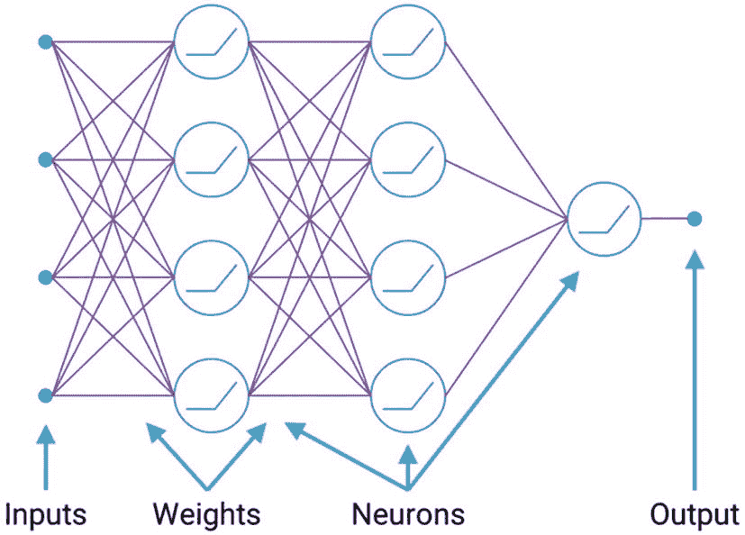

一张多层感知器示意图，描述了输入流向权重，与神经元相互作用并产生输出的过程。

**图 1-7** 多层感知器

##### 计算机视觉

如图 1-8 所示，计算机视觉用于物体分类、识别、验证、检测、分割和辨认，并以该图为例，能够回答诸如以下问题：

- 图像中是哪类物体？
- 图像中是否存在该物体？
- 图像中的物体属于什么类别？

计算机视觉的众多应用包括面部识别与监控、文档搜索与归档、医疗诊断以及作物病害预防。

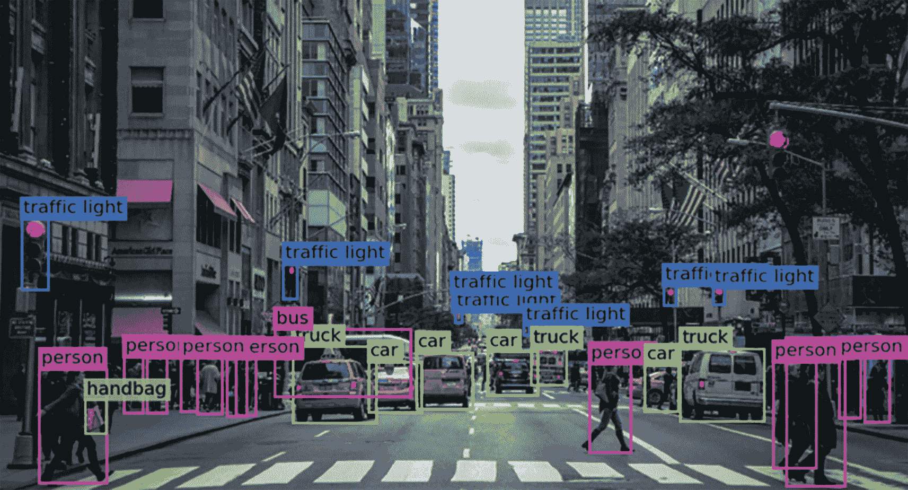

一张计算机视觉中物体分类的照片，展示了交通信号灯、行人、手提包、公交车、卡车和汽车。

**图 1-8** 计算机视觉中的物体分类（来源：Ilija Mihajlovic，[`towardsdatascience.com`](https://towardsdatascience.com)）

#### 投资组合、风险管理与预测

如今，人工智能，特别是`深度学习`，被广泛应用于风险管理和投资组合优化，以提高运营工作流程的效率和准确性。同样，金融资产优化、股价预测、投资组合和风险管理都是 2022 年令人兴奋的创新领域。

预测也是当前的一大热点——云存储和处理能力的进步，使得天气和需求预测、资产优化、算法交易以及智能投顾等领域都引入了人工智能方法。高精度、工业规模的循环神经网络（`RNN`）以及专门的长短期记忆模型（`LSTM`）正日益能够超越传统方法。我们将在关于`深度学习`的第 5 章中看到一些实际的动手示例。

### 自然语言处理

全球`自然语言处理`市场逐年增长，预计到 2025 年将达到 4300 万美元（Statista 数据）。

`自然语言处理`是人工智能的一个分支，它处理计算机与人类之间使用自然语言的交互。本质上，`NLP`将`机器学习`算法应用于非结构化数据，并将其转换为计算机能够理解的形式——其目标是读取、破译、理解并解读语言，使其具有（商业）价值。

`NLP`是谷歌翻译等语言翻译应用背后的驱动力。微软 Word 和 Grammarly 等文字处理软件也利用`NLP`来检查文本的语法准确性。`NLP`应用在工业领域的日益普及意味着，全球市场预计到 2025 年将达到 4300 万美元^(¹⁶)。

#### 聊天机器人

`NLP`最广为人知的应用可能就是聊天机器人以及 Siri、Alexa 和 Watson Assistant 等个人助理应用。

聊天机器人本质上是用于进行交互式对话的软件应用程序，其文本转语音和语音转文本能力也在不断增强。

自 Windows 上最早的 Cortana 时代以来，这项技术已经取得了巨大进步。如今，它已发展到这样的程度：智能虚拟代理（`IVA` 或聊天机器人 2.0）或交互式语音应答（`IVR`）应用被广泛用于呼叫中心，以响应用户请求。与早期基于规则的对话式聊天机器人相比，`IVA` 具有内置的自学习能力，并能适应上下文。

在 2002 年，其商业价值在于改善客户旅程和客户体验——能够快速解决问题，尽管在更复杂的情况下尚无法做到。

`自然语言处理`的主要技术是句法分析和语义分析。句法分析侧重于语法，而语义分析则关注文本的潜在含义。两者都涉及许多底层子过程（如词形还原和词义消歧），这些过程对于分类以及更重要的洞察提取至关重要。我们将在后面的章节中更详细地探讨这些内容。

简单来说，聊天机器人中的`自然语言处理`被用来检测用户“意图”和“实体”，然后将其与预先配置的对话“语料库”进行最佳匹配。随着用户交互的增加，越来越多的数据可用于训练过程，以改进匹配过程并增强对话效果。

#### 认知机器人流程自动化 (CRPA)

`认知机器人流程自动化` 是融合了人工智能的`机器人流程自动化`。传统的`RPA`通过配置计算机软件来执行业务流程，而认知型`RPA`工具和解决方案则在底层业务流程之上增加了预测能力并增强了异常处理功能，其利用了诸如`OCR`与自动扫描、`文本分析`、`语音转文本`以及`机器学习`等技术。

传统的`RPA`支持基于结构化数据的自动化，而`CRPA`则更常包含非结构化数据源。

如今，许多运营或投资组合管理流程都与`认知机器人流程自动化 (CRPA)`相结合，将人工智能与自动化结合起来解决诸如以下业务问题：

-   批量付款处理
-   交易风险监控
-   表单自动填写
-   文档归档

在风险管理领域，对`蒙特卡洛`和`VaR`方法进行复杂的人工智能增强，也日益普遍地用于基准测试和改进现有的风险实践。

### 其他人工智能应用

以上对人工智能在工作场所主要用途的介绍，旨在让您初步了解本书后续内容。具体而言，`机器`与`深度学习`、`自然语言处理`以及`CRPA`是当今私营和公共部门采用的特定行业用例的基础。

我们将在后续的实践操作中描述并逐步讲解其中的许多内容，但现在，我们在图 1-9 中按行业领域对用例进行了大致的划分。

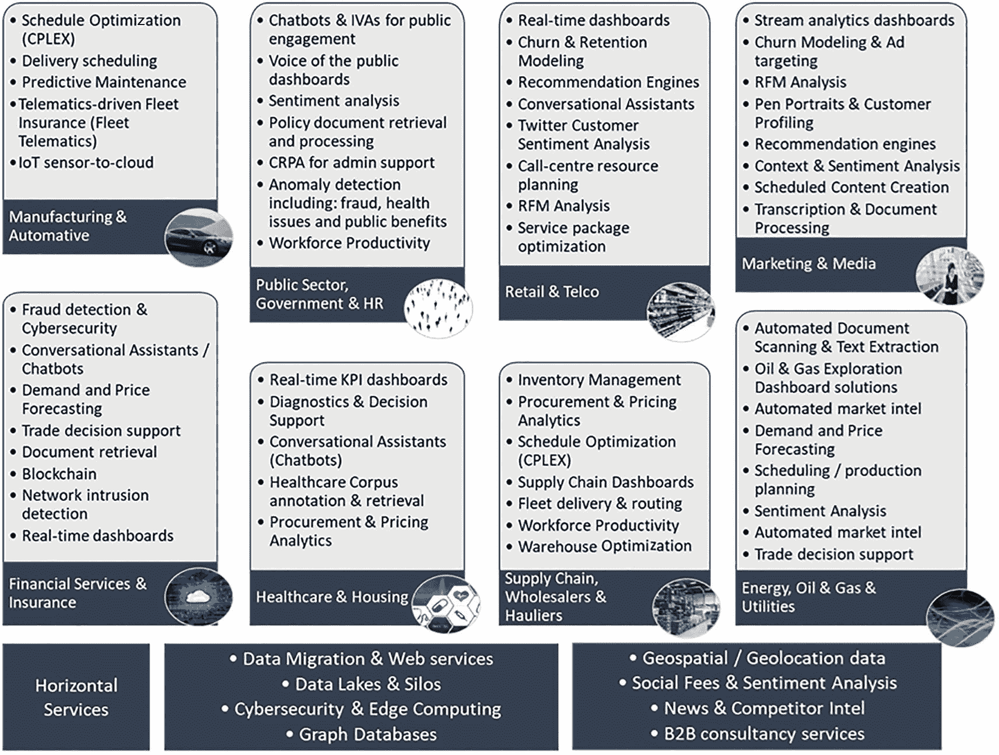

制造业与汽车、公共部门、政府与人力资源、零售与电信、营销与媒体、金融服务与保险、医疗保健以及住房等领域的人工智能应用分类。

图 1-9 人工智能应用

虽然新兴的人工智能应用可能尚未完全商业化，或者尚未在大多数工作场所实际使用，但我们也在下方提供了高德纳（Gartner）对未来趋势的看法，其中一些值得注意的技术（例如`强化学习`和`边缘 AI`）很可能在未来几年内进入主流。


一条期望值随时间变化的折线图，代表了人工智能的技术成熟度曲线。它包含 5 个阶段，分别命名为：技术触发期、期望膨胀期、泡沫破裂期、稳步爬升期和生产成熟期。

图 1-10 高德纳人工智能技术成熟度曲线

### 人工智能应用：动手实践

既然我们已经初步了解了人工智能在当今公司和组织中的主要应用，现在我们将看一个动手实验的示例。

#### 调用 Azure 文本分析 API

我们第一个练习的目标是开始熟悉云和云服务（本例中为 Azure 和`文本分析 API`），并熟悉一个关键的人工智能应用——`自然语言处理`。

1.  我们在 Microsoft Learn 上使用一个“沙盒”环境进行此练习：[`https://docs.microsoft.com/en-us/learn/modules/classify-user-feedback-with-the-text-analytics-api/3-exercise-call-the-text-analytics-api-using-the-api-testing-console`](https://docs.microsoft.com/en-us/learn/modules/classify-user-feedback-with-the-text-analytics-api/3-exercise-call-the-text-analytics-api-using-the-api-testing-console)
2.  激活沙盒需要一个 Microsoft 账户和一个 Azure 账户^(¹⁷)
3.  按照教程中的步骤输入文本，并执行以下操作：a) 检测语言，b) 提取关键短语，c) 分析情绪，d) 提取实体
4.  作为“拓展”练习，更改第 2 部分中的文档，观察 API 返回的结果——尝试使用 `"Ich bin so sauer auf dich"`
5.  使用相同的订阅密钥，尝试其他方法：`检测语言`、`实体`和`关键短语`
6.  尝试使用您的订阅从不同区域发起调用，并观察结果
7.  返回您在 Azure 门户上创建的`认知服务`资源，并观察免费层级的 API 请求

## 数据摄取与 AI 流水线

从关键的人工智能应用，我们进入下一部分：数据摄取与自动化数据流水线。第 3 章将对此进行更详细的讨论，但现在我们先介绍 AI 工程，这是交付切实可行的、生产级 AI 解决方案^(¹⁸)所需的核心技能，同时还会介绍数据流水线、关键的`ETL`流程、数据整理和转换的最佳实践以及`AutoAI`等重要定义。

### AI 工程

行业研究表明，很少有 AI 项目能够成功，部分原因是 AI 项目中那些技术导向且通常资历较浅的资源往往忘记了 AI 涉及人员、流程和工具。现实情况是，编写机器或深度学习代码只是很小的一部分——当不考虑复杂的周边基础设施时，笔记本或脚本往往会失败。

每个成功的 AI 应用背后都有数据流水线——从数据摄取，经过数据分类、转换、分析、训练机器学习和深度学习模型等多个阶段，再到推理和重训练/数据漂移过程，其目标是产生越来越准确的决策或洞察。

最终，如果没有一个稳健的、服务化的交付流水线来将数据摄取到下游建模和分析流程中的数据策略，任何 AI 项目都无法成功。考虑到这一点，我们在本节讨论数据摄取的工作原理以及建立成功 AI 应用所需的数据流水线。

### 什么是数据流水线？

数据流水线是数据从上游源头到下游接收端（终端用户可以更容易地在此消费数据）的流动。更正式地说，它是一组自动化的操作，从各种来源提取或摄取数据，通常对数据进行转换，然后将其放入数据存储或仓库中，以供下游分析。

在云计算时代，有多种实现方式，例如将数据从 Web 或应用程序转移到数据仓库，或者从数据湖转移到数据库。在 2022 年，所有这些方式的共同点是，越来越需要使所涉及的工具和转换过程尽可能无缝衔接，并最终实现完全自动化。

### 提取、转换、加载 (ETL)

`提取`、`转换`和`加载`，即`ETL`，常常与数据流水线混淆。虽然`ETL`过程指的是从不同来源提取数据、将其转换为可用格式，然后加载到最终用户系统中的过程，但它是一组离散的、有限的步骤。而数据流水线在时间上不是离散的，它处理的是持续的数据流。

因为数据流水线在某种意义上可以被视为`ETL`步骤的持续循环，所以定义这三个步骤会有所帮助。

#### 提取

数据从各种内部和外部来源提取，例如文本文件、`csv`、`excel`、`json`、`html`、关系型和非关系型数据库、网站或 API。诸如`parquet`和`avro`等更现代的格式，因其对数据集的高效压缩能力，也越来越多地被使用。

#### 转换

对数据进行转换，使其适合并与目标最终用户系统的模式兼容。转换包括：清理数据以删除重复或过时的条目；将数据从一种格式转换为另一种格式；连接和聚合数据；排序和整理数据等。

#### 加载

在最后的`ETL`步骤中，数据被加载到目标系统（如数据仓库）中。一旦进入数据仓库，数据就可以被高效地查询，并用于分析和商业智能。

### 数据整理

上述概念对于数据工程师的角色至关重要，但在服务于下游数据科学和数据分析流程的 ETL 转换步骤中，存在相当大的重叠。

`数据整理`（或`数据清洗`）是数据科学和人工智能中的主要流程，它确保数据处于适合进行分析或商业智能的状态。许多人熟悉这样一个统计数据：数据清洗占据了数据科学家 80%的工作。实际上，`数据整理`可能占据数据科学家高达 80%的工作，并且它不仅仅涉及数据清洗：还包括许多其他子流程，如格式化、过滤、编码、缩放与归一化，以及打乱或拆分。这些操作不仅限于结构化数据，非结构化数据（如文本或图像）也属于机器学习和深度学习的处理范围。

`数据整理`位于数据采集之后、建模/机器学习或深度学习之前的流程中。它具有高度迭代性，并且通常与探索性数据分析（`EDA`）相结合，以更好地理解数据集中各个字段（通常是列）的结构。虽然`EDA`侧重于被动地“观察”数据，但`数据整理`实际上是以某种方式主动“改变”数据。

我们将在机器学习章节中更详细地讨论`数据整理`（以及`ETL`流程），并特别通过研究诸如欺诈检测等关键案例，来确立将机器学习投入生产的最佳实践技术。

## 性能基准测试

虽然`ETL`和`数据整理`处理的是数据预处理，但我们还需要一种方法来“评分”（理想情况下是持续地）流入人工智能解决方案的数据。

构建人工智能应用需要持续的训练和测试。了解如何对性能进行基准测试以及使用哪些度量指标，是机器学习和深度学习中的关键开销，并且需要严格且适应不断演变的（输入）数据管道。

对于监督分类问题，可以使用准确率、召回率、精确率和混淆矩阵等度量指标，以更好地理解我们正确预测的实际案例比例（无论是负例还是正例）。对于监督回归问题，则使用均方根误差和`R 平方`来比较预测输出与实际目标数据。在深度学习中，我们可能会使用与上述类似的度量指标，再加上额外的特定深度学习度量指标，如损失和交叉熵。

### 人工智能管道自动化 – AutoAI

近年来，人工智能领域的许多关注点都集中在自动化执行`ETL`、`数据整理`和`性能基准测试`的整个端到端流程的潜力上。结合围绕`数据漂移`（衡量每次刷新输入管道时数据变化的程度）的自动化，实现端到端自动化，并对每一步进行全面的监控和度量，是实现真正企业级人工智能战略的关键。

虽然大多数组织的“愿景”是实现一切自动化，但在实践中，目前并非所有内容都在`AutoAI`的范围内——相反，我们在表 1-2 中列出了一些关键变量，这些变量可以整合到一个功能完备的自动化数据管道中，正如`IBM Cloud Pak for Data`、`DataRobot`和`Google Vertex AI`等工具所证明的那样。

**表 1-2** 人工智能管道自动化的关键流程和杠杆

| 建模前 | 建模后 |
| --- | --- |
| **原始数据导入** | **特征工程** |
| • 静态（批处理）文件 | • 降维 |
| • 多个 SQL 查询 | • 归一化（缩放到 0 到 1 之间） |
| • 通过 Python 库进行身份验证的 API | • 标准化（缩放到均值为 0，标准差为 1/拟合正态分布） |
| **数据整理** | **模型调优** |
| • 识别与处理 | • 性能基准测试 |
| • 缺失值 | • 超参数调优/网格搜索 |
| • 编码 | • 算法选择 |
| **数据划分** | **重新训练** |
| • 识别目标变量 | • 数据漂移 |
| • 打乱并拆分训练集/验证集 |   |
| • 测试集或 k 折交叉验证 |   |

### 构建你自己的 AI 管道：动手实践

在花了一些时间了解人工智能管道的构成之后，让我们来看一个真实的实验室示例——它在实践中是怎样的？

**无代码分类**

本练习的目标是理解数据对任何人工智能应用结果的依赖性和流动。该练习将逐步演示如何使用“无代码”二元（监督）分类模型在`Microsoft Azure ML Studio`中预测收入水平。

1.  如果你还没有微软账户（例如`hotmail.com`、`live.com`或`outlook.com`账户），请在`https://signup.live.com`注册一个。
2.  导航至`https://studio.azureml.net`，点击注册选项，并选择免费工作区选项。为了测试，请使用你的微软账户登录，然后再次注销。
3.  按照下方教程中的步骤导入数据，执行基本的`EDA`和`数据整理`、建模以及性能基准测试。
4.  `http://gallery.cortanaintelligence.com/Details/3fe213e3ae6244c5ac84a73e1b451dc4`
5.  作为“拓展”练习，尝试通过修改输入数据（特征）、对其中一个分类特征进行编码、更改训练/测试集划分百分比或将算法从双类提升决策树更改为其他算法，来改进模型性能。

## 神经网络与深度学习

虽然我们在上一节讨论的数据或人工智能管道是人工智能应用无缝集成并整合不断变化的数据源的关键手段，但它们包裹在人工智能应用的引擎周围，即位于应用“内核”的机器学习或深度学习模型。

在开始对深度学习进行高层次概述之前，让我们快速回顾一下机器学习。正如开篇所述，我们期望读者已经具备一定的机器学习基础，因此我们在此仅讨论与实施人工智能解决方案相关的重要概念。

### 机器学习

从基础层面来看，机器学习分为两类：监督式学习和无监督式学习。强化学习有时被视为第三类，但同样也可以看作是无监督式学习的一种。

#### 监督式机器学习

监督式机器学习与无监督式机器学习的区别在于是否存在“已标注”或“真实值”数据，即我们期望训练模型预测的特定目标字段或变量。

监督式机器学习主要有两种类型：^(¹⁹)分类和回归。分类问题中的标签或目标变量是离散的（通常是二元的，但有时也是多类的），而监督式回归问题中的标签则是连续的。在行业关键机器学习应用中，使用分类技术的一个例子是判断客户是否会流失（或不会），而预测客户收入则是回归技术的一个例子。在这两种情况下，用于预测或预报目标变量的**特征**通常是客户属性，一般包括交易数据和人口统计数据，但也可能包含行为或态度数据，例如在网页上停留的时间或社交媒体互动中的情感倾向。

#### 无监督式机器学习

在无监督式机器学习中，我们没有真实值，因此预测建模的方面转而试图在底层数据上强加一种未见过的模式。通常使用某种形式的聚类将数据分组，例如，对于埋藏在 CRM 平台中的客户数据，无监督式机器学习方法可能会发现一些具有一定共性的细分群体（高消费、中低收入、位于特定区域等）。

降维有时也被视为一种无监督技术，因为机器学习算法被用来简化数据（如果使用主成分分析，通常是从数千个底层特征简化为数十个特征），使其在统计上类似于原始数据。虽然这种方法可以极大地缩减数据集并提高运行时间/性能，但它严格来说并不是通常意义上的机器学习建模技术，因为在这种情况下，输出的是另一个数据集（尽管是压缩后的），而不是一个训练好的模型。

## 强化学习

强化学习涉及实时机器（或深度）学习，它采用一种智能体/环境机制，根据来自周围环境的实时反馈（模型的准确度如何）来对模型的迭代进行惩罚或奖励。

虽然本书的范围主要集中在主流商业和组织应用上，但强化学习的进展通常是媒体大肆炒作的热点——本质上，它是驱动“工业级”应用（如谷歌搜索引擎、自动驾驶汽车和机器人技术）的底层技术。

### 什么是神经网络？

在简要回顾了机器学习之后，让我们进入深度学习的高层概述。

人工神经网络是支撑深度学习的结构。受大脑的生物启发，人工神经网络因其能够从底层数据中提取层次化、抽象或“隐藏”特征的能力，而被用于解决复杂问题。

通常，人工神经网络由一个输入层、多个隐藏层和一个输出层组成。在网络的“前向传播”过程中，各种数据点作为输入（类似于机器学习模型中的特征），通过加权网络馈送以激活各种神经元，并最终产生数值输出。在计算机视觉或图像分类应用中，多次迭代这些前向传播（一个周期）会产生一个概率数组，其值对应于数据对应两个或多个结果（本例中为图像，例如一个人或一个物体）的概率。

### 简单感知器

简单感知器是人工神经网络的构建模块——实际上是大脑中生物神经元的简化模型。

单个神经元（如图 1-11 所示）有多个输入，根据这些输入，神经元要么被激活，要么不被激活。如果我们将这些感知器按层组织，就会得到一个多层感知器或深度神经网络，其功能更接近我们的大脑，多个神经元会根据输入信号被激活。

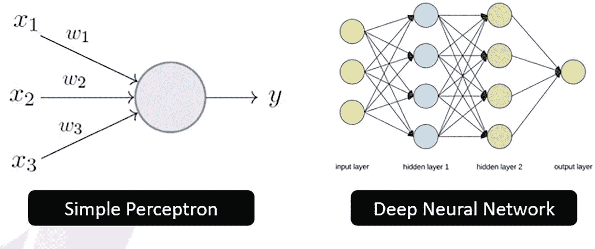

两张图。1. 简单感知器。输入 `x1`、`x2`、`x3` 经过权重 `w1`、`w2`、`w3` 后产生输出 `y`。2. 深度神经网络。3 个输入层流向隐藏层 1 和隐藏层 2，产生 1 层输出。

图 1-11

简单感知器与多层感知器/深度神经网络

简单感知器中的“激活”函数使用赫维赛德阶跃函数——一个简单的开/关开关。简单感知器也只能学习线性函数，因此实际上仅作为性能参考有用。另一方面，多层感知器（图 1-11）由于拥有多个神经元，并依赖于更先进的激活函数（如 `sigmoid`、`tanh` 和 `ReLu`），因此可以学习非线性函数。

### 深度学习

上文我们看到，深度学习指的是应用具有多个隐藏层的人工神经网络，即深度神经网络。

然而，深度学习可以使用多种不同类型的人工神经网络，每种网络都有一些关键特性，这些特性使其被用于解决工作中特定的预测分析挑战。本书动手实验环节涵盖的主要类型如下所列。^(²⁰)

#### 卷积神经网络

卷积神经网络是一种利用卷积运算从输入数据中提取层次化模式的神经网络。卷积是一种将两个信号组合成第三个信号的数学方法。`CNN` 主要用于处理具有空间关系的数据，例如图像。

#### 循环神经网络

循环神经网络用于处理序列数据或具有潜在顺序/语法结构的数据。因此，`RNN` 通常用于预测时间序列数据，例如股票市场数据或具有潜在时间依赖性的物联网/传感器数据。

由于语法术语遵循特定的序列和顺序，语音识别和自然语言处理应用（如聊天机器人和智能虚拟助手）通常也使用一种循环神经网络，例如 `LSTM`（长短期记忆）网络，以捕捉底层语法中的细微差别、结构和顺序。

#### 自编码器和变分自编码器

变分自编码器是自编码器的一种改进版本——自编码器是一种无监督的人工神经网络，学习如何高效地压缩和编码数据。自编码器因其生成图像数据的能力而受到媒体广泛关注；有时会被误认为是深度伪造背后的技术。自编码器和 `VAE` 由一个编码器（用于输入数据）和一个解码器（用于从网络输出重建输入）组成。这两种神经网络技术的区别在于，`VAE` 产生的是分布式（概率性）输出。

### 生成对抗网络

`GAN` 是一种 `CNN`，它使用一个持续生成数据的生成器，同时一个判别器学习区分虚假数据和真实数据。随着训练的进行，生成器在生成看起来真实的虚假数据方面不断改进，而判别器检测虚假与真实数据差异的能力也在提升。`GAN` 是深度伪造背后的真正技术。

由于这种“良性循环”，在面部图像上训练的 `GAN` 可用于生成不存在但看起来非常真实的面部图像。尽管有相似之处，但 `GAN` 与自编码器和 `VAE` 不同，它们致力于生成无法与真实数据区分的新数据，而不是重建（相同的）输入数据。

### 神经网络 – 术语

由于其复杂性，深度学习在模型配置和改进方面带来了大量令人困惑的概念、工具和技术。我们稍后将更详细地研究这些内容，并扩展下面的定义，但现在我们列出理解模型训练过程工作原理所必需的主要概念。

**`Epoch`（周期）** — 对整个数据集完成一次完整的遍历。

**`Learning Rate`（学习率）** — 在梯度下降/反向传播过程中权重更新的速度^(²¹)。

**`Activation Function`（激活函数）** — 在给定一组输入的情况下，触发节点/神经元输出的函数。

**`Regularization`（正则化）** — 用于防止过拟合的“超参数”。

**`Batch Size`（批次大小）** — 每次前向传播从输入数据中随机抽取的样本大小。

**`Hidden Layer`（隐藏层）** — 位于输入层和输出层之间的层。

**`Loss function`（损失函数）** — 计算预测输出与实际输出之间的差值。

最小化最后一个（损失函数）是训练神经网络的核心目标。

### 深度学习工具

在本书中，我们将用于深度学习的主要工具是 `Python`、^(²²) `TensorFlow` 和 `Keras`。这些工具目前都是开源且免费提供的，但值得注意的是，深度学习中使用的许多工具，包括 `TensorFlow` 和 `Keras`，都是从学术界和大型科技公司的内部开发中演变而来的。

`TensorFlow` 是谷歌的产物，至今仍被用于驱动谷歌所有基于大数据集的机器学习和深度学习，以及 Airbnb、可口可乐、通用电气和推特等其他全球品牌。它于 2015 年开源，虽然它是一种低级语言，通常需要高度专业化的程序员来操作和运行，但像当今生态系统中的大多数工具一样，其底层代码后来通过高级“封装器”（如 `Keras`）提供服务，`Keras` 由麻省理工学院开发，可以像 `Python` 库一样轻松导入。

在本书中，我们还将使用 `PyTorch` 进行自然语言处理方面的深度学习应用。`PyTorch` 的发展路径与 `TensorFlow` 类似——它是 Facebook 的一款工具，于 2017 年在 GitHub 上开源。

其他深度学习工具包括 `Caffe`、`Apache MXNet` 和 `Theano`——它们通常用于有强集成需求的场景（例如，`Caffe` 与 NVIDIA 集成，`MXNet` 与 `Apache Kafka` 或 `Apache Spark` 集成）。`Theano` 由蒙特利尔大学开发，虽然曾风光一时，但由于无法与大型科技公司提供的（预算更充足的）产品竞争，其开发于 2017 年停止。

### 神经网络与深度学习入门：动手实践

现在我们已经为神经网络和深度学习设定了背景，值得探索它们的工作原理。不过，在此阶段，我们不会直接深入代码，而是利用一个出色的可视化工具来观察数据如何通过神经网络进行处理，以训练深度学习模型。

TENSORFLOW PLAYGROUND

**本练习的目标是将简化版深度学习模型的训练过程可视化，并尝试通过调整我们可用的众多调优“杠杆”来提升其性能。**

1.  访问 [`http://playground.tensorflow.org/`](http://playground.tensorflow.org/)

2.  点击屏幕右侧（DATA 下方）的缩略图图标，查看四个数据集。

3.  注意，在所有情况下，（监督）数据集都有标记数据：要么是蓝色，要么是橙色，输出结果显示这些数据点绘制在二维（`x1`, `x2`）网格上。我们模型的输入显示在 FEATURES 下，初始设置为仅 `x1` 和 `x2` 坐标，而我们有两个隐藏层，分别包含 4 个和 2 个神经元。

4.  选择一个数据集并点击运行。这将启动训练过程（并立即开始评估过程）。注意神经网络权重如何通过每次前向传播和每个周期进行更新。

5.  观察右侧显示的训练损失和测试损失。一个好的模型，其训练损失和测试损失都应接近于零。

6.  暂时停止模型训练过程。前三个数据集相对容易训练。选择最后一个（螺旋形）数据集并重新启动训练过程。

7.  作为“拓展”练习，尝试通过使神经网络架构更复杂来提升模型性能（在更少的周期内实现更低的损失）——向模型添加合成特征（`x1x2`、幂变换或三角变换）和/或增加网络中的层数。您还可以更改左侧的训练和测试数据比例，增加或减少批次大小，或修改顶部的超参数。尝试找到一个合适的配置，在 500 个周期内实现损失 < 0.01。

8.  选择最后一个（螺旋形）数据集并重新启动训练过程。注意，这次建模过程难以收敛——损失波动很大。我们将在本书后面的第 5 章再次查看 TensorFlow Playground，并尝试在该数据集上训练获得更好的结果。

## 将 AI 投入生产

理论是一回事，交付又是另一回事。我们在第 3 节简要讨论了 AI 项目失败泛滥的问题——现实是，自从数据科学成为一份被招聘网站过度营销所吹捧的“光鲜”职位以来，那些设计拙劣、过度工程化的 `R` 和 `Python` 脚本，加上断裂的集成链路，在企业 AI 领域留下了一连串的浪费痕迹。^(²³)

走出这片“荒原”，大多数组织和企业正试图扭转局面，并认识到从一开始就需要引入更广泛的**设计/系统思维**方法，以确保 AI 解决方案的构建能够考虑到多用户参与（包括技术人员和非技术人员）、端到端流程以及覆盖全系统的生态系统、基础设施和集成。

### 计算与存储

如今，很少有 AI 解决方案能被视作“本地部署”方案，任何真正的企业级 AI 解决方案都远不止于底层的机器或深度学习模型。如今的 AI 解决方案与云计算以及大型科技公司提供的特定资源和服务密不可分——对云的需求源于两大“分组服务”：计算与存储。

**计算**本质上是计算机处理能力——与计算内存相关联，它是执行软件计算以及（通常复杂且高度并行的）运算的能力。计算通常通过云上的虚拟机来提供。

**存储**，在组织的运营和战略需求背景下，是满足其所有数据需求、补充和维护数据的手段。大多数云提供商都提供文件存储以及基于 `SQL`/`NoSQL` 的选项，用于存储结构化和非结构化数据。

虽然最初的事务型数据库系统要求存储和计算尽可能靠近以减少延迟，但更快的网络、数据库系统日益增强的可用性和可扩展性，以及降低托管成本的需求，共同推动了计算能力与存储的分离。

所有企业都需要两种类型的数据：事务性数据和已处理（批处理或聚合）数据。如今，其中大部分数据仍驻留在数据仓库中，但由于预测分析的复杂性要求进行复杂的分析查询，企业和组织通常决定将其数据迁移到云端，因为通过云实现的总体成本节省比延迟的相对增加更为重要。

### CSP（云服务提供商）——为何不投资亚马逊、微软或谷歌就无法在 AI 领域取得成功

既然已经确定所有 AI 项目（或至少是企业级 AI 项目）都需要云，那么问题就来了：该选哪一家？亚马逊云服务（`AWS`）多年前就占据了这一领域的主导地位。如今，如表 1-3 所示，市场出现了一些分化，微软 `Azure` 与 `AWS` 形成竞争。谷歌云平台（`GCP`）也在抢占市场份额，此外还有少数其他提供商，如 `IBM` 云、阿里云（主要在中国）和 `Heroku`。

**表 1-3** Gartner 全球 `IaaS` 公有云服务市场份额，2019-2020 年（百万美元）^(²⁴)

| 公司 | 2020 年收入 | 2020 年市场份额（%） | 2019 年收入 | 2019 年市场份额（%） | 2019-2020 年增长率（%） |
| --- | --- | --- | --- | --- | --- |
| 亚马逊 | 26,201 | 40.8 | 20,365 | 44.6 | 28.7 |
| 微软 | 12,658 | 19.7 | 7,950 | 17.4 | 59.2 |
| 阿里云 | 6,117 | 9.5 | 4,004 | 8.8 | 52.8 |
| 谷歌 | 3,932 | 6.1 | 2,367 | 5.2 | 66.1 |
| 华为云 | 2,672 | 4.2 | 882 | 1.9 | 202.8 |
| 其他 | 12,706 | 19.8 | 10,115 | 22.1 | 25.6 |
| **总计** | **64,286** | **100.0** | **45,684** | **100.0** | **40.7** |

对某一家大型科技公司的供应商锁定已成为一个问题，许多公司现在正试图多元化，并利用多家云服务提供商的服务。

虽然每个 `CSP` 都自带其“市场”云工具，但我们下面只讨论那些属于关键计算和存储分组服务的工具。其他分组服务，如治理、安全、自动扩缩和容器化，将在后面更详细地讨论。

#### 计算服务

`Azure Virtual Machines` 和 `EC2` 实例（通常通过 `AWS` 虚拟私有云上的虚拟机进行配置）是云计算的主要选择。`Google Compute Engine` 是 `GCP` 的主要产品。

#### 存储服务

`Amazon Simple Storage Service S3` 可能是 `AWS` 最知名的存储服务，用于将数据和文件安全地存储在“存储桶”中。其他供应商的类似服务包括 `Azure Blob storage` 和 `Google Cloud Storage`。我们将在后面的一些动手实验中用到这些计算和存储服务。

> **重要提示**
>
> 使用云并非免费，尽管它们打着提供“免费套餐”的幌子。本书中我们将频繁使用云服务，但请准备好承担可能高达 500 美元的费用，以完成所有实验。
>
> 免费套餐仅限于某些资源，而这些资源本身的能力限制相当平庸。服务使用也存在限制，因此如果客户在其云账户上产生费用，这很可能是由于对某个云资源/服务的使用超出了免费套餐限制，或者订阅已转为按需付费（一年后）。
>
> 读者需自行承担与配置云服务相关的所有费用。我们强烈建议在资源使用完毕后务必停止并删除它们。让作者感到极其沮丧的是，大型科技公司不会自动为你做这件事。人们不禁要问，世界上最富有的公司如何能证明这种做法是合理的。
>
> 虚拟机尤其会在不运行时产生费用，因为它们使用的是他人的服务器，无论是否开机，都会涉及能源成本（目前由于俄罗斯与乌克兰之间的战争，成本尤其高昂）。
>
> 通过使用沙盒环境（如果可用）并在完成后删除资源来帮助管理您的成本。作者也乐意提供致 `CSP` 的投诉信，以便进一步转介或向慈善机构进行小额捐款，但最终，您仍需自行承担与配置云服务相关的所有费用。

### 容器化

虽然云上计算和存储解决方案相对较低的成本和易于部署的特点，推动了云在人工智能领域的应用，但容器的使用已成为将 AI 应用投入生产的主要方式。

所有主流云平台都包含容器化服务——这是一种全机器虚拟化的轻量级替代方案，它将应用程序封装在具有自身操作环境的容器中。容器化具有许多非常适合构建稳健的生产级 AI 解决方案的优势，包括能够简化和加速开发、部署和应用程序配置过程，提高可移植性、服务器集成和可扩展性，以及提高生产力和联合安全性。

#### Docker 和 Kubernetes

`Docker` 是本书中将使用的主要容器运行时。`Docker` 的独特卖点在于，它在创建隔离环境以启动和部署应用程序时，能够处理依赖关系、多种（编程）语言和编译问题。就像“物理”容器可以通过轮船、卡车或火车运输一样，`Docker` 容器内的标准化意味着它实际上可以在任何平台上运行。

尽管与虚拟机有许多相似之处，如图 1-12 所示，`Docker` 更好地支持多个应用程序共享同一个底层操作系统。`Docker` 也很快，可以在几秒钟内启动和停止应用程序。`PostgreSQL`、`Java`、`Apache`、`elastic` 和 `mongoDB` 都可以在 `Docker` 上运行。

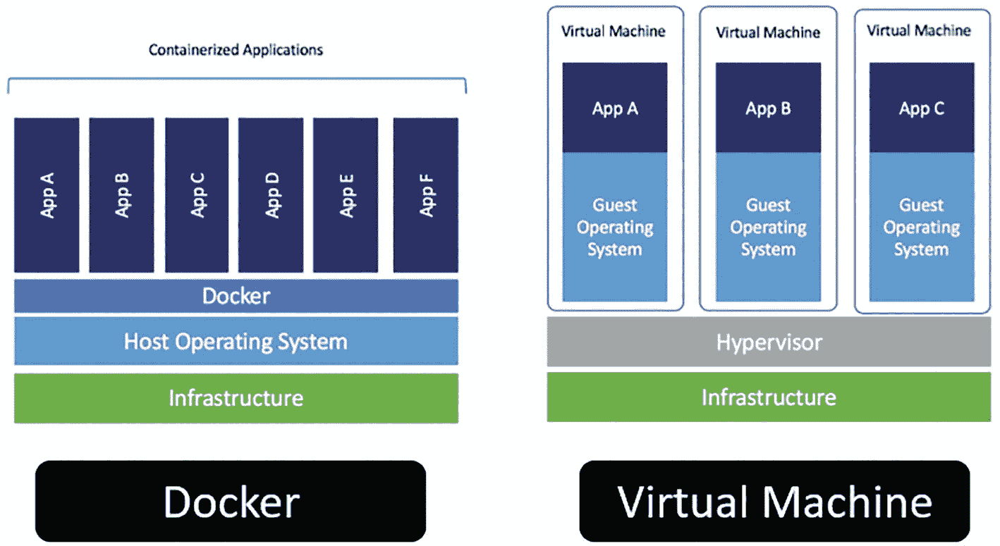

两张图。左侧是应用程序 A 到 F、`Docker`、主机操作系统和基础设施。右侧是客户操作系统的应用程序 A 到 C、虚拟机监控程序和基础设施。

**图 1-12** 比较 `Docker` 与虚拟机（来源：Docker）

虽然本书不会使用它，但容器管理工具 `Kubernetes`（`k8s`）通常用于编排 `Docker` “实例”。作为一个开源平台，`Kubernetes` 最初由 Google 设计，可自动执行容器中应用程序的部署、管理和扩展。

### 将 AI 投入生产：动手实践

在对容器和 `Docker` 进行简要介绍之后，我们来到了第一章的最后一个动手实验。

**自动化 AI 流程——工具与技术**

**本练习的目标是熟悉云上的计算、存储和容器解决方案，并探索使用 `Python` 进行机器学习自动化——这通常是生产级 AI 解决方案的最终目标。**

1.  注册 `AWS` 免费套餐并打开 `AWS` 控制台：[`https://console.aws.amazon.com`](https://console.aws.amazon.com)

2.  探索 `AWS` 上的关键计算、存储和容器服务

    [`https://aws.amazon.com/products/compute/`](https://aws.amazon.com/products/compute/)

    [`https://aws.amazon.com/products/storage/`](https://aws.amazon.com/products/storage/)

    [`https://aws.amazon.com/containers/services/`](https://aws.amazon.com/containers/services/)

3.  现在转到 Google Colab 并运行下面的 `Python` 脚本，查看机器学习自动化的端到端示例。

4.  此脚本使用 `PyCaret` 和内置的保险数据集来运行一系列数据管道/特征转换，训练线性回归模型，并根据性能选择最佳模型。这个相同的动手实验将是第 9 章关于将 AI 投入生产的广泛最终实验的起点。

5.  请注意，该脚本使用 `PyCaret` 库中内置的静态数据文件，但通常这种使用大数据数据集的自动化会利用云存储和分布式计算来提高整体性能和数据安全性。

Python 代码：

```
# 一次性安装——运行后注释掉
# 注意：安装过程结束时可能会显示错误，但这不会影响后续的 autoML 建模过程
%pip install pycaret

#### 从 pycaret 仓库导入数据集
from pycaret.datasets import get_data
insurance = get_data('insurance')
#insurance.head()

#### 注意：运行下方代码时，请确保按回车键继续/接受
#### 初始化环境
from pycaret.regression import *
r1 = setup(insurance, target = 'charges', session_id = 123,
normalize = True,
polynomial_features = True, trigonometry_features = True,
feature_interaction=True,
bin_numeric_features= ['age', 'bmi'])

#### 训练线性回归模型
lr = create_model('lr')

#### 保存转换管道和模型
#### 注意：保存到 /content 文件夹，格式为 pkl 文件
#### 注意：根据参考 https://github.com/pycaret/pycaret/issues/985 添加了 model_only=True
save_model(lr, model_name = 'insurance-ml', model_only=True)
```

### 总结

通过使用 AWS 存储和计算实例以及 `PyCaret` 将 AI 投入生产的这一瞥，希望能让读者对未来的内容有所了解。虽然基础，但重点在于此阶段接触关键工具和技术，所有这些都将在后续章节中详细阐述。

在下一章中，我们将探讨 AI 解决方案实施的高级层面，以及使用 DataOps 交付 AI 项目的最佳实践。

脚注 1   2   3   4   5   6   7   8   9   10   11   12   13   14   15   16   17
```