# 2. AI 最佳实践与 DataOps

我们在第一章中介绍了当前将 AI 投入生产的关键主题。在深入探讨数据摄取以及构建 AI 应用程序的技术和工具之前，建立一个成功的框架非常重要。

该框架始于退一步，从“自上而下”的角度理解 AI 的更广泛背景、关键利益相关者、业务/组织流程方法论、协作和利益相关者共识的重要性、适应性和可重用性，以及交付高性能 AI 解决方案的最佳实践。有许多最佳实践框架可以执行此功能，但在本书中，我们认为最适合在工作场所实现持续改进文化的是 DataOps。

本章采用的方法侧重于对 DataOps 概念的认知，而不是“深入探讨”，但在此过程中，我们将触及 DataOps^(²⁵) 的基石，包括敏捷以及如何编排敏捷开发和交付、团队和设计冲刺方法以及协作。

我们还将简要介绍如何创建高绩效文化、重用材料和工件、版本控制和代码自动化，包括使用 `Jenkins` 进行持续集成（CI）和持续部署（CD）、使用 `Docker` 进行容器化，以及使用 `Selenium` 进行测试自动化和使用 `Nagios` 进行监控。

在后续章节中，当我们研究数据/分析/AI 项目的实际实施，以及调整来自其他行业的项目，同时将最佳实践的实施与 DataOps 技术联系起来时，我们将“连点成线”。

### DataOps 和 MLOps 简介

在本节中，我们首先介绍关键概念：DataOps（和 MLOps）作为成功将人工智能应用程序投入生产的框架。


### DataOps

让我们从基础开始——`DataOps` 并非 `DevOps`。`DevOps` 关注软件开发，而数据分析（以及人工智能）除了需要这一点，还需要对数据如何演变进行控制。

由于数据是数据分析师、数据科学家或人工智能工程师角色的底层“货币”，如果我们想要产生切实、有意义的结果和洞察，治理和数据质量就至关重要——除了克隆生产环境来开发“应用程序”或“解决方案”之外，底层基础设施还必须适应不断变化的数据的“持续编排”。

如图 2-1 所示（来自 DataKitchen），一个 `DataOps` 实现贯穿整个数据管道——从多个数据源开始，经过集成、清洗和转换，然后被（多个）最终用户消费。`DataOps` 的背景是，如果没有有效的数据策略，分析和人工智能就会失败，而 89% 的企业在管理数据方面存在困难。^(²⁶)

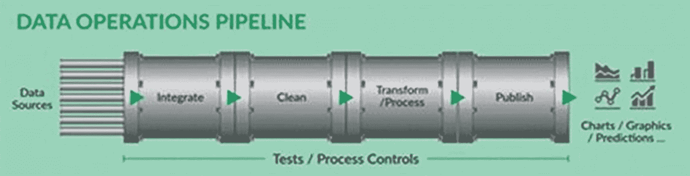

数据操作管道的表示。涉及多个数据源、集成、清洗、转换、处理与发布。

图 2-1

DataOps 管道 (DataKitchen)

### 数据“工厂”

`DataOps` 本质上是三个关键领域的融合：**DevOps、敏捷和精益**，^(²⁷) 其目标是通过缩短创新和变更周期、降低生产中的错误率、通过例如自助服务赋能等方式改善协作和生产力，从而简化数据管道（更多内容见第 3 章）并提高数据质量（和可靠性）。在更细粒度的层面上，数据监控与测量、元数据、可扩展平台和版本控制也是确保数据管道解决方案由组织目标驱动的关键领域。

除了作为一个框架或方法论之外，`DataOps` 也是一种**文化**，通常由首席信息官/首席数据官或组织的 IT 职能部门推动。指标是关键，无论是在个人贡献者层面，还是在衡量跨项目的生产力和质量改进方面。

### 人工智能的问题：从 DataOps 到 MLOps

那么 `MLOps` 呢？

即使存在稳健的数据策略，也只有不到一半（Gartner：47%，DeepLearning.ai：22%）的机器学习模型能够投入生产。^(²⁸)

我们知道机器学习（和人工智能）不仅仅是代码，它是代码加数据。虽然代码开发通常在受控环境（即 `DevOps`）中进行，但另一方面，数据具有**高熵**，并且独立于底层代码而演变。

**`MLOps` 是**机器学习运营化，它很大程度上借鉴了 `DataOps` 的最佳实践和经验教训，但这次的重点是优化机器（或深度^(²⁹)）学习模型的生产生命周期，而不是像 `DataOps` 那样处理更通用的数据/分析或人工智能解决方案。

除了高熵数据之外，机器学习的真正挑战不在于构建模型本身。如图 2-2 所示（来自 nvidia 和 GCP 的 `MLOps` 流程地图/全景图），挑战在于集成一个机器学习系统，无数项目因未能采用“全系统”方法而导致实施效果不佳：

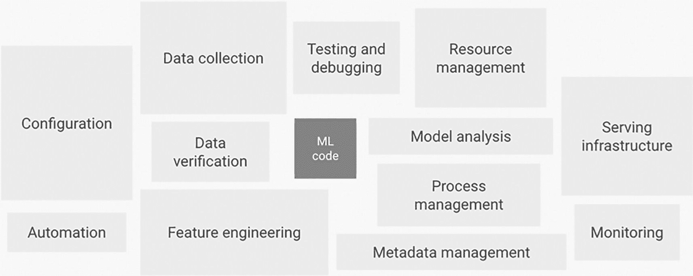

MLOps 核心流程的表示，涉及数据收集、数据验证、自动化、配置、元数据管理、模型分析和服务基础设施。

图 2-3

MLOps 核心流程 (来源：GCP)

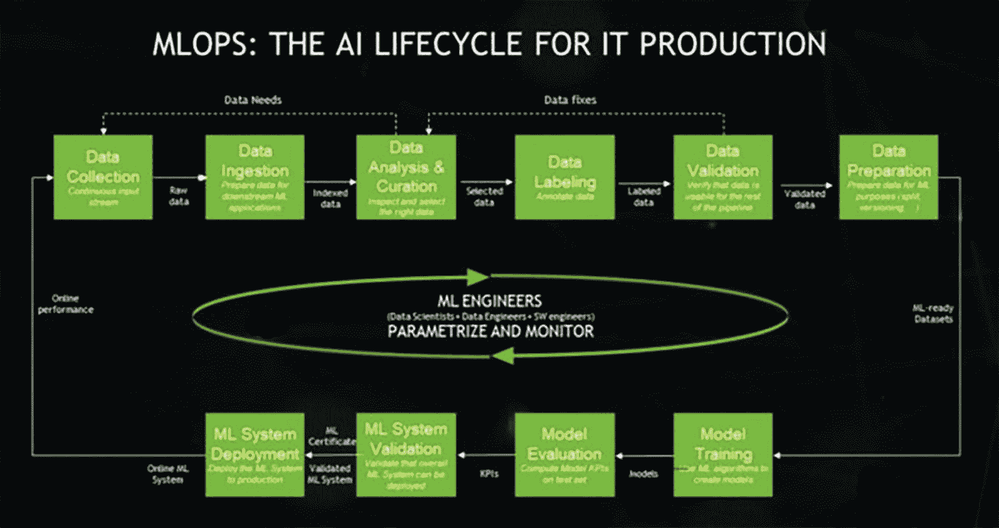

MLOps 展示 AI 生命周期的表示。涉及数据收集、摄取、分析和整理、标注、验证和准备，以及机器学习系统部署和验证。

图 2-2

MLOps (来源：nvidia)

*   不一致、繁琐（且脆弱）的部署
*   缺乏可重复性
*   由于训练和推理过程偏差导致的性能下降

### 企业级人工智能

正如我们将在后续章节中看到的，`MLOps`（和 `DataOps`）与“企业级人工智能”紧密耦合——有效地将人工智能嵌入到组织的全公司战略中。`MLOps` 和企业级人工智能关乎设计目标/未来架构，并实施稳健的人工智能基础设施和企业数据中心，同时确保全体员工了解公司切实的人工智能资产并接受相关培训。

企业级人工智能被 C 级/董事会视为企业成功运行人工智能的最佳实践——`MLOps` 符合这一愿景，如今许多 CSP 将 `MLOps` 作为内置解决方案提供，而其他公司（如 DataRobot）则将 `MLOps` 作为其整个商业模式或产品。

### GCP/BigQuery：动手实践

云端数据操作：PYTHON 和 BIGQUERY

**本练习的目标是在 Jupyter Notebook 中使用 Python，初步了解 Google Cloud Platform 和 BigQuery，以帮助弥合独立数据科学与云管理的 DataOps 或 MLOps 解决方案之间的知识差距。**

1.  通过下方链接设置一个 GCP 账户

[`https://console.cloud.google.com`](https://console.cloud.google.com)

1.  激活免费试用——这需要输入信用卡信息，但包含价值 300 美元的免费额度^(³⁰)

2.  在 [`https://console.cloud.google.com/projectselector2/home/dashboard`](https://console.cloud.google.com/projectselector2/home/dashboard) 创建一个项目

3.  要启用对 GCP API 的身份验证，请设置一个服务账户 [`https://console.cloud.google.com/iam-admin/serviceaccounts?project=gcp-python-bigquery&supportedpurview=project`](https://console.cloud.google.com/iam-admin/serviceaccounts%253Fproject%253Dgcp-python-bigquery%2526supportedpurview%253Dproject)

4.  获取 API 服务密钥，并将下载的 JSON 文件移动到你的 Jupyter 工作目录

5.  从下方的 GitHub 克隆 Jupyter notebook，并运行该 notebook，以了解 Python–BigQuery 接口如何工作

[`https://github.com/bw-cetech/apress-2.1.git`](https://github.com/bw-cetech/apress-2.1.git)

### 使用 Kafka 进行事件流处理：动手实践

使用 KAFKA 进行事件流处理

**与基于 Apache Kafka 的数据流架构的无缝集成，对于实现 DataOps 目标日益关键。我们将在第** **3****章更详细地探讨流式处理（以及批处理数据），但本实验将向读者介绍 Kafka 以及如何在大数据环境中使用它。**

1.  在以下地址设置一个 Lenses 门户账户

    [`https://portal.lenses.io/register/`](https://portal.lenses.io/register/)

2.  电子邮件验证后，选择 Lenses Demo 并创建一个工作区

3.  通过选择 SQL Studio 然后选择 `sea_vessel_position_reports` 来探索实时数据。运行以下查询以查看移动中的实时船只：

    ```
    SELECT Speed, Latitude, Longitude
    FROM sea_vessel_position_reports
    run query
    WHERE Speed > 10
    ```

在流式处理自动停止几分钟后（可能相当大，约 50 MB），下载结果的 JSON 文件

1.  练习——在其他数据集上运行不同的流式查询，例如 `financial_tweets`

2.  按照此处的步骤：[`https://lenses.io/box/`](https://lenses.io/box/) 完成以下其余步骤，以了解如何设置 Kafka 主题，包括消费者和生产者，以及如何监控实时流
    1.  创建 Kafka 主题
    2.  创建数据管道
    3.  执行流处理
    4.  消费者监控
    5.  监控实时流

## 敏捷

我们在上一节中看到，敏捷是 `DataOps` 固有的三大核心实践之一。下一节将更详细地探讨敏捷在人工智能解决方案化背景下的应用。


### 敏捷团队与协作

`DataOps` 旨在“解决分析领域中集中化与自由化之间的冲突”——既需要管控，但同样地，在日益“颠覆或被颠覆”的数字环境中脱颖而出的公司，能够培育一种拥抱实验和“实验室式”创新的文化。

作为`DataOps`的三大基石之一，敏捷开发与交付的核心在于协作与适应性，以平衡这些看似矛盾的目标。

其主要部分明确立足于“人”的视角。`DataOps`将多元化的利益相关者聚集在一个数据项目中，其角色涵盖业务/客户方（定义业务需求，传统角色：数据/解决方案架构师和数据工程师，较新的角色包括数据科学家和`ML`工程师，以及`IT`运维人员或构建和维护数据基础设施的人员）。

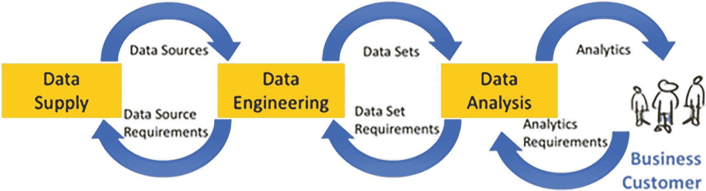

一张数据运维交接流程图展示了数据供应、数据工程、数据分析和业务客户的需求。它涉及数据源、数据集和分析。

图 2-5

`DataOps` 交接（[`medium.com`](http://medium.com)）

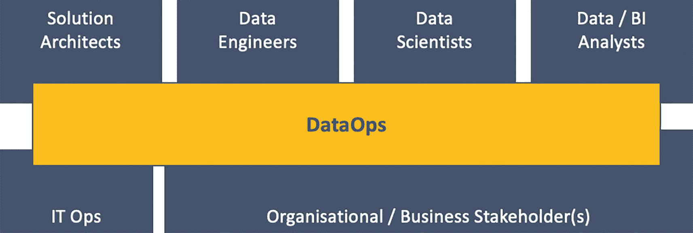

一个框架展示了数据运维的各个团队。它包括解决方案架构师、数据工程师、数据科学家、数据或`BI`分析师、`IT 运维`人员以及组织或业务利益相关者。

图 2-4

`DataOps` 团队（来源：Eckerson Group）

### 开发/产品冲刺

项目上对业务需求的优先级排序会使用诸如`MoSCoW`（即**必**须有此需求、**应**该有此需求、**可**以添加如果不影响其他功能、**想**要此功能/愿望清单）之类的技术。成功的数据项目通过“冲刺”来优先处理错误修复和功能开发，这些冲刺贯穿从数据集成到清洗、转换和发布的管道流程，通常持续 2-4 周。

虽然定义明确的项目工作包应能促成交付团队间流畅、敏捷的交接，但在开始时，团队通常会将组织的数仓和分析环境重建为一个初始的缩小型沙盒（原型）环境。从这些初步的起点开始，沙盒会扩展为实验室环境，用于流程编排和敏捷测试阶段，并持续集成（`CI`）代码变更。

最终目标是，通过“生产流水线”进行动态部署（`CD`）并监控结果。

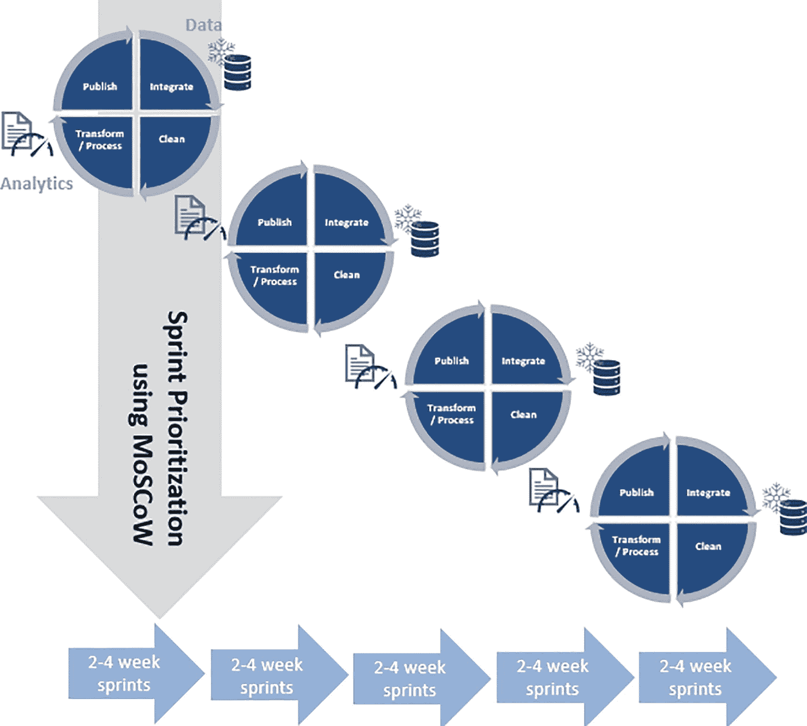

一张图表展示了由`MoSCoW`方法确定的冲刺优先级。该流程包括数据集成、清洗、转换和发布。持续时间为 2 至 4 周。

图 2-6

`DataOps` 冲刺

### 敏捷的优势

从沙盒、扩展再到部署的`DataOps`测试与发布周期，是围绕敏捷软件交付框架设计的。数据和分析专家利用这种`DataOps`最佳实践来快速修复错误并实现功能请求，以便重新部署到生产环境。最终结果是实现“受控交付”，它解决了以下关键领域：

**需求变更** – 增量式方法有助于演进集中式数据仓库，并支持“动态”分析需求。

**进度延误** – 迭代、分步的方法缩短了整体交付时间。

**灵活性提升** – 允许通过持续的过程改进来快速处理功能请求管道，同时限制无关功能的交付。

**用户失望** – 系统化、加速的问题解决流程意味着交付物不符合用户需求的可能性更小。

最终，持续（循环）改进过程应能带来更高质量的产品交付和更高的`ROI`。

### 适应性

虽然“人”的视角理应得到优先考虑，但敏捷（以及`DataOps`）的范畴超越了优化团队与协作，延伸到了应用和系统。适应性至关重要，尤其是在当今许多`AI`应用以云计算为基础的情况下；从根本上说，适应性意味着可扩展性以及业务逻辑、`API`和微服务的复用。

随着企业从单一服务器上的孤立代码转向将应用作为一组更小、独立运行的组件集合，微服务在应用生态系统中变得尤为流行。

微服务集成所依托的底层架构促进了业务逻辑的一致和安全复用、`API`共享以及事件处理，从而通过去中心化的团队所有权、基于使用量的弹性可扩展性，以及在运行时将运行变更与其他微服务隔离而实现的离散弹性，实现了更高的敏捷性。

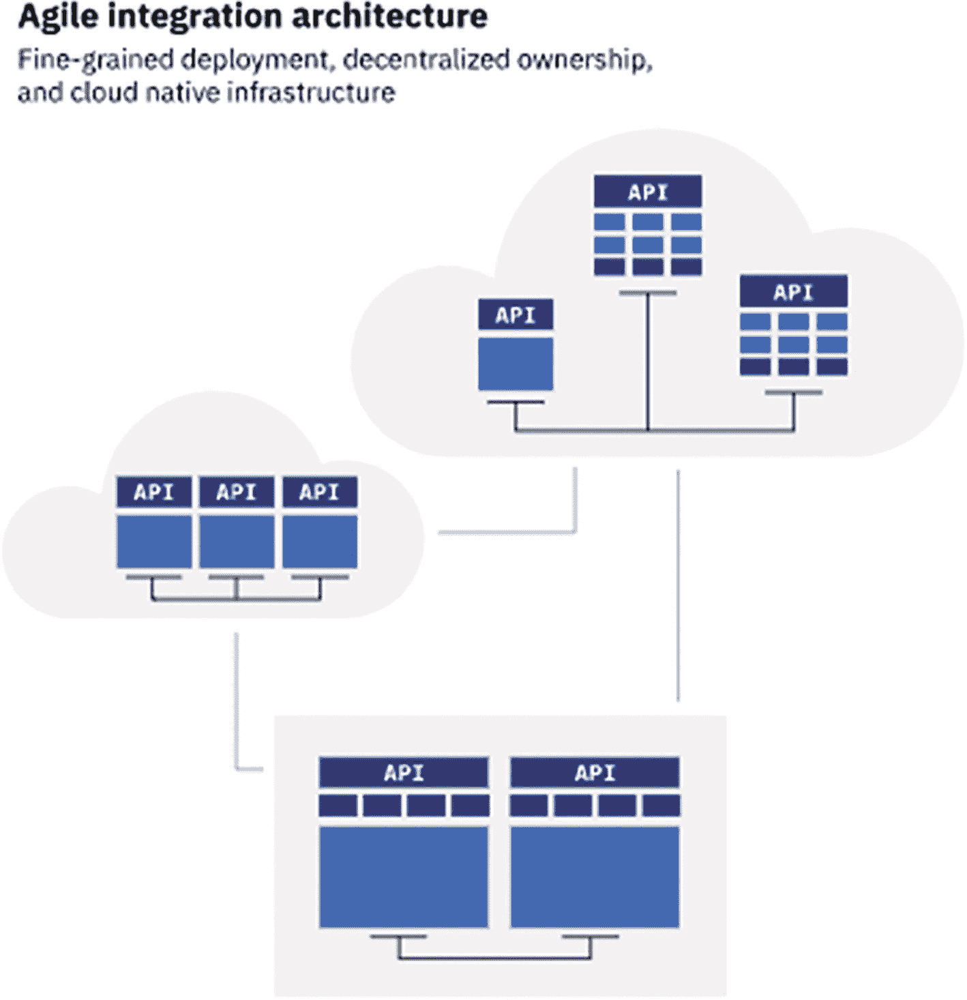

敏捷集成架构涉及细粒度部署、去中心化所有权和云原生基础设施。它促进了`API`共享。

图 2-7

微服务敏捷架构（来源：IBM）

### react.js：动手实践

为你的 AI 应用构建前端

`React.js` 与 `Vue.js` 和 `Angular` 一样，是用于构建美观用户界面的最佳开源前端`JavaScript`库之一。本实验的目标是实现一个简单的 React 应用，该应用可以扩展为`AI`应用的前端：

1.  从下方链接安装 `node` 和 `npm` – 两者都通过单个 Windows 安装程序安装：

    [`https://nodejs.org/en/download/`](https://nodejs.org/en/download/)

2.  在本地驱动器上创建一个测试文件夹，例如 `my-react-app`

3.  在新文件夹中打开终端（在 Windows 资源管理器路径中输入 `cmd` 并按回车），通过运行以下命令安装 React 样板应用：

```
npm install -g create-react-app
```

1.  使用以下命令构建你的应用：

```
npx create-react-app reactapp
```

1.  练习 – 尝试实现一些基本的前端更改：
    1.  更改 React 网页上显示的消息
    2.  （拓展）在旋转的 (react.js) 徽标的`右侧`添加一个图标

### VueJS：动手实践

使用 VueJS 进行渐进式 AI 网页应用（PWA）开发

作为构建网页应用的另一种选择，`VueJS` 可能更适合为较小、不太复杂的`AI`应用构建前端。`React` 是一个库，而 `VueJS` 是一个渐进式`JavaScript`框架。这里我们将介绍如何启动并运行一个 `VueJS` 应用，作为构建`AI`用户界面的模板。

1.  如果尚未安装，请从上方 react.js 实验步骤 1 中的网址安装 `node.js`（和 `npm`）

`https://nodejs.org/en/download/`

1.  打开终端（检查已安装的 `npm` 版本，使用

```
npm -v
```

1.  安装 `vue-cli`（`VueJS` 的命令行支持）

```
npm install -g @vue/cli
```

1.  重启终端并检查 `vue-cli` 版本

```
vue --version
```

1.  导航到一个应用测试文件夹，并创建一个名为 `my-vue` 的项目

```
vue create my-vue
```

1.  选择 Babel 默认源到源编译器，用于生成浏览器可读的 `.js`、`.xhtml`、`.css` 文件（使用方向键选择）
2.  `cd` 进入项目文件夹

```
cd myvue
```

1.  运行应用

```
npm run serve
```

1.  最后，在浏览器中导航到终端显示的网址，即 `http://localhost:8080`，查看正在运行的应用

练习 - 尝试更新源代码，删除“Welcome to Your Vue.js App”消息下方的所有文本，并将其替换为指向 Replika [`https://replika.com/`](https://replika.com/) 的超链接截图

## 代码仓库

任何致力于开发`AI`解决方案的凝聚力团队都需要“步调一致”。代码仓库（“repos”）是确保开发人员和数据专家协同工作的关键协作推动因素之一。


### Git 与 GitHub

版本控制，或称源代码控制，是一种跟踪和管理源代码变更的实践。近年来，版本控制系统（VCS），特别是分布式版本控制系统（DVCS），对 DataOps 团队来说变得非常有价值。除了固有的“DevOps”优势（包括缩短开发时间和提高成功部署次数）之外，不断演变的数据集，例如广泛使用的[约翰霍普金斯大学的新冠数据](https://github.com/CSSEGISandData)，也越来越多地通过分布式版本控制系统进行维护。

`Git`^(³³) 是迄今为止最流行的 DVC，尽管还有其他一些系统，例如 `Beanstalk`、`Apache Subversion`、`AWS CodeCommit` 和 `BitBucket`，它们用于需要与其他（通常是单一的）CSP 提供商进行特定集成的项目。

除了可追溯性和文件变更历史（跟踪每一次代码修改和每一次数据集变更）之外，`Git` 还简化了在开发过程中回滚到早期代码/数据状态的过程，并增强了分支和合并功能，这对于处理特定应用组件或用户故事的 DataOps 团队至关重要。

GitHub“生态系统”包含 `Git`（实际上是命令行后端）、GitHub（一种基于云的托管服务，允许您从中心位置管理 Git 仓库）以及 GitHub Desktop（一种桌面版本，可通过 GUI 与 GitHub 交互）。

如今，全球数百万软件开发者和公司都在使用 GitHub。2020 年 2 月之前存在的公共仓库已存档于 GitHub Arctic Code Vault 中——这是一个位于北极山脉永久冻土层下 250 米处的长期档案库。在 GitHub 上**复刻**一个仓库，或者将一个公共 GitHub 仓库**克隆**到本地目录，是在 GitHub 上访问和开发已有源代码（或更新数据集）的主要方式。这两种操作都可以通过终端中的 `git` 命令或（更直观地）使用 GitHub Desktop 来完成。

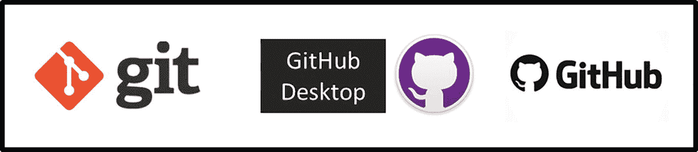

GitHub 生态系统示意图。它包含 `git`、GitHub Desktop 和 GitHub。

图 2-8

GitHub 生态系统

### 版本控制

下图展示了 `Git` 如何对同一个（`.py`）文件的三个不同版本执行版本控制。多个用户可以选择他们想要使用的文件版本，独立进行更改，然后再合并回单一的“主”仓库。

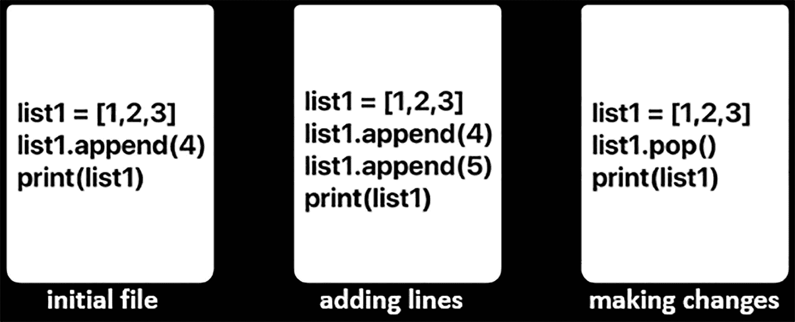

`git` 中版本控制的示意图，展示了同一文件的 3 个不同版本。从左到右依次展示了初始文件的版本、添加行以及进行更改。

图 2-9

Git 中的版本控制（来源：[`www.freecodecamp.org`](http://www.freecodecamp.org)）

### 分支与合并

简化的“分支”是 `Git` 成为迄今为止最广泛使用的版本控制系统的主要原因之一。

下图展示了从主仓库创建分支（到一个开发“dev”分支）以进一步开发代码的过程——项目中的另外两名开发人员正在添加功能请求。第一位开发人员进行了一些小修改，并将其代码更改合并到开发（dev）分支，而另一位开发人员则继续处理他们的功能，将合并推迟到以后。

一旦开发（错误修复和功能请求）完成，将在 dev 分支上进行测试，然后最终提交（回）到主仓库。

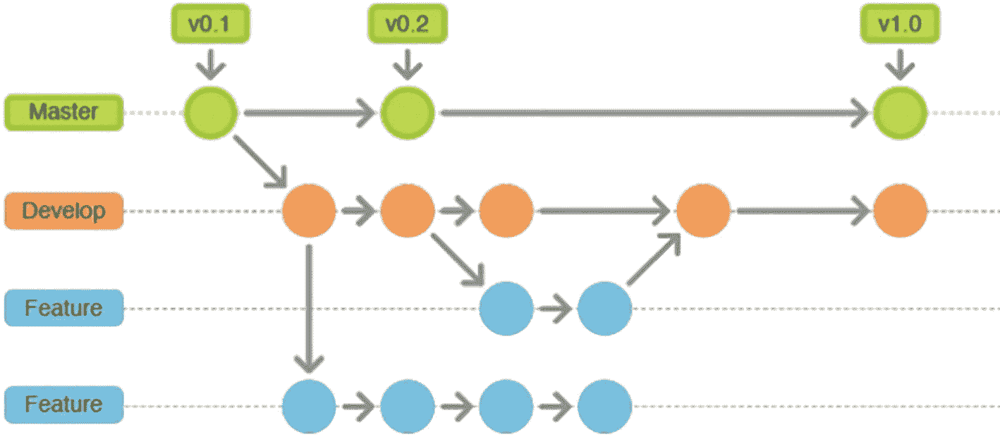

一个表示 Git 中开发分支的图表。分支从主仓库开始，并进一步包含开发层和 2 个功能层。

图 2-10

Git 中的开发分支

### Git 工作流

Git 工作流是将代码和数据的更改放入仓库的方法。代码和数据可以通过四个基本的“层”：工作目录（通常是本地用户机器）、暂存区、本地仓库和远程仓库（通常在 GitHub 本身上）。

虽然工作目录中的文件可以处于三种可能的状态：已暂存、已修改和已提交，但由于 `Git` 是一个分布式版本控制系统，而不是集中式系统，某些命令（例如提交）每次执行时不需要与远程服务器通信。如下图所示，下方显示了相应的工作流和 `git` 命令。

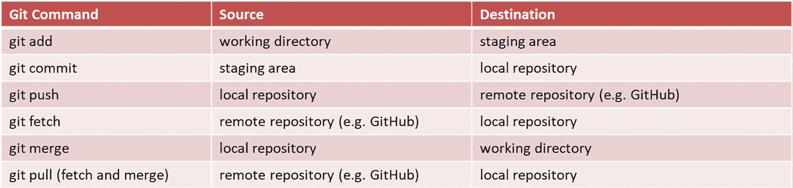

一个表示 `git` 命令、源和目标的表格。`git` 命令包括 `git add`、`commit`、`push`、`fetch`、`merge` 和 `pull`。

图 2-13

Git 命令

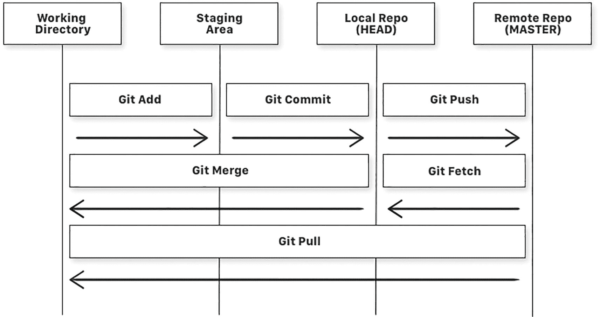

一个 Git 工作流涉及工作目录、暂存区、本地仓库和主仓库。`git` 命令中包含 `git add`、`commit`、`push`、`merge`、`fetch` 和 `pull`。

图 2-12

Git 工作流

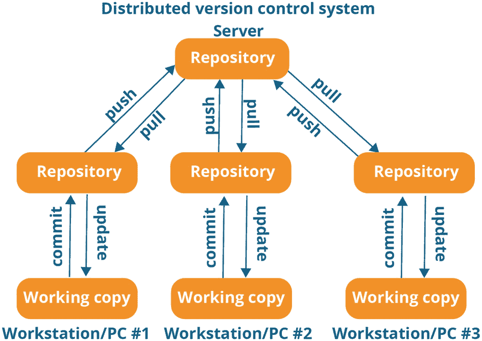

一个展示分布式版本控制系统的图表。每个程序员都有主仓库的一个本地克隆。允许进行提交和更新操作。

图 2-11

展示提交的 GitHub DVCS

### GitHub 与 Git：动手实践

GIT 基础

**如今，任何开发都离不开 GitHub，因此让我们在本实验中看看如何设置 GitHub 帐户、安装 Git 并使用 Git 创建一个新仓库：**

1.  设置 GitHub 帐户 – 在 [`https://github.com/`](https://github.com/) 注册

2.  从 [`https://gitforwindows.org/`](https://gitforwindows.org/) 安装 Git

3.  在本地目录中创建一个测试文件夹，例如 `git-intro`

4.  向 Git 介绍你自己（右键单击该文件夹并选择 Git Bash，或通过在测试文件夹中打开的终端执行）：

    ```
    git config --global user.name "USER-NAME" # 注意：与创建帐户时使用的用户名相同
    git config --global user.email "YOUR-EMAIL"
    git config --global --list # 检查你刚刚提供的信息
    ```

5.  GitHub 首选的认证方法是使用 SSH 认证。检查现有密钥，生成一个新的 SSH 密钥并将其添加到 SSH 代理。有关支持，请参阅以下链接：

    [`https://docs.github.com/en/github/authenticating-to-github/connecting-to-github-with-ssh/checking-for-existing-ssh-keys`](https://docs.github.com/en/github/authenticating-to-github/connecting-to-github-with-ssh/checking-for-existing-ssh-keys)

    [`https://docs.github.com/en/github/authenticating-to-github/connecting-to-github-with-ssh/generating-a-new-ssh-key-and-adding-it-to-the-ssh-agent`](https://docs.github.com/en/github/authenticating-to-github/connecting-to-github-with-ssh/generating-a-new-ssh-key-and-adding-it-to-the-ssh-agent)

6.  将新的 SSH 密钥添加到你的 GitHub 帐户

7.  在 GitHub 上创建一个新仓库

8.  确保选中 SSH 按钮，然后通过单击复制按钮并将它们粘贴到 Git Bash（仍在你的本地文件夹中打开）或粘贴到终端中，来运行屏幕上显示的 `git add`、`commit` 和 `push` 命令

9.  刷新你的仓库后，你现在应该会在 GitHub 仓库中看到一个 `README.md` 文件

10. 练习 – 尝试将第 2 节（敏捷）中的 `react.js` 应用源代码添加到你的本地仓库并推送到 GitHub

11. 练习 – 将一个公共仓库克隆到另一个不同的本地仓库（确保你已创建一个新文件夹，并在该文件夹中运行克隆命令）

**注意：本实验也可以通过从** [**https://desktop.github.com/**](https://desktop.github.com/) **安装 GitHub Desktop 并使用它来代替 Git 来完成。**

作为使用 GitHub Desktop 的额外练习，除了克隆到本地仓库之外，还可以尝试复刻一个公共仓库（到你的 GitHub 帐户）。


### 将应用部署到 GitHub Pages：动手实践

**GitHub 不仅仅是版本控制工具。本实验将向您展示如何将第 2 节（敏捷）中的 React 应用部署并托管到 GitHub Pages。**

**注意：此处展示的方法是通过 Git 进行的，但也可以按照以下说明使用 GitHub Desktop 进行部署：** [**https://pages.github.com/**](https://pages.github.com/)

1.  完成上方实验“react.js：动手实践：为你的 AI 应用构建前端”中的步骤
2.  创建一个 Git 仓库
3.  复制新仓库的 https 网址
4.  将你的 React 应用目录初始化为本地 (Git) 仓库，然后：
    1.  提交
    2.  推送到远程仓库
5.  通过以下方式修改 React 应用文件夹中的 `package.json`：
    1.  添加 `"homepage": "https://[你的-GitHub-用户名].github.io/[你的-GitHub-仓库名]"`（放在 json 的最顶部）
    2.  在 'Scripts' 下添加：
        `"predeploy": "npm run build"`
        `"deploy": "gh-pages -d build"`
6.  在终端中 `cd` 进入 React 应用文件夹
7.  安装 GitHub Pages 并通过逐一运行以下命令来部署你的应用：

```
npm install gh-pages –save-dev
git init
git remote add origin [https git 仓库地址]
git add .
git commit –m “将 React 部署到 GitHub pages”
npm run deploy # 注意：如果运行此命令时出错，请删除本地应用的 node_modules\.cache\gh-pages 文件夹并重试
git push –u origin master
```

然后，你应该可以在 `https://[我的用户名].github.io/[我的应用]` 打开该应用，其中 `我的用户名` 是你的 GitHub 用户名，`我的应用` 是你的仓库名称。

## 持续集成与持续交付 (CI/CD)

在介绍了 DataOps 的关键团队（敏捷）和协作（GitHub）方面之后，我们进入下一节关于 CI/CD 的内容，其重点在于以促进、改进和加速 AI 解决方案交付的方式来简化数据处理流程。

### DataOps 中的 CI/CD

软件中持续集成与持续交付（或持续部署^(³⁴)）的意图是通过构建、测试和部署流程来强制执行自动化。本质上，这是为了使团队能够将持续的软件更新流发布到生产环境，从而加快发布周期、降低成本并减少与开发相关的风险。

在 DataOps（相对于 DevOps）和 AI 的背景下，自动化的范围已扩展到数据管道编排（包括数据漂移）和建模自动化（包括重新训练过程）。理论上，这意味着每当底层代码或基础设施发生更改**并且**数据发生更改时（或者更现实地说，每当数据分布发生显著偏离时），自动化就会启动，应用程序会被重建、测试并推送到生产环境。

### Jenkins 简介

**Jenkins 是一个拥有数百个插件的开源自动化服务器，也是 DataOps 领先的 CI/CD 工具之一。Expedia、Autodesk、UnitedHealth Group 和 Boeing 都将其用作持续交付管道。**

Jenkins 最初是为 Java 开发者自动化测试而构建的，但现在支持多语言多代码仓库，它简化了持续集成或持续交付 (CI/CD) 环境的设置。它通过一个 `Jenkinsfile` 来实现这一点，这实际上是一个“管道”脚本，其中声明式编程（宏观管理）模型通过一个层次结构定义可执行步骤：管道块 > 代理 > 阶段。

Jenkins 管道实际上是一系列按指定顺序相互触发的作业集合。对于一个小的应用，例如，这可能是三个作业：作业 1 构建、作业 2 测试和作业 3 部署。作业也可以并发运行，对于更复杂的管道，会使用 Jenkins 管道项目，其中作业被编写为一个完整的脚本，整个部署流程通过“管道即代码”进行管理。Jenkins 的持续集成也支持 GitHub 自动化。^(³⁵)

Blue Ocean 通过提供低代码界面和低点击功能开发流程，为设置 Jenkins 管道提供了更好的用户体验，从而无需编写 `Jenkinsfile` 程序。

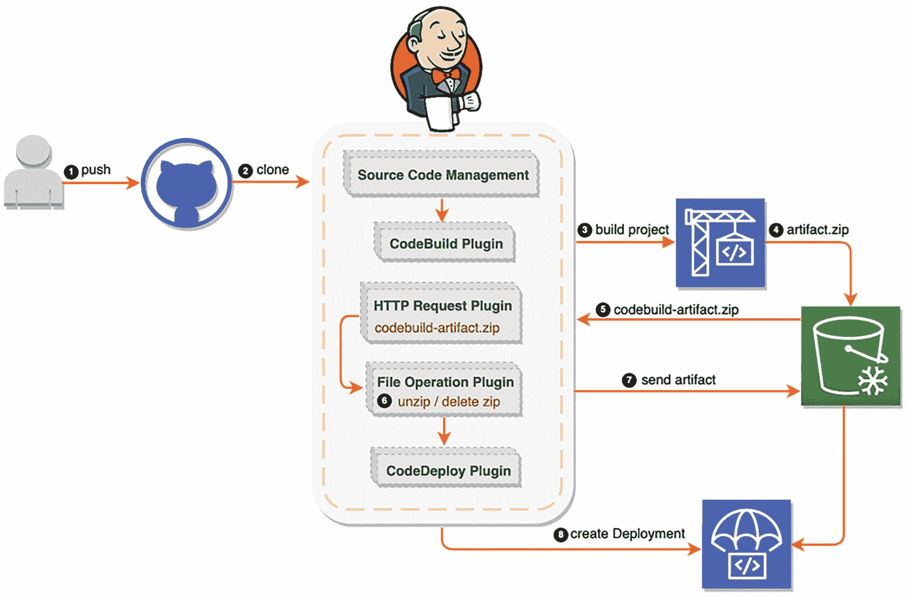

一个流程图展示了包含 GitHub 集成的 Jenkins 作业管道中的过程。它涉及推送、克隆、构建项目、发送工件和创建部署。

图 2-14

具有 GitHub 集成的 Jenkins 作业管道

### Maven

Apache Maven 与 Jenkins 紧密耦合（Jenkins 使用 Maven 作为其构建工具），是一个项目管理工具，旨在跨软件生命周期工作（执行编译、测试、打包、安装和部署任务），集中管理项目构建，包括依赖项、报告和文档。

当触发 Jenkins 构建时，Maven 会下载最新的代码更改和更新，打包它们，并执行构建。与 Jenkins 一样，Maven 可与多个插件配合使用，允许用户添加其他定制任务，但仅执行持续交付，不执行持续集成 (CI)。^(³⁶)

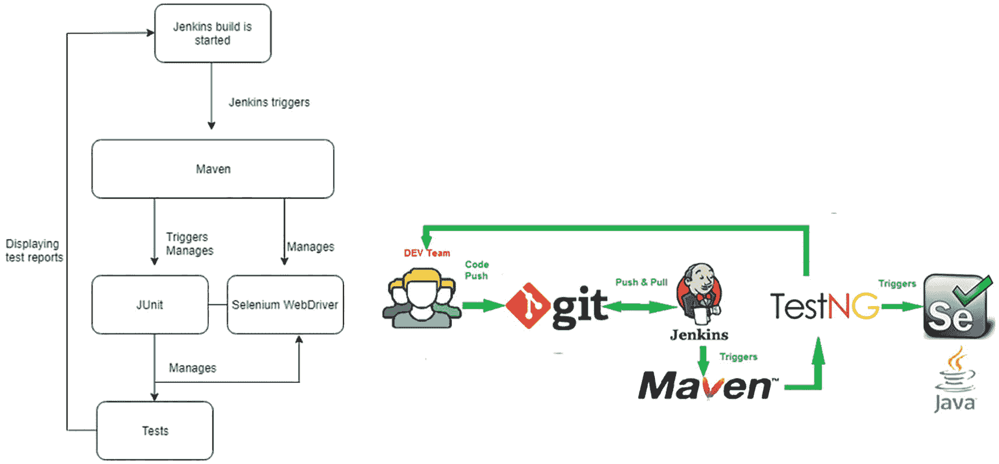

一组 2 个流程图展示了 Maven 构建管理。该过程从触发 Jenkins 构建开始，以测试报告结束。

图 2-15

Maven 构建管理

### 容器化

我们以容器化来结束本节。

由于容器标准化了跨多台机器和平台的部署，它们可以自然地加速 DataOps 流程，特别是 CI/CD，其中测试和调试过程与外部文件依赖项“隔离”。

容器化带来了许多额外的好处，非常适合构建健壮的生产级 AI 解决方案，包括能够简化和加速开发、部署和应用程序配置过程，提高可移植性、服务器集成和可扩展性，以及提高生产力和联合安全性。

#### Docker 和 Kubernetes

Docker 是本书中将使用的主要容器运行时。Docker 的独特卖点在于它在创建隔离环境以将应用程序作为容器启动和部署时，处理依赖项、多种（编程）语言和编译问题的能力。尽管与虚拟机有许多相似之处，如下图所示，但 Docker 更好地支持多个应用程序共享相同的底层操作系统。Docker 也很快，可以在几秒钟内启动和停止应用程序。PostgreSQL、Java、Apache、Elasticsearch 和 MongoDB 都可以在 Docker 上运行。

虽然本书不会使用它，但容器管理工具 Kubernetes (k8s) 通常用于编排 Docker “实例”。作为一个开源平台，Kubernetes 最初由 Google 设计，可自动部署、管理和扩展容器中的应用程序。

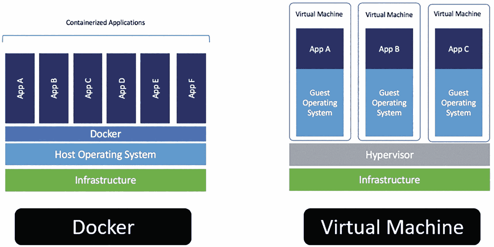

一组 2 个 Docker 和虚拟机的架构图。Docker 由容器化应用程序 a 到 f 组成。主机操作系统参与 Docker，而虚拟机中则涉及虚拟机监控程序。

图 2-16

Docker 架构


### 玩转 Docker：动手实践

#### 玩转 DOCKER

既然我们已经介绍了 CI/CD 环境中的容器和 Docker，接下来让我们看看如何使用 Play With Docker（支持 4 小时免费使用）将一个简单应用容器化的过程：

1.  在 [`https://hub.docker.com/`](https://hub.docker.com/) 注册 Docker 账号
2.  注册并验证邮箱后，登录 Play with Docker：[`https://labs.play-with-docker.com/`](https://labs.play-with-docker.com/)
3.  屏幕打开后，选择“添加新实例”
4.  Play With Docker 屏幕上应会打开一个嵌入式终端

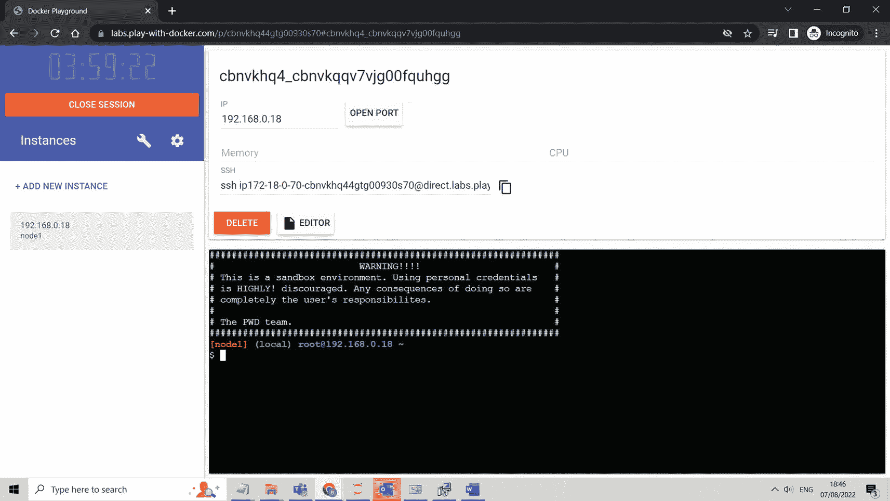

窗口页面截图，Docker 游乐场展示了一个嵌入式终端。页面左侧提供了“添加新实例”和“关闭会话”选项

图 2-17

玩转 Docker

1.  在 PWD 终端中输入以下命令：

```
docker run -dp 80:80 docker/getting-started:pwd
```

这将启动一个容器——点击端口 80 即可打开它

**注意：请使用“ctrl + shift + V”将命令粘贴到 Docker 命令行界面（CLI）中**

1.  该容器是一个 Docker 入门教程。^(³⁷) 请完成教程直至第一部分“我们的应用”结束，该部分将引导你构建一个“待办事项列表”应用

**注意：在构建应用的容器镜像（创建 Dockerfile）时，请使用以下命令：**

1.  练习——完成教程的下一部分“更新我们的应用”，了解如何修改已容器化应用的消息和行为
2.  练习——完成“分享我们的应用”部分，了解如何使用 Docker Hub 上的 Docker 注册表分享 Docker 镜像

```
touch Dockerfile
```

### 测试、性能评估与监控

本章的最后一部分将探讨数据/MLOps 环境中的自动化测试、性能评估和应用监控。

#### Selenium

Selenium 创建于 2004 年，用于自动化 Web 应用的测试操作，是一个支持跨浏览器和跨平台测试的自动化框架，并支持多种语言（Java、C#、Python）。与 DataOps 生态系统中的许多工具一样，它是免费且开源的。

Selenium 不仅是一个单一工具，而是一个软件套件，可根据特定组织的质量保证（QA）需求进行定制，并支持涉及数据管道和分析的重要 DataOps 单元测试流程^(³⁸)。单元测试完成后，持续集成开始，QA 测试人员能够创建测试用例和测试套件，用于逻辑分组的测试用例，包括传输中数据和静态数据。

在 Jenkins 中运行 Selenium 测试允许用户：(a) 每次软件变更时运行测试；(b) 测试通过后将软件部署到新环境。Jenkins 还可以安排 Selenium 测试在特定时间运行，并保存执行历史记录和测试报告。

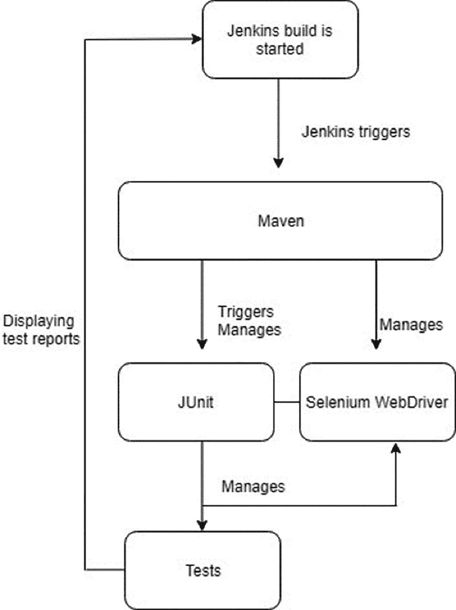

流程图展示了 Jenkins、Maven 和 Selenium 的过程接口。该过程从触发 Jenkins 构建开始，还包括显示测试报告。

图 2-18

Jenkins、Maven 和 Selenium 过程接口

#### TestNG

Selenium 测试脚本可与 TestNG（下一代测试）配合使用——这是一个测试框架，解决了 Selenium Webdriver 中的报告缺口，可在执行后生成默认的 HTML 报告。这些报告（如下所示）标识了测试用例的信息（如通过、跳过或失败）以及项目的整体状态。

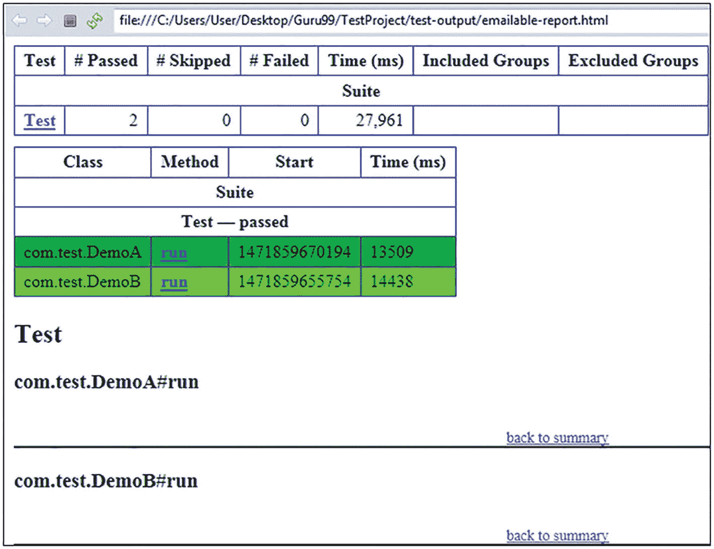

窗口页面展示了 TestNG 报告。该报告显示了测试用例的信息，包括通过、失败、跳过、时间、包含组和排除组。

图 2-19

TestNG 报告

#### 问题管理

问题管理与问题追踪允许项目经理、用户或开发人员记录并跟进数据项目中的问题进度，捕获缺陷、错误、功能请求和客户投诉。问题追踪标准通常包括：

*   重要程度
*   分配的团队成员
*   进度指标

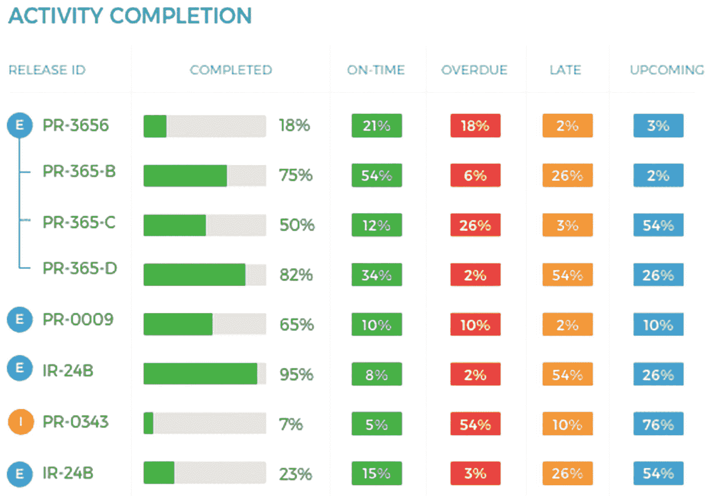

活动完成情况图展示了发布 ID，以及已完成、按时、逾期、延迟和即将到来事项的百分比详情。

图 2-20

软件交付发布——问题追踪（Plutora）

##### Jira

Jira 是最流行的问题（工单）追踪和项目管理工具之一，尽管 Trello、GitHub Boards 和 Monday 也被广泛使用。

Jira 由 Atlassian 开发，已存在多年（2002 年），是一款敏捷项目管理和问题/缺陷追踪工具。它配备了易于使用的仪表板和“无压力”的项目管理功能，包括敏捷交付特性，如团队/用户故事和冲刺监督、Scrum 和看板面板、路线图以及团队绩效报告。

##### ServiceNow

Jira 与 ServiceNow 集成——这是一个工作流自动化解决方案，用于连接组织内的人员、功能和系统。ServiceNow 的产品独特卖点在于提升客户服务并将员工队伍/员工数字化。

下图展示了 ServiceNow 如何在 CI/CD 管道中自动化变更请求工作流。

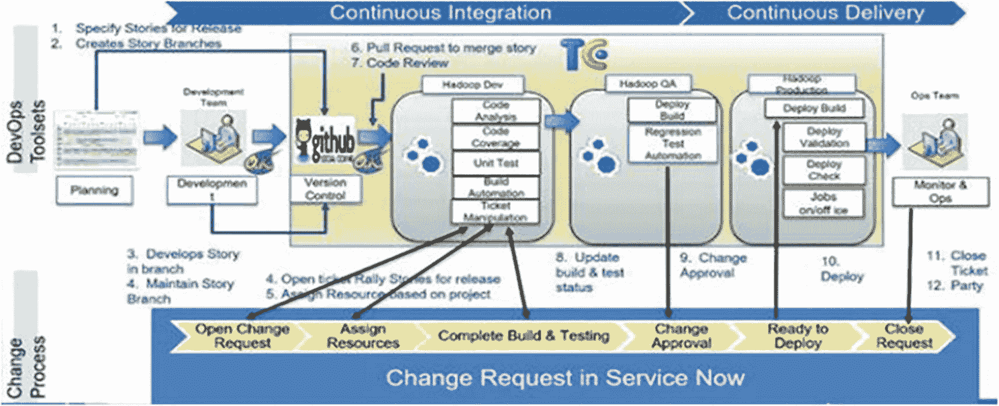

图示展示了使用 ServiceNow 自动化变更请求工作流的过程。该过程涉及分配资源、完成构建和测试、变更审批以及部署。

图 2-21

使用 ServiceNow 在 CI/CD 管道中自动化变更请求

除了明显的自动化生产力优势外，ServiceNow 还通过“AIOps”帮助扩展 IT 能力，跨组织解释遥测数据，并使用机器学习进行例如异常检测等操作。

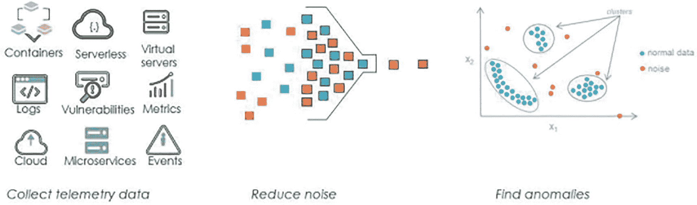

一组 2 个表示图和 1 个 ServiceNow AIOps 图表展示了遥测数据的收集、噪声的减少以及异常的检测。

图 2-22

ServiceNow AIOps – 遥测异常检测


### 监控与告警

当 AI 应用经过全面测试，并建立了问题管理流程后，重点便转向了应用监控——这在 AI 领域至关重要，因为数据变化（数据漂移）会迅速导致模型结果失效或欠佳。

最终目标并非单纯的监控，而是 AI 应用的“可观测性”——即对数据管道和数据“健康度”的更深入理解。最佳的系统在其底层产品中内置了跟踪、告警和推荐功能，并通过统计过程控制（SPC）持续监控和管理数据分析管道。一旦出现异常，分析团队会通过自动告警收到通知。

`Nagios`（下文将介绍）是最流行的应用监控工具之一，但`Databand`的可观测性平台在`DataOps`领域正逐渐获得关注。`Databand`支持数据工程师排查管道故障和数据质量问题——其目标是实现洞察的细粒度、持久性、自动化、普遍性和及时性。

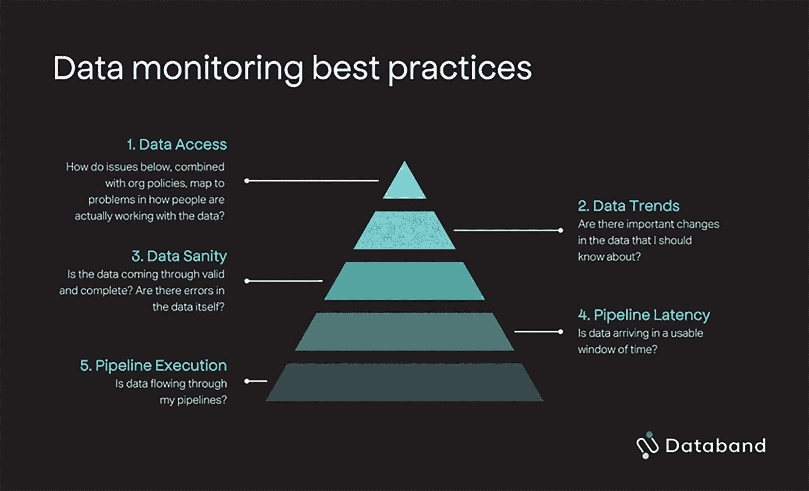

一个金字塔框架解释了数据监控的最佳实践。它包括数据访问、数据趋势、数据合理性、管道延迟和管道执行。

**图 2-23** Databand 应用监控

#### Nagios

`Nagios`监控整个 IT 基础设施，以确保系统、应用程序、服务和业务流程正常运行，并在发生故障时通知技术人员。`Nagios`甚至比`Jira`更早问世，于 1999 年首次发布。

`Nagios`工具套件包括企业服务器和网络监控软件（`Nagios XI`）、集中式日志管理、监控和分析（`Nagios Log Server`）、基础设施监控（`Nagios Fusion`），以及带带宽利用率的 Netflow 分析（`Nagios Network Analyzer`）。

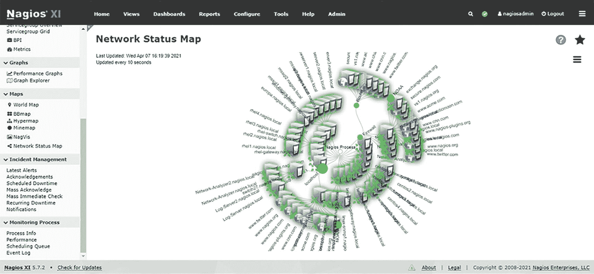

`Nagios XI`的一个窗口页面展示了网络状态图。它每 10 秒更新一次。左侧是图表、地图、事件管理和监控流程选项。

**图 2-24** Nagios XI

### Jenkins CI/CD 与 Selenium 测试脚本：动手实践

**持续测试**

接下来是我们本章最后一个专注于 CI/CD 和测试的实验，这个内容丰富的实验将向读者介绍 Azure 上的`Jenkins`以及如何运行`Selenium`测试脚本。`Maven`集成也作为练习包含在内：

1.  通过以下链接创建虚拟机。这也会创建一个存储资源，可能会产生少量月度费用^(³⁹)

    [`https://portal.azure.com/#cloudshell/`](https://portal.azure.com/%2523cloudshell/)

2.  将 CLI 设置切换为 Bash，并按照以下链接中的步骤 3-9 操作

    [`https://docs.microsoft.com/en-us/azure/developer/jenkins/configure-on-linux-vm`](https://docs.microsoft.com/en-us/azure/developer/jenkins/configure-on-linux-vm)

    **注意** 你可能需要将 Azure 区域（在`az group create`命令中引用）替换为更近的数据中心

3.  按照上述链接中第 4 节“配置 Jenkins”的步骤配置`Jenkins`

4.  继续执行第 5 步“创建您的第一个任务”

    **注意** 项目主页最终出现可能需要一些时间（10-15 分钟）

5.  继续执行第 6 步“构建示例 Java 应用”

6.  通过以下方式执行 Selenium 脚本：
    1.  从[`www.eclipse.org/`](http://www.eclipse.org/)下载 Eclipse IDE。`Eclipse`是用于 Java 开发的流行 IDE。
    2.  按照此链接中的步骤 1-7 操作：
        [`https://q-automations.com/2019/06/01/how-run-selenium-tests-in-jenkins-using-maven/`](https://q-automations.com/2019/06/01/how-run-selenium-tests-in-jenkins-using-maven/)
    3.  对于上述第 8 步，将所有依赖项添加在`<project>`标签内
    4.  对于第 9 步，需要`TestNG`插件，可从链接下载：[`https://marketplace.eclipse.org/content/testng-eclipse`](https://marketplace.eclipse.org/content/testng-eclipse) 并拖放到 Eclipse 工作区中^(⁴⁰)
    5.  完成步骤 10-13

7.  练习 – 尝试将你的 Selenium 脚本推送到 GitHub。先将源代码推送到 GitHub，然后从 Jenkins 连接到仓库。**注意** 要将 GitHub 集成到 Jenkins，请按照此处“配置 GitHub”和“配置 Jenkins”的步骤操作：[`www.blazemeter.com/blog/how-to-integrate-your-github-repository-to-your-jenkins-project`](http://www.blazemeter.com/blog/how-to-integrate-your-github-repository-to-your-jenkins-project)

8.  练习 – 对于 Maven 集成，尝试按照此处“将测试集成到 Jenkins”下的步骤操作：[`https://qautomation.blog/2019/06/01/how-run-selenium-tests-in-jenkins-using-maven/`](https://qautomation.blog/2019/06/01/how-run-selenium-tests-in-jenkins-using-maven/)^(⁴¹)

9.  练习 – 要集成所有三个工具：Jenkins、Maven 和 Selenium，请按照此处“将测试集成到 Jenkins”下的步骤 1-12 操作：[`https://q-automations.com/2019/06/01/how-run-selenium-tests-in-jenkins-using-maven/`](https://q-automations.com/2019/06/01/how-run-selenium-tests-in-jenkins-using-maven/) 并注意以下几点：
    1.  对于第 6 步，在“根 POM”下输入：`C:\Users\[你的用户名]\eclipse-workspace\SeleniumScript\target`
    2.  在“目标和选项”下输入以下内容：
    3.  `test -Dsurefire.suitXmlFiles=" $TestSuite" -Dbrowser="$BROSWER" -DURL="$APP_URL"`
    4.  对于第 7 步，你需要 HTML Publisher 插件。转到`Manage Jenkins > Manage Plugins`，选择`Available`选项卡，输入`HTML Publisher`并勾选复选框
    5.  下载/立即安装并重启 Jenkins

    现在，在以上 q-automations 链接中第 2 步创建的任务的`Build Settings`选项卡（以及`Post Build Actions`）下，应该会出现“发布 HTML 报告”的选项。

### 总结

完成了关于持续测试工具和接口的最后一个实验后，我们结束了本章关于`DataOps`的内容。从敏捷开发，到代码仓库、CI/CD、测试和监控，这里的重点一直是理解利益相关者关系、端到端流程、工具生态系统和集成环境，以便在本书后续部分“构建”我们的 AI 解决方案。

下一章将借鉴`DataOps`的经验，并将最佳实践应用于 AI 项目实施的最初（也可能是最关键）阶段之一：数据摄取。

脚注 1   2   3   4   5   6   7   8   9   10   11   12   13   14   15   16   17


