# 3. 面向人工智能的数据摄取

从历史上看，在实施任何软件解决方案之前，一个全面的范围界定工作会围绕相关人员或利益相关者、业务流程和工具，或“现状”架构格局来捕获需求。如今，任何具有韧性的 AI 项目都必须捕获一个额外的、或许也是最重要的因素：数据。因此，本章的目标是介绍最佳实践以及正确的（云）数据架构和编排需求，以确保 AI 项目的成功交付。

本章首先探讨数据摄取过程，研究所使用的数据类型，以及方法、存储考量如何随计划/批处理数据和流式/事务数据而变化，然后介绍可供 AI 工程师使用的云计算服务和 API。

接着，我们将探讨面向 AI 的数据存储，从需求收集和创建数据字典的过程开始，然后介绍处理 OLTP/OLAP 数据源的最佳实践，以及可供我们使用的数据存储类型。

我们的第三部分将介绍用于摄取和查询流式数据以及存储分析/批处理数据的云服务和工具，以便为下游的企业分析和商业智能团队提供服务。最后，我们将总结如何编排所有这些数据、管理数据存储的企业策略、将数据导入机器学习和深度学习模型的过程，以及在 AI 项目中，对数据整理和模型选择过程实现完全自动化日益增长的需求。

## 数据摄取简介

那么，什么是数据摄取？简单来说，它是一种导入数据的方式，但在数据消费无处不在的时代被重新定义。在这个时代，丰富的数据集（理想情况下是预先标记好的）可以使组织的服务、产品和促销活动与竞争对手区分开来。

更正式地说，数据摄取是将数据从源端移动到目标端的过程，数据可以在目标端进行存储和进一步分析。在本章的过程中，更细致的定义会逐渐清晰，但我们首先从审视当前全球数据需求开始。

### 数据摄取——当今的挑战

如今，源数据有多种不同的格式，从关系型或 RDBMS SQL 类型的数据库到非关系型或 NoSQL 数据存储，从`csv`和文本文件到 API 连接或流式数据。适用于大规模数据传输的压缩新格式已经崭露头角，包括`avro`和`parquet`。

IDC 预测，到 2025 年，全球数据将增长到 175 泽字节，如果你习惯用拍字节计算，那就是 1.75 亿拍字节。为了让读者对这个数字有多大有个概念，这相当于 175 万亿个 1GB 容量的 U 盘。^(⁴²) 在这个大数据时代，数据的复杂性和多样性带来了根本性的挑战——无论数据源是什么，数据在摄取后几乎总是需要清洗和转换。

所有这些数据都需要一个愿景，理想情况下需要数据策略和数据专家。如今，大多数公司都认识到三个关键的数据优先级：

*   数据摄取/下游处理的速度
*   合规性与安全性
*   成本

### AI 阶梯

回顾我们之前失败的 AI 项目，最大的失误之一在于一开始就没有正确定义数据策略。如果没有一个架构化的数据摄取解决方案，开展 AI 项目是毫无意义的；换句话说，没有信息架构（IA），就没有人工智能（AI）。

在更广泛的生态系统中，解决项目中大数据差距的较好工具之一是 IBM 的 AI 阶梯方法论（如图 3-1 所示），该方法侧重于数据摄取的最佳实践，以此作为企业加速其 AI 之旅的手段。该方法旨在强化“没有 IA 就没有 AI”这一信息，并专注于通过**在多云环境中统一数据**（IBM 在 2022 年的核心卖点之一）来释放价值。这种“数据湖”式的设置旨在产生以下四个关键价值杠杆：

*   **收集**数据：使数据无论位于何处都能简单易取
*   **组织**数据：创建业务就绪的分析基础
*   **分析**数据：以信任和透明度构建和扩展 AI
*   **注入**AI：将 AI 注入整个企业，创建智能工作流（CRPA）

我们将在后续章节进一步讨论数据湖，但在此之前，我们先探讨 AI 数据摄取中的一些关键概念。

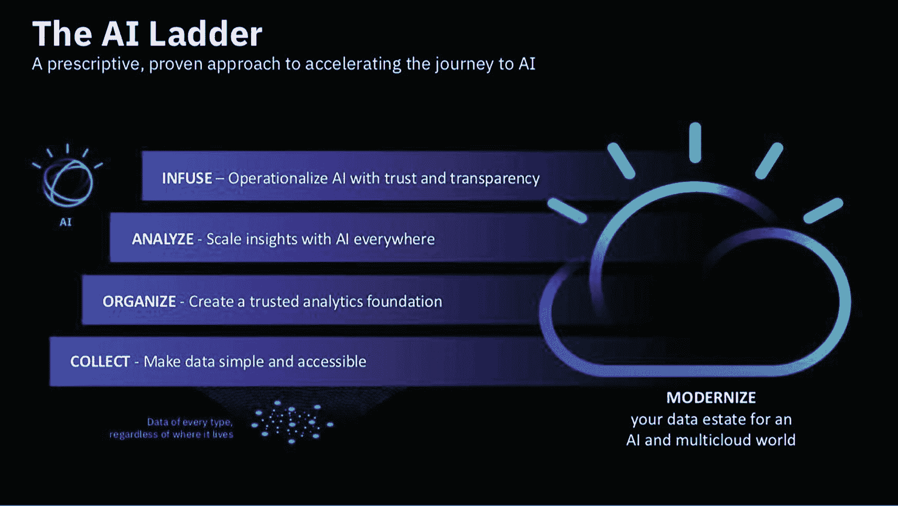

AI 阶梯的示意图，旨在展示加速 AI 之旅的方法，并展示了 4 个关键价值杠杆。它包括注入、分析、组织和收集。

**图 3-1** IBM 的 AI 阶梯

### 云架构/云“堆栈”

成功的 AI 需要端到端的云基础设施，我们在第 1 章中看到，存储和计算是 AI 项目中用于大数据处理的主要基于云的服务。

从架构角度来看，存储、计算和数据摄取是企业解决方案架构的基本方面，该架构旨在支持数据管道和下游分析过程。如果采用 Xenonstack 的模型，大数据架构通常包含六个层次：

*   **数据摄取层** – 连接数据源，对数据进行优先级排序和分类
*   **数据收集层** – 将数据传输到数据管道的其余部分
*   **数据处理层** – 处理、路由和分类数据
*   **数据存储层** – 根据数据大小处理存储
*   **数据查询层** – 从存储层收集数据，这次用于主动分析处理
*   **数据可视化层** – 将数据整合为高价值的呈现格式

这些层次很重要，因为它们最终定义了消费数据的最终用户的主要关注点。

### 计划性（OLAP）与流式（OLTP）数据

所有企业中的数据处理，本质上都可以看作是计划性（批处理）或聚合数据与实时（流式）处理事务数据的组合。传统上，这两种数据类型分别被称为 OLAP（在线分析处理）和 OLTP（在线事务处理），其主要目标要么是处理数据（OLTP），要么是分析数据（OLAP）。

聚合的批处理数据会按照定期计划的时间间隔被导入（并存储，例如在数据仓库中）——非常适合用于日终报告或管理报告。另一方面，流式处理是一种“即用即弃”的方法，对时间敏感的数据进行近实时处理，然后大部分被丢弃。当今许多超高速的数据消费，尤其是通过移动/手持设备消费的数据，都是以流式数据的形式进行的，例如物联网传感器数据、股票价格变动和智能电表信息。

最终，当今的组织必须划分其数据需求和架构版图，以决定哪些数据作为批处理数据处理，哪些作为流式数据处理。图 3-2 中的简化表示展示了大多数组织如何处理需要存储的流式数据：将其推送到企业数据仓库中。

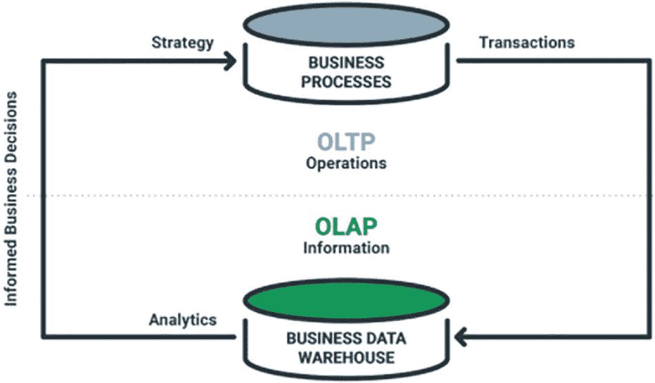

该图展示了业务流程和企业数据仓库的 OLTP 操作与 OLAP 信息。此外，它还包含了分析、策略和事务。

图 3-2

[`verticaltrail.com`](http://verticaltrail.com)

如今，**Lambda 架构**和**微批处理**是存储和促进批处理及实时数据摄入处理的重要概念。

#### API

除了远程数据库和原始日志之外，当今连接 OLTP 和 OLAP 数据最常见的方式之一是通过 API（应用程序编程接口）。本质上，API 是一个软件中介，允许两个应用程序相互通信。下面的示例展示了 Amazon API Gateway 的使用，它是 Amazon Web Services 的关键组件，也是通过 REST、HTTP 或 WebSocket API 以及 AWS Kinesis 将流式数据从网络摄入到 AI 应用程序中的方式。

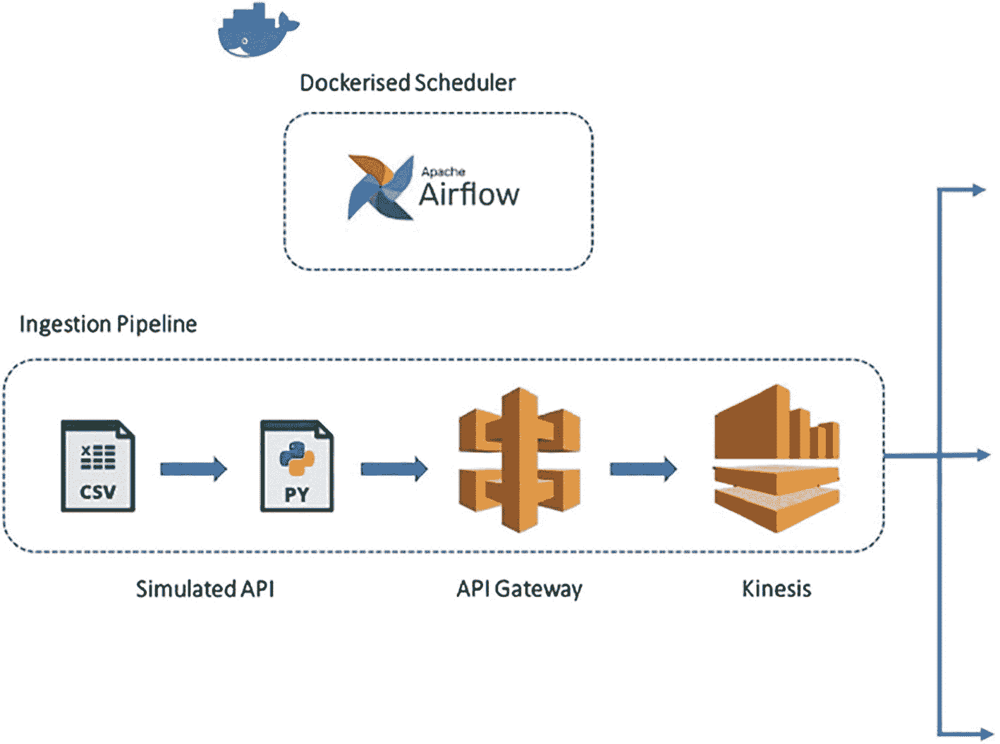

该图展示了为 Amazon API Gateway 确定的数据摄入管道。该过程包括模拟 API、API Gateway 和 Kinesis。

图 3-3

通过 AWS API Gateway REST API 进行数据摄入

### 数据类型（结构化与非结构化）

批处理与流式是当今数据摄入的一个视角，但**结构化与非结构化**在 2022 年可以说更为重要，在数据战略中掌握这两者，往往是区分一个敏捷企业能否快速从数据中识别增值机会的关键。

**结构化数据**是在放入数据存储之前，已按照预定结构进行预定义和格式化的数据。这是自计算机问世以来大多数业务用户所熟悉的表格数据；`csvs`和`excel`是结构化数据的例子。

**非结构化数据**是以其原始、原生格式存储的数据，通常在使用前才进行处理。当今 AI 领域对非结构化数据的兴趣激增，源于其能够更快地积累数据以及其固有的丰富特征组成；`pdfs`和图像是非结构化格式。

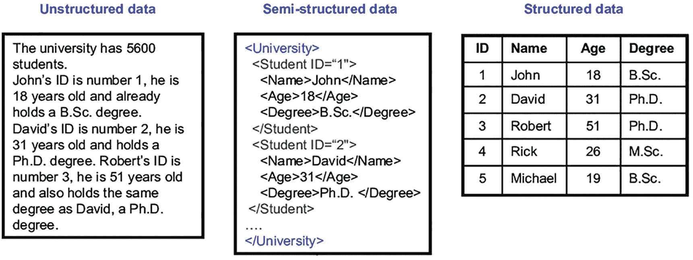

一组 3 个表示非结构化数据、半结构化数据和结构化数据的图示。非结构化数据是以原始形式存储的数据。结构化数据以表格形式表示。

图 3-4

非结构化、半结构化和结构化数据

### 文件类型

我们通过更深入地了解文件格式来结束对数据摄入的介绍。如何将大数据存储在现代化数据存储中至关重要，任何解决方案架构师都需要考虑数据的底层格式、压缩方式，以及如何利用分布式计算/如何以最快、最优的方式对数据进行分区。

传统的文件格式，如`.txt`、`.csv`和`json`，已经存在了几十年，因此我们假设读者对此已熟悉。较新的格式，如`avro`、`Parquet`、`Apache ORC`、`tr.gz`和`pickle`格式，则随着集群（一组远程计算机）在大数据处理中的快速应用而涌现。

**Apache Parquet**是 Apache Hadoop 生态系统中的一种开源列式数据存储格式。作为一种二进制格式，它通过将重复的数据结构存储为列来实现更高的压缩率。Parquet 包含关于数据内容的元数据，例如列名、压缩/编码、数据类型和基本统计信息。像 Parquet、ORC 和 Hadoop RCFile 这样的压缩列式文件具有较低的存储需求，并且由于读取速度快（尽管写入速度慢），非常适合在查询执行期间实现最佳性能。我们将在本节末尾的实验室中进一步了解`parquet`格式。

**Avro 文件**是一种基于行的二进制文件，其模式以字典（特别是 JSON）格式存储。Avro 文件通过管理添加、缺失和更改的字段，支持强大的模式演化。由于它们是基于行的，Avro 或 JSON 非常适合 ETL（提取、转换、加载）暂存层。

这些文件格式与`csv`和`json`的比较总结如图 3-5 所示。

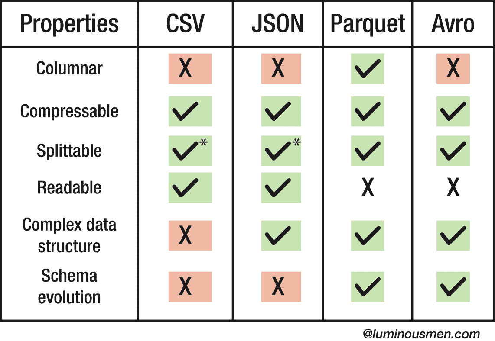

该表格总结了与 CSV、JSON、Parquet 和 Avro 相比的文件格式特性。包含的属性有：列式、可压缩、可分割、可读性和模式演化。

图 3-5

大数据文件格式的特性（[`luminousmen.com`](http://luminousmen.com)）

**另外两种重要的格式，Pickle**和**HDF5**^(⁴³)（分层数据格式第 5 版），常用于 Python 中，通常用于存储训练好的模型。两者速度都很快——尤其是`pickle`，但其缺点是占用更多的存储空间。HDF5 对大型（异构）数据有更好的支持，它以分层（类似目录/文件夹）结构存储数据，并以类似于`parquet`文件的方式压缩重复数据。

### 自动化数据摄入：动手实践

在简要介绍了 AI 数据摄入之后，我们现在进入第一个关于数据摄入的动手实践。

PYTHON 数据摄入——天气数据

**本练习的目标是使用 Jupyter Notebook 中的 Python，自动化摄入（实时的）半结构化天气数据，然后转换并提取温度数据**^(⁴⁴)**以用于预测。**

1.  克隆下面的 GitHub 仓库

[`https://github.com/bw-cetech/apress-3.1.git`](https://github.com/bw-cetech/apress-3.1.git)

2.  按照以下步骤运行代码：
    1.  导入 Python 库
    2.  连接到英国气象局数据
    3.  执行“递归整理”以提取 D 到 D+7 天（白天和夜间）的温度预测
    4.  整理并呈现一个包含预测温度的 Pandas 数据框表格

### 使用 Parquet：动手实践

医疗保健领域的大数据压缩与扩展

**我们在本节前面部分介绍了 parquet 文件如何利用列式格式进行数据压缩。在本实验中，我们将探讨如何处理这些文件。**

1.  克隆下方的 GitHub 仓库

    [`https://github.com/bw-cetech/apress-3.1b.git`](https://github.com/bw-cetech/apress-3.1b.git)

2.  从下方链接下载美国 CDC（疾病控制与预防中心）数据集：

    [`https://catalog.data.gov/dataset/social-vulnerability-index-2018-united-states-tract`](https://catalog.data.gov/dataset/social-vulnerability-index-2018-united-states-tract)

    **注意：上述文件大小为 201 MB，因此在良好的网络连接下（8 GB 内存笔记本电脑，约 50 Mbps 宽带下载速度）可能需要长达 10 分钟才能下载完成。**

3.  在 Google Colab 中运行代码：

    1.  导入用于处理 Parquet 的库（此处为 Apache Arrow 的 `pyarrow` 库）

    2.  上传上面下载的 CDC 数据（由于文件大小，此过程可能需要长达 30 分钟）

    3.  执行基本的 EDA（数据维度/行列数、数据类型以及前五行等）

    4.  挂载 Google Drive 以准备保存 Parquet 文件

    5.  将 `Pandas DataFrame` 转换为 parquet 格式——压缩至 75 MB。注意：这可以直接完成，无需先转换为 Arrow 表

    6.  重新读取 Parquet 文件

    7.  对 parquet 数据重复 EDA 步骤以验证数据

4.  练习——最后尝试在 Microsoft Power BI 中打开 parquet 文件（`获取数据` ➤ `Parquet` ➤ `连接`^(⁴⁵)），并显示下图所示的亚利桑那州各县总平方英里面积的树状图。

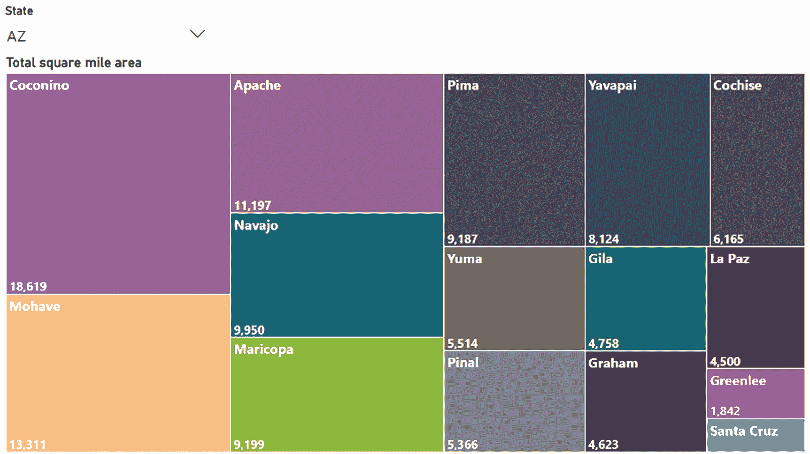

该图展示了亚利桑那州 15 个县的总面积（平方英里）。其中，可可尼诺县（18,619 平方英里）和莫哈维县（13,311 平方英里）是面积最大的两个县。

**图 3-6** PowerBI 中的 Parquet 数据可视化

## 面向 AI 的数据存储

AI 解决方案的数据摄取需要存储，无论是临时存储还是固定存储。下一节将详细阐述存储数据时需要考虑的重要因素，例如定义数据需求、我们需要哪种类型的数据存储、数据湖与数据仓库、OLAP 与 OLAP、ETL 与 ELT、SQL 与 NoSQL，以及弹性与可扩展性的概念。

### 数据存储：数据湖与数据仓库

**数据存储**是指用于在整个企业中存储、管理和分发数据的存储库。通常，这指的是许多最终用户依赖的生产数据库，例如 CRM 或 ERP 系统。

广义上讲，当今大多数企业主要使用三种**数据存储**：

*   **数据湖** – 数据湖大约在过去十年间出现，正日益成为大多数数据驱动型组织的首选系统。数据湖是一个单一的存储库，用于存储原始、多格式的数据源，包括结构化和非结构化数据。数据湖在设计上能更好地管理数据的四个“V”：多样性、速度、容量和真实性（完整性），并通过其持续刷新多个数据流同时优化性能和拓扑结构的能力来衡量。数据湖也有缺点——数据编目更加困难，并且由于缺乏数据治理以及有时难以处理的数据源/模型，导致了“数据沼泽”这一术语的出现。

*   **数据仓库** – 数据仓库是干净、组织有序的数据存储，通常被设计并用作企业数据的“单一事实来源”。它们最常与组织成“模式”的结构化数据类型相关联，但现代数据仓库拥有更多功能，包括存储非结构化格式，并且数据可以组织为现有数据湖之上的视图模式。

*   **数据集市** – 数据集市通常是数据仓库的过滤和/或聚合子集。数据集市便于进行简单、有限场景的查询，并拥有更小的模式，包含聚焦的表格数据，以实现更快速的下游分析/BI。

以上显然是“数据库”风格的数据存储，但请注意，组织中使用的任何文件系统/硬盘驱动器也是数据存储的示例，其中包含用于 AI 的额外丰富数据集（例如图像、PDF 以及列式格式/平面文件）。

#### 湖仓一体

许多公司看到了同时维护数据湖和数据仓库以满足特定组织需求的好处。因此，湖仓一体作为一种结合了两者最佳特性的新型开放架构被引入也就不足为奇了。示例包括 **Databricks Lakehouse Platform**、**GCP BigLake**，而 **Snowflake** 至少在一定程度上被认为是一个数据湖仓。也许更有趣的是 **Delta Lake**^(⁴⁶)——一个开源项目，它支持在数据湖之上构建湖仓一体架构。

鉴于“企业目标”是拥有尽可能灵活和高效的数据存储系统，拥有多个独立的数据湖、数据仓库和数据库的想法似乎是最有效的解决方案，但成本开销和多个集成点会带来复杂性和延迟。

湖仓一体试图通过使用类似于数据仓库的数据结构和数据管理功能，同时拥有类似于数据湖的低成本存储选项来避免这些问题。

### 界定项目数据需求

尽管通常可以选择数据来源，但认真在数字时代竞争的企业需要在源头“挖掘”数据——传统的“ETL”方法已不足以应对。

摄取数据的最佳实践通常包括：

*   “挂载”数据源

*   从主要来源摄取数据，而非通过中间件

*   寻求“原子级”数据，而非聚合/汇总数据

除了确保企业能够直接连接到原始数据源之外，还应采用 DataOps/敏捷方法来界定底层业务/组织的数据需求。一种方法是在“数据字典”中捕获需求——这是一个极好的工具，用于捕获范围，并随后交付低（MVP）和高保真度的 AI 解决方案。

一个结构良好的数据字典有助于：

*   利益相关者达成一致、获得支持以及项目签署

*   术语定义和数据类型定义

*   收集和分类对数据项目成功至关重要的数据

*   对来自结构化和非结构化数据以及在线、离线、移动端源的属性进行分类/映射

*   快速检查用于连接数据的主键

*   隔离异常情况和数据流冲突

*   记录使用新数据源的经验

*   持续的数据维护

### OLTP/OLAP – 确定最佳方法

鉴于所有项目的数据需求最终都归结为 OLTP 和 OLAP 源，最佳方法是什么？历史上，OLTP 数据库会通过 ETL 过程（下一节将详细介绍）被摄取到 OLAP 系统中，但随着从源头获取数据的需求日益增长，我们通常需要获取“原始”形式的数据，即访问数据湖而非数据仓库。

通常，我们应该为每个下游分析/BI 或 AI 需求确定前三到五个业务优先级，以决定如何存储/获取我们的数据：

*   OLTP：如果速度/响应时间是关键

*   OLAP：如果管理/战略洞察更为重要

### ETL 与 ELT

如前所述，历史上通常使用 ETL（提取、转换、加载）流程将数据从源系统导入数据仓库/数据库。在许多情况下，这种方法仍然是首选，因为它能将数据固有地转换为结构化的、固定模式的、关系型数据库格式，并且一旦完成数据转换的开销，就能对预处理后的数据进行更快、更直观的分析。ETL 方法通常也更适用于将数据存储从本地迁移到云端。

然而，还有另一种选择，它有时更适合数据湖的底层设计，并且在支持数据科学和人工智能所需的关键数据挖掘和特征工程任务方面更加灵活。

在这种替代性的 ELT 流程（提取、加载、转换）中，数据被提取后，首先直接加载到存储层，而不进行任何转换。

由于我们可以直接查询已加载到数据库中的数据，因此 ELT 流程是将原始数据暴露给最终用户进行分析、商业智能或人工智能的最快方式。然而，通常还需要进行一些“轻量级转换”，用于：

-   列选择（我们不需要整个数据源）
-   隐私保护——某些字段可能需要被过滤或哈希处理，例如，个人身份信息 (PII)
-   增量提取——仅上传新行并处理模式变更

在我们可以将数据可视化（例如，在 BI 平台/GUI 中）之前，还需要进行大量复杂的转换逻辑：从清理数据到删除重复或过时的条目；将数据从一种格式转换为另一种格式；连接和聚合数据，以及排序和排序数据。因此，当对源数据集有（或可以有）更深入的（内部）了解时，ELT 流程更适合探索性分析和数据科学。

ELT 流程是将数据加载到数据湖中的首选方法；由于 ETL 是在没有数据湖的时代开发的，它不太符合现代对直接访问原始数据的需求。

要将数据导入数据湖，需要从源系统（通过 API）提取数据，并且（通常）使用 CSP 或 EL 供应商提供的提取脚本。我们将在关于数据管道的最后一部分中更详细地介绍提取脚本。

### SQL 与 NoSQL 数据库

在讨论这一部分时，我们无法不将上述概念：数据湖与数据仓库、OLTP 与 OLAP、以及 ETL 与 ELT，与 SQL 和 NoSQL 数据库的结构和用例联系起来。

在大多数情况下，关系型或 SQL 数据库用于 OLAP 系统，并使用 SQL 查询来分析数据和提取洞察——SQL 简单而强大的 `JOIN` 子句用于组合多个数据源，至今仍非常流行。

SQL 数据库具有严格的、结构化的数据存储方式，通常包含两个或多个具有列和行的表——它们更像数据仓库而非数据湖。`MS SQL Server`、`MySQL`、`Oracle`、`IBM DB2` 和 `PostgreSQL` 都是符合 ACID（原子性、一致性、隔离性和持久性）的 SQL 数据库，如今被广泛用于支持人工智能项目。

NoSQL，即非关系型数据库，开发于 2000 年代末期，旨在改善扩展性、查询速度，并支持 DevOps 中所需的频繁应用变更。NoSQL 数据库的特点是没有固定模式，其结构基于键值对（JSON 文档）以及节点和边（图数据库），而不是具有固定行和列的表。除了在处理非结构化数据（如图像、文档文件和电子邮件）方面具有无模式的优势外，NoSQL 还非常适合需要海量（PB 级）数据存储需求的分布式数据存储。流行的 NoSQL 数据库示例包括 `MongoDB`、`Redis`、`Neo4j`、`Apache Cassandra` 和 `Apache HBase`，所有现代数据湖和现代数据仓库都包含连接 SQL 和 NoSQL 的连接器。图 3-7 比较了 SQL 和 NoSQL。

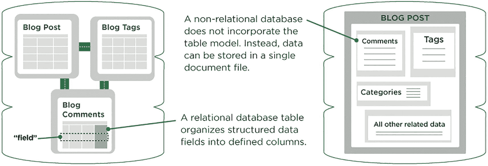

一幅插图展示了 SQL 和 NoSQL 数据库之间的比较。SQL 有一个关系型数据库，包含博客文章、博客标签和博客评论的表。NoSQL 有一个非关系型数据库，存储在一个单一的文档文件中。

图 3-7 SQL 与 NoSQL（Upwork）

### 弹性与可扩展性

本节的最后一个词是关于两个重要概念，它们与使用云的基本业务和组织驱动因素相关，即弹性与可扩展性。

**可扩展性** – 指的是增加“计算能力”，即计算资源以支持**静态**需求和/或容纳更大的**静态**负载的能力：

-   纵向扩展 – 实质上意味着增强硬件
-   横向扩展 – 添加额外的“节点”（更多计算机或虚拟机）

**弹性** – 指的是为当前工作负载**动态**提供必要资源的能力

自然地，这为处于更高（数据）成熟度水平的公司带来了更复杂的能力衡量标准——**弹性伸缩**，即根据不断变化的应用流量模式自动添加或删除计算或网络基础设施的能力。

如今，大多数云服务既具有弹性又具有可扩展性，但成本模型差异很大，并且将 CSP 固有的纵向或横向扩展能力与预测的（甚至实际的）AI 应用使用情况联系起来，仍然迷雾重重。

### 用于 AI 的数据存储：动手实践

现在我们已经了解了关键概念，让我们看看 AWS 云上广泛使用的两种数据存储如何支持 AI 项目。

**AWS 数据管道**

本练习的目标是在 AWS 上创建一个 `DynamoDB` NoSQL 表、一个 `S3`（文件存储）输出桶，以及一个用于将数据从 `DynamoDB` 传输到 `S3` 的 `AWS 数据管道`：

1.  按照以下步骤了解数据如何在 AWS 上的数据存储之间传输：
    1.  添加 `DynamoDB` NoSQL 表
    2.  创建 `S3` 桶
    3.  配置 `AWS 数据管道`
    4.  启动包含多个 `EC2` 实例的 `EMR` 集群
    5.  激活管道
    6.  导出 `S3` 数据

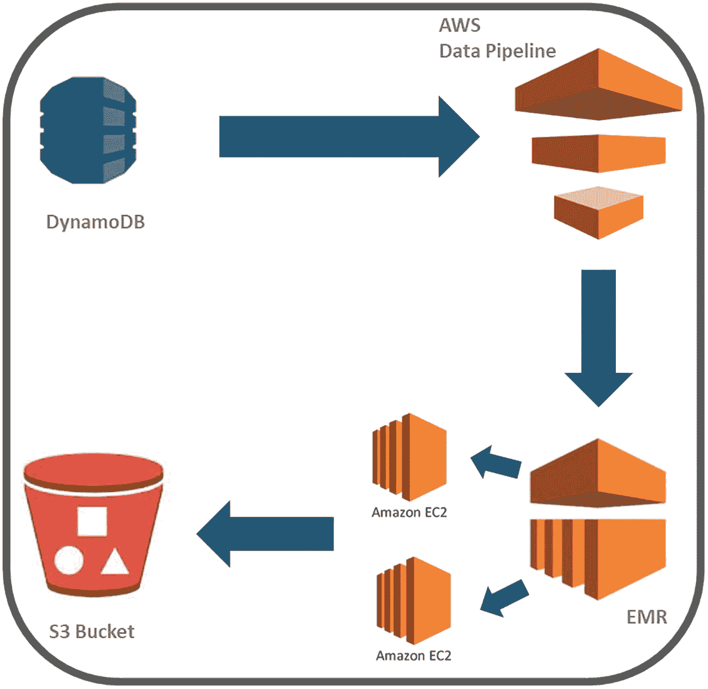

一个数据流图从 `DynamoDB` 开始，经过 `AWS 管道`、`EMR`、多个 `Amazon EC2`，最终到达 `S3` 桶。

图 3-8 用于 AI 的数据存储（动手实践）——数据流

## 用于数据摄入的云服务

在本第三节中，我们将探讨用于摄入和查询流式数据以及存储分析/批处理数据的云服务和工具，以便为下游的企业分析和 BI 团队提供服务。

### 云（SQL）数据仓库

当今企业主要使用四种云数据仓库：

-   **Azure：SQL 数据仓库/Synapse Analytics** – 基于 SQL Server 构建、作为 Azure 云计算平台一部分运行的 PB 级大规模并行处理 (MPP) 分析型数据仓库
-   **AWS Redshift** – 用于使用标准 SQL 跨数据仓库、操作型数据库和数据湖查询和连接 EB 级（1000*PB）的结构化和半结构化数据
-   **GCP BigQuery** – 无服务器、高度可扩展且经济高效的多云数据仓库，支持 ANSI SQL，专为业务敏捷性而设计
-   **Snowflake 云数据平台** – 作为 2020 年有史以来最大的软件 IPO，Snowflake 被引入为一种现代的“无服务器”/SaaS 云数据平台，它运行在 AWS 或 Azure 基础设施之上。它具有显著优势，例如无需选择、安装、配置或管理任何硬件或软件，非常适合不希望为内部服务器的设置、维护和支持投入资源的组织。

其他值得注意的包括 `IBM Db2`（适合机器学习）、`Oracle`（适合自动化）、`SAP`（适合传统 SAP 用户）和 `Teradata Vantage`（良好的 CSP 集成）。

### 数据湖存储

**Microsoft Azure 数据湖存储 (ADLS) 或 Gen2** 被宣传为用于大数据分析的下一代数据湖解决方案。它构建在 Azure Blob（二进制大型对象）存储之上，特别适用于海量非结构化数据，包括流式视频和音频，这些数据被容器化在组织的存储帐户中。

`ADLS` 是一个完全托管、弹性、可扩展且安全的文件系统，支持 HDFS 语义，并与 Apache Hadoop 生态系统协同工作。它也是 PowerBI 数据流的底层存储。

**AWS 简单存储服务 (S3)：** 在 Amazon Web Services 上，`S3` 是在 AWS 上构建数据湖的首选存储服务。`S3` 安全、高度可扩展且持久耐用，能够摄取结构化和非结构化数据，并对数据进行编目和索引以供下游分析，如今被广泛应用于许多分析项目和机器学习应用程序中作为底层数据存储。当需要块存储时，会使用 Amazon Elastic Block Store (`EBS`)（与 Azure Blob 存储相当）。

**Google BigLake**：BigLake 最近作为 GCP 上全新的跨平台数据存储引擎推出。

#### Hadoop

Apache Hadoop 是事实上的框架，允许跨集群对大型数据集进行分布式处理，本质上是一组用于利用计算机网络解决大数据问题的软件集合。

**MapReduce** 是 Hadoop 的基本编程模型，位于 Apache Hadoop 的核心，用于使用主/从架构处理海量数据（图 3-9）。如图 3-10 所示，它的工作原理是执行 (1) **映射任务**，将数据拆分然后映射为键/值对格式，以及 (2) **归约任务**，将映射后的输出进行混洗并合并成更小的键/值对集合。

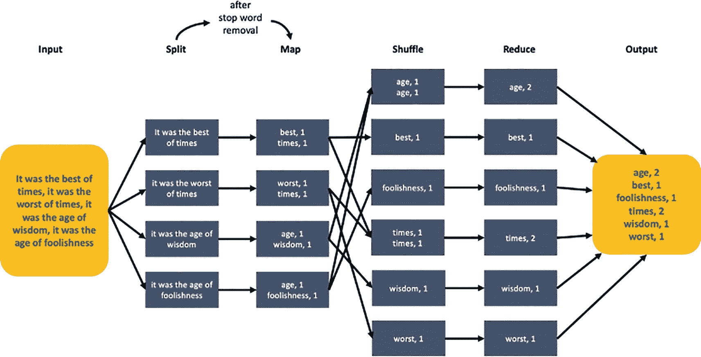

MapReduce 中的流程图。它接收输入语句，然后将数据拆分并映射为键值对。接着，这些键值对被混洗并归约为更小的键值对集合。

图 3-10

使用 Hadoop 跨集群的 MapReduce（来源：[`guru99.com`](http://guru99.com)）

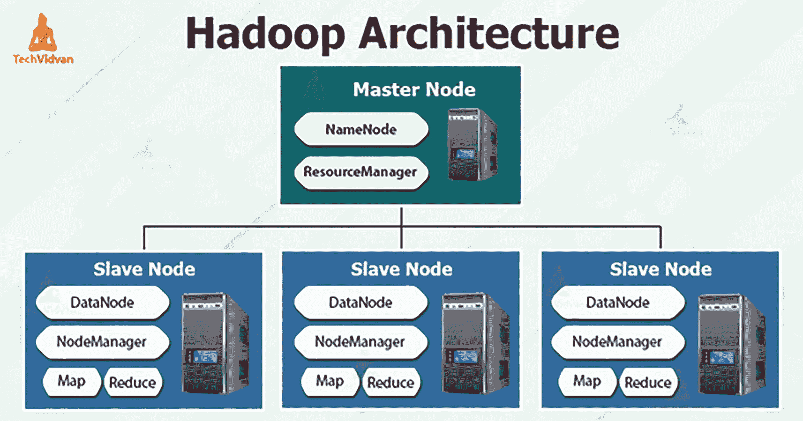

Hadoop 网络架构特点是在一个主节点下有三个从节点。主节点包括一个名称节点和一个资源管理器。每个从节点包括一个数据节点、节点管理器、映射和归约。

图 3-9

Hadoop 架构（元数据存储在 NameNode 中）。MapReduce 算法如图 3-10 所示。

MapReduce 的并行特性使其对于使用（云）集群中的多台机器执行大规模数据分析非常有价值。如今，大多数 CSP 都提供内置在其服务产品中的 Hadoop 大数据处理功能：`AWS EMR`、`Azure HDInsight` 和 `GCP Cloud Dataproc`。

### 流处理与流分析

上述云服务是当今许多业务用户首选的数据存储，但是使用什么工具来将数据从一个数据存储获取/提取到另一个数据存储，或者进入（或离开）AI 应用程序呢？

流处理，或复杂事件处理，是查询连续数据流的过程。在理想情况下，此数据流将是实时的，但实际上，检测时间段从几毫秒（**原生流处理**）到几秒（**微批处理**）不等。

目标通常是尽可能接近“即时”地从数据中获取洞察，因为数据的价值会随时间迅速降低。如果我们考虑一个特定案例：通过温度传感器在温度达到冰点时接收警报，流处理将确定数据读取（和传输）的粒度，例如毫秒或微秒。

如今，许多处理流处理的工具都带有扩展的分析能力——**流分析**。Apache 工具套件：`Apache Storm`、`Sqoop`、`Spark`、`Flink` 和 `Apache Kafka`、`Talend`、`Algorithmia` 以及 `upsolver` 都是具有这些内置功能的流处理框架，`AWS Kinesis` 也是如此。在本书的动手实验中，我们将研究其中三个——用于大数据机器学习的 `Apache Spark`、用于流式传输股票价格数据的 `AWS Kinesis` 以及利用消息代理处理流入 AI 应用程序的流数据的 `Apache Kafka`。

无论是 `Kafka` 还是 `Kinesis`，当今有大量的 AI 用例依赖于实时流技术，包括算法交易、供应链优化、欺诈检测和体育分析。

### 简易数据流：动手实践

本部分第一个实验将探讨如何使用最广泛使用的工具之一——Microsoft Excel 来流式传输数据。

#### 使用 Microsoft Excel 与 Python 流式传输股票价格

**本练习的目标是，在用 Python 抓取最新（科技）股票价格后，利用 Microsoft Data Streamer 作为为 AI 应用搭建流式概念验证（PoC）的最基本方法之一。**

1.  获取 Microsoft Data Streamer 的加载项，方法是打开一个空白 Excel 文件，然后依次选择：
    1.  文件 ➤ 选项
    2.  加载项
    3.  COM 加载项
    4.  转到
    5.  在 COM 加载项对话框中，勾选“Microsoft Data Streamer for Excel”复选框，然后单击“确定”。

2.  从下方的 GitHub 仓库下载实验文件：
    [`https://github.com/bw-cetech/apress-3.3a`](https://github.com/bw-cetech/apress-3.3a)

3.  按如下步骤流式传输示例数据：
    1.  Data Streamer 选项卡 ➤ 导入数据文件
    2.  指向从 GitHub 下载的 `df_eth.csv` 文件
    3.  在 `Data In` 工作表上 ➤ 高亮单元格 `B7:C22`
    4.  按 `alt + F1` 创建图表 – 此时图表将为空白
    5.  Data Streamer 选项卡 ➤ 播放数据

    **您应该能够在图表中看到以时间线形式呈现的流式数据。**

4.  练习：利用 Jupyter Notebook 中下载的 Python 脚本 `StockPriceScraper.ipynb`，导出从 1 月 21 日到前一日（D-1）的实时股票价格（读者可选择要导出的科技股）以及最新的以太坊 EOD 价格。按照上述方法在 Excel 图表中流式传输股票价格。

### 用于数据摄入的云服务：动手实践

在下一个实验中，我们还将探讨如何通过主要的云服务之一来流式传输数据以进行数据摄入。

#### 使用 Python 与 AWS KINESIS 进行流式传输

**本练习的目标是构建一个 Python 脚本，在 AWS 中创建访问密钥、IAM 策略和 IAM 用户，然后连接到 Kinesis 并流式传输股票价格数据。**

1.  创建一个新的（空白）Python 脚本（例如，在 Jupyter notebook、Google Colab 中），并添加此处示例笔记本中所示的 AWS Python 库（`boto3`）：
    [`https://github.com/bw-cetech/apress-3.3`](https://github.com/bw-cetech/apress-3.3)

2.  按照此处步骤 1-4 在 AWS 中创建访问密钥：[`https://docs.aws.amazon.com/IAM/latest/UserGuide/id_credentials_access-keys.xhtml`](https://docs.aws.amazon.com/IAM/latest/UserGuide/id_credentials_access-keys.xhtml)

3.  按照下方步骤 1-7 创建 Kinesis 数据流：[`https://docs.aws.amazon.com/streams/latest/dev/tutorial-stock-data-kplkcl-create-stream.xhtml`](https://docs.aws.amazon.com/streams/latest/dev/tutorial-stock-data-kplkcl-create-stream.xhtml)

4.  按照此处步骤创建 IAM 策略：[`https://docs.aws.amazon.com/streams/latest/dev/tutorial-stock-data-kplkcl-iam.xhtml`](https://docs.aws.amazon.com/streams/latest/dev/tutorial-stock-data-kplkcl-iam.xhtml)

5.  通过此链接创建 IAM 用户：
    [`https://docs.aws.amazon.com/streams/latest/dev/tutorial-stock-data-kplkcl-iam.xhtml`](https://docs.aws.amazon.com/streams/latest/dev/tutorial-stock-data-kplkcl-iam.xhtml)

6.  添加上述示例 Python 笔记本中所示的其余配置步骤，以查看流式数据。

7.  尝试以下“拓展”练习：
    1.  数据开始流式传输后，在 AWS CloudWatch 中查看指标。
    2.  尝试让 DynamoDB 消费数据。
    3.  修改代码，通过 API 接入 Yahoo / Quandl 上的实时股票价格数据。

## 数据管道编排 – 最佳实践

在本章的动手实验中，我们到目前为止已经探讨了建立与天气数据的实时连接，利用云工具（AWS Data Pipeline）将数据从源端推送到目标端（DynamoDB 到 S3 存储桶），以及使用 `boto3`（AWS）库在 Python 中查看通过 Kinesis 的数据流。

本章的总结部分将更深入地探讨将数据流入和流出 AI 应用的最佳实践，并基于这些动手实验，研究如何最佳地构建依赖于 OLTP 或 OLAP 数据（或两者混合）的 AI 解决方案架构。

### 存储考量

在 AI 项目启动时，存储考量应列入优先考虑清单。我们能否仅使用简单的数据库或数据集市，还是需要（如同大多数企业项目一样）与数据仓库或数据湖进行集成？

成本始终很重要，灵活性与敏捷性也同样重要，尤其是在处理非结构化数据源时。在这两种情况下，数据湖通常是首选方案，但数据仓库公司正在改善消费者云体验，并使其更容易以极低的管理开销来试用、购买和扩展数据仓库。

如果安全性是优先考虑因素，AI 项目可能倾向于与具有成熟安全模型的传统数据仓库集成。数据仓库在支持机器学习和 AI 方面也可能更有优势——通常它们对最新数据的“读取”速度比数据湖更快。数据仓库还能减少数据重复，通过模式覆盖提高数据质量，适配可复用的特性和功能，并且在预自动化转换方面表现更佳。

数据科学家百分之八十的工作在于数据准备和数据整理，因此目标“最终用户”会极大地影响方法选择——如果研究与探索性数据分析更符合公司愿景，那么数据湖将为数据挖掘提供更广阔的范围；而如果自动化与解释性数据分析是关键，那么集成应尽可能针对精简的数据库或数据集市。

### 数据摄取调度

在确定数据存储方案后，有效的数据摄取应遵循以下流程：

- 确定数据源的优先级
- 验证单个文件
- 将数据项路由到正确的目标位置

如上述第 2 节所述，记录数据摄取的参数有助于指导流程和持续改进：

- **数据速度** – 源数据的更新频率是多少？
- **数据规模** – 每个相关数据源的存储容量有多大？
- **数据频率** – 我们需要以多高的频率访问数据？是采用批量/分析上传，还是应该采用流式/实时方式？
- **数据格式** – 所有数据都是结构化/表格格式，还是包含半结构化数据（`.json`、`.css`等）或非结构化数据（图像、音频、视频）？

对上述要点进行严格考量，可以构建出性能更优的数据摄取流程和更易访问的数据湖，类似于 Just Eat 公司（使用 Apache Airflow）通过摄取、转换、学习、输出和编排周期所采用的方案。

### 无服务器计算

云上最流行的无服务器组件之一是 AWS Lambda。Lambda 的事件驱动型无服务器计算架构，因其无需管理基础设施且采用按使用量付费的定价模式，使得最终用户能够将更多时间专注于快速构建数据和管道分析。

虽然源端和目标端数据存储显然无法与此流程完全隔离，但无服务器计算可以简化通常为数据摄取配置的复杂告警驱动事件。

### 日终处理

许多企业公司都会执行日终处理（EOD）。特别是在银行和零售行业，例如，门店打烊后的对外开票和收银对账，这些都是关键的业务工作流。

典型的 EOD 流程包括：(a) 更新、验证和过账每日销售信息，以及 (b) 将原始交易聚合为有意义的业务数据。这里的自动化需求，结合作业调度和工作流自动化，非常适合批量处理和数据处理管道编排。这些自动化工作流可能涉及其他（非每日调度的）批量处理，例如季度或年度报告。

### 机器学习和深度学习的数据导入

当今许多 AI 实施项目的目标是实现生产级 AI 模型，通过 EOD 夜间批量处理来自动化整个数据摄取流程/数据管道，具有一些明显的优势：

- 收集数据
- 通过企业消息总线发送数据
- 处理数据（例如，重新训练模型）以提供预计算结果
- 为第二天的运营提供指导

然而，上述流程并未完全满足机器学习/深度学习应用的需求，因为特征和预测具有时间敏感性。例如，Netflix 的推荐引擎、Uber 的到达时间估算、LinkedIn 的好友推荐、Airbnb 的搜索引擎，都需要实时训练，或至少是实时推理（预测）。

机器学习和深度学习的数据摄取需要考虑在线模型分析（实时、运营决策）和离线数据发现（对历史聚合数据进行学习和分析），如图 3-11 所示。

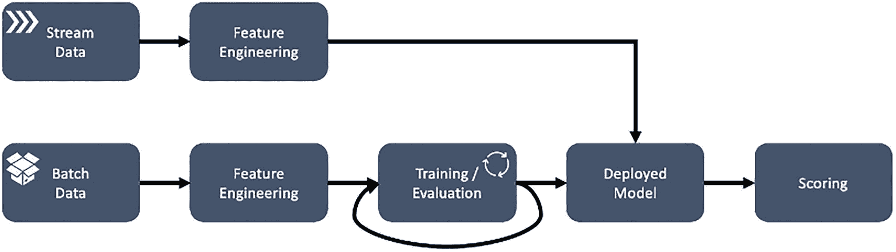

一个包含两条流程的框图。流程 1：将流数据发送至特征工程。流程 2：将批量数据发送至特征工程，再进行训练或评估。这些流程汇合到已部署的模型中，然后进入评分环节。

**图 3-11**

[`towardsdatascience.com`](http://towardsdatascience.com)

### 构建交付管道

那么，我们如何最好地构建数据管道呢？每个项目都不同，但我们可以从一开始就尽最大努力，引导我们走上正确的道路。

我们通过将编排流程分解为一种文档化的方法来结束本节和本章：

**确立业务背景** – 在传统分析架构中构建新的分析管道，通常需要业务、数据工程、数据科学和分析团队之间进行广泛的协调，首先协商需求、模式、基础设施容量需求和工作负载管理。

**定义具体问题** – 业务用户、数据科学家和分析师需要简单、无摩擦、自助式的选项来构建端到端的数据管道，因为预定义不断变化的模式并花时间协商容量槽位既困难又低效。

**寻找“无摩擦”解决方案** – 例如，无服务器数据湖架构能够在共享基础设施上，为公司内所有数据消费者角色提供敏捷且自助式的数据接入和分析服务。

**编写详细解决方案** – 将数据湖中心的分析架构视为由六个逻辑层组成的堆栈会很有帮助，每一层都有多个组件：

- 摄取层
- 存储层（包含三个独立的“区域”）
  - 原始区域
  - 清洗区域
  - 精选区域
- 编目与搜索层
- 处理层
- 消费层
- 安全与治理层

由于没有“万能方案”，我们在下面展示了四个健壮的数据摄取架构和管道的示例，这些架构和管道旨在更好地服务、加速和扩展 AI 与分析解决方案。

#### 示例：XenonStack

XenonStack 的大数据摄取架构包含六个关键层：摄取层、收集层、处理层、存储层、查询层和可视化层。

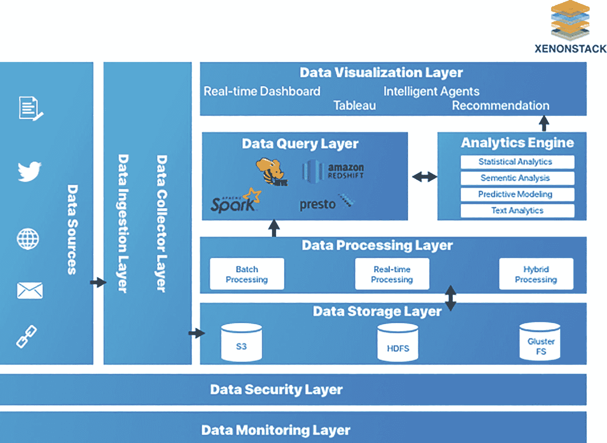

一个 XenonStack 大数据摄取架构包含 6 个不同的层：数据可视化层、数据查询层、数据处理层、数据存储层、数据收集层和数据摄取层。

**图 3-12** – XenonStack 大数据摄取架构

#### 示例：Red Hat/IBM

Red Hat 的摄取数据管道，结合了对象存储和 Kafka 流处理。

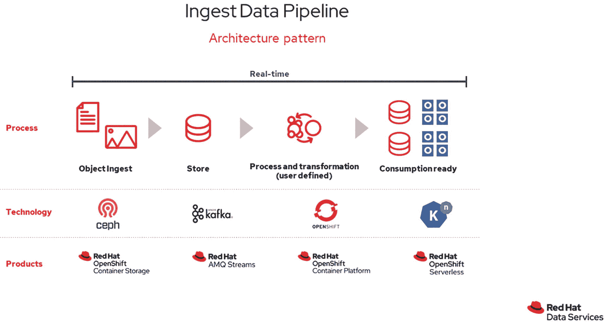

一个架构模式展示了 Red Hat 数据管道摄取的流程、技术和产品。该流程包括对象摄取、存储、处理与转换，以及消费。

**图 3-13** – Red Hat 数据管道摄取

#### 示例：AWS 无服务器架构

AWS 无服务器架构 – Lambda 是关键（无服务器）组件，但通过接口与 AWS Glue 连接，以使用 Scala 或 Python 运行大型工作负载。下方还展示了一个更通用的 AWS 数据摄取架构图，其中涉及更广泛的 AWS 资源配置。

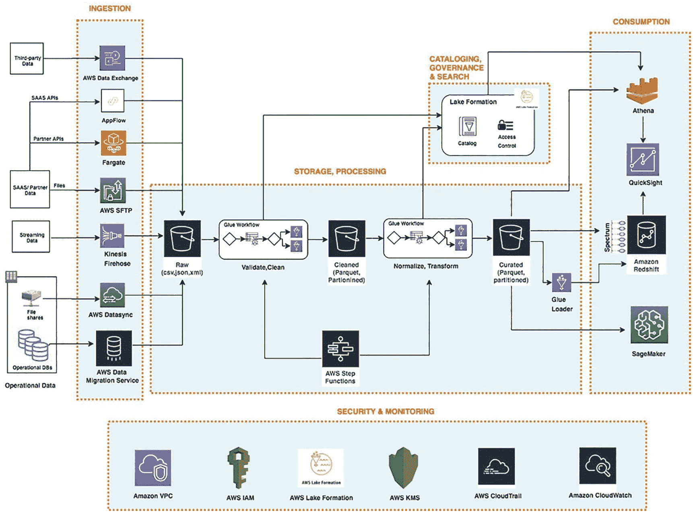

一个用于数据摄取的 AWS 架构。该流程包含 5 个阶段：1. 摄取；2. 存储与处理；3. 编目、治理与搜索；4. 消费；5. 安全与监控。

**图 3-15** – AWS 数据摄取

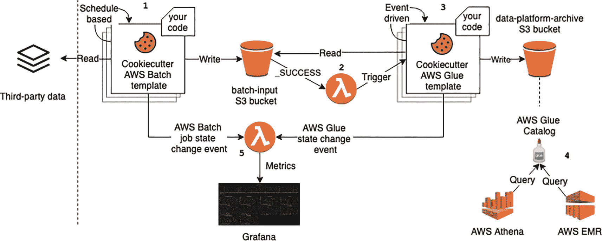

一个 AWS 无服务器架构将 Lambda 视为数据摄取的关键组件。该流程涉及第三方数据、cookie cutter AWS 批量模板、批量输入 S3 存储桶等。

**图 3-14** – 用于数据摄取的 AWS 无服务器（Lambda）架构

#### 示例：Databricks 与 Apache Spark

这个 Databricks 示例展示了 Apache Kafka 和 Spark 如何协同进行流式分析以及 AI/BI 报告。Databricks 与 Apache Spark 是本章最后一个动手实验的主题。

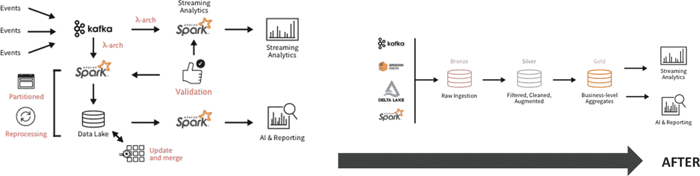

一个 Databricks 示例。该流程涉及 Kafka、数据湖和 Spark 的分区、重新处理、更新与合并、验证、流式分析以及 AI 与报告。

**图 3-16** – Databricks 与 Apache Spark

### 示例：Snowflake 工作负载管理

最后，图 3-17 展示了 Snowflake 的架构，该架构旨在确保数据管道性能与企业环境中的工作负载管理和资源竞争保持一致：

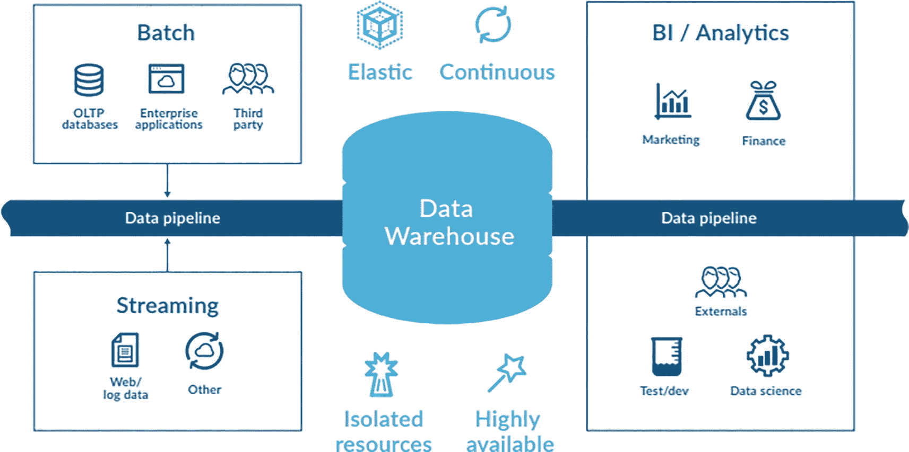

Snowflake 工作负载管理架构。它具有以下属性：弹性、持续、隔离资源、高可用性。它涉及 3 个阶段：批处理、流处理以及与数据仓库交互的 BI 或分析管道。

**图 3-17** Snowflake 工作负载管理

### 数据管道编排：动手实践

因此，在了解了这些架构良好的数据管道后，我们最后的动手实验将探讨如何利用业界领先的大数据处理工具之一来扩展我们的 AI 解决方案，从而自行实现一个数据管道。

**使用 Apache Spark 的 Databricks**

本练习的目标是利用 Apache Spark^(⁴⁷) 的大数据处理能力，使用 `fbprophet` 运行区域和产品级别的预测——这是全球跨国公司的常见用例，目前星巴克也在使用。

1.  注册 Databricks – 注册 Databricks 社区版 (DCE)，登录，并启动一个集群
2.  通过将以下网址粘贴到浏览器中来导入笔记本：[`https://databricks.com/wp-content/uploads/notebooks/fine-grained-demand-forecasting-spark-3.xhtml`](https://databricks.com/wp-content/uploads/notebooks/fine-grained-demand-forecasting-spark-3.xhtml)，选择“导入笔记本”并复制 URL
3.  连接到集群并导入库
4.  通过访问 [`www.kaggle.com/c/demand-forecasting-kernels-only/data`](http://www.kaggle.com/c/demand-forecasting-kernels-only/data) 下载数据。向下滚动并选择“下载全部”（您应接受 Kaggle 竞赛规则），然后解压 `train.csv` 文件
5.  将数据导入 Databricks 文件系统 (DBFS) – 在 Databricks 控制台中启用管理员权限
6.  按照描述在笔记本中使用 `fbprophet` 运行基线预测
7.  使用数据管道，利用 Apache Spark 将预测扩展到每个商店和商品组合

### 总结

我们最后的实验结束了本章的内容。在本章中，我们介绍了 AIaaS 背景下的数据摄取，探讨了当今公司在处理海量数据时面临的挑战、如何存储这些数据、如何使用云服务处理数据，以及如何理想地通过无缝、自动化的数据管道来编排各种不同的数据源。

下一章将快速浏览机器学习。由于读者应该已经了解大部分核心概念，我们的主要兴趣在于将机器学习作为更深入探讨深度学习（在后续章节中）的桥梁。然而，我们还将为成功实施机器学习制定一个最佳实践路线图，涵盖关键的数据整理、训练、测试、基准测试、实施和部署阶段。

脚注 1 2 3 4 5 6

