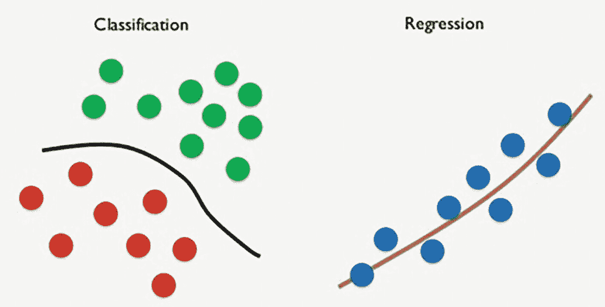
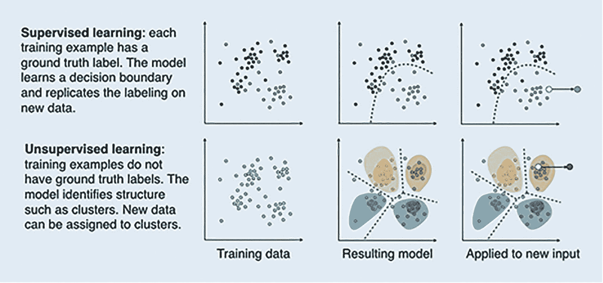
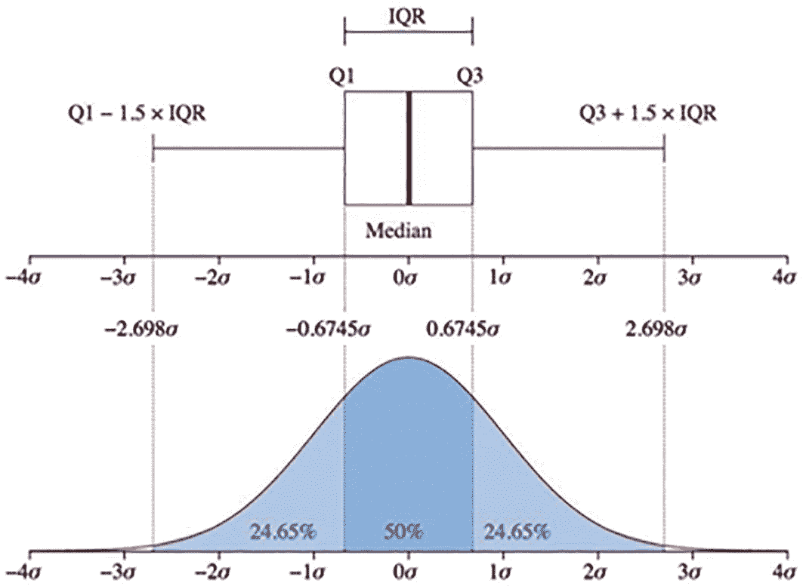
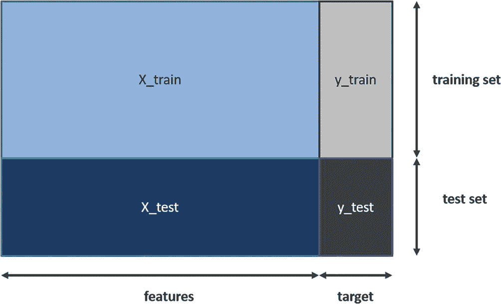
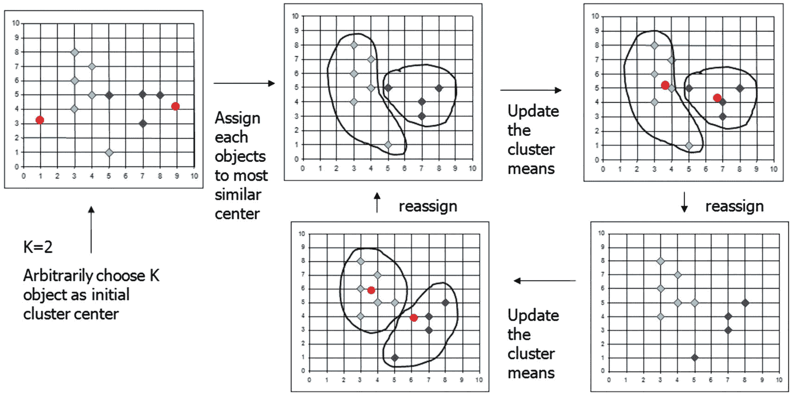
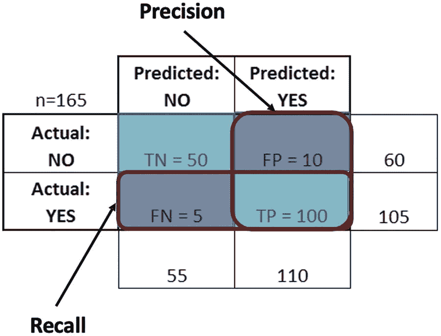
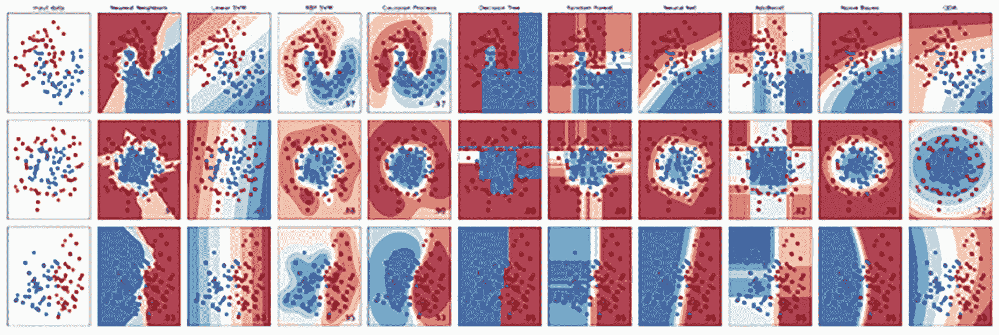

# 4. 云端机器学习

就（Gartner）技术成熟度曲线的转变而言，机器学习早已过了其“期望膨胀期”，但它仍然是当今大多数企业和组织中使用核心的 AI 技术。

在深入探讨深度学习之前，我们将在本章快速回顾一下机器学习，并参考其在云上的应用。如第 1 章所述，我们期望读者已经具备一定的机器学习基础，因此将假定读者对监督学习和无监督学习有基本的了解。

因此，这第四章将加速介绍机器学习的机制，涵盖从数据导入到 EDA 和数据整理（清洗、编码、归一化和缩放）以及模型训练过程的关键流程。我们将研究无监督（聚类）技术和有监督分类与回归，以及时间序列方法，然后解释结果并比较多个算法的性能。

最后，我们将介绍推理过程并将模型部署到云端。在下一章更广泛地探讨神经网络和深度学习之后，我们将在第 6 章再次回顾机器学习，特别是日益重要的 NoLo 代码 UI 和用于 AI 的 AutoML 工具：Azure 机器学习和 IBM Cloud Pak for Data。

## 机器学习基础

如第 1 章所述，机器学习是一种使计算机能够从复杂数据中进行推理的技术。下面给出了主要类型的高级定义，重点在于这些机器学习方法之间的内在差异：

**监督学习** – 在已知所需“目标”或标记输出的数据点上进行训练

**无监督学习** – 没有可用的标记输出，但使用机器学习来识别数据中的模式

**半监督学习** – 首先对大量未标记数据应用无监督机器学习方法，然后对标记数据应用监督机器学习

**强化学习** – 通过最大化奖励/分数来训练机器学习模型

## 监督机器学习

在基本层面上，机器学习有两种类型：监督学习和无监督学习。强化学习有时被认为是第三种类型，尽管它同样可以被视为无监督学习的一种。

### 分类与回归

监督机器学习与无监督机器学习的区别在于“标记”或“真实”数据的普遍存在，即我们希望训练模型预测的特定目标字段或变量。

监督机器学习主要有两种类型：^(⁴⁸) 分类和回归。分类中的标签或目标变量是离散的（通常是二元的，但有时是多类的），而监督回归问题中的标签是连续的。监督分类的目标是找到一个决策边界，将（训练/测试）数据集分割成不同的“类别”，而监督回归的目标是找到一条穿过数据的“最佳拟合”线——对于线性回归是一条直线，对于非线性回归是一条曲线，如图 4-1 所示。

一个示意图展示了两种类型的机器学习算法。左侧和右侧分别表示监督分类和回归。

**图 4-1** 监督分类与回归

一个使用分类技术的关键行业机器学习应用是判断客户是否可能流失（或不流失），而预测客户收入则是回归技术的一个例子。在这两种情况下，用于预测或预报目标变量的**特征**通常是客户属性，通常包括交易数据和人口统计数据，但也可能包括行为或态度数据，例如在网页上花费的时间或来自社交媒体互动的情绪。

### 时间序列预测

正如第 1 章所述，当前在预测领域使用人工智能正成为一种趋势。我们将在下一章探讨神经网络和深度学习的具体应用，并在第 6 章介绍 AutoAI 方法^(⁴⁹)，但除此之外，还有许多机器学习应用扩展了传统的回归技术：自回归（`AR`）、移动平均（`MA`）、自回归移动平均（`ARMA`）、差分自回归移动平均（`ARIMA`）以及季节性差分自回归移动平均（`SARIMA`）。

Facebook 开源的时间序列预测算法 `fbprophet` 尤其受欢迎。^(⁵⁰) 该算法能够自动对具有非线性趋势、季节性和节假日效应的时间序列数据进行预测，捕捉时间序列的四个关键组成部分：长期趋势、季节变动、周期变动和不规则变动。然而，与机器学习中的常见做法一致，通常不会仅依赖单一方法，而是会采用并比较多种算法技术（例如 `ARIMA`、`fbprophet` 和 `RNNs`），最终根据具体的预测用例选择模型。

### fbprophet 入门：动手实践

**预测建筑行业需求**

本练习的目标是在 Jupyter Notebook 中使用 Python，介绍如何利用 `fbprophet` 加速预测过程。在此特定案例中，我们预测英国季度住房需求，但代码示例具有良好的适应性，可以轻松替换数据以用于其他行业/领域的预测。

1.  克隆 GitHub 仓库 `https://github.com/bw-cetech/apress-4.2.git`

2.  在 Colab 中运行笔记本^(⁵¹)，逐步浏览代码示例

3.  代码将执行以下操作：

    1.  导入 `fbprophet`（现已更名为 `prophet`）

    2.  从英国国家统计局导入建筑数据

    3.  将数据整理为所需格式（显示英国公共住房产出的季度时间序列）

    4.  从数据中推导出 `fbprophet` 的预测组件

    5.  输出十年期预测结果

4.  练习（拓展）：重复练习，预测月度数据

5.  练习（拓展）：自动化数据导入，以读取最新数据（即获取最新季度数据）

## 无监督机器学习

无监督机器学习的核心在于识别数据中隐藏的模式，特别是在没有“标记”数据提供指导的情况下。聚类是其中一种预测建模技术，但本节我们还将探讨无监督机器学习作为缩减“大数据”数据集的一种手段。

### 聚类

在无监督机器学习中，我们没有标记数据或“真实情况”，因此此背景下预测建模的目标是识别底层数据中未被发现的模式。这些模式通常在多维空间中被识别为“簇”，其中簇内距离（簇内数据点之间的距离）被最小化，而簇间距离（不同簇之间的距离）被最大化。

由于其内在能力，能够发现包含数百、数千甚至更多参数/特征的大数据中的隐藏模式，无监督聚类非常适合挖掘 CRM 平台（或多个系统）中埋藏的客户数据，以及用于异常检测。给定特定数量的分组（簇），无监督机器学习方法可以找出具有一定共性的客户细分群体（例如高消费、中低收入、位于特定区域等）。同样，在数据上训练无监督机器学习模型后，数据中的异常会以孤立簇的形式凸显出来，如图 4-2 所示。

训练数据的散点图、生成的模型以及应用于新输入的结果，展示了监督学习和无监督学习的区别。无监督学习的训练示例没有真实情况标签。

图 4-2 监督学习 vs. 无监督机器学习（来源：ResearchGate）

### 降维

降维也被视为一种无监督技术。其核心思想是使用机器学习算法来简化（减少）数据，通常是将数千个底层特征缩减为数十个特征。

减少数据维度的过程当然可以通过手动方式（删除不需要的特征）或通过算法自动完成。主要使用的无监督技术是主成分分析，它将数据“压缩”成一种在统计上类似于原始数据的形式。

虽然这种方法可以极大地缩减数据集并提高运行时间/性能，但它严格来说并非通常意义上的机器学习建模技术，因为此过程的输出是另一个数据集（尽管是压缩后的），而非一个训练好的模型。

### 无监督机器学习（聚类）：动手实践

**K-MEANS 算法应用于航空激光雷达点云数据集**

本练习的目标是在 Jupyter Notebook 中使用 Python，将无监督机器学习技术（使用 K-Means 算法^(⁵²)）应用于一个激光雷达数据集——这里是一个代表机场航站楼的未标记“点云”^(⁵³)：

1.  克隆以下 GitHub 仓库：

    `https://github.com/bw-cetech/apress-4.3.git`

2.  在 Jupyter Notebook 中逐步浏览 Python 代码：

    1.  导入数据

    2.  点云快速选择——将数据展平为二维

    3.  点云滤波

    4.  K-Means 聚类实现

3.  练习——显示“肘部图”以比较不同 `k` 值——`k=2` 是否最优？

4.  练习（拓展）——尝试将相同技术应用于上述 GitHub 链接中提供的汽车数据集

## 半监督机器学习

半监督机器学习严格来说并非一种独立的技术，它本质上涉及两个过程：无监督机器学习，随后是监督学习（分类或回归）。因此，半监督机器学习在训练时同时使用未标记数据和标记数据——通常是大量的未标记数据和少量的标记数据。

使用大量无监督数据是因为未标记数据成本更低，获取所需精力也更少——当标记成本（通常涉及领域专家的标注）过高，无法进行完全标记的训练过程时，半监督学习就非常有用。

基于上述原因，半监督机器学习常被寻求扩展其人工智能战略的企业和组织所采用。此外，它也有一些应用场景，例如在（低质量）网络摄像头上识别人脸，这类应用仅依赖少量标记的训练图像^(⁵⁴)就能实现高性能。

## 机器学习实现

在了解了上述关键概念后，让我们来看看实现机器学习模型的过程。尽管机器学习从来不像我们期望的那样“线性”，但如下图所示，该过程本质上是从数据导入开始，依次经过探索性数据分析（EDA）、数据整理（包含下文所述的若干子过程）、建模、性能基准测试和部署。

设计思维、数据挖掘和数据导入已在第 2 章和第 3 章中介绍。我们将在后续章节中逐一介绍从 EDA 到性能基准测试的各个子过程，而部署将在关于应用开发的第 7 章中介绍。

流程图展示了机器学习模型的过程。它包括设计思维与数据挖掘、数据导入、EDA、数据整理、建模、性能基准测试和部署。

图 4-3

机器学习过程

### 探索性数据分析（EDA）

探索性数据分析通常是在我们导入数据源之后进行的过程，但该过程的“基础工作”也可以在导入之前进行。主要活动是理解数据，首先进行基本分析，例如查看数据集的大小（数据文件数量、每个文件的行数和列数等），以及查看数据的首尾行^(⁵⁵)、数据类型和高级统计信息。

完成基本 EDA 后，第二步是“深入一层”进行检查，例如检查缺失值的数量、每列中的具体值及其出现频率。对于较大的数据集（例如 20 列以上），我们可能还会查看具体的列/字段名称，以“感知”哪些字段/变量可能是良好的预测变量，哪些可能是“目标”变量。

虽然最初我们只是希望从这些 EDA 任务中输出/显示关键指标，但我们不可避免地会使用图形分析来可视化数据——首先是单特征图（例如，用于分布分析的直方图和用于异常值分析的箱线图），然后是用于查看特征如何随目标变量变化的多特征图（例如，通过`pairplot`），或用于多特征分析，例如通过相关性图（连续变量使用皮尔逊相关系数，分类变量使用斯皮尔曼等级相关系数^(⁵⁶)）。

箱线图展示了第一、第二和第三四分位数，以及最小值、中位数和最大值。箱体内的竖线标记了中位数。

图 4-4

处理异常值的箱线图解读

### 数据整理

虽然 EDA 涉及被动观察数据^(⁵⁷)，但数据整理侧重于以某种方式主动更改数据。这里包含若干子过程，下面将其描述为一系列期望的步骤，尽管许多步骤是迭代的，并且根据数据集的不同，可能会多次回退到之前的子过程。

**数据清洗**：主要处理不完整数据，即缺失值，但格式化或处理无效数据（如负年龄或负薪资）、不准确数据（源数据中公式应用错误，例如利润）、删除重复项以及处理异常值也是可能需要完成的任务。处理缺失值需要决定是（a）直接删除（例如，当某列缺失值少于 1%时删除行，或当稀疏度大于 97%时删除列），（b）用代理值替换：正态分布用均值，偏态分布用中位数，分类变量用众数，或者（c）在需要更复杂/性能调优时进行插值。

数据清洗还包括处理异常值。异常值在机器学习中是有问题的，因为它们可能导致过拟合，但同样，异常值对于构建复杂模型也可能很重要。最终需要决定是否移除异常值，这通常与下文介绍的归一化和缩放技术结合进行^(⁵⁸)：

**编码**——涉及将文本（字符串）数据转换为数值格式。大多数机器学习算法要求所有数据都是数值型的^(⁵⁹)——有两种方法：**序数编码**，适用于字段值具有内在顺序的情况（例如，电影评分——好 2，一般 1，差 0）；**名义编码**，适用于字段值没有内在顺序的情况（例如，性别）。名义编码通常被称为**独热编码**，因为转换后的数据类似于二进制机器语言（以性别为例，我们通常会创建两列，一列代表女性（取值为 0 或 1），一列代表男性^(⁶⁰)）。

**归一化**——归一化是将偏态的字段/变量分布转换为正态分布的过程。对数变换通常用于右偏分布，而幂变换用于左偏分布。

**标准化（缩放）**——指将数据统一到同一尺度下的过程，对于正态分布的数据（Python 中的`StandardScaler`）和偏态分布的数据（`MinMaxScaler`或`RobustScaler`）采用不同的处理方法。

#### 特征工程

有些人认为数据整理包括特征工程——即选择在预测模型（即机器学习训练过程）中使用哪些特征的过程。这个过程高度迭代，发生在机器学习训练过程的每次迭代之前和之后。

特征工程包括手动过程，例如删除不太可能在机器学习模型中成为良好预测变量的变量（如控制 ID），或添加新的派生特征，例如计算自客户上次购买以来经过的月数。

通常，特征工程还包括在 EDA 期间查看相关性图的后处理步骤。相关性图（无论是皮尔逊还是斯皮尔曼）告诉我们两件事：特征与目标变量的相关程度（因此哪些可能是强预测变量），以及特征之间的相关程度。

在后一种情况下，必须小心排除**多重共线性**——一种可能扭曲模型性能并产生模型偏差的变量依赖性。在怀疑存在变量依赖性的情况下，可以对连续变量计算方差膨胀因子（VIF），对分类变量进行卡方检验。

特征工程还包括自动化技术，例如`KBest`（选择解释目标变量方差的最佳 K 个特征）或递归特征消除（RFE），后者在拟合模型后逐步消除特征，直到达到预定义的特征数量。

#### 数据洗牌与划分/分割

与特征工程类似，将数据洗牌并分割为训练集和测试集可视为数据整理的一部分。通常我们按 70/80% 和 30/20% 的比例分割数据用于训练和测试。在 Python 中（`sklearn` 库）通过 `train_test_split` 函数实现。默认情况下，数据会被洗牌，以确保行的选择/分割是随机进行的（即防止行的非随机分配以及模型偏差的可能性）。

通常会采用更高层次的随机化，以使非随机分配的概率几乎可以忽略不计。这种技术称为 `KFolds` 交叉验证，它将训练集进一步划分为训练（子集）和验证集。

数据划分示意图。数据被分割为训练集和测试集。训练集和测试集分别由 `X_train` 和 `y_train` 以及 `X_test` 和 `y_test` 组成。

**图 4-5** 用于机器学习建模的数据划分

#### 采样

在接下来的两节中，我们将探讨算法流程和性能基准测试。由于数据整理具有高度迭代性，它还包含许多通常要在多次模型运行之后才会执行的任务。上述提到的归一化和缩放就是两种这样的技术，它们并非让模型“启动并运行”所必需，而是为了在模型流程稳定后进行微调。采样，特别是过采样或欠采样，是另一种应用于不平衡数据集的技术。

大多数数据集都存在固有的不平衡性——以欺诈检测为例，欺诈交易的数量通常远少于非欺诈交易。网络安全领域也是如此——DDoS 攻击就像在浩如烟海的正常网络活动中大海捞针。

当我们拥有不平衡数据时，随机欠采样指的是仅从多数类中采样足够数量的样本，以使多数类和少数类样本的数量大致相等。而对于随机过采样，我们则通过合成数据（从少数类中复制数据以达到相同效果）来实现。

欠采样或过采样常常能决定模型性能的好坏，尽管欠采样存在丢失对模型可能有价值的数据信息的风险，而过采样则可能导致过拟合。

我们将在第 8 章中探讨欠采样的一种具体应用——`SMOTE`（合成少数类过采样技术）。

#### 端到端数据整理：动手实践

**使用 Kaggle API 密钥进行信用风险建模准备**

本练习的目标是在 Google Colab 中使用 Python，将探索性数据分析和数据整理技术应用于一个常见的银行业挑战——检测和预测客户信用风险：

1.  克隆 GitHub 仓库 `https://github.com/bw-cetech/-apress-4.4.git`

2.  参考 Colab 左侧的目录，逐步完成以下流程：

    1.  导入库

    2.  配置

    3.  使用 Kaggle API 密钥直接连接数据集

    4.  探索性数据分析

    5.  数据整理

    6.  特征选择

3.  进入笔记本的建模部分，先进行基准运行，然后进行特定特征缩放的场景运行

4.  练习——尝试通过进行更多次运行并更改数据/增强特征工程流程来改进模型性能

5.  练习——执行相同操作，但这次在多个算法上并行运行

### 算法建模

将数据分割为训练集和测试集（或训练集、验证集和测试集）后，我们就可以“拟合”模型了。算法技术利用训练数据，将算法拟合到模型上。模型训练完成后，使用 `sklearn` 中的 `.predict()` 函数，将测试数据输入训练好的算法，以基准测试模型的预测结果（参见下文）。

本书是对构建人工智能应用的实践性探讨，而非对机器学习或深度学习算法原理的理论性（且常常无关紧要的）讨论。尽管如此，本章及其他章节中有大量实验展示了底层算法（包括机器学习和深度学习）是如何应用的，并在后续章节中提供了大量关于如何微调并充分利用建模过程的相关最佳实践。

为便于本书后续参考，我们在下文中总结了所使用的主要机器学习算法及其优缺点。随后在下一节中，我们将进行一个动手实验，在三个不同的数据集上训练多种机器学习算法（以及一种深度学习算法）并比较其性能。

**表 4-1** 监督分类算法

| 算法 | 优势 | 劣势 |
| --- | --- | --- |
| 朴素贝叶斯 | 基于类别条件概率的简单模型。易于实现 | 假设所有特征相互独立——实际情况很少如此 |
| 逻辑回归 | 直接明了，易于理解——输出具有概率性 | 在处理多个或非线性决策边界时表现不佳 |
| 分类树/随机森林/梯度提升树/CatBoost | 能够学习非线性关系，对异常值鲁棒 | 在无约束时容易过拟合（通过约束或使用集成方法可缓解） |
| 支持向量机 | 能够对非线性决策边界建模；在高维空间中对异常值相当鲁棒 | 内存密集，难以调参，不适用于大规模数据集 |
| 多层神经网络（深度学习） | 在分类音频、文本和图像数据时表现非常出色 | 需要大量数据进行训练，非通用型 |

**表 4-2** 监督回归算法

| 算法 | 优势 | 劣势 |
| --- | --- | --- |

| 线性回归 | 直接明了，易于理解 | 处理非线性关系时表现不佳 |
| --- | --- | --- |
| `Lasso`、`Ridge` 和 `Elastic-Net` | 正则化——惩罚大系数以避免过拟合 | 复杂的超参数调优 |
| 回归树/随机森林/梯度提升树/`XGBoost`/`LightGBM`/`CatBoost` | 能够学习非线性关系，对异常值鲁棒 | 在无约束时容易过拟合（通过约束或使用集成方法可缓解） |
| `K` 近邻 | 搜索最相似训练观测值的简单方法 | 内存密集，在高维数据上表现不佳 |
| 多层神经网络（深度学习） | 能够学习极其复杂的模式，高效学习高维数据，在计算机视觉、语音识别方面表现出色 | 计算密集，需要高度专业知识进行调优。不适合通用目的，因为需要大数据进行训练 |

对于无监督机器学习，`K 均值` 是主要算法，但也有包括层次聚类在内的几种变体。神经网络（特别是自编码器）也可用于无监督机器/深度学习，而主成分分析（前面讨论过）本质上也是一种无监督机器学习算法。

`K 均值` 算法示意图。`K = 2`。它任意选择 `K` 个对象作为初始聚类中心。该过程包括分配对象、更新聚类均值以及重新分配。

**图 4-6** `KMeans` 算法——运行机制

## 性能基准测试

构建 AI 应用需要持续的**训练**和**测试**——了解如何设定性能基准以及使用哪些衡量指标是一项关键的开销。将模型输出与基线进行比较总是一个好主意。

对于监督分类模型，基线可以是一个为测试集中每个数据点随机分配类别的模型，或者是一个使用所有可用特征（除了与运行时错误相关的数据清洗外不做改动，例如移除缺失值、对文本数据进行编码等）的模型——本质上是一个没有“特征工程”的模型。对于监督回归模型，通常使用`持久性`预测作为基线，即预测只是“持续”（即重复）测试集中的某种数据模式，例如前一天、前七天或前一年等。与分类模型一样，最好使用所有特征运行一个基线，以便与后续进行了更复杂特征工程的运行结果进行比较。

上述基线对于监督机器学习的“启动和运行”很有用，但在经过 5-10 次模型迭代后，就需要更复杂的方法了。如下表所示，会使用多种衡量指标来确定模型的性能。

对于无监督学习，我们没有标记数据，因此与基线进行基准测试没有意义。但在这里，我们可以利用诸如簇内平方和之类的衡量指标，来了解数据在模型输出的模型簇中“紧密”程度。

混淆矩阵展示了精确率和召回率的值。`T N`和`F N`分别表示真负例和假负例，而`F P`和`T P`分别表示假正例和真正例。`T N = 50`，`F N = 5`，`F P = 10`，`T P = 100`。

**图 4-7** 混淆矩阵，其中`召回率 = 100 / (100 + 5) = 0.95`，`精确率 = 100 / (100 + 10) = 0.91`

**表 4-3** 机器学习性能指标

| 指标/基准 | 描述 | 机器学习类型 |
| --- | --- | --- |
| **准确率** | 分类器正确的频率是多少？ | 监督分类 |
| **召回率** | 我们正确预测的实际正例的比例：`TP/(TP+FN)` | 监督分类 |
| **精确率** | 正确预测的比例：`TP/(TP+FP)` | 监督分类 |
| **F 值** | 真正例率（召回率）和精确率的加权平均值：`2 * 召回率 * 精确率 / (召回率 + 精确率)` | 监督分类 |
| **混淆矩阵** | 与实际结果相比，正确和错误预测的数量 | 监督分类 |
| **分类报告** | 显示模型的精确率、召回率、F1 和支持度分数 | 监督分类 |
| **ROC 曲线/AUC** | 敏感性与特异性之间的权衡 | 监督分类 |
| **均方根误差 (RMSE)** | 预测值与实际值之间平均误差的平方根 | 监督回归 |
| **R² (决定系数)** | 衡量模型将预测值拟合到实际值的程度 | 监督回归 |
| **方差** | 由于过拟合导致对微小变化敏感而产生的误差 | 监督回归 |

### 持续改进

持续改进当然是性能基准测试的一部分——与其依赖静态指标和盲目的试错方法来改进结果，不如采用最佳实践，以确保随着时间的推移，我们能够超越模型性能的容忍度。

几乎总是应该首先重新审视数据，并批判性地评估用于关键数据清洗任务的方法，例如为缺失值估算代理值——当我们从另一个特征中移除缺失数据时，是否丢失了太多有价值的（其他）特征信息？仅仅用平均值替换缺失值是否合适？等等。其中一些关于信息丢失和/或模型偏差的担忧，也延伸到了之前为不平衡数据集描述的采样方法中。

数据问题进一步延伸到数据采集过程——虽然更多的数据并不总是意味着更好的结果，但从统计学角度看，更大的样本更有可能带来更好的性能。更多的数据也不一定意味着更多的记录或数据行——新的特征，通常从现有特征衍生而来（例如“自上次购买以来的天数”、“购买频率”等），可能会产生巨大影响。

无论采用何种精细的方法，只有在详尽地重新审视数据之后，我们才应考虑进一步的算法测试（并行或其他方式）和超参数调优。

虽然上述重点在于持续改进模型训练和测试结果，但模型弹性也是一个额外的考虑因素。今天的一个好模型不一定在一个月后仍然适用——在最后一章中，我们将探讨数据漂移和用于缓解问题的自动重新训练。

### 机器学习分类器：动手实践

**SKLEARN 回顾**

`Scikit-learn`（或`sklearn`）是进行简单预测分析和建模的“首选”工具——在本实验中，我们将`scikit-learn`中的机器学习算法与三个不同的数据集进行比较。

`sklearn`不仅仅是“入门级”的机器学习，它还被包括摩根大通、Spotify 和[booking.com](http://booking.com)在内的知名品牌广泛用于生产环境。它构建在`NumPy`、`SciPy`和`matplotlib`之上，除了机器学习的主要算法流程外，`sklearn`还附带了一些内置的数据集、预处理、特征工程和模型选择函数/方法：

1.  从以下地址克隆 Python 笔记本：[`https://github.com/bw-cetech/apress-4.9.git`](https://github.com/bw-cetech/apress-4.9.git)

2.  按照笔记本中的描述：

    1.  导入三个虚拟数据集

    2.  进行缩放

    3.  进行并行运行，并将数据拟合到十种不同的算法中

3.  直观地比较多种算法如何拟合训练数据

4.  最后，尝试完成练习：

    1.  提取模型分数（屏幕上显示的列表中的原始值）

    2.  仅针对`"make_circles"`数据集隔离多层感知器（MLP）。用输入数据绘制此图，并在屏幕上使其更大

该图展示了十种不同机器学习算法对三个虚拟数据集的分类情况。

**图 4-8** 十种机器学习算法与三个不同数据集的比较

## 模型选择、部署与推理

上述性能指标是初始和最终模型选择的基础——在 2022 年，这一过程更常使用诸如贝叶斯优化和 AutoML/AutoAI 等自动化技术来完成。这是第 6 章关于 AutoAI 的主题，我们将把对该过程的讨论留到那时。

机器（和深度）学习部署是第 7 章和第 9 章的重点——本质上，它是将模型部署到生产环境中的过程，在此过程中对新数据执行`推理`——将新数据输入模型以获得预测/预报。

推理将在本章的最后一个动手实验中进行，本质上它与算法建模部分中描述的测试预测步骤没有区别，只是在这种情况下，我们向训练好的模型输入新数据，而不是来自测试集的样本数据点。

### 推理：动手实践

AZURE MACHINE LEARNING – 推理 API 测试

**在 Jupyter Notebook 中使用 Python，本练习的目标是……**

1.  在 Azure Machine Learning Studio 中，按照以下步骤训练并评估一个机器学习模型，用于预测收入是高于还是低于 5 万美元：

    [`https://gallery.azure.ai/Experiment/3fe213e3ae6244c5ac84a73e1b451dc4`](https://gallery.azure.ai/Experiment/3fe213e3ae6244c5ac84a73e1b451dc4)

2.  现在，按照以下步骤设置 Web 服务并执行一个简单的 API 推理测试：

    1.  确保模型已运行，然后设置 Web 服务

    2.  选择预测性 Web 服务（推荐）

    3.  运行

    4.  部署 Web 服务

    5.  点击“请求/响应”旁边的“测试”（蓝色按钮）进行简单测试

    6.  使用一些默认值（年龄 = 12，收入 = 45）显示，预测客户为低收入（显示在屏幕底部的小字中）

    7.  练习 – 部署 Web 服务后，使用“使用”下显示的配置设置，将 Azure ML 插件添加到 MS Excel 并输入示例数据，从 Excel 调用 API

## 强化学习

强化学习涉及实时的机器（或深度）学习，采用智能体/环境机制，该机制根据周围环境的实时反馈（模型的准确度如何）对模型的迭代进行惩罚或奖励。

该算法有三个主要组成部分，目标是通过反复试验来发现哪些动作能在给定时间内最大化预期奖励：

*   智能体（学习者或决策者）

*   环境（智能体与之交互的一切）

*   动作（智能体可以做什么）

虽然本书的范围主要集中在主流商业和组织应用上，但强化学习的进展通常是媒体大肆炒作的地方——本质上，这是驱动“工业级”应用（如谷歌搜索引擎、自动驾驶汽车、机器人和游戏）的基础技术。

### 总结

强化学习究竟是机器学习还是深度学习可能是一个有争议的问题，但巨大的技能差距意味着，如今大多数公司的人工智能雄心在于建立内部能力，以应对更普通的机器学习解决方案。

深度学习代表了组织人工智能成熟度的一次提升，在结束本章对机器学习的快速介绍后，我们将进入下一章，探讨基于云数据馈送的神经网络如何成为主流，以及它们在深度学习解决方案中的具体应用。

脚注 1 2 3 4 5 6 7 8 9 10 11 12 13 14 15 16 17 18
