# 5. 神经网络与深度学习

当今大多数“旗舰级”或“被热炒的”人工智能应用的核心是深度学习，特别是人工神经网络（ANN）的使用及其预测能力。

这些神经网络如何消耗海量数据来运行，并最终实现通常令人惊叹的复杂预测，是本章的主题。

更具体地说，本章的主要收获是了解从何处开始使用人工智能，包括历史背景、从机器学习到深度学习的业务/用户旅程，以及实现深度学习所需的基础大数据/云架构。为此，我们将介绍基础的随机过程理论及其与神经网络的关系，以及深度学习中使用的不同类型的神经网络。我们将探讨深度学习模式的生命周期、基于大数据进行建模和推断的技术，以及围绕模型训练和测试过程的关键诊断方法，还有我们可用的许多杠杆，例如激活函数、池化层和丢弃法，以实现更好的性能。

总而言之，最终的目标是如何为深度学习建立正确（最佳实践）的人工神经网络架构、数据编排管道和基础设施。在本书的其余部分和动手实验中，我们将介绍许多人工智能工具，但本章的重点将围绕 `TensorFlow`、`Keras` 和 `PyTorch`。

## 深度学习简介

在第一部分中，我们将从介绍开始，涵盖关键概念、历史里程碑、人工智能炒作周期以及支撑深度学习的神经网络架构。

### 什么是深度学习

在我们深入探讨神经网络的细节之前，我们应该先理清这些（经常被误解的）用于解决复杂问题的算法结构与相对较新的“深度”学习概念之间的关系。

当今的共识是，深度学习本质上是基于人工神经网络的机器学习的一个子领域，而两者都是人工智能的子领域。因此，与机器学习一样，深度学习涉及自动化机器来执行（预测性）任务，但这次底层算法要复杂得多，并且高度非线性。“深度”这个名称来源于神经网络中的隐藏层，大部分优化和收敛过程都在这些层中进行。

神经网络的发展可以追溯到 20 世纪 50 年代，但如今我们拥有足够快的计算机和数据处理能力来实际训练大型神经网络。正是这一点，加上其固有的性能复杂性，真正导致了它在全球试图把握收入增长机会和成本优化的企业和组织中作为工具而爆炸式流行。潜力基本上是无限的——正如 Google Brain 联合创始人吴恩达所证明的那样；传统算法的性能随着数据规模的扩大而受到限制，但深度学习的性能会随着训练数据量的增加而持续提升（图 5-1）。

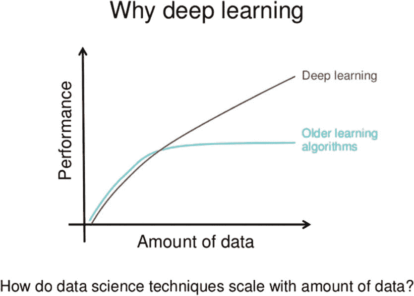

一张图表展示了性能与数据量的关系。它表明深度学习的性能在提升，而旧的学习算法在达到一定数据量后性能保持不变。

图 5-1

[`https://machinelearningmastery.com/`](https://machinelearningmastery.com/)

当今媒体讨论的大多数“被热炒的”人工智能应用都是深度学习解决方案：从无人驾驶汽车（自动驾驶汽车）到搜索引擎、计算机视觉/图像识别、聊天机器人，以及投资组合优化和预测。


### 深度学习——为何是现在？

尽管大多数人认为 20 世纪 50 年代是深度学习发展历程中的关键里程碑（得益于现代计算机的诞生），但真正取得爆发式进展是在过去 20-25 年间。若非半导体技术的快速进步——这为当今个人电脑和笔记本电脑的处理能力奠定了基础——其中许多成就将无法实现。以下是这一时期促成大众认知的关键时间节点，人们普遍认为深度学习是数字优先型企业和组织的关键差异化优势。

* 1997 年：IBM 的“深蓝”在国际象棋中击败加里·卡斯帕罗夫
* 2011 年：IBM Watson 赢得智力竞赛节目《危险边缘》
* 2012 年：ImageNet 竞赛——AlexNet 深度神经网络大幅降低了视觉物体识别的错误率
* 2015 年：Facebook 将名为 DeepFace 的深度学习技术投入运营，用于在照片中自动标记和识别用户
* 2016 年：谷歌 DeepMind 的 AlphaGo 算法掌握了复杂的棋盘游戏围棋，并击败了世界顶尖职业棋手之一李世石

这些事件被媒体广泛报道，加之行业深度学习解决方案的可扩展性日益增强，雪球效应最终推动了更广泛市场对深度学习实施项目的委托。

### AI 与深度学习炒作周期

尽管上述深度学习的重大里程碑为那些希望通过采用深度学习技术和解决方案获得投资回报的企业亮起了“绿灯”，但围绕 AI 整体的炒作依然显著，正如高德纳炒作周期（如下所示）所频繁揭示的那样。

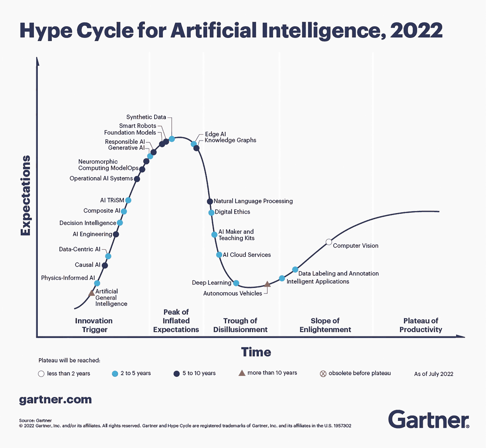

一张 2022 年人工智能炒作周期的期望值随时间变化图包含多个阶段。它绘制了一条钟形上升曲线，表示将在不到 2 年、2 至 5 年、5 至 10 年、超过 10 年内达到的平台期，以及在平台期前就已过时的阶段，数据截至 2022 年 7 月。

**图 5-2** 高德纳 AI 炒作周期

企业中的这种炒作部分源于无知，部分源于科幻想象。职场中的 AI 指的是“增强”智能，而非人工智能。人工智能常常被误认为是电影中的“通用人工智能”及其所有可怕的末日景象。^(⁶⁶)

如今，真正的“增强”智能通常被认为正在发挥其潜力，而企业和组织所获得的切实利益已成为现实，这得益于新冠疫情期间加速数字化的生存需求，例如：

* 疫情期间提供聊天机器人支持
* 将深度学习应用于医疗诊断
* 计算机视觉支持社交距离监测
* 利用机器学习模拟经济重启的影响

在 2022 年及以后，焦点已转向后疫情时代 AI 和深度学习的“民主化”，将项目从专家/小众知识和堆积如山的“技术债务”转变为在更广泛的关键利益相关者（所有员工、客户）生态系统中获得认同（和理解）。同样，AI 的“工业化”也已跃居前沿和中心位置，推动了对 AI 解决方案可重用性、可扩展性和安全性的需求。^(⁶⁷)

### 高层架构

如上所述，深度学习将机器学习扩展到使用神经网络来解决困难且规模庞大的大数据业务问题。计算过载通常通过集群或图形处理单元（GPU）上的并行处理来实现，以加速内部计算。

正如我们将在本章后面看到的，繁重的计算发生在人工神经网络（ANN）内部。这些 ANN 是深度学习的基础，其灵感来源于大脑的结构和功能。一个简单的图示如下所示：

* 两个隐藏层，每层四个节点（或神经元）
* 四个输入
* 一个输出

大多数 ANN 以及深度学习模型都可以将其架构追溯到这种基本结构。为了了解这些 ANN 的实际运作方式以及如何使用它们进行预测，我们现在将进入本章的第一个动手实验。

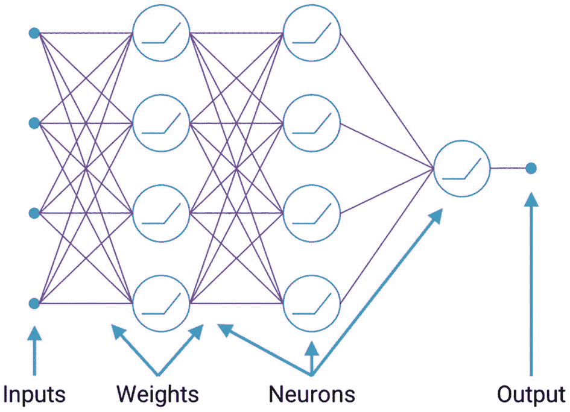

一个典型的人工神经网络模型，包含 4 个相互连接的层级。它包括输入、权重、神经元和输出。

**图 5-3** 典型的 ANN 架构

### TensorFlow Playground：动手实践

如今，如果不了解 TensorFlow（谷歌现已开源的 AI 库），就无法进行深度学习。我们稍后将更详细地介绍这个工具及其代码本身（通过 Keras，即 Python 与 TensorFlow 的接口），但这里我们先从“宏观”视角直观地了解使用该工具训练人工神经网络（即深度学习模型）时发生的情况。

**可视化深度学习**

**本练习的目标是熟悉人工神经网络、数据如何导入，以及如何训练网络来预测输出：**

1. 访问 [`https://playground.tensorflow.org`](https://playground.tensorflow.org)
2. 注意屏幕左侧的数据配置——有四个示例数据集可供选择，每个数据集由一组 `x1` 和 `x2` 坐标定义
3. 神经网络架构从左到右显示在中间，即从特征（数据集中 `x1` 和 `x2` 坐标的变换）经过网络的隐藏层到输出
4. 顶部显示了一些超参数（用于微调建模过程的杠杆）——我们将在本章后面介绍这些内容
5. 注意问题类型设置为“分类”——我们试图预测数据属于蓝色组还是橙色组
6. 以第一个（同心圆）数据集为例，尝试调整 (a) 特征数量、(b) 隐藏层数量以及 (c) 每层神经元数量，并观察模型收敛的速度（损失接近零）。注意，隐藏层和神经元越多，收敛速度越快
7. 练习：尝试在最复杂/非线性的数据集（螺旋模式）上训练模型，并观察需要多长时间（多少个周期）才能使损失低于 0.05
8. 拓展练习：找到一个合适的配置，在 500 个周期内使损失低于 0.01

## 随机过程

在进一步探讨当今实际行业用例中使用的不同类型的神经网络之前，我们首先需要了解一些基本的概率论，以理解 ANN 中发生的复杂过程。


### 生成式模型与判别式模型

理解深度学习模型工作原理的一个关键概念，在于区分判别式模型与生成式模型。

判别式模型和生成式模型都用于执行机器学习和深度学习。两者的区别在于：判别式模型基于条件概率 `p(y|x)` 进行预测，寻找类别间的决策边界，并用于监督学习；而生成式模型则通过显式建模每个类别的实际分布，从联合概率分布 `p(x,y)` 中预测条件概率，并用于无监督特征学习。

为了理解这一概念，可以类比如何将语音分类为两种语言之一。我们可以利用语言模型之间的差异（判别式），也可以分别学习每种语言（生成式）。

由于神经网络试图学习哪些特征 `x` 会映射到 `y`，从而对输入进行判别，因此它们使用的是判别式模型。

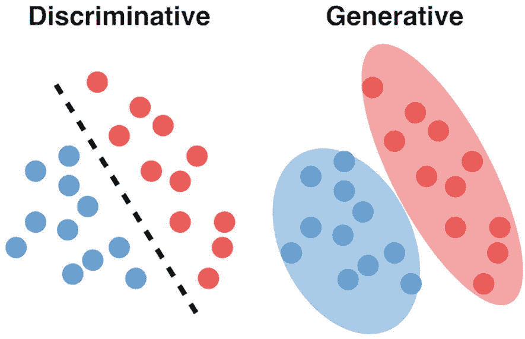

两种模型的示意图。左侧为判别式模型，右侧的生成式模型描绘了两个分离的椭圆形状。

### 随机游走

理解神经网络的另一个重要概念是随机游走。

随机游走是一种随机过程，描述了一个由变量上连续随机步骤组成的路径。我们可以想象一个人在十字路口每次抛两次硬币来决定前进、后退、向左或向右，从而可视化二维随机游走：

- 正面、正面 -> 前进
- 正面、反面 -> 向右
- 反面、正面 -> 向左
- 反面、反面 -> 后退

我们将在本节的动手实验中很快创建这个二维随机游走。

这里的重要方面是，随机游走每一步的每个结果都具有相等的概率。随机游走对于例如图像分割非常重要，它们用于确定与每个像素相关联的标签（例如“物体”或“背景”）。它们也用于对大规模在线图（如在线社交网络）进行采样。

### 马尔可夫链与马尔可夫过程

马尔可夫链是一种随机模型，描述了一系列可能的事件，其中每个事件的概率仅取决于前一个事件的状态。

马尔可夫链的定义特征是，无论过程如何到达当前状态，可能的未来状态都是固定的。实际上，马尔可夫链是无记忆的——给定当前和过去状态，过程未来状态的条件分布仅取决于当前状态，而完全与过去状态无关。

这里用一个赌博类比来帮助理解——押注一系列独立公平抛硬币的结果：

- 如果正面，她/他赢得一美元。
- 如果反面，她/他输掉一美元。

停止条件是 (a) 她/他达到 N 美元的财富，或 (b) 他/她的钱包空了。

建模为马尔可夫过程的系统产生了隐马尔可夫模型（HMM）——类似于神经网络/深度学习中的隐藏层/状态的统计模型。

要了解它们如何工作以及如何应用于现实世界现象，请查看一个实际运行的马尔可夫链：[`https://setosa.io/ev/markov-chains/`](https://setosa.io/ev/markov-chains/)

### 其他随机过程：鞅

鞅的概念在时间序列分析、量化金融、算法交易和博彩业中非常重要。

最初是 18 世纪法国的一类赌博策略，赌徒 (a) 如果抛硬币正面朝上则赢得赌注，反面则输掉，并且 (b) 每次输后加倍赌注。其思想是，如果赌徒的财富和可用性是无限的，那么最终抛出正面的概率趋近于 1。

深度学习模型（尤其是循环神经网络）的统计能力，与以鞅理论为基础的 ARMA/ARIMA 时间序列模型有相似之处。

### 用 Python 实现随机游走：动手实践

神经网络基础——随机理论

**使用 Jupyter Notebook 中的 Python，本练习的目标是用 Python 实现一个二维随机游走：**

1.  克隆以下 GitHub 仓库：

    [`https://github.com/bw-cetech/apress-5.2.git`](https://github.com/bw-cetech/apress-5.2.git)

2.  浏览代码示例：
    1.  导入 Python 库
    2.  定义随机游走的步数以及用于捕获结果的列表
    3.  尝试使用 `For` 循环和四个 `If` 语句创建二维随机游走
    4.  绘制结果并观察分形
    5.  作为拓展练习，尝试实现三维随机游走！

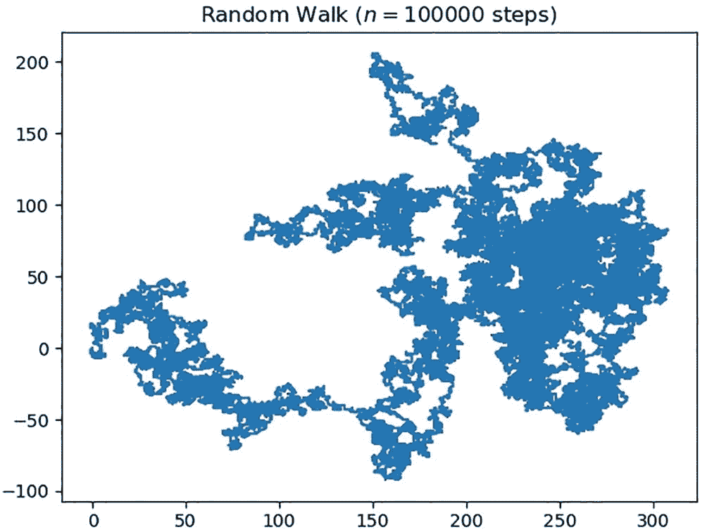

图表描绘了随机游走中的步数。250 标记了较大的位置，而 y 轴上的 200 具有较小的值。

图 5-4

Python 中的二维随机游走

## 神经网络简介

将上述概率论作为我们的主要关注点——及其在神经网络中的应用，我们现在在本节中更深入地探讨神经网络的构成，研究不同类型的神经网络及其区别。

### 人工神经网络（ANN）

如下文所述，人工神经网络（ANN）是受生物启发的网络，能够从底层数据中提取层次化的抽象特征。本质上，它是用于解决预测问题的任何类型神经网络的通用名称。人工神经网络由输入层、隐藏层和输出层组成，将各种数据点作为输入，通过网络传递数据，并输出某个数值。当今使用的主要人工智能应用，包括语音识别、图像识别、机器翻译和预测，都利用了某种类型的人工神经网络。

正如我们将看到的，深度学习中使用的 ANN 架构和算法种类繁多且各不相同。我们将介绍以下主要类型，从“基础”版本开始：简单感知机和多层感知机，然后介绍卷积神经网络和循环神经网络——这是当今人工智能应用（从语音和图像识别到机器翻译和预测）中使用的两种主要类型。

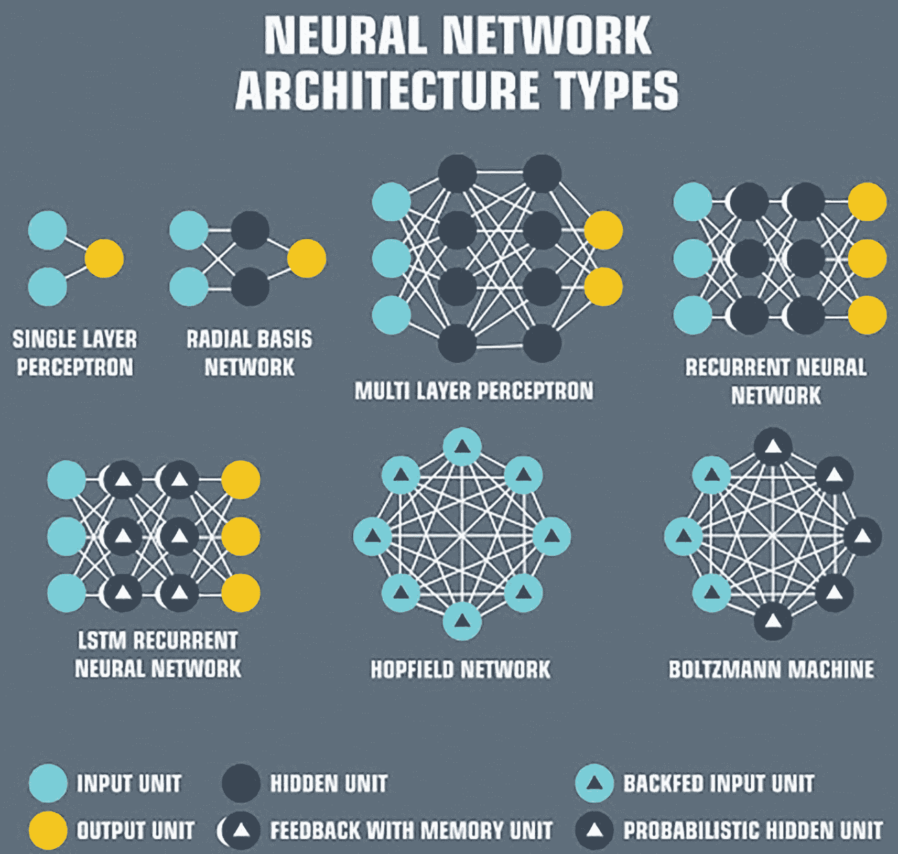

该模型展示了 7 种类型的人工神经网络：单层感知机、径向基网络、循环神经网络、LSTM 循环神经网络、Hopfield 网络和玻尔兹曼机。单层感知机有 2 个输入单元和 1 个输出单元。

图 5-5

ANN 的类型

### 简单感知机

简单（或单层）感知机是所有人工神经网络的构建模块。本质上，它是我们大脑中生物神经元的简化模型。

我们大脑中的神经元从其他神经元接收多个输入，基于这些输入，神经元要么触发，要么不触发。简单感知机则简单得多——它是一个单一的神经元，接收多个输入并学习一个线性函数以产生输出。激活函数（Heaviside 阶跃函数）帮助简单感知机对二元输出（开或关）进行分类。

如果我们将这些感知机结构化为一个多层网络，并使每个神经元能够使用来自前一层的输入/神经元来学习非线性函数，我们就得到了一个多层感知机（MLP），以及一个更接近我们大脑的东西。

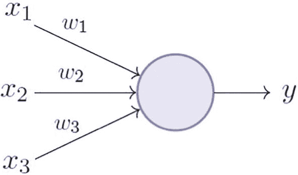

示意图展示了一个简单感知机。它描绘了三个输入 `x1`、`x2` 和 `x3` 进入一个圆形块，并输出 `y`。

图 5-6

简单感知机


### 多层感知机（MLP）

从形式上讲，多层感知机（或 `MLP`）是一类前馈 `ANN`，本质上是一种在**有向**图（或**有限无环图**）中连接多个层的神经网络。由于它拥有多个“隐藏”神经元层，多层感知机是一种**深度神经网络**。正是这些隐藏层区分了机器学习模型和深度学习模型。

“方向”源于**前向传播**机制，即输入数据被馈入网络，仅沿一个方向（即从左到右）通过节点（神经元），直到到达输出层。

与简单的感知机不同，多层感知机中除输入节点外的每个节点都具有**非线性激活**函数，通常是 `sigmoid`、`tanh` 或 `ReLU`。我们将在下一节中讨论这些函数。

不应将 `MLP` 的“前馈”特性与在前向传播之后发生的另一个重要过程——**反向传播**——相混淆。反向传播是一种监督学习算法，用于在前向传播之后（根据预测值与实际标注数据之间的误差）更新网络中的权重。

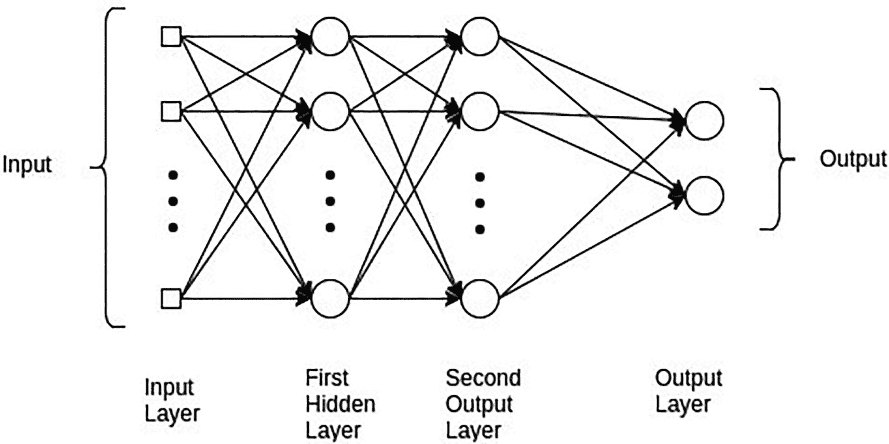

模型图展示了多层感知机作为一类前馈人工神经网络。它包含 4 个层：输入层、第一隐藏层、第二隐藏层和输出层。

**图 5-7**  
作为前馈 `ANN` 一类的多层感知机

### 卷积神经网络（CNN）

多层感知机接收向量输入，虽然能够处理图像分类等更复杂的问题（图像像素可以简化为一个长输入数据向量），但其本身不足以应对当今面临的大多数预测挑战。

特别是在图像分类问题中，自 2012 年 `ImageNet` 竞赛取得突破性进展以来，卷积神经网络（`CNN`）已成为首选方法，图像数据以张量而非向量的形式输入。

这些 `CNN` 是专门为处理二维图像数据而设计的神经网络模型，其中学习空间关系至关重要。

与 `MLP`（由于全连接，网络中的权重数量会迅速变得难以管理）不同，`CNN` 会利用“卷积”以及池化和丢弃等技术来减少权重数量。

卷积是一种将两个信号组合成第三个信号的数学方法，在神经网络中，这相当于简单地将一个滤波器（即**一组权重**）应用于输入，从而产生激活。`CNN` 的流行源于它们能够在模型训练过程中自动并行学习大量滤波器，从而**从输入数据中提取层次化模式**（例如在合成图像中识别人物或建筑物）。

在整个网络中，`CNN` 依赖多个卷积层，反复将相同的滤波器应用于输入数据，从而生成一个**特征图**，其中包含指示图像中检测到的特征位置和强度的激活信息。

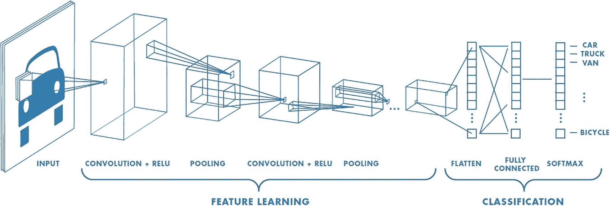

模型图展示了用于图像分类的 `CNN` 示例。它从输入开始，经过包含卷积和 `ReLU`、池化、卷积和 `ReLU` 以及池化的特征学习阶段，最后以包含展平、全连接和 `softmax` 的分类阶段结束。

**图 5-8**  
用于图像分类的 `CNN` 示例

### 循环神经网络（RNN）

卷积神经网络是图像分类的首选人工神经网络，而循环神经网络（`RNN`）则是常用于序列或时间问题的一类 `ANN`，包括自然语言处理、语言翻译、语音识别和预测。

与前馈网络（如 `CNN`）类似，`RNN` 利用输入/训练数据进行学习，节点之间的连接形成有向图，但这次是沿着时间序列进行的。这使得 `RNN` 能够解决前馈网络在序列数据上的固有弱点，即当输入的顺序很重要时。

因此，`RNN` 以其“记忆”能力而著称，因为它们会利用先前输入的信息来影响当前的输入层和输出。实际上，**隐藏状态**用于将相关信息从一个输入项传递到序列中的其他项。或者换句话说，如下方图表所示，循环神经网络的输出取决于序列中的先前元素。

循环神经网络是 Alexa、Siri、语音搜索和 Google 翻译等流行应用背后的 `ANN` 架构。高精度、工业规模的循环神经网络（`RNN`）在**预测**方面也日益超越传统方法，特别是专门的**长短期记忆网络（`LSTM`）**。

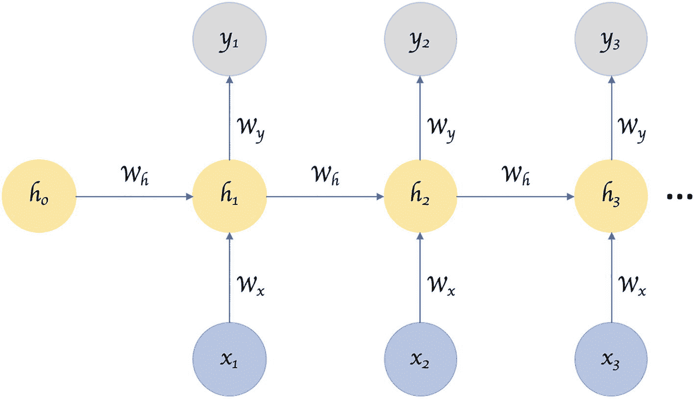

模型图展示了循环神经网络中的隐藏状态。它包含因子 `h`、`w`、`x` 和 `y`，重复 `n` 次。

**图 5-9**  
循环神经网络中的“隐藏状态”

#### 长短期记忆（LSTM）网络

`LSTM` 是一种循环神经网络，能够学习序列预测问题中的顺序依赖性。^(⁶⁸) `LSTM` 与更通用的循环神经网络的区别在于，它们能够存储重要的过去信息，并遗忘不重要的信息。

长短期记忆网络的内部“门”实际上使 `LSTM` 能够学习比普通 `RNN` 长得多的长期依赖关系。标准 `RNN` 在时间延迟超过 5 到 10 个离散时间步长时无法学习，而 `LSTM` 通过强制保持误差流恒定，可以学习跨越超过 1000 个离散时间步长的最小时间延迟。

`LSTM` 通常用于（时间序列）预测，也用于语音识别和翻译，因为它们能够学习更复杂的语法关系。

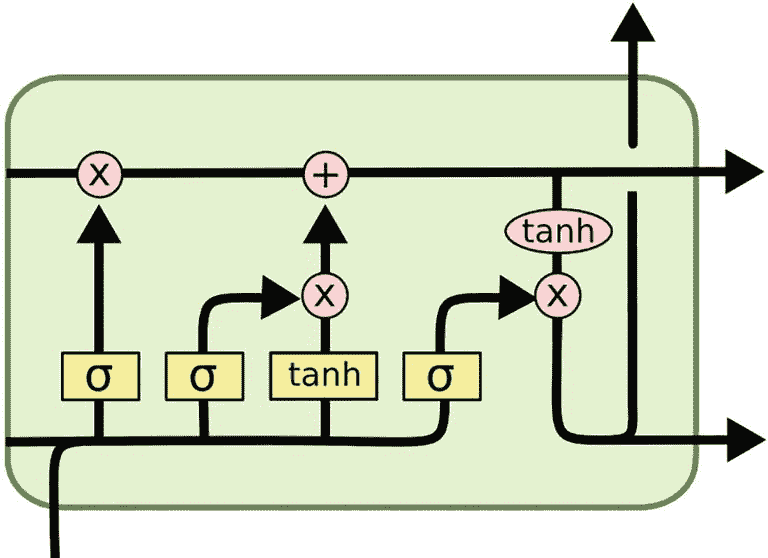

模型图展示了长短期记忆网络。它包含 3 个 sigma 和 1 个 `tanh` 输入。

**图 5-10**  
`LSTM` 架构

### 其他类型的神经网络

卷积神经网络和循环神经网络被用作深度学习架构，用于训练监督学习问题，即我们拥有预标注数据（例如分类后的图像或用于预测的收盘股价）的情况。这是我们本节末尾第一个动手练习的重点。

在此之前，我们将快速了解其他通常用于解决无监督深度学习问题的架构。这些包括**受限玻尔兹曼机（`RBM`）**、**深度信念网络（`DBN`）**、**深度玻尔兹曼机（`DBM`）**，以及**自编码器、变分自编码器**和**生成对抗网络**。自编码器将在本节第二个动手实验室中讨论。


### 受限玻尔兹曼机（RBM）

受限玻尔兹曼机是一种生成式、随机的两层人工神经网络，它学习一组输入上的概率分布。其中只有两种神经元：隐藏神经元（图中标记为`h`）和可见神经元（图中标记为`v`），所有神经元之间相互连接。没有输出节点。

玻尔兹曼机在输入节点之间存在连接，而受限玻尔兹曼机则是一种特殊类别，其可见单元和隐藏单元之间的连接受到限制。这使得使用基于梯度的对比散度算法进行更高效的训练成为可能。

总的来说，由于计算概率所需的时间明显慢于反向传播算法，如今 RBM 的使用频率较低。目前更倾向于使用生成对抗网络（GAN）或变分自编码器，这两种方法将在下文讨论。

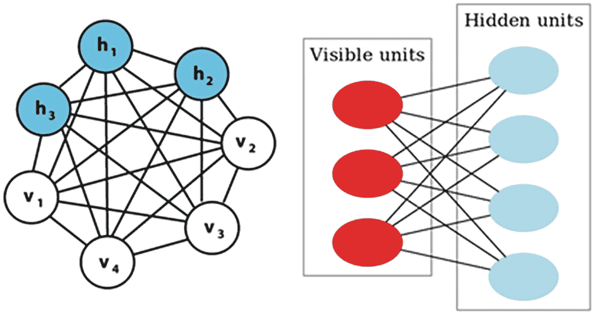

模型图展示了玻尔兹曼机与受限玻尔兹曼机的对比。它包含两个相互连接的单元：可见单元和隐藏单元。

图 5-11：玻尔兹曼机与受限玻尔兹曼机

### 深度信念网络（DBN）

如果我们堆叠受限玻尔兹曼机，然后使用梯度下降和反向传播进行微调，就得到了深度信念网络。本质上，DBN 是堆叠的 RBM 层，其顶部两层具有无向连接，而较低层则是有向连接。

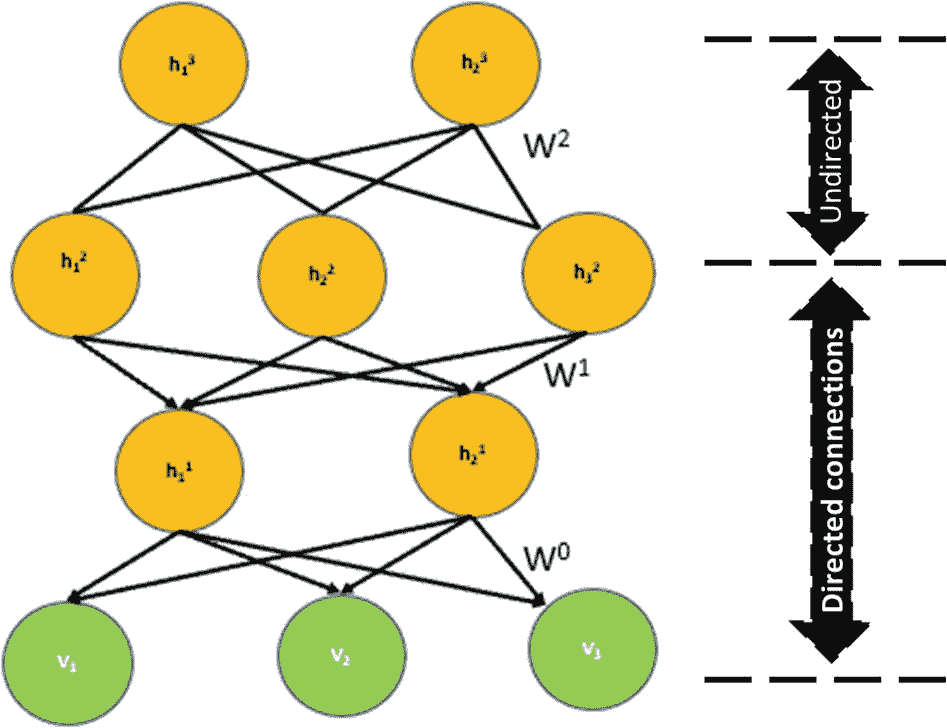

模型图展示了深度信念网络。它包含两层：上层具有无向连接，下层具有有向连接。

图 5-12：深度信念网络（DBN）

### 深度玻尔兹曼机（DBM）

深度玻尔兹曼机（DBM）是一种具有多层隐藏随机变量的无向概率图模型。

与深度信念网络类似，DBM 可以在诸如物体或语音识别等任务中学习输入数据的复杂且抽象的内部表示。然而，与 DBN 不同的是，DBM 的训练和推理过程是双向进行的（自底向上和自顶向下），这使得 DBM 能够更好地解释输入数据/特征。

深度玻尔兹曼机的学习过程可能很慢，这限制了其性能潜力和功能。

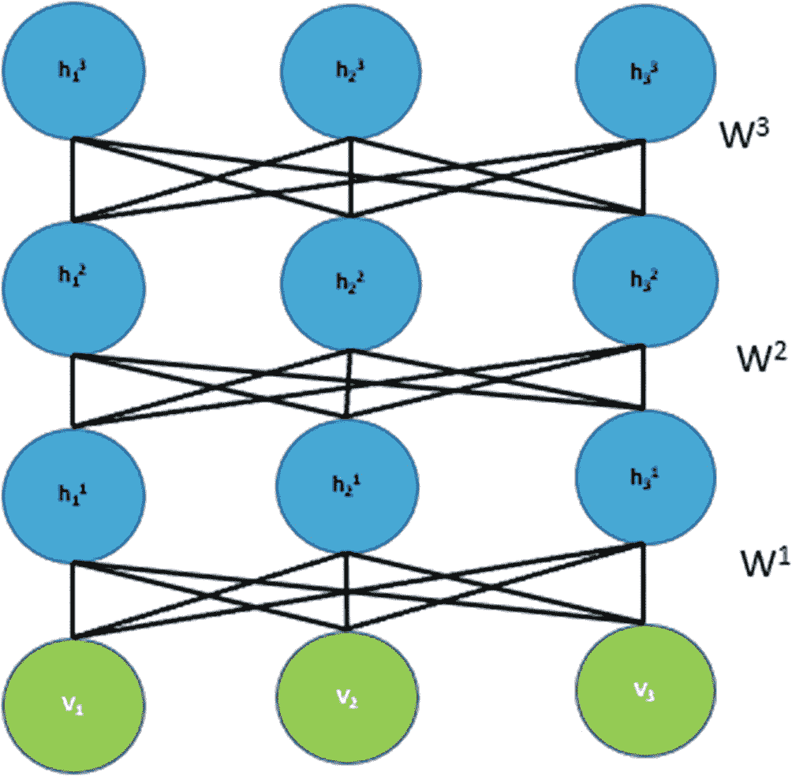

模型图展示了深度玻尔兹曼机（DBM）示例。它包含三层，分别由`h1³`、`h2³`和`h3³`组成。最后一层（第四层）由`V1`、`V2`和`V3`组成。

图 5-13：深度玻尔兹曼机（DBM）示例

### 自编码器

自编码器神经网络是一种前馈神经网络。具体来说，它是一种无监督学习算法，应用反向传播并将目标值设置为等于输入值。自编码器是 OpenAI 令人兴奋的 DALL-E 生成式 AI 模型的一个组成部分，我们将在第 8 章的动手实验中对其进行探讨。

自编码器将输入压缩成低维编码，然后根据该表示重建输出。从架构上看，它们由三个组件组成：编码器、编码和解码器。编码器压缩输入并生成编码，而解码器则根据编码重建输入，如图 5-13 所示。

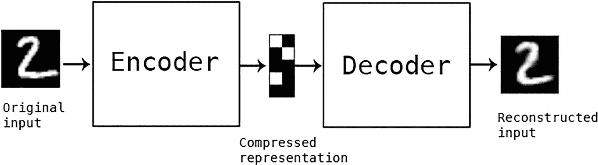

模型图展示了使用自编码器重建图像的过程。原始输入被送入编码器，输出为压缩表示，该表示进一步被送入解码器，最后得到重建的图像。

图 5-14：使用自编码器重建的图像（来源：keras.io）

变分自编码器（VAE）是自编码器的改进版本。与自编码器一样，它们也是无监督的人工神经网络，学习如何高效地压缩和编码数据。

它们的不同之处在于编码器的输出——自编码器（AE）输出一个向量，而 VAE 则为每个输入输出一个概率分布的参数。

### 生成对抗网络

生成对抗网络（GAN）是深度伪造（Deepfakes）背后的技术。它们创建合成图像，并使用生成式建模，自动发现/学习输入数据中的规律/模式。

GAN 模型用于生成/输出与原始数据集相比“可信”的全新样本。

尽管它们采用无监督深度学习，但构建生成对抗网络在一定程度上被“框架化”为一个监督式深度学习问题。底层的生成器和判别器子模型被一起训练，生成器生成一批样本，然后与真实数据集一起传递给判别器进行分类。由于判别器模型依赖于真实数据集，训练过程以“监督损失”为基准。这两个模型（生成器和判别器）在一个零和的对抗博弈中一起训练。

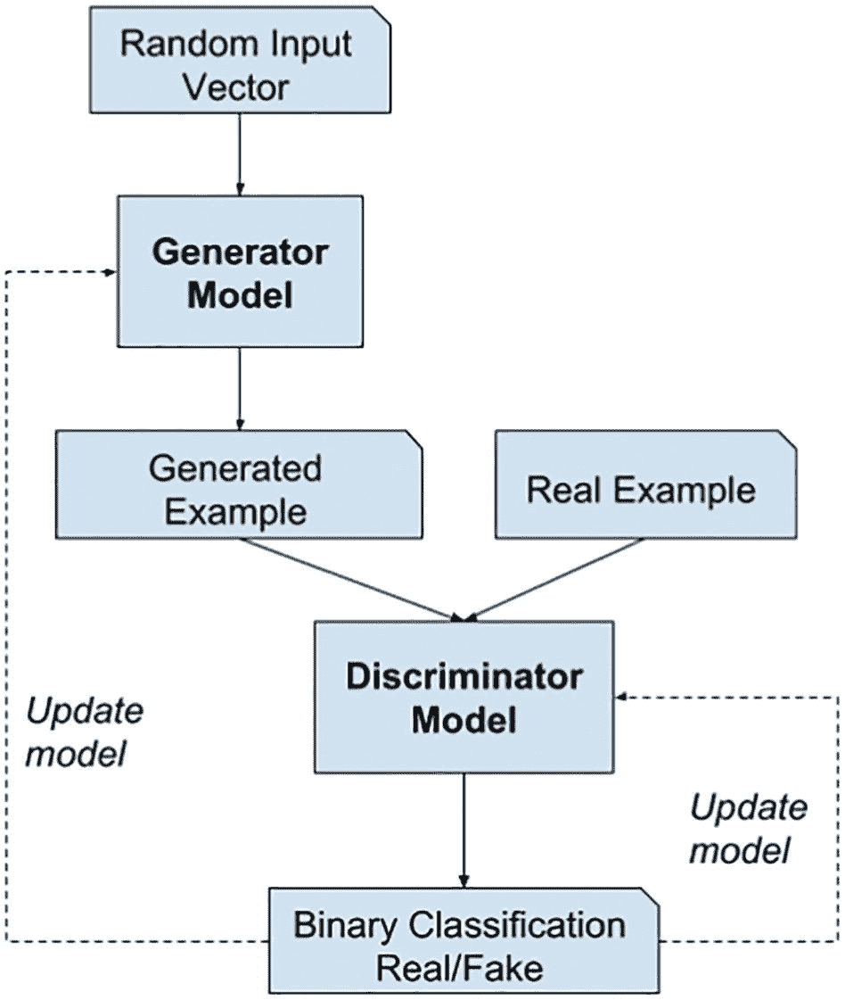

流程图展示了生成对抗网络。它从随机输入向量开始，经过生成器模型，再到判别器模型，最后进行二元分类（真实/伪造）。

图 5-15：生成对抗网络——建模过程

### 一个简单的深度学习解决方案——MNIST：动手实践

深度学习建模过程初探

MNIST（改进的国家标准与技术研究所）手写数字数据集是计算机视觉和深度学习中使用的标准数据集。

它包含 60,000 张 28×28 像素的方形灰度图像，图像内容是 0 到 9 之间的单个手写数字。该数据集非常适合作为基础，用于学习和练习如何开发、评估和使用卷积深度学习神经网络进行图像分类。

因此，本练习的目标是使用 Python（配合 Google Colab）实现一个卷积神经网络，以正确识别（分类）手写数字。

1.  克隆以下 GitHub 仓库：

    [`https://github.com/bw-cetech/apress-5.3.git`](https://github.com/bw-cetech/apress-5.3.git)

2.  将笔记本导入 Google Colab。Colab 对 TensorFlow 有更好的支持（无需安装！），因此更容易运行笔记本。

3.  查看右侧面板上的目录，其中显示了建模过程的每个部分，从数据导入到 EDA、数据整理、构建和运行神经网络，以及性能基准测试。

4.  在浏览笔记本的过程中，先尝试完成练习，然后再查看解决方案。

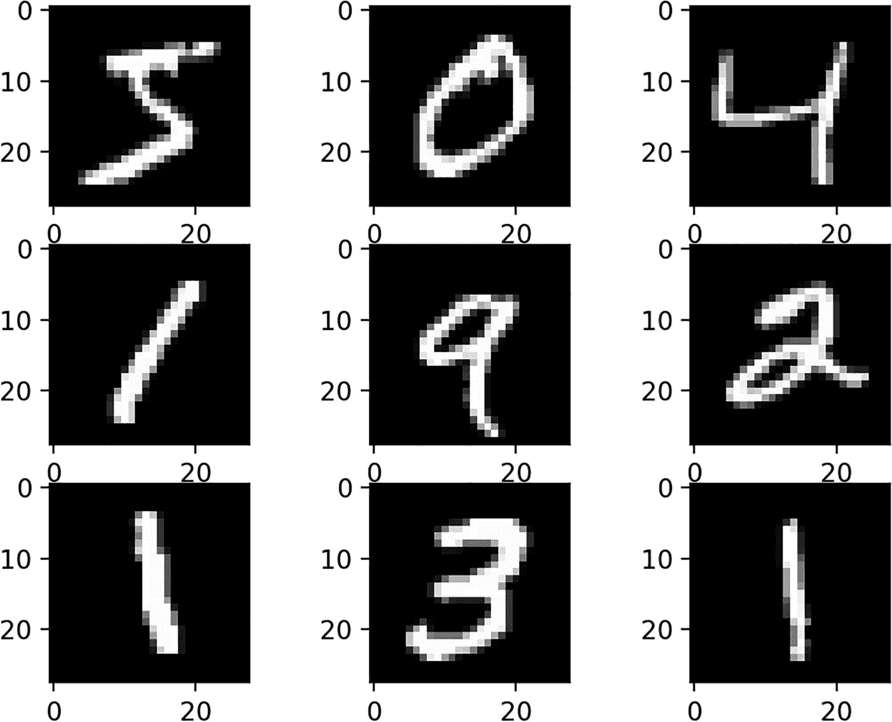

图像展示了改进的国家标准与技术研究所数据集。它包含 6 个数字：5、0、4、1、9、2、1、3 和 1。

图 5-16：MNIST 数据集


### Keras 中的自编码器：动手实践

无监督深度学习

**本节的后续实验将使用 MNIST Fashion 数据集探索无监督深度学习。** 其思路是利用自编码器的编码器、编码和解码器架构，有效地“重建”特定类别的图像（此处为服装类物品，但代码可轻松适配其他图像集）：

1.  克隆以下 GitHub 仓库：

    [`https://github.com/bw-cetech/apress-5.3b.git`](https://github.com/bw-cetech/apress-5.3b.git)

2.  在 Colab 中导入并运行笔记本

3.  运行笔记本及内置练习
    1.  执行探索性数据分析
    2.  归一化图像数据
    3.  为图像添加噪声以增强模型泛化能力
    4.  构建并配置模型
    5.  使用训练好的自编码器降低图像噪声并重建图像

4.  比较使用 Colab GPU 运行时与普通（CPU）运行时的运行时间

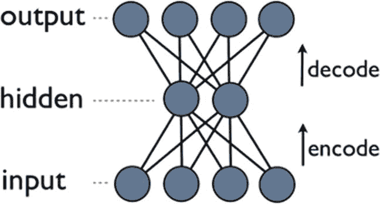

模型图展示了自编码器：编码器-解码器模型。它包含一个由输入层、隐藏层和输出层组成的互联网络。

**图 5-17** 自编码器：编码器-解码器模型

### 深度学习工具

在继续探讨如何在 Python 中实现人工神经网络之前，我们先了解一些支持深度学习所需的主要库和工具。

### 深度学习工具

粗略浏览最新的 [TIOBE 编程社区指数](https://www.tiobe.com/tiobe-index/) 即可发现，Python 持续流行，截至 2022 年 6 月，它仍然是排名第一的软件编程语言。

作为机器学习和深度学习的“首选”编程语言，与所有主要深度学习库和 API 的关键集成是开发路径的核心，同时强大的数据挖掘功能和特性也至关重要，尤其是与主要数据整理库 `Pandas` 的结合。

鉴于本书的主题是使用 Python 进行 AI 编程，并且我们已经涵盖了几个动手实践的 Python 实验，因此我们假设读者已具备一定的 Python 语言知识。本节剩余部分将重点介绍构建包含卷积层或循环层的神经网络并简化深度学习过程所需的开源工具。

### TensorFlow

作为众多行业专业人士和研究人员的首选工具，`TensorFlow` 是由 Google 开发并于 2015 年作为开源发布的端到端深度学习框架。

尽管 `TensorFlow` 拥有完善的文档、训练支持、可扩展的生产和部署选项、多抽象层级以及对不同平台（如 Ubuntu、Android 和 iOS）的支持，但它是一种复杂的底层编程语言，其编码本身对数据科学家来说并非特别直观。

过去 5-10 年对 `TensorFlow` 开发的关注意味着其在研究、灵活性和速度方面的加速改进，使其被当今许多知名品牌和公司所采用，包括 Airbnb、可口可乐、通用电气和 Twitter。

`TensorFlow` 已不再仅仅是底层语言，Google 在其 2019 年的上一个主要版本（`TensorFlow 2.0`）中改进了与 Python 运行时的集成。如今的 `TensorFlow` 生态系统涵盖了 Python、JavaScript（`TensorFlow.js`）和移动端（`TensorFlow Lite`）开发，以及用于机器学习生产流水线/部署的 `TensorFlow Extended (TFX)`、用于模型和结果可视化的 `TensorBoard` 和用于预训练模型的 `TensorFlow Hub`。

有多种方式和集成开发环境可以安装和导入 `TensorFlow`，但在本书中，我们将使用我们认为最简单的方法——Google Colab。由于 Colab 与其创建者的关联、增强的用户工作流程以及对 `TensorFlow` 的支持，我们只需将 `TensorFlow` 作为库导入，而无需安装代码。Colab 还提供 GPU 支持，这对于加速、扩展和生产化深度学习模型至关重要。

### Keras

`Keras` 由麻省理工学院开发，于 2015 年开源，旨在解决在用户友好度较低的“后端”语言（如 `TensorFlow`、`Theano` 和 `CNTK`^(⁶⁹) 中使用的语法）中编码深度学习模型训练和推理的易用性挑战，后两者现已弃用。

`Keras` 是一个用 Python 编写的高级、模块化且可扩展的 API，专注于快速实验。它是 `TensorFlow 2` 的高级 API，也是 Kaggle 上排名前五的获胜团队中最常用的深度学习框架。

其“拖放式”编程风格保持了与 `TensorFlow` 的后端连接，并加速了深度学习模型的设计、拟合、评估和使用，只需几行代码即可进行预测。

`Keras` API 在 `TensorFlow` 上的实际实现被编码为 `tf.keras`，在 Python 中的设置很简单：

```python
import numpy as np
import tensorflow as tf
from tf import keras
```

`Keras` 的核心数据结构是 `layers` 和 `models`，最简单的模型类型是 `sequential model`，即层的线性堆叠。我们将在本章下一节中进一步讨论这些层以及如何在 `Keras` 中实现深度学习模型。

### PyTorch

`PyTorch` 是本书将介绍的最后一个主要深度学习“工具”，主要用于自然语言处理领域的深度学习。^(⁷⁰)

`PyTorch` 由 Facebook 的 AI 研究小组开发，并于 2017 年在 GitHub 上开源。它声称简单、易用且灵活，同时通过动态计算图实现高效的内存使用。`PyTorch` 速度更快，并拥有出色的调试支持，但对其易用性的宣称应持保留态度——它是一种底层语言。`PyTorch` 与像 `Keras` 这样更简单的深度学习框架的集成尚不存在，尽管作为为 `PyTorch` 提供高级接口的轻量级包装器，`PyTorch Lightning` 可能会在未来几年内成为一种替代方案。

在作者看来，使用 Windows 上的 Jupyter Notebook 实现 `PyTorch` 更容易。我们将使用一次性 shell 命令（直接在 Jupyter notebook 的单元格中）安装 `PyTorch`：

```bash
%pip install torch
```

注释掉上述 Python 代码行后，可以通过运行示例 `PyTorch` 代码来验证安装：

```python
import torch
x = torch.rand(5, 3)
print(x)
```

如果安装成功，屏幕上应显示一个随机张量输出。


### 其他重要的深度学习工具

当然，`TensorFlow`（与`Keras`配合使用）和`PyTorch`并非当今唯一使用的深度学习框架。存在大量工具，其中许多工具在专注于特定用例时，本身就能产生更好的结果或性能。

例如，`Eclipse Deeplearning4J`（也称为`DL4J`）是一组项目，旨在支持基于 Java 虚拟机（JVM）的深度学习应用的所有需求。

在 Python 库方面，虽然`Theano`（由蒙特利尔大学开发）和`微软认知工具包（CNTK）`都曾风光一时，但现已弃用，而由加州大学伯克利分校开发的`Caffe`仍在使用，特别是在图像分类/分割领域。`Caffe`在 NVIDIA GPU 集成方面表现出色，但调试起来有些困难。

来自庞大的 Apache 工具集生态系统的`MXNet`，为深度学习提供多语言支持和高级 API 支持。

#### Apache Spark

虽然`MXNet`更像是一个小众的深度学习工具，但`Apache Spark`是一个流行的大数据处理统一分析引擎，内置了流处理、SQL、机器学习和深度学习以及图处理模块。

由于其在处理大数据方面固有的“可扩展性”，以及其内置的、通过隐式数据并行性对整个集群进行编程的接口（因此非常适合对大型数据集进行分布式训练）和容错性，数据科学家们已将`Apache Spark`视为将深度学习投入生产的加速器。

存在许多 API 可以简化在 Python 中实现和使用`Apache Spark`的过程，包括`PySpark`（`Apache Spark`的事实标准 Python API）和`SparkTorch`（用于在`Apache Spark`上运行`PyTorch`模型）。

`Apache Spark`可能是对将深度学习投入生产至关重要的“其他”工具中最重要的一个，它将是本书下一章动手实验的重点。

## 深度学习与实现框架

既然我们已经确立了用于深度学习的主要 Python 集成工具，我们就可以进入本章的重点——如何实现一个深度学习模型。

### 张量

`TensorFlow`和`PyTorch`都使用**张量**，因此在继续了解它们如何在深度学习模型中构建和使用之前，理解这个重要的数据结构是很有帮助的。

实际上，**张量**是一个具有统一数据类型的多维数组。它们类似于`numpy`数组，但不可变，很像标准的 Python “元组”。与标准的 CPU 内存不同，张量也可以存储在 GPU 内存中，从而优化深度学习的用途。

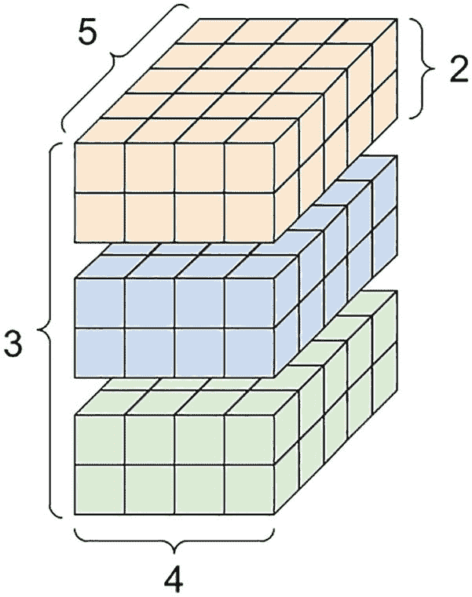

一个模型图展示了具有形状的秩为 4 的多维数组。

**图 5-18** 形状为 `[3, 2, 4, 5]` 的秩为 4 的张量

### TensorFlow 关键概念

`TensorFlow 2.0` 默认使用**即时执行模式**来立即评估操作，因此会在代码中计算张量的值。类似于命令式编程的概念，即时执行模式涉及由 Python 逐步执行操作，然后将结果立即返回给 Python。

`TensorFlow` 中的另一种执行方法是**图执行模式**。在这里，张量计算通过`tf.operations`图节点作为数据流图`tf.Graph`来执行。

由于这是一本关于使用 Python 将 AI 应用投入生产的书，我们专注于`TensorFlow`中的即时执行模式，而非图执行模式。一般的最佳实践是在即时模式下进行开发和调试，然后使用`TensorFlow`的`tf.function`进行装饰/生产化，该函数将常规 Python 代码转换为可调用的 TensorFlow 图函数，通常能提供更好的性能。

`TensorFlow` 还利用各种**执行管道**来在深度学习过程中执行多个/并发任务：

*   `tf.data` – API 支持重用复杂的输入管道，例如，聚合来自多个文件的数据，对图像应用随机“噪声”，并批量随机图像用于训练
*   `TFX Pipelines` – 将其扩展到端到端的 MLOps（输入 ➤ 训练 ➤ 部署 ➤ 跟踪）

### 深度学习建模生命周期

转向初始实现，当我们经历数据导入、使用`numpy`进行向量化、模型构建和模型运行过程时，我们知道，除非在使用`TensorFlow`即时执行模式进行实验、可视化即时结果和调试之前将数据转换为张量，否则建模将会失败。

为了将编码（和故障排除）追溯到底层过程，将深度学习建模生命周期视为具有五个不同的阶段是很有用的：

*   定义模型
*   编译模型
*   拟合模型
*   模型评估
*   预测/推理

这些阶段可以进一步细分为与`Keras`/`TensorFlow`操作大致相关的子过程，并通过一行 Python 代码来定义。

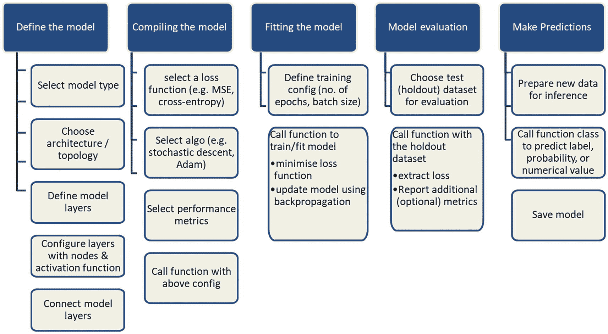

一个模型图展示了深度学习建模生命周期。它包含 5 个模块，分别是定义模型、编译模型、拟合模型、模型评估和进行预测。

**图 5-19** 深度学习建模生命周期（来源：machinelearningmastery）

反映上述深度学习阶段的示例代码：

```
##### 定义模型
model = ...
#### 编译模型
opt = SGD(learning_rate=0.01, momentum=0.9)
model.compile(optimizer=opt, loss='binary_crossentropy')
#### 拟合模型
model.fit(X, y, epochs=100, batch_size=32, verbose=0)
#### 评估模型
loss = model.evaluate(X, y, verbose=0)
#### 进行预测
yhat = model.predict(X)
```

### 顺序模型 API 和函数式模型 API

在上述过程和 Python 代码中，为了构建模型，我们首先需要定义它。在`Keras` API（`tf.keras`）中，实际上有两种主要方法可以做到这一点：顺序模型和函数式模型。

#### 顺序模型 API

顺序模型是最简单的方法，它适用于神经网络层，其中每一层恰好有一个输入张量和一个输出张量。

要在 Python 中实现这一点，如下面的代码所示，我们使用`model.add()`以线性方式逐层向模型添加层。

**使用顺序 API 定义的模型示例**

```
from tensorflow.keras import Sequential
from tensorflow.keras.layers import Dense
##### 定义模型
model = Sequential()
model.add(Dense(10, input_shape=(8,)))
model.add(Dense(1))
```

#### 函数式模型 API

`Keras` 函数式 API 比顺序 API 更复杂，但也更灵活。这里不是线性地添加层，而是使用一个模型对象来指定输入层和输出层，并显式地将一层的所有输出连接到另一层的输入（每个连接都被指定）。

**使用函数式 API 定义的模型示例**

```
from tensorflow.keras import Model
from tensorflow.keras import Input
from tensorflow.keras.layers import Dense
##### 定义层
x_in = Input(shape=(8,))
x = Dense(10)(x_in)
x_out = Dense(1)(x)
##### 定义模型
model = Model(inputs=x_in, outputs=x_out)
```


### 实现 CNN

上述章节涵盖了通用的深度学习实现流程，但当我们具体构建，例如用于图像分类的卷积神经网络时，流程又是怎样的呢？机器学习和深度学习建模是一个高度迭代的过程，构建一个高性能的卷积神经网络可以说是难度最高的任务之一。

正如我们将在本节之后的动手实验中看到的那样，采用逐步推进的流程，同时为围绕探索性数据分析和数据整理的迭代过程预留空间，是让模型（a）成功运行并（b）使其性能达到可接受标准（例如 `fbeta > 0.9`）的关键。

在导入数据并执行基本的探索性数据分析之后，针对 CNN 的数据整理和模型设置存在一些独特的要求。下面将对这些要求进行描述，而相关的技术子流程将在本章的下一节中介绍。

1.  **预处理与数据划分**
    *   将图像转换为数据矩阵/张量
    *   将数据集划分为训练集和测试集
    *   将张量数据格式转换为浮点数并进行缩放

2.  **构建网络**
    *   为卷积基（卷积层和池化层）初始化滤波器
    *   定义激活函数以计算梯度/实现反向传播
    *   更新全连接层的权重

3.  **编译网络**
    *   结合前向和反向操作，构建神经网络

其余步骤在很大程度上与上述深度学习生命周期中展示的通用流程一致，包括训练网络、在测试集上进行评估（检查损失、准确率、混淆矩阵和分类报告等指标）。通常，训练和评估会重复进行，直到达到我们的“目标”性能，并且常常会添加 Dropout 来解决过拟合问题。

**典型的 Keras CNN 实现：**

```python
model = models.Sequential()
model.add(layers.Conv2D(32, (3, 3), activation='relu', input_shape=(32, 32, 3)))
model.add(layers.MaxPooling2D((2, 2)))
model.add(layers.Conv2D(64, (3, 3), activation='relu'))
model.add(layers.MaxPooling2D((2, 2)))
model.add(layers.Conv2D(64, (3, 3), activation='relu'))
model.add(layers.Flatten())
model.add(layers.Dense(64, activation='relu'))
model.add(layers.Dense(10))
model.compile(optimizer='adam',
              loss=tf.keras.losses.SparseCategoricalCrossentropy(from_logits=True),
              metrics=['accuracy'])
history = model.fit(train_images, train_labels, epochs=10,
                    validation_data=(test_images, test_labels))
```

### 实现 RNN

实际上，在 Keras 中我们可以利用三种类型的循环神经网络“层”：

**`keras.layers.SimpleRNN`**

这是“基础”版本——本质上是一个全连接的 RNN，其中上一个时间步的输出会被馈送到下一个时间步。

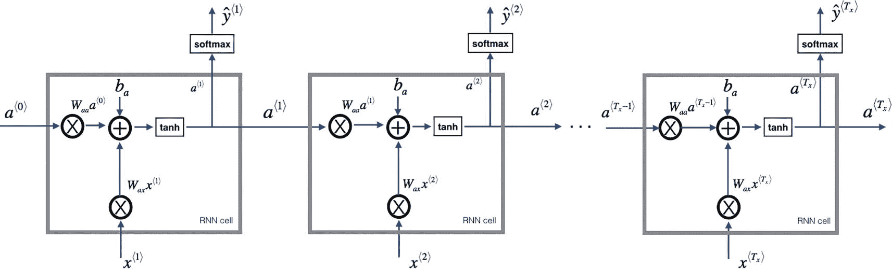

一个模型图展示了循环神经网络。它包含 a 和 x 输入、tanh 函数、SoftMax 以及 y 输出。

图 5-20：循环神经网络 – SimpleRNN

**`keras.layers.GRU`**

门控循环单元是循环神经网络中的一种门控机制，旨在解决标准 RNN 中的梯度消失问题。通过一个更新门和一个重置门，GRU 在将信息传递到输出之前对其进行“审查”，从而避免了 `SimpleRNN` 中梯度递减和权重僵化（不变）的问题。我们将在本章后面的第 6 节“调优深度学习模型”中更详细地讨论梯度消失问题。

**GRU 和 SimpleRNN 层的 Keras RNN 实现示例：**

```python
model = keras.Sequential()
model.add(layers.Embedding(input_dim=1000, output_dim=64))
#### GRU 的输出将是一个形状为 (batch_size, timesteps, 256) 的 3D 张量
model.add(layers.GRU(256, return_sequences=True))
#### SimpleRNN 的输出将是一个形状为 (batch_size, 128) 的 2D 张量
model.add(layers.SimpleRNN(128))
model.add(layers.Dense(10))
model.summary()
```

**`keras.layers.LSTM`**

正如我们从本章第 3 节所知，LSTM 通常有助于在考虑“长期效应”的情况下实现更好的预测。网络中的这种“记忆”是通过三个门来维持隐藏状态实现的：

*   **输入门** 将信息添加到细胞状态
*   **遗忘门** 移除模型不再需要的信息
*   **输出门** 选择要作为输出的信息

**基础 LSTM 实现示例：**

```python
model = Sequential()
model.add(LSTM(50, activation='relu', input_shape=(n_steps, n_features)))
model.add(Dense(1)) # 单个 LSTM 单元隐藏层
model.compile(optimizer='adam', loss='mse')
```

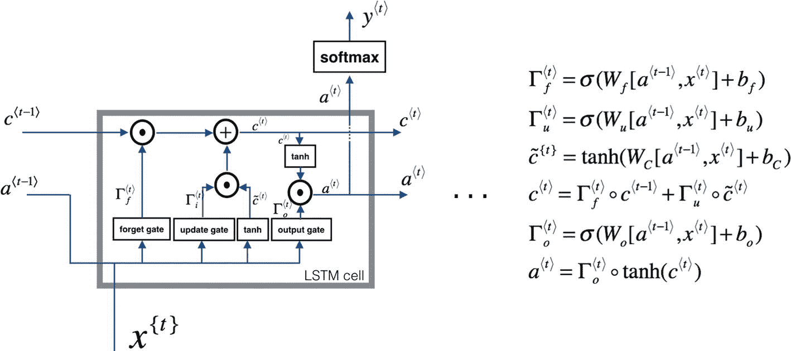

一个长短期记忆网络包含 LSTM 细胞中的遗忘门、更新门、tanh 和输出门，输出 y 通过 SoftMax 发送。

图 5-21：LSTM 架构

#### 用于时间序列的 LSTM 实现

我们将在本节稍后的第二个实验中构建一个 LSTM，但在那之前，需要先处理用于 LSTM（或任何 RNN）时间序列预测的数据整理过程。

在时间序列预测中，先前的时间步实际上会成为深度学习过程的“特征”，而目标变量则是当前（训练）或下一个（推理）时间步。如果我们打算向前预测（例如）60 个时间步，那么提供给 LSTM 的每一行数据都需要包含从 T-60 开始往回追溯的先前时间步的数据。如下表所示，其中标记为“时间步”的列实际上是我们的目标变量，而其他列则是我们的特征集。

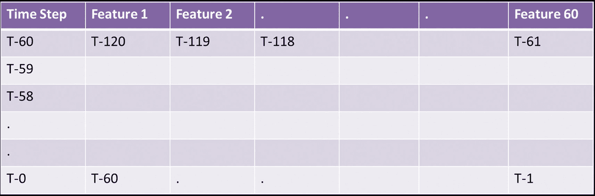

一个表格展示了 7 列和 7 行。时间步列有从 T-0 到 T-60 的 7 行，特征 1 包含从 T-60 到 T-120 的行，特征 2 包含从 T-119 开始的行。

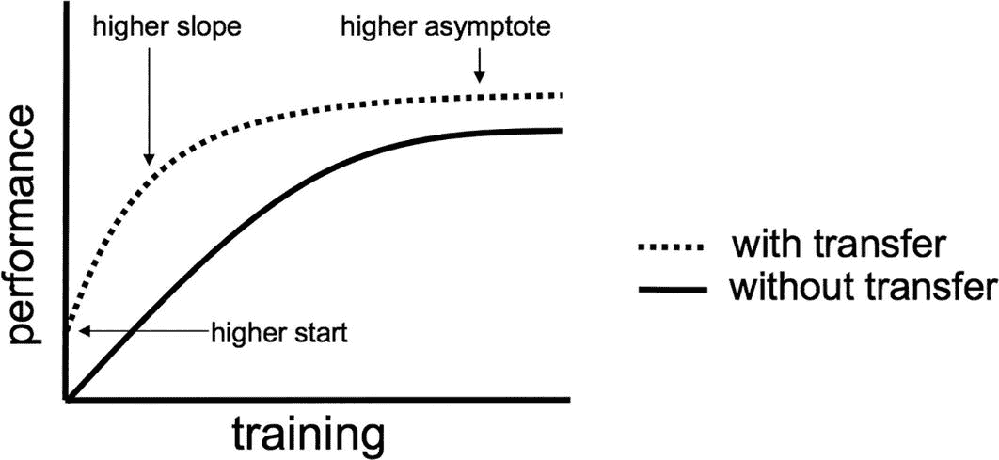

一个关于有无迁移学习时训练与性能的折线图。有迁移学习的图显示性能上升，斜率更高，渐近线也更高。

### 神经网络 – 术语

在下一节中，我们将详细讨论微调神经网络所涉及的更具技术性的建模概念。现在，我们提供一个总结性的参考，列出我们可用于构建和运行模型并实现令人满意性能的主要“杠杆”：

*   **Epoch（轮次）** — 对整个数据集的一次遍历。轮次数是您遍历训练集的次数。
*   **Learning rate（学习率）** — 用于通过梯度下降训练模型的标量。学习率决定了每次迭代权重变化的速度。
*   **Activation function（激活函数）** — 给定一组输入后，节点/神经元的输出，该输出随后用作下一个节点的输入。示例包括 `ReLU`、`tanh`、`sigmoid` 和线性函数。
*   **Regularization（正则化）** — 一种改变学习算法以防止过拟合的技术（和超参数）。正则化率也用于指定正则化的速率。
*   **Batch size（批量大小）** — 在单次迭代中运行的一小部分随机选择的数据子集。1 个 epoch（遍历整个训练集）= 批量大小 * 迭代/步数。
*   **Hidden layer（隐藏层）** — 输入层和输出层之间的层，其中的神经元接收加权输入并使用激活函数产生输出。
*   **Loss function（损失函数）**（或成本函数）—— 输出层给出的预测与真实值之间的偏差有多大？神经网络的目标就是最小化这个偏差。


好的，作为一名高级文档工程师和翻译员，我将严格遵循您提供的注意事项和示例格式，将给定的英文文本翻译成中文。


### 计算多层神经网络的输出

本节的最后一部分，我们将为神经网络内的计算过程提供一些指导。下面描述了如何计算多层神经网络的输出 `ŷ` (`y_hat`)。

对于一个具有 `m` 个特征的输入 `X`：

-   `m` 个特征对应 `m` 个权重（`w1`, `w2`, …, `wm`）
-   我们可以计算输入与权重集合的点积，然后加上偏置：

`z = w1x1 + w2x2 + … wnxn + bias`

-   然后将 `z` 输入到一个激活函数中，以获得隐藏层输出 `h`：（`h1`, `h2`, …, `hn`）
-   隐藏层有 `n` 个神经元
-   `n` 个神经元对应 `n` 个权重（`w1`, `w2`, …, `wn`）

由此我们得到最终输出 `y_hat = h1w1 + h2w2 + … + hnwn`

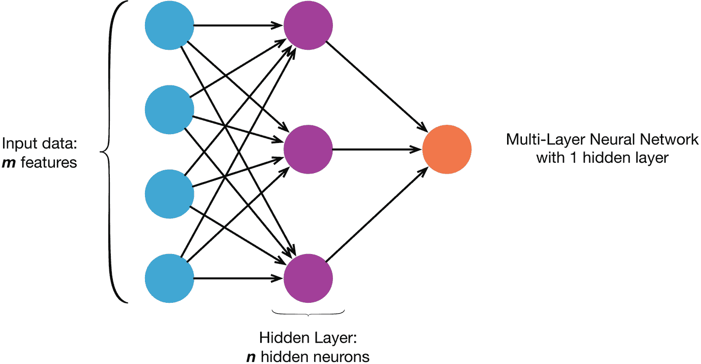

模型图展示了一个多层神经网络，包含输入数据、一个隐藏层以及具有 1 个隐藏层的多层结构。

**图 5-22**
多层神经网络 – 我们如何从输入数据得到输出？

### 使用 Keras 和 TensorFlow 的卷积神经网络：动手实践

**德国交通灯图像分类**

在本实验中，我们将使用 `Keras` 和 `TensorFlow` 构建并训练一个卷积神经网络，以解决一个预测性（复杂图像的多类分类）问题：

1.  克隆下方的 GitHub 仓库：
    [`https://github.com/bw-cetech/apress-5.5.git`](https://github.com/bw-cetech/apress-5.5.git)
2.  将笔记本导入 Google Colab。Colab 对 `TensorFlow` 有更好的支持（无需安装！），因此更容易运行笔记本。
3.  查看右侧面板上的目录，其中包含指向建模过程每个部分的超链接。
4.  运行整个笔记本 – 从 Kaggle 导入代码，执行 EDA、模型准备/图像整理，使用迁移学习构建和运行 CNN，最后执行推理。
5.  完成作为实验一部分的练习，在 markdown 部分“第二次运行 – 早停标准”处停止（我们将在下一节中介绍此内容）。


截图展示了从标签 0 (15) 到标签 61 (282) 的多个德国交通标志。其中包括禁止停车、斑马线、禁止转弯、停车和禁止驶入等标志。

**图 5-23**
图像分类 – 德国交通标志

### 循环神经网络 – 时间序列预测：动手实践

**使用单变量 RNN 进行股票价格预测**

本实验的目标是构建并训练一个用于股票价格（单变量）预测的 LSTM，即预测的股票价格仅取决于先前的时间步长：^(⁷³)

1.  克隆下方的 GitHub 仓库：
    [`https://github.com/bw-cetech/apress-5.5b.git`](https://github.com/bw-cetech/apress-5.5b.git)
2.  将笔记本导入 Google Colab。
3.  运行整个笔记本 – 按照描述将数据上传到（临时）Colab 文件夹并导入，执行 EDA 和数据整理，以便将股票价格数据转换为使用 RNN 进行预测所需的格式。
4.  完成作为实验一部分的练习。
5.  练习 - 使用不同的批次大小重新训练模型，并比较（均方根）误差。
6.  练习 – 使用不同的激活函数（`tanh`）重新训练模型，并比较测试结果（`tanh` 通常比 `ReLU` 能更好地调节循环神经网络的输出）。
7.  拓展练习 – 通过完成“实时股票价格场景”下注释掉的练习，调整 TATA 单变量预测以执行实时股票价格预测。按照步骤导入从 1 月到 D-1 日的主要科技股（例如苹果或特斯拉）的最新股票价格，并执行未来 30 个时间步长的预测。

## 调优深度学习模型

本章的最后一部分，我们将介绍我们可用的众多“性能增强”杠杆，以构建一个可靠的深度学习模型。

##### 激活函数

如前几节所述，神经元使用激活函数根据加权输入信号产生输出信号。因此，实际上，激活函数是对神经元输出的简单映射，其中神经网络中的加权输入被求和并通过激活（或传递）函数。

术语“激活”与神经元被激活的阈值以及相应输出信号的强度有关。简单感知机中使用的 Heaviside 阶跃函数是一种简单的阶跃激活函数，如果求和输入超过 1，则神经元将输出值 1。

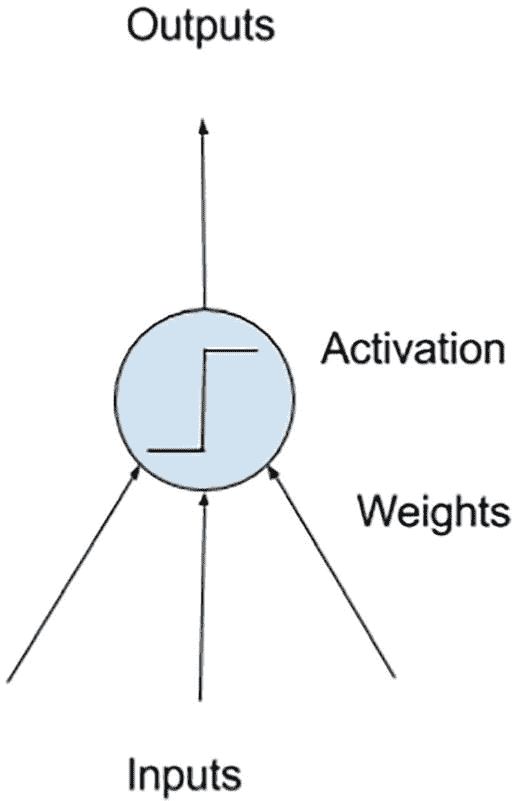

模型图展示了激活/传递函数架构。它包括输入、权重、激活和输出。

**图 5-24**
激活/传递函数架构（显示 Heaviside 阶跃函数）

我们在实践中实际使用的四种主要的非线性激活函数提供了更丰富的功能：

#### （逻辑）Sigmoid 函数

Sigmoid 激活函数具有特征性的“S”形曲线，用于二分类问题。实值输入被“压缩”/映射到 0 到 1 的范围内，表示特定二元输出的概率。

#### 双曲正切函数 (tanh)

`Tanh`（发音为“tanch”）也是一个“S”形曲线，但这次重新调整了逻辑 sigmoid 函数。输出范围从 -1 到 1。由于 `tanh` 的梯度比 sigmoid 更强，因此作为激活函数，`tanh` 通常比 sigmoid 更受青睐。

#### 修正线性单元 (ReLU)

`tanh` 和 sigmoid 都容易出现“饱和”或梯度消失的问题。因此，深度学习模型中最常用的激活函数是更简单的修正线性单元（`ReLU`）。`ReLU` 通过其更简单的数学运算，对负值返回 0，对正值返回 `x`，从而加速了随机梯度下降（将在下一节介绍）的收敛。

在 `ReLU` 激活导致“死亡神经元”（即神经元变得不活跃，对任何输入都输出 0）的情况下，有时会使用一种变体，即 `Leaky ReLU`。`Leaky ReLU` 对于负值有一个小的斜率（设置为超参数^(⁷⁴)），而不是平坦的斜率。

需要指出的是，`leaky ReLU` 并不总是优于 `ReLU` – 如果使用 `ReLU` 激活的模型性能良好，请坚持使用它。

#### Softmax

Softmax 激活函数（或归一化指数函数）是多类分类问题的一个特例，其中输出是离散的（非二元）的，例如大多数图像分类问题（例如，图像是人、建筑物、车辆、道路等）。

`Softmax` 将 logits（神经网络的最后一层）转换为总和为 1 的概率。

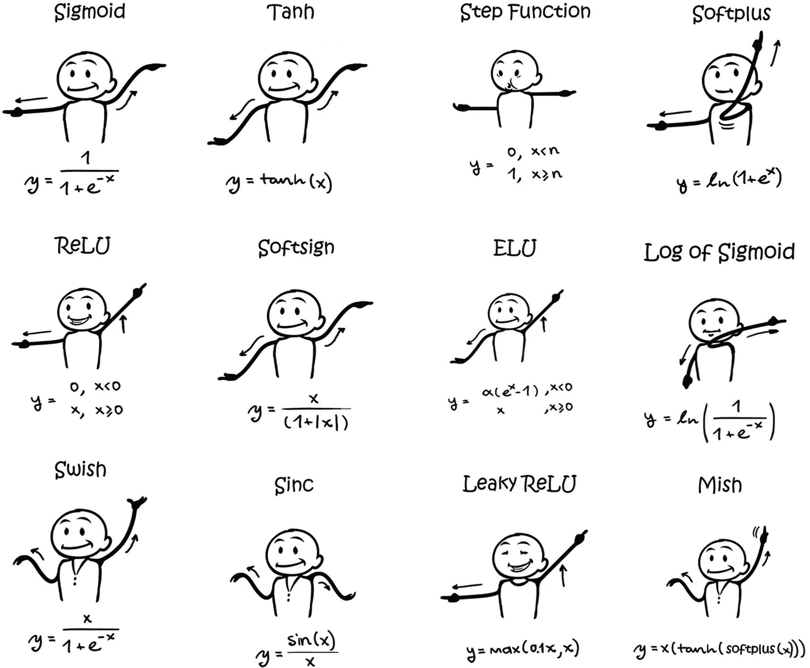

图示展示了包括形状和公式在内的激活函数：sigmoid、tanh、阶跃函数、soft plus、E L U、Log of Sigmoid、Mish、Sinc、Swish、ReLU、Soft sign、Leaky ReLu。

**图 5-25**
激活函数 – 形状和公式


### 梯度下降与反向传播

`梯度下降`是训练神经网络的主要过程。它本质上是一种通过更新神经网络中的权重来最小化**损失**（或**代价函数**）的方法。^(⁷⁵)

对于大多数大数据问题，使用的是**随机梯度下降（SGD）**——每次迭代并非使用整个数据集，而是使用数据的一个样本。

随后执行**前向传播**^(⁷⁶)，输入数据通过网络进行变换，通过隐藏层激活神经元，最终产生一个输出值。然后将此输出与期望（实际）输出进行比较，并计算误差。

#### 反向传播

当上述误差逐层通过网络反向传播时，就会发生`反向传播`，并且权重会根据其对误差的贡献程度进行更新。

该过程反复调整权重，以最小化实际输出与期望输出之间的差异，并对训练数据中的所有行/样本重复此过程（一个**周期**）。神经网络通常会在多个周期上进行训练，通常以 100 个周期为上限。

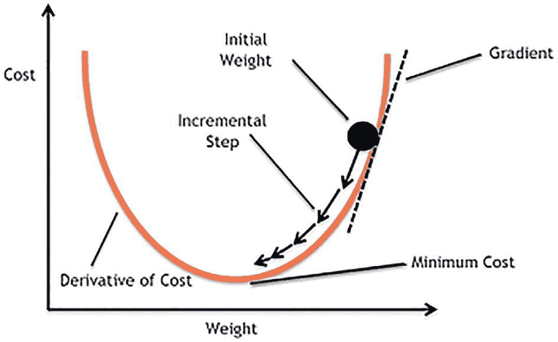

权重与成本之间的抛物线。它说明了`梯度下降`过程，该过程包含诸如成本导数、增量步长、初始权重、最小成本和梯度等因素。

图 5-26

用于最小化神经网络损失的`梯度下降`过程

### 其他优化算法

在实践中，`随机梯度下降`可能会陷入局部最小值，或者收敛时间过长，因此会使用更复杂的变体来获得更好的模型性能。

#### 带动量的随机梯度下降

正如我们在上一节中看到的，`随机梯度下降`解决了`梯度下降`的一个大内存劣势（加载整个数据集来计算损失导数）。`带动量的随机梯度下降`是对基础`SGD`算法的增强，有助于在正确方向上加速梯度向量，从而加快收敛速度。

#### AdaGrad、Adadelta 和 RMSProp

`SGD`需要手动调整网络的学习率，这可能既慢又繁琐——以下三种算法能更有效地更新网络权重。

`AdaGrad`或`自适应梯度算法`是另一种随机优化方法，它试图通过使学习率适应网络参数（权重）来解决这个问题。

另一方面，`Adadelta`使用指数移动平均学习率，以避免`AdaGrad`中学习率过小/收敛缓慢的问题。

`均方根传播（RMSProp）`与`Adadelta`类似，处理`AdaGrad`中学习率急剧下降的问题，但它还将学习率除以梯度平方的指数衰减平均值。

#### Adam

**Adam**（源自**自适应矩估计**）通常是深度学习中的优化算法选择。为了更快地收敛（使用此算法可能是在几分钟、几天或几个月内获得高质量结果的关键），`Adam`同时使用`动量`来加速随机梯度下降过程，以及`自适应学习率`来在训练阶段降低学习率。

`Adam`结合了`AdaGrad`和`RMSProp`算法的最佳特性，以处理噪声问题上的稀疏梯度。

### 损失函数

在我们继续探讨提高深度学习性能的最佳实践之前，让我们更仔细地研究一下神经网络中“损失”或代价函数的概念。

在深度学习中最小化损失函数等同于最小化训练误差或降低神经网络/权重校准过程的成本。

三种最常见的损失函数是用于二分类的**二元交叉熵**、用于多分类的**稀疏分类交叉熵**以及用于回归的**mse（均方误差）**，但与深度学习中的所有事物一样，存在多种变体，在某些条件下可以提供更好的结果：

表 5-1

损失函数比较

| 损失函数 | 类型 | 描述 | 优点 | 缺点 |
| --- | --- | --- | --- | --- |
| 平方误差 (L2) 损失 / 均方误差 (MSE) | 回归 | 实际值与预测值之差的平方 | 通过平方来惩罚大误差 | 对异常值不鲁棒 |
| 绝对误差损失 / 平均绝对误差 (MAE) | 回归 | 预测值与实际值之间的距离 | 与 MSE 相比，对异常值更鲁棒 | 对大误差的惩罚可能不足 |
| Huber 损失 | 回归 | 结合 MSE 和 MAE - 对于小误差是二次的，否则是线性的 | 比 MSE 对异常值更鲁棒 | 收敛速度较慢 |
| 二元交叉熵 | 二分类 | 使用对数损失和 Sigmoid 函数 | 非常适合二分类模型 | Sigmoid 可能饱和并导致梯度消失 |
| 铰链损失 | 二分类 | 主要用于支持向量机 (SVM) | 惩罚错误预测以及低置信度的正确预测 | 仅限于 SVM 模型 |
| 多类交叉熵损失 / 分类交叉熵 | 多分类 | 二元交叉熵损失的推广 | 适用于独热编码的目标变量 | 每个样本应具有多个类别或用软概率标记 |
| 稀疏分类交叉熵 | 多分类 | 分类交叉熵的稀疏目标变量分类版本 | 通过为类别使用单个整数来减少内存和计算开销 | 仅适用于互斥的类别 |
| KL 散度损失 | 多类交叉熵损失 | 衡量一个概率分布与另一个概率分布的差异程度 | 基于概率 | 更常用于逼近复杂函数，而非多分类 |

### 提高深度学习性能

上述深度学习模型的内部工作原理有助于理解“引擎盖下”发生的事情，而所描述的用于改进结果的选项在某种程度上是实验性的，与我们所面对的具体数据集以及业务或组织问题密切相关。

然而，如果我们着手提高神经网络性能，应该从哪里开始呢？我们应该采用最佳实践方法，几乎总是从（并以）审查底层数据开始：^(⁷⁷)

1.  审查数据
    *   创造更多数据
    *   重新缩放数据
    *   转换数据
    *   特征选择
2.  引入更复杂的算法
3.  调整超参数
4.  尝试算法集成
5.  获取更多数据

除了这些实现更高模型性能的核心原则外，还应在模型维护中内置定期重构，以确保代码尽可能高效，并且（Python）库和函数未被弃用。

### 深度学习最佳实践 – 超参数

上述高级步骤具有参考价值，但在数据审查过程用尽之后，我们具体可以使用哪些超参数来调整和校准模型输出呢？下面我们将这些超参数分为两类：网络调整和过程调整。^(⁷⁸)

#### 网络调整

##### 更深的网络/更多层/更多神经元

添加更多隐藏层/每层更多神经元意味着我们向模型添加了更多参数，从而使模型能够拟合更复杂的函数。

##### 激活函数

如上所述，通常在**CNN**中，外层使用`ReLU`来解决梯度消失问题，并结合`Sigmoid`（二分类）或`Softmax`（多分类）。对于`RNN`，使用`tanh`来克服梯度消失问题，因为它的二阶导数可以在归零之前维持较长的范围。


### 神经网络集成

与随机森林是决策树模型的增强版以防止机器学习中的过拟合类似，我们可以在深度学习中采用集成方法——使用不同模型配置的多个神经网络来防止同样的问题。然而，这确实会带来训练和维护多个模型的计算开销。更好的方法是使用下文所述的丢弃法。

### 批量归一化

深度神经网络的训练过程也对初始随机权重和学习算法的配置很敏感。对网络层的输入进行归一化（`批量归一化`）可以通过对数据进行中心化和缩放，帮助人工神经网络运行得更快、更稳定。

### 池化

卷积神经网络中的多个卷积层可以非常有效，既能学习低级特征（例如线条），也能学习高级特征，如外层中的形状或特定物体。

然而，这些“特征图”与输入中特征的**精确**位置紧密相关。这种“不灵活性”可能导致对于微小的图像变化（如裁剪、旋转、平移）产生不同的特征图，从而导致模型对新数据的泛化能力下降。

池化（通过池化层实现）用于对卷积神经网络中的卷积层进行下采样，并避免过拟合于精确的图像特征。这种输入信号的低分辨率版本仅保留重要的结构元素，类似于机器学习中“剪枝决策树”的效果。

### 图像增强

图像数据增强用于人为地扩大卷积神经网络训练数据集的大小。其理念是，在更多数据上训练意味着模型更熟练。使用 Keras 中的 `ImageDataGenerator` 类来生成增强图像的批次，我们可以通过多种方式实现这一点：

*   图像的随机旋转
*   图像内物体的平移
*   剪切（沿轴扭曲）
*   图像翻转（例如，上下翻转）

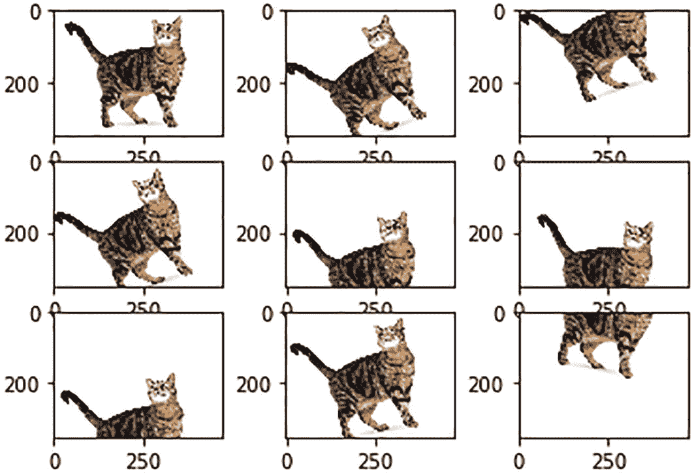

一张猫的增强图像，包含 8 个图像数据集，这些数据集由原始图像的旋转、偏移和扭曲副本组成。

**图 5-27** Keras 中的图像增强，使用原始图像的旋转、偏移或扭曲副本来增强图像数据集

## 过程调优

### 轮数与批量大小

增加轮数（对整个训练集的完整采样）通常会产生更好的性能，但仅限于一定程度。当验证（测试）准确率下降而训练准确率仍在上升时，这应该为轮数设置一个上限，否则我们本质上是在过拟合模型。与其反复试验，我们可以通过实施早停标准来控制轮数设置过高的问题，以避免在训练集上过拟合。

我们的批量大小——前向传播中使用的输入数据样本的大小——是我们可以使用的另一个杠杆。使用过大的批量大小会对泛化产生负面影响，也就是说，网络的测试准确率会更差，因为我们在训练过程中减少了梯度下降的随机性。对于较大的数据集（例如，> 10,000 张图像），经验法则是首先使用默认值 32，如果模型欠拟合或训练时间过长，则增加到 64、128 和 256。

### 学习率

学习率是一个超参数，用于影响梯度下降过程的速度。设置过高意味着算法会来回震荡而无法达到局部最小值，而设置过低则收敛可能需要很长时间。

### 正则化

正则化是一种修改学习算法的通用技术，目的是使模型更好地泛化，即避免过拟合。在机器学习中，正则化惩罚特征系数，而在深度学习中，正则化惩罚节点/神经元的权重矩阵。

正则化系数（一个超参数）控制正则化——如果这个正则化系数过高，以至于某些权重矩阵几乎等于零，我们就会得到欠拟合。L1 和 L2 是最基本的正则化类型，它们通过添加另一个称为正则化项的项来更新通用代价函数：

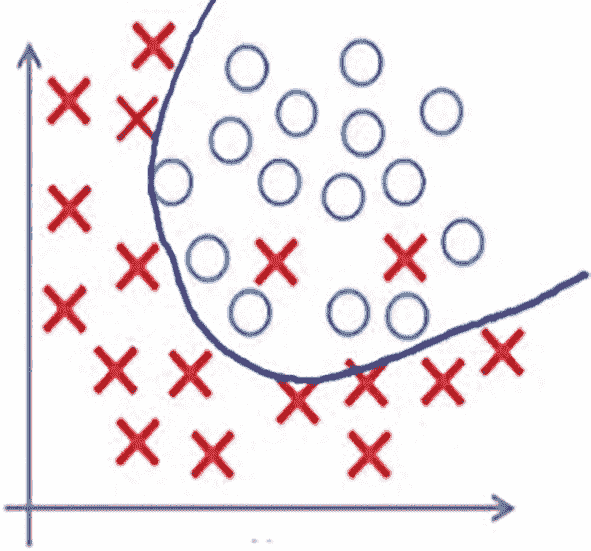

一个说明适当模型拟合的示意图。它在 y 轴和 x 轴之间形成一个侧抛物线。

**图 5-28** 适当的模型拟合

`代价函数 = 损失 + 正则化项`

### 丢弃法

当数据集相对较小时，深度学习神经网络容易过拟合。丢弃法是一种计算成本低且有效的正则化方法，用于减少过拟合并改善泛化误差。实际上，丢弃法通过在训练期间随机丢弃节点（神经元），在单个模型中模拟了大量不同的网络架构。^(⁷⁹)

丢弃法的一个良好起点是将其设置为 20%，如果模型影响很小，则增加到例如 50%。设置过高会导致欠拟合。

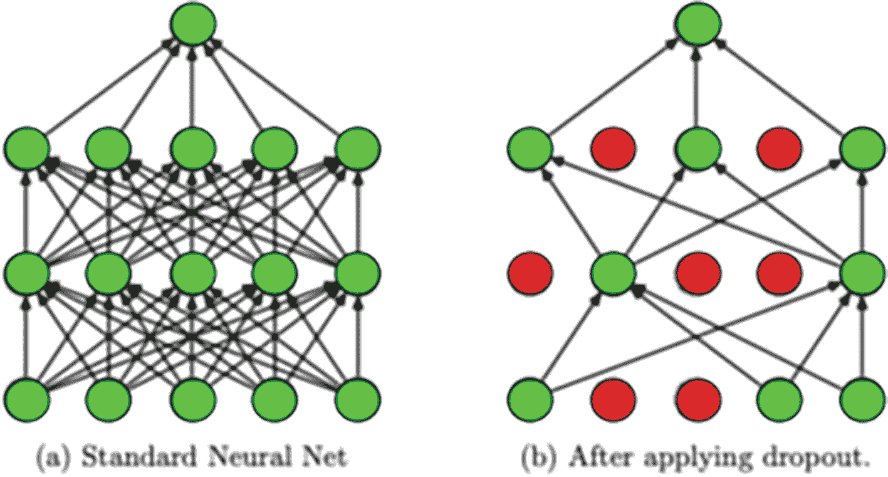

两个模型示意图说明了丢弃法。标准神经网络和应用丢弃法后的标准神经网络。标准神经网络具有相同的神经元或节点，而应用丢弃法后，绿色神经元与红色神经元混合。

**图 5-29** 丢弃法示意图 ([`medium.com`](http://medium.com))

### 早停

我们应该在验证数据集上的性能开始下降时停止训练，例如，通过以下方式：

*   在给定轮数内指标无变化
*   指标的绝对变化
*   在给定轮数内观察到的性能下降
*   在给定轮数内指标的平均变化

这在 Keras 中使用 `EarlyStopping` 函数实现。下面的示例监控并试图最小化各轮次的验证损失：

```
EarlyStopping(monitor='val_loss', mode='min')
```

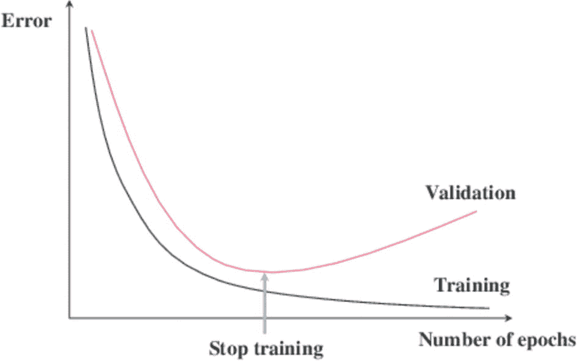

一个显示轮数与误差的折线图。折线图在停止训练后上升。

**图 5-30** Keras 中的早停

### 迁移学习

迁移学习实际上是深度学习模型的“加速器”——本质上，我们是将一个预训练模型作为另一个（不同但相关）模型的起点。在深度学习中，它常用于减少从头开发神经网络模型所需的计算量，有许多研究模型常用于迁移学习：

*   牛津 VGG 模型
*   谷歌 Inception 模型
*   微软 ResNet 模型
    *   另请参见 [`https://github.com/BVLC/caffe/wiki/Model-Zoo`](https://github.com/BVLC/caffe/wiki/Model-Zoo)

VGG 模型用于我们上述动手实验中的迁移学习练习（使用 Keras 和 TensorFlow 的卷积神经网络）。


### 总结

我们刚刚详细探讨的穷举式神经网络和流程调优显然十分复杂。所描述的最佳实践技术往往相当模糊，可用的选项范围及可配置的设置也难以确定，尤其是在需要相对快速获得结果的情况下。但快速取胜总是可能的，只要采用结构化的方法并迭代监控性能，坚持追求更好的结果通常都会得到回报。

虽然本章内容已近尾声，但下一章我们将探讨如何将深度学习的最佳实践与训练（及测试）自动化相结合，以帮助加速机器学习和深度学习模型的微调过程。不过在此之前，我们将通过两个深度学习模型调优实验来结束本章。

### Softmax：动手实践

使用 Softmax 激活 Logits

**简单的动手实验，了解 Softmax 激活函数如何接收最后一个神经网络层，并将输出转换为总和为 1 的概率：**

1.  克隆以下 GitHub 仓库：

    [`https://github.com/bw-cetech/apress-5.6.git`](https://github.com/bw-cetech/apress-5.6.git)

2.  在 Jupyter Notebook 中运行 Python 代码，了解 softmax 是如何计算的。

3.  作为拓展练习，尝试创建一个存储 softmax 激活公式的 Python 函数，并调用该函数。


一个公式：e 的 y_i 次方除以 sigma 从 j 等于 0 到 n 的 e 的 y_j 次方之和。

图 5-31

Softmax 激活函数

### 早停法：动手实践

避免深度学习中的过拟合

**在本实验中，我们将继续使用德国交通灯图像分类数据集，并研究早停法标准对模型性能的影响：**

1.  继续使用之前的笔记本（使用 Keras 和 TensorFlow 的卷积神经网络：动手实践）

2.  从“第二次运行 – 早停法标准”部分开始，运行笔记本的剩余内容

3.  完成实验中的练习

脚注 1 2 3 4 5 6 7 8 9 10 11 12 13 14

