# 6. AutoML、AutoAI 与 NoLo UI 的兴起

在迄今为止相对较短的时间内，全球各组织在机器学习和深度学习方面的应用增长异常迅猛。然而，这并未总能转化为商业成功，零售行业的采用率低得令人失望（英国为 11.5%^(⁸⁰)），且在所有行业中，仅有略高于 50% 的原型最终投入生产。^(⁸¹) 从历史上看，许多解决方案在操作上是孤立的，需要博士级别的统计学家来解释代码繁重的技术模型。

再加上对用于训练的虚拟或合成数据集的依赖，缺乏（或更糟的是，接口损坏）在 Python 笔记本（`Jupyter`、`Colab` 等）中进行的训练和测试，以及与这些设计不佳的应用程序相关的“技术债务”开始成为组织的负担。

时至今日，我们开始看到“AutoML”^(⁸²) 和“AutoAI”工具的部署日益增多，这些工具更适合企业级部署——从全自动数据导入，到接口编排、机器/深度学习，再到部署。此外，这些工具越来越易用，并且重要的是，通过内置的用户友好型“NoLo”图形用户界面以及嵌入的数据可追溯性和可审计性，使得跨部门的多个利益相关者都能理解。

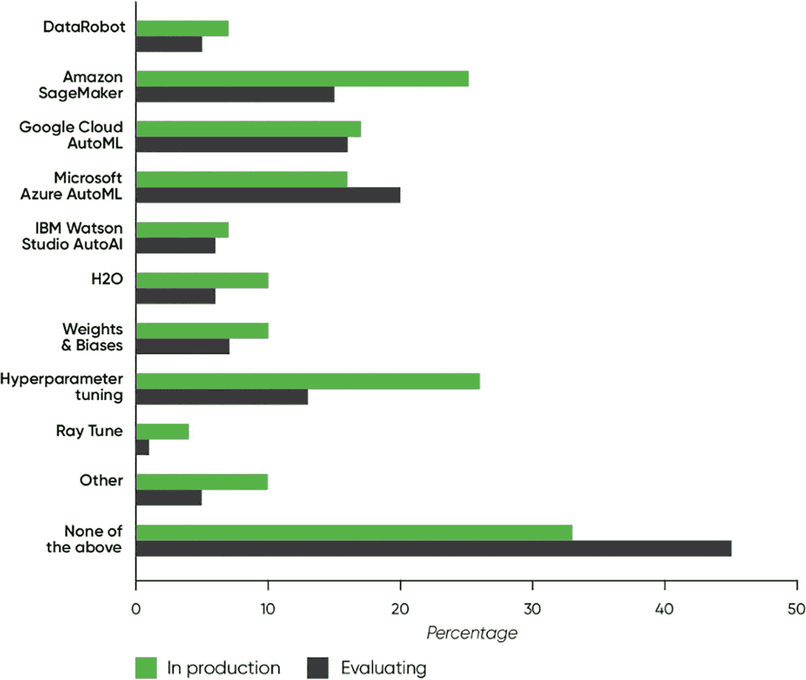

一个水平条形图，显示了 AutoML 工具的生产和评估百分比。Amazon SageMaker 和超参数调优在生产中占比较高，而 Microsoft Azure AutoML 在评估中占比较高。

图 6-1

AutoML 工具的使用情况（来源：O'Reilly 2022 年企业 AI 采用情况报告）

在 AutoML/AI 工具以及所谓的 NoLo（无代码/低代码）应用程序^(⁸³) 的使用和协作方面发生的这种阶跃式变化，正值企业从“基于规则”的机器人流程自动化（RPA）转向增强型认知机器人流程自动化（CRPA），并融入 AI 驱动的“上下文”之际。

这一点在聊天机器人的演变中或许最为明显，智能虚拟代理（IVA）或“对话式”聊天机器人已经取代了传统的、基于规则的聊天机器人。但这一趋势也体现在增强工具的普及上，例如在 PowerBI 之上使用 Microsoft PowerAutomate，在光学字符识别（OCR）之上使用 NLP/文本分析，以及在医疗保健行业，在患者筛查（RPA）之上使用特定的行业增强功能，如（X 射线）诊断（AI）。

推动这种业务转型的本质上是追求“雇主的梦想”——工具的民主化，这些工具普遍受欢迎、高度可视化且具有协作性，同时能够为组织执行通常复杂的未来结果预测。因此，本章的目标是引导读者踏上实现这一目标的道路，培养一种“生产思维”，以交付“企业级、全集成、全栈”的 AI 应用和解决方案。

在首先重新审视端到端的机器学习流程并介绍作为 AutoML 基础的贝叶斯优化之后，我们将动手实践 Python 模型自动化库，然后重点关注日益增长的自动化 AI 工具生态系统。本章的实验绝非详尽无遗，将重点介绍一些用于 AutoML 和 AutoAI 的领先同类最佳 NoLo 工具，包括 IBM Cloud Pak for Data、Azure Machine Learning 和 Google Teachable Machines。

## 机器学习：流程回顾

我们首先回顾数据管道编排和端到端机器学习流程。作为当今大多数内置 AutoML 功能的基础——几乎所有 AutoAI 工具都基于以下一系列步骤——在此打下基础将为本章后续内容提供参考，涵盖从重要的贝叶斯优化与推理，到自动化 Python 建模库，再到实践实验室中涉及的 AutoML/AutoAI 工具。

在实践中，并非所有内容都属于 AutoML 的范畴，但如图 6-2 所示，我们可以将这些步骤分为建模前和建模后流程。从原始数据导入开始，AutoML/AutoAI 依赖于流畅的数据管道编排，贯穿这些建模前和建模后的步骤，直至超参数调优和最终算法选择。当今领先的 AutoAI 产品甚至包含了“重新训练”流程的自动化，即监控“数据漂移”，并在底层数据集出现统计显著偏差时触发新的训练流程。^(⁸⁴)

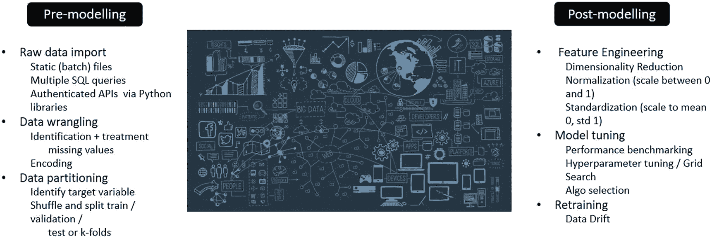

建模前（原始数据导入、数据整理、数据分区）和建模后（特征工程、模型调优和重新训练）的示意图。该图展示了上述流程网络。

**图 6-2** 机器学习中的自动化流程

正如我们稍后将看到的，^(⁸⁵) 上述自动化通常被归结为构建和评估候选模型管道的四个核心流程^(⁸⁶)：

*   数据预处理
*   自动化模型预选
*   自动化特征工程
*   超参数优化

## 全局搜索算法

虽然上述许多流程可以在 AutoML 和 AutoAI 中实现自动化，但一旦数据被导入，模型训练过程实际上会使用全局搜索算法来“优化”看似无限的特征和特征权重组合。^(⁸⁷)

随机采样是一种方法，网格搜索也是如此，后者从参数/特征的搜索空间中更均匀地抽取样本。在这两种情况下，目标都是最小化成本函数或目标函数——通常是实际预测/预报与模型输出之间的差异/增量“分数”。

### 贝叶斯优化与推理

然而，随机采样和网格搜索都有其局限性——两者都没有利用之前的样本结果来指导/改进下一次迭代的采样。当今备受关注的一种更好/更复杂的方法^(⁸⁸) 是使用贝叶斯优化，其中“调优算法”根据上一次迭代的“分数”来优化每次迭代中的参数选择，也就是说，贝叶斯优化“自适应地”以概率方式采样更可能“最优”的数据，而贝叶斯推理则“推断”结果/分数。

在底层，贝叶斯优化试图找到一个代理函数来优化数据、特征、算法和超参数，以便逼近目标函数。^(⁸⁹) 通常，代理函数使用监督回归技术（如随机森林或高斯过程回归）来总结目标函数的条件概率。对于后者，需要一个核函数来控制目标函数的形状——默认使用径向基函数（RBF），但不同数据集的性能可能决定使用不同的核函数。

贝叶斯优化在解决维度/特征少于 20 个的问题时效果最佳，因此对于大型数据集，应首先采用主成分分析等降维技术。

### 贝叶斯推理：动手实践

**搜索优化性能基准测试**

**本实验的目标是比较使用 (a) 随机采样、(b) 网格搜索和 (c) 贝叶斯优化时的机器学习模型性能**

1.  克隆以下 GitHub 仓库：

[`https://github.com/bw-cetech/apress-6.2.git`](https://github.com/bw-cetech/apress-6.2.git)

2.  浏览笔记本，该笔记本导入数据集（也提供在上方仓库中），设置数据整理管道，然后使用上述三种不同技术搜索预测心脏信号的最优模型参数

3.  练习——尝试绘制三种技术的平均测试分数（AUC）

4.  练习（进阶）——导入一个更大的物联网或零售数据集，更新整理管道和建模假设，并查看平均分数，以了解贝叶斯推理如何优于其他技术

## 用于自动化的基于 Python 的库

贝叶斯优化是 AutoML 和 AutoAI 中使用的主要技术，用于以概率方式搜索底层（代理）模型可用的多维参数空间。

虽然对于非程序员来说，它显然不如我们稍后将介绍的 NoLo 代码工具那样易用和可访问，但我们现在将首先介绍大量可用于 AutoAI 的 Python 库。

### PyCaret

虽然需要 Python 经验，但 PyCaret 因其加速机器学习模型训练的方法而被宣传为低代码机器学习。其独特卖点在于机器学习的民主化，如图 6-3 中训练数据集进行异常检测的示例所示，只需最少的端到端编码。

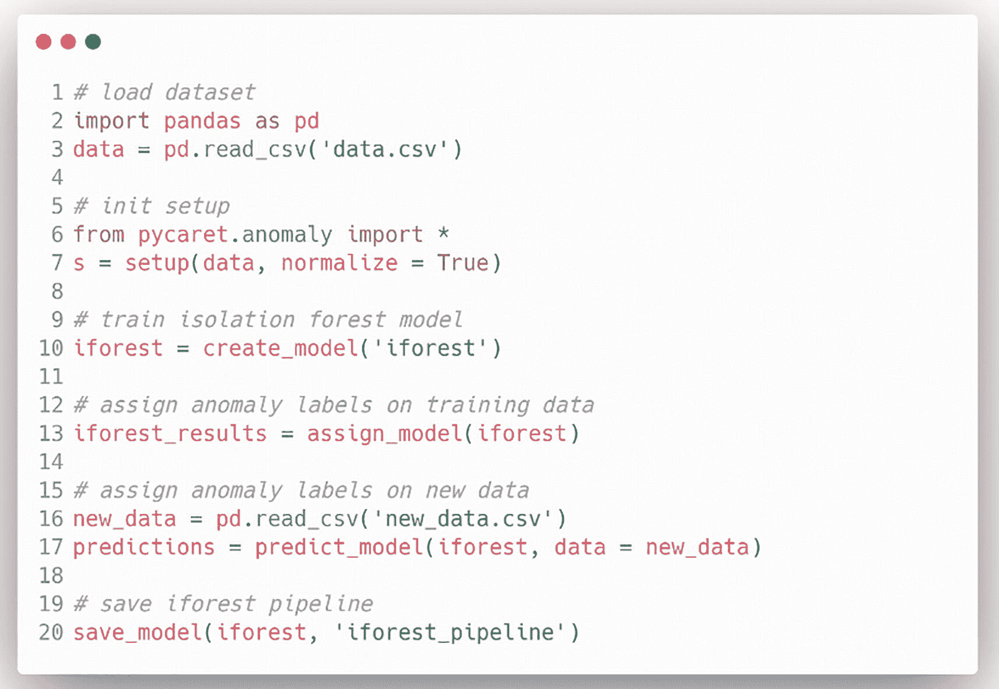

使用 PyCaret 机器学习方法进行端到端编码的示意图。

**图 6-3** 用于异常检测的 PyCaret

我们将在最后一章中，作为将保险保费计算器部署到 Azure 的广泛实践实验室的一部分，来研究 PyCaret。

### auto-sklearn

`auto-sklearn` 自动化了来自 `scikit-learn` 的数据科学库，以便为监督分类和回归数据集确定有效的机器学习管道。

面向“企业”的机器学习，优先考虑数据团队的效率和生产力，对非数据科学家来说更易上手，但与 PyCaret 一样，仍然涉及 Python 编码。它内置了预处理和数据清洗、特征选择/工程、算法选择、超参数优化、基准测试/性能指标以及后处理功能。

`auto-sklearn` 的一个变体是 `Hyperopt-Sklearn`，它使用 `Hyperopt`^(⁹⁰) 来描述 `sklearn` 预处理和分类模块的可能配置的搜索空间。

### Auto-WEKA

`Auto-WEKA` 实际上是一个用于算法选择和超参数优化的 Java 应用程序，它基于新西兰怀卡托大学的 WEKA^(⁹¹) 机器学习平台构建。`pyautoweka` 是其 Python 封装器。

与 `auto-sklearn` 相比，`Auto-WEKA` 同时选择学习算法并配置超参数，旨在帮助非专业用户更有效地识别适合应用的机器学习算法和超参数设置，并提升性能。

#### TPOT

`TPOT`（基于树的流水线优化工具）采用基于树的结构/遗传编程来优化机器学习流水线，旨在数小时内完成大规模数据集的训练。`TPOT` API 支持监督分类和回归任务，如图 6-4 所示，在迭代训练、测试和递归特征消除之前，会进行数据整理和主成分分析，最终得出得分最高的流水线。

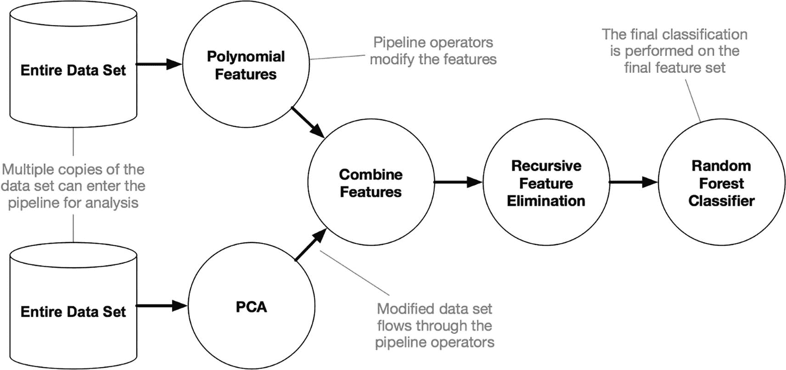

`TPOT` 操作的树状结构。它从整个数据集开始，依次进行多项式特征、主成分分析、特征组合、递归特征消除和随机森林分类器。

图 6-4

`TPOT` 操作（来源：towardsdatascience）

`pipeline_optimizer` 变量中使用的 `generations` 参数是运行流水线优化过程的迭代次数——虽然可以相对较快地获得一个不错的流水线（和机器学习模型），但需要更多代来确保获得性能最佳的流水线，尤其是在处理大型数据集时。

#### 使用 TPOT 进行 Python 自动化：动手实践

遗传编程自动机器学习

**本实验的目标是使用 TPOT 优化，在合成分类问题上找到性能最佳的流水线和算法。代码示例还展示了如何在 Python 中自动化实现直接连接、解压和读取网络数据集：**

1.  克隆以下 GitHub 仓库：

    [`https://github.com/bw-cetech/apress-6.3.git`](https://github.com/bw-cetech/apress-6.3.git)

2.  逐步浏览笔记本，直接从 UCI 网站读取数据集，解压文件，并导入较小的 csv 数据集

3.  执行基本的探索性数据分析、数据整理、数据分区，并配置 K 折交叉验证（步骤 2、3 和 4）

4.  运行 `TPOT` 优化步骤，观察几分钟后开始出现的流水线/模型得分。整个过程不应超过 30 分钟

5.  练习——流水线基于准确率评分——通过其他指标（例如召回率、精确率或 fbeta）评分，检查模型是否具有良好的类别区分度（即模型不仅仅预测单一类别）

6.  练习——执行更复杂的数据整理，例如对名义分类变量进行独热编码、改进特征选择和/或特征缩放

7.  打开导出的流水线文件 `tpot_best_model.py`，观察性能最佳的算法及其相关的超参数

8.  练习（进阶）：将数据替换为更大的银行数据集。通过使用 GPU 加速器在 Colab 上执行来加快运行时间，并比较 10 代内的流水线性能

## AutoAI 工具与平台

现在我们进入本章的主要部分——介绍几个关键的 AutoAI “NoLo” 工具。^(⁹²) 目的是让读者了解这些工具如何凭借其简洁性、高度可视化、可转化性和协作性的独特卖点赢得商业领袖的青睐，并越来越多地被人工智能工程师和数据科学家采用，以适应/实现“企业级”业务目标。

本节以几个动手实验作为结尾，涵盖这些工具在特定人工智能用例中的应用。

### IBM Cloud Pak for Data

IBM Cloud Pak for Data 以“数据编织”架构的数据和人工智能平台形式呈现，本质上将多个传统工具（包括 Watson Studio、Decision Optimization 和 Watson Assistant）整合到一个平台解决方案中，并在其上添加了 AutoAI。

该产品的“数据编织”支持意味着产品支持多个 API，可访问分布在多云环境（无论是 IBM Cloud、AWS、Azure 还是 GCP）中的结构化和非结构化数据源。这支撑了该产品的独特卖点——IBM 声称数据编织架构使数据访问速度提高 8 倍，同时减少的 ETL 请求使生产力提升 25-65%。此外，还有数据治理方面的好处——由于产品内置的智能数据消除了手动编目的需要，可节省 2700 万美元的成本。

AutoAI 是之前内置于 Watson Studio 中的图形化工具，它自动化了人工智能流程——分析数据，发现最适合特定预测建模问题的数据转换、算法和参数设置。^(⁹³) 如下所示，这些自动化本质上符合前面描述的四个核心人工智能自动化流程：

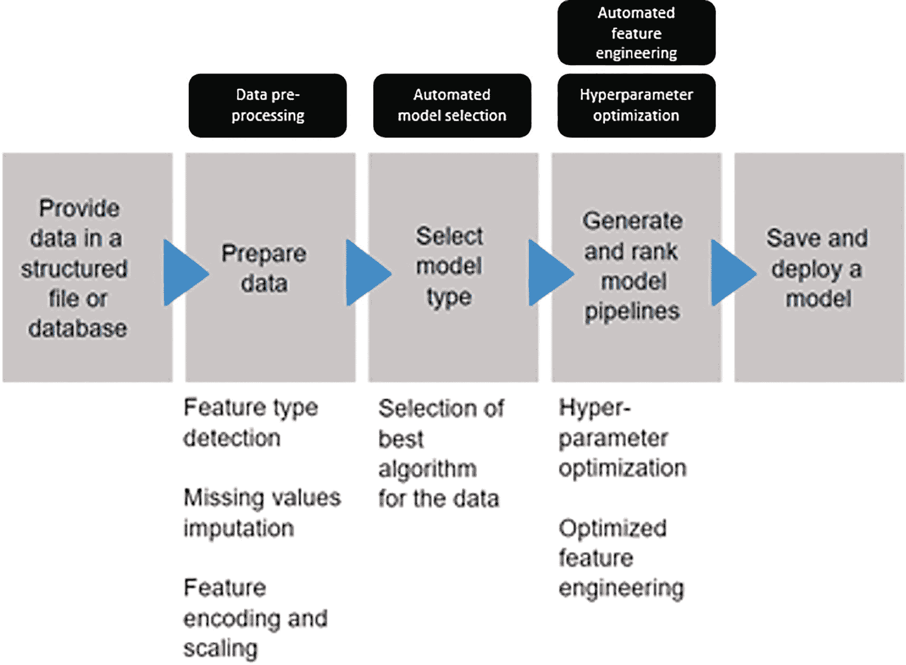

人工智能自动化流程图。它从提供结构化文件或数据库中的数据开始，然后准备数据、选择模型类型、生成和排序模型流水线，最后保存和部署模型。

图 6-5

IBM Cloud Pak for Data：AutoAI 自动化

AutoAI 将底层自动化的结果显示为模型候选流水线，并按排行榜排序，供最终用户选择。

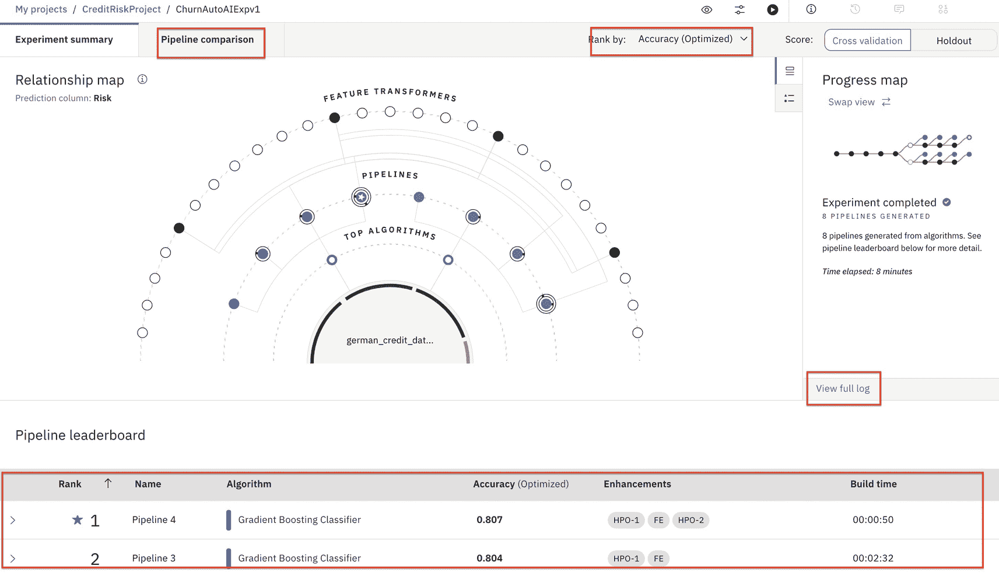

一个窗口屏幕显示流水线排行榜，用于检测流水线排名、准确率、算法和增强功能。屏幕左侧包含一个进度图。

图 6-6

IBM AutoAI – 模型流水线排名

虽然与贝叶斯优化类似，但 AutoAI 实际上使用 `RBfOpt` 作为其全局搜索算法。与将高斯模型拟合到未知目标函数的贝叶斯优化不同，`RBfOpt` 拟合径向基函数以找到最大化目标函数的超参数配置。^(⁹⁴)

### Azure 机器学习

回到第 1 章和第 4 章，我们曾了解过 Azure 机器学习工作室。微软将在 2024 年弃用这个“经典”界面，并将该工具迁移到 Azure 机器学习。其外观和感觉与最初的“工作室”版本非常相似，但与 Azure 增强的云服务集成以及内置的自动化机器学习意味着 Azure ML 在功能上与 IBM Cloud Pak 相当。

微软将 AzureML 定位为用于大规模构建关键业务机器学习模型的企业级服务。该产品具备 MLOps 模型治理和控制功能，并声称可减少 70% 的模型训练步骤，以及（作为无代码工具有点矛盾的是）减少 90% 的代码行数。

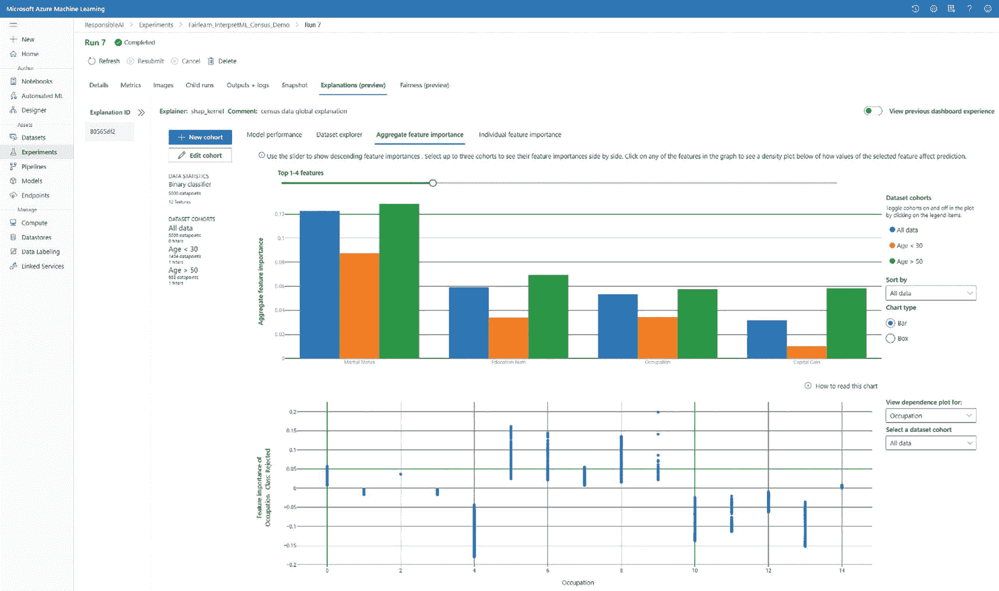

一个窗口屏幕显示微软 Azure 机器学习。它包括一个关于聚合特征重要性的条形图和一个关于特征重要性职业类别被拒绝的折线图。

图 6-7

Azure 机器学习用户界面

### Google Cloud Vertex AI

`Vertex AI` 现已成为谷歌用于 API 驱动型 AI 自动化的主要平台。它既包含用于在图像、表格、文本和视频数据集上无需编写代码即可训练模型的 `AutoML` 部分，也包含用于运行自定义训练代码的 `AI Platform` 部分。我们将在下面的动手实验中看到的 Google Teachable Machine，是谷歌 `AutoML` 平台的一部分。

`Vertex AI` 平台内完整的 MLOps 工具生态系统过于庞大，此处无法一一列举^(⁹⁵)，但值得关注的是 `Vertex AI Pipelines`——一项无服务器服务，可运行我们稍后将介绍的 `TensorFlow Extended` 和 `Kubeflow` 管道。秉承统一数据与机器学习的主题，`Vertex AI` 还提供了与 `BigQuery`^(⁹⁶) 的多种集成。

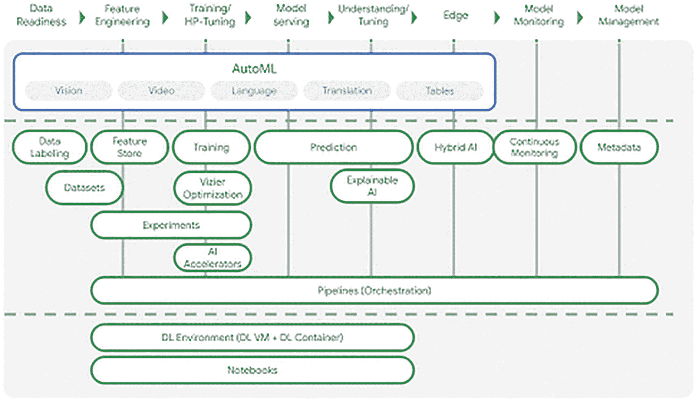

`Vertex AI` 管道的示意图。步骤包括数据准备、特征工程、训练超参数调优、模型服务、理解调优、边缘计算、模型监控和管理。

#### Google Cloud Composer

作为 `TensorFlow` 的创建者，谷歌的 AI 自动化范围超越 `Vertex AI` 也就不足为奇了。`Google Cloud Composer` 是 `Apache Airflow` 的托管版本，用于编排数据管道。其工作流和 GCP 架构包括用于导入和整理的 `Dataprep`、用于数据转换的 `Cloud Dataflow`、用于模型训练的 `BigQuery ML`，以及用于管道编排数据的 `Cloud Composer`。

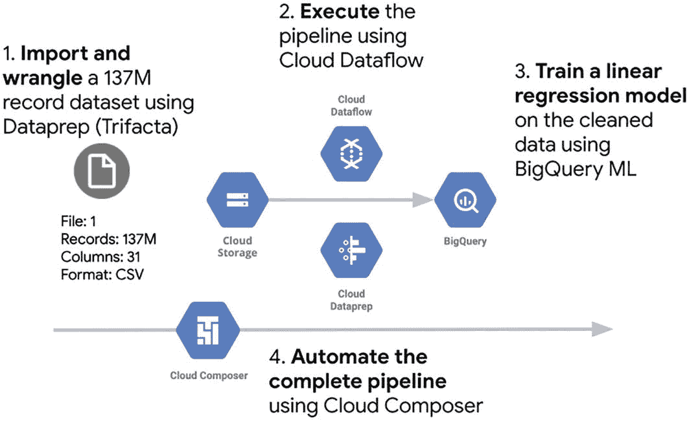

`Google Cloud Composer` 的示意图。1. 导入和整理。2. 执行。3. 训练线性回归模型。4. 自动化完整管道。它包括从云存储到 BigQuery 的示意图。

图 6-8

使用 `Google Cloud Dataprep API` 通过 `Cloud Composer`^(⁹⁷) 触发自动化数据整理任务

### AWS SageMaker Autopilot

与 `Google Vertex AI` 类似，`Amazon SageMaker` 堆栈包含多个用于 `AutoML`^(⁹⁸) 的工具，主要包括 `Amazon SageMaker Studio`、`Amazon SageMaker Autopilot` 和 `SageMaker Data Wrangler`。

`Amazon SageMaker Studio` 提供了推荐模型，可用作定制的构建模块；而 `Autopilot` 则在 `Data Wrangler` 执行必要的整理任务（例如自动填充缺失数据、显示列统计信息、编码非数值列以及提取日期和时间字段）后，简化了机器学习模型的构建过程。

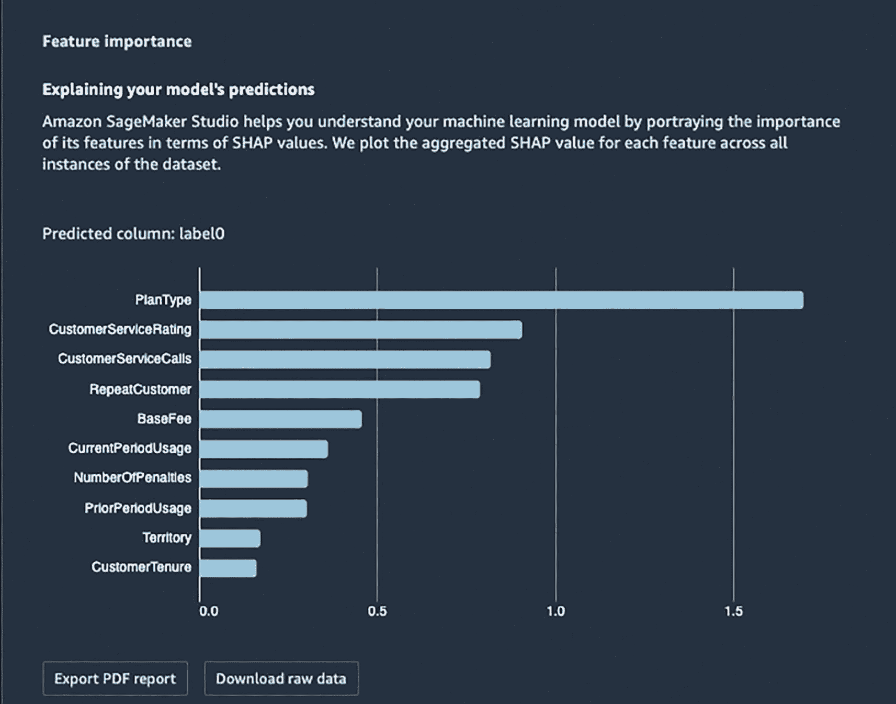

一份导出的 PDF 报告描绘了一个水平条形图，显示了数据所有实例中每个特征的聚合 SHAP 值。其中包括计划类型、客户服务评级、基本费用等。

### TensorFlow Extended (TFX)

`TensorFlow Extended (TFX)` 徽标模型的示意图。

我们在本节中提到的最后一个 `AutoML` 工具是 `TFX`。尽管由谷歌开发，`TensorFlow Extended (TFX)` 是一个开源工具，在此我们将其视为独立的工具。`TFX` 专为可扩展、高性能的机器学习生产管道/部署而构建，它将 `TensorFlow` 执行管道和 `tf.data` API 扩展到端到端的 MLOps。

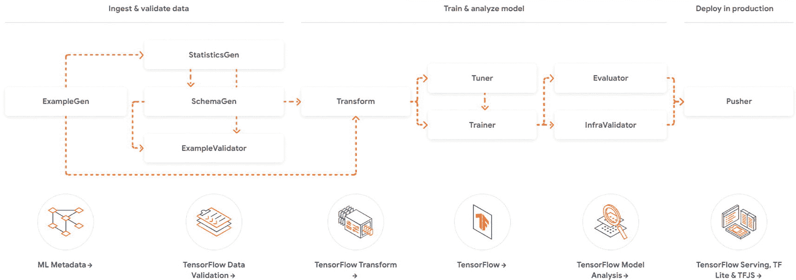

`TensorFlow Extended` 管道操作的示意图。它包括以下步骤：摄取和验证数据、训练和分析模型，以及部署进行预测。

图 6-9

`TFX` 管道操作

多个知名品牌使用 `TFX`，包括 Spotify（用于个性化推荐）和 Twitter（用于推文排序）。尽管 `TFX` 严格来说并非用于 AI 自动化的无代码工具，但我们将在下面的一个动手实验中了解其工作原理。

### 总结

以上对当前主要 `AutoAI` 工具的概述为本章节画上了句号。虽然许多工具致力于整合无代码用户界面，以确保利益相关者的参与度超越数据团队孤岛，但其中许多应用程序仍需支持使用 Python 进行模型定制。在下一章中，我们将把注意力转向开发 AI 应用程序——具体来说，是将后端模型从简单的脚本转变为带有前端的“全栈”解决方案。

### 使用 IBM Cloud Pak for Data 进行 AutoAI：动手实践

用于预测信贷违约的 AUTOAI

**现在我们来看一下我们的 AutoAI 工具——首先是 IBM Cloud Pak，我们将在其中运行一个 AutoAI 实验，用于预测可能贷款违约的客户：**

1.  从 `https://ibm.github.io/ddc-2021-development-to-production/setup/` 下载实验资产

2.  通过以下链接注册/登录 IBM Cloud Pak

    `https://dataplatform.cloud.ibm.com`

3.  设置您的 CloudPak 环境

4.  我们需要配置 `WATSON Studio` – 添加一个机器学习服务，然后创建一个项目和部署空间

5.  运行 `AutoAI` 以选择特征/选择最佳算法来预测信用贷款违约风险最高的客户

6.  部署您得分最高的模型

7.  创建并测试一个在线端点

8.  练习 – 同时创建并测试一个批量端点，在该端点中，以批次形式输入多个客户记录，并返回所有记录的预测结果

9.  练习（拓展） – 尝试将您部署的模型与一个示例（`Flask`^(⁹⁹)）应用程序集成
    1.  复制 `.env` 文件
    2.  添加 API 密钥和端点
    3.  安装并初始化虚拟环境，安装依赖项
    4.  在您的本地机器上运行应用程序
    5.  测试应用程序

10.  **注意：使用后务必按照此处“停止环境”的说明停止您的环境运行时：**

    `https://ibm.github.io/ddc-2021-development-to-production/ml-model-deployment/batch-model-deployment/`

### 使用 Google Teachable Machines 进行医疗诊断：动手实践

无代码机器学习 – X 光图像分类

**本实验通过从 Kaggle 加载 X 光图像并训练预测模型以从扫描图像中检测健康问题（本例中为肺炎），来了解** `Google Teachable Machines` **的运作方式。**

**另请参阅** `https://towardsdatascience.com/build-a-machine-learning-app-in-less-than-an-hour-300d97f0b620` **作为参考：**

1.  通过以下链接从 Kaggle 下载训练图像

    `www.kaggle.com/datasets/paultimothymooney/chest-xray-pneumonia`

注意，这是一个 2GB 的大型数据集，下载可能需要几分钟时间。

1.  将图像解压缩到您的本地驱动器 – 这应在 5 分钟内完成。

2.  访问网址 `https://teachablemachine.withgoogle.com/train/image` 在 Google Teachable Machines 上训练图像：

3.  将解压后的训练文件夹中的正常 X 光扫描图像上传到 Teachable Machines 的类别 1，将肺炎病例上传到类别 2。注意，患有肺炎的 X 光片存在“异常不透明”区域——X 光片更“不透明”/透明度更低。

4.  选择“训练模型”，将批量大小从 16 更改为 128 以加快训练过程

5.  完成后，使用解压图像文件夹中测试集的图像测试模型

6.  导出模型，选择 `TensorFlow` 和 `Keras`。我们将在后面的实验中用到它^(¹⁰⁰)

## TFX 与 Vertex AI Pipelines：动手实践

### 使用 TFX、KERAS 和 VERTEX AI 实现自动深度学习

本实验基于 TensorFlow 教程 [www.tensorflow.org/tfx/tutorials/tfx/gcp/vertex_pipelines_simple](http://www.tensorflow.org/tfx/tutorials/tfx/gcp/vertex_pipelines_simple) – 目标是使用 Google Cloud Vertex Pipelines 自动化一个用于训练深度学习模型的 TFX 管道：

1. 如果您尚未激活 GCP 免费试用，请点击右上角的蓝色“激活”按钮进行激活。您需要输入信用卡信息才能激活为期三个月的 300 美元 GCP 免费额度 – 请注意在 Google Cloud Portal^(¹⁰¹) 中监控使用情况，尽管 Google 声称在额度用尽后不会自动扣费。

2. 激活免费试用后，返回“创建 Vertex AI”仪表盘 [`https://console.cloud.google.com/vertex-ai`](https://console.cloud.google.com/vertex-ai) 并创建一个项目。记下您的项目 ID。

3. 按照以下四个步骤，在离您最近的位置创建一个 Cloud Storage 存储桶：[`https://cloud.google.com/storage/docs/creating-buckets`](https://cloud.google.com/storage/docs/creating-buckets)

   记下您的存储桶名称和区域，供下面的步骤 6b 使用。

4. 确认您的项目，然后通过以下链接启用 Vertex AI 和 Cloud Storage API：

   [`https://console.cloud.google.com/flows/enableapi?apiid=aiplatform.googleapis.com,storage-component.googleapis.com`](https://console.cloud.google.com/flows/enableapi%253Fapiid%253Daiplatform.googleapis.com,storage-component.googleapis.com)

5. 从下面的 GitHub 仓库下载笔记本，并在 Colab 中运行：

   [`https://github.com/bw-cetech/apress-6.4-tfx-vertex-ai.git`](https://github.com/bw-cetech/apress-6.4-tfx-vertex-ai.git)

6. 按照笔记本步骤操作，确保在开始时安装依赖项后重新启动运行时
   1. 从笔记本登录您的 Google 账户
   2. 设置您的变量（`project`、`region` 和 `bucket name`）
   3. 从 Palmer Penguins 样本数据集准备示例数据
   4. 创建 TFX 管道
   5. 在 Vertex AI Pipelines 上运行管道

7. 最后的 TFX 管道使用 Vertex Pipelines 和 Kubeflow V2 dag runner 进行编排。确保点击最后一个单元格输出中显示的链接，以查看 GCP 上 Vertex AI 中的管道作业进度，或访问 Google Cloud Console：[`https://console.cloud.google.com/`](https://console.cloud.google.com/) 查看 API 请求。

**注意：完成实验后，请务必删除 GCP 上的资源，即您的管道运行、Colab 笔记本、Cloud Storage 存储桶和项目**

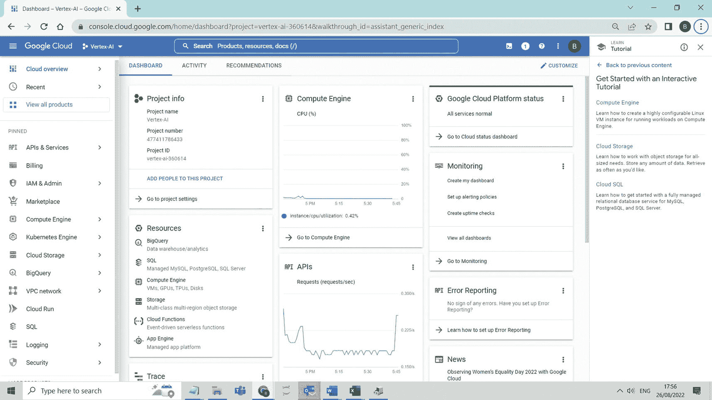

一个窗口屏幕显示 Google Cloud Vertex（TFX 管道）。它包括项目信息、计算引擎、Google Cloud Platform 状态、监控、错误替换、API 和资源。

图 6-11 Google Cloud Console Vertex/TFX 管道 API 调用

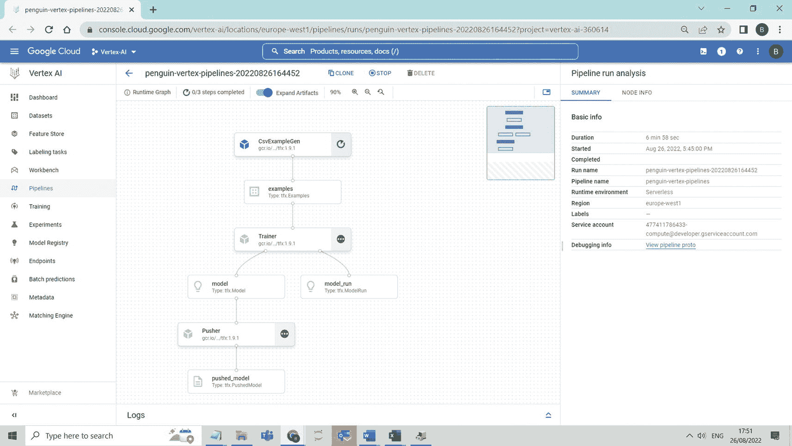

一个窗口屏幕显示 Vertex AI（TensorFlow 扩展）管道进度。它包括带有基本信息的管道运行分析。

图 6-10 GCP 上的 Vertex AI (TFX) 管道进度

## Azure Video Analyzer：动手实践

### 使用 AZURE VIDEO ANALYZER 对视频进行分类和编目

虽然严格来说不属于 Azure Machine Learning 的一部分，但 Azure Video Analyzer 是 Azure Cognitive Services 的一部分，并展示了 AutoML/AutoDL/AutoAI 核心的许多自动化功能。本实验将研究自动化视频元数据和视频片段/剪辑的编目过程。

**注意：本实验是 Microsoft Azure AI Engineer 认证的一部分** [`docs.microsoft.com/en-us/learn/certifications/azure-ai-engineer/`](https://docs.microsoft.com/en-us/learn/certifications/azure-ai-engineer/) – **强烈推荐给对基于云的认证感兴趣的读者：**

1. 启动下面的 Microsoft 实验室

   [`https://docs.microsoft.com/en-us/learn/modules/analyze-video/5-exercise-video-indexer`](https://docs.microsoft.com/en-us/learn/modules/analyze-video/5-exercise-video-indexer)

2. 登录并启动虚拟机

3. 克隆 GitHub 仓库

4. 将视频上传到 [`www.videoindexer.ai`](https://www.videoindexer.ai) 上的 Video Analyzer（在您的本地机器上，而不是虚拟机中）– 您需要使用 Azure 账户登录（如果尚未注册，请在此处注册：[`https://azure.microsoft.com/en-gb/free/`](https://azure.microsoft.com/en-gb/free/)）

5. 注意：视频上传可能需要几分钟（5-10 分钟），因为视频正在被索引

6. 查看视频见解，选择屏幕右侧的“转录”，并在视频播放时观察带有发言者、讨论主题、命名实体和关键词的移动转录

7. 练习 – 从 [`https://api-portal.videoindexer.ai`](https://api-portal.videoindexer.ai) 获取您的 API 密钥，并通过 Visual Studio 使用 Video Analyzer REST API。REST 服务返回的 JSON 响应应包含之前索引的 Responsible AI 视频的详细信息

8. 练习 – 再次运行 REST API，这次获取更细粒度的见解。根据以下 GitHub 位置的 PowerShell 脚本检查您的解决方案：

   [`https://github.com/bw-cetech/apress-6.4.git`](https://github.com/bw-cetech/apress-6.4.git)

**注意：完成实验后，请务必关闭 Visual Studio 并退出虚拟机，以避免在 Azure 上产生费用**

脚注 1 2 3 4 5 6 7 8 9 10 11 12 13 14 15 16 17 18 19 20 21 22

