# 7. AI 全栈：应用开发

IDC 估计，目前人工智能是一个价值 3410 亿美元的市场，如果全球管理咨询公司的预测可信，^(¹⁰²) 到 2030 年，它可能为全球经济贡献 13 万亿美元（麦肯锡）或 15.7 万亿美元（普华永道）。

显然，市场正在蓬勃发展，但企业如何克服与积累和过度依赖独立的、高度技术化的脚本模型以及管理不善的数据科学团队相关的历史性“技术债务”呢？

当今的“顶尖”技能集在于将“企业级”AI 愿景转化为已部署的现实。随着全球疫情将 AI 推至企业议程的首位，增强了业务的韧性和相关性，现在的重点是如何重构和嵌入演示及原型，使其成为跨企业的全栈 AI 解决方案。

IDC 预测（图 7-1），未来五年，客户对开发、实施和管理 AI 应用所需技术专长的 AI 服务需求将以 18.4% 的复合年增长率增长。本章从关键的业务/组织对 AI 的需求出发，旨在确定正确的 ML 或 DL 解决方案和技术，以开发和交付这些“全栈 AI”解决方案，同时在我们的动手实验室中将其中一些开发为样板解决方案。

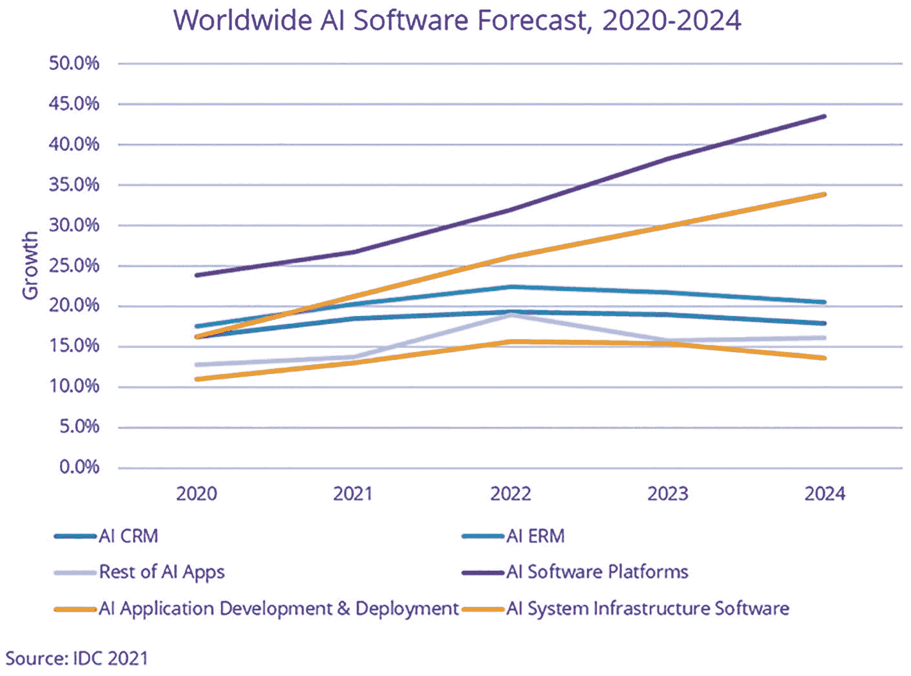

一张关于 2020 年至 2024 年全球 AI 软件增长预测的图表。它包括六条曲线：AI CRM、AI ERM、其他 AI 应用、AI 应用开发与部署、软件平台和基础设施。

**图 7-1** IDC 2024 年 AI 增长预测

## AI 应用开发简介

在本节中，我们将探讨当前推动 AI 应用开发的因素、从脚本到解决方案的一些基础知识，以及处理大数据的加速器：并行处理、集群和 GPU。

### 开发 AI 解决方案

敏捷软件开发是 `itjobswatch` 上的头号工作。^(¹⁰³) 源于对 AI 解决方案的狂热需求，这为全栈数据科学家或 AI 工程师带来了巨大的机遇。

2022 年，大多数 AI 应用属于以下三类之一：机器学习、计算机视觉或 NLP。但由于其技术复杂性，机器学习和深度学习的实现历来在运营上各自为政，由博士级别的统计学家来解释代码繁重的技术模型。

人们依赖快速修复或模拟的虚拟/合成数据集，而不是实施数据编织方法来连接（或创建）复杂的预标记数据集。训练和测试通常仅限于 Python 笔记本（`Jupyter`、`Colab` 等），而推理（通常没有 API）则被当作事后才考虑的事情。最终结果是巨大的技术债务——当然不是我们所认知的“应用”。

发展趋势是转向“企业级 AIaaS”解决方案，或许与 TinyAI 结合：这是一种在不损失能力的情况下缩小现有深度学习模型的新算法。^(¹⁰⁴)

### AI 应用——启动与运行

我们如何着手开发一个 AI 应用？从流程角度来看，我们建议遵循敏捷方法，从小处着手，但不要留下技术债务，最终目标应该是企业级 AI，即使这是一个长达 2-5 年的旅程。以下七步计划是一个成功的良好框架：

1.  选择一个有趣的话题/问题
2.  开发低保真度解决方案——找到一个快速的解决方案，并尽可能保持开源！使用 `google` 来帮助（说真的！），用精确的关键词来定义问题
3.  改进你的简单解决方案——在 `Kaggle` 或 AI/DL 或 ML 领域众多杰出思想领袖的博客/网站上寻找类似的问题表述和 Python 代码示例^(¹⁰⁵)
4.  分享你的解决方案并征求反馈——利用相同的特定论坛提问并寻求支持/调试
5.  针对不同问题重复步骤 1-4——将模糊/不明确的业务/组织目标转化为可用 ML/DL 解决的具体问题
6.  完成一个 `Kaggle` 竞赛并开展合作
7.  瞄准高价值解决方案——它是否解决了组织问题？是否可衡量？

成功部署 AI 解决方案需要大量的支持性基础设施，以及对目标/未来架构的理解。下面我们讨论扩展解决方案的两个关键方面——在 API 后面以 Web 服务的形式运行机器学习和深度学习代码，以及分布式计算。

### API 和端点

应用程序编程接口（API）提供了两个软件应用程序之间标准化的通信方式。

API 开放某些用户定义的 URL 端点，这些端点随后用于发送或接收数据请求。REST（表述性状态转移）API 是最流行的专业 Web 服务 API 之一，它使用 URI、HTTP 协议和 JSON 数据格式，但也有其他选择，例如 Google 的高性能远程过程调用（RPC）框架 `gRPC` 和 Facebook 的 `GraphQL` 都是合适的替代方案。^(¹⁰⁶) 两者现在都已开源。

将 AI/ML 模型作为 API 公开具有明显的好处，从 UI/UX 或提供用户友好的分析/模型界面和工作流程，到端点稳定性、包含数据验证^(¹⁰⁷)检查和安全处理的能力、数据科学和 IT 职能的分离、在更广泛组织中的可用性以及多应用可重用性。

除了内部生产力之外，API 支持的 AI 解决方案还能创造额外的外部价值，将数据科学模型暴露给更广泛的客户群。API 端点/响应可以使用 `cURL` 和/或 `Postman` 进行测试——两者都简化了构建 API 和排查/调试连接问题的步骤。图 7-2 对此进行了说明。

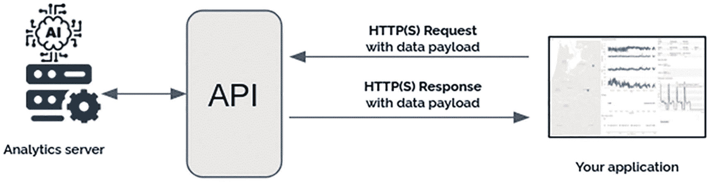

一个典型 API 的架构。它包括一个分析服务器、API、带有数据负载的 HTTPs 请求，以及带有数据负载和应用的 HTTPs 响应。

**图 7-2** 典型 API 架构（来源：ubiops）

### 分布式处理和集群

由于深度学习（有时也包括机器学习）需要对大型训练集进行矩阵计算，分布式计算使得并行执行这些计算成为可能，从而节省时间。如今，大多数生产级解决方案都需要这种大数据处理能力来支持底层的 AI 应用。

#### 集群

集群是高性能计算（HPC）系统中的一组节点（计算机）（图 7-3），它们使用并行处理来处理分布式工作负载。

最著名的例子是 Apache Hadoop——一个允许跨集群对大型数据集进行分布式处理的框架。有关 Hadoop 的更多信息，请参见第 3 章。

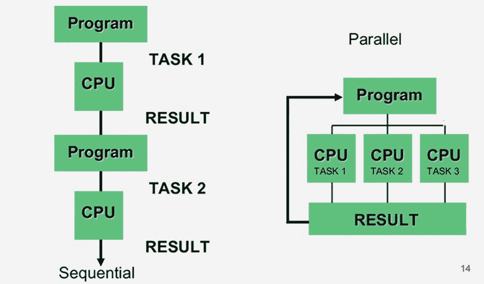

一个流程图描述了使用并行处理的分布式工作负载。他们比较了正常处理和并行处理。在并行处理程序中，使用 CPU 的任务 1、任务 2 和任务 3 会给出结果。

**图 7-3** 计算中的并行化——使用多个 CPU 将 ML/DL 过程拆分为并发任务


#### 图形处理单元（GPU）

虽然`CPU`（中央处理单元）对于简单模型和小型数据集表现良好，但对于较大的数据集，其执行时间过长。`GPU`（图形处理单元）比`CPU`拥有更多的逻辑核心，并且支持并发运行进程，而非顺序执行。因此，它们特别适合那些可以表示为数据并行计算的问题，例如具有数十万个参数的人工智能问题。

`GPU`在现代多人游戏中更为著名，但它们在处理涉及大量数据算术运算的应用方面的演进，已使得所有云服务提供商（CSP）都在其云平台上提供按需付费的高性能`GPU`。

在底层，`GPU`通常依赖于 NVIDIA 开发的`CUDA`（统一计算设备架构）并行编程。

#### 张量处理单元（TPU）

`TPU`（张量处理单元）是谷歌专门用于深度学习任务的硬件加速器。

通常由研究人员和开发者使用，它们比`GPU`更昂贵，但针对大批量和卷积神经网络（CNN）进行了高度优化。总体而言，它们速度更快、能效更高，但对于中大型数据集，`GPU`仍然可能性能最佳。

并行处理/计算是一个快速发展的研发领域，所有主流的高知名度媒体人工智能项目（例如自动驾驶汽车、机器人技术）都依赖于最新技术。在不久的将来，有两项技术可能会具有竞争力：`DPU`（数据处理单元）——一种新型可编程处理器或“片上系统”（`SoC`），专门用于在数据中心内移动数据；以及`FPGA`（现场可编程门阵列）——具有可编程硬件结构的集成电路。与（高能耗的）`GPU`相比，`FPGA`由于节省能源消耗，也可能更具可持续性。

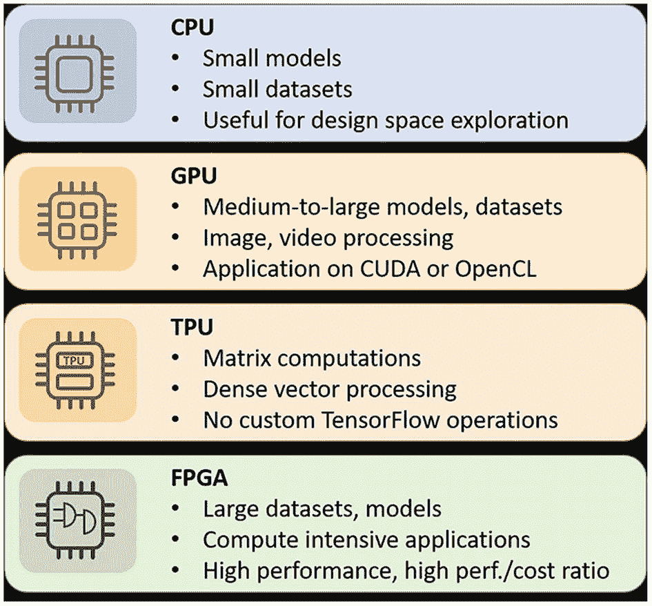

一幅插图展示了四种并行化技术及其特性。其中包括`CPU`（小型模型和数据集）、`GPU`（中大型模型和数据集）、`TPU`（矩阵计算）和`FPGA`（大型数据集）。

**图 7-4** 最新并行化技术对比（来源：inaccel）

#### 分片

`分片`是将大型表分解成称为分片的较小块，并分布到多个服务器上的过程。^(¹⁰⁸) 分片本质上是一个水平数据分区，包含总数据集的一个子集，因此负责处理整体工作负载的一部分。

深度学习中的`分片`能够节省超过 60%的内存，并在`PyTorch`中训练规模两倍的模型。

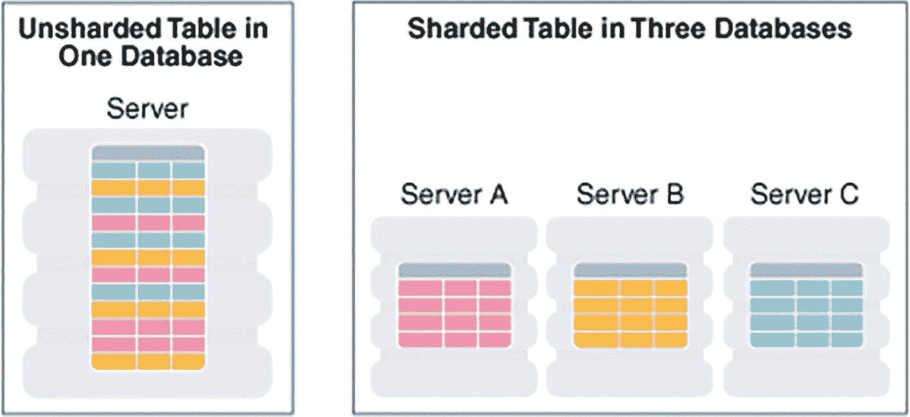

一个数据库（单服务器）中的未分片表与三个数据库（分别包含服务器 A、服务器 B 和服务器 C）中的分片表之间的对比分析。

**图 7-5** 分片（来源：Oracle）

在进入下一节并了解主要软件供应商及其用于 AI 应用开发的工具生态系统之前，我们先在本节最后探讨如何为应用开发创建隔离的（虚拟）环境，并进行一些关于 Python 脚本编写和使用 API 的动手实践，最后介绍在 Colab 中使用`GPU`。

#### 虚拟环境

虚拟环境为特定应用提供隔离的 Python 包安装，允许应用在同一系统上独立共存。由于这些是自包含的 Python（和 Python 库）安装，应用之间不共享依赖关系，因此它们对于开发 AI 解决方案特别有用。

Python 中的虚拟环境是使用`virtualenv`（或 Python 3.3+中的`venv`）创建的，它包含一个 Python 二进制文件和用于包管理的基本工具，包括用于安装 Python 库的`pip`。以下动手实验描述了如何从终端设置虚拟环境。

#### 从终端运行 Python：动手实践

**摆脱笔记本 – Python 脚本（.PY）**

许多 AI 应用使用原始的 Python 脚本（`.py`文件）而不是 Jupyter 笔记本。本练习的目标是使用独立的 Python，熟悉这些脚本，创建一个虚拟环境并运行该脚本：

1.  从[`www.python.org/downloads/windows/`](https://www.python.org/downloads/windows/)安装一个稳定的 Python 版本。
2.  将笔记本电脑上安装位置的路径添加为（系统）环境变量——这将使`python`和`pip`（库安装程序）命令能够在终端上工作。
3.  在本地目录的合适位置创建一个“test”文件夹。从下面的 GitHub 将 Python 脚本克隆到本地驱动器：
    [`https://github.com/bw-cetech/apress-7.1.git`](https://github.com/bw-cetech/apress-7.1.git)
4.  在文件/Windows 资源管理器中，转到克隆的本地文件夹，并在路径名中输入`cmd`以打开终端。使用以下命令（依次执行）创建一个虚拟环境：
    ```
    python -m venv env
    env\Scripts\Activate
    ```
5.  现在您的虚拟环境应该已启用。使用以下命令运行简单游戏：
    ```
    python python-guessing-game.py
    ```
    完成后，使用`deactivate`关闭虚拟环境。
6.  拓展练习——在重新激活上述同一虚拟环境后，尝试将第 5 章（神经网络与深度学习）中完成的随机游走练习作为独立的 Python 脚本运行。注意：如果出现任何`ModuleNotFoundError: No module named`错误（例如`numpy`），请运行以下命令：
    ```
    pip install numpy
    ```

#### API Web 服务和端点：动手实践

**用于网络安全 DDoS 攻击的机器学习**

本练习的目标是部署一个用于检测网络安全（DDoS——分布式拒绝服务）威胁的机器学习模型，然后通过端点进行测试/执行推理：

1.  从下面基于标记网络流量事件训练的实验中，我们首先创建一个预测实验，从 Azure 机器学习工作室部署一个机器学习模型：
    [`https://gallery.cortanaintelligence.com/Experiment/Cyber-DDoS-trained-model`](https://gallery.cortanaintelligence.com/Experiment/Cyber-DDoS-trained-model)
2.  接下来，我们通过部署 Web 服务来设置一个端点。
3.  最后，通过从 Excel 调用 API 来使用 Web 服务。使用下面 GitHub 链接中的样本数据进行测试。注意：第一条记录是“泪滴”拒绝服务（DoS）攻击，第二条记录是良性网络流量：
    [`https://github.com/bw-cetech/apress-7.1b.git`](https://github.com/bw-cetech/apress-7.1b.git)
4.  练习：也通过以下链接 [`https://gallery.azure.ai/Experiment/e7fb30de726e4e02b034233ec6c34ce4`](https://gallery.azure.ai/Experiment/e7fb30de726e4e02b034233ec6c34ce4) 走一遍模型训练过程。请注意，训练实验最初使用 Azure Blob 存储链接到数据集，但由于这些链接不再受支持，现在改用上述同一 GitHub 链接中的训练集`network_intrusion_detection.csv`和测试集`network_intrusion_detection_test.csv`。
5.  拓展：看看您是否可以通过更改使用的数据（或算法）来超越模型性能（AUC = 0.85）。


### AI 加速器 - GPU：动手实践

#### COLAB GPU 性能测试

本节的最后一个实验比较了大数据管道的运行时间——具体来说，是从 Kaggle 直接下载 zip 文件然后解压所需的时间。

1.  从 Kaggle 获取 API 密钥（`kaggle.json` 文件），或使用第 4 章和第 5 章实验中使用的相同密钥。
2.  现在，从下面的 GitHub 链接下载 Python 脚本 `GPU_test.ipynb`，并在 Colab 中打开：
    [`https://github.com/bw-cetech/apress-7.1c.git`](https://github.com/bw-cetech/apress-7.1c.git)
3.  将你的 `kaggle.json` 文件拖放到 Colab 默认的（`content`）文件夹中。
4.  运行 Colab 笔记本，将 `json` 文件复制到根目录下的 `.kaggle` 文件夹。
5.  直接连接 Kaggle 上的一个大数据集——给出的示例将下载一个包含 50,000 张图片、大小为 350 MB 的数据集。首先使用标准（无硬件加速器/CPU）运行时进行此操作，并记录所需时间。
6.  将图片解压到一个 `review` 文件夹——仍然使用标准运行时，并记录所需时间。
7.  完成后（如果耗时过长，可中断代码后），将 `运行时` 类型设置为 `GPU`，重复上述步骤 5 和 6。将这两个步骤在 GPU 运行时下的耗时与标准运行时进行比较。

**注意** 尽管本实验侧重于数据导入过程，但相同的并行处理效率也适用于机器学习和深度学习，在训练和部署模型时可大幅节省运行时间。

1.  练习——首先使用本地运行时，然后使用 GPU 运行上述 GitHub 链接中的另一个 Python 笔记本 `Autoencoders.ipynb`。验证使用 GPU 时模型训练时间是否显著缩短。

### AI 开发的软件与工具

基于第一部分的内容，我们现在来探讨实际的 AI 应用/软件开发，比较主要的云供应商及其可用于支持 AI 项目和基础设施的工具与服务，开发特定行业的用例和解决方案，最终成功部署应用程序。

### AI 需要数据与云

云对于 AI 应用集成以及数据为应用提供支持的重要性不容低估。虽然云是 AI 的关键推动因素，但只有当数据策略建立在丰富、海量的数据源和/或训练数据之上时，云才能为 AI 发挥作用。

如今成功的数据项目都已（企业级）AI 化，需要端到端的云基础设施，特别是存储和计算，作为大数据处理的主要云组件。

虽然企业级机器学习项目可以在两者上以较低的开销运行，但深度学习项目则不能。

如下文所述，所有主要的云服务提供商都提供了一系列 AI 服务和工具，极大地简化了构建应用程序的过程。但必须注意隐藏的成本。^(¹⁰⁹) AWS、Azure 和 GCP 这三大巨头最近已尝试让定价模式更加透明，但任何希望在缺乏企业预算支持的情况下进行实验的人显然都处于不利地位。

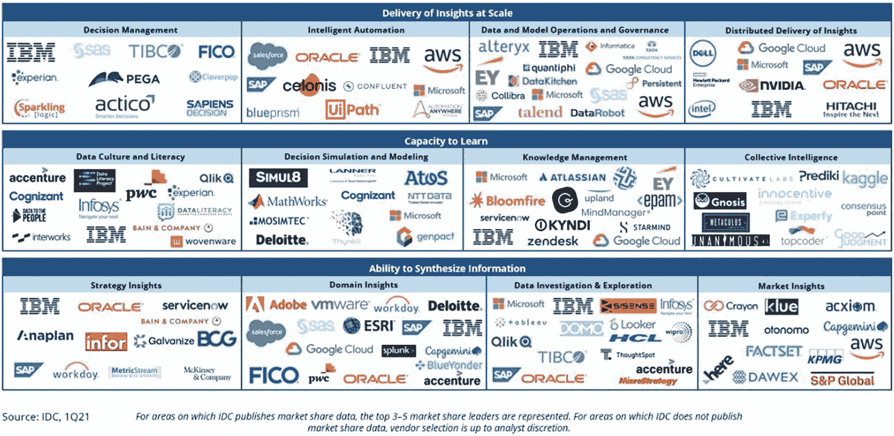

一组三张表格描绘了大规模洞察交付。其中包括 IDC 市场、基于决策管理、数据文化与素养、领域洞察等的未来智能软件工具。

图 7-8
IDC 市场概览——智能的未来

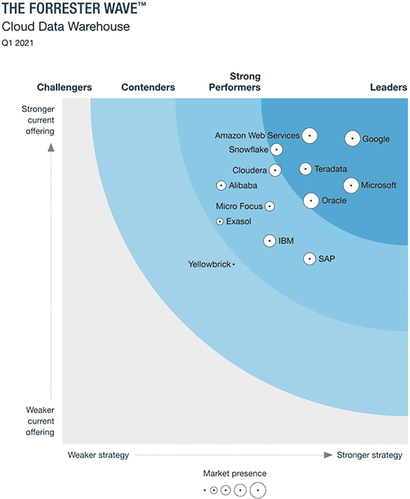

一幅插图描绘了 Forrester 浪潮云数据仓库。它包括挑战者、竞争者、强劲表现者和领导者，并揭示了更强的战略、市场占有率以及更强和更弱的现有产品。

图 7-7
Forrester 浪潮——领先的云数据仓库

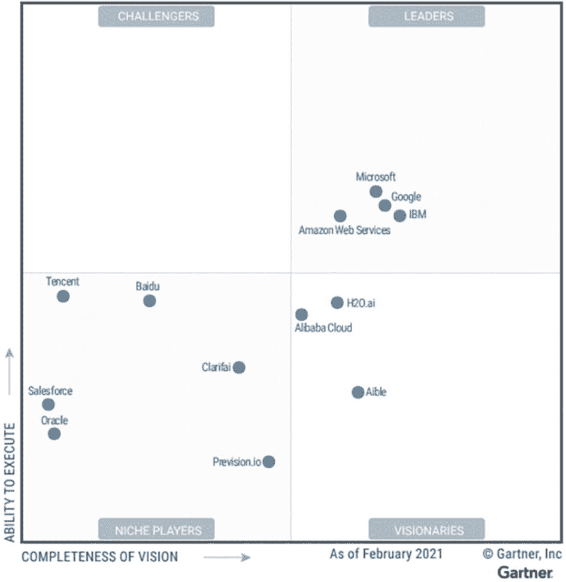

一幅插图描绘了 Gartner 魔力象限，包含执行能力和愿景完整性。它包括：1. 挑战者；2. 领导者（微软、谷歌、IBM）；3. 利基市场参与者；4. 远见者。

图 7-6
Gartner 魔力象限——领先的云服务提供商

### 云平台

业界对领先的云平台已有普遍共识，但我们现在将进一步深入探讨每个平台提供的主要服务和资源，从亚马逊云服务开始。

#### AWS

AWS 声称提供最广泛、最深入的机器学习服务和配套云基础设施。`SageMaker` 是数据科学的主要工具，因其在机器学习方面的可扩展性；而在 NLP 方面，AWS 还提供 Amazon Polly（文本转语音）和 Lex（聊天机器人）。

从使用 AWS 的客户名单（如西门子、FICO、F1、普华永道和 Netflix）中可以明显看出，AWS 拥有强大的 AI 行业用例集，包括文档处理、欺诈检测和预测。

作为全球最大的云服务提供商，许多 AI 应用依赖 AWS 广泛的支持基础设施，从简单存储服务（`S3`）云存储到弹性计算（`EC2`）实例、弹性 MapReduce（`EMR`）——用于运行 Apache Spark 的托管集群、`Redshift`——AWS 的云数据仓库、`Lambda`——用于处理事件的无服务器计算，以及用于实时流式传输的 `Kinesis`。

然而，尽管表面如此，AWS 的“免费套餐”并非完全免费。AWS 产品可以*“免费探索”*，*部分*产品是免费的，有些则*在限定时间内免费*。几乎所有产品都有容量/使用限制。

#### Azure

微软 Azure AI 平台的优势在于对关键 Azure 云服务的 API 访问，以及令人印象深刻的客户名单，包括空客、英国国家医疗服务体系、雀巢和英国广播公司。

使用 Azure SDK，通过 Jupyter Notebook 和 Visual Studio Code 进行简单的 API 调用，即可与底层 Python 代码、`sklearn` 机器学习以及 `TensorFlow`/`PyTorch` 深度学习模型集成。

Azure SDK 还支持访问 Azure 机器学习，并通过 Azure Kubernetes 服务（`AKS`）、Azure Databricks（支持 Apache Spark）以及 Azure 认知服务中的高质量视觉、语音、语言和决策模型（包括异常检测器、内容审查器、`LUIS` 和 `QnA Maker`（基于知识的聊天机器人/对话式 AI）、语音转文本/文本转语音以及计算机视觉（预构建模型）和自定义视觉（构建自己的模型）进行扩展。

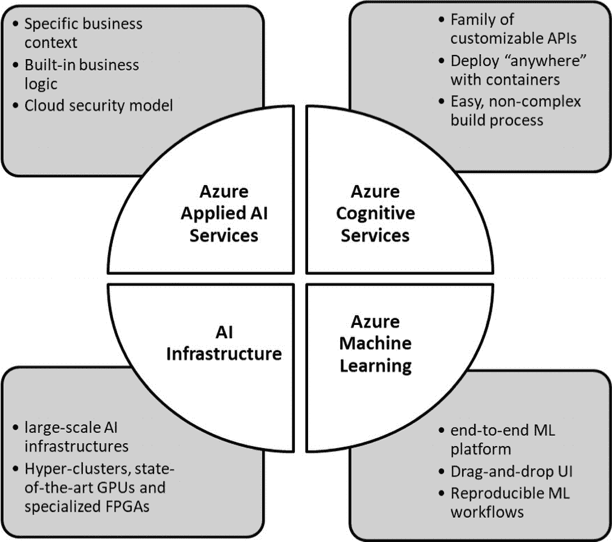

Azure AI 架构。它包括 Azure 应用 AI 服务（云安全模型）、Azure 认知服务（可定制的 API）、AI 基础设施和 Azure 机器学习（端到端 ML 平台）。

图 7-9
Azure AI

#### GCP

尽管 `TensorFlow` 现已开源，但它仍是谷歌的“亲儿子”，仍由谷歌研究人员开发，并且可能仍然是谷歌云平台（`GCP`）上开发 AI 项目的独特卖点。

当与 `BigQuery`（谷歌的无服务器数据仓库）、`Vertex AI`（托管机器学习）以及用于运行 Jupyter 笔记本的 `Colab` 结合使用时，谷歌为数据科学家和 AI 工程师提供了大量强大的产品。

`Vertex AI` 以前隶属于谷歌 AI 平台，是将沙盒机器学习模型投入生产的首选“托管服务”，包括 Cloud `AutoML`（高质量低代码模型，采用最先进的迁移学习）。它还支持深度学习容器，以及从中央仓库和 Google AI Hub 上的 ML 流水线共享代码。

AI Hub 上的相同 ML 流水线可以部署到基于 Docker 的高度可扩展且可移植的 `Kubeflow` 流水线上。

Google 自然语言 API 提供与 Google NLP 模型的应用集成，而 `Dialogflow` 则用于将聊天机器人和智能虚拟助手集成到移动和 Web 应用中。


#### IBM Cloud

尽管 IBM 可能已不再处于大型科技公司的第一梯队，且`IBM Cloud`也未被列入“三大”云服务提供商之列，但毫无疑问，该公司在创新方面依然保持领先地位，常常在主流市场普及之前就推出新的开发成果和服务。

IBM 的`Watson`平台自 2011 年在“危险边缘！”问答节目中获胜以来，一直是商业 AI 领域的先驱，并持续推动着 IBM 当前在`IBM Cloud`上提供的一系列 AI 服务。主要工具如下所示：

- `WATSON Studio` – 数据科学平台
- `WATSON Assistant` – 聊天机器人/智能虚拟助手
- `WATSON Discovery` – 企业级 AI 搜索
- `WATSON Knowledge Studio` – 特定领域的自然语言处理（NLP）内容整理

最近，`IBM Cloud Pak® for Data`（`CPDaaS`）已成为 IBM 首选的业务数据与 AI 一体化平台，它通过自动化（`AutoAI`）以及对数据和 AI 生命周期的治理，将 AI“注入”到应用程序中。

`Cloud Pak`是一个一站式平台，用于收集、整理和分析数据资产，以进行机器学习和深度学习。它由集成的微服务组成，这些微服务受益于在多节点`Red Hat® OpenShift®`集群上运行。`Cloud Pak`提供开放且可扩展的`REST API`，支持混合云和本地资源，并能以“最小化”停机时间实现弹性资源管理。

#### Heroku

作为最早的云平台之一，`Heroku`现在归`Salesforce`所有。虽然知名度稍低，但就简洁性和优雅性而言，它是我们最喜欢的平台之一。应用程序可以像在其他主流平台上一样，在云上进行部署、管理和扩展。

在我们看来，对于快速部署应用程序而言，这是最具成本效益的云平台。免费计划不会强制用户/开发者花费积分来启用机器/深度学习工具，前提是你限制每月的使用量。例如，`Azure VMs`和`AWS SageMaker`并非免费，但你可以在`Heroku`上免费部署一个机器学习/深度学习应用。

模型扩展也很直观——只需为应用程序的每月正常运行时间选择简单的“按需付费”选项。托管模型通过`Heroku`的`dynos`完成——这些是支撑/驱动`Heroku`应用程序的构建块。本质上它们是容器，但每种 dyno 类型都带有特定数量的集群工作节点（免费/爱好级 dyno 为 1 个集群，标准级为 2 个集群，中性能级为 5 个集群，高性能级为 28 个集群）。

`Heroku`为我们介绍了可用于构建 AI 解决方案的主要云平台。本节的剩余部分将探讨如何通过基于 Python 的用户界面来为这些解决方案提供前端支持。^(¹¹⁰)

### 基于 Python 的用户界面

下面我们将介绍三种主要的用于创建 Web 应用的 Python 框架。我们将在第 9 章中介绍另一个框架`Streamlit`，它使用简单的 API，支持定义为 Python 变量的交互式小部件，并且部署速度非常快。^(¹¹¹)

#### Flask

`Flask`是一个用 Python 编写的微 Web 框架。

代码简单、独立但可扩展，非常适合单页应用。`SQLAlchemy`可用于数据库连接，并且`Flask`支持的数据库范围（例如 NoSQL）比`Django`（下文讨论）更广。

正如我们将在本节后的动手实验中看到的，在安装 Python 用于独立脚本编写以及`Visual Studio Code`之后，推荐的工作流程是从 GitHub 克隆一个 flask 应用，`cd`进入该应用的本地副本，并使用以下命令创建一个虚拟环境：

```
python -m venv env
env\Scripts\Activate
```

然后，在虚拟环境中以常规方式安装`Flask`，即：

```
pip install flask
```

#### Dash

`Dash`将 Python 脚本转换为生产级业务应用。它填补了传统 BI/Tableau/PowerBI/Looker 仪表板中存在的**预测分析空白**，支持复杂的 Python 分析/商业智能，并构建在`Flask`、`Plotly.js`和`React.js`之上。

`Dash`还为机器学习和深度学习模型提供了“点击式界面”，极大地简化了为 AI 应用（例如，目标检测和自然语言处理用户界面，如聊天机器人）提供前端支持的过程。

`pip install dash`命令还会安装许多其他工具：^(¹¹²)

- `dash_html_components`
- `dash_core_components`
- `dash_table`
- `plotly` 绘图库

`Dash`的吸引力在于它能够快速封装用户界面 Python 代码；它通过一个包含四个文件（具有类似 HTML 的元素）的文件结构来实现这一点：

- **布局（Layouts）** – 描述仪表板的外观
- **组件（Components）** – 组件构成布局，包括`dash_core_components`和`dash_html_components`
- **回调（Callbacks）** – 控制 Dash 应用的交互性
- **Bootstrap** – 用于创建交互式和移动端就绪应用的预构建 CSS 框架

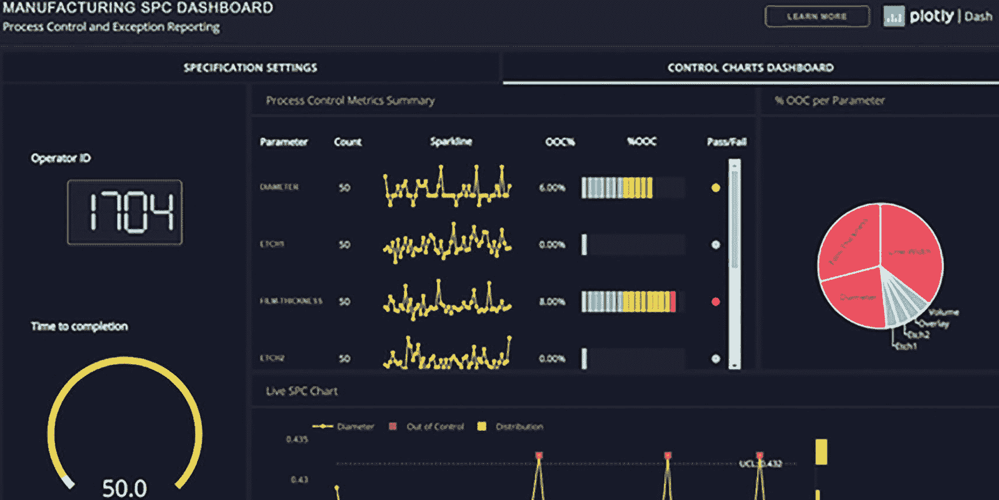

屏幕显示了一个包含物联网流数据警报的控制图仪表板。它包括一个过程控制指标摘要、一个实时 SPC 图以及一个按参数显示 OOC 百分比的饼图。

**图 7-10** 用于物联网流数据警报的 Dash 用户界面

#### Django

被 Facebook、Instagram 和 Netflix 使用的`Django`，旨在让开发者能够更轻松、更快速、用更少的代码构建更好的 Web 应用。与`Flask`一样，`Django`是一个用于快速开发 Web 应用的高级 Python Web 框架，但相比之下，这些应用往往是全尺寸的，并且比更简单的`Flask`有限页面应用更强大。

`Django`是免费且开源的，拥有一个“功能齐全”的框架，预装了大部分功能。它带有自动化工具以避免重复性任务，以及一个简洁且“务实”的设计，通过简化的三步流程来处理模型更改，从而省去了 Web 开发中的许多麻烦：

- 在`models.py`中更改模型
- 运行`python manage.py makemigrations`为更改创建迁移文件
- 运行`python manage.py migrate`将这些更改应用到底层数据库

### 其他 AI 软件供应商

在本节中，我们最后来看一些其他 AI 软件供应商，它们各自都能以独特的方式支持 AI 应用的构建。

#### ONNX（开放神经网络交换格式）

`ONNX`是一个用于机器学习的开源模型格式和运行时，其平台无关的设计便于在不同框架和硬件平台之间迁移。在大型科技公司占据主导/整合的时代，它的吸引力在于其社区模式和互操作性。

#### C3

`C3`是一家 AI 和物联网软件提供商，用于构建企业级 AI 应用。它提供开箱即用/预构建的、针对特定行业的 AI 应用，以优化关键流程——`C3`声称每天运行 480 万个 AI 模型并执行 15 亿次预测。

#### DataRobot

`DataRobot`的整个商业模式（和独特卖点）是 MLOps 自动化以及“加速从数据到价值的转化”。该产品面向技术能力较弱的用户，例如，希望在没有机器学习知识的情况下构建预测分析的业务分析师。

现在，我们将进入本节动手实验环节，看看上面介绍的三个工具。


## Dash 入门：动手实践

使用 DASH 部署物联网应用

本练习的目标是利用 GitHub 上的示例 **Dash 应用**模板，克隆一个物联网应用的源代码并在本地运行。本实验包含一系列拓展练习，涉及编辑源代码、使用 Dash 回调函数以及将 Dash 应用部署到 Heroku，以进一步积累 Dash 的使用经验：

1.  我们将克隆下方链接中展示的应用：

    [`https://dash-gallery.plotly.host/dash-manufacture-spc-dashboard/`](https://dash-gallery.plotly.host/dash-manufacture-spc-dashboard/)

2.  访问 [`https://github.com/dkrizman/dash-manufacture-spc-dashboard`](https://github.com/dkrizman/dash-manufacture-spc-dashboard)，点击绿色按钮下载包含源代码的 zip 文件

3.  将解压后的文件夹放到本地驱动器的合适位置

4.  将 `app.py` 文件中的代码复制到记事本，并另存为 `app.ipynb`

5.  打开新的 Jupyter notebook，将最后一行的 `Debug = True` 改为 `Debug = False`，然后尝试运行。注意：你可能需要先在第一个代码单元格中运行（然后注释掉）`%pip install dash_daq` 来安装 `dash_daq`。

6.  点击“Proceed to measurement”查看典型的物联网传感器数据流指标。点击“stop”停止数据流。

    练习（拓展）：克隆 GitHub 链接 [`https://github.com/bw-cetech/apress-7.2.git`](https://github.com/bw-cetech/apress-7.2.git) 中的 Jupyter notebook `Dash-Jupyter-getting_started.ipynb`，并在本地运行代码。尝试：
    1.  更改散点图中显示的颜色
    2.  增大图表尺寸
    3.  将折线图改为柱状图

7.  练习（拓展）：从 [`https://github.com/bw-cetech/apress-7.2.git`](https://github.com/bw-cetech/apress-7.2.git) 克隆 `Dash-InteractiveChart.ipynb`，并将图表改为欧洲图表

8.  练习（拓展）：尝试将物联网应用部署到 Heroku

## Flask：动手实践

部署 FLASK 仪表板

在本实验中，我们将从 GitHub 上的一个模板开始，创建一个虚拟环境，安装一些 Python 依赖项，并创建一个 **Flask 仪表板**

1.  将下方链接中的源代码克隆到本地驱动器

    [`https://github.com/app-generator/flask-black-dashboard.git`](https://github.com/app-generator/flask-black-dashboard.git)

2.  使用合适的集成开发环境（IDE），如 IDLE 或 Visual Studio，打开 Powershell 并创建一个虚拟环境

3.  执行以下命令安装 requirements 文件中列出的依赖项：

    ```
    pip install -r requirements.txt
    ```

4.  使用以下命令（在命令提示符/终端中）运行应用：

    ```
    flask run --host=0.0.0.0 --port=5000
    ```

5.  练习 – 尝试为应用添加身份验证功能

6.  拓展：更改左侧菜单的字体和字号，并用不同的数据集替换“Daily Sales”图表

## Django 入门：动手实践

DJANGO 应用开发

继之前的 Dash 和 Flask 实验之后，本练习的目标是让我们熟悉另一个 Python 前端（Web）框架：**Django**

1.  设置一个虚拟环境

2.  在虚拟环境中安装 Django（注意：首先使用 `py -m django --version` 检查是否已安装）

3.  通过 `cd` 命令进入 `mysite` 文件夹，然后运行以下命令启动应用：

    ```
    python manage.py runserver
    ```

4.  按照下方教程链接中的步骤创建一个投票应用，本实验的剩余部分也将遵循该教程：

    [`https://docs.djangoproject.com/en/3.2/intro/tutorial01/`](https://docs.djangoproject.com/en/3.2/intro/tutorial01/)

5.  按照教程中的步骤“编写你的第一个视图”

    练习：尝试按照教程下一页的说明完成“编写你的第一个 Django 应用，第二部分”。确保完成以下步骤，以理解应用如何与仪表板底层数据存储交互，以及如何管理应用开发过程：

    -   设置虚拟环境
    -   创建一个简单的投票应用
    -   创建 SQLite 表
    -   使用 Django API
    -   管理后台
    -   在“轻量级”SQLite 数据库中创建表
    -   创建数据库模型并激活
    -   使用 API
    -   创建管理员用户并探索功能

## 机器学习应用

现在，我们将注意力转向当今组织和企业中开发和部署的具体机器学习和深度学习应用。

由于我们已经在第一章中介绍了人工智能应用的高级概述，本节将重点介绍这些应用在组织中是如何构建的，以及所使用的工具。具体的“行业视角”将在下一章关于人工智能案例研究的内容中介绍。

### 开发机器学习应用

如今，几乎所有的组织和企业都希望通过可实施的机器学习解决方案来构建人工智能战略。驱动因素多种多样，尽管实际应用本身往往集中在相对较小的一部分监督学习和无监督学习问题上。解决方案的独特性更多地体现在为建模结果而进行的定制化数据使用和特征工程中。

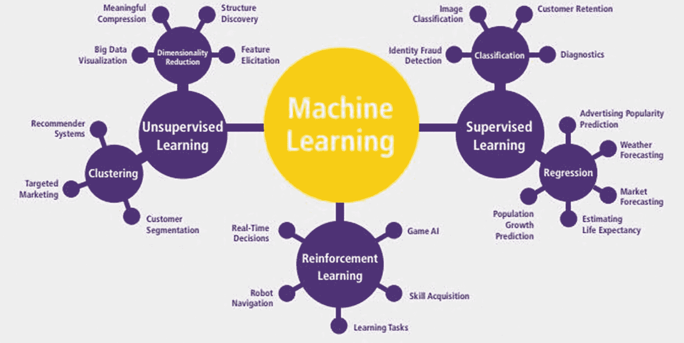

一幅插图展示了机器学习应用的开发过程。它包括：无监督学习、聚类、降维、分类、监督学习以及回归及其特征。

**图 7-11** 按技术分类的机器学习应用（来源：福布斯）

下表虽非详尽无遗，但描述了驱动企业的因素、企业正在使用的应用，以及为完成任务通常调用的数据支持者和数据源。显而易见的是，构建组织问题框架并记录交付计划是成功实施机器学习的关键——最佳实践是在许多迭代过程中拥抱持续改进：从问题框架构建，到数据收集与清洗、探索性数据分析与数据准备、特征工程、模型训练、评估与基准测试、推理与数据漂移。

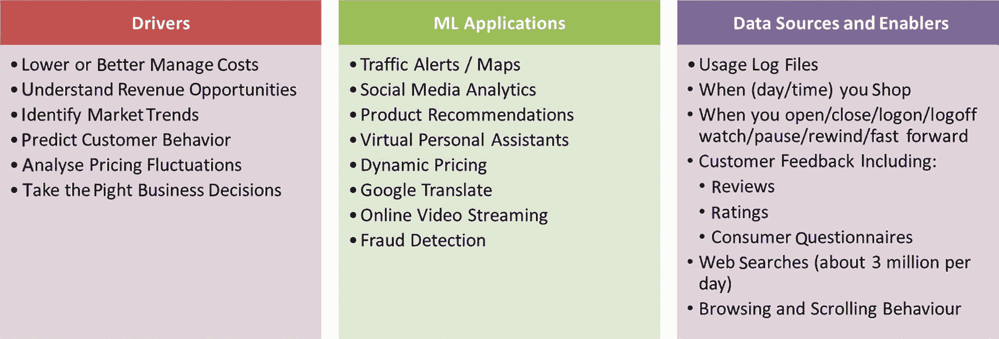

一幅插图展示了机器学习在商业案例中的开发过程。它包括：1. 驱动因素。2. 机器学习应用。3. 数据源与支持者，以及它们各自的特征列表。

**图 7-12** 机器学习——商业案例

### 客户体验

如今，大多数企业都致力于通过预测建模，并直接在模型训练过程中使用客户反馈，来定制和改善**客户体验（CX）**，从而提升品牌权威性。

机器学习在客户体验方面的经典应用是推荐引擎，它根据以下因素为客户提供个性化推荐：

-   他们是谁
-   他们在哪里
-   他们根据过去购买模式喜欢什么
-   当前条件，例如天气
-   以及留存模型的结果/他们的流失倾向

有效的客户体验可以在跨多个交易、人口统计和行为特征（例如）训练模型的基础上提供定制化预测：

-   **交易特征** – 客户总收入、最低购买额、最高购买额、上次购买时间
-   **人口统计特征** – 性别、年龄、地址/城市
-   **行为特征** – 客户旅程和浏览模式，包括访问的页面、停留时间、设备使用情况、点赞、评论、社交媒体评论、使用的关键词

交易和人口统计数据是长期确立的价值杠杆，但在 2022 年，对客户旅程和行为数据（通常是非结构化数据）进行更精细的挖掘，才是高价值零售组织的差异化优势所在。


### 欺诈检测与网络安全

价值`$23.05b`的欺诈检测与预防市场正推动着对机器学习与欺诈分析应用的需求，且丝毫没有放缓的迹象。Fortune Business Insights 预测，由于在线交易数量的不断增加，到 2028 年该市场将以 27%的复合年增长率（CAGR）增长至`$142b`。不仅数字银行、保险公司和电子商务在增加对安全在线服务的投资，大多数私营和公共组织所经历的欺诈痛苦经历，也迅速将网络安全推至企业议程的首位。

其基本原理相当明显——利用机器和深度学习算法的内在优势，从历史欺诈模式中学习，并在未来的交易中识别它们。

该市场有些拥挤，供应商包括`FICO`、`AltexSoft`、`SAS`和`DataVisor`，但利用开源和云端欺诈检测“样板”（例如使用`AWS SageMaker`和`IBM WATSON Studio`）的能力，使得更便宜、定制开发的解决方案对 AI 工程师和开发者来说更加触手可及。

### 运营管理、决策与业务支持

机器学习在运营管理中的应用主要集中在机器人流程自动化（认知或其他，即`RPA`/`CRPA`）以及计划与调度/重新调度上。

由 BI 前端（如`PowerBI`、`Tableau`、`Google Data Studio`或`Looker`）和预测/规范建模（`Python`、`CPLEX`等）构建的决策支持系统，通常支撑着运营管理和供应链管理（SCM）中的使用。

特别是在 SCM 中，涵盖从自动化数据收集到分析、预测和优化的端到端机器学习流程正被采用，以交付从自动化仪表盘引擎到预测性维护、库存管理和物料计划、优化采购、预算或客户/需求预测，以及增强的业务流程管理（`BPM`）性能等一切。

### 风险管理、投资组合与资产优化

除了第 1 章中提到的风险管理和预测示例外，人们对机器学习在量化金融中的应用（从构建投资策略到股票交易）也抱有极大兴趣。

该方法通常依赖于预测来预测股票走势，并构建能够查看股票走势并直接建议买入/卖出/持有的机器人（Robo-Advisors）。沿着这些思路的最新发展之一是使用强化学习来构建最优股票投资组合，并与基于投资组合理论的方法进行比较。

其他创新包括`CVXPY`（一种用于凸优化问题的 Python 嵌入式建模语言，我们将在本节末尾的实验室中学习）和`DeepDow`（深度学习，而非机器学习）——一个专注于神经网络以在单次前向传递中执行资产分配的 Python 包。

### 开发推荐引擎：动手实践

#### 使用 CURL 测试部署到本地端点

我们采用一个训练好的（基于内容的过滤^((113))）Netflix 电影/电视剧推荐引擎模型，将其部署为本地端点，并使用`cURL`测试该应用：

1.  从以下链接下载 GitHub 源代码：[`https://github.com/MAbdElRaouf/Content-based-Recommendation-Engine`](https://github.com/MAbdElRaouf/Content-based-Recommendation-Engine)

2.  设置一个虚拟环境

3.  安装`requirements.txt`文件中的依赖项

4.  从终端运行该应用

5.  将一个包含感兴趣电影/电视剧标题的 JSON 文件添加到本地应用文件夹中

    ```
    {
    "title" : "Narcos"
    }
    ```

将电影标题更改为一部电影/电视剧

1.  使用`cURL`（Windows 系统默认安装）测试该应用：

```
curl -H "Content-Type: application/json" --data @test.json http://127.0.0.1:5000/api/
```

现在，您应该会在应用文件夹中的`test.json`文件中看到基于第 5 步输入的电影/电视剧推荐的一系列电影/电视剧。

1.  练习：查看您为“The Crown”获得的推荐结果

2.  拓展：`Postman`是另一个用于探索和测试 API 的实用工具——设置一个`Postman`账户并向上述应用发送请求

3.  拓展：除了基于内容的过滤，训练并部署一个更复杂的协同过滤模型^((114))，该模型对用户与电影/电视剧购买之间的相似性进行建模。

### 投资组合优化加速器：动手实践

#### 使用 Python 中的 CVXPY 实现利润最大化与风险最小化

尽管严格来说不涉及机器学习，但需要使用复杂优化技术和求解器的规范分析问题，通常与 ML/DL 流程并行运行（或作为后处理），以最大化利润或最小化风险。

本实验室将研究如何使用 Python 实现凸规划——在本例中，通过线性规划（LP）特例进行简化，其中模型约束和目标函数是线性的。

1.  克隆以下 GitHub 仓库：

    `https://github.com/bw-cetech/apress-7.3.git`

2.  在 Colab 中运行 Python 笔记本步骤：
    1.  导入库，包括`CVXPY`库

    2.  从从 GitHub 下载的月度 csv 数据文件中导入股票数据

    3.  绘制数据图表

    4.  计算三只股票中每只的预期风险和回报

    5.  优化三只股票中每只的`$1000`投资，以实现平衡的投资组合

3.  练习（拓展）——修改代码，使用`Pandas DataReader`和`Yahoo Finance` Python 库连接实时股票价格，优化/平衡三只科技股的`£100k`资本支出

## 深度学习应用

虽然某些机器学习应用已在许多组织中牢固确立，但实施深度学习应用在很大程度上仍是一个理想目标。这种情况正在开始改变，部分原因是通过使用我们在第 6 章中讨论的领先加速器 AutoAI 工具，部分原因是通过围绕我们在本节最后部分讨论的主要用例进行实验和原型设计。

### 开发深度学习应用

深度学习在“企业环境”中仍然相对较新，但它正开始在视觉识别、自然语言处理、文本分析和网络安全用例方面推动巨大进步。

一些与机器学习相关的驱动因素也适用于此，但复杂性也有所增加，例如理解客户旅程而不仅仅是购买模式。其中一些驱动因素如图 7-13 中的表格所示，同时还有关键的业务应用和收益。

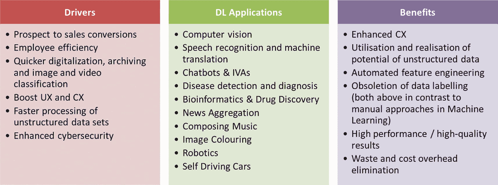

一幅插图描绘了商业案例中的深度学习。它包括 1. 驱动因素。2. 深度学习应用。3. 收益及其特征。

图 7-13

深度学习——商业案例

在云存储和计算方面进行前瞻性规划对于成功交付深度学习解决方案至关重要，而深度学习项目需要大量的迭代、大量的时间和大量的精力。但是，保持自律、最大限度地利用资源并在此过程中监控进度，有助于取得成功。

与机器学习一样，它始于理解问题背景和项目生命周期，而改善（持续改进）方法是关键。在进入本章的最后一节之前，我们概述了一个针对深度学习的成功高级框架（来源：neptune.ai）：

*   定义数据源并进行收集

*   确定高级解决方案（`CNN`、`RNN`、`GANs`？）

*   为流式/批量数据建立稳健的数据管道

*   基于`ANNs`构建模型

*   利用迁移学习

*   训练与推理

*   部署到云端：`Heroku`、`IBM`、`AWS`、`GCP`、`Azure`


#### 关键深度学习应用

我们在介绍章节中已涵盖以下大部分应用，因此本节将以简要总结收尾，概述主要深度学习应用通常如何部署以及涉及哪些工具。

##### 计算机视觉

如今，任何计算机视觉项目的开发都离不开`TensorFlow`或`OpenCV`（开源计算机视觉工具）。`TensorFlow`已得到广泛讨论，而`OpenCV`最初由英特尔开发，支持多种编程语言和操作系统。`OpenCV-Python`是该工具的 Python 库接口。

大多数云服务提供商都提供计算机视觉 API，其中`IBM Watson Visual Recognition`、`Google Cloud Vision API`和`Microsoft Computer Vision`或许是最出色的三个。这些服务的关键在于计算机视觉对海量存储的需求，以及在关键训练和推理过程中对低延迟计算的要求，同时易于部署（作为容器化解决方案）也日益重要。

##### 预测

如第 5 章所述，LSTM 在短期和中期预测中已实现高精度。这些算法与`fbprophet`结合（或对比），用于在趋势中加入季节性的乘法季节性长期预测，共同构成了强大的多周期预测“武器库”。

神经网络增强的预测能力意味着传统预测方法的人工智能增强越来越普遍——通常 LSTM 会与回归技术、指数平滑、ARMA/ARIMA/SARIMA/SARIMAX 技术、蒙特卡洛和 VaR 方法进行比较。

##### 物联网

目前，超过 90 亿台物联网设备在线，预计未来十年将有约 500 亿至近 1 万亿台设备接入网络。

这一极其丰富的数据源正推动着当前人工智能物联网（AIoT）的发展趋势——即人工智能与物联网的交汇。

这种将预测和认知能力嵌入智能设备的做法，某种程度上类似于《少数派报告》中反乌托邦式的“智能零售”用例，已在全球范围内普及。摄像头可以（并且在许多地方已经）配备计算机视觉，而智能设备上令人眼花缭乱的数据粒度则触发对消费者人口统计和行为特征的实时预测（及态度）分析，并支持动态营销/产品布局。

还有许多其他物联网与人工智能协同工作的知名案例，包括机器人技术、自动驾驶汽车（无人驾驶汽车）、无收银员购物（Amazon Go）、无人机交通监控以及（配备远程信息处理的）车队保险。

### 全栈深度学习：动手实践

使用 REACT、DASH、FLASK 和 TENSORFLOW 部署我们的第一个 AI 应用

本练习的目标是使用`react.js`和`Flask`之间的“握手”来部署一个深度学习应用：

1.  使用简单的早停标准，训练并导出第 5 章中的 VGG 模型

2.  将上述导出的模型放入应用的新本地文件夹`dl-traffic-app`中

3.  通过终端`cd`进入该文件夹并运行以下命令，创建一个`react.js`前端样板（这将创建一个名为`react-frontend`的文件夹，用于存放我们所需的前端源代码）：

    ```
    npm install -g create-react-app
    npx create-react-app react-frontend
    cd reactapp
    npm start
    ```

注意：如果尚未安装`nodejs`和`npm`，请从此处安装：[`https://nodejs.org/en/download/`](https://nodejs.org/en/download/)。

1.  创建一个名为`flask-backend`的（空）Flask 后端文件夹，包含两个子文件夹：`static`、`templates`，以及一个（空白的）`main.py`文件

2.  创建虚拟环境

3.  通过创建一个包含以下库的`requirements.txt`文件来安装依赖项：

    ```
    numpy
    flask #==1.1.2
    dash
    dash_bootstrap_components
    matplotlib
    tensorflow
    opencv-python
    ```

4.  为了让 Flask 后端服务于`react.js`前端，请使用此处`sample_flask.py`文件的内容编辑空白的`main.py`文件：

    [`https://github.com/bw-cetech/apress-7.4.git`](https://github.com/bw-cetech/apress-7.4.git)

5.  需要对 react 前端进行一些修改。此处不详细说明，请观看此视频：[`www.youtube.com/watch?v=YW8VG_U-m48&feature=youtu.be`](http://www.youtube.com/watch%253Fv%253DYW8VG_U-m48%2526feature%253Dyoutu.be)

6.  通过`cd`进入步骤 3 创建的文件夹并运行以下命令来启动 Flask 后端：

    ```
    python main.py
    ```

7.  从上述 GitHub 仓库[`https://github.com/bw-cetech/apress-7.4.git`](https://github.com/bw-cetech/apress-7.4.git)获取`additional-files`文件夹，替换`react-frontend`和`flask-backend`文件夹中的文件。为前端添加拖放功能，并从 Flask 调用模型函数。此外：
    1.  在`flask-backend`下创建一个`python`文件夹，并添加新文件`dlmodel.py`（从`sample_dlmodel.py`重命名而来）

    2.  同时更新 Python 脚本（`dlmodel.py`）中训练模型的路径为：

        ```
        model = load_model("python/best-model-traffic-ESC.h5") # 加载模型
        ```

8.  使用以下命令解包`react-frontend`文件夹：

    ```
    npm run build
    ```

9.  使用我们 GitHub 仓库中的一些示例图片测试应用：

    [`https://github.com/bw-cetech/apress-7.4.git`](https://github.com/bw-cetech/apress-7.4.git)

10. 拓展练习：使用 VueJS 前端代替`react.js`完成本实验中的步骤^(¹¹⁵)

11. 拓展练习（困难）：在 Docker 容器中分离 React 和 Flask

12. 拓展练习（困难）：添加数据库，为应用提供训练图片


一组两张图片，展示用于预测德国交通标志的全栈应用。1. 一个内含数字 30 的圆形。2. 一个菱形轮廓。

**图 7-14** 用于预测德国交通标志的全栈应用

### 总结

这个将后端开发（Flask 和 TensorFlow）与前端 UI（Dash 和 React）结合在一起的综合性实验，希望能让您对构建“全栈”AI 应用有所了解。在下一章中，我们将针对特定行业案例研究解决方案，逐步讲解更多此类实验，然后在倒数第二章中最终审视端到端 AI 部署。

脚注 1   2   3   4   5   6   7   8   9   10   11   12   13   14


