# 8. AI 案例研究

如今，人工智能技术被用于改善客户服务、提供个性化促销、抵御网络攻击、检测和预防欺诈、自动生成管理报告、执行视觉识别、降低保险风险，以及对文档和图像进行分类整理。

许多技术已经对日常生活产生了重大影响，尤其是我们在手持设备上使用的日常“应用程序”和定制化内容服务。

本章将全面（跨行业、跨职能）审视过去几年中主要的 AI 应用案例，以揭示推动工作场所对 AI 需求和业务要求的驱动因素。

在深入探讨电信、零售、银行与金融服务、石油与天然气、能源与公用事业、供应链、人力资源和医疗保健等特定垂直行业的挑战之前，我们将先了解 AI 的关键赋能因素。最终目标是将上一章的工具视角与本章的业务或组织问题相结合，以便更深入地理解为解决这些问题而实施的机器学习和深度学习应用。

本章包含一些更高级的用例，涉及多工具集成，例如社交媒体（`Twitter API`）情感分析、欺诈检测和供应链优化。这些案例旨在映射出最适合处理底层数据和 AI 组件（具体包括数据摄取、存储、计算与建模以及分析）的 AI 技术和平台。

作为这些增强用例的一部分，我们将探讨如何设置 Twitter 开发者账户并实现 `Twitter API` 以进行社交媒体情感分析，如何利用关键的云解决方案组件（如 `AWS SageMaker`、`Lambda`、`S3` 和 `QuickSight`）来训练和部署欺诈检测模型，以及如何使用 `IBM Cloud Pak for Data`、`Watson Studio`、`Watson Assistant`、`AutoAI` 和集成了 `CPLEX` 的 `Decision Optimizer` 进行供应链优化。

## 行业案例研究

本章的第一部分将高层次地审视工作场所对 AI 解决方案的需求和赋能因素，然后快速浏览主要用例，构建 AI 挑战的框架，最后以审视 AI 的目标架构作为结尾。

### 业务/组织对 AI 的需求

经过验证的可扩展性意味着，如今大多数私营公司和公共部门组织都将 AI 视为一种变革性技术。但有时，当前的炒作似乎将 AI 呈现为解决所有问题的万能药。

这种炒作也带来了相当大的恐惧，特别是围绕工作替代/失业、不平等和偏见等日益增长的担忧。最近“企业 AI”的趋势正试图解决这些不平衡问题，尤其是在非技术员工方面。

从创新的角度来看，重点坚定地放在“增强智能”案例上——利用 AI 解决许多有针对性的/定制的业务和组织问题。同时，通过培养内部 AI 学习文化（例如，通过可视化 UI 促进实验和更好的团队协作）来打开大门，对于确保和谐的劳动力队伍至关重要。

### AI 赋能因素

如今，商业 AI 解决方案和用例的主要赋能因素有四个方面。从云服务的出现，到存储的简化和更广泛的访问，以及支持复杂计算的无限制扩展和计算能力，这些都是关键。

传感器的大规模使用意味着物联网（和移动）设备现在能够常规性地生成特征丰富、PB 级的数据。这些数据通常与智能 API 集成，这意味着机器和深度学习并不总是需要“从头开始”构建——用户可以通过 API 接入预训练的端点解决方案。

当然，数字化转型本身以及“颠覆或被颠覆”的驱动力，使人工智能成为一个增值的利润中心，专注于持续管理成本、提高生产率和开辟新收入来源的需求。

### 按垂直行业划分的 AI 解决方案

在接下来的章节中，我们将回顾第 1 章中提到的 AI 用例。此外，图 8-1 中展示了更全面的 AI 解决方案细分，以供参考，其中许多将在本章的其余部分进一步讨论。

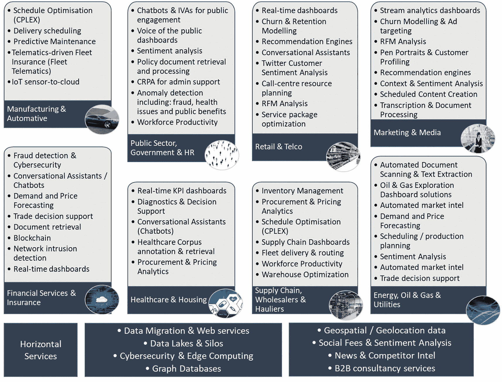

按垂直行业划分的 AI 解决方案示意图。包括制造业和汽车、公共部门、政府和人力资源、零售和电信、营销和媒体、能源、石油和天然气以及公用事业等。

**图 8-1** AI 用例

### AI 用例 – 解决方案框架

没有一个全面的解决方案框架，上述任何用例都无法实现。

从定义战略和目标，到数据战略、安全模型、测试、实施和变更管理流程，提出正确的问题至关重要。图 8-2 展示了一些我们认为必要的关键问题，以便权衡全局并努力实现成功交付。

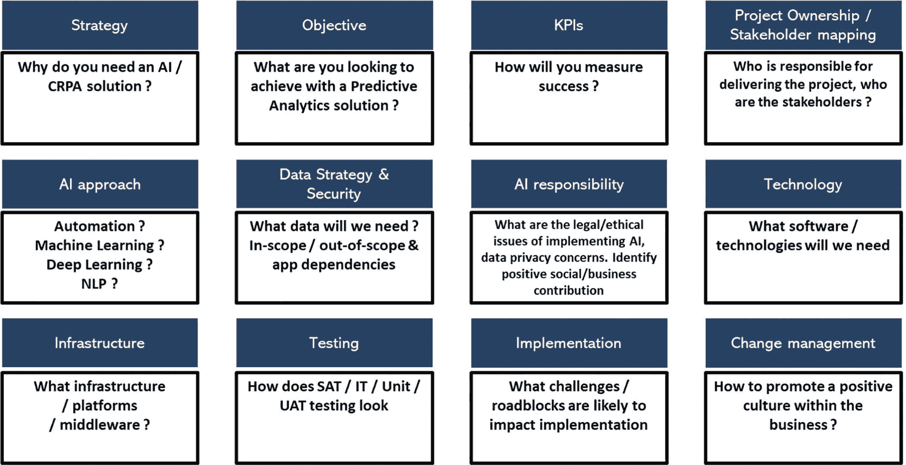

AI 用例的一组解决方案框架。包括战略、目标、KPI、AI 方法、项目所有权、技术、变更管理、AI 责任、实施、测试和数据战略。

**图 8-2** AI 解决方案框架

### 解决方案架构

对现有 IT 环境进行尽职调查是了解数据、流程、技术和基础设施方面差距的必要前提。这些差距为实施和解决方案方法提供了信息——在这个学习旅程的某个阶段，将需要一个“目标”解决方案架构来阐明 AI 解决方案将如何与支持性的（混合）基础设施（包括本地和基于云的基础设施）进行交互。

我们已经在关于数据摄取的章节（参见构建交付管道）中查看了一些示例架构，因此我们将通过快速查看另一个示例来结束本节——这次是 Azure 云 BI 架构。

#### 示例：Azure

AI 项目通常是从更简单的描述性分析项目中发展而来的。

图 8-3 中简单的 Azure 架构显示了（在训练阶段 I）由 `Azure Data Factory`（`ADF`）执行的提取、加载和转换（ELT）管道。`ADF` 自动化工作流，将数据从本地 SQL 数据库移动到基于云的数据库——在本例中是 `Azure Synapse`（SQL 数据仓库）。

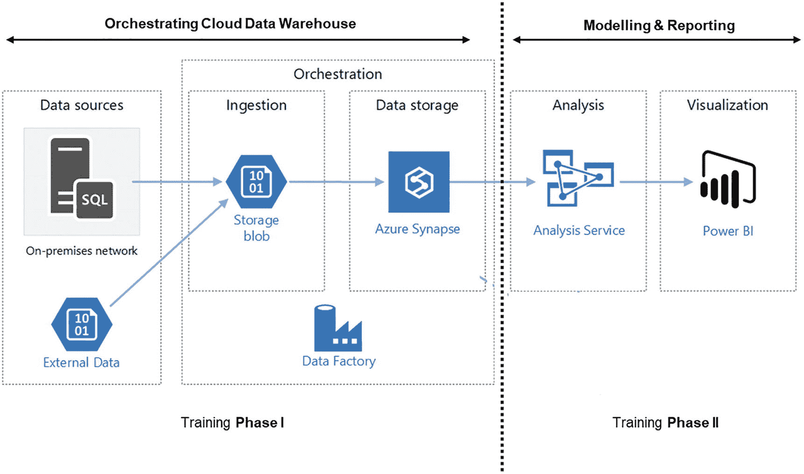

AI 用例的一组解决方案框架。包括：战略、AI 方法、基础设施、目标、数据战略与安全、测试、实施、AI 责任、技术和 KPI。

**图 8-3** 基本数据分析 Azure 架构

然后，使用 `Azure Analysis Service` 对 `Azure Synapse` 中的数据进行转换以进行分析，从而有效地为 `Power BI` 创建一个语义模型，供最终用户生成见解。

## 电信解决方案

现在，我们将注意力转向特定行业的主要 AI 用例，从电信行业开始。

### 具体挑战

在电信行业实施人工智能解决方案会面临一系列具体挑战，这些挑战涉及人员、流程和工具等多个方面。如图 8-4（源自波士顿咨询公司）所示，委托开展的人工智能项目和应用需要证明其价值、具备数据治理能力、实现敏捷数字化交付、拥有内部人工智能能力，并管理好业务转型。在接下来的章节中，我们将挑选出主要的电信人工智能与分析解决方案，并探讨其中部分挑战。

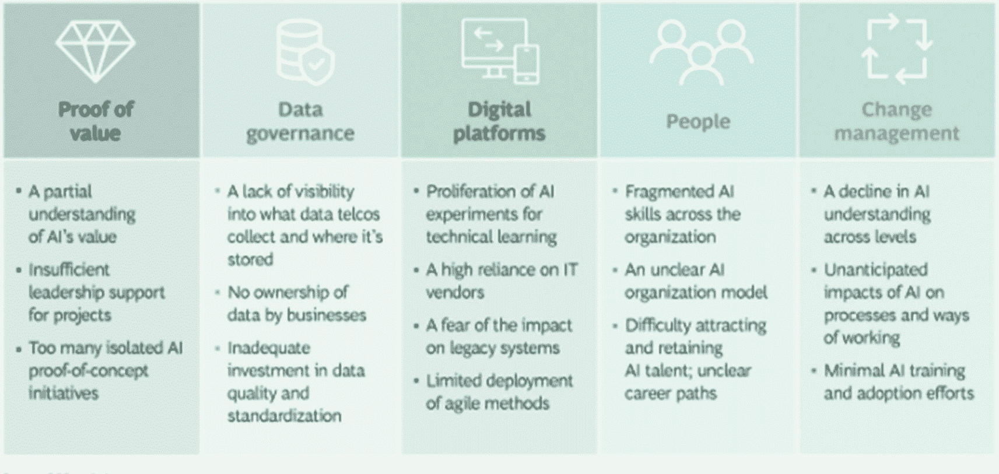

电信行业面临的五项具体挑战。它们分别是：价值证明、数据治理、数字平台、人员以及变革管理（包括下文的分析解决方案）。

**图 8-4** 波士顿咨询公司：电信行业五大人工智能障碍

### 解决方案类别

电信行业独特之处在于其依赖以“特征丰富”著称的数据集——关于客户的信息通常包含数百个变量，涉及人口统计特征（年龄、性别等）、交易数据（例如，每月总支出）以及态度参数（如已浏览的升级套餐）。

但人工智能解决方案并非总是聚焦于最终客户。总体而言，我们在电信行业看到了三大类人工智能解决方案。如图 8-5 所示，这些方案被分为：数据与治理及监督、仪表盘驱动的洞察，以及预测性分析。

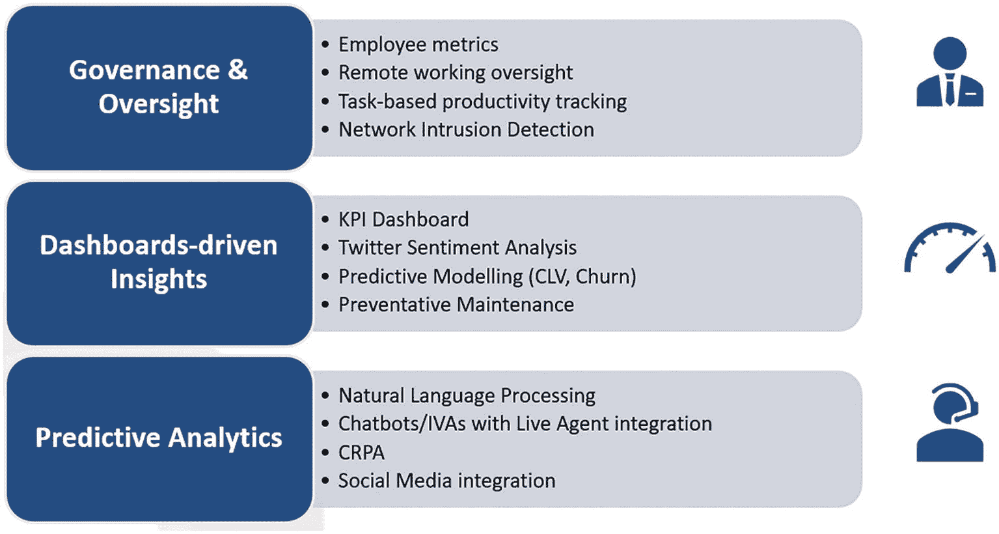

电信行业三大类人工智能解决方案，包括以下方案：1. 治理与监督；2. 仪表盘驱动的洞察；3. 预测性分析。

**图 8-5** 电信行业人工智能解决方案类别

### 实时仪表盘

客户流失率是衡量电信公司业绩的主要指标之一。行业分析^(¹¹⁶)显示，移动服务的客户流失驱动因素各不相同：

*   价格 45%

*   客户服务 45%

*   网络覆盖 36%

理想情况下，企业希望有一个单一平台来跟踪多项客户指标和内部关键绩效指标的进展，并防止客户流失。做出数据驱动的决策需要全面了解关键客户指标，包括客户投诉跟踪和关键服务水平协议指标。

实时、引人注目的仪表盘可以通过关键指标、监控以及客户投诉的自动报告来支持监督流程：

*   检查客户档案

*   评估客户评价

*   监控指标

*   衡量风险，包括风险发生的概率

*   非结构化文本投诉分析

*   基于资源和时间的投诉解决关键绩效指标

如上所示，当今的人工智能解决方案最终需要从日益重要的非结构化文本中提取洞察。除了与云上的多个数据源集成外，当今最好的仪表盘解决方案（例如 `PowerBI` 和 `Looker`）都支持非结构化数据处理，并内置了“单一客户视图”，具有多项有据可查的优势：

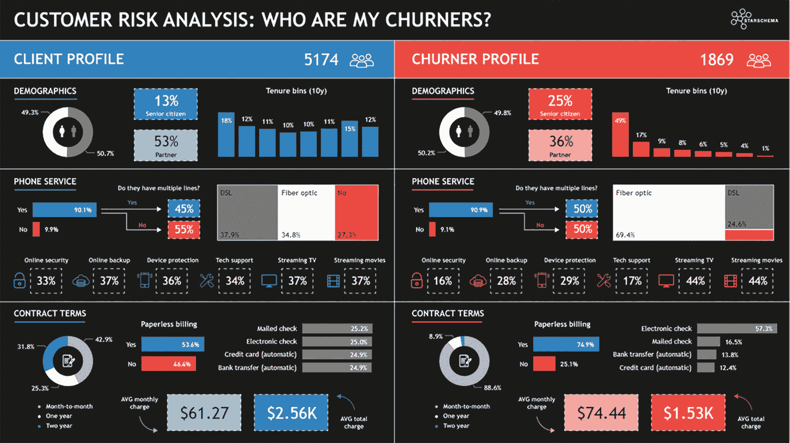

一个包含客户风险分析的实时仪表盘示例。它展示了客户画像与流失客户画像在人口统计特征、电话服务和合同条款方面的对比。

**图 8-6** 电信仪表盘视图示例 – 流失客户与非流失客户（来源：Microsoft PowerBI / Starschema）

*   快速导航下的实时分析

*   改进的决策制定

*   易于访问和共享的信息

*   通过关键指标报告了解您的业务（或客户）

*   交叉销售和追加销售机会识别

*   快速解答业务查询

### 情感分析

使用自然语言处理的情感分析已成为电信行业公司更好地理解客户声音和意见的宝贵工具。但通常，客户“情感”只是公司希望从其客户互动渠道中收集的关键跟踪标准之一。其他关键跟踪标准包括客户主题或概念、情绪、实体和关键词分析。

我们将在下文探讨如何使用 Python Twitter API 为电信行业实施情感分析解决方案。但就项目方法而言，这些关键跟踪标准是一个很好的起点，可用于创建解决方案设计，以展示与业务相关的社交媒体指标，营销团队可以据此对客户进行细分并采取行动。

通常，最优秀的情感分析解决方案是全栈式的，它将特征丰富的电信数据集分析与底层的最新 Twitter 信息流（或 Facebook Insights）关键跟踪标准分析相结合，并通过前端仪表盘实时显示关键绩效指标。


该图描绘了对特征丰富的电信数据集进行情感分析的过程。

**图 8-7** 电信数据集以“特征丰富”著称

### 预测性分析

除了仪表盘和情感分析，电信公司也在寻求利用机器学习的更通用的“预测性分析”解决方案，以实现生产力提升。

其用例多种多样，从最优规划和调度（例如，宽带维修），到一键式客户需求预测（按细分市场）和竞争对手定价分析，支持假设情景分析（例如，模拟新服务的推出），客户服务交付自动化（包括安装和服务升级），以及文档搜索能力/概率性文档检索（例如，基于合同条款）。

应对这些挑战的一个自然选择是“内部”机器学习即服务能力，它可以处理这些众多问题，将其转化为可解决的机器或深度学习问题，通常先采用无监督学习，然后转向定期（例如，每月）的有监督学习方法（直到通过管道捕获足够数量的数据并自动更新）。与所有行业一样，在电信行业交付生产级解决方案的关键在于，通过以下方式之一，与现有流程进行性能基准测试：

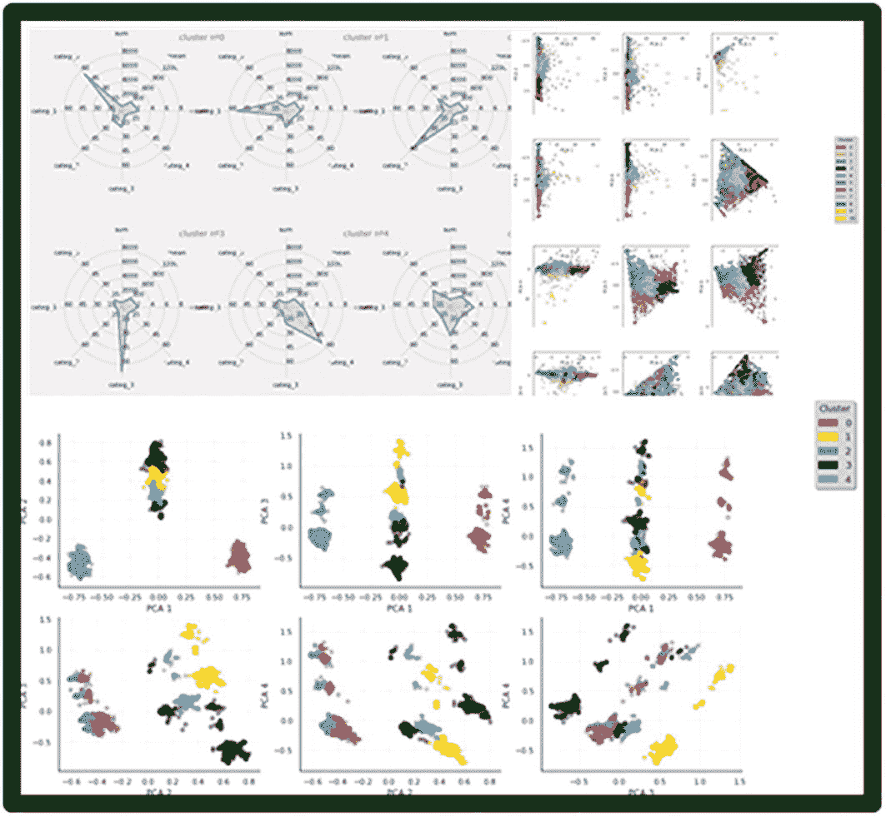

一组预测性分析图，展示了主成分分析在特征丰富的电信数据集上的应用，以及它作为数据降维工具的价值。

**图 8-8** 主成分分析的应用——对“特征丰富”的电信数据集进行数据降维的宝贵工具

*   底层预测性分析解决方案可证明的投资回报率

*   成本降低，或

*   增量收入收益

### 从 Python 连接到 Twitter API

在本节结尾，我们将探讨如何从 Python 连接到 Twitter API——这是本章第一个动手实验的先决条件。

**在 Python 笔记本中导入 twitter 库之前，我们需要满足三个首要的设置要求：**

1.  一个 Twitter 账户

2.  一个 Twitter 开发者账户

3.  Twitter 对用例的批准

流程如下所示：

*   设置一个 Twitter 账户

    *   [`twitter.com/i/flow/signup`](https://twitter.com/i/flow/signup)

*   设置一个 Twitter 开发者账户

    *   [`developer.twitter.com/en/portal/petition/use-case`](https://developer.twitter.com/en/portal/petition/use-case)

    *   需要填写一份 5-10 分钟的申请表——确保说明用例是为了提升自然语言处理技能和理解社交媒体情感

*   获取 Twitter API 凭证

    *   `API_KEY`, `API_SECRET_KEY`, `ACCESS_TOKEN`, `ACCESS_TOKEN_SECRET`

打开一个 Python 笔记本（例如，使用 Jupyter 或 Google Colab），我们现在可以使用以下命令导入 twitter 库，并开始查询实时（和历史）推文。

```
import twitter
```

### Twitter API 与基础情感分析：动手实践

#### 熟悉 Twitter API

**访问 Python Twitter API**，本实验的目标有两个：

1. 使用 Jupyter Notebook 在 Python 中分析 Twitter 信息流

2. 使用 `tweepy` 和 `nltk` 对最新推文进行基础情感分析

##### a) 分析 Twitter 信息流：

1. 确保你已按照上文“从 Python 连接 Twitter API”中的描述，完成了 Twitter API 的配置

2. 从下方 GitHub 仓库下载笔记本：

`https://github.com/bw-cetech/apress-8.2.git`

3. 运行 `TwitterFeed.ipynb` 笔记本，并以图 8-9 作为路线图：

   - **获取推文** – 导入库和凭证，定义 Twitter 搜索条件，并抓取推文

   - **处理推文** – 将推文收集到 Python 列表中，并过滤掉转推

   - **分析推文** – 谁在发推？提取位置指标，并将列表转换为 pandas 数据框

4. 最后，完成高级 Twitter 查询练习。

##### b) 执行基础情感分析

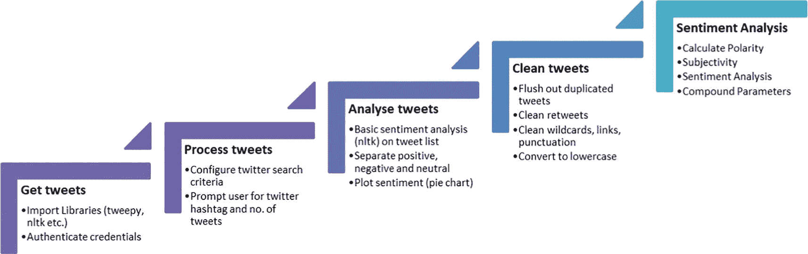

图示展示了带有情感分析的 Twitter 信息流。它包括 5 个步骤：获取推文、处理推文、分析推文、清洗推文，以及最终的情感分析。

**图 8-9** 使用 Twitter API 进行情感分析

1. 按照下图所示的步骤/子步骤，运行 `TwitterSentimentAnalysis.ipynb` 笔记本

2. 确保完成笔记本中的练习，以对处理后的推文进行分析

## 零售解决方案

零售行业与电信行业面临着许多相同的挑战，但也存在一些与产品和客户体验相关的独特挑战，这些挑战使得数字颠覆区别于电信等更多由服务驱动的行业。本节将探讨 AI 解决方案如何帮助零售商克服这些挑战。

### 零售行业面临的挑战

自 2010 年代初以来，数字颠覆对零售行业和商业街的影响就已显现，并在过去五年中加速发展，而疫情更是加剧了这一趋势。

随着市场的快速演变，消费者的期望也在发生变化，例如在提供独特的店内体验方面，有统计数据^(¹¹⁷)表明，如果提供个性化体验，更多人倾向于在实体店而非线上购物。同步、无缝的线上与门店购物体验不仅有助于创造更具“沉浸感的购物体验”，还能解决运营效率低下的问题。随着消费者越来越依赖社交媒体，零售商利用这些渠道上的模型结果，可以帮助差异化服务/在竞争中占据优势，并确保与直接客户、他们的亲属以及他们信任和依赖的关键影响者保持互动。

面对来自供应链以及业务各个角落（线上和店内）的海量数据，零售商需要过滤噪音，将这些分散的数据源转化为以消费者为先的策略。传统的供应链已被能够快速响应消费者行为变化的适应性、灵活性生态系统所取代。

与此同时，动态定价正在推动价格（和促销）的透明度，并帮助一些零售商定义其品牌价值。同时，在线零售商持续的低价竞争（以及对交货日期的承诺）给试图参与竞争的实体店带来了诸多挑战。

上述所有零售业趋势（在一定程度上也包括交通和航空业）都是由数据以及日益创新的预测建模技术所驱动的。尽管零售业是 AI 应用领域的领先行业之一，但因其规模庞大，在 2022 年它仍然是 AI 解决方案的关键战场，尤其是那些拥有更好数据管道集成和支持性云（存储和计算）基础设施的解决方案。

### 客户流失与留存建模

上述消费者购物行为及偏好的空前变化，使得人们越来越关注从首次购买到（潜在）失望的“客户旅程”。

在当今竞争激烈的市场中，流失率指标反映了某一客户群（客户细分）对产品、服务、价格和竞争的反应。对于大多数零售企业而言，衡量现有流失率对于防止利润侵蚀或品牌/商店的负面营销至关重要。更重要的是，采取主动措施预测和防止客户流失，是留住现有客户并驱动可靠收入流的必要条件。

#### 流失建模的最佳实践方法

从建模角度来看，应该从哪里开始？注册过程中产生的数据（**人口统计**数据）和销售过程中的数据（**交易**数据）是关键，但在当今更成熟、更精通数据的零售商眼中，仅凭这些数据是不够的。

如今，数据科学/人工智能为零售商带来的增值在于挖掘客户数据，以分离出**行为和态度**特征，例如通过使用会员卡进行的商品和商品类别购买（因此是可搜索的），或者访问/页面打开/页面点击零售商在线平台上销售或营销的特定产品。

虽然没有硬性规定，但一个良好的流失模型通常每个客户至少包含 50 个特征，涉及多种数据类型（数值连续型，如总交易额；数值分类型，如购买的产品类型；文本/字符串型，如客户评论；以及日期型，例如自上次在线访问以来的时间）。

在流失建模中，会从客户群中创建一个“保留”数据样本，留待模型训练和验证阶段结束时进行推理。

在模型训练和交叉验证（使用多算法基准测试）期间，会识别出最重要的预测因子（并在后续运行中加以培育/包含），而特征消除可以解决初始高方差（过拟合）模型的问题。模型因此得到迭代改进，有时会加入更多交易、促销或行为数据以提高性能，或使用递归特征消除技术，如多重共线性检验和卡方检验。

具有内在商业价值的模型倾向于优先考虑精确率而非召回率，因为需要降低成本，并且高召回率但低精确率的模型会带来相对较高的成本开销。

最后，开始时定义的保留样本被用作流失倾向的基础（即，训练后的模型是否能很好地泛化到新数据——它是否能很好地识别高风险客户等），并使用两个控制客户样本进行 A/B 测试，其中一个样本使用模型输出，另一个不使用，并比较例如未来一个月的后续收入流。还应定期（例如每季度）对模型价值进行“投资回报率审查”，比较针对所有客户与仅针对我们预测的流失客户的可能成本或商业影响。

#### 模型设计与成果

最好的流失模型是与平台（和云）无关的，并且在必要时连接到实时客户交易，例如通过一个带有原始 OLTP/OLAP 数据连接器的数据湖。

这种“可扩展”模型还应能够促进跨多种现金流风险情景（按地区、业务部门、产品或服务线以及客户细分）的报告，并通过前端连接清晰地识别多方面的机会和威胁：

*   切实的流失预防/留存影响

*   排名客户

*   面临风险的收入

*   最高（细分）流失倾向

*   价值最高的风险消费者

鉴于流失模型的最终客户通常是寻求用数据驱动分析和模型结果来支持营销活动创意的营销团队，营销（和媒体）“连接”有助于自动化与最高风险客户的互动。

### 使用 GCP BigQuery 进行在线零售预测分析：动手实践

预测性零售分析

使用 Google Cloud Platform BigQuery ML，本实验的目标是训练一个机器学习模型来预测自行车租赁行程的平均时长

1.  通过以下链接注册 GCP 免费套餐账户：

    [`console.cloud.google.com`](https://console.cloud.google.com)

2.  登录以下 GCP 沙盒（即使在 GCP 免费套餐三个月到期后仍免费）并创建一个项目

    [`console.cloud.google.com/bigquery?ref=https:%2F%2Faccounts.google.com%2F&project=gcp-bigquery-26apr21&ws=!1m0`](https://console.cloud.google.com/bigquery?ref=https:%2F%2Faccounts.google.com%2F&project=gcp-bigquery-26apr21&ws=!1m0)

3.  添加公共奥斯汀共享单车数据集

4.  练习：执行几个快速的 SQL “EDA” 查询，以获取 (a) 记录数和 (b) 最繁忙的自行车站点

5.  编写另一个 SQL 查询，使用以下特征构建一个 ML 模型：

    1.  起始站点名称

    2.  行程开始的小时

    3.  行程的星期几

    4.  起始站点的地址

    5.  仅限 2018 年数据

6.  重复上述步骤构建第二个模型，但添加“共享单车订阅者类型”并移除以下两个特征：

    1.  行程的星期几

    2.  起始站点的地址

7.  评估这两个模型

8.  练习：预测最佳模型的平均自行车骑行时长

### 预测客户流失：动手实践

使用 Python 进行流失建模

在 Jupyter Notebook 中使用 Python，本练习的目标是预测活跃客户离开组织的可能性，并识别流失的关键指标

1.  克隆以下包含流失模型 Python notebook 和 `customer_churn_data` 数据集的 GitHub 仓库

    [`github.com/bw-cetech/apress-8.3.git`](https://github.com/bw-cetech/apress-8.3.git)

2.  在 Google Colab 中运行该 notebook，导入数据，然后执行：

    1.  预处理

    2.  可视化 EDA

    3.  特征工程

    4.  建模

    5.  练习 – 通过查看 `feature_importances` 识别流失的主要指标

    6.  练习 – 使用训练好的模型进行未来预测

    7.  练习（拓展）

        1.  与其使用带有预定义目标（流失）变量的数据集，不如将其替换为包含客户订单信息的零售数据集（例如同样上传到上述 GitHub 仓库的数据集 `AW-SOH.xlsx`），并根据自客户上次购买以来经过的目标月数 (N) 将“流失”定义为一个自定义变量。

        2.  按客户聚合订单数据，设计任何可能预示流失的新交易特征（例如平均购买金额、客户时长等）。

        3.  最后，将数据拆分为训练集和测试集，以相同方式训练预测模型，然后预测新客户在未来 N 个月内是否可能流失。

### 社交网络分析：动手实践

使用 NetworkX 进行超市推文分析

本节中的最后一个实验将探讨如何对推文实施社交网络分析。在这里，我们查看关于四家英国超市的推文，并对这些聚焦于主要城市的推文位置进行网络分析

1.  将以下 GitHub 仓库克隆到本地文件夹

    [`github.com/bw-cetech/apress-8.3b.git`](https://github.com/bw-cetech/apress-8.3b.git)

2.  使用 Jupyter Notebook 或 Google Colab 运行该 notebook，遵循以下步骤：

    1.  按说明安装 network

    2.  导入推文的（静态）数据集

    3.  对推文信息执行快速 EDA

    4.  过滤掉特定位置（即不是“英国”）

    5.  创建排除列表以供进一步分析

    6.  创建主要城市列表

3.  最后创建网络分析，显示按超市和（主要城市）位置分类的推文

## 银行与金融服务/金融科技解决方案

银行与金融服务行业是本章下一节的主题。我们首先审视行业挑战，然后介绍主要的 AI 解决方案之一——欺诈检测。

### 行业挑战

在包括银行与金融服务在内的多个行业中，AI 正在迅速重塑风险管理实践，并改变客户与内部服务。关键变革领域如下所示：

- 治理、风险管理和合规（GRC）

- 欺诈检测与预防

- 个性化银行服务

- 交易

- 流程自动化

- 客户投诉

但 AI 即服务在银行与金融科技领域的价值并不仅限于风险控制和成本预防。AI 创新还有助于：

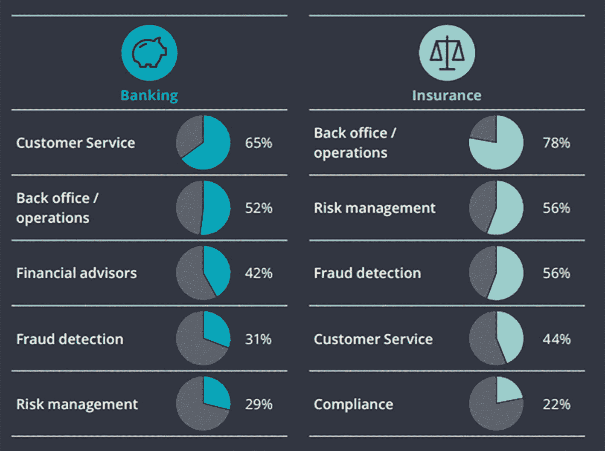

银行与金融（保险）服务对比图，展示了客户服务、后台运营、财务顾问、欺诈检测、风险管理和合规的百分比。

**图 8-10** 德勤——C 级高管关注的银行与金融服务关键用例

- 打造引人入胜且差异化的客户体验（零售银行）

- 将客户业务关系从资金转移者转变为资金管理者（数字银行）

- 通过提供全球接入的银行、投资和股票市场交易服务（例如通过机器人顾问或算法交易服务以及“日内交易”/差价合约应用），提高客户终身价值

- 通过使用聊天机器人和 IVA 技术以及包括文档搜索、检索和归档在内的自动化系统，降低客户支持成本

- 通过强大的欺诈检测措施和定期个性化优惠（贷款、现金返还激励等）建立信任和忠诚度

尽管预测分析在许多领域都发挥着价值，但本节的主要焦点是银行与金融科技领域的“旗舰”AI 用例——欺诈检测。

### 欺诈检测

企业与组织的欺诈风险不仅仅涉及大额交易的简单识别——一个稳健的解决方案还必须应对关键的操作风险。欺诈是一个持续存在的问题，每年给企业造成数十亿美元的损失。在高度颠覆性的银行与金融服务领域，应用学习能力（而非更简单的基于规则的方法）被视为一种生存需求。

如今，机器学习和深度学习的主要欺诈检测应用能够在模型结果上实现更高的复杂性，并凭借云连接性内置了可审计性，从而开箱即用地预防欺诈。这些应用通过将机器学习与高级规则引擎相结合，能够检测更广泛的欺诈事件，沿途识别：

- 重复付款

- 重复发票

- 异常付款金额

- 异常付款描述

- 一次性付款

- 关注实体

除此之外，欺诈检测必须与公司的内部数据和 AI 战略相结合，并与内部和外部数据源（理赔系统、观察名单、第三方系统）完全集成，这已是理所当然。模型特征还包括在多因素认证时代（2FA、3FA）的动态认证流程方法，应对与移动渠道相关的特定欺诈挑战，以及在特征工程过程中对非结构化文本进行编码。

#### 案例研究：AWS 欺诈检测

亚马逊网络服务行业领先的欺诈检测解决方案使用 `SageMaker` 进行自动化交易处理，这也是我们下面动手实验的主题。`SageMaker` 本身运行在一个完全托管的 `EC2`（计算）实例上，该实例运行 Jupyter Notebook。

该欺诈检测解决方案本质上加载一个“实时”信用卡交易数据集，训练两个模型以识别欺诈模式，然后将其部署为两个独立的端点。初始模型使用无监督学习（随机割森林算法）执行异常检测，随后使用有监督训练（`xgboost` 算法）基于标记数据进行欺诈检测。

部署的解决方案自动检测欺诈活动，并标记欺诈活动以供审查。

如下方架构图所示，`SageMaker` 的集成涉及：

1. 两个用于数据存储的 Amazon Simple Storage Service（`S3`）存储桶，一个用于存储模型的输入数据，另一个用于存储下游（建模后）分析数据

2. `Lambda` 用于处理连续的预测请求流（由 Amazon REST API 网关触发）

3. `Kinesis Firehose` 将处理后的交易加载到第二个 `S3` 存储桶中，用于 `QuickSight` 中的下游商业智能分析

在接下来的实验中，我们将使用 AWS CloudFormation 模板来配置多个资源需求。请注意，这些资源会产生费用：

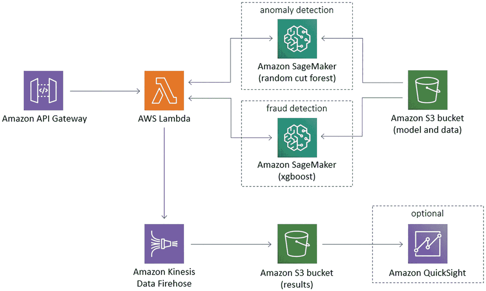

AWS 欺诈检测架构图。从 Amazon API 网关、AWS Lambda、异常检测、欺诈检测、Amazon S3 存储桶（模型和数据）到 Amazon Kinesis Data Firehose。

**图 8-11** AWS 欺诈检测——架构

- **1.50 美元** – Amazon SageMaker `ml.c4.large` 实例的一次性费用

- **0.65 美元/小时** – 使用 AWS 示例数据集处理交易的成本

### 使用 AWS SageMaker 进行 AWS 欺诈检测：动手实践

从交易监控到仪表盘分析：云端欺诈检测

本实验的目标是构建 AWS 欺诈检测解决方案的端到端实现，从通过 Cloud Formation 模板进行资源设置，到通过 `QuickSight` 创建仪表盘分析。

本实验的操作流程，从数据导入到 `QuickSight` 分析，已在上一节中详细描述，并总结在下方流程图中：

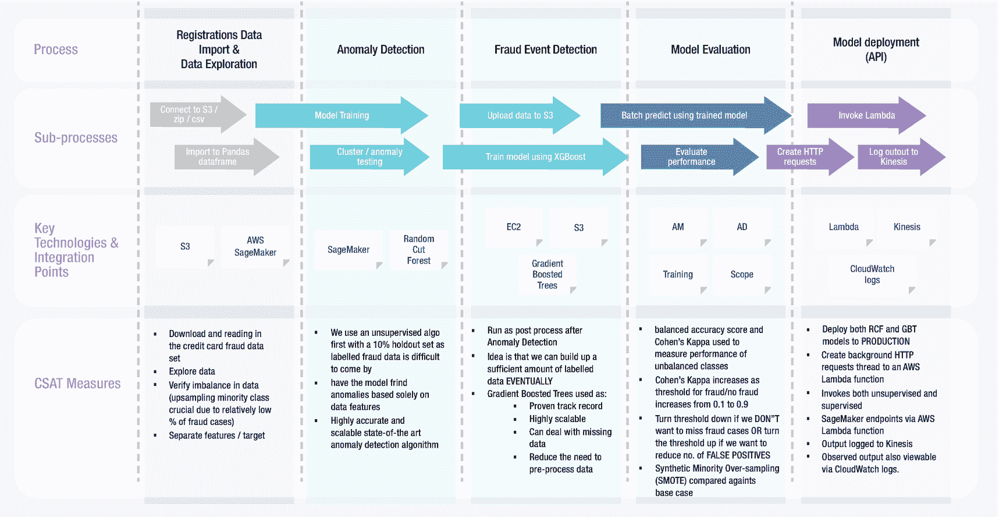

图示展示了从交易监控到仪表盘分析的 AWS 欺诈检测流程。包括流程、子流程、关键技术、集成点和客户满意度指标。

**图 8-12** AWS 欺诈检测——从交易数据导入到（`QuickSight`）仪表盘分析的无缝自动化

1. 通过访问以下链接并启动 AWS Cloud Formation 模板来创建 AWS 欺诈检测资源：

   `https://console.aws.amazon.com/cloudformation/home?region=us-east-1#/stacks/new?&templateURL=https:%2F%2Fs3.amazonaws.com%2Fsolutions-reference%2Ffraud-detection-using-machine-learning%2Flatest%2Ffraud-detection-using-machine-learning.template`

2. 运行笔记本，依次执行每一步：

   1. 数据导入

   2. 数据探索

   3. 验证 Lambda 函数正在处理交易，然后进行建模步骤（从 `SageMaker` 经 `Lambda` 到 `Kinesis`）：

      1. 异常检测

      2. 欺诈事件检测

      3. 模型评估

3. 检查 `S3` 存储桶结果和 `Kinesis` 流

   1. 数据管道与模型部署（API）

   2. CloudWatch 日志

4. 最后在 `QuickSight` 中查看结果，并将欺诈检测分析显示为仪表盘

5. 拓展练习——通过使用 SMOTE（合成少数类过采样技术）平衡少数类（此处为欺诈交易）来改进模型性能

## 供应链解决方案

欺诈当然不仅影响金融机构。供应链也受到影响，垂直整合公司还面临着其他各种挑战，尤其是在应对通胀定价、管理或运输稀缺资源以及在气候不稳定的背景下关爱环境等方面。

下一节将探讨 AI 解决方案如何应用于供应链管理。

### 供应链面临的挑战

“供应链”当然不是一个特定的垂直行业或领域，而是许多企业和组织采购及交付其产品与服务的一种手段。供应链管理（SCM）中的规划、物流和采购活动横跨多个行业，包括制造批发、分销和零售、运输（货运公司、车队配送）、石油和天然气行业，以及医疗保健和公共服务。

组织常常在如何使用高性能、复杂的规划、排程和优化软件方面存在知识缺口，但如今，AI 工程师和数据科学家可以利用云计算、“可视化”机器学习^(¹²⁰)和求解器能力的进步，结合引人入胜的前端设计，来吸引企业内更广泛的受众。此外，当今针对 SCM 的 AI 解决方案可以通过寻找以下问题的答案，帮助运营人员理解并更好地管理公司的交付物流：

*   如何确定仓库的位置和容量

*   哪个工厂应该生产哪种产品

*   将飞机和机组人员分配到航班

### 预测分析解决方案

在探讨供应链优化的利基端到端解决方案之前，已有大量内部实施的预测分析案例用于管理供应链的关键领域。

这些案例包括：通过交易异常检测、采购引擎和欺诈检测模型来管理供应商/客户关系的风险；客户支持解决方案，如聊天机器人和 IVA（智能虚拟助手）或文档搜索与检索；利用库存和合同管理工具结合“边缘 AI”解决方案的物流，以实现更精细的预测分析（例如，在本地而非区域层面进行供需匹配）；以及针对特定资产和业务部门的资产优化与预测。

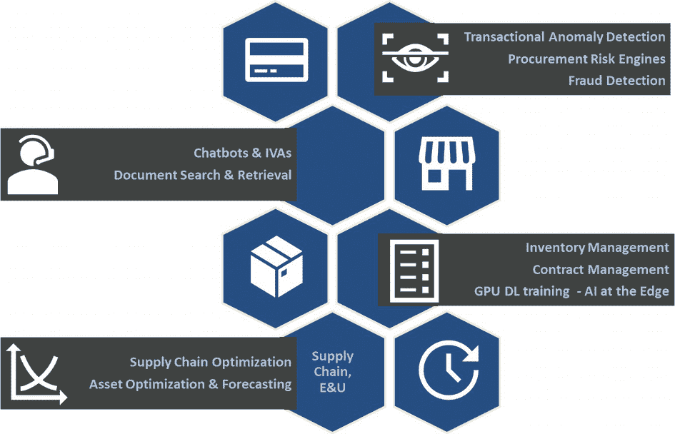

预测分析解决方案的架构图。它包括交易异常检测、采购风险引擎、欺诈检测、库存管理、合同管理、聊天机器人和 IVA。

**图 8-13** SCM 预测分析解决方案

### 供应链优化与规范分析

对于许多供应链优化问题而言，仅靠预测分析是不够的，因为它关注的是“可能发生什么”（例如需求预测中的预期需求）。而规范分析则将解决方案空间扩展到“实现它的方法”，如下方图片所示，即如何将供应与预期需求相匹配。

许多供应链问题（例如，路线规划、排程、仓库优化和调度）都涉及**供需匹配**，并且需要使用高性能求解器来确保针对目标垂直行业应用最优的排程、路线规划和调度解决方案。`CPLEX`、`Gurobi` 和 `FICO` 是这类规划和排程问题的行业领先求解器，我们将在本节下面的动手实验中使用 `CPLEX`。

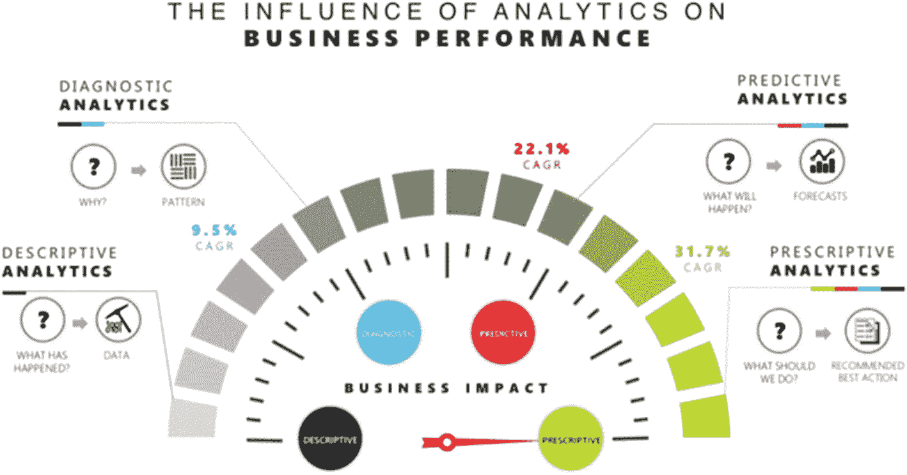

该图展示了基于诊断分析（复合年增长率 9.5%）、描述性分析、预测分析（22.1%）和规范分析（31.7%）的分析对业务绩效的影响。

**图 8-14** 分析方式（来源：iotforall）

在遵循最佳实践“DataOps”交付模型的同时，实施稳健的规范分析算法或“求解器”，最终可以为组织带来一些关键的价值差异化优势：

*   最优规划和排程

*   支持假设情景分析

*   降低成本并带来增量收入

*   与遗留流程进行绩效基准比较

### 使用 IBM CloudPak/Watson Studio 进行供应链优化：动手实践

使用 Watson Studio 和 IBM Cloud Pak 编排决策优化与 Cplex

在本实验中，我们将在 IBM Cloud Pak for Data 中部署一个端到端的供应链优化样板项目：

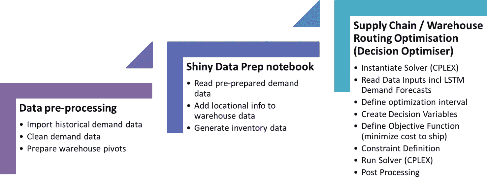

使用 IBM Cloud Pak 进行供应链优化的示意图。它包括：1. 数据预处理。2. Shiny 数据准备笔记本。3. 供应链或仓库路线优化（决策优化器）。

**图 8-15** IBM Cloud Pak for Data – 供应链优化

1.  注册/登录 IBM Cloud Pak

    1.  [`dataplatform.cloud.ibm.com/exchange/public/entry/view/427846c7e99026edd5fa0022830bc002?context=cpdaass`](https://dataplatform.cloud.ibm.com/exchange/public/entry/view/427846c7e99026edd5fa0022830bc002%253Fcontext%253Dcpdaass)

2.  创建一个项目

3.  创建一个部署空间

4.  逐一运行以下每个 Jupyter 笔记本：

    1.  **数据预处理：** 预处理供需数据

        1.  供应商

        2.  制造商

        3.  仓库

    2.  **Shiny 数据准备** 笔记本

    3.  **LSTM 需求预测**（未包含）

    4.  **决策优化器：** 运行规范优化

        1.  加载预先准备好的 LSTM 需求预测

        2.  优化运输零件（从四个供应商到三个制造商）和交付产品（从三个制造商到四个仓库）的成本

5.  使用决策优化器完成规范优化过程后，运行（Shiny）仪表板应用，并查询库存、需求与供应以及物流视图

6.  练习 – 将仪表板上的产品类别从数字更改为名称

7.  拓展练习 – 安排每月一次使用新数据重新训练和运行模型

## 石油和天然气/能源与公用事业解决方案

能源行业涵盖了价值链上的许多不同企业，从石油和天然气巨头到分销公司、发电厂和可再生能源运营商（REC）、公用事业公司和能源零售商。我们将在下面探讨 AI 的机遇。

### 能源、石油和天然气行业面临的挑战

在当前供应减少、供应链紧张和价格飙升的环境下，能源行业若对 AI 作为创收和成本优化的推动力关注不足，也是情有可原的。但 AIaaS（AI 即服务）仍有大量机会来释放价值，尤其是在分布式能源链和可再生能源领域。AIaaS 在石油和天然气领域也在增加价值，因为寻找安全、经济和可持续的勘探与生产方法，以及减少石油生产对环境的影响，是关键关注点。

早在当前的能源危机之前，企业就已经被遗留的（ETRM）工具和糟糕的创新实践所拖累。能源行业变革步伐缓慢的部分原因在于，员工队伍在统计上趋于老龄化，同时中层管理人员臃肿，他们担心变革会影响自己的工作与生计。其他人则对使用新兴技术存在伦理担忧，尽管其中许多工具早已不再是“新兴”技术。

不断变化的劳动力人口结构开始推动对数据驱动创新的需求，以及利用 AI 摆脱落后、低效业务流程的需求。事实上，能源价值链上并不缺乏数据——挑战在于如何处理所有这些数据，以及如何处理在整个能源供应链中呈指数级增长的物联网传感器数据。

### 能源领域的人工智能解决方案——机遇还是威胁？

能源领域多种力量的日益融合，近期催生了快速原型设计以及加速人工智能解决方案交付的趋势。当前趋势正从旧的垄断体系，转向一个由人工智能生态系统中同类最佳但高度集成的数字解决方案组成的异构平台；这些解决方案通常更便宜、更小巧，且更多采用开源方式。

规模较小或“微型人工智能”解决方案的交付速度更快，而单一云端的“大型科技”解决方案在某种意义上已变得“过于庞大”且成本过高。人工智能带来的生产力提升已变得难以忽视，并且可能引发一种破坏性的不良文化，尤其是当与旧有流程的性能基准对比显示出令人信服的优势时。

风险/资产管理工具，例如嵌入了机器学习、可通过`fbprophet`或循环神经网络实现“一键式”客户/负荷/价格预测的客户风险引擎，正开始变得普遍——即便不作为生产级解决方案，至少也作为原型`python/Dash`脚本出现。后台办公的 CRPA 和文档检索解决方案也已显现，例如用于天然气/电力政策搜索、结算、计费以及合同管理。而交易支持解决方案，包括算法交易、自动化市场分析以及支持“假设”情景分析的智能系统，正被用于提升前台盈利能力。

上述许多在零售领域应用的预测性人工智能工具，在能源领域也证明了自己的价值，例如结合社交媒体情绪分析的“实时”客户决策引擎、聊天机器人和智能虚拟助手、自动化客户服务交付，以及反映批发市场动态和能源新闻的仪表盘与报告解决方案。同样，上一节提到的具有强大求解能力的供应链优化解决方案，通常也适用于从上游能源源头，经输配渠道到供应商，再到下游客户的交付规划、优化调度和路径规划。

边缘人工智能是另一个令人兴奋的应用领域，它能够及时利用日益去中心化、分布式的资产发电和消费（例如风力涡轮机、太阳能电池板、热泵和小型电池储能）。

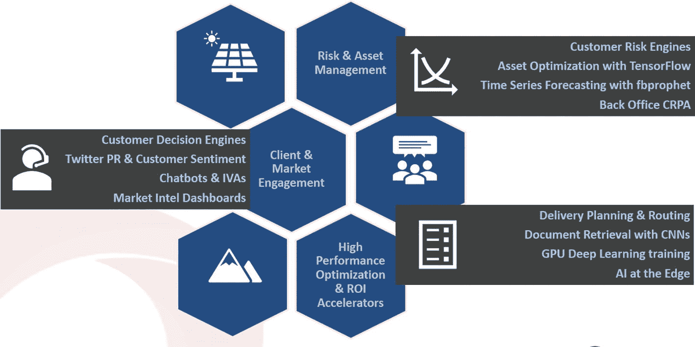

一幅插图展示了能源领域人工智能解决方案的概览，包括风险与资产管理、客户与市场参与、高性能优化以及投资回报率加速器。

**图 8-16** – 能源领域的人工智能解决方案

### 医疗保健与制药解决方案

虽然人工智能在能源领域的部署可能落后于其他一些行业，但医疗保健和制药行业的情况却并非如此。消费者出于监测、比较和改善个人健康与健身的目的，对健康科技或数字健康产品与服务表现出参与热情，这推动了该领域大量的人工智能创新。

### 医疗保健——人工智能鸿沟

医疗保健行业以极快的速度运转，有时似乎几乎没有时间去研究更好的做事方法。从本质上讲，护理优先于创新，这可能导致突破性的技术解决方案无法到达可能需要它们的医生、顾问和患者手中。

数字化的快速发展为医疗保健专业人员提供了利用低延迟、易用、高度可视化、交互性强且信息丰富的预测分析支持的机会，有助于缩小财务和效率差距。

尤其是在医疗保健支持职能方面，由人工智能主导的文化转变——从临时、执行不佳的运营流程、过于复杂的非标准流程、主观/有偏见/武断的决策以及人为错误中转变出来——有助于释放价值，无论是帮助减少或控制不断膨胀的医疗采购成本，还是实现针对患者的营销，例如针对制药/天然健康产品的营销。

### 医疗保健与制药解决方案

从 NHS 支持服务到心理健康试验，聊天机器人和智能虚拟助手在整个医疗保健领域越来越引人注目。自 Cortana 时代以来，对话助手或聊天机器人已经取得了长足的进步，智能虚拟助手结合自然语言处理和文档检索，为健康管理者和顾问提供（并接收^(121)）自动化知识转移，有助于实现更全面的决策支持系统和更好的患者预后/“脉搏检查”。^(122)

自然语言生成也是一项有趣的人工智能创新，它可以简化患者治疗前后的文书工作、行政活动以及预约安排。利用 GPU 或集群支持的机器学习进行采购成本预测——例如，使用`Databricks`、`Apache Spark`和`fbprophet`，跨多个医疗设施、多种药品生产线或患者手术所需的设备进行预测——也可以显著降低当地医院或药房的预算成本。

预测只是机器学习在医疗保健和制药行业应用的一个方面。数据驱动的药物发现、临床试验、患者诊断，以及应用于 X 光或 MRI 扫描的（深度学习）图像分类技术，正在为医生和护士提供宝贵的“第二意见”支持。^(123)

## 人力资源解决方案

在我们最后一个聚焦的人工智能用例中，注意力将转向 2022 年人工智能服务的一个关键业务职能——人力资源。

### 2022 年的人力资源

人力资源分析市场预计将以 14.2%的年复合增长率增长至 63 亿美元，因为雇主们正在应对不确定的后疫情未来以及员工对工作的觉醒情绪和态度。但只有 21%的人力资源领导者认为其组织能有效利用数据来为人力资源决策提供信息。^(124)

在人口结构变化、数字颠覆、新冠疫情以及如今生活成本螺旋式上升带来的不确定性时代，人力资源高管们正在寻找易于获取的数据和人力资源分析解决方案，以实现更好的人才管理和支持，减少招聘和工作场所中的偏见，并帮助提高员工绩效和降低离职率。

如果企业人工智能要取得成功，公司从人力资源领域的挑战以及预测分析能够提供帮助的地方入手，不失为一个好的起点。如图 8-17 所示，我们看到这些当前的挑战（以及相关的人力资源分析解决方案）可分为反映员工旅程的三个领域：招聘、人才管理/人力资本管理和员工体验。

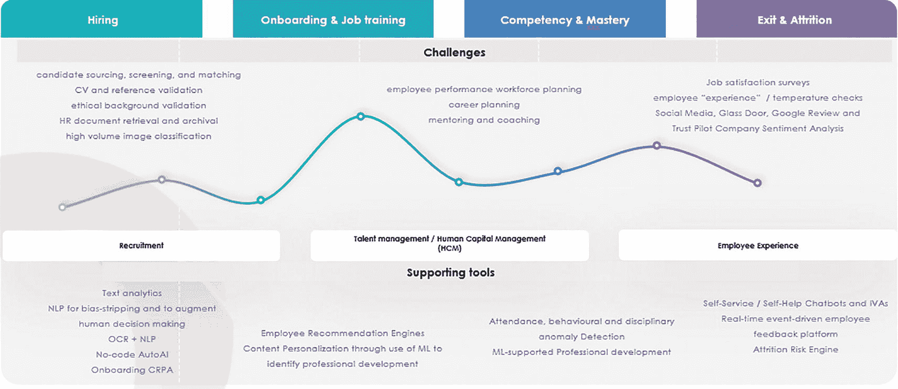

一幅插图基于挑战（招聘、入职与在职培训、能力与精通）和支持工具（招聘、人力资本管理和员工体验）描绘了 2022 年的人力资源状况。

**图 8-17** – 2022 年人工智能在人力资源领域的应用

如下文所述，管理数据洪流并确保绩效指标不具侵入性，是当今创建 360 度员工分析解决方案的主要挑战。人力资源领域的人工智能解决方案既可以帮助员工管理工作量平衡，也可以通过告知人力资源部门谁积极主动、谁想做更多、谁接近倦怠、谁需要更多帮助或支持来发挥作用。如果使用得当，这些指标还可以通过定义可实现的目标并帮助员工实现这些目标，从而提高员工基于任务的效率和专注度。

### 人力资源解决方案示例

仪表盘是大家最喜爱的分析工具，对于人力资源高管而言，它对于覆盖员工旅程的各个方面至关重要，包括招聘关键绩效指标、员工在职指标（如工作效率和远程办公）^(125)、考勤^(126)与纪律监督，以及员工流失和公司反馈。^(127)

市场上最佳的人力资源仪表盘之一来自 Agile Analytics，它提供了 20 多个内置的描述性和预测性 `PowerBI` 报告视图。

如图 8-18 所示，有多种机器学习应用，包括应用于候选人信息（领英、简历）的 OCR、NLP 和文本分析。深度学习有助于职位描述扫描（或基于 NLG 的职位描述创建）以及起草员工合同，而 NLP 支持的偏见消除也有助于确保公平的招聘政策。

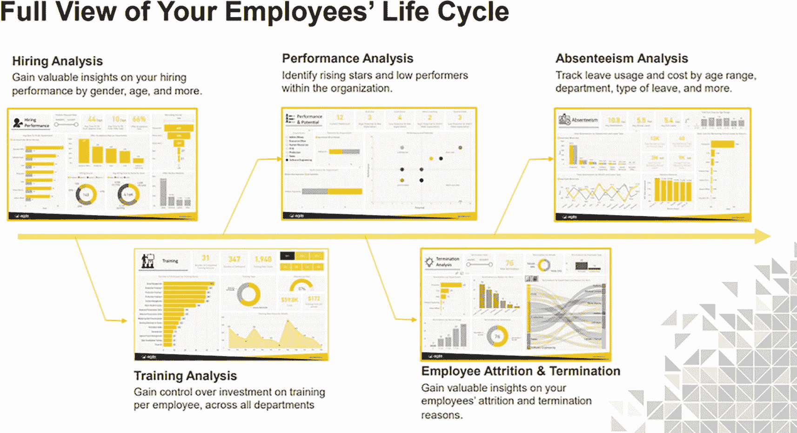

图示描绘了员工生命周期的概览。它包括：招聘分析、绩效分析、缺勤分析、培训分析以及员工流失与离职分析。

**图 8-18** 人力资源分析（Agile Analytics）

无代码/低代码用户界面在人力资源经理中越来越受欢迎，为他们提供了非技术性、直观的途径来访问预测性分析和员工建模。聊天机器人和智能虚拟助手有助于实时了解“员工体验”、收集对组织变革和公司文化的反馈、进行员工情绪和情感“温度检查”，并识别潜在的员工流失。如今的智能虚拟助手还具备搜索自动化功能^(128)，并与后端系统集成，例如用于查询内部职位空缺或公司政策。

在入职方面，可以基于人口统计、技能组合和心理测评分数，利用推荐引擎为员工职业发展提供内部内容个性化推荐。异常检测有助于识别员工态度和行为中的警示信号。

### 人力资源员工流失：动手实践

**掌握员工流失情况**

本练习的目标是在 Jupyter Notebook 中使用 Python，运行 `AutoAI` 对员工流失数据集执行特征工程和算法基准测试：

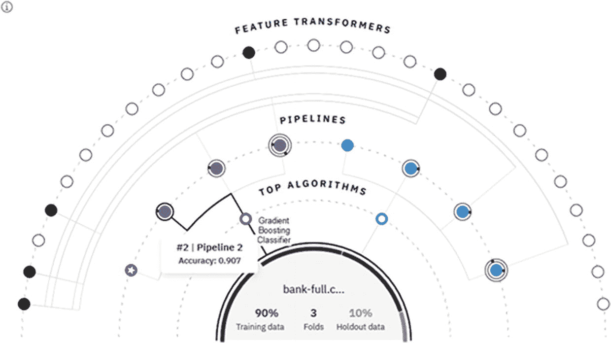

图示展示了人力资源员工流失与 AutoAI 的性能。它基于特征转换器、流水线、顶级算法、90% 的训练数据、3 折交叉验证和 100% 的留出数据。

**图 8-19** 使用 IBM Cloud Pak 对员工流失数据执行 `AutoAI`

1.  通过以下链接登录 IBM Cloud Pak 并创建一个项目

    [`​eu-gb.​dataplatform.​cloud.​ibm.​com/​home2?​context=​cpdaas`](https://eu-gb.dataplatform.cloud.ibm.com/home2%253Fcontext%253Dcpdaas)

2.  创建一个 `AutoAI` 实验

3.  添加数据集 `emp_attrition.csv`

4.  配置 `AutoAI` 实验以预测员工流失

5.  查看模型训练过程和测试结果的性能

6.  实现一个 Flask UI 来运行针对员工类型的预测

7.  练习——测试预测是否合理，例如，输入一名月收入相对较低、服务年限有限的员工数据

## 其他案例研究

本章的最后一部分将探讨在之前未提及的其他重要行业和子行业中，适合进行人工智能创新的关键领域。

### 公共部门与政府

对政府在人工智能应用方面的市场估值各不相同，从政府领域的 49 亿美元^(129) 到全球人工智能治理市场的 10 亿美元^(130)。虽然伦理和风险规避是首要考虑因素，但政府部门正越来越多地采用数据驱动的分析和人工智能方法来提供公共服务。许多相同的方法也被用于媒体广告和衡量公众看法。

除了关键的公民主参与应用（例如，通过仪表盘洞察行业绩效和公众情绪、聊天机器人 2.0、智能虚拟助手以及用于“公众之声”和提供个性化公共服务的情感分析）之外，通常还会开展数据项目来支持或引导政策制定，并提升信任度和公众认知。

人工智能的应用还帮助公共部门机构和组织通过文档处理和自动化等方式提高效率，并借助物联网设备的普及来应对激增的欺诈活动。同时，用于支持政策规划与制定以及提高生产力的更精细分析也日益显现，包括：

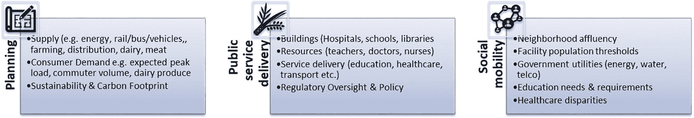

图示展示了公共部门和政府面临的挑战。它包括规划（供应、消费者需求）、公共服务交付（建筑、资源）以及社会流动性（医疗保健差距）。

**图 8-20** 政府在人工智能方面面临的挑战

*   行业分析、政策制定、规划与交付

*   行政与部门流程自动化

*   政策文档检索与处理

*   异常检测，包括公共欺诈、健康问题和福利系统

*   计量经济学预测与时间序列分析

### 制造业

前面描述的供应链中人工智能的许多应用也涵盖了制造业用例，工业 4.0 旨在将物联网、云和分析结合起来，彻底改变生产和分销流程。

安全库存水平、交付计划、供应链物流以及基础费用，都是在一个有抱负（即使尚未完全实现）的智能制造解决方案下的优化参数。仓库中区块链的使用也在增加，旨在提高可审计性，并使供应链更高效、更可靠。

理论上，人工智能模拟应有助于通过降低制造过程的刚性、动态纠正产品缺陷并鼓励产品即兴改进来减少产品召回。同样，如今利用人工智能应用可以更好地管理设备/机械故障对交付计划、预算和声誉的连锁影响。特别是预测性维护，结合大数据（通常是物联网数据）统计分析，可以实现更好的计划内维护（不影响交付）并减少未来故障。

鉴于这种对数字和数据的依赖，任何工业 4.0 解决方案如果不解决网络安全问题（我们下一小节的主题），在今天都是不完整的。

### 网络安全

对于 2022 年的企业和组织来说，没有比网络安全更大的挑战了。

如今，互联网已经真正渗透到每一个工业系统中，无论是在本地（生产）层面还是全球供应链层面。随之而来的是网络攻击风险的巨大增加，黑客试图获取信息，甚至更糟的是，控制有时与国家安全相关的高度战略性设施。除了关键的纵深防御安全层和提供强大的防火墙之外，机器学习和深度学习正被用来防御这些极具破坏性、实时、动态的网络安全攻击。

我们已经在第 7 章的动手实验室中研究了一个网络安全用例，该实验室部署了一个用于检测网络安全 DDoS 攻击的已训练机器学习模型的 API 端点。读者可参考该实验室，特别是模型训练过程（步骤 4），该步骤展示了如何使用各种网络参数作为特征来识别网络活动中的模式，这些模式可能构成例如来自网络入侵事件的雨滴恶意软件。^(131)

### 保险/远程信息处理

保险公司的商业模式正在发生变化，人工智能正在迅速重塑该行业，并改变多项客户和内部服务：

-   风险评估与风险管理，转向基于风险的定价

-   客户细分定位

-   个性化服务

-   定制保费与承保费用

-   理赔管理与运营流程自动化

作为对传统精算方法的补充，利用来自车载远程信息处理的海量（富含客户行为）大数据进行动态的基于风险的定价，是汽车/车队保险领域一个特别令人兴奋的领域。然而，人工智能在所有保险领域的应用是显而易见的，例如通过社交媒体倾听客户声音，并根据捕获的客户态度数据，创造敏感、引人入胜或差异化的客户体验。

### 法律

法律行业正在经历一场由人工智能技术带来的变革，尤其是在研究活动和合同方面。^(132)

详尽的分析超出了本文档的范围，但我们在图 8-21 中展示了一个关键的综合应用，该应用正被用于帮助法律文件数字化，并支持搜索、检索和归档流程——即通过 OCR（光学字符识别）进行文档分类和文本提取。

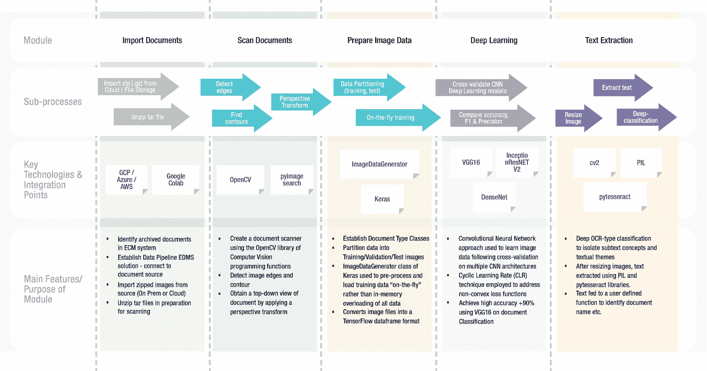

该框架展示了不同类型的模块、子流程、关键技术和集成点，以及模块的主要功能或目的。这些模块包括导入文档、扫描文档、准备图像数据、深度学习和文本提取。

**图 8-21** 法律人工智能：通过 OCR 进行文档分类和文本提取实现文件数字化

### DALL-E 在创意艺术领域的应用：动手实践

**生成式人工智能——从自然语言想象数字图像**

本章我们还有一个实验——逐步实现人工智能领域最激动人心的发展之一：OpenAI 的 DALL-E。

`DALL-E` 由一个自编码器（参见第 5 章）和一个变换器（第 8 章）组成——本质上，通过输入自然语言，我们可以随意召唤出任何图像。虽然本章没有讨论创意艺术行业的应用，但其应用显而易见：例如，从设计和时尚到建筑。

在 OpenAI [`openai.com/join/`](https://openai.com/join/) 注册一个账户，并访问仪表盘右上角“个人”下提供的 API 密钥。

克隆以下 GitHub 仓库：

[`github.com/bw-cetech/apress-10.9.git`](https://github.com/bw-cetech/apress-10.9.git)

将 OpenAI API 密钥复制并粘贴到 `openai_credentials.py` 文件中定义的字符串的双引号内。

在 Colab 中运行 Python 笔记本的步骤：

-   安装 `openai`，然后注释掉代码

-   导入库

-   将 OpenAI 凭据文件拖放到 Colab 临时存储中

-   使用给出的“拿着煎锅的牛”示例，运行单元格以调用 DALL-E 模型函数

注意：调用 API 函数需要付费账户^(133)——请确保您已按照笔记本中的说明先创建好账户。

**练习（拓展）** – 修改代码，创建一张“骑自行车的宇航员”的图像。

### 总结

以上法律视角为本章画上了句号。从电信和零售、金融服务、保险和政府、制造业、供应链和能源行业、医疗保健组织以及人力资源职能中面临的数字（和网络安全）挑战来看，我们对人工智能用例的梳理为最后一章^(134)（关于人工智能的生产化）奠定了基础。

尽管这些垂直行业性质迥异，但人工智能解决方案往往惊人地相似，在应用上具有“横向”特点，并且是可复用的。采用规模经济是合理的。因此，这将是我们在下一章中采取的方法——不仅描述开发、构建和部署稳健的即插即用人工智能解决方案的端到端流程和实施行动，而且还将通过本书最后两个端到端部署实验来加以说明。

**脚注** 1 2 3 4 5 6 7 8 9 10 11 12 13 14 15 16 17 18 19