# 9. 部署 AI 解决方案（生产化与容器化）

**将 AI 模型生产化并非易事。** 许多 AI 项目都停留在概念验证阶段，Gartner 指出，50%的 IT 领导者将难以将其 AI 项目从演示/原型阶段推进到生产阶段。在创建概念验证和生产级企业 AI 解决方案这两个目标之间，组织内部常常存在混淆，部分原因是业务部门其他人员缺乏相关专业知识。毕竟，如果其他员工没有至少掌握基本的 AI 技能、不了解如何使用 AI 及其优势，更重要的是不知道如何与 AI 交互或使用它，那么生产化就毫无意义。

AI 实施需要务实的心态和纪律。与炒作相反，许多问题实际上源于试图将 AI 应用于“一切”。AI 是增强智能，意味着它通过“人在回路中”的方式来解决特定的业务问题。其他项目问题则源于 2010 年代的数据科学家随意构建“Kaggle 级别”的模型，积累“技术债务”，而忽视了在业务/组织环境中所需的实用性、局限性和集体学习。

所涉及的数据量巨大也意味着，试图先解决最大的问题在 AI 中行不通——工作量估算应纳入前期规划。通常，从小处着手并“保持专注”更好——你并不总是需要“大数据”来训练模型——并询问诸如增量性能提升是否值得存储和/或管道延迟开销之类的问题？

我们的倒数第二章试图提出这些问题，并提供一个“串联各个点”的实用视角，解决障碍并简化在云上实现企业 AI 全栈部署和生产化的挑战。

在我们的实践实验室中，从测试版应用走向生产，并最终在云上托管应用，我们首先回顾 AI 项目在开发、交付和测试阶段的项目生命周期和敏捷技术。我们研究如何根据最佳实践映射用户旅程，定义成功框架，以及流程优化和领先 AI 工具的集成。

在再次审视分布式存储、并行化以及在 AI 应用扩展和弹性背景下优化计算（和存储）之后，我们以两个实践实验室结束本章，这两个实验室围绕生产化 AI 解决方案的两种最佳方式——在 Azure 上容器化 AI 应用并在 Heroku 上托管。

## 生产化 AI 应用

我们从宏观视角开始，审视部署的障碍、关于云/基础设施的决策，以及在跑之前先学会走路的重要性。

### 生产化的典型障碍

AI 项目本质上分为两个不同的阶段——实验和工业化。

两者的目标不同；实验的目标是尽可能快速准确地找到一个能回答（业务）问题的模型，而工业化的目标是可靠且自动地运行应用程序。

客户/公司是小型（初创公司）还是大型（企业）将影响我们的解决方案。如图 9-1 所示，对于进行实验的初创公司，缺乏数据和预算是制约因素，而（数据）工程资源缺口是生产化的主要障碍。对于中型组织，运行概念验证所需的专用服务器和云基础设施通常缺乏，而数据孤岛^(¹³⁵)和重建多系统生产环境的困难则给企业带来了重大挑战。当与分散的利益相关者责任和不可移动的遗留系统相结合时，这些问题可能会阻碍任何有意义的生产化（企业 AI）解决方案。

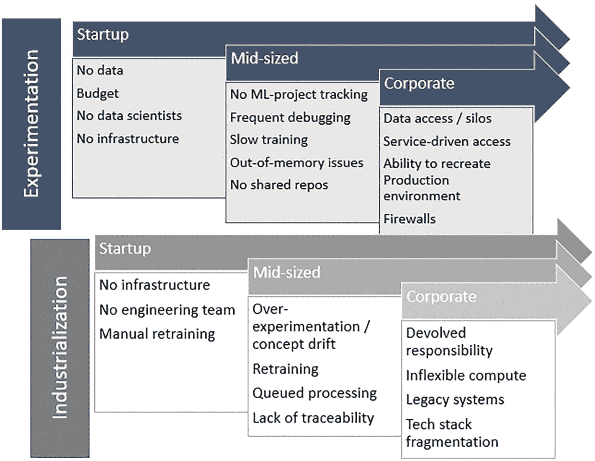

两张图表。第一张图表标题为实验。第二张图表标题为工业化。两张图表都有三个副标题：初创公司、中型企业和大型企业。

图 9-1

AI 实验与工业化（来源：[`towardsdatascience.com`](http://towardsdatascience.com)）

### 云/CSP 轮盘赌

无论是初创公司、中小企业还是大型企业，可实施的企业 AI 解决方案通常必须克服五个关键限制：

*   赢得利益相关者的支持
*   清晰的数据处理策略
*   云存储和计算
*   解决方案持久化的成本
*   创新

如今，大多数 AI 解决方案在 AWS、Azure 和 GCP 这三个主要 CSP 上存在显著的“解决方案集中度”（图 9-2）。无论是存储还是计算，很可能在亚马逊、微软或谷歌上配置了一两个服务/资源。

考虑到这一点，通过四个不同阶段来规划和界定项目范围，有助于引导 AI 项目走向利益相关者达成一致的解决方案：

*   设计与实施
*   第三方接口
*   训练与测试
*   采用

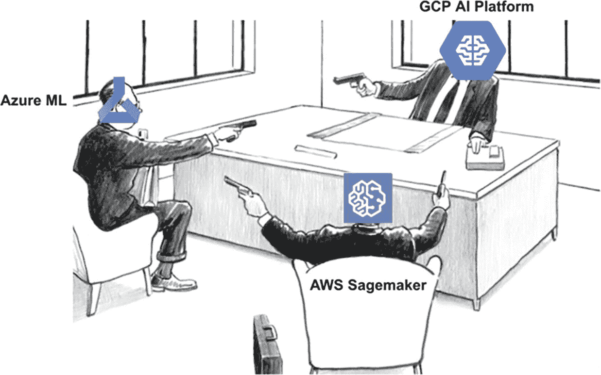

该图代表三个人，分别是 G C P A L 平台、azure M L 和 A W S sagemaker。这三个人互相用枪指着对方。

图 9-2

CSP 市场力量

### 简化 AI 挑战——从小处着手，保持专注

在界定解决方案范围时，特别是为了实现上述最后一个阶段（实现 AI 采用）的目标，围绕三个数据/MLOps 成熟度级别来准备开发和实施是一个好主意：

1.  **手动构建和部署模型**

使用简单工具，例如`Jupyter notebook`、`Colab`、`AutoML`、拖放（无代码）来快速展示业务/组织价值

2.  **部署管道而非模型**

除了使用（预训练）模型注册表之外，这意味着将以下每个子流程作为“管道”来处理，以便在 AI 项目中实现稳定性和可追溯性的提升：

3.  **CICD 集成、自动重训练、概念漂移检测**

    1.  数据预处理
    2.  算法调优
    3.  训练与评估
    4.  模型选择
    5.  部署

本质上是完全自动化，包括从批量推理到流式 API 推理，以及完全集成到 CI/CD 触发的重训练流程中

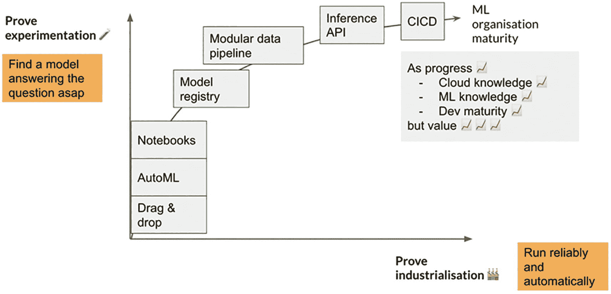

该图表示一个证明实验与证明工业化的图表。x 轴和 y 轴分别标注为“可靠且自动地运行”和“尽可能快地找到回答问题的模型”。

图 9-3

从概念验证到生产的模型成熟度


### Python 数据库管理：动手实践

**从 Python 读写 SQL 数据库**

本实验旨在整合 AI 解决方案的两个重要组成部分——数据存储与 Python，目标是使用 Python 向 SQL 数据库写入数据，然后再读取回来：

1.  访问 [`www.sqlite.org/download.xhtml`](http://www.sqlite.org/download.xhtml) 下载 SQLite，并获取适用于 Windows 的预编译二进制文件（包括 `sqlite-dll-win64-x64-3360000.zip` 和 `sqlite-tools-win32-x86-3360000.zip`）。
2.  在本地驱动器上创建文件夹 `C:\sqlite`，并将上述两个文件解压到该文件夹中。
3.  将 `C:\sqlite` 添加为系统路径环境变量。
4.  在终端中输入以下命令测试安装：
    ```
    sqlite3
    sqlite3 test.db
    ```
    后一步将创建一个名为 `test` 的测试数据库。

现在（可选）安装 DB Browser [`https://sqlitebrowser.org/`](https://sqlitebrowser.org/)，以便查看本实验后续部分创建的 SQL 数据库和表。

1.  从以下 GitHub 仓库下载 Python 笔记本：
    [`https://github.com/bw-cetech/apress-9.1.git`](https://github.com/bw-cetech/apress-9.1.git)
2.  按照笔记本中的步骤执行以下操作：
    1.  创建数据库。
    2.  创建表。
    3.  插入数据（单条记录）。
    4.  运行选择查询。
    5.  将从上述 GitHub 链接下载的 `“HRE-short.csv”` 文件导入 Python，然后批量导出到 SQLite。
    6.  在 DB Browser 中查看数据。
    7.  最后，将数据转换为 Python 中的 DataFrame。

### 在 GCP 上构建应用：动手实践

**在 GCP 上部署机器学习模型**

在本实验中，我们将学习如何在 Google Cloud Platform 上部署一个简单的机器学习模型。

1.  在 GCP 上创建一个项目 [`https://console.cloud.google.com`](https://console.cloud.google.com)。
2.  通过以下链接使用 App Engine 创建一个应用： [`https://console.cloud.google.com/appengine`](https://console.cloud.google.com/appengine)。
3.  启动 GCP Cloud Shell 并连接到该项目。
4.  在 Cloud Shell 中克隆以下 GitHub 链接中的示例模型：
    [`https://github.com/opeyemibami/deployment-of-titanic-on-google-cloud`](https://github.com/opeyemibami/deployment-of-titanic-on-google-cloud)
5.  在项目目录中运行 `gcloud init` 来初始化 `gcloud`。
6.  按照以下链接中的步骤部署应用：
    [`https://heartbeat.comet.ml/deploying-machine-learning-models-on-google-cloud-platform-gcp-7b1ff8140144`](https://heartbeat.comet.ml/deploying-machine-learning-models-on-google-cloud-platform-gcp-7b1ff8140144)
7.  从以下链接下载 Postman 桌面版： [`www.postman.com/downloads/`](http://www.postman.com/downloads/) 并测试与应用的连接。

### PowerBI – Python 握手：动手实践

**预测分析的前端呈现**

这个简短的实验将利用之前第 3 章完成的“Python 数据摄取——英国气象局天气数据”实验，基于 Python 抓取的输出创建一个 PowerBI 前端。

1.  如果尚未安装，请从以下链接下载 PowerBI Desktop：
    [`https://powerbi.microsoft.com/en-us/downloads/`](https://powerbi.microsoft.com/en-us/downloads/)
    并按照此处的步骤在 PowerBI 中设置 Python 路径：
    [`https://docs.microsoft.com/en-us/power-bi/connect-data/desktop-python-scripts`](https://docs.microsoft.com/en-us/power-bi/connect-data/desktop-python-scripts)
2.  将第 3 章“英国气象局数据摄取”实验中完成的脚本粘贴到 PowerBI 的 `数据 > 更多 > 其他 > Python 脚本` 下。
3.  创建一个折线图，显示未来 5 天的最低和最高温度。请注意，你需要：
    1.  将导入的列（预测值）转换为整数。
    2.  将图表格式化为 PowerBI 中“演示级”的可视化效果。

## AI 项目生命周期

### 从设计思维到敏捷开发

在了解了从实验到产品化的有效方法之后，如何从头开始实施一种方法呢？

激烈的竞争迫使组织需要快速改变战略，这促使公司仔细审视自身的能力和流程，并识别出适应性和创新方面的障碍与益处。采用最初的**设计思维**方法有助于驾驭这种颠覆性的格局，确保业务利益相关者、流程、工具、系统和数据接触点都被纳入范围。

**设计思维**作为一种创造性的问题解决过程，其关注点是人而非工具。如果做得好，一个关键成果就是产生一组项目来交付“正确的事情”。这些项目本身并不足以保证成功部署——但它们通常会融入 DataOps 的基石之一——专注于“把事情做对”的**敏捷**开发和交付。图 9-4 阐释了这一概念：

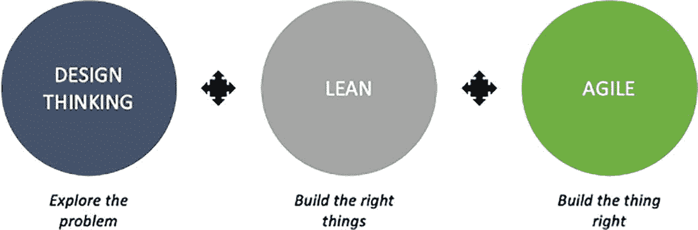

该图解释了三个圆圈，分别是：探索问题、构建正确的事情、把事情做对。每个圆圈内分别提到了设计思维、精益和敏捷。

**图 9-4** 设计思维、精益与敏捷（来源：Jonny Schneider）

### 通过假设驱动开发

在 AI 项目中，敏捷开发是什么样的？**假设驱动开发**是一种原型方法论，它允许解决方案架构师（以及数据科学家和 AI 工程师）开发、测试并重建一个产品，直到用户满意为止。

该过程高度迭代，它获取项目期间定义的假设，并尝试通过用户/客户反馈来验证这些假设。与“传统”的需求捕获（后者容易产生类似于“瀑布”方法中的错误）相比，这些假设更具演进性，它们认识到世界是复杂、多变且常常令人困惑的。

如图 9-5 所示，总体思路是尽早并频繁地进行实验，征求客户反馈，并舍弃那些益处甚微的功能。

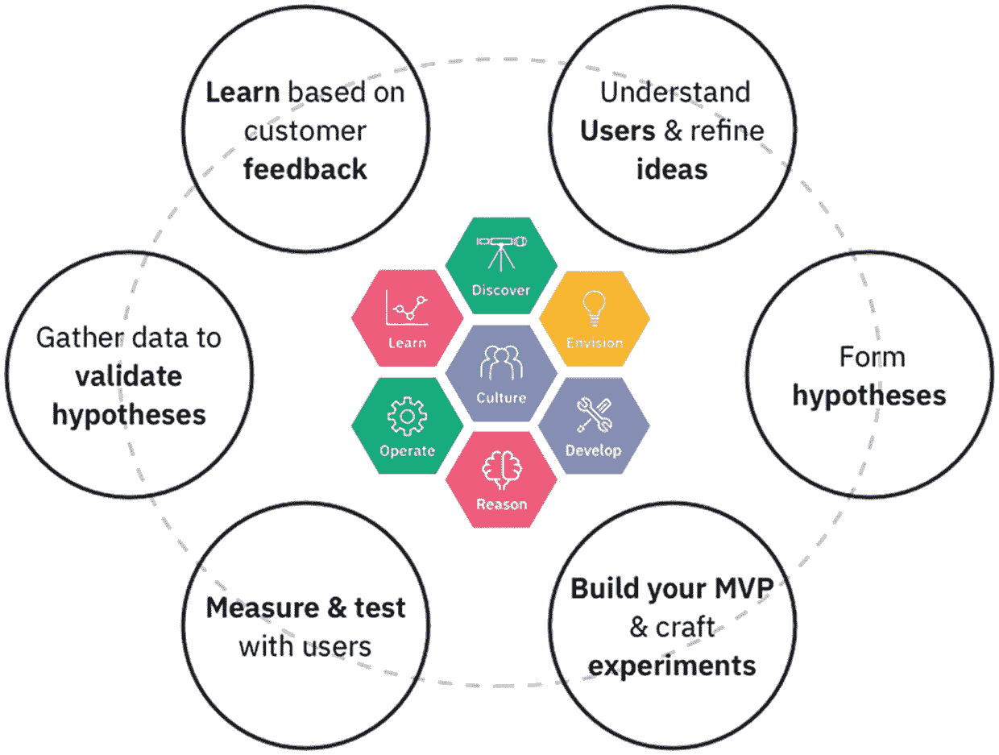

该图由六个呈椭圆形排列的圆圈组成。在椭圆形的中间，有七个六边形。

**图 9-5** IBM Garage 假设驱动开发

### 协作、测试、衡量、重复

正如本章引言中提到的，2010 年代雇佣数据专家的公司缺乏远见，导致了**技术债务**的巨额积累。结果并非完全集成的 AI（利益相关者！）和解决方案，而是系统在缺乏维护、监控和更新的流程与工具的情况下被部署。^(¹³⁶)

DataOps 中的**持续测试**是帮助解决这些问题的一种手段。表面上，它旨在预先建立对数据的信任，并在信任丧失之前减少识别和修复问题所需的时间：

- **版本控制** – 使用 `git`、GitHub 来改善协作。
- **自动化测试** – 自动化测试：帮助加速创新生命周期和变更流程。
- **衡量错误** – 跟踪并降低月度生产错误率。
- **跟踪生产力** – 对流程改进和交付时间进行基准测试。


### 持续流程改进

在人工智能项目中，我们究竟如何追踪生产力并衡量流程改进的基准？

商业智能仪表盘非常适合报告 DataOps 的关键绩效指标，尤其是在嵌入自动化编排来收集和展示指标的情况下。

例如，可以构建一个 `CDO` 仪表盘来追踪和监控以下指标的进展：

- **团队协作** – 为每个团队项目创建“厨房”
- **错误率** – 随着测试成熟度和测试数量的增加，错误率应随时间推移而下降
- **生产力** – 通过测试数量和数据管道步骤（关键点）来衡量
- **部署** – 例如，追踪平均部署周期时间、服务等级协议违规趋势的减少
- **测试** – 测试数量应随时间推移而增加，更稳健的质量控制也应日益普及

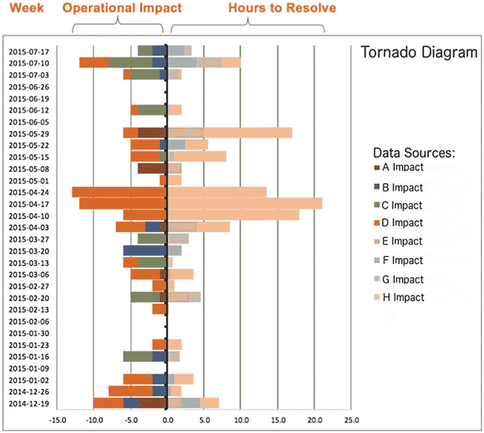

该水平条形图标题为龙卷风图。条形图的负侧表示为运营影响。条形图的正侧表示为解决所需的小时数。

**图 9-6** – DataKitchen 龙卷风图，展示生产问题的运营影响及其解决所需时间

### 数据漂移

任何用于交付和部署人工智能解决方案的持续改进周期，在面对部署后的接口/数据变化时也需要具备弹性，包括稳健的数据漂移缓解和模型重新训练。

模型性能随时间推移而下降通常归因于以下两者之一：(a) 数据（或协变量）漂移，或 (b) 概念漂移，即数据分布与原始训练集的分布出现显著偏差：

- **数据漂移** 指的是特征漂移，以及特征之间关系随时间变化的可能性
- **概念漂移** 指的是目标变量的变化

管理模型漂移的推荐方法是实施 DataOps/MLOps 最佳实践，并追踪底层数据的变化，包括特征之间的相关性，例如，可以在一个单独的 Python 追踪脚本中，或者在一个运营（而非战略/CDO）仪表盘中实现。

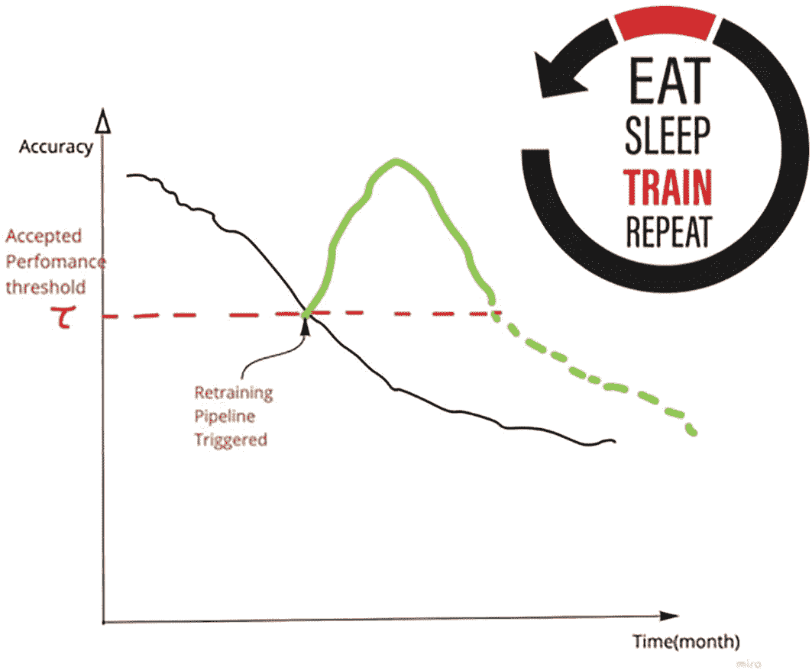

该图表绘制了准确率与月份的关系。一条虚线穿过图表，用于确定可接受的性能阈值。

**图 9-7** – 因数据漂移导致的模型随时间推移的性能下降（来源：[`www.kdnuggets.com`](http://www.kdnuggets.com)）

### 自动重新训练

一旦我们开始追踪数据漂移，就需要实施一个流程来确保我们的模型保持有效/高性能。理想情况下，这应该是自动化的——要实现基于数据/模型漂移的自动重新训练流程，主要有两种选择：

**定时重新训练**

1.  在每日结束流程中，从训练集中归档最旧的一天，并加入新一天的数据
2.  每月（如果数据特别动态，则每天）安排一次重新训练流程
3.  评估新性能，并检查是否优于之前的运行
4.  使用 `cron` 任务/任务调度器，或者例如 `AWS CloudWatch Event` 来触发数据准备、训练、评估和部署的 Step Function 编排

**基于性能/动态重新训练**

1.  收集新的每日训练数据
2.  自动监控模型在生产环境中对新数据的性能，并判断其是否突然表现不佳
3.  测量平均预测值和标准差。如果预测值在特定时间间隔内下降 10%，或者超出例如 2 或 3 个标准差，则触发一个并行的重新训练运行
4.  通过定时调度的 `AWS Lambda`/`Step Functions`，或 `IBM Watson Machine Learning` 持续学习来管理重新训练
5.  持续追踪所有历史重新训练运行（例如，使用 `Databricks` 中的 `MLFlow`），以确保性能（`fbeta`、`recall`/`precision`、`loss`/`accuracy` 等）不会随时间推移而下降

### 在 Heroku 上托管 – 端到端：动手实践

从开发到生产

我们的下一个实验将获取一个样板应用，并将其作为 Heroku 托管的应用程序推送到云端：

1.  在 [`www.heroku.com/`](http://www.heroku.com/) 上注册 Heroku
2.  在 Heroku 中创建一个新应用，区域选择欧洲，例如 `my-heroku-app`
3.  安装 Heroku CLI
4.  克隆下方链接中的样板应用程序：

    [`https://github.com/bw-cetech/apress-9.2.git`](https://github.com/bw-cetech/apress-9.2.git)

5.  按照第 7 章所述设置虚拟环境并安装依赖项
6.  练习 – 尝试在本地运行该应用
7.  在本地驱动器上 `cd` 进入克隆的应用后，在终端中使用 `heroku login` 登录 Heroku，然后按顺序输入以下命令推送到 Heroku：

    ```
    git status # 本地仓库应已初始化
    git add .
    git commit -am "updated python runtime to heroku supported stack version 3.9.7"
    git push heroku master
    ```

8.  最后，通过访问网址 [`https://my-heroku-app.herokuapp.com/`](https://my-heroku-app.herokuapp.com/) 或在终端中输入 `heroku open` 来打开你的 Heroku 应用
9.  练习：仍在终端中，尝试重命名你的应用

## 赋能工程与基础设施

人员、流程和工具是任何最佳实践框架（包括将人工智能应用投入生产）的三大基石。从人工智能云栈开始，我们将在本小节中简要探讨如何将前几章讨论的一些工程和基础设施工具整合成一个连贯的人工智能解决方案。

### 人工智能生态系统 – 人工智能云栈

如第 3 章所述，成功的人工智能需要端到端的云基础设施，尤其是用于处理大数据的敏捷（可扩展且弹性）服务，涵盖数据摄取、收集、处理、存储、查询到数据可视化。除了数据处理，“纵向扩展”的可扩展性和“横向扩展”的弹性是处理用户流量以及最终人工智能应用特定使用模式的关键支持资源需求。

无论我们的解决方案是由胖客户端应用还是瘦客户端提供，关键的存储（或数据），例如数据湖或 NoSQL 数据库，以及计算，例如虚拟机或 Apache Spark，都将服务于我们在开发和最终部署项目时所使用的基础人工智能服务和工具。图 9-8 描述了这种人工智能支持基础设施的生态系统。

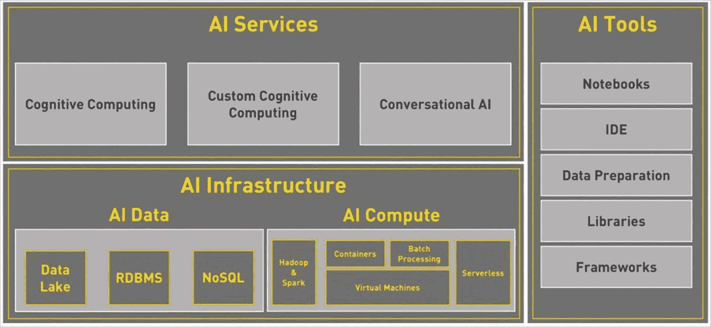

图像上出现一组三个对话框，标题分别为人工智能服务、人工智能基础设施和人工智能工具。人工智能基础设施包含子标题人工智能数据和人工智能计算。

**图 9-8** – 人工智能生态系统：基础设施、工具和服务


### 数据湖部署 – 最佳实践

如今，许多希望实施企业级人工智能的公司都致力于构建一个数据湖，该数据湖能够持续刷新其多个数据流，同时优化性能和拓扑结构。

并非每家公司都能[负担得起构建数据湖的成本](https://www.trellance.com/the-cost-of-building-a-data-warehouse-for-an-analytics-platform/)，但即使单一工具难以企及，尽可能复制数据湖架构也是实现生产级敏捷性的最佳方式，同时还能避免数据仓库、关系型与非关系型数据库、大数据引擎、机器学习工具和日志文件等资源之间出现多重（且通常是冗余的）数据流。为了解决这些问题，例如 `dremio` 推荐以下最佳实践设计：

- **采用以数据湖为中心的设计** – 将数据湖视为单一事实来源
- **计算与数据分离** – 实现成本节约
- **最小化数据副本** – 减少治理开销
- **确定高层级数据湖设计模式** – 支持用户层级和合规性
- **保持开放、灵活和可移植** – 确保架构可变更/面向未来，支持多云环境

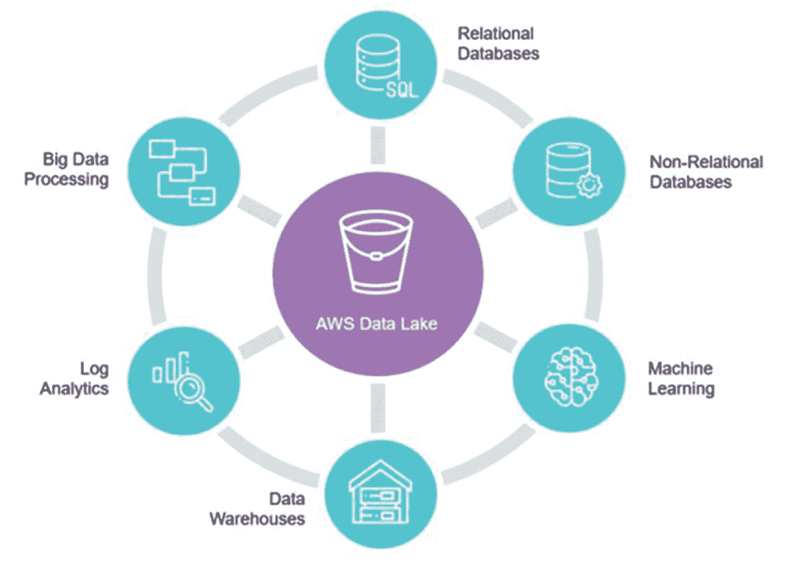

中心轮图显示为 AWS 数据湖。周围七个点分别显示为关系型数据库、非关系型数据库、机器学习、数据仓库、日志分析和大数据处理。

**图 9-9** – 作为集中式单一事实来源的数据湖 (`dremio`)

### 数据管道运营与编排

为了了解这在实际中如何运作，值得看一个案例研究。以下架构以 Azure Data Lake Storage (`ADLS Gen2`) 为核心，展示了一家游戏公司如何运行复杂的分析。^(¹⁴¹)

底层业务场景是：一家游戏公司从游戏日志中收集 PB 级的（用户）数据，并希望分析这些日志以深入了解客户偏好、人口统计信息和使用行为。通常，本地数据存储会保存参考/主数据，例如（敏感的）客户详细信息、游戏 ID 和营销活动数据。

该公司的次要目标可能包括识别追加销售和交叉销售机会、开发引人注目的新功能、推动业务增长以及提供更好的客户体验 (`CX`)。

此案例中的目标架构^(¹⁴²)（图 9-10）使用 Azure Data Factory（非常适合其基于云的 ETL 和数据集成服务）来（自动）编排数据驱动的工作流/管道，启动一个从 `ADLS Gen2`（批处理数据）和 `Kafka`（流式数据）获取数据的 Spark 集群（Azure HDInsight），然后将转换后的数据发布到 Azure SQL 数据库，用于下游报告。

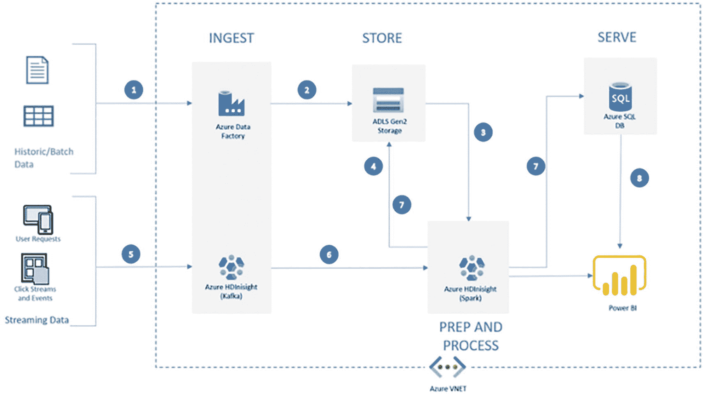

流程图显示两个输入数据：历史/批处理数据和流式数据。第一个输入流经摄取、存储、预处理、服务并提供给 Power BI。

**图 9-10** – 用于 PB 级数据处理和分析的现代架构 (Azure)

## 大数据引擎与并行化

我们已经在前面章节中探讨过分布式处理和集群的使用，并在第 5 章中探讨过作为大数据处理引擎的 Apache Spark。

作为分布式、横向扩展数据处理的事实标准，Apache Spark 自然适用于需要（PB 级）大数据处理的人工智能应用，但其基于 Scala 的语法和可用性，即使通过 `PySpark`（用于实现 Apache Spark 的 Python 库/封装器），也比像 `pandas` 这样的标准 Python 库要复杂一些。

然而，除了直接使用 Apache Spark 之外，还有其他选择，例如 Koalas——它将用户友好的 `pandas` 风格数据框操作与高性能的 Apache Spark DataFrame 分布相结合^(¹⁴³)。

`Dask`——一个用于扩展 Python 的平台，与 Spark 类似，可以从单节点扩展到数千节点集群——是另一个替代方案，我们现在将介绍它。

### Dask

`Dask` 的功能比 Spark 少，体积更小，因此比 Spark 更轻量。它也没有 Spark 那种对统一应用计算的高层优化，但 `Dask` 确实有其优势：^(¹⁴⁴)

- 使用 Python 而非 Scala 编写
- 与 `Pandas` 和 `Scikit-learn` 等其他 Python 库集成性强
- 侧重于 Python 集成，而非 Apache 项目集成
- 将计算移至数据所在位置，而非相反

`Dask` 基于两个关键概念工作：延迟/后台执行和惰性执行，用于堆叠转换/计算以实现并行处理。我们将在下面的动手实验中探讨这两者。

### 利用 S3 文件存储：动手实践

**使用 S3 的应用文件存储**

本练习的目标是使用 Python 与云上最重要的存储资源之一——Amazon Simple Storage Service (`S3`)——进行交互：

1. 从以下 GitHub 链接克隆文件，并解压到本地目录：

   `https://github.com/bw-cetech/apress-9.3.git`

2. 在离你最近的 AWS 区域创建一个可公开访问的 `S3` 存储桶，例如命名为 `my-s3-fs`。

3. 创建 AWS 访问密钥并下载：

   `https://console.aws.amazon.com/iam/home?#/security_credentials`

4. 下载 AWS CLI 安装程序 `https://awscli.amazonaws.com/AWSCLIV2.msi` 并安装 AWS 命令行界面。

5. 按照以下步骤将你的本地文件推送（上传）到 AWS 上的 `S3` 存储桶：
   1. 打开终端/命令提示符。
   2. 输入 `aws configure`。
   3. 输入上面下载的访问密钥和秘密密钥。
   4. 输入你的默认 AWS 区域，例如 `eu-west-2`。
   5. 将默认输出格式指定为 `json`。
   6. 使用 `cd` 命令进入本地（解压后）文件所在的文件夹。
   7. 使用以下命令将数据同步到你的 `S3` 存储桶：

      `aws s3 sync . s3://pv-s3-fs`

   下载的 GitHub 数据现已推送至 AWS，并存储在你的 `S3` 存储桶中。

6. **练习** – 尝试从 Python 连接到 `S3` 以下载图片。使用上述 GitHub 链接中提供的笔记本 `AWS-S3-Download.ipynb` 核对你的答案。

### 在 Databricks 上快速上手 Apache Spark：动手实践

**使用 Apache Spark 处理海量物联网数据**

在本实验中，我们将重新审视 Databricks 和 Apache Spark，以比较它们在物联网数据集上的运行时间。

1. 在 Databricks 社区版 [`https://community.cloud.databricks.com/login.xhtml`](https://community.cloud.databricks.com/login.xhtml) 中，创建一个空白笔记本并启动一个集群。

2. 按照下方笔记本中的步骤：[`https://community.cloud.databricks.com/?o=765164012049213#notebook/1443608314106734/command/3293421293983457`](https://community.cloud.databricks.com/%253Fo%253D765164012049213%2523notebook/1443608314106734/command/3293421293983457) 完成所示步骤：
   1. 从下方链接导入物联网数据：[`https://raw.githubusercontent.com/dmatrix/examples/master/spark/databricks/notebooks/py/data/iot_devices.json`](https://raw.githubusercontent.com/dmatrix/examples/master/spark/databricks/notebooks/py/data/iot_devices.json)

      **注意：** 由于文件大小为 61 MB，你可能需要将 JSON 文件内容复制粘贴到一个 `.txt` 文件中，并先将其作为 JSON 文件保存在本地。

   2. 使用 Scala 对数据集执行探索性数据分析（EDA）和数据整理。
   3. 使用 SQL 查询数据。
   4. 比较 Spark 集群与 Jupyter 的运行时间。


### Dask 并行化：动手实践

**DASK 并行化**

按照下方流程图中所示的步骤，本练习的目标是让我们熟悉使用 Dask 进行（基于 Python 的）大数据处理：

1.  克隆 GitHub 仓库 `git clone` [`http://github.com/dask/dask-tutorial`](http://github.com/dask/dask-tutorial)
2.  创建一个 conda 环境
3.  启动 Jupyter Lab 或 Jupyter Notebook
4.  浏览代码示例 `dask.delayed.ipynb`，了解 Dask 中延迟执行的工作原理

注意：要了解在集群上执行复杂的提取、转换、加载（ETL）操作是如何工作的，请参阅后续笔记本中的 GIF 动图：

[`https://github.com/dask/dask-tutorial/blob/main/01x_lazy.ipynb`](https://github.com/dask/dask-tutorial/blob/main/01x_lazy.ipynb)

1.  练习 – 对惰性执行执行相同操作，即运行 `01x_lazy.ipynb` 笔记本
2.  比较逐词读取与逐行读取 `README.md` 文件的运行时间

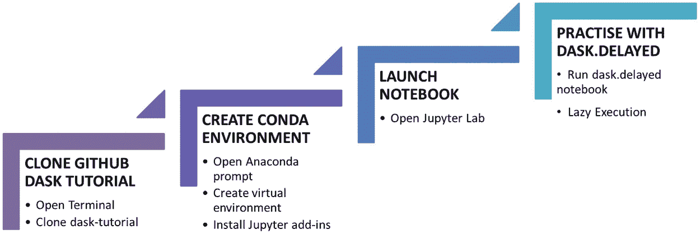

该图显示为一个阶梯。每一级的步骤依次为：克隆 GitHub dask 教程、创建 conda 环境、启动笔记本、以及使用 `dask.dot.delayed` 进行练习。

**图 9-11** Dask 简介 – 实验流程

## 全栈与容器化……最后的边界

至此，我们来到了这倒数第二章的最后一节，我们将讨论如何打包一个“全栈”部署的解决方案。在结束容器（特别是 Docker^(¹⁴⁵)）的使用之前，我们将重新审视第 7 章中的全栈 AI 应用实验——容器通常是简化并成功部署 AI 应用的最后一块拼图。

### 全栈 AI – React 与 Flask 案例研究

在第 7 章的结尾，我们使用 `react.js`、Plotly Dash、Flask 和 TensorFlow 部署了第一个 AI 应用。所使用的流程是一个很好的分步指南，可用于实现任何 AI 应用：从训练模型并将模型导出为分层数据格式（`.h5`）文件，设置虚拟环境，创建用于模型集成的后端，然后创建前端 UI，最后先在本地运行应用，再将其作为托管端点解决方案运行。

此部署过程以图形方式显示在图 9-12 中，以供参考。

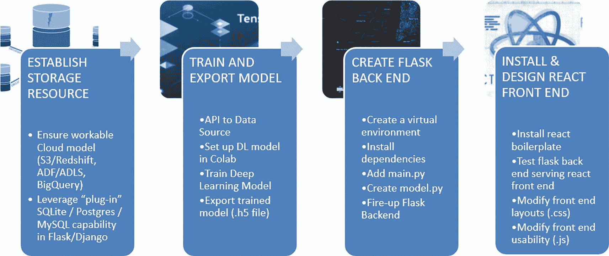

一组四个选项卡，标题分别为：建立存储资源、训练并导出模型、创建 Flask 后端、安装并设计 React 前端。

**图 9-12** 全栈部署回顾 – `react.js` 和 Flask

不幸的是，由于高度依赖本地文件和库配置，以这种方式构建 AI 应用可能相当繁琐。这正是容器可以发挥作用的地方——提供一种隔离依赖关系的方法，并确保在跨不同最终用户系统部署时不会发生冲突。

### 使用 Docker 容器在云上部署

本章最后一个动手实验的主题是使用 Docker 在云上部署，这是将 AI 投入生产的推荐路径。如下图所示，这首先从训练模型开始，然后导出（这次是导出为 pickle 文件）。

然后，我们下载一个样板解决方案（来自 GitHub 的源代码），并可以选择测试上述全栈 AI 的步骤，以执行 (a) 本地（独立）安装（包含本地文件依赖）。

在本地安装成功后，我们继续执行 (b) 本地容器化的 Docker 实例，测试通过后，最后 (c) 对云（本例中为 ACR – Azure 容器注册表）进行身份验证，重建我们的容器镜像并将 Docker 实例推送到 ACR。

最后，我们创建一个（Azure）Web 应用，指向 ACR 中的 Docker 镜像，并查看我们部署的应用。这种生产化解决方案的真正价值在于，我们所有的依赖关系都通过内部 Docker 环境中的 `requirements.txt` 文件进行安装，从而与外部（外部）文件的潜在冲突隔离开来。

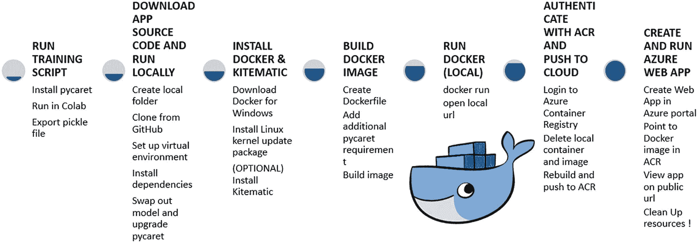

一组七个要点标题：运行训练脚本、下载应用源代码并在本地运行、安装 Docker 和 Kitematic、构建 Docker 镜像、运行本地 Docker、使用 ACR 进行身份验证并推送到云端、创建并运行 Azure Web 应用。

**图 9-13** 将容器化的 Docker AI 应用部署到 Azure

### 实现持续交付流水线

最后，我们回到上面“生产化的典型障碍”中提到的不同 AI 项目阶段。围绕解决方案开发和设计的实验是达到目的的一种手段，即实现我们生产化或工业化 AI 应用的目标。

正如 DataKitchen 所说，我们拥有一个创新流水线和一个价值流水线：

*   **创新流水线** – AI 模型被开发、设计、测试并部署到价值流水线中
*   **价值流水线** – 数据被输入 AI 模型，产生分析结果，为创建新模型的过程提供价值

每个流水线本身都是一组迭代阶段，通常由一组文件定义，并使用一系列工具实现，包括脚本、源代码、算法、HTML 配置文件、参数文件和容器。

当然，代码从头到尾控制着整个数据分析流水线，实际上涵盖了从构思、设计和需求捕获，到训练、测试、部署到运维以及后期维护的全过程。

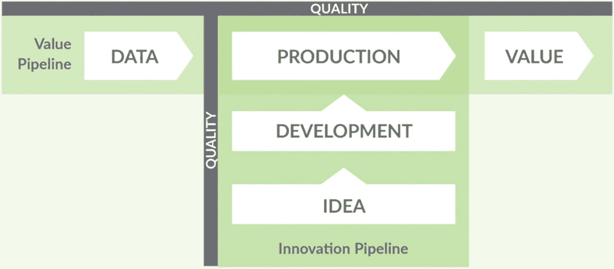

该图表确定了价值流水线的以下步骤：从数据到生产、开发、以及从创意到价值。中间部分被称为质量创新流水线。

**图 9-14** 持续交付流水线

### 总结

通过对持续 AI 交付的探讨，我们关于如何部署 AI 解决方案的旅程已到达终点。接下来的两个实验旨在提供更“沉浸式”的 AI 生产化体验，最终目标是实现“全栈”AI 应用。

尽管本章标志着本书主要主题的结束，但我们还有一章要讲。主要由于使能技术（特别是 Transformer）的阶跃式变化以及对非结构化数据关注度的提高，自然语言处理已经开辟出自己的兴趣领域，并成为我们最后一章的主题。

### 使用 Streamlit 和 Heroku 部署深度学习应用：动手实践

**使用 STREAMLIT、GOOGLE 和 HEROKU 托管深度学习模型**

我们的最后两个实验是端到端的应用部署，本实验首先使用 Google Teachable Machine 训练模型，使用 Streamlit 创建用于推理的前端，然后作为托管应用部署到 Heroku：

1.  访问 [`https://teachablemachine.withgoogle.com/train/image`](https://teachablemachine.withgoogle.com/train/image) 并按照下方链接中“创建模型和应用的步骤”下的步骤 1-5 创建一个训练好的模型：

    [`https://towardsdatascience.com/build-a-machine-learning-app-in-less-than-an-hour-300d97f0b620`](https://towardsdatascience.com/build-a-machine-learning-app-in-less-than-an-hour-300d97f0b620)

2.  从 `C:\Users\Barry Walsh\Testing\xray-automl\Streamlit-Heroku-setup.zip` 下载文件并解压到本地驱动器上的一个测试文件夹中

3.  在虚拟环境中安装所有依赖，包括 `pillow`、`tensorflow` 和 `scikit-learn`

4.  运行以下命令并检查应用在本地是否正常工作

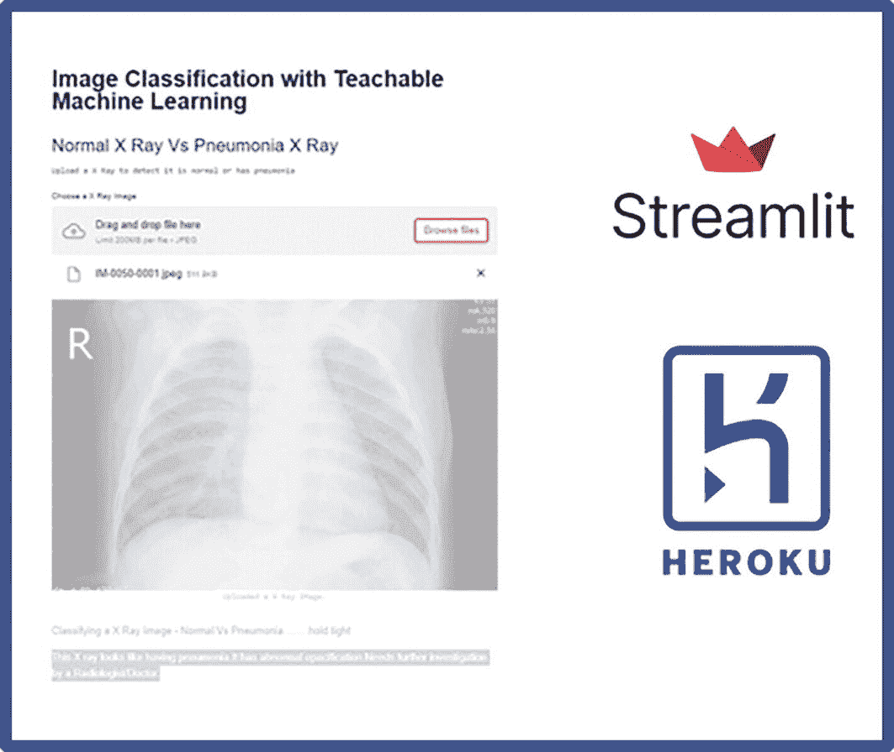

对话框中显示了一张胸部 X 光片。对话框的标题是“使用 Teachable Machine Learning 进行图像分类”，副标题是“正常 X 光片对比肺炎 X 光片”。

1.  练习：最后重复上面“在 Heroku 上托管 – 端到端：动手实践”实验中的步骤，将其作为云上的端点解决方案进行部署

```
streamlit run xray.py
```


### 使用 Docker 容器在 Azure 上部署：动手实践

#### 将用于预测保险费的机器学习模型容器化

在 Colab 中使用 `PyCaret`，我们的最终“马拉松”实验训练了一个 AutoML 模型来预测保险费，然后导出生成的 pickle 文件。接着，我们将训练好的模型附加到一个基础的 Flask 应用上，先在本地运行，然后将其 Docker 化成为一个容器应用，并推送到 Azure 容器注册表，以便作为（Azure）Web 应用运行。

该过程在上文“使用 Docker 容器在云上部署”一节中有进一步描述，总结如下：

1.  首先，我们训练一个机器学习流水线（AutoML）来预测保险费用：
    1.  安装 `pycaret`
    2.  下载并在 Colab 中运行以下笔记本：^(¹⁴⁶)
        [`https://github.com/bw-cetech/apress-9.4.git`](https://github.com/bw-cetech/apress-9.4.git)
    3.  导出 pickle 文件

2.  接下来克隆应用源代码，创建一个本地文件夹

```
git clone https://github.com/pycaret/deployment-heroku.git
```

并且

1.  安装 Docker
    1.  下载适用于 Windows 的 Docker
    2.  安装 Linux 内核更新包
    3.  （可选）安装 Kitematic

2.  构建 Docker 镜像
    1.  创建 `Dockerfile`
    2.  添加额外的 `pycaret` 依赖
    3.  构建镜像

3.  在本地运行 Docker
    1.  `docker run`
    2.  打开本地 URL

4.  使用 Azure 容器注册表 (ACR) 进行身份验证，并将我们的容器解决方案推送/部署到云端
    1.  登录到 Azure 容器注册表
    2.  删除本地容器和镜像
    3.  重新构建并推送到 ACR

5.  创建并运行 Azure Web 应用
    1.  最后，我们在 Azure 门户中创建一个 Web 应用
    2.  指向 ACR 中的 Docker 镜像
    3.  通过公共 URL 查看应用

1.  创建本地文件夹
2.  从 GitHub 克隆
3.  设置虚拟环境
4.  安装依赖项
5.  替换模型并升级 `pycaret`

**注意：不要忘记清理（停止并删除）资源（Azure Web 应用、ACR 实例以及任何虚拟机），以保留云额度/防止产生云成本！**

脚注 1   2   3   4   5   6   7   8   9   10   11   12

