# 10. 自然语言处理

任何关于当今人工智能运营化的书籍都不能忽视自然语言处理（NLP）的增长，其市场规模预计在 2025 年将达到 4300 亿美元。^(¹⁴⁷) 表面上，NLP 是人工智能的一个分支，专注于对计算机进行编程以理解书面和口头文本，但在 2022 年，NLP 的应用正被推向更广阔的领域。定性分析、上下文/特定领域的推理以及思想领导力的创造^(¹⁴⁸) 都在其范围之内，并且性能提升是巨大的，如果你相信谷歌工程师的说法，甚至可能是颠覆性的。^(¹⁴⁹)

NLP 被许多人视为数字化竞赛中的一项关键技能，其关注点主要在于将从结构化数据处理和预测建模过程中学到的技术和最佳实践，扩展到非结构化数据。其隐含目标是将非结构化数据转换为机器可读的格式，然后我们可以在其上执行与标准 ML/DL 中类似（即使不完全相同）的流程。

虽然本书的主要焦点在于机器学习和深度学习本身的应用，但我们在最后一章中涵盖了自然语言处理的主要主题、基本的 NLP 理论以及实现，然后介绍了部署 NLP 解决方案所需的所有重要工具和库。

这些工具中的许多都依赖于本书其他地方已经描述过的机器学习和深度学习技术，但我们将在最后一章中介绍主要的 Python NLP 库 `NLTK` 的使用，以及用于解决 NLP 问题的其他库，如 `PyTorch` 和 `spaCy`。我们还将介绍一些利用 NLP 的知名 API（例如 Twitter API），这些 API 在 2022 年被应用于高度相关的客户旅程和公众感知用例中。

在最后一章中，我们还将采用我们一贯的动手实践、基于实验的方法，通过识别和拆分（解析）单词以及提取主题、实体和“意图”来自动化理解复杂语言的过程——这是当今许多自然语言应用的核心子过程，包括情感分析和聊天机器人/对话代理。

## NLP 简介

我们首先简要介绍历史背景，并探讨自然语言处理的基本定义、其在更广泛的“AI 生态系统”中的地位，以及它与机器学习和深度学习过程的交互。

然后，我们的第一部分将讨论 NLP 如何在世界各地的企业和组织中被大规模应用，以及为何如此，最后总结 NLP 的生命周期，特别是交付成功 NLP 实施所必需的任务序列的最佳实践路线图。

### NLP 基础

自然语言处理是人工智能的一个分支，涉及使用自然语言的计算机与人类之间的交互。其目标是读取、破译、理解并以某种对最终用户和整个组织有价值的方式理解语言。为此，采用了两种关键的 linguistic 技术：句法分析和语义分析。

重要的是，与本书的主题相联系，NLP 随后将机器学习和深度学习算法应用于非结构化数据，将其转换为计算机可以理解的形式。这种“重叠”如图 10-1 所示。

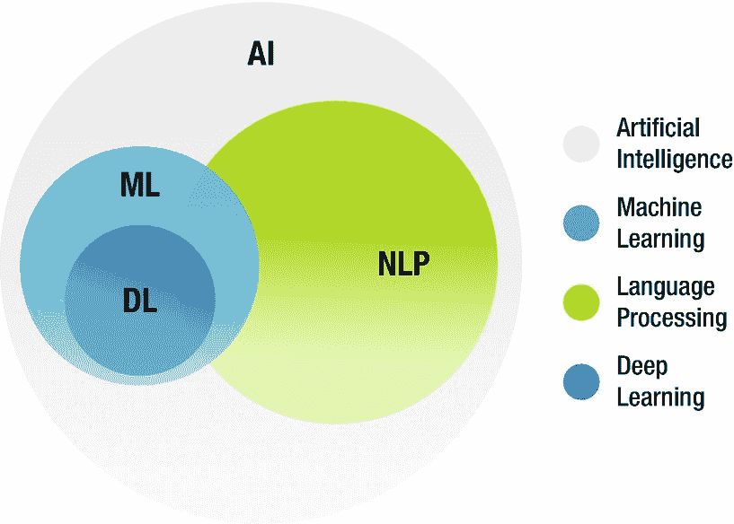

一个圆形维恩图说明了 AI、ML、DL 和 NLP 之间的关系。它将深度学习描述为机器学习的一个子集，并与自然语言处理部分相交。所有圆圈都位于人工智能这个大圆圈内。

**图 10-1** NLP 与机器学习和深度学习的接口

#### NLP 的历史背景与发展

我们上面提到，语言学研究是使用自然语言处理的基础。NLP 的早期应用涉及基于规则的方法，但受到现有规则范围以及随着数据集规模增大而带来的计算规模和速度的限制。此后，统计 NLP 中使用的概率建模方法使得 NLP 解决方案能够扩展，利用机器学习和深度学习技术更动态地解释自然语言。其中一个主要例子是 N-gram，我们可以训练一个 NLP 模型来概率性地预测单词序列，例如二元组“Machine Learning”。

特别是深度学习从大数据集中生成复杂预测结果的能力，与我们处理语言模型时的整体问题表述非常契合，因为单词和字符的底层结构和含义是复杂的——实际上我们正在处理另一个“大数据”数据集，但这里的区别在于底层语法（在任何语言中）具有固有的序列或顺序。出于这个原因，循环神经网络/专门的 LSTM 已被采用，以将词序作为状态通过神经网络架构进行传播。

正如我们将看到的，词嵌入或向量化是循环神经网络读取、转换和迭代底层语言的句法和语义含义的基本机制——单词在一个 N 维向量空间中被表达。


### NLP 目标与特定行业用例

与机器学习和深度学习一样，在项目启动之初就确立目标，对于确保项目能够取得成功的成果至关重要。

并非所有自然语言处理解决方案都专注于文本分类、生成情感指标或提供聊天机器人，不同行业之间存在许多细微差别。但总体而言，构建 NLP 应用的目标可归为以下一个或多个类别：

- 信息检索与提取 (IR/IE)
- 文本分类
- 主题识别/检测
- 命名实体识别 (NER)^(¹⁵⁰)
- 翻译
- 文本摘要
- 情感分析

上述类别常与实际 NLP 应用相混淆——然而实际上，企业或组织应用往往整合了上述一个或多个目标，而市场或产品赋予这些 NLP 解决方案的名称常常模糊了目标与技术之间的界限。

例如，使用文本分类的商业价值通常由下游客户驱动——既有“宏观”价值，例如销售邮件进入分类系统（例如，基于客户细分、产品线或提案阶段）；也有“微观”价值，例如根据邮件中识别的关键词将邮件重新路由到特定部门。同样，同一文本分类可能触发自动发送客户 KBA 或聊天机器人回复。

#### 关键行业应用

在本章剩余部分，我们将介绍几个关于当今主要 NLP 应用的动手实验。从相对初级的应用（垃圾邮件过滤器、网络搜索应用、文本摘要等）开始，NLP 解决方案的范围已扩展到这些应用成为许多公司关键差异化因素的程度。

自然语言处理是许多知名应用背后的驱动力，包括语言翻译应用（如 Google 翻译）、文字处理器（如 Microsoft Word 和 Grammarly，它们利用 NLP 检查文本的语法准确性或执行自动补全任务），以及利用社交媒体情感分析的应用。

智能虚拟代理 (IVA) 或聊天机器人 2.0/3.0，以及呼叫中心使用的交互式语音应答 (IVR) 应用，现在能够响应用户的特定请求，而个人助理应用（如 OK Google、Siri、Cortana 和 Alexa）已成为主流的家庭或移动设备应用。

而自然语言生成则前景更为广阔，它使得短报告乃至大规模出版物写作的完全自动化更接近实际应用。在进一步深入之前，我们将快速浏览技术视角，了解 NLP 如何利用通用开发框架来提供如此多样化的行业解决方案。

### NLP 生命周期

从数据抓取和收集，到字符分割、停用词移除、分词、词形还原和嵌入，NLP 应用的开发需要像处理结构化 AI 数据的任何方法一样，拥有同样强大的框架。

#### 从解析到语言分析

处理非结构化数据的数据整理可能存在问题，但如同机器学习和深度学习一样，最佳实践是遵循特定流程，其中底层的“解析”子流程将数据转换为最终格式，以便输入到下游的向量化（编码）和建模过程中。在 Python 中，用于数据整理的主要库是 `NLTK` 和正则表达式 (`re`) 库。

根据任务的不同，某些子流程可能并非必需，在某些情况下，可能还需要额外的特定领域整理任务，例如从银行报告中推断外汇信息。现在，我们列出主要的 NLP 整理子流程以供参考，并将其分解为三个核心流程：预处理、语言学和转换，以及预模型编码/词嵌入。

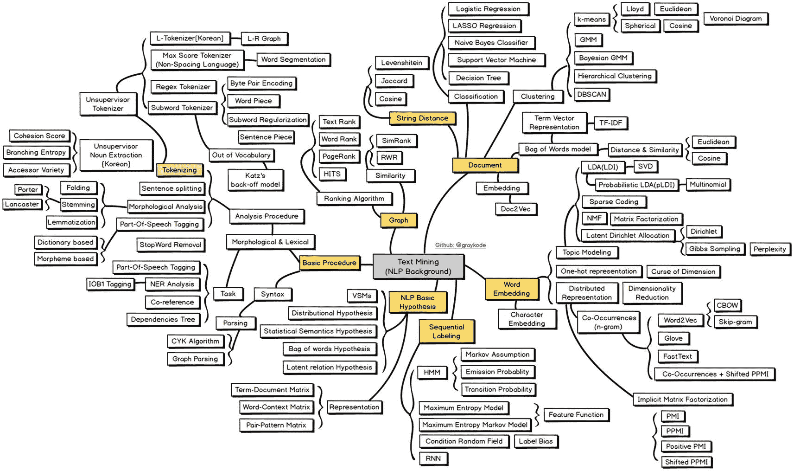

自然语言处理的文本挖掘路线图，包含 6 个主要流程：基本流程、NLP 基本假设、序列标注、词嵌入和文档，然后是字符串距离和分词，最终产生一系列处理结果。

图 10-2 文本挖掘路线图 (GitHub)^(¹⁵¹)

**预处理/初始清洗**

- 移除特殊字符
- 正则表达式：移除符号（例如，推文中的“#”和“RT”）
- 正则表达式：移除标点符号
- 剥离 HTML 标签

**语言学和数据转换**（图 10-3）

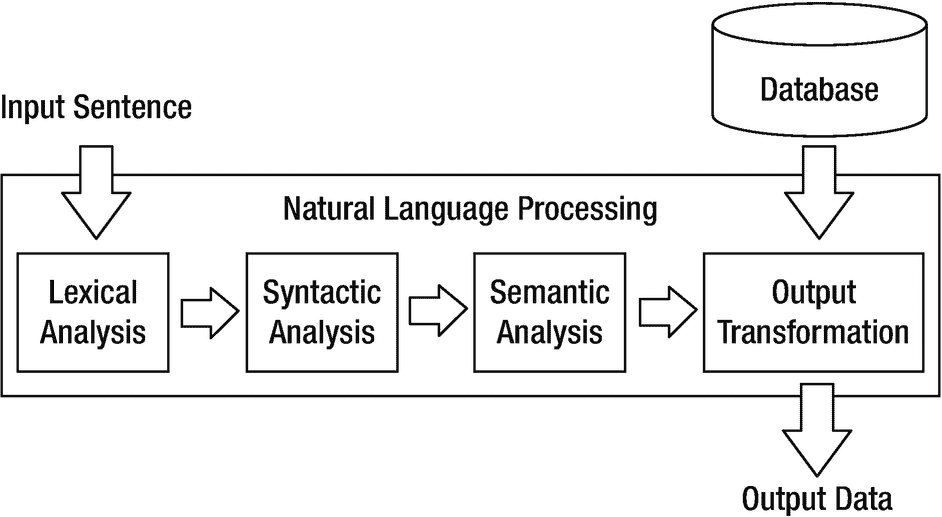

一个流程图展示了在自然语言处理系统中，输入句子经过词法分析、句法分析、语义分析和输出转换的过程，最终从数据库输出数据。

图 10-3 NLP 预建模流程

**词法分析：**

- 过滤“停用”词
- 分词

**句法分析：**

- 转换为小写
- 词性标注 (POS)
- 命名实体识别 (NER)
- 处理缩略形式^(¹⁵²)
- 词干提取

**语义分析：**

- 词形还原
- 消歧（确定特定短语最可能的含义）
- N-gram

#### 从词嵌入到深度学习

实际上，语义分析进一步扩展到向量化和词嵌入——这是使用非结构化数据进行建模前的最终准备步骤。

**文本向量化 / 词嵌入 / 编码**

**基于规则 / 基于频率的嵌入**

- 独热编码
- 词袋模型 (BoW)
- TF-IDF

**基于预测的词嵌入：**

- Word2Vec (Google)
- GloVe (Stanford)
- FastText (Facebook)

在下一节中，除了词嵌入，我们还将介绍文本摘要、主题建模、序列建模以及 Transformer/注意力模型的建模要点。需要注意的是，对于众多 NLP 解决方案，并不存在单一的“万能”建模流程——方法高度依赖于问题定义、行业背景、首要目标驱动结果以及性能阈值。

与深度学习非常相似，我们首先概述一个最佳实践的“路线图”，希望这对读者有所帮助，同时也要认识到，在预建模解析和向量化过程，以及实际的模型训练、推理和后续性能基准测试中，很可能存在许多迭代步骤。


### 创建词云：动手实践

**十二生肖风格汉字词云**

**NLP 最简单的应用之一，被全球营销团队广泛使用，就是词云。虽然基础，但这里使用的技术在许多当前存在的高知名度工业应用中都有复现——本实验将介绍这些技术：**

1.  将以下 GitHub 仓库克隆到本地驱动器：

    [`github.com/bw-cetech/apress-10.1.git`](https://github.com/bw-cetech/apress-10.1.git)

2.  进入克隆了 GitHub 文件的本地文件夹，并使用以下命令（依次执行）设置虚拟环境：

    ```
    python -m venv env
    env\Scripts\Activate
    ```

3.  在虚拟环境中运行 Python 脚本，使用命令：

    ```
    python WordCloud_ 中文.py
    ```

    注意：名称中的中文字符在终端中不会正确显示，但上述命令仍可运行。

4.  如果系统提示，请逐一安装依赖项：

    ```
    pip install wordcloud
    pip install jieba
    ```

5.  将根据 GitHub 文件夹中提供的《中国日报》新闻摘录中的中文字符生成一个词云。

6.  练习：改用英文数据示例（意大利面食谱）运行代码。

7.  练习：将猪的图像模板替换为另一个生肖图像（例如，使用来自 [www.astrosage.com/chinese-zodiac/](http://www.astrosage.com/chinese-zodiac/) 的图片）。

8.  练习（进阶）：更新代码，使其根据当前中国农历年份（虎年、兔年、龙年等）生成词云。

## 预处理与语言学

由于我们处理的大部分是非结构化文本数据，自然语言处理与语言结构密不可分。

无论是获取源数据并通过正则表达式执行初始预处理和清理任务，应用句法或语义分析，还是实现词嵌入以将数据转换为词向量，理解语言学都有助于规划从原始数据到模型就绪数据格式的路径，并最终提取洞察。

本节涵盖了关键的 NLP 概念，参考了语言学家的观点，并按照 NLP 生命周期中所述的方式进行分解。

### 预处理/初始清理

#### 正则表达式

正则表达式（或称“regex”）是非结构化数据“字符串”搜索的基本工具。通常在抓取/数据导入后作为第一步使用，其思路是通过搜索数据中我们想要移除的特定模式来快速清理数据。由于分词和向量化自然紧随此步骤，目标是移除对标点符号、符号（如短信中的笑脸或表情符号，或推文中的话题标签）以及特殊字符（如货币符号或括号）等对将编码文本转换为词向量无帮助的内容。

以下示例展示了在 Python 中的实现——`re` 是所使用的库：

```
import re
pattern = '^a...s$'
test_string = 'abyss'
result = re.match(pattern, test_string)
if result:
print("Search successful.")
else:
print("Search unsuccessful.")
```

`^` 匹配字符串的开头，而 `$` 匹配字符串的结尾，因此在此例中返回 `Search successful`。

#### 文本剥离（例如，HTML 标签）

Python 拥有大量内置函数，可以简化清理非结构化数据/搜索正则表达式的过程。对于文本“剥离”特别有用的是 Python 的 `.strip` 方法。更复杂的 HTML 剥离，例如从 HTML 标签中提取新闻标题，是通过使用 `BeautifulSoup` 库进行 `.text.strip()` 方法链式调用来完成的。

Python 中的 `.split` 函数通常在剥离/清理底层文本数据后应用——`.split` 能有效地将文本分词为单独的单词。

### 语言学与数据转换

在预处理数据之后，虽然非结构化数据可能已经“干净”（即我们移除了冗余字符），但它尚未处于可以“向量化”以用于建模的状态。

与机器学习和深度学习中的数据整理过程一样，需要执行多个转换步骤来准备非结构化数据，每个步骤都基于数据的语言结构。这些步骤大致分为词法分析、句法分析和语义分析步骤。

#### 词法分析

作为这些步骤中的第一步，词法分析指的是将文本数据转换为其构成基本单元（根据底层语言，可以是单词、字符或符号）的过程。

##### 移除停用词

停用词通常是句子中非常常见的词，它们对句子的基本含义没有增加价值。在大多数情况下，它们应该被移除，但对于机器翻译和文本摘要等特定应用，它们应该被保留。

诸如（`a`、`the`、`is`、`at` 等）之类的词在 Python 中使用 `nltk` 库中的停用词模块进行移除。

##### 分词

我们已经在预处理步骤中提到了在剥离文本时解析文本的一种方法。更常见的是，使用 `NLTK` 库中的一种分词方法进行分词，通常是 `.word_tokenize` 将句子拆分为单词，但根据目标，可能需要短语分词，如下面的德语示例所示：

```
import nltk
german_tokenizer = nltk.data.load('tokenizers/punkt/german.pickle')
german_tokens=german_tokenizer.tokenize('Wie geht es Ihnen?  Gut, danke.')
print(german_tokens)
```

上述代码返回问题和答案：

```
['Wie geht es Ihnen?', 'Gut, danke.']
```

Python 支持的 Hugging Face，这个开源数据科学平台，正越来越多地被用于在更大数据集上扩展分词过程，通过微调预训练模型（而不是从头构建）来减少训练时间（以及环境影响）。

#### 句法分析

在通过词法分析获得语言构建块之后，下一步是使用句法分析来转换数据；在考虑语法规则的同时从文本中提取逻辑含义。

##### 转换为小写

句法分析的第一步是使用 Python 内置函数 `lower()` 将数据转换为小写。因为在向量空间模型中，首字母大写的相同单词（`Hello`）和小写单词（`hello`）会被表示为两个不同的单词，应用 `lower()` 函数可以解决稀疏性问题，减少我们正在解决的维度问题，并加快运行时间。


##### 词性标注

`POS`标注是信息提取的核心，也是我们在第一节中提到的 NLP 解决方案的关键目标之一。使用 NLTK 的 `.pos_tag` 方法，该过程涉及根据单词的语法形式对其进行分类。执行此任务的目的是为了更好地为后续的深度学习建模过程提供关于特定词序列概率的序列信息。

这些概率是由特定语法形式（例如动词或名词）出现在其他语法形式（例如动词）之后的频率决定的。

```
text = word_tokenize("And now for something completely different")
nltk.pos_tag(text)
```

输出是一个元组列表：

```
[('And', 'CC'), ('now', 'RB'), ('for', 'IN'), ('something', 'NN'),
('completely', 'RB'), ('different', 'JJ')]
```

其中：^(¹⁵⁷)

- `CC` 是并列连词
- `RB` 是副词，例如“occasionally”和“swiftly”
- `IN` 是介词/从属连词
- `NN` 是单数名词
- `JJ` 是大型形容词

本质上，这里使用了马尔可夫链，表明（如图 10-4 所示）一个特定语法术语出现在另一个词之后的概率。

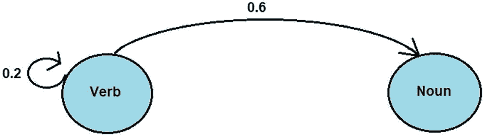

一张示意图展示了包含动词和名词的词性标注。从动词指向名词的箭头上方有一个数字 0.6。动词处有一个弯曲箭头，指示为 0.2。

**图 10-4** 词性标注（来源：Towards Data Science）

##### 命名实体识别

从某些角度来看，命名实体识别是词性标注的一种应用。通常在 `POS` 标注之后进行，其思想是通过定位文本中的命名实体来识别文本主题。该过程在 Python 的 `spaCy` 库中特别高效，^(¹⁵⁸) 通过识别限定词，后跟形容词，再跟名词，可以快速提取名词短语，并显示主要实体的快速摘要，如下所示：

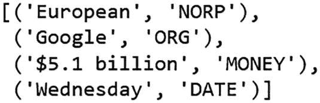

方括号内的一组文本内容如下：European, `NORP`, Google, `ORG`, 5.1 billion dollars, Wednesday, Date, and Money。

像所有 AI 应用一样，NLP 应用具有高度的领域特异性，虽然 `POS` 标注和 `NER` 任务可以承担文本标注的重任，但某些词汇术语总是存在差距。因此，`POS` 和 `NER` 标注通常都辅以（手动的）特定领域实体整理和手动标注过程。

下面的示例展示了此过程如何与 IBM Watson Knowledge Catalogue 配合工作，其中一组经批准的领域专家能够高亮单词/术语并定义实体类型。

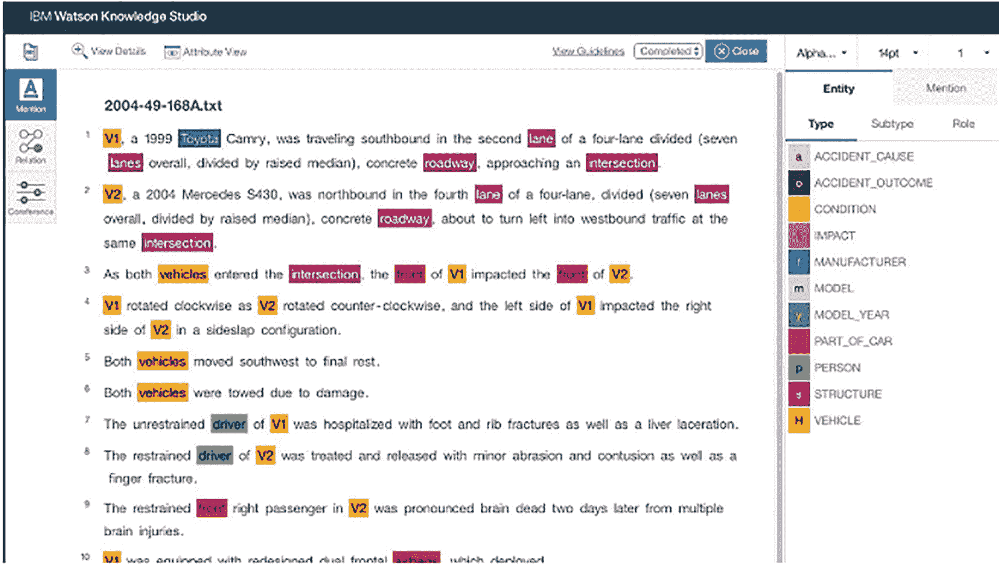

一张 Watson Knowledge Studio 应用程序的截图高亮显示了 2004 49 168 A . t x t 文件下的一组单词。右侧有一个实体类型列表，包括：事故原因、状况、影响、制造商、型号、年份、部件、人员、车辆。

**图 10-5** IBM Watson Knowledge Catalogue 中的手动标注

##### 处理缩略形式

NLP 中的缩略形式指的是确保俚语表达被扩展为其完整等价形式：I'll = I will, You’d = You would 等。此处的目的类似于小写化，即在向量化之前移除缩略形式有助于降维。

可以使用 Python 中的 `contractions` 库来实现缩略形式的处理。

##### 词干提取

词干提取和词形还原是自然语言处理中紧密耦合的文本规范化子任务。许多语言包含具有相同底层词根或“词干”的单词，词干提取指的是将这些单词缩短为其词根形式的过程，而不考虑其含义——本质上，我们只是将末尾字符剥离到一个共同的前缀，即使该前缀本身不能独立作为一个语法术语。

词干提取对于情感分析很有用，因为词干可以传达负面或正面的情感。

词干提取通常使用 `nltk.stem` 来实现。

#### 语义分析

我们最后的 NLP 转换过程本质上是“语义分析”步骤——在句法分析的逻辑和语法任务基础上进行改进，语义分析使我们能够从底层文本中提取含义——解释整个文本并分析语法结构，以识别词汇术语之间的（上下文特定的）关系。这是自然语言处理在向量化之前的最后阶段。

##### 词形还原

与词干提取相反，词形还原是“上下文特定的”，并将单词转换为有意义的词根形式。它考虑了单词的屈折形式，因此像“better”这样的单词会被词形还原为“good”，而“caring”会被词形还原为“care”（而词干提取会得到“car”）。词干提取使用 `nltk.stem.PorterStemmer()` 函数，而词形还原使用 `WordNetLemmatizer()` 函数。

本质上，词形还原是对词干提取的增强，它考虑了语义，更常用于更复杂的情感分析应用，例如聊天机器人。

##### 词义消歧

词义消歧是在特定短语的定义存在潜在歧义时，确定其最可能含义的过程。单独来看，像“bank”这样的单词有多个含义，^(¹⁵⁹) NLTK 的 `WordNet` 模块允许我们根据其在更广泛文本中的用法，以概率方式识别其实际含义，尽管 Python 也有一个词义消歧包装器（`pywsd`），它可以与 NLTK 一起使用。

##### N-gram

NLTK 库还附带了一个 `ngrams` 模块。N-gram 是一串相连的词汇术语——本质上是单词或短语的连续序列。这里的“N”指的是我们所说的相连术语或单词的数量，一个二元组（2-gram）是“United States”，一个三元组是“gross domestic product”。顺序很重要，例如在语料库中匹配“red apple”与“apple red”是不同的。

N-gram 在自然语言处理中被大量使用，因为我们通常是从单词序列而不是单个单词本身来创建特征。

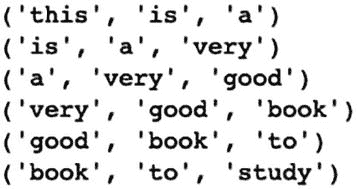

括号内的一系列单词内容如下：this, is, a. is, a, very. a, very, good. very, good, book. good, book, to. book, to, study.

### 使用 NLTK 进行文本解析：动手实践

**整理维基百科：SpaceX**

结合本节中描述的一些技术，本实验的目标是抓取典型的非结构化网络数据（此处为 SpaceX 的维基百科页面），并逐步执行预处理和词法分析步骤，以生成关于词频的洞察：

1.  从此 GitHub 仓库下载 Jupyter notebook：

    [`github.com/bw-cetech/apress-10.2.git`](https://github.com/bw-cetech/apress-10.2.git)

2.  运行以下步骤：
    1.  导入库并连接到网页
    2.  使用 Beautiful Soup 解析网页
    3.  对文本进行分词
    4.  统计词频
    5.  绘制词频图

3.  练习——将词频绘制为条形图而非折线图

4.  练习——继续 notebook 分析，执行进一步的句法和语义数据清洗/分组步骤^(¹⁶⁰)


## 文本向量化、词嵌入与 NLP 建模

在上一节中，我们探讨了为提取非结构化数据中的词汇、句法和语义层面而进行的特定语言/转换过程。在确立了数据准备与实施的流程后，重点将转向“编码”或**文本向量化**过程以及深度学习建模。

NLP 生命周期下一阶段的第一部分是利用文本向量化和词嵌入从文本数据中创建*数值*特征。^(¹⁶¹) 随后，我们将审视 2022 年生产级应用中采用的主要 NLP 建模实践，而非对整个技术生态系统进行详尽分析。

有时，我们会引用一些特定的工具和库，这些内容将在本章最后一节中详细描述。

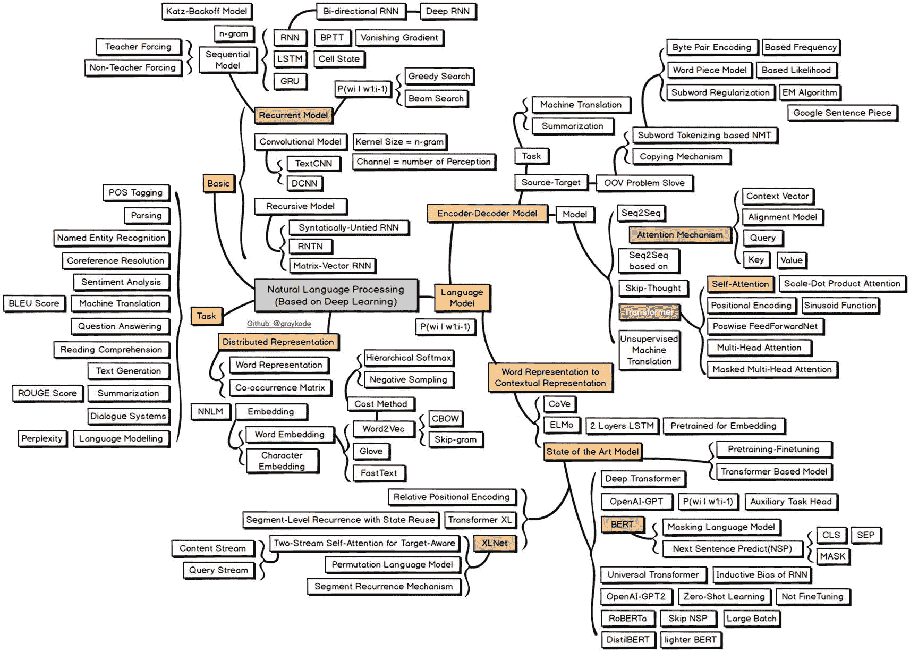

一张自然语言处理路线图，包含 5 个主要模型：基础模型、任务模型、分布式表示模型、编码器、解码器和语言模型。它们进一步关联着一系列流程和其他子模型。

图 10-6 自然语言处理路线图（GitHub）^(¹⁶²)

### 基于规则/频率的嵌入

我们从更简单的“基于频率”或“基于规则”的方法入手，对数据进行向量化/编码。

#### 独热编码与计数向量化

机器学习领域的读者应该熟悉独热编码方法，它通过为列中每个不同的值创建新列，来转换名义分类文本字段（即那些值没有内在顺序的字段^(¹⁶³)）。

独热编码实现简单，适用于二元或离散变量，但考虑到大型文本语料库中词汇近乎无限的排列组合，以及存储 N 元组（而非仅单个单词）的可能性，所涉及的特征数量会迅速变得难以管理。每个词都被编码为一个独热“向量”，因此一个句子就变成了一个向量数组，一段文本则变成了一个矩阵数组（即张量）。

计数向量化将独热编码的术语作为**文档-术语矩阵**中的列，统计出现次数，然后存储非空值以用于后续的文本摘要。

#### 词袋模型（BoW）

词袋模型是将文本数据编码为固定长度向量最简单、最著名的方法之一——它基本上等同于对整个文档应用独热编码，并使用简单的`numpy`（或`pandas`）方法来编码文本。

收集数据后（例如包含多篇文章的新闻源），首先提取并统计（或哈希化^(¹⁶⁴)）不重复的单词。

数据中不重复单词的数量决定了特定**文档**（此处指新闻文章）的向量大小。每篇新闻文章随后可表示为一个唯一的布尔向量，其中每个不重复单词根据其是否出现在该新闻文章中被编码为 0 或 1。

最终，词袋模型存在诸多缺陷：它没有考虑单词顺序或上下文的句法或语义信息，并且由于许多文档中不包含低频词，最终会导致严重的稀疏性问题。

#### 潜在语义分析（LSA）

LSA 是上述词袋模型的扩展，它利用奇异值分解（SVD）^(¹⁶⁵)来降低数据维度，从而缓解稀疏性问题。LSA 以包含`m`个文档和`n`个单词的数据集（**文档-术语矩阵**）为输入，将文本数据重构为`r`个潜在^(¹⁶⁶)特征，其中`r`小于我们拥有的文档数量。

#### TF-IDF

TF-IDF（词频-逆文档频率）通过采用数值统计来反映一个词在集合/语料库中对某篇文档的重要性，试图解决词袋模型的固有缺陷。

这里的`TF`指一个词在文档中出现的频率，但正是`IDF`元素（衡量该词“重要性”的指标）使该方法区别于词袋模型。对于任何特定单词，其`IDF`值是文档总数除以包含该词的文档数的对数，因此像“the”这样的词得分会很低，因为它出现在所有文档中，而`log(1)`等于零。^(¹⁶⁷)

`TF-IDF`是词频与`IDF`得分的乘积，它倾向于对以下两类词赋予更高权重：（a）在单个文档中频繁出现的词，以及（b）在整个集合中较少出现/罕见的词。

尽管相比词袋模型有诸多优势，但这些确定性的、基于频率的方法无法扩展到解释“上下文”——为此，我们需要词嵌入。

#### 关于余弦相似度

无论是词袋模型、LSA 还是 TF-IDF，余弦相似度通常用于衡量词嵌入中文档的相似性。

该度量是对简单欧氏距离（两点间的直线距离）的改进，因为词嵌入包含了文档中词的频率。

两个相似的词（例如足球裁判报告中的“犯规”和“违例”）在 n 维空间中可能相距甚远，因为其中一个词（“违例”）在文档中出现的频率低得多。由于余弦相似度衡量的是这些词向量表示之间的夹角，而忽略向量的模长，因此当词之间的夹角很小时，我们能够保留“相似性”的概念。


### 词嵌入 / 基于预测的嵌入

无论从哪个角度看，词嵌入都是一种“概率匹配”技术，它应用无监督机器学习或深度学习方法将文本数据向量化——实际上，每个单词都被转换为一个 n 维的“词向量”，含义相似的词会聚集在一个密集的“簇”中。

图 10-6 展示了这一过程在两个文档中的工作原理——其结果是在维度空间中，专有名词、名词和动词等含义相似的词会彼此靠近（例如，西雅图和波士顿，讲座和演讲，有和给予等）。

词向量/词嵌入可以从头开始训练，但像 `Word2Vec` 这样的预训练模型为加速 NLP 应用开发提供了主要手段。

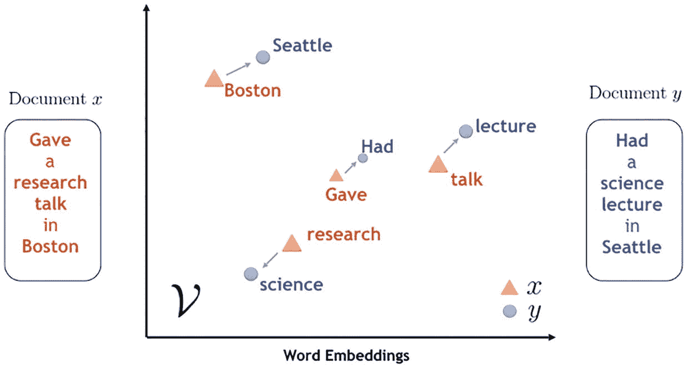

一张文档与词嵌入的对比图，以 x 和 y 轴的形式绘制了关于波士顿和西雅图特定研究讲座的数据。

**图 10-7** 两个文档的词嵌入示例（来源：towardsdatascience.com）

#### Word2Vec（谷歌）

`Word2vec` 可能是最著名的词嵌入模型——它是谷歌搜索引擎用于搜索相似文本、短语、句子或查询的过程。^(¹⁶⁸) 这是一个两层神经网络，通过“向量化”单词来处理文本，`Word2vec` 基于两种架构：**连续词袋模型（CBOW）** 和 **跳字模型（skip-gram）**。^(¹⁶⁹)

CBOW 架构允许底层模型基于相似上下文的单词来预测单词，但忽略了单词的顺序，这与基于规则的词袋模型非常相似。跳字模型则考虑了单词的顺序，并对向量空间中上下文更接近的单词赋予更大的权重。CBOW 的价值主要在于执行速度，而跳字模型在处理不常见单词时性能更优。

`Word2Vec` 和潜在语义分析（LSA）的文档“相似度”都是使用余弦相似度计算的。余弦相似度是……

#### 其他模型

`Word2Vec` 是目前最常见的词嵌入模型，但还有许多变体。

此外，由斯坦福大学开发的开源项目 `GloVe` 和由 Facebook 开发的 `fastText` 也各有优势。

`GloVe` 是全局向量的缩写，其模型训练使用单词共现统计，并结合了全局矩阵分解和局部上下文窗口^(¹⁷⁰)方法。它的独特卖点在于能够发现单词之间的关系，例如公司-产品对，但其对共现矩阵的依赖会降低运行速度。

`fastText` 实际上是 `Word2Vec` 模型的一个扩展，其中单词被有效地建模为字符的 n-gram。^(¹⁷¹) 这种方法意味着 `fastText` 在处理罕见词时表现更好，因为底层的字符 n-gram 与其他词共享，但它的速度也比 `Word2Vec` 慢。

其他值得注意的模型包括 `LexRank`——一种用于自动文本摘要的无监督图基方法。^(¹⁷²)

### NLP 建模

尽管上述许多过程都隐式地利用机器学习或深度学习来实现文本的向量表示，但词嵌入通常进一步发展，以执行自然语言“预测”。在这最后一个小节中，我们将介绍 NLP 中的主要预测建模技术，然后进入关于 Python 实现和当今主要 NLP 用例的最后一章。

#### 文本摘要

许多自然语言处理应用都涉及文本摘要，即使不是直接目标，也是作为中间过程。文本摘要通过两种方式自动化该过程：**基于抽取的摘要**，即从源文档中提取关键短语；或**基于抽象的摘要**，涉及对源文档进行释义和缩短。基于抽象的摘要性能更优，但也更复杂。

基于抽取方法的算法实现首先使用语言学分析（例如，词性标注）提取关键词，然后收集包含关键短语的文档，^(¹⁷³) 接着采用监督机器学习技术，利用带有关键短语的文档样本构建模型，其特征包括关键短语的长度、字符数、最常出现的词以及频率^(¹⁷⁴)。

`LexRank`、`Luhn` 和 `LSA` 都是之前提到的文本摘要技术，可以通过 Python 的 `sumy` 库访问，`KL-Sum` 也是如此，它使用词分布相似性来匹配句子与原始文本。

#### 主题建模

与文本摘要紧密相关的是主题建模的概念。上述提到的许多相同算法，特别是 `LSA`、`pLSA`、`LDA` 和 `lda2Vec`，都用于主题建模——其根本目标是从文档或数据语料库中*存在的主题（或议题）*中识别单词，^(¹⁷⁵) 而不是从整个文档中提取单词这种更费力的方法。

#### 序列模型

序列模型是用于解释文本中单词序列的机器学习模型。其应用包括文本流、音频片段和视频片段的序列建模，在这些应用中，就像时间序列数据一样，会使用循环神经网络（特别是 LSTM 或 GRU）。

**序列到序列**或 **seq2seq** 可能是最著名的技术，应用于机器翻译、文本摘要和聊天机器人。

`seq2seq` 实际上是 RNN 的一个特殊类别，它使用**编码器-解码器架构**。编码器将输入数据按序列逐个输入到 LSTM/GRU 网络中，生成上下文向量（隐藏状态向量）以及输出。^(¹⁷⁶) 解码器（也是一个 LSTM/GRU）使用编码器网络的最终状态（上下文向量）进行初始化，并在一次前向传播中生成输出。解码器通过反复将之前的输出反馈回解码器来生成未来的输出，从而进行训练。

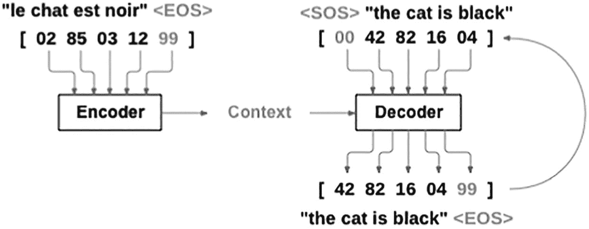

一张示意图展示了从编码器到解码器的上下文编码和解码过程。句子中的每个单词都被分配了一个唯一的数字。

**图 10-8** 展示机器翻译的 PyTorch 序列到序列编码器-解码器架构


#### 变换器与注意力模型

序列到序列模型在处理较短句子时表现良好，但较长句子往往会加重底层编码器-解码器网络的内部记忆负担。近年来发展出了变换器模型，其中引入了增强型注意力机制或注意力模型，迫使模型关注输入序列的特定部分。

本质上属于“大规模”深度学习模型，变换器可以通过 [Hugging Face](https://huggingface.co/) 库在 Python 中实现。谷歌的 `BERT`（来自变换器的双向编码器表示）、OpenAI 的 `GPT-3`（生成式预训练变换器）^(¹⁷⁷) 以及艾伦人工智能研究所的 `ELMo`（来自语言模型的嵌入）是其中最大的三个模型。

围绕 `GPT-3` 尤其存在大量炒作，源于该技术能够轻松利用基于数十亿参数预训练的模型来撰写文章和论文^(¹⁷⁸)，甚至重现古代哲学家之间的对话^(¹⁷⁹)。本章开头提到的谷歌仅解码器变换器语言模型 `LaMDA`（对话应用语言模型）^(¹⁸⁰)，可以说是下一代模型，它基于 1370 亿个参数和数万亿条公共对话数据进行了预训练。

Python 封装库 `bert-extractive-summarizer` 利用 HuggingFace PyTorch 变换器库，可生成长文本的摘要。^(¹⁸¹) 通过在 OpenAI 注册个人使用账户后安装 `openai` 库并获取 API 密钥，即可在 Python 中实现 `GPT-3`。

### 词嵌入：动手实践

WORD2VEC 可视化

现在我们来看本节讨论的一些技术，首先介绍如何实现 Word2Vec 来向量化非结构化数据，并绘制生成的词嵌入：

1.  克隆以下 GitHub 仓库：

    [`​github.​com/​bw-cetech/​apress-10.​3.​git`](https://github.com/bw-cetech/apress-10.3.git)

2.  在 Jupyter 或 Colab 中运行 Python 笔记本步骤，以：
    1.  从 `intents.json` 文件导入数据
    2.  结合使用词汇、句法和语义技术清洗数据
    3.  对数据进行分词，并使用 Word2Vec 构建模型
    4.  显示模型词汇表
    5.  查看一个样本词嵌入向量
    6.  绘制所有词嵌入

3.  练习 – 提高词嵌入图中词标签的可见性

4.  练习（拓展） – 将 json 意图数据替换为更大的 10 页以上 PDF，并在绘制词嵌入前执行主题建模

### Seq2Seq：动手实践

用于语言翻译的编码器-解码器模型

本实验的目标是使用 Keras 和 LSTM 深度学习，实现一个字符级序列到序列模型，将英语翻译成法语^(¹⁸²)

1.  克隆以下 GitHub 仓库：

    [`​github.​com/​prasoons075/​Deep-Learning-Codes/​tree/​master/​Encoder%20​Decoder%20​Model`](https://github.com/prasoons075/Deep-Learning-Codes/tree/master/Encoder%2520Decoder%2520Model)

2.  使用 Jupyter 笔记本打开 `Encoder_decoder_model`

3.  运行数据准备单元格：
    1.  显示用于训练的样本翻译数量

        注意：你需要将训练数据的路径链接从 `fra.txt` 更改为 `fra-eng/fra.txt`

    2.  对数据进行向量化，并显示唯一输入和输出令牌的数量以及最大序列长度

    3.  定义编码器-解码器架构

4.  在训练语言样本上训练序列模型/LSTM – 注意运行 100 个周期可能需要 5-10 分钟

    注意：如果遇到错误 `NotImplementedError: Cannot convert a symbolic Tensor`，请在 Colab 中运行笔记本（打开笔记本 > GitHub > 输入上述 GitHub 源 URL，直接从 GitHub 打开 `Encoder_decoder_model`。注意，你还需要将 GitHub 源 `Encoder Decoder Model/fra-eng` 文件夹中的 `fra.txt` 数据文件拖放到默认的 Colab 临时存储（内容）文件夹中）

5.  模型在上一步中保存。重新导入该模型，并设置解码器模型用于采样/测试模型

6.  最后，使用训练集中的几个序列（最多 10000 个）测试模型，观察模型如何翻译英语术语

7.  练习 – 调整笔记本以支持一个基本的（笔记本内）用户界面，用户输入的短语将被翻译成法语

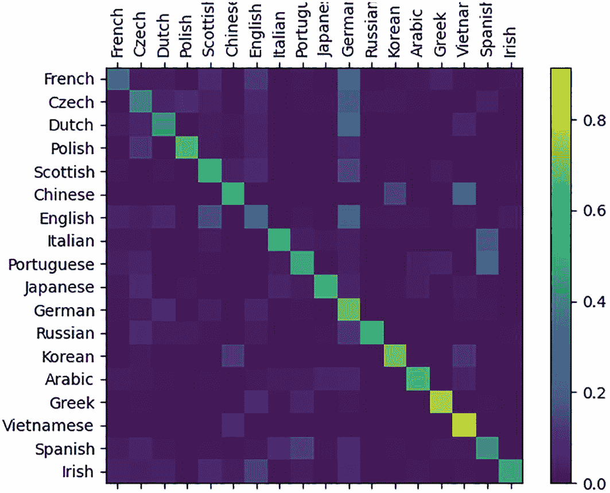

该图包含 18 种语言，按水平和垂直方向排列。右侧有一个带有渐变颜色的比例尺，范围从 0 到 0.8。

图 10-9

使用 PyTorch 进行姓氏语言分类

### PyTorch NLP：动手实践

使用 PyTorch 进行文本分类

本实验的目标是通过将文本示例作为一系列字符读取，然后使用 PyTorch 构建并训练一个循环神经网络（RNN），来预测姓氏来自哪种语言

1.  将以下链接中的两个文件上传到 Jupyter 笔记本：

    [`​github.​com/​bw-cetech/​apress-10.​3b.​git`](https://github.com/bw-cetech/apress-10.3b.git)

2.  将 `PyTorch_Functions.py.txt` 文件重命名，去掉 `.txt` 扩展名，以转换为 Python 脚本^(¹⁸³)

3.  打开 `.ipynb` 文件

4.  使用以下命令安装 PyTorch：

    ```
    import torch
    ```

5.  运行笔记本，将 PyTorch RNN 函数（位于 `PyTorch_Functions.py` 中）导入到笔记本中

6.  执行所示的练习：
    1.  显示一个三维（随机）张量以测试 PyTorch 库的导入
    2.  下载此问题的训练数据字典（18 种不同语言的姓氏），解压并在 Jupyter 工作目录中重命名
    3.  显示葡萄牙语字典中的最后五个名字，以测试 PyTorch 自定义函数
    4.  观察模型在测试集上的性能（如下图所示），并将预测结果和损失似然输出（测试样本名称属于某种语言的概率）导出为 csv 文件

7.  练习（拓展） – 调整导入的数据字典集，以解决不同的 NLP 分类器问题，例如预测 (a) 名字到性别、(b) 字符到作者或 (c) 城市到国家等。

## NLP 工具与应用

在本最后一章的最后一节中，我们将介绍一些知名的开源和工业级 Python 库，然后分析当今使用的主要自然语言应用和工具。最后，我们将通过最终的动手实验，解决一些关键的 NLP 用例和工具，包括一个端到端的聊天机器人部署，我们将使用 Watson Assistant 开发用户对话树，并将我们的应用推送到 IBM Cloud。


### Python Libraries

实现自然语言处理的主要库有哪些？我们在表 10-1 中列出了通用 NLP 的主要库，以及一些用于特定行业应用的专用库。

**表 10-1 Python NLP 库**

| 库/工具 | 描述/主要用途 | 独特卖点 | 缺点 |
| --- | --- | --- | --- |
| `NLTK` | NLP 领先平台，支持句子检测、分词、词形还原、词干提取、句法分析、组块分析和词性标注。提供 50 个语料库和词汇资源的 UI | 作为最常用的 Python NLP 库，功能全面 | 运行速度慢，不支持神经网络 |
| `TEXTBLOB` | 通过将`TextBlob`对象视为 Python 字符串，访问常见的文本处理操作 | 为 NLP/DL 准备数据，易于使用的 UI | 运行速度慢，不适合大规模生产 |
| `CORENLP` | 斯坦福开发的一套用于语言分析的人类语言技术工具 | 速度快，用 Java 编写 | 底层语言需要安装 Java^(¹⁸⁴) |
| `SPACY` | 专为生产环境设计，帮助开发者创建能处理/理解大量文本的 NLP 应用 | 处理大数据，支持多语言 | 与`NLTK`相比缺乏灵活性 |
| `PYTORCH`^(¹⁸⁵) | Facebook 开源的`PyTorch`是一个基于 API 的框架，用于扩展 Torch 深度学习库^(¹⁸⁶) | 执行速度快，支持计算图 | 核心 NLP 算法复杂 |
| `GENSIM` | 用于主题建模、文档索引和大型语料库相似性检索的专用库 | 内存独立，支持大于 RAM 的数据集^(¹⁸⁷) | 无监督文本建模有限，需与其他 Python 库集成 |

其他具有特定优势的库，如`Pattern`和`PyNLPl`（发音为 Pineapple），分别用于网络数据挖掘和文件格式处理；而`sumy`、`pysummarization`和`BERT summarizer`则擅长文本摘要。^(¹⁸⁸)

虽然并非专门用于自然语言处理的工具，但另外两个重要的 Python 库是`Twitter API`^(¹⁸⁹)和用于 Facebook Insights API 的`facebookinsights`封装器。这些库的用例——社交媒体情感（和指标）分析——将在下文讨论，而第 8 章将提供`Twitter API`的动手实验。

### NLP 应用

电子邮件/垃圾邮件过滤器、词云^(¹⁹⁰)、文字处理器中的自动更正以及编程中的（代码）自动补全，是自然语言处理最早且现已成熟的一些应用。但直到最近，上述 Python 库与云计算的结合，才解锁了对海量非结构化数据进行更高价值自然语言处理的能力。

无论是从非结构化数据中提取商业价值、进行深度文档信息搜索与检索、加速内部研究或尽职调查流程、提高报告生产力与内容创作，还是寻求与覆盖性认知机器人流程自动化（CRPA）目标的协同效应，企业都在争相建立内部 NLP 能力以交付价值。

虽然许多流行的“千万亿级”NLP 加速器可能才刚刚开始投入使用，我们现在来审视一下主流 NLP 商业和组织应用当前的成熟度水平。

#### 文本分析

文本分析或文本挖掘涉及从数据中提取高质量信息。它本质上是更复杂的非结构化数据分析（包括文本转语音和情感分析）的使能器，其关键增值在于能够在训练过程中增强特定领域的数据/语料库^(¹⁹¹)，以改进分类任务。

微软可能是此领域的领导者之一，特别是其`Azure Cognitive Services`，它包含了丰富的文本分析功能，包括`Content Moderator`和`Language Understanding`（`LUIS`）。`IBM Watson Knowledge Catalog`也是一款领先产品。

##### 文本转语音与语音转文本

文本转语音（以及语音转文本）现在是一个成熟且竞争激烈的市场。市场领导者包括`Amazon Polly`和`API Cloud Service IBM Watson Text to Speech`。^(¹⁹²)

#### 社交媒体情感分析/意见挖掘

情感分析/意见挖掘是一种上下文文本挖掘，用于从源数据中识别和提取主观信息。该技术主要与社交媒体渠道相关联，企业（以及政府/政治家）直接或间接地使用它来了解其品牌的社会情感、客户之声（VoC）或衡量公众看法。

如今的情感分析已超越简单的正面和负面情感指标——监听或监控（实时）在线对话可以触发对讨论类别、概念和主题以及情绪检测的相关关键洞察分析。

所有全球零售商、快速消费品行业和电信行业都依赖于对情感分析结果的复杂捕捉——大多数应用依赖于通过`Python`的`tweepy`或`snscrape`库访问`Twitter API`，和/或通过`facebookinsights`封装器访问`Facebook Insights`。第 8 章将提供一个使用`Twitter API`进行社交媒体情感分析的动手实验。


一个仪表图显示了悲伤、中性和快乐三种表情符号。指针指向快乐表情符号。

**图 10-10** 社交媒体情感分析

#### 聊天机器人、对话助手和 IVA

作为自然语言处理最著名的应用，如今的聊天机器人可以进行交互式对话，并标配了先进的语音识别和文本转语音功能。

自`Cortana`早期以来，聊天机器人技术已大幅改进。智能虚拟助手（IVA）内置了 AI 训练、认知和自我学习能力，并能适应上下文，利用最新的 Transformer 技术。

如今部署聊天机器人的商业价值集中在客户旅程和客户体验的阶梯式改进上——具有快速、低成本解决问题的明显潜力。

无论是`Amazon Alexa`、`Apple`的`Siri`、`Google`的 IVA 生态系统（`Meena`/`DialogFlow`/`LaMDA`）、`IBM Watson`、`Azure LUIS`和`QnA Bot`，还是`Rasa`，自然语言处理和深度学习都被结合起来，以最佳方式匹配/学习用户的“意图”和“实体”到对话“语料库”中。


### NLP 2.0

上一节已经讨论了自然语言转换器（Transformer）的无限潜力，但下面我们将关注近期在顶尖（SOTA）NLP 技术方面的其他进展，这些技术预计将在不久的将来成为核心的企业级应用。

#### 自然语言生成

自然语言生成是对自然语言的**产生**，而非**解释**。尽管有些原始，但自动补全功能就是 NLG 的一个例子。

广泛的行业应用案例包括：数字营销内容创作、金融/医疗报告生成、新闻业、电商/零售中的产品标签、旅行信息更新以及客户服务优化。

尽管 NLG 已经存在多年，但 Transformer 日益强大的参数化能力带来了输出质量的巨大提升，尤其是在 AI 生成报告的可信度方面。

谷歌的 `Smart Compose`、`Arria` 和 `WordSmith` 是支持自然语言生成的三大领先工具^(¹⁹³)，但正如我们将在本章末尾的动手实验中看到的，我们也可以使用 GPT-3 Transformer 来生成文本，例如根据食材生成菜谱。

#### 辩论

计算讨论、论证和辩论技术的成熟度已达到机器能够可信地与人类辩论的程度。^(¹⁹⁴)

IBM 的 `Project Debater` 被誉为“首个能在复杂话题上与人类辩论的 AI 系统”，它由四个核心模块组成：论点挖掘、论点知识库（AKB）、论点反驳和辩论构建，其中前两个模块为辩论提供内容。^(¹⁹⁵) 该工具使用了与 Transformer 内在机制类似的序列到序列和注意力机制，并且在开场演讲等方面，与人类（非专家）演讲及其他 NLP Transformer（如 GPT-2）相比，获得了良好的评价。

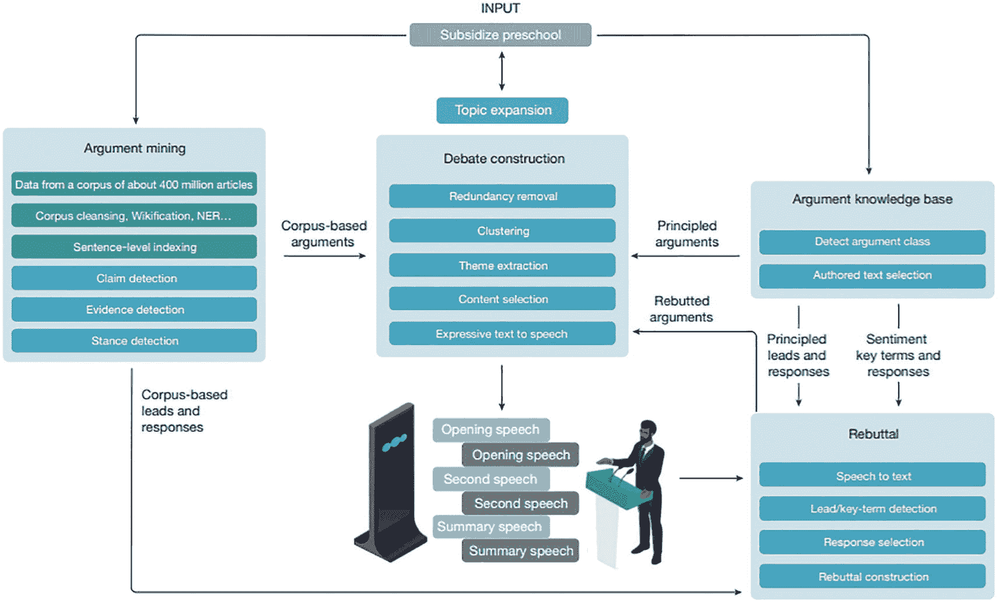

该图展示了“补贴学前教育”的输入，分组进入论点挖掘和知识库。论点知识库通过原则性引导和情感关键词响应，进入反驳模型。这些模型为辩论构建提供基于语料库的、原则性的和反驳性的论点，最终生成演讲。

**图 10-11** IBM Project Debater 系统架构

#### 自动 NLP

自然地，鉴于机器学习和深度学习领域全面自动化的趋势，自动化 NLP 生命周期中涉及的众多步骤成为了关注焦点。

`Hugging Face` 是该领域的领导者，其 `AutoNLP` 工具集成了 `Hugging Face Hub` 中大量的数据集和预训练^(¹⁹⁶)的 SOTA Transformer 模型。`NeuralSpace` 是另一家，它提供多语言支持，可使用 `AutoNLP` 训练 87 种语言的模型。^(¹⁹⁷)

`auto-nlp` Python 库还在现有 Python NLP 包（如 `spaCy`）之上提供了一个抽象层和低代码功能，其方式与 `auto-sklearn` 为 `sklearn` 机器学习提供低代码自动化类似。`AutoVIML`（自动变体可解释机器学习）是另一个用于 Auto-NLP 的 Python 库，它自动化了预处理、语言分析（词干提取和词形还原等）和向量化步骤。

### 总结

在了解了这些 NLP 趋势之后，我们将通过几个动手实验来完成这最后一章关于自然语言处理的内容，这些实验聚焦于 2022 年的一些主流应用和工具。这些实验将带领我们结束这段旅程，并为《使用云和 Python 实现 AI 解决方案的生产化》一书画上一个实际的句号。不过，在最后的几页中，我们还有一些结束语。

本书反复出现的一个主题是实施 AI 时所采用的实验水平，以及有时基于（云）成本的变通方法。并非每家公司都有预算来满足高性能计算实例或高吞吐量、安全存储的成本。当前 AI 解决方案实施的环境以及市场力量的集中可能意味着这些挑战在未来几年仍将持续，但在最后几页中，我们将探讨可能改变游戏规则的创新，这些创新或许能让更广泛的生态系统摆脱云服务提供商（CSP）的引力束缚。

### WATSON Assistant 聊天机器人/IVA：动手实践

面向对话式 AI 的人力资源对话配置

作为 Gartner 企业级对话式 AI 魔力象限的领导者，且 IBM Watson 用户在三年的时间内实现了 337%的投资回报率^(¹⁹⁸)，Watson Assistant 是 IVA 自动化领域的行业领先工具之一。

本练习的目标是在 Watson Assistant 上创建一个 HR IVA，该 IVA 利用不断增长的用户交互来重新训练并改进对用户关于求职申请和公司内部政策问题的回答：

1.  访问链接^(¹⁹⁹) `https://eu-de.assistant.watson.cloud.ibm.com/` 并使用您的 IBM ID 登录。如果被重定向到 IBM Cloud，请输入登录详细信息或注册。

2.  选择屏幕左上方（LHS）的“Assistant”选项 > 创建 Assistant

3.  添加对话技能 > 上传技能，并从以下链接上传 json 对话文件

    `https://github.com/bw-cetech/apress-10.4.git`

4.  打开新创建的 Assistant，观察用户意图（这些是用户问题的主题，如组织结构、薪资、投诉、行政、幽默等）和**实体**（用户问题的主题，如团队、人员、服务、薪酬、额外福利：股票/股份/养老金等）

5.  对话已预先配置好——使用下面的对话进行测试^(²⁰⁰)

    第一部分（求职咨询）

    ```
    你好
    能告诉我我的求职申请进度吗
    空缺职位
    技术岗
    是的
    ```

    第二部分（公司政策）：

    ```
    你能帮我了解股票期权吗
    员工有折扣价吗？
    ```

    第三部分（幽默）：

    ```
    我可能快死了，我的寿险、工资和养老金如何支付给我的家人？
    不
    再见
    ```

6.  **练习** – 将对话替换为面向在线零售商的典型客户支持 IVA

7.  **练习（进阶）** – 通过向您的 Watson Assistant 添加网页聊天集成来推送到 IBM Cloud（API 详情显示在 Assistant UI 上的“查看 API 详情”下）

8.  **练习（进阶）** – 向您的 Watson Assistant 添加 WhatsApp（通过 Twilio）集成

9.  **练习** – 设置一个应用程序例程，该例程每月根据最新的用户对话自动重新训练 NLP 模型


### 面向聊天机器人的 Transformer 模型：动手实践

#### 使用 GPT-3 进行自然语言生成

在最后一个实验中，我们将使用 OpenAI 预训练的 GPT-3（生成式预训练 Transformer）模型来：(a) 根据用户输入的食材生成烹饪食谱（采用“零样本”训练，即不向模型提供任何示例）；(b) 实现一个“讽刺”风格的聊天机器人（采用“少样本”训练，即向模型提供有限数量的示例进行训练）：

1. 在 OpenAI 官网注册账号 [`openai.com/join/`](https://openai.com/join/)，并在仪表盘右上角“个人”菜单下获取提供的 API 密钥。

2. 克隆以下 GitHub 仓库：  
   [`github.com/bw-cetech/apress-10.4b.git`](https://github.com/bw-cetech/apress-10.4b.git)

3. 将 OpenAI API 密钥复制并粘贴到`openai_credentials.py`文件中字符串的双引号内。

4. 在 Colab 中按步骤运行 Python 笔记本：
   1. 安装`openai`，然后注释掉该代码。
   2. 导入库。
   3. 将 OpenAI 凭据文件拖放到 Colab 临时存储中。
   4. 定义 GPT-3 Transformer 函数——该函数将对接高性能 GPT-3 `text-davinci-002`引擎。
   5. 调用该函数，根据苹果、面粉、鸡肉和盐这些基本食材生成一份食谱。

5. 练习——将食材改为例如：新鲜罗勒、大蒜、松子、特级初榨橄榄油、帕玛森芝士、螺旋面、柠檬、盐、胡椒、红辣椒片和烤松子^(²⁰¹)，然后再次调用该函数生成一份意面食谱。

6. 双击写入 Colab 临时存储的`receipe.txt`文件，验证生成的食谱。

7. 练习（进阶）——修改代码，确保 GPT-3 模型生成的食谱不会被截断。

8. 使用相同的 GPT-3 Transformer 模型，继续运行最后两个单元格，这两个单元格提供了“讽刺”语境的示例^(²⁰²)，然后调用（相同的）GPT-3 Transformer 函数。该函数会针对上下文示例/聊天机器人文本中的最后一个问题“现在几点了？”（该问题为空^(²⁰³)）返回一个（NLG 生成的）“讽刺”回答。


脚注 1 2 3 4 5 6 7 8 9 10 11 12 13 14 15 16 17 18 19 20 21 22 23 24 25 26 27 28 29 30 31 32 33 34 35 36 37 38 39 40 41 42 43 44 45 46 47 48 49 50 51 52 53 54 55 56 57

索引

A
- 基于抽象的摘要
- A/B 测试
- 激活函数
    - 定义
    - 双曲正切函数（`tanh`）
    - ReLU
    - Sigmoid 函数
    - Softmax
- Adadelta
- AdaGrad/自适应梯度算法
- 适应性
- 敏捷
    - 适应性优势
    - 开发/产品冲刺
    - `react.js`团队
    - /协作
- AI 应用开发
- AI 加速器
- AI 解决方案
- API/端点
    - API Web 服务/端点
    - 应用，运行集群
    - GPU
    - IDC 增长预测
    - 运行 Python
    - 分片
    - 软件工具
    - TPU
    - 虚拟环境
- AI 生态系统
- 敏捷交付模型
- 应用
- 自动机
    - CSP
    - 定义
    - 演进
    - 全栈 AI
    - 炒作周期
    - AI 阶梯方法论
- AlexNet
- 深度神经网络
- Amazon API Gateway
- Amazon Elastic Block Store (EBS)
- Amazon SageMaker Autopilot
- Amazon Simple Storage Service (S3)
- Amazon Web Services
- Apache Cassandra
- Apache Hadoop
- Apache HBase
- Apache Kafka
- Apache Maven
- Apache Parquet
- Apache Spark
- Apache 工具套件
- 应用程序编程接口 (API)
- 论据知识库 (AKB)
- 通用人工智能 (AGI)
- 人工智能 (AI)
    - 应用
    - ASI
    - 云计算
    - 计算
    - 容器
    - CRPA
    - CSP
    - 深度学习
    - 定义
    - 机器学习
    - 狭义
    - NLP
    - 存储
    - 工具
- 人工智能物联网 (AIoT)
- 人工神经网络 (ANN)
- 超级人工智能 (ASI)
- 注意力机制
- 增强智能
- AutoAI
    - 方法
    - AutoAI 工具
    - AzureML
    - Google Cloud Composer
    - Google Cloud Vertex AI
    - IBM Cloud Pak for Data
    - NoLo 用户界面
    - TFX
- 自编码器神经网络
- 自动变体可解释机器学习 (AutoVIML)
- AutoML
    - 自动化库
    - 模型流水线
    - 建模前和建模后流程
    - 搜索空间
    - 工具
- `Auto-nlp` Python 库
- AutoNLP 工具
- 自回归 (AR)
- 自回归积分滑动平均 (ARIMA)
- 自回归滑动平均 (ARMA)
- Auto-WEKA
- Avro 文件
- AWS DynamoDB
- AWS Lambda
- AWS SageMaker
- AWS 无服务器架构
- AWS Simple Storage Service (S3)
- Azure 架构
- Azure Blob 存储
- Azure 容器注册表 (ACR)
- Azure 数据工厂 (ADF)
- Azure Data Lake Storage (ADLS)
- Azure Data Lake Storage (ADLS Gen2)
- Azure Kubernetes Service (AKS)
- Azure 机器学习 (AzureML)
- Azure 机器学习工作室
- Azure Synapse
- Azure 视频分析器
- Azure 虚拟机

B
- 反向传播
- 词袋模型 (BoW)
- 银行与金融服务行业
    - 挑战
    - 定义
    - 欺诈检测
- 大数据
- 大数据与建模
- 大数据/云架构
- 大数据引擎/并行化
    - Apache Spark
    - Dask
- 玻尔兹曼机
- BoW 方法

C
- C3
- 集中式系统
- 中央处理器 (CPU)
- 聊天机器人技术
- 聊天机器人 2.0/3.0
- 聊天机器人
- 分类技术
- 云计算服务
- 云服务提供商 (CSP)
- 集群
- 代码密集型技术模型
- 代码仓库
    - 分支/合并
    - Git
    - GitHub
    - Git 工作流
    - VCS
    - 版本控制
- 认知机器人流程自动化 (CRPA)
- 复杂事件处理
- 计算机视觉
- 持续集成 (CI)
- 持续部署 (CD)
- 持续集成与持续交付 (CI/CD)
    - 容器化
    - DataOps
    - Docker
    - Jenkins
    - Maven
- 持续集成 (CI)
- 持续测试
- 卷积神经网络 (CNN)
- 企业社会责任 (CSR)
- 新冠疫情
- 疫情数字化
- 客户体验 (CX)
- 网络安全

D
- Dash 应用
- Dask
- 数据漂移
- 数据编织方法
- 数据编织架构
- 数据摄取
    - AI 阶梯
    - API
    - 自动化
    - 云架构/云栈
    - 云服务
        - ADLS
        - 数据仓库
        - 流分析
        - 流处理
    - 数据存储
    - 数据策略/数据专家
    - 数据类型
    - 定义
    - 文件类型
    - RDBMS
    - 定时数据 *vs.* 流式数据
- 数据摄取/AI 流水线
    - AI 工程
    - 自动化
    - 数据流水线
    - 数据整理
    - ETL
    - 示例
    - 性能基准测试
- DataKitchen
- 以数据湖为中心的分析架构
- 数据湖
- 数据集市
- DataOps
- DataOps/敏捷方法
- DataOps/MLOps
    - 敏捷核心流程
    - 数据工厂
    - 定义
    - 企业 AI
    - GCP/BigQuery
    - Kafka
    - 流水线测试/性能/评估/监控
    - 问题管理/问题跟踪
    - Jenkins CI/CD
    - 监控
    - Selenium
    - Selenium 脚本
    - TestNG
- 数据流水线构建
    - 交付流水线
    - 数据摄取
    - 数据导入
    - 数据存储
    - EOD
    - 无服务器计算
    - 行业领先工具
    - 存储考量
- 数据流水线
- DataRobot
- 数据科学
- 数据科学家
- 数据存储
    - AWS 云
    - CRM/ERP 系统
    - 定义
    - 弹性 *vs.* 可扩展性
    - ETL *vs.* ELT
    - OLTP/OLAP
    - 项目数据需求
    - SQL *vs.* NoSQL 数据库
- 数据到 Databricks 文件系统 (DBFS)
- 数据仓库
- 数据整理
    - 数据清洗
    - 编码
    - 端到端整理
    - 特征工程
    - 采样
    - 洗牌/数据分区/拆分
- 数据整理
    - 非结构化数据
- 辩论系统架构
- 深度信念网络 (DBN)
- 深度玻尔兹曼机 (DBM)
- DeepDow
- DeepFace
- 深度伪造
- 深度学习
    - ANN
    - 应用
    - 开发应用
    - 预测
    - 物联网
    - 自编码器，Keras
    - CNN
    - 卷积神经网络
    - 定义
    - 数字优先的企业和组织
    - GAN
    - 高层架构
    - 炒作周期
    - 超参数
    - 生命周期
    - LSTM
    - MNIST
    - 多层神经网络
    - 网络调优
    - 神经网络
    - 流程调优
    - RNN
    - 解决方案
    - 随机过程
        - 生成式 *vs.* 判别式
        - 马尔可夫链
        - 鞅
        - 随机游走
    - TensorFlow
    - 张量
    - 工具
        - Keras
        - PyTorch
        - TensorFlow
    - VAE
- 深度神经网络
- 民主化
- 设计/系统思维方法
- 设计思维方法
- 数字时代
- 降维
- 消歧
- 判别式与生成式模型
- 分布式版本控制系统 (DVCS)
- Django
- Docker
- DynamoDB

E
- `EarlyStopping`函数
- 弹性计算 (EC2)
- 弹性 MapReduce (EMR)
- 电子邮件/垃圾邮件过滤器
- 来自语言模型的嵌入 (ELMO)
- 编码器-解码器架构
- `Encoder_decoder_model`
- 日终流程 (EOD)
- 能源行业
- 企业 AI
- 企业机器学习项目
- 欧几里得距离度量
- 探索性数据分析 (EDA)
- “可扩展”模型
- 基于抽取的摘要
- 提取、加载、转换 (ELT)
- 提取、转换、加载 (ETL)

F
- Facebook 开源算法
- `fastText`
- 特征工程
- Flask
- Flask 仪表板
- 预测
- 欺诈分析应用
- 欺诈检测应用
- 全栈/容器化
    - 持续交付流水线
    - Docker
    - Flask
- 全栈深度学习
- 函数式模型 API

G
- Gartner 炒作周期
- 门控循环单元 (GRU)
- 生成对抗网络 (GAN)
- GitHub
- 全局搜索算法
    - 贝叶斯优化与推理
    - Python 库
- GloVe 模型
- Google BigLake
- Google Brain
- Google Cloud Platform (GCP)
- Google Cloud Storage
- Google Colab
- Google 可教学机器
- 治理、风险管理和合规 (GRC)
- 梯度下降
- 粒度方法
- 图形处理器 (GPU)

H
- 医疗保健行业
- 亥维赛阶跃函数
- 隐马尔可夫模型 (HMM)
- 分层数据格式第 5 版 (HDF5)
- 人力资源解决方案
    - 2022 年员工流失
    - 人力资源样本
- 人在回路中
- 超大规模云提供商
- 假设驱动开发

I
- 图像数据增强
- 行业案例研究
    - AI 赋能者
    - 业务/组织需求，AI
    - 网络安全
    - 保险/远程信息处理
    - 法律行业
    - 制造业
    - 公共部门/政府
    - 解决方案框架
    - 用例
- 信息检索与提取 (IR/IE)
- 保险公司商业模式
- 智能虚拟助手 (IVA)
- 交互式语音应答 (IVR) 应用

J
- Jenkins
- Jira
- Jupyter 笔记本

K
- Kafka
- Kaggle 级别模型
- Keras
- Keras 函数式 API
- 关键跟踪标准 (KTC)
- K 折交叉验证
- KMeans 算法
- Kubernetes (k8s)

L
- 基于实验室的方法
- 湖仓一体
- Lambda 架构
- 对话应用语言模型 (LaMDA)
- 潜在语义分析 (LSA)
- 带泄露的 ReLU
- 词形还原
- 长短期记忆模型 (LSTM)
- 损失函数

M
- 机器学习和深度学习算法
- 机器学习 (ML)
    - 算法技术
    - 应用
    - 客户体验
    - 欺诈检测
    - 机器学习应用
    - 运营管理
    - 推荐引擎
    - 风险管理与预测
    - 方法
    - 定义
    - EDA
    - 实施
    - 模型选择/部署/推理
    - 强化学习
    - 监督学习
    - 无监督学习
- 机器学习运维 (MLOps)
- MapReduce
- 马尔可夫链
- 马尔可夫过程
- “大规模”深度学习模型
- 大规模并行处理 (MPP)
- 微批处理
- 微服务
    - 敏捷
    - 架构
- Microsoft 认知工具包 (CNTK)
- 改进版国家标准与技术研究所数据集 (MNIST)
- 多层感知机
- 多层感知机 (MLP)
- 多工具集成
- MXNet

N
- Nagios
- 命名实体识别 (NER)
- 自然语言生成
- 自然语言处理 (NLP)
    - AI 生态系统
    - 应用
    - AutoNLP 工具
    - 聊天机器人
    - 辩论
    - 人力资源
    - IVA，Watson Assistant
    - IVA
    - NLP 2.0
    - 情感分析/意见挖掘
    - 文本分析
        - 创建词云
    - 定义
    - 从嵌入到深度学习
    - 历史背景/发展
    - 接口
    - 语言分析
    - 语言/数据转换
        - 词法分析
        - 语义分析
        - 句法分析
    - 预处理/初始清洗
        - 正则表达式
        - 文本剥离
        - Python
    - Python 库
    - 特定行业用例
    - 文本解析，NLTK
    - 文本向量化过程
- 神经网络
    - ANN
    - 自编码器
    - CNN
    - DBM
    - DBN
    - GAN
    - MLP
    - RBM
    - RNN
    - 简单感知机
    - 可视化工具
- NeuralSpace
- `nltk.stem PorterStemmer()`函数
- “NoLo”图形用户界面
- “NoLo”工具
- 非线性激活函数
- 非关系型数据库 (NoSQL)
- NoSQL 数据库

O
- OLTP/OLAP 数据源
- 开放神经网络交换格式 (ONNX)
- 光学字符识别 (OCR)
- 优化算法

P
- 按使用量付费定价模型
- 性能基准测试
    - 持续改进
    - 机器学习分类器
    - 性能指标
    - 监督分类模型
- 个人身份信息 (PII)
- `pip install dash`命令
- `.pos_tag`方法
- 预测分析
- “概率匹配”技术
- AI 产品化
    - 应用敏捷开发
    - 应用构建，GCP
    - 自动重训练
    - 障碍
    - 云/CSP 轮盘赌
    - 协作/测试/衡量/重复
    - 持续流程改进
    - 数据漂移
    - Data/MLOps
    - 工程与基础设施工具
    - 实验 vs. 工业化
    - 托管
        - Heroku
    - 假设驱动开发
    - PowerBI
    - SQL 数据库
- PyCaret 库
- 基于 Python 的自动化库
    - auto-sklearn
    - Auto-WEKA
    - PyCaret
    - TPOT
- 基于 Python 的用户界面
    - Dash
    - Django
    - Flask
- Python 笔记本
- Python `spaCy`库
- PyTorch

Q
- 定性分析
- QuickSight

R
- 径向基函数 (RBF)
- RBfOpt
- 推荐引擎
- 修正线性单元 (ReLU)
- 循环神经网络 (RNN)
- 循环神经网络 (RNN)
- 递归特征消除 (RFE)
- Red Hat 的数据摄取流水线
- 正则表达式/“regex”
- 正则化
- 强化学习
- 远程过程调用 (RPC) 框架
- 表述性状态转移 (REST)
- 受限玻尔兹曼机 (RBM)
- 零售解决方案
    - BigQuery ML
    - 流失/留存建模
    - 数字颠覆
    - 动态定价
    - 预测客户流失
- 风险/资产管理工具
- 机器人流程自动化 (RPA)
- 均方根传播 (RMSProp)
- 基于规则/基于频率的嵌入

S
- SageMaker
- 季节性自回归积分滑动平均 (SARIMA)
- Selenium
- 语义分析
- 半导体技术
- 半监督机器学习
- 情感分析
- 情感分析/意见挖掘
- 序列模型
- 序列到序列模型
- 序列模型 API
- 无服务器架构
- ServiceNow
- 分片
- Sigmoid 激活函数
- 简单感知机
- Simple Storage Service (S3)
- 奇异值分解 (SVD)
- Snowflake 架构
- 社交媒体
- 社交媒体情感分析
- Softmax
- Softmax 激活函数
- AI 软件工具
    - AWS 云平台
    - AWS
    - Azure
    - GCP
    - Heroku
    - IBM
    - IDC 市场
- `spaCy`
- `.split`函数
- SQLAlchemy
- 词干提取
- 随机梯度下降 (SGD)
- Streamlit
- 流处理
- 结构化数据
- 监督分类算法
- 监督机器学习
    - 分类/回归
    - `fbprophet`
    - 时间序列预测
- 监督回归算法
- 供应链管理 (SCM)
- 供应链优化
- 供应链
    - 挑战
    - 定义
    - 优化
    - 预测分析
- 代理函数
- 句法分析
- 合成少数类过采样技术 (SMOTE)
- “片上系统” (SoC)
- “系统级”方法
- 系统级生态系统

T
- 目标最终用户系统
- 技术债务
- 电信解决方案
    - 类别
    - 挑战
    - 移动服务
    - 预测分析
    - 情感分析
    - 来自 Python 的 Twitter API
- 张量
- TensorFlow
- TensorFlow Extended (TFX)
- TensorFlow 处理单元 (TPU)
- TensorFlow/PyTorch 深度学习模型
- 下一代测试 (TestNG)
- 文本分析/文本挖掘
- `text.strip()`方法
- 文本摘要
- 文本向量化过程
    - 基于规则的频率嵌入
    - 序列模型
    - 文本摘要
    - 主题建模
    - 变换器
- “微型 AI”解决方案
- `train_test_split`函数
- 迁移学习
- 基于树的流水线优化工具 (TPOT)

U
- 非结构化数据
- 无监督学习算法
- 无监督机器学习
    - 聚类
    - 定义
    - 降维
- “用完即弃”方法
- 用户定义的 URL 端点

V
- 方差膨胀因子 (VIF)
- 变分自编码器 (VAE)
- 版本控制系统 (VCS)

W
- “瀑布”方法
- 基于 Windows 的系统
- Word2vec
- 词嵌入
- 词嵌入/基于预测的嵌入
    - 示例模型
    - Word2vec
- `WordNetLemmatizer()`函数
- 词向量/词嵌入

X, Y, Z
- XenonStack 数据流水线架构

脚注 1 2 3 4 5 6
