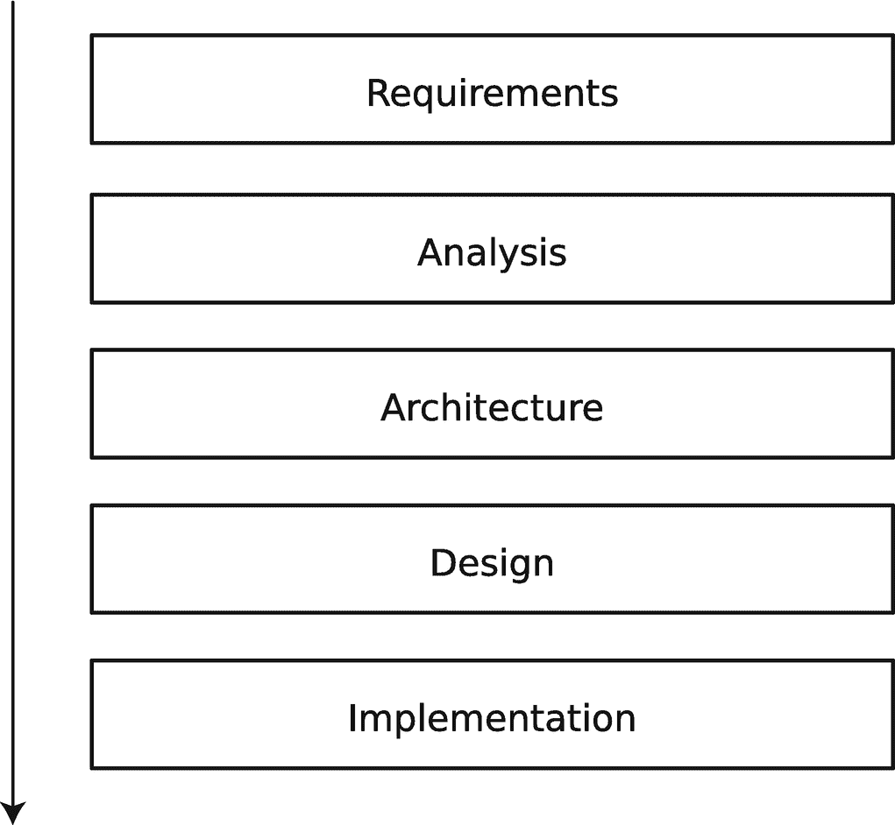
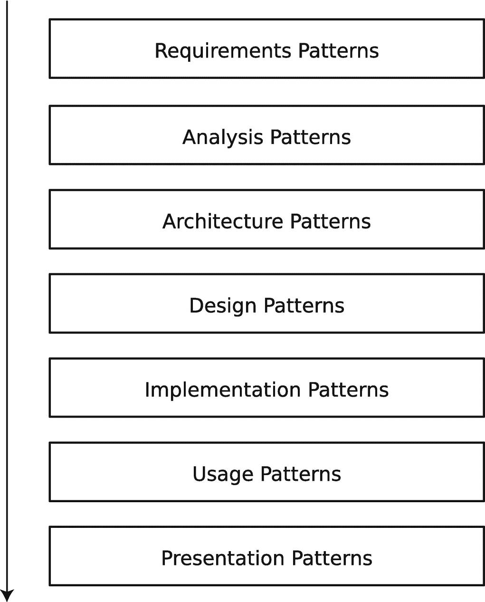
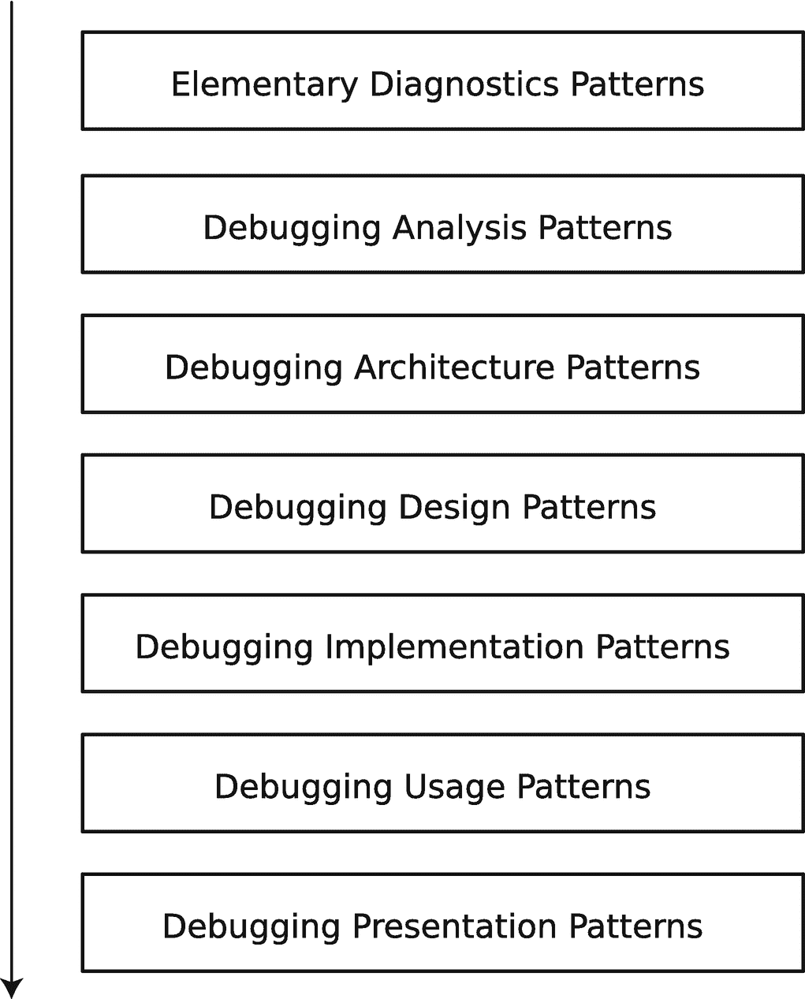
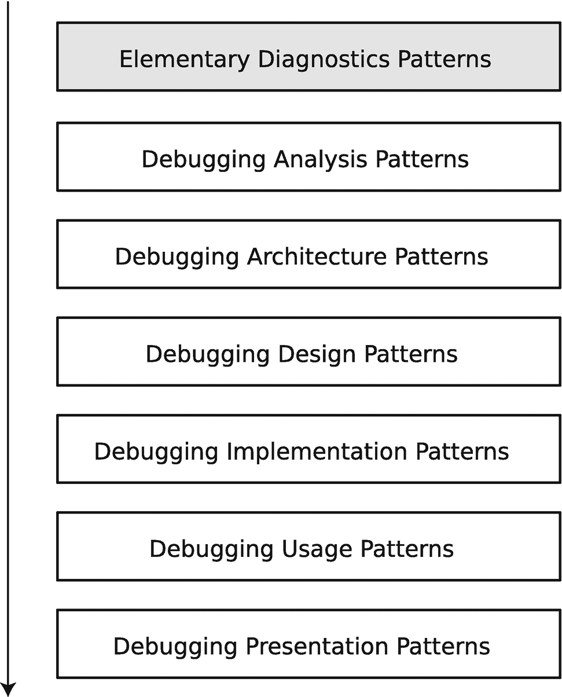
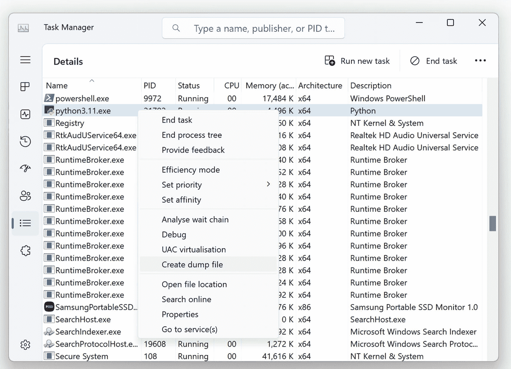

# 2. 面向模式的调试

本章介绍面向模式的调试过程方法以及你将在后续章节中使用的模式语言。

## 理念的起源

在调试中使用模式的想法并不新鲜^(¹)。早期，这类模式分为两种：错误模式^(²)和调试模式^(³)。在 2000 年之前，只能找到少数与调试相关的模式，例如调试打印方法^(⁴)。

错误模式通常是针对特定语言和平台的特定模式。我们所说的错误，指的是软件缺陷。通常，这些缺陷与源代码相关，但也可能与配置和数据模型有关。

以源代码作为调试的起点，仅适用于有限数量的场景，例如当你拥有 Python 堆栈跟踪时。然而，在许多情况下，源代码调查的起点是未知的。此时，一个定义良好的过程可能会有所帮助。过去曾提出过许多调试过程，包括多学科方法^(⁵)。

“面向模式的调试”这一短语大约出现在 1987-1988 年，当时是在进程交互模式的背景下^(⁶)。这与 2014 年提出的“面向模式的调试过程”^(⁷)不同，后者是作为 2010 年引入的*统一调试模式*^(⁸)的进一步发展。自 2013 年起，这些模式已成功用于教授非托管（原生、Win64、C、C++）和托管（.NET、C#）代码的 Windows 调试^(⁹)，历时近十年。总的来说，这种面向模式的方法可以追溯到我们早期于 2011 年出版的一本书中提出的观点^(¹⁰)。在该书中，我们将相同的面向模式的过程应用于云和机器学习环境中的 Python 调试。

## 模式与分析模式

在查看调试过程之前，先简单介绍一下诊断和调试背景下的模式。所谓*模式*，我们指的是一组常见的、可重复识别的指标（症状、迹象）。所谓*分析模式*，我们指的是在特定上下文中常见的、可重复的分析技术和模式识别方法。所谓*模式语言*，我们指的是用于沟通的模式和分析模式的通用名称。

## 开发过程

让我们首先看看传统的软件开发过程阶段。图 2-1 从包括瀑布式和迭代式在内的几种开发过程中抽象出了这些阶段。



一个堆叠的框图代表了软件开发过程的各个阶段。这些块分别是需求、分析、架构、设计和实现。沿着这些块从上到下绘制了一个向下的箭头。

图 2-1

典型软件开发过程的阶段

## 开发模式

对于每个阶段，都存在某种模式语言，例如针对常见的、可重复识别的、具有语法、语义和语用学问题的解决方案词汇表。图 2-2 还包括用于人机交互的软件使用模式和呈现模式。在本书中，我假设你熟悉此类模式语言（下面提供了一些参考资料）。



一个堆叠的框图代表了软件开发模式语言。这些块分别是需求、分析、架构、设计、实现、使用和呈现模式。沿着这些块从上到下绘制了一个向下的箭头。

图 2-2

典型的软件开发模式语言

## 调试过程与模式

调试过程与开发过程和开发模式相互对应，如图 2-3 所示。让我们逐一审视每个阶段。



一个堆叠框图展示了面向模式的调试过程。这些模块依次是：基础诊断、调试分析、调试架构、调试设计、调试实现、调试使用和调试呈现模式。图中从上到下绘制了一个向下的箭头。

图 2-3

面向模式调试过程的各个阶段

## 基础诊断模式

基础软件诊断模式的灵感来源于《*基础设计模式*》这本书的书名^(¹¹)，但两者有所不同，它们对应于软件开发过程中的需求。这些模式是软件用户所经历的体验，而调试的目标就是消除这类体验。

## 调试分析模式

在进行任何调试之前，你需要诊断出正确的问题。调试分析模式对应于软件诊断。例如，在内存转储分析中，存在诸如 `Managed Code Exception`、`Managed Stack Trace`、`Stack Overflow`、`Deadlock`、`Spiking Thread` 等分析模式。这样的模式有数百种^(¹²)。跟踪和日志分析模式，例如 `Thread of Activity`、`Discontinuity`、`Time Delta`、`Counter Value`、`State Dump` 等，也包含在此类别中^(¹³)。我们将在第 4 章中探讨其中最常见的模式。

## 调试架构模式

调试架构模式部分灵感来源于 POSA^(¹⁴)，例如 `Debug Event Subscription/Notification`。它们比可能因特定技术（例如面向对象和函数式）而有所不同的设计模式更高级。

## 调试设计模式

调试设计模式部分灵感来源于 GoF 设计模式方法^(¹⁵)，例如 `Punctuated Execution`。

调试架构模式和调试设计模式都涉及调试工具的开发，以及实际的调试架构和设计，它们作为可重用的解决方案，用于解决特定上下文中常见的重复性调试问题。

## 调试实现模式

调试实现模式是关于调试策略和核心调试技术的模式，例如 `Break-in`、`Code Breakpoint`、`Data Breakpoint` 等，这些将在后续章节的 Python 调试案例研究中介绍。

## 调试使用模式

调试使用模式是关于可重用调试场景的调试实用方法：即如何、什么、何时以及在何处使用前述的调试模式类别，例如在用户（进程）和内核空间调试中使用数据断点。

## 调试呈现模式

调试呈现模式是关于用户界面和交互设计的^(¹⁶)，例如监视对话框。这些模式也与调试使用相关。我们将在专门介绍现有 Python IDE 及其在 Python 调试中使用的章节中介绍这些模式。

我们认为，近期出版的 Python 调试书籍^(¹⁷) 对应于调试实现、使用和呈现。自动化调试^(¹⁸) 属于调试架构和设计。在本书中，我们将这些知识中的一部分提取到相应的调试模式语言中，将它们与面向模式的软件诊断相结合，并在机器学习和云计算环境的背景下，形成一种新颖的面向模式的 Python 调试方法。

# 总结

在本章中，您了解了面向模式的调试过程、其各个阶段以及相应的模式语言。后续章节将从 Python 编程的角度提供每个类别中的调试模式示例。下一章将介绍第一个阶段及其模式：基础诊断模式。

脚注 1   2   3   4   5   6   7   8   9   10   11   12   13   14   15   16   17   18

## 基础诊断模式

在上一章中，我介绍了面向模式的调试过程，其中包含异常软件行为的（软件）基础诊断模式，这些行为会影响用户，并在必要时触发软件诊断和调试（图 3-1）。



面向模式调试过程的堆叠框图。从上到下的模块依次是：基础诊断、调试分析、调试架构、调试设计、调试实现、调试使用和调试呈现模式。其中基础诊断被突出显示。

图 3-1

面向模式的调试过程与基础诊断模式

这类模式数量不多，分为两组。目标是将其数量控制在绝对最少。在本章中，您将更详细地了解它们，学习如何在软件执行过程中识别它们，并收集相关的软件执行产物。这些模式分为两组：功能性和非功能性。

## 功能性模式

第一组（功能性）仅包含一个基础诊断模式：`Use-case Deviation`。

### 用例偏差

所谓*用例*，我们指的是一个功能性需求，即软件本应正确地为用户（或其他程序）执行的操作，但实际结果、响应或操作流程却出现了偏差。在这种情况下，跟踪、日志记录以及在调试器下运行程序（实时调试）都是有用的调试技术。

## 非功能性模式

第二组（非功能性）包含几个基础诊断模式：

*   `Crash`

*   `Hang`

*   `Counter Value`

*   `Error Message`

### 崩溃

当某个软件进程突然从正在运行的进程列表中消失时，`Crash`（崩溃）现象就显现出来。这个列表可以是 Linux 中 `ps` 命令的输出、macOS 中的活动监视器，或者 Windows 中任务管理器的详细进程列表。崩溃可能由某些 Python 异常、Python 运行时，或来自某些原生库的未处理操作系统异常引起。对于后一种情况，建议将系统配置为保存*进程内存转储*（在 Linux 和 macOS 中通常称为*核心转储*，在 Windows 中称为*崩溃转储*）。当终端（或控制台）没有输出时，这些内存转储可能有助于查看回溯（堆栈跟踪）。

保存的内存转储会被加载到调试器中，以查看崩溃发生时的堆栈跟踪和程序变量（内存值）（事后调试）。

您也可以从一开始就在调试器下运行程序，或者在崩溃发生前附加一个调试器。调试器同样会显示在进程消失之前导致问题的堆栈跟踪（实时调试）。

### 如何在 Linux 上启用进程核心转储

可以使用以下命令为当前用户临时启用核心转储：

```
$ ulimit -c unlimited
```

通过编辑 `/etc/security/limits.conf` 文件，可以为除 root 以外的所有用户永久启用核心转储。添加或取消注释以下行：

```
*     soft  core  unlimited
```

要将 root 用户的限制设为 1GB，请添加或取消注释以下行：

```
*     hard  core  1000000
```

### 如何在 Windows 上启用进程内存转储

最好通过 `LocalDumps` 注册表项来完成。文章 *收集用户模式转储*^(¹⁹) 在 [`https://learn.microsoft.com/en-us/windows/win32/wer/collecting-user-mode-dumps`](https://learn.microsoft.com/en-us/windows/win32/wer/collecting-user-mode-dumps) 中概述了具体操作方法。

## 挂起

**挂起** 表现为进程从用户视角（以及可能请求某些功能的另一个进程的视角）来看变得无响应（冻结）。但它仍然可以通过进程列表命令或 GUI 进程管理器看到，这些工具可能会也可能不会指示进程已冻结。这种基本模式还包括延迟。此时，API 和库跟踪可能指向被阻塞的调用，或者更好的做法是，手动内存转储肯定能显示被阻塞的进程线程，甚至能提示是否存在死锁（线程相互等待），即所谓的“事后调试”场景。

也可以在调试器下启动程序（或在启动后附加到程序），等待其挂起，然后检查线程和内存（实时调试）。

### 如何在 Linux 上生成进程核心转储

有几种方法：

- `kill` 命令（需要 `ulimit`）

- `gcore`

```
$ kill -s SIGQUIT PID
$ kill -s SIGABRT PID
```

- `ProcDump`^(²⁰)

```
$ gcore [-o filename] PID
```

### 如何在 Windows 上生成进程内存转储

如果使用 GUI 环境，可以通过任务管理器选择 Python 进程，右键单击，然后选择“创建转储文件”来完成，如图 3-2 所示。



任务管理器的屏幕截图。右侧选中了菜单图标。它显示一个表格，列标题为名称、PID、状态、CPU、内存、体系结构和描述。右键单击了 Python 3.11.exe。从上下文菜单中选择了“创建转储文件”。

图 3-2

使用任务管理器保存进程内存转储

`ProcDump`^(²¹) 命令行工具可用于控制台环境。还建议使用 `-ma` 开关来保存完整的进程转储。

## 计数器值

**计数器值** 涉及某个测量量（指标）或系统变量突然显示意外（或异常）值的情况。因此，它也包括资源泄漏，如句柄和内存，以及 CPU 峰值。此时，可以通过向程序添加额外代码来记录与**计数器值**相关的数据。也可以在调试器下运行程序，并定期停止它以检查相关变量和内存值（实时调试）。定期或在超过某个阈值后保存内存转储也能达到同样的效果（事后调试）。

## 错误消息

**错误消息** 表现为某种错误输出，无论是基于控制台（终端）的还是 GUI 消息框或对话框。程序可以在调试器下运行，然后中断以进行检查。在出现**错误消息**时保存内存转储是某些调试场景的替代方案。

请注意，几种基本诊断模式可能同时出现，例如，**挂起**和**计数器值**、**挂起**和**错误消息**，或**错误消息**和**崩溃**。

# 总结

在本章中，你详细了解了基本诊断模式，并学习了如何收集某些类型的软件执行产物，例如内存转储。下一章将在几个 Python 案例研究的背景下介绍具体的调试分析模式。

脚注 1 2 3