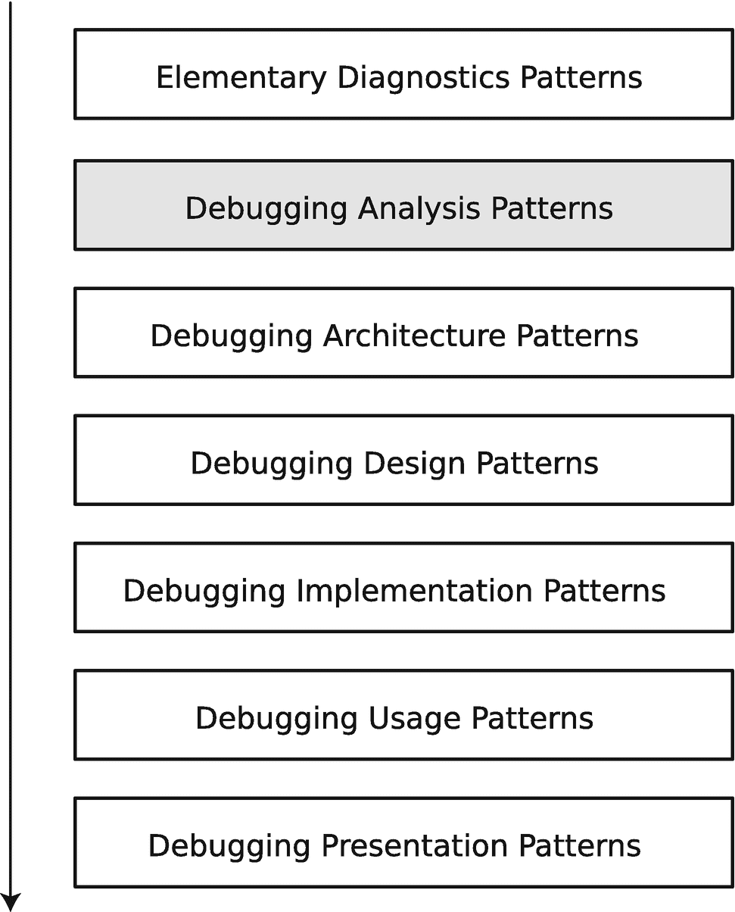

# 4. 调试分析模式

在上一章中，你了解了基本诊断模式，这些模式指导你在适当的情况下收集必要的软件执行产物，例如内存转储、跟踪和日志。你分析了这些产物中的诊断指标（信号、迹象和症状），这些指标描述了异常软件结构和行为所对应的问题。我们将常见的、可重复识别的、并附带一组在特定上下文中适用的建议和可能解决方案的问题称为*诊断模式*。

在本章中，你将了解一种模式语言，它包含在特定上下文（即软件诊断领域本身）中识别诊断模式的常用分析技术和方法。这种模式语言独立于特定的调试器、语言或平台，例如**堆栈跟踪收集**，但用于收集和分析信息的调试器命令在 Windows 和 Linux 上可能不同，对于 Python 代码堆栈跟踪和执行 Python 代码的 Python 进程的堆栈跟踪也可能不同。我们将此类分析模式变体称为*分析模式实现*。有许多这样的分析模式^(²²)最初由软件诊断研究所^(²³)开发，它们可以分类成组。你将了解其中最常用的一些。

由于软件诊断先于调试，我们将这些触发调试架构、设计和实现的诊断分析模式称为*调试分析模式*（图 4-1）。



面向模式的调试过程的堆叠框图。从上到下的块依次是：基本诊断、调试分析、调试架构、调试设计、调试实现、调试使用和调试呈现模式。其中“调试分析”被突出显示。

图 4-1

面向模式的调试过程和调试分析模式

## 副文本

此模式的名称借用了文学理论^(²⁴)。在我们的上下文中，它指的是主要软件诊断产物的附加支持材料，例如，显示你的 Python 进程如何与其他进程和文件交互，以及其内存、句柄和 CPU 使用情况的操作系统跟踪和日志。在 Windows 中，它可以是来自 `Process Monitor`^(²⁵) 的日志；在 Linux 中，它是来自 `top`、`pmap`、`strace`、`ltrace` 和 `lsof` 等工具的输出。例如，CPU 线程使用信息在 Linux 进程核心内存转储中不可用，但在 Windows 进程内存转储中可用，正如你将在本章末尾的案例研究中针对**峰值线程**分析模式所看到的那样。

## 状态转储

此模式源于跟踪和日志分析模式^(²⁶)，并且对于 Python 代码的脚本性质特别有用。你可以识别感兴趣的变量和对象，并定期（或在某个感兴趣的函数内部）将其值转储到日志文件中。

## 计数器值

此模式也源于跟踪和日志分析，并且通常与指标监控相关，例如内存消耗大小和 CPU 使用百分比。这些周期性值通常来自**副文本**，但也可能是**状态转储**的一部分。

## 堆栈跟踪模式

第一组堆栈跟踪模式包含最重要的调试分析模式，这些模式与堆栈跟踪（回溯、traceback）相关：

- 堆栈跟踪
- 运行时线程
- 托管堆栈跟踪
- 堆栈跟踪收集
- 堆栈跟踪集合

### 堆栈跟踪

在 Python 参考实现（CPython）中，代码被编译为字节码，并由 Python 虚拟机执行。该虚拟机拥有自己的函数，这些函数会调用其他函数，包括操作系统 API。在任意时刻，这种函数调用的链条通常被称为堆栈跟踪（`stack trace`）或回溯（`backtrace`）。

**堆栈跟踪** 分析模式涉及从原生调试器（例如 Windows 上的 `WinDbg` 和 Linux 上的 `GDB`）或外部堆栈跟踪采样工具获取此类堆栈跟踪的方法。此模式不限于 Python 代码执行线程；它涵盖 Python 进程中的任何线程，并且可能包括来自内核空间的堆栈跟踪。

### 运行时线程

Python 进程可以是单线程或多线程的。Windows 进程通常比 Linux 进程拥有更多线程。**运行时线程** 分析模式涉及识别与 Python 代码执行（无论是脚本代码还是垃圾回收）直接相关的线程。

### 托管堆栈跟踪

**托管** 这个名称最初来自 Microsoft .NET 托管代码，这些代码被编译为在语言运行时下运行的中间语言。Python 源代码也是如此。无论它是被解释还是直接编译，Python 函数调用的链条构成了其自身的堆栈跟踪。

**托管堆栈跟踪** 分析模式涉及获取此类堆栈跟踪（`traceback`）的方法。通常，当异常发生时，您会从控制台输出或错误日志中捕获它们。然而，脚本可能包含代码，用于定期转储感兴趣方法中的回溯，或通过使用装饰器来实现。清单 4-1 展示了如何使用 `traceback` 模块和装饰器，在调用某个感兴趣的函数时转储堆栈跟踪（另一个示例见第 6 章）。

```
### managed-stack-trace.py
import traceback
def main():
foo()
def foo():
bar()
def managed_stack_trace(func):
def call(*args, **kwargs):
traceback.print_stack()
return func(*args, **kwargs)
return call
@managed_stack_trace
def bar():
print("Hello Traceback!")
if __name__ == "__main__":
main()
清单 4-1
一个用于演示 Traceback 模块用法的脚本
```

当您调用 `bar` 函数时，会得到以下输出：

```
~/Python-Book/Chapter 4$ python3 managed-stack-trace.py
File "managed-stack-trace.py", line 22, in 
main()
File "managed-stack-trace.py", line 6, in main
foo()
File "managed-stack-trace.py", line 9, in foo
bar()
File "managed-stack-trace.py", line 13, in call
traceback.print_stack()
Hello Traceback!
```

如果您不想打印装饰器堆栈跟踪帧（以粗体突出显示），您可以使用 `inspect` 模块来指定回溯的起始帧，如清单 4-2 所示。

```
### managed-stack-trace2.py
import traceback
import inspect
def main():
foo()
def foo():
bar()
def managed_stack_trace(func):
def call(*args, **kwargs):
traceback.print_stack(f=inspect.currentframe().f_back)
return func(*args, **kwargs)
return call
@managed_stack_trace
def bar():
print("Hello Traceback!")
if __name__ == "__main__":
main()
清单 4-2
一个用于演示 Inspect 模块用法的脚本
```

您现在会得到改进后的输出：

```
~/Python-Book/Chapter 4$ python3 managed-stack-trace2.py
File "managed-stack-trace2.py", line 23, in 
main()
File "managed-stack-trace2.py", line 7, in main
foo()
File "managed-stack-trace2.py", line 10, in foo
bar()
Hello Traceback!
```

一些原生调试器，例如 `GDB`，具有扩展功能，可以从核心内存转储或在进行实时原生调试时转储 Python 回溯。您将在本章末尾的案例研究中用到这样一个扩展。

### 源代码堆栈跟踪

Python 的**托管堆栈跟踪**与**源代码堆栈跟踪**是相同的，因为它们都包含文件名和行号。然而，当您从 Python 运行时获得**堆栈跟踪**时，只有使用 Python 解释器的调试版本，它们才可能包含源代码信息。

### 堆栈跟踪收集

**堆栈跟踪收集**分析模式涉及从所有进程线程、多个进程或定期从同一进程获取堆栈跟踪的方法，无论这些线程是否是**运行时线程**。

此模式有不同的变体；例如，获取所有**托管堆栈跟踪**的方法与获取所有非托管**堆栈跟踪**的方法不同。您将在本章末尾的案例研究中看到这一点。

### 堆栈跟踪集合

**堆栈跟踪集合**分析模式涉及从**堆栈跟踪收集**中获取具有某些属性的子集的方法，例如，具有某个公共函数，或者只是一组唯一的、不重复的堆栈跟踪。

## 异常模式

调试中第二重要的分析模式组与异常相关：

*   托管代码异常
*   嵌套异常
*   异常堆栈跟踪
*   软件异常

### 托管代码异常

**托管**这个名称也来自 Microsoft .NET，就像在**托管堆栈跟踪**分析模式中一样。这些是来自 Python 代码的异常，并且它们有关联的回溯。

### 嵌套异常

**嵌套异常**分析模式处理的是处理异常的代码引发新异常的情况。当捕获到后一个异常时，其数据也会链接到原始异常，如清单 4-3 所示。

```
### nested-exception.py
def main():
foo()
def foo():
bar()
def bar():
try:
raise Exception("Inner Exception")
except Exception:
raise Exception("Outer Exception")
if __name__ == "__main__":
main()
清单 4-3
一个用于演示嵌套异常的脚本
```

当您运行该脚本时，会得到以下输出：

```
~/Python-Book/Chapter 4$ python3 nested-exception.py
Traceback (most recent call last):
File "nested-exception.py", line 11, in bar
raise Exception("Inner Exception")
Exception: Inner Exception
```

在处理上述异常期间，发生了另一个异常：

```
Traceback (most recent call last):
File "nested-exception.py", line 16, in 
main()
File "nested-exception.py", line 4, in main
foo()
File "nested-exception.py", line 7, in foo
bar()
File "nested-exception.py", line 13, in bar
raise Exception("Outer Exception")
Exception: Outer Exception
```

### 异常堆栈跟踪

当您遇到异常时，您希望获取其**异常堆栈跟踪**以分析函数调用的序列。一个**托管代码异常**拥有一个**托管堆栈跟踪**，并且根据工件类型，可能可以提取出非托管的运行时**堆栈跟踪**。

### 软件异常

**软件异常**分析模式是一个通用的分析模式，描述了来自 Python 代码或 Python 运行时，以及来自与非 Python 模块和操作系统 API 库的接口的各种非硬件异常。

## 模块模式

在讨论模块时，需要区分 Python 模块和传统操作系统模块。Python 模块可以是单个文件，也可以是包中的文件集合。操作系统模块通常是一个导出 API 并动态链接到可执行文件的共享库，例如 `.DLL` 文件（Windows）或 `.so` 文件（Linux）。

### 模块集合

**模块集合**分析模式描述了如何在某个时间点（例如发生异常时）获取 Python 程序的所有已导入模块。清单 4-4 展示了如何实现这一点。

```
### module-collection.py
import math
import mymodule
def main():
foo()
def foo():
bar()
def bar():
mymodule.myfunc()
math.sqrt(-1)
if __name__ == "__main__":
try:
main()
except:
import sys
for name in sys.modules:
print(f"{sys.modules[name]}")
### mymodule.py
import random
def myfunc():
random.seed()
清单 4-4
用于演示模块集合的脚本
```

如果运行该脚本，你将获得已导入模块的列表，其中包括由已导入模块导入的模块及其位置：

```
~/Python-Book/Chapter 4$ python3 module-collection.py
```

对于可执行程序，模块集合通常是所有已加载 DLL 或共享库的集合。当你分析与非 Python 模块以及使用 `WinDbg` 和 `GDB` 等调试器与操作系统交互相关的问题时，你将学习如何获取此信息。

### 非我版本

此模式的名称源于 Sysinternals 工具 `NotMyFault`^(²⁷)，该工具用于在 Windows 平台上模拟崩溃、挂起和泄漏。在查看**模块集合**信息时，你可能会发现模块或包的版本并非你预期的版本。

### 异常模块

**托管代码异常**发生在某个**异常模块**的函数中。异常分析通常从该模块的函数开始。

### 起源模块

在查看**异常模块**之后，让我们沿着**堆栈跟踪**或**托管堆栈跟踪**中的函数调用链向下查找，以找出问题可能起源的**起源模块**。

## 线程模式

大量调试分析模式都与执行线程有关。堆栈跟踪通常与某个线程相关。从 Python 语言源代码的角度来看，大多数 Python 程序都是单线程的，但操作系统或第三方库可能会在同一 Python 进程中创建其他线程。

### 峰值线程

**峰值线程**分析模式处理的是当存在显著 CPU 消耗时，你想要识别相关线程及其**堆栈跟踪**的问题情况。**副文本**可能在此处提供额外的操作系统数据来提供帮助。

### 活跃线程

如果你查看某个随机进程及其一个线程，你会看到它处于休眠或等待状态。这是因为有数十个（在多用户系统上有数百个）进程和数百个（在多用户系统上有数千个）线程（尤其是在 Windows 上），而只有少数 CPU 可以同时执行线程。因此，**活跃线程**的存在是不寻常的，可能会触发进一步调查。这样的线程可能不是**峰值线程**，并且可能是一种临时活动。

### 阻塞线程

大多数线程不是**活跃线程**，这应该是正常的。然而，某些线程可能会作为**阻塞线程**引起你的注意，它们正在等待进程间通信、同步锁、文件和套接字 I/O。在后续章节中，当你研究与操作系统交互相关的问题时，你将看到一些示例。

### 阻塞模块

此分析模式应属于模块模式类别，但我在此提及它，因为在识别出**阻塞线程**并查看其（**托管**）**堆栈跟踪**后，你可以找到阻塞代码所在的**阻塞模块**，甚至可以找出所有阻塞行为起源的**起源模块**。

## 同步模式

这组模式涉及等待同步对象（如锁、互斥量、事件和临界区）的线程。

### 等待链

一个**阻塞线程**可能正在等待另一个线程或由其他线程拥有的同步对象，而该线程也可能在等待。这种等待活动构成了所谓的**等待链**。

### 死锁

当**等待链**是循环的时，我们称之为**死锁**。最简单的情况是两个进程或线程相互等待：线程 #1 持有一个锁，并正在等待线程 #2 持有的另一个锁，而线程 #2 正在等待线程 #1 持有的锁。

### 活锁

**活锁**是一种**死锁**，但线程只是周期性等待，可能是由于短暂的等待超时，或者仅仅因为它们是**活跃线程**。

## 内存消耗模式

最后，让我们来看看内存消耗。存在不同类型的内存：进程堆、虚拟内存、物理内存和内核池。

### 内存泄漏

**内存泄漏**分析模式处理的是诊断内存消耗逐渐增加的问题。在这里，定期内存转储、跟踪和日志记录可能有助于识别内存使用模式，例如分配、释放的**堆栈跟踪**及其相对比率。你将在第 5 章中调试一个内存泄漏示例。

### 句柄泄漏

句柄（或描述符或 ID）是某种资源的数字表示，无论是进程、线程、文件还是操作系统资源。代码应在使用后将其关闭，但由于某些代码缺陷而未这样做。**句柄泄漏**与**内存泄漏**密切相关，因为句柄指向内存中的结构，忘记关闭不会释放或释放相关的动态内存（通常在内核空间中）。

### 案例研究

为了说明几种调试分析模式，请在 Linux 上执行代码清单 4-5 中的代码。

```

### spiking-thread.py
import time
import threading
import math
def thread_func(spike):
foo(spike)
def main():
threads: list[threading.Thread] = []
threads.append(threading.Thread(target=thread_func, args=[False]))
threads.append(threading.Thread(target=thread_func, args=[True]))
threads.append(threading.Thread(target=thread_func, args=[False]))
for thread in threads:
thread.start()
for thread in threads:
thread.join()
def foo(spike):
bar(spike)
def bar(spike):
while True:
if spike:
math.sqrt(2);
else:
time.sleep(1)
if __name__ == "__main__":
main()
代码清单 4-5
用于说明几种调试分析模式的脚本
```

运行该脚本并等待几分钟。执行 `top` 命令时，你会看到一个**尖峰线程**消耗大量 CPU 时间：

```
~/Python-Book/Chapter 4$ ps
PID TTY          TIME CMD
162082 pts/0    00:00:00 bash
163195 pts/0    00:52:51 python3
164966 pts/0    00:00:00 ps
~/Python-Book/Chapter 4$ ps -T
PID    SPID TTY          TIME CMD
162082  162082 pts/0    00:00:00 bash
163195  163195 pts/0    00:00:00 python3
163195  163197 pts/0    00:00:00 python3
163195  163198 pts/0    00:53:19 python3
163195  163199 pts/0    00:00:00 python3
165070  165070 pts/0    00:00:00 ps
~/Python-Book/Chapter 4$ top -H -p 163195
top - 14:20:55 up 14 days,  3:30,  0 users,  load average: 1.00, 1.04, 1.04
Threads:   4 total,   1 running,   3 sleeping,   0 stopped,   0 zombie
%Cpu(s): 50.7 us,  0.4 sy,  0.0 ni, 48.7 id,  0.0 wa,  0.0 hi,  0.2 si,  0.0 st
MiB Mem :  11940.2 total,   8176.1 free,    729.2 used,   3035.0 buff/cache
MiB Swap:      0.0 total,      0.0 free,      0.0 used.  10996.1 avail Mem
PID USER      PR   NI  VIRT    RES     SHR S   %CPU   %MEM     TIME+ COMMAND
163198 ubuntu    20   0   236060  11084   7596 R  99.6   0.1  56:46.22 python3
163195 ubuntu    20   0   236060  11084   7596 S   0.0   0.1   0:00.15 python3
163197 ubuntu    20   0   236060  11084   7596 S   0.0   0.1   0:00.13 python3
163199 ubuntu    20   0   236060  11084   7596 S   0.0   0.1   0:00.10 python3
```

请注意，**尖峰线程**的 ID 是 `163198`。

现在，你可以将 GDB 附加到正在运行的进程，或者使用 `gcore` 工具保存进程核心内存转储。我们采用第二种方法。如果你的 Linux 机器上没有这些工具，则需要为本案例研究安装它们。在我们的 Ubuntu AArch64 云实例上，以下命令安装了这两个工具：

```
~/Python-Book/Chapter 4$ sudo apt install gdb
```

然后保存一个核心转储，用于后续的内存转储分析：

```
~/Python-Book/Chapter 4$ sudo gcore 163195
[New LWP 163197]
[New LWP 163198]
[New LWP 163199]
[Thread debugging using libthread_db enabled]
Using host libthread_db library "/lib/aarch64-linux-gnu/libthread_db.so.1".
0x0000ffffbe76b268 in do_futex_wait.constprop () from /lib/aarch64-linux-gnu/libpthread.so.0
warning: target file /proc/163195/cmdline contained unexpected null characters
Saved corefile core.163195
[Inferior 1 (process 163195) detached]
~/Python-Book/Chapter 4$ ls -l
total 232444
-rw-r--r-- 1 root   root   238014728 Jul  8 15:51 core.163195
-rw-rw-r-- 1 ubuntu ubuntu       667 Jul  8 13:08 spiking-thread.py
```

为了分析各种管理模式，你还需要安装 Python 调试包（如果你使用的是 Red Hat 发行版，请查阅这篇文章^((28))）：

```
~/Python-Book/Chapter 4$ sudo apt install python3-dbg
```

现在将保存的内存转储加载到 GDB 中，并指定 Python 可执行文件作为符号源：

```
~/Python-Book/Chapter 4$ which python3
/usr/bin/python3
~/Python-Book/Chapter 4$ gdb -c core.163195 -se /usr/bin/python3
GNU gdb (Ubuntu 9.2-0ubuntu1~20.04.1) 9.2
Copyright (C) 2020 Free Software Foundation, Inc.
License GPLv3+: GNU GPL version 3 or later 
This is free software: you are free to change and redistribute it.
There is NO WARRANTY, to the extent permitted by law.
Type "show copying" and "show warranty" for details.
This GDB was configured as "aarch64-linux-gnu".
Type "show configuration" for configuration details.
For bug reporting instructions, please see:
.
Find the GDB manual and other documentation resources online at:
.
For help, type "help".
Type "apropos word" to search for commands related to "word"...
Reading symbols from /usr/bin/python3...
Reading symbols from /usr/lib/debug/.build-id/13/3e34cf1253c9541cfe6e927ef3df6d9ea56f0e.debug...
[New LWP 163195]
[New LWP 163197]
[New LWP 163198]
[New LWP 163199]
[Thread debugging using libthread_db enabled]
Using host libthread_db library "/lib/aarch64-linux-gnu/libthread_db.so.1".
Core was generated by `python3'.
#0  futex_abstimed_wait_cancelable (private=0, abstime=0x0, clockid=0, expected=0, futex_word=0xffffb8000b60)
at ../sysdeps/nptl/futex-internal.h:320
320     ../sysdeps/nptl/futex-internal.h: No such file or directory.
[Current thread is 1 (Thread 0xffffbe91f010 (LWP 163195))]
(gdb)
```

要获取当前线程的**堆栈跟踪**，可以使用 `bt` 命令（使用选项减少每个帧函数参数的输出），这也是 Python **运行时线程**和**源码堆栈跟踪**的一个示例，因为 Python 可执行文件的调试符号信息也是可用的。

```(gdb) thread
[当前线程为 1 (线程 0xffffbe91f010 (LWP 163195))]
(gdb) bt -frame-arguments none
#0  futex_abstimed_wait_cancelable (private=..., abstime=..., clockid=..., expected=..., futex_word=...) 位于 ../sysdeps/nptl/futex-internal.h:320
#1  do_futex_wait (sem=..., abstime=..., clockid=...) 位于 sem_waitcommon.c:112
#2  0x0000ffffbe76b39c 位于 __new_sem_wait_slow (sem=..., abstime=..., clockid=...) 位于 sem_waitcommon.c:184
#3  0x0000ffffbe76b43c 位于 __new_sem_wait (sem=...) 位于 sem_wait.c:42
#4  0x00000000004d3150 位于 PyThread_acquire_lock_timed (lock=..., microseconds=..., intr_flag=...) 位于 ../Python/thread_pthread.h:471
#5  0x00000000004b78f4 位于 acquire_timed (timeout=..., lock=...) 位于 ../Modules/_threadmodule.c:63
#6  lock_PyThread_acquire_lock (self=..., args=..., kwds=...) 位于 ../Modules/_threadmodule.c:146
#7  0x000000000048be84 位于 method_vectorcall_VARARGS_KEYWORDS (func=..., args=..., nargsf=..., kwnames=...) 位于 ../Objects/descrobject.c:332
#8  0x00000000004fe444 位于 _PyObject_Vectorcall (kwnames=..., nargsf=..., args=..., callable=...) 位于 ../Include/cpython/abstract.h:127
#9  call_function (kwnames=..., oparg=..., pp_stack=..., tstate=...) 位于 ../Python/ceval.c:4963
#10 _PyEval_EvalFrameDefault (f=..., throwflag=...) 位于 ../Python/ceval.c:3486
#11 0x00000000004fc604 位于 PyEval_EvalFrameEx (throwflag=..., f=...) 位于 ../Python/ceval.c:741
#12 _PyEval_EvalCodeWithName (_co=..., globals=..., locals=..., args=..., argcount=..., kwnames=..., kwargs=..., kwcount=..., kwstep=..., defs=...,
defcount=..., kwdefs=..., closure=..., name=..., qualname=...) 位于 ../Python/ceval.c:4298
#13 0x000000000059693c 位于 _PyFunction_Vectorcall (func=..., stack=..., nargsf=..., kwnames=...) 位于 ../Objects/call.c:428
#14 0x00000000004fe444 位于 _PyObject_Vectorcall (kwnames=..., nargsf=..., args=..., callable=...) 位于 ../Include/cpython/abstract.h:127
#15 call_function (kwnames=..., oparg=..., pp_stack=..., tstate=...) 位于 ../Python/ceval.c:4963
#16 _PyEval_EvalFrameDefault (f=..., throwflag=...) 位于 ../Python/ceval.c:3486
#17 0x00000000004fc604 位于 PyEval_EvalFrameEx (throwflag=..., f=...) 位于 ../Python/ceval.c:741
#18 _PyEval_EvalCodeWithName (_co=..., globals=..., locals=..., args=..., argcount=..., kwnames=..., kwargs=..., kwcount=..., kwstep=..., defs=...,
defcount=..., kwdefs=..., closure=..., name=..., qualname=...) 位于 ../Python/ceval.c:4298
#19 0x000000000059693c 位于 _PyFunction_Vectorcall (func=..., stack=..., nargsf=..., kwnames=...) 位于 ../Objects/call.c:428
#20 0x00000000004fe444 位于 _PyObject_Vectorcall (kwnames=..., nargsf=..., args=..., callable=...) 位于 ../Include/cpython/abstract.h:127
#21 call_function (kwnames=..., oparg=..., pp_stack=..., tstate=...) 位于 ../Python/ceval.c:4963
#22 _PyEval_EvalFrameDefault (f=..., throwflag=...) 位于 ../Python/ceval.c:3486
#23 0x0000000000596748 位于 PyEval_EvalFrameEx (throwflag=..., f=...) 位于 ../Python/ceval.c:741
#24 function_code_fastcall (globals=..., nargs=..., args=..., co=...) 位于 ../Objects/call.c:284
#25 _PyFunction_Vectorcall (func=..., stack=..., nargsf=..., kwnames=...) 位于 ../Objects/call.c:411
#26 0x00000000004fe31c 位于 _PyObject_Vectorcall (kwnames=..., nargsf=..., args=..., callable=...) 位于 ../Include/cpython/abstract.h:127
#27 call_function (kwnames=..., oparg=..., pp_stack=..., tstate=...) 位于 ../Python/ceval.c:4963
#28 _PyEval_EvalFrameDefault (f=..., throwflag=...) 位于 ../Python/ceval.c:3500
#29 0x00000000004fc604 位于 PyEval_EvalFrameEx (throwflag=..., f=...) 位于 ../Python/ceval.c:741
--类型 <return> 查看更多内容，q 退出，c 继续而不分页--
#30 _PyEval_EvalCodeWithName (_co=..., globals=..., locals=..., args=..., argcount=..., kwnames=..., kwargs=..., kwcount=..., kwstep=..., defs=...,
defcount=..., kwdefs=..., closure=..., name=..., qualname=...) 位于 ../Python/ceval.c:4298
#31 0x00000000006629f0 位于 PyEval_EvalCodeEx (closure=..., kwdefs=..., defcount=..., defs=..., kwcount=..., kws=..., argcount=..., args=...,
locals=..., globals=..., _co=...) 位于 ../Python/ceval.c:4327
#32 PyEval_EvalCode (co=..., globals=..., locals=...) 位于 ../Python/ceval.c:718
#33 0x000000000064eac0 位于 run_eval_code_obj (co=..., globals=..., locals=...) 位于 ../Python/pythonrun.c:1166
#34 0x000000000064eb8c 位于 run_mod (mod=..., filename=..., globals=..., locals=..., flags=..., arena=...) 位于 ../Python/pythonrun.c:1188
#35 0x000000000064ec84 位于 pyrun_file (fp=..., filename=..., start=..., globals=..., locals=..., closeit=..., flags=...)
位于 ../Python/pythonrun.c:1085
#36 0x000000000064f098 位于 pyrun_simple_file (flags=..., closeit=..., filename=..., fp=...) 位于 ../Python/pythonrun.c:439
#37 PyRun_SimpleFileExFlags (fp=..., filename=..., closeit=..., flags=...) 位于 ../Python/pythonrun.c:472
#38 0x000000000069cdfc 位于 pymain_run_file (cf=..., config=...) 位于 ../Modules/main.c:385
#39 pymain_run_python (exitcode=...) 位于 ../Modules/main.c:610
#40 Py_RunMain () 位于 ../Modules/main.c:689
#41 0x000000000069d5d0 位于 pymain_main (args=...) 位于 ../Modules/main.c:719
#42 0x000000000069d624 位于 Py_BytesMain (argc=..., argv=...) 位于 ../Modules/main.c:743
#43 0x0000ffffbe7abe10 位于 __libc_start_main (main=..., argc=..., argv=..., init=..., fini=..., rtld_fini=..., stack_end=...)
位于 ../csu/libc-start.c:308
#44 0x000000000059bb68 位于 _start () 位于 ../Objects/abstract.c:17
回溯已停止：前一帧与此帧相同（栈可能已损坏？）
```

要获取当前线程的**托管堆栈跟踪**，可以使用 `py-bt` 命令：

```
(gdb) py-bt
Traceback (most recent call first):
File "/usr/lib/python3.8/threading.py", line 1027, in _wait_for_tstate_lock
elif lock.acquire(block, timeout):
File "/usr/lib/python3.8/threading.py", line 1011, in join
self._wait_for_tstate_lock()
File "spiking-thread.py", line 20, in main
thread.join()
File "spiking-thread.py", line 33, in 
main()
```

要检查可用的线程，可以使用 `info threads` 命令：

```
(gdb) info threads
Id   Target Id                          Frame
* 1    Thread 0xffffbe91f010 (LWP 163195) futex_abstimed_wait_cancelable (private=0, abstime=0x0, clockid=0, expected=0, futex_word=0xffffb8000b60)
at ../sysdeps/nptl/futex-internal.h:320
2    Thread 0xffffbe0a81e0 (LWP 163197) 0x0000ffffbe855620 in __GI___select (nfds=nfds@entry=0, readfds=readfds@entry=0x0,
writefds=writefds@entry=0x0, exceptfds=exceptfds@entry=0x0, timeout=timeout@entry=0xffffbe0a6a80) at ../sysdeps/unix/sysv/linux/select.c:53
3    Thread 0xffffbd8a71e0 (LWP 163198) 0x000000000057d758 in PyLong_AsDouble (v=2) at ../Objects/longobject.c:3043
4    Thread 0xffffbd0a61e0 (LWP 163199) 0x0000ffffbe855620 in __GI___select (nfds=nfds@entry=0, readfds=readfds@entry=0x0,
writefds=writefds@entry=0x0, exceptfds=exceptfds@entry=0x0, timeout=timeout@entry=0xffffbd0a4a80) at ../sysdeps/unix/sysv/linux/select.c:53
```

你可以看到，来自 `top` 命令的 **Paratext** 输出中，尖峰线程 `163198` 对应的是线程 #3。你可以切换到该线程并检查其**托管堆栈跟踪**：

```
(gdb) thread 3
[Switching to thread 3 (Thread 0xffffbd8a71e0 (LWP 163198))]
#0  0x000000000057d758 in PyLong_AsDouble (v=2) at ../Objects/longobject.c:3043
3043    ../Objects/longobject.c: No such file or directory.
(gdb) py-bt
Traceback (most recent call first):

File "spiking-thread.py", line 28, in bar
math.sqrt(2);
File "spiking-thread.py", line 23, in foo
bar(spike)
File "spiking-thread.py", line 8, in thread_func
foo(spike)
File "/usr/lib/python3.8/threading.py", line 870, in run
self._target(*self._args, **self._kwargs)
File "/usr/lib/python3.8/threading.py", line 932, in _bootstrap_inner
self.run()
File "/usr/lib/python3.8/threading.py", line 890, in _bootstrap
self._bootstrap_inner()
```

你还会发现这个线程是一个**活动线程**，因为它既没有等待也没有休眠。你可以使用 `py-list` 命令显示 Python 源代码，并使用 `py-up` 和 `py-down` 命令在回溯帧之间导航。你还可以使用 `py-locals` 命令检查当前帧的函数参数和局部变量，以及使用 `py-print` 命令检查任何全局变量（你需要位于某个 Python 帧中才能执行此操作）。

```
(gdb) py-list
23        bar(spike)

25    def bar(spike):
26        while True:
27            if spike:
>28                math.sqrt(2);
29            else:
30                time.sleep(1)

32    if __name__ == "__main__":
33        main()
(gdb) py-local
Unable to read information on python frame
(gdb) py-down
#10 Frame 0xffffbe1226c0, for file spiking-thread.py, line 28, in bar (spike=True)
math.sqrt(2);
(gdb) py-locals
spike = True
(gdb) py-print __file__
global '__file__' = 'spiking-thread.py'
(gdb) py-print __name__
global '__name__' = '__main__'
```

检查其他线程以查看是否存在异常也是一个好习惯。要查看（托管）**堆栈跟踪集合**，可以使用以下命令（为清晰起见，我删除了部分输出）：

```
(gdb) thread apply all bt
Thread 4 (Thread 0xffffbd0a61e0 (LWP 163199)):
#0  0x0000ffffbe855620 in __GI___select (nfds=nfds@entry=0, readfds=readfds@entry=0x0, writefds=writefds@entry=0x0, exceptfds=exceptfds@entry=0x0, timeout=timeout@entry=0xffffbd0a4a80) at ../sysdeps/unix/sysv/linux/select.c:53
#1  0x00000000005ce6dc in pysleep (secs=) at ../Modules/timemodule.c:1866
#2  time_sleep (self=, obj=) at ../Modules/timemodule.c:338
...
Thread 3 (Thread 0xffffbd8a71e0 (LWP 163198)):
#0  0x000000000057d758 in PyLong_AsDouble (v=2) at ../Objects/longobject.c:3043
#1  0x0000000000572b6c in long_float (v=) at ../Objects/longobject.c:5085
#2  0x000000000069177c in PyFloat_AsDouble (op=2) at ../Objects/floatobject.c:263
#3  0x00000000004adc64 in PyFloat_AsDouble (op=2) at ../Objects/floatobject.c:129
#4  math_1_to_whatever (can_overflow=0, from_double_func=, func=, arg=2) at ../Modules/mathmodule.c:935
#5  math_1 (can_overflow=0, func=, arg=2) at ../Modules/mathmodule.c:1013
#6  math_sqrt (self=, args=2) at ../Modules/mathmodule.c:1209
...
Thread 2 (Thread 0xffffbe0a81e0 (LWP 163197)):
#0  0x0000ffffbe855620 in __GI___select (nfds=nfds@entry=0, readfds=readfds@entry=0x0, writefds=writefds@entry=0x0, exceptfds=exceptfds@entry=0x0, timeout=timeout@entry=0xffffbe0a6a80) at ../sysdeps/unix/sysv/linux/select.c:53
#1  0x00000000005ce6dc in pysleep (secs=) at ../Modules/timemodule.c:1866
#2  time_sleep (self=, obj=) at ../Modules/timemodule.c:338
...
Thread 1 (Thread 0xffffbe91f010 (LWP 163195)):
#0  futex_abstimed_wait_cancelable (private=0, abstime=0x0, clockid=0, expected=0, futex_word=0xffffb8000b60) at ../sysdeps/nptl/futex-internal.h:320
#1  do_futex_wait (sem=sem@entry=0xffffb8000b60, abstime=0x0, clockid=0) at sem_waitcommon.c:112
--Type <RET> for more, q to quit, c to continue without paging--
#2  0x0000ffffbe76b39c in __new_sem_wait_slow (sem=sem@entry=0xffffb8000b60, abstime=0x0, clockid=0) at sem_waitcommon.c:184
(gdb) thread apply all py-bt
Thread 4 (Thread 0xffffbd0a61e0 (LWP 163199)):
Traceback (most recent call first):

File "spiking-thread.py", line 30, in bar
time.sleep(1)
File "spiking-thread.py", line 23, in foo
bar(spike)
File "spiking-thread.py", line 8, in thread_func
foo(spike)
File "/usr/lib/python3.8/threading.py", line 870, in run
self._target(*self._args, **self._kwargs)
File "/usr/lib/python3.8/threading.py", line 932, in _bootstrap_inner
self.run()
File "/usr/lib/python3.8/threading.py", line 890, in _bootstrap
self._bootstrap_inner()
Thread 3 (Thread 0xffffbd8a71e0 (LWP 163198)):
Traceback (most recent call first):

File "spiking-thread.py", line 28, in bar
math.sqrt(2);
File "spiking-thread.py", line 23, in foo
bar(spike)
File "spiking-thread.py", line 8, in thread_func
foo(spike)
File "/usr/lib/python3.8/threading.py", line 870, in run
self._target(*self._args, **self._kwargs)
File "/usr/lib/python3.8/threading.py", line 932, in _bootstrap_inner
self.run()
File "/usr/lib/python3.8/threading.py", line 890, in _bootstrap
self._bootstrap_inner()
--Type <RET> for more, q to quit, c to continue without paging--
Thread 2 (Thread 0xffffbe0a81e0 (LWP 163197)):
Traceback (most recent call first):

File "spiking-thread.py", line 30, in bar
time.sleep(1)
File "spiking-thread.py", line 23, in foo
bar(spike)
File "spiking-thread.py", line 8, in thread_func
foo(spike)
File "/usr/lib/python3.8/threading.py", line 870, in run
self._target(*self._args, **self._kwargs)
File "/usr/lib/python3.8/threading.py", line 932, in _bootstrap_inner
self.run()
File "/usr/lib/python3.8/threading.py", line 890, in _bootstrap
self._bootstrap_inner()
Thread 1 (Thread 0xffffbe91f010 (LWP 163195)):
Traceback (most recent call first):
File "/usr/lib/python3.8/threading.py", line 1027, in _wait_for_tstate_lock
elif lock.acquire(block, timeout):
File "/usr/lib/python3.8/threading.py", line 1011, in join
self._wait_for_tstate_lock()
File "spiking-thread.py", line 20, in main
thread.join()
File "spiking-thread.py", line 33, in 
main()
```

你可以看到，确实所有其他线程都处于休眠状态，而非活跃状态。

你可以进行事后调试会话，因为转储文件可以在程序结束后进行分析；但对于实时调试，你可以将 `GDB` 附加到一个正在运行的进程上，并执行相同的命令，例如：

```
(gdb) q
~/Python-Book/Chapter 4$ sudo gdb -p 163195 -se /usr/bin/python3
GNU gdb (Ubuntu 9.2-0ubuntu1~20.04.1) 9.2
Copyright (C) 2020 Free Software Foundation, Inc.
License GPLv3+: GNU GPL version 3 or later 
This is free software: you are free to change and redistribute it.
There is NO WARRANTY, to the extent permitted by law.
Type "show copying" and "show warranty" for details.
This GDB was configured as "aarch64-linux-gnu".
Type "show configuration" for configuration details.
For bug reporting instructions, please see:
.
Find the GDB manual and other documentation resources online at:
.
For help, type "help".
Type "apropos word" to search for commands related to "word"...
Reading symbols from /usr/bin/python3...
Reading symbols from /usr/lib/debug/.build-id/13/3e34cf1253c9541cfe6e927ef3df6d9ea56f0e.debug...
Attaching to program: /usr/bin/python3, process 163195
[New LWP 163197]
[New LWP 163198]
[New LWP 163199]
[Thread debugging using libthread_db enabled]
Using host libthread_db library "/lib/aarch64-linux-gnu/libthread_db.so.1".
futex_abstimed_wait_cancelable (private=0, abstime=0x0, clockid=0, expected=0, futex_word=0xffffb8000b60) at ../sysdeps/nptl/futex-internal.h:320
320     ../sysdeps/nptl/futex-internal.h: No such file or directory.
(gdb) py-bt
Traceback (most recent call first):
File "/usr/lib/python3.8/threading.py", line 1027, in _wait_for_tstate_lock
elif lock.acquire(block, timeout):
File "/usr/lib/python3.8/threading.py", line 1011, in join
self._wait_for_tstate_lock()
File "spiking-thread.py", line 20, in main
thread.join()
File "spiking-thread.py", line 33, in 
main()
```

# 总结

在本章中，你概述了最常见的调试分析模式，并在一个 Python 案例研究的背景下实践了其中一些模式。在关于 Python 与操作系统交互的章节中，你将看到更多调试分析模式。下一章将探讨 Python 命令行调试器 `pdb` 背景下的调试实现模式。

脚注 1   2   3   4   5   6   7

