# 7. 调试呈现模式

在上一章中，你了解了 Python IDE Visual Studio Code 环境下的调试实现模式。在本章中，你将了解另一种 Python IDE——Jupyter Notebook 和 Lab，并通过一个案例研究介绍更多调试分析技术和实现模式。最后，在比较 Python CLI 和 IDE 之后，你将识别出几种基本的调试呈现模式（图 7-1）。

## Python 调试引擎

现代 Python 调试 IDE 拥有相似的调试引擎；例如，Visual Studio Code 使用 `debugpy`^(³⁴)，它也可以在 CLI 模式下使用，类似于第 5 章中使用的 `pdb` 模块。它还通过监听接口和端口提供远程调试功能，允许调试客户端连接。PyCharm^(³⁵) 使用 `pydevd`^(³⁶)（该模块也与 `debugpy` 捆绑在一起）。Jupyter Notebook 和 Lab^(³⁷) 使用 `ipykernel`^(³⁸) 来访问 IPython^(⁴⁰) 提供的 `ipdb`^(³⁹) 调试功能。

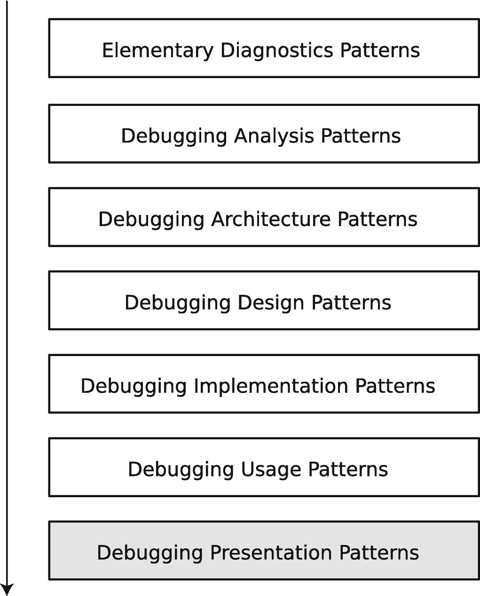

一张截图列出了以下步骤：基础诊断模式、调试分析模式、调试架构模式、调试设计模式、调试实现模式、调试使用模式以及调试呈现模式，其中调试呈现模式被高亮显示。

**图 7-1** 面向模式的调试过程与调试呈现模式

### 案例研究

在本案例研究中，你将使用与上一章类似的 Python 代码，但会将其调整为 Jupyter Notebook 格式（清单 7-1）。请注意，Jupyter Notebook 文件也可以在 Visual Studio Code 中加载和调试。

回顾上一章，该案例研究模拟了我在一个监控脚本中观察到的问题：随着时间的推移，该脚本显示进程内存消耗不断增加。

```
class Processes:
    _singleton = None
    @staticmethod
    def __new__(cls):
        self = Processes._singleton
        if not self:
            Processes._singleton = self = super().__new__(cls)
        return self
    def __init__(self):
        pass
    _procinfo = {}
    def add_process(self, pid, info):
        Processes._procinfo[pid] = info
    def remove_process(self, pid):
        del Processes._procinfo[pid]

class Files:
    def __init__(self):
        self._processes = Processes()
        self._count = 0
    def process_files(self):
        self._count += 1
        if self._count > 25:
            self._processes.add_process(self._count, "")

import time
procs = Processes()
files = Files()
for pid in range (1, 10):
    procs.add_process(pid, "info")
while True:
    pid += 1
    procs.add_process(pid, "info")
    time.sleep(1)
    procs.remove_process(pid)
    time.sleep(1)
    files.process_files()
```

**清单 7-1** 为 Jupyter Notebook 改编的内存泄漏示例

我想你应该熟悉 Jupyter Notebook 环境^(⁴¹)。如果不熟悉，你可以通过一个简单的命令来安装它（本案例研究使用 Windows 系统，Python 3.11.4，并假设你的 Python 环境可以通过 `PATH` 访问）：

```
Chapter7>pip install notebook
...
```

要启动 Jupyter Notebook 环境，请使用以下命令：

```
Chapter7>jupyter notebook
...
[I 2023-08-13 13:45:59.513 ServerApp] Jupyter Server 2.7.0 is running at:
[I 2023-08-13 13:45:59.513 ServerApp] http://localhost:8888/tree?token=2aae60bdf51574972f646f61f27a8bcb5416c08c2a835087
[I 2023-08-13 13:45:59.513 ServerApp]     http://127.0.0.1:8888/tree?token=2aae60bdf51574972f646f61f27a8bcb5416c08c2a835087
[I 2023-08-13 13:45:59.514 ServerApp] Use Control-C to stop this server and shut down all kernels (twice to skip confirmation).
[C 2023-08-13 13:45:59.675 ServerApp]
To access the server, open this file in a browser:
...
Or copy and paste one of these URLs:
http://localhost:8888/tree?token=2aae60bdf51574972f646f61f27a8bcb5416c08c2a835087
...
```

在我们的系统上，浏览器窗口会自动打开，并显示一个文件树窗口（图 7-2）。选择 `process-monitoring.ipynb` 文件并打开它。一个新的浏览器选项卡会打开，其中包含该文件在笔记本单元格中的内容（图 7-3）。要执行任何单元格内容，请使用工具栏或按键盘上的 `<Shift-Enter>` 键。

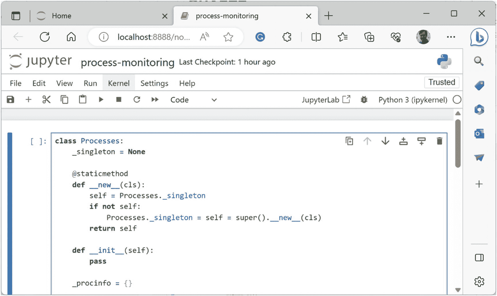

一张浏览器窗口的截图，显示了 Jupyter 环境中内核下的工作区，其中包含来自进程监控文件的程序。

**图 7-3** 已打开文件的 Jupyter Notebook

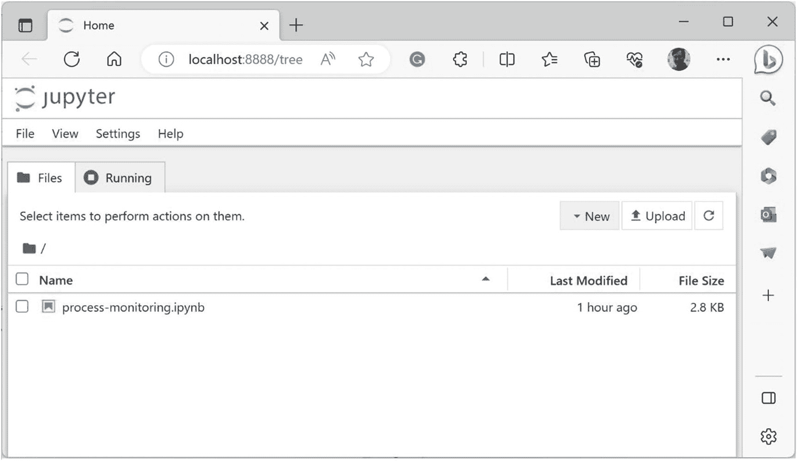

一张浏览器窗口的截图，显示了 Jupyter 应用程序下的文件。文件名为 `process-monitoring.ipynb`，文件大小为 2.8 KB。

**图 7-2** Jupyter Notebook 文件树窗口

现在执行该单元格（图 7-4），等待几分钟，然后从工具栏中断执行（内核）（图 7-5）。请注意，当代码正在执行时，Python 内核指示器右侧的运行指示器会变为实心状态。

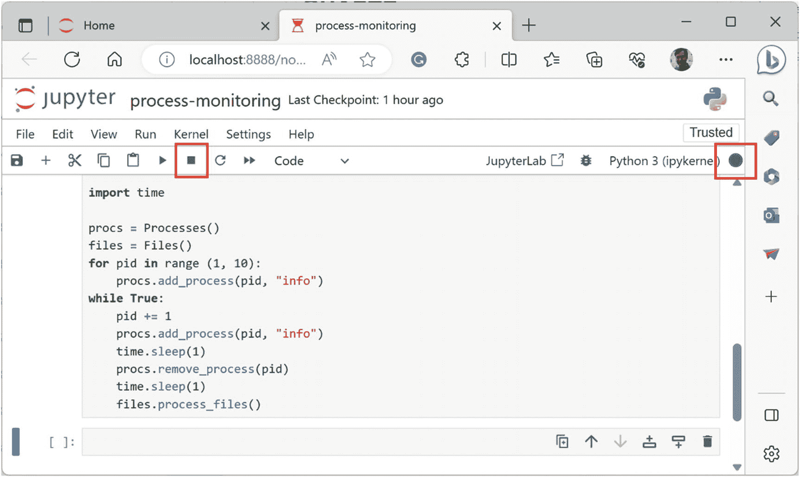

一张浏览器窗口的截图，显示了 Jupyter 环境中内核下的工作区，其中包含来自进程监控文件的程序。工具栏上的中断执行按钮以及右侧表示运行指示器的实心圆圈被高亮显示。

**图 7-5** Jupyter Notebook 中用于停止单元格执行的按钮

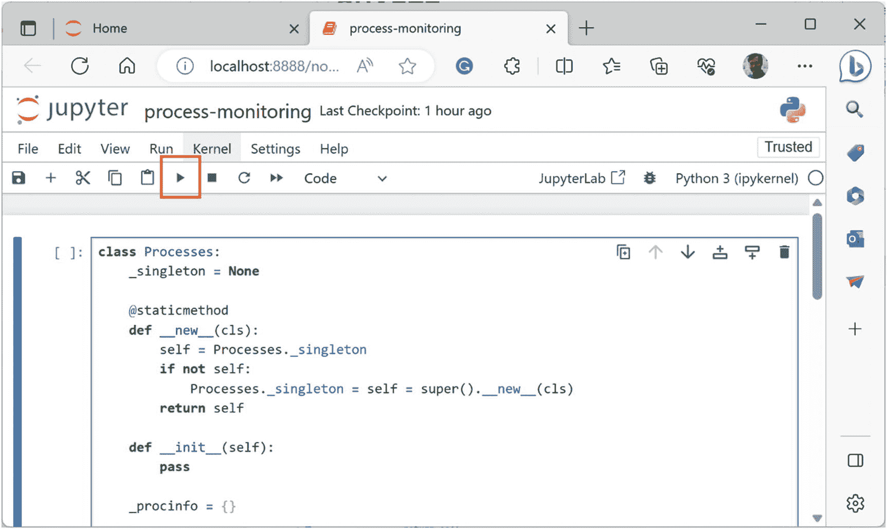

浏览器窗口截图显示了 Jupyter 环境中内核下的工作区，其中包含来自进程监控文件的程序。工具栏上用于执行单元格的右箭头按钮被高亮显示。

**图 7-4** Jupyter Notebook 中执行单元格的按钮

此中断相当于一个 `Break-in`（图 7-6），你可以检查 `Processes._procinfo` 字典大小的 `Variable Value`（图 7-7）。

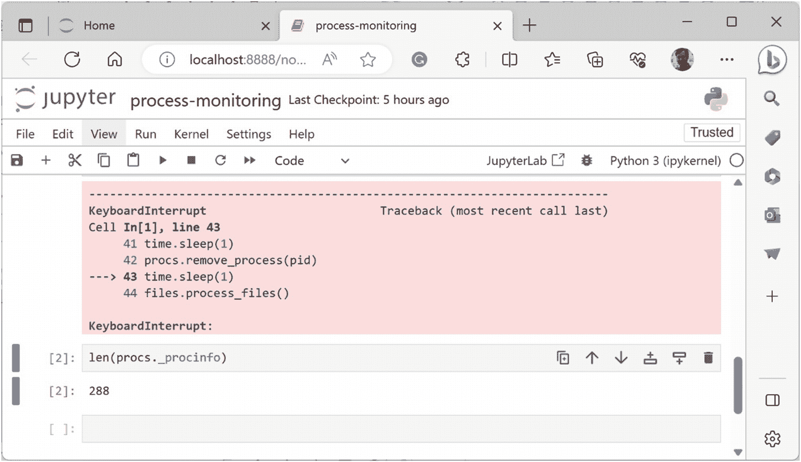

Jupyter 环境窗口截图显示了内核下的工作区，其中包含键盘中断下的一个 4 行代码块，以及一个指向某行的箭头。下方的值显示为：Processes proc info 字典的长度，288。

**图 7-7** 检查变量值

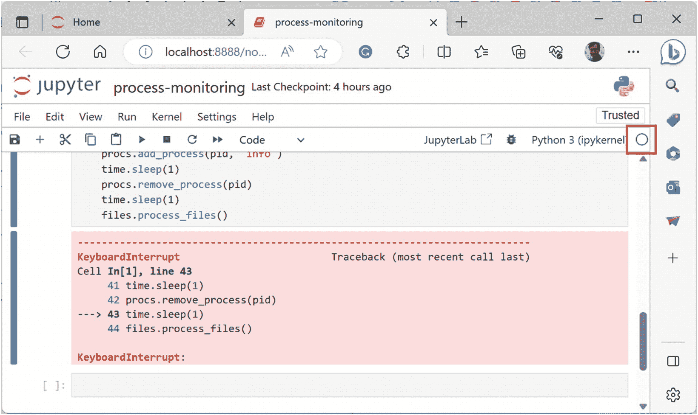

Jupyter 环境窗口截图显示了内核下的工作区，其中包含来自进程监控文件的程序。底部有一个键盘中断下的 4 行代码块，一个箭头指向某行代码。右侧工具栏中有一个未填充的圆圈被高亮显示。

**图 7-6** 被中断的单元格

要设置 `Code Breakpoints`，请启用调试功能（图 7-8）。启用调试器会在单元格中添加装订线，你可以在其中放置断点（图 7-9）。

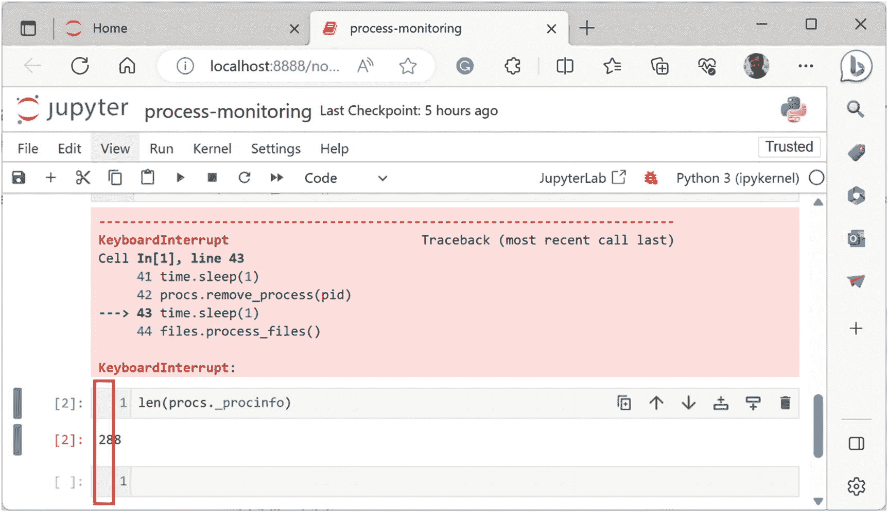

Jupyter 环境窗口截图显示了内核下的工作区，其中包含键盘中断下的一个 4 行代码块，以及一个指向某行的箭头。中断代码块下方，代码行号左侧的装订线被高亮显示。

**图 7-9** 用于开启/关闭断点的装订线

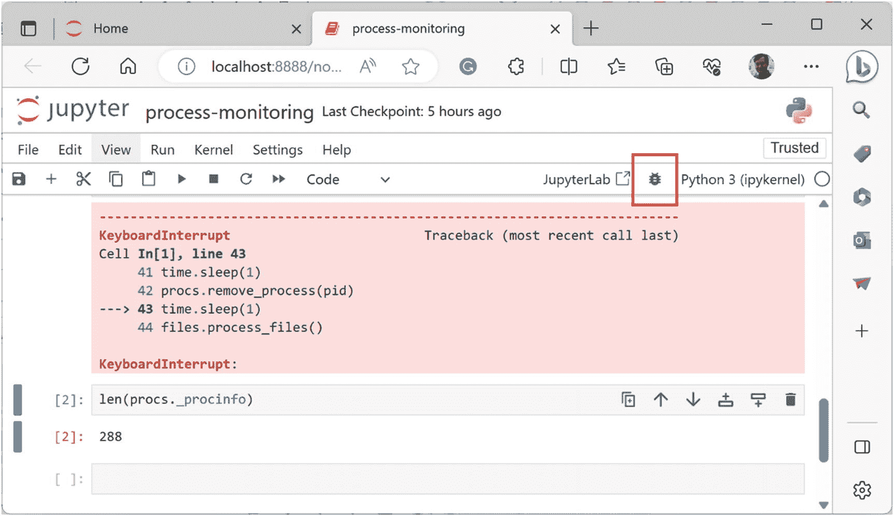

Jupyter 环境窗口截图显示了内核下的工作区，其中包含键盘中断下的一个 4 行代码块，以及一个指向某行的箭头。工具栏上已启用的调试器按钮被高亮显示。

**图 7-8** 启用调试器按钮

现在你可以在装订线中放置两个 `Code Breakpoints`，并通过“视图”菜单项打开调试器面板（图 7-10），在其中你可以看到断点列表、调用堆栈和监视变量。

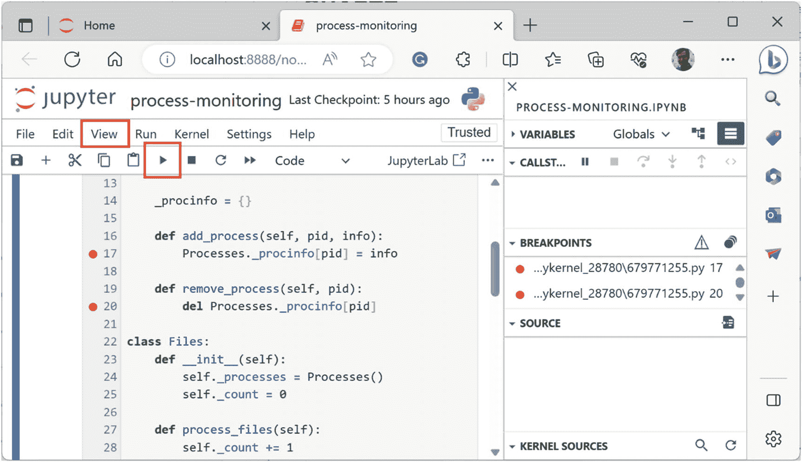

Jupyter 环境窗口截图显示了内核下的工作区，其中包含来自进程监控文件的程序。菜单栏上的“视图”选项卡和工具栏上的单元格执行按钮被高亮显示。断点位于第 17 行和第 20 行，其详细信息显示在右侧。

**图 7-10** 调试器面板

现在继续执行单元格。当命中断点时，你可以看到其调用堆栈（图 7-11）以及全局和局部 `Variable Values`。此时检查它们会发现，启用调试器会重新启动单元格。但一旦命中断点，你可以选择继续或终止。还可以执行通常的“下一步”、“单步进入”和“单步跳出”操作，这些操作都可在调用堆栈面板部分的工具栏上找到。

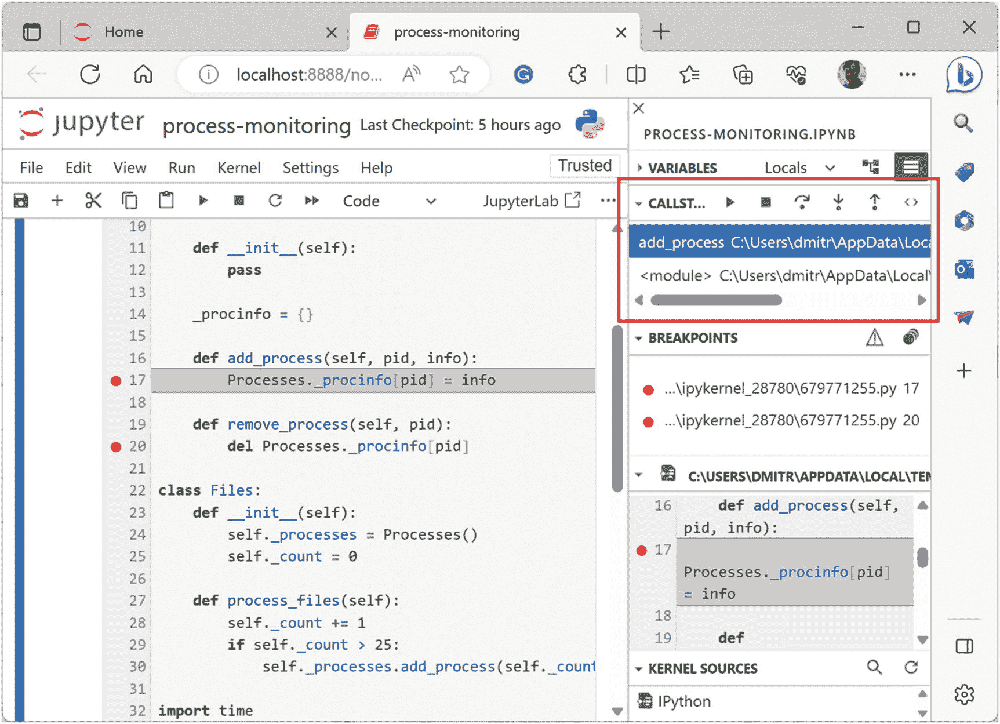

Jupyter 环境窗口截图显示了内核下的工作区，其中包含来自进程监控文件的程序。断点位于第 17 行和第 20 行。右侧面板上的调用列表下拉菜单被高亮显示。

**图 7-11** 命中断点与调用堆栈

现在，让我们探索用于 `Memory Leak` 调试分析和 `Usage Trace` 调试实现模式的垃圾回收^(⁴²)（GC）统计信息和 `tracemalloc` 技术^(⁴³)。

例如，你可以将清单 7-2 中的代码添加到 `while` 循环内部，以检查已分配对象的数量和其他统计信息。

```
import gc
print(len(gc.get_objects()))
print(gc.get_stats())
```

**清单 7-2** 检查已分配对象数量的代码

停止调试会话，清除断点，关闭调试器面板，然后再次执行单元格。从单元格输出中可以看到，在初始下降之后，对象数量稳步增长（图 7-12）。

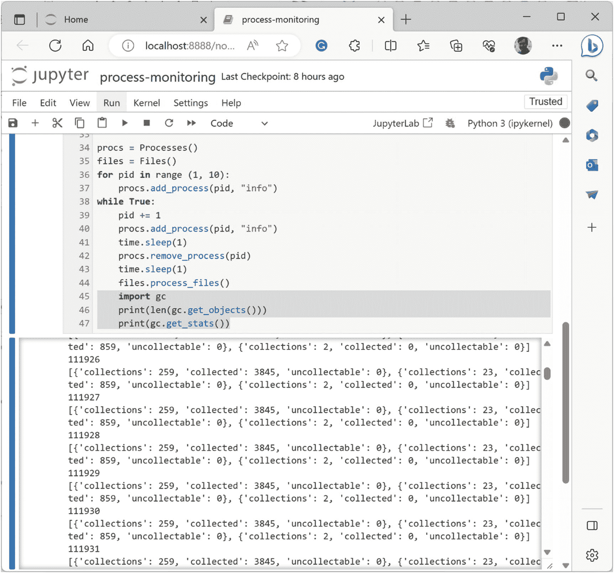

Jupyter 环境窗口截图显示了内核下的工作区，其中包含来自进程监控文件的程序。下方的一个面板显示了对象列表的值，其中包含 collections、collected 和 uncollectable 等关键词。

**图 7-12** 追踪对象数量

`gc` 模块还有其他调试标志，可能在其他场景中有所帮助^(⁴⁴)。

你还可以通过使用 `tracemalloc` 模块并比较分配快照差异，来查看所有额外对象的分配位置。将主脚本代码替换为清单 7-3 中的代码，同时移除 sleep 调用以加快内存泄漏建模速度。

```
procs = Processes()
files = Files()
import tracemalloc
tracemalloc.start()
s1 = tracemalloc.take_snapshot()
for pid in range (1, 10):
procs.add_process(pid, "info")
try:
while True:
pid += 1
procs.add_process(pid, "info")
procs.remove_process(pid)
files.process_files()
except:
s2 = tracemalloc.take_snapshot()
top_user = s2.compare_to(s1, "traceback")[0]
print("\n".join(top_user.traceback.format()))
```

**清单 7-3** 比较分配并打印最顶层 malloc 用户回溯的代码

再次运行单元格，并在几秒后中断它。现在，你不会看到 `KeyboadInterrupt` 异常，而是会看到最顶层的分配及其代码（图 7-13）。

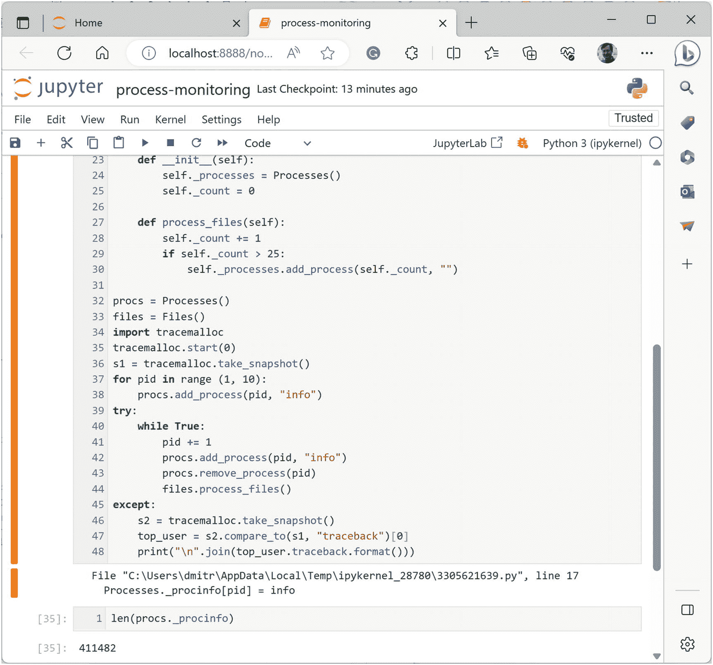

Jupyter 环境窗口截图显示了内核下的工作区，其中包含来自进程监控文件的程序。它显示了一个包含最顶层分配及其代码的工作区。

**图 7-13** 最顶层的分配回溯

如果你转储多个顶层分配而不仅仅是最顶层的一个，就可以得到分配分布。使用这种技术，你可以将正常运行与那些泄漏进程内存的运行进行比较，即所谓的 `Object Distribution Anomaly` 调试分析模式。

有关 `tracemalloc` 模块使用的更多示例，请查阅其详细文档^(⁴⁵)。

## 建议的呈现模式

到目前为止，你已经看到了命令行调试器和可视化调试器。我建议采用以下呈现模式：

- `REPL`：读取、执行、打印循环
- `Breakpoint Toolbar`
- `Action Toolbar`
- `State Dashboard`

这些模式名称的含义应该显而易见。`State Dashboard` 包括用于变量和堆栈跟踪的面板窗口。`REPL` 缩写传统上意为 **读取、求值和打印循环**，但我将求值改为 **执行**，以适用于调试命令。`Action Toolbar` 用于调试会话固有的操作，例如单步执行。`Breakpoint Toolbar` 用于设置和移除断点，并指定其操作。

# 总结

在本章中，你了解了各种集成开发环境（IDE）的调试引擎、一个 Jupyter Notebook 案例研究，以及最常见的调试呈现模式。接下来的两章将介绍调试架构和调试设计模式。

脚注 1 2 3 4 5 6 7 8 9 10 11 12

