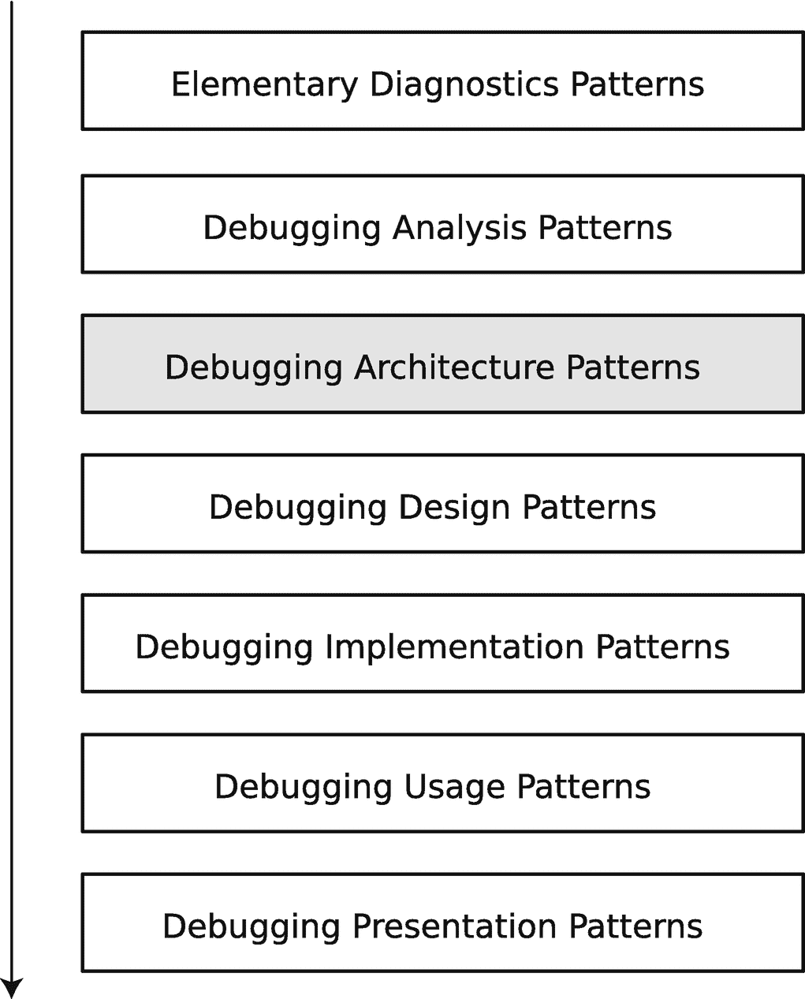

# 8. 调试架构模式

在前两章中，你了解了一些集成开发环境（IDE）和调试呈现模式。现在你已经掌握了足够的背景知识，我可以在本章中介绍调试架构模式（图 8-1）。这些模式是针对如何进行调试这一常见问题的解决方案。这些模式回答了我们在哪里、何时以及如何调试，以及我们基于第 4 章介绍的调试分析模式来调试什么等最重要的问题。诊断和调试“问题”模式语言思维源于内存和跟踪采集模式^((46))。回答这些问题并提出调试策略和方法有多种途径；有时，你甚至可能需要结合不同的方法。然而，在进行任何调试之前，需要做出最重要的决策^((47))，我们将其命名为*调试架构模式*与*调试设计模式*，后者对于特定的架构模式可能有很多种。所有调试架构模式都可以组合起来，形成模式序列和模式网络，以解决软件行为的复杂问题。

一个堆叠框图展示了面向模式的调试过程。这些模块分别是：基础诊断、调试分析、调试架构、调试设计、调试实现、调试使用和调试呈现模式。其中，调试架构被突出显示。

**图 8-1** 面向模式的调试过程与调试架构模式

## “在哪里？”类别

此类调试架构模式回答了调试会话相对于软件执行位置**在哪里**进行的问题。由于云原生应用的分布式特性以及可能存在的访问限制，这一点尤为重要。

### 纸上调试（In Papyro）

某些调试场景可能只需要一块白板（或黑板）来解决问题，而有些场景则因安全限制而无法访问生产环境。此模式名称借用于实验研究^((48))，其中仅使用纸笔进行分析。然而，在现代，这也包括描述、截图以及各种可用于查看和搜索收集数据的工具，例如日志查看器。

### 原位调试（In Vivo）

此（微）生物学^((49))模式名称借用于为概念验证（POC）提出的模式语言^((50))。它意味着你在出现原始问题的环境中进行调试，例如来自特定 Python 虚拟目录的特定运行进程。

### 体外调试（In Vitro）

此模式名称借用于（微）生物学^((51))，在调试架构的上下文中，它意味着你尝试在原始环境之外的环境中重现并调试问题，例如在开发人员的机器上。

### 计算机模拟调试（In Silico）

此模式名称借用于实验科学^((52))，在此上下文中，它意味着你尝试使用某种建模过程或系统来重现并调试问题。例如，如果某个特定库在生产环境中无法工作，你可以创建一个具有相似特性和输入数据的测试环境，在其中运行一个使用该库的小程序，并观察这个玩具软件模型是否抛出相同的错误。

### 原地分析（In Situ）

原地模式^((53))解决了你在**哪里**分析执行产物（如日志）的问题。对于**原地分析**，你将产物保留在其生成的位置，并就地进行分析。此模式也涵盖了使用来自分布式环境（如 Kubernetes）的控制台日志进行调试的示例。

### 异地分析（Ex Situ）

**异地分析**与**原地分析**相反：你将生成的产物从问题环境中移出，以便在另一台计算机上进行离线分析。在云环境中，可观测性日志通常会被传输到某些日志收集服务，以便在必要时进行后续分析。此模式也涵盖了为后续内存泄漏分析而收集的崩溃和挂起内存转储或堆快照，这些分析将在安装了所有必要可视化工具的不同环境中进行。

## “何时？”类别

此类调试架构模式回答了调试会话应该且将**何时**相对于软件执行时间线进行的问题。

### 实时调试（Live）

**实时**调试通常在问题显现之前开始。你可以在调试器下启动程序，或者在你认为问题即将出现或某个操作之后，在某个时刻附加调试器。然后，你等待问题发生，同时定期跟踪执行进度并检查程序状态，例如变量。

### 即时调试（JIT）

即时（**JIT**）调试在问题显现的那一刻开始。例如，运行时环境或操作系统启动调试器，以响应某个信号或异常。

### 事后调试（Postmortem）

**事后**调试在问题显现之后开始，例如在崩溃之后，或者当各种执行产物（如跟踪和日志）生成后，进行**原地分析**或**异地分析**。调试通常以**纸上调试**模式进行，并辅以软件工具，例如用于查看内存转储的调试器和日志查看器。

时间旅行调试^((54))通常融合了**事后调试**和**实时调试**，因为特定操作系统平台上的某些工具可能允许记录程序执行，并在之后通过时间回溯来重放，以进行测试状态修正和不同的执行路径。

## “调试什么？”类别

此类调试架构模式回答了在调试会话期间，你将相对于程序结构**调试什么**的问题。

### 代码

修复**代码**缺陷是调试活动的传统目标。在这里，你通过跟踪源代码行、更改状态以及改变执行路径来以传统方式调试代码。这通常通过使用源代码调试器以及 Python 语言和生态系统的跟踪与日志记录工具来完成。

### 数据

配置或输入数据也可能存在问题，数据调试的目标就是修复此类**数据**缺陷。这对于使用已经过充分调试的库和框架进行机器学习也至关重要。

### 交互

有时，问题不在于代码或数据，而在于软件的不当使用。在这里，可以通过人机交互（HCI）动作记录器或简单的屏幕录制来分析**交互**缺陷。

## “如何”类别

此类调试架构模式回答了关于**如何**在软件执行时间和空间维度上进行调试的问题。

### 软件叙事

**软件叙事**是指不限于跟踪和日志的软件执行产物，还包括源代码以及各种文档和描述。该术语最初源于软件叙事学^(⁵⁵)。当你希望了解软件结构和行为如何随时间变化，但又不关心程序中每个部分的所有状态变化时，可以选择这种架构模式。

### 软件状态

传统的实时调试和事后调试方法会检查程序的状态，例如内存。它们可以随时间监控变量或对象字段的值（实时调试），或在崩溃或挂起时检查内存地址（事后调试）。当你希望一次性分析程序甚至整个系统状态时，可以使用这种**软件状态**架构模式。一个典型例子是依赖多个系统服务的程序，而这些服务又相互依赖并依赖操作系统。在这种情况下，你可能需要获取整个物理内存快照来分析不同的虚拟内存进程空间。

# 总结

本章概述了调试架构模式。在后续章节的案例研究中，你将再次遇到这些模式。下一章将介绍最常见的调试设计模式，这些模式在涉及调试分析、架构和设计的案例研究中，用于细化更通用的调试架构模式。

脚注 1 2 3 4 5 6 7 8 9 10