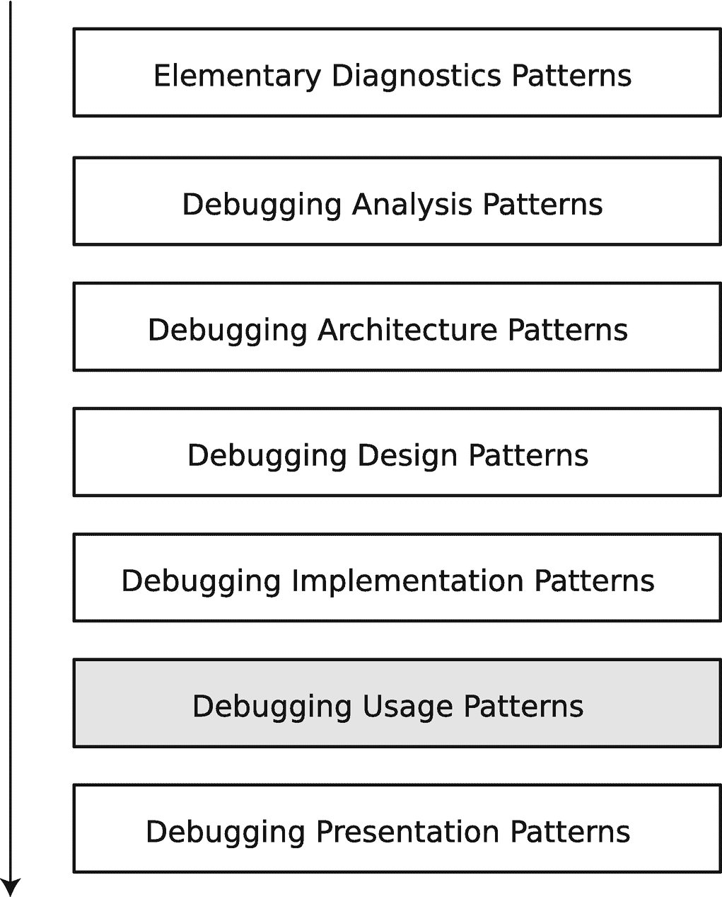

# 10. 调试使用模式

在上一章中，你了解了调试设计模式。在本章中，你将探索最常见的调试使用模式（图 10-1）。



一个堆叠的块状图展示了调试使用模式。这些块分别是：基础诊断、调试分析、调试架构、调试设计、调试实现、调试使用和调试呈现模式。

**图 10-1** 面向模式的调试过程与调试设计模式

这些使用模式关乎调试语用学以及来自其他层的自动化模式。它们积累了在各种操作系统和平台上开发和调试工具与产品的经验。下面我将它们连同简要描述一起列出。

## 精确序列

有时，针对特定调试器、操作系统或调试空间的模式实现，需要精确的命令序列或特定的命令选项才能达到预期效果。不遵循`精确序列`可能会产生意外的副作用，以及错误和具有误导性的命令输出。

典型示例包括：

- 在实时 Windows 或完整内存转储的事后调试中，切换到正确的进程空间并重新加载用户空间符号
- 从线程栈区域转储符号引用

## 脚本化

大多数调试器都支持脚本语言；例如，GDB 支持简单脚本（列表 10-1 和 10-2）和 Python 脚本^(⁶¹)，而 WinDbg 包含原生脚本语言^(⁶²)，同时也支持 JavaScript^(⁶³)。

```
(gdb) source script.txt
(gdb) dpp 0x7ffdf45637f8 10
0x7ffdf45637f8: 0x7ffdf4565756: 0x622f3d4c4c454853
0x7ffdf4563800: 0x7ffdf4565766: 0x544e4f4354534948
0x7ffdf4563808: 0x7ffdf456577d: 0x545349445f4c5357
0x7ffdf4563810: 0x7ffdf4565794: 0x5345443d454d414e
0x7ffdf4563818: 0x7ffdf45657a9: 0x6d6f682f3d445750
0x7ffdf4563820: 0x7ffdf45657c7: 0x3d454d414e474f4c
0x7ffdf4563828: 0x7ffdf45657d8: 0x4944504d545f434d
0x7ffdf4563830: 0x7ffdf45657f3: 0x313d4449535f434d
0x7ffdf4563838: 0x7ffdf45657fe: 0x6f682f3d454d4f48
0x7ffdf4563840: 0x7ffdf4565812: 0x5f6e653d474e414c
列表 10-2
GDB 脚本示例的输出示例
```

```
define dpp
set $i = 0
set $p = $arg0
while $i < $arg1
printf "%p: ", $p
x/ga *(long *)$p
set $i = $i + 1
set $p = $p + 8
end
end
列表 10-1
用于双重内存解引用的简单 GDB 脚本
```

## 调试器扩展

通常，调试器扩展指的是一个 DLL 或共享库，调试器进程可以加载它来提供额外的调试命令或扩展现有命令。GDB 使用 Python 脚本功能来实现 Python 调试扩展^(⁶⁴)，你在第 4 章的案例研究中已经使用过。WinDbg 有许多扩展^(⁶⁵)，并提供了 C/C++ API 来编写它们^(⁶⁶)，但用于调试 Python 的专用第三方扩展不适用于最新的 Python 版本^(⁶⁷)。你将在下一章中使用 WinDbg 扩展来实现原生调试分析模式。

## 抽象命令

有时，在描述或交流调试场景时，通过创建调试领域语言，并使用调试扩展或脚本实现该语言，可以轻松地抽象出不同调试器、其命令以及`精确序列`之间的差异。这种方法在一些内存取证工具中被采用。

## 空间转换

用于调试进程用户空间的调试实现模式名称可以复用于内核或托管空间，尽管它们的实现（例如调试器命令）可能有所不同。一个典型的例子是需要从用户空间线程栈和内核空间线程栈内存区域转储符号引用。

## 提升

问题解决技术可以从其他活动领域借鉴，反之亦然，现有的调试分析和实现模式也可以应用于其他领域，例如调试云原生计算环境^(⁶⁸)。

## 手势

首先，我介绍一些从软件诊断学中改编而来的定义，这些定义最初是在那里提出的^(⁶⁹)。

- 调试动作是一种用户界面动作、一条命令、一种技术、一个调试算法和一个调试模式。
- 工具空间是彼此之间具有一定物理或虚拟（心理、想象）距离的物理和虚拟（数学）工具的集合。
- 调试动作的配置是工具拓扑空间中的一个有向图，或者是范畴论^(⁷⁰)意义上的一个图表。
- 调试手势是跨工具空间和时间的调试动作配置，产生一个诊断动作的工作流。
- 调试超手势是调试手势的“手势”^(⁷¹)，是一种手势到另一种手势的转换，发生在工具集之间，类似于将调试模式从一个平台移植到另一个平台，例如从 Windows 移植到 Linux，或从一个领域移植到另一个领域，例如从日志移植到文本（另请参见上面的`提升`模式）。你可以将调试超手势视为调试手势模式。

“手势”这个比喻源于这样一个事实：尽管近年来有自动化的努力，但当需要大量领域专业知识时，调试过程仍然是手动的。我们仍然使用各种工具，包括图形界面和命令行工具（手部动作），并在网络空间中移动。因此，将所有物理和虚拟移动组合成某种抽象的空间路径是很自然的。这里还涉及调试性能（就实现调试目标而言）和技能储备的问题。调试手势还包括工具即兴发挥、数据探索、动作实验和美学（例如，酷炫感）。一些手势可用于发现进一步的调试模式。

# 总结

本章简要介绍了调试使用模式，即最后一个调试模式类别。在下一章中，你将了解一些涉及 Python 与 Windows 操作系统接口的常见问题，并使用调试扩展来诊断和调试这些问题。

脚注 1 2 3 4 5 6 7 8 9 10 11

