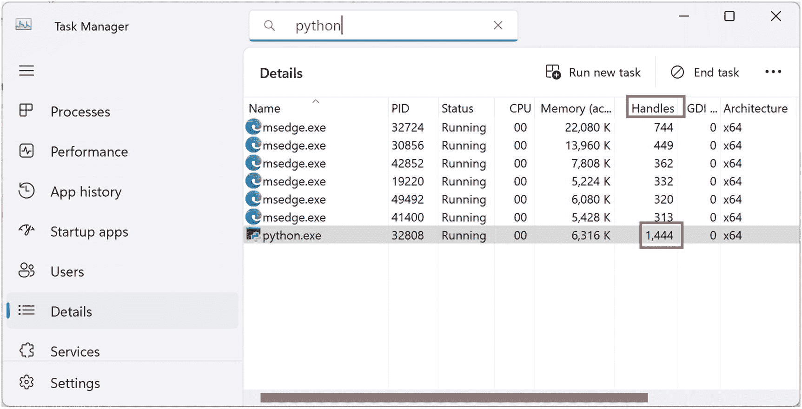
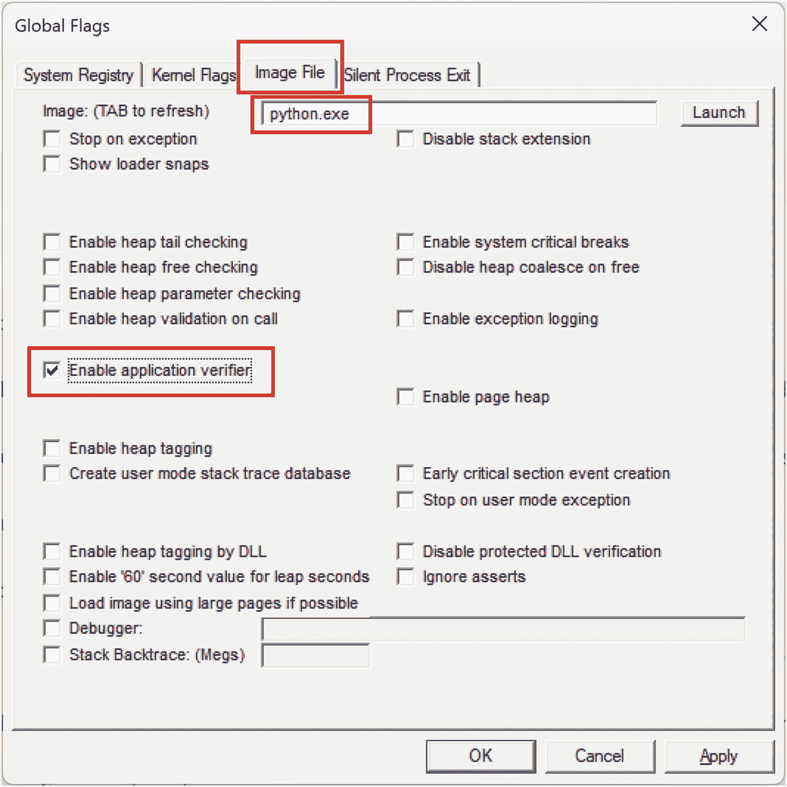

# 11. 案例研究：资源泄漏

在上一章中，你了解了调试使用模式。在本章中，你将使用模式方法来诊断和调试 Windows 操作系统中的一种常见问题类型：资源泄漏。

## 基础诊断

如果你运行 `handle-leak.py` 脚本，你会注意到句柄的**计数器值**持续单调递增（图 11-1）。



任务管理器详细信息页面的截图。它显示了一个表格，表头为名称、PID、状态、CPU、内存、句柄、GDI 和体系结构。`python.exe` 文件的句柄被高亮显示。

**图 11-1** `python.exe` 进程不断增加的句柄数量

你可以右键单击并使用 *创建内存转储文件* 菜单选项保存进程内存转储，以便进行进一步的离线分析。它保存在你的配置文件临时文件夹中（图 11-2）。


收集进程内存转储窗口的截图。显示文件已成功创建及其位置的消息。确定和打开文件位置按钮位于消息下方。

**图 11-2** 已创建的 `python.exe` 进程内存转储

## 调试分析

现在启动 `WinDbg` 调试器并打开保存的内存转储⁷²：

```
Microsoft (R) Windows Debugger Version 10.0.25921.1001 AMD64
Copyright (c) Microsoft Corporation. All rights reserved.
Loading Dump File [C:\Users\dmitr\AppData\Local\Temp\python.DMP]
User Mini Dump File with Full Memory: Only application data is available
************* Path validation summary **************
Response                         Time (ms)     Location
Deferred                                       srv*
Symbol search path is: srv*
Executable search path is:
Windows 10 Version 22621 MP (8 procs) Free x64
Product: WinNt, suite: SingleUserTS
Edition build lab: 22621.1.amd64fre.ni_release.220506-1250
Debug session time: Sun Sep  3 17:02:35.000 2023 (UTC + 1:00)
System Uptime: 6 days 7:55:29.493
Process Uptime: 0 days 0:09:46.000
................
For analysis of this file, run !analyze -v
ntdll!NtWaitForMultipleObjects+0x14:
00007ff8`6f0ef8a4 ret
```

你会注意到有数百个线程和句柄⁷³：

```
0:000> ~
.  0  Id: de58.dc60 Suspend: 0 Teb: 000000d1`724e3000 Unfrozen
1  Id: de58.240c Suspend: 0 Teb: 000000d1`724eb000 Unfrozen
2  Id: de58.ed7c Suspend: 0 Teb: 000000d1`724ed000 Unfrozen
3  Id: de58.d404 Suspend: 0 Teb: 000000d1`724ef000 Unfrozen
4  Id: de58.6f2c Suspend: 0 Teb: 000000d1`724f1000 Unfrozen
5  Id: de58.3e2c Suspend: 0 Teb: 000000d1`724f3000 Unfrozen
6  Id: de58.6684 Suspend: 0 Teb: 000000d1`724f5000 Unfrozen
7  Id: de58.ec74 Suspend: 0 Teb: 000000d1`724f7000 Unfrozen
...
574  Id: de58.2de8 Suspend: 0 Teb: 000000d1`30adf000 Unfrozen
575  Id: de58.79f4 Suspend: 0 Teb: 000000d1`30ae1000 Unfrozen
576  Id: de58.7fdc Suspend: 0 Teb: 000000d1`30ae3000 Unfrozen
577  Id: de58.4f6c Suspend: 0 Teb: 000000d1`30ae5000 Unfrozen
578  Id: de58.b1e8 Suspend: 0 Teb: 000000d1`30ae7000 Unfrozen
579  Id: de58.6658 Suspend: 0 Teb: 000000d1`30ae9000 Unfrozen
580  Id: de58.4ed8 Suspend: 0 Teb: 000000d1`30aeb000 Unfrozen
581  Id: de58.5b8c Suspend: 0 Teb: 000000d1`30aed000 Unfrozen
582  Id: de58.bad8 Suspend: 0 Teb: 000000d1`30aef000 Unfrozen
583  Id: de58.19cc Suspend: 0 Teb: 000000d1`30af1000 Unfrozen
584  Id: de58.ba0 Suspend: 0 Teb: 000000d1`30af3000 Unfrozen
585  Id: de58.cd8c Suspend: 0 Teb: 000000d1`30af5000 Unfrozen
0:000> !handle
Handle 0000000000000004
Type             File
Handle 0000000000000008
Type             Event
Handle 000000000000000c
Type             Event
Handle 0000000000000010
Type             Event
Handle 0000000000000014
Type             WaitCompletionPacket
Handle 0000000000000018
Type             IoCompletion
Handle 000000000000001c
Type             TpWorkerFactory
Handle 0000000000000020
Type             IRTimer
Handle 0000000000000024
Type             WaitCompletionPacket
Handle 0000000000000028
Type             IRTimer
Handle 000000000000002c
...
Handle 0000000000001cc4
Type             IRTimer
Handle 0000000000001cc8
Type             IRTimer
Handle 0000000000001ccc
Type             IRTimer
Handle 0000000000001cd0
Type             IRTimer
Handle 0000000000001cd4
Type             Semaphore
Handle 0000000000001cd8
Type             IRTimer
Handle 0000000000001cdc
Type             IRTimer
1838 Handles
Type                      Count
None                     616
Event                     7
File                      10
Directory                 2
Mutant                    1
Semaphore                1188
Key                       4
IoCompletion              2
TpWorkerFactory           2
ALPC Port                 1
WaitCompletionPacket      5
```

所有线程似乎都是 Python **运行时线程**：

```
0:000> ~585s
ntdll!NtWaitForSingleObject+0x14:
00007ff8`6f0eedd4 ret
0:585> kc

### Call Site
00 ntdll!NtWaitForSingleObject
01 KERNELBASE!WaitForSingleObjectEx
02 python311!pysleep
03 python311!time_sleep
04 python311!_PyEval_EvalFrameDefault
05 python311!_PyEval_EvalFrame
06 python311!_PyEval_Vector
07 python311!_PyFunction_Vectorcall
08 python311!_PyVectorcall_Call
09 python311!_PyObject_Call
0a python311!PyObject_Call
0b python311!do_call_core
0c python311!_PyEval_EvalFrameDefault
0d python311!_PyEval_EvalFrame
0e python311!_PyEval_Vector
0f python311!_PyFunction_Vectorcall
10 python311!_PyObject_VectorcallTstate
11 python311!method_vectorcall
12 python311!_PyVectorcall_Call
13 python311!_PyObject_Call
14 python311!thread_run
15 python311!bootstrap
16 ucrtbase!thread_start
17 kernel32!BaseThreadInitThunk
18 ntdll!RtlUserThreadStart
```

基于这些诊断信息，你可以确认这是一个线程泄漏，并伴有额外的信号量泄漏。

## 调试架构

由于源代码很小（清单 11-1），让我们进行**事后**调试，采用**活体**和**原位**方式（你也可以在另一台机器上**异地**分析内存转储）以及**纸上**方式。模式名称的解释请参见第 8 章。

```
### handle-leak.py
import time
import threading
def thread_func():
foo()
def main():
threads: list[threading.Thread] = []
while True:
thread = threading.Thread(target=thread_func)
threads.append(thread)
thread.start()
time.sleep(1)
def foo():
bar()
def bar():
while True:
time.sleep(1)
if __name__ == "__main__":
main()
```

**清单 11-1** 一个说明句柄泄漏的简单脚本

## 调试实现

在复杂场景中，当你的代码规模更大且可能涉及第三方库时，你可能需要收集句柄的`Usage Trace`来查看是哪个线程创建了它们^(⁷⁴)。对于事后调试，你需要在运行 Python 的计算机上通过 64 位全局标志（`gflags.exe`）启用`应用程序验证器`（图 11-3）。

`gflags` 应用程序是 Windows 调试工具包的一部分，你可以将其作为 WDK 或 SDK^(⁷⁵) 的一部分下载并安装。你也可以将这些工具安装到另一台计算机上，然后将 `gflags.exe` 和 `gflagsui.dll` 复制到需要设置全局标志以进行诊断和调试的计算机上。如果问题计算机无法使用图形界面（例如服务器或 Docker 环境），你可以设置相应的注册表值，就我而言，设置如下：

```
Computer\HKEY_LOCAL_MACHINE\SOFTWARE\Microsoft\Windows NT\CurrentVersion\Image File Execution Options\python.exe
GlobalFlag (REG_DWORD) 0x100 (256)
```

然后，重新运行脚本，并在注意到句柄数量增加后收集新的转储文件。另外，在完成故障排除和调试后，别忘了清除所有标志；某些标志可能会影响性能。

将新的转储文件加载到 `WinDbg` 后，你可以检查标志是否正确启用，并查看句柄分配堆栈跟踪：

```
Microsoft (R) Windows Debugger Version 10.0.25921.1001 AMD64
Copyright (c) Microsoft Corporation. All rights reserved.
Loading Dump File [C:\Users\dmitr\AppData\Local\Temp\python (2).DMP]
User Mini Dump File with Full Memory: Only application data is available
************* Path validation summary **************
Response                         Time (ms)     Location
Deferred                                       srv*
Symbol search path is: srv*
Executable search path is:
Windows 10 Version 22621 MP (8 procs) Free x64
Product: WinNt, suite: SingleUserTS
Edition build lab: 22621.1.amd64fre.ni_release.220506-1250
Debug session time: Sun Sep  3 18:18:44.000 2023 (UTC + 1:00)
System Uptime: 6 days 9:11:38.570
Process Uptime: 0 days 0:05:42.000
.................
For analysis of this file, run !analyze -v
ntdll!NtWaitForMultipleObjects+0x14:
00007ff8`6f0ef8a4 ret
0:000> !gflag
Current NtGlobalFlag contents: 0x02000100
vrf - Enable application verifier
hpa - Place heap allocations at ends of pages
0:000> !htrace
...
Handle = 0x0000000000000ca8 - OPEN
Thread ID = 0x000000000000bed8, Process ID = 0x00000000000083f0
0x00007ff86f0f0624: ntdll!NtCreateThreadEx+0x0000000000000014
0x00007ff86c8aed1f: KERNELBASE!CreateRemoteThreadEx+0x000000000000029f
0x00007ff86c9c708b: KERNELBASE!CreateThread+0x000000000000003b
0x00007ff83627fbff: verifier!AVrfpCreateThread+0x00000000000000cf
0x00007ff86c52838e: ucrtbase!_beginthreadex+0x000000000000005e
0x00007ff805b99512: python311!PyThread_start_new_thread+0x0000000000000086
0x00007ff805b9925c: python311!thread_PyThread_start_new_thread+0x0000000000000110
0x00007ff805ba09e6: python311!_PyObject_MakeTpCall+0x0000000000000736
0x00007ff805ba4548: python311!PyObject_Vectorcall+0x00000000000001e8
0x00007ff805ba5da4: python311!_PyEval_EvalFrameDefault+0x0000000000000784
0x00007ff805bc2f73: python311!_PyEval_Vector+0x0000000000000077
...
Handle = 0x0000000000000d20 - OPEN
Thread ID = 0x000000000000bed8, Process ID = 0x00000000000083f0
0x00007ff86f0f0624: ntdll!NtCreateThreadEx+0x0000000000000014
0x00007ff86c8aed1f: KERNELBASE!CreateRemoteThreadEx+0x000000000000029f
0x00007ff86c9c708b: KERNELBASE!CreateThread+0x000000000000003b
0x00007ff83627fbff: verifier!AVrfpCreateThread+0x00000000000000cf
0x00007ff86c52838e: ucrtbase!_beginthreadex+0x000000000000005e
0x00007ff805b99512: python311!PyThread_start_new_thread+0x0000000000000086
0x00007ff805b9925c: python311!thread_PyThread_start_new_thread+0x0000000000000110
0x00007ff805ba09e6: python311!_PyObject_MakeTpCall+0x0000000000000736
0x00007ff805ba4548: python311!PyObject_Vectorcall+0x00000000000001e8
0x00007ff805ba5da4: python311!_PyEval_EvalFrameDefault+0x0000000000000784
0x00007ff805bc2f73: python311!_PyEval_Vector+0x0000000000000077
...
Handle = 0x0000000000001144 - OPEN
Thread ID = 0x000000000000bed8, Process ID = 0x00000000000083f0
0x00007ff86f0f0624: ntdll!NtCreateThreadEx+0x0000000000000014
0x00007ff86c8aed1f: KERNELBASE!CreateRemoteThreadEx+0x000000000000029f
0x00007ff86c9c708b: KERNELBASE!CreateThread+0x000000000000003b
0x00007ff83627fbff: verifier!AVrfpCreateThread+0x00000000000000cf
0x00007ff86c52838e: ucrtbase!_beginthreadex+0x000000000000005e
0x00007ff805b99512: python311!PyThread_start_new_thread+0x0000000000000086
0x00007ff805b9925c: python311!thread_PyThread_start_new_thread+0x0000000000000110
0x00007ff805ba09e6: python311!_PyObject_MakeTpCall+0x0000000000000736
0x00007ff805ba4548: python311!PyObject_Vectorcall+0x00000000000001e8
0x00007ff805ba5da4: python311!_PyEval_EvalFrameDefault+0x0000000000000784
0x00007ff805bc2f73: python311!_PyEval_Vector+0x0000000000000077
...
```

你可以看到所有额外的线程都是由主 `python.exe` 线程创建的：

```
0:000> ~~[bed8]kc

### Call Site
00 ntdll!NtWaitForMultipleObjects
01 KERNELBASE!WaitForMultipleObjectsEx
02 KERNELBASE!WaitForMultipleObjects
03 verifier!AVrfpWaitForMultipleObjectsCommon
04 verifier!AVrfpKernelbaseWaitForMultipleObjects
05 verifier!AVrfpWaitForMultipleObjectsCommon
06 verifier!AVrfpKernel32WaitForMultipleObjects
07 python311!pysleep
08 python311!time_sleep
09 python311!_PyEval_EvalFrameDefault
0a python311!_PyEval_EvalFrame
0b python311!_PyEval_Vector
0c python311!PyEval_EvalCode
0d python311!run_eval_code_obj
0e python311!run_mod
0f python311!pyrun_file
10 python311!_PyRun_SimpleFileObject
11 python311!_PyRun_AnyFileObject
12 python311!pymain_run_file_obj
13 python311!pymain_run_file
14 python311!pymain_run_python
15 python311!Py_RunMain
16 python311!Py_Main
17 python!invoke_main
18 python!__scrt_common_main_seh
19 kernel32!BaseThreadInitThunk
1a ntdll!RtlUserThreadStart
```



全局标志页面的截图。标题图像文件已被选中。`python.exe` 已输入到图像的文本框中。已勾选“启用应用程序验证器”。

**图 11-3** 为 `python.exe` 启用应用程序验证器

你可以通过不保留线程引用并在线程任务完成后立即退出线程函数来解决此问题，从而允许线程对象被垃圾回收并关闭句柄（列表 11-2）。

```

### handle-leak-fix.py
import time
import threading
def thread_func():
foo()
def main():
while True:
thread = threading.Thread(target=thread_func)
thread.start()
time.sleep(0.01)
def foo():
bar()
def bar():
time.sleep(1)
if __name__ == "__main__":
main()
```

**列表 11-2** 一个说明句柄泄漏修复方法的简单脚本

当你运行新脚本时，任务管理器会显示句柄数量在波动，但永远不会超过 350。

## 本章小结

本章介绍了资源句柄泄漏的案例研究。下一章将介绍另一个常见问题的案例研究：死锁。

脚注 1 2 3 4

