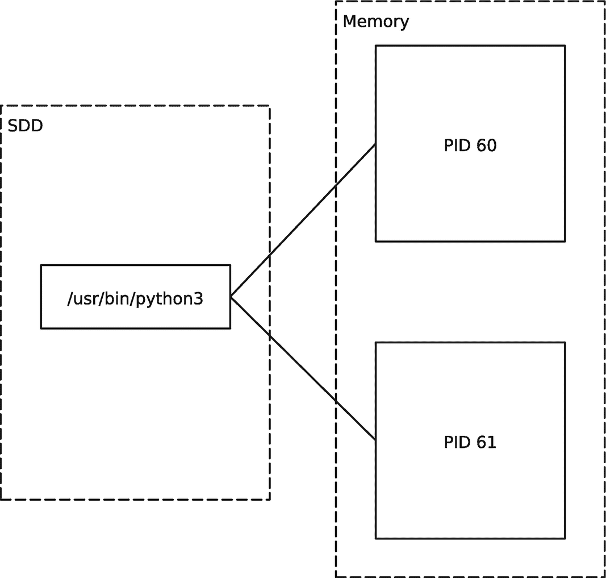
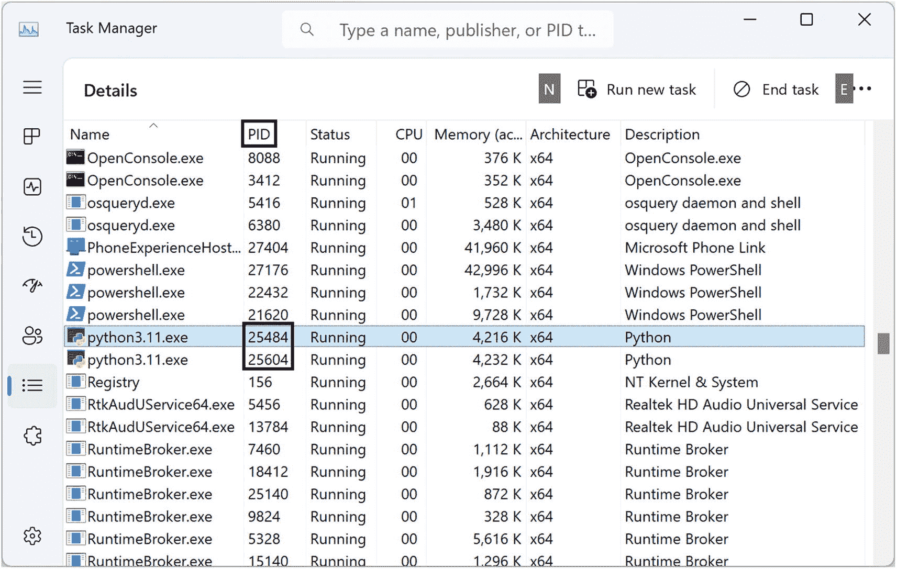
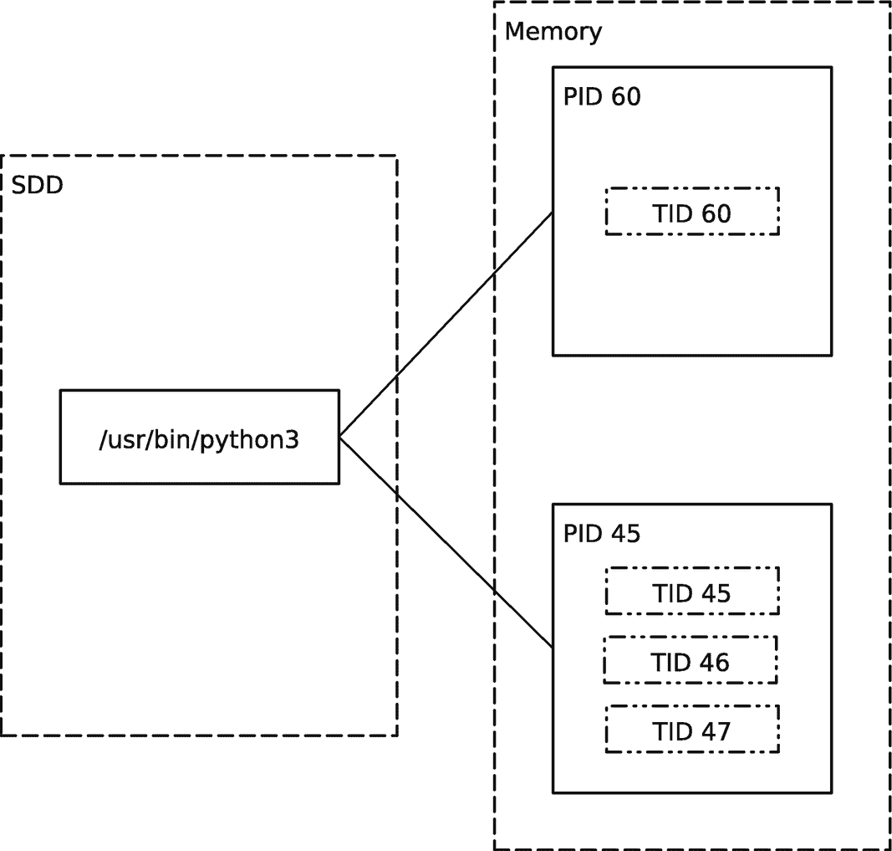
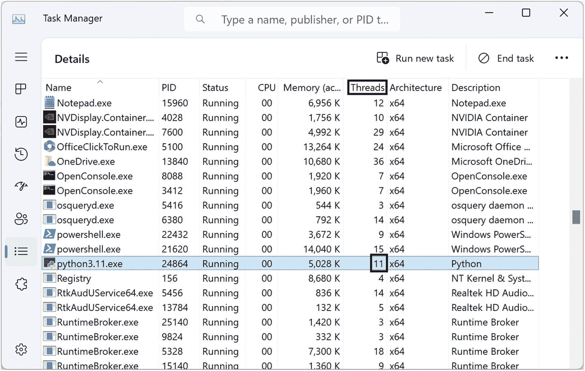
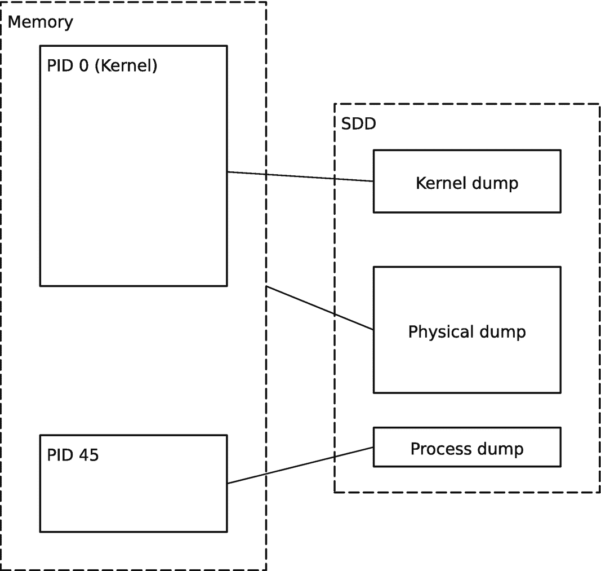
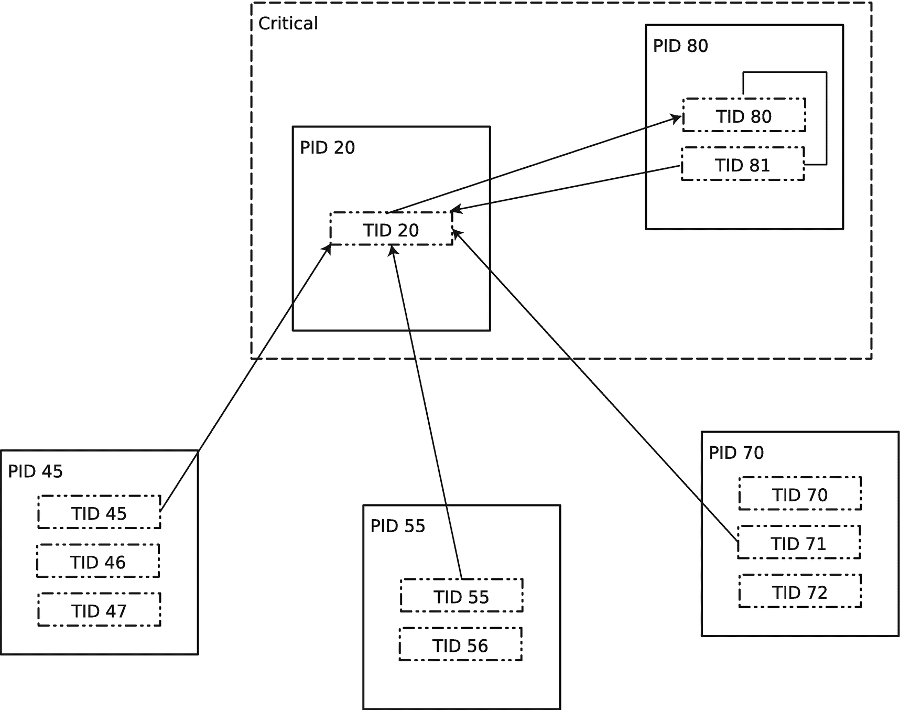
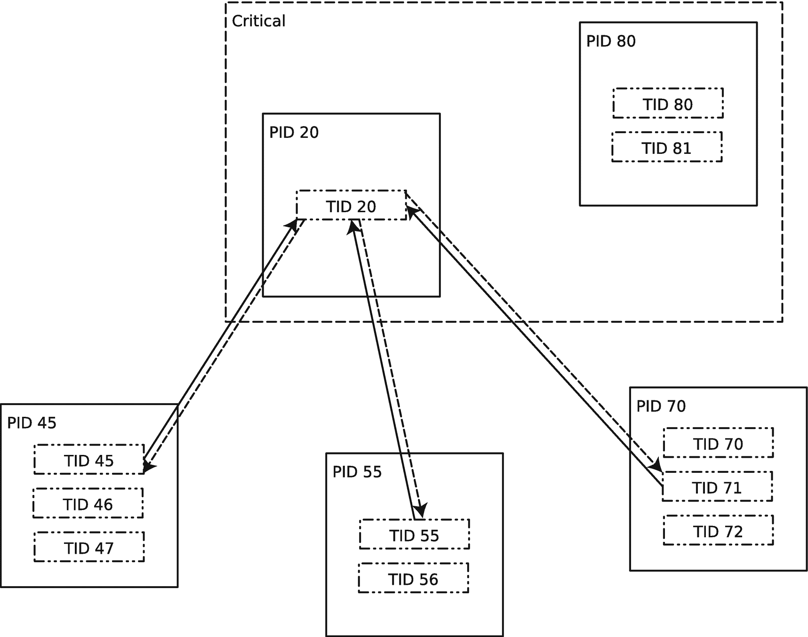

# 1. 基础术语

在机器学习和云计算环境中调试复杂的软件问题，不仅需要了解 Python 语言及其解释器（或编译器），以及标准库和外部库，还需要了解必要且相关的执行环境和操作系统内部机制。在本章中，你将回顾软件诊断和调试语言中的一些必要基础知识，以便为后续章节建立相同的理解基础。在本书中，我假设你熟悉 Python 语言及其运行时环境。

## 进程

Python 脚本通过编译成字节码然后执行来进行解释，甚至可以被预编译成应用程序。在这两种情况下，这个解释器文件或编译后的应用程序都是一个可执行程序（在 Windows 中，它可能具有 `.exe` 扩展名），它引用了一些操作系统库（Windows 中的 `.dll` 和 Linux 中的 `.so`）。这个应用程序可以被多次加载到计算机内存中；每次都会创建一个独立的进程，拥有自己的资源和唯一的进程 ID（PID，也称为 TGID），如图 1-1 所示。该进程也可能有一个创建它的父进程，并带有父进程 ID（PPID）。



一个关于固态硬盘和内存的框图。固态硬盘中一个带有文件的框连接到内存中 PID 60 和 61 的框。

**图 1-1** 两个具有不同 PID 的 `python3` 进程

为了说明这一点，我在 Windows 和 Linux 上分别执行了两次清单 1-1 中的代码。

```
import time
def main():
foo()
def foo():
bar()
def bar():
while True:
time.sleep(1)
if __name__ == "__main__":
main()
```

**清单 1-1** 一个模拟运行中 Python 代码的简单脚本

图 1-2 显示了 Windows 上的两个进程。



任务管理器中菜单图标的屏幕截图。它显示了一个表格，表头为名称、PID、状态、CPU、内存、架构和描述。python 3 dot 11 dot e x e 文件的 PID 被高亮显示。

**图 1-2** Windows 上两个正在运行的 `python3.11.exe` 进程

在 Linux 上，当你在两个独立的终端中执行相同的脚本时，你也可以看到两个进程：

```
~/Chapter1$ which python3
/usr/bin/python3
~/Chapter1$ ps -a
PID TTY          TIME CMD
17 pts/0    00:00:00 mc
60 pts/2    00:00:00 python3
61 pts/1    00:00:00 python3
80 pts/3    00:00:00 ps
```

**注意** 操作系统控制硬件和进程/线程。从高层来看，它只是一个进程的集合，操作系统内核本身也是一个进程。


## 线程

从操作系统的角度来看，进程只是 Python 解释器、其代码和数据的内存容器。但解释器代码需要被执行，例如，用于解释 Python 字节码。这种执行单元被称为线程。一个进程可以有多个这样的执行单元（多个线程，即所谓的多线程应用程序）。每个线程都有自己唯一的线程 ID（`TID`，也称为 `LWP` 或 `SPID`），如图 1-3 所示。例如，一个线程可以处理用户界面事件，而其他线程可以响应 UI 请求进行复杂计算，从而使 UI 保持响应。在 Windows 上，线程 ID 通常与进程 ID 不同，但在 Linux 中，对于单线程进程，主线程的线程 ID 与进程 ID 相同。



S D D 和内存的框图。S D D 中带有文件的块连接到内存中的块 P I D 60 和 45。P I D 60 具有 T I D 60。P I D 45 具有 T I D 45、46 和 47。

**图 1-3** 两个具有不同线程数的 `python3` 进程

为了模拟多线程，我在 Windows 和 Linux 上执行了清单 1-2 中的代码。

```
import time
import threading
def thread_func():
    foo()
def main():
    t1 = threading.Thread(target=thread_func)
    t1.start()
    t2 = threading.Thread(target=thread_func)
    t2.start()
    t1.join()
    t2.join()
def foo():
    bar()
def bar():
    while True:
        time.sleep(1)
if __name__ == "__main__":
    main()
```

**清单 1-2** 一个用于模拟多个线程的简单脚本

图 1-4 显示，在 Windows 中，你最初可以看到 11 个线程（这个数字后来变为 7，然后变为 5）。你可以看到线程数可能比预期的要多。



任务管理器中菜单图标的屏幕截图。它显示了一个包含名称、P I D、状态、C P U、内存、架构和描述等表头的表格。`python3.11.exe` 文件的总线程数为 11，已高亮显示。

**图 1-4** 在 Windows 上运行的 `python3.11.exe` 进程中的线程数

在 Linux 中，你可以看到预期的线程数——3：

```
~/Chapter1$ ps -aT
PID  SPID TTY          TIME CMD
17    17 pts/0    00:00:00 mc
45    45 pts/2    00:00:00 python3
45    46 pts/2    00:00:00 python3
45    47 pts/2    00:00:00 python3
54    54 pts/1    00:00:00 ps
```

## 堆栈跟踪（回溯，Traceback）

我应该区分 Python 源代码回溯（我们称之为*托管堆栈跟踪*）和来自 Python 编译器和解释器的非托管（原生）堆栈跟踪，这些编译器和解释器将 Python 字节码编译并执行。你将在某些章节中看到这种区别，了解几个案例研究以及如何获取这两种跟踪。但现在，我将只展示差异。清单 1-3 显示了托管堆栈跟踪。清单 1-4 显示了相应的带有调试符号的非托管 Linux 堆栈跟踪（最近的调用在前）。清单 1-5 显示了相应的不带调试符号的非托管 Windows 堆栈跟踪（最近的调用在前）。

```
00 00000090`7e1ef0a8 00007ff9`8c44fcf9     ntdll!NtWaitForMultipleObjects+0x14
01 00000090`7e1ef0b0 00007ff9`8c44fbfe     KERNELBASE!WaitForMultipleObjectsEx+0xe9
02 00000090`7e1ef390 00007ff8`ef943986     KERNELBASE!WaitForMultipleObjects+0xe
03 00000090`7e1ef3d0 00007ff8`ef94383d     python311!PyTraceBack_Print_Indented+0x35a
04 00000090`7e1ef430 00007ff8`ef94383d     python311!PyTraceBack_Print_Indented+0x211
05 00000090`7e1ef460 00007ff8`ef82fa77     python311!PyEval_EvalFrameDefault+0x8f2
06 00000090`7e1ef670 00007ff8`ef82f137     python311!PyMapping_Check+0x1eb
07 00000090`7e1ef6b0 00007ff8`ef82d80a     python311!PyEval_EvalCode+0x97
08 00000090`7e1ef730 00007ff8`ef82d786     python311!PyMapping_Items+0x11e
09 00000090`7e1ef760 00007ff8`ef97a17e     python311!PyMapping_Items+0x9a
0a 00000090`7e1ef7a0 00007ff8`ef7e33a5     python311!PyThread_tss_is_created+0x53ce
0b 00000090`7e1ef810 00007ff8`ef8da620     python311!PyRun_SimpleFileObject+0x11d
0c 00000090`7e1ef880 00007ff8`ef8daaef     python311!PyRun_AnyFileObject+0x54
0d 00000090`7e1ef8b0 00007ff8`ef8dab5f     python311!Py_MakePendingCalls+0x38f
0e 00000090`7e1ef980 00007ff8`ef8db964     python311!Py_MakePendingCalls+0x3ff
0f 00000090`7e1ef9b0 00007ff8`ef8db7f5     python311!Py_RunMain+0x184
10 00000090`7e1efa20 00007ff8`ef8260d9     python311!Py_RunMain+0x15
11 00000090`7e1efa50 00007ff6`aefe1230     python311!Py_Main+0x25
12 00000090`7e1efaa0 00007ff9`8e1c26ad     python+0x1230
13 00000090`7e1efae0 00007ff9`8ef6a9f8     KERNEL32!BaseThreadInitThunk+0x1d
14 00000090`7e1efb10 00000000`00000000     ntdll!RtlUserThreadStart+0x28
```

**清单 1-5** 从清单 1-1 中 Python 脚本执行得到的非托管 Windows 堆栈跟踪（不带调试符号）


```
#0  0x00007f6bc84e6b97 in __GI___select (nfds=0, readfds=0x0, writefds=0x0, exceptfds=0x0, timeout=0x7ffc60288fe0)
at ../sysdeps/unix/sysv/linux/select.c:41
#1  0x00000000004e8965 in pysleep (secs=) at ../Modules/timemodule.c:1829
#2  time_sleep (self=, obj=, self=, obj=)
at ../Modules/timemodule.c:371
#3  0x00000000005d8711 in _PyMethodDef_RawFastCallKeywords (method=0x82dbe0 ,
self=, args=0x7f6bc80c4550, nargs=, kwnames=)
at ../Objects/call.c:644
#4  0x000000000054b330 in _PyCFunction_FastCallKeywords (kwnames=, nargs=,
args=0x7f6bc80c4550, func=)
at ../Objects/call.c:730
#5  call_function (pp_stack=0x7ffc60289150, oparg=, kwnames=) at ../Python/ceval.c:4568
#6  0x00000000005524cd in _PyEval_EvalFrameDefault (f=, throwflag=)
at ../Python/ceval.c:3093
#7  0x00000000005d91fc in PyEval_EvalFrameEx (throwflag=0,
f=Frame 0x7f6bc80c43d8, for file process.py, line 11, in bar ()) at ../Python/ceval.c:547
#8  function_code_fastcall (globals=, nargs=, args=, co=)
at ../Objects/call.c:283
#9  _PyFunction_FastCallKeywords (func=, stack=, nargs=,
kwnames=) at ../Objects/call.c:408
#10 0x000000000054e5ac in call_function (kwnames=0x0, oparg=, pp_stack=)
at ../Python/ceval.c:4616
#11 _PyEval_EvalFrameDefault (f=, throwflag=) at ../Python/ceval.c:3124
#12 0x00000000005d91fc in PyEval_EvalFrameEx (throwflag=0,
f=Frame 0x7f6bc80105e8, for file process.py, line 7, in foo ()) at ../Python/ceval.c:547
#13 function_code_fastcall (globals=, nargs=, args=, co=)
at ../Objects/call.c:283
#14 _PyFunction_FastCallKeywords (func=, stack=, nargs=,
kwnames=) at ../Objects/call.c:408
--Type <ret> for more, q to quit, c to continue without paging--
#15 0x000000000054e5ac in call_function (kwnames=0x0, oparg=, pp_stack=)
at ../Python/ceval.c:4616
#16 _PyEval_EvalFrameDefault (f=, throwflag=) at ../Python/ceval.c:3124
#17 0x00000000005d91fc in PyEval_EvalFrameEx (throwflag=0, f=Frame 0x205ade8, for file process.py, line 4, in main ())
at ../Python/ceval.c:547
#18 function_code_fastcall (globals=, nargs=, args=, co=)
at ../Objects/call.c:283
#19 _PyFunction_FastCallKeywords (func=, stack=, nargs=,
kwnames=) at ../Objects/call.c:408
#20 0x000000000054e5ac in call_function (kwnames=0x0, oparg=, pp_stack=)
at ../Python/ceval.c:4616
#21 _PyEval_EvalFrameDefault (f=, throwflag=) at ../Python/ceval.c:3124
#22 0x000000000054bcc2 in PyEval_EvalFrameEx (throwflag=0,
f=Frame 0x7f6bc80ab9f8, for file process.py, line 14, in <module> ()) at ../Python/ceval.c:547
#23 _PyEval_EvalCodeWithName (_co=, globals=, locals=,
args=, argcount=, kwnames=0x0, kwargs=0x0, kwcount=, kwstep=2,
defs=0x0, defcount=0, kwdefs=0x0, closure=0x0, name=0x0, qualname=0x0) at ../Python/ceval.c:3930
#24 0x000000000054e0a3 in PyEval_EvalCodeEx (closure=0x0, kwdefs=0x0, defcount=0, defs=0x0, kwcount=0, kws=0x0,
argcount=0, args=0x0, locals=, globals=, _co=)
at ../Python/ceval.c:3959
#25 PyEval_EvalCode (co=, globals=, locals=) at ../Python/ceval.c:524
#26 0x0000000000630ce2 in run_mod (mod=, filename=,
globals={'__name__': '__main__', '__doc__': None, '__package__': None, '__loader__': <_frozen_importlib_external.SourceFileLoader object at 0x7f6bc8102c28>, '__spec__': None, '__annotations__': {}, '__builtins__': <module 'builtins' (built-in)>, '__file__': 'process.py', '__cached__': None, 'time': <module 'time' (built-in)>, 'main': <function main at 0x7f6bc80c43d8>, 'foo': <function foo at 0x7f6bc80105e8>, 'bar': <function bar at 0x205ade8>},
locals={'__name__': '__main__', '__doc__': None, '__package__': None, '__loader__': <_frozen_importlib_external.SourceFileLoader object at 0x7f6bc8102c28>, '__spec__': None, '__annotations__': {}, '__builtins__': <module 'builtins' (built-in)>, '__file__': 'process.py', '__cached__': None, 'time': <module 'time' (built-in)>, 'main': <function main at 0x7f6bc80c43d8>, 'foo': <function foo at 0x7f6bc80105e8>, 'bar': <function bar at 0x205ade8>}, flags=, arena=) at ../Python/pythonrun.c:1035
#27 0x0000000000630d97 in PyRun_FileExFlags (fp=0x2062390, filename_str=, start=,
globals={'__name__': '__main__', '__doc__': None, '__package__': None, '__loader__': <_frozen_importlib_external.SourceFileLoader object at 0x7f6bc8102c28>, '__spec__': None, '__annotations__': {}, '__builtins__': <module 'builtins' (built-in)>, '__file__': 'process.py', '__cached__': None, 'time': <module 'time' (built-in)>, 'main': <function main at 0x7f6bc80c43d8>, 'foo': <function foo at 0x7f6bc80105e8>, 'bar': <function bar at 0x205ade8>},
locals={'__name__': '__main__', '__doc__': None, '__package__': None, '__loader__': <_frozen_importlib_external.SourceFileLoader object at 0x7f6bc8102c28>, '__spec__': None, '__annotations__': {}, '__builtins__': <module 'builtins' (built-in)>, '__file__': 'process.py', '__cached__': None, 'time': <module 'time' (built-in)>, 'main': <function main at 0x7f6bc80c43d8>, 'foo': <function foo at 0x7f6bc80105e8>, 'bar': <function bar at 0x205ade8>}, closeit=1, flags=0x7ffc6028989c) at ../Python/pythonrun.c:988
#28 0x00000000006319ff in PyRun_SimpleFileExFlags (fp=0x2062390, filename=, closeit=1,
flags=0x7ffc6028989c) at ../Python/pythonrun.c:429
#29 0x000000000065432e in pymain_run_file (p_cf=0x7ffc6028989c, filename=, fp=0x2062390)
at ../Modules/main.c:427
#30 pymain_run_filename (cf=0x7ffc6028989c, pymain=0x7ffc60289970) at ../Modules/main.c:1627
#31 pymain_run_python (pymain=0x7ffc60289970) at ../Modules/main.c:2877
#32 pymain_main (pymain=, pymain=) at ../Modules/main.c:3038
#33 0x000000000065468e in _Py_UnixMain (argc=, argv=) at ../Modules/main.c:3073
#34 0x00007f6bc841a09b in __libc_start_main (main=0x4bc560 <main>, argc=2, argv=0x7ffc60289ab8, init=,
fini=, rtld_fini=, stack_end=0x7ffc60289aa8) at ../csu/libc-start.c:308
#35 0x00000000005e0e8a in _start () at ../Modules/main.c:797
列表 1-4
执行列表 1-1 中 Python 脚本时，带有调试符号的 Linux 非托管回溯
```

```
回溯（最近一次调用）：
文件 "process.py"，第 14 行，在 <module> 中
    main()
文件 "process.py"，第 4 行，在 main 中
    foo()
文件 "process.py"，第 7 行，在 foo 中
    bar()
文件 "process.py"，第 11 行，在 bar 中
    time.sleep(1)
列表 1-3
执行列表 1-1 中 Python 脚本时的托管堆栈跟踪
```

> **注意**  
> 每个线程都有自己的堆栈跟踪（回溯）。

## 符号文件

符号文件允许调试器将内存地址映射到符号信息，例如函数和变量名称。例如，如果你下载符号文件并将其应用于上述 Windows 示例，你将获得更好、更准确的堆栈跟踪，如列表 1-6 所示。

```
00 00000090`7e1ef0a8 00007ff9`8c44fcf9     ntdll!NtWaitForMultipleObjects+0x14
01 00000090`7e1ef0b0 00007ff9`8c44fbfe     KERNELBASE!WaitForMultipleObjectsEx+0xe9
02 00000090`7e1ef390 00007ff8`ef943986     KERNELBASE!WaitForMultipleObjects+0xe
03 00000090`7e1ef3d0 00007ff8`ef94383d     python311!pysleep+0x11a
04 00000090`7e1ef430 00007ff8`ef81a6b2     python311!time_sleep+0x2d
05 00000090`7e1ef460 00007ff8`ef82fa77     python311!_PyEval_EvalFrameDefault+0x8f2
06 (内联函数) --------`--------     python311!_PyEval_EvalFrame+0x1e
07 00000090`7e1ef670 00007ff8`ef82f137     python311!_PyEval_Vector+0x77
08 00000090`7e1ef6b0 00007ff8`ef82d80a     python311!PyEval_EvalCode+0x97
09 00000090`7e1ef730 00007ff8`ef82d786     python311!run_eval_code_obj+0x52
0a 00000090`7e1ef760 00007ff8`ef97a17e     python311!run_mod+0x72
0b 00000090`7e1ef7a0 00007ff8`ef7e33a5     python311!pyrun_file+0x196b66
0c 00000090`7e1ef810 00007ff8`ef8da620     python311!_PyRun_SimpleFileObject+0x11d
0d 00000090`7e1ef880 00007ff8`ef8daaef     python311!_PyRun_AnyFileObject+0x54
0e 00000090`7e1ef8b0 00007ff8`ef8dab5f     python311!pymain_run_file_obj+0x10b
0f 00000090`7e1ef980 00007ff8`ef8db964     python311!pymain_run_file+0x63
10 00000090`7e1ef9b0 00007ff8`ef8db7f5     python311!pymain_run_python+0x140
11 00000090`7e1efa20 00007ff8`ef8260d9     python311!Py_RunMain+0x15
12 00000090`7e1efa50 00007ff6`aefe1230     python311!Py_Main+0x25
13 (内联函数) --------`--------     python!invoke_main+0x22
14 00000090`7e1efaa0 00007ff9`8e1c26ad     python!__scrt_common_main_seh+0x10c
15 00000090`7e1efae0 00007ff9`8ef6a9f8     KERNEL32!BaseThreadInitThunk+0x1d
16 00000090`7e1efb10 00000000`00000000     ntdll!RtlUserThreadStart+0x28
列表 1-6
执行列表 1-1 中 Python 脚本时，带有调试符号的 Windows 非托管堆栈跟踪
```


## 模块

与管理堆栈和未管理堆栈之间的区别类似，Python 模块（可能对应回溯中的文件）与本机模块（如 Windows 中的 DLL 和 Linux 中的 `.so` 文件）也存在差异。当你执行 Python 编译器/解释器时，这些本机模块会被加载到内存中。例如，对于清单 1-2 中的简单多线程示例，Linux 中加载了以下共享库：

```
~/Chapter1$ pmap 60
60:   python3 process.py
0000000000400000    132K r---- python3.7
0000000000421000   2256K r-x-- python3.7
0000000000655000   1712K r---- python3.7
0000000000801000      4K r---- python3.7
0000000000802000    664K rw--- python3.7
00000000008a8000    140K rw---   [ anon ]
0000000001fff000    660K rw---   [ anon ]
00007f6bc7f69000   1684K rw---   [ anon ]
00007f6bc810e000   2964K r---- locale-archive
00007f6bc83f3000     12K rw---   [ anon ]
00007f6bc83f6000    136K r---- libc-2.28.so
00007f6bc8418000   1308K r-x-- libc-2.28.so
00007f6bc855f000    304K r---- libc-2.28.so
00007f6bc85ab000      4K ----- libc-2.28.so
00007f6bc85ac000     16K r---- libc-2.28.so
00007f6bc85b0000      8K rw--- libc-2.28.so
00007f6bc85b2000     16K rw---   [ anon ]
00007f6bc85b6000     52K r---- libm-2.28.so
00007f6bc85c3000    636K r-x-- libm-2.28.so
00007f6bc8662000    852K r---- libm-2.28.so
00007f6bc8737000      4K r---- libm-2.28.so
00007f6bc8738000      4K rw--- libm-2.28.so
00007f6bc8739000      8K rw---   [ anon ]
00007f6bc873b000     12K r---- libz.so.1.2.11
00007f6bc873e000     72K r-x-- libz.so.1.2.11
00007f6bc8750000     24K r---- libz.so.1.2.11
00007f6bc8756000      4K ----- libz.so.1.2.11
00007f6bc8757000      4K r---- libz.so.1.2.11
00007f6bc8758000      4K rw--- libz.so.1.2.11
00007f6bc8759000     16K r---- libexpat.so.1.6.8
00007f6bc875d000    132K r-x-- libexpat.so.1.6.8
00007f6bc877e000     80K r---- libexpat.so.1.6.8
00007f6bc8792000      4K ----- libexpat.so.1.6.8
00007f6bc8793000      8K r---- libexpat.so.1.6.8
00007f6bc8795000      4K rw--- libexpat.so.1.6.8
00007f6bc8796000      4K r---- libutil-2.28.so
00007f6bc8797000      4K r-x-- libutil-2.28.so
00007f6bc8798000      4K r---- libutil-2.28.so
00007f6bc8799000      4K r---- libutil-2.28.so
00007f6bc879a000      4K rw--- libutil-2.28.so
00007f6bc879b000      4K r---- libdl-2.28.so
00007f6bc879c000      4K r-x-- libdl-2.28.so
00007f6bc879d000      4K r---- libdl-2.28.so
00007f6bc879e000      4K r---- libdl-2.28.so
00007f6bc879f000      4K rw--- libdl-2.28.so
00007f6bc87a0000     24K r---- libpthread-2.28.so
00007f6bc87a6000     60K r-x-- libpthread-2.28.so
00007f6bc87b5000     24K r---- libpthread-2.28.so
00007f6bc87bb000      4K r---- libpthread-2.28.so
00007f6bc87bc000      4K rw--- libpthread-2.28.so
00007f6bc87bd000     16K rw---   [ anon ]
00007f6bc87c1000      4K r---- libcrypt-2.28.so
00007f6bc87c2000     24K r-x-- libcrypt-2.28.so
00007f6bc87c8000      8K r---- libcrypt-2.28.so
00007f6bc87ca000      4K ----- libcrypt-2.28.so
00007f6bc87cb000      4K r---- libcrypt-2.28.so
00007f6bc87cc000      4K rw--- libcrypt-2.28.so
00007f6bc87cd000    192K rw---   [ anon ]
00007f6bc8801000     28K r--s- gconv-modules.cache
00007f6bc8808000      4K r---- ld-2.28.so
00007f6bc8809000    120K r-x-- ld-2.28.so
00007f6bc8827000     32K r---- ld-2.28.so
00007f6bc882f000      4K r---- ld-2.28.so
00007f6bc8830000      4K rw--- ld-2.28.so
00007f6bc8831000      4K rw---   [ anon ]
00007ffc6026a000    132K rw---   [ stack ]
00007ffc60356000     16K r----   [ anon ]
00007ffc6035a000      4K r-x--   [ anon ]
total            14700K
```

Windows 版本则加载了以下模块：

```
00007ff6`aefe0000 00007ff6`aeffa000   python   python.exe
00007ff8`ef7e0000 00007ff8`efdad000   python311 python311.dll
00007ff9`62950000 00007ff9`6296b000   VCRUNTIME140 VCRUNTIME140.dll
00007ff9`7f1e0000 00007ff9`7f1ea000   VERSION  VERSION.dll
00007ff9`8bce0000 00007ff9`8bd08000   bcrypt   bcrypt.dll
00007ff9`8c3f0000 00007ff9`8c793000   KERNELBASE KERNELBASE.dll
00007ff9`8c840000 00007ff9`8c951000   ucrtbase ucrtbase.dll
00007ff9`8c960000 00007ff9`8c9db000   bcryptprimitives bcryptprimitives.dll
00007ff9`8d150000 00007ff9`8d1c1000   WS2_32   WS2_32.dll
00007ff9`8d1d0000 00007ff9`8d2e7000   RPCRT4   RPCRT4.dll
00007ff9`8dd50000 00007ff9`8ddf7000   msvcrt   msvcrt.dll
00007ff9`8ded0000 00007ff9`8df7e000   ADVAPI32 ADVAPI32.dll
00007ff9`8e1b0000 00007ff9`8e272000   KERNEL32 KERNEL32.DLL
00007ff9`8e280000 00007ff9`8e324000   sechost  sechost.dll
00007ff9`8ef10000 00007ff9`8f124000   ntdll    ntdll.dll
```

## 内存转储

进程内存可以保存到内存转储文件中。

> *大量未经消化、关于问题或系统状态的信息，尤其是指那些以十六进制符文描述内存逐字节状态的转储内容。*
> 
> 埃里克·S·雷蒙德，《新黑客词典》第三版

这些内存转储在 Linux 中也被称为*核心转储*。此外，还可以获取内核内存转储和物理内存转储（在 Windows 中称为*完整内存转储*）。图 1-5 展示了不同的内存转储类型。



内存与固态硬盘（SSD）的框图。块内存映射到 SSD 的物理转储。内存的 PID 0 映射到 SSD 的内核转储。内存的 PID 45 映射到 SSD 的进程转储。

图 1-5

内存转储类型

内存转储可能有助于调试难以重现的间歇性问题。这种方法称为事后调试。你将在后续章节中看到一些案例研究。

### 崩溃

> *突然失败。“系统刚刚崩溃了吗？”“什么东西搞垮了操作系统！”该词也可用作及物动词，表示崩溃的原因（通常是人或程序，或两者兼有）。“那些玩 SPACEWAR 的傻瓜搞垮了系统。”*
> 
> 埃里克·S·雷蒙德，《新黑客词典》第三版。

当进程线程内部发生非法操作时，例如访问了其可用范围之外的内存，或向只读内存写入数据，操作系统会报告错误并终止该进程。它还可能将进程内存保存到内存转储文件中。随后，该进程会从可用进程列表中消失。


## 挂起

> *1. 等待一个永远不会发生的事件。“系统挂起，因为它无法从崩溃的驱动器中读取数据。”*
>
> *2. 等待某个事件发生。“程序显示一个菜单，然后挂起，直到你输入一个字符。”*
>
> 埃里克·S·雷蒙德，《新黑客词典》，第三版

线程会与其他线程交互，包括其他进程的线程。这些交互可以看作是发送消息和等待响应。某些进程可能至关重要，因为它们的线程会处理来自其他进程的许多其他线程的消息。如果此类关键进程的线程停止发送响应，所有其他等待的线程都将被阻塞。死锁是指两个线程相互等待。当挂起时，该进程仍会出现在可用进程列表中。还有一些进程（关键组件），当它们的线程挂起时，会阻塞来自许多其他进程（非关键组件）的线程。图 1-6 描述了这些组件及其在正常场景下通过消息抽象化的交互，而图 1-7 则展示了非关键组件因关键组件死锁而被阻塞并等待响应的异常场景。



关键组件与 PID 的框图。关键组件由 PID 20 和 80 的块组成。PID 20 的 TID 20 与 PID 80、PID 45 的 TID 45、PID 55 的 TID 55 以及 PID 70 的 TID 71 互连。

图 1-7

被阻塞和死锁的组件



关键组件与 PID 的框图。关键组件由 PID 20 和 80 组成。PID 20 的 TID 20 与 PID 45 的 TID 45、PID 55 的 TID 55 以及 PID 70 的 TID 71 互连。

图 1-6

关键与非关键系统组件之间的请求与响应交互

