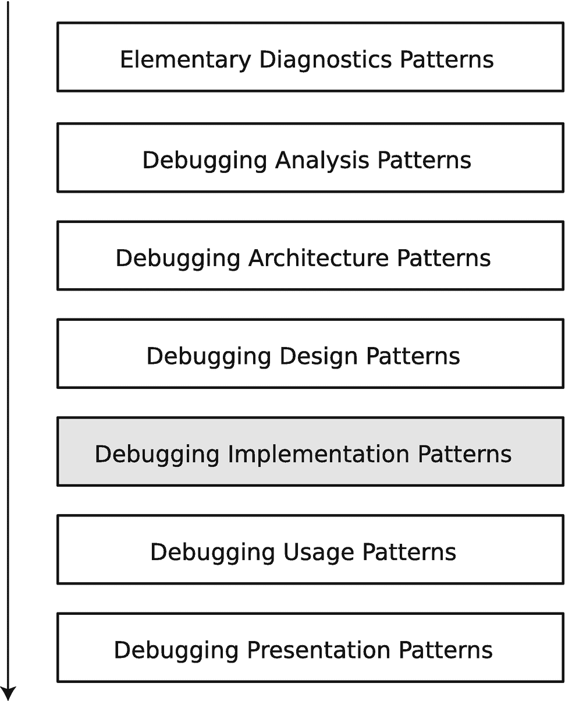

# 5. 调试实现模式

在上一章中，我在几个 Python 案例研究的背景下介绍了特定的调试分析模式。在本章中，你将探讨 Python 调试器 `pdb` 背景下的特定调试实现模式。（图 5-1）。



一个面向模式的调试过程的堆叠框图。从上到下的模块依次是：基础诊断、调试分析、调试架构、调试设计、调试实现、调试使用和调试呈现模式。其中“调试实现”被高亮显示。

图 5-1

面向模式的调试过程与调试实现模式

我将跳过架构和设计调试模式，因为对于简单情况，你可能不需要显式地考虑它们。相比之下，实现一个简单的命令行工具或脚本时，你通常不会显式地使用一个繁重的开发过程。在这种情况下，架构和设计决策已经是隐式的，例如，在编写命令行工具的需求中就已隐含。此外，在学习编程时，最好从一些具体有用的实现示例开始。因此，当我积累足够的案例研究并看到一些非平凡问题时，我才会讨论调试架构和设计模式。

## 模式概述

我现在介绍在 Python 调试器 `pdb`^(²⁹) 背景下的调试实现模式语言。这种模式语言并非该调试器所特有；同样的模式语言也适用于许多其他命令行^(³⁰)和 IDE 的 Python 调试器，甚至适用于像 `GDB` 和 `WinDbg` 这样的原生操作系统调试器。当然，为了实现这些模式，调试器的命令会有所不同。


### 中断

调试的基本操作之一就是中断进程或线程的执行，以便检查其进程或线程状态。对于 Python 代码，这种**中断**可以通过两种方式实现：一种是在代码内部放置 `breakpoint()` 函数，另一种是在调试器下执行脚本，然后通过键盘中断（`^C`）或异常从外部中断。某些调试器（如 GDB）允许在程序独立启动后进行外部**中断**。

为了演示第一种方式，请在 Linux 上执行代码清单 5-1 中的代码（在 Windows 上，你应该会得到类似的结果）。

```
### test-breakpoint.py
def main():
    foo()
def foo():
    bar()
def bar():
    while True:
        breakpoint()
if __name__ == "__main__":
    main()
代码清单 5-1
一个用于测试内部中断的简单脚本
```

**中断**后，你可以检查托管堆栈跟踪（`where` 命令或 `w`）并恢复执行（`continue` 命令或 `c`）。`quit` 命令（或 `q`）会退出调试器并中止脚本。在查看其他调试实现模式时，你还会学到其他命令。

```
~/Chapter5$ python3 test-breakpoint.py
> ~/Chapter5/test-breakpoint.py(9)bar()
-> breakpoint()
(Pdb) w
  ~/Chapter5/test-breakpoint.py(12)<module>()
-> main()
  ~/Chapter5/test-breakpoint.py(2)main()
-> foo()
  ~/Chapter5/test-breakpoint.py(5)foo()
-> bar()
> ~/Chapter5/test-breakpoint.py(9)bar()
-> breakpoint()
(Pdb) c
> ~/Chapter5/test-breakpoint.py(9)bar()
-> breakpoint()
(Pdb) q
Traceback (most recent call last):
  File "test-breakpoint.py", line 12, in <module>
    main()
  File "test-breakpoint.py", line 2, in main
    foo()
  File "test-breakpoint.py", line 5, in foo
    bar()
  File "test-breakpoint.py", line 9, in bar
    breakpoint()
  File "test-breakpoint.py", line 9, in bar
    breakpoint()
  File "/usr/lib/python3.7/bdb.py", line 88, in trace_dispatch
    return self.dispatch_line(frame)
  File "/usr/lib/python3.7/bdb.py", line 113, in dispatch_line
    if self.quitting: raise BdbQuit
bdb.BdbQuit
~/Chapter5$
```

对于外部**中断**，你需要在执行脚本时指定 `pdb` 模块。为了演示这种方式，请在 Linux 上执行代码清单 5-2 中的代码（在 Windows 上，你应该会得到类似的结果）。

```
### test-pdb.py
import time
class cls:
    def __init__(self, field1, field2):
        self.field1 = field1
        self.field2 = field2
def main():
    func = "main"
    while True:
        foo()
        time.sleep(1)
def foo():
    func = "foo"
    bar("argument")
def bar(arg):
    func = "bar"
    obj = [1, 2]
    obj = cls(1, 2)
if __name__ == "__main__":
    main()
代码清单 5-2
一个用于测试外部中断和其他模式的简单脚本
```

调试器会在执行第一行脚本之前停止。你可以 `continue` 执行，并随时使用 `^C`（或通过从另一个终端窗口使用 `kill` 命令发送 `SIGINT` 信号）进行**中断**。

```
~/Chapter5$ python3 -m pdb test-pdb.py
> ~/Chapter5/test-pdb.py(1)<module>()
-> import time
(Pdb) c
^C
Program interrupted. (Use 'cont' to resume).
> ~/Chapter5/test-pdb.py(11)main()
-> foo()
(Pdb) w
  /usr/lib/python3.7/runpy.py(193)_run_module_as_main()
-> "__main__", mod_spec)
  /usr/lib/python3.7/runpy.py(85)_run_code()
-> exec(code, run_globals)
  /usr/lib/python3.7/pdb.py(1728)<module>()
-> pdb.main()
  /usr/lib/python3.7/pdb.py(1701)main()
-> pdb._runscript(mainpyfile)
  /usr/lib/python3.7/pdb.py(1570)_runscript()
-> self.run(statement)
  /usr/lib/python3.7/bdb.py(585)run()
-> exec(cmd, globals, locals)
  <string>(1)<module>()
  ~/Chapter5/test-pdb.py(1)<module>()
-> import time
> ~/Chapter5/test-pdb.py(11)main()
-> foo()
(Pdb)
```

让我们继续在下面的模式示例中探索其他 `pdb` 命令。

### 代码断点

你不需要每次想在脚本的不同位置进行**中断**时，都用 `breakpoint()` 函数调用污染你的代码。在初始**中断**之后，你可以使用 `break`（`b`）命令在 `filename:lineno` 或函数名处设置**代码断点**。例如，让我们在每次调用 `bar` 函数时设置这样一个断点：

```
(Pdb) b bar
Breakpoint 1 at ~/Chapter5/test-pdb.py:18
(Pdb) c
> ~/Chapter5/test-pdb.py(19)bar()
-> func = "bar"
(Pdb) w
  /usr/lib/python3.7/runpy.py(193)_run_module_as_main()
-> "__main__", mod_spec)
  /usr/lib/python3.7/runpy.py(85)_run_code()
-> exec(code, run_globals)
  /usr/lib/python3.7/pdb.py(1728)<module>()
-> pdb.main()
  /usr/lib/python3.7/pdb.py(1701)main()
-> pdb._runscript(mainpyfile)
  /usr/lib/python3.7/pdb.py(1570)_runscript()
-> self.run(statement)
  /usr/lib/python3.7/bdb.py(585)run()
-> exec(cmd, globals, locals)
  <string>(1)<module>()
  ~/Chapter5/test-pdb.py(1)<module>()
-> import time
  ~/Chapter5/test-pdb.py(11)main()
-> foo()
  ~/Chapter5/test-pdb.py(16)foo()
-> bar("argument")
> ~/Chapter5/test-pdb.py(19)bar()
-> func = "bar"
```

箭头指向要执行的下一行。不带参数的 `breakpoint` 命令会列出可用的断点、它们的编号及其信息。

```
(Pdb) b
Num Type         Disp Enb   Where
1   breakpoint   keep yes   at ~/Chapter5/test-pdb.py:18
	breakpoint already hit 1 time
```

然后你可以 `continue` 直到再次命中任何断点。`clear`（`cl`）命令会移除现有的断点编号。如果你需要一个只执行一次的断点，请使用 `tbreak` 命令而不是 `break`。你还可以通过编号 `enable` 和 `disable` 断点。对于高频断点，你还可以指定触发条件。我在本章末尾的案例研究中提供了这样一个示例。

### 代码跟踪

一旦你通过**中断**或**代码断点**进入某个函数，你就可以使用 `step`（`s`）命令开始逐行执行代码。如果你希望将函数调用视为一行，而不进入其内部逐行执行，则应使用 `next`（`n`）命令。如果你不小心步入了某个函数，可以使用 `return`（`r`）命令继续执行。如果你想跳过跟踪某些代码行，可以使用 `until`（`unt`）命令并指定行号。如果你甚至想跳过它们的执行，可以使用 `jump`（`j`）命令并指定目标行号。

```
(Pdb) c
> ~/Chapter5/test-pdb.py(19)bar()
-> func = "bar"
(Pdb) s
> ~/Chapter5/test-pdb.py(20)bar()
-> obj = [1, 2]
(Pdb) s
> ~/Chapter5/test-pdb.py(21)bar()
-> obj = cls(1, 2)
(Pdb) s
--Call--
> ~/Chapter5/test-pdb.py(4)__init__()
-> def __init__(self, field1, field2):
(Pdb) r
--Return--
> ~/Chapter5/test-pdb.py(6)__init__()->None
-> self.field2 = field2
(Pdb) r
--Return--
> ~/Chapter5/test-pdb.py(21)bar()->None
-> obj = cls(1, 2)
(Pdb) s
--Return--
> ~/Chapter5/test-pdb.py(16)foo()->None
-> bar("argument")
(Pdb) s
> ~/Chapter5/test-pdb.py(12)main()
-> time.sleep(1)
(Pdb) c
> ~/Chapter5/test-pdb.py(19)bar()
-> func = "bar"
(Pdb) n
> ~/Chapter5/test-pdb.py(20)bar()
-> obj = [1, 2]
(Pdb) n
> ~/Chapter5/test-pdb.py(21)bar()
-> obj = cls(1, 2)
(Pdb) n
--Return--
> ~/Chapter5/test-pdb.py(21)bar()->None
-> obj = cls(1, 2)
(Pdb) n
--Return--
> ~/Chapter5/test-pdb.py(16)foo()->None
-> bar("argument")
(Pdb) n
> ~/Chapter5/test-pdb.py(12)main()
-> time.sleep(1)
(Pdb)
```


### 作用域

当你执行**中断**时，你处于一个特定的执行**作用域**中，该作用域包含当前正在执行的函数、其参数、已定义的局部变量，以及从外部和全局上下文中可访问的变量。你可以使用 `up` (`u`) 和 `down` (`d`) 命令在调用函数的回溯中上下移动来更改作用域。要查看当前代码位置，可以使用 `list` (`l`) 命令。

```
(Pdb) c
> ~/Chapter5/test-pdb.py(19)bar()
-> func = "bar"
(Pdb) l
14     def foo():
15         func = "foo"
16         bar("argument")

18 B   def bar(arg):
19  ->     func = "bar"
20         obj = [1, 2]
21         obj = cls(1, 2)

23     if __name__ == "__main__":
24         main()
(Pdb) n
> ~/Chapter5/test-pdb.py(20)bar()
-> obj = [1, 2]
(Pdb) n
> ~/Chapter5/test-pdb.py(21)bar()
-> obj = cls(1, 2)
(Pdb) l
16         bar("argument")

18 B   def bar(arg):
19         func = "bar"
20         obj = [1, 2]
21  ->     obj = cls(1, 2)

23     if __name__ == "__main__":
24         main()
[EOF]
(Pdb) a
arg = 'argument'
(Pdb) locals()
{'arg': 'argument', 'func': 'bar', 'obj': [1, 2]}
(Pdb) u
> ~/Chapter5/test-pdb.py(16)foo()
-> bar("argument")
(Pdb) l
11             foo()
12             time.sleep(1)

14     def foo():
15         func = "foo"
16  ->     bar("argument")

18 B   def bar(arg):
19         func = "bar"
20         obj = [1, 2]
21         obj = cls(1, 2)
(Pdb) locals()
{'func': 'foo'}
(Pdb) u
> ~/Chapter5/test-pdb.py(11)main()
-> foo()
(Pdb) l
6             self.field2 = field2

8     def main():
9         func = "main"
10         while True:
11  ->         foo()
12             time.sleep(1)

14     def foo():
15         func = "foo"
16         bar("argument")
(Pdb) locals()
{'func': 'main'}
(Pdb)
```

### 变量值

显然，在调试时，你关心的是**变量值**。这里你可以使用 `p` 和 `pp`（漂亮打印）命令。你也可以为此使用常规的 Python 函数。

```
(Pdb) c
> ~/Chapter5/test-pdb.py(19)bar()
-> func = "bar"
(Pdb) n
> ~/Chapter5/test-pdb.py(20)bar()
-> obj = [1, 2]
(Pdb) n
> ~/Chapter5/test-pdb.py(21)bar()
-> obj = cls(1, 2)
(Pdb) p obj
[1, 2]
(Pdb) n
--Return--
> ~/Chapter5/test-pdb.py(21)bar()->None
-> obj = cls(1, 2)
(Pdb) p obj

(Pdb) vars(obj)
{'field1': 1, 'field2': 2}
(Pdb)
```

### 类型结构

当看到一个不熟悉的对象时，你可能想检查它的**类型结构**。这里你可以使用合适的 Python 模块和函数进行探索：

```
(Pdb) type(obj)

(Pdb) dir(obj)
['__class__', '__delattr__', '__dict__', '__dir__', '__doc__', '__eq__', '__format__', '__ge__', '__getattribute__', '__gt__', '__hash__', '__init__', '__init_subclass__', '__le__', '__lt__', '__module__', '__ne__', '__new__', '__reduce__', '__reduce_ex__', '__repr__', '__setattr__', '__sizeof__', '__str__', '__subclasshook__', '__weakref__', 'field1', 'field2']
(Pdb) vars(cls)
Mapping ({'__module__': '__main__', '__init__': , '__dict__': , '__weakref__': , '__doc__': None})
(Pdb) import pprint
(Pdb) pprint.pprint(vars(cls))
mappingproxy({'__dict__': ,
'__doc__': None,
'__init__': ,
'__module__': '__main__',
'__weakref__': })
(Pdb) pprint.pprint(dir(cls))
['__class__',
'__delattr__',
'__dict__',
'__dir__',
'__doc__',
'__eq__',
'__format__',
'__ge__',
'__getattribute__',
'__gt__',
'__hash__',
'__init__',
'__init_subclass__',
'__le__',
'__lt__',
'__module__',
'__ne__',
'__new__',
'__reduce__',
'__reduce_ex__',
'__repr__',
'__setattr__',
'__sizeof__',
'__str__',
'__subclasshook__',
'__weakref__']
(Pdb) pprint.pprint(dir(obj))
['__class__',
'__delattr__',
'__dict__',
'__dir__',
'__doc__',
'__eq__',
'__format__',
'__ge__',
'__getattribute__',
'__gt__',
'__hash__',
'__init__',
'__init_subclass__',
'__le__',
'__lt__',
'__module__',
'__ne__',
'__new__',
'__reduce__',
'__reduce_ex__',
'__repr__',
'__setattr__',
'__sizeof__',
'__str__',
'__subclasshook__',
'__weakref__',
'field1',
'field2']
(Pdb)
```

### 断点动作

在调试会话期间，你可能希望自动化**代码追踪**和相关命令，例如打印回溯和**变量值**。这里**断点动作**通过将调试器命令与**代码断点**关联来提供帮助。例如，你可以在每次命中断点时打印回溯并自动继续（使用 `^C` 再次执行**中断**）：

```
(Pdb) b
Num Type         Disp Enb   Where
1   breakpoint   keep yes   at ~/Chapter5/test-pdb.py:18
breakpoint already hit 39 times
(Pdb) commands 1
(com) print("New hit!")
(com) w
(com) c
(Pdb) c
New hit!
/usr/lib/python3.7/runpy.py(193)_run_module_as_main()
-> "__main__", mod_spec)
/usr/lib/python3.7/runpy.py(85)_run_code()
-> exec(code, run_globals)
/usr/lib/python3.7/pdb.py(1728)()
-> pdb.main()
/usr/lib/python3.7/pdb.py(1701)main()
-> pdb._runscript(mainpyfile)
/usr/lib/python3.7/pdb.py(1570)_runscript()
-> self.run(statement)
/usr/lib/python3.7/bdb.py(585)run()
-> exec(cmd, globals, locals)
(1)()
~/Chapter5/test-pdb.py(1)()
-> import time
~/Chapter5/test-pdb.py(11)main()
-> foo()
~/Chapter5/test-pdb.py(16)foo()
-> bar("argument")
> ~/Chapter5/test-pdb.py(19)bar()
-> func = "bar"
> ~/Chapter5/test-pdb.py(19)bar()
-> func = "bar"
New hit!
/usr/lib/python3.7/runpy.py(193)_run_module_as_main()
-> "__main__", mod_spec)
/usr/lib/python3.7/runpy.py(85)_run_code()
-> exec(code, run_globals)
/usr/lib/python3.7/pdb.py(1728)()
-> pdb.main()
/usr/lib/python3.7/pdb.py(1701)main()
-> pdb._runscript(mainpyfile)
/usr/lib/python3.7/pdb.py(1570)_runscript()
-> self.run(statement)
/usr/lib/python3.7/bdb.py(585)run()
-> exec(cmd, globals, locals)
(1)()
~/Chapter5/test-pdb.py(1)()
-> import time
~/Chapter5/test-pdb.py(11)main()
-> foo()
~/Chapter5/test-pdb.py(16)foo()
-> bar("argument")
> ~/Chapter5/test-pdb.py(19)bar()
-> func = "bar"
> ~/Chapter5/test-pdb.py(19)bar()
-> func = "bar"
^C
Program interrupted. (Use 'cont' to resume).
--Call--
> /usr/lib/python3.7/bdb.py(319)set_trace()
-> def set_trace(self, frame=None):
(Pdb)
```

要清除断点的命令，只需指定 `end` 命令：

```
(Pdb) commands 1
(com) end
(Pdb) c
> /usr/lib/python3.7/bdb.py(279)_set_stopinfo()
-> self.returnframe = returnframe
(Pdb) c
> /usr/lib/python3.7/bdb.py(332)set_trace()
-> sys.settrace(self.trace_dispatch)
(Pdb) c
> ~/Chapter5/test-pdb.py(19)bar()
-> func = "bar"
(Pdb) c
> ~/Chapter5/test-pdb.py(19)bar()
-> func = "bar"
(Pdb)
```

这种自动化在远程调试云基础设施和机器学习流水线问题时可能很有用。

### 使用追踪

通常，对于资源泄漏的情况，你关心的是某个对象或容器的**使用追踪**。稍后，我将在专门讨论原生调试的章节中讨论另一种称为**数据断点**的调试实现模式。现在，我可以建议在感兴趣的对象被使用的地方或其访问器方法上设置**代码断点**。或者，你可以直接或通过装饰器使用追踪和日志记录。

### 案例研究

本案例研究模拟了我在一个云主机监控脚本中观察到的问题。我将建模代码保持在最低限度，以说明调试实现模式的使用。

### 基本诊断模式

有一个脚本运行时间很长，用于监控进程创建。一段时间后，内存使用量的计数器值开始持续增加。

## 调试分析模式

该脚本非常小，它使用一个字典来保存先前存在的进程信息一段时间，然后将其删除。**内存泄漏（进程堆）** 是这里显而易见的假设。对于更复杂的脚本和程序，尤其是那些使用第三方模块的脚本和程序，需要进行一些真正的内存分析来区分不同类型的泄漏：进程堆、虚拟内存和句柄。


## 调试实现模式

要进行调试，你可以在 `pdb` 下通过启动清单 5-3 中的 `process-monitoring.py` 脚本，从外部执行**中断**。

```
### process-monitoring.py
import processes
import filemon
import time
def main():
procs = processes.Processes()
files = filemon.Files()
for pid in range (1, 10):
procs.add_process(pid, "info")
while True:
pid += 1
procs.add_process(pid, "info")
time.sleep(1)
procs.remove_process(pid)
time.sleep(1)
files.process_files()
if __name__ == "__main__":
main()
### processes.py
class Processes:
_singleton = None
@staticmethod
def __new__(cls):
self = Processes._singleton
if not self:
Processes._singleton = self = super().__new__(cls)
return self
def __init__(self):
pass
_procinfo = {}
def add_process(self, pid, info):
Processes._procinfo[pid] = info
def remove_process(self, pid):
del Processes._procinfo[pid]
### filemon.py
import processes
class Files:
def __init__(self):
self._processes = processes.Processes()
self._count = 0
def process_files(self):
self._count += 1
if self._count > 25:
self._processes.add_process(self._count, "")
~/Chapter5$ python3 -m pdb process-monitoring.py
> ~/Chapter5/process-monitoring.py(1)()
-> import processes
(Pdb)
清单 5-3
用于模拟进程监控案例研究的脚本
```

你继续执行 10-15 秒，然后再次执行**中断**。接着，你检查 `Processes._procinfo` 字典大小的**变量值**。

```
(Pdb) c
^C
Program interrupted. (Use 'cont' to resume).
> ~/Chapter5/process-monitoring.py(14)main()
-> procs.remove_process(pid)
(Pdb) p len(processes.Processes._procinfo)
```

由于你知道字典大小只会在过一段时间后才开始增长，你在 `add_process` 函数上设置了一个临时**代码断点**，使其仅在字典大小超过 100 时命中。你再次继续执行并等待。

```
(Pdb) tbreak processes.Processes.add_process, len(Processes._procinfo) > 100
Breakpoint 1 at ~/Chapter5/processes.py:16
(Pdb) b
Num Type         Disp Enb   Where
1   breakpoint   del  yes   at ~/Chapter5/processes.py:16
stop only if len(Processes._procinfo) > 100
(Pdb) c
Deleted breakpoint 1 at ~/Chapter5/processes.py:16
> ~/Chapter5/processes.py(17)add_process()
-> Processes._procinfo[pid] = info
(Pdb) b
(Pdb) p len(Processes._procinfo)
```

现在，你为 `add_process` 和 `remove_process` 函数创建两个**代码断点**，并附带一个**断点动作**，用于打印调用者的回溯信息并继续执行。

```
(Pdb) b Processes.add_process
Breakpoint 2 at ~/Chapter5/processes.py:16
(Pdb) b Processes.remove_process
Breakpoint 3 at ~/Chapter5/processes.py:19
(Pdb) b
Num Type         Disp Enb   Where
2   breakpoint   keep yes   at ~/Chapter5/processes.py:16
3   breakpoint   keep yes   at ~/Chapter5/processes.py:19
(Pdb) commands 2
(com) print("ADD")
(com) w
(com) c
(Pdb) commands 3
(com) print("REMOVE")
(com) w
(com) c
(Pdb)
```

你再次继续执行以收集一些**使用痕迹**（为清晰起见，我省略了回溯中的部分帧）。

```
(Pdb) c
REMOVE
...
-> import processes
~/Chapter5/process-monitoring.py(14)main()
-> procs.remove_process(pid)
> ~/Chapter5/processes.py(20)remove_process()
-> del Processes._procinfo[pid]
> ~/Chapter5/processes.py(20)remove_process()
-> del Processes._procinfo[pid]
ADD
...
-> import processes
~/Chapter5/process-monitoring.py(16)main()
-> files.process_files()
~/Chapter5/filemon.py(11)process_files()
-> self._processes.add_process(self._count, "")
> ~/Chapter5/processes.py(17)add_process()
-> Processes._procinfo[pid] = info
> ~/Chapter5/processes.py(17)add_process()
-> Processes._procinfo[pid] = info
ADD
...
-> import processes
~/Chapter5/process-monitoring.py(12)main()
-> procs.add_process(pid, "info")
> ~/Chapter5/processes.py(17)add_process()
-> Processes._procinfo[pid] = info
> ~/Chapter5/processes.py(17)add_process()
-> Processes._procinfo[pid] = info
REMOVE
...
-> import processes
~/Chapter5/process-monitoring.py(14)main()
-> procs.remove_process(pid)
> ~/Chapter5/processes.py(20)remove_process()
-> del Processes._procinfo[pid]
> ~/Chapter5/processes.py(20)remove_process()
-> del Processes._procinfo[pid]
ADD
...
-> import processes
~/Chapter5/process-monitoring.py(16)main()
-> files.process_files()
~/Chapter5/filemon.py(11)process_files()
-> self._processes.add_process(self._count, "")
> ~/Chapter5/processes.py(17)add_process()
-> Processes._procinfo[pid] = info
> ~/Chapter5/processes.py(17)add_process()
-> Processes._procinfo[pid] = info
ADD
...
-> import processes
~/Chapter5/process-monitoring.py(12)main()
-> procs.add_process(pid, "info")
> ~/Chapter5/processes.py(17)add_process()
-> Processes._procinfo[pid] = info
> ~/Chapter5/processes.py(17)add_process()
-> Processes._procinfo[pid] = info
REMOVE
...
-> import processes
~/Chapter5/process-monitoring.py(14)main()
-> procs.remove_process(pid)
> ~/Chapter5/processes.py(20)remove_process()
-> del Processes._procinfo[pid]
> ~/Chapter5/processes.py(20)remove_process()
-> del Processes._procinfo[pid]
ADD
...
-> import processes
~/Chapter5/process-monitoring.py(16)main()
-> files.process_files()
~/Chapter5/filemon.py(11)process_files()
-> self._processes.add_process(self._count, "")
> ~/Chapter5/processes.py(17)add_process()
-> Processes._procinfo[pid] = info
> ~/Chapter5/processes.py(17)add_process()
-> Processes._procinfo[pid] = info
ADD
...
-> import processes
~/Chapter5/process-monitoring.py(12)main()
-> procs.add_process(pid, "info")
> ~/Chapter5/processes.py(17)add_process()
-> Processes._procinfo[pid] = info
> ~/Chapter5/processes.py(17)add_process()
-> Processes._procinfo[pid] = info
REMOVE
...
-> import processes
~/Chapter5/process-monitoring.py(14)main()
-> procs.remove_process(pid)
> ~/Chapter5/processes.py(20)remove_process()
-> del Processes._procinfo[pid]
> ~/Chapter5/processes.py(20)remove_process()
-> del Processes._procinfo[pid]
ADD
...
-> import processes
~/Chapter5/process-monitoring.py(16)main()
-> files.process_files()
~/Chapter5/filemon.py(11)process_files()
-> self._processes.add_process(self._count, "")
> ~/Chapter5/processes.py(17)add_process()
-> Processes._procinfo[pid] = info
> ~/Chapter5/processes.py(17)add_process()
-> Processes._procinfo[pid] = info
ADD
...
-> import processes
~/Chapter5/process-monitoring.py(12)main()
-> procs.add_process(pid, "info")
> ~/Chapter5/processes.py(17)add_process()
-> Processes._procinfo[pid] = info
> ~/Chapter5/processes.py(17)add_process()
-> Processes._procinfo[pid] = info
REMOVE
...
-> import processes
~/Chapter5/process-monitoring.py(14)main()
-> procs.remove_process(pid)
> ~/Chapter5/processes.py(20)remove_process()
-> del Processes._procinfo[pid]
> ~/Chapter5/processes.py(20)remove_process()
-> del Processes._procinfo[pid]
ADD
...
-> import processes
~/Chapter5/process-monitoring.py(16)main()
-> files.process_files()
~/Chapter5/filemon.py(11)process_files()
-> self._processes.add_process(self._count, "")
> ~/Chapter5/processes.py(17)add_process()
-> Processes._procinfo[pid] = info
> ~/Chapter5/processes.py(17)add_process()
-> Processes._procinfo[pid] = info
ADD
...
-> import processes
~/Chapter5/process-monitoring.py(12)main()
-> procs.add_process(pid, "info")
> ~/Chapter5/processes.py(17)add_process()
-> Processes._procinfo[pid] = info
> ~/Chapter5/processes.py(17)add_process()
-> Processes._procinfo[pid] = info
^C
Program interrupted. (Use 'cont' to resume).
--Call--
> /usr/lib/python3.7/bdb.py(319)set_trace()
-> def set_trace(self, frame=None):
(Pdb) q
```

你可以看到 ADD 操作的数量是 REMOVE 操作的两倍。此外，来自 `filemon.py` 模块的 ADD 操作没有任何对应的 REMOVE 操作。这解释了**内存泄漏**调试分析模式，并表明需要对文件监控部分进行修改。


