# 6. 云端 IDE 调试

本章将介绍在一些 Python IDE 环境下的调试实现模式。

## Visual Studio Code

让我们在 Visual Studio Code IDE 环境下回顾上一章的调试实现模式语言和案例研究。我假设你已在本地机器上安装了 VS Code 及所需的扩展。关于必要的步骤，请查看 Visual Studio Code 的 Python 扩展说明^(³¹)。

### WSL 设置

在为本书记录准备一些案例研究时，我使用了 VS Code 进行编辑，并使用运行 Debian 的 WSL（适用于 Linux 的 Windows 子系统）来执行 Python 代码（从而模拟远程云实例）。因此，在介绍云设置之前，我想为你提供一些说明，以便在你无法访问云环境时，如何使用 IDE 在本地进行调试。请参考 `https://github.com/Microsoft/vscode-python` 上的文章^(³²)，了解如何准备这样的环境。不过，那里推荐的设置可能需要进行一些故障排除。在我们的 Windows 11 WSL2 系统上，我必须在 `.bashrc` 中添加以下行：

```
alias code= "'/mnt/c/Users/[USER]/AppData/Local/Programs/Microsoft VS Code/Code.exe'"
```

所需的设置还会安装云设置所必需的 **Remote – SSH** VS Code 扩展。

### 云端 SSH 设置

为了准备云端远程调试环境，我建议先完成关于通过 SSH 进行远程开发的文章^(³³)中的前置步骤。

下面我提供一个示例，展示在 Windows 11 上运行的 VS Code 如何连接到我们在不同云（非 Azure）中运行的 Ubuntu AArch64 系统，该云环境在参考文章中已有描述。由于我在配置云实例时已经生成了 SSH 密钥对，因此我直接使用它进行连接。

VS Code 窗口的左下角有一个连接按钮（图 6-1）。

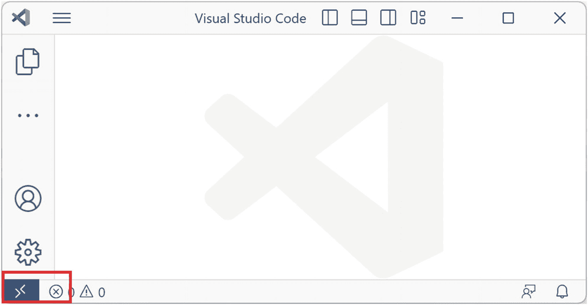

Visual Studio Code 窗口的截图，左侧面板有多个图标，左下角的连接按钮被高亮显示。

图 6-1

打开远程窗口并使用连接按钮

点击该按钮后，你会看到不同的选项。在 *Remote-SSH* 部分选择 *Connect Current Window to Host*（图 6-2）。

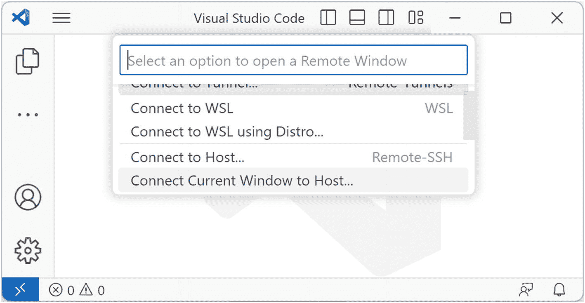

Visual Studio Code 窗口的截图，左侧面板有多个图标，连接按钮已被点击。中央面板显示多个搜索选项，其中 Remote-SSH 部分的 Connect Current Window to Host 被高亮显示。

图 6-2

通过 SSH 连接到远程主机的选项

然后选择 *Configure SSH Hosts*（图 6-3）。

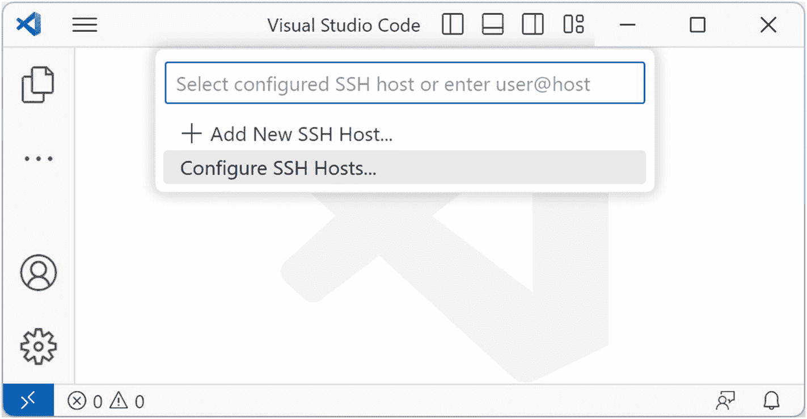

Visual Studio Code 窗口的截图，左侧面板有多个图标，连接按钮已被点击。中央面板显示一个搜索下拉菜单，其中 configure SSH hosts 选项被选中。

图 6-3

配置 SSH 远程主机的选项

接下来，选择一个配置文件，用于写入云实例的 IP 地址、云实例的用户名以及私钥位置（在我们的例子中是在 Windows 上），如图 6-4 所示。

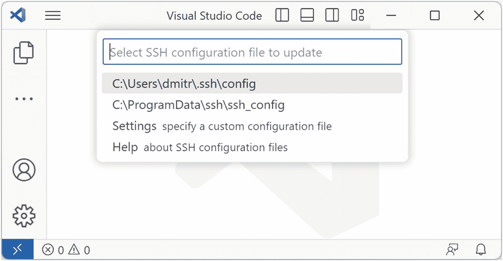

Visual Studio Code 窗口的截图，左侧面板有多个图标，连接按钮已被点击。在 select SSH configuration file to update 下拉菜单下，显示了用户 dmitr 文件夹下的 .ssh 配置文件被选中。

图 6-4

选择配置文件

选择位于 `C:\Users` 文件夹中的配置文件，并添加所需信息（图 6-5）。

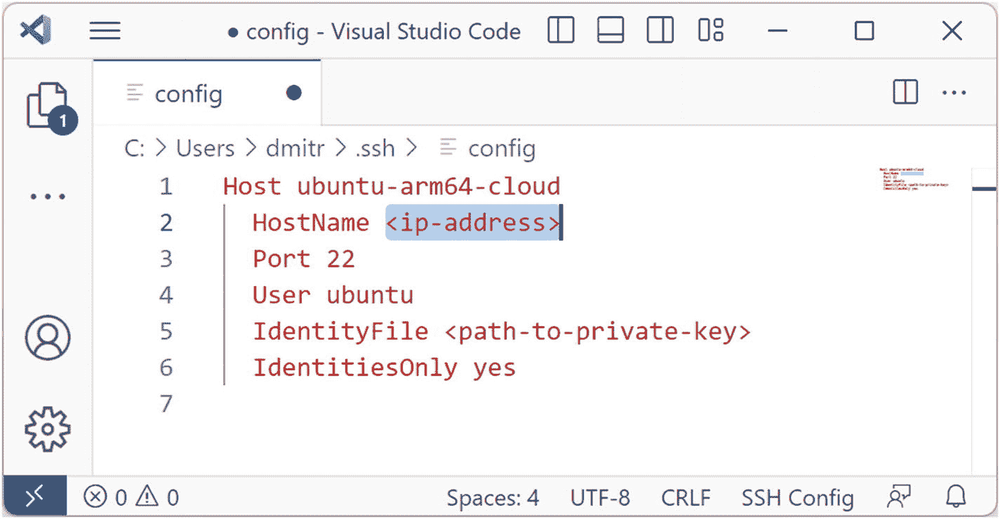

Visual Studio Code 配置窗口的截图，左侧面板连接按钮已被点击。工作区中显示了一个程序，其中用于主机名的 IP 地址标签被高亮显示。其他参数包括端口 22、用户 ubuntu、带有路径的标识文件以及仅标识为 yes。

图 6-5

一个 SSH 配置文件示例。你需要指定云实例的 IP 地址、用户名和私钥路径

保存配置文件，然后再次点击左下角的 *Open a Remote Window* 按钮（图 6-2）。

然后选择配置文件中保存的主机（图 6-6）。

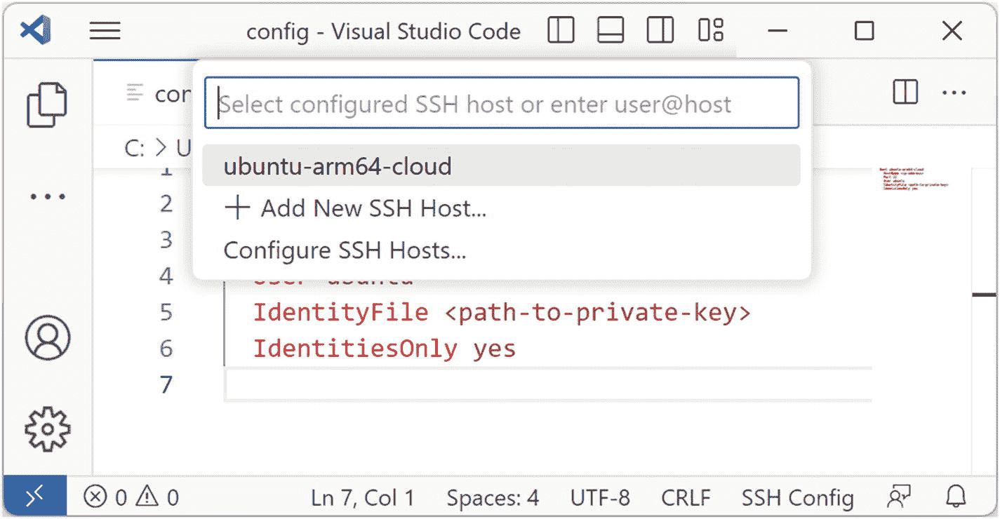

Visual Studio Code 配置窗口的截图，左侧面板连接按钮已被点击。工作区中显示了一个程序，其上方覆盖了一个搜索框下的下拉菜单，用于选择已配置的 SSH 主机，其中 ubuntu arm 64 cloud 被选中。

图 6-6

选择要连接的主机

你将成功连接。主机名会显示在左下角的连接按钮上（图 6-7）。

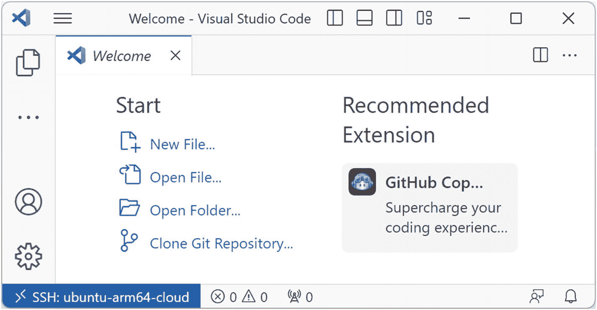

欢迎使用 Visual Studio Code 窗口的截图，左侧面板有多个图标。欢迎屏幕下显示了一些选项，左下角的连接按钮上 SSH ubuntu arm 64 cloud 被高亮显示。

图 6-7

通过 SSH 连接的主机


### 案例研究

在本案例研究中，请使用上一章中的相同 Python 脚本。现在，连接到云实例后，您可以打开一个包含 Python 脚本的文件夹（*文件 ➤ 打开文件夹*）。如果您是首次打开或创建 Python 文件，系统可能会提示您安装 Python VS Code 扩展。

回顾一下，该案例研究模拟了我曾遇到的一个云主机监控脚本问题：该脚本运行一段时间后，会开始泄漏进程内存。

要进行调试，请使用 F5 键（*运行 ➤ 启动调试*）启动 `process-monitoring.py`，并选择 *Python 文件* 配置（图 6-8）。

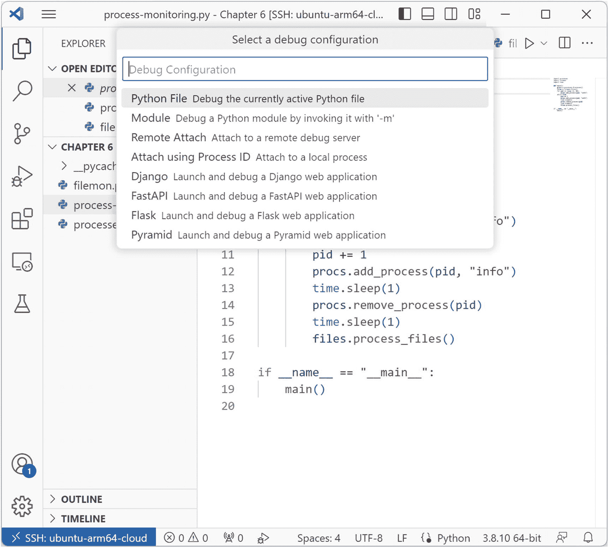

进程监控 py 窗口的截图，左侧面板上有多个图标。搜索框下方覆盖了一个下拉菜单，其中选中了“Python 文件 调试当前活动的 Python 文件”选项。

图 6-8

选择调试配置

程序现在正在运行，您可以通过*调试*浮动工具栏上的*暂停*（F6）按钮进行**中断**（图 6-9）。

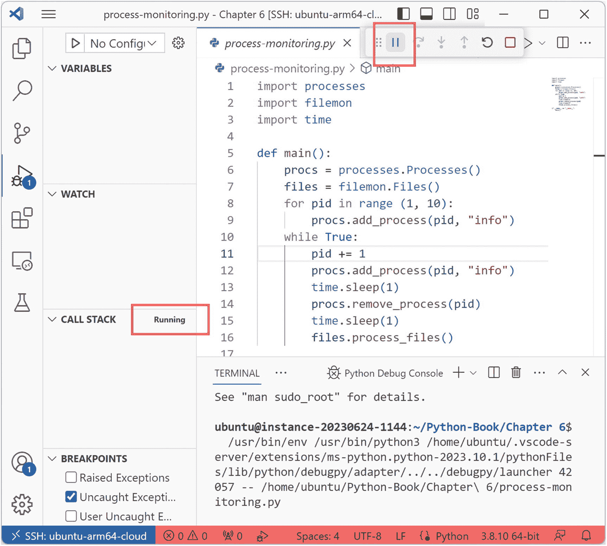

进程监控 py 窗口的截图，左侧面板上有多个图标。工作区下显示了一个程序，其中顶部工具栏的暂停按钮和左侧面板中调用堆栈旁边的“正在运行”字样被高亮显示。

图 6-9

运行中的程序与调试工具栏

暂停后，在调用堆栈中选择合适的**作用域**，以便访问各种变量（图 6-10）。

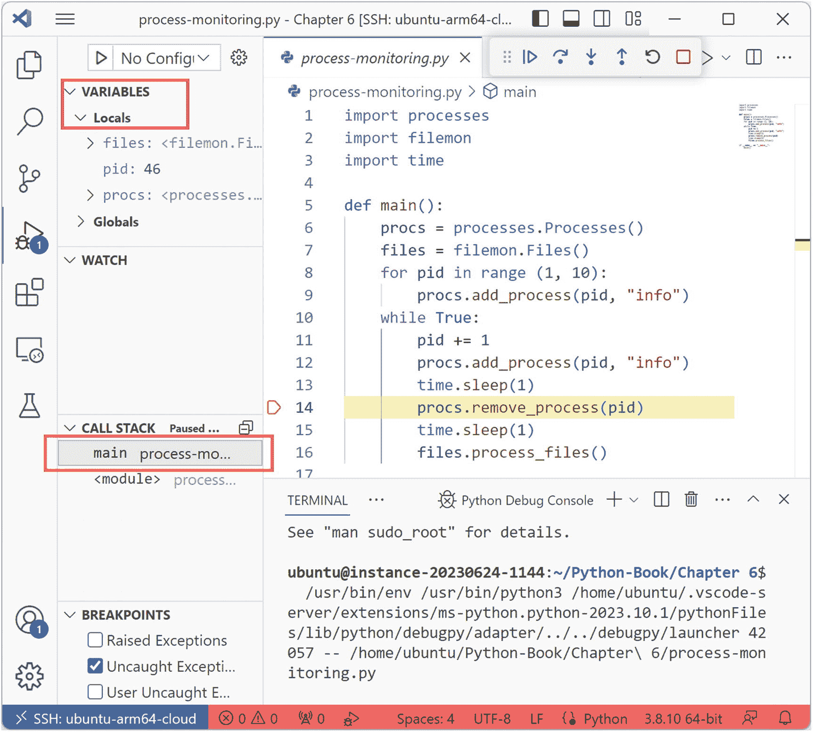

进程监控 py 窗口的截图，其中带有标签的变量和调用堆栈下的主进程被高亮显示。工作区下显示了一个程序，其中第 14 行的“移除进程”被高亮显示。

图 6-10

调试作用域

现在切换到*调试控制台*选项卡，输入表达式以检查 `Processes._procinfo` 字典大小的**变量值**（图 6-11）。

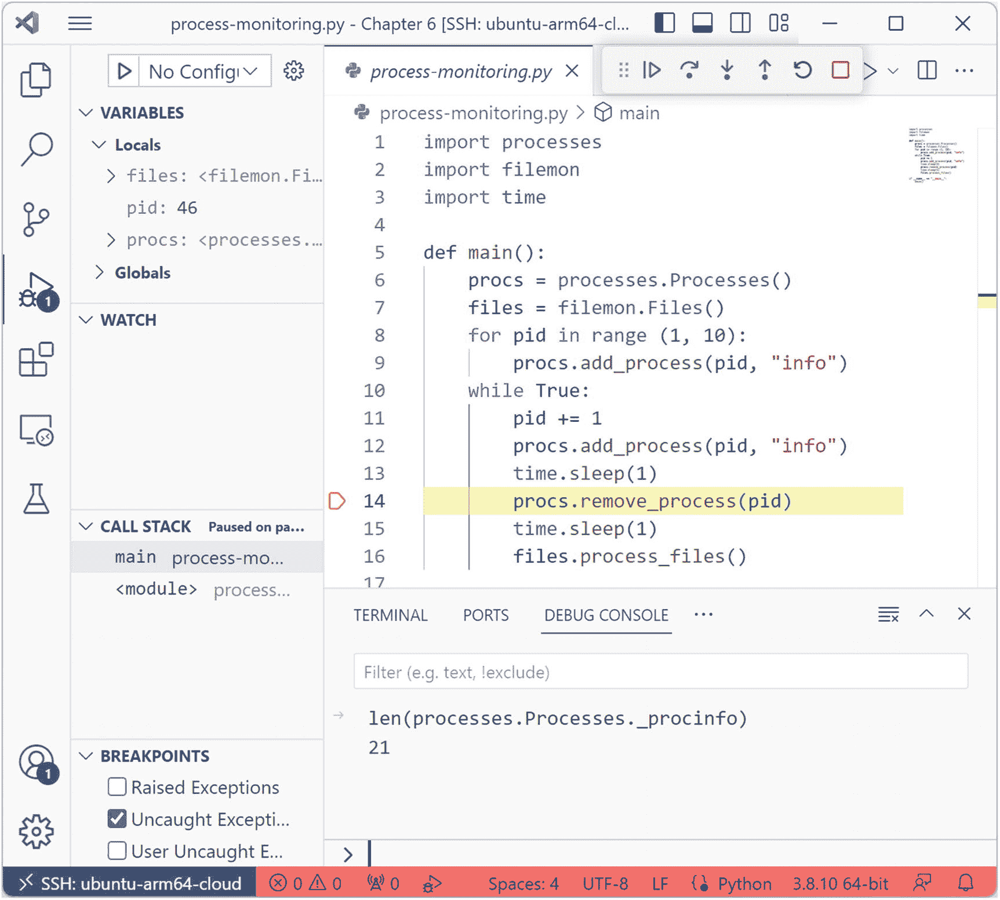

进程监控 py 窗口的截图，左侧面板上有变量和调用堆栈下拉菜单。右侧面板的工作区下显示了一个程序。代码下方显示的是 `len(processes._procinfo)` 的值，为 21。

图 6-11

使用调试控制台检查变量值

由于您知道字典的大小只会在运行一段时间后开始增加，请打开 `processes.py` 文件，并在 `add_process` 函数的第一行设置一个**代码断点**（图 6-12）。

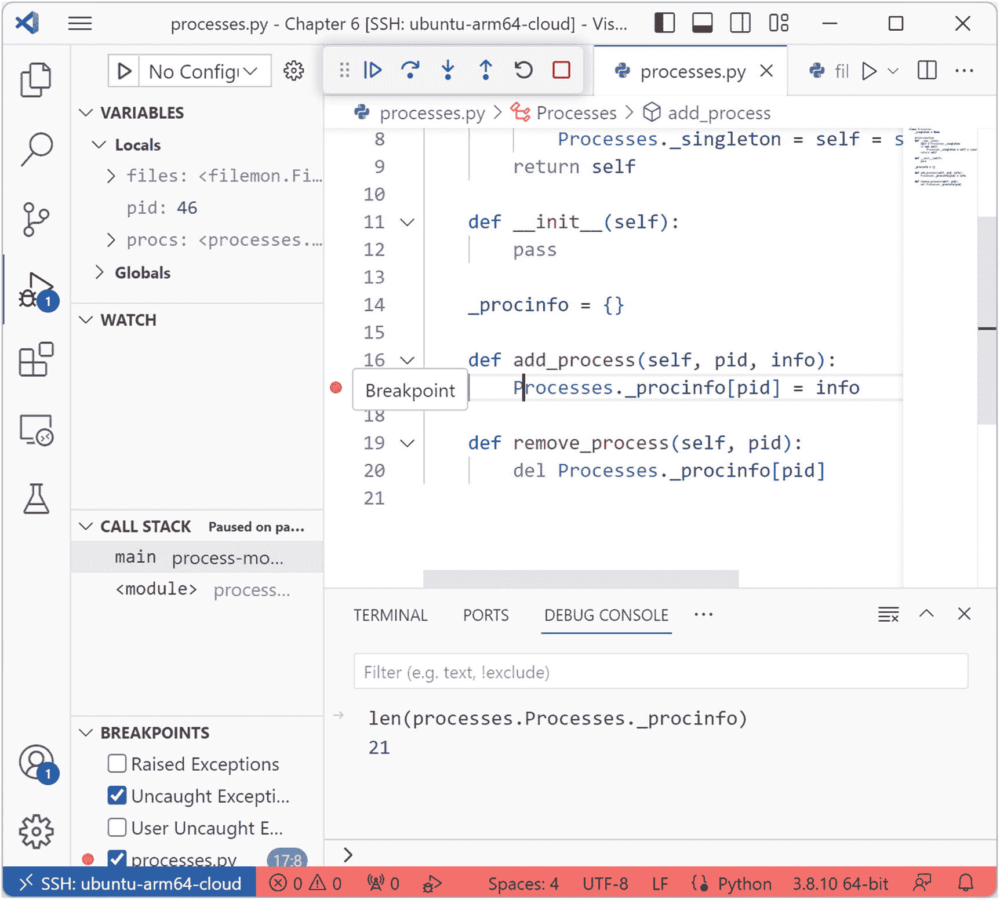

一个包含 processes.py 文件的窗口截图，左侧面板上有变量和调用堆栈下拉菜单。右侧面板的工作区下显示了一个程序，其中 `add_process` 函数定义下的第 17 行设置了断点。

图 6-12

设置代码断点

然后右键单击断点圆点，选择*编辑断点*，并指定仅在字典大小超过 100 时才命中的表达式（按 Enter 键设置条件）。您会看到圆点的形状发生了变化。再次使用*调试*工具栏（F5）继续执行并等待（图 6-13）。

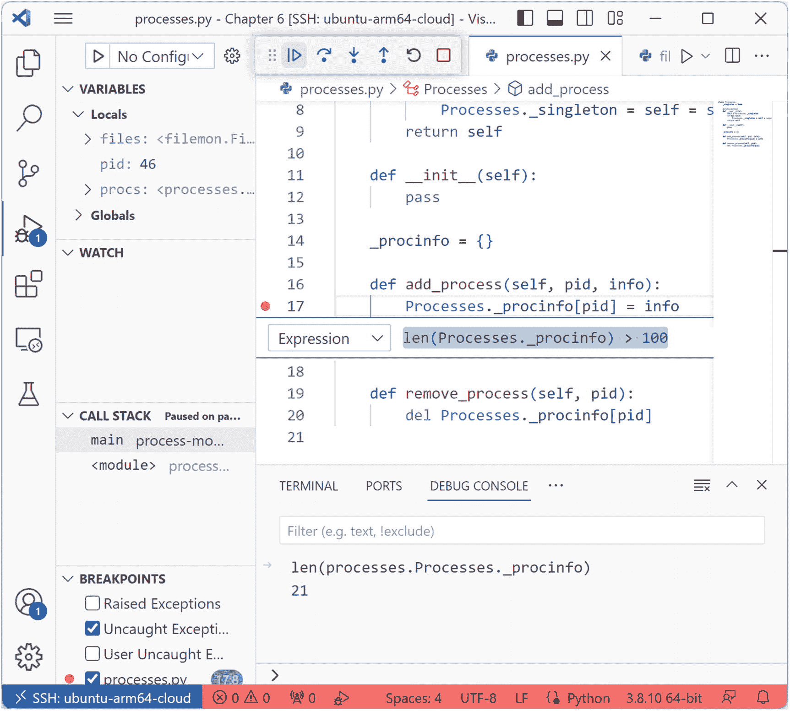

一个包含 processes.py 文件的窗口截图，左侧面板上有变量和调用堆栈下拉菜单。右侧面板的工作区下显示了一个程序，其中包含表达式 `len(processes._procinfo) > 100` 的行被高亮显示。

图 6-13

设置代码断点条件表达式

几分钟后，您会再次**中断**，并且圆点的形状发生了变化。您现在可以在调试控制台中重复执行您的**变量值**表达式。另请注意，调用堆栈的方向与回溯相反（图 6-14）。

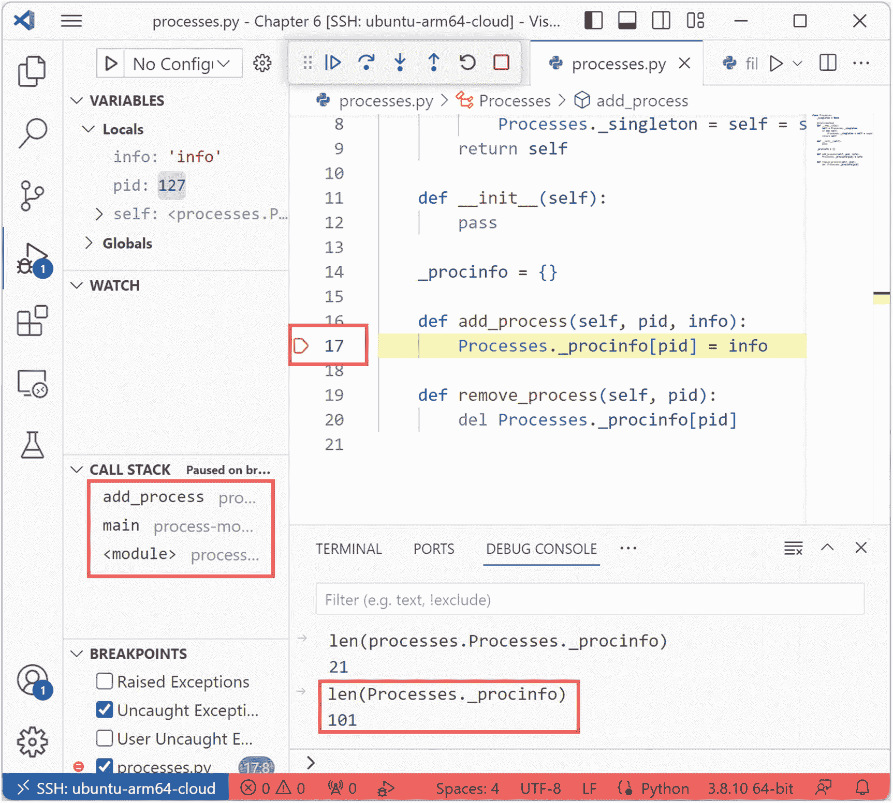

一个包含 processes.py 文件的窗口截图，左侧面板上的调用堆栈下拉菜单、右侧面板工作区中程序的第 17 行以及调试控制台中的 `len(processes._procinfo) > 101` 被高亮显示。

图 6-14

条件中断

现在移除该断点的条件表达式，并为 `remove_process` 函数创建另一个**代码断点**，在两个断点中都设置**断点操作**以记录 ADD 和 REMOVE 消息（图 6-15）。

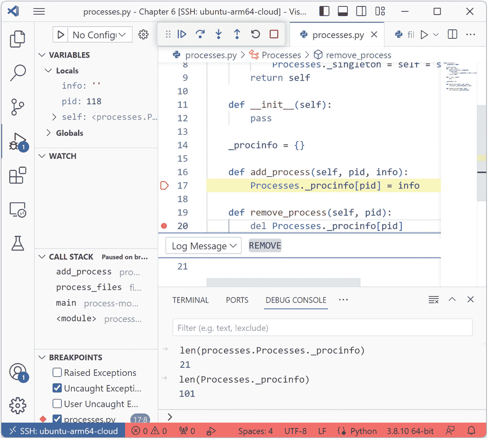

一个包含 processes.py 文件的窗口截图，左侧面板上有多个选项。右侧面板的程序中，`remove_process` 函数下的第 20 行设置了断点。下方高亮显示的“remove”一词的日志消息显示为 21。

图 6-15

指定断点操作

继续执行，您会看到日志消息中 ADD 消息的数量是 REMOVE 消息的两倍（图 6-16）。

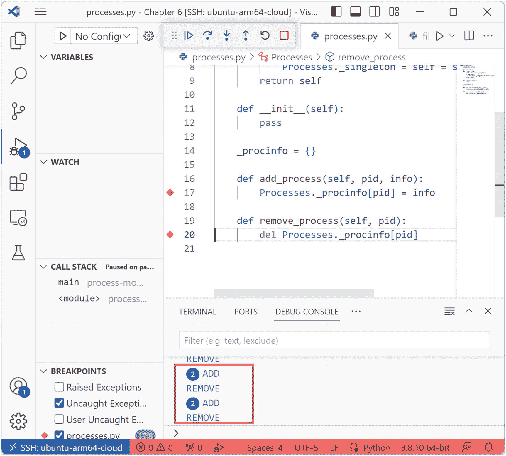

一个包含 processes.py 文件的窗口截图，左侧面板上有多个选项。右侧面板的程序中，第 17 行和第 20 行设置了断点，调试控制台下的日志消息选项被高亮显示，内容为“2 add, remove, 2 add, remove”。

图 6-16

日志消息

我不知道它们的**使用跟踪**，也找不到像上一章使用 PDB 时那样打印回溯的可靠方法。但由于您使用的是 IDE 编辑器，您可以直接修改相关文件，并添加额外的调试变量以在*调试控制台*中打印（图 6-17）。

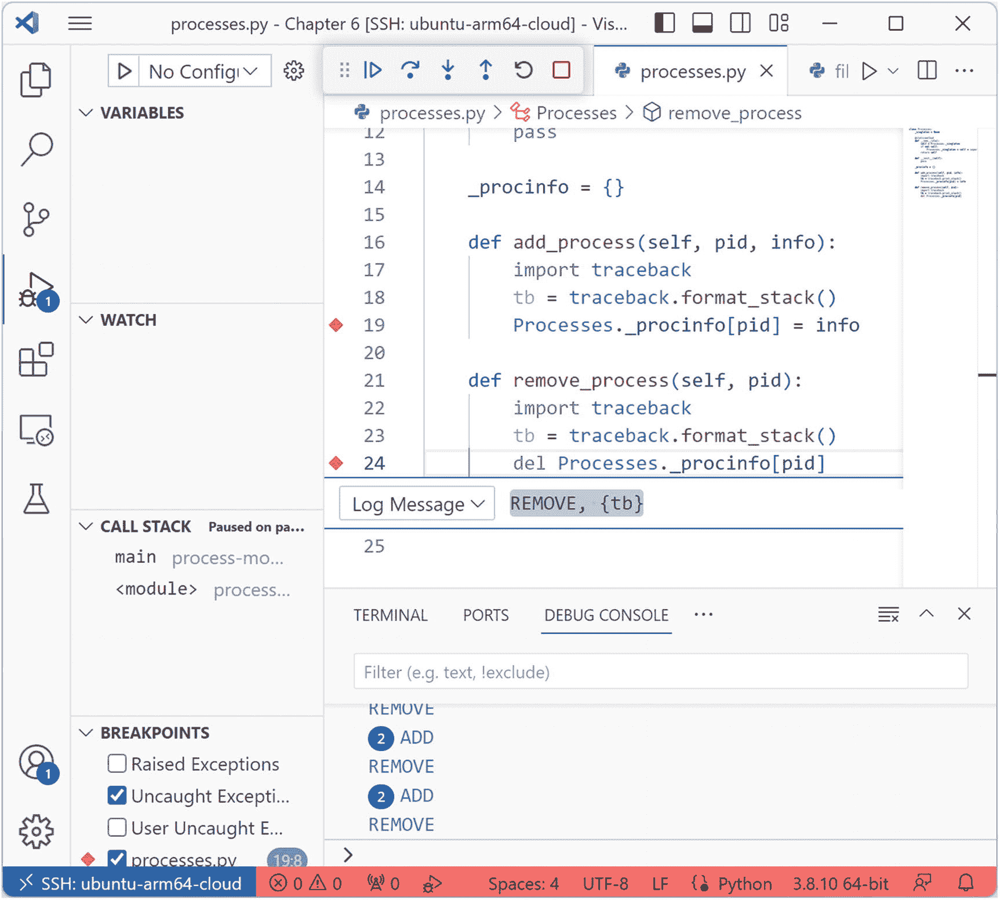

一个包含 processes.py 文件的窗口截图，左侧面板上有多个选项。程序中第 19 行和第 24 行设置了断点，在变量 `tb` 中添加了回溯，以便在调试控制台下打印包含“remove”和“tb”字样的日志消息。

图 6-17

向日志记录添加回溯

您需要从*调试*工具栏（Ctrl-Shift-F5）重新启动调试会话。重启后，继续执行，等待几分钟，然后暂停，检查日志中最后几条 ADD 和 REMOVE 条目（图 6-18）。

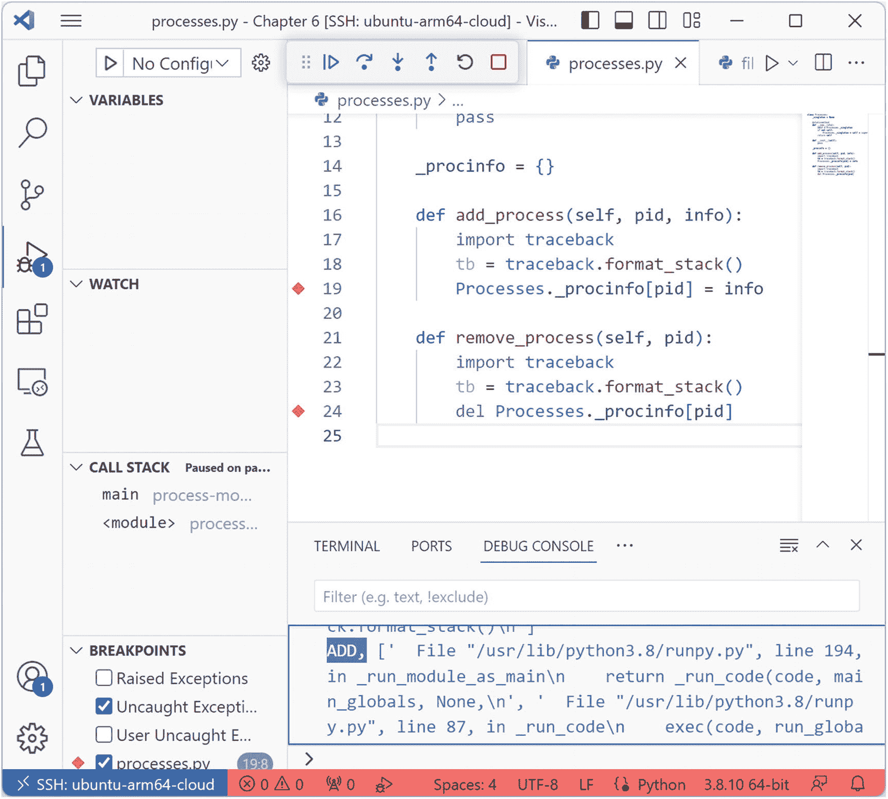

一个包含 processes.py 文件的窗口截图，左侧面板上有多个选项。程序中第 19 行和第 24 行设置了断点。调试控制台窗口包含文件路径以及高亮显示的“add”字样。

图 6-18

生成使用跟踪

从日志中，您可以看到来自 `filemon.py` 模块的 ADD 操作没有相应的 REMOVE 操作，这与上一章的建议相同。

```
...
ADD, ['  File "/usr/lib/python3.8/runpy.py", line 194, in _run_module_as_main\n    return _run_code(code, main_globals, None,\n', '  File "/usr/lib/python3.8/runpy.py", line 87, in _run_code\n    exec(code, run_globals)\n', '  File "/home/ubuntu/.vscode-server/extensions/ms-python.python-2023.10.1/pythonFiles/lib/python/debugpy/adapter/../../debugpy/launcher/../../debugpy/__main__.py", line 39, in \n    cli.main()\n', '  File "/home/ubuntu/.vscode-server/extensions/ms-python.python-2023.10.1/pythonFiles/lib/python/debugpy/adapter/../../debugpy/launcher/../../debugpy/../debugpy/server/cli.py", line 430, in main\n    run()\n', '  File "/home/ubuntu/.vscode-server/extensions/ms-python.python-2023.10.1/pythonFiles/lib/python/debugpy/adapter/../../debugpy/launcher/../../debugpy/../debugpy/server/cli.py", line 284, in run_file\n    runpy.run_path(target, run_name="__main__")\n', '  File "/home/ubuntu/.vscode-server/extensions/ms-python.python-2023.10.1/pythonFiles/lib/python/debugpy/_vendored/pydevd/_pydevd_bundle/pydevd_runpy.py", line 321, in run_path\n    return _run_module_code(code, init_globals, run_name,\n', '  File "/home/ubuntu/.vscode-server/extensions/ms-python.python-2023.10.1/pythonFiles/lib/python/debugpy/_vendored/pydevd/_pydevd_bundle/pydevd_runpy.py", line 135, in _run_module_code\n    _run_code(code, mod_globals, init_globals,\n', '  File "/home/ubuntu/.vscode-server/extensions/ms-python.python-2023.10.1/pythonFiles/lib/python/debugpy/_vendored/pydevd/_pydevd_bundle/pydevd_runpy.py", line 124, in _run_code\n    exec(code, run_globals)\n', '  File "/home/ubuntu/Python-Book/Chapter 6/process-monitoring.py", line 19, in \n    main()\n', '  File "/home/ubuntu/Python-Book/Chapter 6/process-monitoring.py", line 16, in main\n    files.process_files()\n', '  File "/home/ubuntu/Python-Book/Chapter 6/filemon.py", line 11, in process_files\n    self._processes.add_process(self._count, "")\n', '  File "/home/ubuntu/Python-Book/Chapter 6/processes.py", line 18, in add_process\n    tb = traceback.format_stack()\n']
ADD, ['  File "/usr/lib/python3.8/runpy.py", line 194, in _run_module_as_main\n    return _run_code(code, main_globals, None,\n', '  File "/usr/lib/python3.8/runpy.py", line 87, in _run_code\n    exec(code, run_globals)\n', '  File "/home/ubuntu/.vscode-server/extensions/ms-python.python-2023.10.1/pythonFiles/lib/python/debugpy/adapter/../../debugpy/launcher/../../debugpy/__main__.py", line 39, in \n    cli.main()\n', '  File "/home/ubuntu/.vscode-server/extensions/ms-python.python-2023.10.1/pythonFiles/lib/python/debugpy/adapter/../../debugpy/launcher/../../debugpy/../debugpy/server/cli.py", line 430, in main\n    run()\n', '  File "/home/ubuntu/.vscode-server/extensions/ms-python.python-2023.10.1/pythonFiles/lib/python/debugpy/adapter/../../debugpy/launcher/../../debugpy/../debugpy/server/cli.py", line 284, in run_file\n    runpy.run_path(target, run_name="__main__")\n', '  File "/home/ubuntu/.vscode-server/extensions/ms-python.python-2023.10.1/pythonFiles/lib/python/debugpy/_vendored/pydevd/_pydevd_bundle/pydevd_runpy.py", line 321, in run_path\n    return _run_module_code(code, init_globals, run_name,\n', '  File "/home/ubuntu/.vscode-server/extensions/ms-python.python-2023.10.1/pythonFiles/lib/python/debugpy/_vendored/pydevd/_pydevd_bundle/pydevd_runpy.py", line 135, in _run_module_code\n    _run_code(code, mod_globals, init_globals,\n', '  File "/home/ubuntu/.vscode-server/extensions/ms-python.python-2023.10.1/pythonFiles/lib/python/debugpy/_vendored/pydevd/_pydevd_bundle/pydevd_runpy.py", line 124, in _run_code\n    exec(code, run_globals)\n', '  File "/home/ubuntu/Python-Book/Chapter 6/process-monitoring.py", line 19, in \n    main()\n', '  File "/home/ubuntu/Python-Book/Chapter 6/process-monitoring.py", line 12, in main\n    procs.add_process(pid, "info")\n', '  File "/home/ubuntu/Python-Book/Chapter 6/processes.py", line 18, in add_process\n    tb = traceback.format_stack()\n']
REMOVE, ['  File "/usr/lib/python3.8/runpy.py", line 194, in _run_module_as_main\n    return _run_code(code, main_globals, None,\n', '  File "/usr/lib/python3.8/runpy.py", line 87, in _run_code\n    exec(code, run_globals)\n', '  File "/home/ubuntu/.vscode-server/extensions/ms-python.python-2023.10.1/pythonFiles/lib/python/debugpy/adapter/../../debugpy/launcher/../../debugpy/__main__.py", line 39, in \n    cli.main()\n', '  File "/home/ubuntu/.vscode-server/extensions/ms-python.python-2023.10.1/pythonFiles/lib/python/debugpy/adapter/../../debugpy/launcher/../../debugpy/../debugpy/server/cli.py", line 430, in main\n    run()\n', '  File "/home/ubuntu/.vscode-server/extensions/ms-python.python-2023.10.1/pythonFiles/lib/python/debugpy/adapter/../../debugpy/launcher/../../debugpy/../debugpy/server/cli.py", line 284, in run_file\n    runpy.run_path(target, run_name="__main__")\n', '  File "/home/ubuntu/.vscode-server/extensions/ms-python.python-2023.10.1/pythonFiles/lib/python/debugpy/_vendored/pydevd/_pydevd_bundle/pydevd_runpy.py", line 321, in run_path\n    return _run_module_code(code, init_globals, run_name,\n', '  File "/home/ubuntu/.vscode-server/extensions/ms-python.python-2023.10.1/pythonFiles/lib/python/debugpy/_vendored/pydevd/_pydevd_bundle/pydevd_runpy.py", line 135, in _run_module_code\n    _run_code(code, mod_globals, init_globals,\n', '  File "/home/ubuntu/.vscode-server/extensions/ms-python.python-2023.10.1/pythonFiles/lib/python/debugpy/_vendored/pydevd/_pydevd_bundle/pydevd_runpy.py", line 124, in _run_code\n    exec(code, run_globals)\n', '  File "/home/ubuntu/Python-Book/Chapter 6/process-monitoring.py", line 19, in \n    main()\n', '  File "/home/ubuntu/Python-Book/Chapter 6/process-monitoring.py", line 14, in main\n    procs.remove_process(pid)\n', '  File "/home/ubuntu/Python-Book/Chapter 6/processes.py", line 23, in remove_process\n    tb = traceback.format_stack()\n']
...
```


