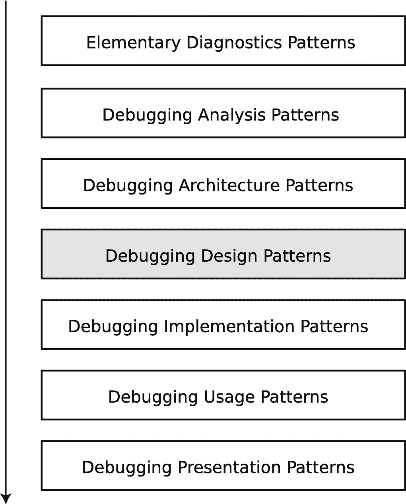
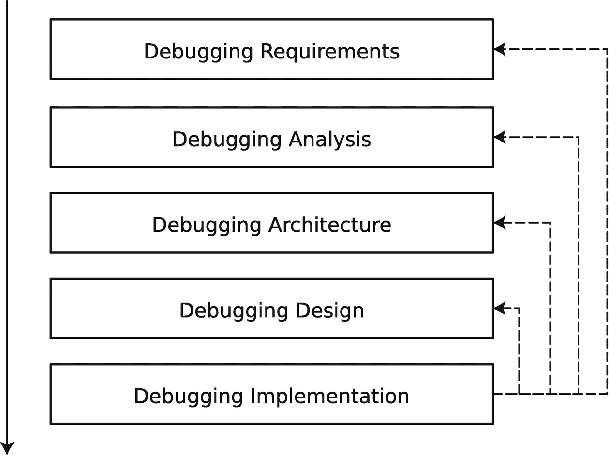

# 9. 调试设计模式

在上一章中，你了解了调试架构模式，回答了我们在哪里、何时、如何调试以及调试什么这些最重要的问题。

在本章中，我将通过涉及基础诊断模式、分析和调试架构的真实案例研究，介绍最常见的调试设计模式（图 9-1）。这些模式包括**变异**、**替换**、**隔离**和**尝试-捕获**。模式名称的选择基于作者在系统编程、用户界面开发、机器学习和云原生应用等软件领域的调试经验。其他软件领域（如游戏或嵌入式）可能有不同或额外的模式名称。模式语言并非固定不变；如果有助于团队和软件社区^(⁵⁶)，每个人都可以拥有自己的模式，或改编你正在阅读的本书中的现有模式。

**变异**涉及更改代码、数据和配置值，以便在执行过程中以及使用调试实现模式时观察结果。

**替换**在更高层次上运作，你可以将整个函数、类甚至组件替换为具有兼容接口的其他函数、类或组件。

**隔离**用于独立于其他部分调试代码，同时固定所有其他依赖项，并且对你调试的代码不产生任何副作用。

**尝试-捕获**是一种过程，你重复所有选定的模式，并希望看到行为的变化。



面向模式的调试过程的堆叠框图。从上到下的模块依次为基础诊断、调试分析、调试架构、调试设计、调试实现、调试使用和调试呈现模式。其中调试设计被突出显示。

图 9-1

面向模式的调试过程与调试设计模式

你可能曾认为面向模式的调试过程是直接且瀑布式的。这种印象与复杂软件问题的实际调试场景相去甚远。实际的面向模式调试过程通常是迭代的。它可能会根据调试结果和一组新的执行产物（图 9-2）以及相应的一组新的调试模式，触发对调试需求、诊断（分析）、架构和设计的重新评估。



表示面向模式的调试过程的堆叠框图。从上到下的模块依次为调试需求、调试分析、调试架构、调试设计和调试实现。箭头从调试实现指向其他模块。

图 9-2

面向模式的调试过程的迭代特性

现在让我们研究两个调试案例研究及其相应的调试模式层。

## CI 构建案例研究

本案例研究描述了一位工程师在云 CI 构建系统（用 Python 编写）升级后失败时所面临的调试问题。问题必须尽快解决，以便暂时能够进行构建，而无需将代码更改上报给云 CI 构建系统团队并等待新版本发布。

## 基础诊断

系统崩溃，在控制台上打印了堆栈跟踪，底部行如下：

```
...
File ".../ci/build-driver.py", line 346, in isVersion
varStr = variable.replace("-","")
AttributeError: 'Variable' object has no attribute 'replace'
```

### 分析

**托管堆栈跟踪**分析模式有助于找到问题对象 `variable` 及其失败的方法 `replace`。

### 架构

工程师不熟悉 Python 代码，且代码在 Python 虚拟环境中执行。因此，决定在相同的失败环境中使用**软件叙事**（控制台日志）进行**事后**调试（**原位**）。

### 设计

调试设计涉及代码**变异**，添加一条 `print(variable)` 语句，然后分析控制台输出中的**状态转储**。

### 实现

工程师使用**类型结构**和**变量值**来确定最佳行动方案。代码更改后，控制台输出包含了 `variable` 对象的表示，其中包含的是配置文件名参数而非值。构建系统配置文件是用一种流行的云原生配置语言编写的。因此，工程师更改了调试设计，这次通过配置**变异**，将构建配置文件中所有出现的参数变量替换为硬编码值作为临时修复。这次 CI 构建成功了。

## 数据处理案例研究

本案例研究描述了工程师在使用 Pandas 数据分析和操作库时面临的调试问题，该库运行在 Windows 上的第三方数据处理和机器学习系统中，该系统使用 Python DLL 来执行 Python 脚本。

## 基础诊断

除了能够执行 Python 脚本外，该系统还嵌入了 Python REPL。然而，在执行以下 Python 代码行时，REPL 发生了**挂起**：

```
import pandas
```

由于数据处理系统已冻结，决定按照第 3 章“如何在 Windows 上生成进程内存转储”一节所述，保存其进程内存转储。


### 分析

为了分析内存转储文件及其**堆栈跟踪集合**，并找到问题**堆栈跟踪**，最终定位到**原始模块**，工程师使用了微软调试器 `WinDbg`。

如果你从未使用过 `WinDbg`，但正在 Windows 上进行开发，那么是时候安装这个调试工具了。我推荐使用 `WinDbg` 应用（原 `WinDbg Preview`），可以从微软网站下载并安装^(⁵⁷)。

收集到的进程内存转储显示了以下问题堆栈跟踪（`~*` 命令表示对每个线程执行接下来的 `kcL` 命令；`kcL` 命令表示以简短形式打印堆栈跟踪，并且为了视觉清晰，此处省略了源代码引用）：

```
0:000> ~*kcL
11  Id: 5bb0.7818 Suspend: 1 Teb: 000000dc`e1f28000 Unfrozen
### Call Site
00 ntdll!NtWaitForSingleObject
01 KERNELBASE!WaitForSingleObjectEx
02 python37!_PyCOND_WAIT_MS
03 python37!PyCOND_TIMEDWAIT
04 python37!take_gil
05 python37!PyEval_RestoreThread
06 python37!PyGILState_Ensure
07 _multiarray_umath_cp37_win_amd64!PyInit__multiarray_umath
08 _multiarray_umath_cp37_win_amd64!PyInit__multiarray_umath
09 _multiarray_umath_cp37_win_amd64
0a _multiarray_umath_cp37_win_amd64
0b _multiarray_umath_cp37_win_amd64
0c _multiarray_umath_cp37_win_amd64
0d _multiarray_umath_cp37_win_amd64!PyInit__multiarray_umath
0e python37!type_call
0f python37!_PyObject_FastCallKeywords
10 python37!call_function
11 python37!_PyEval_EvalFrameDefault
12 python37!PyEval_EvalFrameEx
13 python37!function_code_fastcall
14 python37!_PyFunction_FastCallKeywords
15 python37!call_function
16 python37!_PyEval_EvalFrameDefault
17 python37!PyEval_EvalFrameEx
18 python37!_PyEval_EvalCodeWithName
19 python37!PyEval_EvalCodeEx
1a python37!PyEval_EvalCode
1b python37!builtin_exec_impl
1c python37!builtin_exec
1d python37!_PyMethodDef_RawFastCallDict
1e python37!_PyEval_EvalFrameDefault
1f python37!PyEval_EvalFrameEx
20 python37!_PyEval_EvalCodeWithName
21 python37!_PyFunction_FastCallKeywords
22 python37!call_function
23 python37!_PyEval_EvalFrameDefault
24 python37!PyEval_EvalFrameEx
25 python37!function_code_fastcall
26 python37!_PyFunction_FastCallKeywords
27 python37!call_function
28 python37!_PyEval_EvalFrameDefault
29 python37!PyEval_EvalFrameEx
2a python37!function_code_fastcall
2b python37!_PyFunction_FastCallKeywords
2c python37!call_function
2d python37!_PyEval_EvalFrameDefault
2e python37!PyEval_EvalFrameEx
2f python37!function_code_fastcall
30 python37!_PyFunction_FastCallKeywords
31 python37!call_function
32 python37!_PyEval_EvalFrameDefault
33 python37!PyEval_EvalFrameEx
34 python37!function_code_fastcall
35 python37!_PyFunction_FastCallDict
36 python37!_PyObject_FastCallDict
37 python37!object_vacall
38 python37!_PyObject_CallMethodIdObjArgs
39 python37!import_find_and_load
3a python37!PyImport_ImportModuleLevelObject
3b python37!_PyEval_EvalFrameDefault
3c python37!PyEval_EvalFrameEx
3d python37!_PyEval_EvalCodeWithName
3e python37!PyEval_EvalCodeEx
3f python37!PyEval_EvalCode
40 python37!builtin_exec_impl
41 python37!builtin_exec
42 python37!_PyMethodDef_RawFastCallDict
43 python37!_PyEval_EvalFrameDefault
44 python37!PyEval_EvalFrameEx
45 python37!_PyEval_EvalCodeWithName
46 python37!_PyFunction_FastCallKeywords
47 python37!call_function
48 python37!_PyEval_EvalFrameDefault
49 python37!PyEval_EvalFrameEx
4a python37!function_code_fastcall
4b python37!_PyFunction_FastCallKeywords
4c python37!call_function
4d python37!_PyEval_EvalFrameDefault
4e python37!PyEval_EvalFrameEx
4f python37!function_code_fastcall
50 python37!_PyFunction_FastCallKeywords
51 python37!call_function
52 python37!_PyEval_EvalFrameDefault
53 python37!PyEval_EvalFrameEx
54 python37!function_code_fastcall
55 python37!_PyFunction_FastCallKeywords
56 python37!call_function
57 python37!_PyEval_EvalFrameDefault
58 python37!PyEval_EvalFrameEx
59 python37!function_code_fastcall
5a python37!_PyFunction_FastCallDict
5b python37!_PyObject_FastCallDict
5c python37!object_vacall
5d python37!_PyObject_CallMethodIdObjArgs
5e python37!import_find_and_load
5f python37!PyImport_ImportModuleLevelObject
60 python37!_PyEval_EvalFrameDefault
61 python37!PyEval_EvalFrameEx
62 python37!_PyEval_EvalCodeWithName
63 python37!PyEval_EvalCodeEx
64 python37!PyEval_EvalCode
65 python37!builtin_exec_impl
66 python37!builtin_exec
67 python37!_PyMethodDef_RawFastCallDict
68 python37!_PyEval_EvalFrameDefault
69 python37!PyEval_EvalFrameEx
6a python37!_PyEval_EvalCodeWithName
6b python37!_PyFunction_FastCallKeywords
6c python37!call_function
6d python37!_PyEval_EvalFrameDefault
6e python37!PyEval_EvalFrameEx
6f python37!function_code_fastcall
70 python37!_PyFunction_FastCallKeywords
71 python37!call_function
72 python37!_PyEval_EvalFrameDefault
73 python37!PyEval_EvalFrameEx
74 python37!function_code_fastcall
75 python37!_PyFunction_FastCallKeywords
76 python37!call_function
77 python37!_PyEval_EvalFrameDefault
78 python37!PyEval_EvalFrameEx
79 python37!function_code_fastcall
7a python37!_PyFunction_FastCallKeywords
7b python37!call_function
7c python37!_PyEval_EvalFrameDefault
7d python37!PyEval_EvalFrameEx
7e python37!function_code_fastcall
7f python37!_PyFunction_FastCallDict
80 python37!_PyObject_FastCallDict
81 python37!object_vacall
82 python37!_PyObject_CallMethodIdObjArgs
83 python37!import_find_and_load
84 python37!PyImport_ImportModuleLevelObject
85 python37!_PyEval_EvalFrameDefault
86 python37!PyEval_EvalFrameEx
87 python37!_PyEval_EvalCodeWithName
88 python37!PyEval_EvalCodeEx
89 python37!PyEval_EvalCode
8a python37!builtin_exec_impl
8b python37!builtin_exec
8c python37!_PyMethodDef_RawFastCallDict
8d python37!_PyEval_EvalFrameDefault
8e python37!PyEval_EvalFrameEx
8f python37!_PyEval_EvalCodeWithName
90 python37!_PyFunction_FastCallKeywords
91 python37!call_function
92 python37!_PyEval_EvalFrameDefault
93 python37!PyEval_EvalFrameEx
94 python37!function_code_fastcall
95 python37!_PyFunction_FastCallKeywords
96 python37!call_function
97 python37!_PyEval_EvalFrameDefault
98 python37!PyEval_EvalFrameEx
99 python37!function_code_fastcall
9a python37!_PyFunction_FastCallKeywords
9b python37!call_function
9c python37!_PyEval_EvalFrameDefault
9d python37!PyEval_EvalFrameEx
9e python37!function_code_fastcall
9f python37!_PyFunction_FastCallKeywords
a0 python37!call_function
a1 python37!_PyEval_EvalFrameDefault
a2 python37!PyEval_EvalFrameEx
a3 python37!function_code_fastcall
a4 python37!_PyFunction_FastCallDict
a5 python37!_PyObject_FastCallDict
a6 python37!object_vacall
a7 python37!_PyObject_CallMethodIdObjArgs
a8 python37!import_find_and_load
a9 python37!PyImport_ImportModuleLevelObject
aa python37!_PyEval_EvalFrameDefault
ab python37!PyEval_EvalFrameEx
ac python37!_PyEval_EvalCodeWithName
ad python37!PyEval_EvalCodeEx
ae python37!PyEval_EvalCode
af python37!builtin_exec_impl
b0 python37!builtin_exec
b1 python37!_PyMethodDef_RawFastCallKeywords
b2 python37!_PyCFunction_FastCallKeywords
b3 python37!call_function
b4 python37!_PyEval_EvalFrameDefault
b5 python37!PyEval_EvalFrameEx
b6 python37!function_code_fastcall
b7 python37!_PyFunction_FastCallKeywords
b8 python37!call_function
b9 python37!_PyEval_EvalFrameDefault
ba python37!PyEval_EvalFrameEx
bb python37!_PyEval_EvalCodeWithName
bc python37!_PyFunction_FastCallKeywords
bd python37!call_function
be python37!_PyEval_EvalFrameDefault
bf python37!PyEval_EvalFrameEx
c0 python37!function_code_fastcall
c1 python37!_PyFunction_FastCallKeywords
c2 python37!call_function
c3 python37!_PyEval_EvalFrameDefault
c4 python37!PyEval_EvalFrameEx
c5 python37!_PyEval_EvalCodeWithName
c6 python37!_PyFunction_FastCallKeywords
c7 python37!call_function
c8 python37!_PyEval_EvalFrameDefault
c9 python37!PyEval_EvalFrameEx
ca python37!_PyEval_EvalCodeWithName
cb python37!PyEval_EvalCodeEx
cc python37!PyEval_EvalCode
cd python37!run_mod
ce python37!PyRun_StringFlags
cf python37!PyRun_String
d0 data_module!execute_script
...
dc KERNEL32!BaseThreadInitThunk
dd ntdll!RtlUserThreadStart
...
```

看起来使用 `_multiarray_umath_cp37_win_amd64` DLL 的线程被阻塞，正在等待全局解释器锁（GIL）。关于该模块，有以下可用信息：

```
0:000> lmv m _multiarray_umath_cp37_win_amd64
Browse full module list
start             end                 module name
00007ff8`e6f40000 00007ff8`e722b000   _multiarray_umath_cp37_win_amd64 C (export symbols)       C:\Python37\lib\site-packages\numpy\core\_multiarray_umath.cp37-win_amd64.pyd
Loaded symbol image file: C:\Python37\lib\site-packages\numpy\core\_multiarray_umath.cp37-win_amd64.pyd
Image path: C:\Python37\lib\site-packages\numpy\core\_multiarray_umath.cp37-win_amd64.pyd
Image name: _multiarray_umath.cp37-win_amd64.pyd
Browse all global symbols  functions  data
Timestamp:        Tue Apr 12 03:42:29 2022 (6254E715)
CheckSum:         00000000
ImageSize:        002EB000
Translations:     0000.04b0 0000.04e4 0409.04b0 0409.04e4
Information from resource tables:
```

看起来这个 DLL 来自 NumPy Python 库。同时还发现，这个问题看起来像是导入 NumPy 时的一个已知问题^(⁵⁸)。通过导入其他依赖 NumPy 的包也证实了这个问题；程序同样会卡死。


### 架构

为了加速调试过程并避免频繁发送内存转储，工程师们提出使用`In Vivo JIT Code`调试方法，即在程序冻结后，将`WinDbg`调试器^(⁵⁹)附加到进程上，然后分析其`软件状态`。

### 设计

由于问题涉及 Python 解释器和第三方包的原生库，因此提出了 Python 版本`替换`方案。如果没有兼容的 Python 版本可用（例如，由于其他遗留组件，系统无法使用最新的 Python），那么可以尝试替换 Pandas 库。寻找一个具有类似接口且不使用 NumPy 的兼容库。

### 实现

调试实现模式涉及`中断`和`断点操作`来打印堆栈跟踪。最终，在尝试了不同 Python 版本和具有类似接口的库多次之后，决定使用 Polars^(⁶⁰)库来替代 Pandas。

