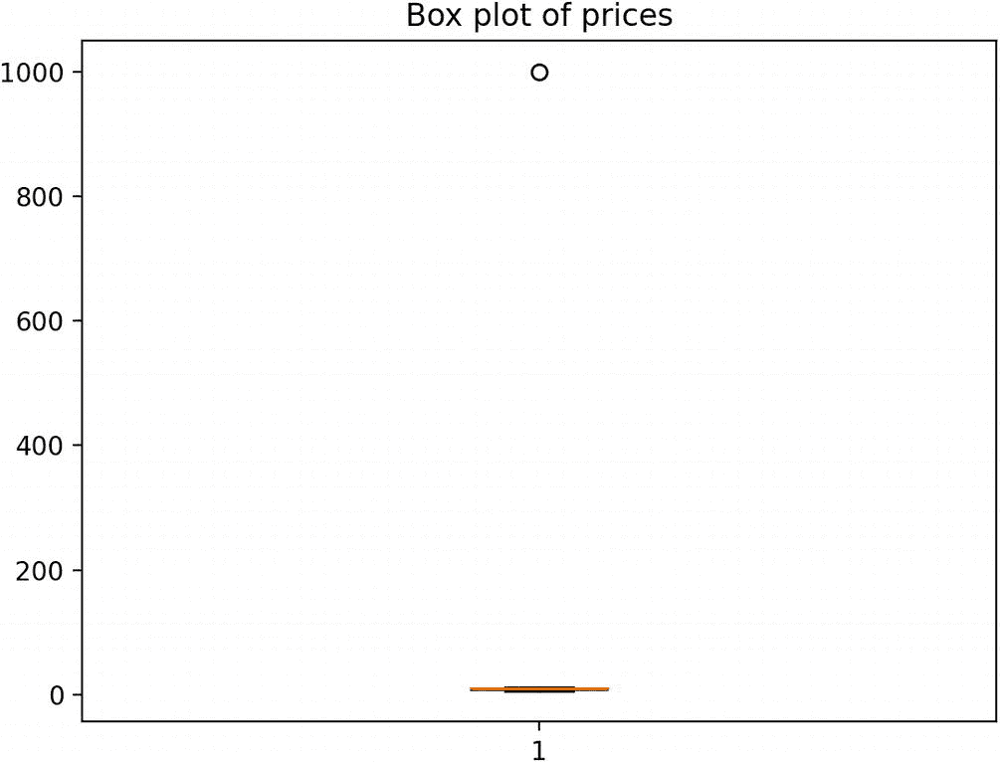
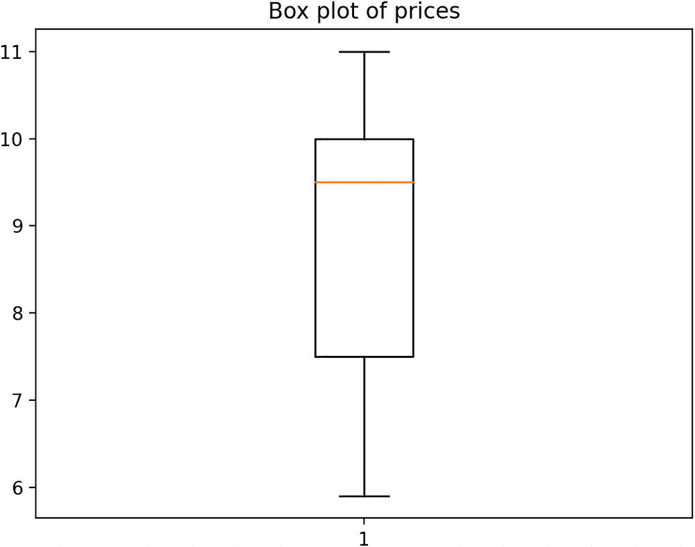

# 14. 人工智能与机器学习中 Python 调试的挑战

在上一章中，你了解了云环境中的调试挑战。在本章中，你将继续探讨不同领域的调试挑战。

Python 语言凭借其简洁性以及 `Pandas`、`TensorFlow`、`Keras`、`PyTorch` 和 `scikit-learn` 等库的强大功能，已成为许多人工智能（AI）和机器学习（ML）项目事实上的标准语言。然而，在 AI/ML 中调试 Python 代码会带来独特的挑战，这是因为数据、模型、算法和硬件之间的相互作用，而这些在传统软件开发中并不常见。本章将探讨其中部分挑战。


## AI/ML 中缺陷的本质

与传统软件中错误通常导致崩溃、卡死或错误输出不同，在 AI/ML 领域，你的模型可能运行顺畅，但会产生不准确或不可靠的结果，且精度低下。一个缺陷可能源于有问题的数据、不正确的算法实现，或者模型或超参数选择不当。与传统调试的主要区别包括：

- **数据驱动的复杂性**：输出不仅仅是代码的直接结果，还取决于你的数据质量、预处理和内在模式。
- **迭代性质**：模型是通过迭代方式改进的。调试通常意味着改进而非修复。

### 复杂性与抽象层

Python 语言的优势在于其庞大的库生态系统，这些库为复杂的数学运算提供了高级抽象。虽然这种抽象有助于提高生产力，但通过层层库代码进行调试可能非常困难。这些库内部使用了多种优化技术，可能使执行流程变得不直观，从而导致追踪执行过程以找到错误根本原因的任务极其困难。

### 非确定性与可复现性

由于许多算法（尤其是那些涉及随机初始化的算法，如神经网络）具有随机性，多次运行相同的代码可能会产生不同的结果。这使得问题难以复现，更难以调试。许多框架利用 GPU 加速，由于异步操作，这可能会引入另一层非确定性。

### 大型数据集

AI/ML 模型通常在大数据集上进行训练。如果存在与数据处理或预处理相关的错误，要找出是哪个具体数据点导致了问题，无异于大海捞针。处理大型数据集时可能出现内存问题，导致难以理解的错误或崩溃。这些问题并不总是容易解决，尤其是当问题出在库处理内存的方式上，而非用户自己的代码，或者是由垃圾回收问题引起时。

### 高维数据

机器学习模型，尤其是深度学习模型，经常处理高维数据。可视化或理解超过三维的数据极具挑战性，这使得调试与数据表示或转换相关的问题变得困难。

### 长时间训练

训练复杂的 AI/ML 模型可能需要很长时间，从几小时到几天甚至几周。如果错误在长时间训练后才显现，那么在时间和计算资源方面的代价可能非常高昂，使得“调试-编辑-重新训练”的循环变得缓慢且低效。

### 实时操作

一些 AI 应用需要实时运行。在不影响其实时性的前提下调试这些应用可能是一个挑战。例如，你不能在引导自动驾驶汽车的强化学习智能体中插入断点。

### 模型可解释性

许多现代 AI 模型常被批评为*黑盒*。当模型没有做出预期的预测时，很难理解其原因；根本原因可能隐藏在深层网络中，使得诊断变得困难。在这种情况下，调试通常不仅仅涉及代码：它关乎理解模型的逻辑，而这可能是不直观的。

### 硬件挑战

随着 GPU 加速训练和推理的兴起，开发者经常遇到硬件特定的问题。这些问题可能包括兼容性问题、驱动程序错误或硬件特定的缺陷。由于传统调试工具支持有限以及 GPU 操作的并行特性，在 GPU 上进行调试可能比在 CPU 上更困难。现代机器学习流水线通常使用机器集群。虽然这实现了可扩展性，但分布式计算也引入了同步问题、数据分布问题和网络相关错误等挑战。

### 版本兼容性与依赖地狱

AI/ML 库发展迅速。之前版本运行完美的代码，在使用新版本库时可能会产生错误（或者更糟，产生细微的错误结果）。项目通常依赖多个库，这些库之间可能存在相互依赖关系，导致难以追踪的错误。

## 数据缺陷

数据是任何 AI/ML 项目的基石。鉴于其重要性，大多数调试工作往往从这里开始。

### 不一致与噪声数据

确保数据标签一致。标签不匹配或噪声数据会大幅降低模型精度。像 `pandas` 这样的数据分析库提供了 `describe()` 或 `info()` 等功能，可以初步了解数据的性质。像 `matplotlib` 和 `seaborn` 这样的可视化库有助于发现异常值或异常情况。

### 数据泄露

当模型在训练期间意外访问到目标变量时，就会发生此问题。你需要确保验证数据和测试数据与训练集完全分离。例如，`scikit-learn` 库具有确保数据正确分离的功能 `train_test_split`。定期的数据审计和对数据来源的理解至关重要。

### 数据不平衡

如果某一类数据占主导地位（即所谓的类别不平衡），模型可能会默认预测该类，从而扭曲模型性能。各种技术，如对少数类进行过采样、对多数类进行欠采样，或使用合成数据，都可以提供帮助。

### 数据质量

缺失值、异常值和重复条目可能会引入错误。同样，像 `pandas` 或其等效库可以帮助检查和预处理你的数据。

### 特征工程缺陷

错误设计的特征可能会误导模型。使用特征重要性技术有助于选择和优化特征。

## 算法与模型特定缺陷

一旦数据完整性得到确认，就应该审视模型本身。

### 梯度、反向传播与自动微分

神经网络依赖于基于梯度的优化。梯度消失（过小）或梯度爆炸（过大）等问题可能会在没有明确错误信息的情况下导致训练问题。在这里，梯度裁剪、批归一化、适当的权重初始化以及使用不同的激活函数等技术可以提供帮助。自动微分库有时会因内部错误或数值不稳定性而产生不正确的梯度。调试需要深入理解这些概念以进行手动验证。

### 超参数调优

选择不当的超参数可能会使模型看起来出现故障，而实际上它正在按预期运行，只是设置并非最优。区分真正的错误和糟糕的超参数选择可能是一个真正的挑战，需要经验，并且通常需要详尽的实验。用于搜索最佳超参数的算法本身可能存在错误，这又增加了一层复杂性。

### 过拟合与欠拟合

这些是机器学习中的经典挑战。过拟合会使模型在训练数据上表现异常出色，但在未见过的数据上表现不佳，看起来像是一个错误。但通常，问题出在模型架构、数据或训练过程上。调试过拟合或欠拟合（在训练数据上表现不佳）通常意味着重新审视模型架构、数据拆分策略或正则化技术，这为诊断和调试增加了更多复杂性。

### 算法选择

并非每种算法都适合每种问题类型。根据数据大小、特征类型和问题的性质选择正确的算法非常重要。


## 深度学习缺陷

深度学习因其复杂性，也带来了自身的一系列挑战。

### 激活函数与损失函数的选择

各层中激活函数以及损失函数的选择会影响模型训练。

### 学习率

学习率过高会导致模型发散，而过低则会导致收敛缓慢。可以采用学习率调度或自适应学习率。

## 实现缺陷

### 张量形状

张量形状不匹配会导致运行时错误或意外行为。

### 硬件限制与内存

大型数据集训练、模型以及深层网络需要大量内存，内存不足错误很常见。需要持续监控 GPU/CPU 使用率和内存。像 `nvidia-smi` 这样的工具在此处会很有用。

### 自定义代码

如果你编写了自定义损失函数、层或评估指标，请务必在集成之前始终单独测试各个组件，以确保其正确实现。

### 性能瓶颈

可能需要对 Python 代码进行性能分析，以识别可能拖慢进程的部分。`cProfile` 和 `line_profiler` 可以精确定位瓶颈。

## 测试与验证

### 单元测试

使用 `unittest` 或 `pytest` 编写单元测试。在 AI/ML 的上下文中，它们可用于测试数据预处理函数或自定义模型组件。

### 模型验证

始终将数据划分为训练集、验证集和测试集。在训练期间监控模型在验证集上的性能，以避免过拟合。

### 交叉验证

交叉验证比简单的训练/测试划分更稳健，可以更好地洞察模型在未见数据上的表现，并提供对模型性能更全面的视角。

### 指标监控

跟踪准确率、精确率、召回率、F1 分数或 AUC-ROC（用于分类）以及 MSE 或 RMSE（用于回归）等指标至关重要。随时间观察这些指标有助于了解模型可能在何处出现问题。

## 可视化调试

始终对数据和模型输出进行可视化。

### TensorBoard

TensorBoard 是 TensorFlow 和 PyTorch 的工具，有助于可视化模型架构、监控训练进度、探索高维数据以及监控训练过程。

### Matplotlib 和 Seaborn

绘制数据可以揭示原本隐藏的模式或异常。

### 模型可解释性

像 SHAP 或 LIME 这样的工具可以帮助理解模型如何做出决策，从而洞察潜在的模型偏差或错误。

## 日志记录与监控

### 检查点

应定期保存模型检查点。

### 日志记录

Python 的 `logging` 模块可以记录训练进度、遇到的异常以及性能指标。

### 告警

在云平台上为潜在的 bug 设置告警，或为较长的训练会话设置完成通知，会非常有用。

### 错误跟踪平台

像 Sentry 这样的工具可以捕获运行时错误和异常，提供问题的实时洞察。

## 协作调试

AI/ML 社区是这个快速发展的领域的宝贵资源。

### 论坛与社区

像 Stack Overflow、Reddit 的 r/MachineLearning 或 fast.ai 等专注于 AI/ML 的论坛，是协作知识的丰富来源。可能已经有人遇到过（并解决了）你当前的问题。

### 同行评审

让另一个人审视你的代码有助于发现你可能忽略的错误。让数据科学家或开发人员同行评审你的代码，可以突出被忽视的领域。

## 文档、持续学习与更新

### 维护文档

鉴于 ML 项目的迭代性质，维护全面的文档有助于跟踪变更、决策和遇到的问题。

### 库更新

AI/ML 库在不断更新。请使用稳定版本，并随时了解最新的更改或错误修复。

### 持续学习

AI/ML 研究定期推出新技术和工具，因此你需要关注 arXiv、会议和博客，以了解可能对调试有用的新技术和工具。


### 案例研究

假设你有一个产品销售额数据集，包含产品名称、销售日期和价格等列。随着时间的推移，你发现数据存在不一致（同一产品名称不同）和噪声（例如，不切实际的高售价）的问题。

第一步是进行数据探索（代码清单 14-1）。你将得到以下输出：

```
### inconsistent-noisy-data-exploration.py
import pandas as pd
dataset = {
'product': ['productA', 'ProductA', 'productB', 'ProDuctB', 'productC', 'productA', 'productA', 'productC'],
'date': ['2023-08-01', '2023-08-02', '2023-08-03', '2023-08-03', '2023-08-04', '2023-08-05', '2023-08-06', '2023-08-07'],
'price': [10, 11, 6, 5.9, 9, 10, 1000, 9.5]
}
df = pd.DataFrame(dataset)
print(df)
代码清单 14-1
一个说明数据探索的简单脚本
```

```
\Chapter14> python .\inconsistent-noisy-data-exploration.py
product        date   price
0  productA  2023-08-01    10.0
1  ProductA  2023-08-02    11.0
2  productB  2023-08-03     6.0
3  ProDuctB  2023-08-03     5.9
4  productC  2023-08-04     9.0
5  productA  2023-08-05    10.0
6  productA  2023-08-06  1000.0
7  productC  2023-08-07     9.5
```

数据可视化通常有助于识别异常值或噪声数据点。在本案例研究中，箱线图有助于识别异常价格（代码清单 14-2 和图 14-1）。



单个箱线图表示价格变化。箱体在 0 处平坦，没有变化。一个数据点位于 (1, 1000)。数据为估计值。

图 14-1

一个价格箱线图示例

```
### inconsistent-noisy-data-visualization.py
import pandas as pd
import matplotlib.pyplot as plt
dataset = {
'product': ['productA', 'ProductA', 'productB', 'ProDuctB', 'productC', 'productA', 'productA', 'productC'],
'date': ['2023-08-01', '2023-08-02', '2023-08-03', '2023-08-03', '2023-08-04', '2023-08-05', '2023-08-06', '2023-08-07'],
'price': [10, 11, 6, 5.9, 9, 10, 1000, 9.5]
}
df = pd.DataFrame(dataset)
plt.boxplot(df['price'])
plt.title('Box plot of prices')
plt.show()
代码清单 14-2
一个说明数据可视化的简单脚本
```

从初步的数据探索和可视化中，你可以识别出两个问题：

1.  由于大小写不同导致的产品名称不一致
2.  噪声价格（`productA` 的价格 1000.0 很可能是一个错误）

你通过标准化产品名称和过滤噪声价格来解决这些问题。然后，你再次进行数据探索和可视化（代码清单 14-3 和图 14-1）：

```
### inconsistent-noisy-data-cleaning.py
import pandas as pd
import matplotlib.pyplot as plt
dataset = {
'product': ['productA', 'ProductA', 'productB', 'ProDuctB', 'productC', 'productA', 'productA', 'productC'],
'date': ['2023-08-01', '2023-08-02', '2023-08-03', '2023-08-03', '2023-08-04', '2023-08-05', '2023-08-06', '2023-08-07'],
'price': [10, 11, 6, 5.9, 9, 10, 1000, 9.5]
}
df = pd.DataFrame(dataset)
df['product'] = df['product'].str.lower()
mean_price = df['price'].mean()
std_price = df['price'].std()
df = df[(df['price']  mean_price - std_price)]
print(df)
plt.boxplot(df['price'])
plt.title('Box plot of prices')
plt.show()
代码清单 14-3
一个说明数据清洗的简单脚本
```

```
\Chapter14> python .\inconsistent-noisy-data-cleaning.py
product        date  price
0  producta  2023-08-01   10.0
1  producta  2023-08-02   11.0
2  productb  2023-08-03    6.0
3  productb  2023-08-03    5.9
4  productc  2023-08-04    9.0
5  producta  2023-08-05   10.0
7  productc  2023-08-07    9.5
```



单个箱线图表示价格变化。最小值为 6，最大值为 11，Q1 为 7.5，Q2 为 9.5，Q3 为 10。数据为估计值。

图 14-2

数据清洗后的价格箱线图示例

