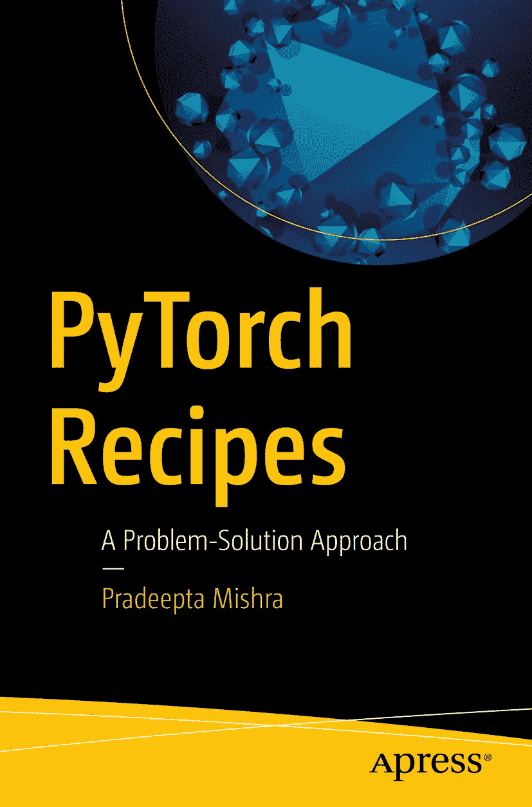

ISBN 978-1-4842-4257-5 e-ISBN 978-1-4842-4258-2 [`doi.org/10.1007/978-1-4842-4258-2`](https://doi.org/10.1007/978-1-4842-4258-2) 美国国会图书馆控制号：2018968538 © Pradeepta Mishra 2019 Apress 标准商标名称、标识和图片可能出现在本书中。我们并非在每次出现商标名称、标识或图片时都使用商标符号，而是仅以编辑方式使用这些名称、标识和图片，以维护商标所有者的利益，且无意侵犯商标权。本出版物中使用的商品名称、商标、服务标志及类似术语，即使未明确标识，也不应被视为对其是否受专有权利保护的意见表达。尽管本书中的建议和信息在出版时被认为是真实准确的，但作者、编辑及出版商均不对可能存在的任何错误或遗漏承担法律责任。出版商对本书所含内容不作任何明示或暗示的担保。本书通过 Springer Science+Business Media New York 在全球图书贸易中发行，地址：233 Spring Street, 6th Floor, New York, NY 10013。电话：1-800-SPRINGER，传真：(201) 348-4505，电子邮件：orders-ny@springer-sbm.com，或访问 www.springeronline.com。Apress Media, LLC 是一家加利福尼亚有限责任公司，其唯一成员（所有者）是 Springer Science + Business Media Finance Inc (SSBM Finance Inc)。SSBM Finance Inc 是一家特拉华州公司。

*谨以此书献给我亲爱的父母、我可爱的妻子 Prajna 以及我的女儿 Priyanshi (Aarya)。没有他们的启发、支持和鼓励，这部作品不可能完成。*