# 2. 使用 PyTorch 的概率分布

概率和随机变量是 PyTorch 这类图计算平台中不可或缺的组成部分。理解概率及其相关概念至关重要。本章涵盖概率分布及其在 PyTorch 中的实现，以及如何解释测试结果。

在概率论和统计学中，随机变量也称为*随机变量*，其结果取决于纯粹的随机现象。概率分布有多种类型，包括正态分布、二项分布、多项分布和伯努利分布。每种统计分布都有其自身的特性。

`torch.distributions` 模块包含概率分布和采样函数。每种分布类型在计算图中都有其重要性。该分布模块包含二项分布、伯努利分布、贝塔分布、类别分布、指数分布、正态分布和泊松分布。

## 方法 2-1. 张量采样

### 问题

权重初始化是训练神经网络以及任何深度学习模型（如卷积神经网络 (CNN)、深度神经网络 (DNN) 和循环神经网络 (RNN)）时的一项重要任务。如何初始化权重始终是一个关键问题。

### 解决方案

权重初始化可以通过多种方法实现，包括随机权重初始化。基于分布的权重初始化可以使用均匀分布、伯努利分布、多项分布和正态分布。接下来将解释如何使用 PyTorch 实现。

### 工作原理

要执行神经网络，需要将一组初始权重传递给反向传播层，以计算损失函数（从而可以计算准确率）。方法的选择取决于数据类型、任务以及模型所需的优化方式。接下来，我们将探讨所有类型的权重初始化方法。

如果用例需要复现相同的结果集以保持一致性，则需要设置一个手动种子。

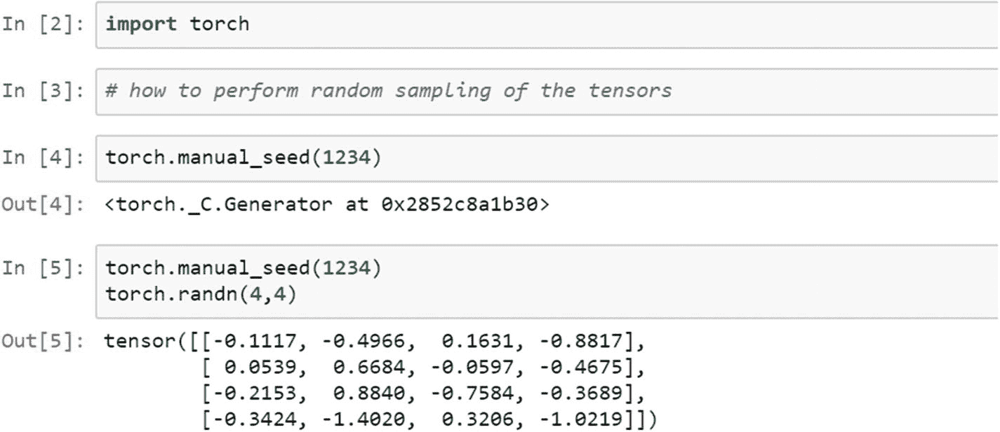

种子值可以自定义。随机数是纯粹随机生成的。随机数也可以从统计分布中生成。*连续均匀分布*的概率密度函数由以下公式定义。

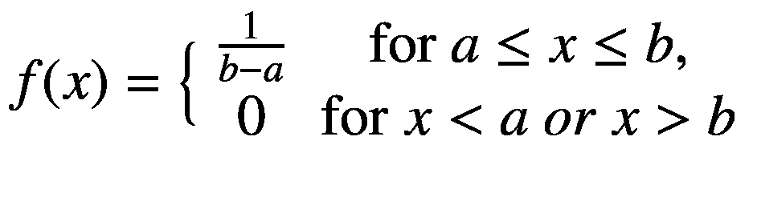

`x` 的函数有两个点，`a` 和 `b`，其中 `a` 是起点，`b` 是终点。在连续均匀分布中，每个数字被选中的概率相等。在以下示例中，起点为 0，终点为 1；在这两个数字之间，所有 16 个元素都是随机选择的。

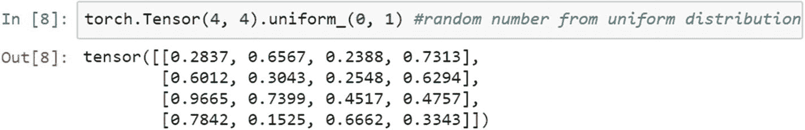

在统计学中，*伯努利分布*被视为离散概率分布，它有两个可能的结果。如果事件发生，则值为 1；如果事件未发生，则值为 0。

对于*离散概率分布*，我们计算的是概率质量函数，而不是概率密度函数。概率质量函数如下公式所示。

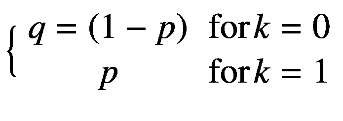

根据伯努利分布，我们通过考虑大小为 4 和 4 的均匀分布，以矩阵格式创建样本张量，如下所示。

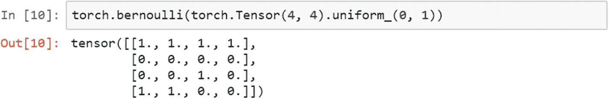

从*多项分布*生成样本随机值的过程由以下脚本定义。在多项分布中，我们可以选择有放回或无放回抽样。默认情况下，多项函数执行无放回抽样，并将结果作为张量的索引位置返回。如果需要执行有放回抽样，则需要在抽样时进行指定。

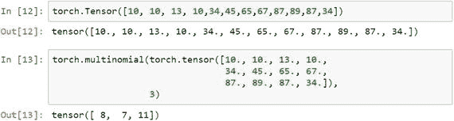

从多项分布中进行有放回抽样会返回张量的索引值。

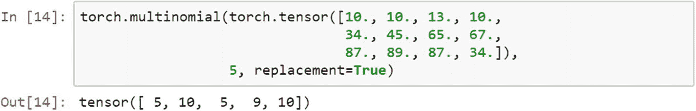

从正态分布初始化权重是一种用于拟合神经网络、深度神经网络、CNN 和 RNN 的方法。让我们来看看从正态分布生成一组随机权重的过程。

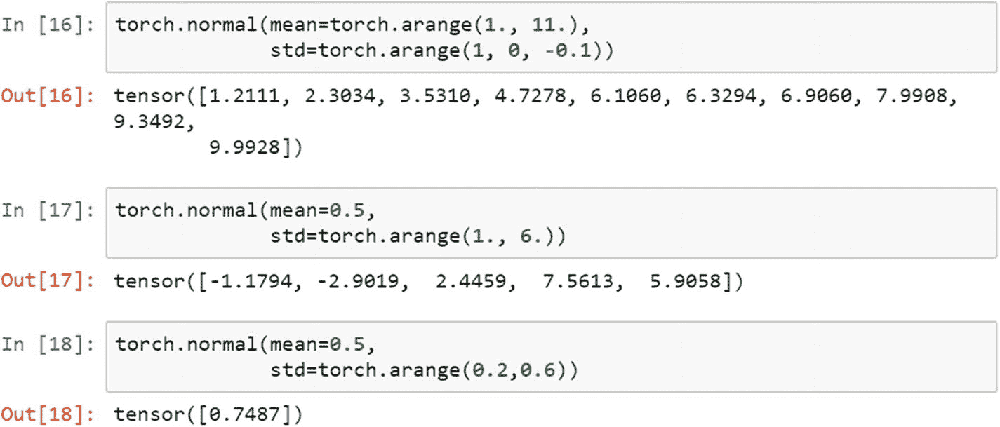

## 配方 2-2\. 变量张量

### 问题

PyTorch 中的变量是什么？它是如何定义的？PyTorch 中的随机变量是什么？

### 解决方案

在 PyTorch 中，算法被表示为计算图。变量被视为张量对象、对应梯度以及对其创建来源函数的引用的一个表示。为简单起见，梯度被视为函数的斜率。函数的斜率可以通过函数相对于函数中存在的参数的导数来计算。例如，在线性回归（`Y = W*X + alpha`）中，变量的表示形式将类似于图 2-2 所示。

基本上，PyTorch 变量是计算图中的一个节点，它存储数据和梯度。在训练神经网络模型时，每次迭代后，我们需要计算损失函数相对于模型参数（如权重和偏置）的梯度。之后，我们通常使用梯度下降算法更新权重。图 2-1 解释了在 PyTorch 框架中，线性回归方程是如何在底层通过神经网络模型部署的。

在计算图结构中，任务的排序和顺序非常重要。图 2-2 中的一维张量是 `X`、`Y`、`W` 和 `alpha`。当我们实现反向传播以更新权重来匹配 `Y` 时，箭头的方向会改变，从而可以最小化 `Y` 与预测 `Y` 之间的误差或损失函数。

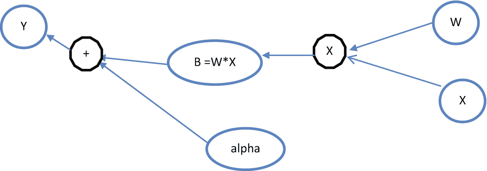

图 2-1

一个 PyTorch 实现的示例计算图

### 工作原理

以下脚本展示了一个如何使用变量创建计算图的示例。有三个围绕张量的变量对象——`x1`、`x2` 和 `x3`——它们具有从 `a` = 12 和 `b` = 23 生成的随机点。图计算仅涉及乘法和加法，并显示了包含梯度的最终结果。

在 PyTorch 中，神经网络模型中损失函数相对于权重和偏置的偏导数是使用 `Autograd` 模块实现的。变量专门设计用于在神经网络模型运行反向传播时，当模型参数发生变化时，保存变化后的值。变量类型只是张量的一个包装器。它有三个属性：`data`、`grad` 和 `function`。

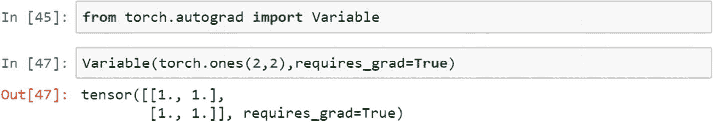

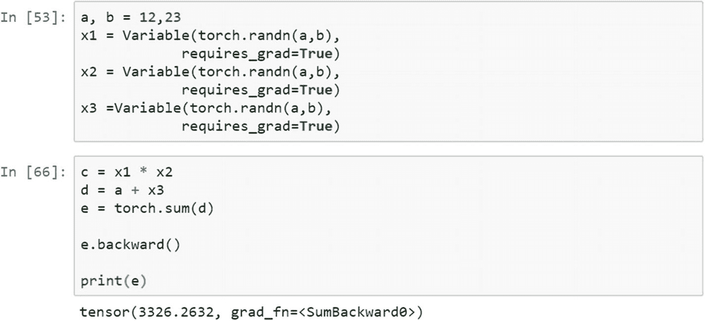

## 配方 2-3\. 基础统计

### 问题

如何从 Torch 张量计算基础统计量，例如均值、中位数、众数等？

### 解决方案

使用 PyTorch 计算基础统计量使用户能够应用概率分布和统计检验来从数据中进行推断。尽管 Torch 的功能类似于 Numpy，但 Torch 函数具有 GPU 加速功能。让我们来看看创建基础统计量的函数。

### 工作原理

对于一维张量，均值的计算很简单；然而，对于二维张量，需要传递一个额外的参数作为均值、中位数或众数的计算，并指定计算所沿的维度。

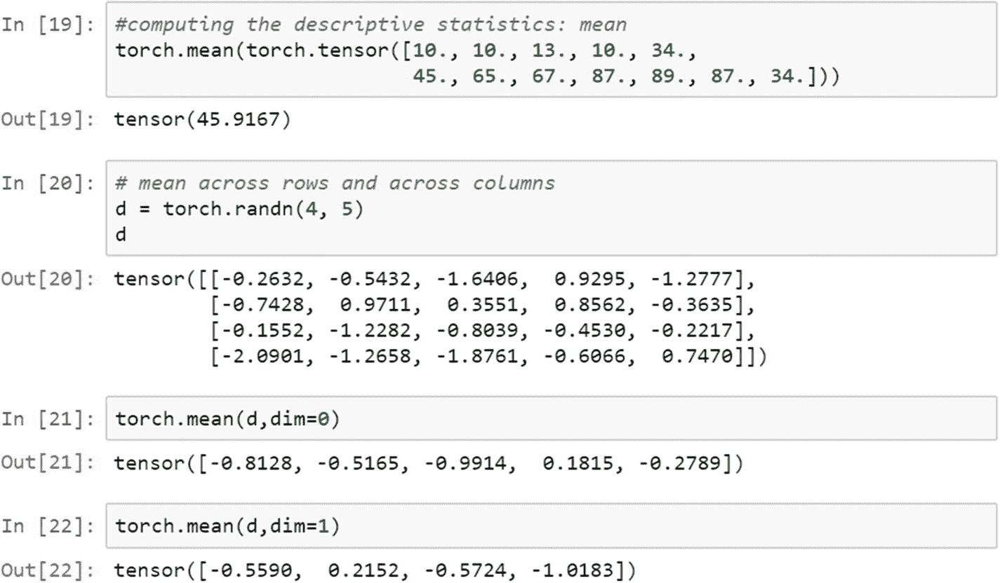

中位数、众数和标准差的计算可以以相同的方式编写。

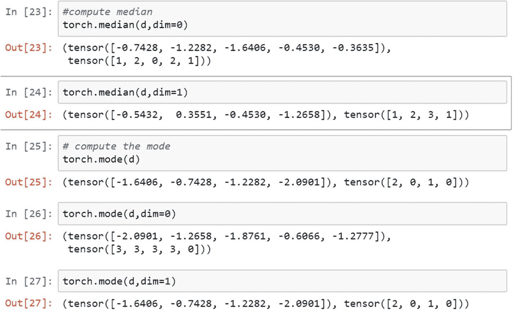

标准差显示了与集中趋势度量的偏差，这指示了数据/变量的一致性。它显示了数据中是否存在足够的波动。

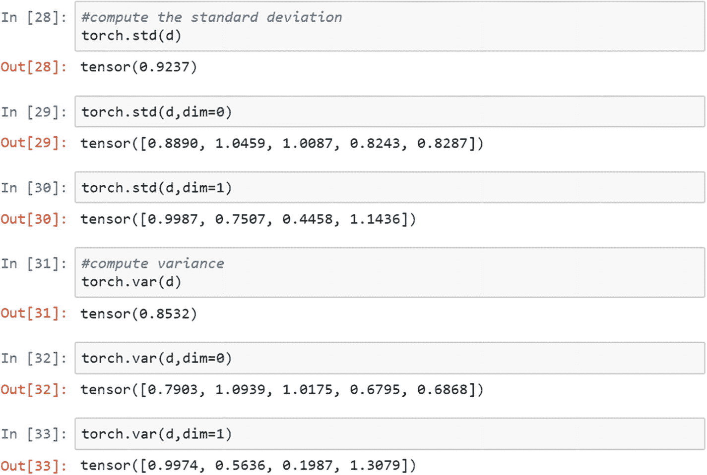

## 配方 2-4\. 梯度计算

### 问题

如何使用 PyTorch 从样本张量计算基本梯度？

### 解决方案

我们将考虑一个示例数据集，其中包含两个变量（`x` 和 `y`）。在给定初始权重的情况下，我们能否通过计算得到每次迭代后的梯度？让我们来看这个例子。

### 工作原理

`x_data` 和 `y_data` 都是列表。要计算这两个数据列表的梯度，需要计算损失函数、执行前向传播，并在循环中运行相关操作。

前向函数计算权重张量与输入张量的矩阵乘法。

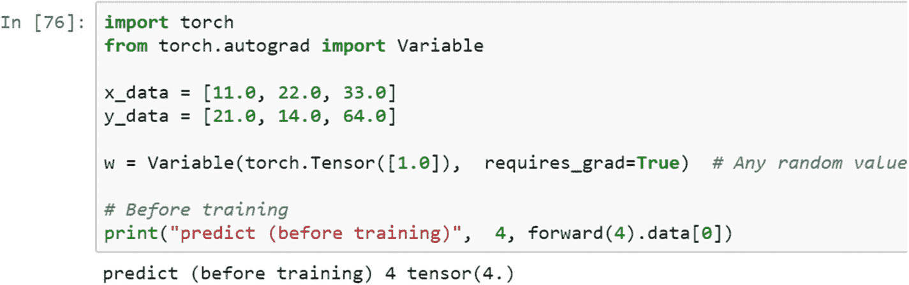

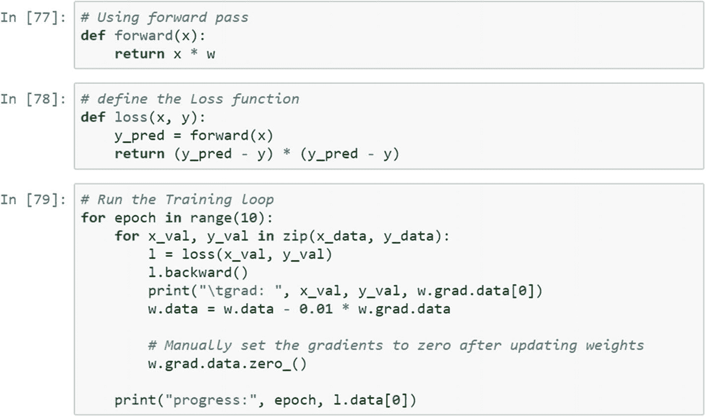

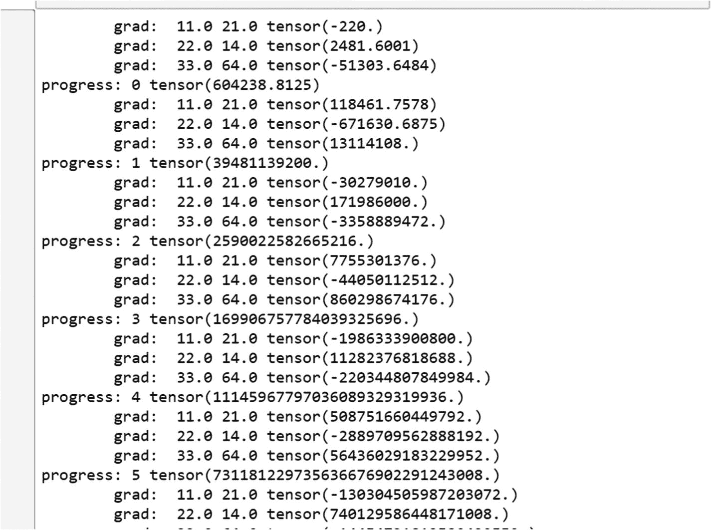

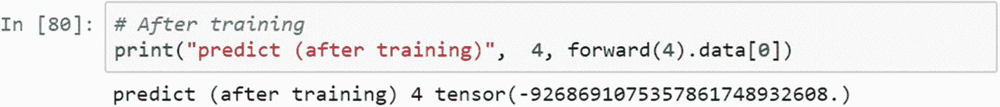

以下程序展示了如何使用张量上的变量方法从损失函数计算梯度。

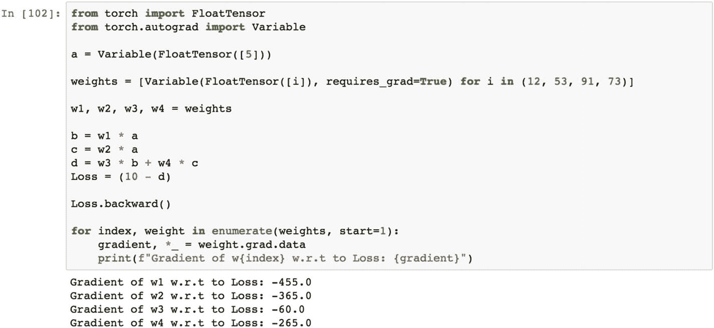

## 方法 2-5. 张量运算

### 问题

如何基于变量（例如矩阵乘法）进行计算或执行操作？

### 解决方案

张量被封装在变量中，该变量具有三个属性：`grad`、`volatile` 和 `gradient`。

### 工作原理

让我们创建一个变量并提取其属性。这是必需的，因为权重更新过程需要梯度计算。通过使用 `mm` 模块，我们可以执行矩阵乘法。

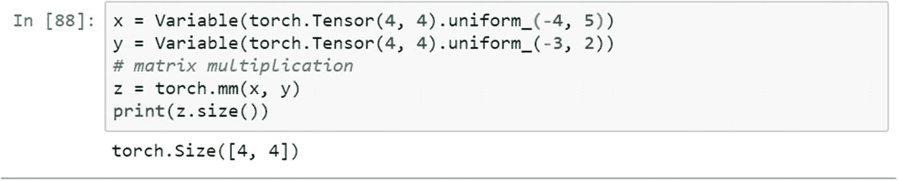

以下程序展示了变量的属性，该变量是张量的一个封装器。

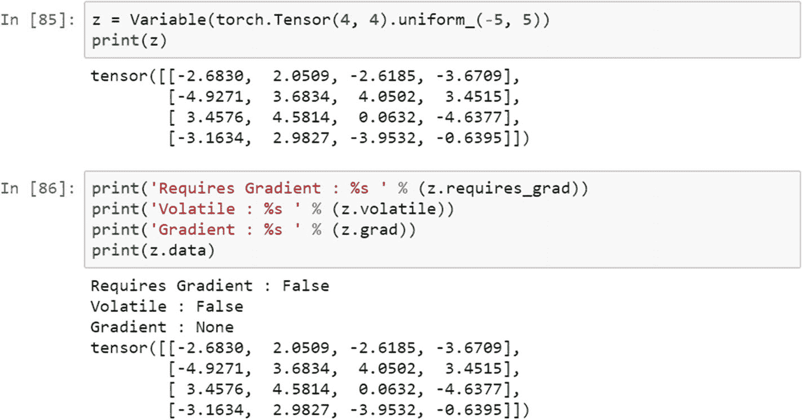

## 方法 2-6. 张量运算

### 问题

如何基于变量（例如矩阵-向量计算、矩阵-矩阵计算和向量-向量计算）进行计算或执行操作？

### 解决方案

基于矩阵的运算成功的一个必要条件是，张量的长度需要匹配或兼容，以便执行代数表达式。

### 工作原理

标量的张量定义只是一个数字。一维张量是向量，二维张量是矩阵。当扩展到 *n* 维级别时，可以泛化为仅张量。在 PyTorch 中执行代数计算时，矩阵与向量或标量的维度应兼容。

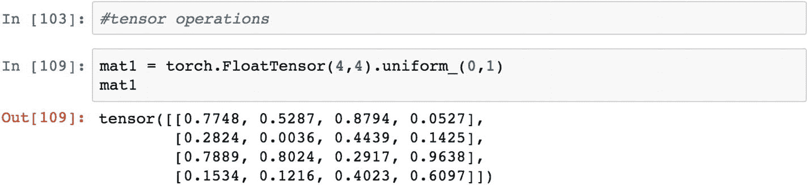

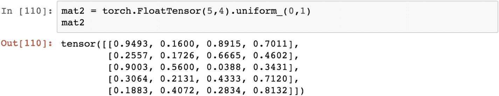

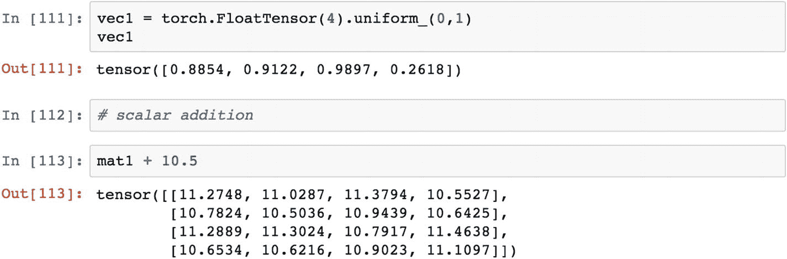

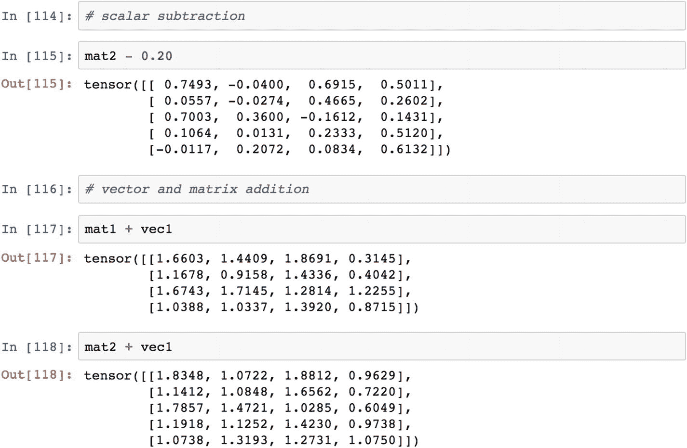

由于 `mat1` 和 `mat2` 的维度不同，它们不兼容进行矩阵加法或乘法。如果维度相同，我们可以将它们相乘。在以下脚本中，当我们对相似维度（`mat1` 与 `mat1`）进行乘法时，矩阵加法会抛出错误。我们会得到相关结果。

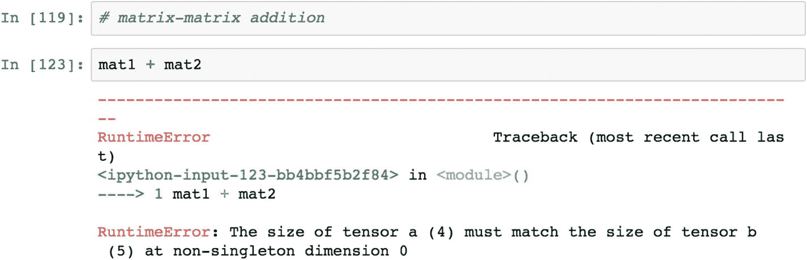

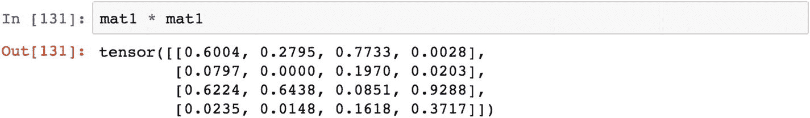

## 方法 2-7. 分布

### 问题

统计分布的知识对于使用 PyTorch 进行基于神经网络的操作中的权重归一化、权重初始化以及梯度计算至关重要。我们如何知道该使用哪些分布以及何时使用它们？

### 解决方案

每个统计分布都遵循一个预先建立的数学公式。我们将使用最常用的统计分布及其在问题场景中的参数。

### 工作原理

伯努利分布是*二项分布*的一种特殊情况，其中试验次数可以多于一次；但在伯努利分布中，实验或试验的次数保持为一次。它是一个随机变量的离散概率分布，当事件成功的概率存在时，该变量取值为 1；当事件失败的概率存在时，该变量取值为 0。一个典型的例子是抛硬币，其中 1 代表正面，0 代表反面。让我们来看一下程序。

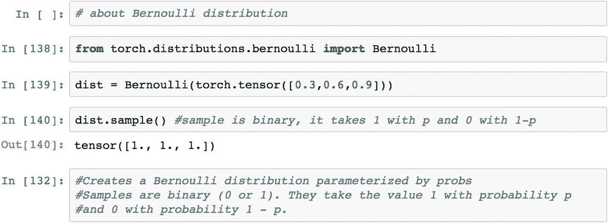

*贝塔分布* 是一族在 0 到 1 范围内定义的连续随机变量。该分布通常用于贝叶斯推断分析。

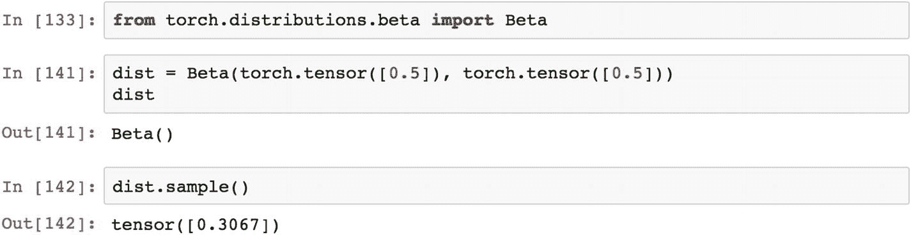

当结果具有双重性且实验可重复时，二项分布适用。它属于离散概率分布族，其中成功的概率定义为 1，失败的概率定义为 0。二项分布用于对多次试验中成功事件的数量进行建模。

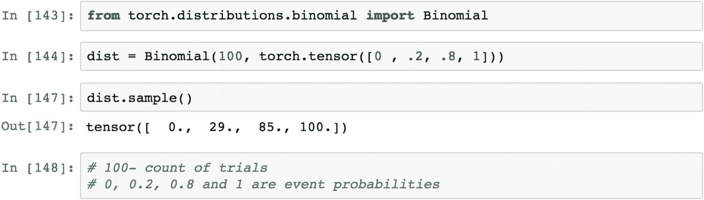

在概率论和统计学中，分类分布可以定义为广义的伯努利分布，它是一种离散概率分布，用于解释任何可能取其中一个类别的随机变量的可能结果，每个类别的概率在张量中专门指定。

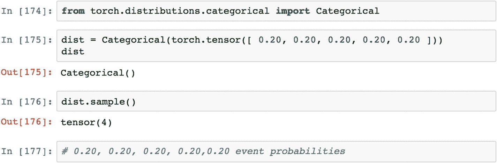

*拉普拉斯分布* 是一种连续概率分布函数，也称为*双指数分布*。拉普拉斯分布用于语音识别系统中以理解先验概率。它在贝叶斯回归中对于确定先验概率也很有用。

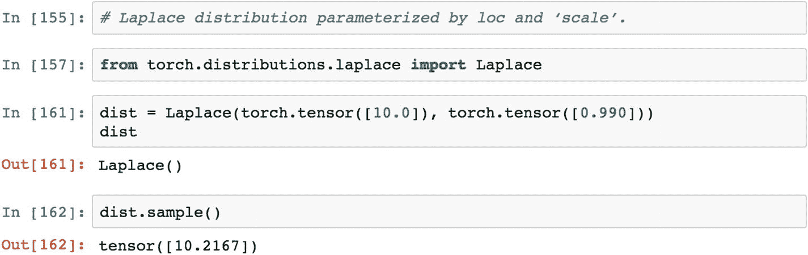

*正态分布* 由于中心极限定理的性质而非常有用。它由均值和标准差定义。如果我们知道分布的均值和标准差，就可以估计事件的概率。

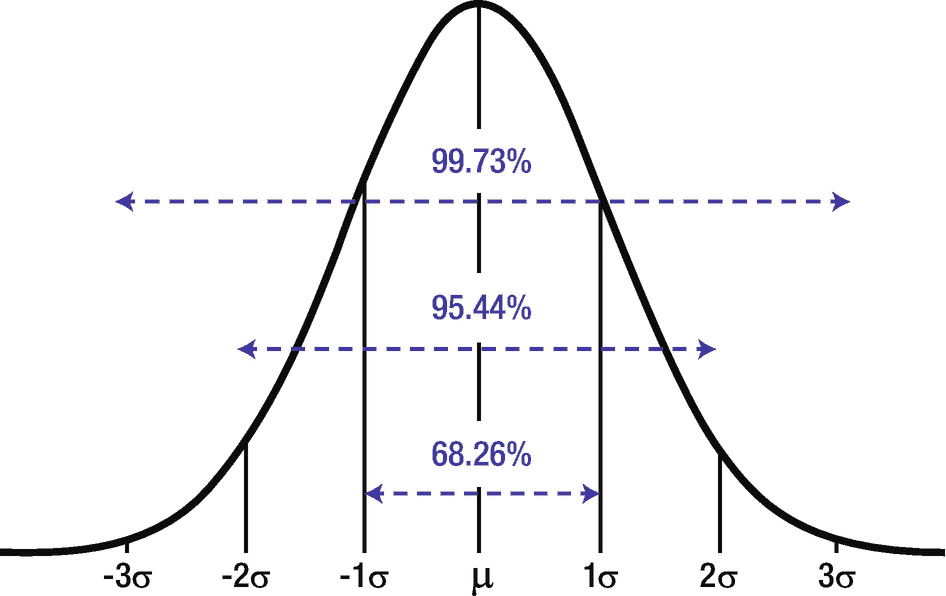

图 2-2

正态概率分布

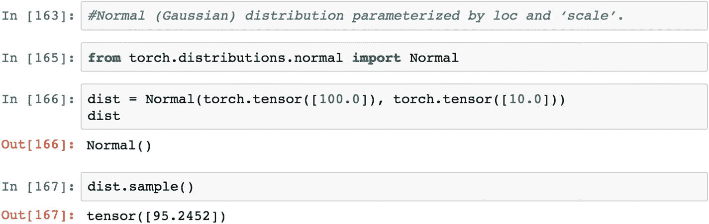

## 结论

本章讨论了抽样分布以及从分布中生成随机数。神经网络是基于张量的运算中的主要关注点。任何机器学习或深度学习模型的实现都需要进行梯度计算、更新权重、计算偏置，并持续更新偏置。

本章还讨论了 PyTorch 支持的统计分布，以及每种分布类型适用的场景。

下一章将详细讨论深度学习模型，包括卷积神经网络、循环神经网络、深度神经网络和自编码器模型。

